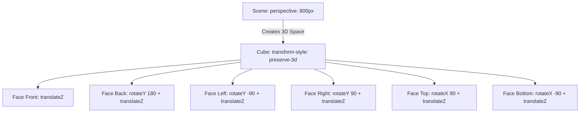

# CSS 3D Cube: Perspective, Transform-Style, and 3D Transforms

## 0. PREAMBLE: Context & Prerequisites

### 0.1 Prerequisites
Before starting this lesson, the student must understand:
* 2D Transforms (`translate`, `rotate`, `scale`)
* Absolute Positioning (and Containing Blocks)
* CSS Custom Properties (Variables)
*(Rule: Do not introduce concepts that have not been taught without explicitly managing them as prerequisites or deferring their implementation details).*

### 0.2 Learning Dependencies
* ✓ The Box Model
* ✓ Containing Blocks & Positioned Elements
* ✓ Stacking Contexts

### 0.3 Specification Reference
* **Specification:** CSS Transforms Module Level 2
* **Relevant Sections:** 3D Transforms, `perspective`, `transform-style`, `backface-visibility`

---

## 1. Mental Model & Problem

Web browsers default to a flat, 2D rendering plane. When you rotate an element in 3D space, by default, it intersects the 2D plane like a piece of paper, but any children it contains are flattened onto its surface. 

The structural problem this feature solves is **hierarchical 3D rendering**. To build a 3D object like a cube, we need a camera distance (`perspective`), an object that maintains a 3D coordinate system for its children (`transform-style: preserve-3d`), and faces moved into position using 3D translation and rotation.

* **What This Feature Does NOT Do:**
  * ❌ 1. Does not create actual 3D geometry (it uses 2D planes manipulated in a 3D projection).
  * ❌ 2. Does not automatically calculate lighting, shadows, or material depth.
  * ❌ 3. Does not affect the layout of surrounding elements (transforms do not trigger layout reflows; they happen in the composite stage).

---

## 2. Complete Language Reference & Value Grammar

### Formal Syntax Table

**`transform-style`**
* **Accepted Value Types:** `flat | preserve-3d`
* **Initial Value:** `flat`
* **Inherited:** No
* **Animatable:** No
* **Applies To:** Transformable elements
* **Computed Value:** As specified

**`perspective`**
* **Accepted Value Types:** `none | <length>`
* **Initial Value:** `none`
* **Inherited:** No
* **Animatable:** Yes
* **Applies To:** Transformable elements
* **Computed Value:** Absolute length or `none`

**`transform: translateZ()`, `rotateX()`, `rotateY()`**
* **Accepted Value Types:** `<length>` for translateZ, `<angle>` for rotateX/Y.
* **Initial Value:** `none`
* **Inherited:** No
* **Animatable:** Yes

---

## 3. Complete Feature Surface

To build a 3D scene, three distinct CSS features interact:
1. **The Scene (Camera):** `perspective: <length>` defines how far the viewer is from the Z=0 plane. Smaller values mean extreme distortion (fisheye).
2. **The Object (Volume):** `transform-style: preserve-3d` tells the browser NOT to flatten children onto the parent's 2D plane, allowing them to exist in the parent's 3D space.
3. **The Faces (Geometry):** `transform: rotate*(<angle>) translateZ(<length>)` push the planes outward to form the cube.

---

## 4. Evolution & Modern CSS

Historically, building 3D elements in CSS required heavy JavaScript or Flash. The introduction of CSS 3D transforms allowed hardware-accelerated 3D rendering directly in the browser via the GPU. While WebGL is used for true 3D models, CSS 3D is ideal for UI interactions, card flips, and simple geometric constructions like a cube.

Modern CSS handles this flawlessly, though vendor prefixes (`-webkit-`) were once required for Safari.

---

## 5. Browser Behavior, Formatting Contexts & The Cascade

* **Containing Block:** An element with `transform` or `perspective` other than `none` establishes a new containing block for all its positioned descendants (even `position: fixed`).
* **Stacking Context:** Both `transform` and `transform-style: preserve-3d` create a new stacking context. `z-index` inside a 3D context behaves differently—true Z-axis distance overrides standard DOM order stacking.
* **Rendering Stages:** Transform manipulation occurs strictly in the **Compositing** stage. This is why 3D animations are incredibly performant; they do not trigger Reflow or Repaint.

---

## 6. Browser Algorithm

1. Parse the `perspective` on the scene container and establish the vanishing point.
2. For the cube wrapper, process `transform-style: preserve-3d`. Establish a 3D rendering context.
3. For each absolute positioned face, compute the initial 2D layout.
4. Apply the `transform` matrix. Note the order: `rotateY()` changes the local coordinate system, so a subsequent `translateZ()` moves the element outward along its *newly rotated* Z-axis.
5. Send the geometry to the GPU for compositing and rasterization.

---

## 7. Invalid CSS & Error Recovery

* `perspective: 0` or negative values are invalid. The parser drops the declaration.
* `transform-style: preserve-3d` fails if the element also has `overflow: hidden`. The browser will force `transform-style: flat` to enforce the clipping boundaries.
* Order matters in `transform`: `translateZ(100px) rotateY(90deg)` is vastly different from `rotateY(90deg) translateZ(100px)`.

---

## 8. Interaction With Other CSS Features & CSSOM Runtime

* **Overflow:** Using `overflow: hidden` on a 3D container collapses the 3D space (`preserve-3d` is ignored).
* **Backface-Visibility:** Use `backface-visibility: hidden` to hide the back side of a face when it rotates away from the camera.
* **CSSOM:** Can be updated dynamically via `style.transform` to rotate the cube with mouse movements.

---

## 9. Accessibility (A11y)

* **Reduced Motion:** 3D spinning cubes can cause motion sickness. Always wrap animations in `@media (prefers-reduced-motion: reduce)`.
* **Screen Readers:** The 3D layout is purely visual. The DOM order remains unchanged, so screen readers will read the faces sequentially.
* **Contrast:** Ensure the faces maintain contrast even when rotated, as CSS does not simulate light and shadow—you must manage color contrast manually.

---

## 10. Performance, Runtime Costs & Security

* **Rendering Stage Triggered:** GPU Composite.
* **Browser Limits & Budgets:** 3D layers consume VRAM. Do not create hundreds of `preserve-3d` elements unnecessarily.
* **Security:** No direct security risks, though extreme perspectives could theoretically be used to obscure UI clickjacking traps.

---

## 11. DevTools Investigation

* **Styles Pane:** Inspect the cube container and toggle `transform-style: preserve-3d` to `flat` to see the faces instantly collapse into a 2D plane.
* **Layout & Rendering Overlays:** In Chrome DevTools, use the "Layers" panel to visualize the 3D space and inspect the distance between planes.

---

## 12. Visual Mental Models

### The Transformation Pipeline



---

## 13. Prediction Checkpoints

**Prediction:** What happens if you apply `overflow: hidden` to the element with `transform-style: preserve-3d`?
> **Explanation:** The browser will silently override `preserve-3d` and flatten the element to `flat`. The cube will break and all faces will render overlapping on a flat plane.

---

## 14. Compare Similar Features

* `transform: perspective()` vs property `perspective`: The property applies the camera to *children*, while the function applies it only to the element itself.
* 3D Transforms vs WebGL: CSS 3D is for DOM elements (buttons, images). WebGL (via `<canvas>`) is for complex 3D meshes (thousands of polygons).

---

## 15. Decision Guide

> **I want to...** $\longrightarrow$ **Use...**
* Create a card flip effect $\longrightarrow$ `transform-style: preserve-3d` + `backface-visibility: hidden`.
* Render a 3D box holding UI elements $\longrightarrow$ CSS 3D Cube technique.
* Render a complex 3D model (GLTF/OBJ) $\longrightarrow$ WebGL (Three.js).

---

## 16. Common Bugs, Edge Cases & Debugging Workflow

* **Symptom:** Faces are flickering or z-fighting.
  * **Cause:** Coplanar faces or rounding errors in the GPU.
  * **Solution:** Slightly adjust the `translateZ` by `0.1px` to force a strict depth order.
* **Symptom:** The cube is flat.
  * **Cause:** Missing `transform-style: preserve-3d` or an `overflow: hidden` property is applied.
  * **Solution:** Remove `overflow: hidden` and ensure `preserve-3d` is set on the direct parent of the 3D faces.

**Diagnostic Workflow Checklist:**
1. Is the scene establishing `perspective`?
2. Is the cube wrapper set to `transform-style: preserve-3d`?
3. Are the faces absolutely positioned in the exact center?
4. Are the transform operations ordered correctly (Rotate THEN Translate)?

---

## 17. Interactive Experiments (Throwaway Labs)

**Lab 1: The Transform Order**
Change `transform: rotateY(90deg) translateZ(100px)` to `transform: translateZ(100px) rotateY(90deg)`. Observe how the face moves forward toward the camera *first*, then spins in place, breaking the cube.

**Lab 2: The Camera Distance**
Change the `.scene` perspective from `800px` to `200px`. Observe the extreme fisheye distortion.

---

## 18. Real Project Integration

* **Target File:** `src/components/CubeWidget.css`
* **Engineering Justification:** Adding a 3D spinning cube for the loading state to showcase hardware-accelerated animations without blocking the main thread.

```css
.scene {
  width: 200px;
  height: 200px;
  perspective: 600px;
}
.cube {
  width: 100%;
  height: 100%;
  position: relative;
  transform-style: preserve-3d;
  animation: spin 5s infinite linear;
}
.cube__face {
  position: absolute;
  width: 200px;
  height: 200px;
  border: 2px solid black;
}
/* Faces */
.cube__face--front  { transform: rotateY(  0deg) translateZ(100px); }
.cube__face--right  { transform: rotateY( 90deg) translateZ(100px); }
.cube__face--back   { transform: rotateY(180deg) translateZ(100px); }
.cube__face--left   { transform: rotateY(-90deg) translateZ(100px); }
.cube__face--top    { transform: rotateX( 90deg) translateZ(100px); }
.cube__face--bottom { transform: rotateX(-90deg) translateZ(100px); }

@keyframes spin {
  100% { transform: rotateY(360deg) rotateX(360deg); }
}
```

---

## 19. Mastery Challenge

**Find & Fix the Bug:**
A developer wrote this CSS for a 3D cube:
```css
.cube {
  perspective: 1000px;
  overflow: hidden;
  transform-style: preserve-3d;
}
```
**Why does this fail?**
*Answer:* `overflow: hidden` forces the browser to flatten the element's rendering context to enforce the clipping boundaries, completely ignoring `preserve-3d`. Furthermore, `perspective` should ideally be applied to the parent of the `.cube` (the scene), not the `.cube` itself, to set the camera for the entire object rather than treating each face individually.

---

## 20. Mastery Checklist

- [x] I can explain the problem this feature solves and its mental model in my own words.
- [x] I can state at least three incorrect assumptions about what this feature does *not* do.
- [x] I know the complete formal grammar, accepted value types, default values, and inheritance behavior.
- [x] I can trace the browser's algorithm and intrinsic sizing rules for resolving this feature.
- [x] I can predict error recovery behaviors for invalid values.
- [x] I can investigate and verify this property using Browser DevTools and understand its CSSOM manipulation.
- [x] I understand all accessibility (a11y), security, and performance implications (reflow vs repaint).
- [x] I have applied this pattern cleanly to the ongoing real-world project.
