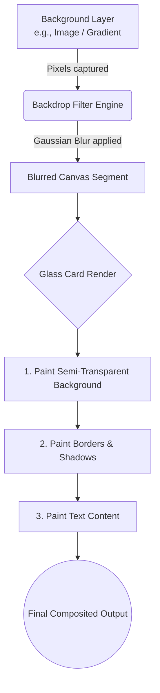

# Technique: Glassmorphism Card

## Metadata
* **Name:** Glassmorphism Card
* **Category:** Visual Effects & Layering
* **Difficulty (1-5):** 3
* **What it produces:** A translucent, frosted-glass effect that blurs the background content behind it while maintaining readability for the content inside the card.
* **Why it works:** It combines a semi-transparent background color (usually using `rgba` or `hsl` with alpha) and the `backdrop-filter: blur()` property. The background color provides a base tint, and the filter applies a gaussian blur to the composited rendering of all elements strictly behind the card.
* **Required CSS concepts:** `backdrop-filter`, semi-transparent backgrounds (`rgba()`/`hsla()`), `box-shadow`, `border`, `z-index` / stacking contexts.
* **HTML structure:** A parent container with a background image or complex layout, and a child element (the card) placed over it.
* **CSS implementation:** Setting `background: rgba(255, 255, 255, 0.1);` and `backdrop-filter: blur(10px);`.
* **Variations:** Dark mode glass (using `rgba(0, 0, 0, 0.2)`), colored glass, gradient borders, noise overlays.
* **Parameters to experiment with:** Blur radius, background opacity, border opacity, shadow intensity.
* **Common mistakes:** Using `filter: blur()` instead of `backdrop-filter: blur()`, using a fully opaque background color, forgetting the subtle border and shadow that give it depth, applying the effect on an element that has no background to blur.
* **Browser considerations:** Supported in all modern browsers, but older versions of Safari require the `-webkit-` prefix (`-webkit-backdrop-filter`). Performance can degrade if overused or applied to very large areas.
* **Acceptance criteria:** The card must appear translucent, dynamically blur whatever is behind it, have a subtle border to define its edge, and cast a soft shadow for depth.

---

## 0. PREAMBLE: Context & Prerequisites

### 0.1 Prerequisites
Before starting this lesson, the student must understand:
* Alpha transparency in color formats (`rgba`, `hsla`, hex with alpha).
* The Box Model (specifically `border` and `box-shadow`).
* Stacking Contexts and Z-axis layering (how elements overlap).

### 0.2 Learning Dependencies
* ✓ The Box Model
* ✓ Stacking Contexts
* ✓ Visual Rendering Effects

### 0.3 Specification Reference
* **Specification:** [Filter Effects Module Level 2](https://drafts.fxtf.org/filter-effects-2/)
* **Relevant Sections:** Backdrop filters, `backdrop-filter` property.

---

## 1. Mental Model & Problem

The "Glassmorphism" effect simulates a piece of frosted glass hovering over a background. Historically, to achieve a blurred background effect inside a specific container, developers had to duplicate the background image, apply a blur to the duplicate, and perfectly align it behind the container using complex JavaScript or tedious CSS math.

The `backdrop-filter` property solves this architectural problem by shifting the blur operation to the browser's rendering engine *after* the background elements are painted, but *before* the current element's background and content are painted.

* **What This Feature Does NOT Do:**
  * ❌ 1. It does NOT blur the content inside the card itself.
  * ❌ 2. It does NOT work if the card's background color is fully opaque (the alpha channel must be less than 1).
  * ❌ 3. It does NOT affect the document flow or layout geometry.

---

## 2. Complete Language Reference & Value Grammar

### `backdrop-filter`
* **Formal Syntax Table:**
  * **Accepted Value Types:** `none | <filter-function-list>`
  * **CSS Value Grammar Types Taught:** `<filter-function>` (e.g., `blur()`, `brightness()`, `contrast()`, `saturate()`).
  * **Initial Value:** `none`
  * **Inherited:** No
  * **Animatable:** Yes
  * **Applies To:** All elements. In SVG, it applies to container elements without the `<defs>` element and all graphics elements.
  * **Percentages:** N/A
  * **Computed Value:** As specified
  * **Default Browser Behavior:** No filter is applied.

### `rgba()` (Legacy) / `rgb()` (Modern with alpha)
* **Formal Syntax Table:**
  * **Accepted Value Types:** `rgb( <percentage>{3} [ / <alpha-value> ]? ) | rgb( <number>{3} [ / <alpha-value> ]? )`
  * **Initial Value:** N/A (It is a value type, not a property)
  * **Inherited:** N/A

---

## 3. Complete Feature Surface

The `backdrop-filter` property can take one or multiple filter functions separated by spaces:
```css
/* Single filter */
backdrop-filter: blur(10px);

/* Multiple filters */
backdrop-filter: blur(5px) saturate(150%) brightness(1.2);

/* Global values */
backdrop-filter: inherit;
backdrop-filter: initial;
backdrop-filter: unset;
```

---

## 4. Evolution & Modern CSS

* **Historical syntax:** Developers used `filter: blur()` on a duplicated, absolutely positioned pseudo-element holding a copy of the background image. This was highly brittle, couldn't blur dynamic content, and required knowing the exact background.
* **Modern syntax:** `backdrop-filter` natively calculates the rendering of the layers beneath.
* **Compatibility:** Early WebKit implementations required the `-webkit-` prefix. It is now standard, but feature queries (`@supports`) can provide solid fallbacks.

```css
.glass-card {
  background: rgba(255, 255, 255, 0.9); /* Fallback */
}

@supports (backdrop-filter: blur(10px)) or (-webkit-backdrop-filter: blur(10px)) {
  .glass-card {
    background: rgba(255, 255, 255, 0.1);
    -webkit-backdrop-filter: blur(10px);
    backdrop-filter: blur(10px);
  }
}
```

---

## 5. Browser Behavior, Formatting Contexts & The Cascade

* **Stacking Contexts:** Applying `backdrop-filter` (with any value other than `none`) creates a new stacking context and a new containing block for absolutely and fixed positioned descendants.
* **Rendering Stages:** This feature operates strictly in the **Paint & Compositing** stages. It is highly hardware-accelerated.
* **How it works:** The browser takes the region of the screen directly behind the element, applies the filter functions to those pixels, and then paints the element's background, borders, and content on top of that filtered result.

---

## 6. Browser Algorithm

1. Paint all elements that are lower in the stacking order than the glass card.
2. Calculate the exact rectangular bounding box of the glass card.
3. Extract the composited pixels of the lower layers that fall within this bounding box.
4. Apply the specified `backdrop-filter` (e.g., Gaussian blur) to these pixels.
5. Paint the result back onto the canvas.
6. Paint the glass card's semi-transparent `background-color` over the blurred region.
7. Paint the card's `border`, `box-shadow`, and child content.

---

## 7. Invalid CSS & Error Recovery

* **Fully Opaque Background:** If `background-color: rgb(255, 255, 255)` is used, the `backdrop-filter` is processed, but visually entirely hidden because the background completely obscures the filtered pixels underneath.
* **Using `filter` instead of `backdrop-filter`:** `filter: blur(10px)` will blur the *entire card*, including its text and borders, rendering the content unreadable.
* **Invalid Filter Functions:** If an unknown function is passed (e.g., `backdrop-filter: magic(10px)`), the declaration is dropped.

---

## 8. Interaction With Other CSS Features & CSSOM Runtime

* **Stacking Order (`z-index`):** The card must be physically above the content it intends to blur.
* **`border-radius`:** The `backdrop-filter` respects clipping boundaries. If the card has `border-radius: 20px`, the blur effect will seamlessly clip to those rounded corners.
* **CSSOM & Runtime:** Mutating `backdrop-filter` dynamically via CSS Variables (`backdrop-filter: blur(var(--glass-blur))`) is very efficient for scroll or mouse-move animations as it bypasses layout.

---

## 9. Accessibility (A11y)

* **Contrast:** The primary risk of Glassmorphism. If the background image behind the card is highly variable, text inside the card might become unreadable when positioned over light/dark boundaries.
  * *Solution:* Always ensure the `background-color` alpha channel provides enough baseline contrast, or add a subtle text-shadow.
* **Reduced Motion & Performance:** Heavy blurs can cause battery drain and lag on lower-end devices. It is best practice to reduce or remove it for users preferring reduced motion or low battery mode if possible.

---

## 10. Performance, Runtime Costs & Security

* **Rendering Stage Triggered:** Compositing.
* **Cost:** `backdrop-filter` is an expensive operation. The browser must capture a texture, run a convolution matrix (blur algorithm), and composite it.
* **Limits:** Avoid applying `backdrop-filter` to very large areas (like the entire `<body>` or massive fullscreen overlays) unless necessary, especially on mobile devices.

---

## 11. DevTools Investigation

* **Styles Pane:** Verify that both `background` (with alpha) and `backdrop-filter` are applied.
* **Rendering Drawer:** Check "Paint flashing". Notice that moving the glass card forces repaints of the composited blur texture.
* **Layers Pane:** Inspect the stacking contexts to see how the browser promotes the glass card to a compositor layer.

---

## 12. Visual Mental Models

### The Z-Axis Composition Pipeline



### The Physical Layers

```text
       [User's Eye]
            ↓
  +--------------------+
  | Text & Content     | (Fully Opaque)
  +--------------------+
  | Border & Shadow    | (Semi-transparent)
  +--------------------+
  | Background Color   | (e.g., rgba(255,255,255, 0.1))
  +--------------------+
  | Backdrop Filter    | (Blur applied to layer below)
  +====================+
  | Background Image / | (The underlying document)
  | Sibling Elements   |
  +--------------------+
```

---

## 13. Prediction Checkpoints

### Checkpoint 1
Look at this code:
```css
.card {
  background-color: #ffffff;
  backdrop-filter: blur(20px);
}
```
**Prediction:** Will you see the blurred background behind this card?
> **Answer:** No. Hex code `#ffffff` is 100% opaque white. The browser calculates the blur, but then paints a solid white box over it. The alpha channel must be lowered (e.g., `#ffffff33` or `rgba(255, 255, 255, 0.2)`).

---

## 14. Compare Similar Features

* **`backdrop-filter` vs `filter`:**
  * `filter: blur()` blurs the element itself AND its children (text becomes unreadable).
  * `backdrop-filter: blur()` blurs ONLY the pixels structurally behind the element.

---

## 15. Decision Guide

> **I want to...** $\longrightarrow$ **Use...**
* Create a frosted glass UI panel over a complex background $\longrightarrow$ `backdrop-filter: blur(10px)` + `background: rgba(255,255,255,0.1)`.
* Blur a profile picture slightly to obscure identity $\longrightarrow$ `filter: blur(5px)`.
* Support IE11 or ancient browsers with a glass-like UI $\longrightarrow$ Use a semi-transparent `background-color` without the filter, or feature query (`@supports`).

---

## 16. Common Bugs, Edge Cases & Debugging Workflow

### Common Bugs Table

| Symptom | Cause | Solution |
| :--- | :--- | :--- |
| Effect doesn't show up at all | Background color is completely opaque (`alpha = 1`). | Change background to use `rgba()` or `hsla()` with an alpha value < 1. |
| Text inside the card is blurry | Used `filter` instead of `backdrop-filter`. | Change the property name to `backdrop-filter`. |
| Effect works in Chrome but not older Safari | Missing vendor prefix. | Add `-webkit-backdrop-filter` before the standard property. |
| The blur bleeds out of rounded corners | The element lacks `border-radius` or clipping. | Ensure `border-radius` is applied directly to the element with the `backdrop-filter`. |

### Diagnostic Workflow (Glassmorphism Specifics):
1. **Is there actually content behind the card to blur?** (If it's on a solid white background, blurring white yields white).
2. **Is the background semi-transparent?**
3. **Is the syntax valid?** (`blur(10px)` not `blur(10)`)

---

## 17. Interactive Experiments (Throwaway Labs)

### HTML
```html
<div class="background-scene">
  <div class="glass-card">
    <h2>Glassmorphism</h2>
    <p>Look at the background through me.</p>
  </div>
</div>
```

### CSS
```css
.background-scene {
  width: 100%;
  height: 400px;
  background: linear-gradient(45deg, #ff6b6b, #4ecdc4, #45b7d1);
  display: flex;
  align-items: center;
  justify-content: center;
}

.glass-card {
  width: 300px;
  padding: 30px;
  border-radius: 16px;
  
  /* 1. The Transparency */
  background: rgba(255, 255, 255, 0.15);
  
  /* 2. The Blur Engine */
  backdrop-filter: blur(12px);
  -webkit-backdrop-filter: blur(12px);
  
  /* 3. The Edges & Depth */
  border: 1px solid rgba(255, 255, 255, 0.3);
  box-shadow: 0 8px 32px rgba(0, 0, 0, 0.1);
  
  color: white;
  text-shadow: 0 1px 2px rgba(0,0,0,0.2);
}
```
**Experiment:**
1. Change `blur(12px)` to `blur(50px)`. Watch the background lose all detail.
2. Change the background alpha from `0.15` to `0.8`. Notice how the glass becomes "milky".
3. Remove the `border`. Notice how the card loses its physical edge definition.

---

## 18. Real Project Integration

* **Target File:** `src/styles/components/_modal.css`
* **Exact Location:** The modal overlay backdrop.
* **Code Modification:**
```diff
 .modal-backdrop {
   position: fixed;
   inset: 0;
-  background-color: rgba(0, 0, 0, 0.8);
+  background-color: rgba(0, 0, 0, 0.4);
+  backdrop-filter: blur(8px);
+  -webkit-backdrop-filter: blur(8px);
   z-index: 100;
 }
```
* **Engineering Justification:** Switching from a heavy, solid dark overlay to a blurred glass overlay maintains user context of the underlying page while effectively drawing focus to the modal dialog.

---

## 19. Mastery Challenge

**Find & Fix the Bug:**
A junior developer attempted to build a glass card but complains that everything, including the text inside, is blurry, and it doesn't look like glass.

```css
.profile-card {
  background: rgb(255, 255, 255);
  opacity: 0.5;
  filter: blur(10px);
  border-radius: 10px;
}
```

**Architectural Fix & Justification:**
1. Remove `opacity: 0.5`. This fades the entire element (content included).
2. Change `background: rgb(255, 255, 255)` to `background: rgba(255, 255, 255, 0.2)` to make *only* the background semi-transparent.
3. Change `filter: blur(10px)` to `backdrop-filter: blur(10px)` to blur the layers *behind* the element, not the element itself.

---

## 20. Mastery Checklist

- [ ] I can explain the problem this feature solves and its mental model in my own words.
- [ ] I can state at least three incorrect assumptions about what this feature does *not* do.
- [ ] I know the complete formal grammar, accepted value types, default values, and inheritance behavior.
- [ ] I can trace the browser's algorithm and intrinsic sizing rules for resolving this feature.
- [ ] I can predict error recovery behaviors for invalid values.
- [ ] I can investigate and verify this property using Browser DevTools and understand its CSSOM manipulation.
- [ ] I understand all accessibility (a11y), security, and performance implications (reflow vs repaint).
- [ ] I have applied this pattern cleanly to the ongoing real-world project.
