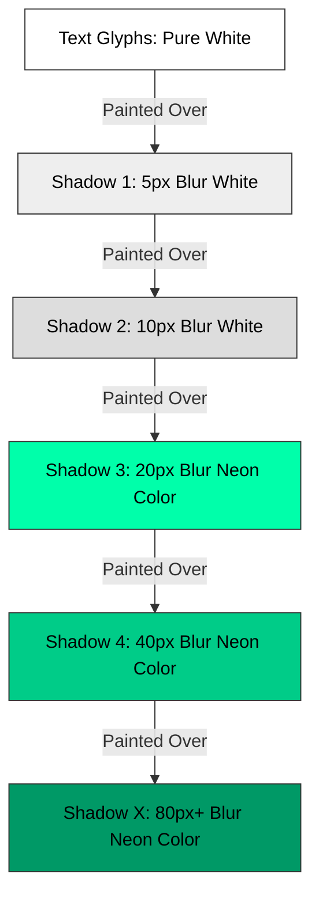

# Neon Text Glow

## HTML structure
```html
<h1 class="neon-text">NEON</h1>
```

## CSS implementation
```css
.neon-text {
  font-family: 'Vibur', sans-serif; /* Best with cursive or rounded sans */
  color: #fff; /* Bright core */
  text-shadow:
    0 0 5px #fff,
    0 0 10px #fff,
    0 0 20px #0fa,
    0 0 40px #0fa,
    0 0 80px #0fa,
    0 0 90px #0fa,
    0 0 100px #0fa,
    0 0 150px #0fa;
}
```

## Variations
- **Pulsing/Flickering Neon**: Using `@keyframes` to animate the `opacity` or the `text-shadow` values themselves to simulate faulty electricity.
- **Multi-color Neon**: Using different colors for different shadow layers to create a dual-tone glow.

## Parameters to experiment with
- Blur radius spread of the `text-shadow` layers.
- Base text `color` (try an off-white tint instead of pure `#fff`).
- Spread color shifts.

## Common mistakes
- **Too few shadow layers:** Using only one or two `text-shadow` declarations results in a flat blur rather than a radiant glow.
- **Wrong base text color:** Making the `color` property the same as the neon color instead of a bright white/core color. Neon tubes have a white-hot core.
- **Ignoring contrast:** Placing the neon effect on a light background. It only works on very dark or black backgrounds.

## Browser considerations
- Rendering many heavily blurred `text-shadow` layers can be performance-intensive, particularly on lower-end mobile devices or when animated continuously.
- Some legacy browsers may have limits on the number of stacked shadows, though modern browsers handle this well.

## Acceptance criteria
- The text must have a solid, bright core.
- The glow must extend smoothly outward without distinct banding.
- The effect must be visible and legible against a dark background.

---

## 0. PREAMBLE: Context & Prerequisites

### 0.1 Prerequisites
Before starting this lesson, the student must understand:
* `text-shadow` syntax and layer rendering order.
* RGB / HEX / HSL color definitions and opacity.
* Basic `@keyframes` animations (if implementing the flicker variation).

### 0.2 Learning Dependencies
* ✓ The Box Model (specifically how text-shadow does NOT affect box layout dimensions).
* ✓ Stacking Contexts (paint order of text-shadows).

### 0.3 Specification Reference
* **Specification:** CSS Text Decoration Module Level 3 / CSS Backgrounds and Borders Module Level 3
* **Relevant Sections:** Text Shadows (`text-shadow`)

---

## 1. Mental Model & Problem
Neon lights in the physical world consist of a glass tube filled with glowing gas. The center of the tube appears almost pure white because of the intense light concentration, while the colored light dissipates smoothly into the surrounding darkness.

To recreate this in CSS, a single `text-shadow` is insufficient because light doesn't drop off linearly. We must layer multiple shadows, starting with tight, white/bright halos and expanding outward to larger, colored blurs.

**What This Feature Does NOT Do:**
* ❌ 1. It does not affect the layout or surrounding elements; `text-shadow` does not trigger reflows or take up physical box-model space.
* ❌ 2. It does not provide an automatic "spread" value like `box-shadow` does. (Though Level 4 of the spec introduces it, broad support is lacking).
* ❌ 3. It does not look good on light backgrounds.

---

## 2. Complete Language Reference & Value Grammar
**`text-shadow`**
* **Accepted Value Types:** `<color>? && <length>{2,3}` (color, x-offset, y-offset, optional blur-radius)
* **Initial Value:** `none`
* **Inherited:** Yes
* **Animatable:** Yes, as a shadow list.
* **Applies To:** All elements.
* **Percentages:** Not supported.

---

## 3. Complete Feature Surface
Stacking shadows is done via a comma-separated list.
`text-shadow: [layer 1], [layer 2], [layer 3];`
The first layer is painted on top (closest to the text), and subsequent layers are painted behind it.

---

## 4. Evolution & Modern CSS
Historically, developers used images for neon effects. With robust `text-shadow` support, we can now use text. However, `text-shadow` lacks a `<spread-radius>` parameter (unlike `box-shadow`), which means we can only control the blur, not the inflation of the shadow shape.

---

## 5. Browser Behavior, Formatting Contexts & The Cascade
* **Rendering Stages:** `text-shadow` triggers only Paint operations. However, heavy blurs (large radius) are computationally expensive. Animating them rapidly can cause high CPU/GPU usage if not optimized.
* **Stacking Order:** Text shadows are painted in the background phase of the inline box, but above the background itself. The first shadow in the list is painted on top of the others.

---

## 6. Browser Algorithm
1. Parse the comma-separated `text-shadow` list.
2. For each shadow (from last to first, so the first is on top):
3. Offset the text mask by X and Y coordinates.
4. Apply a Gaussian blur based on the blur radius.
5. Fill the blurred mask with the specified color.
6. Composite underneath the actual text glyphs.

---

## 7. Invalid CSS & Error Recovery
* Providing four lengths to `text-shadow` (trying to use a spread radius) will invalidate the rule in browsers that don't support Level 4 text-shadows, dropping the entire stack.
* Missing commas between layers will break the parsing.

---

## 8. Interaction With Other CSS Features & CSSOM Runtime
* **Inheritance:** `text-shadow` inherits, so applying it to a container will apply it to all text inside, which can compound performance issues.
* **`filter: drop-shadow()`:** You could theoretically use CSS filters, but `text-shadow` gives finer control over typography.

---

## 9. Accessibility (A11y)
* **Contrast:** The bright core against a dark background usually satisfies contrast, but heavy colored blurs can reduce legibility if the core isn't bright enough.
* **Reduced Motion:** If using an animated flicker, wrap it in `@media (prefers-reduced-motion: reduce)`.
* **High Contrast Mode:** Box and text shadows are often stripped out by OS High Contrast Modes. Ensure the base text color contrasts heavily with the background without relying on the shadow.

---

## 10. Performance, Runtime Costs & Security
* **Expensive Blurs:** A 150px blur radius across 5 layers on large text forces the browser to calculate significant gaussian math on every frame if animated.
* **Optimization:** To animate neon without reflowing/repainting the heavy shadows, it is often better to apply the shadow to a pseudo-element (`::after`) or duplicate layer, and animate its `opacity` instead of animating the `text-shadow` property itself.

---

## 11. DevTools Investigation
1. Inspect the `.neon-text` element.
2. In the Styles pane, toggle individual layers of the `text-shadow` property on and off to see how each contributes to the "core" vs "halo".
3. Use the Performance tab to record while animating the text-shadow. Notice the massive "Paint" blocks.

---

## 12. Visual Mental Models



---

## 13. Prediction Checkpoints
**Snippet:**
```css
h1 {
  color: #ff00ff;
  text-shadow: 0 0 10px #ff00ff, 0 0 20px #ff00ff;
}
```
**Prediction:** What looks wrong with this neon effect compared to the physical world?
**Explanation:** The text core is pink. Real neon tubes are filled with intense light, meaning the core should be white or very light pink, with the pure pink colors residing in the shadow layers.

---

## 14. Compare Similar Features
* **`text-shadow` vs `filter: drop-shadow()`:** `text-shadow` applies specifically to text and supports stacking multiple independent shadows cleanly. `drop-shadow()` filters the entire element box, which is less ideal for text layering.

---

## 15. Decision Guide
> **I want to...** $\longrightarrow$ **Use...**
* Create a glowing text effect $\longrightarrow$ Multiple layered `text-shadow` values with expanding blur radii.
* Make the text look like a physical tube $\longrightarrow$ A base `color: #fff` combined with colored shadows.
* Make the glow animate efficiently $\longrightarrow$ Animate `opacity` on a duplicated pseudo-element containing the shadows.

---

## 16. Common Bugs, Edge Cases & Debugging Workflow
* **Bug:** Shadow cuts off abruptly.
* **Cause:** The element's bounding box or an ancestor's `overflow: hidden` is clipping the text-shadow. `text-shadow` does not expand the scrollable overflow area in all browsers.

---

## 17. Interactive Experiments (Throwaway Labs)
1. Delete the first two (smallest blur) layers of the shadow. Observe how the "hot core" disappears.
2. Change the X and Y offsets of the largest blur layers to `10px 10px`. Observe how the light appears to cast onto a surface behind the text.

---

## 18. Real Project Integration
* **Target File:** `src/components/Hero.css` (Example)
* **Engineering Justification:** Adds a high-impact visual aesthetic for cyberpunk or nightlife-themed designs without requiring heavy image assets.

---

## 19. Mastery Challenge
**Find & Fix the Bug:**
```css
.neon {
  color: #fff;
  text-shadow: 
    0 0 50px #0fa,
    0 0 10px #0fa;
}
```
**Fix:** The stacking order is inverted for a realistic effect. The 50px blur is declared first, meaning it paints ON TOP of the 10px blur. To look correct, the tight 10px blur must be painted on top, so it must be declared first in the comma-separated list.

---

## 20. Mastery Checklist
- [ ] I can explain the problem this feature solves and its mental model in my own words.
- [ ] I can state at least three incorrect assumptions about what this feature does *not* do.
- [ ] I know the complete formal grammar, accepted value types, default values, and inheritance behavior.
- [ ] I can trace the browser's algorithm and intrinsic sizing rules for resolving this feature.
- [ ] I can predict error recovery behaviors for invalid values.
- [ ] I can investigate and verify this property using Browser DevTools and understand its CSSOM manipulation.
- [ ] I understand all accessibility (a11y), security, and performance implications (reflow vs repaint).
- [ ] I have applied this pattern cleanly to the ongoing real-world project.
