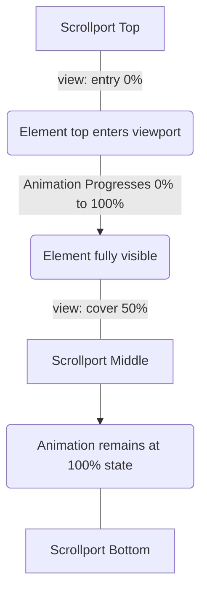

# Scroll-Driven Reveal

## Technique Metadata
* **Name:** Scroll-Driven Reveal
* **Category:** Interactions & Motion
* **Difficulty:** 4 / 5
* **What it produces:** Elements that smoothly animate (e.g., fade in, slide up) precisely as they scroll into the viewport, with the animation tied directly to the user's scroll offset rather than a timer.
* **Why it works:** Modern CSS allows binding standard `@keyframes` directly to the scroll position of a scrollable container or an element's intersection with the viewport via the `animation-timeline` property and the `view()` function.
* **Required CSS concepts:** `animation-timeline`, `view()`, `animation-range`, `@keyframes`.
* **HTML structure:** A scrollable document or container with elements (`.reveal-item`) inside that animate as they enter the scrollport.
* **CSS implementation:** Using `animation`, `animation-timeline: view()`, and `animation-range` to sync the animation progress with the scroll position.
* **Variations:** Fade-in, slide-up, scale-up, and image parallax effects.
* **Parameters to experiment with:** `view(block)` vs `view(inline)`, `animation-range` start and end keywords (`entry`, `exit`, `cover`, `contain`).
* **Common mistakes:** Forgetting `both` fill mode (elements jump back or disappear), failing to provide a fallback for unsupported browsers, or using a container that isn't actually scrolling.
* **Browser considerations:** Supported in Chromium 115+. Safari and Firefox require feature flags or polyfills as of early 2024. A `@supports` query fallback is critical.
* **Acceptance criteria:** Element animates smoothly based on scroll position; pauses when scrolling stops; reverses perfectly when scrolling back up; degrades gracefully in unsupported browsers.

---

## 0. PREAMBLE: Context & Prerequisites

### 0.1 Prerequisites
Before starting this lesson, the student must understand:
* Standard CSS `@keyframes` and the `animation` shorthand (duration, timing functions, fill modes).
* Viewport units (`vh`, `vw`) and standard scrolling mechanics (`overflow-y: scroll`).

### 0.2 Learning Dependencies
* ✓ The Box Model
* ✓ Formatting Contexts & Overflow
* ✓ Keyframe Animation Internals

### 0.3 Specification Reference
* **Specification:** [Scroll-driven Animations Level 1](https://drafts.csswg.org/scroll-animations-1/)
* **Relevant Sections:** Scroll Timelines, View Timelines, `animation-timeline`, `animation-range`.

---

## 1. Mental Model & Problem

* **The Problem:** Traditionally, creating "scroll reveals" (elements fading in as you scroll down) required complex JavaScript. You had to attach event listeners to the `scroll` event (which causes performance issues if not debounced/throttled) or use `IntersectionObserver` to trigger a time-based CSS class toggle. The animation was time-based, meaning once triggered, it played out regardless of whether the user kept scrolling, stopped, or reversed direction.
* **The Solution:** The CSS Working Group introduced **Scroll-Driven Animations**. Instead of the animation progressing based on *time* (e.g., 2 seconds), the animation progresses based on *scroll distance*.
* **What This Feature Does NOT Do:**
  * ❌ 1. It does not create the scrollbar or manage layout overflow; it only reacts to an existing scroll container.
  * ❌ 2. It does not polyfill itself; if the browser doesn't support it, the properties are ignored.
  * ❌ 3. It does not replace standard time-based animations for things like loading spinners or hover effects.

---

## 2. Complete Language Reference & Value Grammar

* **Formal Syntax Table for `animation-timeline`:**
  * **Accepted Value Types & Keywords:** `auto` | `none` | `<timeline-name>` | `scroll()` | `view()`
  * **CSS Value Grammar Types Taught:** Functional notation (`view()`).
  * **Initial Value:** `auto` (document time).
  * **Inherited:** No.
  * **Animatable:** No.
  * **Applies To:** All elements.

* **Formal Syntax Table for `animation-range` (Shorthand):**
  * **Accepted Value Types & Keywords:** `normal` | `<timeline-range-name> <length-percentage>?` (Start and End values).
  * **Keywords:** `cover`, `contain`, `entry`, `exit`, `entry-crossing`, `exit-crossing`.
  * **Initial Value:** `normal`.

---

## 3. Complete Feature Surface

* **`scroll()` function:** Links the animation to the absolute scroll position of a scroll container.
  * Syntax: `scroll([<scroller> || <axis>])`
  * Examples: `scroll(nearest block)`, `scroll(root inline)`.
* **`view()` function:** Links the animation to the element's *intersection* with its scrollport (like an IntersectionObserver).
  * Syntax: `view([<axis> || <view-timeline-inset>])`
  * Examples: `view(block)`, `view(inline 20px)`.
* **`animation-range`:** Determines *when* the animation starts and ends relative to the timeline.
  * `animation-range: entry 0% cover 50%;` (Starts as it enters, finishes when it covers 50% of the viewport).

---

## 4. Evolution & Modern CSS

* **Historical syntax:** Using JavaScript `window.addEventListener('scroll')` to check `element.getBoundingClientRect().top` and updating inline styles, or using `IntersectionObserver` to add an `.is-visible` class.
* **Modern syntax:** `animation-timeline: view()`. Entirely declarative, runs off the main thread (compositor-driven), and provides perfectly smooth bi-directional scrubbing.
* **Browser Compatibility:** This is a cutting-edge feature. Use `@supports (animation-timeline: view())` to apply it safely.

---

## 5. Browser Behavior, Formatting Contexts & The Cascade

* **Rendering Stages:** Because opacity and transform are used in the `@keyframes`, and the timeline is tied to scroll, the browser can offload this entirely to the **compositor thread**. This means it runs at 60-120fps independently of main-thread JavaScript execution.
* **Formatting Context:** The element must be inside a container that establishes a scroll container (`overflow: auto|scroll`) or the root document viewport.
* **Cascade Resolution:** If an element has both a time-based duration (e.g., `3s`) and `animation-timeline: view()`, the `animation-timeline` completely overrides the time duration. The `3s` is ignored.

---

## 6. Browser Algorithm

1. Parse declaration and detect `animation-timeline: view()`.
2. Locate the nearest ancestor scroll container (or the viewport).
3. Calculate the intersection boundaries of the element relative to the scrollport.
4. Determine the start and end pixel offsets based on `animation-range`.
5. Map the scroll offset between these two points to the 0% - 100% progress of the linked `@keyframes`.
6. As the user scrolls, update the animation progress and composite the new opacity/transform to the screen.

---

## 7. Invalid CSS & Error Recovery

* **Invalid Timeline:** If `animation-timeline: foo()` is used without defining `@scroll-timeline foo`, the timeline is invalid, and the animation defaults to time-based `auto` (or doesn't run if no duration is set).
* **Missing Fill Mode:** If `animation-fill-mode: both` is forgotten, the element will immediately snap to its initial un-animated state before entering the viewport, and snap back after leaving.

---

## 8. Interaction With Other CSS Features & CSSOM Runtime

* **Transforms & Opacity:** Best paired with `opacity` and `transform` for hardware-accelerated animations.
* **CSS Custom Properties:** You can animate variables inside the `@keyframes` to drive complex scroll-based color shifts or layout changes.
* **CSSOM:** Can be manipulated via `element.style.animationTimeline`.

---

## 9. Accessibility (A11y)

* **Reduced Motion:** Scroll-linked animations can cause motion sickness. You **MUST** respect `@media (prefers-reduced-motion)`.
  ```css
  @media (prefers-reduced-motion: no-preference) {
    .reveal {
      animation: fade-in linear both;
      animation-timeline: view();
    }
  }
  ```
* **Focus & Readability:** Ensure elements are not `visibility: hidden` or `display: none` before they scroll into view, as screen readers might skip them. `opacity: 0` is generally safer but should still be managed carefully.

---

## 10. Performance, Runtime Costs & Security

* **Rendering Stage Triggered:** GPU Composite (if animating opacity/transform).
* **Browser Budgets:** Highly performant. Far cheaper than JavaScript `scroll` listeners because it avoids Main Thread blocking and Layout thrashing.

---

## 11. DevTools Investigation

* **Animations Pane:** Chromium DevTools has an Animations panel that can scrub through timeline-based animations.
* **Styles Pane:** Look for the little clock icon next to the `animation` property to tweak timing.
* **Rendering Drawer:** Turn on "Paint flashing" to ensure the browser isn't repainting the layout on every scroll tick.

---

## 12. Visual Mental Models



**Range Concept:**
```text
[Viewport Top]
      |
      | <-- entry 100% (Element is fully inside)
      |
   [Element] <-- entry 0% (Element's top edge hits bottom of viewport)
      |
[Viewport Bottom]
```

---

## 13. Prediction Checkpoints

**Prediction:** What happens if you define `animation-duration: 5s` along with `animation-timeline: view()`?
**Answer:** The browser ignores the `5s` duration. The timeline takes over entirely, and the animation's "duration" is strictly equal to the scroll distance defined by the `view()` intersection.

---

## 14. Compare Similar Features

* **`scroll()` vs `view()`:**
  * `scroll()` maps progress to the **entire scrollbar track** (0% at the very top of the page, 100% at the very bottom). Good for reading progress bars.
  * `view()` maps progress strictly to the **element's intersection** with the viewport. Good for reveal effects.

---

## 15. Decision Guide

> **I want to...** $\longrightarrow$ **Use...**
* Create a reading progress bar at the top of the screen $\longrightarrow$ `animation-timeline: scroll(nearest block);`
* Fade an image in as I scroll down to it $\longrightarrow$ `animation-timeline: view(); animation-range: entry;`
* Pin an element horizontally as the user scrolls vertically $\longrightarrow$ JavaScript or complex `position: sticky`. (Scroll timelines animate properties, they don't alter normal document flow).

---

## 16. Common Bugs, Edge Cases & Debugging Workflow

* **Symptom:** Element vanishes instantly before entering the screen, or jumps when fully in view.
* **Cause:** Missing `animation-fill-mode: both`. The browser defaults to `none`, meaning outside the timeline range, the animation is not applied.
* **Fix:** Add `both` so the element holds its 0% keyframe state before entry, and holds its 100% keyframe state after finishing.

* **Diagnostic Workflow:**
  1. Is the browser compatible? Check `@supports`.
  2. Is there a scrolling container ancestor?
  3. Is `both` fill mode applied?
  4. Are you using `opacity` and `transform` for performance?

---

## 17. Interactive Experiments (Throwaway Labs)

```html
<div class="scroller">
  <div class="spacer">Scroll Down</div>
  <div class="reveal-box">I Reveal!</div>
  <div class="spacer">Keep Scrolling</div>
</div>

<style>
.scroller { height: 100vh; overflow-y: scroll; }
.spacer { height: 120vh; display: grid; place-items: center; }

.reveal-box {
  width: 200px; height: 200px; background: royalblue;
  color: white; display: grid; place-items: center;
  
  /* The core technique */
  animation: slide-fade linear both;
  animation-timeline: view();
  animation-range: entry 10% cover 30%;
}

@keyframes slide-fade {
  0% { opacity: 0; transform: translateY(100px); }
  100% { opacity: 1; transform: translateY(0); }
}
</style>
```
*Tweak the `animation-range` from `entry 10% cover 30%` to `contain 0% contain 100%` and observe the difference.*

---

## 18. Real Project Integration

* **Target File:** `src/styles/components/_features.css`
* **Exact Location:** Applied to the `.feature-card` class.
* **Code Modification:**
  ```css
  .feature-card {
    /* Fallback */
    opacity: 1;
  }
  
  @supports (animation-timeline: view()) {
    @media (prefers-reduced-motion: no-preference) {
      .feature-card {
        animation: card-reveal linear both;
        animation-timeline: view();
        animation-range: entry 15% cover 30%;
      }
    }
  }
  
  @keyframes card-reveal {
    from { opacity: 0; transform: translateY(40px) scale(0.95); }
    to { opacity: 1; transform: translateY(0) scale(1); }
  }
  ```
* **Engineering Justification:** By utilizing pure CSS scroll-driven animations inside a feature query, we eliminate the need for heavy `IntersectionObserver` JavaScript payloads, ensuring perfectly smooth 60fps scrolling on modern devices while gracefully providing standard static rendering on older browsers.

---

## 19. Mastery Challenge

* **Predict & Defend:** You have an element with `animation-timeline: view()` and `animation-range: exit 0% exit 100%`. The element is currently positioned exactly in the vertical center of the viewport. What is its animation progress state?
* **Answer:** It is at 0% (or unstarted). The `exit` range only begins when the top of the element hits the top of the scrollport and begins to leave the viewport. While it is in the center, it hasn't entered the `exit` range yet.

---

## 20. Mastery Checklist

- [ ] I can explain the problem this feature solves and its mental model in my own words.
- [ ] I can state at least three incorrect assumptions about what this feature does *not* do.
- [ ] I know the complete formal grammar, accepted value types, default values, and inheritance behavior.
- [ ] I can trace the browser's algorithm and intrinsic sizing rules for resolving this feature.
- [ ] I can predict error recovery behaviors for invalid values.
- [ ] I can investigate and verify this property using Browser DevTools and understand its CSSOM manipulation.
- [ ] I understand all accessibility (a11y), security, and performance implications (reflow vs repaint).
- [ ] I have applied this pattern cleanly to the ongoing real-world project.
