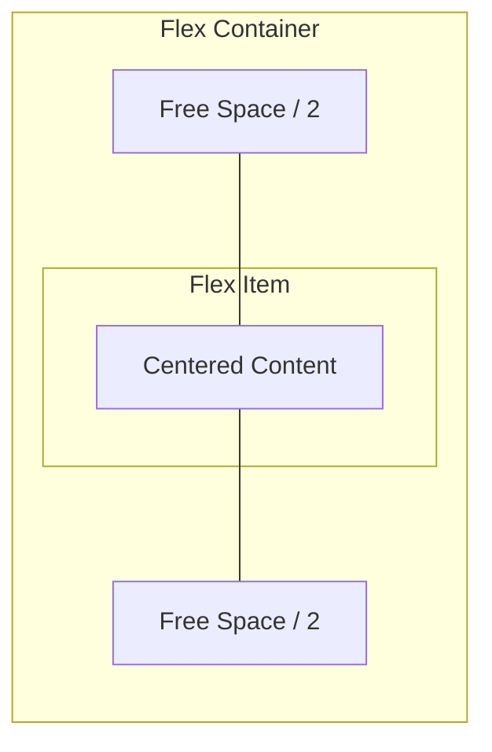

# Flexbox Absolute Centering

**Name:** Flexbox Absolute Centering  
**Category:** Layout & Alignment  
**Difficulty:** 2/5  
**What it produces:** A container that perfectly centers its child element(s) both horizontally and vertically, regardless of the child's explicit dimensions.  
**Why it works:** Flexbox (`display: flex`) establishes a flexible formatting context. `justify-content: center` divides available main-axis space equally around the child. `align-items: center` divides available cross-axis space equally around the child.  
**Required CSS concepts:** The Box Model, `display: flex`, Formatting Contexts  
**HTML structure:**
```html
<div class="container">
  <div class="child">Centered Content</div>
</div>
```
**CSS implementation:**
```css
.container {
  display: flex;
  justify-content: center;
  align-items: center;
  min-height: 100vh; /* Requires a defined block size */
}
```
**Variations:** `display: grid; place-items: center;` (Grid variant), or using `margin: auto` on the flex child.  
**Parameters to experiment with:** Container `height`, `flex-direction`, adding multiple children.  
**Common mistakes:** Forgetting to set a height on the container, which prevents vertical centering from having any visible effect due to shrink-wrapping.  
**Browser considerations:** Excellent support across all modern browsers. `safe center` for handling overflow clipping is supported in newer browser versions.  
**Acceptance criteria:** The child element must be exactly centered on both X and Y axes within the parent, adapting smoothly as the viewport or container size changes.

---

## 0. PREAMBLE: Context & Prerequisites

### 0.1 Prerequisites
Before starting this lesson, the student must understand:
* The Box Model (margins, padding, and intrinsic dimensions)
* Display types (`block`, `inline`, `inline-block`)

### 0.2 Learning Dependencies
* ✓ The Box Model
* ✓ Formatting Contexts

### 0.3 Specification Reference
* **Specification:** CSS Flexible Box Layout Module Level 1
* **Relevant Sections:** Flex Containers, Alignment (justify-content, align-items)

---

## 1. Mental Model & Problem

Centering an element both horizontally and vertically within a container was historically one of the most frustrating tasks in CSS. Before Flexbox, developers relied on complex hacks involving `absolute` positioning, negative margins, `table-cell` display, or `line-height` tricks.

The Flexbox absolute centering technique solves this by creating a Flexible Formatting Context. Instead of manipulating the child's coordinates, we instruct the parent container to distribute all available free space equally around the child on both axes.

**What This Feature Does NOT Do:**
* ❌ 1. **It does not remove the element from the document flow.** Unlike `position: absolute`, the centered element still occupies physical space and affects siblings if added.
* ❌ 2. **It does not explicitly define the child's size.** The child's size is determined by its intrinsic content or explicitly set dimensions, not by the centering mechanism itself.
* ❌ 3. **It does not prevent overflow.** If the child is larger than the parent, it will overflow the parent's boundaries, though the overflow will be distributed evenly.

---

## 2. Complete Language Reference & Value Grammar

The absolute centering technique relies on a combination of three properties applied to the container: `display`, `justify-content`, and `align-items`.

### `display: flex`
* **Formal Syntax Table:**
  * **Accepted Value Types & Keywords:** `flex` | `inline-flex`
  * **Initial Value:** `inline`
  * **Inherited:** No
  * **Animatable:** No
  * **Applies To:** All elements
  * **Computed Value:** As specified

### `justify-content` (Main Axis Alignment)
* **Formal Syntax Table:**
  * **Accepted Value Types & Keywords:** `center` | `flex-start` | `flex-end` | `space-between` | `space-around` | `space-evenly`
  * **Initial Value:** `normal` (behaves as `flex-start`)
  * **Inherited:** No
  * **Animatable:** Discrete
  * **Applies To:** Flex containers
  * **Computed Value:** As specified

### `align-items` (Cross Axis Alignment)
* **Formal Syntax Table:**
  * **Accepted Value Types & Keywords:** `center` | `flex-start` | `flex-end` | `stretch` | `baseline`
  * **Initial Value:** `normal` (behaves as `stretch`)
  * **Inherited:** No
  * **Animatable:** Discrete
  * **Applies To:** Flex containers
  * **Computed Value:** As specified

---

## 3. Complete Feature Surface

To achieve perfect absolute centering on a single item, the syntax is universally:

```css
.container {
  display: flex;
  justify-content: center;
  align-items: center;
}
```

*Modern Alternative:* You can also use the shorthand property `place-content: center` or `place-items: center` in Grid, but in Flexbox, `align-items: center` and `justify-content: center` remain the standard explicit declarations for centering single or multiple items.

---

## 4. Evolution & Modern CSS

* **Historical syntax:** `position: absolute; top: 50%; left: 50%; transform: translate(-50%, -50%);` - This removed the element from the document flow and often resulted in blurry text due to sub-pixel rendering.
* **Modern syntax:** Flexbox (`display: flex`) introduced a native layout algorithm designed specifically for 1-dimensional distribution of space.
* **Modern alternative:** CSS Grid (`display: grid; place-items: center;`) achieves the same result in two lines of code, but Flexbox is preferred when you need the container to remain a 1-dimensional context for potentially adding more items later.

---

## 5. Browser Behavior, Formatting Contexts & The Cascade

* **Formatting Context Algorithm:** When `display: flex` is applied, the container establishes a Flex Formatting Context (FFC) for its children.
* The container calculates the available free space by subtracting the child's intrinsic or explicit size from its own size.
* `justify-content: center` takes all available free space on the main axis (horizontal by default) and divides it equally, placing half before the item and half after.
* `align-items: center` takes all available free space on the cross axis (vertical by default) and divides it equally, placing half above the item and half below.
* **Intrinsic Sizing:** If the container does not have an explicit height, its height will shrink-wrap to the child's height, meaning vertical centering will appear to do nothing because there is no free space to distribute. You must ensure the container has a defined block size (e.g., `height: 100vh` or `height: 400px`).

---

## 6. Browser Algorithm

1. Parse `display: flex` and convert the element into a flex container.
2. Convert all direct children into flex items.
3. Determine the main and cross axes based on `flex-direction` (default: `row`).
4. Calculate the size of the flex container.
5. Calculate the intrinsic or explicit size of the flex item.
6. **Main Axis Alignment:** Subtract the item's width from the container's width. Divide the remainder by 2. Apply this value as an invisible offset before and after the item.
7. **Cross Axis Alignment:** Subtract the item's height from the container's height. Divide the remainder by 2. Apply this value as an invisible offset above and below the item.
8. Paint the item at the resolved coordinates.

---

## 7. Invalid CSS & Error Recovery

* **Missing Display Flex:** If `justify-content: center` and `align-items: center` are applied to a `display: block` element, the browser will parse them but silently ignore them during layout, as they only apply to flex or grid containers.
* **Inline Elements:** If the flex container is an `inline` element, use `display: inline-flex`. Otherwise, `display: flex` makes it block-level.

---

## 8. Interaction With Other CSS Features & CSSOM Runtime

* **Margins:** Applying `margin: auto` to a flex item inside a flex container is an alternative way to center it. `margin: auto` absorbs all available free space.
* **Transforms:** Centering via Flexbox avoids the sub-pixel blurring issues sometimes caused by `transform: translate(-50%, -50%)`.
* **CSSOM:** Modifying `justifyContent` via JavaScript triggers a Layout (Reflow) phase.

---

## 9. Accessibility (A11y)

* Flexbox centering does not alter the DOM order. The element remains exactly where it should be for screen reader parsing.
* Be cautious with `align-items: center` if the child text is very long and the container is narrow; it may result in clipping if the element overflows the top of the container, making the beginning of the content inaccessible.

---

## 10. Performance, Runtime Costs & Security

* **Rendering Stage:** Changing flex alignment properties triggers a Layout calculation.
* **Performance:** Flexbox layout calculations are highly optimized in modern browser engines (often faster than absolute positioning calculations because they don't trigger complex stacking context re-evaluations).

---

## 11. DevTools Investigation

1. Open DevTools and select the flex container.
2. In the Styles pane, click the `flex` badge next to the `display: flex` declaration to toggle the Flexbox overlay.
3. Observe the hatched patterns representing the distributed "free space" around the centered item.
4. Toggle `justify-content` and `align-items` on and off to see the item snap to the top-left origin.

---

## 12. Visual Mental Models



ASCII Geometry:
```text
+-----------------------------------+
|             Free Space            |
|                                   |
|       +-------------------+       |
|       |                   |       |
| Free  |   Centered Item   | Free  |
| Space |                   | Space |
|       +-------------------+       |
|                                   |
|             Free Space            |
+-----------------------------------+
```

---

## 13. Prediction Checkpoints

**Snippet:**
```css
.parent {
  display: flex;
  justify-content: center;
  align-items: center;
  /* NO HEIGHT DEFINED */
}
.child {
  width: 100px;
  height: 100px;
}
```
**Prediction:** Will the child be vertically centered in the viewport?
**Explanation:** No. Because the parent lacks an explicit height, its height shrink-wraps to the child's `100px`. There is 0 vertical free space to distribute, so `align-items: center` has no visual effect.

---

## 14. Compare Similar Features

* **Flexbox vs Auto Margins:** `display: flex` + `margin: auto` on the child accomplishes the exact same visual centering, but `justify-content/align-items` is preferred as it controls alignment from the parent context, making it easier to manage multiple children.
* **Flexbox vs Grid:** `display: grid; place-items: center;` is shorter (2 lines vs 3), but Flexbox is better if the container's primary purpose is 1D distribution and you might add siblings in a row.
* **Flexbox vs Absolute Positioning:** Absolute positioning removes the element from the document flow, requiring explicit container dimensions to avoid layout collapse. Flexbox keeps the element in flow.

---

## 15. Decision Guide

> **I want to...** $\longrightarrow$ **Use...**
* Center a single element quickly in modern browsers $\longrightarrow$ `display: grid; place-items: center;`
* Center an element but retain the ability to easily space out siblings in a row later $\longrightarrow$ `display: flex; justify-content: center; align-items: center;`
* Center an element that must overlap other in-flow elements $\longrightarrow$ `position: absolute; top: 50%; left: 50%; transform: translate(-50%, -50%);`

---

## 16. Common Bugs, Edge Cases & Debugging Workflow

* **Symptom:** The element is centered horizontally but sits at the top of the container vertically.
  * **Cause:** The parent container does not have a defined height, so it shrink-wrapped to the child.
  * **Solution:** Assign a height to the parent (e.g., `min-height: 100vh`).
* **Symptom:** Content is clipping at the top/left when the viewport is smaller than the item.
  * **Cause:** Centering algorithms center the mathematical midpoint, pushing overflow equally in all directions. If it overflows top/left, it becomes unreachable by scrolling.
  * **Solution:** Use `safe center` (e.g., `align-items: safe center`) to fall back to `flex-start` when overflow occurs, ensuring scrollability.

---

## 17. Interactive Experiments (Throwaway Labs)

1. Create a `div` with `100vh` height and a child `div`. Apply the flexbox centering snippet.
2. Change the child's `width` to `120vw`. Observe how it overflows the left side of the screen.
3. Change `align-items: center` to `align-items: safe center` and observe the difference when shrinking the window vertically.

---

## 18. Real Project Integration

* **Target File:** `src/components/Modal.css`
* **Engineering Justification:** The absolute centering flexbox pattern is structurally optimal for dialog backdrops to keep modal windows perfectly centered regardless of screen size.

---

## 19. Mastery Challenge

**Predict & Defend:**
You apply `display: flex; justify-content: center; align-items: center;` to a container. Inside, you have *two* child items. How will they be laid out?

**Answer:** They will be placed side-by-side (because the default `flex-direction` is `row`). The *pair* of them will be treated as a single block of content to be centered horizontally within the container, and both will be centered vertically along the cross axis.

---

## 20. Mastery Checklist

- [ ] I can explain the problem this feature solves and its mental model in my own words.
- [ ] I can state at least three incorrect assumptions about what this feature does *not* do.
- [ ] I know the complete formal grammar, accepted value types, default values, and inheritance behavior.
- [ ] I can trace the browser's algorithm and intrinsic sizing rules for resolving this feature.
- [ ] I can predict error recovery behaviors for invalid values.
- [ ] I can investigate and verify this property using Browser DevTools and understand its CSSOM manipulation.
- [ ] I understand all accessibility (a11y), security, and performance implications (reflow vs repaint).
- [ ] I have applied this pattern cleanly to the ongoing real-world project.
