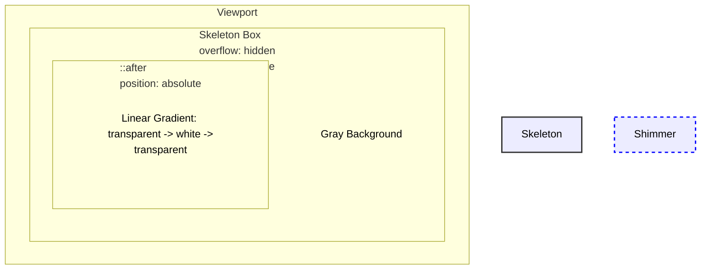

# CSS Technique: Skeleton Loading UI

## 0. PREAMBLE: Context & Prerequisites

### 0.1 Prerequisites
Before starting this lesson, the student must understand:
* CSS Positioning (`relative` vs `absolute`)
* Pseudo-elements (`::after`, `content`)
* The `@keyframes` animation syntax and the `animation` property
* `linear-gradient` functions and alpha transparency

### 0.2 Learning Dependencies
* ✓ The Box Model
* ✓ Containing Blocks
* ✓ Transform Functions (`translateX`)
* ✓ Hardware Acceleration concepts (GPU compositing)

### 0.3 Specification Reference
* **Specification:** CSS Animations Level 1, CSS Images Module Level 3
* **Relevant Sections:** Keyframes, linear-gradient(), transform

---

## 1. Mental Model & Problem
The Skeleton Loading UI (often called a shimmer effect) provides a placeholder layout that matches the dimensions of incoming content. It reduces perceived waiting time compared to a static spinner. 
* The physical problem it solves: Unloaded content has zero height by default, causing massive layout shifts (Cumulative Layout Shift) when the data arrives. Skeletons reserve the exact space.
* The CSS mechanism: An element acts as a solid gray block clipping its contents (`overflow: hidden`). A pseudo-element containing a semi-transparent white gradient is absolutely positioned over it and animated horizontally from left to right.

**What This Feature Does NOT Do:**
* ❌ 1. It does not automatically size itself to the *future* content; developers must explicitly declare the dimensions to match the expected layout.
* ❌ 2. It does not pause itself when network requests finish; you must manage the DOM removal or class toggling via JavaScript.
* ❌ 3. It does not provide inherent semantic meaning to screen readers unless explicitly marked with `aria-busy` and `aria-hidden`.

## 2. Complete Language Reference & Value Grammar

The core driver of the skeleton technique is `linear-gradient` and the `transform` property animated via `@keyframes`.

* **Formal Syntax Table (linear-gradient):**
  * **Accepted Value Types:** `linear-gradient([ <angle> | to <side-or-corner> ]? , <color-stop-list>)`
  * **Initial Value:** N/A (Function)
  * **Animatable:** Yes (But interpolating gradients is CPU-heavy)
  * **Applies To:** Properties accepting `<image>`, such as `background-image`

* **Formal Syntax Table (transform):**
  * **Accepted Value Types:** `<transform-list> | none`
  * **Initial Value:** `none`
  * **Animatable:** Yes (Highly performant via GPU)
  * **Applies To:** Transformable elements (Block-level, inline-block, etc.)
  * **Percentages:** Relative to the bounding box of the element itself

## 3. Complete Feature Surface

A robust Skeleton Loader requires composing several features:
* **The Base Shape:** Formed using `width`, `height`, `border-radius`, and `background-color`.
* **The Shimmer Overlay:** A pseudo-element `::after` stretched to `100%` width and height of the base.
* **The Gradient:** `linear-gradient(90deg, transparent, rgba(255,255,255,0.5), transparent)`
* **The Animation:** `@keyframes` transitioning `transform: translateX(-100%)` to `transform: translateX(100%)`.

## 4. Evolution & Modern CSS

* **Historical syntax:** Early implementations used animated GIF background images. 
* **Early CSS:** Animated `background-position` on a background of `200%` width. This caused layout/paint recalcs on every frame, draining battery and CPU.
* **Modern syntax:** Animating a pseudo-element with `transform: translateX()`. This offloads the animation to the GPU (Compositor thread), entirely bypassing the main thread's Paint and Layout stages.

## 5. Browser Behavior, Formatting Contexts & The Cascade

* **Containing Block Resolution:** The `.skeleton` element must declare `position: relative`. This creates the containing block for the `::after` pseudo-element, which is `position: absolute`.
* **Overflow Clipping:** `.skeleton` must have `overflow: hidden`. Without this, the pseudo-element will visibly slide outside the boundaries of the skeleton block as it animates, overlapping adjacent UI.
* **Stacking Contexts:** The absolute pseudo-element is layered over the base element's background color automatically.

## 6. Browser Algorithm

How the browser computes the Skeleton UI:
1. Computes the base geometry of `.skeleton` (reserving layout space).
2. Paints the solid gray background of `.skeleton`.
3. Creates the `::after` box, establishing its boundaries identical to the parent.
4. Generates the `linear-gradient` image for `::after`.
5. Promotes the `::after` element to its own GPU composite layer because it has an active `transform` animation.
6. The Compositor thread independently slides the GPU layer back and forth, clipping it precisely at the parent's boundaries via `overflow: hidden`.

## 7. Invalid CSS & Error Recovery

* **Missing `position: relative`:** The `::after` element will size and position itself relative to the nearest positioned ancestor (or the viewport), ruining the shimmer containment.
* **Missing `content: ""`:** The pseudo-element will not generate a box at all. No shimmer will appear.
* **Using `translateX(-100vw)` instead of `%`:** The shimmer will move based on viewport width, moving far too fast on large screens and decoupling from the element's local size.

## 8. Interaction With Other CSS Features & CSSOM Runtime

* **CSS Variables:** Ideal for theming. `--skeleton-bg` and `--skeleton-shimmer` allow rapid adaptation to light/dark modes.
* **Display Types:** Skeletons are often `display: flex` or `grid` containers themselves to align child "bone" blocks.
* **DOM Runtime:** JavaScript is responsible for removing the `.skeleton` elements and replacing them with real data once fetched.

## 9. Accessibility (A11y)

* **Reduced Motion:** Animations can trigger nausea for users with vestibular disorders. The shimmer MUST be disabled via `@media (prefers-reduced-motion: reduce)`.
* **Screen Readers:** Skeletons should be wrapped in an `aria-busy="true"` container, and the skeleton elements themselves should have `aria-hidden="true"` so they aren't read aloud as empty noise.
* **High Contrast Mode:** Gray background colors may disappear in Windows High Contrast / Forced Colors mode. Use `outline: 1px solid WindowText` scoped within a forced-colors media query.

## 10. Performance, Runtime Costs & Security

* **Rendering Stage Triggered:** 
  * `background-position` animation: Triggers **Paint** on every frame. Expensive.
  * `transform` animation: Triggers **Composite** only. Cheap, buttery smooth 60fps.
* **Security:** N/A.

## 11. DevTools Investigation

1. Open DevTools and inspect a `.skeleton` element.
2. In the **Elements > Styles** pane, toggle `overflow: hidden` off. Watch the shimmer pseudo-elements bleed across the page.
3. Open the **Rendering** tab and enable "Paint flashing". Notice that the `transform` animation does *not* flash green (it isn't repainting), proving it's GPU-accelerated.
4. Enable "Emulate CSS media feature prefers-reduced-motion: reduce" in the Rendering tab to ensure your accessibility fallback works.

## 12. Visual Mental Models



*The Shimmer Pseudo-element is bounded by the Skeleton Container. `transform: translateX(-100%)` places it out-of-bounds to the left. The animation moves it to `translateX(100%)`, out-of-bounds to the right, creating the sweep effect, hidden outside the box by `overflow: hidden`.*

## 13. Prediction Checkpoints

**Prediction:** What happens if the `transform: translateX()` animation is changed to `transform: scaleX()`?
> **Answer:** Instead of sliding across, the gradient will appear to stretch and squash in place, originating from the `transform-origin` (default center). It destroys the "sweeping light" illusion.

## 14. Compare Similar Features

* **`transform` vs `background-position` for Shimmer:**
  * `background-position`: Historically common. Causes layout/paint thrashing. **Do not use.**
  * `transform: translateX()`: Promotes to GPU. Highly performant. **Use this.**
* **Skeleton vs Spinner:** Skeletons reserve layout space preventing Cumulative Layout Shift (CLS). Spinners do not reserve layout geometry natively unless hardcoded into a container.

## 15. Decision Guide

> **I want to...** $\longrightarrow$ **Use...**
* Mimic a block of text loading $\longrightarrow$ A series of skeleton `div`s with `height: 1em`, `border-radius: 4px`, and `margin-bottom`.
* Ensure buttery smooth animation $\longrightarrow$ Animate `::after` with `transform: translateX()`.
* Support dark mode $\longrightarrow$ Use CSS variables for the background color and the gradient's RGB values.

## 16. Common Bugs, Edge Cases & Debugging Workflow

* **Bug:** The shimmer leaks out of the rounded corners of my skeleton.
  * **Cause:** `overflow: hidden` is missing or buggy. In Safari, you may need `transform: translateZ(0)` on the parent to enforce clipping with border-radius and GPU layers.
* **Bug:** The animation is janky on mobile.
  * **Cause:** You are animating `background-position`.
  * **Fix:** Switch to the pseudo-element `transform` method.

**Diagnostic Workflow:**
1. Is the shimmer visible? (Check `content: ""` and `position: absolute`).
2. Is the parent `position: relative`?
3. Is `overflow: hidden` applied to the parent to mask the shimmer?
4. Does the `linear-gradient` contrast well against the base background color?

## 17. Interactive Experiments (Throwaway Labs)

Experiment with the gradient angle and width:
1. Change `90deg` to `45deg`. Observe the diagonal sweep.
2. Change the color stops: `rgba(255,255,255,0) 0%, rgba(255,255,255,0.8) 10%, rgba(255,255,255,0) 20%`. This creates a very sharp, thin laser-like shimmer line.
3. Change the animation duration to `3s`. How does perceived speed affect the feeling of the app's performance?

## 18. Real Project Integration

* **Target File:** `src/components/ui/skeleton.css`
* **Engineering Justification:** Standardizing a highly performant, accessible skeleton utility class prevents layout shifts across the entire application and establishes a unified loading pattern.

```css
:root {
  --skeleton-base: #e2e5e7;
  --skeleton-shine: rgba(255, 255, 255, 0.6);
}

@media (prefers-color-scheme: dark) {
  :root {
    --skeleton-base: #2a2a2a;
    --skeleton-shine: rgba(255, 255, 255, 0.05);
  }
}

.skeleton {
  position: relative;
  overflow: hidden;
  background-color: var(--skeleton-base);
  border-radius: 4px;
  /* Safari border-radius clipping fix */
  transform: translateZ(0); 
}

.skeleton::after {
  content: "";
  position: absolute;
  inset: 0; /* Shorthand for top/right/bottom/left 0 */
  transform: translateX(-100%);
  background-image: linear-gradient(
    90deg,
    transparent 0%,
    var(--skeleton-shine) 50%,
    transparent 100%
  );
  animation: shimmer 1.5s infinite;
}

@keyframes shimmer {
  100% {
    transform: translateX(100%);
  }
}

@media (prefers-reduced-motion: reduce) {
  .skeleton::after {
    animation: none;
    /* Optional: fallback to a slow pulse if completely static is undesirable */
  }
}
```

## 19. Mastery Challenge

**Predict & Defend:**
You apply `.skeleton` to an image element ``. The background gray box appears, but the shimmer effect is completely missing. Why?

> **Answer:** `` is a "replaced element". Replaced elements do not support pseudo-elements (`::before` or `::after`) because their content is entirely replaced by the external resource (the image). To skeleton an image, you must apply the skeleton classes to a wrapper `div` or use a different technique.

## 20. Mastery Checklist

- [ ] I can explain the problem this feature solves and its mental model in my own words.
- [ ] I can state at least three incorrect assumptions about what this feature does *not* do.
- [ ] I know the complete formal grammar, accepted value types, default values, and inheritance behavior.
- [ ] I can trace the browser's algorithm and intrinsic sizing rules for resolving this feature.
- [ ] I can predict error recovery behaviors for invalid values.
- [ ] I can investigate and verify this property using Browser DevTools and understand its CSSOM manipulation.
- [ ] I understand all accessibility (a11y), security, and performance implications (reflow vs repaint).
- [ ] I have applied this pattern cleanly to the ongoing real-world project.
