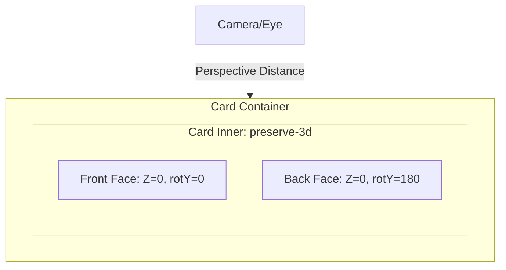

# CSS Mastery: 3D Flip Card Mechanics

## 0. PREAMBLE: Context & Prerequisites

### 0.1 Prerequisites
Before starting this lesson, the student must understand:
* Absolute positioning and overlapping elements.
* Basic CSS Transitions and timing functions.
* CSS Transforms in 2D (`rotate`, `translate`).

### 0.2 Learning Dependencies
A property or feature often relies on structural mechanics from across the curriculum. Declare the dependency graph:
* ✓ The Box Model
* ✓ Stacking Contexts
* ✓ CSS Transforms Module

### 0.3 Specification Reference
* **Specification:** [CSS Transforms Module Level 2](https://www.w3.org/TR/css-transforms-2/)
* **Relevant Sections:** 3D Transforms, `transform-style`, `backface-visibility`, `perspective`.

---

## 1. Mental Model & Problem

Web browsers traditionally render content on a strictly 2D flat plane (the screen). If you try to rotate an element 180 degrees horizontally in a 2D space, it simply shrinks in width to 0 and expands back out in reverse. To create a physical "card flip" effect, you must tear a hole in the 2D plane and instruct the browser to calculate rendering in a 3-Dimensional coordinate system.

The 3D Flip Card solves the problem of presenting two sides of information within the same screen real estate while providing a physical, spatial transition that users intuitively understand.

**What This Feature Does NOT Do:**
* ❌ 1. **Does not change document flow sizing:** The animation happens entirely in the compositor layer. Flipping a card does not push sibling elements out of the way.
* ❌ 2. **Does not create physical volume:** HTML elements are infinitely thin planes. Rotating an element 90 degrees makes it disappear, as it has no edge thickness.
* ❌ 3. **Does not automatically cast shadows:** While you can rotate an element in 3D, the browser does not have a 3D lighting engine. Shadows (`box-shadow`) remain 2D unless explicitly animated to mimic lighting.

---

## 2. Complete Language Reference & Value Grammar

To build a 3D flip card, we rely on three distinct 3D transform properties.

### `perspective`
Defines the distance between the user's eye and the z=0 plane.
* **Formal Syntax:** `none | <length>`
* **Initial Value:** `none`
* **Inherited:** No
* **Animatable:** Yes
* **Applies To:** Transformable elements

### `transform-style`
Determines if child elements are rendered in the 3D space of their parent, or flattened into a 2D plane.
* **Formal Syntax:** `flat | preserve-3d`
* **Initial Value:** `flat`
* **Inherited:** No
* **Animatable:** No
* **Applies To:** Transformable elements

### `backface-visibility`
Determines whether an element's back face is visible when it is turned away from the user.
* **Formal Syntax:** `visible | hidden`
* **Initial Value:** `visible`
* **Inherited:** No
* **Animatable:** No
* **Applies To:** Transformable elements

---

## 3. Complete Feature Surface

The 3D rendering context requires a strict hierarchy. A flip card requires three layers:
1. **The Scene (`perspective`):** The camera lens. Usually set on the outermost container.
2. **The Object (`transform-style: preserve-3d`):** The structural anchor that holds the faces. This is the element that actually rotates.
3. **The Faces (`backface-visibility: hidden`):** The front and back planes. The back plane is pre-rotated 180 degrees.

---

## 4. Evolution & Modern CSS

Historically, achieving a 3D flip required complex JavaScript physics calculations and Canvas drawing, or Flash. With the introduction of CSS 3D Transforms, the browser's GPU takes over the matrix multiplication required to project 3D coordinates onto a 2D screen. 

Modern CSS handles this flawlessly. However, Safari (WebKit) had a long-standing bug where `transform-style: preserve-3d` would occasionally flatten children or cause z-index flickering. Historically, developers applied `webkit-backface-visibility: hidden;` aggressively to prevent flickering, and sometimes used `transform: translateZ(1px);` to force hardware acceleration. These hacks are largely unnecessary in modern evergreen browsers.

---

## 5. Browser Behavior, Formatting Contexts & The Cascade

* **Stacking Contexts:** Applying any 3D transform, `perspective`, or `transform-style: preserve-3d` immediately creates a new stacking context. `z-index` values inside the card are isolated from the rest of the document.
* **Containing Block Resolution:** Elements with a `transform` or `perspective` act as containing blocks for `position: absolute` and `position: fixed` descendants.
* **Rendering Stages:** 3D transforms and `backface-visibility` calculations are handled entirely in the **Compositing** stage. This means rotating the card does not trigger Style, Layout, or Paint recalculations, ensuring a buttery smooth 60fps animation.

---

## 6. Browser Algorithm

How the engine processes a flip card:
1. Parse `perspective` on the scene container and initialize a 3D projection matrix.
2. Evaluate `.card-inner`. Because it has `preserve-3d`, the engine knows not to flatten its children into the parent's plane.
3. Parse the children (faces). The back face has `transform: rotateY(180deg)`.
4. Check `backface-visibility: hidden`. Since the back face is facing away from the camera (normal vector points in the -Z direction relative to the camera), the engine immediately culls it from rendering.
5. On `:hover`, the `.card-inner` applies a `rotateY(180deg)`.
6. The engine interpolates the rotation matrix over the transition duration. As it passes 90 degrees, the front face's normal vector points away from the camera, and it is culled. Simultaneously, the back face's normal vector points toward the camera, and it becomes visible.

---

## 7. Invalid CSS & Error Recovery

* **Missing `preserve-3d`:** If `.card-inner` is left with the default `flat`, the back face will be flattened into the same plane as the front face. Rotating the inner container will rotate a flat snapshot of both elements mashed together, causing Z-fighting (flickering text).
* **Missing `perspective`:** The flip will occur, but it will lack depth. It will look like an isometric, orthographic squishing effect rather than a physical card turning in space.
* **Using percentages in `perspective`:** `perspective: 50%` is invalid. The parser will drop the declaration and fall back to `none`. It requires a `<length>` (e.g., `px`, `rem`).

---

## 8. Interaction With Other CSS Features & CSSOM Runtime

* **Overflow clipping:** Setting `overflow: hidden` on a container that has `transform-style: preserve-3d` will often force the browser to revert to `transform-style: flat` to enforce the clipping boundaries, destroying the 3D effect. **Never use `overflow: hidden` on the 3D rotating container.**
* **Filters:** Applying CSS filters (like `blur()` or `drop-shadow()`) to an element with 3D transforms can cause rendering anomalies and sometimes force flattening depending on the browser engine.

---

## 9. Accessibility (A11y)

* **Prefers Reduced Motion:** Fast 3D rotations can cause vertigo. You MUST respect `@media (prefers-reduced-motion: reduce)` by bypassing the animation, or replacing it with a simple cross-fade opacity toggle.
* **Keyboard Navigation:** `:hover` is not accessible via keyboard. The trigger should ideally be a button click with JavaScript toggling a class, or the card must use `:focus-within` to allow keyboard users to see the back.
* **Screen Readers:** If the back of the card contains vital information, ensure it is not `display: none`. `backface-visibility: hidden` hides the element visually, but screen readers can still parse the DOM content.

---

## 10. Performance, Runtime Costs & Security

* **Rendering Stage Triggered:** GPU Composite only.
* **Hardware Acceleration:** 3D transforms automatically promote the element to its own GPU layer.
* **Memory Budgets:** While highly performant, promoting hundreds of cards to separate composite layers can exhaust VRAM on mobile devices, leading to crashing. Do not render thousands of 3D cards simultaneously.

---

## 11. DevTools Investigation

1. Open DevTools and inspect the `.card-container`.
2. Locate the `.card-inner` element.
3. In the Styles pane, toggle off `transform-style: preserve-3d`. Watch as the 3D depth collapses into a flat, glitchy plane.
4. Toggle off `backface-visibility: hidden` on the faces. Rotate the card slightly via the elements pane. Notice you can see the back content mirrored through the front face.

---

## 12. Visual Mental Models

### The 3D Scene Geometry



### The Rotation Matrix (Top-Down View)

```text
[ EYE ] (Camera)
   |
   | (Perspective distance: e.g. 1000px)
   V
  
[ Z=0 Plane ]

0 Degrees (Start):
Front: [========] (Facing Eye)
Back:  [--------] (Facing Away - Hidden)

90 Degrees (Halfway):
Front & Back: | (Edge on, invisible)

180 Degrees (End):
Back:  [--------] (Facing Eye - Visible!)
Front: [========] (Facing Away - Hidden)
```

---

## 13. Prediction Checkpoints

**Prediction Challenge:**
If you apply `transform: translateZ(50px)` to the `.card-front` and `transform: rotateY(180deg) translateZ(50px)` to the `.card-back`, what happens structurally to the card?

*Answer:* You have created a 3D box with thickness. The faces are no longer infinitely close to each other. They are pushed outward in opposite directions by 50px, giving the card a physical 100px thickness in 3D space.

---

## 14. Compare Similar Features

* `transform: rotateY()` vs `transform: scaleX(-1)`:
  * `scaleX(-1)` mirrors the element instantly in 2D space.
  * `rotateY(180deg)` physically rotates the element through the Z-axis, creating perspective distortion as it turns.

---

## 15. Decision Guide

> **I want to...** $\longrightarrow$ **Use...**
* **I want a quick 2D horizontal flip without 3D depth:** Use `transform: scaleX(-1)`.
* **I want a realistic playing card flipping animation:** Use `perspective` + `transform-style: preserve-3d` + `backface-visibility: hidden` + `rotateY(180deg)`.
* **I want a card that flips vertically like a calendar page:** Use `rotateX(180deg)` instead of `rotateY()`.

---

## 16. Common Bugs, Edge Cases & Debugging Workflow

* **Symptom:** The card flips, but it looks flat and doesn't bulge outward toward the user.
  * **Cause:** Missing `perspective` on the parent container.
* **Symptom:** The card flips, but the back text is backwards/mirrored.
  * **Cause:** You forgot to pre-rotate the back face 180 degrees, OR you rotated the entire container 180 degrees but didn't apply a counter-rotation to the back element.
* **Symptom:** When the card flips, it clips into surrounding elements.
  * **Cause:** Z-index issues. The 3D layer requires a higher `z-index` to overlap adjacent elements during the animation bulge.

**Diagnostic Workflow Checklist:**
1. Is `perspective` applied to the static parent, NOT the flipping element?
2. Is `transform-style: preserve-3d` applied to the flipping container?
3. Is `backface-visibility: hidden` applied to BOTH faces?
4. Are both faces absolute positioned directly on top of each other?
5. Is the back face explicitly rotated 180 degrees initially?

---

## 17. Interactive Experiments (Throwaway Labs)

**Lab 1: The Perspective Distortion**
* Change `.card-container { perspective: 1000px; }` to `perspective: 200px;`.
* *Observation:* Notice how extreme the distortion is. The card feels like it's smacking you in the face.
* Change it to `perspective: 5000px;`.
* *Observation:* The flip looks almost entirely 2D.

**Lab 2: The Origin Shift**
* Add `transform-origin: left center;` to the `.card-inner` element.
* *Observation:* The card no longer flips on its center axis; it opens like a book page hinged on the left edge.

---

## 18. Real Project Integration

* **Target File:** `src/components/profile-card.css`
* **Exact Location:** Appending to the `.profile-card-wrapper` ruleset.
* **Code Modification:**
```css
.profile-card-scene {
  perspective: 1200px;
}
.profile-card-inner {
  transform-style: preserve-3d;
  transition: transform 0.8s cubic-bezier(0.175, 0.885, 0.32, 1.275);
  position: relative;
}
.profile-card-front, .profile-card-back {
  backface-visibility: hidden;
  position: absolute;
  inset: 0;
}
.profile-card-back {
  transform: rotateY(180deg);
}
.profile-card-scene:focus-within .profile-card-inner,
.profile-card-scene:hover .profile-card-inner {
  transform: rotateY(180deg);
}
```
* **Engineering Justification:** Adds a tactile interactive reveal for secondary profile statistics without cluttering the primary UI real estate, utilizing the compositor thread for maximum performance.

---

## 19. Mastery Challenge

**Find & Fix the Bug:**
A junior dev writes the following code, but when the card flips, the front face just disappears instantly and the back face is entirely invisible:

```css
.card { transition: transform 0.5s; overflow: hidden; }
.card:hover { transform: rotateY(180deg); }
.face-front { backface-visibility: hidden; }
.face-back { backface-visibility: hidden; transform: rotateY(180deg); display: none; }
.card:hover .face-back { display: block; }
```

**Fix:**
1. Remove `overflow: hidden;` (breaks 3D space).
2. Remove `display: none` and `display: block` toggling (breaks transitions and is unnecessary since `backface-visibility: hidden` handles hiding).
3. The parent `.card` needs `transform-style: preserve-3d`.
4. Wrap `.card` in a new container with `perspective: 1000px`.

---

## 20. Mastery Checklist

- [ ] I can explain the problem this feature solves and its mental model in my own words.
- [ ] I can state at least three incorrect assumptions about what this feature does *not* do.
- [ ] I know the complete formal grammar, accepted value types, default values, and inheritance behavior.
- [ ] I can trace the browser's algorithm and intrinsic sizing rules for resolving this feature.
- [ ] I can predict error recovery behaviors for invalid values.
- [ ] I can investigate and verify this property using Browser DevTools and understand its CSSOM manipulation.
- [ ] I understand all accessibility (a11y), security, and performance implications (reflow vs repaint).
- [ ] I have applied this pattern cleanly to the ongoing real-world project.
