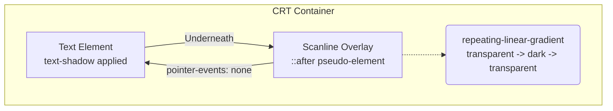

# CRT Scanline Effect

## Metadata

* **Name:** CRT Scanline Effect
* **Category:** Visual Effects
* **Difficulty:** 2
* **What it produces:** A retro, CRT (Cathode Ray Tube) monitor aesthetic using a repeating horizontal line overlay and glowing text.
* **Why it works:** It uses a `repeating-linear-gradient` to create alternating transparent and semi-transparent dark lines overlaying the content. `text-shadow` is used to simulate the phosphor glow characteristic of vintage displays.
* **Required CSS concepts:** `repeating-linear-gradient`, `text-shadow`, `pointer-events`, pseudo-elements (`::after` or `::before`), `rgba()` colors.
* **HTML structure:** A container wrapping the text or content to receive the effect.
* **CSS implementation:**
```css
.crt-container {
  background-color: #111;
  color: #33ff00;
  font-family: monospace;
  position: relative;
  overflow: hidden;
  padding: 2rem;
}

/* Phosphor Glow */
.crt-text {
  text-shadow: 0 0 5px #33ff00, 0 0 10px #33ff00;
}

/* Scanlines */
.crt-container::after {
  content: " ";
  display: block;
  position: absolute;
  top: 0;
  left: 0;
  bottom: 0;
  right: 0;
  background: repeating-linear-gradient(
    rgba(0, 0, 0, 0) 0px,
    rgba(0, 0, 0, 0) 2px,
    rgba(0, 0, 0, 0.2) 2px,
    rgba(0, 0, 0, 0.2) 4px
  );
  z-index: 2;
  pointer-events: none; /* Let clicks pass through */
}
```
* **Variations:** Animating the scanlines (scrolling down), adding RGB shift/chromatic aberration via `text-shadow` using red and blue channels slightly offset, adding a vignette shadow inside the container.
* **Parameters to experiment with:** Gradient step values (thickness of lines), opacity of the dark lines in the gradient, `text-shadow` blur radius, font color vs shadow color.
* **Common mistakes:** Forgetting `pointer-events: none` on the scanline overlay, which blocks user interaction with the underlying content. Using solid colors instead of `rgba` causing the scanlines to completely obscure the text.
* **Browser considerations:** Very well supported across modern browsers. High blur radii on `text-shadow` might have minor performance hits on very low-end devices if animated continuously.
* **Acceptance criteria:** The screen shows alternating dark and clear horizontal lines. The text glows slightly. The user can still select the text underneath the scanlines.

---

## 1. Mental Model & Problem

* What physical or structural problem does this feature solve? Creating vintage digital aesthetics on modern pristine displays requires simulating analog imperfections.
* Why did the CSS Working Group introduce it? They introduced gradients and text-shadows for general graphic design, but combining them perfectly mimics analog CRT technology without needing large image overlays.
* What part of the browser's architecture does it modify? The Paint stage, using generated images (gradients) and text decoration (shadows).
* **What This Feature Does NOT Do:**
  * ❌ 1. It does not actually bend the screen geometrically (unless combined with 3D transforms or filters).
  * ❌ 2. It does not degrade text legibility at the DOM level; screen readers still read the text perfectly.
  * ❌ 3. It does not prevent user interaction if `pointer-events: none` is properly utilized.

## 2. Visual Mental Models



**Geometry Diagram of `repeating-linear-gradient`:**
```text
Y-Axis
 0px +-------------------+
     | Transparent       | <- 0px to 2px
 2px +-------------------+
     | Semi-Black (0.2)  | <- 2px to 4px
 4px +-------------------+
     | Transparent       | <- Repeats endlessly
 6px +-------------------+
     | Semi-Black (0.2)  |
 8px +-------------------+
```

---

## 20. Mastery Checklist
- [ ] I can explain the problem this feature solves and its mental model in my own words.
- [ ] I can state at least three incorrect assumptions about what this feature does *not* do.
- [ ] I know the complete formal grammar, accepted value types, default values, and inheritance behavior.
- [ ] I can trace the browser's algorithm and intrinsic sizing rules for resolving this feature.
- [ ] I can predict error recovery behaviors for invalid values.
- [ ] I can investigate and verify this property using Browser DevTools and understand its CSSOM manipulation.
- [ ] I understand all accessibility (a11y), security, and performance implications (reflow vs repaint).
- [ ] I have applied this pattern cleanly to the ongoing real-world project.
