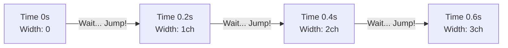

# Typewriter Text Effect

## 0. PREAMBLE: Context & Prerequisites

### 0.1 Prerequisites
Before starting this lesson, the student must understand:
* CSS Animations and `@keyframes` syntax.
* The Box Model (specifically `width`, `overflow`, and borders).
* The concept of typography sizing and monospaced fonts.

### 0.2 Learning Dependencies
* ✓ CSS Transitions & Animation Internals
* ✓ Typography & Sizing Units
* ✓ Intrinsic Sizing, Overflow, & Containment

### 0.3 Specification Reference
* **Specification:** [CSS Animations Level 1](https://www.w3.org/TR/css-animations-1/), [CSS Values and Units Module Level 4](https://www.w3.org/TR/css-values-4/)
* **Relevant Sections:** `animation-timing-function` (specifically step timing functions), `<length>` units (specifically the `ch` unit).

---

## 1. Mental Model & Problem

* What physical or structural problem does this feature solve?
  Creating a digital "typing" aesthetic without requiring JavaScript string manipulation. It relies on revealing pre-rendered text inside a clipping container.
* Why did the CSS Working Group introduce it?
  The `steps()` function was introduced to allow for discrete, frame-by-frame animation rather than smooth interpolation. The `ch` unit was introduced to size elements relative to the character advance width, perfect for text-aligned layouts.
* What part of the browser's architecture does it modify?
  It modifies the layout boundaries (width) during the animation cycle, triggering repaints to reveal hidden content.
* **What This Feature Does NOT Do:**
  * ❌ 1. Does not actually inject characters into the DOM one by one.
  * ❌ 2. Does not automatically know how many characters are in your string (you must specify this).
  * ❌ 3. Does not work perfectly with proportional (non-monospaced) fonts without visual jitter.

---

## 2. Complete Language Reference & Value Grammar

### `steps()` Function
* **Formal Syntax Table:**
  * **Accepted Value Types & Keywords:** `steps(<integer> [, <step-position> ]?)`
    Where `<step-position>` is `jump-start | jump-end | jump-none | jump-both | start | end`
  * **CSS Value Grammar Types Taught:** `<integer>`, keyword.
  * **Default Browser Behavior:** Defaults to `jump-end` (or `end`).

### `ch` Unit
* **Definition:** Represents the advance measure of the glyph "0" (zero) in the element's font.
* **Used Value:** Computed dynamically based on the active `font-family` and `font-size`.

---

## 3. Complete Feature Surface

The complete typewriter effect leverages several features working in concert:
* `white-space: nowrap;`: Prevents the text from wrapping to the next line as the container's width grows.
* `overflow: hidden;`: Clips the text that is outside the current animating width.
* `width`: Starts at `0` and animates to the full character count in `ch` units.
* `animation-timing-function: steps(N)`: Ensures the width grows in discrete chunks (character by character) rather than a smooth slide.
* `border-right`: Acts as the blinking cursor.

---

## 4. Evolution & Modern CSS

* **Historical syntax:** Before `steps()` and `ch`, developers had to use JavaScript `setInterval` to concatenate strings and update the `innerHTML` of a span, which was inefficient and caused excessive DOM thrashing.
* **Modern syntax:** CSS-only animations using `ch` units provide a declarative, hardware-accelerated approach.
* **Limitations:** The CSS approach requires hardcoding the character count. In modern reactive frameworks (React, Vue), a hybrid approach is sometimes used where JS calculates the string length and sets a CSS custom property `--chars`.

---

## 5. Browser Behavior, Formatting Contexts & The Cascade

* **Intrinsic Sizing Model:** By animating the explicit `width` from `0` to `max-content` or a specific `ch` value, we override the element's natural intrinsic size.
* **The Cascade Resolution Order Algorithm:** Ensure no other rules are overriding the `width` or `overflow` properties.
* **Formatting Context:** The container must establish an independent formatting context or behave as a block/inline-block to respect explicit `width` dimensions.

---

## 6. Browser Algorithm

1. **Parse:** Browser reads the text node and applies the monospaced font. It computes the physical width of the `ch` unit (the "0" character).
2. **Layout Setup:** The element is styled with `width: 0`, `overflow: hidden`, and `white-space: nowrap`. The text is rendered internally but clipped visually.
3. **Animation Trigger:** The `@keyframes` animation starts.
4. **Step Computation:** Instead of calculating smooth sub-pixel widths, the `steps(N)` function divides the animation duration into `N` equal segments.
5. **Frame Update:** At each step interval, the layout recalculates the width, instantly snapping it to the next multiple of `ch`.
6. **Paint:** The browser repaints the newly exposed portion of the text and the right border (cursor).

---

## 7. Invalid CSS & Error Recovery

* **Invalid steps:** `steps(0)` or `steps(1.5)` is invalid. The parser drops the declaration, falling back to `ease` (smooth interpolation), ruining the typewriter illusion.
* **Proportional Fonts:** If a non-monospaced font is used, the `ch` unit still represents the "0" glyph, but an "i" might be narrower and an "m" wider. The `steps()` width expansion will desync from the actual character boundaries, cutting characters in half during the animation.

---

## 8. Interaction With Other CSS Features & CSSOM Runtime

* **CSS Custom Properties:** Highly recommended to pass the character count as a variable: `width: calc(var(--char-count) * 1ch);` and `animation: typing 2s steps(var(--char-count))`.
* **CSSOM:** You can dynamically change the text and the `--char-count` variable via JavaScript to create a reusable typewriter component.

---

## 9. Accessibility (A11y)

* **Reduced Motion:** Blinking cursors and moving text can trigger vestibular issues or distract users with cognitive disabilities.
  ```css
  @media (prefers-reduced-motion: reduce) {
    .typewriter {
      animation: none;
      width: auto;
      border-right: none;
    }
  }
  ```
* **Screen Readers:** Because the text is fully present in the DOM from the start, screen readers will announce it normally upon page load. The visual clipping does not hide it from the accessibility tree.

---

## 10. Performance, Runtime Costs & Security

* **Rendering Stage Triggered:** Animating `width` triggers **Layout (Reflow)**. Because the text expands, it can push other elements around.
* **Optimization:** To avoid layout shifts, the typewriter element should be absolutely positioned, or its parent container should have a fixed height/width to reserve the final space.

---

## 11. DevTools Investigation

* **Animations Pane:** Use the DevTools Animations panel to pause and scrub the timeline. Observe how the element's computed width remains static for a period, then instantly jumps.
* **Computed Pane:** Verify that `1ch` roughly equals the width of your characters by inspecting the element at different steps.

---

## 12. Visual Mental Models

### The Clipping Reveal Mechanism

```text
[ Container Width: 0ch ]
| (Everything hidden)

[ Container Width: 4ch ]
|H|e|l|l| (hidden: "o World")

[ Container Width: 11ch ]
|H|e|l|l|o| |W|o|r|l|d|
```

### The `steps()` Function Timeline



---

## 13. Prediction Checkpoints

**Prediction:** What happens if the text string has 15 characters, but you set `animation: typing 2s steps(10)`?
> **Answer:** The animation will jump in 10 increments, but since the target width is `15ch`, each jump will be `1.5ch` wide. It will look broken, revealing one and a half characters at a time. The steps MUST match the exact character count.

---

## 14. Compare Similar Features

* **CSS Typewriter vs JS Typewriter:** CSS is smoother (if monospaced) and easier to declare, but cannot handle multiline text wrapping elegantly. JavaScript typing (injecting characters) handles wrapping perfectly but is computationally heavier.
* **`steps()` vs `linear`:** `linear` causes the clipping boundary to smoothly slide across the text, cutting through the middle of characters. `steps()` ensures whole characters are revealed instantly.

---

## 15. Decision Guide

> **I want to...** $\longrightarrow$ **Use...**
* Animate a single line of code or terminal text $\longrightarrow$ CSS Typewriter (`steps()` + `ch`).
* Animate a full paragraph that needs to wrap naturally $\longrightarrow$ JavaScript string manipulation.
* Reveal text smoothly like a mask $\longrightarrow$ CSS `clip-path` with `ease` or `linear`.

---

## 16. Common Bugs, Edge Cases & Debugging Workflow

* **Common Bugs Table:**
  | Symptom | Cause | Solution |
  |---------|-------|----------|
  | Text wraps during animation | Missing `white-space` | Add `white-space: nowrap;` |
  | Letters get cut in half | Non-monospaced font used | Use a monospace font, or accept the slight visual inaccuracy. |
  | Cursor blinks irregularly | Timing function conflict | Separate typing and blinking animations into different keyframes. |

* **Debugging Workflow:**
  1. Count the exact characters (including spaces).
  2. Verify the font is strictly monospaced.
  3. Ensure the parent container isn't forcing a constrained width.

---

## 17. Interactive Experiments (Throwaway Labs)

1. **The Monospace Test:** Change the `font-family` from `monospace` to `sans-serif` and run the animation very slowly. Watch how the right edge cuts through wider letters like 'w' or 'm'.
2. **The Step Count Shift:** Alter the `steps(N)` value to be half of the actual text length. Observe the chunking behavior.
3. **Cursor Customization:** Change the `border-right` to `border-bottom` to create an underscore terminal cursor.

---

## 18. Real Project Integration

* **Target File:** `src/components/TerminalIntro.css`
* **Exact Location:** Applied to the main `.hero-headline` element.
* **Code Modification:**
  ```css
  .terminal-text {
    font-family: 'Courier New', Courier, monospace;
    overflow: hidden;
    white-space: nowrap;
    border-right: 2px solid var(--primary-color);
    width: 22ch;
    animation: 
      typing 2s steps(22, end),
      blink-caret .5s step-end infinite;
  }

  @keyframes typing {
    from { width: 0 }
  }

  @keyframes blink-caret {
    from, to { border-color: transparent }
    50% { border-color: var(--primary-color); }
  }
  ```
* **Engineering Justification:** Provides an engaging, thematic intro sequence without importing heavy JavaScript animation libraries, keeping the initial load fast.

---

## 19. Mastery Challenge

* **Predict & Defend:** You have a dynamic greeting that changes depending on the user's name: "Hello, Alex" (11 chars) or "Hello, Christopher" (18 chars). How do you architect the CSS typewriter effect so it works for both without hardcoding the CSS?
* **Solution:** You must use inline CSS variables injected by the HTML/JS templating engine.
  `<h1 class="typewriter" style="--chars: 18;">Hello, Christopher</h1>`
  Then in CSS: `width: calc(var(--chars) * 1ch); animation: typing 2s steps(var(--chars));`

---

## 20. Mastery Checklist

- [ ] I can explain the problem this feature solves and its mental model in my own words.
- [ ] I can state at least three incorrect assumptions about what this feature does *not* do.
- [ ] I know the complete formal grammar, accepted value types, default values, and inheritance behavior.
- [ ] I can trace the browser's algorithm and intrinsic sizing rules for resolving this feature.
- [ ] I can predict error recovery behaviors for invalid values.
- [ ] I can investigate and verify this property using Browser DevTools and understand its CSSOM manipulation.
- [ ] I understand all accessibility (a11y), security, and performance implications (reflow vs repaint).
- [ ] I have applied this pattern cleanly to the ongoing real-world project.
