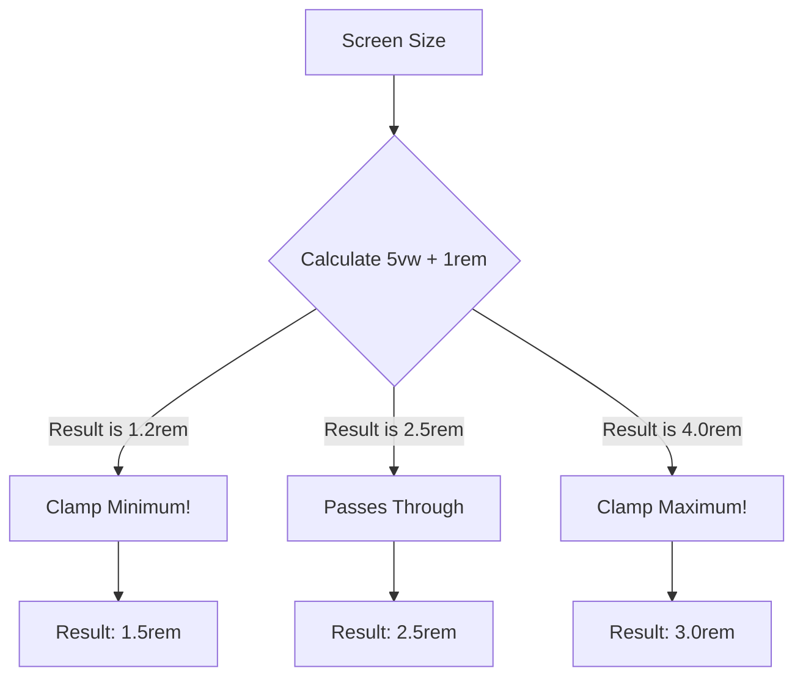

# Fluid Typography with clamp()

**Name:** Fluid Typography with clamp()  
**Category:** Typography & Responsive Design  
**Difficulty:** 3/5  
**What it produces:** Text that scales smoothly and proportionally based on the viewport width, bounded by a strict minimum and maximum size.  
**Why it works:** The `clamp()` function interpolates a value between a minimum and a maximum based on an ideal viewport-relative expression, allowing continuous scaling without media queries.  
**Required CSS concepts:** `clamp()`, `calc()`, `vw` units, `rem` units, Accessibility (A11y) considerations for font scaling.  
**HTML structure:** Any text-containing element (e.g., `<h1>`, `<p>`).  
**CSS implementation:** `font-size: clamp(min, ideal, max);`  
**Variations:** Using `clamp()` for spacing (margin/padding) or component widths.  
**Parameters to experiment with:** Minimum size, maximum size, scaling rate (vw multiplier).  
**Common mistakes:** Using `px` for min/max, which breaks user zoom. Not accounting for the user's base font size preference.  
**Browser considerations:** Excellent modern browser support; requires polyfills or fallbacks for ancient browsers (e.g., IE11).  
**Acceptance criteria:** The typography scales seamlessly as the window resizes, never shrinking below the minimum or growing above the maximum, and respects user zoom preferences.

---

## 0. PREAMBLE: Context & Prerequisites

### 0.1 Prerequisites
Before starting this lesson, the student must understand:
* CSS Units (`rem`, `px`, `vw`)
* The `calc()` function
* Responsive Web Design fundamentals (Media Queries)

### 0.2 Learning Dependencies
* ✓ CSS Value Grammar & Data Types
* ✓ Box Model & Formatting Contexts
* ✓ Typography, Writing Modes & Internationalization

### 0.3 Specification Reference
* **Specification:** CSS Values and Units Module Level 4
* **Relevant Sections:** Math Functions: `clamp()`

---

## 1. Mental Model & Problem

### The Problem
Historically, making typography responsive required a series of step-wise breakpoints using Media Queries. This resulted in "stepped" typography that snapped abruptly from one size to another as the screen resized, rather than scaling smoothly. Alternatively, using pure `vw` units meant text could get unreadably small on mobile or grotesquely huge on large monitors.

### The Mental Model
Think of `clamp(MIN, IDEAL, MAX)` as a safety net. It allows a value to grow fluidly (the `IDEAL` middle value, usually tied to viewport width), but it hits a hard ceiling (`MAX`) on large screens and a hard floor (`MIN`) on small screens. 

### What This Feature Does NOT Do
* ❌ 1. **Does not eliminate the need for relative units:** `clamp()` still requires accessible units (`rem`) for its min/max values to respect user zoom.
* ❌ 2. **Does not handle line-height automatically:** Fluid text sizes may require fluid line-heights to maintain vertical rhythm.
* ❌ 3. **Does not alter the CSS Box Model:** It simply computes a final length/number value that is applied to a property.

---

## 2. Complete Language Reference & Value Grammar

### Formal Syntax Table
* **Accepted Value Types:** `clamp( <calc-sum>#{1}, <calc-sum>#{1}, <calc-sum>#{1} )`
* **CSS Value Grammar Types Taught:** `<length>`, `<percentage>`, `<number>`
* **Initial Value:** N/A (It is a function, not a property)
* **Inherited:** Evaluated at computed-value time, the result is inherited if used on an inherited property (like `font-size`).
* **Animatable:** Yes, interpolates as a continuous mathematical function.
* **Applies To:** Any property accepting lengths, numbers, percentages, etc.
* **Computed Value:** An absolute length or number, resolved from the mathematical calculation.
* **Default Browser Behavior:** Clamps the central value strictly between the first (min) and third (max) arguments.
* **Related Shorthand / Longhand Properties:** Can replace `min()` and `max()` combinations (`max(MIN, min(IDEAL, MAX))`).

---

## 3. Complete Feature Surface

The `clamp()` function takes exactly three parameters, in order:
1. **Minimum value:** The absolute smallest size allowed.
2. **Preferred value:** The fluid expression that changes based on context (often `vw` or percentages).
3. **Maximum value:** The absolute largest size allowed.

```css
h1 {
  /* min: 1.5rem, ideal: 5vw + 1rem, max: 3rem */
  font-size: clamp(1.5rem, 5vw + 1rem, 3rem);
}
```

---

## 4. Evolution & Modern CSS

* **Historical syntax:**
  ```css
  h1 { font-size: 16px; }
  @media (min-width: 768px) { h1 { font-size: 24px; } }
  ```
  Or using `calc()` with complex lock formulas.
* **Modern syntax:** `clamp()` drastically simplifies the "CSS Locks" technique, baking the math into a single native function.

---

## 5. Browser Behavior, Formatting Contexts & The Cascade

* **Resolution:** `clamp()` is evaluated during the *Style Calculation* stage. 
* **Intrinsic Sizing:** The computed value from `clamp()` participates normally in intrinsic sizing algorithms (e.g., a larger clamped font size increases the `min-content` width of the text block).

---

## 6. Browser Algorithm

1. Parse the declaration and evaluate the three arguments inside `clamp()`.
2. Resolve relative units (`vw`, `rem`) into absolute pixels for comparison.
3. Compute `min(PREFERRED, MAX)`.
4. Compute `max(MIN, result of step 3)`.
5. Return the final clamped value.
6. Apply this final length to the `font-size` (or other) property.

---

## 7. Invalid CSS & Error Recovery

* **Reversed Min/Max:** If the minimum value is mathematically greater than the maximum value, the browser will ignore the maximum and just apply the minimum. `clamp(100px, 5vw, 10px)` will compute to `100px`.
* **Missing arguments:** `clamp(10px, 5vw)` is invalid syntax and the entire declaration is dropped.
* **Incompatible units:** `clamp(10px, 5deg, 20px)` is invalid (mixing lengths and angles).

---

## 8. Interaction With Other CSS Features & CSSOM Runtime

* **CSS Custom Properties:** `clamp()` pairs perfectly with variables for design systems.
  ```css
  :root { --fluid-h1: clamp(2rem, 5vw, 4rem); }
  h1 { font-size: var(--fluid-h1); }
  ```
* **CSSOM:** `window.getComputedStyle()` will return the *resolved* pixel value (e.g., `"32px"`), not the string `"clamp(...)"`.

---

## 9. Accessibility (A11y)

**CRITICAL ACCESSIBILITY RULE:**
Never use pure `vw` units for the preferred value without adding `rem`. If you use `clamp(1rem, 5vw, 3rem)`, the text will not scale when the user uses browser zoom (Cmd/Ctrl +) because `vw` is tied to the physical viewport size, not the base font size.

**The Accessible Pattern:**
```css
/* BAD: Fails WCAG zoom requirements */
font-size: clamp(1rem, 5vw, 3rem);

/* GOOD: Math incorporates the user's base font preference */
font-size: clamp(1.5rem, 2vw + 1rem, 3rem);
```
By adding `1rem` to the fluid calculation, zooming the browser increases the `rem` base, forcing the text to scale up.

---

## 10. Performance, Runtime Costs & Security

* **Rendering Stage:** Evaluated rapidly in Style Calculation. `vw` adjustments trigger on window resize.
* **Performance:** Extremely cheap. Native browser math is infinitely faster than JS `window.onresize` listeners calculating fluid layouts.

---

## 11. DevTools Investigation

1. Open DevTools **Styles Pane** and locate a `clamp()` declaration.
2. Slowly resize the browser window sideways.
3. Watch the **Computed Pane**. You will see the physical `px` value for `font-size` updating dynamically between your min and max bounds.

---

## 12. Visual Mental Models



---

## 13. Prediction Checkpoints

**Prediction 1:**
```css
p {
  font-size: clamp(20px, 2vw, 10px);
}
```
*What happens on a 1000px wide screen?*
**Answer:** The text will be `20px`. The `min` value is larger than the `max` value. According to the CSS spec, `clamp()` resolves as `max(MIN, min(VAL, MAX))`. So `max(20, min(20, 10))` -> `max(20, 10)` -> `20px`.

---

## 14. Compare Similar Features

* **`clamp()` vs Media Queries:** MQs are stepping stones (staircase scaling). `clamp()` is a continuous ramp.
* **`clamp()` vs `calc()`:** `clamp(A, B, C)` is syntactic sugar for `max(A, min(B, C))`.

---

## 15. Decision Guide

> **I want to...** $\longrightarrow$ **Use...**
* Scale an H1 smoothly between mobile and desktop $\longrightarrow$ `font-size: clamp(...)`
* Ensure a container doesn't get too wide or too narrow $\longrightarrow$ `width: clamp(...)`
* Provide distinct layout jumps for totally different UI structures $\longrightarrow$ `@media` queries

---

## 16. Common Bugs, Edge Cases & Debugging Workflow

* **Bug:** Text doesn't get bigger when zooming with Ctrl/Cmd +.
* **Cause:** The middle value is pure `vw`.
* **Fix:** Change `5vw` to `calc(5vw + 1rem)`.

**Diagnostic Workflow Checklist:**
1. Is the selector matching?
2. Is syntax valid?
3. Is specificity winning?
4. Is it being overridden?
5. Is inheritance blocked?
6. Is intrinsic sizing overriding it?
7. Is there a clip?
8. Z-index?
9. Is the viewport changing? (Check `vw` resolution).

---

## 17. Interactive Experiments (Throwaway Labs)

**Lab 1:**
Create an `<h1>` with `font-size: clamp(2rem, 10vw, 5rem);`. Resize your window from 300px to 1200px and watch the text size in the DevTools Computed tab.

---

## 18. Real Project Integration

* **Target File:** `src/styles/typography.css`
* **Exact Location:** `h1` global declaration.
* **Code Modification:**
```diff
 h1 {
-  font-size: 2rem;
+  font-size: clamp(2rem, 4vw + 1rem, 4rem);
 }
```
* **Engineering Justification:** Replaces multiple media queries, reduces CSS payload, ensures accessible zooming, and provides perfect layout proportions on all devices.

---

## 19. Mastery Challenge

**Find & Fix the Bug:**
```css
.hero-text {
  font-size: clamp(16, 5vw, 32);
}
```
*Why is this invalid, and how do you fix it?*
**Answer:** The `16` and `32` are unitless numbers, but `font-size` requires a `<length>`. You must specify units: `clamp(1rem, 5vw + 1rem, 2rem)`. (Also added `+ 1rem` for A11y zoom support).

---

## 20. Mastery Checklist

- [x] I can explain the problem this feature solves and its mental model in my own words.
- [x] I can state at least three incorrect assumptions about what this feature does *not* do.
- [x] I know the complete formal grammar, accepted value types, default values, and inheritance behavior.
- [x] I can trace the browser's algorithm and intrinsic sizing rules for resolving this feature.
- [x] I can predict error recovery behaviors for invalid values.
- [x] I can investigate and verify this property using Browser DevTools and understand its CSSOM manipulation.
- [x] I understand all accessibility (a11y), security, and performance implications (reflow vs repaint).
- [x] I have applied this pattern cleanly to the ongoing real-world project.
