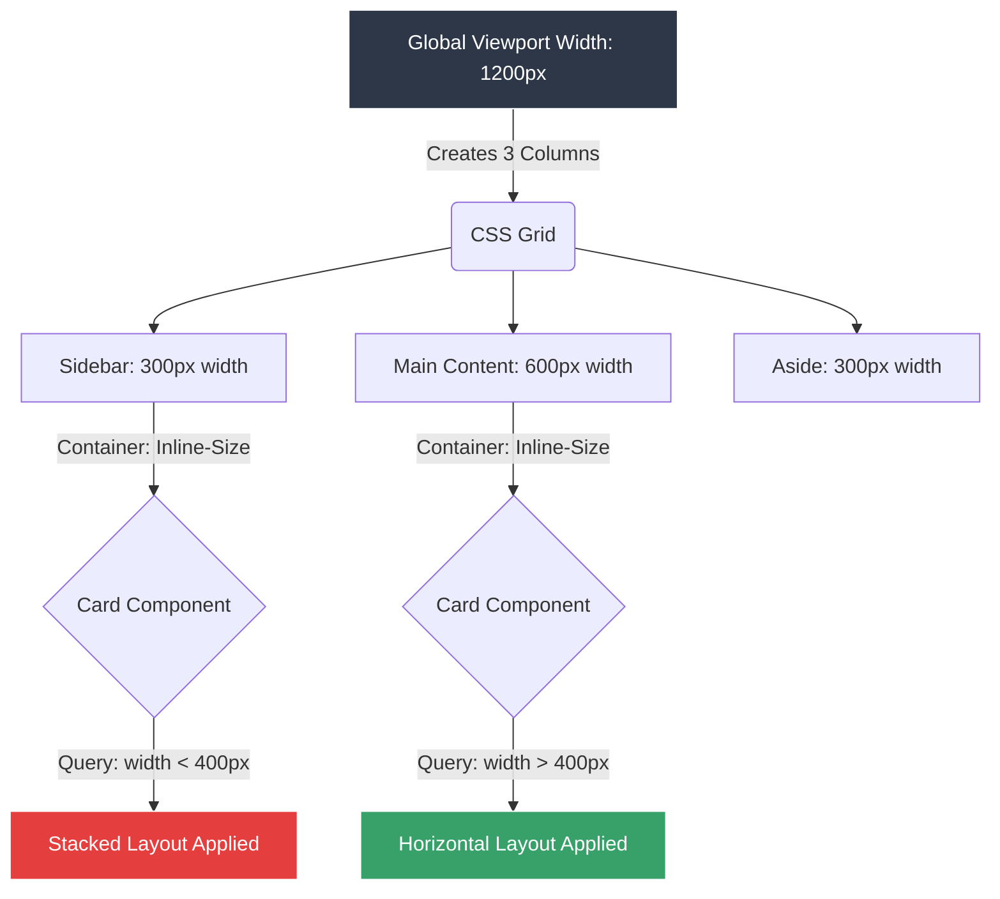

# CSS Lesson: Container Queries Basics

## 0. PREAMBLE: Context & Prerequisites

### 0.1 Prerequisites
Before starting this lesson, the student must understand:
* Media Queries (`@media`)
* The Box Model and Intrinsic vs Extrinsic Sizing
* Basic CSS Containment Concepts

### 0.2 Learning Dependencies
* ✓ The Box Model
* ✓ Formatting Contexts
* ✓ Responsive Media Queries

### 0.3 Specification Reference
* **Specification:** CSS Containment Module Level 3
* **Relevant Sections:** Container Queries (`@container`), Container Query Lengths (`cqw`, `cqh`, etc.)

---

## 1. Mental Model & Problem

Historically, responsive design relied on the viewport. If you wanted a card component to change from a stacked layout to a horizontal layout, you used a `@media` query based on the screen width.

**The Problem:** What if you place that card in a narrow sidebar on a wide desktop screen? The viewport is wide, so the media query triggers the horizontal layout, but the sidebar is narrow, so the card breaks or overflows. Developers had to write highly specific, context-dependent CSS (e.g., `.sidebar .card { ... }`) to override the media queries.

**The Solution:** Container Queries (`@container`). They allow a component to query the dimensions of its parent or ancestor, rather than the browser window. This makes components truly modular and context-independent.

**What This Feature Does NOT Do:**
* ❌ 1. **Does not query the element itself:** An element cannot query its own size to change its own styles. It must query an ancestor that has been declared as a container.
* ❌ 2. **Does not replace Grid/Flexbox:** Container queries complement, rather than replace, intrinsic sizing modules like Flexbox and Grid.
* ❌ 3. **Does not query height by default:** Unless explicitly configured to contain both axes (`container-type: size`), container queries typically only evaluate the inline-size (width).

---

## 2. Complete Language Reference & Value Grammar

### Formal Syntax Table: `container-type`
* **Accepted Value Types:** `normal | size | inline-size`
* **Initial Value:** `normal`
* **Inherited:** No
* **Applies To:** All elements

### Formal Syntax Table: `container-name`
* **Accepted Value Types:** `none | <custom-ident>+`
* **Initial Value:** `none`
* **Inherited:** No
* **Applies To:** All elements

### Formal Syntax Table: `container` (Shorthand)
* **Syntax:** `<'container-name'> [ / <'container-type'> ]?`
* **Example:** `container: my-layout / inline-size;`

### Formal Syntax Table: `@container`
* **Syntax:** `@container <container-condition> { <stylesheet> }` or `@container <container-name> <container-condition> { <stylesheet> }`
* **Example:** `@container (width > 400px) { ... }`

---

## 3. Complete Feature Surface

To use Container Queries, you need two parts: the **container** and the **query**.

1. **Defining the Container:**
   ```css
   .card-wrapper {
     container-type: inline-size;
     container-name: card; /* Optional, but recommended for specificity */
   }
   ```
2. **Writing the Query:**
   ```css
   @container card (min-width: 500px) {
     .card-content {
       display: flex;
     }
   }
   ```

### Container Query Units
A massive benefit of Container Queries is the introduction of Container Query Length units:
* `cqw`: 1% of a query container's width.
* `cqh`: 1% of a query container's height.
* `cqi`: 1% of a query container's inline size.
* `cqb`: 1% of a query container's block size.
* `cqmin` / `cqmax`: The smaller or larger value of `cqi` and `cqb`.

---

## 4. Evolution & Modern CSS

* **Historical syntax:** Developers used JavaScript ResizeObservers to detect element width changes, dynamically applying `.is-wide` or `.is-narrow` classes to elements.
* **Modern syntax:** Native `@container` support in CSS. Introduced as part of CSS Containment Module Level 3.
* **Browser Compatibility:** Fully supported in modern Chrome, Firefox, and Safari. For older browsers, a JavaScript polyfill is required, or graceful degradation using traditional media queries.

---

## 5. Browser Behavior, Formatting Contexts & The Cascade

To prevent infinite loops, the browser must enforce **containment**. If a child querying the parent's size could change the parent's size, the browser would crash in a cyclic dependency.

* **Layout Containment:** `container-type: inline-size` applies layout, style, and inline-size containment. The browser calculates the width of the container *without* considering the inline dimensions of its children.
* **The Cascade Resolution:** Styles applied via `@container` queries follow the standard cascade rules. If a rule inside a `@container` has the same specificity as a rule outside it, the source order determines the winner (last declared wins).
* **Intrinsic Sizing Impact:** An element with `container-type: inline-size` loses its ability to shrink-wrap its contents on the inline axis. Its width must be dictated by its parent, extrinsic styling, or block-level stretching.

---

## 6. Browser Algorithm

1. **Parse declaration:** Browser identifies `container-type` and establishes a containment context on the element.
2. **Calculate Container Size:** The browser determines the dimension of the container. Crucially, because of inline-size containment, it ignores the width requirements of the children inside it.
3. **Evaluate Query:** The browser parses the `@container` conditions. If the condition evaluates to true, the nested CSS rules are injected into the CSSOM evaluation pipeline.
4. **Compute used values:** The children are styled and sized based on the active rules.
5. **Layout & Paint:** The layout tree is updated, and pixels are painted.

---

## 7. Invalid CSS & Error Recovery

* **Invalid Container Name:** If `@container missing-name (min-width: 400px)` refers to a name that does not exist in the ancestor tree, the rule is silently ignored.
* **Querying Itself:** If an element tries to match a `@container` rule, but it is the container itself, it will fail. Container queries only apply to descendants of the container.
* **Missing Type:** If an element has `container-name` but `container-type: normal` (the default), it cannot be queried for dimensional properties, only style properties (Style Queries).

---

## 8. Interaction With Other CSS Features & CSSOM Runtime

* **Media Queries:** Often used together. A `@media` query might adjust the grid of a page, while a `@container` query adjusts the internal layout of the components sitting inside that grid.
* **Flexbox/Grid:** Container queries are highly synergistic with Grid and Flexbox. A grid dictates the outer space, and the container query dictates the internal consumption of that space.
* **CSS Variables:** You can change custom properties inside a `@container` rule to cascade dynamic values down to the component structure.

---

## 9. Accessibility (A11y)

* **Fluid Typography:** Using `cqi` units is excellent for readable text. Instead of scaling text based on the whole screen (`vw`), scaling text based on the container (`cqi`) ensures that text remains proportional to its visual bounding box. Example: `font-size: clamp(1rem, 2cqi + 0.5rem, 1.5rem);`.
* **Zooming:** Container queries respond correctly to browser zooming. When a user zooms, the pixel values are scaled, and the container dimensions are re-evaluated.

---

## 10. Performance, Runtime Costs & Security

* **Performance:** Very efficient. Because `container-type` applies CSS Containment, the browser can isolate the layout recalculation. When the container resizes, the browser only reflows the contents of the container, not the whole page.
* **Reflow/Repaint:** Altering container sizes (e.g., via a resizable sidebar) will trigger layout recalculations for the descendants, which is expected.
* **Security:** No specific security risks beyond standard CSS exfiltration techniques.

---

## 11. DevTools Investigation

1. Open Chrome DevTools or Firefox Developer Tools.
2. Inspect an element with `container-type`. DevTools will display a `container` badge next to the element in the DOM tree.
3. Click the badge to highlight the container's physical boundaries on the screen.
4. In the Styles pane, rules applied via container queries will explicitly show the `@container` rule boundary, similar to `@media`.
5. Resize the parent element dynamically in the Elements panel or via dragging to watch the query toggle live.

---

## 12. Visual Mental Models

### Container Query Geometry



*The Card Component is identical in the HTML. But because its ancestors (Sidebar and Main Content) have different computed widths, the Container Query evaluates differently for each instance, altering the layout independently of the viewport.*

---

## 13. Prediction Checkpoints

**Prediction:** Look at the following code.
```html
<div class="card-wrapper">
  <div class="card">
    <p>Content</p>
  </div>
</div>
```
```css
.card-wrapper {
  container-type: inline-size;
  width: 300px;
}
@container (min-width: 300px) {
  .card-wrapper { background: red; }
  .card { background: blue; }
}
```
**Question:** What color will `.card-wrapper` be? What color will `.card` be?
**Answer:** `.card-wrapper` will be its default background (transparent). `.card` will be blue.
**Explanation:** A `@container` rule *cannot style the container itself*. It only styles the descendants of the container. Therefore, the rule targeting `.card-wrapper` fails, but the rule targeting `.card` succeeds.

---

## 14. Compare Similar Features

* `@media` vs `@container`:
  * `@media` queries the viewport (the window). Use for macro-layout (page grids, hiding sidebars on mobile).
  * `@container` queries an ancestor element. Use for micro-layout (card internal structures, list item layouts).
* `cqw` vs `vw`:
  * `vw` is 1% of the viewport width. If the screen is 1000px, `10vw` is 100px.
  * `cqw` is 1% of the container width. If the container is 300px wide, `10cqw` is 30px, regardless of the screen width.

---

## 15. Decision Guide

> **I want to...** $\longrightarrow$ **Use...**
* Change a grid from 3 columns to 1 column when the browser window gets small. $\longrightarrow$ **`@media (max-width: ...)`**
* Make a widget switch its internal layout based on where it is placed in the UI. $\longrightarrow$ **`@container`**
* Scale a heading size perfectly relative to the box it lives in. $\longrightarrow$ **`font-size: clamp(..., 5cqi, ...)`**
* Hide an element if the screen is being printed. $\longrightarrow$ **`@media print`**

---

## 16. Common Bugs, Edge Cases & Debugging Workflow

### Common Bugs Table
| Symptom | Cause | Browser Behavior | Solution |
| :--- | :--- | :--- | :--- |
| Container query CSS isn't applying | Forgot `container-type` on parent | Query fails to find a valid container and is ignored | Add `container-type: inline-size;` to the wrapper |
| Container collapses to 0 width | Element lost intrinsic sizing due to containment | `inline-size` containment forces the element to ignore child widths | Ensure the container has an explicit width or is stretched by Flex/Grid |
| Trying to query height fails | `container-type` is set to `inline-size` | Browser only tracks width | Use `container-type: size` (requires explicit height on container) |

### Diagnostic Workflow Checklist
1. Is the `container-type: inline-size` applied to an *ancestor* of the element I'm trying to style?
2. Did I inadvertently style the container itself inside the `@container` block?
3. In DevTools, is the container computing to the width I expect? (Check for collapsing).
4. If using a named container (`@container my-name`), does the ancestor actually have `container-name: my-name`?

---

## 17. Interactive Experiments (Throwaway Labs)

**Experiment 1: The Collapsing Container**
1. Create a `div` with `container-type: inline-size; display: inline-block;`.
2. Place text inside it.
3. Observe in DevTools that the `div` collapses to 0 width.
4. **Why?** Inline-size containment tells the browser to determine width *without* looking at children. Since `inline-block` normally shrink-wraps children, it has no children to measure, so it evaluates to 0. Add `width: 100%` or use `display: block` to fix it.

**Experiment 2: Container Units**
1. Set a container to `width: 400px; container-type: inline-size;`.
2. Give a child element `width: 50cqw; height: 50cqw; background: red;`.
3. Notice the child is exactly 200px by 200px, dynamically tied to the parent box!

---

## 18. Real Project Integration

* **Target File:** `/src/styles/components/_product-card.scss`
* **Exact Location:** Card wrapper block.
* **Code Modification:**
  ```css
  .product-card-wrapper {
    container-type: inline-size;
    container-name: product-card;
  }
  
  .product-card {
    display: flex;
    flex-direction: column;
  }
  
  @container product-card (min-width: 600px) {
    .product-card {
      flex-direction: row;
      align-items: center;
    }
  }
  ```
* **Engineering Justification:** The product card is used in both the main shopping grid (where it might be wide) and the related-items sidebar (where it is narrow). By using a container query, the card autonomously decides if it has enough room for a horizontal layout, removing the need for contextual overrides from the grid/sidebar parent classes.

---

## 19. Mastery Challenge

**Find & Fix the Bug:**
A developer complains that their container query is not triggering.

```html
<section class="banner" style="width: 800px;">
  <div class="hero-text">Welcome</div>
</section>
```
```css
.banner {
  container-name: hero;
}

@container hero (min-width: 500px) {
  .hero-text {
    font-size: 3rem;
  }
}
```

**Identify the architectural failure:** The developer defined a `container-name`, but omitted the `container-type`. By default, `container-type` is `normal`, which does not establish dimensional containment. Therefore, dimensional queries like `(min-width: 500px)` cannot evaluate against it.
**The Fix:** Add `container-type: inline-size;` to the `.banner` class.

---

## 20. Mastery Checklist

- [x] I can explain the problem this feature solves and its mental model in my own words.
- [x] I can state at least three incorrect assumptions about what this feature does *not* do.
- [x] I know the complete formal grammar, accepted value types, default values, and inheritance behavior.
- [x] I can trace the browser's algorithm and intrinsic sizing rules for resolving this feature.
- [x] I can predict error recovery behaviors for invalid values.
- [x] I can investigate and verify this property using Browser DevTools and understand its CSSOM manipulation.
- [x] I understand all accessibility (a11y), security, and performance implications (reflow vs repaint).
- [x] I have applied this pattern cleanly to the ongoing real-world project.
