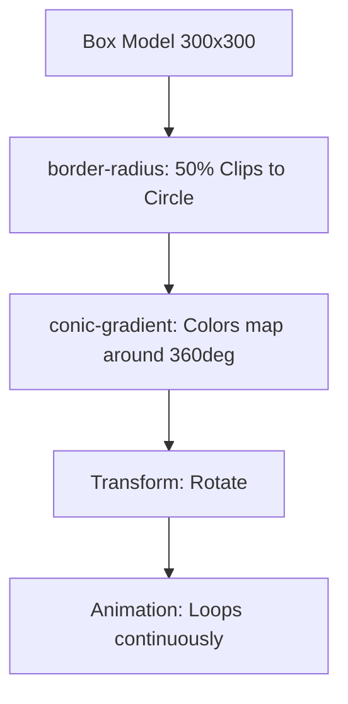

# CSS Radar Sweep: Conic Gradients & Infinite Rotation

## 0. PREAMBLE: Context & Prerequisites

### 0.1 Prerequisites
Before starting this lesson, the student must understand:
* Basic Box Model (width, height, border-radius)
* Colors and transparency (`rgba()`, `transparent` keyword)

### 0.2 Learning Dependencies
A property or feature often relies on structural mechanics from across the curriculum. Declare the dependency graph:
* ✓ The Box Model (Module 4)
* ✓ Generated Images / Gradients (Module 8)
* ✓ Transforms & Animations (Module 12)

### 0.3 Specification Reference
* **Specification:** [CSS Image Values and Replaced Content Module Level 4](https://www.w3.org/TR/css-images-4/#conic-gradients)
* **Relevant Sections:** Conic Gradients, CSS Animations Level 1, CSS Transforms Level 1

---

## 1. Mental Model & Problem

* **What physical or structural problem does this feature solve?** Creating circular, sweeping visual effects (like a radar scanner or pie chart) natively in CSS without relying on SVG, canvas, or raster images.
* **Why did the CSS Working Group introduce it?** Before `conic-gradient`, developers had to hack multiple half-circle masks and rotations to achieve pie-chart-like or radar-like structures. `conic-gradient` provides a native declarative way to map colors around a center point.
* **What part of the browser's architecture does it modify?** It generates a synthetic background image during the Paint phase, while `transform: rotate` taps into the Compositor phase for hardware-accelerated movement.
* **What This Feature Does NOT Do:**
  * ❌ 1. Does not create 3D geometry; it is strictly a 2D painted image mapped to a box.
  * ❌ 2. Does not inherently clip overflow on its own; you must use `border-radius: 50%` to make the box circular.
  * ❌ 3. Does not interact with text paths; text will not curve around the gradient automatically.

---

## 2. Complete Language Reference & Value Grammar

### `conic-gradient()`
* **Formal Syntax Table:**
  * **Accepted Value Types & Keywords:** `conic-gradient( [ from <angle> ]? [ at <position> ]?, <angular-color-stop-list> )`
  * **CSS Value Grammar Types Taught:** `<angle>` (deg, turn, rad, grad), `<position>` (center, top, left, percentages), `<color>`
  * **Initial Value:** `from 0deg at center`
  * **Inherited:** No
  * **Animatable:** Yes (as a continuous color mapping, though often we animate the box via `transform` instead for performance)
  * **Applies To:** All elements (as a background-image or border-image)
  * **Percentages:** Relative to the bounding box of the element (for positioning the center).
  * **Computed Value:** As specified.
  * **Default Browser Behavior:** Draws a gradient sweeping around a central point, starting from the top (12 o'clock).

### `animation` & `transform: rotate()`
* **Animation Shorthand:** `<single-animation-name> || <time> || <easing-function> || <time> || <single-animation-iteration-count> || <single-animation-direction> || <single-animation-fill-mode> || <single-animation-play-state>`
* **Rotate Transform:** `rotate(<angle>)`

---

## 3. Complete Feature Surface

* **Starting Angle:** `from 45deg`, `from 0.5turn`
* **Center Position:** `at 50% 50%`, `at top left`, `at 10px 20px`
* **Color Stops:** `rgba(0, 255, 0, 1) 0deg, transparent 90deg`
* **Infinite Animation:** `animation: radar-sweep 2s linear infinite;`

---

## 4. Evolution & Modern CSS

* **Historical syntax:** Developers used multiple nested divs, `clip: rect(...)`, and `border-radius` to simulate pie slices.
* **Modern syntax:** `conic-gradient()` natively generates the exact pixel mapping.
* **Browser compatibility:** Widely supported in all modern browsers. Fallbacks (via `@supports`) can render a simple `radial-gradient` or solid color.

---

## 5. Browser Behavior, Formatting Contexts & The Cascade

* **The Cascade Resolution Order Algorithm:** Gradients act as images. They override `background-color`.
* **Rendering Stages:**
  * **Paint:** The `conic-gradient` is painted onto the element's background layer.
  * **Compositing:** The `transform: rotate(360deg)` coupled with an infinite animation forces the browser to promote the element to a separate GPU layer, rotating the painted image mathematically without repainting every frame.
* **Stacking Contexts:** Applying `transform` or `animation` on an element creates a new Stacking Context.

---

## 6. Browser Algorithm

1. **Parse declaration:** Browser identifies `background: conic-gradient(...)` and `@keyframes`.
2. **Compute used value:** Resolves physical center point and color stop angles.
3. **Paint:** Rasterizes the mathematical gradient function into a bitmap layer sized to the element.
4. **Composite:** The `animation` orchestrates the `transform` matrix, spinning the layer on the GPU independently of the main thread.

---

## 7. Invalid CSS & Error Recovery

* **Invalid syntax:** `conic-gradient(red, blue 100px)` -> invalid (conic gradients use angles, not lengths). The declaration is dropped.
* **Missing center point keyword:** `conic-gradient(at 50, red, blue)` -> invalid (needs % or px unit for position).
* **Parser error recovery:** If `conic-gradient` is dropped, the browser falls back to a previous `background-color` or `background-image` if provided.

---

## 8. Interaction With Other CSS Features & CSSOM Runtime

* **The Box Model:** `border-radius: 50%` masks the square gradient into a circle.
* **Custom Properties:** Highly effective to pass dynamic angles or colors via `--sweep-color: rgba(0, 255, 0, 1)`.
* **CSSOM & Runtime Manipulation:** Animating CSS Custom Properties directly inside `@keyframes` using `@property` is possible, but animating the `transform` is vastly more performant.

---

## 9. Accessibility (A11y)

* **Reduced motion preferences:** Infinite spinning animations can cause vestibular disorders or distraction.
  ```css
  @media (prefers-reduced-motion: reduce) {
    .radar {
      animation: none;
      /* Static visual fallback */
    }
  }
  ```

---

## 10. Performance, Runtime Costs & Security

* **Rendering Stage Triggered:**
  * `background: conic-gradient(...)`: Triggers Paint on initialization.
  * `transform: rotate(...)` in `@keyframes`: Triggers GPU Composite exclusively (highly performant, 60fps+).
* **Performance Trap:** Animating the gradient angles *directly* (e.g., `conic-gradient(from var(--angle)...)`) forces a full Repaint every frame. Always rotate the container via `transform` instead.

---

## 11. DevTools Investigation

1. Open **Styles Pane**.
2. Find the `.radar` element.
3. Observe the `background` property. Click the small gradient preview icon next to the value to open the visual gradient editor.
4. Open the **Animations** or **Performance** tab, record, and verify that the animation runs on the Compositor Thread (no Paint flashes during rotation).

---

## 12. Visual Mental Models



```text
 12 o'clock (0deg/360deg)
       |
     . - .       <-- Green (Solid)
   /       \     <-- Fading to transparent
9 -    +    - 3  <-- Transparent
   \       /     <-- Transparent
     ' - '
       |
  6 o'clock (180deg)
```

---

## 13. Prediction Checkpoints

**Snippet:**
```css
.scanner {
  background: conic-gradient(red 0deg, blue 90deg, red 90deg);
}
```
**Prediction:** What does this gradient look like?
**Explanation:** It creates a sharp, hard edge at 90 degrees. From 0 to 90 it blends red to blue, then instantly snaps back to red at 90, remaining red for the rest of the circle.

---

## 14. Compare Similar Features

* **`conic-gradient()` vs `radial-gradient()`:** Radial gradients radiate outward from the center (like ripples). Conic gradients rotate around the center (like a radar or clock hands).
* **`transform: rotate()` vs animating `--angle`:** Rotating the physical box uses hardware acceleration. Animating custom properties driving the gradient forces CPU repaints.

---

## 15. Decision Guide

> **I want to...** $\longrightarrow$ **Use...**
* Create a pie chart $\longrightarrow$ `conic-gradient()` with hard color stops.
* Create a radar sweeping effect $\longrightarrow$ `conic-gradient()` with soft stops + `transform: rotate()`.
* Create a pulsing orb $\longrightarrow$ `radial-gradient()` + `transform: scale()`.

---

## 16. Common Bugs, Edge Cases & Debugging Workflow

* **Common Bugs Table:**
  * **Symptom:** The sweeping tail looks blocky or doesn't reach the edge.
  * **Cause:** The box is rectangular, not square.
  * **Solution:** Ensure `width` and `height` are strictly equal, or use `aspect-ratio: 1`.

* **Diagnostic Workflow Checklist (The Professional 9-Point Process):**
  1. Is the selector matching?
  2. Is the syntax valid (using angles, not lengths for conic stops)?
  3. Are CSS variables resolving properly?
  4. Is `border-radius: 50%` applied to create the circular mask?
  5. Is the animation running, or stopped by `prefers-reduced-motion`?

---

## 17. Interactive Experiments (Throwaway Labs)

**HTML:**
```html
<div class="radar"></div>
```

**CSS:**
```css
.radar {
  width: 200px;
  height: 200px;
  border-radius: 50%;
  background: conic-gradient(
    rgba(0, 255, 0, 1) 0deg,
    rgba(0, 255, 0, 0) 90deg,
    transparent 360deg
  );
  animation: sweep 2s linear infinite;
}

@keyframes sweep {
  to {
    transform: rotate(360deg);
  }
}
```
**Experiment 1:** Change `90deg` to `180deg` to make the tail longer.
**Experiment 2:** Change `linear` to `ease-in-out`. Notice how the radar speed fluctuates, destroying the constant scanning illusion.

---

## 18. Real Project Integration

* **Target File:** `src/components/ScannerUi.css`
* **Exact Location:** Appended to `.scanner-module` styles.
* **Code Modification:**
```diff
 .scanner-module {
   position: relative;
   width: 300px;
   height: 300px;
+  border-radius: 50%;
+  background: conic-gradient(from 0deg, var(--scan-color) 0deg, transparent 60deg);
+  animation: radar-spin 3s linear infinite;
 }
+
+@keyframes radar-spin {
+  100% { transform: rotate(360deg); }
+}
```
* **Engineering Justification:** Achieves a complex visual scanning overlay with exactly zero DOM nodes beyond the container, leveraging 100% hardware-accelerated movement for zero main-thread impact.

---

## 19. Mastery Challenge

**Find & Fix the Bug:**
```css
.radar {
  width: 100px;
  height: 100px;
  border-radius: 50%;
  background: conic-gradient(red 0px, blue 50px);
  animation: rotate 1s infinite;
}
```
**Fix:** The stops in `conic-gradient` must use angles (`deg`, `turn`), not pixel lengths (`px`). Furthermore, `animation` requires a timing function like `linear` and a valid `@keyframes` declaration for `rotate`.

---

## 20. Mastery Checklist

- [ ] I can explain the problem this feature solves and its mental model in my own words.
- [ ] I can state at least three incorrect assumptions about what this feature does *not* do.
- [ ] I know the complete formal grammar, accepted value types, default values, and inheritance behavior.
- [ ] I can trace the browser's algorithm and intrinsic sizing rules for resolving this feature.
- [ ] I can predict error recovery behaviors for invalid values.
- [ ] I can investigate and verify this property using Browser DevTools and understand its CSSOM manipulation.
- [ ] I understand all accessibility (a11y), security, and performance implications (reflow vs repaint).
- [ ] I have applied this pattern cleanly to the ongoing real-world project.
