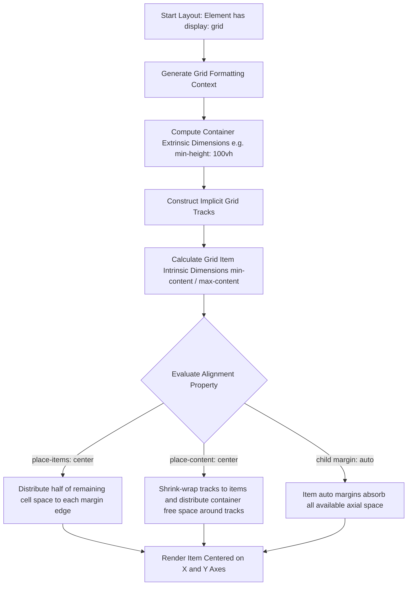
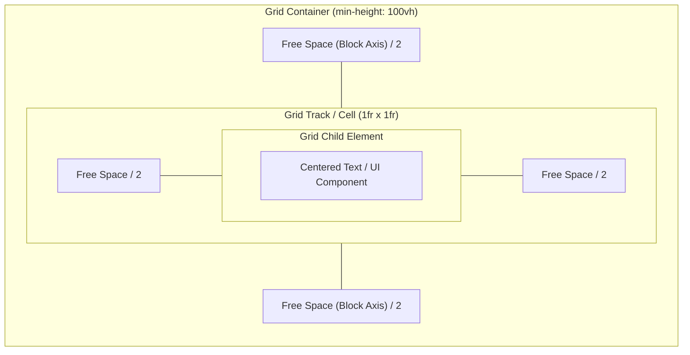

# Grid Centering

**Name:** Grid Centering  
**Category:** Layout & Alignment  
**Difficulty:** 1/5  
**What it produces:** A container that effortlessly centers its child element(s) both horizontally and vertically with as little as two lines of CSS (`display: grid; place-items: center;` or `place-content: center;`), adapting dynamically to arbitrary child dimensions and viewports.  
**Why it works:** `display: grid` establishes a Grid Formatting Context (GFC). The shorthand `place-items: center` (or `place-content: center`) sets both block-axis alignment (`align-items` / `align-content`) and inline-axis alignment (`justify-items` / `justify-content`) to `center`, distributing all available free track and cell space equally around the grid items.  
**Required CSS concepts:** The Box Model, CSS Grid Formatting Contexts, CSS Box Alignment Module Level 3 (`place-items`, `place-content`, `place-self`, `margin: auto`).  
**HTML structure:**
```html
<div class="grid-container">
  <div class="grid-child">Centered Content</div>
</div>
```
**CSS implementation:**
```css
.grid-container {
  display: grid;
  place-items: center;
  min-height: 100vh; /* Provides the vertical block axis space to distribute */
}
```
**Variations:**
1. **Track Content Centering:** `display: grid; place-content: center;` (centers the entire grid track matrix inside the container).
2. **Item-Level Self Centering:** `.grid-child { place-self: center; }` (target child controls its own alignment within its grid cell).
3. **Auto Margin In Grid:** `.grid-child { margin: auto; }` inside a `display: grid` container (absorbs free space across both axes).
4. **Stacked Superposition Centering:** Multiple children placed in `grid-area: 1 / 1` and centered simultaneously on top of one another.  
**Parameters to experiment with:** Container `min-height`, `place-items` vs `place-content`, `gap`, adding multiple children, `safe center` overflow behavior.  
**Common mistakes:** Forgetting to set a height/min-height on the container (causing height shrink-wrapping to content), confusing `place-items` with `place-content` when handling multiple grid tracks, using invalid values like `middle` instead of `center`.  
**Browser considerations:** Universal support across all modern browsers (Chrome, Firefox, Safari, Edge). The `safe center` alignment keyword prevents unscrollable data loss in constrained viewports.  
**Acceptance criteria:** The target element sits exactly at the geometric center of both X and Y axes of the container, remaining robustly centered without layout shifts during responsive viewport resizing.

---

## 0. PREAMBLE: Context & Prerequisites

### 0.1 Prerequisites
Before mastering Grid Centering, the developer should understand:
* **The Box Model:** Content box, padding, border, and margin calculations.
* **Block vs Inline Formatting:** How elements flow in standard normal flow.
* **Intrinsic vs Extrinsic Sizing:** The difference between content-derived dimensions (`max-content`, `min-content`) and defined lengths (`px`, `rem`, `%`, `vh`).

### 0.2 Learning Dependencies
* ✓ The Box Model
* ✓ CSS Formatting Contexts (BFC vs FFC vs GFC)
* ✓ CSS Box Alignment Module Level 3

### 0.3 Specification Reference
* **Specification:** [W3C CSS Grid Layout Module Level 2](https://www.w3.org/TR/css-grid-2/)
* **Alignment Specification:** [W3C CSS Box Alignment Module Level 3](https://www.w3.org/TR/css-align-3/)
* **Relevant Sections:** Section 10 (Grid Item Alignment), Section 5 (Box Alignment Properties: `justify-items`, `align-items`, `justify-content`, `align-content`, `place-items`, `place-content`).

---

## 1. Mental Model & Problem

### The Historic Problem
Centering elements vertically and horizontally simultaneously has long been a notorious challenge in CSS history. Traditional approaches suffered from distinct drawbacks:
* **Table Display (`display: table-cell; vertical-align: middle;`):** Clunky markup semantics and inflexible document flow.
* **Absolute Positioning + Transform (`top: 50%; left: 50%; transform: translate(-50%, -50%);`):** Removes element from normal document flow, breaks natural height calculations of parents, and can trigger blurry text rendering due to sub-pixel rasterization.
* **Flexbox (`display: flex; justify-content: center; align-items: center;`):** Excellent 1D solution requiring 3 separate property declarations.

### The CSS Grid Solution
CSS Grid creates a two-dimensional Grid Formatting Context. Within this context:
1. The container generates implicit grid tracks (rows and columns).
2. The Box Alignment properties (`align-*` for the block axis, `justify-*` for the inline axis) control how space is distributed.
3. The shorthand property `place-items: <align-items> <justify-items>` (or `place-content: <align-content> <justify-content>`) collapses two-axis alignment into a single concise declaration.

```text
+-------------------------------------------------------------+
| Container (display: grid; min-height: 100vh;)               |
|                                                             |
|                    Top Free Space (Y / 2)                   |
|                                                             |
|              +-------------------------------+              |
|  Left Free   |           Grid Item           |  Right Free  |
|  Space (X/2) |    (place-items: center)      |  Space (X/2) |
|              +-------------------------------+              |
|                                                             |
|                   Bottom Free Space (Y / 2)                 |
|                                                             |
+-------------------------------------------------------------+
```

### What This Feature Does NOT Do:
* ❌ **1. It does not remove elements from normal flow:** Unlike `position: absolute`, the centered grid item continues to participate in the layout tree and affects container boundaries.
* ❌ **2. It does not force fixed dimensions:** Grid centering respects the item's intrinsic content size (`min-content`, `max-content`) unless explicit dimensions are declared.
* ❌ **3. It does not automatically guarantee scrollability on overflow by default:** If the child is larger than the container, standard `center` pushes overflow equally in all directions (including negative coordinate space), potentially clipping content off-screen unless `safe center` is specified.

---

## 2. Complete Language Reference & Value Grammar

CSS Grid Centering utilizes properties standardized under the CSS Box Alignment Module Level 3.

### `place-items`
Shorthand for `align-items` (block axis) and `justify-items` (inline axis).
* **Formal Syntax:** `place-items: <'align-items'> <'justify-items'>?`
  * If the second value is omitted, it is assigned the same value as the first.
* **Accepted Values:** `normal | stretch | center | start | end | self-start | self-end | baseline | [ first | last ]? baseline | [ safe | unsafe ]? [ center | start | end | self-start | self-end ]`
* **Initial Value:** `normal`
* **Inherited:** No
* **Animatable:** Discrete
* **Applies To:** Block containers, Grid containers, Flex containers

### `place-content`
Shorthand for `align-content` (block axis space distribution) and `justify-content` (inline axis space distribution).
* **Formal Syntax:** `place-content: <'align-content'> <'justify-content'>?`
  * If the second value is omitted, the second value is copied from the first (if valid).
* **Accepted Values:** `normal | center | start | end | space-between | space-around | space-evenly | stretch | [ safe | unsafe ]? [ center | start | end ]`
* **Initial Value:** `normal`
* **Inherited:** No
* **Animatable:** Discrete
* **Applies To:** Grid containers, Flex containers, Multicol containers

### `place-self`
Shorthand applied directly to a grid item for `align-self` and `justify-self`.
* **Formal Syntax:** `place-self: <'align-self'> <'justify-self'>?`
* **Accepted Values:** `auto | normal | stretch | center | start | end | self-start | self-end | baseline | [ safe | unsafe ]? center`
* **Initial Value:** `auto`
* **Inherited:** No
* **Animatable:** Discrete
* **Applies To:** Grid items, Flex items, absolutely-positioned boxes

---

## 3. Complete Feature Surface

### 1. The Two-Line Master Recipe
The most concise and popular way to center any content on both axes:

```css
.center-box {
  display: grid;
  place-items: center;
  min-height: 100vh;
}
```

### 2. `place-items: center` vs `place-content: center`
Understanding the structural distinction between `place-items` and `place-content` is critical for senior CSS engineering:

| Feature | `place-items: center` | `place-content: center` |
| :--- | :--- | :--- |
| **Mechanic** | Aligns items **inside their grid cells/tracks**. | Aligns the **entire grid track system** inside the grid container. |
| **Track Size Effect** | Tracks stretch to fill container by default; items are centered inside those tracks. | Tracks shrink-wrap to item sizes; tracks themselves are grouped and centered in the container. |
| **Multiple Items** | Centers each item in its independent row/column cell. | Packs all rows/columns together into a centered cluster. |

```css
/* Packing multi-item layouts into the center */
.cluster-container {
  display: grid;
  grid-template-columns: repeat(2, 120px);
  gap: 16px;
  place-content: center; /* The entire 2-column grid is centered in the viewport */
  min-height: 100vh;
}
```

### 3. Grid Child Auto-Margins (`margin: auto`)
In a Grid Formatting Context, `margin: auto` on a grid item absorbs all free space in both dimensions:

```css
.grid-container {
  display: grid;
  min-height: 100vh;
}

.grid-child {
  margin: auto; /* Perfectly centers child horizontally and vertically */
}
```

### 4. Overlaid / Layered Superposition Centering
CSS Grid allows placing multiple elements in the exact same track cell (`grid-area: 1 / 1`), centering all layers (e.g., background art, spinners, modal dialogs, badges) seamlessly without `position: absolute`:

```css
.hero-stack {
  display: grid;
  place-items: center;
}

.hero-stack > * {
  grid-area: 1 / 1; /* All children share the same centered coordinate */
}
```

---

## 4. Evolution & Modern CSS

* **CSS1 / CSS2 (1996–1998):** `margin: 0 auto` (horizontal only), `vertical-align: middle` (tables and inline elements only).
* **CSS 2.1 Era Hacks (2000s):** Absolute positioning with negative margins (`top: 50%; margin-top: -[half-height]px`), requiring hardcoded dimensions.
* **CSS3 Transforms (2011+):** `position: absolute; top: 50%; left: 50%; transform: translate(-50%, -50%);` — dynamic dimensions supported, but disconnected from flow.
* **Flexbox (2012+):** `display: flex; justify-content: center; align-items: center;` — 3 declarations, 1D flow.
* **Modern CSS Grid (2017+):** `display: grid; place-items: center;` — 2 declarations, true 2D alignment engine.
* **Modern Box Alignment Level 3 (`safe center`):** Adds overflow safety to prevent unrecoverable clipping in responsive mobile interfaces.

---

## 5. Browser Behavior, Formatting Contexts & The Cascade

### Formatting Context Algorithm (GFC)
1. **Container Establishment:** Declaring `display: grid` or `display: inline-grid` on an element turns it into a grid container and establishes a **Grid Formatting Context** for its direct children.
2. **Implicit Grid Creation:** Direct children become grid items. When no explicit `grid-template-rows` or `grid-template-columns` are defined, the browser generates an implicit $1 \times 1$ grid track sizing to `auto`.
3. **Space Determination:** The browser computes the used height and width of the grid container (resolving `min-height`, `height`, `max-height`, padding, and borders).
4. **Alignment Calculation:**
   * In `place-items: center`, the track stretches across the available container area. The item's margin box is measured. The difference between track size and item size is calculated ($S_{free} = S_{track} - S_{item}$).
   * The offset applied to the item is $Offset = S_{free} / 2$.
5. **Compositing & Paint:** Item is placed at calculated offsets without triggering sub-pixel blur because coordinates resolve to clean layout grid offsets.

---

## 6. Browser Algorithm Step-by-Step



---

## 7. Invalid CSS & Error Recovery

* **Invalid keyword `middle`:**
  ```css
  /* INVALID - Ignored by CSS parser */
  .box {
    display: grid;
    place-items: middle; /* Property dropped */
  }
  ```
  *Browser Recovery:* Property declaration is discarded. Alignment falls back to `place-items: normal` (items stretch along both axes).
* **Missing Block Axis Height:**
  ```css
  /* INEFFECTIVE VERTICAL CENTERING */
  .box {
    display: grid;
    place-items: center;
    /* Missing height / min-height */
  }
  ```
  *Browser Behavior:* The grid container shrink-wraps its height to the child's height. Vertical free space is `0px`. Horizontal centering succeeds, but vertical centering produces no visual effect.

---

## 8. Interaction With Other CSS Features & CSSOM Runtime

### Interaction with CSS Transforms
Unlike `transform: translate(-50%, -50%)`, grid centering does not occupy the `transform` property. Developers are completely free to apply 3D transforms, scale animations, or hover effects without overriding the centering logic:

```css
.card {
  transition: transform 0.3s cubic-bezier(0.2, 0.8, 0.2, 1);
}
.card:hover {
  transform: translateY(-8px) scale(1.02); /* Works cleanly without breaking center alignment */
}
```

### Interaction with `writing-mode`
Grid alignment automatically respects internationalization and logical dimensions:
* `align-items` aligns along the **block axis** (vertical in `horizontal-tb`, horizontal in `vertical-rl`).
* `justify-items` aligns along the **inline axis** (horizontal in `horizontal-tb`, vertical in `vertical-rl`).

### JavaScript CSSOM Manipulation
Alignment properties can be read or modified dynamically via standard CSSOM interfaces:
```javascript
const container = document.querySelector('.grid-container');
container.style.placeItems = 'center';
console.log(getComputedStyle(container).alignItems); // "center"
console.log(getComputedStyle(container).justifyItems); // "center"
```

---

## 9. Accessibility (A11y) & Usability

### 1. Visual Order vs DOM Order
Grid centering does not alter the DOM source tree. Screen readers traverse content in natural logical order, preserving heading hierarchies, focus order, and tab indices.

### 2. Scroll Clipping & The `safe` Keyword
When a centered element becomes larger than the viewport (e.g., small mobile screens or high browser zoom), standard `center` alignment centers the item relative to the container overflow box. This pushes the top and left edges into negative coordinate space, making them **permanently unreachable by scrolling**.

**The Solution:** Use `safe center`:
```css
.modal-container {
  display: grid;
  place-items: safe center;
  min-height: 100vh;
}
```
*Behavior:* If content fits, it centers perfectly. If content overflows, the browser automatically switches alignment to `start`, ensuring the user can scroll to read the top/beginning of the document.

---

## 10. Performance, Runtime Costs & Security

* **Layout / Reflow Phase:** Grid centering resolves during the browser's standard Layout pass.
* **Comparison with Transforms:** 
  * `transform: translate(-50%, -50%)` avoids layout recalculations during animations, but when used purely for static layout, it can trigger subpixel blur on text and icons when screen pixel densities create fractional offsets ($0.5\text{px}$).
  * `display: grid; place-items: center;` snaps directly to the layout pixel grid, rendering crystal-clear typography and crisp vector icons.
* **Paint Phase Costs:** Zero additional paint overhead or GPU memory pressure compared to standard block flow.

---

## 11. DevTools Investigation

To inspect and debug Grid Centering in Chromium DevTools, Firefox Developer Tools, or Safari Web Inspector:

1. **Activate the Grid Badge:** Inspect the container element and click the **`grid`** badge in the Elements/DOM tree to render the Grid Outline Overlay.
2. **Observe Grid Lines & Tracks:** DevTools will draw dashed lines highlighting track bounds and hatched patterns in empty track areas.
3. **Inspect the Layout Pane:**
   * Open the **Layout** tab in DevTools.
   * Under **Grid**, inspect track dimensions and verify that row/column track boundaries reflect expected sizes.
4. **Interactive Alignment Editor:** In Chromium DevTools, click the small layout icon next to `place-items` or `display: grid` in the Styles pane to open the visual CSS Grid Alignment popup tool and toggle between `start`, `center`, `end`, and `stretch` in real time.

---

## 12. Visual Mental Models

### Grid Track vs Cell Alignment



### ASCII Coordinate Map

```text
+=============================================================+  (0, 0)
|  Grid Container [min-height: 100vh]                         |
|                                                             |
|                      ▲ [align-items: center]                |
|                      │                                      |
|              +-------▼-----------------------+              |
| [justify-    |                               | [justify-    |
|  items:  ◄───┤        CENTERED CHILD         ├───►  items:  |
|  center]     |                               |      center] |
|              +-------▲-----------------------+              |
|                      │                                      |
|                      ▼ [align-items: center]                |
|                                                             |
+=============================================================+  (W, H)
```

---

## 13. Prediction Checkpoints

### Checkpoint A
**Snippet:**
```html
<div style="display: grid; place-items: center;">
  <div style="width: 200px; height: 100px; background: red;">Hello</div>
</div>
```
* **Question:** Is the red box centered vertically on the user's screen?
* **Answer:** **No.** Because the parent `div` has no specified height or viewport constraint, its height shrink-wraps to `100px` (the height of the child). The child is horizontally centered within the block width, but has zero vertical space to center within.

### Checkpoint B
**Snippet:**
```html
<div style="display: grid; place-items: center; min-height: 100vh;">
  <div class="card">Card 1</div>
  <div class="card">Card 2</div>
</div>
```
* **Question:** Where do Card 1 and Card 2 appear?
* **Answer:** Card 1 and Card 2 create two implicit rows (by default `grid-auto-flow: row`). Card 1 is centered horizontally within Row 1; Card 2 is centered horizontally within Row 2. The combined two-row structure divides the vertical viewport space.

---

## 14. Compare Similar Centering Features

| Method | Syntax | Lines of CSS | In Document Flow? | Subpixel Text Blur Risk | Multi-Child Behavior |
| :--- | :--- | :---: | :---: | :---: | :--- |
| **CSS Grid** | `display: grid; place-items: center;` | **2** | **Yes** | **None (Crisp)** | Rows/Cols centered in cells |
| **CSS Flexbox** | `display: flex; justify-content: center; align-items: center;` | 3 | Yes | None (Crisp) | Inline flex row by default |
| **Grid Auto-Margin** | `display: grid;` (parent) + `margin: auto;` (child) | 2 | Yes | None (Crisp) | Item absorbs free space |
| **Absolute + Transform** | `position: absolute; top: 50%; left: 50%; transform: translate(-50%, -50%);` | 4+ | No | High (Fractional pixels) | Overlaps all children |

---

## 15. Decision Guide

```text
Do you need to center an element?
│
├── Is it an overlay/tooltip that must strictly ignore layout and float above everything?
│   └── YES ──► Use 'position: absolute / fixed' with CSS Anchor Positioning or Transforms.
│
└── NO (Normal Document Flow)
    │
    ├── Do you want the cleanest, 2-line modern centering syntax?
    │   └── YES ──► Use 'display: grid; place-items: center;'
    │
    ├── Do you need siblings to distribute linearly along a specific flex direction (row/column)?
    │   └── YES ──► Use 'display: flex; justify-content: center; align-items: center;'
    │
    └── Do you have multiple elements that must center and stack on TOP of each other in the same space?
        └── YES ──► Use 'display: grid; place-items: center;' + child 'grid-area: 1 / 1;'
```

---

## 16. Common Bugs, Edge Cases & Debugging Workflow

### Common Bugs & Fixes

1. **Bug: Parent element does not fill the screen.**
   * *Symptom:* Element only centers horizontally.
   * *Root Cause:* Body or parent container has default `height: auto`.
   * *Fix:* Add `min-height: 100vh` or `min-height: 100dvh` to the grid container.

2. **Bug: Child elements stretch to full width/height unexpectedly.**
   * *Symptom:* Child expands to 100% width of container.
   * *Root Cause:* `place-items` omitted; default `align-items: normal` / `stretch` is active.
   * *Fix:* Explicitly declare `place-items: center;` or give child `width: fit-content;`.

3. **Bug: Text cut off at top of screen on mobile screens.**
   * *Symptom:* User cannot scroll up to see the top of a centered dialog.
   * *Root Cause:* Viewport is shorter than the dialog modal.
   * *Fix:* Use `place-items: safe center;` and `padding: 1rem;`.

### Diagnostic Workflow (5-Step Checklist)
1. [ ] Is the parent container declared with `display: grid` or `display: inline-grid`?
2. [ ] Does the container have an explicit block dimension (e.g. `min-height: 100vh` or `height: 100%`)?
3. [ ] Is `place-items: center` or `place-content: center` typed correctly (avoiding `middle`)?
4. [ ] Are child margins conflicting with the layout (e.g. uncontrolled `margin-top`)?
5. [ ] Is `safe center` used if the modal or card could exceed mobile screen bounds?

---

## 17. Interactive Experiments (Complete Code)

Below is a complete, self-contained HTML and CSS demonstration file you can save and test directly in any browser:

### Complete Working Example

```html
<!DOCTYPE html>
<html lang="en">
<head>
  <meta charset="UTF-8">
  <meta name="viewport" content="width=device-width, initial-scale=1.0">
  <title>CSS Grid Centering Demonstration</title>
  <style>
    /* CSS Reset */
    * {
      box-sizing: border-box;
      margin: 0;
      padding: 0;
    }

    body {
      font-family: system-ui, -apple-system, BlinkMacSystemFont, 'Segoe UI', Roboto, sans-serif;
      background: #0f172a;
      color: #f8fafc;
    }

    /* Technique Core: CSS Grid Centering */
    .viewport-center {
      display: grid;
      place-items: center;
      min-height: 100vh;
      padding: 1.5rem;
      background: radial-gradient(circle at center, #1e293b 0%, #0f172a 100%);
    }

    /* Centered Component Styling */
    .glass-card {
      max-width: 440px;
      width: 100%;
      padding: 2.5rem;
      background: rgba(30, 41, 59, 0.7);
      border: 1px solid rgba(255, 255, 255, 0.1);
      border-radius: 16px;
      backdrop-filter: blur(12px);
      box-shadow: 0 25px 50px -12px rgba(0, 0, 0, 0.5);
      text-align: center;
    }

    .badge {
      display: inline-block;
      padding: 0.25rem 0.75rem;
      font-size: 0.75rem;
      font-weight: 700;
      text-transform: uppercase;
      letter-spacing: 0.05em;
      color: #38bdf8;
      background: rgba(56, 189, 248, 0.1);
      border: 1px solid rgba(56, 189, 248, 0.2);
      border-radius: 9999px;
      margin-bottom: 1rem;
    }

    h1 {
      font-size: 1.75rem;
      font-weight: 700;
      margin-bottom: 0.75rem;
      color: #ffffff;
    }

    p {
      color: #94a3b8;
      line-height: 1.6;
      margin-bottom: 1.5rem;
    }

    .code-snippet {
      display: block;
      background: #020617;
      border: 1px solid #1e293b;
      padding: 0.75rem 1rem;
      border-radius: 8px;
      font-family: ui-monospace, SFMono-Regular, Menlo, Monaco, Consolas, monospace;
      font-size: 0.875rem;
      color: #38bdf8;
      text-align: left;
      margin-bottom: 1.5rem;
      overflow-x: auto;
    }

    .btn-action {
      display: inline-flex;
      align-items: center;
      justify-content: center;
      width: 100%;
      padding: 0.75rem 1.5rem;
      font-weight: 600;
      color: #0f172a;
      background: #38bdf8;
      border: none;
      border-radius: 8px;
      cursor: pointer;
      transition: all 0.2s ease;
    }

    .btn-action:hover {
      background: #7dd3fc;
      transform: translateY(-1px);
      box-shadow: 0 10px 15px -3px rgba(56, 189, 248, 0.3);
    }
  </style>
</head>
<body>

  <!-- The Grid Container -->
  <main class="viewport-center">
    
    <!-- The Centered Child Item -->
    <article class="glass-card">
      <span class="badge">Modern CSS Technique</span>
      <h1>Grid Centering</h1>
      <p>This entire container is vertically and horizontally centered with just two CSS properties:</p>
      
      <code class="code-snippet">
display: grid;<br>
place-items: center;
      </code>

      <button type="button" class="btn-action">Interactive Action</button>
    </article>

  </main>

</body>
</html>
```

---

## 18. Real Project Integration

* **Target Component:** Full-Screen Auth / Login Modal or Empty State View
* **Implementation Location:** `src/styles/components/AuthLayout.css`

```diff
+ /* ======================================================== */
+ /* Auth Screen Viewport Centering                           */
+ /* ======================================================== */
+ .auth-viewport {
+   display: grid;
+   place-items: center;
+   min-height: 100dvh;
+   padding: 1.5rem;
+   background-color: var(--color-surface-ground);
+ }
+
+ .auth-card {
+   width: 100%;
+   max-width: 420px;
+   margin: 0; /* Clear arbitrary margins; grid controls alignment */
+ }
```

* **Engineering Justification:** Adopting `display: grid; place-items: center;` replaces legacy absolute positioning hacks, eliminates sub-pixel text rendering blur, guarantees zero-configuration responsive reflows, and reduces CSS footprint.

---

## 19. Mastery Challenge

**Question:**  
You are given a parent container with the following CSS:
```css
.parent {
  display: grid;
  place-items: center;
  min-height: 100vh;
}
```
You place **three** `<div>` items inside `.parent` without any class styles or grid track definitions:
```html
<div class="parent">
  <div>Item 1</div>
  <div>Item 2</div>
  <div>Item 3</div>
</div>
```
1. How many rows and columns are generated?
2. Where does each item visually appear?
3. How would you modify the CSS so all three items overlap each other exactly in the center?

**Answer:**
1. By default, with `grid-auto-flow: row` (the default), the browser generates **3 rows and 1 column** (implicit tracks).
2. Each of the three items is horizontally centered within its respective row cell. The three rows stack vertically, and the entire 3-row cluster is centered within the 100vh height.
3. To place all three items directly on top of each other (superposition centering), set them to occupy the same grid area:
```css
.parent > div {
  grid-area: 1 / 1;
}
```
All three children will occupy row 1, column 1, sharing the exact same centered physical coordinates.

---

## 20. Mastery Checklist

- [ ] I can write the 2-line Grid Centering recipe from memory (`display: grid; place-items: center;`).
- [ ] I understand the structural difference between `place-items: center` (cell-level) and `place-content: center` (track-matrix-level).
- [ ] I know why `margin: auto` inside a Grid container achieves 2-axis centering.
- [ ] I can prevent mobile scroll clipping using `place-items: safe center`.
- [ ] I can diagnose why vertical centering fails when the container lacks a defined block dimension (`min-height`).
- [ ] I can use CSS Grid superposition (`grid-area: 1 / 1`) to center and stack multiple layers simultaneously.
- [ ] I can inspect and debug grid alignment using browser DevTools Grid overlays.
