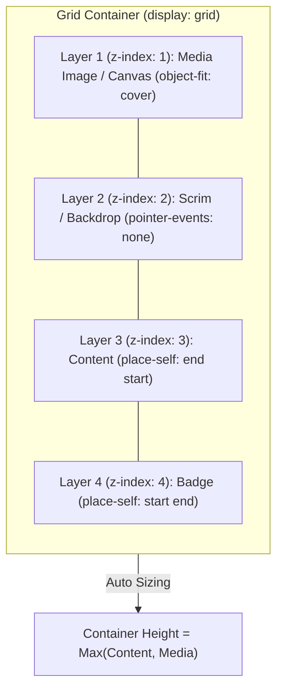
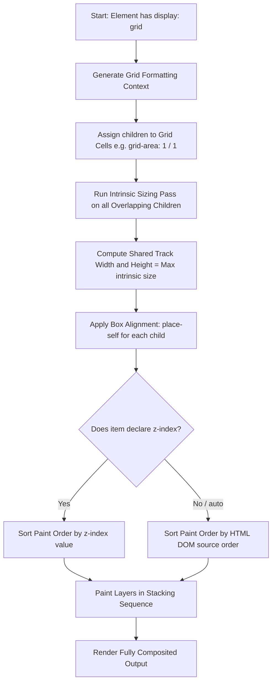

# Grid Overlays

**Name:** Grid Overlays  
**Category:** Layout, Layering & Compositing  
**Difficulty:** 2/5  
**What it produces:** A declarative, robust system for stacking and overlaying multiple child elements (images, scrims, text captions, badges, glassmorphic filters, and interactive controls) in the exact same spatial dimensions or overlapping track coordinates without resorting to `position: absolute`.  
**Why it works:** CSS Grid allows multiple grid items to occupy the identical grid cell or span intersecting grid lines (e.g., `grid-area: 1 / 1` or `grid-column: 1 / -1; grid-row: 1 / -1;`). Because all items participate directly in the Grid Formatting Context (GFC), the container automatically calculates its intrinsic dimensions based on the largest child, preventing container height collapse.  
**Required CSS concepts:** CSS Grid Formatting Contexts (GFC), Line-based Grid Placement (`grid-row`, `grid-column`, `grid-area`), Stacking Contexts & Paint Order (`z-index`, `isolation: isolate`), CSS Box Alignment within Grid Cells (`place-self`, `align-self`, `justify-self`), Pointer Events (`pointer-events: none`).  
**HTML structure:**
```html
<article class="overlay-card">
  
  <div class="overlay-scrim" aria-hidden="true"></div>
  <div class="overlay-content">
    <span class="badge">Featured</span>
    <h2>Exploration Journey</h2>
    <p>Discover uncharted territories with modern layout architecture.</p>
  </div>
</article>
```
**CSS implementation:**
```css
.overlay-card {
  display: grid;
  grid-template-columns: 1fr;
  grid-template-rows: 1fr;
  isolation: isolate; /* Creates a clean, localized stacking context */
  border-radius: 16px;
  overflow: hidden;
}

/* Place every layer into the same 1x1 grid cell */
.overlay-card > * {
  grid-area: 1 / 1;
}

.overlay-media {
  width: 100%;
  height: 100%;
  object-fit: cover;
  z-index: 1;
}

.overlay-scrim {
  background: linear-gradient(to top, rgba(15, 23, 42, 0.9) 0%, rgba(15, 23, 42, 0.2) 60%, transparent 100%);
  z-index: 2;
  pointer-events: none; /* Allows pointer clicks to pass through */
}

.overlay-content {
  z-index: 3;
  display: flex;
  flex-direction: column;
  justify-content: flex-end;
  padding: 1.5rem;
}
```
**Variations:**
1. **Single-Cell Full Stack (`grid-area: 1 / 1`):** All children occupy the exact same single row/column cell.
2. **Span-All Shorthand (`grid-area: 1 / 1 / -1 / -1`):** Layers expand across multi-track explicit grids from first to last line.
3. **Named Area Stack (`grid-template-areas: "hero";`):** Children assign themselves to `.layer { grid-area: hero; }`.
4. **Partial / Offset Overlap:** Item A spans rows 1–3, Item B spans rows 2–4, creating overlapping card banners or floating callouts.
5. **Interactive Reveal Overlays:** Overlay sits in `grid-area: 1 / 1`, transitioning `opacity` and `transform` on `:hover` or `:focus-within`.
**Parameters to experiment with:** `grid-area`, `z-index`, `isolation`, `pointer-events`, `backdrop-filter`, `place-self`, `mix-blend-mode`, `object-fit`.  
**Common mistakes:** Forgetting `pointer-events: none` on decorative scrims (blocking clicks to links below), relying on `position: absolute` which causes parent height collapse, neglecting `isolation: isolate` causing `z-index` conflicts with global page elements, improper DOM source order for screen readers.  
**Browser considerations:** Universal support across all modern evergreen browsers (Chrome, Edge, Firefox, Safari). Stacking context rules on grid items without `position` are fully standardized in CSS Grid Level 1.  
**Acceptance criteria:** All stacked layers render in correct visual depth without container height collapse, text content remains crisp, and interactive controls are fully focusable and clickable.

---

## 0. PREAMBLE: Context & Prerequisites

### 0.1 Prerequisites
Before mastering CSS Grid Overlays, the developer should understand:
* **The Box Model:** Margin, border, padding, and content dimensions.
* **CSS Stacking Contexts & Paint Order:** How `z-index`, opacity, transforms, and DOM source order dictate visual paint hierarchy.
* **CSS Grid Basics:** Grid lines, tracks, cells, grid lines numbering (including positive and negative indices `1` to `-1`), and `grid-area`.

### 0.2 Learning Dependencies
* ✓ CSS Grid Formatting Context (GFC)
* ✓ CSS Line-Based Grid Placement (`grid-row-start`, `grid-row-end`, `grid-column-start`, `grid-column-end`)
* ✓ CSS Box Alignment Level 3 (`place-self`, `align-self`, `justify-self`)
* ✓ Stacking Contexts and `isolation: isolate`

### 0.3 Specification Reference
* **Specification:** [W3C CSS Grid Layout Module Level 2](https://www.w3.org/TR/css-grid-2/)
* **Relevant Sections:** 
  * Section 8: *Placing Grid Items (Overlap and Layering)*
  * Section 9: *Absolute Positioning and Stacking Order of Grid Items*
* **Stacking Context Specification:** [CSS Positioned Layout Module Level 3](https://www.w3.org/TR/css-position-3/) & [CSS Painting Order](https://www.w3.org/TR/CSS22/zindex.html)

---

## 1. Mental Model & Problem

### The Historic Problem: The Absolute Positioning Collapse
Historically, creating cards with background images, gradient overlays, text headers, and floating badges required `position: absolute`:

```text
┌─────────────────────────────────────────────────────────────┐
│  .card { position: relative; }                              │
│                                                             │
│  ┌───────────────────────────────────────────────────────┐  │
│  │ .media { width: 100%; height: auto; } (In Flow)       │  │
│  └───────────────────────────────────────────────────────┘  │
│  ┌ - - - - - - - - - - - - - - - - - - - - - - - - - - - ┐  │
│  │ .scrim { position: absolute; inset: 0; } (Out of Flow)│  │
│  └ - - - - - - - - - - - - - - - - - - - - - - - - - - - ┘  │
│  ┌ - - - - - - - - - - - - - - - - - - - - - - - - - - - ┐  │
│  │ .content { position: absolute; inset: 0; } (Out Flow) │  │
│  └ - - - - - - - - - - - - - - - - - - - - - - - - - - - ┘  │
└─────────────────────────────────────────────────────────────┘
```

#### Fatal Flaws of `position: absolute` Overlays:
1. **Height Collapse:** Because `.content` is removed from normal flow, the parent `.card` cannot measure the content's height. If the text grows (longer translation, larger font, user zoom), it overflows out of the card and collides with following page elements.
2. **Fixed Height Brittle Hacks:** Developers resorted to hardcoding `height: 400px` or using JavaScript `ResizeObserver` loops to sync heights.
3. **Rigid Coordinate Management:** Pinning corners required tedious `top`, `bottom`, `left`, `right`, `transform: translate()` juggling for every single child element.
4. **Transform Centering Text Blur:** Using `top: 50%; transform: translateY(-50%)` often causes sub-pixel rasterization artifacts (blurry text and jagged SVG icons).

---

### The CSS Grid Solution: Superposition in Normal Flow
With CSS Grid, **multiple items can occupy the exact same grid tracks**. All items remain **in-flow** grid participants.

```text
+=============================================================+
| Grid Container (display: grid; isolation: isolate;)         |
| Track [1 / 1]: Dimensions = Max(Media, Content, Scrim)      |
|                                                             |
|   Layer 1 (z-index: 1):  / <video> (Base Layer)        |
|   Layer 2 (z-index: 2): .scrim / gradient (Filter Layer)    |
|   Layer 3 (z-index: 3): .content / text / CTA (UI Layer)    |
|   Layer 4 (z-index: 4): .badge (place-self: start end)      |
|                                                             |
| All layers stack in 1x1 cell; container height auto-sizes!  |
+=============================================================+
```



### What Grid Overlays Do NOT Do:
* ❌ **1. It does NOT remove elements from flow:** Sizing contributions from all stacked layers are computed by the browser's layout engine.
* ❌ **2. It does NOT require `position: relative` for `z-index`:** Grid items form positioned-like rendering layers; `z-index` works directly on grid items without setting `position`.
* ❌ **3. It does NOT disable pointer events automatically:** Overlays covering buttons below must explicitly set `pointer-events: none` if click-through is intended.

---

## 2. Complete Language Reference & Value Grammar

CSS Grid Overlays rely on standard Grid line placement and box alignment properties:

### 1. `grid-area`
Shorthand specifying grid item start and end lines across both axes:
* **Syntax:** `grid-area: <row-start> / <col-start> / <row-end> / <col-end> | <custom-ident>`
* **Common Overlay Values:**
  * `grid-area: 1 / 1;` (Span row 1 to 2, col 1 to 2 in a 1x1 grid)
  * `grid-area: 1 / 1 / -1 / -1;` (Span from first line to last line across multi-track grids)
  * `grid-area: stack;` (Place in named area `"stack"`)
* **Initial Value:** `auto / auto / auto / auto`
* **Applies To:** Grid items and absolutely positioned boxes whose containing block is a grid container.

### 2. `grid-row` & `grid-column`
Shorthands for individual axis placement:
* **Syntax:** `grid-row: <grid-line> [ / <grid-line> ]?`
* **Syntax:** `grid-column: <grid-line> [ / <grid-line> ]?`
* **Examples for Overlays:**
  ```css
  .full-overlay {
    grid-row: 1 / -1;
    grid-column: 1 / -1;
  }
  
  .partial-overlay-bottom {
    grid-row: 2 / 3;
    grid-column: 1 / -1;
  }
  ```

### 3. `isolation`
Controls whether an element must create a new stacking context:
* **Syntax:** `isolation: auto | isolate`
* **Why it matters for Overlays:** Adding `isolation: isolate` to the grid container guarantees that `z-index: 10` on an overlay child will **never** accidentally poke above a higher-level modal, sticky header, or dropdown menu on the parent page.

### 4. `place-self` (Alignment within the Superposed Cell)
Shorthand for `align-self` (block axis) and `justify-self` (inline axis):
* **Syntax:** `place-self: <'align-self'> <'justify-self'>?`
* **Accepted Values:** `auto | stretch | center | start | end | self-start | self-end`
* **Overlay Alignment Patterns:**
  * `place-self: stretch;` (Default: Layer fills the entire cell)
  * `place-self: start start;` (Pin badge to Top-Left)
  * `place-self: start end;` (Pin badge to Top-Right)
  * `place-self: end start;` (Pin caption to Bottom-Left)
  * `place-self: center center;` (Center play icon or modal dialog)

---

## 3. Complete Feature Surface & Implementation Techniques

### Technique 1: The Single-Cell Stack (`grid-area: 1 / 1`)
The fundamental pattern for media cards, hero banners, and image text overlays.

```css
.card-stack {
  display: grid;
  grid-template-columns: 1fr;
  grid-template-rows: 1fr;
  isolation: isolate;
}

.card-stack > * {
  grid-area: 1 / 1;
}

.card-stack .media {
  width: 100%;
  height: 100%;
  object-fit: cover;
  z-index: 1;
}

.card-stack .scrim {
  background: linear-gradient(180deg, transparent 40%, rgba(0, 0, 0, 0.85) 100%);
  z-index: 2;
  pointer-events: none;
}

.card-stack .content {
  z-index: 3;
  place-self: end stretch; /* Pins content to bottom while spanning full width */
  padding: 1.5rem;
}
```

---

### Technique 2: Named Grid Area Superposition (`grid-template-areas`)
Named areas make code self-documenting, especially when mixing multi-column layouts with stacked components:

```css
.hero-banner {
  display: grid;
  grid-template-areas: "canvas";
  min-height: 480px;
  isolation: isolate;
}

.hero-banner > .bg-image,
.hero-banner > .gradient-overlay,
.hero-banner > .hero-body,
.hero-banner > .status-pill {
  grid-area: canvas; /* All elements share the "canvas" area */
}

.hero-banner > .hero-body {
  place-self: center center;
  text-align: center;
  z-index: 2;
  max-width: 650px;
  padding: 2rem;
}

.hero-banner > .status-pill {
  place-self: start end;
  margin: 1.5rem;
  z-index: 3;
}
```

---

### Technique 3: Coordinate-Based Multi-Track Partial Overlap
Creating sophisticated editorial layouts where text cards partially overlap high-res photos without negative margin hacks:

```css
.editorial-split {
  display: grid;
  grid-template-columns: repeat(12, 1fr);
  grid-template-rows: repeat(6, minmax(60px, auto));
  gap: 16px;
  align-items: center;
}

/* Image occupies left 8 columns and all 6 rows */
.editorial-image {
  grid-column: 1 / 9;
  grid-row: 1 / 7;
  width: 100%;
  height: 100%;
  object-fit: cover;
  border-radius: 12px;
  z-index: 1;
}

/* Overlapping Text Card occupies columns 7 to 13 and rows 2 to 6 */
.editorial-card {
  grid-column: 7 / 13;
  grid-row: 2 / 6;
  background: rgba(15, 23, 42, 0.85);
  backdrop-filter: blur(16px);
  border: 1px solid rgba(255, 255, 255, 0.1);
  padding: 2rem;
  border-radius: 12px;
  box-shadow: 0 20px 40px rgba(0, 0, 0, 0.4);
  z-index: 2; /* Floats over the image seamlessly */
}

/* Responsive collapse on mobile */
@media (max-width: 768px) {
  .editorial-image,
  .editorial-card {
    grid-column: 1 / -1;
  }
  .editorial-image { grid-row: 1 / 4; }
  .editorial-card { grid-row: 3 / 6; }
}
```

---

### Technique 4: Hover-Revealed Glassmorphism Action Overlay
Stack an interactive overlay that transitions into view smoothly upon card hover or focus:

```css
.gallery-card {
  display: grid;
  grid-template-columns: 1fr;
  grid-template-rows: 1fr;
  border-radius: 12px;
  overflow: hidden;
  isolation: isolate;
  cursor: pointer;
}

.gallery-card > * {
  grid-area: 1 / 1;
  transition: all 0.35s cubic-bezier(0.4, 0, 0.2, 1);
}

.gallery-image {
  width: 100%;
  height: 320px;
  object-fit: cover;
  z-index: 1;
}

.gallery-card:hover .gallery-image {
  transform: scale(1.06);
}

.gallery-overlay {
  z-index: 2;
  display: grid;
  place-content: center;
  gap: 1rem;
  background: rgba(15, 23, 42, 0.75);
  backdrop-filter: blur(8px);
  opacity: 0;
  transform: translateY(12px);
  padding: 1.5rem;
}

.gallery-card:hover .gallery-overlay,
.gallery-card:focus-within .gallery-overlay {
  opacity: 1;
  transform: translateY(0);
}
```

---

### Technique 5: Skeleton Shimmer Loading Overlay
Overlay a shimmering skeleton placeholder directly on top of dynamic content during asynchronous data loading:

```css
.async-widget {
  display: grid;
  grid-template-columns: 1fr;
  grid-template-rows: 1fr;
  isolation: isolate;
}

.async-widget > * {
  grid-area: 1 / 1;
}

.widget-content {
  z-index: 1;
}

.skeleton-shimmer {
  z-index: 2;
  background: linear-gradient(90deg, #1e293b 0%, #334155 50%, #1e293b 100%);
  background-size: 200% 100%;
  animation: shimmer 1.5s infinite linear;
  border-radius: inherit;
  pointer-events: none;
}

.async-widget[data-loaded="true"] .skeleton-shimmer {
  opacity: 0;
  pointer-events: none;
  transition: opacity 0.3s ease;
}

@keyframes shimmer {
  0% { background-position: 200% 0; }
  100% { background-position: -200% 0; }
}
```

---

## 4. Evolution & Modern CSS

| Era | Primary Overlay Technique | Major Drawbacks & Limitations |
| :--- | :--- | :--- |
| **CSS 2.1 (2000s)** | `position: relative` parent + `position: absolute; top:0; left:0;` | Container height collapses completely; cannot adapt to text size without fixed heights; breaks document flow. |
| **CSS3 (2011–2015)** | Multiple background images (`background-image: linear-gradient(), url()`) | Text content cannot be embedded inside CSS background images; zero HTML accessibility; no DOM interactivity. |
| **Flexbox Overlays** | Pseudo-elements with `margin-top: -100%` or nested absolute wrappers | Highly fragile; negative margin calculations break during responsive wraps; unmaintainable CSS. |
| **CSS Grid Level 1 (2017+)** | `display: grid;` + `grid-area: 1 / 1;` | **The Modern Standard:** Zero height collapse; full accessibility; independent alignment with `place-self`; crisp layout rendering. |
| **CSS Grid Level 2 + Subgrid** | Nested subgrid tracks aligning overlaid children across parent grid rows | Unlocks multi-card horizontal alignment of overlapping captions across distinct cards. |

---

## 5. Browser Behavior, Formatting Contexts & The Cascade

### 1. Grid Formatting Context (GFC) Stacking Rules
When multiple elements are assigned to the same grid cell:
1. **Track Measurement Pass:** The browser evaluates the intrinsic minimum and maximum sizes of each child (`min-content`, `max-content`).
2. **Cell Sizing:** The computed cell size defaults to the maximum size required by any in-flow child (e.g. if the image is 300px tall and the content is 420px tall, the grid cell resolves to 420px).
3. **Paint Order Calculation:**
   * By default, children are painted in **DOM Tree Order** (the latest element in HTML paints on top of earlier siblings).
   * Any child with a declared integer `z-index` (even without `position: relative`) forms a local stacking context if `z-index != auto`.
4. **Local Stacking vs Global Stacking (`isolation: isolate`):**
   * Setting `isolation: isolate` on the container ensures that any `z-index: 99` inside the card remains enclosed within that container's stacking context, preventing it from clipping or overlapping global modals or navigation bars.

---

## 6. Browser Algorithm Step-by-Step



---

## 7. Invalid CSS & Error Recovery

### 1. The Multi-Track Negative Index Trap
```css
/* INVALID / ERRONEOUS in implicit grids */
.broken-overlay {
  display: grid;
  /* Missing explicit grid-template-columns / rows */
}

.broken-overlay > .scrim {
  grid-area: 1 / 1 / -1 / -1; /* FAILS to span implicit tracks */
}
```
* **Why it fails:** In an *implicit* grid (where `grid-template-columns` and `grid-template-rows` are not explicitly defined), negative grid line indices (like `-1`) cannot resolve to the end of the implicit tracks. The property resolves to line `1 / 1`, collapsing the scrim to `0px`.
* **Correct Fix:**
```css
.fixed-overlay {
  display: grid;
  grid-template-columns: 1fr;
  grid-template-rows: 1fr;
}
.fixed-overlay > .scrim {
  grid-area: 1 / 1; /* Or 1 / 1 / -1 / -1 on explicit tracks */
}
```

### 2. Missing Click-Through on Decorative Scrims
```css
/* BUG: Scrim blocks user interactions with links below */
.overlay-scrim {
  grid-area: 1 / 1;
  background: rgba(0, 0, 0, 0.5);
  z-index: 2;
  /* Missing pointer-events: none */
}
```
* **Browser Behavior:** The scrim intercepts all mouse clicks, touches, and cursor hover events, preventing users from clicking links or buttons located on Layer 1.
* **Correct Fix:** Always add `pointer-events: none;` to purely visual gradient or texture layers.

---

## 8. Interaction With Other CSS Features & CSSOM Runtime

### 1. Interaction with `backdrop-filter`
Grid overlays provide the optimal architecture for frosted-glass UIs:
```css
.glass-overlay {
  grid-area: 1 / 1;
  place-self: end stretch;
  background: rgba(15, 23, 42, 0.65);
  backdrop-filter: blur(12px) saturate(160%);
  -webkit-backdrop-filter: blur(12px) saturate(160%);
  border-top: 1px solid rgba(255, 255, 255, 0.15);
  z-index: 2;
}
```

### 2. Interaction with `mix-blend-mode`
Blend modes allow dynamic aesthetic overlays (e.g. duotone filters, screen effects) directly over images:
```css
.color-blend-scrim {
  grid-area: 1 / 1;
  background: linear-gradient(135deg, #6366f1 0%, #ec4899 100%);
  mix-blend-mode: multiply;
  z-index: 2;
  pointer-events: none;
}
```

### 3. JavaScript CSSOM Dynamic Control
Query and toggle overlay states dynamically:
```javascript
const overlayCard = document.querySelector('.overlay-card');
const scrimLayer = overlayCard.querySelector('.overlay-scrim');

// Toggle scrim opacity
function setScrimIntensity(opacityValue) {
  scrimLayer.style.opacity = opacityValue;
}

// Inspect computed grid placement
console.log(window.getComputedStyle(scrimLayer).gridArea); // "1 / 1 / 2 / 2"
```

---

## 9. Accessibility (A11y) & Usability

### 1. DOM Order vs Visual Stacking
* **Screen Reader Flow:** Assistive technologies read elements in **DOM source order**, NOT visual z-index depth.
* **Best Practice:** Place media elements first, descriptive text second, and interactive actions (buttons, links) last:
```html
<article class="overlay-card">
  <!-- 1. Media with accessible alt text -->
  
  
  <!-- 2. Decorative elements hidden from screen readers -->
  <div class="scrim" aria-hidden="true"></div>
  
  <!-- 3. Accessible Content -->
  <div class="content">
    <h3>Annapurna Expedition</h3>
    <p>Spring 2027 Registration Open.</p>
    <a href="/register" class="cta-link">Explore Details</a>
  </div>
</article>
```

### 2. WCAG Contrast Compliance Over Dynamic Media
Dynamic user-uploaded photos can have varying luminance (bright white skies, dark shadows). To guarantee WCAG AA contrast (4.5:1 for normal text, 3:1 for large text):
* Always apply a calibrated dark gradient scrim between the image and white text:
```css
.contrast-scrim {
  background: linear-gradient(
    to top,
    rgba(0, 0, 0, 0.92) 0%,
    rgba(0, 0, 0, 0.60) 50%,
    rgba(0, 0, 0, 0.15) 100%
  );
}
```

### 3. Keyboard Focus Visibility
Interactive overlays revealed on `:hover` must also trigger on `:focus-within`:
```css
.card:hover .action-overlay,
.card:focus-within .action-overlay {
  opacity: 1;
  visibility: visible;
}
```

---

## 10. Performance, Runtime Costs & Layout Stability

* **Cumulative Layout Shift (CLS):** Because grid overlays calculate dimensions based on in-flow elements, setting explicit `aspect-ratio: 16 / 9` or `min-height` on the grid container completely prevents layout shifts while images load.
* **Composite Layer Optimization:** Animations on overlays (fade-in, slide-up) should target `opacity` and `transform`. These properties animate on the GPU compositor thread without triggering layout reflows or paint recalculations.
* **`contain: paint` or `isolation: isolate`:** Isolates subtree invalidations, improving rendering performance on complex pages with dozens of media cards.

---

## 11. DevTools Investigation

1. **Grid Overlay Visualization:** Inspect the parent container in Chrome/Firefox/Safari DevTools and click the **`grid`** badge. DevTools will render the 1x1 grid track outline.
2. **Layer Inspection (Chrome DevTools 3D Layers):** Open **More Tools > Layers** to see a 3D perspective visualization of the stacked grid layers (`media` -> `scrim` -> `content` -> `badge`).
3. **Z-Index Debugging:** Check computed styles to verify that `z-index` values are resolving as integers and that `isolation: isolate` prevents global leakage.

---

## 12. Visual Mental Models

### ASCII Layer Coordinate Map

```text
+===================================================================+  [Top-Left (1,1)]
| GRID CONTAINER (.card, display: grid; isolation: isolate;)        |
|                                                                   |
|  [Layer 4 - z-index: 4, place-self: start end]                    |
|                                            ┌───────────────────┐  |
|                                            │ 🏷️ Featured Badge │  |
|                                            └───────────────────┘  |
|  [Layer 1 - z-index: 1, place-self: stretch]                      |
|  ┌─────────────────────────────────────────────────────────────┐  |
|  │                                                             │  |
|  │                  🖼️ Background Media Image                  │  |
|  │                                                             │  |
|  │  [Layer 2 - z-index: 2, pointer-events: none]               │  |
|  │  ░░░░░░░░░░░░░░░ Gradient Scrim Overlay ░░░░░░░░░░░░░░░░░░  │  |
|  │                                                             │  |
|  │  [Layer 3 - z-index: 3, place-self: end stretch]            │  |
|  │  ┌───────────────────────────────────────────────────────┐  │  |
|  │  │ 📑 Card Title & Description                           │  │  |
|  │  │ 🔘 [Primary Action Button]                            │  │  |
|  │  └───────────────────────────────────────────────────────┘  │  |
|  └─────────────────────────────────────────────────────────────┘  |
+===================================================================+  [Bottom-Right (2,2)]
```

---

## 13. Prediction Checkpoints

### Checkpoint A
**Snippet:**
```html
<div style="display: grid;">
  
  <div style="grid-area: 1 / 1; padding: 20px;">Overlay Content</div>
</div>
```
* **Question:** If the text in `Overlay Content` is 350px tall, what will the container's computed height be?
* **Answer:** **350px.** Because both elements are in-flow grid items, the implicit row track sizes to the largest child (`max-content` / `350px`). The container expands naturally, and the image stretches to 350px or aligns according to its properties—no text clipping or height collapse occurs!

### Checkpoint B
**Snippet:**
```html
<div style="display: grid; isolation: isolate;">
  <div style="grid-area: 1 / 1; z-index: 5;" class="overlay">Overlay</div>
  <button style="grid-area: 1 / 1; z-index: 2;" class="btn">Click Me</button>
</div>
```
* **Question:** Can the user click the button?
* **Answer:** **No, unless `pointer-events: none` is added to `.overlay`.** Because `.overlay` has `z-index: 5`, it renders physically on top of `.btn` (`z-index: 2`) and captures all pointer hit-tests.

---

## 14. Compare Similar Overlay Techniques

| Criterion | CSS Grid Overlays | Absolute Positioning (`position: absolute`) | Multiple CSS Backgrounds |
| :--- | :--- | :--- | :--- |
| **Parent Height Handling** | **Auto-expands to tallest child (Zero collapse)** | Collapses to `0px` unless fixed | Driven strictly by container content |
| **Interactive DOM Children** | **Full HTML support** (buttons, links, inputs) | Full HTML support | None (CSS backgrounds only) |
| **Layout & Positioning** | **Declarative** (`place-self`, `align-self`) | Imperative offsets (`top`, `left`, `transform`) | CSS background positions only |
| **Accessibility (Screen Readers)** | **Semantic HTML in DOM tree** | Semantic HTML in DOM tree | Decorative only (No semantic nodes) |
| **Sub-pixel Text Sharpness** | **100% Crisp layout snapping** | Risk of blur with `translate(-50%, -50%)` | N/A |
| **Code Lines & Complexity** | **Low (2–4 lines of CSS)** | High (Manual coordinate offsets & wrappers) | Moderate |

---

## 15. Decision Guide

```text
Do you need to layer visual elements on top of each other?
│
├── Are all layers purely decorative images/gradients without text or buttons?
│   └── YES ──► Use multiple CSS backgrounds: 'background-image: linear-gradient(...), url(...)'.
│
├── Does the overlay need to float fixed relative to the entire screen viewport?
│   └── YES ──► Use 'position: fixed' or the HTML5 '<dialog>' element.
│
└── Do you have HTML elements (images, scrims, text, badges, buttons) inside a card/hero/component?
    │
    └── YES (Recommended) ──► USE CSS GRID OVERLAYS!
        │
        ├── All children stack in 1 full cell ──► 'grid-area: 1 / 1;'
        ├── Pin specific children to corners   ──► 'place-self: start end;'
        └── Prevent click interception         ──► 'pointer-events: none;' on scrims.
```

---

## 16. Common Bugs, Edge Cases & Debugging Workflow

### Common Bugs & Solutions
1. **Bug: Text links inside the card are unclickable.**
   * *Cause:* A decorative gradient or scrim layer sits higher in the stacking context without `pointer-events: none`.
   * *Fix:* Add `pointer-events: none;` to the scrim element.
2. **Bug: Image aspect ratio is distorted when text expands.**
   * *Cause:* The image stretches to match a taller text sibling.
   * *Fix:* Set `object-fit: cover; width: 100%; height: 100%;` on the image.
3. **Bug: Overlay pokes through a site-wide navigation dropdown or modal.**
   * *Cause:* Child elements use high `z-index` without container isolation.
   * *Fix:* Add `isolation: isolate;` to the `.overlay-card` container.

### 5-Step Diagnostic Checklist
- [ ] 1. Is the container declared with `display: grid; grid-template-columns: 1fr; grid-template-rows: 1fr;`?
- [ ] 2. Do all stacked children have `grid-area: 1 / 1;` (or matching named area)?
- [ ] 3. Does the media element have `object-fit: cover; width: 100%; height: 100%;`?
- [ ] 4. Are decorative scrims marked with `aria-hidden="true"` and `pointer-events: none;`?
- [ ] 5. Is `isolation: isolate;` declared on the parent to encapsulate stacking contexts?

---

## 17. Interactive Experiments (Complete Code)

Save the following code as a standalone `.html` file and open it in any modern browser to explore interactive Grid Overlays:

```html
<!DOCTYPE html>
<html lang="en">
<head>
  <meta charset="UTF-8">
  <meta name="viewport" content="width=device-width, initial-scale=1.0">
  <title>CSS Grid Overlays Masterclass</title>
  <style>
    /* ==========================================================================
       Design System Tokens & Reset
       ========================================================================== */
    :root {
      --color-bg: #0b0f19;
      --color-surface: #111827;
      --color-surface-card: #1f2937;
      --color-text-main: #f9fafb;
      --color-text-muted: #9ca3af;
      --color-primary: #38bdf8;
      --color-accent: #818cf8;
      --color-badge: #10b981;
      --radius-lg: 20px;
      --radius-sm: 8px;
      --font-family: system-ui, -apple-system, BlinkMacSystemFont, 'Segoe UI', Roboto, sans-serif;
    }

    * {
      box-sizing: border-box;
      margin: 0;
      padding: 0;
    }

    body {
      font-family: var(--font-family);
      background-color: var(--color-bg);
      color: var(--color-text-main);
      padding: 2.5rem 1.5rem;
      line-height: 1.6;
    }

    .container {
      max-width: 1200px;
      margin: 0 auto;
    }

    header {
      text-align: center;
      margin-bottom: 3rem;
    }

    header h1 {
      font-size: 2.5rem;
      font-weight: 800;
      background: linear-gradient(135deg, #38bdf8, #818cf8, #c084fc);
      -webkit-background-clip: text;
      -webkit-text-fill-color: transparent;
      margin-bottom: 0.5rem;
    }

    header p {
      color: var(--color-text-muted);
      font-size: 1.1rem;
    }

    .showcase-grid {
      display: grid;
      grid-template-columns: repeat(auto-fit, minmax(340px, 1fr));
      gap: 2rem;
    }

    /* ==========================================================================
       Core Technique: CSS Grid Overlay Component
       ========================================================================== */
    .grid-overlay-card {
      display: grid;
      grid-template-columns: 1fr;
      grid-template-rows: 1fr;
      isolation: isolate; /* Encapsulate local z-index stack */
      border-radius: var(--radius-lg);
      overflow: hidden;
      background-color: var(--color-surface);
      border: 1px solid rgba(255, 255, 255, 0.1);
      box-shadow: 0 10px 25px -5px rgba(0, 0, 0, 0.5);
      transition: transform 0.3s cubic-bezier(0.2, 0.8, 0.2, 1), box-shadow 0.3s ease;
      min-height: 380px;
    }

    .grid-overlay-card:hover {
      transform: translateY(-6px);
      box-shadow: 0 20px 35px -5px rgba(0, 0, 0, 0.7);
    }

    /* ALL direct children share the exact same 1x1 grid cell */
    .grid-overlay-card > * {
      grid-area: 1 / 1;
    }

    /* Layer 1: Background Media */
    .card-media {
      width: 100%;
      height: 100%;
      object-fit: cover;
      z-index: 1;
      transition: transform 0.5s cubic-bezier(0.2, 0.8, 0.2, 1);
    }

    .grid-overlay-card:hover .card-media {
      transform: scale(1.08);
    }

    /* Layer 2: Gradient Scrim Overlay */
    .card-scrim {
      z-index: 2;
      background: linear-gradient(
        180deg,
        rgba(15, 23, 42, 0.1) 0%,
        rgba(15, 23, 42, 0.5) 45%,
        rgba(15, 23, 42, 0.95) 100%
      );
      pointer-events: none; /* Allows mouse clicks to reach content beneath */
    }

    /* Layer 3: Main Body Content */
    .card-content {
      z-index: 3;
      place-self: end stretch; /* Anchors content to bottom, stretches across */
      padding: 1.75rem;
      display: flex;
      flex-direction: column;
      gap: 0.5rem;
    }

    .card-title {
      font-size: 1.5rem;
      font-weight: 700;
      color: #ffffff;
      line-height: 1.25;
    }

    .card-desc {
      font-size: 0.925rem;
      color: var(--color-text-muted);
    }

    /* Layer 4: Corner Badge */
    .card-badge {
      z-index: 4;
      place-self: start start; /* Pin to top-left */
      margin: 1.25rem;
      padding: 0.35rem 0.85rem;
      font-size: 0.75rem;
      font-weight: 700;
      letter-spacing: 0.05em;
      text-transform: uppercase;
      color: #064e3b;
      background: #34d399;
      border-radius: 9999px;
      box-shadow: 0 4px 10px rgba(0, 0, 0, 0.3);
    }

    /* Layer 5: Interactive Floating Action Button */
    .card-action {
      z-index: 5;
      place-self: start end; /* Pin to top-right */
      margin: 1.25rem;
      width: 40px;
      height: 40px;
      border-radius: 50%;
      background: rgba(255, 255, 255, 0.15);
      backdrop-filter: blur(8px);
      -webkit-backdrop-filter: blur(8px);
      border: 1px solid rgba(255, 255, 255, 0.2);
      color: #ffffff;
      display: grid;
      place-items: center;
      cursor: pointer;
      font-size: 1.1rem;
      transition: background 0.2s, transform 0.2s;
    }

    .card-action:hover {
      background: var(--color-primary);
      color: var(--color-bg);
      transform: scale(1.1);
    }

    /* Primary CTA Button */
    .btn-cta {
      margin-top: 0.5rem;
      display: inline-flex;
      align-items: center;
      justify-content: center;
      padding: 0.65rem 1.25rem;
      background: var(--color-primary);
      color: #0f172a;
      font-weight: 600;
      font-size: 0.875rem;
      border-radius: var(--radius-sm);
      text-decoration: none;
      transition: background 0.2s ease, transform 0.2s ease;
      width: fit-content;
    }

    .btn-cta:hover {
      background: #7dd3fc;
      transform: translateY(-2px);
    }

    /* ==========================================================================
       Variation: Frosted Glass Overlay Card
       ========================================================================== */
    .glass-overlay-card .card-content {
      margin: 1.25rem;
      border-radius: 12px;
      background: rgba(15, 23, 42, 0.6);
      backdrop-filter: blur(12px);
      -webkit-backdrop-filter: blur(12px);
      border: 1px solid rgba(255, 255, 255, 0.15);
      box-shadow: 0 8px 32px 0 rgba(0, 0, 0, 0.37);
    }
  </style>
</head>
<body>

  <div class="container">
    <header>
      <h1>CSS Grid Overlays</h1>
      <p>Seamless multi-layer superposition without height collapse or absolute positioning hacks.</p>
    </header>

    <div class="showcase-grid">

      <!-- Card 1: Standard Media & Scrim Stack -->
      <article class="grid-overlay-card">
        
        <div class="card-scrim" aria-hidden="true"></div>
        <span class="card-badge">Architecture</span>
        <button class="card-action" aria-label="Bookmark item">★</button>
        <div class="card-content">
          <h2 class="card-title">Neo-Tokyo Luminescence</h2>
          <p class="card-desc">Exploring generative architectural facades and ambient lighting vectors.</p>
          <a href="#explore" class="btn-cta">Explore Project →</a>
        </div>
      </article>

      <!-- Card 2: Glassmorphism Floating Overlay -->
      <article class="grid-overlay-card glass-overlay-card">
        
        <div class="card-scrim" aria-hidden="true"></div>
        <span class="card-badge" style="background: #60a5fa; color: #1e3a8a;">Alpine Trek</span>
        <button class="card-action" aria-label="Share card">↗</button>
        <div class="card-content">
          <h2 class="card-title">Yosemite Valley Mist</h2>
          <p class="card-desc">Dynamic container sizing automatically adjusts if description text expands.</p>
          <a href="#register" class="btn-cta">View Guide →</a>
        </div>
      </article>

      <!-- Card 3: Deep Contrast Editorial Overlay -->
      <article class="grid-overlay-card">
        
        <div class="card-scrim" aria-hidden="true"></div>
        <span class="card-badge" style="background: #f472b6; color: #831843;">Deep Space</span>
        <button class="card-action" aria-label="Like item">♥</button>
        <div class="card-content">
          <h2 class="card-title">Orbital Telemetry</h2>
          <p class="card-desc">Multi-layer compositing built natively on the CSS Grid standard.</p>
          <a href="#telemetry" class="btn-cta">Analyze Feed →</a>
        </div>
      </article>

    </div>
  </div>

</body>
</html>
```

---

## 18. Real Project Integration

* **Target Component:** Responsive Media Banner with Overlay Captions
* **Target File:** `src/styles/components/MediaOverlayCard.css`

```diff
+ /* ========================================================================== */
+ /* Media Overlay Card (CSS Grid Superposition Pattern)                       */
+ /* ========================================================================== */
+ .media-overlay-card {
+   display: grid;
+   grid-template-columns: 1fr;
+   grid-template-rows: 1fr;
+   isolation: isolate; /* Prevent local z-index from leaking to global stacking */
+   position: relative; /* Fallback for legacy plugins */
+   border-radius: var(--radius-card, 16px);
+   overflow: hidden;
+ }
+
+ /* Assign all layer siblings to the single primary cell */
+ .media-overlay-card > .layer-media,
+ .media-overlay-card > .layer-scrim,
+ .media-overlay-card > .layer-content,
+ .media-overlay-card > .layer-badge {
+   grid-area: 1 / 1;
+ }
+
+ .media-overlay-card > .layer-media {
+   width: 100%;
+   height: 100%;
+   object-fit: cover;
+   z-index: 1;
+ }
+
+ .media-overlay-card > .layer-scrim {
+   z-index: 2;
+   background: linear-gradient(180deg, transparent 30%, rgba(0, 0, 0, 0.85) 100%);
+   pointer-events: none; /* Guarantees click transparency */
+ }
+
+ .media-overlay-card > .layer-content {
+   z-index: 3;
+   place-self: end stretch;
+   padding: 1.5rem;
+ }
+
+ .media-overlay-card > .layer-badge {
+   z-index: 4;
+   place-self: start start;
+   margin: 1rem;
+ }
```

* **Engineering Rationale:** Adopting CSS Grid superposition replaces legacy `position: absolute` hacks, guarantees zero container height collapse when content scales dynamically, eliminates sub-pixel text blur from transforms, and simplifies spatial alignment via `place-self`.

---

## 19. Mastery Challenge

**Scenario:**  
You are building an interactive video player card containing:
1. A `<video>` element.
2. A dark gradient filter overlay.
3. A centered Play button (`<button class="play-btn">`).
4. A bottom controls bar with duration and volume sliders (`<div class="controls">`).
5. A top-right "Live" indicator badge (`<span class="badge">`).

**Task:**  
Write the minimal, high-performance CSS Grid Overlay styles needed to place and align all 5 elements **without using `position: absolute`**.

```html
<div class="video-card">
  <video src="stream.mp4"></video>
  <div class="scrim" aria-hidden="true"></div>
  <button class="play-btn">Play</button>
  <div class="controls">00:00 / 12:45</div>
  <span class="badge">LIVE</span>
</div>
```

**Solution:**

```css
.video-card {
  display: grid;
  grid-template-columns: 1fr;
  grid-template-rows: 1fr;
  isolation: isolate;
  border-radius: 12px;
  overflow: hidden;
}

/* 1. Stack all elements into the same cell */
.video-card > * {
  grid-area: 1 / 1;
}

/* 2. Video Base */
.video-card > video {
  width: 100%;
  height: 100%;
  object-fit: cover;
  z-index: 1;
}

/* 3. Gradient Scrim (Non-blocking) */
.video-card > .scrim {
  background: linear-gradient(to top, rgba(0, 0, 0, 0.8) 0%, transparent 60%);
  z-index: 2;
  pointer-events: none;
}

/* 4. Centered Play Button */
.video-card > .play-btn {
  place-self: center center;
  z-index: 3;
}

/* 5. Bottom Controls Bar */
.video-card > .controls {
  place-self: end stretch;
  z-index: 4;
  padding: 1rem;
}

/* 6. Top-Right Live Badge */
.video-card > .badge {
  place-self: start end;
  z-index: 5;
  margin: 1rem;
}
```

---

## 20. Mastery Checklist

- [ ] I can write the single-cell Grid Overlay shorthand from memory (`grid-area: 1 / 1;`).
- [ ] I understand why Grid Overlays eliminate container height collapse compared to `position: absolute`.
- [ ] I always declare `isolation: isolate;` on overlay containers to encapsulate local `z-index` stacking contexts.
- [ ] I know why `pointer-events: none;` is mandatory on decorative scrims and gradient filters.
- [ ] I can align distinct layered children to different corners using `place-self: start start`, `start end`, `end stretch`, or `center center`.
- [ ] I ensure semantic HTML DOM order so screen readers traverse content logically regardless of visual layer depth.
- [ ] I can inspect and debug stacked grid layers using browser DevTools Grid overlay and 3D Layers tools.
