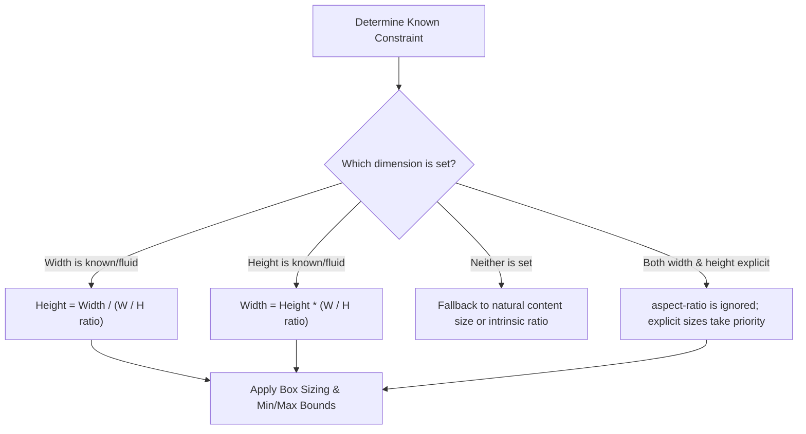

# 036: CSS Aspect-Ratio Layouts Masterclass

## Overview & Definition

An **aspect ratio** is the proportional relationship between the width and height of an element, expressed as a ratio $W : H$ (such as `16:9`, `4:3`, or `1:1`).

Historically, maintaining a consistent aspect ratio for responsive elements (such as embedded videos, responsive images, or card banners) required complex CSS workarounds like the famous **padding-bottom percentage hack**.

The modern CSS `aspect-ratio` property (CSS Box Sizing Module Level 4) natively establishes a preferred aspect ratio for any box. The browser automatically calculates the missing dimension whenever at least one dimension (`width` or `height`) is dynamic or fluid, eliminating layout shift and drastically simplifying responsive design.

```
+-------------------------------------------------------------------------------+
| Modern Native CSS:                                                            |
| .video-container {                                                            |
|   width: 100%;                                                                |
|   aspect-ratio: 16 / 9; /* Automatically computes height = width * 9 / 16 */  |
| }                                                                             |
+-------------------------------------------------------------------------------+
```

---

## 1. The Core Syntax & Mechanics

### Syntax Varieties

```css
/* Standard ratios (Width / Height) */
aspect-ratio: 16 / 9;   /* Widescreen video */
aspect-ratio: 4 / 3;    /* Standard definition */
aspect-ratio: 1 / 1;    /* Perfect square */
aspect-ratio: 9 / 16;   /* Vertical social video (Reels / TikTok / Shorts) */
aspect-ratio: 21 / 9;   /* Ultra-widescreen cinematic */

/* Single number notation (Width / 1) */
aspect-ratio: 1;        /* Equivalent to 1 / 1 */
aspect-ratio: 1.7777;   /* Equivalent to ~16 / 9 */
aspect-ratio: 0.5;      /* Equivalent to 1 / 2 (tall vertical) */

/* Auto combined with ratio (Replaced elements / Images) */
aspect-ratio: auto 16 / 9; 
/* Uses the intrinsic ratio of an image/video if loaded; falls back to 16/9 if not */
```

### Calculation Flow

The browser determines element sizing using the following directional rules:



---

## 2. Evolution: The Padding Hack vs. Modern `aspect-ratio`

### The Legacy "Padding-Bottom Hack" (16:9 Example)

Before native `aspect-ratio`, responsive ratios relied on vertical padding being calculated relative to the parent's **width**:

$$\text{Padding Percentage} = \left(\frac{\text{Height}}{\text{Width}}\right) \times 100\% = \left(\frac{9}{16}\right) \times 100\% = 56.25\%$$

#### Legacy Approach
```html
<div class="legacy-aspect-wrapper">
  <iframe class="legacy-aspect-content" src="..."></iframe>
</div>
```

```css
/* Legacy Boilerplate: 2 elements required, position absolute hack */
.legacy-aspect-wrapper {
  position: relative;
  width: 100%;
  padding-bottom: 56.25%; /* 9 / 16 = 56.25% */
  height: 0;
  overflow: hidden;
}

.legacy-aspect-content {
  position: absolute;
  top: 0;
  left: 0;
  width: 100%;
  height: 100%;
  border: 0;
}
```

---

### The Modern Native `aspect-ratio`

With modern CSS, the wrapper and absolute positioning are completely eliminated.

#### Modern Approach
```html
<iframe class="modern-video" src="..."></iframe>
```

```css
/* Modern Clean Approach: 1 element, zero hacks */
.modern-video {
  width: 100%;
  aspect-ratio: 16 / 9;
  border: 0;
}
```

### Feature Comparison

| Feature | Legacy Padding Hack | Modern `aspect-ratio` |
| :--- | :--- | :--- |
| **HTML Markup** | Requires extra wrapper `<div>` | Single element |
| **Positioning** | Requires `position: absolute; inset: 0;` | Standard flow positioning |
| **Content Centering** | Complex due to zero-height parent | Standard flex / grid centering |
| **Dynamic Ratio Swaps** | Requires recalculating percentage strings | Simple property update (e.g. `aspect-ratio: 1/1`) |
| **Content Resizing** | Ignores content; overflow breaks easily | Respects natural content growth |

---

## 3. Aspect Ratio with Replaced Elements (`object-fit`)

When applying `aspect-ratio` to replaced elements like ``, `<video>`, or `<canvas>`, you should always pair it with `object-fit` to ensure media scales cleanly without distortion or stretching.

```css
.media-cover {
  width: 100%;
  aspect-ratio: 16 / 9;
  object-fit: cover;        /* Fills the box, cropping excess */
  object-position: center;  /* Anchors the crop point to center */
}

.media-contain {
  width: 100%;
  aspect-ratio: 4 / 3;
  object-fit: contain;      /* Letterboxes to fit entire image */
  background-color: #111;   /* Backdrop for letterbox area */
}
```

---

## 4. Practical Real-World Patterns & Demonstrations

### Pattern 1: Zero-CLS Responsive Video & Iframe Embeds

Eliminate layout shifting while loading remote YouTube/Vimeo iframes or HTML5 video streams.

#### HTML
```html
<div class="video-card">
  <div class="video-frame-container">
    <iframe
      src="https://www.youtube-nocookie.com/embed/dQw4w9WgXcQ"
      title="Embedded Video Player"
      allow="accelerometer; autoplay; clipboard-write; encrypted-media; gyroscope; picture-in-picture"
      allowfullscreen
    ></iframe>
  </div>
  <div class="video-meta">
    <h3>Designing Scalable Front-End Architectures</h3>
    <p>Comprehensive walkthrough of modern CSS sizing and fluid layout engines.</p>
  </div>
</div>
```

#### CSS
```css
.video-card {
  max-width: 720px;
  margin: 2rem auto;
  background: #181824;
  border-radius: 12px;
  overflow: hidden;
  box-shadow: 0 12px 30px rgba(0, 0, 0, 0.4);
  border: 1px solid #2a2b3d;
}

.video-frame-container iframe {
  display: block;
  width: 100%;
  aspect-ratio: 16 / 9;
  border: none;
}

.video-meta {
  padding: 1.25rem 1.5rem;
  color: #e2e8f0;
}

.video-meta h3 {
  font-size: 1.15rem;
  margin-bottom: 0.5rem;
  color: #ffffff;
}

.video-meta p {
  font-size: 0.9rem;
  color: #94a3b8;
  line-height: 1.5;
}
```

---

### Pattern 2: E-Commerce Product Card Media Gallery (1:1 & 4:5 Ratios)

Ensures all product thumbnails across varying user-uploaded photo orientations retain a perfectly uniform size and alignment in grid catalogs.

#### HTML
```html
<div class="product-grid">
  <!-- Card 1: Square 1:1 Aspect Ratio -->
  <article class="product-card">
    <div class="product-image-box">
      
      <span class="badge">New Release</span>
    </div>
    <div class="product-details">
      <h4>Chronos Smartwatch v4</h4>
      <p class="price">$299.00 USD</p>
    </div>
  </article>

  <!-- Card 2: Square 1:1 Aspect Ratio -->
  <article class="product-card">
    <div class="product-image-box">
      
      <span class="badge">Popular</span>
    </div>
    <div class="product-details">
      <h4>Acoustic Pro Headphones</h4>
      <p class="price">$199.00 USD</p>
    </div>
  </article>
</div>
```

#### CSS
```css
.product-grid {
  display: grid;
  grid-template-columns: repeat(auto-fit, minmax(260px, 1fr));
  gap: 1.5rem;
  max-width: 860px;
  margin: 2rem auto;
}

.product-card {
  background: #1e1e2d;
  border-radius: 12px;
  overflow: hidden;
  border: 1px solid #303144;
  transition: transform 0.2s ease, box-shadow 0.2s ease;
}

.product-card:hover {
  transform: translateY(-4px);
  box-shadow: 0 10px 20px rgba(0, 0, 0, 0.35);
}

.product-image-box {
  position: relative;
  width: 100%;
  /* Locks thumbnail container to exact 1:1 square ratio */
  aspect-ratio: 1 / 1;
  background: #13131c;
  overflow: hidden;
}

.product-image-box img {
  width: 100%;
  height: 100%;
  object-fit: cover;
  transition: transform 0.3s ease;
}

.product-card:hover .product-image-box img {
  transform: scale(1.05);
}

.badge {
  position: absolute;
  top: 0.75rem;
  left: 0.75rem;
  background: rgba(99, 102, 241, 0.9);
  color: #fff;
  font-size: 0.75rem;
  font-weight: 600;
  padding: 0.25rem 0.65rem;
  border-radius: 9999px;
  backdrop-filter: blur(4px);
}

.product-details {
  padding: 1.25rem;
  color: #fff;
}

.product-details h4 {
  font-size: 1rem;
  margin-bottom: 0.35rem;
}

.product-details .price {
  font-size: 0.95rem;
  color: #38bdf8;
  font-weight: 600;
}
```

---

### Pattern 3: Vertical Social Story / Mobile Shorts (9:16 Ratio)

Vertical short-form media cards optimized for mobile story formats (Reels, TikTok, YouTube Shorts).

#### HTML
```html
<div class="stories-container">
  <div class="story-card">
    
    <div class="story-overlay">
      <div class="user-info">
        <span class="user-avatar">💻</span>
        <span class="username">@tech_insider</span>
      </div>
      <p class="story-caption">Next-gen RISC-V computing architecture revealed!</p>
    </div>
  </div>
</div>
```

#### CSS
```css
.stories-container {
  display: flex;
  justify-content: center;
  padding: 2rem 1rem;
}

.story-card {
  position: relative;
  /* Fixed inline constraint with standard 9:16 vertical smartphone aspect ratio */
  width: 240px;
  aspect-ratio: 9 / 16;
  border-radius: 16px;
  overflow: hidden;
  box-shadow: 0 14px 28px rgba(0, 0, 0, 0.45);
  border: 2px solid #3b3c4f;
}

.story-bg {
  width: 100%;
  height: 100%;
  object-fit: cover;
  display: block;
}

.story-overlay {
  position: absolute;
  inset: 0;
  background: linear-gradient(to top, rgba(0, 0, 0, 0.85) 0%, rgba(0, 0, 0, 0.1) 60%, transparent 100%);
  display: flex;
  flex-direction: column;
  justify-content: space-between;
  padding: 1rem;
  color: #fff;
}

.user-info {
  display: flex;
  align-items: center;
  gap: 0.5rem;
  font-size: 0.85rem;
  font-weight: 600;
}

.user-avatar {
  background: #3b82f6;
  width: 28px;
  height: 28px;
  border-radius: 50%;
  display: grid;
  place-items: center;
  font-size: 0.85rem;
}

.story-caption {
  font-size: 0.85rem;
  line-height: 1.35;
  font-weight: 500;
}
```

---

### Pattern 4: Responsive Avatar Badges & Uniform Icon Buttons (1:1 Ratio)

When scaling buttons or badges with fluid sizing units (like `vw` or container queries), applying `aspect-ratio: 1` guarantees that the element stays a circular squircle or true circle without manually syncing width and height.

#### HTML
```html
<div class="avatar-group">
  <button class="icon-action-btn" aria-label="Audio Controls">
    <svg viewBox="0 0 24 24" width="20" height="20" fill="currentColor">
      <path d="M12 3v10.55c-.59-.34-1.27-.55-2-.55-2.21 0-4 1.79-4 4s1.79 4 4 4 4-1.79 4-4V7h4V3h-6z"/>
    </svg>
  </button>
  <button class="icon-action-btn" aria-label="Settings">
    <svg viewBox="0 0 24 24" width="20" height="20" fill="currentColor">
      <path d="M19.14 12.94c.04-.3.06-.61.06-.94 0-.32-.02-.64-.07-.94l2.03-1.58c.18-.14.23-.41.12-.61l-1.92-3.32c-.12-.22-.37-.29-.59-.22l-2.39.96c-.5-.38-1.03-.7-1.62-.94l-.36-2.54c-.04-.24-.24-.41-.48-.41h-3.84c-.24 0-.43.17-.47.41l-.36 2.54c-.59.24-1.13.57-1.62.94l-2.39-.96c-.22-.08-.47 0-.59.22L2.74 8.87c-.12.21-.08.47.12.61l2.03 1.58c-.05.3-.09.63-.09.94s.02.64.07.94l-2.03 1.58c-.18.14-.23.41-.12.61l1.92 3.32c.12.22.37.29.59.22l2.39-.96c.5.38 1.03.7 1.62.94l.36 2.54c.05.24.24.41.48.41h3.84c.24 0 .44-.17.47-.41l.36-2.54c.59-.24 1.13-.56 1.62-.94l2.39.96c.22.08.47 0 .59-.22l1.92-3.32c.12-.22.07-.47-.12-.61l-2.01-1.58zM12 15.6c-1.98 0-3.6-1.62-3.6-3.6s1.62-3.6 3.6-3.6 3.6 1.62 3.6 3.6-1.62 3.6-3.6 3.6z"/>
    </svg>
  </button>
</div>
```

#### CSS
```css
.avatar-group {
  display: flex;
  gap: 1rem;
  justify-content: center;
  padding: 1.5rem;
}

.icon-action-btn {
  /* Fluid width; height automatically matches precisely */
  width: 48px;
  aspect-ratio: 1 / 1;
  display: grid;
  place-items: center;
  border-radius: 50%;
  background: #272738;
  color: #93c5fd;
  border: 1px solid #3d3e56;
  cursor: pointer;
  transition: all 0.2s ease;
}

.icon-action-btn:hover {
  background: #3b82f6;
  color: #ffffff;
  transform: scale(1.08);
}
```

---

## 5. Preventing Cumulative Layout Shift (CLS)

**Cumulative Layout Shift (CLS)** occurs when an image or iframe loads asynchronously without pre-reserved spatial dimensions, causing all content underneath to suddenly jump downwards.

```
Without Aspect-Ratio (Layout Jumps):
[ Page Load Starts ] ----> Height is 0px  ----> [ Image Loads ] ----> Jumps to 450px! 💥 (CLS Penalty)

With Aspect-Ratio (Smooth):
[ Page Load Starts ] ----> Box reserved at 16:9 ratio ----> [ Image Loads ] ----> Smooth Render ✨
```

### Best Practice: Combining HTML Attributes & CSS

Modern browsers compute the intrinsic aspect ratio automatically from standard HTML `width` and `height` attributes:

```html
<!-- Browser derives aspect-ratio: 800 / 450 (16:9) immediately upon HTML parse -->

```

```css
.fluid-banner {
  width: 100%;
  height: auto;
  /* If overriding the image's natural ratio with a design ratio: */
  aspect-ratio: 16 / 9;
  object-fit: cover;
}
```

---

## 6. Common Pitfalls & Critical Edge Cases

### Pitfall 1: `min-height: auto` on Flex / Grid Items Overriding `aspect-ratio`

In Flexbox and CSS Grid, child elements have `min-width: auto` and `min-height: auto` by default. If child content exceeds the computed ratio height, the content will force the element to expand vertically, breaking the aspect ratio.

```css
/* ❌ Problem: Long content stretches the card taller than 16:9 */
.card {
  width: 100%;
  aspect-ratio: 16 / 9;
}

/* ✅ Fix: Set min-height: 0 or overflow: hidden */
.card {
  width: 100%;
  aspect-ratio: 16 / 9;
  min-height: 0;
  overflow: hidden; /* Or auto */
}
```

---

### Pitfall 2: Flex Align Stretch Distorting Ratio

Flex containers default to `align-items: stretch`. If a flex item has an explicit `height` or stretches along the cross axis, `aspect-ratio` may calculate width unexpectedly or be overridden.

```css
/* ✅ Fix: Prevent cross-axis stretch */
.flex-parent {
  display: flex;
  align-items: flex-start; /* Or align-self: flex-start on child */
}

.flex-child-square {
  height: 80px;
  aspect-ratio: 1 / 1; /* Computes width: 80px */
}
```

---

### Pitfall 3: Conflicting Explicit Dimensions

If both `width` and `height` are explicitly defined (e.g. `width: 300px; height: 150px;`), the `aspect-ratio` property is **ignored entirely**.

```css
/* ❌ aspect-ratio is disregarded because both axes are rigid */
.box {
  width: 300px;
  height: 150px;
  aspect-ratio: 1 / 1; /* Ignored! Computes to 300x150 */
}

/* ✅ Leave one dimension fluid/auto */
.box {
  width: 300px;
  height: auto;
  aspect-ratio: 1 / 1; /* Computes to 300x300 */
}
```

---

### Pitfall 4: Fallback for Legacy Browsers

For environments requiring support for older browser versions that lack native `aspect-ratio` support:

```css
.aspect-box {
  /* Modern native property */
  aspect-ratio: 16 / 9;
  width: 100%;
}

/* Graceful degradation fallback using @supports */
@supports not (aspect-ratio: 16 / 9) {
  .aspect-box {
    position: relative;
    padding-bottom: 56.25%;
    height: 0;
  }
  .aspect-box > * {
    position: absolute;
    inset: 0;
    width: 100%;
    height: 100%;
  }
}
```

---

## 7. Complete Interactive Single-File Playground

Save the following code as `aspect-ratio-demo.html` in your project or browser to interactively test aspect-ratio behaviors:

```html
<!DOCTYPE html>
<html lang="en">
<head>
  <meta charset="UTF-8" />
  <meta name="viewport" content="width=device-width, initial-scale=1.0" />
  <title>CSS Aspect-Ratio Layouts Interactive Demo</title>
  <style>
    :root {
      --bg-color: #0b0c10;
      --card-bg: #1f2833;
      --text-main: #edf5e1;
      --accent: #66fcf1;
      --accent-dim: #45a29e;
      --border-color: #303c4c;
    }

    * {
      box-sizing: border-box;
      margin: 0;
      padding: 0;
    }

    body {
      font-family: -apple-system, BlinkMacSystemFont, 'Segoe UI', Roboto, Helvetica, Arial, sans-serif;
      background-color: var(--bg-color);
      color: var(--text-main);
      padding: 2rem 1rem;
      line-height: 1.6;
    }

    .container {
      max-width: 960px;
      margin: 0 auto;
    }

    header {
      text-align: center;
      margin-bottom: 2.5rem;
    }

    header h1 {
      font-size: 2.2rem;
      color: var(--accent);
      margin-bottom: 0.5rem;
    }

    header p {
      color: #8c9ba5;
    }

    .demo-section {
      background: var(--card-bg);
      border: 1px solid var(--border-color);
      border-radius: 12px;
      padding: 1.75rem;
      margin-bottom: 2rem;
      box-shadow: 0 8px 24px rgba(0, 0, 0, 0.35);
    }

    .demo-section h2 {
      font-size: 1.3rem;
      color: var(--accent);
      margin-bottom: 1.25rem;
      border-bottom: 1px solid var(--border-color);
      padding-bottom: 0.5rem;
    }

    /* Interactive Ratio Switcher */
    .controls {
      display: flex;
      gap: 0.75rem;
      flex-wrap: wrap;
      margin-bottom: 1.5rem;
    }

    .btn-ratio {
      background: #11161d;
      border: 1px solid var(--border-color);
      color: var(--text-main);
      padding: 0.5rem 1rem;
      border-radius: 6px;
      cursor: pointer;
      font-weight: 600;
      transition: all 0.2s ease;
    }

    .btn-ratio:hover, .btn-ratio.active {
      background: var(--accent);
      color: #000;
      border-color: var(--accent);
    }

    .dynamic-ratio-box {
      width: 100%;
      max-width: 500px;
      margin: 0 auto;
      background: linear-gradient(135deg, #1f4068, #162447);
      border: 2px dashed var(--accent);
      border-radius: 8px;
      display: grid;
      place-items: center;
      aspect-ratio: 16 / 9;
      transition: aspect-ratio 0.3s cubic-bezier(0.4, 0, 0.2, 1);
      padding: 1rem;
      text-align: center;
    }

    .dynamic-ratio-box span {
      font-size: 1.1rem;
      font-weight: 700;
      color: #fff;
      background: rgba(0, 0, 0, 0.6);
      padding: 0.5rem 1rem;
      border-radius: 6px;
    }

    /* Video Embed Section */
    .video-grid {
      display: grid;
      grid-template-columns: repeat(auto-fit, minmax(280px, 1fr));
      gap: 1.5rem;
    }

    .video-embed-card {
      background: #11161d;
      border-radius: 8px;
      overflow: hidden;
      border: 1px solid var(--border-color);
    }

    .video-frame {
      width: 100%;
      aspect-ratio: 16 / 9;
      background: #000;
      display: flex;
      align-items: center;
      justify-content: center;
      color: var(--accent);
      font-weight: bold;
    }

    .video-caption {
      padding: 1rem;
      font-size: 0.9rem;
      color: #c5c6c7;
    }

    /* Product Grid Demo */
    .catalog-grid {
      display: grid;
      grid-template-columns: repeat(auto-fit, minmax(200px, 1fr));
      gap: 1.25rem;
    }

    .catalog-item {
      background: #11161d;
      border-radius: 8px;
      overflow: hidden;
      border: 1px solid var(--border-color);
    }

    .catalog-item img {
      width: 100%;
      aspect-ratio: 1 / 1;
      object-fit: cover;
      display: block;
    }

    .catalog-info {
      padding: 0.85rem;
    }

    .catalog-info h4 {
      font-size: 0.95rem;
      color: #fff;
    }

    .catalog-info p {
      font-size: 0.85rem;
      color: var(--accent-dim);
      font-weight: 600;
    }
  </style>
</head>
<body>
  <div class="container">
    <header>
      <h1>CSS Aspect-Ratio Mastery</h1>
      <p>Interactive playground exploring modern fluid proportions, zero-CLS rendering, and media containers.</p>
    </header>

    <!-- Section 1: Dynamic Ratio Switcher -->
    <section class="demo-section">
      <h2>1. Live Aspect Ratio Switcher</h2>
      <div class="controls">
        <button class="btn-ratio active" onclick="setRatio('16 / 9', this)">16 : 9 (Widescreen)</button>
        <button class="btn-ratio" onclick="setRatio('4 / 3', this)">4 : 3 (Standard)</button>
        <button class="btn-ratio" onclick="setRatio('1 / 1', this)">1 : 1 (Square)</button>
        <button class="btn-ratio" onclick="setRatio('9 / 16', this)">9 : 16 (Vertical Reel)</button>
        <button class="btn-ratio" onclick="setRatio('21 / 9', this)">21 : 9 (Cinematic)</button>
      </div>
      <div class="dynamic-ratio-box" id="targetBox">
        <span id="ratioLabel">aspect-ratio: 16 / 9</span>
      </div>
    </section>

    <!-- Section 2: Video Embed Containers -->
    <section class="demo-section">
      <h2>2. Responsive 16:9 Video Cards</h2>
      <div class="video-grid">
        <article class="video-embed-card">
          <div class="video-frame">▶ 16:9 Video Player</div>
          <div class="video-caption">
            <strong>Module 01: Core Architecture</strong>
            <p>Native sizing mechanics without JavaScript calculation loops.</p>
          </div>
        </article>
        <article class="video-embed-card">
          <div class="video-frame">▶ 16:9 Video Player</div>
          <div class="video-caption">
            <strong>Module 02: Performance Tuning</strong>
            <p>Eliminating Cumulative Layout Shift using pre-reserved bounding boxes.</p>
          </div>
        </article>
      </div>
    </section>

    <!-- Section 3: Catalog Grid with 1:1 Aspect-Ratio -->
    <section class="demo-section">
      <h2>3. Product Grid with Uniform 1:1 Image Proportions</h2>
      <div class="catalog-grid">
        <div class="catalog-item">
          
          <div class="catalog-info">
            <h4>Nordic Quartz Watch</h4>
            <p>$185.00</p>
          </div>
        </div>
        <div class="catalog-item">
          
          <div class="catalog-info">
            <h4>Polarized Sunglasses</h4>
            <p>$120.00</p>
          </div>
        </div>
        <div class="catalog-item">
          
          <div class="catalog-info">
            <h4>Studio Headphones</h4>
            <p>$240.00</p>
          </div>
        </div>
      </div>
    </section>
  </div>

  <script>
    function setRatio(ratioValue, buttonElement) {
      const target = document.getElementById('targetBox');
      const label = document.getElementById('ratioLabel');
      
      target.style.aspectRatio = ratioValue;
      label.textContent = `aspect-ratio: ${ratioValue}`;

      document.querySelectorAll('.btn-ratio').forEach(btn => btn.classList.remove('active'));
      buttonElement.classList.add('active');
    }
  </script>
</body>
</html>
```

---

## 8. Summary & Quick-Reference Cheat Sheet

### Common Ratio Formats

| Format Name | Ratio Value | Dec / Float | Equivalent Percent (Padding Hack) | Typical Applications |
| :--- | :--- | :--- | :--- | :--- |
| **Widescreen** | `16 / 9` | `1.777` | `56.25%` | YouTube, Vimeo, modern monitors, desktop video |
| **Standard / Retro** | `4 / 3` | `1.333` | `75.00%` | Classic TV, photography prints, tablet displays |
| **Square** | `1 / 1` (or `1`) | `1.000` | `100.00%` | Instagram feed, product cards, avatars, app icons |
| **Portrait / Social**| `4 / 5` | `0.800` | `125.00%` | Instagram portrait feed photos |
| **Vertical Video** | `9 / 16` | `0.5625`| `177.78%` | TikTok, YouTube Shorts, Instagram Reels, Stories |
| **Ultra-Widescreen**| `21 / 9` | `2.333` | `42.85%` | Cinematic banners, curved ultrawide monitors |
| **Golden Ratio** | `1.618 / 1` | `1.618` | `61.80%` | Typography layouts, aesthetic card dimensions |

### Key Rule Checklist

1. **Always pair with `object-fit: cover`** for images and video backgrounds to avoid visual distortion.
2. **Leave one axis fluid** (`width: 100%; height: auto;` or `height: 250px; width: auto;`). Do not hardcode both width and height simultaneously.
3. **Prevent Flex/Grid clipping** by declaring `min-height: 0` or `min-width: 0` on aspect-ratio items within flex/grid parents if content overflows.
4. **Use HTML `width` and `height` attributes** alongside CSS `aspect-ratio` on `` tags to provide instant layout reservations and attain a zero-CLS score.
