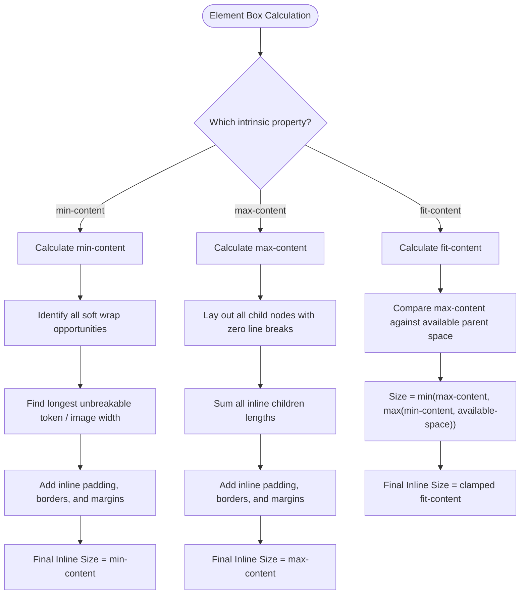

# 038: Content-Based Sizing in Modern CSS

## Overview

In traditional CSS layouts, web developers predominantly rely on **extrinsic sizing**—explicitly imposing static dimensions like `width: 400px`, `width: 50%`, or `height: 100vh` derived from parent containers or viewport boundaries.

**Content-based sizing** (also known as **intrinsic sizing**) reverses this paradigm: an element's dimensions are calculated dynamically from its **own internal contents**—text nodes, typography metrics, child components, replaced media (such as `` or `<svg>`), and padding—rather than an externally enforced container box.

Standardized in the **CSS Box Sizing Module Level 3 & Level 4**, CSS provides powerful keywords and functions for content-based layout:
- `min-content`
- `max-content`
- `fit-content`
- `fit-content(<length-percentage>)`

Combined with CSS Grid, Flexbox, and CSS Logical Properties (`inline-size`, `block-size`), content-based sizing enables fluid, resilient, and internationalization-friendly user interfaces that adapt effortlessly to dynamic content lengths and translations without magic numbers or overflow bugs.

---

## 1. Mental Model: Intrinsic vs. Extrinsic Sizing

```
========================= EXTRINSIC SIZING =========================
Parent dictates child's width:
+------------------------------------------------------------------+
| Parent Container (width: 600px)                                  |
| +--------------------------------------------------------------+ |
| | Child Element (width: 100%)                                  | |
| | Text wraps to fill container width, leaving trailing space   | |
| +--------------------------------------------------------------+ |
+------------------------------------------------------------------+

========================= INTRINSIC SIZING =========================
Child's content dictates its own width:
+------------------------------------------------------------------+
| Parent Container (width: 600px)                                  |
| +-------------------------------+                                |
| | Child (width: fit-content)    |                                |
| | Box shrinks to hug text!      |                                |
| +-------------------------------+                                |
+------------------------------------------------------------------+
```

### Core Comparison Matrix

| Keyword / Function | Conceptual Definition | Mathematical Model / Formula | Typical Use Cases |
| :--- | :--- | :--- | :--- |
| **`min-content`** | The smallest possible box dimension without causing inline content to overflow. | Longest unbreakable inline token (longest word, fixed image, atomic child). | Image captions (`<figcaption>`), badge wrappers, vertical text columns, tight media cards. |
| **`max-content`** | The ideal box dimension required to display all content on a single line with zero soft wraps. | Total uninterrupted inline sum of text and children. | Form label columns in CSS Grid, single-line tabs, horizontal status chips, data tables. |
| **`fit-content`** | An adaptive hybrid: expands to content like `max-content` but clamps to available space like `100%`. | `min(max-content, max(min-content, stretch))` | Centered badges (`margin-inline: auto`), floating tooltips, search modals, dynamic dialogs. |
| **`fit-content(limit)`** | A track-sizing function in CSS Grid that acts as `fit-content` capped at a defined ceiling limit. | `min(max-content, max(min-content, limit))` | Responsive dashboard sidebars, auto-collapsing search filters, adaptive card columns. |

---

## 2. Deep Dive: The Intrinsic Sizing Primitives

### 1. `min-content` (The Narrowest Natural Fit)
Forces an element to wrap at every possible soft-wrapping opportunity (spaces, hyphens, punctuation). The resulting inline size matches the widest unbreakable item inside the element (plus padding and border).

```css
.card-caption {
  inline-size: min-content; /* Sized to the longest word or widest child */
}
```

```
+----------------+
| LongestWordIn  |  <-- Element width strictly equals the longest token
| TheParagraph   |
| wraps          |
| gracefully     |
+----------------+
```

### 2. `max-content` (The Unwrapped Ideal Fit)
Forces an element to expand horizontally to lay out all inline contents on a single uninterrupted line. Soft wraps are forbidden.
> [!WARNING]
> If the content exceeds the viewport or parent width, `max-content` will overflow the container and can trigger unwanted horizontal scrolling unless constrained by parent scrolling or `max-width: 100%`.

```css
.action-tab {
  inline-size: max-content; /* Never wraps text to a second line */
}
```

```
+---------------------------------------------------------------------+
| All inline content stays on a single uninterrupted line with no wrap|
+---------------------------------------------------------------------+
```

### 3. `fit-content` (The Intelligent Shrink-Wrap)
`fit-content` delivers the best of both worlds:
1. When content is shorter than the parent container, it acts like `max-content` (shrink-wrapping the content).
2. When content is longer than the parent container, it clamps to the container's available inline space (like `width: 100%`) and allows text to wrap normally.
3. It will never shrink smaller than `min-content`.

```css
.announcement-banner {
  inline-size: fit-content;
  margin-inline: auto; /* Perfectly centers a shrink-wrapped element */
}
```

### 4. `fit-content(length | percentage)` (Grid Track Sizing)
Used exclusively in CSS Grid track definitions (`grid-template-columns` or `grid-template-rows`). The grid track expands to fit content naturally, but will not grow beyond the specified maximum limit argument.

```css
.dashboard-grid {
  display: grid;
  grid-template-columns: fit-content(300px) 1fr;
}
```

---

## 3. Practical Real-World Patterns & Demonstrations

### Pattern 1: Tight Figure Caption Hugging an Image (`min-content`)

**Problem:** By default, block-level `<figure>` and `<figcaption>` elements take `width: 100%`. When an image is narrower than the container, a multi-line caption will sprawl out wider than the image, producing an unpolished, unbalanced layout.

**Solution:** Setting `width: min-content` on `<figure>` forces the container to shrink-wrap to the widest unbreakable item—which is the image itself. The caption underneath then wraps cleanly at the exact width of the photo.

#### HTML
```html
<figure class="media-card">
  
  <figcaption>
    Algorithmic neural pattern synthesis rendered directly via WebGPU shader pipelines.
  </figcaption>
</figure>
```

#### CSS
```css
.media-card {
  /* Locks the figure width directly to the 320px image width */
  inline-size: min-content;
  margin: 2rem auto;
  padding: 0.875rem;
  background: #18181f;
  border: 1px solid #2e2f3e;
  border-radius: 12px;
  box-shadow: 0 12px 30px rgba(0, 0, 0, 0.4);
  color: #e2e8f0;
}

.media-card img {
  display: block;
  max-width: 100%;
  height: auto;
  border-radius: 8px;
}

.media-card figcaption {
  margin-top: 0.75rem;
  font-size: 0.875rem;
  line-height: 1.45;
  color: #94a3b8;
  /* Caption text neatly wraps matching the exact 320px image width */
}
```

---

### Pattern 2: Alignment-Free Form & Spec Sheets (`max-content 1fr`)

**Problem:** Hardcoding pixel widths for form labels (e.g. `width: 140px`) fails when label text changes, when localization/translations are added, or when different font scales are loaded.

**Solution:** Use CSS Grid with `grid-template-columns: max-content 1fr`. The first column automatically measures the longest label in the DOM and sizes itself to that exact width with zero wasted whitespace.

#### HTML
```html
<div class="system-spec-sheet">
  <div class="spec-label">Instance Status</div>
  <div class="spec-value"><span class="status-pill ready">Operational</span></div>

  <div class="spec-label">Compute Cluster ID</div>
  <div class="spec-value">cluster-node-prod-east-04.internal.net</div>

  <div class="spec-label">Memory Allocation Limit</div>
  <div class="spec-value">32.0 GB ECC DDR5 (84.6% utilized)</div>

  <div class="spec-label">TLS Certificate</div>
  <div class="spec-value">ECDSA 384-bit (Auto-renewed via ACME)</div>
</div>
```

#### CSS
```css
.system-spec-sheet {
  display: grid;
  /* Column 1 hugs the longest label string; Column 2 consumes remaining space */
  grid-template-columns: max-content 1fr;
  gap: 0.875rem 1.5rem;
  align-items: center;
  max-width: 650px;
  margin: 2rem auto;
  padding: 1.5rem 1.75rem;
  background: #0f1015;
  border: 1px solid #232533;
  border-radius: 12px;
  font-family: ui-monospace, 'Cascadia Code', 'Source Code Pro', monospace;
  color: #f1f5f9;
}

.spec-label {
  color: #818cf8;
  font-weight: 600;
  font-size: 0.875rem;
  text-align: right;
}

.spec-value {
  color: #e2e8f0;
  font-size: 0.875rem;
  overflow: hidden;
  text-overflow: ellipsis;
  white-space: nowrap;
}

.status-pill {
  display: inline-flex;
  align-items: center;
  padding: 0.2rem 0.65rem;
  border-radius: 9999px;
  font-size: 0.75rem;
  font-weight: 600;
}

.status-pill.ready {
  background: rgba(34, 197, 94, 0.15);
  color: #4ade80;
  border: 1px solid rgba(74, 222, 128, 0.35);
}
```

---

### Pattern 3: Self-Centering Announcement Pills (`fit-content`)

**Problem:** In traditional CSS, centering a block element requires either wrapping it in a flex container or giving it an explicit `width` along with `margin-inline: auto`. A standard block without an explicit width expands to `100%`, breaking the visual pill tag look.

**Solution:** Setting `width: fit-content` (or `inline-size: fit-content`) combined with `margin-inline: auto` shrink-wraps the button or pill to its text content while centering it horizontally inside its parent block.

#### HTML
```html
<header class="hero-section">
  <div class="announcement-pill">
    <span class="pill-badge">v2.5 Released</span>
    <span class="pill-text">Native WebGPU acceleration is now in preview &rarr;</span>
  </div>
  <h1 class="hero-title">Reactive Scientific Computation Engine</h1>
</header>
```

#### CSS
```css
.hero-section {
  text-align: center;
  padding: 3.5rem 1.5rem;
  background: radial-gradient(circle at top, #1e1b4b 0%, #09090b 100%);
  color: #ffffff;
}

.announcement-pill {
  /* Shrink-wraps content and centers perfectly inside the hero container */
  inline-size: fit-content;
  margin-inline: auto;
  margin-bottom: 1.5rem;

  display: inline-flex;
  align-items: center;
  gap: 0.75rem;
  padding: 0.35rem 0.9rem;
  background: rgba(255, 255, 255, 0.06);
  border: 1px solid rgba(255, 255, 255, 0.15);
  border-radius: 9999px;
  backdrop-filter: blur(12px);
  font-size: 0.875rem;
  color: #e2e8f0;
  box-shadow: 0 4px 20px rgba(0, 0, 0, 0.25);
  transition: transform 0.2s ease, border-color 0.2s ease;
}

.announcement-pill:hover {
  transform: translateY(-2px);
  border-color: rgba(129, 140, 248, 0.5);
}

.pill-badge {
  background: linear-gradient(135deg, #6366f1, #8b5cf6);
  color: #ffffff;
  padding: 0.15rem 0.55rem;
  border-radius: 9999px;
  font-size: 0.75rem;
  font-weight: 700;
  text-transform: uppercase;
}

.hero-title {
  inline-size: fit-content;
  max-inline-size: 90%;
  margin-inline: auto;
  font-size: clamp(1.8rem, 4vw, 2.75rem);
  font-weight: 800;
  letter-spacing: -0.02em;
}
```

---

### Pattern 4: Responsive Sidebar with `fit-content(limit)` in CSS Grid

**Problem:** You want a sidebar that sizes naturally according to the width of its navigation links, but you also want a hard upper bound so wide menu items don't hog too much screen space.

**Solution:** Use `grid-template-columns: fit-content(280px) 1fr`. The sidebar takes its natural content width up to 280px, while the main workspace consumes the rest of the layout.

#### HTML
```html
<div class="app-workspace">
  <aside class="app-sidebar">
    <h3 class="nav-heading">Project Navigation</h3>
    <nav class="nav-links">
      <a href="#overview" class="active">Overview & Analytics</a>
      <a href="#pipelines">Continuous Integration</a>
      <a href="#settings">Secrets & Environment Config</a>
    </nav>
  </aside>

  <main class="app-content">
    <h2>Workspace Overview</h2>
    <p>Fluid content container expanding dynamically across the viewport.</p>
  </main>
</div>
```

#### CSS
```css
.app-workspace {
  display: grid;
  /* Sidebar sizes to its content up to 280px maximum; main content takes remainder */
  grid-template-columns: fit-content(280px) 1fr;
  gap: 1.5rem;
  max-width: 1000px;
  margin: 2rem auto;
  padding: 1.5rem;
  background: #12131a;
  border-radius: 12px;
  border: 1px solid #232533;
}

.app-sidebar {
  background: #1a1b24;
  padding: 1.25rem;
  border-radius: 8px;
  border: 1px solid #2b2d3c;
}

.nav-heading {
  font-size: 0.8rem;
  text-transform: uppercase;
  color: #71717a;
  margin-bottom: 0.75rem;
}

.nav-links {
  display: flex;
  flex-direction: column;
  gap: 0.5rem;
}

.nav-links a {
  color: #94a3b8;
  text-decoration: none;
  font-size: 0.875rem;
  padding: 0.4rem 0.6rem;
  border-radius: 6px;
  white-space: nowrap;
}

.nav-links a.active,
.nav-links a:hover {
  background: #27273a;
  color: #ffffff;
}

.app-content {
  background: #181922;
  padding: 1.5rem;
  border-radius: 8px;
  border: 1px solid #2b2d3c;
  color: #f1f5f9;
}
```

---

### Pattern 5: Non-Breaking Tabs and Horizontal Scrollers (`max-content`)

**Problem:** In mobile or responsive headers, flex items frequently wrap or squash to equal widths, causing tabs to split into awkward multi-line text or truncate inappropriately.

**Solution:** Assign `flex-basis: max-content` or `inline-size: max-content` with `flex-shrink: 0` inside an `overflow-x: auto` scroll container.

#### HTML
```html
<nav class="pill-tabs-bar" aria-label="Category tabs">
  <button class="tab-item active">All Repositories</button>
  <button class="tab-item">Machine Learning & Neural Nets</button>
  <button class="tab-item">Cloud Native Infrastructures</button>
  <button class="tab-item">Security & Cryptography</button>
</nav>
```

#### CSS
```css
.pill-tabs-bar {
  display: flex;
  gap: 0.75rem;
  overflow-x: auto;
  padding: 0.75rem;
  background: #14151f;
  border-radius: 10px;
  scrollbar-width: thin;
  scrollbar-color: #3b3d52 transparent;
}

.tab-item {
  /* Sizes each tab to the exact width of its text without wrapping */
  inline-size: max-content;
  flex-shrink: 0;
  padding: 0.5rem 1.1rem;
  background: #1f212f;
  border: 1px solid #333649;
  border-radius: 9999px;
  color: #94a3b8;
  font-size: 0.875rem;
  font-weight: 500;
  cursor: pointer;
  transition: all 0.2s ease;
}

.tab-item.active {
  background: #4f46e5;
  border-color: #6366f1;
  color: #ffffff;
  box-shadow: 0 4px 12px rgba(79, 70, 229, 0.35);
}
```

---

## 4. Modern Logical Properties Alignment

For global internationalization and writing modes (LTR, RTL, Vertical-RL), always prefer **CSS Logical Properties**:

| Physical Property | Modern Logical Equivalent | Example with Intrinsic Sizing |
| :--- | :--- | :--- |
| `width: min-content;` | `inline-size: min-content;` | `.card { inline-size: min-content; }` |
| `max-width: max-content;` | `max-inline-size: max-content;` | `.heading { max-inline-size: max-content; }` |
| `min-width: fit-content;` | `min-inline-size: fit-content;` | `.badge { min-inline-size: fit-content; }` |
| `height: fit-content;` | `block-size: fit-content;` | `.modal { block-size: fit-content; }` |
| `margin-left: auto; margin-right: auto;` | `margin-inline: auto;` | `.pill { margin-inline: auto; }` |

---

## 5. How the Browser Layout Engine Computes Intrinsic Sizing



### Calculation Rules Under the Hood:
1. **Soft Wrap Boundaries**: In inline formatting contexts, word boundaries (spaces, hyphens, dashes) serve as candidate break points for `min-content`.
2. **Replaced Elements**: For replaced elements (``, `<video>`, `<canvas>`, `<svg>`), both `min-content` and `max-content` evaluate to the element's intrinsic aspect ratio and dimension.
3. **Box Sizing Standard**: When `box-sizing: border-box` is present, the calculated intrinsic dimension incorporates internal padding and border thicknesses automatically.

---

## 6. Complete Single-File Interactive Playground

Save the following complete HTML code as `content-sizing-playground.html` and open it directly in any browser:

```html
<!DOCTYPE html>
<html lang="en">
<head>
  <meta charset="UTF-8" />
  <meta name="viewport" content="width=device-width, initial-scale=1.0" />
  <title>CSS Content-Based Sizing Live Demonstration</title>
  <link rel="preconnect" href="https://fonts.googleapis.com" />
  <link rel="preconnect" href="https://fonts.gstatic.com" crossorigin />
  <link href="https://fonts.googleapis.com/css2?family=Plus+Jakarta+Sans:wght@400;500;600;700;800&family=JetBrains+Mono:wght@400;500;600&display=swap" rel="stylesheet" />
  <style>
    :root {
      --bg-base: #0b0c10;
      --bg-surface: #13151b;
      --bg-elevated: #1a1c24;
      --border-subtle: #272a38;
      --border-accent: #3d4257;
      --text-primary: #f8fafc;
      --text-secondary: #94a3b8;
      --text-muted: #64748b;
      --accent-indigo: #6366f1;
      --accent-cyan: #06b6d4;
      --accent-emerald: #10b981;
      --accent-rose: #f43f5e;
      --radius-sm: 6px;
      --radius-md: 10px;
      --radius-lg: 16px;
      --radius-full: 9999px;
    }

    * {
      box-sizing: border-box;
      margin: 0;
      padding: 0;
    }

    body {
      font-family: 'Plus Jakarta Sans', system-ui, sans-serif;
      background-color: var(--bg-base);
      color: var(--text-primary);
      line-height: 1.6;
      padding: 2.5rem 1rem;
    }

    .container {
      max-width: 960px;
      margin: 0 auto;
    }

    header.main-header {
      text-align: center;
      margin-bottom: 3rem;
    }

    .badge-pill {
      display: inline-flex;
      align-items: center;
      gap: 0.5rem;
      padding: 0.35rem 1rem;
      background: rgba(99, 102, 241, 0.12);
      border: 1px solid rgba(99, 102, 241, 0.3);
      border-radius: var(--radius-full);
      color: #818cf8;
      font-size: 0.85rem;
      font-weight: 600;
      margin-bottom: 1rem;
    }

    h1 {
      font-size: 2.5rem;
      font-weight: 800;
      letter-spacing: -0.03em;
      margin-bottom: 0.5rem;
    }

    p.subtitle {
      color: var(--text-secondary);
      font-size: 1.1rem;
    }

    .demo-grid {
      display: flex;
      flex-direction: column;
      gap: 2rem;
    }

    .demo-card {
      background: var(--bg-surface);
      border: 1px solid var(--border-subtle);
      border-radius: var(--radius-lg);
      padding: 1.75rem;
      box-shadow: 0 10px 25px rgba(0, 0, 0, 0.3);
    }

    .card-title {
      font-size: 1.25rem;
      font-weight: 700;
      margin-bottom: 0.35rem;
      color: var(--text-primary);
      display: flex;
      align-items: center;
      gap: 0.75rem;
    }

    .card-title .tag {
      font-family: 'JetBrains Mono', monospace;
      font-size: 0.75rem;
      padding: 0.2rem 0.6rem;
      border-radius: var(--radius-sm);
      background: var(--bg-elevated);
      color: var(--accent-cyan);
      border: 1px solid var(--border-accent);
    }

    .card-desc {
      color: var(--text-secondary);
      font-size: 0.9rem;
      margin-bottom: 1.5rem;
    }

    /* Comparison Box Styles */
    .viewport-box {
      border: 2px dashed var(--border-accent);
      padding: 1.25rem;
      border-radius: var(--radius-md);
      background: rgba(0, 0, 0, 0.25);
      margin-bottom: 1rem;
      overflow: hidden;
    }

    .box-min {
      inline-size: min-content;
      background: linear-gradient(135deg, #e11d48, #be123c);
      color: white;
      padding: 0.75rem 1rem;
      border-radius: var(--radius-sm);
      font-weight: 600;
    }

    .box-max {
      inline-size: max-content;
      background: linear-gradient(135deg, #2563eb, #1d4ed8);
      color: white;
      padding: 0.75rem 1rem;
      border-radius: var(--radius-sm);
      font-weight: 600;
    }

    .box-fit {
      inline-size: fit-content;
      background: linear-gradient(135deg, #059669, #047857);
      color: white;
      padding: 0.75rem 1rem;
      border-radius: var(--radius-sm);
      font-weight: 600;
    }

    /* Grid Form Demo */
    .grid-spec-form {
      display: grid;
      grid-template-columns: max-content 1fr;
      gap: 0.875rem 1.25rem;
      align-items: center;
    }

    .grid-spec-form label {
      font-family: 'JetBrains Mono', monospace;
      font-size: 0.85rem;
      font-weight: 600;
      color: #cbd5e1;
      text-align: right;
    }

    .grid-spec-form input {
      background: var(--bg-elevated);
      border: 1px solid var(--border-accent);
      padding: 0.6rem 0.85rem;
      border-radius: var(--radius-sm);
      color: #fff;
      font-family: inherit;
      font-size: 0.9rem;
      outline: none;
      transition: border-color 0.2s ease;
    }

    .grid-spec-form input:focus {
      border-color: var(--accent-indigo);
    }

    /* Figure Demo */
    figure.tight-figure {
      inline-size: min-content;
      background: var(--bg-elevated);
      padding: 0.875rem;
      border-radius: var(--radius-md);
      border: 1px solid var(--border-accent);
    }

    .figure-placeholder {
      inline-size: 260px;
      block-size: 150px;
      background: linear-gradient(135deg, #4f46e5, #9333ea);
      border-radius: var(--radius-sm);
      display: flex;
      align-items: center;
      justify-content: center;
      color: #fff;
      font-weight: 700;
      font-size: 0.9rem;
    }

    figure.tight-figure figcaption {
      margin-top: 0.75rem;
      font-size: 0.85rem;
      color: var(--text-secondary);
      line-height: 1.4;
    }
  </style>
</head>
<body>
  <div class="container">
    <header class="main-header">
      <div class="badge-pill">CSS Sizing Level 3 & 4</div>
      <h1>Content-Based Sizing Playground</h1>
      <p class="subtitle">Interactive visualization of min-content, max-content, and fit-content</p>
    </header>

    <main class="demo-grid">
      <!-- Section 1: Comparison -->
      <section class="demo-card">
        <h2 class="card-title">1. Visual Keyword Comparison <span class="tag">inline-size</span></h2>
        <p class="card-desc">Observe how each keyword treats line breaks and parent boundaries:</p>

        <div class="viewport-box">
          <div class="box-min">min-content: Wraps at every soft breakpoint</div>
        </div>

        <div class="viewport-box">
          <div class="box-max">max-content: Keeps all text completely unbroken on a single line</div>
        </div>

        <div class="viewport-box">
          <div class="box-fit">fit-content: Shrinks to content, wraps gracefully at container limits</div>
        </div>
      </section>

      <!-- Section 2: Grid Form -->
      <section class="demo-card">
        <h2 class="card-title">2. Auto-Aligning Form Grid <span class="tag">max-content 1fr</span></h2>
        <p class="card-desc">No hardcoded label widths. Column 1 matches the widest label automatically:</p>

        <form class="grid-spec-form">
          <label for="u-name">Username</label>
          <input id="u-name" type="text" value="ada_lovelace" />

          <label for="u-dep">Organizational Department</label>
          <input id="u-dep" type="text" value="Applied Mathematical Sciences" />

          <label for="u-key">Production API Key</label>
          <input id="u-key" type="text" value="live_sk_9482938491829..." />
        </form>
      </section>

      <!-- Section 3: Figure Caption Hugging -->
      <section class="demo-card">
        <h2 class="card-title">3. Image Caption Hugging <span class="tag">width: min-content</span></h2>
        <p class="card-desc">The caption wraps to match the exact 260px element width above it without explicit width rules:</p>

        <figure class="tight-figure">
          <div class="figure-placeholder">260px Fixed Element</div>
          <figcaption>
            This description text wraps cleanly to match the 260px width of the graphic element above.
          </figcaption>
        </figure>
      </section>
    </main>
  </div>
</body>
</html>
```

---

## 7. Common Pitfalls & Defensive CSS Best Practices

### 1. The `max-content` Viewport Blowout
* **Symptom**: Long strings or paragraphs with `width: max-content` force horizontal scrollbars and break mobile layouts.
* **Fix**: Use `width: fit-content` or add a defensive clamp: `width: min(max-content, 100%)`.

### 2. Flex Items Resisting `min-content` Shrinkage
* **Symptom**: Flex items default to `min-width: auto`, preventing them from shrinking smaller than their minimum content size even when `flex-shrink: 1` is declared.
* **Fix**: Explicitly set `min-width: 0` (or `min-inline-size: 0`) on flex child elements containing text or ellipsis truncations.

### 3. Confusing `fit-content` (Keyword) with `fit-content()` (Function)
* In standard box dimensions, use the keyword: `inline-size: fit-content;`
* In CSS Grid track templates, use the parameterized function: `grid-template-columns: fit-content(300px) 1fr;`

---

## 8. Summary Cheat Sheet

| Layout Objective | Recommended CSS Declaration |
| :--- | :--- |
| **Lock card or figure wrapper to image width** | `inline-size: min-content;` |
| **Align grid label column to longest text** | `grid-template-columns: max-content 1fr;` |
| **Shrink-wrap and center button / badge** | `inline-size: fit-content; margin-inline: auto;` |
| **Set responsive sidebar with upper ceiling** | `grid-template-columns: fit-content(280px) 1fr;` |
| **Single-line non-wrapping tab item** | `inline-size: max-content; flex-shrink: 0;` |
| **Safe non-overflowing text title** | `inline-size: min(max-content, 100%);` |
