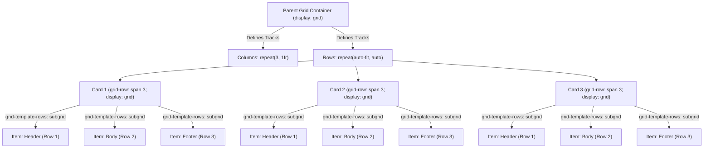

# 039: CSS Subgrid Basics Masterclass

## Overview

When CSS Grid (Level 1) was introduced, it revolutionized two-dimensional web layouts. However, a significant architectural limitation quickly emerged: **grid tracks were scoped strictly to direct children**. Once a grid item created its own nested layout, that child became an isolated layout context. Sibling components could not align their internal parts (such as card titles, descriptions, or action buttons) with one another without brittle fixed heights, flattened markup, or complex JavaScript calculations.

**CSS Grid Level 2 solves this with Subgrid (`subgrid`)**.

Subgrid allows a nested grid item to opt into and inherit the track definitions (rows, columns, or both), line names, and sizing mechanics of its parent grid. This enables deep, multi-level structural alignment while preserving clean, semantic, and accessible HTML hierarchies.

```css
/* The Canonical Subgrid Pattern */
.parent-grid {
  display: grid;
  grid-template-columns: repeat(3, 1fr);
  grid-template-rows: repeat(auto-fill, auto);
}

.card {
  /* Step 1: Span the desired parent tracks */
  grid-row: span 3;
  
  /* Step 2: Establish a subgrid along the row axis */
  display: grid;
  grid-template-rows: subgrid;
}
```

---

## 1. The Core Problem: Nested Grids vs. Subgrid

To understand why Subgrid is essential, examine the classic "misaligned card components" problem.

### Without Subgrid: Isolated Layout Contexts

In a standard grid of cards, each card is a direct child of the grid container. However, the contents of the card (`<header>`, `<p>`, `<footer>`) are children of the *card*, not the top-level grid. 

Because each card calculates its row heights independently based solely on its own content, card headers of differing lengths cause the content and footer elements to sit at mismatched vertical positions across columns:

```
┌───────────────────────────┬───────────────────────────┬───────────────────────────┐
│ Card 1                    │ Card 2                    │ Card 3                    │
├───────────────────────────┼───────────────────────────┼───────────────────────────┤
│ Title: Short              │ Title: Multi-Line Long    │ Title: Medium Title       │
│                           │ Title That Wraps Around   │                           │
├───────────────────────────┼───────────────────────────┼───────────────────────────┤
│ Description: A moderate   │ Description: Short text.  │ Description: Very lengthy │
│ paragraph describing this │                           │ description containing a  │
│ feature in detail.        │                           │ lot of detailed notes.    │
├───────────────────────────┼───────────────────────────┼───────────────────────────┤
│ [ Button: Learn More ]    │ [ Button: Learn More ]    │ [ Button: Learn More ]    │
└───────────────────────────┴───────────────────────────┴───────────────────────────┘
▲ Notice how internal row boundaries do not align horizontally across cards.
```

### With Subgrid: Unified Track Sizing

With `grid-template-rows: subgrid`, each card delegates its row tracks to the parent grid. If Card 2 has a three-line title, the first row of that grid track expands for **all cards in that row**, creating uniform alignment across every sibling:

```
┌───────────────────────────┬───────────────────────────┬───────────────────────────┐
│ Card 1                    │ Card 2                    │ Card 3                    │
│ Title: Short              │ Title: Multi-Line Long    │ Title: Medium Title       │
│                           │ Title That Wraps Around   │                           │
├───────────────────────────┼───────────────────────────┼───────────────────────────┤
│ Description: A moderate   │ Description: Short text.  │ Description: Very lengthy │
│ paragraph describing this │                           │ description containing a  │
│ feature in detail.        │                           │ lot of detailed notes.    │
├───────────────────────────┼───────────────────────────┼───────────────────────────┤
│ [ Button: Learn More ]    │ [ Button: Learn More ]    │ [ Button: Learn More ]    │
└───────────────────────────┴───────────────────────────┴───────────────────────────┘
▲ All titles share Row 1, all descriptions share Row 2, and all buttons share Row 3.
```

---

## 2. Subgrid Syntax & Mechanics

Subgrid is not a new `display` property value; it is a keyword value for `grid-template-columns` and `grid-template-rows`.

### Basic Declarations

```css
/* Inherit row tracks from parent */
.child-item {
  display: grid;
  grid-template-rows: subgrid;
}

/* Inherit column tracks from parent */
.child-item {
  display: grid;
  grid-template-columns: subgrid;
}

/* Inherit BOTH row and column tracks (2D Subgrid) */
.child-item {
  display: grid;
  grid-template-columns: subgrid;
  grid-template-rows: subgrid;
}
```

### The 3 Rules of Subgrid

1. **Must be a Grid Container**: The element using `subgrid` must have `display: grid`.
2. **Must be a Grid Item**: The element must be a direct child of another grid container (or another subgrid).
3. **Must Span Explicit Tracks**: The subgrid must span the number of tracks it intends to inherit using `grid-row: span N` or `grid-column: span N`.

---

## 3. Visual Mechanics: How Tracks Are Inherited



---

## 4. Track Sizing, Gaps, and Margins in Subgrid

### Track Sizing Contribution
Subgrid items participate directly in the sizing algorithm of the parent grid tracks they occupy.
- If a child element inside a subgrid has large content (e.g., an image or 4 lines of text), it expands the parent track dimension for that row or column.
- Sibling subgrids sharing those same parent tracks will naturally adjust to that height or width.

### Gap Inheritance and Overrides
By default, a subgrid **inherits** the `gap`, `row-gap`, and `column-gap` of the parent grid tracks it spans. However, you can explicitly override gaps on the subgrid container:

```css
.parent-grid {
  display: grid;
  gap: 2rem; /* 32px between all parent tracks */
}

.subgrid-card {
  display: grid;
  grid-template-rows: subgrid;
  row-gap: 0.5rem; /* Overrides parent row gap inside this card to 8px */
}
```

### Borders and Padding on the Subgrid Container
When a subgrid container has `padding`, `border`, or `margin`, these dimensions are applied to the outer edges of the spanned tracks:
- Start-edge padding/margin applies to the first track in the subgrid.
- End-edge padding/margin applies to the last track in the subgrid.
- The internal tracks between start and end remain perfectly aligned with the parent grid lines.

---

## 5. Practical Demonstrations

### Example 1: The Canonical Equal-Alignment Card Grid (Row Subgrid)

This example illustrates a responsive 3-column card grid where each card has a badge, dynamic multi-line title, body text, and a call-to-action button. All corresponding card elements align perfectly across rows.

#### HTML
```html
<section class="pricing-grid">
  <!-- Card 1 -->
  <article class="pricing-card">
    <div class="card-badge">Starter</div>
    <h3 class="card-title">Personal Cloud</h3>
    <p class="card-body">
      Ideal for hobbyists, personal portfolios, and side projects looking for reliable compute.
    </p>
    <div class="card-price">
      <span class="currency">$</span>
      <span class="amount">9</span>
      <span class="period">/mo</span>
    </div>
    <button class="card-cta" type="button">Select Plan</button>
  </article>

  <!-- Card 2 -->
  <article class="pricing-card featured">
    <div class="card-badge">Popular</div>
    <h3 class="card-title">Professional Team Workspaces & Analytics Cluster</h3>
    <p class="card-body">
      Complete collaboration suite with automated backups, custom domain routing, team seats, and 24/7 dedicated support.
    </p>
    <div class="card-price">
      <span class="currency">$</span>
      <span class="amount">29</span>
      <span class="period">/mo</span>
    </div>
    <button class="card-cta featured-btn" type="button">Get Started</button>
  </article>

  <!-- Card 3 -->
  <article class="pricing-card">
    <div class="card-badge">Enterprise</div>
    <h3 class="card-title">Global Scale</h3>
    <p class="card-body">
      Multi-region edge deployment with custom SLAs, dedicated infrastructure, and advanced compliance audits.
    </p>
    <div class="card-price">
      <span class="currency">$</span>
      <span class="amount">99</span>
      <span class="period">/mo</span>
    </div>
    <button class="card-cta" type="button">Contact Sales</button>
  </article>
</section>
```

#### CSS
```css
/* 1. Master Container: Defines 3 columns and sets up implicit row tracks */
.pricing-grid {
  display: grid;
  grid-template-columns: repeat(auto-fit, minmax(min(100%, 300px), 1fr));
  gap: 1.5rem;
  padding: 2rem;
  background-color: #0f172a;
  color: #f8fafc;
  font-family: system-ui, -apple-system, BlinkMacSystemFont, "Segoe UI", Roboto, sans-serif;
}

/* 2. Subgrid Card: Spans 5 rows (badge, title, body, price, cta) */
.pricing-card {
  display: grid;
  grid-row: span 5;
  grid-template-rows: subgrid;
  row-gap: 1rem; /* Local gap between internal card elements */
  
  padding: 1.75rem;
  background: #1e293b;
  border: 1px solid #334155;
  border-radius: 16px;
  box-shadow: 0 10px 25px -5px rgba(0, 0, 0, 0.4);
  transition: transform 0.2s ease, border-color 0.2s ease;
}

.pricing-card:hover {
  transform: translateY(-4px);
  border-color: #475569;
}

.pricing-card.featured {
  background: linear-gradient(180deg, #1e293b, #0f172a);
  border: 2px solid #6366f1;
  position: relative;
}

/* 3. Card Elements: Flow into subgridded rows 1 through 5 */
.card-badge {
  display: inline-block;
  align-self: start;
  width: fit-content;
  padding: 0.25rem 0.75rem;
  border-radius: 9999px;
  font-size: 0.75rem;
  font-weight: 700;
  text-transform: uppercase;
  letter-spacing: 0.05em;
  background: #334155;
  color: #94a3b8;
}

.pricing-card.featured .card-badge {
  background: #6366f1;
  color: #ffffff;
}

.card-title {
  margin: 0;
  font-size: 1.25rem;
  font-weight: 700;
  line-height: 1.35;
  color: #ffffff;
  /* Even though Card 2's title wraps to 3 lines, Card 1 & 3 row 2 expand to match */
}

.card-body {
  margin: 0;
  font-size: 0.925rem;
  line-height: 1.6;
  color: #94a3b8;
}

.card-price {
  display: flex;
  align-items: baseline;
  gap: 0.25rem;
  font-size: 2.25rem;
  font-weight: 800;
  color: #ffffff;
}

.card-price .currency {
  font-size: 1.25rem;
  color: #94a3b8;
}

.card-price .period {
  font-size: 0.875rem;
  color: #64748b;
  font-weight: 500;
}

.card-cta {
  display: inline-flex;
  align-items: center;
  justify-content: center;
  width: 100%;
  padding: 0.85rem 1.25rem;
  border-radius: 10px;
  border: none;
  font-size: 0.95rem;
  font-weight: 600;
  cursor: pointer;
  background: #334155;
  color: #ffffff;
  transition: background 0.2s ease, transform 0.1s ease;
}

.card-cta:hover {
  background: #475569;
}

.featured-btn {
  background: #6366f1;
  box-shadow: 0 4px 14px rgba(99, 102, 241, 0.4);
}

.featured-btn:hover {
  background: #4f46e5;
}
```

---

### Example 2: Aligned Form Groups with Column Subgrid

A common responsive design challenge is aligning multi-part form rows (label, text input, validation message/badge) across multiple fieldsets without resorting to brittle HTML `<table>` elements or fixed `width` hacks.

#### HTML
```html
<form class="user-settings-form">
  <h2>Account Credentials</h2>

  <!-- Field Row 1 -->
  <div class="form-row">
    <label for="username" class="form-label">Username</label>
    <input type="text" id="username" class="form-input" value="alex_developer" />
    <span class="form-hint success">Available</span>
  </div>

  <!-- Field Row 2 -->
  <div class="form-row">
    <label for="email" class="form-label">Work Email Address</label>
    <input type="email" id="email" class="form-input" value="alex@enterprise-cloud.io" />
    <span class="form-hint">Must match organization domain</span>
  </div>

  <!-- Field Row 3 -->
  <div class="form-row">
    <label for="ssh-key" class="form-label">SSH Public Key</label>
    <textarea id="ssh-key" class="form-input" rows="2" placeholder="ssh-ed25519 AAAAC3N..."></textarea>
    <span class="form-hint error">Required for Git push access</span>
  </div>
</form>
```

#### CSS
```css
/* 1. Form defines 3 columns:
      Column 1: max-content (sizes to longest label: "Work Email Address")
      Column 2: 1fr         (input takes remaining available space)
      Column 3: max-content (sizes to longest hint message)
*/
.user-settings-form {
  display: grid;
  grid-template-columns: max-content 1fr max-content;
  gap: 1.25rem 1.5rem;
  max-width: 800px;
  margin: 2rem auto;
  padding: 2rem;
  background: #18181b;
  border-radius: 12px;
  border: 1px solid #27272a;
  color: #fafafa;
  font-family: system-ui, sans-serif;
}

.user-settings-form h2 {
  grid-column: 1 / -1; /* Spans all 3 columns */
  margin: 0 0 0.5rem 0;
  font-size: 1.35rem;
  color: #fafafa;
}

/* 2. Form row spans across all 3 columns and inherits column tracks via subgrid */
.form-row {
  display: grid;
  grid-column: 1 / -1;
  grid-template-columns: subgrid;
  align-items: center;
}

/* 3. Form elements automatically lock into columns 1, 2, and 3 */
.form-label {
  font-size: 0.875rem;
  font-weight: 600;
  color: #a1a1aa;
}

.form-input {
  padding: 0.65rem 0.85rem;
  border-radius: 8px;
  background: #27272a;
  border: 1px solid #3f3f46;
  color: #fafafa;
  font-size: 0.9rem;
  font-family: inherit;
  outline: none;
  transition: border-color 0.2s;
}

.form-input:focus {
  border-color: #6366f1;
}

.form-hint {
  font-size: 0.775rem;
  color: #71717a;
}

.form-hint.success {
  color: #4ade80;
  font-weight: 600;
}

.form-hint.error {
  color: #f87171;
  font-weight: 600;
}
```

---

### Example 3: Two-Dimensional Subgrid (Row and Column Inheritance)

Subgrid can inherit along both the X and Y axes simultaneously. This is ideal for dashboard matrices, comparison grids, or calendar widgets.

#### HTML
```html
<div class="matrix-board">
  <div class="matrix-header">Metric</div>
  <div class="matrix-header">Region East</div>
  <div class="matrix-header">Region West</div>

  <!-- Widget A (Spans 2 columns, 2 rows) -->
  <section class="widget widget-alpha">
    <div class="widget-title">Compute Load</div>
    <div class="stat-value">42%</div>
    <div class="widget-footer">Telemetry active</div>
    <div class="stat-value">88%</div>
  </section>

  <!-- Widget B (Spans 1 column, 2 rows) -->
  <section class="widget widget-beta">
    <div class="widget-title">Memory Allocation</div>
    <div class="stat-value">12.4 GB</div>
  </section>
</div>
```

#### CSS
```css
/* Parent Grid: 3 columns x 3 rows */
.matrix-board {
  display: grid;
  grid-template-columns: 200px 1fr 1fr;
  grid-template-rows: auto 80px 80px;
  gap: 1rem;
  padding: 1.5rem;
  background: #09090b;
  border-radius: 12px;
  color: #f4f4f5;
  font-family: ui-monospace, SFMono-Regular, monospace;
}

.matrix-header {
  font-weight: 700;
  color: #a1a1aa;
  text-transform: uppercase;
  font-size: 0.8rem;
  padding-bottom: 0.5rem;
  border-bottom: 1px solid #27272a;
}

/* 2D Subgrid Widget */
.widget-alpha {
  grid-column: 1 / span 3;
  grid-row: 2 / span 2;
  
  /* Inherit BOTH Column and Row Tracks */
  display: grid;
  grid-template-columns: subgrid;
  grid-template-rows: subgrid;
  
  background: #18181b;
  padding: 1rem;
  border-radius: 8px;
  border: 1px solid #27272a;
}

.widget-title {
  font-weight: 600;
  color: #38bdf8;
}

.stat-value {
  font-size: 1.5rem;
  font-weight: 700;
  color: #ffffff;
}

.widget-footer {
  font-size: 0.75rem;
  color: #71717a;
}
```

---

## 6. Named Grid Lines in Subgrid

Subgrids have advanced integration with named grid lines.

### 1. Accessing Parent Line Names
A subgrid automatically inherits all line names defined on the parent grid within the tracks it spans.

```css
.parent {
  display: grid;
  grid-template-columns: [main-start] 250px [content-start] 1fr [content-end] 50px [main-end];
}

.child-subgrid {
  grid-column: main-start / main-end;
  display: grid;
  grid-template-columns: subgrid;
}

.grandchild {
  /* Grandchild can place itself using parent line names! */
  grid-column: content-start / content-end;
}
```

### 2. Defining Local Line Names
A subgrid can also declare its own local line names inside the `subgrid` definition:

```css
.card {
  grid-row: span 3;
  display: grid;
  /* Defines local line names for the 3 spanned tracks */
  grid-template-rows: subgrid [card-header] [card-body] [card-footer];
}

.card-title {
  grid-row: card-header;
}
```

---

## 7. Subgrid vs. Flexbox vs. Standard Nested Grid

| Feature | Standard Nested Grid | Flexbox with `margin-top: auto` | CSS Subgrid |
| :--- | :--- | :--- | :--- |
| **Track Scope** | Isolated to child container | Single axis per container | Inherited directly from parent |
| **Cross-Card Alignment** | ❌ No (requires fixed heights) | ⚠️ Bottom elements only (pushes footer down) | ✅ Yes (every intermediate row aligns) |
| **DOM Hierarchy Requirement** | Retains semantic hierarchy | Retains semantic hierarchy | Retains semantic hierarchy |
| **Track Sizing Feedback** | Child sizes do not affect siblings | Child sizes do not affect siblings | Child sizes expand parent tracks globally |
| **2D Axis Alignment** | ❌ No | ❌ No | ✅ Yes (`columns` + `rows`) |
| **Learning Curve** | Basic | Basic | Intermediate |

---

## 8. Progressive Enhancement & Fallbacks

CSS Subgrid is supported across all modern evergreen browsers (Chrome 117+, Firefox 71+, Safari 16+, Edge 117+). For legacy clients, implement progressive enhancement using `@supports`:

```css
/* 1. Base Fallback (Flexbox layout with pushed footer) */
.pricing-card {
  display: flex;
  flex-direction: column;
  gap: 1rem;
  padding: 1.5rem;
}

.pricing-card .card-cta {
  margin-top: auto; /* Keeps button at the bottom of the card */
}

/* 2. Enhanced Modern Experience (Subgrid) */
@supports (grid-template-rows: subgrid) {
  .pricing-grid {
    display: grid;
    grid-template-columns: repeat(auto-fit, minmax(min(100%, 300px), 1fr));
  }

  .pricing-card {
    display: grid;
    grid-row: span 5;
    grid-template-rows: subgrid;
  }

  .pricing-card .card-cta {
    margin-top: 0; /* Reset flex margin */
  }
}
```

---

## 9. Common Pitfalls & How to Avoid Them

### Pitfall 1: Forgetting to Explicitly Span Tracks
- **Problem**: Setting `grid-template-rows: subgrid` without declaring `grid-row: span N`.
- **Consequence**: The subgrid defaults to `span 1`, squeezing all child elements into a single row track.
- **Solution**: Always specify `grid-row: span <number_of_children>` or provide explicit start/end placement (`grid-row: 1 / 4`).

### Pitfall 2: Expecting Subgrid to Auto-Generate Infinite Implicit Tracks
- **Problem**: Adding more children than the spanned track count.
- **Consequence**: Items beyond the spanned track count cannot create new subgridded tracks because the parent track range is bounded. Extra items collapse into the final track or overflow.
- **Solution**: Ensure your `span` count matches or exceeds the child count.

### Pitfall 3: Forgetting `display: grid` on the Subgrid Element
- **Problem**: Adding `grid-template-rows: subgrid` without `display: grid`.
- **Consequence**: Subgrid has no effect on block or flex containers.

### Pitfall 4: Overlooking `min-width: 0` / `min-height: 0`
- **Problem**: Long text or code strings stretching grid tracks wider than expected.
- **Solution**: Apply `min-width: 0` (or `min-inline-size: 0`) to grid items containing dynamic text.

---

## 10. Summary & Quick Reference

### The 4-Step Checklist for Subgrid
1. **Parent Container**: Set `display: grid` and define track templates (e.g. `grid-template-columns` or rows).
2. **Child Container**: Set `display: grid`.
3. **Span Definition**: Set `grid-row: span N` or `grid-column: span N` to encompass the tracks you wish to inherit.
4. **Subgrid Keyword**: Declare `grid-template-rows: subgrid` or `grid-template-columns: subgrid`.

### Quick Syntax Cheat Sheet
```css
/* 1D Row Subgrid */
.card {
  grid-row: span 4;
  display: grid;
  grid-template-rows: subgrid;
}

/* 1D Column Subgrid */
.form-row {
  grid-column: 1 / -1;
  display: grid;
  grid-template-columns: subgrid;
}

/* 2D Subgrid */
.dashboard-tile {
  grid-column: span 2;
  grid-row: span 3;
  display: grid;
  grid-template-columns: subgrid;
  grid-template-rows: subgrid;
}
```
