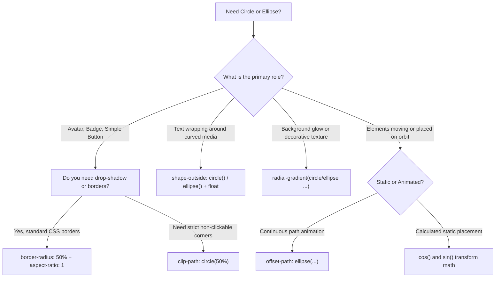

# 041: CSS Circle & Ellipse Techniques Masterclass

## Overview & Executive Summary

Circles and ellipses are foundational geometric primitives in modern UI design. From circular user avatars, interactive radial gauges, and orbital badge layouts to fluid elliptical spotlights, organic text wrapping, and smooth morphing controls, mastering non-rectangular geometry is essential for crafting world-class digital experiences.

In CSS, rendering circles and ellipses is not limited to a single property. Web engines provide **six distinct architectural techniques**, each engineered for specific layout, rendering, clipping, and text-flow requirements:

```
                            ┌──────────────────────────────────────┐
                            │    CSS CIRCLE & ELLIPSE TAXONOMY     │
                            └──────────────────┬───────────────────┘
                                               │
         ┌──────────────────┬──────────────────┼──────────────────┬──────────────────┐
         ▼                  ▼                  ▼                  ▼                  ▼
┌─────────────────┐┌─────────────────┐┌─────────────────┐┌─────────────────┐┌─────────────────┐
│  border-radius  ││    clip-path    ││  shape-outside  ││ radial-gradient ││  Motion & Trig  │
│  Box Model &    ││  Vector Clipping││  Curved Inline  ││  Shader Paint   ││  offset-path &   │
│  Border Geometry││  & Hit-Testing  ││  Content Flow   ││  & Mask Images  ││  sin() / cos()   │
└─────────────────┘└─────────────────┘└─────────────────┘└─────────────────┘└─────────────────┘
```

---

## 1. Geometric Foundations & Mental Models

### Circle vs. Ellipse: The Mathematical Distinction

| Geometric Metric | Circle ($\mathcal{C}$) | Ellipse ($\mathcal{E}$) |
| :--- | :--- | :--- |
| **Symmetry Definition** | Equidistant radius $r$ in all directions ($360^\circ$). | Two distinct semi-axes: Semi-major ($a$) and Semi-minor ($b$). |
| **Cartesian Equation** | $(x - x_0)^2 + (y - y_0)^2 = r^2$ | $\frac{(x - x_0)^2}{a^2} + \frac{(y - y_0)^2}{b^2} = 1$ |
| **Aspect Ratio Requirement** | Strictly $1 : 1$ ($W = H$). | Any ratio $W \neq H$ or $W = H$. |
| **CSS Coordinate Representation** | `circle(r at cx cy)` | `ellipse(rx ry at cx cy)` |

```
        PERFECT CIRCLE (1:1)                           ELLIPSE (W != H)
         ┌─────── 2r ───────┐                       ┌─────────── 2a ───────────┐
      ┌───                ───┐                   ┌───                        ───┐
     │           │            │                 │             │                  │
     │           │ r          │                 │             │ b (semi-minor)   │
  2r │ ──────────●─────────── │              2b │ ────────────●───────────────── │
     │        (cx, cy)        │                 │          (cx, cy)  a (semi-    │
     │                        │                 │                     major)     │
      └───                ───┘                   └───                        ───┘
         └──────────────────┘                       └──────────────────────────┘
```

---

## 2. The 6 Core CSS Circle & Ellipse Primitives

---

### Primitive 1: `border-radius` (The Box Model Engine)

`border-radius` rounds the outer and inner borders of an element's CSS box model.

#### 1. Perfect Circle
When an element has an equal width and height ($1:1$) or uses `aspect-ratio: 1`, applying `border-radius: 50%` creates a circle:

```css
.circle-avatar {
  inline-size: 80px;
  aspect-ratio: 1;
  border-radius: 50%;
  object-fit: cover;
}
```

#### 2. Fluid Ellipse
When an element's width and height differ, `border-radius: 50%` calculates horizontal and vertical radii independently as $50\%$ of width and $50\%$ of height, producing a smooth ellipse:

```css
.ellipse-badge {
  inline-size: 160px;
  block-size: 80px;
  border-radius: 50%; /* 50% horizontal (80px), 50% vertical (40px) */
}
```

#### 3. Pill / Stadium (Capsule) Shape
To prevent an oblong box from turning into an ellipse and instead maintain semicircular end caps, use an oversized pixel value:

```css
.capsule-pill {
  inline-size: fit-content;
  padding: 0.5rem 1.5rem;
  border-radius: 9999px; /* Clamps to half of the shortest axis */
}
```

#### 4. The 8-Value Slash Syntax (Asymmetric & Organic Ellipses)
The full CSS syntax allows independent horizontal and vertical radii for all four corners:
`border-radius: [top-left-x] [top-right-x] [bottom-right-x] [bottom-left-x] / [top-left-y] [top-right-y] [bottom-right-y] [bottom-left-y];`

```css
/* Creates an organic, dynamic squircle / droplet */
.organic-blob {
  inline-size: 200px;
  aspect-ratio: 1;
  border-radius: 60% 40% 30% 70% / 60% 30% 70% 40%;
}
```

---

### Primitive 2: `clip-path` (Vector Masking & Interactive Hit-Testing)

Unlike `border-radius` (which only visually masks background fills and borders unless `overflow: hidden` is applied), `clip-path` discards all content and pointer-event hit areas outside the vector boundary.

#### 1. `clip-path: circle()` Syntax
```css
/* circle( [radius] [at <position>]? ) */
clip-path: circle(50% at 50% 50%);         /* Centered circle filling box */
clip-path: circle(40px at center);          /* Fixed 40px radius centered */
clip-path: circle(closest-side at 20% 30%); /* Tangent to the nearest edge */
clip-path: circle(farthest-side at 0 0);    /* Expands to cover furthest corner */
```

#### 2. `clip-path: ellipse()` Syntax
```css
/* ellipse( [radius-x] [radius-y] [at <position>]? ) */
clip-path: ellipse(50% 35% at 50% 50%);
clip-path: ellipse(120px 60px at top left);
clip-path: ellipse(closest-side farthest-side at center);
```

#### 3. Interactive Pointer Event Precision
```
+------------------------------------+
| DOM Bounding Rect (400px x 400px)  |
|         ┌────────────────┐         |
|         │ Clipped Circle │ <───────┼── Pointer events active ONLY here!
|         │  (Clickable)   │         |
|         └────────────────┘         |
| Outside area: Click passes through!|
+------------------------------------+
```

---

### Primitive 3: `shape-outside` (Curved Text Wrapping)

`shape-outside` alters the inline flow of surrounding text, wrapping paragraphs around organic circles or ellipses.

> [!IMPORTANT]
> `shape-outside` requires the element to be **floated** (`float: left` or `float: right`) and have explicit dimensions or `aspect-ratio`.

```css
.floated-circle {
  float: left;
  inline-size: 220px;
  aspect-ratio: 1;
  border-radius: 50%;
  shape-outside: circle(50% at 50% 50%);
  shape-margin: 1.5rem; /* Offsets surrounding text from the curved boundary */
}
```

---

### Primitive 4: `radial-gradient` & `mask-image` (Shaders & Cutouts)

`radial-gradient()` generates procedural circle and ellipse graphics on backgrounds and masks without injecting extra DOM elements.

#### 1. Background Circles & Concentric Target Rings
```css
.radial-target {
  background-image: radial-gradient(
    circle at center,
    #6366f1 0%,
    #6366f1 30%,
    #ec4899 30%,
    #ec4899 60%,
    transparent 60%
  );
}
```

#### 2. Elliptical Ambient Backdrops (Glassmorphism Spotlights)
```css
.ambient-glow {
  background-image: radial-gradient(
    ellipse 80% 50% at 50% -20%,
    rgba(99, 102, 241, 0.35) 0%,
    rgba(99, 102, 241, 0) 70%
  );
}
```

#### 3. Donut Ring Cutout with `mask-image`
```css
.donut-mask {
  mask-image: radial-gradient(
    circle at center,
    transparent 50%,
    black 51%
  );
}
```

---

### Primitive 5: Motion Path (`offset-path`)

The CSS Motion Path module positions and animates elements along elliptical and circular orbits.

```css
.orbital-satellite {
  /* Defines an elliptical orbital path */
  offset-path: ellipse(200px 100px at 50% 50%);
  offset-distance: 0%;
  animation: orbit 8s linear infinite;
}

@keyframes orbit {
  from { offset-distance: 0%; }
  to   { offset-distance: 100%; }
}
```

---

### Primitive 6: CSS Trigonometric Functions (`cos()`, `sin()`)

Modern CSS supports native trigonometry for calculated circular coordinate placement:

$$x = r \cdot \cos(\theta), \quad y = r \cdot \sin(\theta)$$

```css
.radial-menu-item {
  --radius: 120px;
  --angle: calc(var(--i) * (360deg / var(--total)));
  
  --x: calc(cos(var(--angle)) * var(--radius));
  --y: calc(sin(var(--angle)) * var(--radius));
  
  translate: var(--x) var(--y);
}
```

---

## 3. Comparison Matrix: Choosing the Right Approach

| Technique | Primary Strengths | Limitations | Hit-Testing Boundary | GPU Layer / Reflow Cost |
| :--- | :--- | :--- | :--- | :--- |
| **`border-radius: 50%`** | Simple, universally supported, supports borders & shadows natively. | Does not clip child pointer events outside the curve unless `overflow: hidden`. | Rectangular (unless clipped) | Extremely lightweight (Paint) |
| **`clip-path: circle()` / `ellipse()`** | Exact hardware-accelerated clipping; clips pointer hit-testing; animatable. | Drops external `box-shadow` (must use `filter: drop-shadow()`). | Exact curved vector perimeter | Hardware composite (very fast) |
| **`shape-outside`** | Wraps inline editorial text seamlessly around curves. | Requires `float: left/right`; only affects external inline content. | Follows float box | Incurs layout reflow on change |
| **`radial-gradient()`** | Zero DOM overhead; supports concentric rings, spotlights, dots. | Cannot wrap HTML text inside or clip child elements. | None (background fill) | Pure paint operation |
| **`offset-path`** | True geometric orbital motion paths without complex transform math. | Requires modern browser engine support. | Element's own bounding box | Composite animation |
| **`cos()` / `sin()` Math** | Dynamic static and responsive radial coordinate layouts. | Requires index/angle custom properties. | Element's own bounding box | Transform composite |

---

## 4. Architectural Patterns & Complete Implementations

---

### Pattern 1: High-Performance Profile Avatar with Dynamic Pulse Ring

A responsive circular avatar with an online status indicator, interactive focus ring, and dual-layer glowing pulse animation.

```
                  ┌──────────────────────┐
                  │    PULSE RING        │
                  │   ┌──────────────┐   │
                  │  │ [ User Avatar │  │   ◄── border-radius: 50% + aspect-ratio: 1
                  │  │    Image ]    │  │
                  │   └──────────────┘   │
                  │              (●)     │   ◄── Status Indicator Pill
                  └──────────────────────┘
```

#### HTML
```html
<div class="avatar-container" role="region" aria-label="User Profile">
  <div class="avatar-wrapper">
    
    <span class="status-indicator online" aria-label="Status: Online"></span>
  </div>
  <div class="user-meta">
    <h3 class="user-name">Sarah Jenkins</h3>
    <p class="user-role">Principal Systems Architect</p>
  </div>
</div>
```

#### CSS
```css
:root {
  --avatar-size: clamp(4.5rem, 8vw, 6rem);
  --status-size: calc(var(--avatar-size) * 0.24);
  --color-online: #10b981;
  --color-ring: #6366f1;
  --bg-dark: #0f172a;
}

.avatar-container {
  display: flex;
  align-items: center;
  gap: 1.25rem;
  padding: 1.25rem;
  background: rgba(30, 41, 59, 0.7);
  backdrop-filter: blur(12px);
  border: 1px solid rgba(255, 255, 255, 0.08);
  border-radius: 1.25rem;
  inline-size: fit-content;
  color: #f8fafc;
  font-family: system-ui, -apple-system, sans-serif;
}

.avatar-wrapper {
  position: relative;
  inline-size: var(--avatar-size);
  aspect-ratio: 1 / 1;
  flex-shrink: 0;
}

.avatar-image {
  inline-size: 100%;
  block-size: 100%;
  aspect-ratio: 1 / 1;
  border-radius: 50%;
  object-fit: cover;
  display: block;
  border: 3px solid #1e293b;
  box-shadow: 
    0 0 0 2px var(--color-ring),
    0 8px 24px -4px rgba(0, 0, 0, 0.5);
  transition: transform 0.3s cubic-bezier(0.34, 1.56, 0.64, 1);
}

.avatar-wrapper:hover .avatar-image {
  transform: scale(1.05);
}

/* Status Indicator Circle with Multi-layer Pulse */
.status-indicator {
  position: absolute;
  inset-inline-end: 2px;
  inset-block-end: 2px;
  inline-size: var(--status-size);
  aspect-ratio: 1;
  border-radius: 50%;
  background-color: var(--color-online);
  border: 2.5px solid #0f172a;
  box-sizing: border-box;
}

.status-indicator::after {
  content: '';
  position: absolute;
  inset: -2.5px;
  border-radius: 50%;
  background-color: var(--color-online);
  opacity: 0.75;
  z-index: -1;
  animation: pulse-ring 2s cubic-bezier(0.24, 0, 0.38, 1) infinite;
}

@keyframes pulse-ring {
  0% {
    transform: scale(0.95);
    opacity: 0.8;
  }
  70% {
    transform: scale(2.2);
    opacity: 0;
  }
  100% {
    transform: scale(2.4);
    opacity: 0;
  }
}

.user-meta {
  display: flex;
  flex-direction: column;
  gap: 0.25rem;
}

.user-name {
  margin: 0;
  font-size: 1.125rem;
  font-weight: 600;
  letter-spacing: -0.01em;
}

.user-role {
  margin: 0;
  font-size: 0.875rem;
  color: #94a3b8;
}
```

---

### Pattern 2: Circular Progress Meter & Conic Dial

A dynamic circular percentage indicator built using `conic-gradient` paired with a masked radial cutout.

```
              ┌───────────────────────────┐
              │   CONIC GRADIENT DIAL     │
              │         ╭───────╮         │
              │      ╭──╯  78%  ╰──╮      │  ◄── Radial Mask Inner Cutout
              │     │  Progress Dial│     │
              │      ╰──╮       ╭──╯      │
              │         ╰───────╯         │
              └───────────────────────────┘
```

#### HTML
```html
<div class="gauge-card">
  <div 
    class="radial-meter" 
    role="progressbar" 
    aria-valuenow="78" 
    aria-valuemin="0" 
    aria-valuemax="100" 
    style="--value: 78%;"
  >
    <div class="meter-content">
      <span class="metric-value">78<small>%</small></span>
      <span class="metric-label">Efficiency</span>
    </div>
  </div>
  <p class="gauge-caption">Core Cluster Optimization</p>
</div>
```

#### CSS
```css
:root {
  --meter-size: 180px;
  --track-thickness: 16px;
  --meter-track: #1e293b;
  --meter-fill: #38bdf8;
  --meter-fill-end: #6366f1;
}

.gauge-card {
  display: flex;
  flex-direction: column;
  align-items: center;
  gap: 1rem;
  padding: 2rem;
  background: #0f172a;
  border-radius: 1.5rem;
  border: 1px solid #334155;
  inline-size: fit-content;
  color: #f8fafc;
  font-family: system-ui, -apple-system, sans-serif;
}

.radial-meter {
  position: relative;
  inline-size: var(--meter-size);
  aspect-ratio: 1;
  border-radius: 50%;
  display: grid;
  place-items: center;
  
  /* Conic gradient fills percentage based on custom property */
  background: conic-gradient(
    var(--meter-fill) 0%,
    var(--meter-fill-end) var(--value),
    var(--meter-track) var(--value) 100%
  );
  
  /* Smooth transitions when value updates */
  transition: --value 0.6s cubic-bezier(0.4, 0, 0.2, 1);
}

/* Inner cutout creating the ring track */
.radial-meter::before {
  content: '';
  position: absolute;
  inset: var(--track-thickness);
  border-radius: 50%;
  background-color: #0f172a;
  box-shadow: inset 0 2px 6px rgba(0, 0, 0, 0.6);
}

.meter-content {
  position: relative;
  z-index: 1;
  display: flex;
  flex-direction: column;
  align-items: center;
  justify-content: center;
}

.metric-value {
  font-size: 2.25rem;
  font-weight: 800;
  letter-spacing: -0.03em;
  line-height: 1;
  color: #ffffff;
}

.metric-value small {
  font-size: 1.25rem;
  font-weight: 500;
  color: #94a3b8;
}

.metric-label {
  font-size: 0.8125rem;
  text-transform: uppercase;
  letter-spacing: 0.08em;
  color: #64748b;
  margin-block-start: 0.35rem;
}

.gauge-caption {
  margin: 0;
  font-size: 0.9375rem;
  color: #cbd5e1;
  font-weight: 500;
}
```

---

### Pattern 3: Editorial Flow with `shape-outside: ellipse()`

An editorial magazine layout where body typography smoothly curves around an elliptical pull-quote image container.

```
       ┌────────────────────────────────────────────────────────┐
       │   TEXT WRAPPING AROUND SHAPE-OUTSIDE ELLIPSE           │
       │                                                        │
       │   ╭──────────────╮  Lorem ipsum dolor sit amet,        │
       │ ╭─╯  ELLIPTICAL  ╰─╮consectetur adipiscing elit.       │
       │ │   PORTRAIT     │  Integer nec odio. Praesent libero. │
       │ ╰─╮  IMAGE       ╭─╯Sed cursus ante dapibus diam.      │
       │   ╰──────────────╯  Sed nisi. Nulla quis sem at nibh   │
       │   elementum imperdiet. Duis sagittis ipsum.            │
       └────────────────────────────────────────────────────────┘
```

#### HTML
```html
<article class="editorial-article">
  <header>
    <span class="category-tag">Astronomy & Physics</span>
    <h1 class="article-title">Gravitational Lensing in Deep Cosmic Voids</h1>
  </header>
  
  <div class="article-body">
    <div class="curved-media" role="figure" aria-label="Telescope observation">
      
    </div>
    
    <p>
      Gravitational lensing represents one of the most astonishing predictions of Einstein's general theory of relativity. When massive galactic clusters sit between an observer and a distant background source, spacetime curves so severely that light follows bent trajectories around the intermediary mass.
    </p>
    <p>
      This celestial curvature acts as a cosmic magnifying glass, amplifying otherwise invisible photons emitted during the universe's primordial epochs. Modern spectrographic instruments capture these warped photon arcs, allowing astrophysicists to reconstruct dark matter topologies across billions of light years.
    </p>
    <p>
      By mapping the precise elliptical eccentricity of distorted Einstein rings, researchers calculate localized mass distributions with unprecedented fidelity.
    </p>
  </div>
</article>
```

#### CSS
```css
.editorial-article {
  max-inline-size: 720px;
  margin-inline: auto;
  padding: 2.5rem;
  background: #ffffff;
  color: #1e293b;
  font-family: 'Charter', 'Georgia', serif;
  line-height: 1.8;
  border-radius: 1rem;
  box-shadow: 0 10px 30px rgba(0, 0, 0, 0.08);
}

.category-tag {
  font-family: system-ui, -apple-system, sans-serif;
  font-size: 0.75rem;
  font-weight: 700;
  text-transform: uppercase;
  letter-spacing: 0.1em;
  color: #6366f1;
}

.article-title {
  font-family: system-ui, -apple-system, sans-serif;
  font-size: 2rem;
  font-weight: 800;
  line-height: 1.2;
  letter-spacing: -0.02em;
  margin-block: 0.5rem 1.75rem;
}

/* Floated Ellipse with Shape Outside */
.curved-media {
  float: left;
  inline-size: 220px;
  block-size: 280px;
  margin-inline-end: 2rem;
  margin-block-end: 1rem;
  
  /* Geometric shape boundary for text wrapping */
  shape-outside: ellipse(50% 50% at 50% 50%);
  shape-margin: 1.5rem;
}

.media-ellipse {
  inline-size: 100%;
  block-size: 100%;
  object-fit: cover;
  
  /* Visual clipping matching the shape-outside */
  clip-path: ellipse(50% 50% at 50% 50%);
  filter: saturate(1.1) contrast(1.05);
}

.article-body p {
  margin-block: 0 1.25rem;
  text-align: justify;
}

/* Clearfix for floated content */
.article-body::after {
  content: '';
  display: table;
  clear: both;
}
```

---

### Pattern 4: Morphing Pill-to-Circle Action Button

An interactive UI component that smoothly interpolates from a descriptive stadium/pill button into a compact circular loader upon submission.

```
    NORMAL STATE (PILL)                 LOADING STATE (CIRCLE)
  ┌───────────────────────┐                    ┌───────┐
  │  (↑) Upload Files     │    ──────────>     │  (⟳)  │
  └───────────────────────┘                    └───────┘
   border-radius: 9999px                        aspect-ratio: 1
   inline-size: 180px                           inline-size: 48px
```

#### HTML
```html
<button class="morph-button" id="submitAction" type="button" aria-busy="false">
  <span class="icon upload-icon">
    <svg width="20" height="20" viewBox="0 0 24 24" fill="none" stroke="currentColor" stroke-width="2">
      <path d="M21 15v4a2 2 0 0 1-2 2H5a2 2 0 0 1-2-2v-4M17 8l-5-5-5 5M12 3v12"/>
    </svg>
  </span>
  <span class="icon spinner-icon" aria-hidden="true">
    <svg width="20" height="20" viewBox="0 0 24 24" fill="none" stroke="currentColor" stroke-width="2">
      <path d="M21 12a9 9 0 1 1-6.219-8.56"/>
    </svg>
  </span>
  <span class="button-label">Deploy Node</span>
</button>
```

#### CSS
```css
.morph-button {
  --btn-height: 48px;
  --btn-width-expanded: 170px;
  
  position: relative;
  display: inline-flex;
  align-items: center;
  justify-content: center;
  gap: 0.625rem;
  
  block-size: var(--btn-height);
  inline-size: var(--btn-width-expanded);
  padding-inline: 1.25rem;
  
  /* Pill boundary */
  border-radius: 9999px;
  background: linear-gradient(135deg, #6366f1, #4f46e5);
  color: #ffffff;
  border: none;
  cursor: pointer;
  overflow: hidden;
  font-family: system-ui, -apple-system, sans-serif;
  font-weight: 600;
  font-size: 0.9375rem;
  
  box-shadow: 0 4px 14px rgba(79, 70, 229, 0.4);
  transition: 
    inline-size 0.4s cubic-bezier(0.4, 0, 0.2, 1),
    padding 0.4s cubic-bezier(0.4, 0, 0.2, 1),
    background-color 0.3s ease,
    box-shadow 0.3s ease;
}

.morph-button:hover {
  box-shadow: 0 6px 20px rgba(79, 70, 229, 0.6);
  transform: translateY(-1px);
}

.morph-button .button-label {
  white-space: nowrap;
  transition: opacity 0.2s ease, transform 0.2s ease;
}

.morph-button .spinner-icon {
  position: absolute;
  display: grid;
  place-items: center;
  opacity: 0;
  transform: scale(0.5);
  transition: opacity 0.2s ease, transform 0.2s ease;
}

.morph-button .spinner-icon svg {
  animation: spin-loader 1s linear infinite;
}

/* Loading State: Morphs to perfect circle */
.morph-button[aria-busy="true"] {
  inline-size: var(--btn-height); /* Width equals height -> perfect circle */
  padding-inline: 0;
  cursor: wait;
}

.morph-button[aria-busy="true"] .button-label,
.morph-button[aria-busy="true"] .upload-icon {
  opacity: 0;
  transform: scale(0.7);
  pointer-events: none;
}

.morph-button[aria-busy="true"] .spinner-icon {
  opacity: 1;
  transform: scale(1);
}

@keyframes spin-loader {
  from { transform: rotate(0deg); }
  to   { transform: rotate(360deg); }
}
```

---

### Pattern 5: Orbital Dashboard with CSS Motion Path (`offset-path`)

A dynamic planetary UI where satellite telemetry nodes orbit an elliptical central server core.

```
                       ┌────────────────────────┐
                       │     ORBITAL PATH       │
                       │       (● Node 1)       │
                       │     ╭───────────╮      │
                       │    │   CORE     │      │
                       │     ╰───────────╯      │
                       │    (● Node 2)          │
                       └────────────────────────┘
```

#### HTML
```html
<div class="orbital-system" role="region" aria-label="Distributed Cluster Orbit">
  <div class="center-core">
    <div class="core-symbol">HUB</div>
  </div>
  
  <div class="orbit-track" aria-hidden="true"></div>

  <!-- Orbital Satellites -->
  <div class="satellite node-alpha" style="--orbit-delay: 0s;">
    <span class="node-dot"></span>
    <span class="node-tag">Edge-US</span>
  </div>
  <div class="satellite node-beta" style="--orbit-delay: -5s;">
    <span class="node-dot"></span>
    <span class="node-tag">Edge-EU</span>
  </div>
  <div class="satellite node-gamma" style="--orbit-delay: -10s;">
    <span class="node-dot"></span>
    <span class="node-tag">Edge-AP</span>
  </div>
</div>
```

#### CSS
```css
.orbital-system {
  --orbit-rx: 180px;
  --orbit-ry: 80px;
  
  position: relative;
  inline-size: 460px;
  block-size: 260px;
  background: radial-gradient(circle at center, #1e1b4b 0%, #030712 80%);
  border-radius: 1.5rem;
  display: grid;
  place-items: center;
  overflow: hidden;
  font-family: system-ui, -apple-system, sans-serif;
}

/* Center Server Core */
.center-core {
  position: relative;
  z-index: 2;
  inline-size: 72px;
  aspect-ratio: 1;
  border-radius: 50%;
  background: linear-gradient(135deg, #4338ca, #6366f1);
  display: grid;
  place-items: center;
  color: #ffffff;
  font-weight: 800;
  font-size: 0.875rem;
  letter-spacing: 0.05em;
  box-shadow: 
    0 0 30px rgba(99, 102, 241, 0.6),
    inset 0 2px 4px rgba(255, 255, 255, 0.3);
}

/* Elliptical Track Graphic */
.orbit-track {
  position: absolute;
  inline-size: calc(var(--orbit-rx) * 2);
  block-size: calc(var(--orbit-ry) * 2);
  border-radius: 50%;
  border: 1px dashed rgba(99, 102, 241, 0.3);
  pointer-events: none;
}

/* Orbital Satellites */
.satellite {
  position: absolute;
  display: flex;
  align-items: center;
  gap: 0.5rem;
  
  /* CSS Motion Path on Ellipse */
  offset-path: ellipse(var(--orbit-rx) var(--orbit-ry) at center);
  offset-distance: 0%;
  offset-rotate: 0deg; /* Keeps label upright */
  
  animation: planetary-orbit 15s linear infinite;
  animation-delay: var(--orbit-delay);
}

.node-dot {
  inline-size: 14px;
  aspect-ratio: 1;
  border-radius: 50%;
  background: #38bdf8;
  box-shadow: 0 0 12px #38bdf8;
}

.node-tag {
  font-size: 0.6875rem;
  font-weight: 700;
  color: #94a3b8;
  background: rgba(15, 23, 42, 0.8);
  padding: 0.15rem 0.4rem;
  border-radius: 0.25rem;
  border: 1px solid rgba(255, 255, 255, 0.1);
}

@keyframes planetary-orbit {
  from { offset-distance: 0%; }
  to   { offset-distance: 100%; }
}
```

---

### Pattern 6: Ambient Vignette & Spotlight Backdrop with Radial Elliptical Gradients

High-end dark-mode visual aesthetic utilizing layered elliptical gradients for realistic stage lighting.

```
       ┌────────────────────────────────────────────────────────┐
       │   ELLIPTICAL SPOTLIGHT ILLUMINATION                    │
       │                     . : * : .                          │
       │                 . : '       ' : .                      │
       │             . :                   : .                  │
       │             ┌───────────────────────┐                  │
       │             │   HERO CTA CONTENT    │                  │
       │             └───────────────────────┘                  │
       │                                                        │
       └────────────────────────────────────────────────────────┘
```

#### HTML
```html
<section class="spotlight-hero">
  <div class="hero-content">
    <span class="glow-badge">Next-Gen Runtime</span>
    <h1 class="hero-heading">Compute Without Boundaries</h1>
    <p class="hero-subtext">
      Serverless edge orchestration with zero-cold-start latency and atomic state replication.
    </p>
    <div class="hero-actions">
      <button class="primary-pill-btn">Deploy Application</button>
      <button class="secondary-pill-btn">Read Architecture</button>
    </div>
  </div>
</section>
```

#### CSS
```css
.spotlight-hero {
  position: relative;
  min-block-size: 450px;
  padding: 4rem 2rem;
  display: grid;
  place-items: center;
  background-color: #030712;
  overflow: hidden;
  border-radius: 1.5rem;
  color: #f9fafb;
  font-family: system-ui, -apple-system, sans-serif;
  
  /* Layered Elliptical Spotlights */
  background-image: 
    /* Top Center Cyan Spotlight */
    radial-gradient(
      ellipse 60% 40% at 50% 0%,
      rgba(56, 189, 248, 0.25) 0%,
      rgba(56, 189, 248, 0) 70%
    ),
    /* Bottom Indigo Fill */
    radial-gradient(
      ellipse 80% 50% at 50% 100%,
      rgba(99, 102, 241, 0.2) 0%,
      rgba(99, 102, 241, 0) 80%
    );
}

.hero-content {
  position: relative;
  z-index: 1;
  max-inline-size: 600px;
  text-align: center;
  display: flex;
  flex-direction: column;
  align-items: center;
}

.glow-badge {
  display: inline-block;
  padding: 0.35rem 1rem;
  border-radius: 9999px; /* Capsule pill */
  font-size: 0.8125rem;
  font-weight: 600;
  color: #38bdf8;
  background: rgba(56, 189, 248, 0.1);
  border: 1px solid rgba(56, 189, 248, 0.3);
  margin-block-end: 1.25rem;
}

.hero-heading {
  font-size: clamp(2rem, 5vw, 3.25rem);
  font-weight: 800;
  line-height: 1.1;
  letter-spacing: -0.03em;
  margin: 0 0 1rem 0;
  background: linear-gradient(180deg, #ffffff 0%, #cbd5e1 100%);
  -webkit-background-clip: text;
  -webkit-text-fill-color: transparent;
}

.hero-subtext {
  font-size: 1.0625rem;
  color: #94a3b8;
  line-height: 1.6;
  margin: 0 0 2rem 0;
}

.hero-actions {
  display: flex;
  gap: 1rem;
  flex-wrap: wrap;
  justify-content: center;
}

.primary-pill-btn {
  padding: 0.75rem 1.75rem;
  border-radius: 9999px;
  background: #38bdf8;
  color: #030712;
  font-weight: 600;
  border: none;
  cursor: pointer;
  transition: transform 0.2s ease, box-shadow 0.2s ease;
  box-shadow: 0 0 20px rgba(56, 189, 248, 0.4);
}

.primary-pill-btn:hover {
  transform: translateY(-2px);
  box-shadow: 0 0 28px rgba(56, 189, 248, 0.6);
}

.secondary-pill-btn {
  padding: 0.75rem 1.75rem;
  border-radius: 9999px;
  background: rgba(255, 255, 255, 0.05);
  color: #f8fafc;
  font-weight: 600;
  border: 1px solid rgba(255, 255, 255, 0.15);
  cursor: pointer;
  transition: background 0.2s ease;
}

.secondary-pill-btn:hover {
  background: rgba(255, 255, 255, 0.1);
}
```

---

### Pattern 7: Half-Moon / Crescent Toggle with CSS Masking

An interactive theme toggle demonstrating crescent geometry formed by offsetting an inner circular mask.

```
       FULL MOON (CIRCLE)                  CRESCENT MOON
          ╭───────╮                          ╭───────╮
        ╭─╯       ╰─╮                      ╭─╯   (●) ╰─╮
        │  Circle   │       ───────>       │  Crescent │
        ╰─╮       ╭─╯                      ╰─╮   Mask  │
          ╰───────╯                          ╰───────╯
```

#### HTML
```html
<button class="moon-toggle" id="themeSwitcher" type="button" aria-label="Toggle theme">
  <div class="celestial-body"></div>
</button>
```

#### CSS
```css
.moon-toggle {
  inline-size: 64px;
  aspect-ratio: 1;
  border-radius: 50%;
  background: #1e293b;
  border: 1px solid #334155;
  display: grid;
  place-items: center;
  cursor: pointer;
  padding: 0;
  transition: background 0.3s ease;
}

.moon-toggle:hover {
  background: #334155;
}

.celestial-body {
  inline-size: 32px;
  aspect-ratio: 1;
  border-radius: 50%;
  background: #facc15;
  position: relative;
  transition: transform 0.5s cubic-bezier(0.4, 0, 0.2, 1), background-color 0.3s;
  
  /* Mask subtraction creates crescent */
  mask-image: radial-gradient(
    circle at var(--mask-x, 100%) var(--mask-y, 0%),
    transparent var(--mask-size, 0%),
    black calc(var(--mask-size, 0%) + 1%)
  );
}

/* Dark Mode: Crescent Moon state */
.moon-toggle.dark-mode .celestial-body {
  --mask-x: 75%;
  --mask-y: 25%;
  --mask-size: 60%;
  transform: rotate(-20deg);
  background: #e2e8f0;
}
```

---

## 5. Mathematical Formulations & Geometric Algorithms

### 1. Inscribed Rectangle / Square Theorem
When centering text or rectangular content inside a circular container (`border-radius: 50%` or `clip-path: circle()`), rectangular corners will collide with the circular perimeter unless sized to the **maximum inscribed square**:

$$s = \frac{2r}{\sqrt{2}} = r\sqrt{2} \approx 0.7071 \times D$$

Where $D = 2r$ is the circle diameter and $s$ is the side length of the inscribed content square.

```
                 ┌────────────────────────────────┐
                 │    INSCRIBED SQUARE RATIO      │
                 │              ╭───╮             │
                 │           ╭──    ──╮           │
                 │         ╭─┌────────┐─╮         │
                 │        │  │ s =    │  │        │
                 │        │  │ 0.707D │  │        │
                 │         ╰─└────────┘─╯         │
                 │           ╰──    ──╯           │
                 │              ╰───╯             │
                 └────────────────────────────────┘
```

#### CSS Implementation
```css
.circular-badge-container {
  inline-size: 200px;
  aspect-ratio: 1;
  border-radius: 50%;
  display: grid;
  place-items: center;
}

.inscribed-content {
  /* Exactly 70.71% of parent circle diameter prevents corner overflow */
  inline-size: 70.71%;
  aspect-ratio: 1;
  display: flex;
  flex-direction: column;
  align-items: center;
  justify-content: center;
  text-align: center;
}
```

---

### 2. Radial Coordinate Positioning with CSS Trigonometry

To distribute $N$ elements evenly along a circle of radius $R$:

$$\theta_i = i \times \left(\frac{360^\circ}{N}\right)$$

$$X_i = R \cdot \cos(\theta_i), \quad Y_i = R \cdot \sin(\theta_i)$$

```css
.radial-node {
  --total-nodes: 8;
  --node-index: 3; /* Set per element */
  --radius: 140px;
  
  --angle: calc(var(--node-index) * (360deg / var(--total-nodes)));
  --x: calc(cos(var(--angle)) * var(--radius));
  --y: calc(sin(var(--angle)) * var(--radius));
  
  position: absolute;
  left: 50%;
  top: 50%;
  translate: calc(-50% + var(--x)) calc(-50% + var(--y));
}
```

---

## 6. Common Pitfalls, Edge Cases & Solutions

### Pitfall 1: The "Squished Egg" Phenomenon
**Problem**: An image with natural dimensions of $300\text{px} \times 200\text{px}$ gets `border-radius: 50%` and turns into an unintentional ellipse rather than a circle.
**Solution**: Enforce strict quadratic box constraints using `aspect-ratio: 1` and `object-fit: cover`:

```css
/* Defensively robust circular image */
.avatar-safe {
  inline-size: 80px;
  aspect-ratio: 1 / 1;
  border-radius: 50%;
  object-fit: cover;
}
```

---

### Pitfall 2: Pointer Event Trapping with `border-radius`
**Problem**: A circular button created solely with `border-radius: 50%` still registers mouse clicks in its invisible 4 rectangular corner bounding zones.
**Solution**: Apply `clip-path: circle(50%)` to ensure pointer event hit-testing adheres strictly to the curved vector perimeter:

```css
.strict-click-target {
  inline-size: 60px;
  aspect-ratio: 1;
  border-radius: 50%;
  clip-path: circle(50% at 50% 50%); /* Discards corner click zones */
}
```

---

### Pitfall 3: Subpixel Jagged Edges on `clip-path`
**Problem**: On high-contrast backgrounds, vector clip paths can exhibit slight aliasing artifacts (pixelated edges).
**Solution**: Apply a subtle 0.5px drop-shadow or feather using a radial-gradient mask:

```css
.smooth-clipped-circle {
  clip-path: circle(50% at center);
  filter: drop-shadow(0 0 0.5px rgba(0, 0, 0, 0.2));
}
```

---

### Pitfall 4: External `box-shadow` Disappearing Under `clip-path`
**Problem**: When `clip-path` is declared on an element, standard `box-shadow` properties are clipped out and become completely invisible.
**Solution**: Switch to `filter: drop-shadow()` on the element, or apply the shadow to an unclipped parent wrapper:

```css
/* Fails: Shadow is clipped away */
.broken-shadow {
  clip-path: circle(50%);
  box-shadow: 0 10px 20px rgba(0, 0, 0, 0.3); /* Invisible! */
}

/* Works: Drop-shadow follows the clipped vector outline */
.working-shadow {
  clip-path: circle(50%);
  filter: drop-shadow(0 8px 16px rgba(0, 0, 0, 0.25));
}
```

---

## 7. Decision Tree: Which Technique to Use?



---

## 8. Best Practices Checklist

- [ ] **Always declare `aspect-ratio: 1`** on circular elements to prevent responsive squash into an ellipse.
- [ ] **Pair `object-fit: cover` with circular `` elements** to preserve natural aspect ratios without image distortion.
- [ ] **Use `filter: drop-shadow()` instead of `box-shadow`** when elements are masked with `clip-path`.
- [ ] **Apply `shape-margin`** when using `shape-outside` to prevent inline typography from colliding with media edges.
- [ ] **Size inner text containers to $\le 70.71\%$** of the parent circle diameter to respect the maximum inscribed square.
- [ ] **Use `border-radius: 9999px`** (the stadium/capsule pattern) for pills and tags with dynamic, variable-length text.
- [ ] **Verify accessibility (`aria-label`, semantic roles, `alt` text)** on all decorative and interactive circular widgets.
