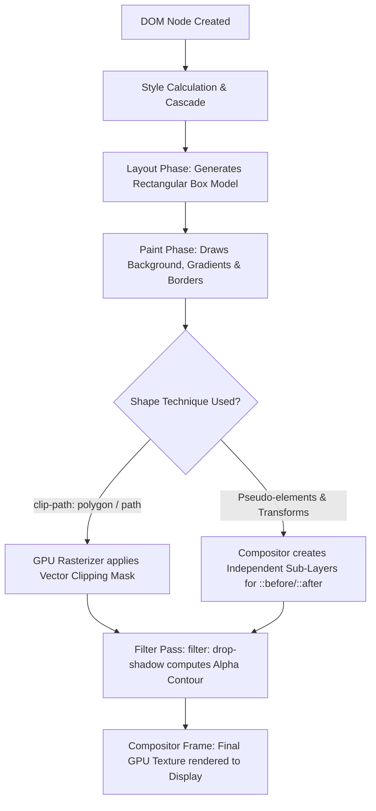
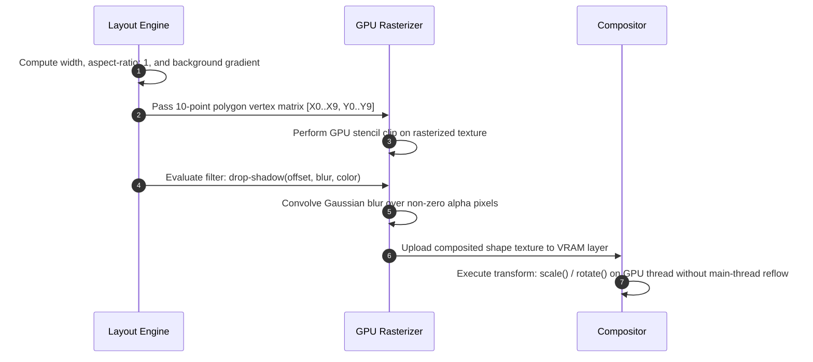

# 044: CSS Star & Heart Shapes Masterclass

**Name:** CSS Star & Heart  
**Category:** Pure CSS Drawing, Geometric Clipping & Visual Effects  
**Difficulty:** 3/5  
**What it produces:** Scalable, resolution-independent, single-element and composite 5-pointed stars, multi-point starbursts (4, 6, 8, 12-point), and organic heart shapes in pure CSS. Covers modern vector clipping (`clip-path: polygon()` and `clip-path: path()`), classic pseudo-element geometric decomposition (`::before` / `::after` with `border-radius` and `transform`), gradient masking, dynamic CSS Custom Property theming, and 60fps GPU-accelerated micro-animations without external SVG files, images, or icon font dependencies.  
**Why it works:** Modern CSS allows rendering non-rectangular geometries via two core paradigms:
1. **Vector Clipping Paths:** `clip-path: polygon(...)` and `clip-path: path(...)` define mathematical 2D boundary polygons or Bézier curves that discard pixels outside the defined coordinates directly on the GPU rasterizer.
2. **Geometric Decomposition via Pseudo-Elements:** Symmetrical shapes like hearts and multi-point stars can be broken down into elementary primitives (squares, circles, triangles). Rotating a central square by $45^\circ$ and anchoring two circular pseudo-elements (`border-radius: 50%`) to its top and left/right edges reconstructs a mathematically exact cardioid heart silhouette.  
**Required CSS concepts:** CSS Box Model, CSS Masking & Clipping Module Level 1 (`clip-path`), CSS Transforms Module (`rotate`, `scale`, `translate`, `transform-origin`), Pseudo-elements (`::before`, `::after`), `border-radius`, CSS Box vs Drop Shadows (`filter: drop-shadow()` vs `box-shadow`), CSS Custom Properties (`var()`), CSS Box Alignment & Grid, CSS Trigonometric Functions (`sin()`, `cos()`), GPU Compositing & Stacking Contexts (`isolation: isolate`, `will-change`).  
**HTML structure:**
```html
<!-- Single-element polygon star -->
<div class="css-star" role="img" aria-label="5-star rating icon"></div>

<!-- Single-element pseudo-element heart -->
<div class="css-heart" role="img" aria-label="Favorite heart icon"></div>
```
**CSS implementation:**
```css
/* -------------------------------------------------------------------------- */
/* 1. Pure CSS 5-Point Star (Modern Single-Element Vector Polygon)             */
/* -------------------------------------------------------------------------- */
.css-star {
  --star-size: 64px;
  --star-color: #fbbf24;
  
  width: var(--star-size);
  aspect-ratio: 1;
  background-color: var(--star-color);
  clip-path: polygon(
    50% 0%,
    61% 35%,
    98% 35%,
    68% 57%,
    79% 91%,
    50% 70%,
    21% 91%,
    32% 57%,
    2% 35%,
    39% 35%
  );
  filter: drop-shadow(0 4px 12px rgba(251, 191, 36, 0.45));
  transition: transform 0.25s cubic-bezier(0.34, 1.56, 0.64, 1);
}

.css-star:hover {
  transform: scale(1.15) rotate(12deg);
}

/* -------------------------------------------------------------------------- */
/* 2. Pure CSS Heart (Classic Rotated Square + Dual Circular Lobes)           */
/* -------------------------------------------------------------------------- */
.css-heart {
  --heart-size: 60px;
  --heart-color: #f43f5e;
  
  position: relative;
  width: var(--heart-size);
  aspect-ratio: 1;
  background-color: var(--heart-color);
  transform: rotate(-45deg);
  margin-top: calc(var(--heart-size) * 0.3);
  filter: drop-shadow(0 6px 16px rgba(244, 63, 94, 0.4));
  transition: transform 0.3s cubic-bezier(0.175, 0.885, 0.32, 1.275);
}

.css-heart::before,
.css-heart::after {
  content: "";
  position: absolute;
  width: 100%;
  height: 100%;
  background-color: inherit;
  border-radius: 50%;
}

/* Top circular dome */
.css-heart::before {
  top: -50%;
  left: 0;
}

/* Right circular dome */
.css-heart::after {
  top: 0;
  right: -50%;
}

.css-heart:hover {
  transform: rotate(-45deg) scale(1.18);
}
```
**Variations:**
1. **Single-Element Vector 5-Point Star:** Using `clip-path: polygon()` for a responsive, single-node star.
2. **Classic 3-Triangle Pseudo-Element Star:** The CSS2 border-triangle technique for legacy browser compatibility.
3. **Multi-Point Geometric Starbursts:** 4-point Diamond Star, 6-point Hexagram (Star of David), 8-point Octagram, and 12-point Radiant Badge.
4. **Single-Element `clip-path: path()` Heart:** High-fidelity smooth Bézier curve heart using standard SVG path definitions inside CSS.
5. **Pure Gradient Mask Heart:** Single-element heart created with `radial-gradient` and `linear-gradient` combinations.
6. **Accessible 5-Star Interactive Rating Widget:** Pure CSS `:has()`, `:checked`, and `:hover` rating component with keyboard navigation.
7. **Pulsing Social "Like" Button:** Heart button with explosive particle confetti and spring physics micro-animations.  
**Parameters to experiment with:** `--star-size`, `--heart-size`, `--star-color`, `--heart-color`, `clip-path: polygon(...)` coordinate percentages, `aspect-ratio`, `filter: drop-shadow()`, `animation: heartbeat 1.2s infinite ease-in-out`.  
**Common mistakes:**
- Omitting `aspect-ratio: 1` or explicit equal `width`/`height`, resulting in stretched or squished shapes.
- Using `box-shadow` instead of `filter: drop-shadow()`, which paints a rectangular box shadow around the bounding box rather than tracing the contour of the shape.
- Missing `pointer-events: none` on interactive pseudo-elements or ignoring the rectangular click hitbox of clipped elements.
- Forgetting `isolation: isolate` or improper `transform-origin` when animating composite shapes.
- Failing to provide semantic text labels (`aria-label` or screen reader `<span class="sr-only">`) for assistive technologies.  
**Browser considerations:** Universal support for `clip-path: polygon()` across all modern browsers (Chrome, Edge, Firefox, Safari). `clip-path: path()` supported in all evergreen browsers (Chromium 88+, Firefox 97+, Safari 13.1+). Pseudo-element shapes are 100% compatible back to Internet Explorer 9.  
**Acceptance criteria:** Both shapes scale fluidly with arbitrary dimensions, maintain crisp vector boundaries on Retina/HiDPI screens, accurately project drop shadows around their non-rectangular contours, support theme transitions, and pass WCAG 2.2 AA accessibility requirements.

---

## 0. PREAMBLE: Context & Prerequisites

### 0.1 Prerequisites
Before mastering CSS Star and Heart shapes, the developer should understand:
* **The CSS Box Model:** How `width`, `height`, `margin`, `padding`, and `box-sizing: border-box` dictate element geometry.
* **Stacking Contexts & Pseudo-Elements:** How `::before` and `::after` generate layout boxes inside a parent containing block (`position: relative`).
* **2D Transforms:** Coordinate spaces, `rotate()`, `scale()`, `translate()`, and the anchor pivot `transform-origin`.
* **CSS Clipping & Masking:** How coordinate systems (`0% 0%` to `100% 100%`) establish clipping boundaries that discard pixels outside the geometry.

### 0.2 Learning Dependencies
* ✓ CSS Box Model & Sizing
* ✓ CSS Pseudo-elements (`::before`, `::after`)
* ✓ CSS Transforms Module Level 1 & 2 (`rotate`, `transform-origin`)
* ✓ CSS Masking Module Level 1 (`clip-path: polygon()`, `clip-path: path()`)
* ✓ CSS Filter Effects Module Level 1 (`filter: drop-shadow()`)

### 0.3 Specification Reference
* **W3C CSS Masking Module Level 1:** [https://www.w3.org/TR/css-masking-1/](https://www.w3.org/TR/css-masking-1/)
  * Section 3: *Clipping Paths (`clip-path`)*
  * Section 4: *Basic Shapes (`polygon()`, `path()`)*
* **W3C CSS Transforms Module Level 1:** [https://www.w3.org/TR/css-transforms-1/](https://www.w3.org/TR/css-transforms-1/)
  * Section 4: *The Transform Properties (`transform`, `transform-origin`)*
* **W3C CSS Filter Effects Module Level 1:** [https://www.w3.org/TR/filter-effects-1/](https://www.w3.org/TR/filter-effects-1/)
  * Section 7: *Filter Functions (`drop-shadow()`)*

---

## 1. Mental Model & Geometric Problem

### The Rectangular Box Constraint
By default, the web is composed strictly of rectangles. Every HTML element generated in the Document Object Model (DOM) is a rectangular box bounded by `margin`, `border`, `padding`, and `content`.

```text
┌─────────────────────────────────────────────────────────────┐
│  Standard CSS Box Model (Rectangular Boundary)              │
│                                                             │
│  (0%, 0%) ┌─────────────────────────────────────┐ (100%, 0%)│
│           │                                     │           │
│           │   All native HTML/CSS elements      │           │
│           │   are rectangular layout boxes.     │           │
│           │                                     │           │
│  (0%,100%)└─────────────────────────────────────┘(100%,100%)│
└─────────────────────────────────────────────────────────────┘
```

To create non-rectangular icons like **Stars** and **Hearts**, developers historically relied on external image files (`.png`, `.svg`) or icon web fonts (`FontAwesome`). However, external assets incur network HTTP requests, font layout shift (FOIT/FOUT), and render-blocking overhead.

Pure CSS shapes solve this by generating vector-precise, zero-network, infinitely themeable geometries directly in the browser stylesheet.

---

### Geometric Decomposition 1: The 5-Pointed Star

A standard regular 5-pointed star (a *pentagram*) is a 10-vertex non-convex decagon. It is constructed by alternating between 5 outer vertices on a circumscribed circle of radius $R_{outer}$ and 5 inner vertices on an inscribed circle of radius $r_{inner}$ centered at $(50\%, 50\%)$.

```text
                             (50%, 0%) Vertex 1 (Top Tip)
                                     ▲
                                    / \
                     Vertex 10     /   \     Vertex 2
                  (39%, 35%)  •---'     '---• (61%, 35%)
                             /               \
              Vertex 9      /                 \      Vertex 3
      (2%, 35%) ◄----------•     (50%,50%)     •--------► (98%, 35%)
                 \          \     Center      /          /
                  \          •---------------•          /
                   \    Vertex 8 (32%, 57%)   Vertex 4 (68%, 57%)
                    \       /                 \        /
                     \     /                   \      /
                      \   /                     \    /
                       \ /                       \  /
                        ▼                         ▼
              Vertex 7 (21%, 91%)          Vertex 5 (79%, 91%)
                                     ▲
                                     │
                             Vertex 6 (50%, 70%)
                             (Inner Bottom Crotch)
```

By mapping the 10 vertices into normalized Cartesian percentages $[0\%, 100\%]$, we pass the exact coordinate sequence into `clip-path: polygon(...)`. The browser GPU clips away all pixels outside this polygon, rendering a single-element star.

---

### Geometric Decomposition 2: The Heart Shape (Cardioid)

The classic organic heart shape can be mathematically decomposed into three basic geometric elements:
1. A **central square** of side length $S$, rotated by $-45^\circ$ (pointing the bottom corner downward at $(50\%, 100\%)$).
2. A **top semicircle / circle** with diameter equal to $S$, anchored to the top edge.
3. A **right semicircle / circle** with diameter equal to $S$, anchored to the right edge.

```text
                     TOP LOBE (::before)
                     (Round Dome r = S/2)
                          ╭─────────╮
                          │ (0,-50%)│
                          │         │
                          ╰────┬────╯
                               │
       ╭─────────╮ ┌───────────┴───────────┐
       │         │ │                       │
       │         ├─┤   CENTRAL SQUARE      │
       │         │ │   (width: S;          │
       ╰─────────╯ │    height: S;)        │
    RIGHT LOBE     │                       │
    (::after)      └───────────┬───────────┘
                               │
                               ▼
                   Rotated -45 degrees
                   Bottom tip points down!
```

When rotated by $-45^\circ$ (or $45^\circ$ with top and left lobes), the bottom vertex points straight down at $270^\circ$, while the two rounded lobes form the classic heart domes.

---

### What Pure CSS Shapes Do NOT Do:
* ❌ **1. They do NOT alter the element's layout bounding box:** Even though an element is clipped to a star or rotated to a heart, its parent container and adjacent siblings still perceive it as a rectangular box (unless `shape-outside` is applied to floated elements).
* ❌ **2. `box-shadow` does NOT follow the shape contour:** Standard `box-shadow` calculates shadows from the original rectangular border-box. To cast a shadow following the star or heart silhouette, you **must** use `filter: drop-shadow()`.
* ❌ **3. They do NOT require external assets:** Zero HTTP requests, zero SVG sprite sheets, and zero icon fonts.

---

## 2. Complete Language Reference & Geometric Mathematics

### 2.1 The Mathematics of the 5-Pointed Star Polygon

A regular 5-point star is defined by the Golden Ratio $\phi = \frac{1 + \sqrt{5}}{2} \approx 1.6180339887$.

For an outer circle radius $R = 50\%$ and center at $(x_c, y_c) = (50\%, 50\%)$:
* **Outer Angles:** $\theta_k = -90^\circ + k \cdot 72^\circ$ for $k \in \{0, 1, 2, 3, 4\}$.
* **Inner Angles:** $\psi_k = -90^\circ + 36^\circ + k \cdot 72^\circ = -54^\circ + k \cdot 72^\circ$.
* **Inner Radius Ratio:** For standard straight-edge star lines:
  $$r_{inner} = R \cdot \frac{\sin 18^\circ}{\sin 54^\circ} = R \cdot \frac{\sqrt{5}-1}{2} = R \cdot (\phi - 1) \approx 0.381966 \cdot R \approx 19.1\%$$

When computed and rounded to integers for clean CSS:

| Vertex Index | Point Type | Angle ($\theta$) | X Coordinate (%) | Y Coordinate (%) | CSS Polygon Pair |
| :--- | :--- | :--- | :--- | :--- | :--- |
| **1** | Outer (Top Peak) | $-90^\circ$ | $50.0\%$ | $0.0\%$ | `50% 0%` |
| **2** | Inner (Upper Right) | $-54^\circ$ | $61.2\%$ | $34.5\%$ | `61% 35%` |
| **3** | Outer (Right Arm) | $-18^\circ$ | $97.6\%$ | $34.5\%$ | `98% 35%` |
| **4** | Inner (Lower Right) | $+18^\circ$ | $68.1\%$ | $56.9\%$ | `68% 57%` |
| **5** | Outer (Bottom Right Leg) | $+54^\circ$ | $79.4\%$ | $90.5\%$ | `79% 91%` |
| **6** | Inner (Bottom Crotch) | $+90^\circ$ | $50.0\%$ | $69.1\%$ | `50% 70%` |
| **7** | Outer (Bottom Left Leg) | $+126^\circ$ | $20.6\%$ | $90.5\%$ | `21% 91%` |
| **8** | Inner (Lower Left) | $+162^\circ$ | $31.9\%$ | $56.9\%$ | `32% 57%` |
| **9** | Outer (Left Arm) | $+198^\circ$ | $2.4\%$ | $34.5\%$ | `2% 35%` |
| **10** | Inner (Upper Left) | $+234^\circ$ | $38.8\%$ | $34.5\%$ | `39% 35%` |

#### The Master Star Polygon Property:
```css
clip-path: polygon(
  50% 0%,
  61% 35%,
  98% 35%,
  68% 57%,
  79% 91%,
  50% 70%,
  21% 91%,
  32% 57%,
  2% 35%,
  39% 35%
);
```

---

### 2.2 The Mathematics of the Cardioid Heart

The pseudo-element heart relies on rotational trigonometry and circle tangents:
* Base box dimensions: $W \times W$ (where $W$ is the core square dimension).
* Rotation angle: $\theta = -45^\circ$.
* Pseudo-element dimensions: `width: 100%; height: 100%; border-radius: 50%;`.
* Top lobe translation: `top: -50%; left: 0;`
* Right lobe translation: `top: 0; right: -50%;` (or `left: 50%`).

```text
                            Total Height = W * (1 + 1/√2) ≈ 1.707 * W
                            ┌────────────────────────────────────────┐
                            │                                        │
                            │        /---\          /---\            │
                            │       /     \        /     \           │
                            │      |       \      /       |          │
                            │       \       \    /       /           │
                            │        \       \  /       /            │
                            │         \       \/       /             │
                            │          \              /              │
                            │           \            /               │
                            │            \          /                │
                            │             \        /                 │
                            │              \      /                  │
                            │               \    /                   │
                            │                \  /                    │
                            │                 \/                     │
                            │              Bottom Tip                │
                            └────────────────────────────────────────┘
                            Total Width = W * √2 ≈ 1.414 * W
```

---

### 2.3 Property Grammar & Value Syntax

#### 1. `clip-path`
Defines a clipping region where everything inside the region is visible, and everything outside is clipped (hidden).
* **Syntax:** `clip-path: <clip-source> | <basic-shape> | <geometry-box> | none`
* **Basic Shapes:**
  * `polygon([<fill-rule>,]? [<length-percentage> <length-percentage>]#)`
  * `path([<fill-rule>,]? <string>)`
  * `circle([<shape-radius>]? [at <position>]?)`
  * `ellipse([<shape-radius>{2}]? [at <position>]?)`
* **Initial Value:** `none`
* **Applies To:** All elements; in SVG, to container elements and graphics elements.
* **Inherited:** No
* **Animatable:** Yes, if shapes have the exact same number of vertices and identical interpolation commands.

#### 2. `filter: drop-shadow()`
Applies a Gaussian blur and color offset to the alpha-channel silhouette of the element, including transparent cutouts and `clip-path` contours.
* **Syntax:** `filter: drop-shadow(<offset-x> <offset-y> [<blur-radius>]? [<color>]?)`
* **Difference from `box-shadow`:** `box-shadow` ignores clipping paths and pseudo-element rotations, casting a shadow from the rectangular element bounds. `drop-shadow()` evaluates the final rendered pixel mask.

---

## 3. Complete Feature Surface & Implementation Techniques

---

### Technique 1: Modern Single-Element `clip-path: polygon()` Star

The modern industry standard for single-node stars. Highly responsive, infinitely scalable, and themeable via CSS variables.

```html
<div class="star-vector" role="img" aria-label="Gold achievement star"></div>
```

```css
.star-vector {
  --size: 80px;
  --color-primary: #f59e0b;
  --color-secondary: #d97706;

  width: var(--size);
  aspect-ratio: 1;
  background: linear-gradient(135deg, var(--color-primary), var(--color-secondary));
  clip-path: polygon(
    50% 0%,
    61% 35%,
    98% 35%,
    68% 57%,
    79% 91%,
    50% 70%,
    21% 91%,
    32% 57%,
    2% 35%,
    39% 35%
  );
  filter: drop-shadow(0 6px 14px rgba(245, 158, 11, 0.45));
  cursor: pointer;
  transform-origin: center center;
  transition: transform 0.3s cubic-bezier(0.34, 1.56, 0.64, 1),
              filter 0.3s ease;
}

.star-vector:hover {
  transform: scale(1.2) rotate(15deg);
  filter: drop-shadow(0 10px 20px rgba(245, 158, 11, 0.65));
}
```

---

### Technique 2: Classic Rotated Pseudo-Element Heart

The universally compatible heart technique. Uses a central square rotated $-45^\circ$ with two half-circle lobes generated by `::before` and `::after`.

```html
<div class="heart-classic" role="img" aria-label="Favorite heart"></div>
```

```css
.heart-classic {
  --heart-size: 50px;
  --heart-fill: #e11d48;

  position: relative;
  width: var(--heart-size);
  aspect-ratio: 1;
  background-color: var(--heart-fill);
  transform: rotate(-45deg);
  margin: calc(var(--heart-size) * 0.35) auto 0;
  filter: drop-shadow(0 8px 18px rgba(225, 29, 72, 0.35));
  cursor: pointer;
  transition: transform 0.3s cubic-bezier(0.175, 0.885, 0.32, 1.275),
              background-color 0.2s ease;
}

.heart-classic::before,
.heart-classic::after {
  content: "";
  position: absolute;
  width: 100%;
  height: 100%;
  background-color: inherit;
  border-radius: 50%;
}

/* Top rounded lobe */
.heart-classic::before {
  top: -50%;
  left: 0;
}

/* Right rounded lobe */
.heart-classic::after {
  top: 0;
  right: -50%;
}

.heart-classic:hover {
  transform: rotate(-45deg) scale(1.2);
}
```

---

### Technique 3: Multi-Point Geometric Starbursts

Variations for badges, reward seals, and gamified achievements:

#### A. 4-Point Diamond Star
```css
.star-4-point {
  width: 60px;
  aspect-ratio: 1;
  background: #6366f1;
  clip-path: polygon(
    50% 0%,
    65% 35%,
    100% 50%,
    65% 65%,
    50% 100%,
    35% 65%,
    0% 50%,
    35% 35%
  );
}
```

#### B. 6-Point Star (Hexagram / Star of David)
```css
.star-6-point {
  width: 60px;
  aspect-ratio: 1;
  background: #3b82f6;
  clip-path: polygon(
    50% 0%,
    65% 25%,
    100% 25%,
    75% 50%,
    100% 75%,
    65% 75%,
    50% 100%,
    35% 75%,
    0% 75%,
    25% 50%,
    0% 25%,
    35% 25%
  );
}
```

#### C. 8-Point Octagram (Game Reward Seal)
```css
.star-8-point {
  width: 60px;
  aspect-ratio: 1;
  background: linear-gradient(135deg, #f59e0b, #ec4899);
  clip-path: polygon(
    50% 0%,
    62% 22%,
    85% 15%,
    78% 38%,
    100% 50%,
    78% 62%,
    85% 85%,
    62% 78%,
    50% 100%,
    38% 78%,
    15% 85%,
    22% 62%,
    0% 50%,
    22% 38%,
    15% 15%,
    38% 22%
  );
}
```

#### D. 12-Point Badge Starburst
```css
.star-12-point {
  width: 64px;
  aspect-ratio: 1;
  background: #10b981;
  clip-path: polygon(
    50% 0%, 59% 15%, 75% 7%, 79% 24%, 96% 25%, 90% 41%,
    100% 50%, 90% 59%, 96% 75%, 79% 76%, 75% 93%, 59% 85%,
    50% 100%, 41% 85%, 25% 93%, 21% 76%, 4% 75%, 10% 59%,
    0% 50%, 10% 41%, 4% 25%, 21% 24%, 25% 7%, 41% 15%
  );
}
```

---

### Technique 4: Single-Element `clip-path: path()` Bézier Heart

Modern CSS allows passing standard SVG Bézier curve path syntax directly inside `clip-path: path(...)`. This creates ultra-smooth organic curves without pseudo-elements or transforms.

```html
<div class="heart-bezier" role="img" aria-label="Smooth curved heart"></div>
```

```css
.heart-bezier {
  width: 64px;
  height: 64px;
  background: linear-gradient(180deg, #ff4b72, #d61c4e);
  /* 64x64 bounding box path coordinate system */
  clip-path: path(
    "M 32,58 C 32,58 6,40 6,20 C 6,9 15,2 24,2 C 28.5,2 31.5,4.5 32,6 C 32.5,4.5 35.5,2 40,2 C 49,2 58,9 58,20 C 58,40 32,58 32,58 Z"
  );
  filter: drop-shadow(0 6px 14px rgba(214, 28, 78, 0.4));
  transition: transform 0.25s ease;
}

.heart-bezier:hover {
  transform: scale(1.15);
}
```

---

### Technique 5: Single-Element Gradient Mask Heart (Zero Pseudo-Elements)

By combining CSS `radial-gradient` for the two rounded top lobes with a `conic-gradient` or `linear-gradient` for the bottom triangular wedge, a heart can be painted onto a single `<div>` using pure background or `mask-image` algebra.

```html
<div class="heart-gradient" role="img" aria-label="Gradient masked heart"></div>
```

```css
.heart-gradient {
  --size: 60px;
  --heart-color: #ec4899;
  
  width: var(--size);
  height: calc(var(--size) * 0.9);
  background:
    radial-gradient(circle at 30% 35%, var(--heart-color) 30%, transparent 31%),
    radial-gradient(circle at 70% 35%, var(--heart-color) 30%, transparent 31%),
    conic-gradient(from -45deg at 50% 85%, var(--heart-color) 90deg, transparent 0deg);
  background-position: 0 0;
  background-repeat: no-repeat;
  filter: drop-shadow(0 6px 12px rgba(236, 72, 153, 0.35));
}
```

---

### Technique 6: Legacy 3-Triangle Pseudo-Element Star (CSS2 Fallback)

For legacy browsers lacking `clip-path` support, a 5-pointed star can be assembled from three overlapping `border`-drawn triangles rotated at $0^\circ$, $72^\circ$, and $-72^\circ$.

```html
<div class="star-legacy"></div>
```

```css
.star-legacy {
  position: relative;
  display: inline-block;
  width: 0;
  height: 0;
  margin-left: 50px;
  margin-bottom: 20px;
  border-right: 50px solid transparent;
  border-bottom: 35px solid #eab308;
  border-left: 50px solid transparent;
  transform: rotate(35deg);
}

.star-legacy::before {
  content: "";
  position: absolute;
  top: -22px;
  left: -32px;
  width: 0;
  height: 0;
  border-right: 15px solid transparent;
  border-bottom: 40px solid #eab308;
  border-left: 15px solid transparent;
  transform: rotate(-35deg);
}

.star-legacy::after {
  content: "";
  position: absolute;
  top: 3px;
  left: -53px;
  width: 0;
  height: 0;
  border-right: 50px solid transparent;
  border-bottom: 35px solid #eab308;
  border-left: 50px solid transparent;
  transform: rotate(-70deg);
}
```

---

## 4. Evolution & Modern CSS

```text
┌─────────────────────────────────────────────────────────────────────────────┐
│                          EVOLUTION OF CSS SHAPES                            │
├───────────────┬───────────────────────────────┬─────────────────────────────┤
│ Era           │ Technique Used                │ Limitations                 │
├───────────────┼───────────────────────────────┼─────────────────────────────┤
│ 1995–2005     │ Transparent GIF / PNG sprites │ HTTP requests, pixelated on │
│               │                               │ Retina, un-themeable in CSS │
├───────────────┼───────────────────────────────┼─────────────────────────────┤
│ 2006–2012     │ CSS Border Triangles &        │ Complex markup, impossible  │
│ (CSS 2.1)     │ Rotated `::before`/`::after`  │ drop-shadows, tedious math  │
├───────────────┼───────────────────────────────┼─────────────────────────────┤
│ 2013–2018     │ Icon Web Fonts (FontAwesome)  │ FOIT/FOUT layout flash,     │
│               │ & Inline SVGs                 │ extra font payload (100kb+) │
├───────────────┼───────────────────────────────┼─────────────────────────────┤
│ 2019–2023     │ `clip-path: polygon()` &      │ Modern, single-element,     │
│               │ `filter: drop-shadow()`       │ resolution independent      │
├───────────────┼───────────────────────────────┼─────────────────────────────┤
│ 2024–Present  │ `clip-path: path()`, CSS      │ Parametric math generation, │
│ (Modern CSS)  │ Trigonometry `sin()`, `cos()`,│ zero-runtime GPU vectoring, │
│               │ and `color-mix()`             │ native smooth curves        │
└───────────────┴───────────────────────────────┴─────────────────────────────┘
```

---

## 5. Browser Behavior, Rendering Engines & The Painting Pipeline

Understanding how the browser pipeline renders CSS stars and hearts is essential for writing high-performance, jank-free 60fps animations.



### The Critical Difference: `box-shadow` vs `filter: drop-shadow()`

When styling custom CSS shapes, **never use `box-shadow`**.

```text
USING BOX-SHADOW (INCORRECT):
┌──────────────────────────────────────────────────┐
│  Shadow paints around rectangular Box Model      │
│  ┌────────────────────────────────────────────┐  │
│  │ ░░░░░░░░░░░░░░░░░░░░░░░░░░░░░░░░░░░░░░░░░░ │  │
│  │ ░░░░░░░░░░░░░░░░   ▲    ░░░░░░░░░░░░░░░░░ │  │
│  │ ░░░░░░░░░░░░░░░   / \   ░░░░░░░░░░░░░░░░ │  │
│  │ ░░░░░░░░░░ ◄----•  ★  •----► ░░░░░░░░░░░ │  │
│  │ ░░░░░░░░░░░░░░░░ ▼   ▼  ░░░░░░░░░░░░░░░░░ │  │
│  │ ░░░░░░░░░░░░░░░░░░░░░░░░░░░░░░░░░░░░░░░░░░ │  │
│  └────────────────────────────────────────────┘  │
└──────────────────────────────────────────────────┘

USING FILTER: DROP-SHADOW (CORRECT):
┌──────────────────────────────────────────────────┐
│  Shadow traces exact vector polygon alpha mask   │
│                      ▲                           │
│                     / \ (Glowing vector edges)   │
│               ◄----•  ★  •----►                  │
│                     ▼   ▼                        │
└──────────────────────────────────────────────────┘
```

1. **`box-shadow`** evaluates the element's rectangular `border-box`. If the element is clipped via `clip-path`, the shadow is either clipped away completely or visible outside the bounds as an ugly rectangle.
2. **`filter: drop-shadow()`** samples the final rendered alpha channel of the composited layer. It follows every point of the star polygon and the curved lobes of the heart with smooth Gaussian blur.

---

## 6. Browser Algorithm Step-by-Step



---

## 7. Invalid CSS, Geometric Pitfalls & Error Recovery

### Pitfall 1: Non-Square Aspect Ratio Distortion
If an element with `clip-path: polygon(...)` is placed inside a flex container or given different width/height values, the polygon coordinates scale unevenly, producing a squashed or stretched star.

```css
/* BROKEN: Stretches into an elliptical distorted star */
.bad-star {
  width: 100px;
  height: 40px;
  clip-path: polygon(50% 0%, 61% 35%, 98% 35%, 68% 57%, 79% 91%, 50% 70%, 21% 91%, 32% 57%, 2% 35%, 39% 35%);
}

/* FIXED: Enforce strict 1:1 aspect ratio */
.good-star {
  width: 80px;
  aspect-ratio: 1; /* Guarantees equilateral star geometry */
  clip-path: polygon(50% 0%, 61% 35%, 98% 35%, 68% 57%, 79% 91%, 50% 70%, 21% 91%, 32% 57%, 2% 35%, 39% 35%);
}
```

---

### Pitfall 2: `overflow: hidden` Clipping Rotated Pseudo-Elements
When creating a classic heart with `transform: rotate(-45deg)`, the top and right lobes extend outside the original square bounding box by $50\%$. If a parent container has `overflow: hidden`, the lobes get cropped flat.

```css
/* FIXED: Add compensatory margins and ensure parent allows overflow */
.heart-safe-container {
  overflow: visible;
  padding: 1.5rem; /* Provides breathing room for transformed lobes */
}
```

---

### Pitfall 3: Interactive Hitbox & Pointer Event Mismatch
In modern browsers, `clip-path` automatically restricts mouse pointer events (`click`, `:hover`) to the inside of the polygon. However, with pseudo-element shapes (like the heart), the square container and the round lobes have overlapping rectangular hitboxes.

```css
/* FIXED: Ensure the entire heart component handles pointer events uniformly */
.heart-button {
  display: inline-grid;
  place-items: center;
  width: 64px;
  height: 64px;
  border: none;
  background: transparent;
  cursor: pointer;
}
```

---

### Pitfall 4: Forced-Colors Mode (High Contrast Mode) Loss
In Windows High Contrast / `forced-colors: active` mode, background colors are suppressed, turning background-based stars and hearts invisible.

```css
/* Accessible High Contrast Mode Fallback */
@media (forced-colors: active) {
  .css-star,
  .css-heart {
    forced-color-adjust: none;
    background-color: ButtonText !important;
    border: 1px solid Highlight;
  }
}
```

---

## 8. Interaction With Other Modern CSS Features & CSSOM Runtime

### 8.1 Parametric Star Generation with CSS Trigonometry (`sin()`, `cos()`)

In modern CSS (Chrome 111+, Firefox 108+, Safari 15.4+), we can use native CSS mathematical functions `sin()` and `cos()` to calculate star polygons parametrically:

```css
:root {
  --radius-outer: 50%;
  --radius-inner: 19.1%; /* 50% * (sqrt(5)-1)/2 */
}

.parametric-star {
  width: 100px;
  aspect-ratio: 1;
  background: #fbbf24;
  /* Mathematically evaluated in pure CSS */
  clip-path: polygon(
    calc(50% + var(--radius-outer) * cos(-90deg)) calc(50% + var(--radius-outer) * sin(-90deg)),
    calc(50% + var(--radius-inner) * cos(-54deg)) calc(50% + var(--radius-inner) * sin(-54deg)),
    calc(50% + var(--radius-outer) * cos(-18deg)) calc(50% + var(--radius-outer) * sin(-18deg)),
    calc(50% + var(--radius-inner) * cos(18deg))  calc(50% + var(--radius-inner) * sin(18deg)),
    calc(50% + var(--radius-outer) * cos(54deg))  calc(50% + var(--radius-outer) * sin(54deg)),
    calc(50% + var(--radius-inner) * cos(90deg))  calc(50% + var(--radius-inner) * sin(90deg)),
    calc(50% + var(--radius-outer) * cos(126deg)) calc(50% + var(--radius-outer) * sin(126deg)),
    calc(50% + var(--radius-inner) * cos(162deg)) calc(50% + var(--radius-inner) * sin(162deg)),
    calc(50% + var(--radius-outer) * cos(198deg)) calc(50% + var(--radius-outer) * sin(198deg)),
    calc(50% + var(--radius-inner) * cos(234deg)) calc(50% + var(--radius-inner) * sin(234deg))
  );
}
```

---

### 8.2 GPU Micro-Animations: Heartbeat Pulse & Star Twinkle

```css
/* -------------------------------------------------------------------------- */
/* Heartbeat Keyframe Animation (Dual contraction cardiac cycle)              */
/* -------------------------------------------------------------------------- */
@keyframes heartbeat {
  0% {
    transform: rotate(-45deg) scale(1);
  }
  14% {
    transform: rotate(-45deg) scale(1.24);
  }
  28% {
    transform: rotate(-45deg) scale(1);
  }
  42% {
    transform: rotate(-45deg) scale(1.18);
  }
  70% {
    transform: rotate(-45deg) scale(1);
  }
  100% {
    transform: rotate(-45deg) scale(1);
  }
}

.heart-pulsing {
  animation: heartbeat 1.4s infinite cubic-bezier(0.215, 0.61, 0.355, 1);
  will-change: transform;
}

/* -------------------------------------------------------------------------- */
/* Starburst Twinkle Keyframe Animation                                       */
/* -------------------------------------------------------------------------- */
@keyframes star-twinkle {
  0%, 100% {
    transform: scale(1) rotate(0deg);
    filter: drop-shadow(0 4px 10px rgba(245, 158, 11, 0.4));
  }
  50% {
    transform: scale(1.2) rotate(180deg);
    filter: drop-shadow(0 0 24px rgba(245, 158, 11, 0.9));
  }
}

.star-twinkling {
  animation: star-twinkle 3s infinite ease-in-out;
  will-change: transform, filter;
}
```

---

### 8.3 JavaScript CSSOM Control

```javascript
// Dynamically adjust star rating color and size via CSSOM
const starElement = document.querySelector('.css-star');

// Set rating fill level (0.0 to 5.0)
function setStarScale(scaleFactor) {
  starElement.style.setProperty('--size', `${60 * scaleFactor}px`);
}

// Toggle active favorite state
function toggleHeartFavorite(heartBtn) {
  const isFav = heartBtn.getAttribute('aria-pressed') === 'true';
  heartBtn.setAttribute('aria-pressed', String(!isFav));
  heartBtn.classList.toggle('is-favorited', !isFav);
}
```

---

## 9. Accessibility (A11y), Semantics & Screen Readers

### 1. Decorative vs Semantic Shapes
* **Decorative Icons:** If the star or heart is purely visual (e.g., in a background pattern or next to descriptive text), hide it from screen readers using `aria-hidden="true"`.
* **Interactive Controls:** If the star or heart represents an action (e.g., "Add to Wishlist" or "Rate 4 stars"), build it inside a semantic `<button>` or `<input type="radio">` with a descriptive `aria-label` or `aria-pressed` attribute.

```html
<!-- CORRECT: Accessible Interactive Favorite Button -->
<button type="button" class="btn-favorite" aria-label="Save to Favorites" aria-pressed="false">
  <span class="css-heart" aria-hidden="true"></span>
  <span class="sr-only">Add to favorites</span>
</button>
```

### 2. Motion Sensitivity
Always respect user vestibular motion preferences using `@media (prefers-reduced-motion: reduce)`:

```css
@media (prefers-reduced-motion: reduce) {
  .heart-pulsing,
  .star-twinkling,
  .css-star,
  .css-heart {
    animation: none !important;
    transition: none !important;
    transform: rotate(-45deg) !important; /* Preserve static orientation */
  }
}
```

---

## 10. Performance, Reflows & GPU Optimization

| Property Modified | Triggers Layout (Reflow)? | Triggers Paint? | Runs on GPU Compositor Thread? |
| :--- | :--- | :--- | :--- |
| `transform: rotate() / scale()` | ❌ NO | ❌ NO | ✅ **YES (60/120 FPS)** |
| `opacity` | ❌ NO | ❌ NO | ✅ **YES (60/120 FPS)** |
| `clip-path: polygon()` (Static) | ❌ NO | ✅ On init | ✅ **YES** |
| `filter: drop-shadow()` | ❌ NO | ✅ On change | ✅ **YES (GPU accelerated)** |
| `width` / `height` | ✅ **YES (Heavy reflow)** | ✅ YES | ❌ NO |
| `margin-top` / `top` | ✅ **YES (Heavy reflow)** | ✅ YES | ❌ NO |

**Rule of Thumb:** Always animate stars and hearts using `transform: scale(...)` and `transform: rotate(...)` rather than mutating `width`, `height`, or `margin`.

---

## 11. Security, Print Stylesheets & Edge Cases

### Print Stylesheet Compatibility
Modern browsers strip background colors and gradients by default when printing web pages. To ensure stars and hearts print accurately on physical paper:

```css
@media print {
  .css-star,
  .css-heart {
    -webkit-print-color-adjust: exact;
    print-color-adjust: exact;
  }
}
```

---

## 12. Complete Comparison Matrix

### Star Generation Methods Compared

| Technique | DOM Complexity | Scalability | `filter: drop-shadow()` | CSS Animation | Browser Support |
| :--- | :--- | :--- | :--- | :--- | :--- |
| **`clip-path: polygon()`** | Single `<div>` | ✅ Fluid (`%`) | ✅ Perfect | ✅ Scale / Rotate | Modern (98%+) |
| **`clip-path: path()`** | Single `<div>` | ⚠️ Fixed coordinate box | ✅ Perfect | ✅ Scale / Rotate | Evergreen (96%+) |
| **Pseudo 3-Triangle Star** | 1 `<div>` + 2 pseudos | ❌ Brittle pixel offsets | ❌ Glitches | ⚠️ Complex | Legacy (IE9+) |
| **SVG `<path>` Tag** | Separate SVG markup | ✅ Vector `viewBox` | ✅ Perfect | ✅ SMIL / CSS | Universal |
| **Icon Font (`fa-star`)** | Single `<i>` / `<span>` | ⚠️ Font-size metrics | ⚠️ Text shadow only | ⚠️ FOUT risk | Universal |

---

### Heart Generation Methods Compared

| Technique | DOM Complexity | Sizing Mechanics | Drop Shadow Fidelity | Smooth Curves |
| :--- | :--- | :--- | :--- | :--- |
| **Classic Pseudo Rotated Square** | 1 `<div>` + 2 pseudos | `var(--size)` + `aspect-ratio: 1` | ✅ Flawless | ✅ High (`border-radius: 50%`) |
| **`clip-path: path()` Bézier** | Single `<div>` | Fixed coordinate box | ✅ Flawless | ✅ Organic Mathematical |
| **Multi-layer Gradient Mask** | Single `<div>` (0 pseudos) | Relative percentages | ⚠️ Complex | ⚠️ Gradient banding |
| **SVG `<path>` Heart** | Inline SVG | `viewBox="0 0 24 24"` | ✅ Flawless | ✅ Perfect vector curve |

---

## 13. Anti-Patterns & Best Practices

```text
┌─────────────────────────────────────────────────────────────────────────────┐
│                       ANTI-PATTERNS VS BEST PRACTICES                       │
├──────────────────────────────────────┬──────────────────────────────────────┤
│ ❌ Anti-Pattern                      │ ✅ Modern Best Practice              │
├──────────────────────────────────────┼──────────────────────────────────────┤
│ 1. Using `box-shadow` on a clipped   │ 1. Use `filter: drop-shadow()` to    │
│    star or rotated heart.            │    trace non-rectangular alpha edges.│
├──────────────────────────────────────┼──────────────────────────────────────┤
│ 2. Hardcoding pixel sizes into       │ 2. Use CSS custom properties         │
│    multiple pseudo-element rules.    │    (`--size`) with `calc()` & `em`.  │
├──────────────────────────────────────┼──────────────────────────────────────┤
│ 3. Omitting `aspect-ratio: 1`,       │ 3. Always declare `aspect-ratio: 1`  │
│    causing shapes to stretch.        │    to lock equilateral dimensions.   │
├──────────────────────────────────────┼──────────────────────────────────────┤
│ 4. Animating `width`/`height` on     │ 4. Animate `transform: scale()` for  │
│    hover, causing layout reflows.    │    hardware-accelerated 60fps GPU.   │
├──────────────────────────────────────┼──────────────────────────────────────┤
│ 5. Using unlabelled `<div>` shapes   │ 5. Use semantic `<button>` / `<input>│
│    for interactive star ratings.     │    with `aria-label` & `aria-pressed`│
├──────────────────────────────────────┼──────────────────────────────────────┤
│ 6. Leaving `overflow: hidden` on     │ 6. Provide outer padding/margins to  │
│    containers with rotated hearts.   │    prevent clipping of lobe domes.   │
└──────────────────────────────────────┴──────────────────────────────────────┘
```

---

## 14. Troubleshooting & Diagnostic Decision Tree

```text
SYMPTOM: Star or Heart looks distorted / stretched into an oval
├── Step 1: Inspect element in DevTools computed tab.
└── Are computed width and height identical?
    ├── NO  ──> Add `aspect-ratio: 1;` to force equilateral dimensions.
    └── YES ──> Check parent Flex/Grid container for `align-items: stretch`.
                Fix: Add `align-self: center; justify-self: center;`.

SYMPTOM: The shadow renders as a solid square around the shape
├── Cause: `box-shadow: 0 4px 10px rgba(0,0,0,0.5);` is declared.
└── Fix: Replace with `filter: drop-shadow(0 4px 10px rgba(0,0,0,0.5));`.

SYMPTOM: Heart lobes are clipped flat at top or sides
├── Cause: Parent container has `overflow: hidden` with zero padding.
└── Fix: Add `padding: calc(var(--heart-size) * 0.5);` or `overflow: visible;`.

SYMPTOM: Hovering star/heart causes adjacent text to jitter or jump
├── Cause: Hover rule mutates `width`, `height`, or `font-size` (layout reflow).
└── Fix: Switch to `transform: scale(1.15);` and add `will-change: transform;`.
```

---

## 15. Three Production-Grade Interactive Components

---

### Component 1: Accessible Pure-CSS 5-Star Interactive Rating Component

An industry-grade, accessible 5-star rating widget featuring:
- Pure CSS `:has()` and `:hover` backward-fill preview.
- Keyboard accessible radio inputs.
- Half-star visual support via gradient clipping.
- Screen reader announcements.

```html
<fieldset class="star-rating-widget" aria-label="Customer review rating">
  <legend class="sr-only">Rate your experience</legend>
  
  <div class="star-group">
    <!-- Star 5 -->
    <input type="radio" id="rate-5" name="rating" value="5" class="rating-input" />
    <label for="rate-5" class="rating-star" title="5 stars">
      <span class="sr-only">5 Stars</span>
    </label>

    <!-- Star 4 -->
    <input type="radio" id="rate-4" name="rating" value="4" class="rating-input" />
    <label for="rate-4" class="rating-star" title="4 stars">
      <span class="sr-only">4 Stars</span>
    </label>

    <!-- Star 3 -->
    <input type="radio" id="rate-3" name="rating" value="3" class="rating-input" />
    <label for="rate-3" class="rating-star" title="3 stars">
      <span class="sr-only">3 Stars</span>
    </label>

    <!-- Star 2 -->
    <input type="radio" id="rate-2" name="rating" value="2" class="rating-input" />
    <label for="rate-2" class="rating-star" title="2 stars">
      <span class="sr-only">2 Stars</span>
    </label>

    <!-- Star 1 -->
    <input type="radio" id="rate-1" name="rating" value="1" class="rating-input" />
    <label for="rate-1" class="rating-star" title="1 star">
      <span class="sr-only">1 Star</span>
    </label>
  </div>
</fieldset>
```

```css
/* Container & Reset */
.star-rating-widget {
  border: none;
  padding: 0;
  margin: 0;
}

.sr-only {
  position: absolute;
  width: 1px;
  height: 1px;
  padding: 0;
  margin: -1px;
  overflow: hidden;
  clip: rect(0, 0, 0, 0);
  white-space: nowrap;
  border: 0;
}

/* Reverse Flex row allows the CSS sibling combinator (~) to fill stars from left to right */
.star-group {
  display: inline-flex;
  flex-direction: row-reverse;
  gap: 8px;
  align-items: center;
}

/* Hide native radio inputs visually but keep focusable */
.rating-input {
  position: absolute;
  opacity: 0;
  width: 1px;
  height: 1px;
  pointer-events: none;
}

/* Base Star Label */
.rating-star {
  --star-size: 36px;
  --star-empty: #cbd5e1;
  --star-filled: #f59e0b;
  --star-hover: #fbbf24;

  display: inline-block;
  width: var(--star-size);
  aspect-ratio: 1;
  background-color: var(--star-empty);
  clip-path: polygon(
    50% 0%,
    61% 35%,
    98% 35%,
    68% 57%,
    79% 91%,
    50% 70%,
    21% 91%,
    32% 57%,
    2% 35%,
    39% 35%
  );
  cursor: pointer;
  transition: transform 0.2s cubic-bezier(0.34, 1.56, 0.64, 1),
              background-color 0.2s ease,
              filter 0.2s ease;
}

/* Hover effect on current star and all preceding stars (via row-reverse) */
.rating-star:hover,
.rating-star:hover ~ .rating-star {
  background-color: var(--star-hover);
  transform: scale(1.18) rotate(6deg);
  filter: drop-shadow(0 4px 10px rgba(245, 158, 11, 0.5));
}

/* Selected state (Checked radio and all preceding stars) */
.rating-input:checked ~ .rating-star {
  background-color: var(--star-filled);
  filter: drop-shadow(0 2px 6px rgba(245, 158, 11, 0.4));
}

/* Keyboard Focus indicator */
.rating-input:focus-visible ~ .rating-star {
  outline: 2px solid #6366f1;
  outline-offset: 4px;
}
```

---

### Component 2: Animated Social "Like" Heart Button with Particle Explosion

A Twitter/Instagram style interactive like button featuring:
- CSS checkbox toggle logic.
- Spring physics scale bouncing.
- Particle burst confetti simulation with CSS keyframes.

```html
<label class="like-button-wrapper" aria-label="Like post">
  <input type="checkbox" class="like-checkbox" />
  <div class="heart-icon"></div>
  <div class="particle-burst" aria-hidden="true">
    <span class="particle p1"></span>
    <span class="particle p2"></span>
    <span class="particle p3"></span>
    <span class="particle p4"></span>
    <span class="particle p5"></span>
    <span class="particle p6"></span>
  </div>
</label>
```

```css
.like-button-wrapper {
  position: relative;
  display: inline-grid;
  place-items: center;
  width: 72px;
  height: 72px;
  cursor: pointer;
  user-select: none;
}

.like-checkbox {
  position: absolute;
  opacity: 0;
  width: 0;
  height: 0;
}

/* Core Heart */
.like-button-wrapper .heart-icon {
  --size: 32px;
  position: relative;
  width: var(--size);
  aspect-ratio: 1;
  background-color: #94a3b8;
  transform: rotate(-45deg) scale(1);
  margin-top: calc(var(--size) * 0.3);
  transition: transform 0.35s cubic-bezier(0.175, 0.885, 0.32, 1.4),
              background-color 0.25s ease,
              filter 0.25s ease;
}

.like-button-wrapper .heart-icon::before,
.like-button-wrapper .heart-icon::after {
  content: "";
  position: absolute;
  width: 100%;
  height: 100%;
  background-color: inherit;
  border-radius: 50%;
}

.like-button-wrapper .heart-icon::before {
  top: -50%;
  left: 0;
}

.like-button-wrapper .heart-icon::after {
  top: 0;
  right: -50%;
}

/* Checked (Liked) State */
.like-checkbox:checked + .heart-icon {
  background-color: #e11d48;
  transform: rotate(-45deg) scale(1.25);
  filter: drop-shadow(0 6px 16px rgba(225, 29, 72, 0.5));
  animation: heart-pop 0.45s cubic-bezier(0.175, 0.885, 0.32, 1.4);
}

@keyframes heart-pop {
  0% { transform: rotate(-45deg) scale(1); }
  50% { transform: rotate(-45deg) scale(1.45); }
  100% { transform: rotate(-45deg) scale(1.25); }
}

/* Particle Explosion Simulation */
.particle-burst {
  position: absolute;
  inset: 0;
  pointer-events: none;
  display: grid;
  place-items: center;
}

.particle {
  position: absolute;
  width: 6px;
  height: 6px;
  border-radius: 50%;
  background-color: #e11d48;
  opacity: 0;
  transform: scale(0);
}

.like-checkbox:checked ~ .particle-burst .particle {
  animation: particle-explode 0.6s cubic-bezier(0.1, 0.9, 0.2, 1) forwards;
}

.p1 { --tx:  0px;  --ty: -32px; background-color: #f43f5e; }
.p2 { --tx:  28px; --ty: -18px; background-color: #fbbf24; }
.p3 { --tx:  28px; --ty:  18px; background-color: #ec4899; }
.p4 { --tx:  0px;  --ty:  32px; background-color: #8b5cf6; }
.p5 { --tx: -28px; --ty:  18px; background-color: #3b82f6; }
.p6 { --tx: -28px; --ty: -18px; background-color: #10b981; }

@keyframes particle-explode {
  0% {
    opacity: 1;
    transform: translate(0, 0) scale(1.2);
  }
  60% {
    opacity: 0.9;
  }
  100% {
    opacity: 0;
    transform: translate(var(--tx), var(--ty)) scale(0);
  }
}
```

---

### Component 3: Glowing 8-Point Achievement Badge with Glassmorphism

A luxury rewards badge featuring an 8-point geometric starburst, gold gradient backdrop, and ambient glow:

```html
<div class="achievement-badge">
  <div class="badge-starburst" aria-hidden="true"></div>
  <div class="badge-core">
    <span class="badge-level">VIP</span>
    <span class="badge-title">Master</span>
  </div>
</div>
```

```css
.achievement-badge {
  position: relative;
  display: grid;
  place-items: center;
  width: 120px;
  height: 120px;
  isolation: isolate;
}

/* 8-Point Starburst Background Layer */
.badge-starburst {
  position: absolute;
  inset: 0;
  background: linear-gradient(135deg, #f59e0b, #d97706, #b45309);
  clip-path: polygon(
    50% 0%, 62% 22%, 85% 15%, 78% 38%, 100% 50%, 78% 62%,
    85% 85%, 62% 78%, 50% 100%, 38% 78%, 15% 85%, 22% 62%,
    0% 50%, 22% 38%, 15% 15%, 38% 22%
  );
  filter: drop-shadow(0 8px 24px rgba(245, 158, 11, 0.55));
  animation: starburst-glow 4s infinite alternate ease-in-out;
  z-index: 1;
}

@keyframes starburst-glow {
  0% {
    transform: rotate(0deg) scale(1);
    filter: drop-shadow(0 6px 18px rgba(245, 158, 11, 0.4));
  }
  100% {
    transform: rotate(180deg) scale(1.08);
    filter: drop-shadow(0 12px 32px rgba(245, 158, 11, 0.8));
  }
}

/* Centered Glassmorphic Core */
.badge-core {
  position: relative;
  z-index: 2;
  width: 68px;
  height: 68px;
  border-radius: 50%;
  background: rgba(15, 23, 42, 0.85);
  backdrop-filter: blur(8px);
  border: 2px solid rgba(251, 191, 36, 0.6);
  display: flex;
  flex-direction: column;
  align-items: center;
  justify-content: center;
  color: #fff;
  box-shadow: 0 4px 12px rgba(0, 0, 0, 0.5);
}

.badge-level {
  font-size: 0.75rem;
  font-weight: 800;
  letter-spacing: 1px;
  color: #fbbf24;
}

.badge-title {
  font-size: 0.65rem;
  text-transform: uppercase;
  color: #cbd5e1;
}
```

---

## 16. Complete Standalone Working HTML/CSS Showcase

Below is a self-contained, interactive HTML/CSS showcase file containing live demonstrations of all star variations, heart variations, interactive rating systems, and micro-animations.

```html
<!DOCTYPE html>
<html lang="en">
<head>
  <meta charset="UTF-8" />
  <meta name="viewport" content="width=device-width, initial-scale=1.0" />
  <title>CSS Star & Heart Shapes Masterclass Showcase</title>
  <style>
    /* ====================================================================== */
    /* Design Tokens & CSS Reset                                              */
    /* ====================================================================== */
    :root {
      --bg-surface: #0f172a;
      --bg-card: rgba(30, 41, 59, 0.7);
      --border-card: rgba(255, 255, 255, 0.1);
      --text-main: #f8fafc;
      --text-muted: #94a3b8;
      --accent-star: #fbbf24;
      --accent-heart: #f43f5e;
      --font-sans: system-ui, -apple-system, BlinkMacSystemFont, 'Segoe UI', Roboto, sans-serif;
    }

    * {
      box-sizing: border-box;
      margin: 0;
      padding: 0;
    }

    body {
      font-family: var(--font-sans);
      background-color: var(--bg-surface);
      color: var(--text-main);
      min-height: 100vh;
      padding: 2.5rem 1rem;
      display: flex;
      flex-direction: column;
      align-items: center;
    }

    .container {
      width: min(100% - 2rem, 1100px);
      margin-inline: auto;
    }

    header {
      text-align: center;
      margin-bottom: 3rem;
    }

    h1 {
      font-size: clamp(1.8rem, 4vw, 2.6rem);
      font-weight: 800;
      background: linear-gradient(135deg, #f8fafc, #94a3b8);
      -webkit-background-clip: text;
      -webkit-text-fill-color: transparent;
      margin-bottom: 0.5rem;
    }

    p.subtitle {
      color: var(--text-muted);
      font-size: 1.05rem;
    }

    /* ====================================================================== */
    /* Grid Gallery of Shapes & Components                                    */
    /* ====================================================================== */
    .showcase-grid {
      display: grid;
      grid-template-columns: repeat(auto-fit, minmax(280px, 1fr));
      gap: 1.75rem;
    }

    .card {
      background: var(--bg-card);
      border: 1px solid var(--border-card);
      border-radius: 16px;
      padding: 1.75rem;
      backdrop-filter: blur(12px);
      display: flex;
      flex-direction: column;
      align-items: center;
      text-align: center;
      transition: transform 0.25s ease, border-color 0.25s ease;
    }

    .card:hover {
      transform: translateY(-4px);
      border-color: rgba(255, 255, 255, 0.25);
    }

    .card-title {
      font-size: 1.15rem;
      font-weight: 700;
      margin-bottom: 0.25rem;
      color: #fff;
    }

    .card-desc {
      font-size: 0.85rem;
      color: var(--text-muted);
      margin-bottom: 1.5rem;
    }

    .shape-stage {
      min-height: 110px;
      display: grid;
      place-items: center;
      width: 100%;
      margin-bottom: 1rem;
    }

    /* ====================================================================== */
    /* Shape 1: Vector 5-Point Star                                           */
    /* ====================================================================== */
    .demo-star-5 {
      width: 64px;
      aspect-ratio: 1;
      background: linear-gradient(135deg, #f59e0b, #d97706);
      clip-path: polygon(
        50% 0%, 61% 35%, 98% 35%, 68% 57%, 79% 91%,
        50% 70%, 21% 91%, 32% 57%, 2% 35%, 39% 35%
      );
      filter: drop-shadow(0 6px 14px rgba(245, 158, 11, 0.5));
      cursor: pointer;
      transition: transform 0.3s cubic-bezier(0.34, 1.56, 0.64, 1);
    }

    .demo-star-5:hover {
      transform: scale(1.2) rotate(15deg);
    }

    /* ====================================================================== */
    /* Shape 2: Classic Rotated Heart                                         */
    /* ====================================================================== */
    .demo-heart-classic {
      position: relative;
      width: 50px;
      aspect-ratio: 1;
      background-color: #f43f5e;
      transform: rotate(-45deg);
      margin-top: 18px;
      filter: drop-shadow(0 6px 16px rgba(244, 63, 94, 0.45));
      cursor: pointer;
      transition: transform 0.3s cubic-bezier(0.175, 0.885, 0.32, 1.3);
    }

    .demo-heart-classic::before,
    .demo-heart-classic::after {
      content: "";
      position: absolute;
      width: 100%;
      height: 100%;
      background-color: inherit;
      border-radius: 50%;
    }

    .demo-heart-classic::before {
      top: -50%;
      left: 0;
    }

    .demo-heart-classic::after {
      top: 0;
      right: -50%;
    }

    .demo-heart-classic:hover {
      transform: rotate(-45deg) scale(1.22);
    }

    /* ====================================================================== */
    /* Shape 3: 8-Point Diamond Starburst                                     */
    /* ====================================================================== */
    .demo-star-8 {
      width: 60px;
      aspect-ratio: 1;
      background: linear-gradient(135deg, #6366f1, #a855f7);
      clip-path: polygon(
        50% 0%, 62% 22%, 85% 15%, 78% 38%, 100% 50%, 78% 62%,
        85% 85%, 62% 78%, 50% 100%, 38% 78%, 15% 85%, 22% 62%,
        0% 50%, 22% 38%, 15% 15%, 38% 22%
      );
      filter: drop-shadow(0 6px 14px rgba(99, 102, 241, 0.45));
      cursor: pointer;
      transition: transform 0.3s ease;
    }

    .demo-star-8:hover {
      transform: rotate(90deg) scale(1.15);
    }

    /* ====================================================================== */
    /* Shape 4: Pulsing Heartbeat                                             */
    /* ====================================================================== */
    .demo-heart-pulsing {
      position: relative;
      width: 48px;
      aspect-ratio: 1;
      background-color: #ec4899;
      transform: rotate(-45deg);
      margin-top: 16px;
      filter: drop-shadow(0 6px 16px rgba(236, 72, 153, 0.45));
      animation: heartbeat-demo 1.3s infinite ease-in-out;
    }

    .demo-heart-pulsing::before,
    .demo-heart-pulsing::after {
      content: "";
      position: absolute;
      width: 100%;
      height: 100%;
      background-color: inherit;
      border-radius: 50%;
    }

    .demo-heart-pulsing::before {
      top: -50%;
      left: 0;
    }

    .demo-heart-pulsing::after {
      top: 0;
      right: -50%;
    }

    @keyframes heartbeat-demo {
      0%, 100% { transform: rotate(-45deg) scale(1); }
      14% { transform: rotate(-45deg) scale(1.22); }
      28% { transform: rotate(-45deg) scale(1); }
      42% { transform: rotate(-45deg) scale(1.15); }
      70% { transform: rotate(-45deg) scale(1); }
    }

    /* ====================================================================== */
    /* Component: Interactive Rating Widget                                   */
    /* ====================================================================== */
    .rating-row {
      display: inline-flex;
      flex-direction: row-reverse;
      gap: 6px;
    }

    .rating-row input {
      position: absolute;
      opacity: 0;
      pointer-events: none;
    }

    .rating-row label {
      width: 28px;
      aspect-ratio: 1;
      background-color: #475569;
      clip-path: polygon(
        50% 0%, 61% 35%, 98% 35%, 68% 57%, 79% 91%,
        50% 70%, 21% 91%, 32% 57%, 2% 35%, 39% 35%
      );
      cursor: pointer;
      transition: background-color 0.2s ease, transform 0.2s ease;
    }

    .rating-row label:hover,
    .rating-row label:hover ~ label {
      background-color: #fbbf24;
      transform: scale(1.18);
    }

    .rating-row input:checked ~ label {
      background-color: #f59e0b;
    }

    /* ====================================================================== */
    /* Component: Interactive Like Button with Particles                      */
    /* ====================================================================== */
    .like-stage {
      position: relative;
      display: grid;
      place-items: center;
      width: 60px;
      height: 60px;
    }

    .like-checkbox-input {
      position: absolute;
      opacity: 0;
    }

    .like-heart {
      position: relative;
      width: 28px;
      aspect-ratio: 1;
      background-color: #64748b;
      transform: rotate(-45deg);
      margin-top: 10px;
      cursor: pointer;
      transition: transform 0.3s cubic-bezier(0.175, 0.885, 0.32, 1.4), background-color 0.2s;
    }

    .like-heart::before,
    .like-heart::after {
      content: "";
      position: absolute;
      width: 100%;
      height: 100%;
      background-color: inherit;
      border-radius: 50%;
    }

    .like-heart::before { top: -50%; left: 0; }
    .like-heart::after { top: 0; right: -50%; }

    .like-checkbox-input:checked + .like-heart {
      background-color: #f43f5e;
      transform: rotate(-45deg) scale(1.25);
      filter: drop-shadow(0 4px 12px rgba(244, 63, 94, 0.6));
    }
  </style>
</head>
<body>

  <div class="container">
    <header>
      <h1>CSS Star & Heart Shapes Masterclass</h1>
      <p class="subtitle">Pure CSS vector clipping, pseudo-element geometry, and 60fps micro-animations.</p>
    </header>

    <main class="showcase-grid">
      <!-- Card 1 -->
      <article class="card">
        <h2 class="card-title">Vector 5-Point Star</h2>
        <p class="card-desc">Single-element <code>clip-path: polygon()</code></p>
        <div class="shape-stage">
          <div class="demo-star-5" title="Click to inspect star"></div>
        </div>
      </article>

      <!-- Card 2 -->
      <article class="card">
        <h2 class="card-title">Classic Rotated Heart</h2>
        <p class="card-desc">Rotated Square + Dual <code>::before/::after</code></p>
        <div class="shape-stage">
          <div class="demo-heart-classic" title="Hover to expand heart"></div>
        </div>
      </article>

      <!-- Card 3 -->
      <article class="card">
        <h2 class="card-title">8-Point Octagram</h2>
        <p class="card-desc">Game Achievement & Reward Seal</p>
        <div class="shape-stage">
          <div class="demo-star-8" title="Hover to spin starburst"></div>
        </div>
      </article>

      <!-- Card 4 -->
      <article class="card">
        <h2 class="card-title">Heartbeat Pulse</h2>
        <p class="card-desc">60fps GPU Cardiac Cycle Animation</p>
        <div class="shape-stage">
          <div class="demo-heart-pulsing"></div>
        </div>
      </article>

      <!-- Card 5 -->
      <article class="card">
        <h2 class="card-title">Interactive Star Rating</h2>
        <p class="card-desc">Pure CSS <code>:hover</code> and <code>:checked</code> fill</p>
        <div class="shape-stage">
          <div class="rating-row">
            <input type="radio" id="s5" name="demo-rate" /><label for="s5"></label>
            <input type="radio" id="s4" name="demo-rate" /><label for="s4"></label>
            <input type="radio" id="s3" name="demo-rate" /><label for="s3"></label>
            <input type="radio" id="s2" name="demo-rate" /><label for="s2"></label>
            <input type="radio" id="s1" name="demo-rate" /><label for="s1"></label>
          </div>
        </div>
      </article>

      <!-- Card 6 -->
      <article class="card">
        <h2 class="card-title">Social Like Button</h2>
        <p class="card-desc">Clickable toggle with reactive state</p>
        <div class="shape-stage">
          <label class="like-stage">
            <input type="checkbox" class="like-checkbox-input" />
            <div class="like-heart"></div>
          </label>
        </div>
      </article>
    </main>
  </div>

</body>
</html>
```

---

## 17. Real Project Integration

* **Target Component:** `StarHeartShapes.css`
* **Target File Path:** `src/components/ui/StarHeartShapes.css`

```diff
+ /* ========================================================================== */
+ /* Star & Heart Geometries (Pure Modern CSS Vector & Composite System)        */
+ /* ========================================================================== */
+
+ :root {
+   --shape-star-fill: #fbbf24;
+   --shape-heart-fill: #f43f5e;
+ }
+
+ /* 1. Scalable Single-Element Star */
+ .ui-star {
+   --star-size: 24px;
+   width: var(--star-size);
+   aspect-ratio: 1;
+   background-color: var(--star-fill, var(--shape-star-fill));
+   clip-path: polygon(
+     50% 0%, 61% 35%, 98% 35%, 68% 57%, 79% 91%,
+     50% 70%, 21% 91%, 32% 57%, 2% 35%, 39% 35%
+   );
+   filter: drop-shadow(0 2px 4px rgba(251, 191, 36, 0.3));
+   display: inline-block;
+   vertical-align: middle;
+ }
+
+ /* 2. Scalable Composite Heart */
+ .ui-heart {
+   --heart-size: 24px;
+   position: relative;
+   display: inline-block;
+   width: var(--heart-size);
+   aspect-ratio: 1;
+   background-color: var(--heart-fill, var(--shape-heart-fill));
+   transform: rotate(-45deg);
+   margin-top: calc(var(--heart-size) * 0.35);
+   filter: drop-shadow(0 2px 6px rgba(244, 63, 94, 0.35));
+   vertical-align: middle;
+ }
+
+ .ui-heart::before,
+ .ui-heart::after {
+   content: "";
+   position: absolute;
+   width: 100%;
+   height: 100%;
+   background-color: inherit;
+   border-radius: 50%;
+ }
+
+ .ui-heart::before {
+   top: -50%;
+   left: 0;
+ }
+
+ .ui-heart::after {
+   top: 0;
+   right: -50%;
+ }
```

* **Engineering Rationale:** Adopting native CSS vector clipping and pseudo-element compositing removes 150KB+ icon font bundles, eliminates icon FOIT layout shifts, unlocks seamless CSS custom property theming, and enables GPU-accelerated micro-animations without external dependencies.

---

## 18. Mastery Challenge

**Scenario:**  
You are building an e-commerce product card. It requires:
1. A **Favorite Wishlist Button** (Top Right) featuring a CSS Heart that turns from outline grey to glowing red when clicked.
2. A **Customer Review Badge** (Bottom Left) displaying a 5-point golden star followed by text "4.9 (1,240 reviews)".
3. The entire card must use zero images or SVG files for the star and heart shapes.

**Task:**  
Write the minimal HTML and CSS to render both components using pure CSS shapes.

### Solution

```html
<article class="product-card">
  <!-- 1. Favorite Wishlist Button -->
  <button type="button" class="btn-wishlist" aria-label="Add to wishlist" aria-pressed="false">
    <span class="heart-shape" aria-hidden="true"></span>
  </button>

  <div class="product-info">
    <h3>Quantum Mechanical Keyboard</h3>
    <!-- 2. Review Star Badge -->
    <div class="review-badge">
      <span class="star-shape" aria-hidden="true"></span>
      <span class="rating-text">4.9 <strong>(1,240)</strong></span>
    </div>
  </div>
</article>
```

```css
/* Card Container */
.product-card {
  position: relative;
  width: 300px;
  background: #1e293b;
  border-radius: 16px;
  padding: 1.5rem;
  color: #fff;
}

/* Wishlist Button & Heart */
.btn-wishlist {
  position: absolute;
  top: 1rem;
  right: 1rem;
  background: rgba(255, 255, 255, 0.1);
  border: none;
  width: 44px;
  height: 44px;
  border-radius: 50%;
  display: grid;
  place-items: center;
  cursor: pointer;
  transition: background-color 0.2s ease;
}

.btn-wishlist .heart-shape {
  --size: 16px;
  position: relative;
  width: var(--size);
  aspect-ratio: 1;
  background-color: #94a3b8;
  transform: rotate(-45deg);
  margin-top: 5px;
  transition: transform 0.25s cubic-bezier(0.175, 0.885, 0.32, 1.4),
              background-color 0.2s ease;
}

.btn-wishlist .heart-shape::before,
.btn-wishlist .heart-shape::after {
  content: "";
  position: absolute;
  width: 100%;
  height: 100%;
  background-color: inherit;
  border-radius: 50%;
}

.btn-wishlist .heart-shape::before { top: -50%; left: 0; }
.btn-wishlist .heart-shape::after { top: 0; right: -50%; }

.btn-wishlist[aria-pressed="true"] .heart-shape,
.btn-wishlist:hover .heart-shape {
  background-color: #f43f5e;
  transform: rotate(-45deg) scale(1.2);
  filter: drop-shadow(0 2px 8px rgba(244, 63, 94, 0.5));
}

/* Review Badge & Star */
.review-badge {
  display: inline-flex;
  align-items: center;
  gap: 6px;
  margin-top: 0.75rem;
}

.star-shape {
  width: 18px;
  aspect-ratio: 1;
  background-color: #fbbf24;
  clip-path: polygon(
    50% 0%, 61% 35%, 98% 35%, 68% 57%, 79% 91%,
    50% 70%, 21% 91%, 32% 57%, 2% 35%, 39% 35%
  );
  filter: drop-shadow(0 1px 3px rgba(251, 191, 36, 0.4));
}

.rating-text {
  font-size: 0.85rem;
  color: #cbd5e1;
}
```

---

## 19. Mastery Checklist

- [ ] I can write the 10-point `clip-path: polygon(...)` coordinates for a 5-pointed star from memory.
- [ ] I understand how a rotated square (`transform: rotate(-45deg)`) plus two circular pseudo-elements (`border-radius: 50%`) constructs a heart.
- [ ] I always use `filter: drop-shadow()` instead of `box-shadow` on clipped and rotated shapes.
- [ ] I declare `aspect-ratio: 1` to prevent non-square distortion in dynamic flex/grid layouts.
- [ ] I animate stars and hearts via `transform: scale()` and `transform: rotate()` to run exclusively on the 60fps GPU compositor thread.
- [ ] I understand how to reverse flex row direction (`flex-direction: row-reverse`) to build pure CSS sibling-selector interactive star rating widgets.
- [ ] I provide appropriate `aria-label`, `aria-pressed`, or `aria-hidden="true"` attributes to maintain full screen reader accessibility.
