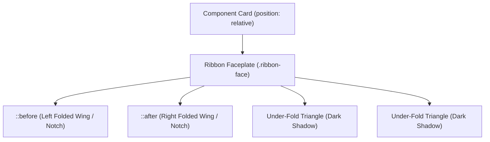

# 046: CSS Ribbon & Badge Masterclass

## Overview

In modern web design, **Ribbons** and **Badges** are critical micro-UI components used to capture attention, communicate contextual status, highlight promotions, denote hierarchy, and add tangible depth to user interfaces.

Historically, ribbons and badges were created using slicing image techniques in Photoshop or brittle CSS border hacks with dozens of wrapper `<div>` elements. Today, modern CSS provides sophisticated geometric primitives—including CSS transforms, `clip-path`, trigonometric functions (`sin()`, `cos()`, `atan2()`, `hypot()`), container queries, CSS Custom Properties, and `oklch()` color spaces—enabling developers to build ultra-crisp, fluid, responsive, accessible, and lightweight visual ribbons and badges with zero JavaScript and minimal markup.

```
┌─────────────────────────────────────────────────────────────────────────────┐
│                          RIBBON & BADGE ARCHITECTURE                        │
│                                                                             │
│   Corner 45° Ribbon        3D Folded Banner           Floating Badge        │
│   ┌──────────────────┐   ┌──────────────────────┐   ┌───────────────────┐   │
│   │ \ NEW /          │   │  /───────────────\   │   │  ┌───────┐ (99+)  │   │
│   │  \   /           │   │ ◄   BEST VALUE    ►  │   │  │Avatar │   ●    │   │
│   │   \ /            │   │  \───▲───────▲───/   │   │  └───────┘ Active │   │
│   │                  │   │      │ Folds │       │   │                   │   │
│   └──────────────────┘   └──────────────────────┘   └───────────────────┘   │
│   [Transforms / Clips]   [3D Depth & Underfolds]    [Relative Anchoring]    │
└─────────────────────────────────────────────────────────────────────────────┘
```

---

## 1. Taxonomy: Ribbons vs. Badges

While both elements deliver metadata and status cues, they serve distinct visual and architectural purposes:

| Feature / Dimension | CSS Ribbon | CSS Badge |
| :--- | :--- | :--- |
| **Primary Visual Role** | Decorative banner, callout, promotion, corner tag, bookmark | Status indicator, notification count, category pill, verified tag |
| **Geometry** | Angled (45°), folded wings, swallowtail notches, hanging tags | Compact pills, round counters, dot beacons, status chips |
| **Structural Complexity** | High (involves 3D fold geometry, shadows, diagonal clipping) | Medium/Low (inline-flex layout, border-radius, absolute offset) |
| **Key CSS Primitives** | `transform`, `clip-path`, `::before`/`::after`, `oklch()`, `hypot()` | `inline-flex`, `border-radius`, `aspect-ratio`, `translate()` |
| **Interaction / Semantics**| Mostly presentational / promotional marker | Semantic status (`role="status"`, notification counters, tags) |

---

## 2. Ribbon & Badge Structural Anatomy

Understanding the geometric layers and coordinate systems of ribbons and badges is essential before writing CSS declarations.

### Anatomy of a 3D Folded Ribbon



```
       [Left Wing]           [Center Ribbon Faceplate]          [Right Wing]
     ┌──────────────┐┌───────────────────────────────────────┐┌──────────────┐
     │ ╲            ││                                       ││            ╱ │
     │  ╲           ││             ★ POPULAR ★               ││           ╱  │
     │   ╲          ││                                       ││          ╱   │
     └────┬─────────┘└───────────────────────────────────────┘└─────────┬────┘
          │ ◢ Under-fold Triangle                 Under-fold Triangle ◣ │
          └─────────────────────────────────────────────────────────────┘
          [Parent Component Surface / Card Container Layer]
```

### Anatomy of an Anchored Badge

```
                       [Top-Right Coordinate: (100%, 0%)]
                                      │
                                      ▼
                        ┌───────────┬───────────┐
                        │           │ (50%,-50%)│ ◄── [Badge Anchor Point]
                        │   Parent  ├───────────┼──────┐
                        │  Element  │           │ (12) │ ◄── [Badge Container]
                        │  (Avatar  │           └──────┘
                        │  or Icon) │
                        └───────────┘
```

---

## 3. Core Geometric Primitives & Math

### The Mathematics of a 45° Corner Ribbon

When placing a diagonal ribbon across a card corner, the ribbon forms the hypotenuse of an isosceles right-angled triangle.

```
       A (0,0)
       ┌────────────────────────┐
       │ ╲                      │
       │  ╲ Ribbon              │
       │   ╲  (Hypotenuse = c)  │
       │    ╲                   │
       │     ╲                  │
       │ b    ╲                 │
       │       ╲                │
       │        ╲               │
       └─────────┴──────────────┘
            a
```

By the Pythagorean theorem:
$$c = \sqrt{a^2 + b^2} = a\sqrt{2} \approx 1.4142 \times a$$

In modern CSS, we can calculate this dynamically using CSS math functions:
```css
:root {
  --corner-offset: 48px;
  --ribbon-width: calc(var(--corner-offset) * 1.4142); /* c = a * sqrt(2) */
  /* Or using CSS hypot() in modern browsers */
  --ribbon-hypot: hypot(var(--corner-offset), var(--corner-offset));
}
```

---

## 4. The 7 Definitive Ribbon & Badge Implementation Patterns

---

### Pattern 1: Modern Single-Element `clip-path` Corner Ribbon

The cleanest way to construct a corner ribbon without creating overflow clipping issues on the parent container is using CSS `clip-path: polygon()`.

#### HTML Markup
```html
<div class="product-card">
  <div class="corner-ribbon-clip" data-ribbon="NEW"></div>
  <h3 class="card-title">Pro Audio Interface</h3>
  <p class="card-desc">Studio-grade 24-bit/192kHz USB audio interface with discrete preamps.</p>
  <button class="card-btn">Add to Cart</button>
</div>
```

#### CSS Implementation
```css
/* Card Container */
.product-card {
  position: relative;
  width: 320px;
  padding: 2rem;
  background: oklch(0.20 0.02 260);
  border: 1px solid oklch(0.30 0.04 260);
  border-radius: 16px;
  color: oklch(0.95 0.01 260);
  box-shadow: 0 20px 40px -15px oklch(0 0 0 / 0.5);
  font-family: system-ui, -apple-system, sans-serif;
  overflow: hidden; /* Clips the outer corner */
}

/* Modern Corner Ribbon using clip-path and Custom Properties */
.corner-ribbon-clip {
  --ribbon-size: 88px;
  --ribbon-color: oklch(0.65 0.24 350); /* Vivid Pink-Red */
  --ribbon-text-color: #ffffff;
  
  position: absolute;
  inset-block-start: 0;
  inset-inline-end: 0;
  inline-size: var(--ribbon-size);
  block-size: var(--ribbon-size);
  pointer-events: none;
  z-index: 10;
}

.corner-ribbon-clip::before {
  content: attr(data-ribbon);
  position: absolute;
  inset-block-start: 0;
  inset-inline-end: 0;
  inline-size: calc(var(--ribbon-size) * 1.4142);
  padding-block: 6px;
  background: linear-gradient(
    135deg,
    var(--ribbon-color),
    oklch(from var(--ribbon-color) calc(l - 0.1) c h)
  );
  color: var(--ribbon-text-color);
  font-size: 0.75rem;
  font-weight: 800;
  letter-spacing: 0.12em;
  text-transform: uppercase;
  text-align: center;
  box-shadow: 0 4px 12px oklch(0 0 0 / 0.35);
  
  /* Precision rotation and alignment */
  transform-origin: center;
  transform: translateY(18px) translateX(18px) rotate(45deg);
}
```

---

### Pattern 2: 3D Folded Corner Ribbon with Realistic Underfolds

This classic pattern wraps around the edges of a card, featuring realistic 3D shadow under-folds that give the illusion of cloth or ribbon wrapped over cardstock.

```
                  Card Top Edge
          ┌───────────────────────────────────┐
     ▲    │                                   │
  Fold 1  │ ◢ Under-fold                      │
     ▼    │╱                                  │
          │\  ★ EXCLUSIVE ★                   │
          │ \                                 │
          │  \                                │
          │   \                               │
          │    \                              │
          │     \                             │
          │      \                            │
          │       \                           │
          │        \                          │
          │         \                         │
          │          \                        │
          │           \                       │
          │            \                      │
          │             ╲                     │
          │   Under-fold ◣                    │
          └───────────────────────────────────┘
```

#### HTML Markup
```html
<article class="featured-card">
  <div class="ribbon-3d-corner">
    <span>Featured</span>
  </div>
  <div class="card-content">
    <h2>Enterprise Cloud</h2>
    <p>Dedicated infrastructure with 99.999% SLA and isolated tenancies.</p>
    <div class="pricing">$499<span>/mo</span></div>
  </div>
</article>
```

#### CSS Implementation
```css
.featured-card {
  position: relative;
  width: 340px;
  padding: 2.5rem 2rem 2rem;
  background: oklch(0.22 0.03 265);
  border: 1px solid oklch(0.35 0.05 265);
  border-radius: 12px;
  color: oklch(0.98 0 0);
  box-shadow: 0 25px 50px -12px oklch(0 0 0 / 0.6);
  font-family: system-ui, -apple-system, sans-serif;
}

/* 3D Corner Ribbon Wrapper */
.ribbon-3d-corner {
  --ribbon-bg: oklch(0.70 0.19 145);      /* Vibrant Emerald */
  --ribbon-shadow: oklch(0.35 0.12 145);  /* Dark Fold Shadow */
  --ribbon-inset: -8px;
  
  position: absolute;
  inset-block-start: var(--ribbon-inset);
  inset-inline-start: var(--ribbon-inset);
  inline-size: 110px;
  block-size: 110px;
  overflow: hidden;
  pointer-events: none;
  z-index: 20;
}

/* Diagonal Ribbon Banner */
.ribbon-3d-corner span {
  position: absolute;
  display: block;
  inline-size: 160px;
  padding: 8px 0;
  background: var(--ribbon-bg);
  background: linear-gradient(
    135deg,
    oklch(from var(--ribbon-bg) calc(l + 0.05) c h),
    var(--ribbon-bg)
  );
  color: oklch(0.12 0.03 145);
  font-size: 0.75rem;
  font-weight: 800;
  text-transform: uppercase;
  letter-spacing: 0.15em;
  text-align: center;
  box-shadow: 0 4px 10px oklch(0 0 0 / 0.3);
  
  /* Anchor to diagonal */
  inset-inline-end: -25px;
  inset-block-start: 22px;
  transform: rotate(-45deg);
}

/* Fold Triangle 1: Top Edge Underfold */
.ribbon-3d-corner::before,
.ribbon-3d-corner::after {
  content: "";
  position: absolute;
  z-index: -1;
  border: 4px solid transparent;
}

/* Top Fold */
.ribbon-3d-corner::before {
  inset-block-start: 0;
  inset-inline-end: 0;
  border-block-end-color: var(--ribbon-shadow);
  border-inline-end-color: var(--ribbon-shadow);
}

/* Left Fold */
.ribbon-3d-corner::after {
  inset-block-end: 0;
  inset-inline-start: 0;
  border-block-start-color: var(--ribbon-shadow);
  border-inline-start-color: var(--ribbon-shadow);
}
```

---

### Pattern 3: The 3D Wrap-Around Banner Ribbon

A high-impact banner ribbon floating horizontally across a container, with side wings wrapping around the container borders and under-fold shadows creating genuine visual depth.

```
       ┌───────────┬───────────────────────────────────┬───────────┐
       │ ╲ Wing L  │                                   │  Wing R ╱ │
       │  ╲        │        ★ BESTSELLER ★             │        ╱  │
       └───┬───────┴───────────────────────────────────┴───────┬───┘
           │ ◢ Under-fold                         Under-fold ◣ │
           └───────────────────────────────────────────────────┘
           [                 Product Card Surface              ]
```

#### HTML Markup
```html
<div class="banner-card">
  <div class="ribbon-banner-wrap">
    <span class="ribbon-content">★ Most Popular Choice ★</span>
  </div>
  <div class="card-inner">
    <h3>Pro Developer Tier</h3>
    <p>Unlimited projects, instant deployments, and 24/7 priority support.</p>
    <div class="price-tag">$29/month</div>
  </div>
</div>
```

#### CSS Implementation
```css
.banner-card {
  position: relative;
  width: 360px;
  margin: 3rem auto;
  padding: 3rem 2rem 2rem;
  background: oklch(0.18 0.02 270);
  border-radius: 16px;
  border: 1px solid oklch(0.28 0.03 270);
  color: #ffffff;
  box-shadow: 0 30px 60px -15px oklch(0 0 0 / 0.7);
  font-family: system-ui, -apple-system, sans-serif;
}

/* Banner Ribbon Wrapper */
.ribbon-banner-wrap {
  --banner-bg: oklch(0.68 0.22 45);        /* Warm Amber / Gold */
  --banner-shadow: oklch(0.38 0.15 45);    /* Dark Fold Shadow */
  --banner-overhang: 14px;
  --wing-width: 28px;
  
  position: absolute;
  inset-block-start: -14px;
  inset-inline-start: calc(var(--banner-overhang) * -1);
  inset-inline-end: calc(var(--banner-overhang) * -1);
  text-align: center;
  z-index: 10;
}

/* Center Faceplate of Ribbon */
.ribbon-banner-wrap .ribbon-content {
  position: relative;
  display: block;
  padding: 10px 1.5rem;
  background: linear-gradient(
    180deg,
    oklch(from var(--banner-bg) calc(l + 0.08) c h),
    var(--banner-bg)
  );
  color: oklch(0.15 0.05 45);
  font-size: 0.875rem;
  font-weight: 800;
  letter-spacing: 0.08em;
  text-transform: uppercase;
  border-radius: 4px 4px 0 0;
  box-shadow: 0 8px 16px oklch(0 0 0 / 0.35);
}

/* Left & Right Fold Shadows (Under-Folds) */
.ribbon-banner-wrap .ribbon-content::before,
.ribbon-banner-wrap .ribbon-content::after {
  content: "";
  position: absolute;
  inset-block-end: calc(var(--banner-overhang) * -1);
  border-block-start: var(--banner-overhang) solid var(--banner-shadow);
  z-index: -1;
}

.ribbon-banner-wrap .ribbon-content::before {
  inset-inline-start: 0;
  border-inline-start: var(--banner-overhang) solid transparent;
}

.ribbon-banner-wrap .ribbon-content::after {
  inset-inline-end: 0;
  border-inline-end: var(--banner-overhang) solid transparent;
}

/* Left & Right Hanging Swallowtail Wings */
.ribbon-banner-wrap::before,
.ribbon-banner-wrap::after {
  content: "";
  position: absolute;
  inset-block-start: var(--banner-overhang);
  inline-size: var(--wing-width);
  block-size: 100%;
  background: oklch(from var(--banner-bg) calc(l - 0.08) c h);
  z-index: -2;
}

/* Left Wing with Swallowtail Cut */
.ribbon-banner-wrap::before {
  inset-inline-start: 0;
  clip-path: polygon(100% 0, 100% 100%, 0 100%, 50% 50%, 0 0);
  transform: translateX(-100%);
}

/* Right Wing with Swallowtail Cut */
.ribbon-banner-wrap::after {
  inset-inline-end: 0;
  clip-path: polygon(0 0, 0 100%, 100% 100%, 50% 50%, 100% 0);
  transform: translateX(100%);
}
```

---

### Pattern 4: Bookmark / Hanging Award Ribbon with `clip-path`

A hanging ribbon bookmark pinned to the top edge of an article or card, complete with a swallowtail notch, metallic gradient, and a stitched texture.

```
       ┌────────────────────────┐
       │ █  TOP ANCHOR EDGE   █ │
       │                        │
       │   ★ EDITORS' CHOICE    │
       │                        │
       │                        │
       │ ╲                    ╱ │
       │  ╲                  ╱  │
       │   ╲                ╱   │
       └────▼──────────────▼────┘
          [Swallowtail Notch]
```

#### HTML Markup
```html
<article class="article-card">
  <div class="bookmark-ribbon" title="Editor's Choice Award">
    <svg class="award-icon" viewBox="0 0 24 24" width="16" height="16" fill="currentColor">
      <path d="M12 2l3.09 6.26L22 9.27l-5 4.87 1.18 6.88L12 17.77l-6.18 3.25L7 14.14 2 9.27l6.91-1.01L12 2z"/>
    </svg>
    <span class="bookmark-text">Choice</span>
  </div>
  
  <h2>Mastering Web Performance in 2026</h2>
  <p>An exhaustive architectural guide to sub-millisecond Core Web Vitals.</p>
</article>
```

#### CSS Implementation
```css
.article-card {
  position: relative;
  width: 320px;
  padding: 2.5rem 1.75rem 2rem;
  background: oklch(0.24 0.02 240);
  border: 1px solid oklch(0.35 0.03 240);
  border-radius: 12px;
  color: oklch(0.96 0 0);
  font-family: system-ui, -apple-system, sans-serif;
}

/* Hanging Bookmark Ribbon */
.bookmark-ribbon {
  --ribbon-width: 44px;
  --ribbon-length: 64px;
  --notch-depth: 14px;
  --ribbon-primary: oklch(0.62 0.24 28);   /* Coral Bronze */
  --ribbon-stitch: oklch(0.85 0.12 28);
  
  position: absolute;
  inset-block-start: -6px;
  inset-inline-end: 24px;
  inline-size: var(--ribbon-width);
  block-size: var(--ribbon-length);
  background: linear-gradient(
    180deg,
    oklch(from var(--ribbon-primary) calc(l + 0.1) c h),
    var(--ribbon-primary) 70%,
    oklch(from var(--ribbon-primary) calc(l - 0.08) c h)
  );
  color: #ffffff;
  display: flex;
  flex-direction: column;
  align-items: center;
  padding-block-start: 10px;
  gap: 2px;
  box-shadow: 0 8px 16px oklch(0 0 0 / 0.4);
  
  /* Geometric Swallowtail Notch */
  clip-path: polygon(
    0 0,
    100% 0,
    100% 100%,
    50% calc(100% - var(--notch-depth)),
    0 100%
  );
  transition: transform 0.25s cubic-bezier(0.34, 1.56, 0.64, 1);
  filter: drop-shadow(0 4px 6px oklch(0 0 0 / 0.3));
}

.article-card:hover .bookmark-ribbon {
  transform: translateY(4px);
}

.bookmark-ribbon .award-icon {
  filter: drop-shadow(0 1px 2px oklch(0 0 0 / 0.5));
}

.bookmark-ribbon .bookmark-text {
  font-size: 0.625rem;
  font-weight: 800;
  text-transform: uppercase;
  letter-spacing: 0.06em;
}
```

---

### Pattern 5: Floating Notification & Active Live Status Beacon Badge

Badges attached to avatars, app icons, and cart icons require precise sub-pixel anchoring, dynamic text expansion, and accessible live pulse animations.

```
       ┌───────────────────────────────┐
       │   Avatar Profile Container    │
       │                               │
       │                               │       (99+) ◄── Numeric Badge
       │                               │    ┌─────────┐   [translate(50%, -50%)]
       │                               ├───-│ (Badge) │
       │                               │    └─────────┘
       │                               │
       │                     ● ◄───────┼── Live Beacon [Pulse Animation]
       └───────────────────────────────┘
```

#### HTML Markup
```html
<div class="badge-demo-row">
  <!-- Avatar with Status Beacon -->
  <div class="avatar-wrapper" aria-label="Alex Vance (Online)">
    
    <span class="status-beacon status-online" role="status" aria-label="Online">
      <span class="beacon-wave"></span>
    </span>
  </div>

  <!-- Shopping Cart with Numeric Notification Badge -->
  <button class="icon-button" aria-label="Shopping Cart with 14 items">
    <svg viewBox="0 0 24 24" width="22" height="22" fill="none" stroke="currentColor" stroke-width="2">
      <path d="M6 2L3 6v14a2 2 0 002 2h14a2 2 0 002-2V6l-3-4z M3 6h18 M16 10a4 4 0 01-8 0"/>
    </svg>
    <span class="counter-badge" aria-hidden="true">14</span>
  </button>

  <!-- High-Count Truncated Badge -->
  <button class="icon-button" aria-label="Notifications, 99+ unread">
    <svg viewBox="0 0 24 24" width="22" height="22" fill="none" stroke="currentColor" stroke-width="2">
      <path d="M18 8A6 6 0 006 8c0 7-3 9-3 9h18s-3-2-3-9 M13.73 21a2 2 0 01-3.46 0"/>
    </svg>
    <span class="counter-badge counter-badge-hot" aria-hidden="true">99+</span>
  </button>
</div>
```

#### CSS Implementation
```css
.badge-demo-row {
  display: flex;
  align-items: center;
  gap: 2rem;
  padding: 2rem;
}

/* Avatar Relative Container */
.avatar-wrapper {
  position: relative;
  display: inline-block;
  inline-size: 56px;
  block-size: 56px;
}

.avatar-img {
  inline-size: 100%;
  block-size: 100%;
  border-radius: 50%;
  object-fit: cover;
  border: 2px solid oklch(0.35 0.05 260);
}

/* Live Status Beacon */
.status-beacon {
  --beacon-size: 14px;
  --beacon-color: oklch(0.72 0.22 145); /* Emerald Green */
  
  position: absolute;
  inset-block-end: 2px;
  inset-inline-end: 2px;
  inline-size: var(--beacon-size);
  block-size: var(--beacon-size);
  background-color: var(--beacon-color);
  border: 2px solid oklch(0.18 0.02 260); /* Matches card bg to create ring */
  border-radius: 50%;
}

/* Radar Pulse Wave */
.status-beacon .beacon-wave {
  position: absolute;
  inset: -2px;
  border-radius: 50%;
  background-color: var(--beacon-color);
  opacity: 0.75;
  animation: beacon-pulse 2s cubic-bezier(0.24, 0, 0.38, 1) infinite;
  pointer-events: none;
}

@keyframes beacon-pulse {
  0% {
    transform: scale(0.95);
    opacity: 0.8;
  }
  70% {
    transform: scale(2.4);
    opacity: 0;
  }
  100% {
    transform: scale(2.4);
    opacity: 0;
  }
}

/* Icon Buttons with Badges */
.icon-button {
  position: relative;
  display: inline-flex;
  align-items: center;
  justify-content: center;
  inline-size: 48px;
  block-size: 48px;
  background: oklch(0.25 0.03 260);
  border: 1px solid oklch(0.35 0.04 260);
  border-radius: 12px;
  color: oklch(0.95 0 0);
  cursor: pointer;
  transition: background-color 0.2s ease;
}

.icon-button:hover {
  background: oklch(0.30 0.04 260);
}

/* Counter / Numeric Badge */
.counter-badge {
  position: absolute;
  inset-block-start: -6px;
  inset-inline-end: -6px;
  min-inline-size: 22px;
  block-size: 22px;
  padding-inline: 6px;
  background: oklch(0.60 0.25 25); /* Bold Signal Orange */
  color: #ffffff;
  font-size: 0.6875rem;
  font-weight: 800;
  font-variant-numeric: tabular-nums;
  line-height: 1;
  display: inline-flex;
  align-items: center;
  justify-content: center;
  border-radius: 9999px;
  border: 2px solid oklch(0.18 0.02 260);
  box-shadow: 0 4px 8px oklch(0 0 0 / 0.4);
  user-select: none;
}

/* High Priority / Emergency Badge Variant */
.counter-badge-hot {
  background: oklch(0.58 0.28 18); /* Deep Crimson */
  animation: badge-bounce 0.6s ease-out;
}

@keyframes badge-bounce {
  0% { transform: scale(0.3); opacity: 0; }
  60% { transform: scale(1.15); }
  100% { transform: scale(1); opacity: 1; }
}
```

---

### Pattern 6: Modern Design System Pill & Tag Badge Architecture

A modular, tokenized pill badge system supporting soft tints, outline borders, status dots, icons, and subtle interactive sheen.

```
       ┌─────────────────────────────────────────────────────────────┐
       │              MODERN PILL BADGE MATRIX                       │
       │                                                             │
       │  [ ● Active ]      [ ⚠ In Review ]      [ ✖ Rejected ]      │
       │    (Success)          (Warning)            (Error)          │
       │                                                             │
       │  [ ★ Pro Plan ]    [ ⚡ Instant ]        [ ⚑ Beta v2.4 ]    │
       │    (Premium)          (Dynamic)            (Neutral)        │
       └─────────────────────────────────────────────────────────────┘
```

#### HTML Markup
```html
<div class="badge-system-grid">
  <!-- Success Pill -->
  <span class="badge badge-success">
    <span class="badge-dot"></span>
    Active Production
  </span>

  <!-- Warning Pill -->
  <span class="badge badge-warning">
    <span class="badge-dot"></span>
    Pending Review
  </span>

  <!-- Error Pill -->
  <span class="badge badge-error">
    <span class="badge-dot"></span>
    Sync Failed
  </span>

  <!-- Premium / VIP Shimmer Badge -->
  <span class="badge badge-premium">
    <svg viewBox="0 0 24 24" width="12" height="12" fill="currentColor"><path d="M12 2l2.4 7.4h7.6l-6.2 4.5 2.4 7.4-6.2-4.5-6.2 4.5 2.4-7.4-6.2-4.5h7.6z"/></svg>
    VIP Enterprise
  </span>
</div>
```

#### CSS Implementation
```css
/* Base Tokenized Badge Component */
.badge {
  --badge-bg: oklch(0.25 0.02 260);
  --badge-text: oklch(0.90 0.02 260);
  --badge-border: oklch(0.35 0.03 260);
  --badge-dot-color: currentColor;
  
  display: inline-flex;
  align-items: center;
  gap: 6px;
  padding: 4px 10px;
  border-radius: 9999px;
  background-color: var(--badge-bg);
  color: var(--badge-text);
  border: 1px solid var(--badge-border);
  font-size: 0.75rem;
  font-weight: 600;
  line-height: 1.2;
  letter-spacing: 0.02em;
  white-space: nowrap;
  transition: all 0.2s ease;
}

/* Status Indicator Dot */
.badge-dot {
  inline-size: 6px;
  block-size: 6px;
  border-radius: 50%;
  background-color: var(--badge-dot-color);
  flex-shrink: 0;
}

/* Variant 1: Success (Green) */
.badge-success {
  --badge-bg: oklch(0.24 0.06 145);
  --badge-text: oklch(0.85 0.18 145);
  --badge-border: oklch(0.38 0.12 145);
  --badge-dot-color: oklch(0.75 0.22 145);
}

/* Variant 2: Warning (Amber) */
.badge-warning {
  --badge-bg: oklch(0.26 0.07 70);
  --badge-text: oklch(0.88 0.18 70);
  --badge-border: oklch(0.42 0.14 70);
  --badge-dot-color: oklch(0.80 0.20 70);
}

/* Variant 3: Error (Rose / Crimson) */
.badge-error {
  --badge-bg: oklch(0.24 0.08 20);
  --badge-text: oklch(0.86 0.20 20);
  --badge-border: oklch(0.38 0.16 20);
  --badge-dot-color: oklch(0.72 0.24 20);
}

/* Variant 4: VIP / Premium Shimmer Badge */
.badge-premium {
  --badge-bg: linear-gradient(135deg, oklch(0.30 0.12 300), oklch(0.25 0.14 260));
  --badge-text: oklch(0.96 0.05 300);
  --badge-border: oklch(0.50 0.20 300);
  position: relative;
  overflow: hidden;
  background: var(--badge-bg);
  box-shadow: 0 0 15px oklch(0.50 0.20 300 / 0.3);
}

.badge-premium::after {
  content: "";
  position: absolute;
  inset: 0;
  background: linear-gradient(
    90deg,
    transparent 0%,
    oklch(1 0 0 / 0.25) 50%,
    transparent 100%
  );
  transform: translateX(-100%);
  animation: badge-shimmer 3s infinite ease-in-out;
}

@keyframes badge-shimmer {
  0% { transform: translateX(-100%); }
  40%, 100% { transform: translateX(100%); }
}
```

---

### Pattern 7: Container-Query Responsive Elastic Ribbon

In modular UI architectures, cards may be displayed inside narrow sidebars (240px wide) or widescreen showcase rows (600px wide). By combining **CSS Container Queries (`@container`)** and dynamic CSS Custom Properties, ribbons automatically rescale, adjust their fold angles, or switch layouts based on component width.

```
      Wide Container (450px+)                  Narrow Sidebar Container (240px)
 ┌───────────────────────────────────┐       ┌────────────────────────┐
 │ ◄── BEST VALUE RIBBON (Full) ──►  │       │ [★ SALE] Top Pill      │
 │                                   │       │                        │
 │ Large Title                       │  ──>  │ Compact Title          │
 │ $49/mo                            │       │ $49/mo                 │
 └───────────────────────────────────┘       └────────────────────────┘
```

#### HTML Markup
```html
<div class="pricing-container-wrapper">
  <div class="pricing-card-cqi">
    <div class="cqi-ribbon" data-text="RECOMMENDED"></div>
    <div class="card-body">
      <h3>Pro Tier</h3>
      <p class="price">$79/mo</p>
    </div>
  </div>
</div>
```

#### CSS Implementation
```css
/* Establish Container Context */
.pricing-container-wrapper {
  container-type: inline-size;
  container-name: card-container;
  width: 100%;
  max-width: 480px;
}

.pricing-card-cqi {
  position: relative;
  padding: 2.5rem 1.5rem 1.5rem;
  background: oklch(0.20 0.03 260);
  border: 1px solid oklch(0.30 0.04 260);
  border-radius: 16px;
  color: #ffffff;
  overflow: hidden;
}

/* Default Wide Layout Ribbon */
.cqi-ribbon {
  position: absolute;
  inset-block-start: 18px;
  inset-inline-end: -35px;
  inline-size: 140px;
  padding-block: 4px;
  background: oklch(0.65 0.22 145);
  color: oklch(0.12 0.04 145);
  font-size: 0.6875rem;
  font-weight: 800;
  text-align: center;
  text-transform: uppercase;
  letter-spacing: 0.1em;
  transform: rotate(45deg);
  box-shadow: 0 4px 12px oklch(0 0 0 / 0.35);
}

.cqi-ribbon::before {
  content: attr(data-text);
}

/* Container Query: When embedded in narrow sidebar (< 280px) */
@container card-container (max-width: 280px) {
  .pricing-card-cqi {
    padding-block-start: 3rem;
  }
  
  .cqi-ribbon {
    inset-block-start: 0;
    inset-inline-start: 0;
    inset-inline-end: 0;
    inline-size: 100%;
    transform: none; /* Disables rotation for compact view */
    border-radius: 0;
    font-size: 0.625rem;
    padding-block: 6px;
  }
}
```

---

## 5. Modern CSS Color Mechanics with `oklch()`

Ribbons and folded banners depend heavily on realistic shadow gradients and edge highlights. The modern `oklch()` color model provides perceptual uniformity, ensuring that highlights never look washed out and shadows maintain vivid saturation.

```css
/* Color Lighting Engine for 3D Ribbons */
:root {
  --ribbon-hue: 250; /* Indigo/Purple */
  --ribbon-chroma: 0.24;
  
  /* Perceptually calculated color steps */
  --ribbon-surface:   oklch(0.65 var(--ribbon-chroma) var(--ribbon-hue));
  --ribbon-highlight: oklch(0.75 var(--ribbon-chroma) var(--ribbon-hue));
  --ribbon-shadow-1:  oklch(0.50 var(--ribbon-chroma) var(--ribbon-hue));
  --ribbon-shadow-2:  oklch(0.30 var(--ribbon-chroma) var(--ribbon-hue));
  --ribbon-crease:    oklch(0.18 var(--ribbon-chroma) var(--ribbon-hue));
}

.modern-folded-ribbon {
  background: linear-gradient(
    180deg,
    var(--ribbon-highlight) 0%,
    var(--ribbon-surface) 60%,
    var(--ribbon-shadow-1) 100%
  );
}

.modern-ribbon-underfold {
  border-color: var(--ribbon-crease);
}
```

---

## 6. Accessibility (a11y) & Semantic Architecture

Visual ribbons and badges convey critical operational and promotional context. Failure to structure them properly causes severe assistive technology barriers.

### Accessibility Checklist

| Scenario / Pattern | Accessible Technique | Anti-Pattern to Avoid |
| :--- | :--- | :--- |
| **Decorative Ribbon ("Hot Deal")** | `aria-hidden="true"` on CSS ribbon, with context in card heading. | Hiding crucial text purely inside CSS `content: "..."` without screen-reader fallback. |
| **Notification Badge (Cart Count)** | `aria-label="Shopping Cart, 5 items"` on button, `aria-hidden="true"` on badge. | Bare `<button><svg><span class="badge">5</span></button>` (screen reader reads "Button 5"). |
| **Live Status Dot (Online/Offline)** | `role="status"` and `aria-label="Online"`. | Relying solely on green/red dot colors without text alternatives (violates WCAG 1.4.1). |
| **Contrast Ratios (WCAG 2.1)** | Text-to-background contrast $\ge 4.5:1$ (AA) or $\ge 7:1$ (AAA). | Low-contrast pastel badges with white text. |
| **Motion Sensitivity** | `@media (prefers-reduced-motion: reduce)` disabling badge pulses. | Continuous un-pausable pulsing beacons (violates WCAG 2.2.2). |

### Accessible Code Sample: Screen Reader Friendly Badge

```html
<!-- Fully Accessible Icon + Numeric Badge -->
<button type="button" class="btn-notification">
  <!-- Accessible label for screen readers -->
  <span class="sr-only">Notifications (3 unread messages)</span>
  
  <!-- Visual Icon -->
  <svg aria-hidden="true" viewBox="0 0 24 24" width="24" height="24">
    <path d="M12 22c1.1 0 2-.9 2-2h-4c0 1.1.9 2 2 2zm6-6v-5c0-3.07-1.63-5.64-4.5-6.32V4c0-.83-.67-1.5-1.5-1.5s-1.5.67-1.5 1.5v.68C7.64 5.36 6 7.92 6 11v5l-2 2v1h16v-1l-2-2z"/>
  </svg>
  
  <!-- Visual Badge (hidden from AT to avoid duplicate announcements) -->
  <span class="visual-badge" aria-hidden="true">3</span>
</button>
```

```css
/* Screen Reader Only Utility */
.sr-only {
  position: absolute;
  width: 1px;
  height: 1px;
  padding: 0;
  margin: -1px;
  overflow: hidden;
  clip: rect(0, 0, 0, 0);
  white-space: nowrap;
  border-width: 0;
}

/* Reduced Motion Compliance */
@media (prefers-reduced-motion: reduce) {
  .status-beacon .beacon-wave,
  .badge-premium::after,
  .counter-badge-hot {
    animation: none !important;
  }
}
```

---

## 7. Common Pitfalls & High-Performance Solutions

### Pitfall 1: Blurry / Aliased Text on 45° Rotated Ribbons
- **Problem**: When CSS `transform: rotate(45deg)` is applied, browsers often rasterize text off-grid, resulting in fuzzy, pixelated font rendering.
- **Solution**: Force subpixel hardware rasterization and antialiasing:
  ```css
  .ribbon-diagonal {
    transform: rotate(45deg) translateZ(0);
    backface-visibility: hidden;
    -webkit-font-smoothing: antialiased;
    -moz-osx-font-smoothing: grayscale;
  }
  ```

### Pitfall 2: `overflow: hidden` Clipping External Dropdowns and Tooltips
- **Problem**: Setting `overflow: hidden` on a card container to clip a diagonal corner ribbon cuts off nested interactive menus, select boxes, or hover tooltips.
- **Solution**: Avoid `overflow: hidden` on the card. Instead, constrain the ribbon itself using `clip-path` on the ribbon container:
  ```css
  .card-container {
    /* No overflow: hidden needed! */
    position: relative;
  }
  
  .corner-ribbon-element {
    position: absolute;
    inset: 0 0 auto auto;
    inline-size: 100px;
    block-size: 100px;
    clip-path: polygon(0 0, 100% 0, 100% 100%);
  }
  ```

### Pitfall 3: Sub-Pixel Creases / Gaps between Ribbon Wings and Folds
- **Problem**: On high-DPI (Retina) screens, fractional pixel calculations can leave an unsightly 1px transparent gap between the ribbon faceplate and underfold triangles.
- **Solution**: Overlap elements by `0.5px` or `1px`:
  ```css
  .ribbon-fold-shadow {
    margin-block-start: -0.5px;
  }
  ```

### Pitfall 4: Ribbons Blocking User Clicks
- **Problem**: A large diagonal ribbon wrapper captures pointer clicks, preventing users from selecting text, clicking links, or tapping underlying card buttons.
- **Solution**:
  ```css
  .ribbon-wrapper {
    pointer-events: none; /* Allows clicks to pass directly through */
  }
  ```

---

## 8. Complete Master Production Showcase

Here is a complete, self-contained, copy-pasteable HTML and CSS template demonstrating every pattern covered in this masterclass.

```html
<!DOCTYPE html>
<html lang="en">
<head>
  <meta charset="UTF-8">
  <meta name="viewport" content="width=device-width, initial-scale=1.0">
  <title>CSS Ribbon & Badge Production Masterclass</title>
  <style>
    /* Design Tokens */
    :root {
      --bg-canvas: oklch(0.12 0.02 260);
      --bg-surface: oklch(0.18 0.03 260);
      --border-surface: oklch(0.28 0.04 260);
      --text-main: oklch(0.98 0 0);
      --text-muted: oklch(0.70 0.02 260);
      --color-emerald: oklch(0.70 0.22 145);
      --color-rose: oklch(0.65 0.24 25);
      --color-amber: oklch(0.75 0.20 70);
    }

    * {
      box-sizing: border-box;
      margin: 0;
      padding: 0;
    }

    body {
      background-color: var(--bg-canvas);
      color: var(--text-main);
      font-family: system-ui, -apple-system, BlinkMacSystemFont, "Segoe UI", Roboto, sans-serif;
      padding: 3rem 1.5rem;
      display: flex;
      flex-direction: column;
      align-items: center;
      gap: 3rem;
    }

    h1 {
      font-size: 2rem;
      font-weight: 800;
      letter-spacing: -0.02em;
    }

    .gallery-grid {
      display: grid;
      grid-template-columns: repeat(auto-fit, minmax(300px, 1fr));
      gap: 2.5rem;
      inline-size: 100%;
      max-inline-size: 1100px;
    }

    /* Base Showcase Card */
    .card {
      position: relative;
      background: var(--bg-surface);
      border: 1px solid var(--border-surface);
      border-radius: 16px;
      padding: 2.5rem 1.75rem 1.75rem;
      display: flex;
      flex-direction: column;
      gap: 1rem;
      box-shadow: 0 20px 40px -15px oklch(0 0 0 / 0.5);
    }

    .card h2 {
      font-size: 1.25rem;
      font-weight: 700;
    }

    .card p {
      color: var(--text-muted);
      font-size: 0.875rem;
      line-height: 1.5;
    }

    /* 1. Diagonal Corner Ribbon (Clip-Path) */
    .card-corner-ribbon {
      overflow: hidden;
    }

    .ribbon-corner {
      position: absolute;
      inset-block-start: 0;
      inset-inline-end: 0;
      inline-size: 90px;
      block-size: 90px;
      pointer-events: none;
    }

    .ribbon-corner span {
      position: absolute;
      inset-inline-end: -22px;
      inset-block-start: 18px;
      inline-size: 130px;
      padding: 6px 0;
      background: linear-gradient(135deg, var(--color-rose), oklch(0.50 0.22 25));
      color: #fff;
      font-size: 0.6875rem;
      font-weight: 800;
      text-transform: uppercase;
      letter-spacing: 0.1em;
      text-align: center;
      transform: rotate(45deg);
      box-shadow: 0 4px 10px oklch(0 0 0 / 0.3);
    }

    /* 2. 3D Wrap-Around Banner Ribbon */
    .ribbon-wrap-banner {
      position: absolute;
      inset-block-start: -12px;
      inset-inline: -12px;
      text-align: center;
      z-index: 5;
    }

    .ribbon-wrap-banner .banner-text {
      position: relative;
      display: block;
      padding: 8px 1rem;
      background: linear-gradient(180deg, var(--color-amber), oklch(0.60 0.18 70));
      color: oklch(0.15 0.05 70);
      font-size: 0.75rem;
      font-weight: 800;
      text-transform: uppercase;
      letter-spacing: 0.1em;
      box-shadow: 0 6px 14px oklch(0 0 0 / 0.35);
      border-radius: 4px;
    }

    .ribbon-wrap-banner .banner-text::before,
    .ribbon-wrap-banner .banner-text::after {
      content: "";
      position: absolute;
      inset-block-end: -12px;
      border-block-start: 12px solid oklch(0.35 0.12 70);
      z-index: -1;
    }

    .ribbon-wrap-banner .banner-text::before {
      inset-inline-start: 0;
      border-inline-start: 12px solid transparent;
    }

    .ribbon-wrap-banner .banner-text::after {
      inset-inline-end: 0;
      border-inline-end: 12px solid transparent;
    }

    /* 3. Hanging Swallowtail Bookmark Ribbon */
    .ribbon-hanging {
      position: absolute;
      inset-block-start: -4px;
      inset-inline-end: 24px;
      inline-size: 40px;
      block-size: 54px;
      background: linear-gradient(180deg, var(--color-emerald), oklch(0.55 0.18 145));
      color: oklch(0.12 0.04 145);
      display: flex;
      align-items: center;
      justify-content: center;
      padding-block-end: 10px;
      font-weight: 900;
      font-size: 1rem;
      clip-path: polygon(0 0, 100% 0, 100% 100%, 50% 80%, 0 100%);
      filter: drop-shadow(0 4px 6px oklch(0 0 0 / 0.35));
    }

    /* 4. Badges Matrix Card */
    .badge-group {
      display: flex;
      flex-wrap: wrap;
      gap: 0.75rem;
      align-items: center;
    }

    .pill-badge {
      display: inline-flex;
      align-items: center;
      gap: 6px;
      padding: 4px 10px;
      border-radius: 9999px;
      font-size: 0.75rem;
      font-weight: 600;
      background: oklch(0.25 0.04 260);
      border: 1px solid oklch(0.35 0.05 260);
      color: oklch(0.92 0 0);
    }

    .pill-badge.active {
      background: oklch(0.24 0.06 145);
      border-color: oklch(0.40 0.14 145);
      color: oklch(0.85 0.18 145);
    }

    .pill-badge.active .dot {
      inline-size: 6px;
      block-size: 6px;
      border-radius: 50%;
      background: var(--color-emerald);
    }
  </style>
</head>
<body>
  <h1>CSS Ribbon &amp; Badge Component Architecture</h1>

  <div class="gallery-grid">
    <!-- Card 1: 45° Corner Ribbon -->
    <article class="card card-corner-ribbon">
      <div class="ribbon-corner" aria-hidden="true">
        <span>NEW</span>
      </div>
      <h2>Diagonal Corner Ribbon</h2>
      <p>Precision 45-degree angle ribbon utilizing modern CSS transforms, trigonometry, and drop shadows.</p>
    </article>

    <!-- Card 2: 3D Wrap-Around Banner -->
    <article class="card">
      <div class="ribbon-wrap-banner" aria-hidden="true">
        <span class="banner-text">★ POPULAR CHOICE ★</span>
      </div>
      <h2>3D Folded Banner</h2>
      <p>Realistic cloth banner with under-fold shadow triangles that visually wrap around the card borders.</p>
    </article>

    <!-- Card 3: Hanging Bookmark Ribbon -->
    <article class="card">
      <div class="ribbon-hanging" title="Winner Award">★</div>
      <h2>Swallowtail Bookmark</h2>
      <p>Vertical award badge with CSS <code>clip-path</code> polygon swallowtail notch and metallic lighting.</p>
    </article>

    <!-- Card 4: Status Badge Tokens -->
    <article class="card">
      <h2>Modern Status Badges</h2>
      <p>Compact, accessible, tokenized micro-badges for application interfaces.</p>
      <div class="badge-group">
        <span class="pill-badge active"><span class="dot"></span>Live Status</span>
        <span class="pill-badge">v3.4.0</span>
        <span class="pill-badge">PRO</span>
      </div>
    </article>
  </div>
</body>
</html>
```

---

## 9. Summary & Quick Reference

```
┌─────────────────────────────────────────────────────────────────────────────┐
│                      RIBBON & BADGE QUICK REFERENCE                         │
├──────────────────────┬──────────────────────────────────────────────────────┤
│ 45° Diagonal Ribbon  │ inline-size = offset * 1.4142; rotate(45deg);        │
│ Underfold Triangles  │ border: Npx solid transparent; border-top-color: ... │
│ Swallowtail Notch    │ clip-path: polygon(0 0, 100% 0, 100% 100%, 50% 80%,  │
│                      │                    0 100%);                          │
│ Floating Badge Pos   │ inset-block-start: -Npx; inset-inline-end: -Npx;     │
│ Subpixel Aliasing Fix│ transform: translateZ(0); backface-visibility: hidden│
│ Accessible Badge     │ role="status" OR sr-only label with aria-hidden badge│
└──────────────────────┴──────────────────────────────────────────────────────┘
```
