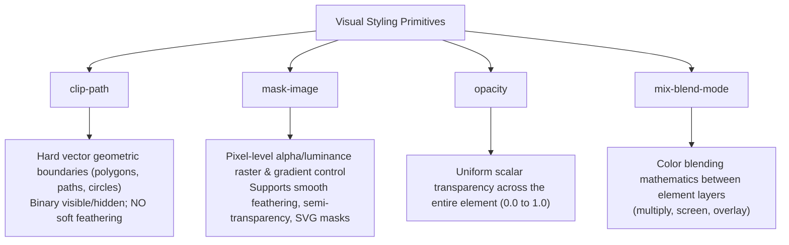

# 048: CSS Basic Mask (`mask-image`) Masterclass

## Overview & Executive Summary

In digital graphics and modern CSS architecture, **masking** is the process of using an image, gradient, or vector shape to selectively determine the visible opacity of an element. Rather than showing or hiding elements abruptly with hard rectangular bounding boxes, CSS masking allows developers to sculpt soft alpha gradients, punch holes, construct feathering vignettes, create dynamic multi-colored icon systems, and build intricate composited visual effects directly in declarative CSS.

The core of this capability is the `mask-image` property (and its vendor-prefixed twin `-webkit-mask-image`), standardized in the [W3C CSS Masking Module Level 1](https://www.w3.org/TR/css-masking-1/).

```
+-------------------------------------------------------------------------------+
| The Fundamental CSS Masking Formula:                                          |
|                                                                               |
|   [ Source Element ]  +  [ Mask Layer (Alpha / Luminance) ]                   |
|           │                           │                                       |
|           ▼                           ▼                                       |
|    (Text, Image, Box)     (Gradient, SVG, PNG)                                |
|           │                           │                                       |
|           └──────────────┬────────────┘                                       |
|                          │                                                    |
|                          ▼                                                    |
|            [ Rendered Output with Pixel Opacity ]                             |
+-------------------------------------------------------------------------------+
```

---

## Quick Reference Metadata

| Attribute | Specification Details |
| :--- | :--- |
| **Name** | Basic Mask (`mask-image`) |
| **Category** | Visual Effects, Compositing & Graphical Styling |
| **Difficulty** | Intermediate (3/5) |
| **What it produces** | Pixel-level alpha or luminance transparency control over any DOM element, supporting smooth gradient feathering, punch-out cutouts, dynamic shape masking, and non-destructive image compositing. |
| **Why it works** | The browser calculates the alpha channel (or luminance) of the mask image at every pixel coordinate and multiplies it with the source element's color buffer before final screen composition. |
| **Key Properties** | `mask-image`, `-webkit-mask-image`, `mask-size`, `mask-position`, `mask-repeat`, `mask-mode`, `mask-origin`, `mask-clip`, `mask-composite`. |
| **Browser Baseline** | Standard syntax supported in all evergreen browsers. However, **the `-webkit-` prefix remains mandatory** across Chromium, Safari, and WebKit-based engines for total production safety. |
| **Acceptance Criteria** | Element exhibits transparent or feathered boundaries matching the mask shape; underlying page backgrounds show through transparent mask regions; text remains selectable; screen readers retain full DOM access. |

### Quick Preview

```html
<div class="faded-scroll-card">
  <p>This content gradually fades out into transparency near the bottom edge...</p>
</div>
```

```css
.faded-scroll-card {
  /* Standard & WebKit prefixed declarations for universal support */
  -webkit-mask-image: linear-gradient(to bottom, black 70%, transparent 100%);
  mask-image: linear-gradient(to bottom, black 70%, transparent 100%);
  -webkit-mask-repeat: no-repeat;
  mask-repeat: no-repeat;
  -webkit-mask-size: 100% 100%;
  mask-size: 100% 100%;
}
```

---

## 1. Anatomy & Mental Model of CSS Masking

### 1.1 How the Compositing Engine Calculates Visibility

When the browser renders an element with a mask, it performs pixel-by-pixel compositing:

```
┌───────────────────────────┐      ┌───────────────────────────┐
│     Source Element        │      │        Mask Image         │
│  (Image, Text, Card, UI)  │  ✖   │ (Gradient, PNG Alpha, SVG)│
│                           │      │                           │
│  RGBA: (r, g, b, 1.0)     │      │  Alpha: 1.0 ──────> 0.0   │
└─────────────┬─────────────┘      └─────────────┬─────────────┘
              │                                  │
              └────────────────┬─────────────────┘
                               │
                               ▼
              ┌──────────────────────────────────┐
              │         Rendered Output          │
              │  Pixel Color: (r, g, b)          │
              │  Final Alpha: Source_A * Mask_A  │
              │  Visible ──────────> Transparent │
              └──────────────────────────────────┘
```

1. **Fully Opaque Mask Pixel ($\alpha = 1.0$)**: The source element is rendered at $100\%$ of its normal opacity.
2. **Partially Transparent Mask Pixel ($0.0 < \alpha < 1.0$)**: The source element is rendered at matching intermediate translucency.
3. **Fully Transparent Mask Pixel ($\alpha = 0.0$)**: The source element is completely invisible at that coordinate, letting background content show through.

> [!NOTE]
> In CSS alpha masking (the default for `mask-image`), **the color of the mask image does not matter**. `black`, `white`, `red`, or `#00ffcc` all produce identical $100\%$ visibility because their alpha channel is $1.0$. Only the **alpha transparency** (`transparent` vs `rgba(..., 1.0)`) or luminance (when `mask-mode: luminance` is set) dictates opacity.

---

### 1.2 Alpha Masking vs. Luminance Masking

The CSS Masking specification defines two modes of operation controlled by `mask-mode`:

```
┌─────────────────────────────────────────────────────────────────────────────┐
│                          1. ALPHA MASKING (Default)                         │
│                                                                             │
│   Alpha Channel Value:       0.0 (Transparent) ────────> 1.0 (Opaque)       │
│   Resulting Element Opacity: 0% Invisible     ────────> 100% Visible       │
│   (Color/RGB values are ignored; only transparency matters)                 │
└─────────────────────────────────────────────────────────────────────────────┘

┌─────────────────────────────────────────────────────────────────────────────┐
│                         2. LUMINANCE MASKING (SVG Style)                    │
│                                                                             │
│   Luminance (Brightness):    Black (#000) ──── Gray (#888) ────> White (#fff)│
│   Resulting Element Opacity: 0% Invisible ──── 50% Translucent ─> 100% Opaque │
│   Formula: Y = 0.2126*R + 0.7152*G + 0.0722*B                              │
└─────────────────────────────────────────────────────────────────────────────┘
```

| Feature | Alpha Masking (`mask-mode: alpha`) | Luminance Masking (`mask-mode: luminance`) |
| :--- | :--- | :--- |
| **Determining Factor** | Pixel alpha channel ($\alpha$) | Pixel brightness / luminance ($Y$) |
| **Default in CSS** | Standard default for raster images and CSS gradients | Default when referencing inline SVG `<mask>` tags |
| **Full Visibility** | Any color with `alpha = 1.0` (e.g., `black`, `#fff`) | Pure white (`#ffffff`) |
| **Full Invisibility** | `transparent` (`alpha = 0.0`) | Pure black (`#000000`) |
| **Typical Use Cases** | CSS Linear/Radial gradients, transparent PNGs, WebP | SVG `<mask id="...">` definitions, grayscale maps |

---

### 1.3 Masking vs. Clipping vs. Opacity vs. Blending

To write clean architecture, you must distinguish between four related visual properties:



| Dimension | `mask-image` | `clip-path` | `opacity` | `mix-blend-mode` |
| :--- | :--- | :--- | :--- | :--- |
| **Edge Quality** | Soft, anti-aliased, feathered, or hard | Sharp, binary vector boundary | Uniform across element | Blended color interaction |
| **Transparency Gradient** | Yes (0% to 100% continuous) | No (Strictly inside or outside) | No (Global uniform constant) | No (Alters color math) |
| **Input Types** | Gradients, PNG, SVG, Canvas, URLs | Basic shapes (`circle()`, `polygon()`, `path()`) | Number (`0` to `1`) | Blend mode keyword |
| **Hit-Testing / Clicks** | Transparent pixels still capture clicks* | Clipped areas pass clicks through | Clicks captured if $> 0$ | Clicks captured |
| **GPU Cost** | Moderate (Off-screen alpha buffer) | Low (Geometric stencil) | Very Low (Global layer alpha) | Moderate to High |

*\*Note on hit-testing: By default, masked transparent areas still intercept pointer events. If you need clicks to pass through cutouts, pair with `pointer-events: none` on child layers or combine with `clip-path`.*

---

## 2. The Complete CSS Mask Property Ecosystem

The `mask` property is a shorthand that expands into several sub-properties, paralleling the `background` property family:

```
┌─────────────────────────────────────────────────────────────────────────────┐
│                      THE CSS MASK PROPERTY FAMILY                           │
│                                                                             │
│   mask-image       ──> Defines the source image, gradient, or SVG URL       │
│   mask-size        ──> Sizing dimensions (cover, contain, 100% 100%, px)    │
│   mask-position    ──> Spatial coordinates (center, top left, 50% 50%)      │
│   mask-repeat      ──> Tiling behavior (no-repeat, repeat, space, round)    │
│   mask-origin      ──> Reference geometry box (border-box, padding-box)     │
│   mask-clip        ──> Clipping boundary box (border-box, content-box)      │
│   mask-mode        ──> Interpretation mode (alpha, luminance, match-source) │
│   mask-composite   ──> Boolean compositing between multiple mask layers     │
└─────────────────────────────────────────────────────────────────────────────┘
```

### 2.1 `mask-image` (and `-webkit-mask-image`)

Accepts gradients, URLs to raster files (PNG, WebP), SVG data URIs, or SVG element references.

```css
/* 1. CSS Gradients */
mask-image: linear-gradient(to right, black, transparent);
mask-image: radial-gradient(circle at center, black 40%, transparent 80%);
mask-image: conic-gradient(from 0deg, black 0deg 180deg, transparent 180deg 360deg);

/* 2. External Raster / Vector Assets */
mask-image: url("/assets/masks/grunge-brush.png");
mask-image: url("/assets/masks/hexagon-grid.svg");

/* 3. Inline SVG Data URI */
mask-image: url("data:image/svg+xml,%3Csvg xmlns='http://www.w3.org/2000/svg' viewBox='0 0 24 24'%3E%3Ccircle cx='12' cy='12' r='10' fill='black'/%3E%3C/svg%3E");

/* 4. SVG Element Reference (Luminance mask defined in DOM) */
mask-image: url("#hero-vector-mask");

/* 5. Multiple Layers (Composited) */
mask-image: 
  radial-gradient(circle at center, black 50%, transparent 70%),
  linear-gradient(to bottom, black 80%, transparent 100%);
```

---

### 2.2 `mask-size`

Controls how the mask image is scaled relative to the element's mask positioning area.

```css
/* Keywords */
mask-size: cover;     /* Scales image to completely cover the element box */
mask-size: contain;   /* Scales image to fit completely within the box */
mask-size: auto;      /* Retains intrinsic dimensions */

/* Explicit dimensions */
mask-size: 100% 100%; /* Stretches to fill exact width and height */
mask-size: 50% auto;  /* 50% container width, height proportional */
mask-size: 32px 32px; /* Fixed square tile */
```

---

### 2.3 `mask-position`

Positions the mask image origin within the element's box coordinates.

```css
mask-position: center;
mask-position: top right;
mask-position: 50% 50%;
mask-position: 10px 20px;
```

---

### 2.4 `mask-repeat`

Controls whether the mask repeats across the element surface.

```css
mask-repeat: no-repeat;  /* Single instance (most common for vignettes/fades) */
mask-repeat: repeat;     /* Tiles horizontally and vertically */
mask-repeat: repeat-x;   /* Horizontal striping */
mask-repeat: space;      /* Tiles evenly spaced without clipping */
mask-repeat: round;      /* Rescales tiles to fit whole number of repetitions */
```

---

### 2.5 `mask-origin` & `mask-clip`

* **`mask-origin`**: Dictates the coordinate box that `mask-position` is calculated relative to.
* **`mask-clip`**: Determines which box area is painted by the mask.

Options for both: `border-box` (default), `padding-box`, `content-box`, `fill-box`, `stroke-box`, `view-box`.

```css
.card {
  border: 4px solid red;
  padding: 20px;
  mask-origin: content-box; /* Origin starts inside the padding */
  mask-clip: content-box;   /* Mask does not paint over border or padding */
}
```

---

### 2.6 `mask-composite`

When applying multiple mask layers, `mask-composite` defines how they blend together algebraically.

```
Layer 1 (Circle)         Layer 2 (Square)        Resulting Composite Shape
   ┌───────┐                ┌───────┐
   │  ●●●  │        +       │ ■■■■■ │        ──────> [ Depends on Mode ]
   │  ●●●  │                │ ■■■■■ │
   └───────┘                └───────┘
```

Standard W3C Values:
* `add`: Union of both masks (default).
* `subtract`: Subtracts the lower layer from the upper layer.
* `intersect`: Only pixels covered by both masks are visible.
* `exclude`: Pixels covered by only one mask are visible (XOR).

> [!WARNING]
> **WebKit Legacy Compositing Difference**: WebKit browsers traditionally implemented non-standard composite keywords: `source-over`, `source-in`, `source-out`, `destination-over`, `destination-in`, `xor`. When utilizing multi-layer mask compositing, test thoroughly across Blink and Gecko.

---

### 2.7 The `mask` Shorthand

The `mask` property allows writing all attributes in a single declaration:

```css
/* Syntax: <mask-image> <mask-position> / <mask-size> <mask-repeat> <mask-origin> <mask-clip> */
.element {
  -webkit-mask: linear-gradient(to bottom, black 80%, transparent) top left / 100% 100% no-repeat border-box;
  mask: linear-gradient(to bottom, black 80%, transparent) top left / 100% 100% no-repeat border-box;
}
```

---

## 3. The Cross-Browser Prefix Matrix

Although CSS Masking Level 1 is widely implemented, browser rendering engines have a split history:

| Browser / Engine | `mask-image` (Standard) | `-webkit-mask-image` (Prefixed) | Production Rule |
| :--- | :--- | :--- | :--- |
| **Google Chrome / Chromium** | Supported (v120+) | Fully supported | **Declare both** |
| **Apple Safari / WebKit** | Supported (v15.4+) | Fully supported | **Declare both** |
| **Mozilla Firefox / Gecko** | Fully supported (v53+) | Supported as alias | **Standard supported** |
| **Microsoft Edge** | Supported (v120+) | Fully supported | **Declare both** |
| **Mobile Browsers (iOS/Android)**| Partial / Prefixed required | Fully supported | **Prefixed is critical** |

### The Golden Rule for Masking in Production

Always write the vendor-prefixed property **first**, followed immediately by the standard property:

```css
/* The Canonical Bulletproof Boilerplate */
.masked-target {
  -webkit-mask-image: linear-gradient(180deg, #000 0%, transparent 100%);
  mask-image: linear-gradient(180deg, #000 0%, transparent 100%);
  -webkit-mask-size: 100% 100%;
  mask-size: 100% 100%;
  -webkit-mask-repeat: no-repeat;
  mask-repeat: no-repeat;
  -webkit-mask-position: center;
  mask-position: center;
}
```

---

## 4. Practical Implementation Patterns & Techniques

---

### Pattern 1: The Scroll Container Fade-Out (Overflow Vignette)

#### Problem
In scrollable lists or truncated content cards, text cuts off abruptly at the container boundary with a harsh edge. Traditional overlay `<div>` elements with gradient backgrounds break when the parent background is complex, animated, or translucent.

#### Masking Solution
Apply a linear gradient mask along the vertical axis directly to the scroll container. The bottom edge dissolves into true alpha transparency regardless of what background sits behind the container.

```
┌─────────────────────────────────────────────────────────────┐
│ 1. Autonomous Agent Initialization Pipeline                 │
│    Verifying cryptographic workspace handshake...           │
│                                                             │
│ 2. Subagent Fleet Orchestration Module                      │
│    Dispatching 8 concurrent worker routines...              │
│                                                             │
│ 3. Memory Consolidation Daemon                              │
│ ░░░ Indexing vector embeddings across cached transcr... ░░░ │ <── Soft Fade
└─ ░░░░░░░░░░░░░░░░░░░░░░░░░░░░░░░░░░░░░░░░░░░░░░░░░░░░░░░░░░ ─┘ <── 100% Alpha
```

#### HTML
```html
<div class="terminal-log-container">
  <ul class="log-list">
    <li class="log-entry">[09:42:01] System booted kernel v6.14.0</li>
    <li class="log-entry">[09:42:02] Establishing WebSocket connection...</li>
    <li class="log-entry">[09:42:03] SSL handshake verified: TLS 1.3 AES-256-GCM</li>
    <li class="log-entry">[09:42:05] Synchronizing state with distributed ledger</li>
    <li class="log-entry">[09:42:08] Memory buffer initialized at 0x7FFF8A4C</li>
    <li class="log-entry">[09:42:11] Background telemetry active: 60Hz polling</li>
    <li class="log-entry">[09:42:14] Processing queue: 142 items remaining</li>
  </ul>
</div>
```

#### CSS
```css
.terminal-log-container {
  max-height: 180px;
  overflow-y: auto;
  padding: 1.25rem;
  background: #0d1117;
  border: 1px solid #30363d;
  border-radius: 10px;

  /* Linear gradient mask creating a 30px fade at the top and bottom */
  -webkit-mask-image: linear-gradient(
    to bottom,
    transparent 0px,
    black 28px,
    black calc(100% - 36px),
    transparent 100%
  );
  mask-image: linear-gradient(
    to bottom,
    transparent 0px,
    black 28px,
    black calc(100% - 36px),
    transparent 100%
  );
}

.log-list {
  list-style: none;
  margin: 0;
  padding: 0;
  display: flex;
  flex-direction: column;
  gap: 0.5rem;
  font-family: ui-monospace, SFMono-Regular, Menlo, Monaco, Consolas, monospace;
  font-size: 0.875rem;
  color: #58a6ff;
}
```

#### Mechanical Breakdown
1. `transparent 0px` to `black 28px`: Gradually introduces top content from 0% to 100% opacity, providing a smooth entry when scrolling.
2. `black 28px` to `black calc(100% - 36px)`: The central viewing window maintains uninterrupted 100% opacity.
3. `black calc(100% - 36px)` to `transparent 100%`: Content gracefully fades to 0% opacity at the container foot.
4. If background colors or themes change dynamically, the fade remains flawless because it operates on the **alpha channel** of the elements rather than painting an opaque color swatch over them.

---

### Pattern 2: Spotlight / Radial Vignette Hover on Media

#### Problem
Hover effects typically rely on uniform opacity adjustments, box-shadows, or color filters. Creating a dynamic radial flashlight or soft spotlight focus requires complex pseudo-elements and blend-modes that can interfere with layout flow.

#### Masking Solution
Use a radial gradient `mask-image` with dynamic CSS Custom Properties for spotlight size and position.

```
┌─────────────────────────────────────────────────────────────┐
│ ░░░░░░░░░░░░░░░░░░░░░░░░░░░░░░░░░░░░░░░░░░░░░░░░░░░░░░░░░░░ │
│ ░░░░░░░░░░░░░░░░░░░░░░░░░░░░░░░░░░░░░░░░░░░░░░░░░░░░░░░░░░░ │
│ ░░░░░░░░░░░░░░░░░┌─────────────────┐░░░░░░░░░░░░░░░░░░░░░░░ │
│ ░░░░░░░░░░░░░░░░ │  FOCUSED IMAGE  │ ░░░░░░░░░░░░░░░░░░░░░░ │ <── Radial Focus
│ ░░░░░░░░░░░░░░░░ │ (Opaque Center) │ ░░░░░░░░░░░░░░░░░░░░░░ │     (Alpha 1.0)
│ ░░░░░░░░░░░░░░░░░└─────────────────┘░░░░░░░░░░░░░░░░░░░░░░░ │
│ ░░░░░░░░░░░░░░░░░░░░░░░░░░░░░░░░░░░░░░░░░░░░░░░░░░░░░░░░░░░ │ <── Feathered Edge
│ ░░░░░░░░░░░░░░░░░░░░░░░░░░░░░░░░░░░░░░░░░░░░░░░░░░░░░░░░░░░ │     (Alpha 0.0)
└─────────────────────────────────────────────────────────────┘
```

#### HTML
```html
<figure class="spotlight-frame">
  
  <figcaption class="spotlight-caption">Luminescent Architecture 04</figcaption>
</figure>
```

#### CSS
```css
.spotlight-frame {
  position: relative;
  width: 100%;
  max-width: 520px;
  margin: 0 auto;
  border-radius: 16px;
  overflow: hidden;
  background: #090d16;
}

.spotlight-image {
  width: 100%;
  aspect-ratio: 16 / 9;
  object-fit: cover;
  display: block;
  transition: -webkit-mask-size 0.4s ease, mask-size 0.4s ease;

  /* Center spotlight mask */
  -webkit-mask-image: radial-gradient(
    circle at center,
    black 30%,
    rgba(0, 0, 0, 0.4) 60%,
    transparent 80%
  );
  mask-image: radial-gradient(
    circle at center,
    black 30%,
    rgba(0, 0, 0, 0.4) 60%,
    transparent 80%
  );
  -webkit-mask-size: 120% 120%;
  mask-size: 120% 120%;
  -webkit-mask-position: center;
  mask-position: center;
  -webkit-mask-repeat: no-repeat;
  mask-repeat: no-repeat;
}

/* Expand the spotlight on hover */
.spotlight-frame:hover .spotlight-image {
  -webkit-mask-size: 220% 220%;
  mask-size: 220% 220%;
}

.spotlight-caption {
  position: absolute;
  bottom: 1rem;
  left: 1rem;
  font-size: 0.85rem;
  font-weight: 600;
  letter-spacing: 0.05em;
  text-transform: uppercase;
  color: #f0f6fc;
}
```

---

### Pattern 3: Dynamic Theme-Colorable SVG Icon System

#### Problem
Using external SVG files via standard `` tags (``) prevents developers from styling `fill` or `stroke` using CSS tokens (`color: var(--primary)` or `currentColor`). Inlining raw SVG XML directly into HTML bloats markup and complicates component templates.

#### Masking Solution
Turn any element (`<span>` or `<div>`) into a single-color icon by loading the SVG as a `mask-image` and styling the element's `background-color` with CSS `currentColor` or design tokens.

```
┌─────────────────────────────────────────────────────────────┐
│ 1. Element Background Color: background-color: #3b82f6       │
│    (Provides the dynamic theme color)                       │
│                           +                                 │
│ 2. Mask Image: -webkit-mask-image: url('shield-icon.svg')   │
│    (Carves out the SVG geometry)                            │
│                           =                                 │
│ 3. Flawless Vector Icon that responds to CSS color tokens!  │
└─────────────────────────────────────────────────────────────┘
```

#### HTML
```html
<div class="action-bar">
  <button class="btn btn-primary">
    <i class="icon-mask icon-shield" aria-hidden="true"></i>
    <span>Security Audit</span>
  </button>
  <button class="btn btn-secondary">
    <i class="icon-mask icon-bolt" aria-hidden="true"></i>
    <span>Fast Deploy</span>
  </button>
  <button class="btn btn-accent">
    <i class="icon-mask icon-sparkle" aria-hidden="true"></i>
    <span>AI Analysis</span>
  </button>
</div>
```

#### CSS
```css
/* Base mask icon utility */
.icon-mask {
  display: inline-block;
  width: 1.25rem;
  height: 1.25rem;
  background-color: currentColor; /* Inherits button text color */
  -webkit-mask-size: contain;
  mask-size: contain;
  -webkit-mask-repeat: no-repeat;
  mask-repeat: no-repeat;
  -webkit-mask-position: center;
  mask-position: center;
  vertical-align: middle;
}

/* Specific SVG Mask Definitions via Data URIs */
.icon-shield {
  -webkit-mask-image: url("data:image/svg+xml,%3Csvg xmlns='http://www.w3.org/2000/svg' viewBox='0 0 24 24' fill='none' stroke='black' stroke-width='2' stroke-linecap='round' stroke-linejoin='round'%3E%3Cpath d='M12 22s8-4 8-10V5l-8-3-8 3v7c0 6 8 10 8 10z'/%3E%3C/svg%3E");
  mask-image: url("data:image/svg+xml,%3Csvg xmlns='http://www.w3.org/2000/svg' viewBox='0 0 24 24' fill='none' stroke='black' stroke-width='2' stroke-linecap='round' stroke-linejoin='round'%3E%3Cpath d='M12 22s8-4 8-10V5l-8-3-8 3v7c0 6 8 10 8 10z'/%3E%3C/svg%3E");
}

.icon-bolt {
  -webkit-mask-image: url("data:image/svg+xml,%3Csvg xmlns='http://www.w3.org/2000/svg' viewBox='0 0 24 24' fill='none' stroke='black' stroke-width='2' stroke-linecap='round' stroke-linejoin='round'%3E%3Cpolygon points='13 2 3 14 12 14 11 22 21 10 12 10 13 2'/%3E%3C/svg%3E");
  mask-image: url("data:image/svg+xml,%3Csvg xmlns='http://www.w3.org/2000/svg' viewBox='0 0 24 24' fill='none' stroke='black' stroke-width='2' stroke-linecap='round' stroke-linejoin='round'%3E%3Cpolygon points='13 2 3 14 12 14 11 22 21 10 12 10 13 2'/%3E%3C/svg%3E");
}

.icon-sparkle {
  -webkit-mask-image: url("data:image/svg+xml,%3Csvg xmlns='http://www.w3.org/2000/svg' viewBox='0 0 24 24' fill='none' stroke='black' stroke-width='2' stroke-linecap='round' stroke-linejoin='round'%3E%3Cpath d='m12 3-1.9 5.8a2 2 0 0 1-1.3 1.3L3 12l5.8 1.9a2 2 0 0 1 1.3 1.3L12 21l1.9-5.8a2 2 0 0 1 1.3-1.3L21 12l-5.8-1.9a2 2 0 0 1-1.3-1.3Z'/%3E%3C/svg%3E");
  mask-image: url("data:image/svg+xml,%3Csvg xmlns='http://www.w3.org/2000/svg' viewBox='0 0 24 24' fill='none' stroke='black' stroke-width='2' stroke-linecap='round' stroke-linejoin='round'%3E%3Cpath d='m12 3-1.9 5.8a2 2 0 0 1-1.3 1.3L3 12l5.8 1.9a2 2 0 0 1 1.3 1.3L12 21l1.9-5.8a2 2 0 0 1 1.3-1.3L21 12l-5.8-1.9a2 2 0 0 1-1.3-1.3Z'/%3E%3C/svg%3E");
}

/* Button variants */
.action-bar {
  display: flex;
  gap: 1rem;
  flex-wrap: wrap;
}

.btn {
  display: inline-flex;
  align-items: center;
  gap: 0.5rem;
  padding: 0.65rem 1.25rem;
  border-radius: 8px;
  font-weight: 600;
  font-size: 0.9rem;
  cursor: pointer;
  border: 1px solid transparent;
  transition: all 0.2s ease;
}

.btn-primary   { background: #1f6feb; color: #ffffff; }
.btn-primary:hover { background: #388bfd; }

.btn-secondary { background: #21262d; color: #c9d1d9; border-color: #30363d; }
.btn-secondary:hover { background: #30363d; color: #ffffff; }

.btn-accent    { background: #8957e5; color: #ffffff; }
.btn-accent:hover { background: #a371f7; }
```

---

### Pattern 4: Diagonal Hero Section with Soft Feathered Edge

#### Problem
Geometric `clip-path: polygon(...)` produces rigid, jagged diagonal slashes across hero graphics that can look harsh on high-resolution displays. When you want a diagonal slant with a 15px feathered transition into the content section, `clip-path` cannot accomplish it.

#### Masking Solution
Combine an angled `linear-gradient` with precise alpha stop-distances to achieve an anti-aliased, softly feathered diagonal divider.

```
┌─────────────────────────────────────────────────────────────┐
│ Hero Photography / Interactive Canvas Graphics             │
│                                                             │
│ ╲                                                           │
│  ╲                                                          │
│   ╲ ░░░░░░░░░░░░░░░░░░░░░░░░░░░░░░░░░░░░░░░░░░░░░░░░░░░░░░░ │ <── 15px Feathered
│    ╲                                                        │     Transition Zone
│     ╲ 00000000000000000000000000000000000000000000000000000 │ <── 100% Transparent
└─────────────────────────────────────────────────────────────┘
```

#### HTML
```html
<section class="hero-diagonal">
  <div class="hero-media-wrapper">
    
  </div>
  <div class="hero-content">
    <h1>Autonomous Firmware Kernel</h1>
    <p>Real-time microcode synthesis with zero cold-start latency.</p>
  </div>
</section>
```

#### CSS
```css
.hero-diagonal {
  position: relative;
  background: #0d1117;
  padding-bottom: 4rem;
}

.hero-media-wrapper {
  width: 100%;
  height: 380px;
  overflow: hidden;

  /* Angled gradient mask: 172 degrees creates an 8-degree subtle slant */
  -webkit-mask-image: linear-gradient(
    172deg,
    black 75%,
    rgba(0, 0, 0, 0.4) 88%,
    transparent 96%
  );
  mask-image: linear-gradient(
    172deg,
    black 75%,
    rgba(0, 0, 0, 0.4) 88%,
    transparent 96%
  );
}

.hero-media {
  width: 100%;
  height: 100%;
  object-fit: cover;
}

.hero-content {
  max-width: 800px;
  margin: -3rem auto 0 auto;
  position: relative;
  z-index: 2;
  padding: 0 1.5rem;
}

.hero-content h1 {
  font-size: clamp(1.8rem, 4vw, 2.75rem);
  font-weight: 800;
  color: #ffffff;
}

.hero-content p {
  color: #8b949e;
  font-size: 1.1rem;
}
```

---

### Pattern 5: Multi-Layer Mask Compositing (Punch-Hole Cutout)

#### Problem
You have an image banner and want to cut a circular "punch-out" hole in the center (to reveal background graphics or an animated pulse) while simultaneously fading the outer edges to black/transparent.

#### Masking Solution
Declare two gradient layers on `mask-image` and combine them using `mask-composite: subtract` (or `mask-composite: intersect`).

```
Layer 1: Base Linear Fade         Layer 2: Center Circle Inverted      Resulting Composite
┌───────────────────────────┐     ┌───────────────────────────┐     ┌───────────────────────────┐
│ ■■■■■■■■■■■■■■■■■■■■■■■■■ │     │ ■■■■■■■■■■■■■■■■■■■■■■■■■ │     │ ■■■■■■■■■■■■■■■■■■■■■■■■■ │
│ ■■■■■■■■■■■■■■■■■■■■■■■■■ │  -  │ ■■■■■■  ░░░░░  ■■■■■■■ │  =  │ ■■■■■■  [HOLE] ■■■■■■■ │
│ ░░░░░░░░░░░░░░░░░░░░░░░░░ │     │ ■■■■■■■■■■■■■■■■■■■■■■■■■ │     │ ░░░░░░░░░░░░░░░░░░░░░░░░░ │
└───────────────────────────┘     └───────────────────────────┘     └───────────────────────────┘
```

#### HTML
```html
<div class="composite-stage">
  <div class="background-mesh"></div>
  <div class="composited-card">
    <div class="card-inner-surface">
      <h3>Multi-Layer Composited Mask</h3>
      <p>The center circle is punched through with negative alpha while the bottom edge softly dissolves.</p>
    </div>
  </div>
</div>
```

#### CSS
```css
.composite-stage {
  position: relative;
  min-height: 240px;
  background: radial-gradient(circle at 50% 50%, #4f46e5 0%, #0f172a 100%);
  display: grid;
  place-items: center;
  padding: 2rem;
  border-radius: 16px;
  overflow: hidden;
}

.composited-card {
  width: 100%;
  max-width: 440px;
  background: linear-gradient(135deg, #1e293b, #0f172a);
  border: 1px solid rgba(255, 255, 255, 0.15);
  border-radius: 12px;
  padding: 2rem;
  color: #ffffff;

  /* Layer 1: Linear fade down. Layer 2: Radial circle cutout */
  -webkit-mask-image: 
    linear-gradient(to bottom, black 60%, transparent 100%),
    radial-gradient(circle at center, transparent 35px, black 36px);
  mask-image: 
    linear-gradient(to bottom, black 60%, transparent 100%),
    radial-gradient(circle at center, transparent 35px, black 36px);

  /* WebKit composite */
  -webkit-mask-composite: source-in;
  /* Standard W3C composite */
  mask-composite: intersect;
}

.card-inner-surface h3 {
  margin-top: 0;
  font-size: 1.2rem;
  color: #60a5fa;
}

.card-inner-surface p {
  font-size: 0.9rem;
  line-height: 1.5;
  color: #cbd5e1;
}
```

---

## 5. Gotchas, Performance & Edge Cases

### 5.1 Hit-Testing & Pointer Events Trap
* **The Trap:** When you mask an element such that half of it is completely invisible (`transparent`), users expect clicking on that invisible region to interact with the buttons or links underneath.
* **The Reality:** The DOM element's physical box model is unchanged. The transparent pixels will **still intercept pointer clicks** and hover events, blocking elements underneath.
* **The Solution:** If the masked element is purely decorative (like a vignette overlay), assign `pointer-events: none`. If it contains interactive child controls, pair with CSS `clip-path` for true geometry exclusion.

---

### 5.2 GPU Compositing & Memory Allocation
* **Offscreen Buffer Allocation:** When `mask-image` is applied, the browser compositor cannot paint the element directly into the parent frame. It must allocate an offscreen rendering surface (layer buffer), render the element, render the mask, multiply their pixel buffers, and blit the result back onto the screen.
* **Performance Rule:** Avoid animating `mask-image` gradient values (e.g. changing color stop percentages at 60 FPS in JavaScript) on massive 4K full-viewport images, as this triggers software rasterization recalculations on every frame.
* **Optimization:** Animate `transform` or `mask-position` / `mask-size` rather than regenerating gradient strings on `requestAnimationFrame`.

---

### 5.3 Subpixel Gradient Banding & Aliasing Fixes
When defining hard mask edges with gradients, setting zero-distance color stops (`black 50%, transparent 50%`) produces jagged stair-stepped pixels (aliasing) on standard DPI screens.

```css
/* BAD: Creates jagged aliased edge */
mask-image: linear-gradient(to right, black 50%, transparent 50%);

/* GOOD: 0.5px to 1px micro-interpolation provides crisp anti-aliasing */
mask-image: linear-gradient(to right, black calc(50% - 0.5px), transparent calc(50% + 0.5px));
```

---

### 5.4 Scrollbars Inside Masked Containers
If you apply a gradient `mask-image` to an element with `overflow-y: scroll`, the **scrollbar itself will also fade into transparency** at the top and bottom edges.
* If you want the scrollbar to remain fully opaque, apply the `mask-image` to an inner wrapper `<div>` rather than the outer scrolling element.

---

## 6. Accessibility & SEO Guidelines

```
┌─────────────────────────────────────────────────────────────────────────────┐
│                      ACCESSIBILITY & USABILITY CHECKLIST                    │
│                                                                             │
│   [✓] WCAG Contrast: Ensure text fading maintains 4.5:1 ratio over content  │
│   [✓] Screen Readers: Masking does NOT hide text from assistive technology  │
│   [✓] Focus Rings: Ensure :focus-visible outlines are not clipped by masks  │
│   [✓] Print Styles: Disable complex masks in @media print                   │
└─────────────────────────────────────────────────────────────────────────────┘
```

1. **Text Contrast (WCAG 2.1 AA / AAA):** When text fades to transparent via `mask-image`, the calculated contrast against the background continuously drops. Critical instructions or call-to-action text must not be placed within the faded feathering threshold.
2. **Screen Reader DOM Parity:** `mask-image` is a purely visual presentation rule. It does **not** hide content from screen readers (unlike `display: none` or `visibility: hidden`). If content is visually masked out and should not be read, use `aria-hidden="true"` or semantic DOM updates.
3. **Focus States (`:focus-visible`):** If an interactive button inside a masked container gains keyboard focus, ensure its focus outline is not clipped or rendered invisible by mask bounds.
4. **Print Optimization:** Print engines frequently struggle with alpha mask buffers. Include a reset in your print stylesheet:
   ```css
   @media print {
     * {
       -webkit-mask-image: none !important;
       mask-image: none !important;
     }
   }
   ```

---

## 7. Complete Interactive Demonstration Playground

Below is a complete, self-contained, production-grade HTML page demonstrating dynamic mask switching, scroll vignettes, SVG mask icons, and interactive spotlight tracker controls.

```html
<!DOCTYPE html>
<html lang="en">
<head>
  <meta charset="UTF-8" />
  <meta name="viewport" content="width=device-width, initial-scale=1.0" />
  <title>CSS mask-image Interactive Masterclass</title>
  <link rel="preconnect" href="https://fonts.googleapis.com" />
  <link rel="preconnect" href="https://fonts.gstatic.com" crossorigin />
  <link href="https://fonts.googleapis.com/css2?family=Outfit:wght@400;500;600;700;800&family=JetBrains+Mono:wght@400;500;700&display=swap" rel="stylesheet" />

  <style>
    :root {
      --bg-dark: #090d16;
      --surface-card: #111726;
      --surface-border: #1f293d;
      --accent-cyan: #00f2fe;
      --accent-blue: #4facfe;
      --accent-purple: #8957e5;
      --text-main: #f0f6fc;
      --text-muted: #8b949e;
    }

    * {
      box-sizing: border-box;
      margin: 0;
      padding: 0;
    }

    body {
      background-color: var(--bg-dark);
      color: var(--text-main);
      font-family: 'Outfit', -apple-system, BlinkMacSystemFont, sans-serif;
      line-height: 1.6;
      padding: 2.5rem 1rem;
      min-height: 100vh;
    }

    .container {
      max-width: 1080px;
      margin: 0 auto;
    }

    header {
      text-align: center;
      margin-bottom: 3.5rem;
    }

    .badge {
      display: inline-block;
      padding: 0.35rem 0.85rem;
      background: rgba(79, 172, 254, 0.12);
      border: 1px solid rgba(79, 172, 254, 0.3);
      border-radius: 9999px;
      color: var(--accent-cyan);
      font-size: 0.8rem;
      font-weight: 700;
      letter-spacing: 0.08em;
      text-transform: uppercase;
      margin-bottom: 1rem;
    }

    h1 {
      font-size: clamp(2rem, 5vw, 3rem);
      font-weight: 800;
      background: linear-gradient(135deg, #ffffff 30%, var(--accent-cyan) 100%);
      -webkit-background-clip: text;
      -webkit-text-fill-color: transparent;
      margin-bottom: 0.75rem;
    }

    p.subtitle {
      color: var(--text-muted);
      font-size: 1.1rem;
      max-width: 600px;
      margin: 0 auto;
    }

    .demo-grid {
      display: grid;
      grid-template-columns: repeat(auto-fit, minmax(320px, 1fr));
      gap: 2rem;
      margin-bottom: 3rem;
    }

    .demo-card {
      background: var(--surface-card);
      border: 1px solid var(--surface-border);
      border-radius: 16px;
      padding: 1.75rem;
      display: flex;
      flex-direction: column;
      gap: 1.25rem;
      box-shadow: 0 10px 30px rgba(0, 0, 0, 0.3);
    }

    .demo-card h2 {
      font-size: 1.25rem;
      color: #ffffff;
      display: flex;
      align-items: center;
      gap: 0.5rem;
    }

    .demo-card p.card-desc {
      font-size: 0.9rem;
      color: var(--text-muted);
      margin-top: -0.5rem;
    }

    /* Demo 1: Interactive Live Mask Switcher */
    .mask-target-preview {
      width: 100%;
      height: 200px;
      border-radius: 12px;
      background: linear-gradient(135deg, #ff0844 0%, #ffb199 100%);
      display: grid;
      place-items: center;
      color: #ffffff;
      font-weight: 800;
      font-size: 1.25rem;
      text-shadow: 0 2px 8px rgba(0, 0, 0, 0.4);
      transition: all 0.3s ease;
      position: relative;
      overflow: hidden;
    }

    .mask-target-preview::after {
      content: 'ALPHA MASK TARGET';
      position: relative;
      z-index: 1;
    }

    /* Preset Mask Classes */
    .mask-linear-fade {
      -webkit-mask-image: linear-gradient(to right, black 20%, transparent 90%);
      mask-image: linear-gradient(to right, black 20%, transparent 90%);
    }

    .mask-radial-spot {
      -webkit-mask-image: radial-gradient(circle at center, black 35%, transparent 70%);
      mask-image: radial-gradient(circle at center, black 35%, transparent 70%);
    }

    .mask-diamond {
      -webkit-mask-image: linear-gradient(45deg, black 40%, transparent 40%),
                          linear-gradient(-45deg, black 40%, transparent 40%),
                          linear-gradient(135deg, black 40%, transparent 40%),
                          linear-gradient(-135deg, black 40%, transparent 40%);
      mask-image: linear-gradient(45deg, black 40%, transparent 40%),
                  linear-gradient(-45deg, black 40%, transparent 40%),
                  linear-gradient(135deg, black 40%, transparent 40%),
                  linear-gradient(-135deg, black 40%, transparent 40%);
      -webkit-mask-composite: source-in;
      mask-composite: intersect;
    }

    .mask-stripes {
      -webkit-mask-image: repeating-linear-gradient(45deg, black 0px, black 15px, transparent 15px, transparent 30px);
      mask-image: repeating-linear-gradient(45deg, black 0px, black 15px, transparent 15px, transparent 30px);
    }

    .button-bar {
      display: grid;
      grid-template-columns: repeat(2, 1fr);
      gap: 0.5rem;
    }

    .btn-control {
      padding: 0.6rem 0.8rem;
      background: #182234;
      border: 1px solid var(--surface-border);
      border-radius: 8px;
      color: #c9d1d9;
      font-size: 0.85rem;
      font-weight: 600;
      cursor: pointer;
      transition: all 0.2s ease;
    }

    .btn-control:hover, .btn-control.active {
      background: var(--accent-blue);
      color: #ffffff;
      border-color: var(--accent-cyan);
    }

    /* Demo 2: Scroll Vignette */
    .scroll-vignette-box {
      max-height: 190px;
      overflow-y: auto;
      background: #090d16;
      border: 1px solid var(--surface-border);
      border-radius: 10px;
      padding: 1rem;
      -webkit-mask-image: linear-gradient(to bottom, transparent 0px, black 24px, black calc(100% - 30px), transparent 100%);
      mask-image: linear-gradient(to bottom, transparent 0px, black 24px, black calc(100% - 30px), transparent 100%);
    }

    .scroll-vignette-box ul {
      list-style: none;
      display: flex;
      flex-direction: column;
      gap: 0.75rem;
    }

    .scroll-vignette-box li {
      font-family: 'JetBrains Mono', monospace;
      font-size: 0.82rem;
      padding: 0.4rem 0.6rem;
      background: rgba(255, 255, 255, 0.03);
      border-radius: 6px;
      color: #58a6ff;
    }

    /* Demo 3: Dynamic SVG Mask Icons */
    .icon-palette-grid {
      display: flex;
      gap: 1rem;
      flex-wrap: wrap;
    }

    .svg-mask-icon {
      width: 48px;
      height: 48px;
      display: inline-block;
      -webkit-mask-size: contain;
      mask-size: contain;
      -webkit-mask-repeat: no-repeat;
      mask-repeat: no-repeat;
      -webkit-mask-position: center;
      mask-position: center;
      transition: transform 0.2s ease, filter 0.2s ease;
    }

    .svg-mask-icon:hover {
      transform: scale(1.15);
      filter: brightness(1.2);
    }

    .icon-star {
      background-color: #fbbf24;
      -webkit-mask-image: url("data:image/svg+xml,%3Csvg xmlns='http://www.w3.org/2000/svg' viewBox='0 0 24 24' fill='black'%3E%3Cpolygon points='12 2 15.09 8.26 22 9.27 17 14.14 18.18 21.02 12 17.77 5.82 21.02 7 14.14 2 9.27 8.91 8.26 12 2'/%3E%3C/svg%3E");
      mask-image: url("data:image/svg+xml,%3Csvg xmlns='http://www.w3.org/2000/svg' viewBox='0 0 24 24' fill='black'%3E%3Cpolygon points='12 2 15.09 8.26 22 9.27 17 14.14 18.18 21.02 12 17.77 5.82 21.02 7 14.14 2 9.27 8.91 8.26 12 2'/%3E%3C/svg%3E");
    }

    .icon-heart {
      background-color: #f43f5e;
      -webkit-mask-image: url("data:image/svg+xml,%3Csvg xmlns='http://www.w3.org/2000/svg' viewBox='0 0 24 24' fill='black'%3E%3Cpath d='M19 14c1.49-1.46 3-3.21 3-5.5A5.5 5.5 0 0 0 16.5 3c-1.76 0-3 .5-4.5 2-1.5-1.5-2.74-2-4.5-2A5.5 5.5 0 0 0 2 8.5c0 2.3 1.5 4.05 3 5.5l7 7Z'/%3E%3C/svg%3E");
      mask-image: url("data:image/svg+xml,%3Csvg xmlns='http://www.w3.org/2000/svg' viewBox='0 0 24 24' fill='black'%3E%3Cpath d='M19 14c1.49-1.46 3-3.21 3-5.5A5.5 5.5 0 0 0 16.5 3c-1.76 0-3 .5-4.5 2-1.5-1.5-2.74-2-4.5-2A5.5 5.5 0 0 0 2 8.5c0 2.3 1.5 4.05 3 5.5l7 7Z'/%3E%3C/svg%3E");
    }

    .icon-cpu {
      background-color: var(--accent-cyan);
      -webkit-mask-image: url("data:image/svg+xml,%3Csvg xmlns='http://www.w3.org/2000/svg' viewBox='0 0 24 24' fill='black'%3E%3Crect x='4' y='4' width='16' height='16' rx='2'/%3E%3Crect x='9' y='9' width='6' height='6' fill='white'/%3E%3Cpath d='M9 1v3M15 1v3M9 20v3M15 20v3M20 9h3M20 14h3M1 9h3M1 14h3' stroke='black' stroke-width='2'/%3E%3C/svg%3E");
      mask-image: url("data:image/svg+xml,%3Csvg xmlns='http://www.w3.org/2000/svg' viewBox='0 0 24 24' fill='black'%3E%3Crect x='4' y='4' width='16' height='16' rx='2'/%3E%3Crect x='9' y='9' width='6' height='6' fill='white'/%3E%3Cpath d='M9 1v3M15 1v3M9 20v3M15 20v3M20 9h3M20 14h3M1 9h3M1 14h3' stroke='black' stroke-width='2'/%3E%3C/svg%3E");
    }

    .icon-code {
      background-color: #a855f7;
      -webkit-mask-image: url("data:image/svg+xml,%3Csvg xmlns='http://www.w3.org/2000/svg' viewBox='0 0 24 24' fill='none' stroke='black' stroke-width='2' stroke-linecap='round' stroke-linejoin='round'%3E%3Cpolyline points='16 18 22 12 16 6'/%3E%3Cpolyline points='8 6 2 12 8 18'/%3E%3C/svg%3E");
      mask-image: url("data:image/svg+xml,%3Csvg xmlns='http://www.w3.org/2000/svg' viewBox='0 0 24 24' fill='none' stroke='black' stroke-width='2' stroke-linecap='round' stroke-linejoin='round'%3E%3Cpolyline points='16 18 22 12 16 6'/%3E%3Cpolyline points='8 6 2 12 8 18'/%3E%3C/svg%3E");
    }

    /* Demo 4: Interactive Flashlight Spotlight */
    .flashlight-area {
      position: relative;
      height: 200px;
      border-radius: 12px;
      overflow: hidden;
      cursor: crosshair;
    }

    .flashlight-bg-hidden {
      position: absolute;
      inset: 0;
      background: url('https://images.unsplash.com/photo-1579783902614-a3fb3927b675?w=800&auto=format&fit=crop&q=80') center/cover;
      -webkit-mask-image: radial-gradient(circle 70px at var(--mouse-x, 50%) var(--mouse-y, 50%), black 40%, transparent 100%);
      mask-image: radial-gradient(circle 70px at var(--mouse-x, 50%) var(--mouse-y, 50%), black 40%, transparent 100%);
    }

    .flashlight-placeholder {
      position: absolute;
      inset: 0;
      background: #0d131f;
      display: grid;
      place-items: center;
      color: var(--text-muted);
      font-size: 0.9rem;
      pointer-events: none;
      border: 2px dashed var(--surface-border);
      border-radius: 12px;
    }
  </style>
</head>
<body>
  <div class="container">
    <header>
      <span class="badge">CSS Masking Module Level 1</span>
      <h1>Mastering `mask-image`</h1>
      <p class="subtitle">Declarative pixel-level alpha transparency, gradient feathering, and dynamic vector shape compositing in modern web architecture.</p>
    </header>

    <div class="demo-grid">
      <!-- Demo 1 -->
      <section class="demo-card">
        <h2>1. Live Mask Switcher</h2>
        <p class="card-desc">Switch between different procedural gradient alpha masks applied to the same visual layer.</p>
        
        <div class="mask-target-preview mask-linear-fade" id="previewTarget"></div>

        <div class="button-bar">
          <button class="btn-control active" onclick="applyMask('mask-linear-fade', this)">Linear Fade</button>
          <button class="btn-control" onclick="applyMask('mask-radial-spot', this)">Radial Focus</button>
          <button class="btn-control" onclick="applyMask('mask-diamond', this)">Diamond Cut</button>
          <button class="btn-control" onclick="applyMask('mask-stripes', this)">Stripes Pattern</button>
        </div>
      </section>

      <!-- Demo 2 -->
      <section class="demo-card">
        <h2>2. Soft Scroll Vignette</h2>
        <p class="card-desc">Two-directional gradient mask eliminating harsh cutoffs on scrollable elements.</p>
        
        <div class="scroll-vignette-box">
          <ul>
            <li>[0.00ms] Initializing kernel memory pool...</li>
            <li>[1.24ms] Mounting virtual filesystem /dev/shm</li>
            <li>[2.80ms] Allocating GPU compute contexts</li>
            <li>[3.15ms] Compiling SPIR-V shader pipelines</li>
            <li>[4.92ms] Registering distributed RPC endpoints</li>
            <li>[6.05ms] Spawning 16 worker telemetry threads</li>
            <li>[7.88ms] WebSocket handshake verified (TLS 1.3)</li>
            <li>[9.10ms] Ingesting neural embedding weights</li>
            <li>[10.4ms] System operating at nominal latency</li>
          </ul>
        </div>
      </section>

      <!-- Demo 3 -->
      <section class="demo-card">
        <h2>3. CSS Masked SVG Icons</h2>
        <p class="card-desc">Single SVG definitions colored purely via CSS <code>background-color</code> tokens.</p>
        
        <div class="icon-palette-grid">
          <div class="svg-mask-icon icon-star" title="Star Icon (Yellow)"></div>
          <div class="svg-mask-icon icon-heart" title="Heart Icon (Red)"></div>
          <div class="svg-mask-icon icon-cpu" title="CPU Icon (Cyan)"></div>
          <div class="svg-mask-icon icon-code" title="Code Icon (Purple)"></div>
        </div>
      </section>

      <!-- Demo 4 -->
      <section class="demo-card">
        <h2>4. Interactive Spotlight Lens</h2>
        <p class="card-desc">Move your cursor over the box below to reveal the hidden painting underneath.</p>
        
        <div class="flashlight-area" id="flashlightArea">
          <div class="flashlight-placeholder">Hover and move mouse here...</div>
          <div class="flashlight-bg-hidden" id="flashlightBg"></div>
        </div>
      </section>
    </div>
  </div>

  <script>
    function applyMask(className, btn) {
      const target = document.getElementById('previewTarget');
      target.className = 'mask-target-preview ' + className;
      document.querySelectorAll('.btn-control').forEach(b => b.classList.remove('active'));
      btn.classList.add('active');
    }

    const flashlightArea = document.getElementById('flashlightArea');
    const flashlightBg = document.getElementById('flashlightBg');

    flashlightArea.addEventListener('mousemove', (e) => {
      const rect = flashlightArea.getBoundingClientRect();
      const x = ((e.clientX - rect.left) / rect.width) * 100;
      const y = ((e.clientY - rect.top) / rect.height) * 100;
      flashlightBg.style.setProperty('--mouse-x', `${x}%`);
      flashlightBg.style.setProperty('--mouse-y', `${y}%`);
    });
  </script>
</body>
</html>
```

---

## 8. Summary & Mastery Checklist

### Quick-Syntax Summary Reference Table

| Target Effect | Recommended CSS Implementation |
| :--- | :--- |
| **Bottom Edge Fade** | `-webkit-mask-image: linear-gradient(to bottom, black 70%, transparent 100%);`<br/>`mask-image: linear-gradient(to bottom, black 70%, transparent 100%);` |
| **Top & Bottom Vignette** | `mask-image: linear-gradient(to bottom, transparent, black 25px, black calc(100% - 25px), transparent);` |
| **Circular Spotlight** | `mask-image: radial-gradient(circle at center, black 40%, transparent 80%);` |
| **Themeable SVG Icon** | `background-color: currentColor; -webkit-mask: url('icon.svg') center/contain no-repeat;` |
| **Diagonal Soft Slant** | `mask-image: linear-gradient(170deg, black 80%, transparent 95%);` |
| **Punch-Out Hole** | `mask-image: linear-gradient(...), radial-gradient(...); mask-composite: intersect;` |

---

### The 8-Point Production Checklist

1. **Always Declare WebKit Prefix First**: Place `-webkit-mask-*` properties immediately before standard `mask-*` properties.
2. **Remember Alpha Rules**: In default alpha masking, the color stops (black, white, red) don't dictate shade—only the **alpha channel** (`transparent` vs `rgba(..., 1)`) controls visibility.
3. **Use Micro-Interpolation for Hard Edges**: Avoid aliasing stair-steps by adding a 0.5px or 1px gradient gap (e.g., `black 49.5%, transparent 50.5%`).
4. **Mind Hit-Testing**: Set `pointer-events: none` on masked decorative scrims so underlying UI remains clickable.
5. **Separate Scrolling Wrappers**: Avoid masking the outer `overflow: scroll` element directly if you want native scrollbars to remain fully opaque.
6. **Prefer Transform Over String Generation**: When animating masks, animate `transform`, `mask-position`, or `mask-size` rather than dynamically generating complex gradient strings.
7. **Ensure WCAG Contrast Safety**: Never place un-scrolled critical body text inside the semi-transparent feathering threshold of a mask.
8. **Provide Print Overrides**: Strip `-webkit-mask-image: none !important;` inside `@media print` to prevent printer rendering artifacts.
