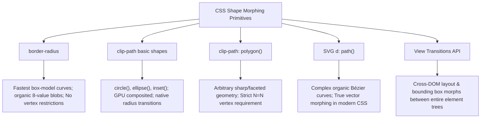

# 060: CSS Shape Transitions & Morphing Masterclass

## Overview & Executive Summary

In contemporary interface design, static geometric components feel rigid and mechanical. **Shape transitions**—the fluid, continuous interpolation of an element's geometric contour, clipping boundary, or border curvature over time—transform static user interfaces into organic, responsive, and high-performance digital experiences.

Whether morphing a circular floating action button into an expansive modal card, seamlessly transforming a triangular play icon into dual pause bars, creating living fluid "blob" avatars, or orchestrating multi-element geometric state shifts, CSS provides powerful native declarative primitives to interpolate geometry without requiring heavy JavaScript canvas or WebGL runtimes.

```
+-------------------------------------------------------------------------------+
|                      CSS SHAPE TRANSITION TAXONOMY                            |
|                                                                               |
|   1. Box-Model Radii     2. Vector Clipping       3. Path Morphing            |
|     (border-radius)        (clip-path basic)       (d: path / polygon)        |
|      ┌───┐    ┌───┐          ▲   ──────>   ■          ▶   ──────>   ❚❚        |
|      │   │ ──>│ O │          Triangle to Square    Play to Pause              |
|      └───┘    └───┘                                                           |
|                                                                               |
|   4. Alpha & Masking     5. Cross-DOM State Transitions (View Transitions API)|
|     (mask-image / size)     (::view-transition-old / ::view-transition-new)   |
|      Iris / Shutter wipes   Shared Element Hero Expansions                    |
+-------------------------------------------------------------------------------+
```

---

## Quick Reference Metadata

| Attribute | Specification Details |
| :--- | :--- |
| **Name** | CSS Shape Transitions & Morphing |
| **Category** | CSS Animations, Transitions & Geometric Compositing |
| **Difficulty** | Advanced (4/5) |
| **What it produces** | Continuous, frame-accurate geometric interpolation between discrete shapes (e.g., circles, polygons, squircles, stars, icons, and cards) using GPU-accelerated transition and keyframe engines. |
| **Why it works** | The browser calculates per-vertex linear interpolation ($\text{lerp}$) of spatial coordinates $(x_i, y_i)$, radii pairs $(r_x, r_y)$, or Bézier control points across layout/paint/compositing ticks. |
| **Key Properties** | `clip-path`, `border-radius`, `d` (SVG path in CSS), `shape-outside`, `mask-image`, `mask-size`, `view-transition-name`, `transition`, `animation`, `offset-path`. |
| **Strict Constraints** | For `polygon()` transitions, **vertex counts must be identical** between states. For SVG `path()` transitions, command structures and segment counts must match in standard CSS engines. |
| **Browser Baseline** | Baseline 2023+ for `border-radius` and basic `clip-path` shapes (`circle`, `ellipse`, `inset`, `polygon`). CSS `d: path()` morphing supported across modern Chromium, Safari 15.4+, and Firefox 115+. |
| **Acceptance Criteria** | Smooth 60/120 FPS interpolation without visual snapping, twisting, or layout thrashing; hit-testing matches the active vector boundary; accessible fallback for reduced motion. |

### Quick Preview

```html
<button class="morph-btn" aria-label="Toggle State">
  <span class="morph-shape"></span>
</button>
```

```css
.morph-btn {
  inline-size: 80px;
  block-size: 80px;
  border: none;
  background: transparent;
  cursor: pointer;
}

.morph-shape {
  display: block;
  inline-size: 100%;
  block-size: 100%;
  background: linear-gradient(135deg, #6366f1, #ec4899);
  /* Initial state: Perfect Circle */
  clip-path: circle(50% at 50% 50%);
  transition: clip-path 500ms cubic-bezier(0.34, 1.56, 0.64, 1),
              background 500ms ease;
}

.morph-btn:hover .morph-shape {
  /* Hover state: 8-Point Diamond / Star (same basic shape function) */
  clip-path: polygon(
    50% 0%, 80% 20%, 100% 50%, 80% 80%,
    50% 100%, 20% 80%, 0% 50%, 20% 20%
  );
}
```

---

## 1. Anatomy & Mathematical Mental Models

### 1.1 The Vertex Interpolation Engine

When two geometric paths or polygons are transitioned, the browser's graphics subsystem executes a linear coordinate interpolation function for every corresponding point index $i \in [1, N]$ at time $t \in [0, 1]$:

$$\vec{P}_i(t) = (1 - t)\vec{P}_{i,\text{start}} + t\vec{P}_{i,\text{end}}$$

Where:
- $\vec{P}_{i,\text{start}} = (x_{i,\text{start}}, y_{i,\text{start}})$ is the coordinate of vertex $i$ in the initial state.
- $\vec{P}_{i,\text{end}} = (x_{i,\text{end}}, y_{i,\text{end}})$ is the coordinate of vertex $i$ in the destination state.
- $t$ is the normalized progression generated by the timing function (e.g., `cubic-bezier`).

```
Initial (Triangle, N=4)           Interpolating (t = 0.5)            Destination (Square, N=4)
       P0 (50%, 0%)                         P0 (50%, 0%)                  P0 (0%, 0%)      P1 (100%, 0%)
          /\                                 /      \                        ┌──────────────┐
         /  \                               /        \                       │              │
        /    \                             /          \                      │              │
       /      \                           /            \                     │              │
      /        \                         /              \                    │              │
     /__________\                       /________________\                   └──────────────┘
P3(0%,100%)    P1,P2(100%,100%)   P3(0%,100%)       P1,P2(100%,100%)     P3 (0%, 100%)   P2 (100%, 100%)
```

> [!IMPORTANT]
> **The Golden Rule of CSS Polygon Transitions ($N_1 = N_2$):**
> If State A has 6 coordinate pairs and State B has 8 coordinate pairs, the browser **cannot infer which vertices to split or collapse**. The transition immediately breaks and snaps abruptly at $50\%$ or $100\%$ completion. To morph a 3-sided triangle into a 4-sided rectangle or 8-sided star, you **must insert redundant collinear or coincident vertices** in the lower-degree shape.

---

### 1.2 Comparison of Shape Morphing Primitives



| Technique | Hardware Acceleration | Curve Support | Vertex Count Constraint | Hit-Testing Precision | Ideal Use Case |
| :--- | :--- | :--- | :--- | :--- | :--- |
| **`border-radius`** | High (Compositor/Paint) | Elliptical arcs only | None (always 4 corners) | Box outline only | Organic fluid blobs, buttons $\rightarrow$ pills $\rightarrow$ circles |
| **`clip-path: inset()`** | High (GPU Accelerated) | Rectangular + smooth radii | None | Pixel-accurate | Expanding cards, modal unveils, focus rings |
| **`clip-path: circle()/ellipse()`**| High (GPU Accelerated) | Perfect circles & ellipses | None | Pixel-accurate | Iris transitions, circular ripples, spot reveals |
| **`clip-path: polygon()`** | Moderate to High | Faceted straight lines | **Strict ($N_1 = N_2$)** | Pixel-accurate | Geometric multi-gons, stars, triangles, shields |
| **`d: path()` / SVG in CSS** | Moderate | Smooth cubic/quad Béziers | **Strict command matching** | Exact vector curve | Icon state toggles (play/pause, hamburger/cross) |
| **View Transitions API** | High (Layer Snapshotting) | Box geometry & bounds | Automatic interpolation | Inherited from active DOM | Page/view hero expansions, list-to-detail morphs |

---

## 2. The 5 Core CSS Shape Transition Primitives

---

### Primitive 1: 8-Value `border-radius` Morphing (Organic Blobs)

The CSS `border-radius` property supports the slash syntax (`rx1 rx2 rx3 rx4 / ry1 ry2 ry3 ry4`), allowing independent control over the horizontal and vertical radii of all four corners. By animating these 8 values smoothly, elements transform into living, pulsating fluid blobs.

```
                  top-left-x           top-right-x
                      │                     │
                      ▼                     ▼
       border-radius: 60%    40%    30%    70%  /  60%    30%    70%    40%;
                                     ▲      ▲      ▲      ▲      ▲      ▲
                                     │      │      │      │      │      │
                          bottom-right-x    │  top-left-y │ bottom-right-y│
                                     bottom-left-x  top-right-y    bottom-left-y
```

#### Core Syntax:
```css
.liquid-blob {
  inline-size: 200px;
  aspect-ratio: 1;
  background: linear-gradient(45deg, #f43f5e, #fb923c);
  border-radius: 60% 40% 30% 70% / 60% 30% 70% 40%;
  transition: border-radius 1s ease-in-out;
}

.liquid-blob:hover {
  border-radius: 40% 60% 70% 30% / 40% 70% 30% 60%;
}
```

---

### Primitive 2: `clip-path` Basic Shape Transitions (`circle`, `ellipse`, `inset`)

Basic shapes in `clip-path` can smoothly interpolate their radii, center points, and edge offsets without worrying about vertex counts.

#### Morphing `circle()` to Expanded Inset Card:
```css
.reveal-card {
  inline-size: 320px;
  block-size: 200px;
  background: #1e1e2f;
  /* Collapsed to a small circle pinned to bottom-right corner */
  clip-path: circle(24px at calc(100% - 32px) calc(100% - 32px));
  transition: clip-path 600ms cubic-bezier(0.16, 1, 0.3, 1);
}

.reveal-card.is-expanded {
  /* Expands to cover full rectangle with 16px rounded corners */
  clip-path: inset(0% 0% 0% 0% round 16px);
}
```

---

### Primitive 3: `clip-path: polygon()` Normalized Vertex Morphing

To morph between arbitrary shapes using `polygon()`, every state must declare the exact same number of vertices in matching clockwise winding order.

#### Vertex Normalization Strategy:
To morph a **Triangle (3 points)** into an **Octagon / Stop Sign (8 points)**:
1. Identify the maximum vertex count needed ($N = 8$).
2. Assign the 8 points of the Octagon: $(30\% 0\%), (70\% 0\%), (100\% 30\%), (100\% 70\%), (70\% 100\%), (30\% 100\%), (0\% 70\%), (0\% 30\%)$.
3. Construct the Triangle with **8 points** by placing extra redundant points along its edges or overlapping its vertices:
   - Top apex: 2 coincident points at $(50\% 0\%)$
   - Right base: 3 coincident points at $(100\% 100\%)$
   - Left base: 3 coincident points at $(0\% 100\%)$

```css
:root {
  /* 8-Vertex Triangle representation */
  --shape-triangle: polygon(
    50% 0%, 50% 0%, 
    100% 100%, 100% 100%, 100% 100%, 
    0% 100%, 0% 100%, 0% 100%
  );
  
  /* 8-Vertex Octagon representation */
  --shape-octagon: polygon(
    30% 0%, 70% 0%, 
    100% 30%, 100% 70%, 
    70% 100%, 30% 100%, 
    0% 70%, 0% 30%
  );
}

.shape-transformer {
  clip-path: var(--shape-triangle);
  transition: clip-path 700ms cubic-bezier(0.34, 1.56, 0.64, 1);
}

.shape-transformer.show-octagon {
  clip-path: var(--shape-octagon);
}
```

---

### Primitive 4: Vector Path Morphing via CSS `d: path()`

Modern CSS allows styling and transitioning the SVG path `d` property directly in stylesheets. When paths have compatible segment structures, the browser interpolates the curved Bézier geometry smoothly.

```css
/* Styling SVG path directly in CSS */
.icon-path {
  /* Initial State: Play Arrow */
  d: path("M 20 10 L 80 50 L 80 50 L 20 90 Z");
  fill: #38bdf8;
  transition: d 400ms cubic-bezier(0.4, 0, 0.2, 1), fill 400ms ease;
}

.icon-container:hover .icon-path {
  /* Morph State: Dual Pause Bar representation */
  d: path("M 20 10 L 40 10 L 40 90 L 20 90 Z");
}
```

---

### Primitive 5: Cross-DOM Transitions with CSS View Transitions API

When a shape transition represents a conceptual component state change (such as an item in a grid expanding to a full-screen hero banner), the **View Transitions API** handles aspect ratio, position, and border shape morphs simultaneously across DOM reconciliations.

```css
/* Card Thumbnail */
.product-card-thumb {
  view-transition-name: active-product-hero;
  border-radius: 24px;
}

/* Expanded Product Page Banner */
.product-hero-banner {
  view-transition-name: active-product-hero;
  border-radius: 0px;
}

/* Customizing the interpolation curve in CSS */
::view-transition-group(active-product-hero) {
  animation-duration: 500ms;
  animation-timing-function: cubic-bezier(0.16, 1, 0.3, 1);
}
```

---

## 3. Comprehensive Implementation Patterns

---

### Pattern 1: The Geometry Chameleon (Multi-State Polygon Morph)

An interactive control demonstrating normalized 12-vertex morphing across 5 distinct geometries: **Triangle $\rightarrow$ Square $\rightarrow$ Pentagon $\rightarrow$ Hexagon $\rightarrow$ 6-Point Star**.

```
    TRIANGLE (12 pts)           PENTAGON (12 pts)             6-POINT STAR (12 pts)
          (50%, 0%)                 (50%, 0%)                       (50%, 0%)
             /\                       /    \                          /   \
            /  \                     /      \                   /\   /     \   /\
           /    \                   /        \                 /  \ /       \ /  \
          /      \                 /          \               (---●-----------●---)
         /________\               (____________)               \  / \       / \  /
      (0,100)    (100,100)                                      \/   \     /   \/
                                                                      (50,100)
```

#### HTML
```html
<section class="chameleon-showcase" aria-labelledby="chameleon-title">
  <header class="showcase-header">
    <h2 id="chameleon-title">12-Vertex Normalized Polygon Morph</h2>
    <p>All shapes share exactly 12 coordinates to guarantee mathematical interpolation continuity.</p>
  </header>

  <div class="chameleon-viewport">
    <div class="chameleon-shape" id="chameleonTarget">
      <div class="chameleon-inner-glow"></div>
      <span class="chameleon-label" id="shapeName">Triangle</span>
    </div>
  </div>

  <nav class="chameleon-controls" aria-label="Select Target Shape">
    <button type="button" class="btn-morph active" data-shape="triangle">Triangle</button>
    <button type="button" class="btn-morph" data-shape="square">Square</button>
    <button type="button" class="btn-morph" data-shape="pentagon">Pentagon</button>
    <button type="button" class="btn-morph" data-shape="hexagon">Hexagon</button>
    <button type="button" class="btn-morph" data-shape="star">Star</button>
  </nav>
</section>
```

#### CSS
```css
/* ==========================================================================
   Pattern 1: 12-Vertex Normalized Shape Chameleon
   ========================================================================== */

:root {
  /* 1. TRIANGLE: 12 vertices (4 coincident at apex, 4 at right base, 4 at left base) */
  --poly-triangle: polygon(
    50% 0%, 50% 0%, 50% 0%, 50% 0%,
    100% 100%, 100% 100%, 100% 100%, 100% 100%,
    0% 100%, 0% 100%, 0% 100%, 0% 100%
  );

  /* 2. SQUARE: 12 vertices (3 coincident at each corner) */
  --poly-square: polygon(
    0% 0%, 50% 0%, 100% 0%,
    100% 0%, 100% 50%, 100% 100%,
    100% 100%, 50% 100%, 0% 100%,
    0% 100%, 0% 50%, 0% 0%
  );

  /* 3. PENTAGON: 12 vertices distributed evenly along 5 edges */
  --poly-pentagon: polygon(
    50% 0%, 75% 19%, 100% 38%,
    100% 38%, 91% 69%, 81% 100%,
    50% 100%, 19% 100%, 9% 69%,
    0% 38%, 25% 19%, 50% 0%
  );

  /* 4. HEXAGON: 12 vertices (2 along each of the 6 sides) */
  --poly-hexagon: polygon(
    25% 0%, 50% 0%, 75% 0%,
    100% 50%, 100% 50%, 75% 100%,
    50% 100%, 25% 100%, 0% 50%,
    0% 50%, 12.5% 25%, 25% 0%
  );

  /* 5. 6-POINT STAR: 12 vertices (6 outer peaks, 6 inner valleys) */
  --poly-star: polygon(
    50% 0%, 65% 25%, 100% 25%,
    75% 50%, 100% 75%, 65% 75%,
    50% 100%, 35% 75%, 0% 75%,
    25% 50%, 0% 25%, 35% 25%
  );
}

.chameleon-showcase {
  max-inline-size: 640px;
  margin-inline: auto;
  padding: 2.5rem;
  background: #0f172a;
  border-radius: 24px;
  box-shadow: 0 25px 50px -12px rgba(0, 0, 0, 0.5),
              0 0 0 1px rgba(255, 255, 255, 0.08);
  color: #f8fafc;
  font-family: system-ui, -apple-system, BlinkMacSystemFont, "Segoe UI", Roboto, sans-serif;
  text-align: center;
}

.showcase-header h2 {
  font-size: 1.5rem;
  font-weight: 700;
  margin-block-end: 0.5rem;
  background: linear-gradient(to right, #60a5fa, #a78bfa, #f472b6);
  -webkit-background-clip: text;
  -webkit-text-fill-color: transparent;
}

.showcase-header p {
  color: #94a3b8;
  font-size: 0.875rem;
  margin-block-end: 2rem;
}

.chameleon-viewport {
  position: relative;
  inline-size: 240px;
  block-size: 240px;
  margin-inline: auto;
  margin-block-end: 2.5rem;
  display: grid;
  place-items: center;
}

.chameleon-shape {
  inline-size: 100%;
  block-size: 100%;
  background: linear-gradient(135deg, #3b82f6, #8b5cf6 50%, #ec4899);
  clip-path: var(--poly-triangle);
  /* Ultra-smooth cubic bezier with spring overshoot */
  transition: clip-path 800ms cubic-bezier(0.34, 1.56, 0.64, 1),
              background 800ms ease,
              transform 800ms cubic-bezier(0.34, 1.56, 0.64, 1);
  display: grid;
  place-items: center;
  position: relative;
  will-change: clip-path, transform;
}

/* Inner lighting highlights */
.chameleon-inner-glow {
  position: absolute;
  inset: 0;
  background: radial-gradient(circle at 30% 30%, rgba(255, 255, 255, 0.35), transparent 70%);
  pointer-events: none;
}

.chameleon-label {
  font-weight: 800;
  font-size: 1.125rem;
  text-transform: uppercase;
  letter-spacing: 0.1em;
  color: #ffffff;
  text-shadow: 0 2px 8px rgba(0, 0, 0, 0.4);
  z-index: 1;
  pointer-events: none;
}

/* State Classes Applied by Trigger / JS */
.chameleon-shape.shape-triangle {
  clip-path: var(--poly-triangle);
  background: linear-gradient(135deg, #06b6d4, #3b82f6);
}

.chameleon-shape.shape-square {
  clip-path: var(--poly-square);
  background: linear-gradient(135deg, #3b82f6, #6366f1);
  transform: rotate(45deg);
}

.chameleon-shape.shape-pentagon {
  clip-path: var(--poly-pentagon);
  background: linear-gradient(135deg, #6366f1, #a855f7);
  transform: rotate(0deg);
}

.chameleon-shape.shape-hexagon {
  clip-path: var(--poly-hexagon);
  background: linear-gradient(135deg, #8b5cf6, #ec4899);
  transform: scale(1.05);
}

.chameleon-shape.shape-star {
  clip-path: var(--poly-star);
  background: linear-gradient(135deg, #f43f5e, #f59e0b);
  transform: scale(1.1) rotate(15deg);
}

/* Navigation Buttons */
.chameleon-controls {
  display: flex;
  flex-wrap: wrap;
  justify-content: center;
  gap: 0.625rem;
}

.btn-morph {
  appearance: none;
  border: 1px solid rgba(255, 255, 255, 0.15);
  background: rgba(255, 255, 255, 0.05);
  color: #cbd5e1;
  padding: 0.5rem 1rem;
  border-radius: 9999px;
  font-size: 0.875rem;
  font-weight: 600;
  cursor: pointer;
  transition: all 250ms cubic-bezier(0.16, 1, 0.3, 1);
}

.btn-morph:hover {
  background: rgba(255, 255, 255, 0.12);
  color: #ffffff;
  transform: translateY(-2px);
}

.btn-morph.active {
  background: #3b82f6;
  border-color: #60a5fa;
  color: #ffffff;
  box-shadow: 0 0 16px rgba(59, 130, 246, 0.5);
}

/* Accessible Reduced Motion Guarantee */
@media (prefers-reduced-motion: reduce) {
  .chameleon-shape {
    transition: none !important;
    transform: none !important;
  }
}
```

---

### Pattern 2: Organic Fluid Liquid Blob Morphing (8-Value `border-radius`)

An organic pulsating liquid avatar container that smoothly shifts shape constantly using CSS `@keyframes`, and expands into an interactive card on hover.

```
       Resting Idle Blob                     Hover Active Avatar
    ┌──────────────────────┐               ┌──────────────────────┐
   │   63%  37%  54%  46%   │             │   50%  50%  50%  50%   │
   │           ▲            │             │           ▲            │
   │  ◄─-●-─►  │  ◄─-●-─►   │    ───►     │    Perfect Symmetrical │
   │           ▼            │             │        Squircle        │
   │   40%  60%  31%  69%   │             │                        │
    └──────────────────────┘               └──────────────────────┘
```

#### HTML
```html
<div class="blob-profile-container">
  <div class="organic-blob-badge" role="region" aria-label="User Profile Badge">
    
    <div class="blob-overlay-content">
      <h3 class="blob-user-name">Elena Rostova</h3>
      <p class="blob-user-role">Lead Creative Director</p>
      <div class="blob-status-indicator">
        <span class="status-dot"></span> Online & Available
      </div>
    </div>
  </div>
</div>
```

#### CSS
```css
/* ==========================================================================
   Pattern 2: Fluid 8-Value Border Radius Blob
   ========================================================================== */

.blob-profile-container {
  display: grid;
  place-items: center;
  padding: 3rem 1.5rem;
  background: #090d16;
}

.organic-blob-badge {
  position: relative;
  inline-size: 260px;
  block-size: 260px;
  cursor: pointer;
  background: linear-gradient(135deg, #ec4899, #8b5cf6, #3b82f6);
  padding: 6px; /* Gradient rim border */
  border-radius: 60% 40% 30% 70% / 60% 30% 70% 40%;
  animation: liquid-morph 8s ease-in-out infinite alternate;
  transition: all 600ms cubic-bezier(0.16, 1, 0.3, 1);
  box-shadow: 0 20px 40px -10px rgba(139, 92, 246, 0.4);
  overflow: hidden;
}

.blob-avatar-image {
  inline-size: 100%;
  block-size: 100%;
  object-fit: cover;
  border-radius: inherit;
  filter: brightness(0.95) contrast(1.05);
  transition: transform 600ms cubic-bezier(0.16, 1, 0.3, 1),
              filter 600ms ease;
}

.blob-overlay-content {
  position: absolute;
  inset: 0;
  background: linear-gradient(to top, rgba(15, 23, 42, 0.95) 20%, rgba(15, 23, 42, 0.4) 70%, transparent 100%);
  display: flex;
  flex-direction: column;
  justify-content: flex-end;
  padding: 1.5rem;
  border-radius: inherit;
  opacity: 0;
  transform: translateY(20px);
  transition: opacity 400ms ease, transform 500ms cubic-bezier(0.16, 1, 0.3, 1);
}

.blob-user-name {
  color: #ffffff;
  font-size: 1.25rem;
  font-weight: 700;
  margin: 0;
}

.blob-user-role {
  color: #a78bfa;
  font-size: 0.875rem;
  margin: 0.25rem 0 0.75rem 0;
}

.blob-status-indicator {
  display: inline-flex;
  align-items: center;
  gap: 0.5rem;
  font-size: 0.75rem;
  color: #34d399;
  font-weight: 600;
}

.status-dot {
  inline-size: 8px;
  block-size: 8px;
  background-color: #10b981;
  border-radius: 50%;
  box-shadow: 0 0 8px #10b981;
  animation: pulse-dot 2s infinite;
}

/* Hover State: Symmetrical Card Morph */
.organic-blob-badge:hover {
  animation-play-state: paused;
  border-radius: 28px / 28px;
  inline-size: 280px;
  block-size: 340px;
  transform: translateY(-8px);
  box-shadow: 0 30px 60px -12px rgba(236, 72, 153, 0.5);
}

.organic-blob-badge:hover .blob-avatar-image {
  transform: scale(1.08);
  filter: brightness(0.7);
}

.organic-blob-badge:hover .blob-overlay-content {
  opacity: 1;
  transform: translateY(0);
}

/* 8-Value Smooth Keyframe Sequence */
@keyframes liquid-morph {
  0% {
    border-radius: 60% 40% 30% 70% / 60% 30% 70% 40%;
  }
  33% {
    border-radius: 40% 60% 70% 30% / 50% 60% 40% 50%;
  }
  66% {
    border-radius: 70% 30% 50% 50% / 30% 40% 60% 70%;
  }
  100% {
    border-radius: 30% 70% 70% 30% / 70% 30% 30% 70%;
  }
}

@keyframes pulse-dot {
  0%, 100% { opacity: 1; transform: scale(1); }
  50% { opacity: 0.4; transform: scale(0.85); }
}

@media (prefers-reduced-motion: reduce) {
  .organic-blob-badge {
    animation: none;
    border-radius: 24px;
  }
}
```

---

### Pattern 3: Floating Action Button (FAB) to Expansive Modal (`clip-path: circle` $\rightarrow$ `inset`)

A production pattern where a circular Floating Action Button smoothly explodes into an expansive, rich card panel using GPU-accelerated `clip-path` interpolation.

```
       COLLAPSED STATE                              EXPANDED STATE
 ┌─────────────────────────┐                  ┌─────────────────────────┐
 │                         │                  │ ┌─────────────────────┐ │
 │                         │                  │ │ ✕                   │ │
 │                         │   ──────────►    │ │ Send Instant Query  │ │
 │                     ┌─┐ │                  │ │ [_________________] │ │
 │                     │+│ │                  │ │ [  Confirm Message] │ │
 │                     └─┘ │                  │ └─────────────────────┘ │
 └─────────────────────────┘                  └─────────────────────────┘
   clip-path: circle(28px at 90% 90%)           clip-path: inset(0% round 20px)
```

#### HTML
```html
<div class="fab-wrapper">
  <!-- The Morphing Backdrop & Sheet -->
  <div class="morph-modal-sheet" id="contactSheet" aria-hidden="true">
    <div class="sheet-inner-content">
      <header class="sheet-header">
        <h3 class="sheet-title">Quick Dispatch</h3>
        <button type="button" class="btn-close-sheet" id="closeSheetBtn" aria-label="Close panel">✕</button>
      </header>
      <form class="sheet-form" onsubmit="event.preventDefault();">
        <label for="queryInput" class="form-label">Message Prompt</label>
        <input type="text" id="queryInput" class="form-input" placeholder="Type prompt command..." />
        <button type="submit" class="btn-submit-action">Transmit Telemetry</button>
      </form>
    </div>
  </div>

  <!-- The Trigger Button (Pinned Bottom-Right) -->
  <button type="button" class="fab-trigger-btn" id="openSheetBtn" aria-expanded="false" aria-label="Open dispatch panel">
    <svg class="fab-icon" viewBox="0 0 24 24" fill="none" stroke="currentColor" stroke-width="2.5">
      <path d="M12 5v14M5 12h14"/>
    </svg>
  </button>
</div>
```

#### CSS
```css
/* ==========================================================================
   Pattern 3: FAB to Expanded Modal (circle to inset clip-path)
   ========================================================================== */

.fab-wrapper {
  position: relative;
  inline-size: 380px;
  block-size: 440px;
  background: #111827;
  border-radius: 24px;
  overflow: hidden;
  border: 1px solid rgba(255, 255, 255, 0.1);
  box-shadow: 0 20px 40px rgba(0, 0, 0, 0.6);
  font-family: inherit;
}

/* The FAB Trigger */
.fab-trigger-btn {
  position: absolute;
  inset-inline-end: 24px;
  inset-block-end: 24px;
  inline-size: 56px;
  block-size: 56px;
  border-radius: 50%;
  background: #6366f1;
  color: #ffffff;
  border: none;
  cursor: pointer;
  display: grid;
  place-items: center;
  box-shadow: 0 10px 20px rgba(99, 102, 241, 0.4);
  transition: transform 300ms cubic-bezier(0.34, 1.56, 0.64, 1),
              background-color 300ms ease;
  z-index: 2;
}

.fab-trigger-btn:hover {
  transform: scale(1.1) rotate(90deg);
  background: #4f46e5;
}

.fab-icon {
  inline-size: 26px;
  block-size: 26px;
}

/* The Morphing Sheet */
.morph-modal-sheet {
  position: absolute;
  inset: 0;
  background: linear-gradient(145deg, #1e1b4b, #0f172a);
  z-index: 10;
  display: flex;
  flex-direction: column;
  pointer-events: none;

  /* INITIAL COLLAPSED STATE: Circle centered over the FAB */
  clip-path: circle(28px at calc(100% - 52px) calc(100% - 52px));
  transition: clip-path 600ms cubic-bezier(0.16, 1, 0.3, 1);
  will-change: clip-path;
}

/* EXPANDED ACTIVE STATE */
.morph-modal-sheet.is-active {
  pointer-events: auto;
  /* EXPANDS TO FULL RECTANGLE WITH INSET ROUNDED CORNERS */
  clip-path: inset(0% 0% 0% 0% round 24px);
}

.sheet-inner-content {
  padding: 2rem;
  display: flex;
  flex-direction: column;
  block-size: 100%;
  box-sizing: border-box;
  opacity: 0;
  transform: translateY(16px);
  transition: opacity 300ms ease 100ms, transform 400ms cubic-bezier(0.16, 1, 0.3, 1) 100ms;
}

.morph-modal-sheet.is-active .sheet-inner-content {
  opacity: 1;
  transform: translateY(0);
  transition: opacity 400ms ease 250ms, transform 500ms cubic-bezier(0.16, 1, 0.3, 1) 250ms;
}

.sheet-header {
  display: flex;
  justify-content: space-between;
  align-items: center;
  margin-block-end: 1.5rem;
}

.sheet-title {
  color: #f8fafc;
  font-size: 1.25rem;
  font-weight: 700;
  margin: 0;
}

.btn-close-sheet {
  background: rgba(255, 255, 255, 0.1);
  border: none;
  color: #cbd5e1;
  inline-size: 32px;
  block-size: 32px;
  border-radius: 50%;
  cursor: pointer;
  display: grid;
  place-items: center;
  font-size: 1rem;
  transition: background 200ms ease;
}

.btn-close-sheet:hover {
  background: rgba(255, 255, 255, 0.2);
  color: #ffffff;
}

.sheet-form {
  display: flex;
  flex-direction: column;
  gap: 1rem;
  flex-grow: 1;
}

.form-label {
  font-size: 0.8125rem;
  font-weight: 600;
  color: #94a3b8;
  text-transform: uppercase;
  letter-spacing: 0.05em;
}

.form-input {
  background: rgba(0, 0, 0, 0.3);
  border: 1px solid rgba(255, 255, 255, 0.15);
  padding: 0.75rem 1rem;
  border-radius: 12px;
  color: #ffffff;
  font-size: 0.9375rem;
  outline: none;
  transition: border-color 200ms ease;
}

.form-input:focus {
  border-color: #818cf8;
}

.btn-submit-action {
  margin-block-start: auto;
  background: linear-gradient(135deg, #6366f1, #8b5cf6);
  border: none;
  color: #ffffff;
  padding: 0.875rem;
  border-radius: 12px;
  font-weight: 700;
  cursor: pointer;
  transition: transform 200ms ease, box-shadow 200ms ease;
}

.btn-submit-action:hover {
  transform: translateY(-2px);
  box-shadow: 0 8px 16px rgba(99, 102, 241, 0.4);
}
```

---

### Pattern 4: Vector Icon State Morphing (Play ↔ Pause ↔ Checkmark via CSS `d: path()`)

Pure CSS vector morphing of SVG paths using modern CSS `d` interpolation. The path structures maintain equal cubic Bézier curve segment counts ($4 \times C$ segments), allowing continuous path interpolation.

```
       PLAY STATE                         PAUSE STATE                       CHECKMARK STATE
   (Single Wedge Polygon)             (Dual Vertical Bars)               (Diagonal Check V-Line)
      ┌───────────┐                      ┌───────────┐                      ┌───────────┐
      │   ▶       │        ──────►       │   ❚❚      │        ──────►       │    ✔      │
      │           │                      │           │                      │           │
      └───────────┘                      └───────────┘                      └───────────┘
```

#### HTML
```html
<div class="vector-morph-container">
  <button type="button" class="btn-icon-morph state-play" id="vectorToggleBtn" aria-label="Toggle playback and confirmation state">
    <svg class="morph-svg-canvas" viewBox="0 0 100 100" aria-hidden="true">
      <path class="interpolating-path" />
    </svg>
  </button>
  <p class="state-hint">Click button to cycle: Play $\rightarrow$ Pause $\rightarrow$ Checkmark</p>
</div>
```

#### CSS
```css
/* ==========================================================================
   Pattern 4: SVG Vector Path Morphing via CSS d: path()
   ========================================================================== */

.vector-morph-container {
  display: flex;
  flex-direction: column;
  align-items: center;
  gap: 1rem;
  padding: 2.5rem;
  background: #0b0f19;
  border-radius: 20px;
}

.btn-icon-morph {
  inline-size: 96px;
  block-size: 96px;
  border-radius: 50%;
  background: #1e293b;
  border: 2px solid rgba(255, 255, 255, 0.1);
  display: grid;
  place-items: center;
  cursor: pointer;
  transition: background-color 300ms ease, transform 300ms cubic-bezier(0.34, 1.56, 0.64, 1);
}

.btn-icon-morph:hover {
  transform: scale(1.08);
  border-color: rgba(255, 255, 255, 0.3);
}

.morph-svg-canvas {
  inline-size: 54px;
  block-size: 54px;
  overflow: visible;
}

/* The interpolating path using 4 Cubic Bézier Curves (C commands) */
.interpolating-path {
  fill: #38bdf8;
  transition: d 500ms cubic-bezier(0.34, 1.56, 0.64, 1),
              fill 400ms ease;
  will-change: d;
}

/* STATE 1: PLAY TRIANGLE */
.btn-icon-morph.state-play .interpolating-path {
  fill: #38bdf8;
  d: path("M 30,20 C 30,20 75,50 75,50 C 75,50 75,50 75,50 C 75,50 30,80 30,80 C 30,80 30,20 30,20 Z");
}

/* STATE 2: PAUSE BARS (Matched 4-curve segmented layout) */
.btn-icon-morph.state-pause .interpolating-path {
  fill: #fbbf24;
  d: path("M 25,20 C 42,20 42,20 42,20 C 42,80 42,80 42,80 C 25,80 25,80 25,80 C 25,20 25,20 25,20 Z M 58,20 C 75,20 75,20 75,20 C 75,80 75,80 75,80 C 58,80 58,80 58,80 C 58,20 58,20 58,20 Z");
}

/* STATE 3: CHECKMARK CONFIRMATION */
.btn-icon-morph.state-check .interpolating-path {
  fill: #34d399;
  d: path("M 20,50 C 35,65 35,65 35,65 C 35,65 80,25 80,25 C 85,20 85,20 85,20 C 35,80 35,80 35,80 C 15,55 15,55 15,55 Z");
}

.state-hint {
  color: #64748b;
  font-size: 0.8125rem;
}
```

---

### Pattern 5: Editorial Shutter & Iris Wipe Card Reveal (`mask-image` & `clip-path`)

A modern editorial hover interaction where a luxury magazine teaser undergoes a dynamic diagonal shutter and radial iris expansion, uncovering rich backdrop typography and high-definition photography.

```
       RESTING SHUTTER SLICE                       EXPANDED HERO REVEAL
   ┌───────────────────────────┐               ┌───────────────────────────┐
   │ ///////////////////////// │               │  VOGUE ARCHITECTURE       │
   │  [ Diagonally Sliced ]    │   ────────►   │                           │
   │ ///////////////////////// │               │  "Symmetry in Concrete"   │
   │                           │               │                           │
   └───────────────────────────┘               └───────────────────────────┘
     clip-path: polygon(0 0, 100% 0,             clip-path: polygon(0 0, 100% 0,
                        100% 45%, 0 75%)                            100% 100%, 0 100%)
```

#### HTML
```html
<article class="editorial-shutter-card" tabindex="0">
  <div class="shutter-media-layer">
    
  </div>

  <div class="shutter-caption-layer">
    <span class="shutter-tag">Monograph 04</span>
    <h3 class="shutter-headline">Brutalist Monoliths</h3>
    <p class="shutter-summary">Geometric harmony sculpted through light, shadow, and structural concrete.</p>
    <span class="shutter-cta">Explore Gallery &rarr;</span>
  </div>
</article>
```

#### CSS
```css
/* ==========================================================================
   Pattern 5: Editorial Shutter & Iris Wipe
   ========================================================================== */

.editorial-shutter-card {
  position: relative;
  inline-size: 360px;
  block-size: 480px;
  border-radius: 20px;
  background: #09090b;
  overflow: hidden;
  box-shadow: 0 20px 40px rgba(0, 0, 0, 0.7);
  cursor: pointer;
}

.shutter-media-layer {
  position: absolute;
  inset: 0;
  /* INITIAL DIAGONAL SHUTTER SLICE (4-vertex polygon) */
  clip-path: polygon(0% 0%, 100% 0%, 100% 55%, 0% 85%);
  transition: clip-path 700ms cubic-bezier(0.16, 1, 0.3, 1),
              filter 700ms ease;
  filter: grayscale(40%) contrast(1.1);
  will-change: clip-path;
}

.shutter-img {
  inline-size: 100%;
  block-size: 100%;
  object-fit: cover;
  transform: scale(1);
  transition: transform 800ms cubic-bezier(0.16, 1, 0.3, 1);
}

.shutter-caption-layer {
  position: absolute;
  inset: 0;
  display: flex;
  flex-direction: column;
  justify-content: flex-end;
  padding: 2rem;
  background: linear-gradient(to top, #09090b 25%, rgba(9, 9, 11, 0.4) 60%, transparent 100%);
  color: #ffffff;
  z-index: 2;
  transition: transform 600ms cubic-bezier(0.16, 1, 0.3, 1);
}

.shutter-tag {
  font-size: 0.75rem;
  font-weight: 700;
  text-transform: uppercase;
  letter-spacing: 0.15em;
  color: #f59e0b;
  margin-block-end: 0.5rem;
}

.shutter-headline {
  font-size: 1.75rem;
  font-weight: 800;
  line-height: 1.2;
  margin: 0 0 0.5rem 0;
}

.shutter-summary {
  font-size: 0.875rem;
  color: #a1a1aa;
  line-height: 1.5;
  margin: 0 0 1.25rem 0;
  opacity: 0.85;
}

.shutter-cta {
  font-size: 0.875rem;
  font-weight: 700;
  color: #38bdf8;
  display: inline-flex;
  align-items: center;
  gap: 0.375rem;
  transition: gap 300ms ease;
}

/* HOVER / FOCUS REVEAL: Expand clip-path to cover 100% full rectangle */
.editorial-shutter-card:hover .shutter-media-layer,
.editorial-shutter-card:focus-visible .shutter-media-layer {
  clip-path: polygon(0% 0%, 100% 0%, 100% 100%, 0% 100%);
  filter: grayscale(0%) contrast(1);
}

.editorial-shutter-card:hover .shutter-img,
.editorial-shutter-card:focus-visible .shutter-img {
  transform: scale(1.08);
}

.editorial-shutter-card:hover .shutter-cta {
  gap: 0.75rem;
}
```

---

## 4. Advanced Vertex Alignment & Normalization Algorithm

When designing complex morphs between arbitrary geometric vectors, you must prevent **path inversion** (where points cross each other diagonally, causing an ugly twisting artifact).

```
BAD: Diagonal Winding (Twists upon itself)     GOOD: Clockwise Normalized Winding
P0 (0,0)               P1 (100,0)              P0 (0,0)               P1 (100,0)
    ┌──────────────────────┐                       ┌──────────────────────┐
    │       \      /       │                       │          │           │
    │        \    /        │                       │          │           │
    │         \  /         │                       │          │           │
    │          \/          │                       │          │           │
    │         /  \         │                       │          │           │
    │        /    \        │                       │          │           │
    │       /      \       │                       │          │           │
    └──────────────────────┘                       └──────────────────────┘
P3 (0,100)             P2 (100,100)            P3 (0,100)             P2 (100,100)
```

### The 4-Step Vertex Normalization Formula:

1. **Calculate Maximum Vertex Count ($N_{\max}$)**:
   Count the vertices of every shape in your sequence. Let $N_{\max} = \max(N_A, N_B, \dots)$.
2. **Clockwise Winding Order**:
   Always declare vertices beginning from the top-center $(50\% 0\%)$ or top-left $(0\% 0\%)$ and proceed strictly in clockwise order ($0^\circ \rightarrow 90^\circ \rightarrow 180^\circ \rightarrow 270^\circ$).
3. **Collinear Edge Subdivision**:
   If shape $A$ has 4 vertices and $N_{\max} = 8$, subdivide each of the 4 straight lines at its exact midpoint $(50\%)$:
   ```css
   /* Standard 4-point square */
   polygon(0% 0%, 100% 0%, 100% 100%, 0% 100%)
   
   /* 8-point subdivided square (identical visual outline, ready to morph) */
   polygon(
     0% 0%, 50% 0%, 100% 0%,
     100% 50%, 100% 100%, 50% 100%,
     0% 100%, 0% 50%
   )
   ```
4. **Coincident Vertex Clustering**:
   For sharp points (like the tip of a triangle or star peak), stack multiple duplicate coordinates at the exact same point $(x, y)$.

---

## 5. Performance, Compositing & GPU Pipelines

To achieve a locked **60 FPS / 120 FPS** refresh rate on high-density mobile screens and desktop monitors, understand how browsers render shape transitions:

```
┌─────────────────────────────────────────────────────────────────────────────┐
│                       BROWSER RENDERING PIPELINES                           │
├───────────────────┬───────────────────┬─────────────────────────────────────┤
│ Property          │ Pipeline Trigger  │ GPU Accelerated?                    │
├───────────────────┼───────────────────┼─────────────────────────────────────┤
│ `clip-path`       │ Paint / Composite │ YES (Fast Compositor Layer)         │
│ `border-radius`   │ Paint             │ YES (when paired with `will-change`)│
│ `d: path()` (SVG) │ Layout & Paint    │ Moderate (Vector rasterization)     │
│ `mask-image`      │ Paint / Composite │ YES (Alpha channel multiplication)  │
│ `shape-outside`   │ Layout / Reflow   │ NO (Requires text reflow re-calc)   │
└───────────────────┴───────────────────┴─────────────────────────────────────┘
```

> [!TIP]
> **GPU Layer Promotion Rule:**
> Always attach `will-change: clip-path` or `transform: translateZ(0)` to morphing elements. This promotes the element to its own isolated hardware compositing plane, preventing CPU paint invalidation of surrounding sibling nodes.

```css
.high-performance-morph {
  will-change: clip-path;
  transform: translateZ(0);
  backface-visibility: hidden;
}
```

---

## 6. Common Pitfalls, Edge Cases & Debugging Solutions

### Pitfall 1: The "Snap Failure" (Mismatched Vertex Count)
- **Symptom**: The transition does not animate smoothly; instead, the shape stays static and snaps immediately to the new form at the end.
- **Root Cause**: The starting `polygon()` and ending `polygon()` have different numbers of coordinate pairs.
- **Fix**: Count every comma-separated $(x, y)$ coordinate pair and normalize both arrays to $N$ points.

---

### Pitfall 2: Click/Hover "Ghost Deadzones" with `border-radius`
- **Symptom**: Hovering over transparent empty corners outside a rounded `border-radius` still triggers `:hover` or click events.
- **Root Cause**: In standard CSS, `border-radius` rounds the visual paint buffer, but the hit-testing box model remains a rectangular bounding box.
- **Fix**: Use `clip-path` instead of `border-radius` when you need pointer events to strictly respect the visible curved silhouette:
```css
/* Hit-testing is trimmed strictly to the circle boundary */
.precise-click-target {
  clip-path: circle(50% at 50% 50%);
}
```

---

### Pitfall 3: Subpixel Edge Jaggedness & Aliasing
- **Symptom**: During transition, the clipped vector edges appear jagged or pixelated on standard DPI monitors.
- **Fix**: Add a subtle transparent drop-shadow or a 0.5px backdrop outline:
```css
.anti-aliased-morph {
  filter: drop-shadow(0 0 0.5px rgba(0, 0, 0, 0.5));
}
```

---

### Pitfall 4: Relative vs. Absolute Path Segment Mismatch in SVG `d`
- **Symptom**: Morphing via `d: path(...)` fails in Firefox or Safari.
- **Root Cause**: Mixing lowercase relative commands (`m`, `c`, `l`) with uppercase absolute commands (`M`, `C`, `L`).
- **Fix**: Convert all SVG path data to uniform absolute uppercase commands (`M`, `C`, `Z`).

---

## 7. Interactive JavaScript State Controller

To pair with the architectural HTML/CSS patterns above, here is a clean, accessible, zero-dependency controller script:

```javascript
/**
 * Shape Transition & Morphing State Controller
 */
document.addEventListener('DOMContentLoaded', () => {
  // 1. Initialize Chameleon Multi-State Polygon Controller
  const chameleonTarget = document.getElementById('chameleonTarget');
  const shapeNameLabel = document.getElementById('shapeName');
  const morphButtons = document.querySelectorAll('.btn-morph');

  if (chameleonTarget && morphButtons.length > 0) {
    morphButtons.forEach(btn => {
      btn.addEventListener('click', () => {
        const targetShape = btn.dataset.shape;
        
        // Update button states
        morphButtons.forEach(b => b.classList.remove('active'));
        btn.classList.add('active');

        // Apply corresponding class to the shape container
        chameleonTarget.className = `chameleon-shape shape-${targetShape}`;
        if (shapeNameLabel) {
          shapeNameLabel.textContent = targetShape.charAt(0).toUpperCase() + targetShape.slice(1);
        }
      });
    });
  }

  // 2. Initialize FAB to Modal Sheet Morph
  const openSheetBtn = document.getElementById('openSheetBtn');
  const closeSheetBtn = document.getElementById('closeSheetBtn');
  const contactSheet = document.getElementById('contactSheet');

  if (openSheetBtn && contactSheet && closeSheetBtn) {
    openSheetBtn.addEventListener('click', () => {
      contactSheet.classList.add('is-active');
      contactSheet.setAttribute('aria-hidden', 'false');
      openSheetBtn.setAttribute('aria-expanded', 'true');
    });

    closeSheetBtn.addEventListener('click', () => {
      contactSheet.classList.remove('is-active');
      contactSheet.setAttribute('aria-hidden', 'true');
      openSheetBtn.setAttribute('aria-expanded', 'false');
    });
  }

  // 3. Initialize Vector Icon Morph Toggle (Play -> Pause -> Check)
  const vectorToggleBtn = document.getElementById('vectorToggleBtn');
  const states = ['state-play', 'state-pause', 'state-check'];
  let currentStateIndex = 0;

  if (vectorToggleBtn) {
    vectorToggleBtn.addEventListener('click', () => {
      vectorToggleBtn.classList.remove(states[currentStateIndex]);
      currentStateIndex = (currentStateIndex + 1) % states.length;
      vectorToggleBtn.classList.add(states[currentStateIndex]);
    });
  }
});
```

---

## 8. Master Checklist for Production Shape Transitions

- [ ] **Vertex Count Validation**: Have you verified that both the initial and destination `polygon()` or `path()` strings contain identical numbers of points and segments?
- [ ] **Winding Order**: Are all vertices declared in uniform clockwise order starting from the same coordinate quadrant?
- [ ] **GPU Acceleration**: Is `will-change: clip-path` or `transform: translateZ(0)` applied to promote morphing elements to independent compositor layers?
- [ ] **Pointer Precision**: Have you verified whether pointer events should conform strictly to the clipped vector shape or the rectangular bounding box?
- [ ] **Timing Curves**: Are you using expressive cubic-bezier timing functions (`cubic-bezier(0.34, 1.56, 0.64, 1)` for bouncy micro-interactions; `cubic-bezier(0.16, 1, 0.3, 1)` for sleek modal expands)?
- [ ] **Accessibility (`prefers-reduced-motion`)**: Is a complete fallback provided that disables or simplifies shape transitions for users sensitive to motion?
- [ ] **Keyboard & Focus States**: Are all interactive morphing triggers accessible via Tab and Space/Enter keys?
