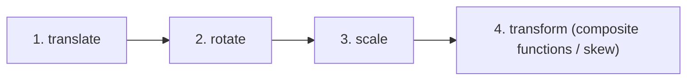
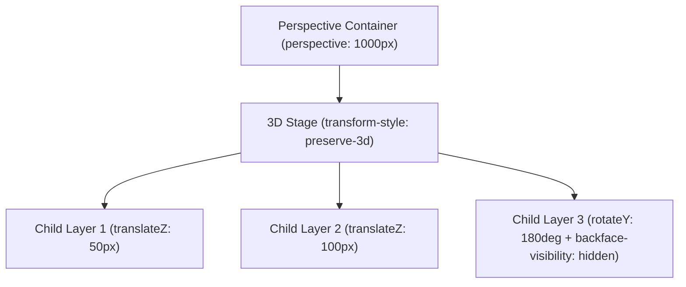

# 061: CSS Transform Primitives: Translate, Scale, Rotate, Skew Masterclass

## Overview & Executive Summary

In modern interface engineering, visual dynamism, depth, and micro-interactions rely fundamentally on the **CSS Transform Model**. By manipulating an element's spatial coordinate system without disrupting the standard document flow, CSS transforms enable high-performance animations, fluid UI transitions, responsive positioning, and sophisticated 3D spatial illusions.

The four fundamental transformation primitives are:
1. **Translate**: Linear displacement along horizontal ($X$), vertical ($Y$), and depth ($Z$) spatial axes.
2. **Scale**: Geometric dilation, compression, or axial reflection (mirroring).
3. **Rotate**: Angular displacement around a specified pivot anchor (`transform-origin`) in 2D or arbitrary 3D vectors.
4. **Skew (Shear)**: Angular slanting along coordinate axes that distorts rectangular geometry into parallelograms while preserving area and parallel edges.

```
+-------------------------------------------------------------------------------+
|                       THE 4 CSS TRANSFORM PRIMITIVES                          |
|                                                                               |
|   1. TRANSLATE (Displace)   2. SCALE (Resize / Flip)   3. ROTATE (Angular)    |
|        ┌──────┐                  ┌──────────┐                 ┌──────┐        |
|        │ Orig │                  │          │                 │ ╱  ╲ │        |
|        └──────┘                  │ Expanded │                 │ ╲  ╱ │        |
|           │                      │          │                 └──────┘        |
|           ▼                      └──────────┘              Angle: +45deg      |
|        ┌──────┐ (Δx, Δy, Δz)   Factor: (sx, sy)                               |
|        │ New  │                                                               |
|        └──────┘                                                               |
|                                                                               |
|   4. SKEW / SHEAR (Distort) 5. COMPOSITE PIPELINE (Compositor Thread)         |
|             ╱──────────╱         Layout (Untouched) ──> Paint (Untouched)     |
|            ╱ Parallelo╱                                 │                     |
|           ╱  -gram   ╱                                  ▼                     |
|          ╱──────────╱                            GPU Compositor (60/120 FPS)  |
|       Shear: tan(θx, θy)                         [Zero Layout / Reflow]       |
+-------------------------------------------------------------------------------+
```

---

## Quick Reference Metadata

| Attribute | Specification Details |
| :--- | :--- |
| **Concept Name** | CSS Transform Primitives: `translate`, `scale`, `rotate`, `skew` |
| **Category** | CSS Transforms Module Level 1 & Level 2 / Spatial Compositing |
| **W3C Standards** | [CSS Transforms Module Level 2](https://www.w3.org/TR/css-transforms-2/) / [CSS Transforms Module Level 1](https://www.w3.org/TR/css-transforms-1/) |
| **Difficulty** | Intermediate to Advanced (3.5 / 5) |
| **What it produces** | 2D and 3D spatial repositioning, scaling, axial rotation, and shearing of DOM elements without triggering layout reflows or re-paints. |
| **Why it works** | The browser calculates an affine $3 \times 3$ or projective $4 \times 4$ transformation matrix and offloads coordinate mapping directly to GPU vertex shaders on independent compositor layers. |
| **Key Properties** | `transform`, `translate`, `scale`, `rotate`, `transform-origin`, `transform-style`, `perspective`, `perspective-origin`, `backface-visibility`, `will-change`. |
| **Modern Evolution** | Independent CSS properties (`translate`, `rotate`, `scale`) eliminate destructive chain overriding in component cascades. |
| **Performance Profile** | **Gold Standard (Compositor-Only)**: Zero Layout (Reflow), Zero Paint (Rasterization) when promoted to a GPU layer; running at 60/120 FPS. |
| **Browser Support** | Baseline 2023+ (Legacy `transform` syntax supported in 99.8%+ browsers; Modern independent properties `translate`, `rotate`, `scale` supported across all evergreen engines). |

### Quick Preview: Modern Independent Properties vs. Composite Transform

```html
<div class="transform-demo-card" tabindex="0">
  <div class="card-badge">PRO</div>
  <h3 class="card-title">Transform Primitive</h3>
  <p class="card-desc">Hover or focus to trigger independent translate, scale, and rotate states.</p>
</div>
```

```css
.transform-demo-card {
  inline-size: 280px;
  padding: 1.75rem;
  background: oklch(0.2 0.04 260 / 0.85);
  border: 1px solid oklch(0.4 0.08 260 / 0.4);
  border-radius: 16px;
  backdrop-filter: blur(12px);
  color: oklch(0.95 0.02 260);

  /* Modern Independent Transform Properties:
     Allow independent styling, overrides, and isolated transitions! */
  translate: 0 0;
  scale: 1;
  rotate: 0deg;
  
  /* Legacy/Composite transform for operations without standalone properties (like skew) */
  transform: skewX(-4deg);
  transform-origin: center center;

  transition: 
    translate 400ms cubic-bezier(0.34, 1.56, 0.64, 1),
    scale 400ms cubic-bezier(0.34, 1.56, 0.64, 1),
    rotate 400ms cubic-bezier(0.34, 1.56, 0.64, 1),
    border-color 300ms ease;
  
  will-change: translate, scale, rotate;
}

.transform-demo-card:hover,
.transform-demo-card:focus-visible {
  /* No need to redeclare rotate, scale, or skew when only translating! */
  translate: 0 -12px;
  scale: 1.05;
  rotate: 2deg;
  border-color: oklch(0.7 0.18 150);
}
```

---

## 1. Anatomy & Mathematical Mental Models

### 1.1 The 2D Transformation Matrix ($3 \times 3$)

Under the hood, all 2D CSS transformations are compiled into a 6-parameter affine matrix representing a $3 \times 3$ coordinate transformation tensor:

$$\begin{pmatrix} x' \\ y' \\ 1 \end{pmatrix} = \begin{pmatrix} a & c & e \\ b & d & f \\ 0 & 0 & 1 \end{pmatrix} \begin{pmatrix} x \\ y \\ 1 \end{pmatrix} = \begin{pmatrix} ax + cy + e \\ bx + dy + f \\ 1 \end{pmatrix}$$

```
+-------------------------------------------------------------------------------+
|                       2D AFFINE TRANSFORMATION MATRIX                         |
|                                                                               |
|                      [ a   c   e ]       [ x ]       [ x' ]                   |
|                      [ b   d   f ]   *   [ y ]   =   [ y' ]                   |
|                      [ 0   0   1 ]       [ 1 ]       [ 1  ]                   |
|                                                                               |
|   - a (m11): Horizontal scale (sx)       - c (m21): Horizontal shear (tan θx) |
|   - b (m12): Vertical shear (tan θy)     - d (m22): Vertical scale (sy)       |
|   - e (dx):  Horizontal translation (tx) - f (dy):  Vertical translation (ty) |
+-------------------------------------------------------------------------------+
```

The mathematical mapping of individual CSS functions into this matrix is strictly defined:

| CSS Function | Matrix Values $[a, b, c, d, e, f]$ | Mathematical Equation |
| :--- | :--- | :--- |
| **`translate(tx, ty)`** | $[1, 0, 0, 1, tx, ty]$ | $x' = x + tx, \quad y' = y + ty$ |
| **`scale(sx, sy)`** | $[sx, 0, 0, sy, 0, 0]$ | $x' = x \cdot sx, \quad y' = y \cdot sy$ |
| **`rotate(θ)`** | $[\cos\theta, \sin\theta, -\sin\theta, \cos\theta, 0, 0]$ | $x' = x\cos\theta - y\sin\theta, \quad y' = x\sin\theta + y\cos\theta$ |
| **`skewX(θx)`** | $[1, 0, \tan\theta_x, 1, 0, 0]$ | $x' = x + y\tan\theta_x, \quad y' = y$ |
| **`skewY(θy)`** | $[1, \tan\theta_y, 0, 1, 0, 0]$ | $x' = x, \quad y' = y + x\tan\theta_y$ |
| **`matrix(a,b,c,d,e,f)`** | $[a, b, c, d, e, f]$ | Arbitrary direct matrix specification |

---

### 1.2 Matrix Non-Commutativity & Transform Order of Operations

> [!IMPORTANT]
> **Matrix Multiplication is NOT Commutative ($A \cdot B \neq B \cdot A$):**
> In the composite `transform` property, transformation functions are evaluated **from right to left** in terms of coordinate system changes (or **left to right** in local object space). Changing the sequence order produces drastically different spatial outcomes.

```
Sequence A: transform: translateX(120px) rotate(45deg);
Step 1: Translate along initial X axis (moves 120px Right)
Step 2: Rotate around center (spins in place)
Result: Element is 120px to the right, tilted at 45°.

Sequence B: transform: rotate(45deg) translateX(120px);
Step 1: Rotate coordinate axes by 45°
Step 2: Translate 120px along the NEW, TILTED X axis!
Result: Element orbits outward diagonally down-right along a 45° trajectory.
```

```
               SEQUENCE A                                     SEQUENCE B
    [translateX(120px) rotate(45deg)]              [rotate(45deg) translateX(120px)]
    
        (0,0)          (120,0)                         (0,0)
          ┌───┐          ┌───┐                           ┌───┐
          │   │ ───────> │ ╲ │                           │ ╲ │ (Rotate first)
          └───┘          └───┘                           └───┘
                         Tilted                            ╲
                                                            ╲  (Translate along
                                                             ▼  tilted X-axis)
                                                               ┌───┐
                                                               │ ╲ │ (120px at 45°)
                                                               └───┘
```

---

### 1.3 Modern Independent Properties vs. Composite `transform`

Historically, CSS required all transformation operations to be chained inside the single `transform` shorthand property: `transform: translate(10px) rotate(5deg) scale(1.1);`.

This introduced major architectural friction in component-driven development:

```
+-------------------------------------------------------------------------------+
|                 THE CASCADE COLLISION PROBLEM (LEGACY SYNTAX)                 |
|                                                                               |
|  Base Component:      .btn       { transform: translate(-50%, -50%); }        |
|  Hover State:         .btn:hover { transform: scale(1.1); }                   |
|                                                                               |
|  RESULT BUG: The hover rule completely OVERWRITES the base translate!         |
|  The button snaps violently away from its centered position!                  |
+-------------------------------------------------------------------------------+
```

The **CSS Transforms Module Level 2** specification introduced independent CSS properties:
- `translate: x [y [z]];`
- `rotate: [x y z] angle;`
- `scale: x [y [z]];`

#### Fixed Execution Pipeline of Independent Properties:
When using independent properties simultaneously with `transform`, the browser always executes transformations in this strict, deterministic order:



```css
/* MODERN ARCHITECTURE: Perfectly modular and composable! */
.modal {
  /* Base centering */
  translate: -50% -50%;
  scale: 0.95;
  rotate: 0deg;
  transition: translate 300ms ease, scale 300ms ease, rotate 300ms ease;
}

.modal.is-visible {
  /* Only mutate scale—translate remains intact without duplication! */
  scale: 1;
}

.modal.is-wobbly {
  /* Only mutate rotate—no collisions! */
  rotate: -2deg;
}
```

---

## 2. Deep Dive into the 4 Transform Primitives

---

### 2.1 The Translate Primitive (`translate`, `translateX`, `translateY`, `translateZ`, `translate3d`)

`translate` shifts an element from its current position along 1D, 2D, or 3D vector space.

```
                     -Y (Up)
                        ▲
                        │
                        │
  -X (Left) ────────────┼──────────── +X (Right)
                        │
                        │
                        ▼
                     +Y (Down)
                        
                 +Z (Toward Viewer) ⊙ ───> ⊗ -Z (Into Screen)
```

#### Key Mechanics & Rules:
1. **Self-Referential Percentages**: In `translate(50%, 50%)`, percentage values refer to the **dimensions of the element itself** (`inline-size` and `block-size`), **not** its parent container. This makes `translate(-50%, -50%)` the gold-standard centering mechanic when paired with `top: 50%; left: 50%;`.
2. **Document Flow Preservation**: Translating an element changes where it is visually composited, but its original layout footprint remains identical in the DOM. Surrounding siblings do not reflow.
3. **Z-Axis Translation**: `translateZ(px)` moves an element toward or away from the camera in a 3D context (requires `perspective` on the parent).

#### Syntax Comparison:
```css
/* Legacy Composite Syntax */
.element-legacy {
  transform: translate(20px, -40px);
  transform: translateX(50%);
  transform: translateY(-100%);
  transform: translate3d(20px, 40px, 100px);
}

/* Modern Independent Property Syntax */
.element-modern {
  translate: 20px -40px;      /* 2D: X Y */
  translate: 50%;             /* 1D: X only (Y defaults to 0) */
  translate: 20px 40px 100px; /* 3D: X Y Z */
}
```

---

### 2.2 The Scale Primitive (`scale`, `scaleX`, `scaleY`, `scaleZ`, `scale3d`)

`scale` modifies the dimensions of an element by multiplying its coordinate points by a scaling factor.

```
       scale(0.5)                   scale(1.0)                   scale(1.5)
        ┌──────┐                   ┌────────────┐               ┌────────────────┐
        │ 50%  │                   │  Standard  │               │                │
        └──────┘                   │   (100%)   │               │ Expanded 150%  │
                                   └────────────┘               │                │
                                                                └────────────────┘
```

#### Key Mechanics & Rules:
1. **Unitless Multipliers**: Scale values are unitless scalar numbers ($1.0 = 100\%$, $1.5 = 150\%$, $0.5 = 50\%$) or percentages (`scale: 150%`).
2. **Negative Scaling (Axial Inversion / Mirroring)**:
   - `scaleX(-1)`: Flips the element horizontally across its vertical axis (mirror reflection).
   - `scaleY(-1)`: Flips the element vertically upside-down.
   - `scale(-1, -1)`: Inverts both axes simultaneously ($180^\circ$ point reflection).
3. **Visual vs. Layout Sizing**: `scale()` does not alter font-size, padding, or box dimensions in the layout engine. It magnifies the rasterized paint surface on the GPU layer.

#### Syntax Comparison:
```css
/* Legacy Composite Syntax */
.scale-legacy {
  transform: scale(1.2);          /* Uniform X and Y scale */
  transform: scale(1.5, 0.8);     /* scaleX, scaleY */
  transform: scaleX(-1);          /* Horizontal mirror flip */
  transform: scale3d(1.2, 1.2, 2);/* 3D scaling */
}

/* Modern Independent Property Syntax */
.scale-modern {
  scale: 1.2;          /* Uniform 2D scale */
  scale: 1.5 0.8;      /* X Y */
  scale: -1 1;         /* Mirror flip X */
  scale: 1.2 1.2 2;    /* 3D: X Y Z */
}
```

---

### 2.3 The Rotate Primitive (`rotate`, `rotateX`, `rotateY`, `rotateZ`, `rotate3d`)

`rotate` spins an element around a fixed point (`transform-origin`) in 2D space, or around an arbitrary 3D vector axis $[x, y, z]$.

```
   2D Rotation (Z-Axis)            3D X-Axis Rotation           3D Y-Axis Rotation
        (rotateZ)                      (rotateX)                    (rotateY)
         ┌──────┐                       ┌──────┐                     │┌────┐│
        ╱  ╲  ╱  ╲                     ╱──────╱                      ││    ││
        ╲  ╱  ╲  ╱                    ┌──────┐                       ││    ││
         └──────┘                     └──────┘                       │└────┘│
    Clockwise Spin               Card Flip Forward            Book / Door Open
```

#### Key Mechanics & Units:
CSS supports 4 valid angular units:
- `deg` (Degrees): $0\text{deg}$ to $360\text{deg}$ (Standard full turn $= 360^\circ$)
- `rad` (Radians): $0\text{rad}$ to $2\pi\text{rad} \approx 6.283185\text{rad}$
- `grad` (Gradians): $0\text{grad}$ to $400\text{grad}$ (Right angle $= 100\text{grad}$)
- `turn` (Turns): $0\text{turn}$ to $1\text{turn}$ ($0.25\text{turn} = 90^\circ$, $0.5\text{turn} = 180^\circ$)

#### Syntax Comparison:
```css
/* Legacy Composite Syntax */
.rotate-legacy {
  transform: rotate(45deg);               /* 2D rotation */
  transform: rotateZ(0.25turn);           /* Identical to rotate(90deg) */
  transform: rotateX(60deg);              /* 3D tilt forward/backward */
  transform: rotateY(180deg);             /* 3D horizontal card flip */
  transform: rotate3d(1, 1, 0, 45deg);    /* Arbitrary diagonal vector axis */
}

/* Modern Independent Property Syntax */
.rotate-modern {
  rotate: 45deg;                          /* 2D rotation */
  rotate: x 60deg;                        /* 3D X-axis */
  rotate: y 180deg;                       /* 3D Y-axis */
  rotate: z 0.5turn;                      /* 3D Z-axis */
  rotate: 1 1 0 45deg;                    /* Vector X Y Z Angle */
}
```

---

### 2.4 The Skew Primitive (`skew`, `skewX`, `skewY`)

`skew` (shear mapping) slants an element's coordinate grid along the horizontal or vertical axis by a specified angle.

```
       Original Rect                 skewX(-20deg)                 skewY(15deg)
        ┌────────────┐                ╱────────────╱               ┌────────────┐
        │            │               ╱            ╱                │           ╱
        │  Upright   │              ╱  Slanted X ╱                 │  Slanted ╱
        │            │             ╱            ╱                  │    Y    ╱
        └────────────┘            ╱────────────╱                   └────────────┘
```

#### Key Mechanics & Mathematical Shearing:
1. **Trigonometric Shear**:
   - `skewX(θ)` transforms coordinates via $x' = x + y \cdot \tan\theta_x$. The horizontal displacement of every point is proportional to its vertical distance from the origin.
   - `skewY(θ)` transforms coordinates via $y' = y + x \cdot \tan\theta_y$.
2. **Area Preservation**: Pure shearing distorts right angles into acute/obtuse angles, but the geometric **surface area** of the shape remains mathematically constant ($\det M = 1$).
3. **No Independent Property**: Note that `skew` **does not have a standalone CSS property** in Level 2 (unlike `translate`, `scale`, and `rotate`). It is always declared via `transform: skewX(...)` or `transform: skew(...)`.
4. **Counter-Skewing**: Because skewing shears all nested DOM children (including text and images), nested text containers should be counter-skewed with an inverted angle (`transform: skewX(20deg)`) to keep typography upright.

```css
.skew-container {
  transform: skewX(-15deg);
}

.skew-container > .counter-skew-content {
  /* Counter-skew equal and opposite angle to keep text sharp & readable */
  transform: skewX(15deg);
}
```

---

## 3. The `transform-origin` Pivot Anchor

The `transform-origin` property defines the point around which scaling, rotation, and skewing occur.

```
             top-left (0% 0%)        top-center (50% 0%)       top-right (100% 0%)
                    ┌─────────────────────────┬─────────────────────────┐
                    │                         │                         │
                    │                         │                         │
 center-left (0% 50%)├─────────────────── center (50% 50%) ──────────────┤ center-right (100% 50%)
                    │                   (DEFAULT)                       │
                    │                         │                         │
                    └─────────────────────────┴─────────────────────────┘
            bottom-left (0% 100%)   bottom-center (50% 100%)  bottom-right (100% 100%)
```

#### Syntax and 3D Offsets:
```css
/* Keyword Syntax */
.pivot-corner {
  transform-origin: top left;             /* Equivalent to: 0% 0% */
  transform-origin: bottom center;        /* Equivalent to: 50% 100% */
}

/* Length / Percentage & 3D Z-Offset */
.pivot-custom {
  transform-origin: 20px 80px;            /* X Y lengths */
  transform-origin: 30% 70% -50px;        /* X Y Z-depth pivot */
}
```

#### Visual Effect of Pivot Changes on Rotation:

```
    Origin: center (50% 50%)              Origin: top-left (0% 0%)           Origin: bottom-center (50% 100%)
            ┌───┐                                 ●───┐                                   ┌───┐
            │ ╱ │ (Spins on its center)           │╲  │ (Swings like a pendulum)          │ │ │ (Wobbles like a metronome)
            └───┘                                 └───┘                                   └─●─┘
```

---

## 4. 3D Spatial Environment: Perspective & Stacking

To transform elements in realistic 3D space, CSS provides depth projection and hierarchy controls.



### 4.1 `perspective` and `perspective-origin`
- `perspective: <length>`: Sets the distance between the user's eye (viewpoint) and the $Z=0$ projection plane. Smaller values (e.g. `400px`) produce intense, dramatic fisheye perspective; larger values (e.g. `2000px`) produce subtle, isometric-like orthographic depth.
- `perspective-origin`: Sets the horizontal and vertical vanishing point (default: `50% 50%`).

```css
.scene-3d {
  perspective: 1200px;
  perspective-origin: 50% 50%;
}
```

### 4.2 `transform-style: preserve-3d` vs. `flat`
- `flat` (Default): All 3D transformed child elements are flattened into a 2D bitmap on the parent's surface.
- `preserve-3d`: Children retain their distinct coordinates in shared 3D space, allowing them to intersect, cast shadows, and rotate as a coherent volumetric unit.

### 4.3 `backface-visibility: hidden` vs. `visible`
Determines whether the reverse side of an element is rendered when rotated past $90^\circ$ toward $180^\circ$. Crucial for two-sided 3D flipping cards.

---

## 5. Comprehensive Production Implementations

Below are 5 production-ready, highly polished components demonstrating every aspect of `translate`, `scale`, `rotate`, and `skew`.

---

### Component 1: The Interactive 4-Axis Transform Inspector (Live HUD Matrix)

A glassmorphic, real-time control card demonstrating all 4 primitives interacting harmoniously with independent CSS properties.

#### HTML:
```html
<div class="inspector-card" id="inspectorCard">
  <div class="inspector-badge">Matrix Engine</div>
  
  <div class="viewport-stage">
    <div class="transform-object" id="transformTarget">
      <div class="object-inner">
        <span class="object-glyph">⚡</span>
        <div class="object-meta">
          <strong>CSS3D</strong>
          <small>Transform Layer</small>
        </div>
      </div>
    </div>
  </div>

  <div class="inspector-controls">
    <div class="control-row">
      <label for="ctlTranslate">Translate X/Y</label>
      <input type="range" id="ctlTranslate" min="-50" max="50" value="0" aria-label="Translate X/Y Offset">
      <span class="val-display" id="valTranslate">0px, 0px</span>
    </div>

    <div class="control-row">
      <label for="ctlScale">Scale</label>
      <input type="range" id="ctlScale" min="50" max="150" value="100" aria-label="Scale Multiplier">
      <span class="val-display" id="valScale">1.00</span>
    </div>

    <div class="control-row">
      <label for="ctlRotate">Rotate</label>
      <input type="range" id="ctlRotate" min="-180" max="180" value="0" aria-label="Rotate Angle">
      <span class="val-display" id="valRotate">0deg</span>
    </div>

    <div class="control-row">
      <label for="ctlSkew">Skew X</label>
      <input type="range" id="ctlSkew" min="-30" max="30" value="0" aria-label="Skew X Angle">
      <span class="val-display" id="valSkew">0deg</span>
    </div>
  </div>
</div>
```

#### CSS:
```css
:root {
  --tr-x: 0px;
  --tr-y: 0px;
  --tr-scale: 1;
  --tr-rotate: 0deg;
  --tr-skew: 0deg;
}

.inspector-card {
  inline-size: 100%;
  max-inline-size: 420px;
  padding: 1.5rem;
  background: oklch(0.16 0.03 260 / 0.85);
  border: 1px solid oklch(0.3 0.05 260 / 0.5);
  border-radius: 20px;
  box-shadow: 0 20px 40px -15px oklch(0.05 0.02 260 / 0.6);
  backdrop-filter: blur(16px);
  color: oklch(0.95 0.02 260);
  font-family: system-ui, -apple-system, sans-serif;
}

.inspector-badge {
  display: inline-block;
  font-size: 0.75rem;
  font-weight: 700;
  letter-spacing: 0.08em;
  text-transform: uppercase;
  color: oklch(0.75 0.18 150);
  margin-block-end: 1rem;
}

.viewport-stage {
  inline-size: 100%;
  block-size: 180px;
  background: oklch(0.12 0.02 260);
  border: 1px dashed oklch(0.3 0.04 260);
  border-radius: 12px;
  display: grid;
  place-items: center;
  overflow: hidden;
  position: relative;
}

/* Grid coordinate axes overlay */
.viewport-stage::before {
  content: "";
  position: absolute;
  inset: 0;
  background-image: 
    linear-gradient(to right, oklch(0.25 0.03 260 / 0.4) 1px, transparent 1px),
    linear-gradient(to bottom, oklch(0.25 0.03 260 / 0.4) 1px, transparent 1px);
  background-size: 20px 20px;
  background-position: center center;
}

.transform-object {
  inline-size: 120px;
  block-size: 100px;
  background: linear-gradient(135deg, oklch(0.55 0.22 270), oklch(0.65 0.2 330));
  border-radius: 12px;
  box-shadow: 0 8px 24px -6px oklch(0.55 0.22 270 / 0.5);
  display: flex;
  align-items: center;
  justify-content: center;
  color: #fff;
  z-index: 1;

  /* Modern Independent Properties with Custom Property Hooks */
  translate: var(--tr-x) var(--tr-y);
  scale: var(--tr-scale);
  rotate: var(--tr-rotate);
  
  /* Composite transform for skew */
  transform: skewX(var(--tr-skew));
  transform-origin: center center;

  transition: 
    translate 80ms cubic-bezier(0.2, 0, 0, 1),
    scale 80ms cubic-bezier(0.2, 0, 0, 1),
    rotate 80ms cubic-bezier(0.2, 0, 0, 1),
    transform 80ms cubic-bezier(0.2, 0, 0, 1);
  
  will-change: translate, scale, rotate, transform;
}

.object-inner {
  display: flex;
  flex-direction: column;
  align-items: center;
  gap: 0.25rem;
  text-align: center;
}

.object-glyph {
  font-size: 1.5rem;
}

.object-meta strong {
  display: block;
  font-size: 0.85rem;
  letter-spacing: 0.05em;
}

.object-meta small {
  font-size: 0.65rem;
  opacity: 0.8;
}

.inspector-controls {
  margin-block-start: 1.25rem;
  display: flex;
  flex-direction: column;
  gap: 0.75rem;
}

.control-row {
  display: grid;
  grid-template-columns: 90px 1fr 75px;
  align-items: center;
  gap: 0.75rem;
  font-size: 0.8rem;
}

.control-row label {
  color: oklch(0.8 0.03 260);
  font-weight: 500;
}

.control-row input[type="range"] {
  accent-color: oklch(0.75 0.18 150);
  cursor: pointer;
}

.val-display {
  font-family: ui-monospace, "Cascadia Code", monospace;
  font-size: 0.75rem;
  text-align: right;
  color: oklch(0.7 0.12 180);
}
```

---

### Component 2: 3D Holographic Parallax Tilt Card (Volumetric Layer Stack)

An interactive 3D card utilizing `perspective`, multi-layer `translateZ()`, interactive `rotateX()` / `rotateY()`, and dynamic specular sheen reflections.

#### HTML:
```html
<div class="tilt-card-container" id="tiltContainer">
  <div class="tilt-card" id="tiltCard" tabindex="0">
    <div class="card-layer bg-art"></div>
    <div class="card-layer card-glare" id="cardGlare"></div>
    
    <div class="card-layer content-layer">
      <div class="floating-badge">Holographic 3D</div>
      <h2 class="floating-title">Quantum Core</h2>
      <p class="floating-desc">Spatial depth achieved through multi-axial perspective and independent Z-axis layer translation.</p>
      
      <div class="floating-footer">
        <span class="chip">GPU Accelerated</span>
        <button type="button" class="action-btn">Initialize</button>
      </div>
    </div>
  </div>
</div>
```

#### CSS:
```css
.tilt-card-container {
  perspective: 1000px;
  inline-size: 100%;
  max-inline-size: 360px;
  padding: 1.5rem;
}

.tilt-card {
  position: relative;
  inline-size: 100%;
  aspect-ratio: 3 / 4;
  border-radius: 24px;
  background: oklch(0.15 0.04 280);
  border: 1px solid oklch(0.4 0.1 280 / 0.4);
  box-shadow: 
    0 25px 50px -12px oklch(0.05 0.02 280 / 0.7),
    0 0 30px oklch(0.5 0.2 280 / 0.15);
  
  /* Enable True 3D Volumetric Child Layout */
  transform-style: preserve-3d;
  
  /* Initial Rotational & Scale State */
  rotate: 1 0 0 0deg;
  scale: 1;
  
  transition: 
    rotate 200ms cubic-bezier(0.2, 0, 0, 1),
    scale 300ms cubic-bezier(0.34, 1.56, 0.64, 1),
    box-shadow 300ms ease;
  
  cursor: pointer;
  outline: none;
  overflow: hidden;
}

.tilt-card:focus-visible {
  outline: 2px solid oklch(0.75 0.18 150);
  outline-offset: 4px;
}

.card-layer {
  position: absolute;
  inset: 0;
  border-radius: inherit;
}

/* Background artistic gradient mesh */
.bg-art {
  background: 
    radial-gradient(circle at 20% 20%, oklch(0.6 0.25 320 / 0.4), transparent 50%),
    radial-gradient(circle at 80% 80%, oklch(0.55 0.25 240 / 0.4), transparent 50%),
    oklch(0.12 0.03 280);
  /* Pinned behind content on Z-axis */
  translate: 0 0 -20px;
  transform-style: preserve-3d;
}

/* Dynamic Specular Sheen Layer */
.card-glare {
  background: radial-gradient(
    circle at var(--glare-x, 50%) var(--glare-y, 50%),
    oklch(1 0 0 / 0.25) 0%,
    transparent 60%
  );
  mix-blend-mode: overlay;
  pointer-events: none;
  z-index: 5;
}

/* Content Container with Deep 3D Pop */
.content-layer {
  padding: 2rem;
  display: flex;
  flex-direction: column;
  justify-content: flex-end;
  color: oklch(0.98 0.01 280);
  transform-style: preserve-3d;
  z-index: 2;
}

/* Floating Children: Distinct translateZ depths create real parallax! */
.floating-badge {
  align-self: flex-start;
  font-size: 0.75rem;
  font-weight: 700;
  padding: 0.35rem 0.75rem;
  background: oklch(0.7 0.2 150 / 0.2);
  border: 1px solid oklch(0.7 0.2 150 / 0.5);
  border-radius: 999px;
  color: oklch(0.85 0.15 150);
  margin-block-end: auto;
  /* Deepest pop forward: 50px */
  translate: 0 0 50px;
  transform-style: preserve-3d;
}

.floating-title {
  font-size: 1.75rem;
  font-weight: 800;
  line-height: 1.1;
  margin-block: 0 0.5rem;
  /* Medium pop: 40px */
  translate: 0 0 40px;
  transform-style: preserve-3d;
}

.floating-desc {
  font-size: 0.875rem;
  color: oklch(0.8 0.04 280);
  line-height: 1.5;
  margin-block: 0 1.5rem;
  /* Subtle pop: 25px */
  translate: 0 0 25px;
  transform-style: preserve-3d;
}

.floating-footer {
  display: flex;
  align-items: center;
  justify-content: space-between;
  /* Pop: 35px */
  translate: 0 0 35px;
  transform-style: preserve-3d;
}

.chip {
  font-size: 0.75rem;
  color: oklch(0.7 0.05 280);
}

.action-btn {
  padding: 0.5rem 1rem;
  background: oklch(0.75 0.18 150);
  border: none;
  border-radius: 10px;
  color: oklch(0.15 0.05 150);
  font-weight: 700;
  font-size: 0.85rem;
  cursor: pointer;
  transition: scale 200ms ease, background-color 200ms ease;
}

.action-btn:hover {
  scale: 1.08;
  background: oklch(0.85 0.2 150);
}
```

---

### Component 3: Cyberpunk Angled Action Deck (Skew & Counter-Skew Mastery)

A gaming/high-tech UI deck utilizing angular shearing, counter-skewed typography, and dynamic hover offsets.

```
                  SKEW & COUNTER-SKEW ARCHITECTURE
                  
    .cyber-card (transform: skewX(-12deg))
    ┌───────────────────────────────────────────────┐
   ╱                                               ╱
  ╱   .cyber-inner (transform: skewX(+12deg))     ╱
 ╱    ┌───────────────────────────────────────┐  ╱
╱     │  UPRIGHT TEXT & UNCOMPROMISED GLYPHS  │ ╱
┌─────┴───────────────────────────────────────┴─┘
```

#### HTML:
```html
<div class="cyber-deck">
  <article class="cyber-card" tabindex="0">
    <div class="cyber-inner">
      <div class="cyber-tag">PROTOCOL 01</div>
      <h3 class="cyber-title">HYPER_DRIVE</h3>
      <p class="cyber-body">Sub-atomic plasma routing with quantum compression matrix.</p>
      <div class="cyber-stat">
        <span class="stat-num">99.4%</span>
        <span class="stat-lbl">EFFICIENCY</span>
      </div>
    </div>
    <div class="cyber-accent"></div>
  </article>

  <article class="cyber-card is-highlighted" tabindex="0">
    <div class="cyber-inner">
      <div class="cyber-tag">PROTOCOL 02</div>
      <h3 class="cyber-title">NEURAL_SYNC</h3>
      <p class="cyber-body">Direct bidirectional synaptic uplink via nanite mesh layer.</p>
      <div class="cyber-stat">
        <span class="stat-num">1.2ms</span>
        <span class="stat-lbl">LATENCY</span>
      </div>
    </div>
    <div class="cyber-accent"></div>
  </article>
</div>
```

#### CSS:
```css
.cyber-deck {
  display: flex;
  gap: 1.5rem;
  padding: 2rem;
  flex-wrap: wrap;
  justify-content: center;
}

.cyber-card {
  position: relative;
  inline-size: 260px;
  padding: 1.75rem 1.5rem;
  background: oklch(0.18 0.04 260);
  border: 1px solid oklch(0.35 0.08 260);
  color: oklch(0.95 0.02 260);
  
  /* Primary Skew: Distorts container into a dynamic parallelogram */
  transform: skewX(-12deg);
  
  /* Independent translate & scale transitions */
  translate: 0 0;
  scale: 1;
  
  transition: 
    translate 300ms cubic-bezier(0.34, 1.56, 0.64, 1),
    scale 300ms cubic-bezier(0.34, 1.56, 0.64, 1),
    background-color 300ms ease,
    border-color 300ms ease;
  
  cursor: pointer;
  outline: none;
}

/* Counter-Skew Container: Restores content back to vertical 90-degree alignment! */
.cyber-inner {
  transform: skewX(12deg);
  display: flex;
  flex-direction: column;
  gap: 0.5rem;
}

.cyber-card:hover,
.cyber-card:focus-visible {
  translate: -6px -10px;
  scale: 1.04;
  background: oklch(0.22 0.06 260);
  border-color: oklch(0.75 0.18 150);
}

.cyber-card.is-highlighted {
  border-color: oklch(0.65 0.22 340);
  background: oklch(0.2 0.06 340 / 0.3);
}

.cyber-card.is-highlighted:hover {
  border-color: oklch(0.75 0.25 340);
}

.cyber-tag {
  font-family: ui-monospace, monospace;
  font-size: 0.7rem;
  font-weight: 700;
  color: oklch(0.75 0.18 150);
  letter-spacing: 0.1em;
}

.cyber-card.is-highlighted .cyber-tag {
  color: oklch(0.75 0.22 340);
}

.cyber-title {
  font-size: 1.25rem;
  font-weight: 900;
  letter-spacing: 0.05em;
  margin: 0;
}

.cyber-body {
  font-size: 0.8rem;
  color: oklch(0.75 0.03 260);
  line-height: 1.4;
  margin: 0;
}

.cyber-stat {
  margin-block-start: 1rem;
  padding-block-start: 0.75rem;
  border-block-start: 1px dashed oklch(0.3 0.05 260);
  display: flex;
  align-items: baseline;
  gap: 0.5rem;
}

.stat-num {
  font-family: ui-monospace, monospace;
  font-size: 1.35rem;
  font-weight: 800;
  color: oklch(0.9 0.05 260);
}

.stat-lbl {
  font-size: 0.65rem;
  font-weight: 700;
  color: oklch(0.6 0.03 260);
  letter-spacing: 0.05em;
}

/* Corner decorative slice */
.cyber-accent {
  position: absolute;
  inset-block-start: -1px;
  inset-inline-end: -1px;
  inline-size: 16px;
  block-size: 16px;
  background: oklch(0.75 0.18 150);
  clip-path: polygon(100% 0, 0 0, 100% 100%);
}

.cyber-card.is-highlighted .cyber-accent {
  background: oklch(0.75 0.22 340);
}
```

---

### Component 4: Dual-Sided 3D Flip Card with Realistic Flipping Physics

A complete 3D card flip with keyboard navigation (`Enter` / `Space`), accessible ARIA states, and true dual-plane `rotateY(180deg)` mechanics.

#### HTML:
```html
<div class="flip-scene">
  <button type="button" class="flip-card" id="flipCardBtn" aria-expanded="false" aria-label="Flip Card for details">
    <div class="flip-flipper">
      <!-- Front Face -->
      <div class="flip-face flip-front">
        <div class="face-badge">CREDIT PASS</div>
        <div class="card-chip"></div>
        <div class="card-number">•••• •••• •••• 8842</div>
        <div class="face-footer">
          <span>ALEXA VANCE</span>
          <span>EXP 09/29</span>
        </div>
      </div>

      <!-- Back Face -->
      <div class="flip-face flip-back">
        <div class="mag-stripe"></div>
        <div class="cvv-bar">
          <span>CVV 924</span>
        </div>
        <p class="back-notice">Authorized signature only. Valid for instant biometric authentication.</p>
      </div>
    </div>
  </button>
</div>
```

#### CSS:
```css
.flip-scene {
  perspective: 1200px;
  inline-size: 100%;
  max-inline-size: 340px;
  block-size: 210px;
  margin: 1rem auto;
}

.flip-card {
  inline-size: 100%;
  block-size: 100%;
  background: transparent;
  border: none;
  padding: 0;
  cursor: pointer;
  outline: none;
}

.flip-flipper {
  position: relative;
  inline-size: 100%;
  block-size: 100%;
  border-radius: 18px;
  transform-style: preserve-3d;
  
  /* Modern Independent Rotate Property */
  rotate: y 0deg;
  
  transition: rotate 600ms cubic-bezier(0.175, 0.885, 0.32, 1.275);
}

/* Trigger flip via class or focus-within */
.flip-card[aria-expanded="true"] .flip-flipper,
.flip-card:hover .flip-flipper {
  rotate: y 180deg;
}

.flip-card:focus-visible .flip-flipper {
  box-shadow: 0 0 0 3px oklch(0.75 0.18 150);
}

.flip-face {
  position: absolute;
  inset: 0;
  border-radius: 18px;
  padding: 1.5rem;
  box-shadow: 0 15px 35px -10px oklch(0.05 0.02 260 / 0.5);
  display: flex;
  flex-direction: column;
  justify-content: space-between;
  
  /* CRITICAL: Hides the reverse side when facing away */
  backface-visibility: hidden;
  -webkit-backface-visibility: hidden;
}

/* Front Face */
.flip-front {
  background: linear-gradient(135deg, oklch(0.25 0.08 260), oklch(0.15 0.04 290));
  border: 1px solid oklch(0.4 0.08 260 / 0.5);
  color: #fff;
  z-index: 2;
  rotate: y 0deg;
}

.face-badge {
  font-size: 0.7rem;
  font-weight: 800;
  letter-spacing: 0.1em;
  color: oklch(0.75 0.18 150);
}

.card-chip {
  inline-size: 40px;
  block-size: 28px;
  background: linear-gradient(135deg, #d4af37, #aa820a);
  border-radius: 6px;
  margin-block: 0.5rem;
}

.card-number {
  font-family: ui-monospace, monospace;
  font-size: 1.15rem;
  letter-spacing: 0.15em;
  word-spacing: 0.2em;
}

.face-footer {
  display: flex;
  justify-content: space-between;
  font-size: 0.75rem;
  font-weight: 600;
  opacity: 0.85;
}

/* Back Face */
.flip-back {
  background: linear-gradient(135deg, oklch(0.18 0.04 290), oklch(0.12 0.02 260));
  border: 1px solid oklch(0.35 0.06 290 / 0.5);
  color: #fff;
  padding-inline: 0;
  padding-block: 1rem 1.5rem;
  
  /* Rotated 180deg initially so it faces backwards */
  rotate: y 180deg;
}

.mag-stripe {
  inline-size: 100%;
  block-size: 38px;
  background: oklch(0.08 0.01 260);
}

.cvv-bar {
  inline-size: 80%;
  margin-inline: auto;
  background: #fff;
  color: #111;
  padding: 0.35rem 0.75rem;
  text-align: right;
  font-family: ui-monospace, monospace;
  font-weight: 700;
  font-size: 0.8rem;
  border-radius: 4px;
}

.back-notice {
  font-size: 0.65rem;
  color: oklch(0.65 0.02 260);
  line-height: 1.3;
  padding-inline: 1.5rem;
  margin: 0;
}
```

---

### Component 5: Isometric 3D Layer Stack Architecture

An isometric visualization combining `rotateX(60deg)`, `rotateZ(-45deg)`, and multi-tier `translateZ()` to illustrate layered system software.

```
                      ISOMETRIC LAYER STACK (Z-AXIS)
                      
                    ╱─────────────────────────╱
                   ╱   LAYER 3: APPLICATION  ╱   translateZ: +90px
                  ╱─────────────────────────╱
                             │
                    ╱─────────────────────────╱
                   ╱   LAYER 2: MIDDLEWARE   ╱   translateZ: +45px
                  ╱─────────────────────────╱
                             │
                    ╱─────────────────────────╱
                   ╱   LAYER 1: INFRA ENGINE ╱   translateZ: 0px
                  ╱─────────────────────────╱
```

#### HTML:
```html
<div class="iso-stage">
  <div class="iso-stack">
    <div class="iso-layer layer-app">
      <div class="layer-content">
        <span class="layer-icon">🚀</span>
        <div>
          <h4>UI & Edge Client</h4>
          <small>Next.js / WebGL Compositor</small>
        </div>
      </div>
    </div>

    <div class="iso-layer layer-mid">
      <div class="layer-content">
        <span class="layer-icon">⚡</span>
        <div>
          <h4>Realtime Gateway</h4>
          <small>gRPC / WebSocket Mesh</small>
        </div>
      </div>
    </div>

    <div class="iso-layer layer-core">
      <div class="layer-content">
        <span class="layer-icon">🗄️</span>
        <div>
          <h4>Distributed DB</h4>
          <small>Raft Consensus Storage</small>
        </div>
      </div>
    </div>
  </div>
</div>
```

#### CSS:
```css
.iso-stage {
  perspective: 1200px;
  inline-size: 100%;
  block-size: 380px;
  display: grid;
  place-items: center;
  overflow: hidden;
}

.iso-stack {
  position: relative;
  inline-size: 240px;
  block-size: 160px;
  transform-style: preserve-3d;
  
  /* Classic Isometric Projection Matrix */
  transform: rotateX(60deg) rotateZ(-45deg);
  
  transition: transform 600ms cubic-bezier(0.16, 1, 0.3, 1);
}

.iso-stack:hover {
  /* Dynamic camera tilt on hover */
  transform: rotateX(50deg) rotateZ(-30deg);
}

.iso-layer {
  position: absolute;
  inset: 0;
  border-radius: 16px;
  padding: 1rem;
  display: flex;
  align-items: center;
  box-shadow: 
    -10px 10px 25px oklch(0.05 0.02 260 / 0.5),
    inset 0 0 0 1px oklch(1 0 0 / 0.15);
  transform-style: preserve-3d;
  
  transition: 
    translate 500ms cubic-bezier(0.34, 1.56, 0.64, 1),
    filter 300ms ease;
  
  cursor: pointer;
}

/* Z-Axis Tier Depths */
.layer-core {
  background: oklch(0.25 0.08 260 / 0.9);
  translate: 0 0 0px;
}

.layer-mid {
  background: oklch(0.4 0.15 280 / 0.9);
  translate: 0 0 50px;
}

.layer-app {
  background: oklch(0.6 0.22 330 / 0.9);
  translate: 0 0 100px;
}

/* Expanded Fan-Out on Stage Hover */
.iso-stack:hover .layer-core {
  translate: 0 0 0px;
}

.iso-stack:hover .layer-mid {
  translate: 0 0 80px;
}

.iso-stack:hover .layer-app {
  translate: 0 0 160px;
}

.layer-content {
  display: flex;
  align-items: center;
  gap: 0.75rem;
  color: #fff;
  /* Keep text looking sharp */
  backface-visibility: hidden;
}

.layer-icon {
  font-size: 1.5rem;
}

.layer-content h4 {
  margin: 0;
  font-size: 0.9rem;
  font-weight: 800;
}

.layer-content small {
  font-size: 0.7rem;
  opacity: 0.85;
}
```

---

## 6. Performance, Hardware Acceleration & Compositor Internals

### 6.1 The Browser Rendering Pipeline

Modern browser engines (Blink, Gecko, WebKit) organize rendering into five sequential phases:

```
┌──────────────┐     ┌──────────────┐     ┌──────────────┐     ┌──────────────┐     ┌────────────────┐
│ 1. DOM/CSSOM │ ──> │  2. Layout   │ ──> │   3. Paint   │ ──> │ 4. Rasterize │ ──> │ 5. Composite   │
│  Recalc Style│     │ (Reflow/CPU) │     │ (Draw Calls) │     │ (Tile Bitmaps)│    │ (GPU Shaders)  │
└──────────────┘     └──────────────┘     └──────────────┘     └──────────────┘     └────────────────┘
```

| Pipeline Phase | CPU/GPU Cost | Properties Triggering Phase |
| :--- | :--- | :--- |
| **Layout (Reflow)** | **Heavy (CPU)** | `width`, `height`, `margin`, `padding`, `top`, `left`, `fontSize`, `grid-template` |
| **Paint (Raster)** | **Moderate (CPU/GPU)** | `background`, `color`, `box-shadow`, `border-color`, `outline` |
| **Composite** | **Ultralight (GPU)** | `transform`, `translate`, `scale`, `rotate`, `opacity`, `filter` (partial) |

> [!TIP]
> **The Zero-Reflow Rule:**
> Animating `top` / `left` forces the browser to recalculate the layout geometry of the entire document tree on the CPU at 60Hz. Animating `translate: x y` or `transform` bypasses both Layout and Paint entirely, manipulating the existing GPU texture surface in sub-millisecond draw ticks.

### 6.2 Hardware Layer Promotion with `will-change`

To ensure silky 120 FPS transitions without initial stutter (jank), promote actively animated elements to their own GPU compositor layer:

```css
.hardware-accelerated {
  /* Tells browser compositor to allocate a dedicated GPU surface in advance */
  will-change: translate, scale, rotate;
  
  /* Fallback GPU layer promotion trick for legacy browser engines */
  transform: translateZ(0);
  
  /* Eliminates subpixel rendering jitter & aliasing */
  backface-visibility: hidden;
}
```

> [!CAUTION]
> **Avoid `will-change` Overuse:**
> Never place `will-change: transform` indiscriminately on hundreds of elements (e.g. `* { will-change: transform; }`). Each promoted layer consumes dedicated GPU VRAM. Excess layers cause GPU memory thrashing and battery drain.

---

## 7. Common Pitfalls, Edge Cases & Debugging Solutions

---

### Pitfall 1: The Transform Stacking Context Trap (`position: fixed` breaks!)
- **Symptom**: A modal dialog or tooltip with `position: fixed` is placed inside a transformed parent container. Instead of positioning relative to the global viewport, the modal positions relative to the transformed parent!
- **Root Cause**: According to the W3C CSS Transforms specification, applying *any* non-identity transform (`transform`, `translate`, `scale`, `rotate`) forces the element to become the **containing block for all positioned descendants** (including `position: fixed` and `position: absolute`).
- **Fix**: Move global modal/portal DOM nodes outside of transformed containers (e.g. mount directly to `document.body`).

---

### Pitfall 2: Blurry Text and Subpixel Anti-Aliasing on `scale()`
- **Symptom**: Text or vector icons appear fuzzy/blurry when scaled up via `scale(1.2)`.
- **Root Cause**: The browser renders the element at its base font-size to a bitmap texture on initial layout, and then stretches that raster bitmap on the GPU during `scale()`.
- **Fix**: Render the element at its largest native resolution (e.g., $1.5\times$ base font-size) and scale *down* to 1.0, or apply subpixel smoothing:

```css
.crisp-scale-target {
  /* Render at 2x native size, scale down to 1.0 */
  font-size: 2rem;
  scale: 0.5;
  
  /* Sharpen text rendering */
  -webkit-font-smoothing: antialiased;
  -moz-osx-font-smoothing: grayscale;
  transform: translateZ(0);
}

.crisp-scale-target:hover {
  scale: 0.6; /* Upscaling remains razor sharp! */
}
```

---

### Pitfall 3: The Rapid Hover "Flicker Loop"
- **Symptom**: When hovering near the boundary of an element with `scale(1.1)` or `translateY(-10px)`, the element rapidly bounces/flickers between hovered and unhovered states.
- **Root Cause**: Transforming the hit-target moves its boundary away from the pointer, causing a `:hover:false` event, which resets the position back under the cursor, re-triggering `:hover:true` indefinitely.
- **Fix**: Apply the transform to an inner presentation node, while keeping the parent wrapper hit-box stationary:

```html
<div class="hover-hitbox">
  <div class="hover-visual-surface">Content</div>
</div>
```

```css
.hover-hitbox {
  /* Stationary hit target */
  padding: 12px;
}

.hover-hitbox:hover .hover-visual-surface {
  /* Visual layer moves safely within the hitbox boundary */
  translate: 0 -8px;
}
```

---

### Pitfall 4: Nested Skew Distortion
- **Symptom**: Skewing a button causes all child icons and text labels to become sheared, illegible, and slanted.
- **Fix**: Counter-skew the child element by the exact inverse angle:

```css
.skew-btn {
  transform: skewX(-15deg);
}

.skew-btn > span {
  display: inline-block;
  transform: skewX(15deg); /* Counter-skew */
}
```

---

## 8. Interactive JavaScript Controller: 3D Parallax Tilt Engine

To achieve natural, physics-based mouse tracking for 3D parallax cards without layout thrashing, use this production-grade, zero-dependency `requestAnimationFrame` controller:

```javascript
/**
 * Zero-Jank 3D Parallax & Glare Controller
 */
document.addEventListener('DOMContentLoaded', () => {
  const tiltContainer = document.getElementById('tiltContainer');
  const tiltCard = document.getElementById('tiltCard');
  const cardGlare = document.getElementById('cardGlare');

  if (!tiltContainer || !tiltCard) return;

  let rafId = null;
  let targetRotateX = 0;
  let targetRotateY = 0;
  let glareX = 50;
  let glareY = 50;

  const MAX_TILT_DEG = 16; // Maximum tilt angle in degrees

  const onMouseMove = (e) => {
    const rect = tiltCard.getBoundingClientRect();
    const x = e.clientX - rect.left;
    const y = e.clientY - rect.top;

    // Normalize coordinates from -1.0 to +1.0
    const normX = (x / rect.width) * 2 - 1;
    const normY = (y / rect.height) * 2 - 1;

    // Calculate rotation angles (invert Y for natural tilt)
    targetRotateX = -normY * MAX_TILT_DEG;
    targetRotateY = normX * MAX_TILT_DEG;

    glareX = (x / rect.width) * 100;
    glareY = (y / rect.height) * 100;

    if (!rafId) {
      rafId = requestAnimationFrame(updateCardTransform);
    }
  };

  const updateCardTransform = () => {
    // Apply 3D vector rotation using modern independent rotate syntax
    tiltCard.style.rotate = `1 0 0 ${targetRotateX.toFixed(2)}deg`;
    tiltCard.style.transform = `rotateY(${targetRotateY.toFixed(2)}deg)`;
    tiltCard.style.scale = '1.04';

    if (cardGlare) {
      cardGlare.style.setProperty('--glare-x', `${glareX.toFixed(1)}%`);
      cardGlare.style.setProperty('--glare-y', `${glareY.toFixed(1)}%`);
    }

    rafId = null;
  };

  const onMouseLeave = () => {
    if (rafId) {
      cancelAnimationFrame(rafId);
      rafId = null;
    }
    // Smoothly reset back to neutral rest state
    tiltCard.style.rotate = '1 0 0 0deg';
    tiltCard.style.transform = 'rotateY(0deg)';
    tiltCard.style.scale = '1';
  };

  tiltContainer.addEventListener('mousemove', onMouseMove, { passive: true });
  tiltContainer.addEventListener('mouseleave', onMouseLeave);

  // Flip Card Accessible Keyboard / Click Trigger
  const flipCardBtn = document.getElementById('flipCardBtn');
  if (flipCardBtn) {
    flipCardBtn.addEventListener('click', () => {
      const isExpanded = flipCardBtn.getAttribute('aria-expanded') === 'true';
      flipCardBtn.setAttribute('aria-expanded', String(!isExpanded));
    });
  }
});
```

---

## 9. Accessibility & Reduced Motion Standards

Animations and large spatial transforms can cause disorientation, vertigo, or motion sickness for vestibular disorder sufferers. Always provide a comprehensive `@media (prefers-reduced-motion: reduce)` override:

```css
@media (prefers-reduced-motion: reduce) {
  *,
  *::before,
  *::after {
    /* Disable long spatial transitions */
    transition-duration: 0.01ms !important;
    animation-duration: 0.01ms !important;
    animation-iteration-count: 1 !important;
  }

  /* Replace disorienting translations and rotations with instant opacity or subtle scale */
  .transform-demo-card:hover,
  .tilt-card:hover,
  .cyber-card:hover {
    translate: 0 0 !important;
    rotate: 0deg !important;
    scale: 1 !important;
    transform: none !important;
    border-color: oklch(0.75 0.18 150) !important;
  }

  /* Dual-sided flip fallback: instantaneous state swap */
  .flip-card[aria-expanded="true"] .flip-flipper {
    rotate: y 180deg !important;
    transition: none !important;
  }
}
```

---

## 10. Master Production Checklist

- [ ] **Independent Properties Adoption**: Are you leveraging `translate`, `rotate`, and `scale` to eliminate CSS cascade overrides and simplify modifier classes?
- [ ] **Compositor Efficiency**: Are all animations strictly limited to `translate`, `scale`, `rotate`, and `opacity` to avoid triggering CPU Layout reflows?
- [ ] **Transform Order Verification**: When using legacy composite `transform`, have you verified that the function chain order (`translate` vs `rotate`) matches your intended spatial trajectory?
- [ ] **Counter-Skewing**: Have you applied an inverted `skewX` angle to child text containers inside sheared elements to keep typography upright and readable?
- [ ] **Pivot Point Anchoring**: Is `transform-origin` explicitly set if scaling or rotating from a corner or edge rather than the default center ($50\%\,50\%$)?
- [ ] **3D Context Hierarchy**: Does the 3D stage container declare `perspective: <length>` and `transform-style: preserve-3d`?
- [ ] **Backface Visibility**: Is `backface-visibility: hidden` set on dual-sided flip card faces to prevent mirrored bleed-through?
- [ ] **Stacking Context Awareness**: Have you ensured that `position: fixed` modals are placed outside transformed parent trees?
- [ ] **Reduced Motion Support**: Is a complete `@media (prefers-reduced-motion: reduce)` fallback declared for all interactive and keyframe transforms?
