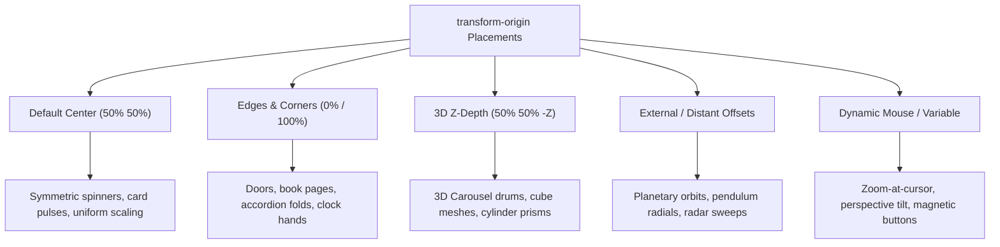

# 062: CSS Transform Origin Manipulation Masterclass

## Overview & Executive Summary

In CSS spatial rendering, geometric operations such as `rotate()`, `scale()`, and `skew()` do not operate in a vacuum—they require a geometric anchor or pivot point around which all coordinate calculations take place. This anchor is governed by **`transform-origin`**.

By default, every HTML element transforms around its geometric midpoint (`50% 50% 0` or `center center`). While intuitive for basic symmetric pulses or spins, relying solely on this default limits interfaces to robotic, unnatural motion. Manipulating the transform origin allows developers to recreate real-world physical mechanisms:
- Clock hands and speedometer gauges pivoting from their mechanical bases (`50% 100%`)
- 3D origami folds, books, and accordion panels hinging along edges (`top center` or `left center`)
- Rustic hanging signs oscillating in the wind from suspension hooks (`top center`)
- 3D cylindrical carousels and polyhedral prisms using negative $Z$-axis depth origins (`50% 50% -250px`)
- Dynamic cursor-following zoom lenses where the transformation focal point tracks mouse coordinates in real time

```
+-------------------------------------------------------------------------------+
|                    TRANSFORM ORIGIN SPATIAL TAXONOMY                          |
|                                                                               |
|   1. Center Pivot (Default)    2. Edge / Corner Hinge    3. External Anchor   |
|         (50% 50%)                   (0% 0% / 50% 100%)       (50% 300px)      |
|           ┌───┐                          ●───┐                                |
|           │ ● │  (Spin / Pulse)          │   │  (Door / Drop)     ┌───┐       |
|           └───┘                          └───┘                    │   │       |
|                                                                   └───┘       |
|                                                                     ▲         |
|   4. 3D Z-Depth Axis          5. SVG Fill-Box Anchor                │ Orbit   |
|         (50% 50% -200px)            (transform-box)                 ● Pivot   |
|           ┌───┐                          ┌───┐                                |
|           │   │                          │ ● │ (Vector Shape                  |
|           └───┘ ───► ● Z-Origin          └───┘  Local Center)                 |
+-------------------------------------------------------------------------------+
```

---

## Quick Reference Metadata

| Attribute | Specification Details |
| :--- | :--- |
| **Name** | CSS Transform Origin Manipulation |
| **Category** | CSS Transforms, Spatial Rendering & Geometric Kinematics |
| **Difficulty** | Advanced (4/5) |
| **What it produces** | Exact spatial redirection of geometric transformations (`rotate`, `scale`, `skew`, 3D matrices) by establishing customized 2D/3D coordinate pivot points. |
| **Why it works** | The rendering engine translates the local coordinate system to origin $\mathbf{o}$, evaluates the transformation matrix $M$, and translates back by $-\mathbf{o}$: $T(\mathbf{o}) \cdot M \cdot T(-\mathbf{o})$. |
| **Key Properties** | `transform-origin`, `transform`, `transform-box`, `transform-style`, `perspective`, `rotate`, `scale`, `translate`, `backface-visibility`, `will-change`. |
| **Syntax Variants** | 1-value (`center`, `left`, `50px`, `20%`), 2-value (`left top`, `50% 100%`, `calc(50% - 10px) 0`), 3-value (`50% 50% -150px` for 3D depth). |
| **Strict Constraints** | The 3rd value ($Z$-offset) **must be a `<length>`**, never a percentage. In SVG, percentages resolve to the viewport unless `transform-box: fill-box` is explicitly declared. |
| **Browser Baseline** | Baseline 2015+ for 2D/3D HTML transforms. `transform-box: fill-box` supported across all modern engines (Chromium, Firefox, Safari 13.1+). |
| **Performance Tier** | Compositor-driven (60/120 FPS) when animating `transform` with a static origin. Transitioning `transform-origin` dynamically triggers paint recalculation. |

### Quick Preview

```html
<div class="hinged-card-container">
  <article class="hinged-card" aria-label="Foldable Notice">
    <div class="card-face">Hinged Door Notice</div>
  </article>
</div>
```

```css
.hinged-card-container {
  perspective: 1000px;
}

.hinged-card {
  inline-size: 240px;
  block-size: 160px;
  background: linear-gradient(135deg, #6366f1, #3b82f6);
  border-radius: 12px;
  /* Shift pivot from center to the exact left edge */
  transform-origin: left center;
  transition: transform 600ms cubic-bezier(0.34, 1.56, 0.64, 1);
}

.hinged-card-container:hover .hinged-card {
  /* Swings outward like an open door around the left hinge */
  transform: rotateY(-45deg);
}
```

---

## 1. Anatomy & Mathematical Mental Models

### 1.1 The Affine Transformation Matrix & Origin Equation

In 2D and 3D computer graphics, transformations do not translate the canvas origin by default; they evaluate coordinates relative to $(0, 0, 0)$. 

When `transform-origin: ox oy oz` is specified, the browser calculates the composite affine transformation matrix $M_{\text{final}}$ for any input vertex $\mathbf{p} = [x, y, z, 1]^T$ as follows:

$$M_{\text{final}} = T(o_x, o_y, o_z) \cdot M_{\text{transform}} \cdot T(-o_x, -o_y, -o_z)$$

Where:
1. $T(-o_x, -o_y, -o_z)$ shifts the entire element so that the specified pivot point coincides with the local coordinate origin $(0, 0, 0)$.
2. $M_{\text{transform}}$ applies the developer's requested transformation (rotation, scaling, shearing/skewing).
3. $T(o_x, o_y, o_z)$ translates the geometry back to its original layout position.

```
Coordinate Space:
         (0, 0) Top-Left
           ┌────────────────────────────┐
           │                            │
           │        (50%, 50%)          │
           │          Center            │
           │             ●              │
           │                            │
           └────────────────────────────┘
         (0, 100%)                  (100%, 100%)
        Bottom-Left                 Bottom-Right

Step 1: Translate to Origin       Step 2: Apply Rotate(θ)      Step 3: Translate Back
      ┌──────────┐                      ┌──────────┐                 ┌──────────┐
      │          │                 \    │          │                 │   \      │
      │    ●     │  ───────►        \   │    ●     │   ───────►      │    \     │
      │  (0,0)   │                   \  │          │                 │     \    │
      └──────────┘                      └──────────┘                 └──────────┘
```

> [!NOTE]
> **Why Translation Is Unaffected by `transform-origin`:**
> Translation matrices commute with translation matrices:
> $$T(\mathbf{o}) \cdot T(\mathbf{d}) \cdot T(-\mathbf{o}) = T(\mathbf{d})$$
> Therefore, `translate(100px, 50px)` produces the exact same spatial displacement regardless of whether `transform-origin` is `top left`, `center`, or `1000px 500px`. However, **rotation, scale, and skew depend directly on origin**.

---

### 1.2 Comparison of Transform Origin Spatial Placements



| Origin Position | Syntax Equivalents | Mathematical Behavior | Primary Real-World Metaphor |
| :--- | :--- | :--- | :--- |
| **Center** | `50% 50%`, `center center` | Symmetrical rotation & scale along bounding box center | Spinning coin, camera aperture, pulsing badge |
| **Top Center** | `50% 0%`, `top center`, `center top` | Top edge remains stationary; vertical scale & swing hangs down | Hanging chalkboard, swinging pendulum, dropdown shade |
| **Bottom Center** | `50% 100%`, `bottom center` | Base remains grounded; top arcs through space | Analog clock hands, speedometer needle, skyscraper scale |
| **Left Center** | `0% 50%`, `left center` | Left vertical seam is locked in space | Book spine, hinged door, accordion folding leaf |
| **Top Left Corner** | `0% 0%`, `left top` | Upper-left vertex is fixed $(0,0)$ | Unfolding origami map, diagonal scale-out tooltip |
| **3D Z-Depth Offset** | `50% 50% -200px` | Pivot is pushed back into 3D screen space | 3D carousel cylinder, revolving circular menu |
| **External Radius** | `50% calc(100% + 200px)` | Pivot is floating in space far outside element | Orbiting satellite, planetary moon, radar wand |

---

### 1.3 The Critical SVG Viewport Trap (`transform-box`)

One of the most persistent bugs in SVG animation occurs when applying `transform-origin` to SVG `<g>`, `<path>`, `<circle>`, or `<rect>` elements.

```
HTML Box Model vs. SVG Coordinate Canvas:

  HTML Element Box Model:                   SVG Root Viewport (0, 0):
  ┌─────────────────────────┐               ┌─────────────────────────────────┐
  │ transform-origin: 50%   │               │ (0,0) SVG Canvas Origin         │
  │ resolves to element box │               │                                 │
  │            ●            │               │         ┌───────┐               │
  │                         │               │         │ <path>│ ◄─── 50% 50%  │
  └─────────────────────────┘               │         └───────┘      defaults │
                                            │                        to SVG   │
                                            │                        canvas!  │
                                            └─────────────────────────────────┘
```

#### The Root Cause:
In SVG 1.1, percentage values in `transform-origin` resolved to the **entire `<svg>` viewBox**, NOT the bounding box of the specific sub-element!

#### The Modern CSS Solution:
Declare `transform-box: fill-box` alongside `transform-origin`.

```css
/* BROKEN: Rotates around the SVG canvas top-left coordinate */
.svg-gear {
  transform-origin: 50% 50%;
  transform: rotate(45deg);
}

/* FIXED: Rotates precisely around the vector gear's own bounding box */
.svg-gear-fixed {
  transform-box: fill-box;
  transform-origin: center;
  transform: rotate(45deg);
}
```

```
┌─────────────────────────────────────────────────────────────────────────────┐
│                    TRANSFORM-BOX PROPERTY REFERENCE                         │
├───────────────────┬─────────────────────────────────────────────────────────┤
│ Value             │ Origin Reference Geometry                               │
├───────────────────┼─────────────────────────────────────────────────────────┤
│ `view-box`        │ Uses the nearest SVG viewport / viewBox as reference    │
│ `fill-box`        │ Uses the object's tight bounding box (essential for SVG)│
│ `stroke-box`      │ Uses the bounding box including stroke thickness        │
│ `border-box`      │ Uses the HTML element's border box (standard HTML)      │
│ `content-box`     │ Uses the HTML element's content box                     │
└───────────────────┴─────────────────────────────────────────────────────────┘
```

---

## 2. Core Architectural Patterns

---

### Pattern 1: Precision Mechanical Clock & Gauge Dials (Radial & Offset Base Origins)

An interactive chronograph gauge featuring multi-needle kinematics: an hour hand, minute hand, sub-second dial, and a precision counterweighted second hand with an offset origin (`50% 82%`).

```
          12                     Needle Origin Geometry:
      ┌───┴───┐                  
   9 ─┤   ●   ├─ 3               ┌──┐ Top Point
      └───┬───┘                  │  │
          6                      │  │
                                 └──┘
                                   ● Pivot Point (transform-origin: 50% 82%)
                                 ┌──┐ Counterweight Tail
                                 └──┘
```

#### HTML
```html
<section class="chronograph-station" aria-labelledby="chrono-heading">
  <header class="station-header">
    <h2 id="chrono-heading">Precision Chronograph & Telemetry Dial</h2>
    <p>Mechanical needle kinematics powered by bottom-offset transform origins.</p>
  </header>

  <div class="dial-housing" role="img" aria-label="Analog Telemetry Gauge">
    <!-- Outer Bezel Markings -->
    <div class="dial-face">
      <div class="dial-tick tick-0"></div>
      <div class="dial-tick tick-30"></div>
      <div class="dial-tick tick-60"></div>
      <div class="dial-tick tick-90"></div>
      <div class="dial-tick tick-120"></div>
      <div class="dial-tick tick-150"></div>

      <!-- Sub-dial Gauge -->
      <div class="sub-dial">
        <div class="sub-hand" id="subHand"></div>
        <div class="sub-cap"></div>
      </div>

      <!-- Main Clock Hands -->
      <div class="dial-hand hour-hand" id="hourHand"></div>
      <div class="dial-hand minute-hand" id="minHand"></div>
      <div class="dial-hand second-hand" id="secHand"></div>
      
      <!-- Central Cap -->
      <div class="center-bezel-cap"></div>
    </div>
  </div>

  <div class="station-controls">
    <button type="button" class="btn-ctrl" id="toggleChronoBtn">Start Telemetry Sweep</button>
    <button type="button" class="btn-ctrl" id="resetChronoBtn">Reset Zero</button>
  </div>
</section>
```

#### CSS
```css
/* ==========================================================================
   Pattern 1: Chronograph Dial & Needles
   ========================================================================== */

.chronograph-station {
  max-inline-size: 580px;
  margin-inline: auto;
  padding: 2.5rem;
  background: #090d16;
  border-radius: 28px;
  border: 1px solid rgba(255, 255, 255, 0.08);
  box-shadow: 0 30px 60px -12px rgba(0, 0, 0, 0.7);
  color: #f8fafc;
  font-family: system-ui, -apple-system, sans-serif;
  text-align: center;
}

.station-header h2 {
  font-size: 1.5rem;
  font-weight: 700;
  margin-block-end: 0.5rem;
  background: linear-gradient(135deg, #38bdf8, #818cf8);
  -webkit-background-clip: text;
  -webkit-text-fill-color: transparent;
}

.station-header p {
  color: #94a3b8;
  font-size: 0.875rem;
  margin-block-end: 2rem;
}

/* Dial Enclosure */
.dial-housing {
  position: relative;
  inline-size: 280px;
  block-size: 280px;
  margin-inline: auto;
  margin-block-end: 2rem;
  border-radius: 50%;
  padding: 12px;
  background: linear-gradient(145deg, #1e293b, #0f172a);
  box-shadow: inset 0 2px 4px rgba(255, 255, 255, 0.1),
              0 20px 40px rgba(0, 0, 0, 0.8);
}

.dial-face {
  position: relative;
  inline-size: 100%;
  block-size: 100%;
  border-radius: 50%;
  background: radial-gradient(circle at center, #1e2433 0%, #0b0f19 100%);
  border: 2px solid rgba(255, 255, 255, 0.05);
}

/* Dial Tick Marks (Rotated from Center Origin) */
.dial-tick {
  position: absolute;
  inset-inline-start: calc(50% - 1px);
  inset-block-start: 8px;
  inline-size: 2px;
  block-size: 12px;
  background: rgba(255, 255, 255, 0.3);
  /* The tick rotates around the exact center of the dial face */
  transform-origin: 50% 120px;
}

.tick-0   { transform: rotate(0deg); }
.tick-30  { transform: rotate(30deg); }
.tick-60  { transform: rotate(60deg); }
.tick-90  { transform: rotate(90deg); background: #38bdf8; }
.tick-120 { transform: rotate(120deg); }
.tick-150 { transform: rotate(150deg); }

/* Sub-Dial */
.sub-dial {
  position: absolute;
  inset-inline-start: calc(50% - 35px);
  inset-block-start: 45px;
  inline-size: 70px;
  block-size: 70px;
  border-radius: 50%;
  border: 1px dashed rgba(255, 255, 255, 0.15);
  background: rgba(0, 0, 0, 0.2);
}

.sub-hand {
  position: absolute;
  inset-inline-start: calc(50% - 1px);
  inset-block-start: 8px;
  inline-size: 2px;
  block-size: 27px;
  background: #38bdf8;
  border-radius: 2px;
  /* Pivot at bottom base */
  transform-origin: 50% 100%;
  transform: rotate(0deg);
  transition: transform 100ms linear;
}

.sub-cap {
  position: absolute;
  inset: calc(50% - 4px);
  inline-size: 8px;
  block-size: 8px;
  border-radius: 50%;
  background: #cbd5e1;
}

/* Hands Base Styling */
.dial-hand {
  position: absolute;
  inset-inline-start: 50%;
  border-radius: 9999px;
  will-change: transform;
}

/* Hour Hand: Pinned at bottom center (50% 100%) */
.hour-hand {
  inset-block-start: calc(50% - 60px);
  inline-size: 6px;
  block-size: 60px;
  margin-inline-start: -3px;
  background: linear-gradient(to top, #e2e8f0, #94a3b8);
  transform-origin: 50% 100%;
  transform: rotate(45deg);
  z-index: 3;
}

/* Minute Hand: Pinned at bottom center (50% 100%) */
.minute-hand {
  inset-block-start: calc(50% - 95px);
  inline-size: 4px;
  block-size: 95px;
  margin-inline-start: -2px;
  background: linear-gradient(to top, #38bdf8, #0284c7);
  transform-origin: 50% 100%;
  transform: rotate(190deg);
  z-index: 4;
}

/* Second Hand: Counterweighted with Offset Origin (50% 82%) */
.second-hand {
  inset-block-start: calc(50% - 105px);
  inline-size: 2px;
  block-size: 130px; /* 105px pointing up, 25px counterweight tail */
  margin-inline-start: -1px;
  background: #f43f5e;
  /* Crucial: Pivot point is 105px from top, which is ~80.7% down the length */
  transform-origin: 50% 105px;
  transform: rotate(0deg);
  z-index: 5;
  transition: transform 50ms cubic-bezier(0.1, 2.7, 0.58, 1);
}

.center-bezel-cap {
  position: absolute;
  inset-inline-start: calc(50% - 8px);
  inset-block-start: calc(50% - 8px);
  inline-size: 16px;
  block-size: 16px;
  border-radius: 50%;
  background: radial-gradient(circle at 35% 35%, #ffffff, #64748b 70%, #0f172a);
  box-shadow: 0 2px 6px rgba(0, 0, 0, 0.6);
  z-index: 6;
}

/* Control Buttons */
.station-controls {
  display: flex;
  justify-content: center;
  gap: 1rem;
}

.btn-ctrl {
  background: rgba(255, 255, 255, 0.06);
  border: 1px solid rgba(255, 255, 255, 0.12);
  color: #e2e8f0;
  padding: 0.625rem 1.25rem;
  border-radius: 12px;
  font-weight: 600;
  font-size: 0.875rem;
  cursor: pointer;
  transition: all 200ms ease;
}

.btn-ctrl:hover {
  background: rgba(56, 189, 248, 0.15);
  border-color: #38bdf8;
  color: #38bdf8;
}
```

---

### Pattern 2: 3D Origami Accordion & Book Page Flip (Edge Hinges)

A multi-leaf 3D accordion panel and realistic book page flip where every fold hinges along its `top`, `bottom`, `left`, or `right` boundary using CSS 3D perspective and edge origins.

```
       UNFOLDING 3D ACCORDION LEAVES:
       
       ┌─────────────────────────────────┐  Leaf 1 (Origin: Top Center)
       │  Fold 1: Overview & Abstract    │  rotateX(0deg)
       └─────────────────────────────────┘
                       ▲ Hinge (transform-origin: top center)
       ┌ ─ ─ ─ ─ ─ ─ ─ ─ ─ ─ ─ ─ ─ ─ ─ ─ ┐  Leaf 2
       │  Fold 2: Architecture Deep-Dive │  rotateX(-90deg) -> 0deg
       └ ─ ─ ─ ─ ─ ─ ─ ─ ─ ─ ─ ─ ─ ─ ─ ─ ┘
                       ▲ Hinge (transform-origin: top center)
       ┌ ─ ─ ─ ─ ─ ─ ─ ─ ─ ─ ─ ─ ─ ─ ─ ─ ┐  Leaf 3
       │  Fold 3: Telemetry Schema       │  rotateX(-90deg) -> 0deg
       └ ─ ─ ─ ─ ─ ─ ─ ─ ─ ─ ─ ─ ─ ─ ─ ─ ┘
```

#### HTML
```html
<section class="origami-showcase">
  <div class="origami-card" id="origamiCard" tabindex="0" role="region" aria-label="Interactive 3D Fold Card">
    
    <!-- Top Static Master Leaf -->
    <header class="leaf leaf-master">
      <div class="leaf-content">
        <span class="badge-tag">Doc #409</span>
        <h3>Quantum Mesh Protocol</h3>
        <p>Click or press Enter to unfold technical schematics.</p>
      </div>
      <span class="unfold-indicator" aria-hidden="true">▾</span>
    </header>

    <!-- Secondary Hinged Leaf (Hinges from Top) -->
    <div class="leaf leaf-sub leaf-1">
      <div class="leaf-content">
        <h4>01 / Sub-System Topology</h4>
        <p>Nodes leverage synchronized phase-locked oscillation rings with zero transport jitter.</p>
      </div>

      <!-- Tertiary Hinged Leaf (Hinges from Top of Leaf 1) -->
      <div class="leaf leaf-sub leaf-2">
        <div class="leaf-content">
          <h4>02 / Cryptographic Parity</h4>
          <p>Lattice-based nonces validated across isolated hardware enclaves in &lt;1.2ms.</p>
        </div>
      </div>
    </div>

  </div>
</section>
```

#### CSS
```css
/* ==========================================================================
   Pattern 2: 3D Origami Accordion
   ========================================================================== */

.origami-showcase {
  display: grid;
  place-items: center;
  padding: 3rem 1.5rem;
  background: #0b0f19;
  perspective: 1200px; /* Essential 3D depth context */
}

.origami-card {
  inline-size: 360px;
  cursor: pointer;
  outline: none;
  transform-style: preserve-3d;
}

/* Master Top Leaf */
.leaf {
  position: relative;
  background: #1e293b;
  border: 1px solid rgba(255, 255, 255, 0.1);
  padding: 1.5rem;
  box-sizing: border-box;
  color: #f8fafc;
  transform-style: preserve-3d;
}

.leaf-master {
  border-radius: 16px 16px 0 0;
  background: linear-gradient(145deg, #1e1b4b, #312e81);
  display: flex;
  justify-content: space-between;
  align-items: center;
  z-index: 10;
  box-shadow: 0 10px 25px rgba(0, 0, 0, 0.4);
}

.badge-tag {
  font-size: 0.6875rem;
  font-weight: 700;
  text-transform: uppercase;
  letter-spacing: 0.1em;
  color: #a5b4fc;
}

.leaf-master h3 {
  font-size: 1.125rem;
  font-weight: 700;
  margin: 0.25rem 0;
}

.leaf-master p {
  font-size: 0.8125rem;
  color: #c7d2fe;
  margin: 0;
}

.unfold-indicator {
  font-size: 1.25rem;
  color: #a5b4fc;
  transition: transform 500ms cubic-bezier(0.34, 1.56, 0.64, 1);
}

/* Sub-Leaf 1: Hinged to bottom of Leaf-Master */
.leaf-1 {
  background: #0f172a;
  border-top: none;
  /* CRUCIAL: Hinge at the exact top edge */
  transform-origin: top center;
  transform: rotateX(-90deg);
  opacity: 0;
  transition: transform 600ms cubic-bezier(0.16, 1, 0.3, 1),
              opacity 300ms ease;
  will-change: transform, opacity;
}

/* Sub-Leaf 2: Hinged to bottom of Leaf 1 */
.leaf-2 {
  position: absolute;
  inset-inline-start: -1px;
  inset-inline-end: -1px;
  inset-block-start: 100%;
  border-radius: 0 0 16px 16px;
  background: #090d16;
  border-top: none;
  /* CRUCIAL: Hinge at the exact top edge */
  transform-origin: top center;
  transform: rotateX(-90deg);
  opacity: 0;
  transition: transform 600ms cubic-bezier(0.16, 1, 0.3, 1) 100ms,
              opacity 300ms ease 100ms;
  box-shadow: 0 20px 40px rgba(0, 0, 0, 0.8);
  will-change: transform, opacity;
}

.leaf-sub h4 {
  font-size: 0.875rem;
  font-weight: 700;
  color: #38bdf8;
  margin: 0 0 0.25rem 0;
}

.leaf-sub p {
  font-size: 0.8125rem;
  color: #94a3b8;
  line-height: 1.4;
  margin: 0;
}

/* EXPANDED ACTIVE STATE */
.origami-card.is-unfolded .unfold-indicator,
.origami-card:hover .unfold-indicator {
  transform: rotate(180deg);
}

.origami-card.is-unfolded .leaf-1,
.origami-card:hover .leaf-1 {
  transform: rotateX(0deg);
  opacity: 1;
}

.origami-card.is-unfolded .leaf-2,
.origami-card:hover .leaf-2 {
  transform: rotateX(0deg);
  opacity: 1;
}
```

---

### Pattern 3: 3D Cylindrical Ring & Prism Carousels (Negative Z-Axis Origin)

By setting `transform-origin: 50% 50% -r` (where $r$ is the apothem/radius of a regular polygon of $n$ panels), panels rotate cleanly around a shared central 3D cylinder without complex per-item translational math.

```
       3D CYLINDRICAL CAROUSEL MATHEMATICS:
       
       Apothem Radius Formula:
       r = width / (2 * tan(180deg / n))
       
       For 6 panels of width 200px:
       r = 200 / (2 * tan(30deg)) = 200 / (2 * 0.577) ≈ 173.2px
       
                      Panel 1 (rotateY: 0deg)
                            ┌───────┐
             Panel 6       /         \       Panel 2
          (rotateY: -60deg)           (rotateY: 60deg)
                           \         /
             Panel 5        \   ●   /        Panel 3
          (rotateY: -120deg)  Center (rotateY: 120deg)
                            └───────┘
                      Panel 4 (rotateY: 180deg)
```

#### HTML
```html
<section class="carousel-3d-section" aria-labelledby="carousel-title">
  <header class="section-title">
    <h2 id="carousel-title">3D Cylindrical Spatial Prism</h2>
    <p>All 6 faces share a uniform depth origin: <code>transform-origin: 50% 50% -173.2px</code></p>
  </header>

  <div class="carousel-viewport">
    <div class="carousel-cylinder" id="cylinderStage">
      <article class="carousel-panel panel-1">
        <span class="panel-num">01</span>
        <h3>Neural Synthetics</h3>
      </article>
      <article class="carousel-panel panel-2">
        <span class="panel-num">02</span>
        <h3>Hyper-Lattice</h3>
      </article>
      <article class="carousel-panel panel-3">
        <span class="panel-num">03</span>
        <h3>Quantum Vault</h3>
      </article>
      <article class="carousel-panel panel-4">
        <span class="panel-num">04</span>
        <h3>Vector Stream</h3>
      </article>
      <article class="carousel-panel panel-5">
        <span class="panel-num">05</span>
        <h3>Optic Relay</h3>
      </article>
      <article class="carousel-panel panel-6">
        <span class="panel-num">06</span>
        <h3>Zero-Knowledge</h3>
      </article>
    </div>
  </div>

  <nav class="carousel-nav" aria-label="Rotate Cylinder">
    <button type="button" class="btn-nav" id="prevPanelBtn" aria-label="Previous Face">&larr; Previous</button>
    <button type="button" class="btn-nav" id="nextPanelBtn" aria-label="Next Face">Next &rarr;</button>
  </nav>
</section>
```

#### CSS
```css
/* ==========================================================================
   Pattern 3: 3D Cylindrical Ring Carousel
   ========================================================================== */

:root {
  --panel-w: 200px;
  --panel-h: 260px;
  /* Radius r = 200 / (2 * tan(30deg)) = 173.205px */
  --cylinder-radius: 173.205px;
}

.carousel-3d-section {
  max-inline-size: 720px;
  margin-inline: auto;
  padding: 3rem 1.5rem;
  background: #030712;
  border-radius: 28px;
  text-align: center;
  color: #f9fafb;
}

.carousel-viewport {
  position: relative;
  inline-size: 100%;
  block-size: 340px;
  display: grid;
  place-items: center;
  perspective: 1000px; /* Perspective viewing frustum */
  overflow: hidden;
}

.carousel-cylinder {
  position: relative;
  inline-size: var(--panel-w);
  block-size: var(--panel-h);
  transform-style: preserve-3d;
  transition: transform 800ms cubic-bezier(0.16, 1, 0.3, 1);
}

.carousel-panel {
  position: absolute;
  inset: 0;
  border-radius: 20px;
  padding: 1.5rem;
  display: flex;
  flex-direction: column;
  justify-content: space-between;
  background: rgba(17, 24, 39, 0.85);
  border: 1px solid rgba(255, 255, 255, 0.12);
  backdrop-filter: blur(12px);
  box-shadow: 0 10px 30px rgba(0, 0, 0, 0.5);
  backface-visibility: hidden; /* Clean performance & readability */
  user-select: none;
  
  /* CRITICAL 3D DEPTH ORIGIN: Push the rotation pivot backward along Z */
  transform-origin: 50% 50% calc(-1 * var(--cylinder-radius));
}

/* Face Rotations around the common negative Z-origin */
.panel-1 { transform: rotateY(0deg);   border-color: #38bdf8; }
.panel-2 { transform: rotateY(60deg);  border-color: #818cf8; }
.panel-3 { transform: rotateY(120deg); border-color: #c084fc; }
.panel-4 { transform: rotateY(180deg); border-color: #f472b6; }
.panel-5 { transform: rotateY(240deg); border-color: #fb923c; }
.panel-6 { transform: rotateY(300deg); border-color: #34d399; }

.panel-num {
  font-size: 0.875rem;
  font-weight: 800;
  opacity: 0.6;
  text-align: left;
}

.carousel-panel h3 {
  font-size: 1.25rem;
  font-weight: 700;
  margin: 0;
  text-align: left;
}

/* Navigation Controls */
.carousel-nav {
  display: flex;
  justify-content: center;
  gap: 1rem;
  margin-block-start: 1.5rem;
}

.btn-nav {
  background: rgba(255, 255, 255, 0.05);
  border: 1px solid rgba(255, 255, 255, 0.15);
  color: #ffffff;
  padding: 0.625rem 1.25rem;
  border-radius: 9999px;
  font-weight: 600;
  cursor: pointer;
  transition: all 200ms ease;
}

.btn-nav:hover {
  background: #3b82f6;
  border-color: #60a5fa;
  box-shadow: 0 0 16px rgba(59, 130, 246, 0.4);
}
```

---

### Pattern 4: Physics-Based Hanging Signboard (Top Suspension Pivot)

A realistic suspended tavern/boutique sign swinging with decaying harmonic oscillation around its upper mounting brackets (`transform-origin: top center`).

```
          [ Hook ]             [ Hook ]
             │                    │
             ▼                    ▼
        ┌────●────────────────────●────┐  ◄─── transform-origin: top center
        │                              │
        │      THE ARCHITECT'S PUB     │       \  Swings like a pendulum
        │    Est. 2026 • Open 24/7     │        \ with harmonic damping
        │                              │
        └──────────────────────────────┘
```

#### HTML
```html
<div class="sign-rigging-area">
  <div class="sign-assembly" id="swingSign" tabindex="0" role="region" aria-label="Interactive Hanging Signboard">
    <!-- Mounting Bracket Screws -->
    <div class="mounting-bracket">
      <span class="chain chain-left"></span>
      <span class="chain chain-right"></span>
    </div>

    <!-- The Swinging Plate -->
    <div class="sign-board">
      <span class="sign-kicker">Atelier</span>
      <h3 class="sign-brand">L'Avant-Garde</h3>
      <p class="sign-caption">Spatial Design & Typographic Craft</p>
      <div class="sign-nail nail-l"></div>
      <div class="sign-nail nail-r"></div>
    </div>
  </div>
</div>
```

#### CSS
```css
/* ==========================================================================
   Pattern 4: Hanging Signboard with Damped Harmonic Swing
   ========================================================================== */

.sign-rigging-area {
  display: grid;
  place-items: center;
  padding: 4rem 2rem;
  background: #0f172a;
}

.sign-assembly {
  position: relative;
  inline-size: 320px;
  cursor: pointer;
  outline: none;
}

/* Chains */
.mounting-bracket {
  position: relative;
  inline-size: 100%;
  block-size: 40px;
}

.chain {
  position: absolute;
  inset-block-start: 0;
  inline-size: 2px;
  block-size: 40px;
  background: repeating-linear-gradient(
    to bottom,
    #94a3b8 0px,
    #94a3b8 4px,
    #475569 4px,
    #475569 8px
  );
}

.chain-left  { inset-inline-start: 40px; }
.chain-right { inset-inline-end: 40px; }

/* The Hanging Board */
.sign-board {
  position: relative;
  background: linear-gradient(135deg, #1e293b, #0f172a);
  border: 2px solid #334155;
  border-radius: 12px;
  padding: 2rem 1.5rem;
  text-align: center;
  color: #f8fafc;
  box-shadow: 0 20px 30px rgba(0, 0, 0, 0.6);
  
  /* CRITICAL: Pivot from the top suspension point */
  transform-origin: top center;
  transform: rotate(0deg);
  transition: transform 200ms ease;
  will-change: transform;
}

.sign-nail {
  position: absolute;
  inset-block-start: 8px;
  inline-size: 8px;
  block-size: 8px;
  border-radius: 50%;
  background: #64748b;
  box-shadow: inset 0 1px 2px rgba(0, 0, 0, 0.8);
}
.nail-l { inset-inline-start: 37px; }
.nail-r { inset-inline-end: 37px; }

.sign-kicker {
  font-size: 0.6875rem;
  font-weight: 700;
  letter-spacing: 0.2em;
  text-transform: uppercase;
  color: #f59e0b;
}

.sign-brand {
  font-size: 1.5rem;
  font-weight: 800;
  margin: 0.25rem 0 0.5rem 0;
  letter-spacing: -0.02em;
}

.sign-caption {
  font-size: 0.8125rem;
  color: #94a3b8;
  margin: 0;
}

/* Natural Harmonic Decay Swing Triggered on Hover or Click */
.sign-assembly:hover .sign-board,
.sign-assembly:focus-visible .sign-board,
.sign-assembly.is-swinging .sign-board {
  animation: pendulum-swing 3.2s cubic-bezier(0.25, 1, 0.5, 1) forwards;
}

@keyframes pendulum-swing {
  0%   { transform: rotate(0deg); }
  15%  { transform: rotate(18deg); }
  30%  { transform: rotate(-14deg); }
  45%  { transform: rotate(9deg); }
  60%  { transform: rotate(-5deg); }
  75%  { transform: rotate(2deg); }
  90%  { transform: rotate(-0.8deg); }
  100% { transform: rotate(0deg); }
}

@media (prefers-reduced-motion: reduce) {
  .sign-assembly:hover .sign-board,
  .sign-assembly.is-swinging .sign-board {
    animation: none;
    transform: none;
  }
}
```

---

### Pattern 5: Dynamic Cursor-Tracking Zoom Lens & Card Tilt (Variable Origin)

A high-performance product showcase card where hovering over any point dynamically recomputes the CSS `--zoom-x` and `--zoom-y` custom properties, shifting `transform-origin` to the exact pointer position for seamless magnification.

```
       POINTER TRACKING VARIABLE ORIGIN:
       
       Card Boundary:
       ┌──────────────────────────────┐
       │                              │
       │           Pointer            │
       │              (x, y)          │
       │                 ● ◄──────────┼─── transform-origin: var(--zoom-x) var(--zoom-y);
       │                              │    transform: scale(1.6);
       │                              │
       └──────────────────────────────┘
```

#### HTML
```html
<section class="lens-showcase">
  <div class="lens-card" id="lensCard" role="region" aria-label="Interactive Cursor Zoom Card">
    <div class="lens-media-wrapper">
      
      <div class="lens-reticle" id="lensReticle"></div>
    </div>
    <div class="lens-info">
      <span class="lens-tag">Precision Inspector</span>
      <h3>Chromatic Flow #89</h3>
      <p>Move your cursor across the canvas to inspect microscopic subpixel gradients.</p>
    </div>
  </div>
</section>
```

#### CSS
```css
/* ==========================================================================
   Pattern 5: Cursor-Tracking Dynamic Transform Origin
   ========================================================================== */

.lens-showcase {
  display: grid;
  place-items: center;
  padding: 3rem 1.5rem;
  background: #020617;
}

.lens-card {
  --zoom-x: 50%;
  --zoom-y: 50%;
  inline-size: 340px;
  background: #0f172a;
  border: 1px solid rgba(255, 255, 255, 0.1);
  border-radius: 20px;
  overflow: hidden;
  box-shadow: 0 25px 50px -12px rgba(0, 0, 0, 0.7);
  cursor: crosshair;
}

.lens-media-wrapper {
  position: relative;
  inline-size: 100%;
  block-size: 260px;
  overflow: hidden;
}

.lens-img {
  inline-size: 100%;
  block-size: 100%;
  object-fit: cover;
  display: block;
  
  /* CRITICAL: Dynamic transform origin driven by custom properties */
  transform-origin: var(--zoom-x) var(--zoom-y);
  transition: transform 250ms cubic-bezier(0.16, 1, 0.3, 1);
  will-change: transform, transform-origin;
}

.lens-card:hover .lens-img {
  transform: scale(2.2);
}

.lens-reticle {
  position: absolute;
  inset-inline-start: var(--zoom-x);
  inset-block-start: var(--zoom-y);
  inline-size: 40px;
  block-size: 40px;
  transform: translate(-50%, -50%);
  border: 1px dashed rgba(255, 255, 255, 0.8);
  border-radius: 50%;
  pointer-events: none;
  opacity: 0;
  transition: opacity 200ms ease;
}

.lens-card:hover .lens-reticle {
  opacity: 1;
}

.lens-info {
  padding: 1.5rem;
  color: #f8fafc;
}

.lens-tag {
  font-size: 0.6875rem;
  font-weight: 700;
  text-transform: uppercase;
  letter-spacing: 0.1em;
  color: #38bdf8;
}

.lens-info h3 {
  font-size: 1.25rem;
  font-weight: 700;
  margin: 0.25rem 0 0.5rem 0;
}

.lens-info p {
  font-size: 0.8125rem;
  color: #94a3b8;
  line-height: 1.4;
  margin: 0;
}
```

---

## 3. Advanced Transformation Kinematics & Syntax Matrix

### 3.1 Syntax Dissection & Dimensional Matrix

`transform-origin` accepts 1, 2, or 3 values depending on dimensionality:

```
/* 1-value syntax */
transform-origin: center;       /* -> 50% 50% 0 */
transform-origin: top;          /* -> 50% 0% 0 */
transform-origin: left;         /* -> 0% 50% 0 */
transform-origin: 30px;         /* -> 30px 50% 0 */

/* 2-value syntax */
transform-origin: left top;     /* -> 0% 0% 0 */
transform-origin: 50% 100%;     /* -> 50% 100% 0 (Bottom Center) */
transform-origin: 20px 80px;    /* -> 20px 80px 0 */
transform-origin: right 20px;   /* -> 100% 20px 0 */

/* 3-value syntax (3D Depth) */
transform-origin: 50% 50% -200px; /* x=50%, y=50%, z=-200px */
transform-origin: left top 50px;  /* x=0%, y=0%, z=50px */
```

> [!WARNING]
> **The Z-Offset Percentage Trap:**
> While $X$ and $Y$ offsets accept `<length-percentage>` values (e.g. `50%`, `2rem`, `120px`), the **$Z$-offset can ONLY be a `<length>`** (e.g., `px`, `rem`, `em`). Declaring `transform-origin: 50% 50% 50%` is invalid CSS and causes the entire property to be discarded by the browser parser!

---

### 3.2 Individual Transform Properties vs. Compound `transform`

In modern CSS, browsers support independent transformation properties: `scale`, `rotate`, and `translate`.

```css
.modern-spatial-node {
  /* Common origin shared across all individual transforms */
  transform-origin: top left;
  
  rotate: 45deg;
  scale: 1.2;
  translate: 50px 20px;
}
```

#### Order of Execution:
1. `translate` is applied first (unaffected by `transform-origin`).
2. `rotate` is applied second around `transform-origin`.
3. `scale` is applied third around `transform-origin`.

---

## 4. Performance, GPU Compositing & Frame Budget

```
┌─────────────────────────────────────────────────────────────────────────────┐
│                      GPU ACCELERATION PIPELINE MATRIX                       │
├──────────────────────────┬──────────────────────┬───────────────────────────┤
│ Scenario                 │ Engine Pipeline      │ Frame Rate Target         │
├──────────────────────────┼──────────────────────┼───────────────────────────┤
│ Fixed origin + transform │ Compositor Only      │ 60 FPS / 120 FPS Locked   │
│ Transitioning origin     │ Paint + Composite    │ May drop frames if abused │
│ Dynamic Mouse Origin     │ Compositor / Styles  │ 60 FPS with requestFrame  │
│ SVG without fill-box     │ Layout + Rasterize   │ Slow (CPU rasterization)  │
│ 3D preserve-3d meshes    │ Direct3D / Metal GPU │ 60 FPS / 120 FPS Locked   │
└──────────────────────────┴──────────────────────┴───────────────────────────┘
```

> [!TIP]
> **Compositor Promotion Optimization:**
> When applying complex 3D or radial transform-origin animations, always add `will-change: transform` and `backface-visibility: hidden` to avoid micro-stuttering and texture redraws.

---

## 5. Common Pitfalls, Edge Cases & Debugging Solutions

### Pitfall 1: The "Jumping Origin" Glitch during Transitions
- **Symptom**: When attempting to rotate around `top-left` on step 1, then scale around `bottom-right` on step 2, the element teleports or jumps violently between frames.
- **Root Cause**: Transitioning `transform-origin` changes the spatial reference point simultaneously with the matrix evaluation.
- **Fix**: Wrap the element in an outer container. Apply the first transformation (with its origin) to the parent, and the second transformation (with its distinct origin) to the child!

```html
<!-- Clean 2-Stage Multi-Origin Nested Composition -->
<div class="parent-hinge" style="transform-origin: top left; transform: rotate(20deg);">
  <div class="child-scale" style="transform-origin: center; transform: scale(1.5);">
    Content
  </div>
</div>
```

---

### Pitfall 2: SVG Element Spinning wildly around the page corner
- **Symptom**: An SVG `<circle>` or `<path>` with `transform-origin: center` spins around the top-left of the entire browser page instead of its own center.
- **Root Cause**: Missing `transform-box: fill-box`.
- **Fix**:
```css
.svg-element {
  transform-box: fill-box;
  transform-origin: center;
}
```

---

### Pitfall 3: Subpixel Blurriness on High-DPI Displays
- **Symptom**: Rotating around odd fractional origins (e.g., `calc(50% - 1.33px)`) causes text and edges to look blurry on 1x/2x displays.
- **Fix**: Use whole integer pixel values or exact percentages (`50%`, `100%`) for transform origins.

---

## 6. Complete JavaScript Interactive Controller

Here is the clean, accessible, zero-dependency controller script powering all the interactive patterns above:

```javascript
/**
 * Transform Origin Masterclass Controller
 */
document.addEventListener('DOMContentLoaded', () => {
  // 1. Chronograph Needles Controller
  const secHand = document.getElementById('secHand');
  const subHand = document.getElementById('subHand');
  const toggleChronoBtn = document.getElementById('toggleChronoBtn');
  const resetChronoBtn = document.getElementById('resetChronoBtn');
  
  let chronoRunning = false;
  let chronoInterval = null;
  let elapsedSeconds = 0;

  if (toggleChronoBtn && secHand && subHand) {
    toggleChronoBtn.addEventListener('click', () => {
      chronoRunning = !chronoRunning;
      if (chronoRunning) {
        toggleChronoBtn.textContent = 'Pause Telemetry';
        chronoInterval = setInterval(() => {
          elapsedSeconds += 0.1;
          const secDegrees = (elapsedSeconds % 60) * 6;
          const subDegrees = ((elapsedSeconds * 4) % 60) * 6;
          secHand.style.transform = `rotate(${secDegrees}deg)`;
          subHand.style.transform = `rotate(${subDegrees}deg)`;
        }, 100);
      } else {
        toggleChronoBtn.textContent = 'Resume Telemetry';
        clearInterval(chronoInterval);
      }
    });

    if (resetChronoBtn) {
      resetChronoBtn.addEventListener('click', () => {
        clearInterval(chronoInterval);
        chronoRunning = false;
        elapsedSeconds = 0;
        toggleChronoBtn.textContent = 'Start Telemetry Sweep';
        secHand.style.transform = 'rotate(0deg)';
        subHand.style.transform = 'rotate(0deg)';
      });
    }
  }

  // 2. Origami Accordion Keyboard / Click Trigger
  const origamiCard = document.getElementById('origamiCard');
  if (origamiCard) {
    const toggleOrigami = () => origamiCard.classList.toggle('is-unfolded');
    origamiCard.addEventListener('click', toggleOrigami);
    origamiCard.addEventListener('keydown', (e) => {
      if (e.key === 'Enter' || e.key === ' ') {
        e.preventDefault();
        toggleOrigami();
      }
    });
  }

  // 3. 3D Cylindrical Carousel Controller
  const cylinderStage = document.getElementById('cylinderStage');
  const prevPanelBtn = document.getElementById('prevPanelBtn');
  const nextPanelBtn = document.getElementById('nextPanelBtn');
  let currentRotationY = 0;

  if (cylinderStage && prevPanelBtn && nextPanelBtn) {
    prevPanelBtn.addEventListener('click', () => {
      currentRotationY += 60;
      cylinderStage.style.transform = `rotateY(${currentRotationY}deg)`;
    });

    nextPanelBtn.addEventListener('click', () => {
      currentRotationY -= 60;
      cylinderStage.style.transform = `rotateY(${currentRotationY}deg)`;
    });
  }

  // 4. Physics Signboard Oscillation Trigger
  const swingSign = document.getElementById('swingSign');
  if (swingSign) {
    swingSign.addEventListener('click', () => {
      swingSign.classList.remove('is-swinging');
      void swingSign.offsetWidth; // Force DOM reflow to restart animation
      swingSign.classList.add('is-swinging');
    });
  }

  // 5. Cursor-Tracking Dynamic Origin Lens
  const lensCard = document.getElementById('lensCard');
  if (lensCard) {
    lensCard.addEventListener('mousemove', (e) => {
      const rect = lensCard.getBoundingClientRect();
      const x = ((e.clientX - rect.left) / rect.width) * 100;
      const y = ((e.clientY - rect.top) / rect.height) * 100;
      
      lensCard.style.setProperty('--zoom-x', `${x.toFixed(2)}%`);
      lensCard.style.setProperty('--zoom-y', `${y.toFixed(2)}%`);
    });

    lensCard.addEventListener('mouseleave', () => {
      lensCard.style.setProperty('--zoom-x', '50%');
      lensCard.style.setProperty('--zoom-y', '50%');
    });
  }
});
```

---

## 7. Master Production Checklist for Transform Origins

- [ ] **Coordinate Dimensionality**: Are $X$ and $Y$ offsets provided as valid percentages or lengths, and is the $Z$-offset strictly a `<length>` (e.g. `px`), avoiding percentage values?
- [ ] **SVG Compatibility**: Is `transform-box: fill-box` attached to any SVG vector elements that animate with `transform-origin`?
- [ ] **Nested Origin Separation**: Have you avoided simultaneous transitions of `transform-origin` on a single node by utilizing parent/child nested structural layers?
- [ ] **Perspective Frustum**: Is `perspective: 800px-1200px` declared on the parent container when working with 3D $Z$-depth origins (`rotateX`, `rotateY`, `rotateZ`)?
- [ ] **GPU Promotion**: Are `will-change: transform` and `backface-visibility: hidden` configured on rotating and swinging 3D elements?
- [ ] **Accessibility Fallbacks**: Are reduced-motion alternatives configured with `@media (prefers-reduced-motion: reduce)` to disable swinging, orbiting, or disorienting rotations?
- [ ] **Keyboard Interaction**: Are interactive foldable panels and 3D carousels fully reachable and operable via keyboard (`Tab`, `Enter`, `Space`)?
