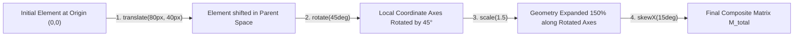

# 063: CSS Multiple Transforms Composition Masterclass

## Overview & Executive Summary

The CSS `transform` property is one of the most fundamental tools in modern web animation and spatial layout. However, when developers chain multiple transform functions—such as combining translation, rotation, scaling, and skewing—they frequently encounter unexpected geometric outcomes, inverted motion paths, or visual distortion.

**Multiple Transforms Composition** refers to the mathematical and programmatic technique of chaining, layering, and ordering spatial transformations on DOM elements. Because CSS transform functions are computed via **matrix multiplication**, the transformation pipeline is **strictly non-commutative**:

$$\mathbf{M}_{\text{total}} = \mathbf{M}_1 \times \mathbf{M}_2 \times \mathbf{M}_3 \dots \times \mathbf{M}_n \quad \neq \quad \mathbf{M}_n \times \dots \times \mathbf{M}_2 \times \mathbf{M}_1$$

Altering the sequence of transform functions fundamentally changes the coordinate space in which subsequent operations occur.

```
================================================================================
              THE ESSENTIAL PARADOX OF TRANSFORM ORDER OF OPERATIONS
================================================================================

  CASE A: TRANSLATE THEN ROTATE                CASE B: ROTATE THEN TRANSLATE
  transform: translate(120px, 0) rotate(45deg);  transform: rotate(45deg) translate(120px, 0);

      World Axis (Unchanged)                      World Axis Rotated by 45°
  (0,0)                                       (0,0)
    ┌────┐   ── Translate 120px ──> ┌────┐      ┌────┐
    │    │                          │    │      │    │  Rotate 45°
    └────┘                          └────┘      └────┘
                                       │           ╲
                                   Rotate 45°       ╲  Translate 120px along
                                       │             ╲ NEW local X-axis!
                                       ▼              ▼
                                     ◇                 ◇ (Moves Diagonally Down-Right!)
  Result: Centered on (120px, 0),             Result: Traverses along an angled vector
  rotated in place.                           to (~84.85px, ~84.85px).
================================================================================
```

Modern CSS introduces two complementary paradigms for spatial composition:
1. **The Chained `transform` List Property**: `transform: translate(...) rotate(...) scale(...)` evaluated as a cumulative transformation matrix.
2. **Individual Transform Properties** (CSS Transforms Module Level 2): `translate`, `rotate`, and `scale` as independent CSS properties that compose in a standardized, spec-defined sequence (`translate` $\rightarrow$ `rotate` $\rightarrow$ `scale` $\rightarrow$ `transform`).

Understanding how to orchestrate multiple transform functions, counter-transform child elements, exploit 3D stacking contexts, and leverage CSS custom properties unlocks complex spatial systems: isometric exploded architectures, radial orbit navigation, 3D interactive tilt cards, and physics-driven entrance animations.

---

## Quick Reference Metadata

| Attribute | Specification Details |
| :--- | :--- |
| **Name** | CSS Multiple Transforms Composition (Chained & Independent Transforms) |
| **Category** | CSS Transforms, 2D/3D Graphics & Spatial Animation |
| **Specification** | [W3C CSS Transforms Module Level 1 & Level 2](https://www.w3.org/TR/css-transforms-2/) |
| **Difficulty** | Advanced (4.2 / 5) |
| **What it produces** | Multi-axis spatial positioning, complex compound animations, 3D isometric and perspective scenes, radial menus, and decoupled component-level motion without layout thrashing. |
| **Why it works** | The browser calculates an affine $3\times3$ (for 2D) or projective $4\times4$ (for 3D) matrix from the left-to-right sequence of transform functions, applying each transformation to the local coordinate system established by preceding operations. |
| **Key Properties** | `transform`, `translate`, `rotate`, `scale`, `transform-origin`, `transform-style`, `perspective`, `perspective-origin`, `backface-visibility`, `matrix()`, `matrix3d()`. |
| **Strict Constraints** | **Order strictly matters**. `translate(X) rotate(Y)` is geometrically distinct from `rotate(Y) translate(X)`. Animating the shorthand `transform` property overwrites all chained functions unless individual properties or CSS custom properties are used. |
| **Browser Baseline** | Baseline 2022+ for individual properties (`translate`, `rotate`, `scale`) across Chrome 104+, Firefox 72+, Safari 14.1+, and Edge 104+. Chained `transform` supported universally. |
| **Acceptance Criteria** | 60/120 FPS compositor-only performance (zero reflow/repaint), correct mathematical trajectory during state changes, accessible reduced-motion fallbacks, zero text blurriness. |

### Quick Preview

```html
<div class="card-stage">
  <div class="interactive-composite-card">
    <div class="card-inner">
      <span class="badge">Composite 3D</span>
      <h3>Matrix Composition</h3>
      <p>Translate + Rotate + Scale + Perspective</p>
    </div>
  </div>
</div>
```

```css
.card-stage {
  perspective: 1000px;
  display: grid;
  place-items: center;
  min-block-size: 260px;
}

.interactive-composite-card {
  --tx: 0px;
  --ty: 0px;
  --rot-x: 0deg;
  --rot-y: 0deg;
  --scale: 1;

  inline-size: 240px;
  aspect-ratio: 4 / 3;
  background: oklch(0.2 0.04 260);
  border: 1px solid oklch(0.4 0.1 260 / 0.4);
  border-radius: 16px;
  padding: 1.5rem;
  color: oklch(0.95 0.02 260);
  cursor: pointer;

  /* Multiple Transforms Composition using Custom Properties */
  transform: 
    translate3d(var(--tx), var(--ty), 0)
    rotateX(var(--rot-x))
    rotateY(var(--rot-y))
    scale3d(var(--scale), var(--scale), 1);
  
  transform-style: preserve-3d;
  transition: transform 400ms cubic-bezier(0.16, 1, 0.3, 1),
              box-shadow 400ms ease;
  box-shadow: 0 10px 30px -10px oklch(0 0 0 / 0.5);
}

.interactive-composite-card:hover {
  --ty: -12px;
  --rot-x: 12deg;
  --rot-y: -8deg;
  --scale: 1.05;
  box-shadow: 0 25px 50px -12px oklch(0.1 0.05 260 / 0.8),
              0 0 20px 2px oklch(0.6 0.2 260 / 0.3);
}
```

---

## 1. Anatomy & Mathematical Mental Models

### 1.1 The Transform Function Execution Pipeline

To master multiple transforms, you must understand how the browser processes the transform string.

When CSS computes `transform: fn1() fn2() fn3()`, there are two complementary mental models for evaluating the geometry:

```
┌─────────────────────────────────────────────────────────────────────────────┐
│                    THE DUAL MENTAL MODELS OF COMPOSITION                    │
├──────────────────────────────────────┬──────────────────────────────────────┤
│ 1. LOCAL COORDINATE SYSTEM MODEL     │ 2. GLOBAL MATRIX MULTIPLICATION      │
│    (Left-to-Right Evaluation)        │    (Post-Multiplication of Points)   │
├──────────────────────────────────────┼──────────────────────────────────────┤
│ • Read the functions LEFT-TO-RIGHT.  │ • Every point P is transformed as:   │
│ • Each function modifies the local   │     P' = (M1 × M2 × M3) × P          │
│   coordinate axes of the element.    │ • Matrix M1 is applied first to the  │
│ • Subsequent operations act along    │   element, followed by M2, then M3.  │
│   the newly moved/rotated/scaled     │ • Geometrically equivalent to local  │
│   axes.                              │   axis mutation.                     │
└──────────────────────────────────────┴──────────────────────────────────────┘
```



---

### 1.2 Comparison: Chained `transform` vs. Modern Individual Properties

The CSS Transforms Module Level 2 introduced the independent properties `translate`, `rotate`, and `scale`. Understanding how they interact with the classic `transform` property is crucial.

```
┌─────────────────────────────────────────────────────────────────────────────┐
│                   INDEPENDENT VS. CHAINED TRANSFORM SYNTAX                  │
├─────────────────────────────────┬───────────────────────────────────────────┤
│ Individual Properties (Modern)  │ Chained `transform` Property (Classic)    │
├─────────────────────────────────┼───────────────────────────────────────────┤
│ translate: 50px 100px;          │ transform: translate(50px, 100px)         │
│ rotate: 45deg;                  │            rotate(45deg)                  │
│ scale: 1.2;                     │            scale(1.2);                    │
├─────────────────────────────────┼───────────────────────────────────────────┤
│ SPEC ORDER IS HARDCODED:        │ ORDER IS USER-DEFINED:                    │
│ 1. translate                    │ The exact left-to-right order you write   │
│ 2. rotate                       │ dictates the matrix multiplication.       │
│ 3. scale                        │                                           │
│ 4. transform (if also present)  │                                           │
├─────────────────────────────────┼───────────────────────────────────────────┤
│ KEY ADVANTAGE:                  │ KEY ADVANTAGE:                            │
│ Transitions can animate rotate  │ Custom sequence control (e.g. rotate      │
│ independently without clobbering│ FIRST, then translate along rotated axis);│
│ translate or scale.             │ Supports skew, matrix3d, perspective().   │
└─────────────────────────────────┴───────────────────────────────────────────┘
```

> [!IMPORTANT]
> **The Spec Execution Hierarchy:**
> If an element has **both** individual transform properties and a chained `transform` property declared:
> $$\mathbf{M}_{\text{final}} = \mathbf{M}_{\text{translate}} \times \mathbf{M}_{\text{rotate}} \times \mathbf{M}_{\text{scale}} \times \mathbf{M}_{\text{offset-path}} \times \mathbf{M}_{\text{transform}}$$
> The browser **always** computes `translate` first, then `rotate`, then `scale`, and finally multiplies the chained `transform` list matrix.

---

### 1.3 The Transform Origin as the Fulcrum of Composition

The `transform-origin` property specifies the point around which rotations, scales, and skews occur. By default, it is `50% 50% 0` (the geometric center of the element's bounding box).

When chaining transforms:
1. `translate()` is **independent** of `transform-origin` (shifting by 50px moves the origin and the element together).
2. `rotate()`, `scale()`, and `skew()` are **critically dependent** on `transform-origin`.
3. Changing `transform-origin` mathematically translates the element to the origin point, executes the rotation/scale, and translates it back:

$$\mathbf{M}_{\text{rotate\_with\_origin}} = \mathbf{T}(x_0, y_0) \times \mathbf{R}(\theta) \times \mathbf{T}(-x_0, -y_0)$$

```
     transform-origin: 50% 50% (Center)          transform-origin: 0% 0% (Top-Left)
             ┌─────────┐                                 (0,0) Pivot
             │    ▲    │                                   ●─────────┐
             │ ◀──●──▶ │ (Spins in place)                  │    │    │ (Swings like
             │    ▼    │                                   │    ▼    │  a pendulum)
             └─────────┘                                   └─────────┘
```

---

## 2. Core Transform Primitives & Their Algebraic Compounding

Understanding each primitive function in isolation and how it interacts with other functions is essential for building complex compositions.

### 2.1 Spatial Translation Functions

| Function | Matrix Equivalent (2D / 3D) | Description | Effect on Subsequent Transforms |
| :--- | :--- | :--- | :--- |
| `translate(tx, ty)` | $\begin{bmatrix} 1 & 0 & tx \\ 0 & 1 & ty \\ 0 & 0 & 1 \end{bmatrix}$ | Moves element along current local X and Y axes. | Translates the origin for all subsequent rotations/scales. |
| `translate3d(tx, ty, tz)` | $4\times4$ Translation Matrix | Translates along X, Y, and Z depth planes. Triggers GPU compositing layer. | Moves the element forward/backward along the Z-axis. |

---

### 2.2 Rotational Functions

| Function | Matrix Equivalent | Description | Effect on Subsequent Transforms |
| :--- | :--- | :--- | :--- |
| `rotate(angle)` / `rotateZ()` | $\begin{bmatrix} \cos\theta & -\sin\theta & 0 \\ \sin\theta & \cos\theta & 0 \\ 0 & 0 & 1 \end{bmatrix}$ | 2D rotation in the screen plane around Z-axis. | Rotates the local X and Y coordinate axes by $\theta$. |
| `rotateX(angle)` | $4\times4$ 3D Pitch Matrix | 3D rotation around horizontal X-axis (tilts towards/away from viewer). | Foreshortens vertical axis and rotates Y/Z planes. |
| `rotateY(angle)` | $4\times4$ 3D Yaw Matrix | 3D rotation around vertical Y-axis (turns like a revolving door). | Foreshortens horizontal axis and rotates X/Z planes. |

---

### 2.3 Scale & Skew Functions

| Function | Matrix Equivalent | Description | Effect on Subsequent Transforms |
| :--- | :--- | :--- | :--- |
| `scale(sx, sy)` | $\begin{bmatrix} sx & 0 & 0 \\ 0 & sy & 0 \\ 0 & 0 & 1 \end{bmatrix}$ | Multiplies dimensions along local axes. | Scales the step unit of any subsequent `translate()`. |
| `skew(ax, ay)` | $\begin{bmatrix} 1 & \tan(ax) & 0 \\ \tan(ay) & 1 & 0 \\ 0 & 0 & 1 \end{bmatrix}$ | Shears coordinate grid into non-orthogonal parallelograms. | Causes subsequent rotations to distort non-uniformly. |

---

## 3. Comprehensive Implementation Patterns

Below are five production-grade architectural patterns demonstrating multiple transforms composition across practical user interface engineering challenges.

---

### Pattern 1: The Centered Modal with Dynamic Compound Entrance

A classic architectural dilemma in CSS: Centering an absolute/fixed element requires `translate(-50%, -50%)`. When animating an entrance scale or tilt on hover/active states, developers frequently overwrite the translation, causing the modal to snap to the top-left corner.

This pattern demonstrates two robust solutions:
1. **Composition via CSS Custom Properties** in a single `transform` chain.
2. **Composition via Independent Transform Properties** (`translate`, `scale`, `rotate`).

```
================================================================================
                    PATTERN 1: COMPOUND CENTERING & ENTRANCE
================================================================================

  REST / CLOSED STATE                              OPEN / ACTIVE STATE
  ┌──────────────────────────────┐                ┌──────────────────────────────┐
  │                              │                │                              │
  │     translate(-50%, -40%)    │                │     translate(-50%, -50%)    │
  │     scale(0.85)              │   ─────────>   │     scale(1.0)               │
  │     rotateX(15deg)           │  (Smooth Spring│     rotateX(0deg)            │
  │     opacity: 0               │   Transition)  │     opacity: 1               │
  │                              │                │                              │
  └──────────────────────────────┘                └──────────────────────────────┘
================================================================================
```

#### HTML
```html
<section class="modal-showcase" aria-labelledby="modal-pattern-title">
  <div class="modal-controls">
    <button type="button" class="btn-trigger" id="openModalBtn" aria-haspopup="dialog">
      Open Compose Modal
    </button>
  </div>

  <!-- Backdrop overlay -->
  <div class="modal-backdrop" id="modalBackdrop" aria-hidden="true"></div>

  <!-- Centered Compound Modal Dialog -->
  <dialog class="compound-modal" id="compoundModal" aria-labelledby="modal-pattern-title">
    <div class="modal-glow"></div>
    <header class="modal-header">
      <div class="modal-icon-badge">
        <svg width="24" height="24" viewBox="0 0 24 24" fill="none" stroke="currentColor" stroke-width="2">
          <polygon points="12 2 2 7 12 12 22 7 12 2"></polygon>
          <polyline points="2 17 12 22 22 17"></polyline>
          <polyline points="2 12 12 17 22 12"></polyline>
        </svg>
      </div>
      <h2 id="modal-pattern-title">Composite 3D Dialog</h2>
    </header>
    
    <div class="modal-body">
      <p>
        This dialog uses independent transform properties combined with a perspective stage
        to achieve a fluid, spring-loaded 3D unfold without breaking viewport center alignment.
      </p>
      <div class="matrix-code-chip">
        <code>translate: -50% -50% | scale: 1 | rotate: 0deg</code>
      </div>
    </div>

    <footer class="modal-footer">
      <button type="button" class="btn-secondary" id="cancelModalBtn">Dismiss</button>
      <button type="button" class="btn-primary" id="confirmModalBtn">Confirm Action</button>
    </footer>
  </dialog>
</section>
```

#### CSS
```css
/* ==========================================================================
   Pattern 1: Centered Modal with Compound 3D Spring Entrance
   ========================================================================== */

.modal-showcase {
  position: relative;
  min-block-size: 400px;
  display: grid;
  place-items: center;
  background: radial-gradient(circle at 50% 50%, oklch(0.18 0.04 260), oklch(0.12 0.02 260));
  border-radius: 24px;
  padding: 3rem;
  overflow: hidden;
  perspective: 1200px; /* Crucial for 3D rotation depth */
}

.modal-backdrop {
  position: fixed;
  inset: 0;
  background: oklch(0.05 0.02 260 / 0.7);
  backdrop-filter: blur(12px);
  opacity: 0;
  pointer-events: none;
  transition: opacity 400ms cubic-bezier(0.16, 1, 0.3, 1);
  z-index: 90;
}

.modal-backdrop.is-active {
  opacity: 1;
  pointer-events: auto;
}

/* --------------------------------------------------------------------------
   The Dialog: Independent Properties + Transform Composition
   -------------------------------------------------------------------------- */
.compound-modal {
  position: fixed;
  inset-block-start: 50%;
  inset-inline-start: 50%;
  margin: 0;
  padding: 2rem;
  inline-size: min(480px, calc(100vw - 2rem));
  background: oklch(0.16 0.03 260 / 0.95);
  border: 1px solid oklch(0.35 0.08 260 / 0.5);
  border-radius: 20px;
  color: oklch(0.95 0.02 260);
  box-shadow: 0 30px 60px -15px oklch(0 0 0 / 0.8),
              0 0 0 1px oklch(1 0 0 / 0.08) inset;
  z-index: 100;
  display: flex;
  flex-direction: column;
  gap: 1.5rem;

  /* INDEPENDENT TRANSFORM PROPERTIES:
     The centering translation is permanent and never overwritten by transitions! */
  translate: -50% -42%;
  scale: 0.88;
  rotate: x 18deg;
  
  opacity: 0;
  pointer-events: none;
  visibility: hidden;
  transform-origin: center bottom;

  transition: 
    translate 500ms cubic-bezier(0.34, 1.56, 0.64, 1),
    scale 500ms cubic-bezier(0.34, 1.56, 0.64, 1),
    rotate 500ms cubic-bezier(0.16, 1, 0.3, 1),
    opacity 350ms ease,
    visibility 500ms;
}

/* Open / Visible Active State */
.compound-modal.is-open {
  translate: -50% -50%;
  scale: 1;
  rotate: x 0deg;
  opacity: 1;
  pointer-events: auto;
  visibility: visible;
}

/* Modal Content Aesthetics */
.modal-header {
  display: flex;
  align-items: center;
  gap: 1rem;
}

.modal-icon-badge {
  inline-size: 44px;
  block-size: 44px;
  border-radius: 12px;
  background: linear-gradient(135deg, oklch(0.55 0.22 260), oklch(0.65 0.25 320));
  display: grid;
  place-items: center;
  color: white;
  box-shadow: 0 4px 12px oklch(0.55 0.22 260 / 0.4);
}

.modal-header h2 {
  font-size: 1.35rem;
  font-weight: 700;
  margin: 0;
  letter-spacing: -0.02em;
}

.modal-body p {
  color: oklch(0.75 0.03 260);
  line-height: 1.6;
  margin: 0 0 1rem 0;
  font-size: 0.95rem;
}

.matrix-code-chip {
  background: oklch(0.1 0.02 260);
  border: 1px solid oklch(0.25 0.04 260);
  border-radius: 8px;
  padding: 0.6rem 0.8rem;
  font-family: ui-monospace, SFMono-Regular, Menlo, Monaco, Consolas, monospace;
  font-size: 0.82rem;
  color: oklch(0.8 0.15 150);
}

.modal-footer {
  display: flex;
  justify-content: flex-end;
  gap: 0.75rem;
}

.btn-trigger, .btn-primary {
  background: linear-gradient(135deg, oklch(0.55 0.22 260), oklch(0.5 0.2 280));
  color: white;
  border: none;
  border-radius: 10px;
  padding: 0.75rem 1.4rem;
  font-weight: 600;
  cursor: pointer;
  box-shadow: 0 4px 14px oklch(0.55 0.22 260 / 0.4);
  transition: translate 200ms ease, box-shadow 200ms ease;
}

.btn-trigger:hover, .btn-primary:hover {
  translate: 0 -2px;
  box-shadow: 0 6px 20px oklch(0.55 0.22 260 / 0.6);
}

.btn-secondary {
  background: transparent;
  color: oklch(0.75 0.03 260);
  border: 1px solid oklch(0.3 0.04 260);
  border-radius: 10px;
  padding: 0.75rem 1.2rem;
  font-weight: 600;
  cursor: pointer;
  transition: background 200ms ease, color 200ms ease;
}

.btn-secondary:hover {
  background: oklch(0.22 0.03 260);
  color: white;
}

@media (prefers-reduced-motion: reduce) {
  .compound-modal {
    transition: opacity 200ms ease, visibility 200ms;
    rotate: none;
    scale: none;
  }
}
```

---

### Pattern 2: Isometric 3D Exploded-Layer Interface

In modern developer dashboards, SaaS landing pages, and architectural blueprints, visualizing layered systems requires **isometric projection composed with differential translation along the Z-axis**.

```
================================================================================
               PATTERN 2: ISOMETRIC 3D EXPLODED-LAYER COMPOSITION
================================================================================

      REST STATE (Flat Isometric)               HOVER STATE (Exploded Z-Stack)
                                                  ┌────────────────────────┐
                                                  │ Layer 3: Application   │ (translateZ: 90px)
                                            ┌────┴────────────────────────┤
                                            │ Layer 2: API & Gateway      │   (translateZ: 45px)
        ┌────────────────────────┐    ┌────┴─────────────────────────────┤
        │ Layer 3: Application   │    │ Layer 1: Database & Infra        │     (translateZ: 0px)
        ├────────────────────────┤    └──────────────────────────────────┘
        │ Layer 2: API Gateway   │
        ├────────────────────────┤   Common Base Matrix:
        │ Layer 1: Database      │   rotateX(60deg) rotateZ(-45deg)
        └────────────────────────┘
================================================================================
```

#### HTML
```html
<section class="isometric-showcase" aria-labelledby="iso-title">
  <div class="iso-header">
    <h2 id="iso-title">3D Exploded Architecture Stack</h2>
    <p>Hover over the stack to trigger differential Z-axis translation composition.</p>
  </div>

  <div class="isometric-scene">
    <div class="isometric-stack" role="group" aria-label="System Architecture Layers">
      
      <!-- Layer 1: Infrastructure & Storage -->
      <div class="iso-layer layer-infra" style="--layer-index: 0; --layer-color: 210;">
        <div class="iso-layer-content">
          <div class="layer-tag">L1 · Storage</div>
          <h4>Distributed DB</h4>
          <span class="metric">PostgreSQL Cluster</span>
        </div>
      </div>

      <!-- Layer 2: Core Services & Gateway -->
      <div class="iso-layer layer-services" style="--layer-index: 1; --layer-color: 270;">
        <div class="iso-layer-content">
          <div class="layer-tag">L2 · Compute</div>
          <h4>gRPC Gateway</h4>
          <span class="metric">Rust Microservices</span>
        </div>
      </div>

      <!-- Layer 3: Client Interface & Edge -->
      <div class="iso-layer layer-ui" style="--layer-index: 2; --layer-color: 330;">
        <div class="iso-layer-content">
          <div class="layer-tag">L3 · Presentation</div>
          <h4>Edge UI / Next.js</h4>
          <span class="metric">Global CDN Layer</span>
        </div>
      </div>

    </div>
  </div>
</section>
```

#### CSS
```css
/* ==========================================================================
   Pattern 2: Isometric 3D Exploded Layer System
   ========================================================================== */

.isometric-showcase {
  background: oklch(0.12 0.02 260);
  border-radius: 24px;
  padding: 3rem 2rem;
  color: oklch(0.95 0.02 260);
  display: flex;
  flex-direction: column;
  align-items: center;
  gap: 2rem;
  overflow: hidden;
  box-shadow: 0 20px 40px -15px oklch(0 0 0 / 0.6);
}

.iso-header {
  text-align: center;
  max-inline-size: 480px;
}

.iso-header h2 {
  font-size: 1.5rem;
  margin: 0 0 0.5rem 0;
  letter-spacing: -0.02em;
}

.iso-header p {
  color: oklch(0.7 0.03 260);
  font-size: 0.9rem;
  margin: 0;
}

/* The 3D Viewing Stage */
.isometric-scene {
  perspective: 1400px;
  perspective-origin: 50% 30%;
  padding-block: 4rem;
  display: grid;
  place-items: center;
}

/* The Composite Stack Container */
.isometric-stack {
  position: relative;
  inline-size: 260px;
  block-size: 180px;
  transform-style: preserve-3d;

  /* BASE ISOMETRIC PROJECTION MATRIX:
     Tilt on X by 60deg, then twist on Z by -45deg to create a military isometric angle */
  transform: rotateX(60deg) rotateZ(-45deg);
  transition: transform 600ms cubic-bezier(0.16, 1, 0.3, 1);
}

/* Individual Layer Cards */
.iso-layer {
  position: absolute;
  inset: 0;
  border-radius: 20px;
  background: oklch(0.18 0.04 var(--layer-color) / 0.85);
  border: 1px solid oklch(0.6 0.18 var(--layer-color) / 0.6);
  backdrop-filter: blur(8px);
  padding: 1.25rem;
  box-shadow: 
    -10px 10px 25px oklch(0 0 0 / 0.4),
    0 0 15px oklch(0.6 0.2 var(--layer-color) / 0.2) inset;
  cursor: pointer;

  /* REST TRANSFORM COMPOSITION:
     Stacked tightly with minor initial offset */
  transform: translate3d(0, 0, calc(var(--layer-index) * 20px));
  transition: transform 500ms cubic-bezier(0.34, 1.56, 0.64, 1),
              box-shadow 500ms ease,
              background 500ms ease;
}

/* Hovering the stage triggers EXPLODED Z-TRANSLATION COMPOSITION */
.isometric-scene:hover .iso-layer {
  /* Multiplied Z-depth displacement based on layer index */
  transform: translate3d(
    calc(var(--layer-index) * -15px), 
    calc(var(--layer-index) * -15px), 
    calc(var(--layer-index) * 75px)
  );
  box-shadow: 
    -25px 25px 40px oklch(0 0 0 / 0.6),
    0 0 25px oklch(0.6 0.25 var(--layer-color) / 0.4) inset;
}

.iso-layer:hover {
  background: oklch(0.24 0.08 var(--layer-color) / 0.95);
  border-color: oklch(0.8 0.22 var(--layer-color));
}

.iso-layer-content {
  display: flex;
  flex-direction: column;
  gap: 0.25rem;
  color: white;
}

.layer-tag {
  font-size: 0.72rem;
  font-weight: 700;
  text-transform: uppercase;
  letter-spacing: 0.08em;
  color: oklch(0.85 0.15 var(--layer-color));
}

.iso-layer-content h4 {
  margin: 0;
  font-size: 1.1rem;
  font-weight: 700;
}

.metric {
  font-size: 0.8rem;
  color: oklch(0.8 0.03 260);
  font-family: ui-monospace, monospace;
}

@media (prefers-reduced-motion: reduce) {
  .isometric-stack {
    transform: none;
  }
  .iso-layer {
    position: relative;
    transform: none !important;
    margin-block-end: 1rem;
  }
}
```

---

### Pattern 3: Radial Orbital Menu with Counter-Rotated Upright Nodes

A common UI requirement is positioning navigation buttons or badges in a circular orbit around a central hub.

If you simply apply `rotate(θ) translateY(-radius)`, the items rotate outward—causing text and icons to appear upside down or sideways!

To keep children **perfectly upright**, you compose a **Rotate $\rightarrow$ Translate $\rightarrow$ Counter-Rotate** chain:
$$\mathbf{M}_{\text{node}} = \mathbf{R}(\theta) \times \mathbf{T}(0, -r) \times \mathbf{R}(-\theta)$$

```
================================================================================
               PATTERN 3: RADIAL ORBIT WITH COUNTER-ROTATION
================================================================================

  WITHOUT COUNTER-ROTATION                     WITH COMPOUND COUNTER-ROTATION
  transform: rotate(θ) translateY(-r);         transform: rotate(θ) translateY(-r) rotate(-θ);

              ▲ (Upside down)                               ▲ (Upright!)
            ┌───┐                                         ┌───┐
            │ L │                                         │ A │
            └───┘                                         └───┘
       ┌───┐     ┌───┐                               ┌───┐     ┌───┐
  ◀─── │ Ɔ │  ●  │ ᗆ │ ───▶                     ◀─── │ D │  ●  │ B │ ───▶
       └───┘     └───┘                               └───┘     └───┘
            ┌───┐                                         ┌───┐
            │ Ɐ │                                         │ C │
            └───┘                                         └───┘
              ▼                                             ▼
================================================================================
```

#### HTML
```html
<section class="radial-showcase" aria-labelledby="radial-title">
  <div class="radial-header">
    <h2 id="radial-title">Radial Orbit Navigation</h2>
    <p>Compound Counter-Rotation maintains perpendicular orientation across all satellite nodes.</p>
  </div>

  <nav class="orbit-stage" aria-label="Radial Tools">
    <!-- Center Hub -->
    <div class="orbit-hub">
      <div class="hub-core">
        <svg width="28" height="28" viewBox="0 0 24 24" fill="none" stroke="currentColor" stroke-width="2">
          <circle cx="12" cy="12" r="3"></circle>
          <path d="M19.4 15a1.65 1.65 0 0 0 .33 1.82l.06.06a2 2 0 0 1 0 2.83 2 2 0 0 1-2.83 0l-.06-.06a1.65 1.65 0 0 0-1.82-.33 1.65 1.65 0 0 0-1 1.51V21a2 2 0 0 1-2 2 2 2 0 0 1-2-2v-.09A1.65 1.65 0 0 0 9 19.4a1.65 1.65 0 0 0-1.82.33l-.06.06a2 2 0 0 1-2.83 0 2 2 0 0 1 0-2.83l.06-.06a1.65 1.65 0 0 0 .33-1.82 1.65 1.65 0 0 0-1.51-1H3a2 2 0 0 1-2-2 2 2 0 0 1 2-2h.09A1.65 1.65 0 0 0 4.6 9a1.65 1.65 0 0 0-.33-1.82l-.06-.06a2 2 0 0 1 0-2.83 2 2 0 0 1 2.83 0l.06.06a1.65 1.65 0 0 0 1.82.33H9a1.65 1.65 0 0 0 1-1.51V3a2 2 0 0 1 2-2 2 2 0 0 1 2 2v.09a1.65 1.65 0 0 0 1 1.51 1.65 1.65 0 0 0 1.82-.33l.06-.06a2 2 0 0 1 2.83 0 2 2 0 0 1 0 2.83l-.06.06a1.65 1.65 0 0 0-.33 1.82V9a1.65 1.65 0 0 0 1.51 1H21a2 2 0 0 1 2 2 2 2 0 0 1-2 2h-.09a1.65 1.65 0 0 0-1.51 1z"></path>
        </svg>
      </div>
      <span class="hub-label">Engine</span>
    </div>

    <!-- Orbit Ring Visual Guide -->
    <div class="orbit-ring" aria-hidden="true"></div>

    <!-- Satellite Nodes: Configured via Angle Variables -->
    <button type="button" class="orbit-node" style="--angle: 0deg;" aria-label="Analytics">
      <span class="node-icon">📊</span>
      <span class="node-tooltip">Analytics</span>
    </button>

    <button type="button" class="orbit-node" style="--angle: 60deg;" aria-label="Security">
      <span class="node-icon">🛡️</span>
      <span class="node-tooltip">Security</span>
    </button>

    <button type="button" class="orbit-node" style="--angle: 120deg;" aria-label="Database">
      <span class="node-icon">💾</span>
      <span class="node-tooltip">Database</span>
    </button>

    <button type="button" class="orbit-node" style="--angle: 180deg;" aria-label="Cloud Sync">
      <span class="node-icon">☁️</span>
      <span class="node-tooltip">Cloud</span>
    </button>

    <button type="button" class="orbit-node" style="--angle: 240deg;" aria-label="Settings">
      <span class="node-icon">⚙️</span>
      <span class="node-tooltip">Settings</span>
    </button>

    <button type="button" class="orbit-node" style="--angle: 300deg;" aria-label="Telemetry">
      <span class="node-icon">📡</span>
      <span class="node-tooltip">Telemetry</span>
    </button>
  </nav>
</section>
```

#### CSS
```css
/* ==========================================================================
   Pattern 3: Radial Orbit with Compound Counter-Rotation
   ========================================================================== */

.radial-showcase {
  background: oklch(0.14 0.02 260);
  border-radius: 24px;
  padding: 3rem 1.5rem;
  color: white;
  display: flex;
  flex-direction: column;
  align-items: center;
  gap: 2.5rem;
}

.radial-header {
  text-align: center;
  max-inline-size: 500px;
}

.radial-header h2 {
  font-size: 1.5rem;
  margin: 0 0 0.5rem 0;
}

.radial-header p {
  color: oklch(0.7 0.03 260);
  font-size: 0.9rem;
  margin: 0;
}

/* Orbit Anchor Stage */
.orbit-stage {
  position: relative;
  inline-size: 320px;
  block-size: 320px;
  display: grid;
  place-items: center;
}

.orbit-ring {
  position: absolute;
  inset: 20px;
  border-radius: 50%;
  border: 1px dashed oklch(0.4 0.08 260 / 0.4);
  pointer-events: none;
}

/* Central Hub */
.orbit-hub {
  position: relative;
  z-index: 10;
  display: flex;
  flex-direction: column;
  align-items: center;
  gap: 0.4rem;
}

.hub-core {
  inline-size: 64px;
  block-size: 64px;
  border-radius: 50%;
  background: linear-gradient(135deg, oklch(0.6 0.22 260), oklch(0.5 0.2 300));
  display: grid;
  place-items: center;
  color: white;
  box-shadow: 0 0 30px oklch(0.6 0.22 260 / 0.5);
}

.hub-label {
  font-size: 0.78rem;
  font-weight: 700;
  text-transform: uppercase;
  letter-spacing: 0.06em;
  color: oklch(0.8 0.05 260);
}

/* --------------------------------------------------------------------------
   The Magic Orbit Node Composition
   -------------------------------------------------------------------------- */
.orbit-node {
  --radius: 130px;
  --node-scale: 1;

  position: absolute;
  inset-block-start: 50%;
  inset-inline-start: 50%;
  inline-size: 50px;
  block-size: 50px;
  margin: -25px; /* Center node pivot on (0,0) */
  border-radius: 50%;
  background: oklch(0.2 0.04 260);
  border: 1px solid oklch(0.45 0.1 260 / 0.6);
  color: white;
  font-size: 1.25rem;
  display: grid;
  place-items: center;
  cursor: pointer;
  box-shadow: 0 8px 20px oklch(0 0 0 / 0.5);

  /* COMPOUND TRANSFORM CHAIN:
     1. rotate(var(--angle))       -> Points the vector toward node's radial bearing
     2. translateY(calc(-1 * var(--radius))) -> Moves outward along that angled vector
     3. rotate(calc(-1 * var(--angle)))      -> COUNTER-ROTATES so node stands upright!
     4. scale(var(--node-scale))   -> Interactive scaling without disturbing position */
  transform: 
    rotate(var(--angle))
    translateY(calc(-1 * var(--radius)))
    rotate(calc(-1 * var(--angle)))
    scale(var(--node-scale));

  transition: 
    transform 400ms cubic-bezier(0.34, 1.56, 0.64, 1),
    background 300ms ease,
    border-color 300ms ease;
}

.orbit-node:hover {
  --node-scale: 1.25;
  background: oklch(0.3 0.08 260);
  border-color: oklch(0.7 0.2 260);
  box-shadow: 0 12px 28px oklch(0.6 0.2 260 / 0.4);
  z-index: 20;
}

/* Tooltip Popup */
.node-tooltip {
  position: absolute;
  inset-block-start: 115%;
  font-size: 0.72rem;
  font-weight: 600;
  background: oklch(0.1 0.02 260);
  color: oklch(0.9 0.05 260);
  padding: 0.25rem 0.6rem;
  border-radius: 6px;
  border: 1px solid oklch(0.3 0.05 260);
  white-space: nowrap;
  opacity: 0;
  pointer-events: none;
  translate: 0 4px;
  transition: opacity 200ms ease, translate 200ms ease;
}

.orbit-node:hover .node-tooltip {
  opacity: 1;
  translate: 0 0;
}

@media (prefers-reduced-motion: reduce) {
  .orbit-node {
    transition: background 200ms ease;
  }
}
```

---

### Pattern 4: 3D Parallax Tilt Card with Dynamic Depth Layers

Interactive 3D tilt cards combine **perspective projection, differential rotational yaw/pitch, and internal Z-layering** so inner elements appear to float above the surface as the user hovers.

```
================================================================================
                  PATTERN 4: 3D PARALLAX TILT & Z-DEPTH LAYERING
================================================================================

                                       ┌────────────────────────────────┐
                                      ╱                                ╱│
                                     ╱      CARD BASE (rotateX/Y)     ╱ │
                                    ┌────────────────────────────────┐  │
                                    │  ┌──────────────────────────┐  │  │
                                    │  │  FLOATING BADGE          │  │  │ (translateZ: 50px)
                                    │  │  (translateZ: 50px)      │  │  │
                                    │  └──────────────────────────┘  │  │
                                    │                                │  │
                                    │  FLOATING HEADLINE             │  │ (translateZ: 30px)
                                    │  (translateZ: 30px)            │  │
                                    │                                │ ╱
                                    └────────────────────────────────┘╱
                                     (transform-style: preserve-3d)
================================================================================
```

#### HTML
```html
<section class="tilt-showcase" aria-labelledby="tilt-title">
  <div class="tilt-header">
    <h2 id="tilt-title">3D Compound Parallax Card</h2>
    <p>Move your cursor over the card to observe compound multi-axis rotation and deep Z-translation.</p>
  </div>

  <div class="tilt-stage">
    <article class="tilt-card" id="parallaxTiltCard" tabindex="0" aria-label="Interactive 3D Feature Card">
      <!-- Specular Light Sheen Overlay -->
      <div class="tilt-glare" aria-hidden="true"></div>

      <div class="tilt-content-layer">
        <div class="tilt-badge-layer">
          <span class="pro-badge">Enterprise Engine</span>
        </div>
        
        <h3 class="tilt-title-layer">Neural Matrix Processing</h3>
        
        <p class="tilt-text-layer">
          Real-time tensor decomposition executing on dedicated edge accelerators with zero pipeline latency.
        </p>

        <div class="tilt-stats-layer">
          <div class="stat-pill">
            <span class="stat-value">0.12ms</span>
            <span class="stat-name">Inference</span>
          </div>
          <div class="stat-pill">
            <span class="stat-value">99.98%</span>
            <span class="stat-name">Accuracy</span>
          </div>
        </div>
      </div>
    </article>
  </div>
</section>
```

#### CSS
```css
/* ==========================================================================
   Pattern 4: 3D Compound Parallax Tilt Card
   ========================================================================== */

.tilt-showcase {
  background: radial-gradient(circle at 50% 30%, oklch(0.16 0.03 260), oklch(0.1 0.02 260));
  border-radius: 24px;
  padding: 3rem 1.5rem;
  color: white;
  display: flex;
  flex-direction: column;
  align-items: center;
  gap: 2rem;
}

.tilt-header {
  text-align: center;
  max-inline-size: 480px;
}

.tilt-header h2 {
  font-size: 1.5rem;
  margin: 0 0 0.5rem 0;
}

.tilt-header p {
  color: oklch(0.7 0.03 260);
  font-size: 0.9rem;
  margin: 0;
}

/* Perspective Viewport */
.tilt-stage {
  perspective: 1000px;
  display: grid;
  place-items: center;
  padding: 1rem;
}

/* --------------------------------------------------------------------------
   The Tilt Card Container
   -------------------------------------------------------------------------- */
.tilt-card {
  --rot-x: 0deg;
  --rot-y: 0deg;
  --lift-z: 0px;
  --glare-x: 50%;
  --glare-y: 50%;
  --glare-opacity: 0;

  position: relative;
  inline-size: min(340px, 90vw);
  border-radius: 24px;
  background: oklch(0.18 0.04 260);
  border: 1px solid oklch(0.35 0.08 260 / 0.6);
  padding: 2.25rem;
  cursor: pointer;
  outline: none;
  overflow: hidden;

  /* 3D Context Inheritance */
  transform-style: preserve-3d;

  /* COMPOUND 3D TRANSFORM MATRIX:
     Combines dynamic pitch (rotateX), yaw (rotateY), and forward elevation (translateZ) */
  transform: 
    rotateX(var(--rot-x))
    rotateY(var(--rot-y))
    translateZ(var(--lift-z));

  transition: 
    transform 150ms cubic-bezier(0.16, 1, 0.3, 1),
    box-shadow 150ms ease,
    border-color 300ms ease;
  box-shadow: 0 15px 35px -10px oklch(0 0 0 / 0.6);
}

.tilt-card:hover, .tilt-card:focus-visible {
  --lift-z: 20px;
  --glare-opacity: 0.18;
  border-color: oklch(0.6 0.18 260);
  box-shadow: 0 30px 60px -15px oklch(0 0 0 / 0.8),
              0 0 30px oklch(0.55 0.2 260 / 0.3);
}

/* Dynamic Specular Sheen (Glare) */
.tilt-glare {
  position: absolute;
  inset: 0;
  background: radial-gradient(
    circle at var(--glare-x) var(--glare-y),
    rgba(255, 255, 255, 0.8),
    transparent 60%
  );
  opacity: var(--glare-opacity);
  mix-blend-mode: overlay;
  pointer-events: none;
  transition: opacity 300ms ease;
}

/* --------------------------------------------------------------------------
   Deep Z-Layer Translation Composition (Inner Elements)
   -------------------------------------------------------------------------- */
.tilt-content-layer {
  transform-style: preserve-3d;
  display: flex;
  flex-direction: column;
  gap: 1.25rem;
}

/* Badge pops furthest forward (50px in 3D space) */
.tilt-badge-layer {
  transform: translateZ(50px);
  transform-style: preserve-3d;
  transition: transform 300ms cubic-bezier(0.16, 1, 0.3, 1);
}

.pro-badge {
  display: inline-block;
  font-size: 0.75rem;
  font-weight: 700;
  text-transform: uppercase;
  letter-spacing: 0.08em;
  padding: 0.35rem 0.8rem;
  border-radius: 9999px;
  background: linear-gradient(135deg, oklch(0.55 0.22 260), oklch(0.65 0.25 320));
  color: white;
  box-shadow: 0 4px 15px oklch(0.55 0.22 260 / 0.4);
}

/* Headline floats at 35px */
.tilt-title-layer {
  margin: 0;
  font-size: 1.35rem;
  font-weight: 700;
  letter-spacing: -0.02em;
  transform: translateZ(35px);
  transition: transform 300ms cubic-bezier(0.16, 1, 0.3, 1);
}

/* Paragraph text sits at 20px */
.tilt-text-layer {
  margin: 0;
  font-size: 0.9rem;
  line-height: 1.6;
  color: oklch(0.75 0.03 260);
  transform: translateZ(20px);
  transition: transform 300ms cubic-bezier(0.16, 1, 0.3, 1);
}

/* Stat pills float at 40px */
.tilt-stats-layer {
  display: grid;
  grid-template-columns: 1fr 1fr;
  gap: 0.75rem;
  transform: translateZ(40px);
  transition: transform 300ms cubic-bezier(0.16, 1, 0.3, 1);
}

.stat-pill {
  background: oklch(0.12 0.02 260 / 0.8);
  border: 1px solid oklch(0.3 0.05 260 / 0.5);
  border-radius: 12px;
  padding: 0.6rem 0.8rem;
  display: flex;
  flex-direction: column;
}

.stat-value {
  font-size: 1.1rem;
  font-weight: 700;
  color: oklch(0.85 0.15 150);
}

.stat-name {
  font-size: 0.7rem;
  color: oklch(0.65 0.03 260);
  text-transform: uppercase;
}

@media (prefers-reduced-motion: reduce) {
  .tilt-card {
    transform: none !important;
  }
  .tilt-badge-layer,
  .tilt-title-layer,
  .tilt-text-layer,
  .tilt-stats-layer {
    transform: none !important;
  }
}
```

---

### Pattern 5: 3D Origami Accordion Fold / Unfolding Multi-Flap Banner

Chaining `transform-origin`, `rotateX()`, and `translateZ()` allows creating 3D physical folding effects like paper brochures, folding ribbons, and collapsing accordions.

```
================================================================================
               PATTERN 5: 3D ORIGAMI ACCORDION FOLD COMPOSITION
================================================================================

  FOLDED / COLLAPSED STATE (Hinges at -45° and +45°)
               Top Hinge (origin: top)
               ●────────────────────────┐  Flap 1: rotateX(55deg)
                ╲                      ╱
                 ╲                    ╱
                  ●──────────────────●     Flap 2: rotateX(-110deg) (origin: top)
                 ╱                    ╲
                ╱                      ╲
               ●────────────────────────●  Flap 3: rotateX(55deg)

  UNFOLDED / HOVER STATE (rotateX: 0deg across all segments)
               ┌────────────────────────┐
               │ Flap 1: Flat           │
               ├────────────────────────┤
               │ Flap 2: Flat           │
               ├────────────────────────┤
               │ Flap 3: Flat           │
               └────────────────────────┘
================================================================================
```

#### HTML
```html
<section class="origami-showcase" aria-labelledby="origami-title">
  <div class="origami-header">
    <h2 id="origami-title">3D Origami Multi-Flap Unfold</h2>
    <p>Hover over the folding brochure to trigger hierarchical hinge rotations.</p>
  </div>

  <div class="origami-viewport">
    <div class="origami-container" id="origamiContainer">
      
      <!-- Flap 1: Top Header Flap (Hinged at top) -->
      <div class="origami-flap flap-1">
        <div class="flap-face">
          <span class="flap-number">01</span>
          <h4>Initiation Protocol</h4>
        </div>

        <!-- Flap 2: Nested Child (Hinged at bottom of Flap 1) -->
        <div class="origami-flap flap-2">
          <div class="flap-face">
            <span class="flap-number">02</span>
            <h4>Processing Core</h4>
          </div>

          <!-- Flap 3: Nested Child (Hinged at bottom of Flap 2) -->
          <div class="origami-flap flap-3">
            <div class="flap-face">
              <span class="flap-number">03</span>
              <h4>Output Delivery</h4>
            </div>
          </div>

        </div>
      </div>

    </div>
  </div>
</section>
```

#### CSS
```css
/* ==========================================================================
   Pattern 5: 3D Origami Multi-Flap Unfold
   ========================================================================== */

.origami-showcase {
  background: oklch(0.13 0.02 260);
  border-radius: 24px;
  padding: 3rem 1.5rem;
  color: white;
  display: flex;
  flex-direction: column;
  align-items: center;
  gap: 2rem;
}

.origami-header {
  text-align: center;
  max-inline-size: 480px;
}

.origami-header h2 {
  font-size: 1.5rem;
  margin: 0 0 0.5rem 0;
}

.origami-header p {
  color: oklch(0.7 0.03 260);
  font-size: 0.9rem;
  margin: 0;
}

.origami-viewport {
  perspective: 1200px;
  perspective-origin: 50% 20%;
  min-block-size: 320px;
  display: grid;
  place-items: center;
}

.origami-container {
  inline-size: 280px;
  transform-style: preserve-3d;
  cursor: pointer;
}

/* --------------------------------------------------------------------------
   The Recursive Flap Composition
   -------------------------------------------------------------------------- */
.origami-flap {
  position: relative;
  inline-size: 100%;
  block-size: 70px;
  transform-style: preserve-3d;
  transform-origin: top center; /* Hinge point is always the top edge */
  transition: transform 600ms cubic-bezier(0.34, 1.56, 0.64, 1);
}

.flap-face {
  position: absolute;
  inset: 0;
  border-radius: 10px;
  background: oklch(0.2 0.04 260);
  border: 1px solid oklch(0.4 0.08 260);
  padding: 0.75rem 1.25rem;
  display: flex;
  align-items: center;
  justify-content: space-between;
  box-shadow: 0 8px 20px oklch(0 0 0 / 0.4);
  backface-visibility: hidden;
}

.flap-number {
  font-size: 0.8rem;
  font-weight: 700;
  color: oklch(0.65 0.2 260);
  font-family: monospace;
}

.flap-face h4 {
  margin: 0;
  font-size: 0.95rem;
  font-weight: 600;
}

/* Distinct color gradients for each flap */
.flap-1 > .flap-face { background: oklch(0.22 0.05 260); }
.flap-2 > .flap-face { background: oklch(0.25 0.06 280); }
.flap-3 > .flap-face { background: oklch(0.28 0.08 310); }

/* FOLDED STATE GEOMETRY (Alternating Z-Zag Pitch) */
.flap-1 {
  transform: rotateX(45deg);
}

.flap-2 {
  position: absolute;
  inset-block-start: 100%; /* Placed directly below Flap 1 */
  inset-inline-start: 0;
  transform: rotateX(-90deg); /* Sharp backward hinge */
}

.flap-3 {
  position: absolute;
  inset-block-start: 100%; /* Placed directly below Flap 2 */
  inset-inline-start: 0;
  transform: rotateX(90deg); /* Sharp forward hinge */
}

/* UNFOLDED HOVER STATE:
   All hinges flatten to 0deg, cascading down into a single flat banner */
.origami-container:hover .flap-1,
.origami-container:hover .flap-2,
.origami-container:hover .flap-3 {
  transform: rotateX(0deg);
}

@media (prefers-reduced-motion: reduce) {
  .origami-flap {
    transform: none !important;
    position: relative !important;
    inset: auto !important;
    margin-block-end: 0.5rem;
  }
}
```

---

## 4. Mathematical Foundations & Matrix Composition Theory

At the hardware level, graphics chips (GPUs) do not execute strings like `"translate(...) rotate(...)"`. The browser translates the entire chain into a single **Homogeneous Transformation Matrix**.

### 4.1 2D Affine Transformation Matrix

In two dimensions, points $(x, y)$ are represented in homogeneous coordinates as $\begin{bmatrix} x \\ y \\ 1 \end{bmatrix}$.

An arbitrary 2D transformation is defined by the $3\times3$ matrix:

$$\mathbf{M} = \begin{bmatrix} a & c & e \\ b & d & f \\ 0 & 0 & 1 \end{bmatrix} \quad \implies \quad \text{matrix}(a, b, c, d, e, f)$$

Where:
- $a = \text{scaleX}$, $d = \text{scaleY}$
- $c = \text{skewX}$, $b = \text{skewY}$
- $e = \text{translateX}$, $f = \text{translateY}$

---

### 4.2 Proof: Why Transform Order Is Strictly Non-Commutative

Let us mathematically prove why $\mathbf{T}(x) \times \mathbf{R}(\theta) \neq \mathbf{R}(\theta) \times \mathbf{T}(x)$.

Let $\mathbf{T} = \begin{bmatrix} 1 & 0 & 100 \\ 0 & 1 & 0 \\ 0 & 0 & 1 \end{bmatrix}$ (Translate 100px on X), and $\mathbf{R} = \begin{bmatrix} 0 & -1 & 0 \\ 1 & 0 & 0 \\ 0 & 0 & 1 \end{bmatrix}$ (Rotate $90^\circ$).

#### Sequence 1: $\mathbf{M}_A = \mathbf{T} \times \mathbf{R}$ (Translate First, Then Rotate)
$$\mathbf{M}_A = \begin{bmatrix} 1 & 0 & 100 \\ 0 & 1 & 0 \\ 0 & 0 & 1 \end{bmatrix} \begin{bmatrix} 0 & -1 & 0 \\ 1 & 0 & 0 \\ 0 & 0 & 1 \end{bmatrix} = \begin{bmatrix} 0 & -1 & 100 \\ 1 & 0 & 0 \\ 0 & 0 & 1 \end{bmatrix}$$

Multiplying with initial origin point $\mathbf{P} = \begin{bmatrix} 0 \\ 0 \\ 1 \end{bmatrix}$:
$$\mathbf{P}'_A = \mathbf{M}_A \mathbf{P} = \begin{bmatrix} 100 \\ 0 \\ 1 \end{bmatrix}$$
The element ends at **$(100, 0)$**.

#### Sequence 2: $\mathbf{M}_B = \mathbf{R} \times \mathbf{T}$ (Rotate First, Then Translate)
$$\mathbf{M}_B = \begin{bmatrix} 0 & -1 & 0 \\ 1 & 0 & 0 \\ 0 & 0 & 1 \end{bmatrix} \begin{bmatrix} 1 & 0 & 100 \\ 0 & 1 & 0 \\ 0 & 0 & 1 \end{bmatrix} = \begin{bmatrix} 0 & -1 & 0 \\ 1 & 0 & 100 \\ 0 & 0 & 1 \end{bmatrix}$$

Multiplying with initial origin point $\mathbf{P} = \begin{bmatrix} 0 \\ 0 \\ 1 \end{bmatrix}$:
$$\mathbf{P}'_B = \mathbf{M}_B \mathbf{P} = \begin{bmatrix} 0 \\ 100 \\ 1 \end{bmatrix}$$
The element ends at **$(0, 100)$**!

> [!CAUTION]
> Reversing the order moved the element by 100px along the Y-axis instead of the X-axis because the coordinate frame was rotated before translation occurred!

---

### 4.3 3D $4\times4$ Matrix Representation

In 3D space, CSS uses `matrix3d(m11, m12, ... m44)`:

$$\mathbf{M}_{3D} = \begin{bmatrix} 
m_{11} & m_{21} & m_{31} & m_{41} \\
m_{12} & m_{22} & m_{32} & m_{42} \\
m_{13} & m_{23} & m_{33} & m_{43} \\
m_{14} & m_{24} & m_{34} & m_{44}
\end{bmatrix}$$

Where $m_{14}, m_{24}, m_{34}$ represent the projective perspective divisor ($\frac{-1}{d}$).

---

## 5. Performance, Compositing & GPU Pipelines

Transform animations are among the few CSS properties that can be executed **entirely on the GPU Compositor Thread** without triggering Layout (Reflow) or Paint.

```
┌─────────────────────────────────────────────────────────────────────────────┐
│                    THE BROWSER RENDERING PIPELINE                           │
├───────────────────┬───────────────────┬─────────────────────────────────────┤
│ Triggered Action  │ Engine Stage      │ Performance Cost                    │
├───────────────────┼───────────────────┼─────────────────────────────────────┤
│ Width / Height    │ Layout ──> Paint  │ HIGH: Triggers reflow of entire DOM │
│                   │ ──> Composite     │ tree. Drops frames.                 │
├───────────────────┼───────────────────┼─────────────────────────────────────┤
│ Background-Color  │ Paint             │ MODERATE: Re-rasters pixels on CPU. │
│                   │ ──> Composite     │ Can stutter on low-end mobile.      │
├───────────────────┼───────────────────┼─────────────────────────────────────┤
│ CSS Transforms    │ Compositor Only   │ ULTRA-FAST: 60/120 FPS hardware-    │
│ (2D & 3D)         │                   │ accelerated matrix computation.     │
└───────────────────┴───────────────────┴─────────────────────────────────────┘
```

### Best Practices for Maximizing Hardware Acceleration:
1. **Use `translate3d(x, y, 0)` or `translateZ(0)`**: Promotes the element to its own dedicated GPU Compositing Layer.
2. **Apply `will-change: transform` judiciously**: Hints the compositor ahead of time. Remove or restrict it to interactive elements to prevent excessive VRAM consumption.
3. **Prevent Subpixel Text Blur**:
   - When scaling up from a small size (`scale(0.5)` to `scale(1)`), text may become blurry because it was rasterized at the initial small scale.
   - **Fix**: Design the element at full resolution (`100%`) and scale down to `0.85` for entrance states, then return to `1.0`.
4. **Use `backface-visibility: hidden`**: Prevents the browser from rendering the reverse side of 3D transformed planes, doubling fragment shader throughput in 3D scenes.

---

## 6. Common Pitfalls, Edge Cases & Debugging Solutions

### Pitfall 1: The "Lost Centering" Bug
**Symptom**: An absolute element centered with `transform: translate(-50%, -50%)` jumps to an un-centered position when hovered with `transform: scale(1.1)`.
**Cause**: The hover declaration overwrites the entire `transform` string, eliminating the centering translation.
**Solution**: Use independent transform properties (`translate: -50% -50%` and `scale: 1.1`), or use CSS custom properties:
```css
/* Bad */
.dialog { transform: translate(-50%, -50%); }
.dialog:hover { transform: scale(1.1); } /* Centering lost! */

/* Good: Modern Independent Properties */
.dialog {
  translate: -50% -50%;
  scale: 1;
}
.dialog:hover {
  scale: 1.1; /* Centering preserved! */
}
```

---

### Pitfall 2: Rotation Axis Inversion
**Symptom**: Rotating an object 90 degrees and then translating it 50px along X moves it vertically down the screen instead of horizontally.
**Cause**: In the local coordinate model, rotation turns the coordinate axes.
**Solution**: If you want translation to follow global screen space regardless of rotation, place translation **first** in the chained string: `transform: translate(50px, 0) rotate(90deg)`.

---

### Pitfall 3: Flat 3D Hierarchy Flattening
**Symptom**: Child elements with `translateZ(50px)` fail to exhibit depth and clip against their parent.
**Cause**: The parent element lacks `transform-style: preserve-3d`, causing the browser to flatten all children onto a 2D plane before rendering.
**Solution**:
```css
.parent {
  perspective: 1000px;
  transform-style: preserve-3d; /* Mandatory for nested 3D z-depth */
}
.child {
  transform: translateZ(50px);
}
```

---

### Pitfall 4: `perspective` Property vs. `perspective()` Transform Function
```
┌─────────────────────────────────────────────────────────────────────────────┐
│                 PERSPECTIVE PROPERTY VS. PERSPECTIVE FUNCTION               │
├───────────────────────────────────┬─────────────────────────────────────────┤
│ `perspective: 1000px;` (on PARENT)│ `transform: perspective(1000px) ...`    │
├───────────────────────────────────┼─────────────────────────────────────────┤
│ • Creates a shared vanishing      │ • Each element has its OWN independent  │
│   point for ALL sibling children. │   vanishing point at its center.        │
│ • Natural, realistic 3D scene.    │ • Can cause optical distortion when     │
│                                   │   multiple cards sit next to each other.│
└───────────────────────────────────┴─────────────────────────────────────────┘
```

---

## 7. Interactive JavaScript State Controller

To make the interactive patterns functional in documentation and live sandbox environments, include this vanilla JavaScript controller:

```javascript
/* ==========================================================================
   Multiple Transforms Composition Interactive Controller
   ========================================================================== */

document.addEventListener('DOMContentLoaded', () => {
  // 1. Pattern 1: Modal Compound Controller
  const openModalBtn = document.getElementById('openModalBtn');
  const cancelModalBtn = document.getElementById('cancelModalBtn');
  const confirmModalBtn = document.getElementById('confirmModalBtn');
  const compoundModal = document.getElementById('compoundModal');
  const modalBackdrop = document.getElementById('modalBackdrop');

  const toggleModal = (isOpen) => {
    if (compoundModal && modalBackdrop) {
      compoundModal.classList.toggle('is-open', isOpen);
      modalBackdrop.classList.toggle('is-active', isOpen);
      compoundModal.setAttribute('aria-hidden', !isOpen);
    }
  };

  if (openModalBtn) openModalBtn.addEventListener('click', () => toggleModal(true));
  if (cancelModalBtn) cancelModalBtn.addEventListener('click', () => toggleModal(false));
  if (confirmModalBtn) confirmModalBtn.addEventListener('click', () => toggleModal(false));
  if (modalBackdrop) modalBackdrop.addEventListener('click', () => toggleModal(false));

  // 2. Pattern 4: 3D Parallax Tilt Mouse Tracking
  const tiltCard = document.getElementById('parallaxTiltCard');
  if (tiltCard) {
    const handleMove = (e) => {
      const rect = tiltCard.getBoundingClientRect();
      const x = e.clientX - rect.left;
      const y = e.clientY - rect.top;
      
      const centerX = rect.width / 2;
      const centerY = rect.height / 2;
      
      // Calculate rotation angles (max 15 degrees)
      const rotX = ((y - centerY) / centerY) * -12;
      const rotY = ((x - centerX) / centerX) * 12;

      // Update custom properties
      tiltCard.style.setProperty('--rot-x', `${rotX.toFixed(2)}deg`);
      tiltCard.style.setProperty('--rot-y', `${rotY.toFixed(2)}deg`);
      tiltCard.style.setProperty('--glare-x', `${((x / rect.width) * 100).toFixed(1)}%`);
      tiltCard.style.setProperty('--glare-y', `${((y / rect.height) * 100).toFixed(1)}%`);
    };

    const handleLeave = () => {
      tiltCard.style.setProperty('--rot-x', '0deg');
      tiltCard.style.setProperty('--rot-y', '0deg');
      tiltCard.style.setProperty('--glare-opacity', '0');
    };

    tiltCard.addEventListener('mousemove', handleMove);
    tiltCard.addEventListener('mouseleave', handleLeave);
  }
});
```

---

## 8. Master Checklist for Production Multiple Transforms Composition

```
[ ] 1. Order Verification: Have you verified the sequence of transform functions against the intended local coordinate system behavior?
[ ] 2. Individual Properties: Are you using modern `translate`, `rotate`, and `scale` properties where independent animation is required?
[ ] 3. Centering Preservation: Are absolute positioning translations decoupled from hover/active scale or tilt states?
[ ] 4. Stacking & Perspective: Is `perspective` applied to the parent viewport rather than individual child elements for shared 3D scenes?
[ ] 5. 3D Context Inheritance: Is `transform-style: preserve-3d` applied on every intermediary parent in the 3D hierarchy?
[ ] 6. GPU Layer Promotion: Are composite animations using `translate3d()` or `translateZ(0)` to bypass layout and paint?
[ ] 7. Reduced Motion: Is `@media (prefers-reduced-motion: reduce)` implemented to disable intense 3D rotational sweeps and spatial disorientation for vestibular-sensitive users?
[ ] 8. Typography Crispness: Are scaling animations starting from native 1.0 resolution to avoid pixel blurriness during rasterization?
```
