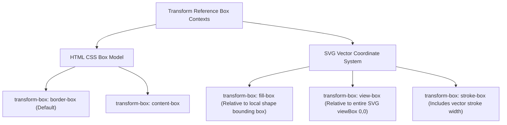

# 064: CSS Transform Around Arbitrary Points Masterclass

## Overview & Executive Summary

In graphic computation and UI engineering, transformations—such as rotation, scaling, skewing, and 3D orientation—do not exist in a vacuum; they must always occur relative to a specific **reference anchor** or **pivot point**. 

By default, CSS executes all transformations around the exact geometric center of an element’s bounding box (`transform-origin: 50% 50% 0`). However, real-world user interfaces and kinetic motion systems frequently demand rotating or scaling around **arbitrary points**:
- Hinged components (doors, folding cards, accordion panels, dropdown needles) pivoting on an edge or corner.
- Orbiting satellites, radial menus, and planetary gear systems pivoting around points located **far outside** their bounding box.
- Dynamic cursor-centered magnifiers and interactive tilt cards pivoting precisely at the user's instantaneous **pointer coordinates**.
- Hierarchical multi-joint kinematic chains (robotic arms, character rigs, multi-pendulums) with successive relative pivot hinges.
- SVG vector shapes requiring precise alignment with vector viewports or local paths via `transform-box`.

Mastering transformation around arbitrary points requires a rigorous understanding of coordinate spaces, linear algebra transformation matrices ($\mathbf{T} \times \mathbf{M} \times \mathbf{T}^{-1}$), CSS Custom Properties, and GPU compositor mechanics.

```
+-------------------------------------------------------------------------------+
|                 CSS ARBITRARY POINT TRANSFORMATION TAXONOMY                  |
|                                                                               |
|   1. Local Anchor            2. Remote/External Pivot   3. Kinematic Chain    |
|      (Edges & Corners)          (Negative / >100% Dist)    (Hierarchical)     |
|       ┌───────────┐                     ┌───┐                  ┌───┐          |
|     ●─│  Card     │             ●───────│   │ Orbit            │ J1│─●        |
|       │  Hinge    │            Pivot    └───┘                  └───┘ └─┌───┐  |
|       └───────────┘            Anchor                                  │ J2│  |
|                                                                        └───┘  |
|                                                                               |
|   4. Dynamic Pointer Anchor  5. SVG Coordinate Space    6. 3D Spatial Hinges  |
|      (--pivot-x, --pivot-y)     (transform-box: fill)      (preserve-3d)      |
|       ┌───────────┐                    ┌──────┐               ┌─────╱         |
|       │     ●     │ Cursor             │  ●   │ SVG Path      │ 3D ╱ Book     |
|       │   Zoom    │ Focal              │ Gear │ Pivot         │   ╱  Page     |
|       └───────────┘ Point              └──────┘               └───●           |
+-------------------------------------------------------------------------------+
```

---

## Quick Reference Metadata

| Attribute | Specification Details |
| :--- | :--- |
| **Name** | CSS Transform Around Arbitrary Points |
| **Category** | CSS Transforms, Geometric Pivots & Coordinate Spaces |
| **Specification** | [W3C CSS Transforms Module Level 2](https://www.w3.org/TR/css-transforms-2/) / [CSS Values and Units Level 4](https://www.w3.org/TR/css-values-4/) |
| **Difficulty** | Advanced (4.5 / 5) |
| **What it produces** | Precise, frame-accurate rotations, scales, skews, and 3D spatial folds anchored to any internal coordinate, remote external point, SVG path center, or runtime pointer location. |
| **Why it works** | The browser's transformation pipeline translates the coordinate frame to $(X_0, Y_0, Z_0)$, evaluates the transformation matrix, and executes a compensatory inverse translation back to origin before paint compositing. |
| **Key Properties** | `transform-origin`, `transform`, `transform-box`, `transform-style`, `perspective`, `translate`, `rotate`, `scale`, `@property`, `will-change`. |
| **Strict Constraints** | Modifying `transform-origin` on an already-transformed element creates an instantaneous visual discontinuity (the "jumping origin" artifact) unless compensatory matrix translation is applied or nested wrappers are utilized. |
| **Browser Baseline** | Standard 2D/3D `transform-origin` (All browsers since 2012+). `transform-box: fill-box/view-box` (Baseline 2020+). Individual transform properties `rotate`, `scale`, `translate` (Baseline 2022+). `@property` registered variables (Baseline 2024+). |
| **Acceptance Criteria** | 60/120 FPS compositor-only animations without layout reflows; subpixel-accurate pivot tracking; seamless interactive mouse-follow without visual jitter; fully accessible with `prefers-reduced-motion` compliance. |

### Quick Preview

```html
<!-- Simple Corner Hinge vs External Orbit Anchor -->
<div class="demo-stage">
  <div class="hinged-card">Hinged on Top-Left Corner</div>
  <div class="orbiting-satellite">Orbiting External Anchor</div>
</div>
```

```css
.demo-stage {
  display: flex;
  gap: 8rem;
  padding: 4rem;
  background: #0f172a;
}

/* 1. Transforming around an internal edge/corner */
.hinged-card {
  inline-size: 160px;
  block-size: 100px;
  background: linear-gradient(135deg, #6366f1, #8b5cf6);
  border-radius: 12px;
  color: #fff;
  padding: 1rem;
  /* Arbitrary pivot: Top-Left vertex (0 0) */
  transform-origin: 0% 0%;
  transition: transform 600ms cubic-bezier(0.34, 1.56, 0.64, 1);
}

.hinged-card:hover {
  transform: rotate(25deg);
}

/* 2. Transforming around a point FAR OUTSIDE the element */
.orbiting-satellite {
  inline-size: 80px;
  block-size: 80px;
  background: linear-gradient(135deg, #ec4899, #f43f5e);
  border-radius: 50%;
  color: #fff;
  display: grid;
  place-items: center;
  /* Arbitrary pivot: 150px to the left of the element's center */
  transform-origin: -150px 50%;
  transition: transform 1000ms cubic-bezier(0.16, 1, 0.3, 1);
}

.orbiting-satellite:hover {
  transform: rotate(180deg);
}
```

---

## 1. Anatomy & Mathematical Mental Models

### 1.1 The Linear Algebra of Transformation Pivots

When you apply a transformation (such as a 2D rotation matrix $\mathbf{R}(\theta)$) around the natural origin $(0, 0)$, every point $\mathbf{v} = \begin{bmatrix} x \\ y \end{bmatrix}$ is mapped to $\mathbf{v}' = \mathbf{R}(\theta)\mathbf{v}$.

However, to transform around an **arbitrary pivot point** $\mathbf{p}_0 = \begin{bmatrix} x_0 \\ y_0 \end{bmatrix}$, the coordinate space must undergo a three-step affine conjugation:

$$\mathbf{M}_{\text{pivot}} = \mathbf{T}(x_0, y_0) \times \mathbf{M}_{\text{transform}} \times \mathbf{T}(-x_0, -y_0)$$

```
================================================================================
                    THE 3-STEP AFFINE CONJUGATION PIPELINE
================================================================================

 Step 1: Pre-Translation        Step 2: Core Transformation     Step 3: Post-Translation
 Translate pivot P0 to (0,0)    Execute Rotate / Scale / Skew   Translate (0,0) back to P0
       T(-x0, -y0)                    M(θ, S, K)                      T(+x0, +y0)

      Y                             Y                               Y
      │                             │                               │
      │   ┌─────┐                   │   ┌───┐ (Rotated)             │       ┌───┐
      │   │     │                   │   │  ╱                        │       │  ╱
   P0─┼─●─└─────┘          ───►  (0,0)●─└───┘              ───►  P0─┼─●─────└───┘
      │                             │                               │
      └───────────X                 └───────────X                   └───────────X
```

In 2D homogeneous matrix mathematics ($3 \times 3$ affine matrix):

$$\mathbf{M}_{\text{pivot}} = 
\begin{bmatrix} 
1 & 0 & x_0 \\ 
0 & 1 & y_0 \\ 
0 & 0 & 1 
\end{bmatrix}
\begin{bmatrix} 
\cos\theta & -\sin\theta & 0 \\ 
\sin\theta & \cos\theta & 0 \\ 
0 & 0 & 1 
\end{bmatrix}
\begin{bmatrix} 
1 & 0 & -x_0 \\ 
0 & 1 & -y_0 \\ 
0 & 0 & 1 
\end{bmatrix}$$

Multiplying these matrices yields the single compound transformation matrix:

$$\mathbf{M}_{\text{pivot}} = 
\begin{bmatrix} 
\cos\theta & -\sin\theta & x_0(1 - \cos\theta) + y_0\sin\theta \\ 
\sin\theta & \cos\theta & y_0(1 - \cos\theta) - x_0\sin\theta \\ 
0 & 0 & 1 
\end{bmatrix}$$

> [!IMPORTANT]
> **Why this matters for CSS developers:**
> In CSS, setting `transform-origin: x0 y0` instructs the browser engine to automatically compute this exact conjugate matrix. 
> Alternatively, you can explicitly chain translations in the `transform` property:
> `transform: translate(x0, y0) rotate(θ) translate(-x0, -y0);`
> Chaining translations produces identical mathematical results without mutating the element's stateful `transform-origin` property!

---

### 1.2 Coordinate System References & Sizing Models

The effective position of $(x_0, y_0, z_0)$ depends heavily on the unit system and reference box applied:

```
┌─────────────────────────────────────────────────────────────────────────────┐
│                       CSS TRANSFORM-ORIGIN VALUE TYPES                      │
├───────────────────┬─────────────────────────────────────────────────────────┤
│ Type              │ Description & Resolution Formula                        │
├───────────────────┼─────────────────────────────────────────────────────────┤
│ **Keywords**      │ `left` (0%), `center` (50%), `right` (100%),            │
│                   │ `top` (0%), `bottom` (100%).                            │
├───────────────────┼─────────────────────────────────────────────────────────┤
│ **Percentages**   │ $x_0 = \text{width} \times (P_x / 100)$,                │
│                   │ $y_0 = \text{height} \times (P_y / 100)$.               │
│                   │ Allows values $<0\%$ and $>100\%$ for external pivots.  │
├───────────────────┼─────────────────────────────────────────────────────────┤
│ **Absolute / Rem**│ $x_0 = 40\text{px}$, $y_0 = 2.5\text{rem}$.             │
│                   │ Fixed spatial offset measured from element top-left.    │
├───────────────────┼─────────────────────────────────────────────────────────┤
│ **3D Z-Depth**    │ $z_0 = -200\text{px}$.                                  │
│                   │ Must strictly be a `<length>`, never a `<percentage>`.  │
└───────────────────┴─────────────────────────────────────────────────────────┘
```



---

### 1.3 Architectural Comparison of Arbitrary Pivot Strategies

| Strategy | Syntax / Mechanism | Best Use Case | Pros | Cons |
| :--- | :--- | :--- | :--- | :--- |
| **1. Standard `transform-origin`** | `transform-origin: X Y [Z];` | Static hinges, corner folds, edge dropdowns | Cleanest syntax, native GPU acceleration | Changing dynamically during transitions causes visual "snap" jumps |
| **2. Compound Matrix Chaining** | `transform: translate(X,Y) rotate(θ) translate(-X,-Y);` | Composing multiple independent pivots in 1 rule | No stateful origin changes; purely functional | More verbose; requires manual calculation |
| **3. Nested DOM Wrappers (Gimbals)** | Parent handles Pivot 1, Child handles Pivot 2 | Robotic arms, planetary orbits, articulated rigs | Total isolation of coordinate frames; counter-rotations | Adds non-semantic markup wrappers |
| **4. CSS Variables (`--px`, `--py`)** | `transform-origin: var(--px) var(--py);` | Pointer-follow zooms, card tilt on hover | Highly interactive, minimal JavaScript overhead | Requires CSS `@property` for smooth variable interpolation |
| **5. SVG `transform-box: fill-box`** | `transform-box: fill-box; transform-origin: 50% 50%;` | SVG dials, gears, gauges, vector icons | Centers rotation on vector element instead of SVG canvas $(0,0)$ | Requires modern browser engine (Baseline 2020+) |
| **6. 3D Spatial Pivots** | `transform-origin: X Y Z; transform-style: preserve-3d;` | 3D cubes, book pages, revolving doors | True stereoscopic depth, physical realism | Requires parent `perspective` and stacking context management |

---

## 2. The 6 Core Arbitrary Point Transformation Techniques

---

### Technique 1: Remote & Negative Out-of-Bounds Transform Origins

When `transform-origin` values extend outside the range $[0\%, 100\%]$ or contain large negative/positive pixel values, the pivot sits remotely in empty space. The element swings like a pendulum or orbits like a satellite.

```
                            (Remote Pivot Point)
                             P0 (50%, -200px)
                                    ●
                                   ╱ ╲
                                  ╱   ╲
                       R = 200px ╱     ╲
                                ╱       ╲
                               ╱         ╲
                       ┌──────────────┐   ┌──────────────┐
                       │  Satellite   │   │  Rotated     │
                       │  (Resting)   │   │  (+45deg)    │
                       └──────────────┘   └──────────────┘
```

#### Code Implementation:
```css
.orbiting-badge {
  inline-size: 120px;
  block-size: 40px;
  background: #3b82f6;
  border-radius: 9999px;
  /* Pivot is 250px directly above the horizontal center of the badge */
  transform-origin: 50% -250px;
  animation: orbit-swing 4s ease-in-out infinite alternate;
  will-change: transform;
}

@keyframes orbit-swing {
  0% {
    transform: rotate(-30deg);
  }
  100% {
    transform: rotate(30deg);
  }
}
```

---

### Technique 2: SVG Coordinate Resolution with `transform-box`

A classic CSS bug occurs when rotating SVG shapes: by default, browsers historically resolved `transform-origin: 50% 50%` relative to the **entire SVG `viewBox` canvas $(0,0)$**, rather than the element's individual bounding box.

The CSS `transform-box` property solves this definitively:
- `transform-box: fill-box`: Percentages resolve to the **object bounding box** (the vector's tightest enclosing box).
- `transform-box: view-box`: Percentages resolve to the **nearest SVG viewport** coordinate system.

```
       WITHOUT transform-box: fill-box              WITH transform-box: fill-box
       (Pivots around SVG (0,0) canvas)             (Pivots around local gear center)
       
       (0,0) SVG Canvas                             (0,0) SVG Canvas
         ● (Default Pivot)
         │                                               ┌──────────┐
         │                                               │   ⚙ GEAR │
         │   ┌──────────┐                                │     ●    │ Local (50%, 50%)
         └───│   ⚙ GEAR │                                └─────│────┘
             └──────────┘                                      └── Pivot stays centered!
```

#### Code Implementation:
```css
/* Precise SVG gear rotation around its own arbitrary local hub */
.svg-gear {
  /* CRITICAL: Forces percentages to compute from the gear's own geometry */
  transform-box: fill-box;
  transform-origin: 50% 50%;
  animation: spin-gear 6s linear infinite;
}

@keyframes spin-gear {
  from {
    transform: rotate(0deg);
  }
  to {
    transform: rotate(360deg);
  }
}
```

---

### Technique 3: The Translation-Conjugate Matrix Pattern (Originless Transforms)

In complex dynamic systems or CSS shaders, modifying `transform-origin` can cause side-effects. You can rotate around any arbitrary coordinate $(X, Y)$ using the pure `transform` chain:

```css
:root {
  --pivot-x: 140px;
  --pivot-y: 80px;
  --rotation-angle: 45deg;
}

.conjugate-transform-box {
  /* Mathematical Equivalent of transform-origin: 140px 80px */
  transform: 
    translate(var(--pivot-x), var(--pivot-y)) 
    rotate(var(--rotation-angle)) 
    translate(calc(-1 * var(--pivot-x)), calc(-1 * var(--pivot-y)));
  transition: transform 500ms cubic-bezier(0.2, 0.8, 0.2, 1);
}
```

#### Why This is Powerful: Multi-Pivot Compounding in a Single Rule
You can apply **multiple sequential transformations around different arbitrary points** in one line:

```css
.multi-pivot-object {
  /* First rotate 20deg around point A (0, 0), then scale 1.5x around point B (200px, 100px) */
  transform: 
    translate(0px, 0px) rotate(20deg) translate(0px, 0px)
    translate(200px, 100px) scale(1.5) translate(-200px, -100px);
}
```

---

### Technique 4: Hierarchical Kinematic Chains (Nested Gimbals)

To model real-world mechanical systems (like robotic arms, clockwork hands, or planetary moon systems), nest elements inside each other. Each parent introduces its own distinct pivot point, while children inherit the transformation space.

```
  [Base Joint: Pivot (0, 100%)]
        ●
        │  Upper Arm
        │
        ● [Elbow Joint: Pivot (0, 100%)]
         ╲
          ╲ Forearm
           ╲
            ● [Wrist Joint: Pivot (50%, 50%)]
            │ Hand
```

#### Code Implementation:
```html
<div class="robot-shoulder">
  <div class="upper-arm">
    <div class="robot-elbow">
      <div class="forearm">
        <div class="robot-wrist">
          <div class="claw"></div>
        </div>
      </div>
    </div>
  </div>
</div>
```

```css
.robot-shoulder {
  position: relative;
  inline-size: 24px;
  block-size: 140px;
  transform-origin: 50% 12px; /* Shoulder hinge */
  transform: rotate(var(--shoulder-angle, -25deg));
}

.robot-elbow {
  position: absolute;
  inset-block-end: 0;
  inset-inline-start: 0;
  inline-size: 24px;
  block-size: 120px;
  transform-origin: 50% 12px; /* Elbow hinge */
  transform: rotate(var(--elbow-angle, 65deg));
}

.robot-wrist {
  position: absolute;
  inset-block-end: 0;
  inset-inline-start: 0;
  inline-size: 24px;
  block-size: 40px;
  transform-origin: 50% 12px; /* Wrist hinge */
  transform: rotate(var(--wrist-angle, -40deg));
}
```

---

### Technique 5: Dynamic Cursor-Anchored Pivots with `@property`

When zooming or tilting an interactive product card, anchoring the transform directly to the mouse cursor creates a tactile, premium feel.

Using modern CSS `@property`, we register `--mouse-x` and `--mouse-y` as `<percentage>` values so the browser can hardware-interpolate them without snapping.

```css
/* Register properties for smooth GPU transition */
@property --mouse-x {
  syntax: '<percentage>';
  inherits: false;
  initial-value: 50%;
}

@property --mouse-y {
  syntax: '<percentage>';
  inherits: false;
  initial-value: 50%;
}

.cursor-zoom-card {
  --mouse-x: 50%;
  --mouse-y: 50%;
  
  transform-origin: var(--mouse-x) var(--mouse-y);
  transition: transform 300ms cubic-bezier(0.16, 1, 0.3, 1),
              --mouse-x 150ms ease-out,
              --mouse-y 150ms ease-out;
  will-change: transform, transform-origin;
}

.cursor-zoom-card:hover {
  transform: scale(1.6);
}
```

---

### Technique 6: 3D Spatial Pivots with Z-Depth Offsets

Transform origins are not restricted to $X$ and $Y$. Adding a third $Z$ coordinate (`transform-origin: X Y Z`) shifts the pivot axis into 3D space, creating rotating 3D cubes, revolving display carousels, and book page flippers.

```
                    Top View (Looking down Y-Axis)
                    
                             Z = 0 (Screen Plane)
                        ─────────────────────────
                                   │
                                   │  Z = -150px (Pivot Depth)
                                   ● (3D Axis of Rotation)
                                  ╱ 
                                 ╱  R = 150px
                                ╱   
                         ┌─────────────┐
                         │ 3D Carousel │ (Rotated around Z = -150px)
                         │ Panel       │
                         └─────────────┘
```

#### Code Implementation:
```css
.carousel-stage {
  perspective: 1000px;
  perspective-origin: 50% 50%;
}

.carousel-panel {
  inline-size: 260px;
  block-size: 160px;
  background: rgba(30, 41, 59, 0.85);
  border: 1px solid rgba(255, 255, 255, 0.1);
  transform-style: preserve-3d;
  
  /* 3D Pivot: Centered horizontally & vertically, pushed 200px BEHIND the screen */
  transform-origin: 50% 50% -200px;
  transition: transform 800ms cubic-bezier(0.16, 1, 0.3, 1);
}

.carousel-panel:hover {
  transform: rotateY(90deg);
}
```

---

## 3. Comprehensive Implementation Patterns

---

### Pattern 1: The Articulated Precision Clockwork & Dial (Hierarchical Mechanical Pivots)

An intricate, interactive mechanical dial showing hours, minutes, seconds, and an oscillating balance wheel—each rotating around precise subpixel pivot points.

```
       =========================================================
                 ARTICULATED CHRONOMETER PIVOT ANATOMY
       =========================================================
       
                     [ 12 ]
                       │
             ┌─────────┼─────────┐
             │       \ │ /       │
        [9] ─┼────────(●)────────┼─ [3]  Main Center Pivot (50% 50%)
             │       / │ \       │       - Hour Hand (Short)
             │        (●)        │       - Minute Hand (Long)
             └─────────┼─────────┘       - Seconds Sweep
                      [ 6 ]
                        ▲
                        └─ Sub-dial Seconds Pivot (50% 72%)
```

#### HTML
```html
<div class="chronometer-chassis" role="region" aria-label="Mechanical Chronometer Demo">
  <div class="dial-face">
    <!-- Hour Markers -->
    <div class="dial-marks" aria-hidden="true">
      <span class="mark m-12">12</span>
      <span class="mark m-3">3</span>
      <span class="mark m-6">6</span>
      <span class="mark m-9">9</span>
    </div>

    <!-- Sub-dial with its own independent offset arbitrary pivot -->
    <div class="subdial-container">
      <div class="subdial-hand" id="subHand"></div>
      <div class="subdial-center-pin"></div>
    </div>

    <!-- Main Center Hands -->
    <div class="hand hour-hand" id="hourHand"></div>
    <div class="hand minute-hand" id="minuteHand"></div>
    <div class="hand second-hand" id="secondHand"></div>
    
    <!-- Center Bezel Cap -->
    <div class="center-cap"></div>
  </div>
</div>
```

#### CSS
```css
/* ==========================================================================
   Pattern 1: Chronometer Mechanical Pivots
   ========================================================================== */

.chronometer-chassis {
  inline-size: 320px;
  block-size: 320px;
  padding: 16px;
  background: radial-gradient(circle at 30% 30%, #334155, #0f172a);
  border-radius: 50%;
  box-shadow: 
    0 25px 50px -12px rgba(0, 0, 0, 0.7),
    inset 0 2px 4px rgba(255, 255, 255, 0.2),
    inset 0 -4px 8px rgba(0, 0, 0, 0.8),
    0 0 0 6px #1e293b,
    0 0 0 8px #475569;
  display: grid;
  place-items: center;
  font-family: system-ui, -apple-system, sans-serif;
  user-select: none;
}

.dial-face {
  position: relative;
  inline-size: 100%;
  block-size: 100%;
  border-radius: 50%;
  background: radial-gradient(circle, #1e293b 0%, #090d16 100%);
  border: 1px solid rgba(255, 255, 255, 0.08);
}

.dial-marks .mark {
  position: absolute;
  color: #94a3b8;
  font-size: 0.875rem;
  font-weight: 700;
}
.mark.m-12 { inset-block-start: 12px; inset-inline-start: 50%; transform: translateX(-50%); }
.mark.m-3  { inset-block-start: 50%; inset-inline-end: 14px; transform: translateY(-50%); }
.mark.m-6  { inset-block-end: 12px; inset-inline-start: 50%; transform: translateX(-50%); }
.mark.m-9  { inset-block-start: 50%; inset-inline-start: 14px; transform: translateY(-50%); }

/* MAIN HANDS: Pivot exactly on bottom-center pin */
.hand {
  position: absolute;
  inset-inline-start: 50%;
  inset-block-end: 50%;
  border-radius: 9999px;
  transform-origin: 50% 100%; /* PIVOT ANCHOR AT PINION */
  will-change: transform;
}

.hour-hand {
  inline-size: 6px;
  block-size: 75px;
  margin-inline-start: -3px;
  background: linear-gradient(to top, #f8fafc, #cbd5e1);
  box-shadow: 0 4px 10px rgba(0, 0, 0, 0.5);
  z-index: 2;
  transform: rotate(65deg);
}

.minute-hand {
  inline-size: 4px;
  block-size: 110px;
  margin-inline-start: -2px;
  background: linear-gradient(to top, #38bdf8, #0284c7);
  box-shadow: 0 4px 12px rgba(56, 189, 248, 0.3);
  z-index: 3;
  transform: rotate(210deg);
}

.second-hand {
  inline-size: 2px;
  block-size: 125px;
  margin-inline-start: -1px;
  background: #f43f5e;
  z-index: 4;
  /* Pivot with counter-balance tail: 82% from top, 18% from bottom */
  transform-origin: 50% 82%;
  inset-block-end: calc(50% - 22.5px);
  transform: rotate(320deg);
}

/* SUB-DIAL: Located at bottom center with independent arbitrary pivot */
.subdial-container {
  position: absolute;
  inset-inline-start: 50%;
  inset-block-end: 42px;
  transform: translateX(-50%);
  inline-size: 64px;
  block-size: 64px;
  border-radius: 50%;
  border: 1px dashed rgba(255, 255, 255, 0.15);
}

.subdial-hand {
  position: absolute;
  inset-inline-start: 50%;
  inset-block-end: 50%;
  inline-size: 2px;
  block-size: 24px;
  margin-inline-start: -1px;
  background: #fbbf24;
  transform-origin: 50% 100%;
  animation: subdial-sweep 4s linear infinite;
}

@keyframes subdial-sweep {
  to { transform: rotate(360deg); }
}

.center-cap, .subdial-center-pin {
  position: absolute;
  border-radius: 50%;
  background: #f8fafc;
  box-shadow: 0 0 6px rgba(0, 0, 0, 0.8);
}
.center-cap {
  inset-inline-start: 50%;
  inset-block-start: 50%;
  inline-size: 14px;
  block-size: 14px;
  transform: translate(-50%, -50%);
  z-index: 5;
  border: 2px solid #0f172a;
}
.subdial-center-pin {
  inset-inline-start: 50%;
  inset-block-start: 50%;
  inline-size: 6px;
  block-size: 6px;
  transform: translate(-50%, -50%);
  background: #fbbf24;
}
```

---

### Pattern 2: Dynamic Cursor-Anchored Precision Magnifier Card

A modern e-commerce visualizer card where hovering seamlessly updates `--pivot-x` and `--pivot-y`, zooming into the exact micro-detail under the user's cursor without jitter or bounding box shift.

```
       [ USER CURSOR MOVES OVER PRODUCT CARD ]
       
       ┌───────────────────────────────┐
       │                               │
       │           (Cursor @ 75%, 25%) │
       │                    ●          │
       │                   ╱           │
       │     Zoom Origin Sets To:      │
       │     transform-origin: 75% 25% │
       │                               │
       └───────────────────────────────┘
                      │
                      ▼
       [ CARD EXPANDS SEAMLESSLY AROUND THAT EXACT PIXEL ]
```

#### HTML
```html
<article class="magnifier-card" id="magnifierCard" tabindex="0" aria-label="Interactive Macro Product Viewer">
  <div class="card-media-wrapper">
    
    <div class="focal-crosshair" aria-hidden="true"></div>
  </div>

  <footer class="card-meta">
    <span class="product-badge">Sapphire Crystal Edition</span>
    <h3 class="product-title">Chrono Minimal 01</h3>
    <p class="product-desc">Hover or focus to inspect fine horological engravings with cursor-anchored magnification.</p>
  </footer>
</article>
```

#### CSS
```css
/* ==========================================================================
   Pattern 2: Dynamic Cursor-Anchored Magnifier
   ========================================================================== */

.magnifier-card {
  --pivot-x: 50%;
  --pivot-y: 50%;
  
  position: relative;
  inline-size: 360px;
  background: #0f172a;
  border-radius: 20px;
  border: 1px solid rgba(255, 255, 255, 0.1);
  overflow: hidden;
  box-shadow: 0 20px 40px -15px rgba(0, 0, 0, 0.6);
  cursor: crosshair;
  color: #f8fafc;
  font-family: system-ui, -apple-system, sans-serif;
  outline: none;
  transition: border-color 300ms ease, box-shadow 300ms ease;
}

.magnifier-card:focus-visible {
  border-color: #38bdf8;
  box-shadow: 0 0 0 4px rgba(56, 189, 248, 0.3);
}

.card-media-wrapper {
  position: relative;
  inline-size: 100%;
  block-size: 260px;
  overflow: hidden;
  background: #020617;
}

.magnifier-image {
  inline-size: 100%;
  block-size: 100%;
  object-fit: cover;
  
  /* PIVOT TIED TO DYNAMIC CSS VARIABLES */
  transform-origin: var(--pivot-x) var(--pivot-y);
  transform: scale(1);
  transition: transform 400ms cubic-bezier(0.16, 1, 0.3, 1),
              filter 400ms ease;
  will-change: transform, transform-origin;
}

.magnifier-card:hover .magnifier-image,
.magnifier-card:focus-within .magnifier-image {
  transform: scale(2.4);
  filter: contrast(1.05) saturate(1.1);
}

/* Subtle crosshair indicator centered on active pivot */
.focal-crosshair {
  position: absolute;
  inset-inline-start: var(--pivot-x);
  inset-block-start: var(--pivot-y);
  inline-size: 24px;
  block-size: 24px;
  margin-inline-start: -12px;
  margin-block-start: -12px;
  border: 1.5px dashed rgba(56, 189, 248, 0.8);
  border-radius: 50%;
  pointer-events: none;
  opacity: 0;
  transform: scale(0.6);
  transition: opacity 200ms ease, transform 200ms ease;
}

.magnifier-card:hover .focal-crosshair {
  opacity: 1;
  transform: scale(1);
}

.card-meta {
  padding: 1.5rem;
}

.product-badge {
  display: inline-block;
  font-size: 0.75rem;
  font-weight: 700;
  text-transform: uppercase;
  letter-spacing: 0.05em;
  color: #38bdf8;
  margin-block-end: 0.5rem;
}

.product-title {
  margin: 0 0 0.5rem 0;
  font-size: 1.25rem;
  font-weight: 700;
}

.product-desc {
  margin: 0;
  font-size: 0.875rem;
  color: #94a3b8;
  line-height: 1.5;
}
```

#### JavaScript Pointer Sync
```javascript
// Lightweight event listener updating the CSS custom properties
const card = document.getElementById('magnifierCard');
if (card) {
  card.addEventListener('pointermove', (e) => {
    const rect = card.getBoundingClientRect();
    const x = ((e.clientX - rect.left) / rect.width) * 100;
    const y = ((e.clientY - rect.top) / 260) * 100; // Constrained to media height
    
    card.style.setProperty('--pivot-x', `${Math.max(0, Math.min(100, x))}%`);
    card.style.setProperty('--pivot-y', `${Math.max(0, Math.min(100, y))}%`);
  });

  card.addEventListener('pointerleave', () => {
    // Gracefully restore center origin on cursor exit
    card.style.setProperty('--pivot-x', '50%');
    card.style.setProperty('--pivot-y', '50%');
  });
}
```

---

### Pattern 3: Celestial Radial Action Menu (External Orbit & Counter-Rotation)

A radial command menu where buttons orbit around an external central hub anchor. To keep labels and icons upright during rotation, a **counter-transformation matrix** is applied to the child elements.

```
                  [ ACTION BUTTON 1 (θ = -60deg) ]
                            ▲
                           ╱ 
                          ╱  Orbit Radius (R = 140px)
                         ╱   transform-origin: 50% 160px;
                        ╱
                  [ CENTRAL HUB ]
                   (0, 0 Origin)
                        ╲
                         ╲
                          ▼
                  [ ACTION BUTTON 2 (θ = +60deg) ]
                  * Inner Icon counter-rotates by -60deg to remain horizontal!
```

#### HTML
```html
<nav class="orbit-hub-nav" aria-label="Radial Tools Menu">
  <button type="button" class="hub-trigger" id="hubToggle" aria-expanded="false" aria-controls="orbitMenu">
    <span class="hub-icon">⚡</span>
    <span class="sr-only">Toggle Tools</span>
  </button>

  <ul class="orbit-menu" id="orbitMenu" aria-hidden="true">
    <!-- Item 1: Orbiting at -90deg -->
    <li class="orbit-item item-1">
      <button type="button" class="orbit-btn" aria-label="Analytics">
        <span class="orbit-icon">📊</span>
      </button>
    </li>
    <!-- Item 2: Orbiting at -45deg -->
    <li class="orbit-item item-2">
      <button type="button" class="orbit-btn" aria-label="Security">
        <span class="orbit-icon">🛡️</span>
      </button>
    </li>
    <!-- Item 3: Orbiting at 0deg -->
    <li class="orbit-item item-3">
      <button type="button" class="orbit-btn" aria-label="Settings">
        <span class="orbit-icon">⚙️</span>
      </button>
    </li>
    <!-- Item 4: Orbiting at 45deg -->
    <li class="orbit-item item-4">
      <button type="button" class="orbit-btn" aria-label="Cloud Sync">
        <span class="orbit-icon">☁️</span>
      </button>
    </li>
    <!-- Item 5: Orbiting at 90deg -->
    <li class="orbit-item item-5">
      <button type="button" class="orbit-btn" aria-label="Messages">
        <span class="orbit-icon">💬</span>
      </button>
    </li>
  </ul>
</nav>
```

#### CSS
```css
/* ==========================================================================
   Pattern 3: Celestial Radial Action Menu with Counter-Rotation
   ========================================================================== */

.orbit-hub-nav {
  position: relative;
  inline-size: 300px;
  block-size: 300px;
  display: grid;
  place-items: center;
}

.hub-trigger {
  position: relative;
  inline-size: 64px;
  block-size: 64px;
  border-radius: 50%;
  background: linear-gradient(135deg, #6366f1, #a855f7);
  border: none;
  color: #fff;
  font-size: 1.5rem;
  display: grid;
  place-items: center;
  cursor: pointer;
  z-index: 10;
  box-shadow: 0 10px 25px rgba(99, 102, 241, 0.5);
  transition: transform 300ms cubic-bezier(0.34, 1.56, 0.64, 1);
}

.hub-trigger:hover {
  transform: scale(1.1) rotate(15deg);
}

.orbit-menu {
  list-style: none;
  margin: 0;
  padding: 0;
  position: absolute;
  inset: 0;
  pointer-events: none;
}

.orbit-item {
  position: absolute;
  inset-inline-start: 50%;
  inset-block-start: 50%;
  inline-size: 48px;
  block-size: 48px;
  margin-inline-start: -24px;
  margin-block-start: -24px;
  
  /* CRITICAL: Arbitrary Pivot anchored to the central hub center */
  transform-origin: 24px 24px;
  transition: transform 600ms cubic-bezier(0.34, 1.56, 0.64, 1), opacity 400ms ease;
  opacity: 0;
  transform: rotate(0deg) translateY(0);
}

/* Base button styling */
.orbit-btn {
  inline-size: 100%;
  block-size: 100%;
  border-radius: 50%;
  background: #1e293b;
  border: 1px solid rgba(255, 255, 255, 0.15);
  display: grid;
  place-items: center;
  font-size: 1.25rem;
  cursor: pointer;
  pointer-events: auto;
  box-shadow: 0 8px 16px rgba(0, 0, 0, 0.4);
  transition: background 200ms ease, transform 200ms ease;
}

.orbit-btn:hover {
  background: #334155;
  transform: scale(1.15);
}

/* COUNTER-ROTATION: Keep child icons perfectly level regardless of orbit angle */
.orbit-icon {
  display: inline-block;
  transition: transform 600ms cubic-bezier(0.34, 1.56, 0.64, 1);
}

/* EXPANDED ACTIVE STATE WITH DISTRIBUTED ARBITRARY ANGLES */
.orbit-hub-nav.is-open .orbit-item {
  opacity: 1;
}

.orbit-hub-nav.is-open .item-1 { transform: rotate(-90deg) translateX(110px); }
.orbit-hub-nav.is-open .item-1 .orbit-icon { transform: rotate(90deg); }

.orbit-hub-nav.is-open .item-2 { transform: rotate(-45deg) translateX(110px); }
.orbit-hub-nav.is-open .item-2 .orbit-icon { transform: rotate(45deg); }

.orbit-hub-nav.is-open .item-3 { transform: rotate(0deg) translateX(110px); }
.orbit-hub-nav.is-open .item-3 .orbit-icon { transform: rotate(0deg); }

.orbit-hub-nav.is-open .item-4 { transform: rotate(45deg) translateX(110px); }
.orbit-hub-nav.is-open .item-4 .orbit-icon { transform: rotate(-45deg); }

.orbit-hub-nav.is-open .item-5 { transform: rotate(90deg) translateX(110px); }
.orbit-hub-nav.is-open .item-5 .orbit-icon { transform: rotate(-90deg); }

.sr-only {
  position: absolute;
  inline-size: 1px;
  block-size: 1px;
  padding: 0;
  margin: -1px;
  overflow: hidden;
  clip: rect(0, 0, 0, 0);
  border: 0;
}
```

---

### Pattern 4: 3D Origami Trifold Brochure (Edge-Hinged Spatial Folds)

A 3D physical brochure simulation where panels fold along left and right arbitrary edge seams using `transform-origin: left center` and `transform-origin: right center` inside a preserve-3d perspective stage.

```
       =========================================================
                 3D TRIFOLD LEAFLET HINGE TOPOLOGY
       =========================================================
       
       LEFT WING (Panel 1)       CENTER BODY (Panel 2)      RIGHT WING (Panel 3)
       ┌───────────────────┐    ┌───────────────────┐    ┌───────────────────┐
       │                   │    │                   │    │                   │
       │                   │ ●──│                   │──● │                   │
       │                   │ H1 │                   │ H2 │                   │
       └───────────────────┘    └───────────────────┘    └───────────────────┘
         transform-origin:                                 transform-origin:
            RIGHT EDGE                                        LEFT EDGE
            (100% 50% 0)                                      (0% 50% 0)
                 ▲                                                 ▲
                 └──────── Folds Inward (-140deg)                  └──────── Folds Inward (+140deg)
```

#### HTML
```html
<div class="origami-stage" role="region" aria-label="3D Interactive Trifold Brochure">
  <div class="brochure-container" id="trifoldBrochure">
    
    <!-- LEFT PANEL: Hinged on its Right Edge (100% 50%) -->
    <section class="panel panel-left" aria-label="Panel 1: Overview">
      <div class="panel-face front">
        <span class="fold-num">01</span>
        <h4>Genesis</h4>
        <p>Architectural layout and initial geometric wireframes.</p>
      </div>
    </section>

    <!-- CENTER PANEL: Static Foundation -->
    <section class="panel panel-center" aria-label="Panel 2: Core Philosophy">
      <div class="panel-face front">
        <span class="fold-num">02</span>
        <h4>Synthesis</h4>
        <p>Real-time vector compilation and dynamic spatial rendering.</p>
      </div>
    </section>

    <!-- RIGHT PANEL: Hinged on its Left Edge (0% 50%) -->
    <section class="panel panel-right" aria-label="Panel 3: Culmination">
      <div class="panel-face front">
        <span class="fold-num">03</span>
        <h4>Telemetry</h4>
        <p>High-frequency compositing with GPU layer acceleration.</p>
      </div>
    </section>

  </div>

  <button type="button" class="btn-fold-toggle" id="foldToggleBtn">Toggle 3D Fold State</button>
</div>
```

#### CSS
```css
/* ==========================================================================
   Pattern 4: 3D Origami Trifold Brochure with Edge Hinges
   ========================================================================== */

.origami-stage {
  display: flex;
  flex-direction: column;
  align-items: center;
  gap: 2.5rem;
  padding: 3rem;
  background: #020617;
  perspective: 1200px; /* Essential for 3D depth perception */
}

.brochure-container {
  display: flex;
  transform-style: preserve-3d;
  transform: rotateX(15deg) rotateY(-10deg);
  transition: transform 800ms cubic-bezier(0.16, 1, 0.3, 1);
}

.panel {
  inline-size: 180px;
  block-size: 260px;
  position: relative;
  transform-style: preserve-3d;
  transition: transform 900ms cubic-bezier(0.16, 1, 0.3, 1);
  box-shadow: 0 15px 35px rgba(0, 0, 0, 0.6);
}

.panel-face {
  position: absolute;
  inset: 0;
  padding: 1.5rem;
  border-radius: 12px;
  color: #fff;
  display: flex;
  flex-direction: column;
  justify-content: flex-end;
  backface-visibility: hidden;
  border: 1px solid rgba(255, 255, 255, 0.1);
}

.fold-num {
  font-size: 2rem;
  font-weight: 900;
  color: rgba(255, 255, 255, 0.2);
  margin-block-end: auto;
}

.panel h4 {
  margin: 0 0 0.5rem 0;
  font-size: 1.125rem;
}

.panel p {
  margin: 0;
  font-size: 0.8125rem;
  color: #cbd5e1;
  line-height: 1.4;
}

/* 1. LEFT PANEL: PIVOT HINGE ON RIGHT EDGE */
.panel-left {
  background: linear-gradient(135deg, #4338ca, #3730a3);
  transform-origin: 100% 50% 0; /* Right seam */
}

/* 2. CENTER PANEL: Unhinged Anchor */
.panel-center {
  background: linear-gradient(135deg, #4f46e5, #6366f1);
  z-index: 2;
}

/* 3. RIGHT PANEL: PIVOT HINGE ON LEFT EDGE */
.panel-right {
  background: linear-gradient(135deg, #6366f1, #818cf8);
  transform-origin: 0% 50% 0; /* Left seam */
}

/* FOLDED STATE: Panels close over the center */
.brochure-container.is-folded .panel-left {
  transform: rotateY(150deg);
}

.brochure-container.is-folded .panel-right {
  transform: rotateY(-150deg);
}

.btn-fold-toggle {
  background: #1e293b;
  color: #f8fafc;
  border: 1px solid rgba(255, 255, 255, 0.2);
  padding: 0.75rem 1.5rem;
  border-radius: 9999px;
  font-weight: 600;
  cursor: pointer;
  transition: all 200ms ease;
}

.btn-fold-toggle:hover {
  background: #334155;
  transform: translateY(-2px);
  border-color: #6366f1;
}
```

---

## 4. Complete, Self-Contained Interactive Production Showcase

Below is a complete, single-file interactive test bench that allows developers to visually manipulate transform origins across 9 preset matrix anchors or arbitrary Cartesian coordinates $(X, Y, Z)$, test live rotation, scaling, and skewing, and copy the calculated CSS output.

```html
<!DOCTYPE html>
<html lang="en">
<head>
  <meta charset="UTF-8">
  <meta name="viewport" content="width=device-width, initial-scale=1.0">
  <title>CSS Transform Around Arbitrary Points Workbench</title>
  <style>
    :root {
      --bg-color: #0b0f19;
      --card-bg: #1e293b;
      --accent: #38bdf8;
      --accent-rgb: 56, 189, 248;
      --text-main: #f8fafc;
      --text-muted: #94a3b8;
      
      /* Active Live Pivot Coordinates */
      --demo-pivot-x: 50%;
      --demo-pivot-y: 50%;
      --demo-rotate: 35deg;
      --demo-scale: 1.15;
      --demo-skew: 0deg;
    }

    * {
      box-sizing: border-box;
      margin: 0;
      padding: 0;
    }

    body {
      font-family: system-ui, -apple-system, BlinkMacSystemFont, "Segoe UI", Roboto, sans-serif;
      background-color: var(--bg-color);
      color: var(--text-main);
      min-block-size: 100vh;
      padding: 2rem;
      display: grid;
      place-items: center;
    }

    .workbench-layout {
      inline-size: 100%;
      max-inline-size: 1040px;
      display: grid;
      grid-template-columns: 1fr 1fr;
      gap: 2rem;
      background: rgba(30, 41, 59, 0.5);
      backdrop-filter: blur(16px);
      border: 1px solid rgba(255, 255, 255, 0.1);
      border-radius: 24px;
      padding: 2.5rem;
      box-shadow: 0 25px 50px -12px rgba(0, 0, 0, 0.7);
    }

    @media (max-width: 860px) {
      .workbench-layout {
        grid-template-columns: 1fr;
      }
    }

    /* Left Stage: Visual Transformation Canvas */
    .viewport-stage {
      position: relative;
      inline-size: 100%;
      block-size: 420px;
      background: #020617;
      border-radius: 16px;
      border: 1px solid rgba(255, 255, 255, 0.05);
      display: grid;
      place-items: center;
      overflow: hidden;
      perspective: 800px;
    }

    /* Coordinate Grid Background */
    .grid-overlay {
      position: absolute;
      inset: 0;
      background-size: 20px 20px;
      background-image: 
        linear-gradient(to right, rgba(255, 255, 255, 0.04) 1px, transparent 1px),
        linear-gradient(to bottom, rgba(255, 255, 255, 0.04) 1px, transparent 1px);
    }

    /* The Transforming Test Target */
    .transform-target {
      position: relative;
      inline-size: 200px;
      block-size: 140px;
      background: linear-gradient(135deg, rgba(56, 189, 248, 0.8), rgba(99, 102, 241, 0.8));
      border: 2px solid #38bdf8;
      border-radius: 16px;
      display: flex;
      flex-direction: column;
      justify-content: center;
      align-items: center;
      color: #ffffff;
      font-weight: 700;
      box-shadow: 0 15px 30px rgba(56, 189, 248, 0.25);
      
      /* THE CORE SUBJECT PROPERTY */
      transform-origin: var(--demo-pivot-x) var(--demo-pivot-y);
      transform: rotate(var(--demo-rotate)) scale(var(--demo-scale)) skew(var(--demo-skew));
      transition: transform 300ms cubic-bezier(0.16, 1, 0.3, 1),
                  transform-origin 200ms ease;
      will-change: transform, transform-origin;
      z-index: 2;
    }

    /* Visible Pivot Crosshair Dot */
    .pivot-indicator {
      position: absolute;
      inset-inline-start: var(--demo-pivot-x);
      inset-block-start: var(--demo-pivot-y);
      inline-size: 16px;
      block-size: 16px;
      margin-inline-start: -8px;
      margin-block-start: -8px;
      background: #f43f5e;
      border: 3px solid #ffffff;
      border-radius: 50%;
      box-shadow: 0 0 12px #f43f5e;
      pointer-events: none;
      z-index: 10;
      transition: inset-inline-start 200ms ease, inset-block-start 200ms ease;
    }

    /* Ghost outline showing original bounding box */
    .ghost-box {
      position: absolute;
      inline-size: 200px;
      block-size: 140px;
      border: 2px dashed rgba(255, 255, 255, 0.2);
      border-radius: 16px;
      pointer-events: none;
    }

    /* Right Controls Panel */
    .controls-panel {
      display: flex;
      flex-direction: column;
      gap: 1.5rem;
    }

    .panel-header h2 {
      font-size: 1.5rem;
      font-weight: 800;
      margin-bottom: 0.25rem;
    }

    .panel-header p {
      font-size: 0.875rem;
      color: var(--text-muted);
    }

    /* 9-Point Quick Pivot Matrix Selector */
    .matrix-selector {
      display: grid;
      grid-template-columns: repeat(3, 1fr);
      gap: 6px;
      max-inline-size: 240px;
    }

    .btn-matrix {
      padding: 8px;
      background: #1e293b;
      border: 1px solid rgba(255, 255, 255, 0.1);
      color: var(--text-main);
      font-size: 0.75rem;
      font-weight: 600;
      border-radius: 8px;
      cursor: pointer;
      transition: all 150ms ease;
    }

    .btn-matrix:hover {
      background: #334155;
    }

    .btn-matrix.active {
      background: var(--accent);
      color: #090d16;
      border-color: var(--accent);
      font-weight: 800;
    }

    /* Sliders */
    .slider-group {
      display: flex;
      flex-direction: column;
      gap: 0.5rem;
    }

    .slider-label {
      display: flex;
      justify-content: space-between;
      font-size: 0.8125rem;
      font-weight: 600;
      color: var(--text-muted);
    }

    input[type="range"] {
      inline-size: 100%;
      accent-color: var(--accent);
    }

    /* Code Output Box */
    .code-preview {
      background: #020617;
      padding: 1rem;
      border-radius: 12px;
      border: 1px solid rgba(255, 255, 255, 0.1);
      font-family: ui-monospace, SFMono-Regular, Menlo, Monaco, Consolas, monospace;
      font-size: 0.8125rem;
      color: #38bdf8;
      line-height: 1.6;
      white-space: pre-wrap;
    }
  </style>
</head>
<body>

<main class="workbench-layout">
  <!-- Left Side: Interactive Visual Stage -->
  <section class="viewport-stage" aria-label="Visual Transformation Stage">
    <div class="grid-overlay" aria-hidden="true"></div>
    <div class="ghost-box" aria-hidden="true"></div>
    
    <div class="transform-target" id="demoTarget">
      <span>Transform Subject</span>
      <small style="opacity: 0.8; font-size: 0.7rem; margin-top: 4px;">Watch Pivot Anchor</small>
      <div class="pivot-indicator" id="pivotDot" aria-hidden="true"></div>
    </div>
  </section>

  <!-- Right Side: Interactive Real-Time Controls -->
  <section class="controls-panel">
    <header class="panel-header">
      <h2>Transform-Origin Workbench</h2>
      <p>Select anchor presets or slide arbitrary coordinates.</p>
    </header>

    <!-- 9-Point Presets -->
    <div class="slider-group">
      <span class="slider-label">9-Point Anchor Presets</span>
      <div class="matrix-selector" id="matrixPresets">
        <button type="button" class="btn-matrix" data-x="0%" data-y="0%">Top Left</button>
        <button type="button" class="btn-matrix" data-x="50%" data-y="0%">Top Center</button>
        <button type="button" class="btn-matrix" data-x="100%" data-y="0%">Top Right</button>
        <button type="button" class="btn-matrix" data-x="0%" data-y="50%">Mid Left</button>
        <button type="button" class="btn-matrix active" data-x="50%" data-y="50%">Center</button>
        <button type="button" class="btn-matrix" data-x="100%" data-y="50%">Mid Right</button>
        <button type="button" class="btn-matrix" data-x="0%" data-y="100%">Bot Left</button>
        <button type="button" class="btn-matrix" data-x="50%" data-y="100%">Bot Center</button>
        <button type="button" class="btn-matrix" data-x="100%" data-y="100%">Bot Right</button>
      </div>
    </div>

    <!-- Sliders -->
    <div class="slider-group">
      <label class="slider-label" for="rotateSlider">
        <span>Rotation (Z-Axis)</span>
        <span id="rotateVal">35deg</span>
      </label>
      <input type="range" id="rotateSlider" min="-180" max="180" value="35">
    </div>

    <div class="slider-group">
      <label class="slider-label" for="scaleSlider">
        <span>Uniform Scale</span>
        <span id="scaleVal">1.15x</span>
      </label>
      <input type="range" id="scaleSlider" min="0.5" max="2" step="0.05" value="1.15">
    </div>

    <!-- Live Generated CSS -->
    <div class="slider-group">
      <span class="slider-label">Computed CSS Snippet</span>
      <div class="code-preview" id="codePreview">transform-origin: 50% 50%;
transform: rotate(35deg) scale(1.15);</div>
    </div>
  </section>
</main>

<script>
  document.addEventListener('DOMContentLoaded', () => {
    const root = document.documentElement;
    const rotateSlider = document.getElementById('rotateSlider');
    const scaleSlider = document.getElementById('scaleSlider');
    const rotateVal = document.getElementById('rotateVal');
    const scaleVal = document.getElementById('scaleVal');
    const codePreview = document.getElementById('codePreview');
    const matrixButtons = document.querySelectorAll('.btn-matrix');

    let curX = '50%';
    let curY = '50%';

    function updateCSS() {
      const rot = `${rotateSlider.value}deg`;
      const scl = scaleSlider.value;

      root.style.setProperty('--demo-pivot-x', curX);
      root.style.setProperty('--demo-pivot-y', curY);
      root.style.setProperty('--demo-rotate', rot);
      root.style.setProperty('--demo-scale', scl);

      rotateVal.textContent = rot;
      scaleVal.textContent = `${scl}x`;

      codePreview.textContent = `transform-origin: ${curX} ${curY};\ntransform: rotate(${rot}) scale(${scl});`;
    }

    matrixButtons.forEach(btn => {
      btn.addEventListener('click', () => {
        matrixButtons.forEach(b => b.classList.remove('active'));
        btn.classList.add('active');
        curX = btn.dataset.x;
        curY = btn.dataset.y;
        updateCSS();
      });
    });

    rotateSlider.addEventListener('input', updateCSS);
    scaleSlider.addEventListener('input', updateCSS);
  });
</script>

</body>
</html>
```

---

## 5. Performance, Hardware Acceleration & Compositor Rules

Executing transformations around arbitrary points is one of the most performance-critical operations in modern web graphics. 

```
┌─────────────────────────────────────────────────────────────────────────────┐
│                    THE BROWSER COMPOSITOR HIGHWAY                           │
├───────────────────┬──────────────────┬──────────────────┬───────────────────┤
│ Property Changed  │ Recalculate Reflow│ Repaint Layer    │ GPU Composite     │
├───────────────────┼──────────────────┼──────────────────┼───────────────────┤
│ `top` / `left`    │ YES (Costly)     │ YES (Costly)     │ YES               │
│ `margin` offsets  │ YES (Costly)     │ YES (Costly)     │ YES               │
│ `transform`       │ NO (Zero-Reflow) │ NO (Zero-Repaint)│ YES (Super Fast!) │
│ `transform-origin`│ NO (Zero-Reflow) │ NO (Zero-Repaint)│ YES (Super Fast!) │
└───────────────────┴──────────────────┴──────────────────┴───────────────────┘
```

### 5.1 The GPU Compositor Layer Promotion Strategy

When an element undergoes high-frequency rotations around remote or dynamic points (such as on `pointermove` or inside a `requestAnimationFrame` loop), force layer promotion:

```css
.high-performance-pivot {
  /* 1. Explicitly inform browser compositor of upcoming changes */
  will-change: transform, transform-origin;
  
  /* 2. Isolate rendering on independent GPU memory texture */
  transform: translateZ(0);
  
  /* 3. Prevent subpixel anti-aliasing fuzziness during interpolation */
  backface-visibility: hidden;
}
```

> [!TIP]
> **Subpixel Font Jitter Solution:**
> During continuous 3D rotation around an edge hinge, browser text rasterizers may flicker slightly between fractional pixel boundaries. Adding `transform: translateZ(0)` or `filter: blur(0px)` forces the rasterizer to freeze texture anti-aliasing on the GPU, creating silky smooth motion.

---

## 6. Common Pitfalls, Edge Cases & Debugging Solutions

### Pitfall 1: The "Jumping Origin" Artifact
- **Symptom**: You dynamically change `transform-origin` via JavaScript or CSS class when an element is already transformed (e.g. rotated $45^\circ$). The element suddenly teleports across the screen.
- **Root Cause**: An active transformation matrix evaluates immediately against the new origin coordinate. Because $x_0(1 - \cos\theta) + y_0\sin\theta$ changes discontinuously, the spatial translation leaps in a single frame.
- **Solution**: Use nested DOM wrappers (where the parent holds Pivot 1 and the child holds Pivot 2) or use pure CSS matrix translation chaining (`translate(X,Y) rotate(θ) translate(-X,-Y)`).

---

### Pitfall 2: SVG Shapes Rotating Around Canvas $(0, 0)$ Instead of Center
- **Symptom**: Applying `transform-origin: 50% 50%` to an SVG `<circle>` or `<path>` causes it to swing wildly across the entire page rather than spinning in place.
- **Root Cause**: SVG elements default to `transform-box: view-box`, measuring percentages against the entire `<svg>` root canvas.
- **Solution**: Always add `transform-box: fill-box`:
```css
svg .spinner-blade {
  transform-box: fill-box;
  transform-origin: 50% 50%;
}
```

---

### Pitfall 3: `overflow: hidden` Flattening 3D Preserve-3D Hinges
- **Symptom**: You build a 3D trifold card with `transform-origin: left center 0`, but panels render completely flat like 2D sheets.
- **Root Cause**: Any ancestor with `overflow: hidden`, `overflow: auto`, `clip-path`, or `filter` inadvertently **destroys 3D stacking contexts**, forcing `transform-style: flat`.
- **Solution**: Ensure all parent containers maintain `transform-style: preserve-3d` and avoid `overflow: hidden` on direct 3D parents.

---

### Pitfall 4: Percentage Discrepancies on Responsive Non-Square Elements
- **Symptom**: An external orbit pivot like `transform-origin: 50% 200%` calculates a different absolute vertical distance on mobile vs desktop.
- **Root Cause**: Percentage Y-values resolve relative to `height`, while X-values resolve to `width`. If the container aspect ratio changes, the orbit becomes an ellipse instead of a true circle.
- **Solution**: Use fixed `rem` / `px` lengths or CSS `aspect-ratio: 1` when circular orbits are required.

---

## 7. Master Checklist for Arbitrary Point Transforms

- [ ] **Coordinate Space Verified**: Have you determined whether the pivot point is internal ($0\% - 100\%$), remote external ($<0\%$ or $>100\%$), or pointer-relative?
- [ ] **SVG `transform-box` Configured**: If applying transforms to SVG nodes, is `transform-box: fill-box` explicitly declared?
- [ ] **No Discontinuous Origin Snapping**: Are origin updates smoothly interpolated via `@property` or isolated through nested wrapper elements?
- [ ] **3D Perspective Context**: For 3D spatial folds (`transform-origin: X Y Z`), is `perspective` applied to the parent stage and `transform-style: preserve-3d` attached to the rotating container?
- [ ] **Counter-Transformations Applied**: If children within an orbiting parent must remain upright, are compensatory inverted rotations attached to child nodes?
- [ ] **GPU Promotion**: Is `will-change: transform` or `translateZ(0)` applied to continuous animation loops?
- [ ] **Accessibility Compliance (`prefers-reduced-motion`)**: Are rotations simplified or disabled for users who request reduced motion?

```css
@media (prefers-reduced-motion: reduce) {
  .orbiting-badge,
  .subdial-hand,
  .transform-target,
  .panel {
    animation: none !important;
    transition-duration: 0.01ms !important;
    transform: none !important;
  }
}
```
