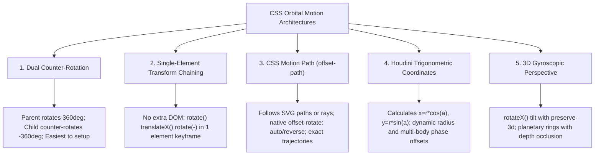

# 065: CSS Orbiting Objects & Planetary Motion Masterclass

## Overview & Executive Summary

Orbital motion is one of the most visually compelling choreography techniques in modern web design. From high-tech SaaS ecosystem visualizations, interactive circular docks, and quantum atomic diagrams to celestial astronomy maps and hero background motion systems, **CSS orbiting objects** introduce organic spatial rhythm, depth, and focus to digital experiences without relying on heavy WebGL or JavaScript canvas runtimes.

Creating true orbital motion in CSS requires solving fundamental geometric and rotational challenges:
1. **Revolution vs. Rotation:** Moving an object along a circular or elliptical trajectory around a center point (revolution) while maintaining its upright orientation (counter-rotation), preventing text, icons, and avatars from rendering upside-down.
2. **Trajectory Precision:** Choosing between classic transform matrix chaining, modern **CSS Motion Path** (`offset-path`), or Houdini-driven **CSS Trigonometric Functions** (`sin()`, `cos()`).
3. **Spatial Depth & Occlusion:** Simulating 3D planetary depth, perspective tilt, and foreground/background layering where objects pass realistically in front of and behind a central body.

```
+-------------------------------------------------------------------------------+
|                      CSS ORBITAL MOTION TAXONOMY                              |
|                                                                               |
|   1. Dual Counter-Rotation    2. CSS Motion Path         3. Modern Trig Engine|
|      (Parent + Child Spin)       (offset-path / dist)       (sin() / cos() / @property)
|            ╭───────╮                    ╭─ ─ ─ ─╮                    ╭───────╮|
|         ▲  │ Orbit │  ▲              ▲  │ Vector│  ▲              ▲  │ Polar │|
|         │  ╰───────╯  │              │  │ Track │  │              │  │ Coord │|
|      ┌──┴──┐       ┌──┴──┐        ┌──┴──┐       └───┐          ┌──┴──┐       │|
|      │ (A) │   ●   │ (A) │        │  ✈  │   ●       │          │ (A) │   ●   │|
|      └─────┘  Hub  └─────┘        └─────┘  Hub      │          └─────┘  Hub  │|
|            ╰───────╯                    ╰─ ─ ─ ─╯                    ╰───────╯|
|       (Stays Upright)             (Follows Vector Path)         (Houdini Angle Drive)|
|                                                                               |
|   4. 3D Gyroscopic Orbits      5. Elliptical Keplerian Trajectories           |
|      (perspective + rotateX)      (scaleX / scaleY Matrix Compensation)       |
|         /───────────/               . - - - - - - - - - .                     |
|        /     ●     /              (      ● Hub            )                   |
|       /───────────/                 ` - - - - - - - - - '                     |
+-------------------------------------------------------------------------------+
```

---

## Quick Reference Metadata

| Attribute | Specification Details |
| :--- | :--- |
| **Name** | CSS Orbiting Objects & Planetary Motion |
| **Category** | CSS Animations, Transforms, Trigonometric Functions & Motion Paths |
| **Difficulty** | Advanced (4/5) |
| **What it produces** | Continuous, frame-accurate circular, elliptical, 3D, and vector-path revolutions of DOM elements around stationary or moving focal points, maintaining correct vertical orientation and realistic depth occlusion. |
| **Why it works** | The browser calculates composite-layer geometric transformations along circular polar coordinates ($r, \theta$), SVG vector paths, or inverted rotational matrices ($M_{\text{orbit}} \times M_{\text{counter}} = I$) at 60/120 FPS on the GPU thread. |
| **Key Properties** | `transform`, `transform-origin`, `offset-path`, `offset-distance`, `offset-rotate`, `offset-anchor`, `@property`, `sin()`, `cos()`, `perspective`, `transform-style: preserve-3d`, `animation`, `will-change`. |
| **Strict Constraints** | When using rotation-based orbits, child elements will naturally flip upside down unless counter-rotated at the exact inverse frequency ($\omega_{\text{child}} = -\omega_{\text{parent}}$). For pure CSS variable angle animation, Houdini `@property` registration is required for smooth numeric interpolation. |
| **Browser Baseline** | Baseline 2023+ for standard transforms and counter-rotations. CSS Motion Path (`offset-path`) supported across all modern evergreen browsers (Chromium, Firefox, Safari 15.4+). CSS Trigonometric Functions (`sin()`, `cos()`) supported in Chromium 111+, Firefox 108+, Safari 15.4+. |
| **Acceptance Criteria** | 60/120 FPS compositor-driven motion without layout thrashing or paint spikes; zero inverted text/graphics during orbital cycles; full accessibility support via `prefers-reduced-motion`. |

### Quick Preview

```html
<div class="orbit-system" aria-label="Orbital Demonstration">
  <!-- Central Focal Point -->
  <div class="orbit-center">Hub</div>
  
  <!-- Orbital Ring & Satellite -->
  <div class="orbit-ring">
    <div class="orbit-satellite">
      <span class="satellite-content">🚀</span>
    </div>
  </div>
</div>
```

```css
:root {
  --orbit-radius: 120px;
  --orbit-duration: 8s;
}

.orbit-system {
  position: relative;
  inline-size: calc(var(--orbit-radius) * 2 + 60px);
  block-size: calc(var(--orbit-radius) * 2 + 60px);
  display: grid;
  place-items: center;
}

.orbit-center {
  inline-size: 64px;
  block-size: 64px;
  border-radius: 50%;
  background: radial-gradient(circle at 35% 35%, #6366f1, #312e81);
  color: #fff;
  display: grid;
  place-items: center;
  font-weight: 700;
  box-shadow: 0 0 24px rgba(99, 102, 241, 0.5);
  z-index: 2;
}

/* The revolving ring track */
.orbit-ring {
  position: absolute;
  inset: 0;
  margin: auto;
  inline-size: calc(var(--orbit-radius) * 2);
  block-size: calc(var(--orbit-radius) * 2);
  border: 1px dashed rgba(99, 102, 241, 0.3);
  border-radius: 50%;
  animation: orbitRotate var(--orbit-duration) linear infinite;
}

/* The satellite anchored to the top of the ring */
.orbit-satellite {
  position: absolute;
  top: 0;
  left: 50%;
  transform: translate(-50%, -50%);
  inline-size: 40px;
  block-size: 40px;
}

/* Counter-rotation to keep icon upright */
.satellite-content {
  display: grid;
  place-items: center;
  inline-size: 100%;
  block-size: 100%;
  background: #1e1b4b;
  border: 1px solid #818cf8;
  border-radius: 50%;
  font-size: 1.25rem;
  box-shadow: 0 4px 12px rgba(0, 0, 0, 0.4);
  animation: orbitCounterRotate var(--orbit-duration) linear infinite;
}

@keyframes orbitRotate {
  from { transform: rotate(0deg); }
  to   { transform: rotate(360deg); }
}

@keyframes orbitCounterRotate {
  from { transform: rotate(0deg); }
  to   { transform: rotate(-360deg); }
}

@media (prefers-reduced-motion: reduce) {
  .orbit-ring,
  .satellite-content {
    animation: none;
  }
}
```

---

## 1. Anatomy & Mathematical Mental Models

### 1.1 Polar vs. Cartesian Coordinates in CSS

To place an object at distance $r$ and angle $\theta$ relative to a center origin $(x_0, y_0)$, standard Newtonian orbital mechanics uses **polar coordinates** $(r, \theta)$:

$$x(\theta) = x_0 + r \cdot \cos(\theta)$$
$$y(\theta) = y_0 + r \cdot \sin(\theta)$$

```
                        (0, -r) [θ = 270° or -90°]
                                 ▲
                                 │
           (-r, 0) [θ = 180°]    │    (+r, 0) [θ = 0° / 360°]
           ◀─────────────────────┼─────────────────────▶ +X
                                 │ (0, 0) Center Hub
                                 │
                                 ▼
                        (0, +r) [θ = 90°]
                                +Y
```

In standard CSS web rendering:
1. The **Y-axis points downward** ($+Y$ is down, $-Y$ is up).
2. Angle progression is **clockwise** when using positive degree rotations (`rotate(90deg)` moves from East to South).
3. With native **CSS Trigonometric Functions** (`sin()`, `cos()`), we can calculate exact pixel offsets natively inside `calc()`, directly mapping mathematical polar functions to layout coordinates.

---

### 1.2 The Transformation Pipeline & The Counter-Rotation Theorem

When an element is rotated by an angle $\theta$ inside a revolving parent container, the total transformation matrix applied to the child content is the product of both transformation matrices:

$$M_{\text{total}} = M_{\text{parent}}(\theta) \times M_{\text{child}}(\phi)$$

$$\begin{bmatrix} \cos\theta & -\sin\theta \\ \sin\theta & \cos\theta \end{bmatrix} \times \begin{bmatrix} \cos\phi & -\sin\phi \\ \sin\phi & \cos\phi \end{bmatrix} = \begin{bmatrix} \cos(\theta+\phi) & -\sin(\theta+\phi) \\ \sin(\theta+\phi) & \cos(\theta+\phi) \end{bmatrix}$$

```
Parent Revolution Only (θ = 180°)          Parent Revolution + Counter-Rotation (θ = 180°, φ = -180°)
      ┌─────────────────────────┐               ┌─────────────────────────┐
      │          ( A )          │               │          ( A )          │
      │            ▲            │               │            ▲            │
      │         Top: 0°         │               │         Top: 0°         │
      │            │            │               │            │            │
      │      ● Center Hub       │               │      ● Center Hub       │
      │            │            │               │            │            │
      │       Bottom: 180°      │               │       Bottom: 180°      │
      │            ▼            │               │            ▼            │
      │          ( ∀ )          │               │          ( A )          │
      │      [Upside Down!]     │               │     [Perfect Upright!]  │
      └─────────────────────────┘               └─────────────────────────┘
```

> [!IMPORTANT]
> **The Counter-Rotation Theorem:**
> To maintain a constant absolute visual orientation (zero global tilt), the child element must execute an intrinsic rotation $\phi(t)$ whose instantaneous angular velocity is exactly equal in magnitude and opposite in sign to the parent orbital angular velocity:
> $$\phi(t) = -\theta(t)$$
> If the parent rotates from `0deg` to `360deg`, the child must rotate from `0deg` to `-360deg` over the exact same timing curve and duration.

---

### 1.3 Comparison of Orbital Motion Architectures



| Technique | DOM Requirement | Trajectory Shape | Upright Orientation Support | GPU Compositing | Ideal Use Case |
| :--- | :--- | :--- | :--- | :--- | :--- |
| **Dual Counter-Rotation** | 2 Elements (Parent + Child) | Circular | Automatic via `-360deg` keyframe | 100% GPU Thread | SaaS ecosystem rings, revolving cards, simple circular docks |
| **Single-Element Chaining** | 1 Element | Circular | Built-in via keyframe matrix steps | 100% GPU Thread | Lightweight decorative particle orbits, minimal DOM budgets |
| **CSS Motion Path (`offset-path`)** | 1 Element | Arbitrary SVG curves, Ellipses, Complex Vectors | Native `offset-rotate: 0deg` or `auto` | 100% GPU Thread | Spaceships, satellites along custom elliptical paths, organic flight lines |
| **Houdini + CSS Trigonometry** | 1 Element | Mathematical (Parametric, Lissajous, Spiral) | Full programmatic control via `calc()` | Requires Houdini `@property` support | Dynamic radii, mathematical multi-satellite distributions, interactive angle dials |
| **3D Gyroscopic Perspective** | 2-3 Elements | Tilted 3D Elliptical | Preserved via `rotateX()` counter-tilt | 100% GPU Thread | Atomic models, planetary solar systems, sci-fi HUD holograms |

---

## 2. The 4 Core Architectural Primitives

---

### Primitive 1: The Dual-Element Counter-Rotation Pattern

The most robust and backwards-compatible technique uses a parent container that revolves around its center, paired with a child element that counter-revolves at the exact inverse rate.

```
┌─────────────────────────────────────────────────────────────┐
│ .orbit-ring (Rotates 0deg -> 360deg)                        │
│   ┌───────────────────────────────────────────────────────┐ │
│   │ .orbit-item (Positioned at radius offset)             │ │
│   │   ┌─────────────────────────────────────────────────┐ │ │
│   │   │ .orbit-content (Rotates 0deg -> -360deg)        │ │ │
│   │   │ [Upright Icon / Avatar / Text Badge]            │ │ │
│   │   └─────────────────────────────────────────────────┘ │ │
│   └───────────────────────────────────────────────────────┘ │
└─────────────────────────────────────────────────────────────┘
```

#### Core Implementation:

```css
.orbit-track {
  position: relative;
  inline-size: 300px;
  block-size: 300px;
  border-radius: 50%;
  animation: orbitTrackSpin 12s linear infinite;
  transform-style: preserve-3d;
  will-change: transform;
}

.orbit-node {
  position: absolute;
  top: 0;
  left: 50%;
  transform: translate(-50%, -50%);
}

.orbit-content {
  display: block;
  animation: orbitNodeCounterSpin 12s linear infinite;
  will-change: transform;
}

@keyframes orbitTrackSpin {
  0%   { transform: rotate(0deg); }
  100% { transform: rotate(360deg); }
}

@keyframes orbitNodeCounterSpin {
  0%   { transform: rotate(0deg); }
  100% { transform: rotate(-360deg); }
}
```

---

### Primitive 2: Single-Element Transform Matrix Chaining

You can achieve complete orbital motion with upright orientation on a **single DOM element** by combining three transformation steps inside `@keyframes`:
1. `rotate(θ)`: Rotate the coordinate system by angle $\theta$.
2. `translateX(r)`: Translate out by radius $r$.
3. `rotate(-θ)`: Invert the rotation so the element remains upright.

```
Step 1: rotate(45deg)           Step 2: translateX(150px)       Step 3: rotate(-45deg)
         /                                /                            /
        /                                /                            /
       / 45°                            / 150px                      / (A) [Upright]
      ●────────                       ●───────────────[ ∀ ]         ●────────────────
```

#### Core Implementation:

```css
.single-orbit-satellite {
  --radius: 140px;
  --speed: 10s;
  
  position: absolute;
  top: 50%;
  left: 50%;
  inline-size: 48px;
  block-size: 48px;
  margin-top: -24px;
  margin-left: -24px;
  
  animation: singleOrbit var(--speed) linear infinite;
  will-change: transform;
}

@keyframes singleOrbit {
  from {
    transform: rotate(0deg) translateX(var(--radius)) rotate(0deg);
  }
  to {
    transform: rotate(360deg) translateX(var(--radius)) rotate(-360deg);
  }
}
```

---

### Primitive 3: Modern CSS Motion Path (`offset-path`)

The **W3C CSS Motion Path Module Level 1** provides first-class primitives for animating elements along arbitrary geometry, including SVG path definitions, ellipses, or rays.

```css
.motion-satellite {
  /* Define orbital trajectory via standard SVG path syntax */
  offset-path: path("M 150 0 A 150 150 0 1 1 -150 0 A 150 150 0 1 1 150 0");
  
  /* Maintain fixed upright angle (0deg) or follow path tangent (auto) */
  offset-rotate: 0deg; 
  
  /* Center element on the path */
  offset-anchor: 50% 50%;
  
  animation: followMotionPath 8s linear infinite;
  will-change: offset-distance;
}

@keyframes followMotionPath {
  0% {
    offset-distance: 0%;
  }
  100% {
    offset-distance: 100%;
  }
}
```

> [!TIP]
> **Why `offset-path` excels for non-circular trajectories:**
> Traditional CSS `transform` chains struggle with non-circular shapes. With `offset-path`, you can specify custom eccentric Keplerian ellipses (`path("M ... A rx ry ...")`), figure-8 infinity loops, or spiral entry paths effortlessly.

---

### Primitive 4: Houdini `@property` & CSS Trigonometric Functions

By registering an animatable angle custom property with the CSS Houdini API, modern browsers can smoothly interpolate `--angle` and evaluate native `cos()` and `sin()` functions on every frame:

```css
/* 1. Register animatable custom property */
@property --orbit-angle {
  syntax: "<angle>";
  inherits: false;
  initial-value: 0deg;
}

.trig-satellite {
  --orbit-r: 160px;
  
  /* Parametric Cartesian evaluation */
  --x: calc(var(--orbit-r) * cos(var(--orbit-angle)));
  --y: calc(var(--orbit-r) * sin(var(--orbit-angle)));
  
  position: absolute;
  top: 50%;
  left: 50%;
  transform: translate(calc(-50% + var(--x)), calc(-50% + var(--y)));
  
  animation: driveTrigAngle 10s linear infinite;
}

@keyframes driveTrigAngle {
  0%   { --orbit-angle: 0deg; }
  100% { --orbit-angle: 360deg; }
}
```

---

## 3. Comprehensive Implementation Patterns

---

### Pattern 1: Interactive SaaS Ecosystem Radar

A production-grade, highly polished interactive component featuring a central glowing API hub surrounded by multi-tiered concentric orbits of integration partner nodes. Nodes maintain upright posture, respond to hover interactions with smooth pausing and tooltip expansion, and display pulsing radar sweep waves.

```
+-------------------------------------------------------------------------------+
|                       SAAS INTEGRATION ECOSYSTEM RADAR                        |
|                                                                               |
|                            ( AWS ) [Orbit 2]                                  |
|                                ·                                              |
|                     ( GitHub ) ·                                              |
|                         ·      ·                                              |
|                · - - - -·- - - · - - - - ·                                    |
|              '          ·      ·           '                                  |
|            '      ╭─────·──────·─────╮       '                                |
|           '       │     ·      ·     │        '                               |
|          '   (TS) ·    ╭──────────╮  · (React) '                              |
|          │        ·    │ CORE API │  ·         │                              |
|          '        ·    ╰──────────╯  ·         '                              |
|           '       │                  │        '                               |
|            '      ╰──────────────────╯       '                                |
|              '          ·                  '                                  |
|                · - - - -·- - - - - - - - ·                                    |
|                         ·                                                     |
|                     ( Docker )                                                |
+-------------------------------------------------------------------------------+
```

#### HTML

```html
<section class="ecosystem-container" aria-label="Cloud Integration Ecosystem">
  <!-- Ambient Radial Grid Background -->
  <div class="radar-grid" aria-hidden="true">
    <div class="radar-beam"></div>
  </div>

  <!-- Central Engine Core -->
  <div class="core-hub" role="region" aria-label="Core Engine">
    <div class="core-halo"></div>
    <div class="core-badge">
      <svg class="core-icon" viewBox="0 0 24 24" fill="none" stroke="currentColor" stroke-width="2">
        <polygon points="12 2 2 7 12 12 22 7 12 2" />
        <polyline points="2 17 12 22 22 17" />
        <polyline points="2 12 12 17 22 12" />
      </svg>
      <span class="core-title">Nexus OS</span>
    </div>
  </div>

  <!-- Inner Orbit Ring (Duration: 24s) -->
  <div class="orbit-tier tier-inner" style="--tier-radius: 120px; --tier-duration: 24s;">
    <!-- Node 1: TypeScript (0deg offset) -->
    <div class="orbit-slot" style="--slot-angle: 0deg;">
      <div class="orbit-card" tabindex="0">
        <div class="card-icon" style="--accent-color: #3178c6;">TS</div>
        <div class="card-tooltip">TypeScript SDK</div>
      </div>
    </div>

    <!-- Node 2: React (120deg offset) -->
    <div class="orbit-slot" style="--slot-angle: 120deg;">
      <div class="orbit-card" tabindex="0">
        <div class="card-icon" style="--accent-color: #61dafb;">⚛</div>
        <div class="card-tooltip">React Client</div>
      </div>
    </div>

    <!-- Node 3: GraphQL (240deg offset) -->
    <div class="orbit-slot" style="--slot-angle: 240deg;">
      <div class="orbit-card" tabindex="0">
        <div class="card-icon" style="--accent-color: #e535ab;">◈</div>
        <div class="card-tooltip">GraphQL API</div>
      </div>
    </div>
  </div>

  <!-- Outer Orbit Ring (Duration: 36s, Reverse Direction) -->
  <div class="orbit-tier tier-outer" style="--tier-radius: 200px; --tier-duration: 36s; --direction: reverse;">
    <!-- Node 4: Docker (60deg offset) -->
    <div class="orbit-slot" style="--slot-angle: 60deg;">
      <div class="orbit-card" tabindex="0">
        <div class="card-icon" style="--accent-color: #2496ed;">🐳</div>
        <div class="card-tooltip">Docker Runtime</div>
      </div>
    </div>

    <!-- Node 5: AWS (180deg offset) -->
    <div class="orbit-slot" style="--slot-angle: 180deg;">
      <div class="orbit-card" tabindex="0">
        <div class="card-icon" style="--accent-color: #ff9900;">☁</div>
        <div class="card-tooltip">AWS Lambda</div>
      </div>
    </div>

    <!-- Node 6: PostgreSQL (300deg offset) -->
    <div class="orbit-slot" style="--slot-angle: 300deg;">
      <div class="orbit-card" tabindex="0">
        <div class="card-icon" style="--accent-color: #336791;">🐘</div>
        <div class="card-tooltip">PostgreSQL DB</div>
      </div>
    </div>
  </div>
</section>
```

#### CSS

```css
:root {
  --eco-bg: #0b0f19;
  --eco-surface: #111827;
  --eco-border: rgba(255, 255, 255, 0.08);
  --eco-primary: #6366f1;
  --eco-primary-glow: rgba(99, 102, 241, 0.35);
  --eco-text: #f3f4f6;
  --eco-text-muted: #9ca3af;
}

.ecosystem-container {
  position: relative;
  inline-size: 100%;
  max-inline-size: 560px;
  aspect-ratio: 1 / 1;
  margin-inline: auto;
  display: grid;
  place-items: center;
  background: radial-gradient(circle at center, #151c2e 0%, var(--eco-bg) 70%);
  border-radius: 24px;
  border: 1px solid var(--eco-border);
  overflow: hidden;
  box-shadow: 0 20px 50px rgba(0, 0, 0, 0.6);
  user-select: none;
}

/* 1. Radar Background Grid & Ambient Scanner */
.radar-grid {
  position: absolute;
  inset: 0;
  pointer-events: none;
  background-image: 
    radial-gradient(circle at center, transparent 119px, var(--eco-border) 120px, transparent 121px),
    radial-gradient(circle at center, transparent 199px, var(--eco-border) 200px, transparent 201px),
    linear-gradient(to right, var(--eco-border) 1px, transparent 1px),
    linear-gradient(to bottom, var(--eco-border) 1px, transparent 1px);
  background-size: 100% 100%, 100% 100%, 50% 50%, 50% 50%;
  background-position: center;
}

.radar-beam {
  position: absolute;
  inset: 0;
  background: conic-gradient(from 0deg at 50% 50%, transparent 0deg, var(--eco-primary-glow) 45deg, transparent 60deg);
  border-radius: 50%;
  animation: radarSweep 10s linear infinite;
  opacity: 0.4;
}

@keyframes radarSweep {
  to { transform: rotate(360deg); }
}

/* 2. Core Focal Hub */
.core-hub {
  position: relative;
  z-index: 10;
  inline-size: 96px;
  block-size: 96px;
  display: grid;
  place-items: center;
}

.core-halo {
  position: absolute;
  inset: -12px;
  border-radius: 50%;
  background: radial-gradient(circle, var(--eco-primary-glow) 0%, transparent 70%);
  animation: corePulse 3s ease-in-out infinite alternate;
}

@keyframes corePulse {
  from { transform: scale(0.9); opacity: 0.5; }
  to   { transform: scale(1.2); opacity: 0.9; }
}

.core-badge {
  position: relative;
  inline-size: 100%;
  block-size: 100%;
  background: linear-gradient(135deg, #1e1b4b, #312e81);
  border: 1.5px solid #818cf8;
  border-radius: 50%;
  display: flex;
  flex-direction: column;
  align-items: center;
  justify-content: center;
  gap: 4px;
  box-shadow: 0 0 30px rgba(99, 102, 241, 0.5);
}

.core-icon {
  inline-size: 28px;
  block-size: 28px;
  stroke: #c7d2fe;
}

.core-title {
  font-size: 0.65rem;
  font-weight: 700;
  letter-spacing: 0.08em;
  text-transform: uppercase;
  color: #e0e7ff;
}

/* 3. Orbit Tiers & Continuous Motion */
.orbit-tier {
  position: absolute;
  inset: 0;
  margin: auto;
  inline-size: calc(var(--tier-radius) * 2);
  block-size: calc(var(--tier-radius) * 2);
  border: 1px dashed rgba(255, 255, 255, 0.12);
  border-radius: 50%;
  animation: spinTier var(--tier-duration) linear infinite;
  animation-direction: var(--direction, normal);
  pointer-events: none;
}

/* Pause entire orbit system when user hovers over container */
.ecosystem-container:hover .orbit-tier,
.ecosystem-container:focus-within .orbit-tier {
  animation-play-state: paused;
}

@keyframes spinTier {
  from { transform: rotate(0deg); }
  to   { transform: rotate(360deg); }
}

/* 4. Slot Positioning on the Ring */
.orbit-slot {
  position: absolute;
  top: 50%;
  left: 50%;
  /* Trigonometric or transform-based angle distribution */
  transform: rotate(var(--slot-angle)) translate(var(--tier-radius)) rotate(calc(-1 * var(--slot-angle)));
  margin-top: -24px;
  margin-left: -24px;
  inline-size: 48px;
  block-size: 48px;
  pointer-events: auto;
}

/* 5. Orbit Card & Upright Counter-Rotation */
.orbit-card {
  position: relative;
  inline-size: 100%;
  block-size: 100%;
  display: grid;
  place-items: center;
  border-radius: 50%;
  cursor: pointer;
  outline: none;
  animation: counterSpinTier var(--tier-duration) linear infinite;
  animation-direction: var(--direction, normal);
  transition: transform 250ms cubic-bezier(0.34, 1.56, 0.64, 1);
}

.ecosystem-container:hover .orbit-card,
.ecosystem-container:focus-within .orbit-card {
  animation-play-state: paused;
}

@keyframes counterSpinTier {
  from { transform: rotate(0deg); }
  to   { transform: rotate(-360deg); }
}

.card-icon {
  inline-size: 44px;
  block-size: 44px;
  border-radius: 50%;
  background: var(--eco-surface);
  border: 1px solid rgba(255, 255, 255, 0.15);
  display: grid;
  place-items: center;
  font-size: 1rem;
  font-weight: 700;
  color: var(--eco-text);
  box-shadow: 0 4px 16px rgba(0, 0, 0, 0.4);
  transition: border-color 200ms ease, box-shadow 200ms ease, transform 200ms ease;
}

.orbit-card:hover .card-icon,
.orbit-card:focus-visible .card-icon {
  border-color: var(--accent-color);
  box-shadow: 0 0 20px var(--accent-color);
  transform: scale(1.18);
}

/* 6. Tooltip Display */
.card-tooltip {
  position: absolute;
  bottom: calc(100% + 8px);
  left: 50%;
  transform: translateX(-50%) translateY(4px);
  padding: 4px 8px;
  background: #1f2937;
  color: #fff;
  font-size: 0.72rem;
  font-weight: 500;
  white-space: nowrap;
  border-radius: 6px;
  border: 1px solid rgba(255, 255, 255, 0.1);
  pointer-events: none;
  opacity: 0;
  transition: opacity 180ms ease, transform 180ms ease;
  box-shadow: 0 4px 12px rgba(0, 0, 0, 0.5);
  z-index: 20;
}

.orbit-card:hover .card-tooltip,
.orbit-card:focus-visible .card-tooltip {
  opacity: 1;
  transform: translateX(-50%) translateY(0);
}

/* Reduced Motion Safety */
@media (prefers-reduced-motion: reduce) {
  .radar-beam,
  .core-halo,
  .orbit-tier,
  .orbit-card {
    animation: none !important;
  }
}
```

---

### Pattern 2: Multi-Ring Planetary Observatory (3D Tilted Perspective)

Simulating an authentic celestial solar system with elliptical orbital perspective (`perspective: 1000px`, `rotateX(68deg)`), true 3D spatial depth sorting, and atmospheric halo glows. Planets scale and adjust brightness as they traverse the near (foreground) and far (background) arcs of their orbit.

```
+-------------------------------------------------------------------------------+
|                      3D CELESTIAL PLANETARY OBSERVATORY                       |
|                                                                               |
|         . - - - - - - - - - - - - - - - - - - - - - - - - - - - .             |
|       '                       [ Far Arc / Dim / z-index: 1 ]     '            |
|      (      ★ Planet Alpha (Small, Darker)                       )            |
|     (                                                             )           |
|    (                     ╭─────────────────╮                       )          |
|    (                     │   SOLAR STAR    │                       )          |
|    (                     │   (Central)     │                       )          |
|     (                    ╰─────────────────╯                      )           |
|      (                                                           )            |
|       '     ★ Planet Alpha (Large, Bright, Glow)                '             |
|         ' - - - - - - - - - - - - - - - - - - - - - - - - - - '               |
|                               [ Near Arc / Bright / z-index: 10 ]             |
+-------------------------------------------------------------------------------+
```

#### HTML

```html
<div class="solar-system-stage" aria-label="3D Solar System Simulation">
  <div class="solar-space">
    <!-- Center Star (Sun) -->
    <div class="celestial-star">
      <div class="star-core"></div>
      <div class="star-corona"></div>
    </div>

    <!-- Orbit 1: Inner Terrestrial Planet -->
    <div class="planetary-orbit orbit-mercury" style="--orbit-w: 260px; --orbit-h: 120px; --period: 8s;">
      <div class="planet-body planet-cyan" aria-label="Planet Cyan">
        <div class="planet-sphere"></div>
        <div class="planet-shadow"></div>
      </div>
    </div>

    <!-- Orbit 2: Gas Giant with Rings -->
    <div class="planetary-orbit orbit-saturn" style="--orbit-w: 420px; --orbit-h: 190px; --period: 16s;">
      <div class="planet-body planet-gold" aria-label="Planet Gold">
        <div class="planet-sphere"></div>
        <div class="ring-disc"></div>
        <div class="planet-shadow"></div>
      </div>
    </div>

    <!-- Orbit 3: Distant Ice Planet -->
    <div class="planetary-orbit orbit-neptune" style="--orbit-w: 580px; --orbit-h: 260px; --period: 28s;">
      <div class="planet-body planet-violet" aria-label="Planet Violet">
        <div class="planet-sphere"></div>
        <div class="planet-shadow"></div>
      </div>
    </div>
  </div>
</div>
```

#### CSS

```css
.solar-system-stage {
  position: relative;
  inline-size: 100%;
  block-size: 420px;
  background: radial-gradient(ellipse at center, #090d16 0%, #020408 100%);
  border-radius: 20px;
  display: grid;
  place-items: center;
  overflow: hidden;
  perspective: 1000px;
}

.solar-space {
  position: relative;
  inline-size: 600px;
  block-size: 600px;
  display: grid;
  place-items: center;
  transform-style: preserve-3d;
  /* Pitch viewing plane forward 68 degrees */
  transform: rotateX(68deg) rotateZ(-12deg);
}

/* 1. The Central Star */
.celestial-star {
  position: absolute;
  inline-size: 70px;
  block-size: 70px;
  z-index: 5;
  transform-style: preserve-3d;
  /* Counter-tilt star so it faces the viewer directly */
  transform: rotateZ(12deg) rotateX(-68deg);
}

.star-core {
  inline-size: 100%;
  block-size: 100%;
  border-radius: 50%;
  background: radial-gradient(circle at 35% 35%, #fff7ed, #fbbf24 40%, #ea580c 85%);
  box-shadow: 
    0 0 30px #f59e0b,
    0 0 70px rgba(245, 158, 11, 0.6),
    0 0 120px rgba(234, 88, 12, 0.4);
}

.star-corona {
  position: absolute;
  inset: -15px;
  border-radius: 50%;
  background: radial-gradient(circle, rgba(251, 191, 36, 0.4) 0%, transparent 75%);
  animation: coronaFlicker 4s ease-in-out infinite alternate;
}

@keyframes coronaFlicker {
  0%   { transform: scale(0.92); opacity: 0.6; }
  100% { transform: scale(1.12); opacity: 1; }
}

/* 2. Elliptical Planetary Orbits */
.planetary-orbit {
  position: absolute;
  inline-size: var(--orbit-w);
  block-size: var(--orbit-h);
  border: 1px solid rgba(255, 255, 255, 0.12);
  border-radius: 50%;
  transform-style: preserve-3d;
  animation: orbitKepler var(--period) linear infinite;
}

@keyframes orbitKepler {
  from { transform: rotateZ(0deg); }
  to   { transform: rotateZ(360deg); }
}

/* 3. Planet Placement & Dynamic Depth Simulation */
.planet-body {
  position: absolute;
  top: 50%;
  left: 100%;
  margin-top: -16px;
  margin-left: -16px;
  inline-size: 32px;
  block-size: 32px;
  transform-style: preserve-3d;
  /* Maintain planet sphere facing camera while orbiting */
  animation: planetUpright var(--period) linear infinite;
}

@keyframes planetUpright {
  0% {
    transform: rotateZ(0deg) rotateX(-68deg) scale(1);
    z-index: 10;
    filter: brightness(1.2);
  }
  25% {
    transform: rotateZ(-90deg) rotateX(-68deg) scale(0.85);
    z-index: 6;
    filter: brightness(0.9);
  }
  50% {
    transform: rotateZ(-180deg) rotateX(-68deg) scale(0.65);
    z-index: 1; /* Passes behind Central Star */
    filter: brightness(0.6);
  }
  75% {
    transform: rotateZ(-270deg) rotateX(-68deg) scale(0.85);
    z-index: 6;
    filter: brightness(0.9);
  }
  100% {
    transform: rotateZ(-360deg) rotateX(-68deg) scale(1);
    z-index: 10; /* Passes in front of Central Star */
    filter: brightness(1.2);
  }
}

/* 4. Planet Shading & Materials */
.planet-sphere {
  inline-size: 100%;
  block-size: 100%;
  border-radius: 50%;
}

.planet-cyan .planet-sphere {
  background: radial-gradient(circle at 30% 30%, #a5f3fc, #0891b2 60%, #164e63);
  box-shadow: inset -4px -4px 8px rgba(0, 0, 0, 0.8), 0 0 12px rgba(6, 182, 212, 0.4);
}

.planet-gold .planet-sphere {
  background: radial-gradient(circle at 30% 30%, #fef08a, #ca8a04 60%, #713f12);
  box-shadow: inset -4px -4px 8px rgba(0, 0, 0, 0.8), 0 0 16px rgba(234, 179, 8, 0.4);
}

.planet-violet .planet-sphere {
  background: radial-gradient(circle at 30% 30%, #ddd6fe, #7c3aed 60%, #4c1d95);
  box-shadow: inset -4px -4px 8px rgba(0, 0, 0, 0.8), 0 0 14px rgba(124, 58, 237, 0.4);
}

/* Saturn Ring Disc */
.ring-disc {
  position: absolute;
  top: 50%;
  left: 50%;
  inline-size: 64px;
  block-size: 64px;
  margin-top: -32px;
  margin-left: -32px;
  border-radius: 50%;
  border: 6px solid rgba(234, 179, 8, 0.5);
  border-top-color: rgba(254, 240, 138, 0.8);
  transform: rotateX(75deg);
  pointer-events: none;
}

@media (prefers-reduced-motion: reduce) {
  .planetary-orbit,
  .planet-body,
  .star-corona {
    animation: none !important;
  }
}
```

---

### Pattern 3: Trigonometric Expanding Orbit Menu (Houdini & CSS `cos()` / `sin()`)

An advanced radial Floating Action Button (FAB) menu where navigation items orbit outward into a clean mathematical arc or full ring using CSS Trigonometric functions (`cos()`, `sin()`) and `@property --expand-progress`.

```
+-------------------------------------------------------------------------------+
|                      TRIGONOMETRIC RADIAL EXPANSION MENU                      |
|                                                                               |
|                       [Item 1: 0°]  (r * cos 0°, r * sin 0°)                  |
|                              ●                                                |
|                             /                                                 |
|             [Item 4: 270°] ● ─── ╭────────╮ ─── ● [Item 2: 90°]               |
|                                  │  (+)   │                                   |
|                                  │ Action │                                   |
|                                  ╰────────╯                                   |
|                             \                                                 |
|                              ●                                                |
|                       [Item 3: 180°]                                          |
+-------------------------------------------------------------------------------+
```

#### HTML

```html
<nav class="trig-orbit-menu" aria-label="Circular Navigation Menu">
  <!-- State Toggle Input -->
  <input type="checkbox" id="menu-toggle" class="menu-toggle-input" />
  
  <!-- Central Radial Trigger -->
  <label for="menu-toggle" class="menu-trigger" aria-label="Toggle Navigation">
    <span class="trigger-icon" aria-hidden="true">+</span>
  </label>

  <!-- Orbiting Menu Items -->
  <ul class="orbit-items-list">
    <li class="orbit-item" style="--index: 0; --total: 6; --item-color: #ef4444;">
      <a href="#home" class="item-btn" aria-label="Dashboard">
        <span>🏠</span>
      </a>
    </li>
    <li class="orbit-item" style="--index: 1; --total: 6; --item-color: #f59e0b;">
      <a href="#analytics" class="item-btn" aria-label="Analytics">
        <span>📊</span>
      </a>
    </li>
    <li class="orbit-item" style="--index: 2; --total: 6; --item-color: #10b981;">
      <a href="#messages" class="item-btn" aria-label="Messages">
        <span>💬</span>
      </a>
    </li>
    <li class="orbit-item" style="--index: 3; --total: 6; --item-color: #06b6d4;">
      <a href="#cloud" class="item-btn" aria-label="Cloud Storage">
        <span>☁</span>
      </a>
    </li>
    <li class="orbit-item" style="--index: 4; --total: 6; --item-color: #6366f1;">
      <a href="#settings" class="item-btn" aria-label="Settings">
        <span>⚙</span>
      </a>
    </li>
    <li class="orbit-item" style="--index: 5; --total: 6; --item-color: #ec4899;">
      <a href="#profile" class="item-btn" aria-label="User Profile">
        <span>👤</span>
      </a>
    </li>
  </ul>
</nav>
```

#### CSS

```css
/* 1. Register Houdini Custom Property for Smooth Dynamic Radial Expansion */
@property --orbit-expansion {
  syntax: "<number>";
  inherits: true;
  initial-value: 0;
}

:root {
  --base-orbit-radius: 110px;
}

.trig-orbit-menu {
  position: relative;
  inline-size: 320px;
  block-size: 320px;
  margin: 40px auto;
  display: grid;
  place-items: center;
  --orbit-expansion: 0;
  transition: --orbit-expansion 400ms cubic-bezier(0.34, 1.56, 0.64, 1);
}

/* Expand on Checkbox Checked */
.menu-toggle-input {
  position: absolute;
  opacity: 0;
  pointer-events: none;
}

.trig-orbit-menu:has(.menu-toggle-input:checked) {
  --orbit-expansion: 1;
}

/* 2. Central Floating Action Trigger Button */
.menu-trigger {
  position: relative;
  z-index: 10;
  inline-size: 60px;
  block-size: 60px;
  border-radius: 50%;
  background: linear-gradient(135deg, #4f46e5, #7c3aed);
  box-shadow: 0 8px 24px rgba(79, 70, 229, 0.45);
  display: grid;
  place-items: center;
  cursor: pointer;
  color: white;
  transition: transform 300ms cubic-bezier(0.34, 1.56, 0.64, 1), box-shadow 300ms ease;
}

.menu-trigger:hover {
  transform: scale(1.08);
  box-shadow: 0 12px 30px rgba(79, 70, 229, 0.6);
}

.trigger-icon {
  font-size: 2rem;
  font-weight: 300;
  line-height: 1;
  transition: transform 300ms cubic-bezier(0.34, 1.56, 0.64, 1);
}

.menu-toggle-input:checked ~ .menu-trigger .trigger-icon {
  transform: rotate(135deg);
}

/* 3. Orbit Items List */
.orbit-items-list {
  position: absolute;
  inset: 0;
  margin: 0;
  padding: 0;
  list-style: none;
  pointer-events: none;
}

/* 4. Native Trigonometric Coordinate Calculation */
.orbit-item {
  position: absolute;
  top: 50%;
  left: 50%;
  
  /* Calculate polar angle per node: (360deg / total) * index */
  --angle: calc((360deg / var(--total)) * var(--index));
  
  /* Current dynamic expansion radius */
  --current-radius: calc(var(--base-orbit-radius) * var(--orbit-expansion));
  
  /* Cartesian conversion using CSS sin() and cos() */
  --coord-x: calc(var(--current-radius) * cos(var(--angle)));
  --coord-y: calc(var(--current-radius) * sin(var(--angle)));
  
  transform: translate(
    calc(-50% + var(--coord-x)),
    calc(-50% + var(--coord-y))
  ) scale(var(--orbit-expansion));
  
  opacity: var(--orbit-expansion);
  transition: transform 400ms cubic-bezier(0.34, 1.56, 0.64, 1),
              opacity 300ms ease;
  pointer-events: auto;
}

/* 5. Button Link Aesthetics */
.item-btn {
  display: grid;
  place-items: center;
  inline-size: 46px;
  block-size: 46px;
  border-radius: 50%;
  background: #1e1b4b;
  border: 2px solid var(--item-color);
  color: #fff;
  text-decoration: none;
  font-size: 1.2rem;
  box-shadow: 0 4px 16px rgba(0, 0, 0, 0.4);
  transition: transform 200ms cubic-bezier(0.34, 1.56, 0.64, 1),
              background 200ms ease;
}

.item-btn:hover,
.item-btn:focus-visible {
  transform: scale(1.2);
  background: var(--item-color);
}
```

---

### Pattern 4: 3D Gyroscopic Quantum Nucleus

A multi-axis atomic model featuring three intersecting orbital rings oriented at $120^\circ$ angles in 3D Euclidean space, each carrying high-velocity quantum electron particles with dynamic energy trails.

```
+-------------------------------------------------------------------------------+
|                       3D GYROSCOPIC ATOMIC NUCLEUS                            |
|                                                                               |
|                              Ring 1 (0° Tilt)                                 |
|                                     │                                         |
|                       Ring 2 (60°) ╲ │ ╱ Ring 3 (-60°)                        |
|                                     ╲│╱                                       |
|                                 ● Nucleus                                     |
|                                     ╱│╲                                       |
|                                    ╱ │ ╲                                      |
|                                     │                                         |
|                          (Electrons in Orbit)                                 |
+-------------------------------------------------------------------------------+
```

#### HTML

```html
<div class="quantum-atom-scene" aria-label="3D Quantum Atomic Model">
  <div class="atom-viewport">
    <!-- Center Proton/Neutron Nucleus -->
    <div class="atom-nucleus">
      <div class="nucleus-glow"></div>
      <div class="nucleon p1"></div>
      <div class="nucleon p2"></div>
      <div class="nucleon n1"></div>
      <div class="nucleon n2"></div>
    </div>

    <!-- Gyroscopic Orbital Ring A (Pitch 60deg, Yaw 0deg) -->
    <div class="gyro-ring ring-alpha" style="--ring-rot-x: 65deg; --ring-rot-y: 0deg; --ring-speed: 2.4s;">
      <div class="electron-track">
        <div class="electron-particle"></div>
      </div>
    </div>

    <!-- Gyroscopic Orbital Ring B (Pitch 60deg, Yaw 60deg) -->
    <div class="gyro-ring ring-beta" style="--ring-rot-x: 65deg; --ring-rot-y: 60deg; --ring-speed: 2.8s;">
      <div class="electron-track">
        <div class="electron-particle"></div>
      </div>
    </div>

    <!-- Gyroscopic Orbital Ring C (Pitch 60deg, Yaw 120deg) -->
    <div class="gyro-ring ring-gamma" style="--ring-rot-x: 65deg; --ring-rot-y: 120deg; --ring-speed: 3.2s;">
      <div class="electron-track">
        <div class="electron-particle"></div>
      </div>
    </div>
  </div>
</div>
```

#### CSS

```css
.quantum-atom-scene {
  position: relative;
  inline-size: 100%;
  block-size: 380px;
  background: radial-gradient(circle at center, #0d1117 0%, #030712 100%);
  border-radius: 20px;
  display: grid;
  place-items: center;
  perspective: 1200px;
  overflow: hidden;
}

.atom-viewport {
  position: relative;
  inline-size: 260px;
  block-size: 260px;
  transform-style: preserve-3d;
  animation: atomTumble 20s linear infinite;
}

@keyframes atomTumble {
  0%   { transform: rotateX(0deg) rotateY(0deg) rotateZ(0deg); }
  100% { transform: rotateX(360deg) rotateY(720deg) rotateZ(360deg); }
}

/* 1. The Atomic Nucleus Cluster */
.atom-nucleus {
  position: absolute;
  top: 50%;
  left: 50%;
  transform: translate(-50%, -50%);
  inline-size: 40px;
  block-size: 40px;
  transform-style: preserve-3d;
  z-index: 10;
}

.nucleus-glow {
  position: absolute;
  inset: -10px;
  border-radius: 50%;
  background: radial-gradient(circle, rgba(236, 72, 153, 0.6), transparent 70%);
  animation: nucleusPulse 2s ease-in-out infinite alternate;
}

@keyframes nucleusPulse {
  from { transform: scale(0.8); opacity: 0.6; }
  to   { transform: scale(1.3); opacity: 1; }
}

.nucleon {
  position: absolute;
  inline-size: 18px;
  block-size: 18px;
  border-radius: 50%;
  box-shadow: inset -2px -2px 4px rgba(0, 0, 0, 0.6);
}

.nucleon.p1 { top: 2px; left: 4px; background: #ec4899; }
.nucleon.p2 { bottom: 2px; right: 4px; background: #f43f5e; }
.nucleon.n1 { top: 4px; right: 2px; background: #6366f1; }
.nucleon.n2 { bottom: 4px; left: 2px; background: #8b5cf6; }

/* 2. Gyroscopic Orbital Rings */
.gyro-ring {
  position: absolute;
  inset: 0;
  border-radius: 50%;
  border: 1.5px solid rgba(99, 102, 241, 0.35);
  box-shadow: 0 0 15px rgba(99, 102, 241, 0.15);
  transform-style: preserve-3d;
  transform: rotateY(var(--ring-rot-y)) rotateX(var(--ring-rot-x));
}

.electron-track {
  position: absolute;
  inset: 0;
  border-radius: 50%;
  transform-style: preserve-3d;
  animation: spinElectron var(--ring-speed) linear infinite;
}

@keyframes spinElectron {
  from { transform: rotateZ(0deg); }
  to   { transform: rotateZ(360deg); }
}

/* 3. Quantum Electron Particle */
.electron-particle {
  position: absolute;
  top: 0;
  left: 50%;
  margin-top: -6px;
  margin-left: -6px;
  inline-size: 12px;
  block-size: 12px;
  border-radius: 50%;
  background: #38bdf8;
  box-shadow: 0 0 12px #38bdf8, 0 0 24px #0284c7;
}

@media (prefers-reduced-motion: reduce) {
  .atom-viewport,
  .electron-track,
  .nucleus-glow {
    animation: none !important;
  }
}
```

---

### Pattern 5: Vector Track Motion Path Orbit (`offset-path: path(...)`)

An orbital satellite navigating an arbitrary geometric flight loop with automatic orientation alignment along the tangent of the vector curve (`offset-rotate: auto`) and an animated wake trail.

```
+-------------------------------------------------------------------------------+
|                      VECTOR MOTION PATH FLIGHT ORBIT                          |
|                                                                               |
|                             ╭─ ─ ─ ─ ─ ─ ─ ─ ╮                                |
|                           '     ▲ (Rocket)     '                              |
|                          '      │               '                             |
|                         (   ╭───────╮            )                            |
|                        (    │ Space │             )                           |
|                        (    │ Base  │             )                           |
|                         (   ╰───────╯            )                            |
|                          '                      '                             |
|                           ' ─ ─ ─ ─ ─ ─ ─ ─ ─ '                               |
|                            (Custom Bézier Path)                               |
+-------------------------------------------------------------------------------+
```

#### HTML

```html
<div class="vector-orbit-stage" aria-label="Vector Motion Path Demonstration">
  <!-- Visual SVG Track Background -->
  <svg class="flight-track-svg" viewBox="0 0 400 300" aria-hidden="true">
    <path id="orbit-geometry" d="M 200,40 C 340,40 370,150 340,230 C 290,300 110,300 60,230 C 30,150 60,40 200,40 Z" fill="none" stroke="rgba(99, 102, 241, 0.25)" stroke-width="2" stroke-dasharray="6 6" />
  </svg>

  <!-- Central Space Outpost -->
  <div class="space-outpost">
    <div class="outpost-beacon"></div>
    <span>BASE</span>
  </div>

  <!-- Orbital Drone navigating the SVG Path -->
  <div class="orbital-drone">
    <div class="drone-ship">
      <div class="engine-flare"></div>
      <span>🛰</span>
    </div>
  </div>
</div>
```

#### CSS

```css
.vector-orbit-stage {
  position: relative;
  inline-size: 100%;
  max-inline-size: 480px;
  block-size: 340px;
  margin: auto;
  background: #090e1a;
  border: 1px solid rgba(255, 255, 255, 0.08);
  border-radius: 24px;
  display: grid;
  place-items: center;
  overflow: hidden;
}

.flight-track-svg {
  position: absolute;
  inline-size: 100%;
  block-size: 100%;
  pointer-events: none;
}

.space-outpost {
  position: relative;
  inline-size: 64px;
  block-size: 64px;
  border-radius: 16px;
  background: linear-gradient(135deg, #1e293b, #0f172a);
  border: 1px solid #475569;
  display: grid;
  place-items: center;
  color: #94a3b8;
  font-size: 0.7rem;
  font-weight: 700;
  letter-spacing: 0.1em;
  box-shadow: 0 0 20px rgba(0, 0, 0, 0.6);
  z-index: 2;
}

.outpost-beacon {
  position: absolute;
  top: -4px;
  right: -4px;
  inline-size: 8px;
  block-size: 8px;
  border-radius: 50%;
  background: #22c55e;
  box-shadow: 0 0 8px #22c55e;
  animation: beaconBlink 1.5s infinite;
}

@keyframes beaconBlink {
  50% { opacity: 0.2; }
}

/* Orbital Drone via CSS Motion Path */
.orbital-drone {
  position: absolute;
  top: 0;
  left: 0;
  inline-size: 40px;
  block-size: 40px;
  
  /* Matches identical SVG path string */
  offset-path: path("M 200,40 C 340,40 370,150 340,230 C 290,300 110,300 60,230 C 30,150 60,40 200,40 Z");
  
  /* Automatically point ship in direction of flight */
  offset-rotate: auto;
  offset-anchor: 50% 50%;
  
  animation: droneFlight 10s linear infinite;
  will-change: offset-distance;
}

@keyframes droneFlight {
  0% {
    offset-distance: 0%;
  }
  100% {
    offset-distance: 100%;
  }
}

.drone-ship {
  position: relative;
  inline-size: 100%;
  block-size: 100%;
  display: grid;
  place-items: center;
  font-size: 1.5rem;
}

.engine-flare {
  position: absolute;
  bottom: 6px;
  left: 50%;
  transform: translateX(-50%);
  inline-size: 6px;
  block-size: 12px;
  background: linear-gradient(to bottom, #38bdf8, transparent);
  border-radius: 50%;
  filter: blur(1px);
}

@media (prefers-reduced-motion: reduce) {
  .orbital-drone {
    animation: none;
  }
}
```

---

## 4. Advanced Orbital Mechanics & Depth Calculations

### 4.1 Even Angular Distribution & Harmonic Phase Delays

When orchestrating $N$ orbiting objects along a single ring, you can mathematically distribute their starting positions or animation phases without writing separate `@keyframes` for each node:

#### Method A: Negative Animation Delays

If the total orbit duration is $T$ seconds, each satellite $i \in [0, N-1]$ can be offset uniformly along the timeline:

$$\text{delay}_i = -T \times \left(\frac{i}{N}\right)$$

```css
.satellite:nth-child(1) { animation-delay: calc(-1 * var(--duration) * (0 / 4)); }
.satellite:nth-child(2) { animation-delay: calc(-1 * var(--duration) * (1 / 4)); }
.satellite:nth-child(3) { animation-delay: calc(-1 * var(--duration) * (2 / 4)); }
.satellite:nth-child(4) { animation-delay: calc(-1 * var(--duration) * (3 / 4)); }
```

> [!TIP]
> **Why Negative Delays Matter:**
> A positive animation delay pauses the element at its initial 0% state before starting. A **negative animation delay** forces the animation to start immediately as if it had already been running for that duration, instantly dispersing all $N$ satellites evenly around the circle on initial page load!

---

### 4.2 Elliptical Orbit Mathematical Correction

When squashing a circular orbit into an ellipse using `transform: scaleY(0.5)`, child orbiting objects will be distorted into squished ovals unless compensated for in their counter-transformation:

$$M_{\text{un-squash}} = \begin{bmatrix} 1 & 0 \\ 0 & \frac{1}{\text{scaleY}} \end{bmatrix}$$

```css
.ellipse-ring {
  transform: scaleY(0.5) rotate(0deg);
  animation: ellipseSpin 12s linear infinite;
}

.ellipse-satellite {
  /* Inverse of parent scaleY(0.5) is scaleY(2.0) */
  transform: rotate(0deg) scaleY(2.0);
  animation: ellipseCounterSpin 12s linear infinite;
}

@keyframes ellipseSpin {
  to { transform: scaleY(0.5) rotate(360deg); }
}

@keyframes ellipseCounterSpin {
  to { transform: rotate(-360deg) scaleY(2.0); }
}
```

---

## 5. Performance, Compositing & GPU Pipelines

To guarantee continuous 60 FPS or 120 FPS performance across low-power mobile devices and high-refresh monitors, orbital animations must adhere strictly to GPU compositing guidelines:

```
┌─────────────────────────────────────────────────────────────────────────────┐
│                    GPU COMPOSITING RENDERING PIPELINE                       │
├─────────────────────────────────────────────────────────────────────────────┤
│ 1. JavaScript / Styles  ──> Recalculate Styles (0.1ms)                      │
│ 2. Layout Thrashing     ──> 0ms [SKIPPED via transform / offset-path]       │
│ 3. Paint Invalidation   ──> 0ms [SKIPPED via will-change: transform]        │
│ 4. GPU Compositing      ──> 16.6ms / 8.3ms per frame on Compositor Thread   │
└─────────────────────────────────────────────────────────────────────────────┘
```

### Critical Rules for Orbital Compositing:
1. **Never animate `top`, `left`, `margin`, or `padding`:** These properties trigger full Layout reflows on the CPU main thread on every single frame. Always use `transform: translate()` or `offset-path`.
2. **Promote Orbital Layers to Hardware Compositor:** Apply `will-change: transform` (or `will-change: offset-distance`) to ensure dedicated texture backing stores in GPU memory.
3. **Subpixel Jitter Elimination:** Rounding errors during subpixel trigonometric rendering can cause 1px vibrating jitter. Resolve this by applying `backface-visibility: hidden` and `transform: translateZ(0)` to both parent rings and orbiting nodes.

---

## 6. Common Pitfalls, Edge Cases & Debugging

```
┌─────────────────────────────────────────────────────────────────────────────┐
│                    COMMON ORBITAL PITFALLS & REMEDIES                       │
├──────────────────────────────────────┬──────────────────────────────────────┤
│ Pitfall                              │ Solution                             │
├──────────────────────────────────────┼──────────────────────────────────────┤
│ 1. Inverted Planet Phenomenon        │ Apply child counter-rotation with    │
│    (Icons and text flip upside down) │ equal duration & inverse direction.  │
├──────────────────────────────────────┼──────────────────────────────────────┤
│ 2. Elliptical Object Distortion      │ Apply inverse scaling matrix         │
│    (Satellites squash into ovals)    │ `scaleY(1 / parentScaleY)`.          │
├──────────────────────────────────────┼──────────────────────────────────────┤
│ 3. Spinning Hitbox Hover Deadzones   │ Pause `animation-play-state` on      │
│    (Hover drops out mid-flight)      │ container `:hover` or wrap hitboxes. │
├──────────────────────────────────────┼──────────────────────────────────────┤
│ 4. Transform Origin Drift            │ Ensure `transform-origin: center`    │
│    (Orbit wobbles off-center)        │ or `50% 50%` on revolving ring hubs. │
├──────────────────────────────────────┼──────────────────────────────────────┤
│ 5. Motion Sensitivity Violations     │ Always wrap continuous spins inside  │
│    (Vestibular distress for users)   │ `@media (prefers-reduced-motion)`.   │
└──────────────────────────────────────┴──────────────────────────────────────┘
```

---

## 7. Interactive JavaScript Orbital Orchestrator

While pure CSS handles the execution and rendering pipeline with zero main-thread overhead, JavaScript can be layered on top to provide dynamic runtime control (variable speeds, real-time radius scaling, gravitational pausing, and dynamic satellite injection):

```javascript
/**
 * OrbitSystemController - Dynamic Runtime Manager for CSS Orbit Systems
 */
class OrbitSystemController {
  constructor(containerSelector, options = {}) {
    this.container = document.querySelector(containerSelector);
    this.speedMultiplier = options.speedMultiplier || 1.0;
    this.isPaused = false;
    this.init();
  }

  init() {
    if (!this.container) return;
    this.bindEvents();
  }

  /**
   * Set global orbital velocity multiplier
   * @param {number} multiplier - e.g. 0.5 (half speed), 2.0 (double speed)
   */
  setSpeed(multiplier) {
    this.speedMultiplier = multiplier;
    const tiers = this.container.querySelectorAll('.orbit-tier, .orbit-card');
    tiers.forEach(el => {
      const baseDuration = parseFloat(el.dataset.baseDuration || '12');
      el.style.animationDuration = `${baseDuration / multiplier}s`;
    });
  }

  /**
   * Toggle system pause/play state programmatically
   */
  togglePlayback() {
    this.isPaused = !this.isPaused;
    const animatedElements = this.container.querySelectorAll('*');
    animatedElements.forEach(el => {
      el.style.animationPlayState = this.isPaused ? 'paused' : 'running';
    });
  }

  /**
   * Dynamically inject a new satellite node into an orbital ring
   */
  addSatellite(ringSelector, { label, icon, color }) {
    const ring = this.container.querySelector(ringSelector);
    if (!ring) return;

    const existingSlots = ring.querySelectorAll('.orbit-slot');
    const newTotal = existingSlots.length + 1;
    const stepAngle = 360 / newTotal;

    // Rebalance all existing slots
    existingSlots.forEach((slot, index) => {
      const angle = index * stepAngle;
      slot.style.setProperty('--slot-angle', `${angle}deg`);
    });

    // Create and attach new slot
    const newSlot = document.createElement('div');
    newSlot.className = 'orbit-slot';
    newSlot.style.setProperty('--slot-angle', `${existingSlots.length * stepAngle}deg`);
    newSlot.innerHTML = `
      <div class="orbit-card" tabindex="0">
        <div class="card-icon" style="--accent-color: ${color};">${icon}</div>
        <div class="card-tooltip">${label}</div>
      </div>
    `;
    ring.appendChild(newSlot);
  }

  bindEvents() {
    // Accessibility: Spacebar toggle on focused container
    this.container.addEventListener('keydown', (e) => {
      if (e.code === 'Space' && document.activeElement === this.container) {
        e.preventDefault();
        this.togglePlayback();
      }
    });
  }
}

// Example Usage:
// const orbitManager = new OrbitSystemController('.ecosystem-container');
// orbitManager.setSpeed(1.5);
```

---

## 8. Master Checklist for Production Orbiting Objects

When deploying orbital motion components to production, verify compliance against this master checklist:

- [ ] **Counter-Rotation Synchronized:** All text, badges, and icons counter-rotate at the exact inverse speed and curve ($\omega = -\omega_{\text{parent}}$).
- [ ] **Compositor Exclusivity:** All keyframes animate strictly via `transform`, `offset-distance`, or Houdini `@property` custom properties (no `top`/`left`).
- [ ] **Hardware Acceleration Active:** `will-change: transform` or `will-change: offset-distance` is applied to animated tracks.
- [ ] **Negative Animation Delays Used:** Multi-object rings utilize negative delays (`calc(-1 * duration * (i / total))`) to prevent initial clustering.
- [ ] **Interactive Hover Pause:** Hovering over the component pauses animation playback state (`animation-play-state: paused`) to allow users to interact with and click orbiting nodes without chasing moving targets.
- [ ] **Accessible Motion Queries:** Full support for `@media (prefers-reduced-motion: reduce)` is included, stopping continuous rotation for users with vestibular disorders.
- [ ] **Mobile Touch Consideration:** Tap targets on orbiting nodes satisfy minimum 44×44px interactive dimensions.
- [ ] **Subpixel Anti-Aliasing Guard:** `backface-visibility: hidden` is applied to avoid visual jitter across Chromium and WebKit browsers.
