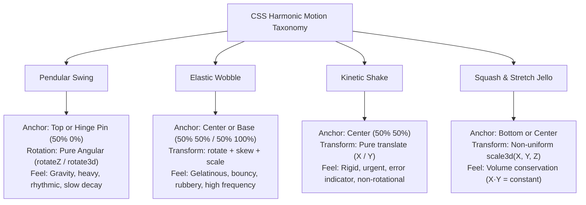

# 068: CSS Swing & Wobble Motion Masterclass

## Overview & Executive Summary

In digital interface design, static components often fail to convey tangible material reality. Physical objects in the real world possess mass, elasticity, momentum, and pivot constraints: a wooden tavern sign suspended by iron chains rocks back and forth under a gust of wind; a gelatin dessert wobbles rapidly when nudged before settling into equilibrium; a notification bell chimes along a top hinge; an invalid input field shivers with resistance.

**Swing and Wobble motion** are two foundational physics-inspired kinetic primitives in modern CSS:

1. **Swing Motion (Pendular Kinematics)**: Rotational and angular translation anchored around an external or eccentric pivot point (such as `transform-origin: top center` or a corner hinge). It simulates gravitational torque, inertial momentum, and damped angular decay ($\theta(t) = \theta_0 e^{-\zeta \omega t} \cos(\omega_d t)$).
2. **Wobble Motion (Elastic / Gelatinous Kinematics)**: Multi-axis deformation, asymmetric squashing, stretching, skewing, and alternating directional jiggles centered around an object's center of mass (`transform-origin: 50% 50%`) or base anchor (`transform-origin: 50% 100%`). It simulates material flexibility, surface tension, and high-frequency restorative spring forces.

When executed with precision, hardware acceleration, and mathematically sound decay curves, these effects transform mundane user interactions—such as button clicks, notification alerts, error feedback, badge updates, and hover states—into delightful, tactile, and intuitive visual feedback.

```
================================================================================
                    SWING VS. WOBBLE: MECHANICAL TAXONOMY
================================================================================

      1. PENDULAR SWING (Top Pivot)             2. ELASTIC WOBBLE (Center / Mass)
           [Anchor / Ceiling]                          [Resting Shape]
                 ▼                                          ┌─────────┐
                ( o )                                       │  Card   │
               /  │  \                                      └─────────┘
              /   │   \                                          │ (Impact / Click)
             /    │    \                                         ▼
            /     │     \                                  ( Asymmetric Skew )
         ┌──┐   ┌──┐   ┌──┐                             ┌─────────/   \─────────┐
         │  │   │  │   │  │                             │  Wobble │   │  Jiggle │
         └──┘   └──┘   └──┘                             /─────────┘   └─────────\
         Left  Equilibrium Right                         Stretch X     Stretch Y
        (+θ°)     (0°)    (-θ°)                         (Scale / Skew Oscillation)

  • Pivot: `transform-origin: top center`       • Pivot: `transform-origin: center`
  • Primary Force: Gravity & Pendulum Inertia   • Primary Force: Material Elasticity & Spring
  • Movement: Rotational arc (Z-axis / 3D)       • Movement: Multi-axis Skew + Scale + Rotate
================================================================================
```

---

## Quick Reference Metadata

| Attribute | Specification Details |
| :--- | :--- |
| **Name** | CSS Swing & Wobble Motion |
| **Category** | Kinetic Micro-Interactions, CSS Keyframe Animations & Physics Modeling |
| **Specification** | [W3C CSS Transforms Module Level 2](https://www.w3.org/TR/css-transforms-2/) & [W3C CSS Animations Level 1/2](https://www.w3.org/TR/css-animations-1/) |
| **Difficulty** | Intermediate to Advanced (3.5 / 5) |
| **What it produces** | Tactile, frame-accurate harmonic oscillations—including swinging storefront signs, suspended ID lanyards, notification bell chimes, jelly cart buttons, form error shakes, and self-righting roly-poly wobbles. |
| **Why it works** | The browser's GPU compositor executes per-frame matrix transformation computations (`rotate`, `skew`, `scale`, `translate`) around a configured `transform-origin` anchor without triggering layout reflows or CPU repaints. |
| **Key Properties** | `transform`, `transform-origin`, `transform-style`, `perspective`, `@keyframes`, `animation-timing-function`, `cubic-bezier()`, `linear()`, `will-change`, `@media (prefers-reduced-motion)`. |
| **Strict Constraints** | Must never animate layout-triggering properties (`top`, `left`, `margin`, `width`). Transforms must preserve layout boundaries to prevent cursor hit-test flicker. Always provide a reduced-motion fallback. |
| **Browser Baseline** | Baseline 2020+ across Chrome, Edge, Firefox, Safari (including iOS Safari and Android Chrome). Modern `linear()` spring easing supported in Baseline 2023+. |
| **Acceptance Criteria** | Sustained 60 FPS / 120 FPS compositor execution; smooth harmonic decay without abrupt visual snapping; accurate pivot anchoring; zero layout thrashing; accessible motion suppression. |

### Quick Preview

```html
<div class="motion-preview-container">
  <!-- 1. Swing Element (Top Pivot) -->
  <div class="demo-swing-sign" tabindex="0" role="button" aria-label="Swinging Sign">
    <div class="sign-chain"></div>
    <div class="sign-plate">OPEN</div>
  </div>

  <!-- 2. Wobble Element (Center Elastic) -->
  <button class="demo-wobble-btn" type="button">
    Tap to Wobble
  </button>
</div>
```

```css
:root {
  --primary-accent: #6366f1;
  --plate-bg: #1e1e2f;
  --plate-border: #818cf8;
}

.motion-preview-container {
  display: flex;
  gap: 3rem;
  align-items: center;
  justify-content: center;
  padding: 3rem;
  background: #0f172a;
}

/* 1. Pendular Swing (Top Anchor) */
.demo-swing-sign {
  display: flex;
  flex-direction: column;
  align-items: center;
  cursor: pointer;
  transform-origin: top center;
  will-change: transform;
}

.demo-swing-sign:hover,
.demo-swing-sign:focus-visible {
  animation: pendulumSwing 1.8s cubic-bezier(0.25, 1, 0.5, 1) both;
}

.sign-chain {
  inline-size: 2px;
  block-size: 24px;
  background: #64748b;
}

.sign-plate {
  padding: 0.5rem 1.25rem;
  background: var(--plate-bg);
  border: 2px solid var(--plate-border);
  border-radius: 6px;
  color: #f8fafc;
  font-weight: 700;
  font-size: 0.875rem;
  letter-spacing: 0.1em;
  box-shadow: 0 8px 20px rgba(0, 0, 0, 0.4);
}

@keyframes pendulumSwing {
  0%   { transform: rotate(0deg); }
  20%  { transform: rotate(18deg); }
  40%  { transform: rotate(-14deg); }
  60%  { transform: rotate(8deg); }
  80%  { transform: rotate(-4deg); }
  90%  { transform: rotate(1.5deg); }
  100% { transform: rotate(0deg); }
}

/* 2. Elastic Wobble Button (Center Anchor) */
.demo-wobble-btn {
  padding: 0.75rem 1.75rem;
  font-size: 1rem;
  font-weight: 600;
  color: #ffffff;
  background: linear-gradient(135deg, #6366f1, #a855f7);
  border: none;
  border-radius: 9999px;
  cursor: pointer;
  box-shadow: 0 4px 14px rgba(99, 102, 241, 0.4);
  transform-origin: 50% 50%;
  will-change: transform;
}

.demo-wobble-btn:hover,
.demo-wobble-btn:active {
  animation: jellyWobble 0.9s cubic-bezier(0.25, 1, 0.5, 1) both;
}

@keyframes jellyWobble {
  0%   { transform: scale3d(1, 1, 1); }
  15%  { transform: scale3d(1.25, 0.75, 1) rotate(-4deg); }
  30%  { transform: scale3d(0.75, 1.25, 1) rotate(4deg); }
  45%  { transform: scale3d(1.15, 0.85, 1) rotate(-2deg); }
  60%  { transform: scale3d(0.95, 1.05, 1) rotate(1deg); }
  75%  { transform: scale3d(1.05, 0.95, 1) rotate(-0.5deg); }
  100% { transform: scale3d(1, 1, 1) rotate(0deg); }
}

/* Accessibility */
@media (prefers-reduced-motion: reduce) {
  .demo-swing-sign:hover,
  .demo-swing-sign:focus-visible,
  .demo-wobble-btn:hover,
  .demo-wobble-btn:active {
    animation: none;
    transform: none;
  }
}
```

---

## 1. Anatomy & Mathematical Mental Models

### 1.1 The Damped Harmonic Oscillator Formula

Both swing and wobble motions are implementations of **damped harmonic oscillation**. When a mechanical system with mass $m$, damping coefficient $c$, and spring/restorative stiffness $k$ is displaced from its rest point, its kinematic response over time $t$ is governed by the second-order differential equation:

$$m \frac{d^2\theta}{dt^2} + c \frac{d\theta}{dt} + k\theta = 0$$

For underdamped systems ($\zeta < 1$, where $\zeta = \frac{c}{2\sqrt{mk}}$ is the damping ratio), the angular displacement $\theta(t)$ follows an exponentially decaying sinusoid:

$$\theta(t) = \theta_0 \, e^{-\zeta \omega_n t} \cos(\omega_d t + \phi)$$

Where:
- $\theta_0$ is the initial perturbation angle or impulse magnitude (e.g. $+25^\circ$ or $1.3\times$ scale).
- $e^{-\zeta \omega_n t}$ is the **exponential decay envelope** that progressively attenuates oscillation amplitude.
- $\omega_d = \omega_n \sqrt{1 - \zeta^2}$ is the damped angular frequency determining how rapidly cycles complete.
- $\phi$ is the initial phase offset.

```
Angle / Amplitude (θ)
  ▲
+θ│     * (Initial Impulse Peak)
  │    / \
  │   /   \             * (Cycle 2 Decay)
  │  /     \           / \
 0├──/──────\─────────/───\────────*───\───────► Time (t)
  │ /        \       /     \      / \   \ (Equilibrium Rest)
  │/          \     /       \    /   \   \
-θ│            *---*         *--*     *---*
  │          (Counter-swing 1)
  └───────────────────────────────────────────────
   0%        25%         50%      75%   100%
```

#### Mapping Damped Harmonics to CSS Keyframes:

| Keyframe % | Normalized Decay ($e^{-\zeta \omega t}$) | Ideal Swing Angle ($\theta_0 = 20^\circ$) | Ideal Wobble Scale ($X / Y$) | Skew Offset |
| :--- | :--- | :--- | :--- | :--- |
| **0%** | $0.00$ | $0.0^\circ$ (Rest) | $1.000 / 1.000$ | $0.0^\circ$ |
| **15% - 20%** | $1.00$ | $+20.0^\circ$ (Max positive displacement) | $1.250 / 0.750$ (Squash) | $-6.0^\circ$ |
| **35% - 40%** | $-0.65$ | $-13.0^\circ$ (First overshoot rebound) | $0.800 / 1.200$ (Stretch) | $+4.5^\circ$ |
| **55% - 60%** | $+0.35$ | $+7.0^\circ$ (Second decaying return) | $1.100 / 0.900$ | $-2.5^\circ$ |
| **75% - 80%** | $-0.15$ | $-3.0^\circ$ (Micro-harmonic settle) | $0.960 / 1.040$ | $+1.0^\circ$ |
| **90%** | $+0.05$ | $+1.0^\circ$ (Final resting vibration) | $1.010 / 0.990$ | $-0.3^\circ$ |
| **100%** | $0.00$ | $0.0^\circ$ (Full equilibrium restoration) | $1.000 / 1.000$ | $0.0^\circ$ |

---

### 1.2 Pivot Mechanics & The `transform-origin` Coordinate Matrix

The entire visual character of a rotational or deformational animation is determined by the **`transform-origin`** point. Moving the pivot radically alters the physics of the object:

```
┌─────────────────────────────────────────────────────────────────────────────┐
│                     TRANSFORM-ORIGIN PIVOT MATRIX                           │
├──────────────────────────────────────┬──────────────────────────────────────┤
│ A. Top Center (50% 0%)               │ B. Center of Mass (50% 50%)          │
│                                      │                                      │
│           ( O ) [Anchor Pin]         │               ┌────────┐             │
│            │                         │               │  (O)   │ [Mass Cent] │
│        ┌───────┐                     │               └────────┘             │
│        │ Sign  │                     │                                      │
│        └───────┘                     │ • Type: Pure Jelly / Cart Wobble     │
│ • Type: Pendulum / Suspended Sign    │ • Symmetrical distortion across axes │
│ • Simulates gravity & hanging cord   │ • Skew + Scale around geometric body │
├──────────────────────────────────────┼──────────────────────────────────────┤
│ C. Bottom Center (50% 100%)          │ D. Top-Left / Hinge Corner (0% 0%)   │
│                                      │                                      │
│        ┌───────┐                     │      ( O )──────┐ [Hinge Pin]        │
│        │ Weeble│                     │      │   Door   │                    │
│        └──(O)──┘ [Base Pivot]        │      │   Sign   │                    │
│ • Type: Roly-Poly / Punching Bag     │      └──────────┘                    │
│ • Weighted bottom, tilts & rights up │ • Type: Creaking Gate / Dog-eared tag│
│ • Skew + base rotation               │ • Asymmetrical cantilevered drop     │
└──────────────────────────────────────┴──────────────────────────────────────┘
```

---

### 1.3 Swing vs. Wobble vs. Shake vs. Jello: Architectural Matrix



| Dimension | Pendular Swing | Elastic Wobble | Kinetic Shake / Shiver | Squash & Stretch (Jello) |
| :--- | :--- | :--- | :--- | :--- |
| **Pivot Anchor** | `50% 0%` (Top) | `50% 50%` (Center) | N/A (Translational) | `50% 100%` (Bottom) |
| **Primary Transform** | `rotateZ()`, `rotateY()` | `rotate()`, `skew()`, `scale()` | `translateX()`, `translateY()` | `scale3d(x, y, z)` |
| **Volume Preserved** | Yes (Rigid Body) | No (Dynamic Elasticity) | Yes (Rigid Body) | Yes ($X \times Y \approx 1$) |
| **Dominant Frequency** | Low ($0.8\text{s} - 2.5\text{s}$) | Moderate ($0.6\text{s} - 1.2\text{s}$) | High ($0.15\text{s} - 0.4\text{s}$) | Moderate ($0.5\text{s} - 0.9\text{s}$) |
| **Best UI Application** | Badges, signs, lamps, bells | Buttons, icons, reactions | Form errors, auth failures | Cards landing, modal drops |

---

### 1.4 Modern `linear()` Easing vs. Multi-Keyframe Decays

In modern CSS (Chrome 113+, Safari 17.2+, Firefox 112+), the `linear()` easing function allows defining **multi-point spring approximations** directly in the `animation-timing-function` or `transition-timing-function`, drastically simplifying `@keyframes`.

#### The Spring Formula in `linear()`:
```css
:root {
  /* High-stiffness damped bounce curve */
  --spring-wobble-ease: linear(
    0, 0.009, 0.035 2.1%, 0.141, 0.281 6.7%, 0.723 12.9%, 0.938 16.7%,
    1.017, 1.077, 1.121, 1.149 24.3%, 1.159, 1.148, 1.119 32.2%,
    1.033 42.1%, 0.995 49.3%, 0.982 56.6%, 0.99 64.9%, 1.002 77.2%, 1
  );
}
```

> [!TIP]
> **When to use `@keyframes` vs. `linear()` easing:**
> - Use **`@keyframes`** when animating multiple properties simultaneously with independent directional phase offsets (e.g. `rotate` going positive while `scaleX` squashes and `skew` opposes).
> - Use **`transition` + `linear()`** when applying a single-parameter spring deformation triggered by state changes (`:active`, `.is-toggled`).

---

## 2. The 4 Foundation Primitives

---

### Primitive 1: Classic Pendular Decay Swing (`transform-origin: top center`)

The pendulum swing rotates an element around its top center anchor, decreasing its peak angle on each alternating stroke.

```css
.swing-pendulum {
  transform-origin: 50% 0%;
  animation: swingDecay 1.6s cubic-bezier(0.28, 0.84, 0.42, 1) infinite;
}

@keyframes swingDecay {
  0%   { transform: rotate(0deg); }
  20%  { transform: rotate(24deg); }
  40%  { transform: rotate(-18deg); }
  60%  { transform: rotate(10deg); }
  80%  { transform: rotate(-4deg); }
  90%  { transform: rotate(1.5deg); }
  100% { transform: rotate(0deg); }
}
```

---

### Primitive 2: 3D Perspective Wind Swing (`rotateX` / `rotateY`)

When an element hangs in 3D space, wind or user touch causes it to swing toward and away from the viewer along the X or Y axis. This requires `perspective` on the parent container.

```css
.scene-3d {
  perspective: 1000px;
  perspective-origin: 50% 20%;
}

.sign-3d-swing {
  transform-origin: top center;
  transform-style: preserve-3d;
  animation: swing3D 2.4s ease-in-out infinite alternate;
}

@keyframes swing3D {
  0% {
    transform: rotateX(35deg) rotateY(-5deg);
  }
  50% {
    transform: rotateX(-25deg) rotateY(4deg);
  }
  100% {
    transform: rotateX(15deg) rotateY(-2deg);
  }
}
```

---

### Primitive 3: Asymmetric Elastic Center Wobble (`scale` + `skew` + `rotate`)

To create an organic jelly-like wobble, combine rotation with counter-directional skewing and non-uniform axis scaling.

```css
.elastic-wobble {
  transform-origin: 50% 50%;
  animation: wobbleDecay 0.85s cubic-bezier(0.36, 0.07, 0.19, 0.97) both;
}

@keyframes wobbleDecay {
  0% {
    transform: translate3d(0, 0, 0) rotate(0deg) scale(1, 1);
  }
  15% {
    transform: translate3d(-10px, 0, 0) rotate(-6deg) skewX(8deg) scale(1.15, 0.88);
  }
  30% {
    transform: translate3d(8px, 0, 0) rotate(5deg) skewX(-6deg) scale(0.9, 1.12);
  }
  45% {
    transform: translate3d(-6px, 0, 0) rotate(-3deg) skewX(4deg) scale(1.08, 0.94);
  }
  60% {
    transform: translate3d(4px, 0, 0) rotate(2deg) skewX(-2deg) scale(0.96, 1.04);
  }
  75% {
    transform: translate3d(-2px, 0, 0) rotate(-1deg) skewX(1deg) scale(1.02, 0.98);
  }
  100% {
    transform: translate3d(0, 0, 0) rotate(0deg) skewX(0deg) scale(1, 1);
  }
}
```

---

### Primitive 4: Bottom-Anchored Weeble-Wobble / Punching Bag (`transform-origin: bottom center`)

Simulates a self-righting toy with a weighted spherical base: when pushed, it tips severely to one side, rocking back and forth around its base before standing upright.

```css
.weeble-punch {
  transform-origin: 50% 100%;
  animation: weebleOscillate 1.4s cubic-bezier(0.175, 0.885, 0.32, 1.275) both;
}

@keyframes weebleOscillate {
  0%   { transform: rotate(0deg) skewX(0deg); }
  15%  { transform: rotate(28deg) skewX(-8deg); }
  35%  { transform: rotate(-20deg) skewX(6deg); }
  55%  { transform: rotate(12deg) skewX(-3deg); }
  75%  { transform: rotate(-6deg) skewX(1.5deg); }
  90%  { transform: rotate(2deg) skewX(-0.5deg); }
  100% { transform: rotate(0deg) skewX(0deg); }
}
```

---

## 3. Comprehensive Implementation Patterns

---

### Pattern 1: The Artisan Hanging Storefront Sign (Interactive 3D Pendulum with Chains)

A hyper-realistic physical signboard suspended by dual metallic chain links. It features an ambient gentle breeze animation that accelerates into an energetic, decaying 3D pendulum swing upon cursor hover or keyboard focus, complete with dynamic lighting and shadow shifts.

```
                    [ Overhead Iron Mount Bar ]
                     ●======================●
                     │                      │
                  [Link 1]               [Link 1]
                     │                      │
                  [Link 2]               [Link 2]
                     │                      │
               ┌─────▼──────────────────────▼─────┐
               │  ★ THE ARTISAN ROASTERY & CO ★   │
               │         Est. 2026 • OPEN         │
               └──────────────────────────────────┘
                 \                              /
                  \ Dynamic Projected Shadow   /
```

#### HTML
```html
<section class="signboard-stage" aria-label="Interactive Hanging Signboard">
  <div class="sign-rig" tabindex="0" role="region" aria-label="Artisan Coffee Roastery Signboard">
    <!-- Iron Wall Mount & Eyebolts -->
    <div class="mount-bar" aria-hidden="true">
      <span class="eyebolt eyebolt-left"></span>
      <span class="eyebolt eyebolt-right"></span>
    </div>

    <!-- Dual Suspension Chains -->
    <div class="suspension-rig" aria-hidden="true">
      <div class="chain chain-left">
        <span class="chain-link"></span>
        <span class="chain-link"></span>
        <span class="chain-link"></span>
        <span class="chain-link"></span>
      </div>
      <div class="chain chain-right">
        <span class="chain-link"></span>
        <span class="chain-link"></span>
        <span class="chain-link"></span>
        <span class="chain-link"></span>
      </div>
    </div>

    <!-- Swinging Signboard Body -->
    <div class="sign-chassis">
      <div class="sign-face sign-front">
        <div class="sign-filigree"></div>
        <span class="sign-tagline">ARTISANAL BLENDS</span>
        <h2 class="sign-brand">THE ROASTERY</h2>
        <div class="sign-status-pill">
          <span class="status-dot"></span>
          <span class="status-text">CURRENTLY OPEN</span>
        </div>
      </div>
      <div class="sign-shadow" aria-hidden="true"></div>
    </div>
  </div>
</section>
```

#### CSS
```css
:root {
  --wood-grain: #1a1311;
  --wood-surface: #2c1e1a;
  --gold-leaf: #d4af37;
  --gold-glow: rgba(212, 175, 55, 0.35);
  --brass-trim: #e6c66e;
  --iron-chain: #5a5d64;
  --iron-shadow: #232528;
  --emerald-live: #10b981;
}

.signboard-stage {
  display: flex;
  justify-content: center;
  align-items: flex-start;
  padding: 4rem 2rem;
  background: radial-gradient(circle at 50% 20%, #1e1e2f 0%, #0b0b12 100%);
  perspective: 1200px;
  perspective-origin: 50% 15%;
  min-height: 480px;
  overflow: hidden;
}

/* Entire Suspension Rig (Rigid Body Pivoting from Eyebolt Axis) */
.sign-rig {
  display: flex;
  flex-direction: column;
  align-items: center;
  position: relative;
  cursor: grab;
  outline: none;
  transform-origin: 50% 0px;
  will-change: transform;
  /* Ambient gentle resting breeze */
  animation: ambientSignBreeze 6s ease-in-out infinite alternate;
  transform-style: preserve-3d;
}

.sign-rig:active {
  cursor: grabbing;
}

/* Hover & Focus Interaction: High-Energy Decaying Pendulum Swing */
.sign-rig:hover,
.sign-rig:focus-visible {
  animation: interactiveSignSway 2.4s cubic-bezier(0.25, 1, 0.3, 1) both;
}

/* 1. Mount Bar */
.mount-bar {
  width: 320px;
  height: 10px;
  background: linear-gradient(180deg, #4b4d53 0%, #1e2023 100%);
  border-radius: 5px;
  position: relative;
  box-shadow: 0 4px 12px rgba(0, 0, 0, 0.8), inset 0 1px 1px rgba(255, 255, 255, 0.2);
  z-index: 10;
}

.eyebolt {
  position: absolute;
  top: 4px;
  width: 14px;
  height: 14px;
  border: 3px solid #82868e;
  border-radius: 50%;
  background: #111214;
}

.eyebolt-left  { left: 36px; }
.eyebolt-right { right: 36px; }

/* 2. Suspension Chains */
.suspension-rig {
  display: flex;
  justify-content: space-between;
  width: 248px;
  height: 64px;
  position: relative;
  z-index: 5;
}

.chain {
  display: flex;
  flex-direction: column;
  align-items: center;
}

.chain-link {
  width: 10px;
  height: 18px;
  border: 2.5px solid var(--iron-chain);
  border-radius: 6px;
  background: transparent;
  margin-top: -4px;
  box-shadow: inset 1px 1px 2px rgba(255, 255, 255, 0.15), 1px 2px 4px var(--iron-shadow);
}

.chain-link:nth-child(even) {
  width: 7px;
  border-color: #3f4146;
  transform: rotateY(70deg);
}

/* 3. The Signboard Chassis */
.sign-chassis {
  position: relative;
  transform-style: preserve-3d;
}

.sign-face {
  width: 360px;
  padding: 1.75rem 2rem;
  background: linear-gradient(145deg, var(--wood-surface), var(--wood-grain));
  border: 4px solid var(--brass-trim);
  border-radius: 12px;
  text-align: center;
  box-shadow: 
    0 16px 36px rgba(0, 0, 0, 0.7),
    0 0 24px var(--gold-glow),
    inset 0 0 20px rgba(0, 0, 0, 0.8),
    inset 0 1px 2px rgba(255, 240, 180, 0.4);
  position: relative;
  z-index: 2;
  transition: box-shadow 0.3s ease;
}

.sign-filigree {
  position: absolute;
  inset: 6px;
  border: 1px dashed rgba(212, 175, 55, 0.3);
  border-radius: 6px;
  pointer-events: none;
}

.sign-tagline {
  display: block;
  font-size: 0.6875rem;
  font-weight: 700;
  letter-spacing: 0.25em;
  color: var(--brass-trim);
  text-transform: uppercase;
  margin-bottom: 0.25rem;
}

.sign-brand {
  margin: 0;
  font-family: 'Cinzel', 'Georgia', serif;
  font-size: 1.75rem;
  font-weight: 800;
  letter-spacing: 0.08em;
  color: #fff8e7;
  text-shadow: 0 2px 4px rgba(0, 0, 0, 0.9), 0 0 12px var(--gold-glow);
}

.sign-status-pill {
  display: inline-flex;
  align-items: center;
  gap: 0.5rem;
  margin-top: 0.75rem;
  padding: 0.25rem 0.875rem;
  background: rgba(16, 185, 129, 0.1);
  border: 1px solid rgba(16, 185, 129, 0.3);
  border-radius: 9999px;
}

.status-dot {
  width: 7px;
  height: 7px;
  border-radius: 50%;
  background: var(--emerald-live);
  box-shadow: 0 0 8px var(--emerald-live);
  animation: pulseDot 2s infinite ease-in-out;
}

.status-text {
  font-size: 0.6875rem;
  font-weight: 700;
  letter-spacing: 0.05em;
  color: var(--emerald-live);
}

/* 4. Projected Floor Shadow Sync */
.sign-shadow {
  position: absolute;
  top: 100%;
  left: 50%;
  transform: translateX(-50%) rotateX(85deg);
  width: 320px;
  height: 40px;
  background: radial-gradient(ellipse at center, rgba(0, 0, 0, 0.65) 0%, transparent 75%);
  filter: blur(8px);
  pointer-events: none;
  transform-origin: center top;
}

/* Keyframes: Gentle Idle Wind */
@keyframes ambientSignBreeze {
  0% {
    transform: rotateZ(-2.5deg) rotateX(3deg);
  }
  50% {
    transform: rotateZ(1.5deg) rotateX(-2deg);
  }
  100% {
    transform: rotateZ(3deg) rotateX(4deg);
  }
}

/* Keyframes: High-Energy Damped Harmonic Swing */
@keyframes interactiveSignSway {
  0% {
    transform: rotateZ(0deg) rotateX(0deg) rotateY(0deg);
  }
  15% {
    transform: rotateZ(22deg) rotateX(12deg) rotateY(-8deg);
  }
  30% {
    transform: rotateZ(-16deg) rotateX(-10deg) rotateY(6deg);
  }
  45% {
    transform: rotateZ(10deg) rotateX(6deg) rotateY(-4deg);
  }
  60% {
    transform: rotateZ(-6deg) rotateX(-3deg) rotateY(2deg);
  }
  75% {
    transform: rotateZ(3deg) rotateX(1.5deg) rotateY(-1deg);
  }
  90% {
    transform: rotateZ(-1deg) rotateX(-0.5deg) rotateY(0.5deg);
  }
  100% {
    transform: rotateZ(0deg) rotateX(0deg) rotateY(0deg);
  }
}

@keyframes pulseDot {
  0%, 100% { opacity: 1; transform: scale(1); }
  50% { opacity: 0.4; transform: scale(0.8); }
}

/* Accessibility */
@media (prefers-reduced-motion: reduce) {
  .sign-rig {
    animation: none;
    transform: none;
  }
  .sign-rig:hover,
  .sign-rig:focus-visible {
    animation: none;
    transform: none;
  }
  .status-dot {
    animation: none;
  }
}
```

---

### Pattern 2: The Jelly Cart Button & Badge Wobble (Micro-interaction Feedback)

An interactive e-commerce button with tactile jelly physics. Clicking triggers a squash-and-stretch wobble on the button chassis, while simultaneously firing an independent pendular rattle on the item counter badge.

```
                    ┌──────────────────────────────┐
     [Cart Badge]   │   [+] ADD TO CART            │
       ( 3 ) ──────>│   $129.00 USD                │
      (Wobble)      └──────────────────────────────┘
                       ( Squash & Stretch Jiggle )
```

#### HTML
```html
<div class="cart-interaction-demo">
  <button class="jelly-cart-btn" id="addToCartBtn" type="button" aria-label="Add item to shopping bag">
    <div class="cart-icon-wrapper" aria-hidden="true">
      <svg class="cart-svg" viewBox="0 0 24 24" width="22" height="22" fill="none" stroke="currentColor" stroke-width="2">
        <circle cx="9" cy="21" r="1"></circle>
        <circle cx="20" cy="21" r="1"></circle>
        <path d="M1 1h4l2.68 13.39a2 2 0 0 0 2 1.61h9.72a2 2 0 0 0 2-1.61L23 6H6"></path>
      </svg>
      <span class="cart-badge" id="cartBadge">3</span>
    </div>
    <div class="btn-content">
      <span class="btn-label">ADD TO CART</span>
      <span class="btn-price">$129.00 USD</span>
    </div>
  </button>
</div>
```

#### CSS
```css
:root {
  --cart-primary: #8b5cf6;
  --cart-secondary: #ec4899;
  --cart-bg: #18181b;
  --cart-text: #fafafa;
  --badge-glow: rgba(236, 72, 153, 0.6);
}

.cart-interaction-demo {
  display: flex;
  justify-content: center;
  align-items: center;
  padding: 3rem;
  background: #09090b;
}

/* Button Chassis */
.jelly-cart-btn {
  display: inline-flex;
  align-items: center;
  gap: 1rem;
  padding: 0.875rem 2rem;
  background: linear-gradient(135deg, var(--cart-primary), var(--cart-secondary));
  color: var(--cart-text);
  border: none;
  border-radius: 16px;
  font-family: inherit;
  cursor: pointer;
  box-shadow: 
    0 8px 24px rgba(139, 92, 246, 0.4),
    0 2px 6px rgba(0, 0, 0, 0.4);
  position: relative;
  transform-origin: 50% 50%;
  will-change: transform;
  user-select: none;
  transition: box-shadow 0.2s ease;
}

.jelly-cart-btn:hover {
  box-shadow: 
    0 12px 30px rgba(236, 72, 153, 0.5),
    0 4px 10px rgba(0, 0, 0, 0.5);
}

/* Micro-interaction: Active Click Elastic Wobble */
.jelly-cart-btn:active,
.jelly-cart-btn.is-animating {
  animation: jellyButtonWobble 0.75s cubic-bezier(0.25, 1, 0.5, 1) both;
}

.cart-icon-wrapper {
  position: relative;
  display: flex;
  align-items: center;
  justify-content: center;
}

.cart-svg {
  stroke: #ffffff;
}

/* Counter Badge with Independent Top-Pivot Swing */
.cart-badge {
  position: absolute;
  top: -10px;
  right: -12px;
  min-width: 20px;
  height: 20px;
  padding: 0 5px;
  background: #ffffff;
  color: #8b5cf6;
  font-size: 0.6875rem;
  font-weight: 800;
  border-radius: 9999px;
  display: flex;
  align-items: center;
  justify-content: center;
  box-shadow: 0 2px 8px var(--badge-glow);
  transform-origin: 50% 0%;
  will-change: transform;
}

.jelly-cart-btn:hover .cart-badge,
.jelly-cart-btn:active .cart-badge,
.cart-badge.is-rattling {
  animation: badgeRattleSwing 0.8s cubic-bezier(0.36, 0.07, 0.19, 0.97) both;
}

.btn-content {
  display: flex;
  flex-direction: column;
  align-items: flex-start;
  text-align: left;
}

.btn-label {
  font-size: 0.875rem;
  font-weight: 800;
  letter-spacing: 0.08em;
}

.btn-price {
  font-size: 0.75rem;
  opacity: 0.85;
  font-weight: 500;
}

/* Keyframes: Button Jelly Squash & Stretch */
@keyframes jellyButtonWobble {
  0% {
    transform: scale3d(1, 1, 1);
  }
  15% {
    transform: scale3d(1.22, 0.78, 1) skewX(-4deg);
  }
  30% {
    transform: scale3d(0.82, 1.18, 1) skewX(4deg);
  }
  45% {
    transform: scale3d(1.12, 0.9, 1) skewX(-2deg);
  }
  60% {
    transform: scale3d(0.95, 1.05, 1) skewX(1deg);
  }
  75% {
    transform: scale3d(1.03, 0.97, 1) skewX(-0.5deg);
  }
  100% {
    transform: scale3d(1, 1, 1) skewX(0deg);
  }
}

/* Keyframes: Badge Rattle Pendulum */
@keyframes badgeRattleSwing {
  0%   { transform: rotate(0deg) scale(1); }
  20%  { transform: rotate(28deg) scale(1.2); }
  40%  { transform: rotate(-22deg) scale(1.15); }
  60%  { transform: rotate(14deg) scale(1.05); }
  80%  { transform: rotate(-6deg) scale(1); }
  100% { transform: rotate(0deg) scale(1); }
}

@media (prefers-reduced-motion: reduce) {
  .jelly-cart-btn:active,
  .jelly-cart-btn.is-animating,
  .jelly-cart-btn:hover .cart-badge,
  .cart-badge.is-rattling {
    animation: none;
    transform: none;
  }
}
```

---

### Pattern 3: The Form Validation Error Wobble & Shiver (User Feedback UX)

When a user submits invalid data, traditional static alerts are easily missed. A high-visibility, horizontal elastic error wobble directs cognitive focus immediately to the culprit field without disrupting overall layout.

```
       ┌─────────────────────────────────────────┐
 ⚠  ─> │ invalid-email@                          │ <── (Horizontal Error Wobble)
       └─────────────────────────────────────────┘
        ✕ Please enter a valid email address
```

#### HTML
```html
<div class="form-container">
  <form class="auth-form" id="newsletterForm" novalidate>
    <div class="field-group" id="emailFieldGroup">
      <label for="userEmail" class="field-label">Work Email Address</label>
      <div class="input-chassis">
        <svg class="input-icon" viewBox="0 0 24 24" width="18" height="18" fill="none" stroke="currentColor" stroke-width="2">
          <path d="M4 4h16c1.1 0 2 .9 2 2v12c0 1.1-.9 2-2 2H4c-1.1 0-2-.9-2-2V6c0-1.1.9-2 2-2z"></path>
          <polyline points="22,6 12,13 2,6"></polyline>
        </svg>
        <input 
          type="email" 
          id="userEmail" 
          class="form-input" 
          placeholder="name@company.com" 
          required 
          aria-describedby="emailErrorMsg"
          aria-invalid="false"
        />
        <span class="error-badge-icon" aria-hidden="true">!</span>
      </div>
      <p class="error-message" id="emailErrorMsg" role="alert">
        Please enter a valid work email address (e.g. name@domain.com).
      </p>
    </div>
    <button type="submit" class="submit-btn">Continue</button>
  </form>
</div>
```

#### CSS
```css
:root {
  --field-bg: #1f2937;
  --field-border: #374151;
  --field-focus: #6366f1;
  --error-accent: #ef4444;
  --error-glow: rgba(239, 68, 68, 0.35);
}

.form-container {
  display: flex;
  justify-content: center;
  padding: 3rem 1.5rem;
  background: #111827;
}

.auth-form {
  width: 100%;
  max-width: 380px;
  display: flex;
  flex-direction: column;
  gap: 1.5rem;
}

.field-group {
  display: flex;
  flex-direction: column;
  gap: 0.5rem;
  position: relative;
}

.field-label {
  font-size: 0.8125rem;
  font-weight: 600;
  color: #9ca3af;
  letter-spacing: 0.02em;
}

.input-chassis {
  display: flex;
  align-items: center;
  position: relative;
  background: var(--field-bg);
  border: 1.5px solid var(--field-border);
  border-radius: 10px;
  padding: 0 1rem;
  transition: border-color 0.2s, box-shadow 0.2s;
  transform-origin: 50% 50%;
  will-change: transform;
}

.input-chassis:focus-within {
  border-color: var(--field-focus);
  box-shadow: 0 0 0 3px rgba(99, 102, 241, 0.25);
}

.input-icon {
  stroke: #6b7280;
  margin-right: 0.75rem;
  flex-shrink: 0;
}

.form-input {
  width: 100%;
  padding: 0.875rem 0;
  background: transparent;
  border: none;
  outline: none;
  color: #f9fafb;
  font-size: 0.9375rem;
}

.form-input::placeholder {
  color: #4b5563;
}

.error-badge-icon {
  display: none;
  width: 20px;
  height: 20px;
  background: var(--error-accent);
  color: #ffffff;
  font-weight: 800;
  font-size: 0.75rem;
  border-radius: 50%;
  align-items: center;
  justify-content: center;
  flex-shrink: 0;
}

.error-message {
  display: none;
  font-size: 0.75rem;
  color: var(--error-accent);
  margin: 0;
  font-weight: 500;
}

/* ERROR STATE: Triggered via class */
.field-group.has-error .input-chassis {
  border-color: var(--error-accent);
  box-shadow: 0 0 0 3px var(--error-glow);
  animation: errorInputWobble 0.65s cubic-bezier(0.36, 0.07, 0.19, 0.97) both;
}

.field-group.has-error .error-badge-icon {
  display: flex;
  animation: badgePopWobble 0.5s ease-out both;
}

.field-group.has-error .error-message {
  display: block;
  animation: fadeInMsg 0.3s ease-out both;
}

.submit-btn {
  padding: 0.875rem;
  background: #6366f1;
  color: #ffffff;
  font-weight: 700;
  border: none;
  border-radius: 10px;
  cursor: pointer;
  transition: background 0.2s;
}

.submit-btn:hover {
  background: #4f46e5;
}

/* Keyframes: High-Velocity Non-Linear Error Wobble */
@keyframes errorInputWobble {
  0% {
    transform: translate3d(0, 0, 0) rotate(0deg);
  }
  15% {
    transform: translate3d(-12px, 0, 0) rotate(-1.5deg) skewY(-1deg);
  }
  30% {
    transform: translate3d(10px, 0, 0) rotate(1.2deg) skewY(0.8deg);
  }
  45% {
    transform: translate3d(-8px, 0, 0) rotate(-0.8deg) skewY(-0.5deg);
  }
  60% {
    transform: translate3d(5px, 0, 0) rotate(0.4deg);
  }
  75% {
    transform: translate3d(-2px, 0, 0) rotate(-0.2deg);
  }
  100% {
    transform: translate3d(0, 0, 0) rotate(0deg);
  }
}

@keyframes badgePopWobble {
  0% {
    transform: scale(0) rotate(-30deg);
    opacity: 0;
  }
  60% {
    transform: scale(1.3) rotate(15deg);
    opacity: 1;
  }
  100% {
    transform: scale(1) rotate(0deg);
  }
}

@keyframes fadeInMsg {
  from { opacity: 0; transform: translateY(-4px); }
  to   { opacity: 1; transform: translateY(0); }
}

@media (prefers-reduced-motion: reduce) {
  .field-group.has-error .input-chassis,
  .field-group.has-error .error-badge-icon {
    animation: none;
    transform: none;
  }
}
```

---

### Pattern 4: The Notification Bell Chime & Clapper Counter-Swing

A notification bell interface where hover or incoming push alerts cause the outer bell to chime around its top crown, while the internal clapper swings in anti-phase (counter-oscillation), producing a visually authentic mechanical chime.

```
                  ( Crown Pivot )
                       (o)
                      /   \
                     / Bell\
                    /       \
                   (   (o)   )
                        │ <── Clapper Counter-Swing
                        ●
```

#### HTML
```html
<div class="bell-showcase">
  <div class="bell-trigger" tabindex="0" role="button" aria-label="Notifications: 2 unread">
    <div class="bell-rig">
      <!-- Outer Bell Dome -->
      <svg class="bell-body-svg" viewBox="0 0 24 24" width="36" height="36" fill="currentColor">
        <path d="M12 2a4 4 0 0 0-4 4v1.2C5.6 8.3 4 10.9 4 14v4l-2 2v1h20v-1l-2-2v-4c0-3.1-1.6-5.7-4-6.8V6a4 4 0 0 0-4-4z"/>
      </svg>
      <!-- Independent Internal Clapper -->
      <span class="bell-clapper"></span>
    </div>
    <span class="bell-indicator-dot" aria-hidden="true">2</span>
  </div>
</div>
```

#### CSS
```css
:root {
  --bell-gold: #fbbf24;
  --bell-glow: rgba(251, 191, 36, 0.4);
  --unread-crimson: #f43f5e;
}

.bell-showcase {
  display: flex;
  justify-content: center;
  align-items: center;
  padding: 3.5rem;
  background: #0f172a;
}

.bell-trigger {
  position: relative;
  width: 64px;
  height: 64px;
  display: flex;
  align-items: center;
  justify-content: center;
  background: #1e293b;
  border-radius: 18px;
  border: 1px solid #334155;
  cursor: pointer;
  outline: none;
  transition: border-color 0.2s, box-shadow 0.2s;
}

.bell-trigger:hover,
.bell-trigger:focus-visible {
  border-color: var(--bell-gold);
  box-shadow: 0 0 20px var(--bell-glow);
}

/* Bell Assembly Container */
.bell-rig {
  position: relative;
  display: flex;
  flex-direction: column;
  align-items: center;
  transform-origin: 50% 2px;
  will-change: transform;
}

.bell-body-svg {
  color: var(--bell-gold);
  filter: drop-shadow(0 4px 8px rgba(0, 0, 0, 0.4));
  transform-origin: 50% 2px;
}

/* Internal Clapper (Anti-Phase Counter-Oscillation) */
.bell-clapper {
  position: absolute;
  bottom: -4px;
  width: 8px;
  height: 8px;
  background: #d97706;
  border-radius: 50%;
  transform-origin: 50% -16px;
  box-shadow: inset 0 1px 2px rgba(255, 255, 255, 0.4);
}

/* Unread Badge */
.bell-indicator-dot {
  position: absolute;
  top: 6px;
  right: 6px;
  min-width: 20px;
  height: 20px;
  padding: 0 4px;
  background: var(--unread-crimson);
  color: #ffffff;
  font-size: 0.6875rem;
  font-weight: 800;
  border-radius: 9999px;
  display: flex;
  align-items: center;
  justify-content: center;
  box-shadow: 0 2px 8px rgba(244, 63, 94, 0.5);
  transform-origin: center center;
}

/* Trigger Swing on Hover or Focus */
.bell-trigger:hover .bell-rig,
.bell-trigger:focus-visible .bell-rig,
.bell-trigger.is-ringing .bell-rig {
  animation: bellChimeSwing 1.1s cubic-bezier(0.36, 0.07, 0.19, 0.97) both;
}

.bell-trigger:hover .bell-clapper,
.bell-trigger:focus-visible .bell-clapper,
.bell-trigger.is-ringing .bell-clapper {
  animation: clapperCounterSwing 1.1s cubic-bezier(0.36, 0.07, 0.19, 0.97) both;
}

.bell-trigger:hover .bell-indicator-dot,
.bell-trigger:focus-visible .bell-indicator-dot {
  animation: badgePopJiggle 0.6s ease-out both;
}

/* Keyframes: Outer Bell Harmonic Chime */
@keyframes bellChimeSwing {
  0%   { transform: rotate(0deg); }
  15%  { transform: rotate(26deg); }
  30%  { transform: rotate(-22deg); }
  45%  { transform: rotate(16deg); }
  60%  { transform: rotate(-10deg); }
  75%  { transform: rotate(5deg); }
  90%  { transform: rotate(-2deg); }
  100% { transform: rotate(0deg); }
}

/* Keyframes: Clapper Counter-Phase Swing (Opposite Angular Polarity) */
@keyframes clapperCounterSwing {
  0%   { transform: rotate(0deg); }
  15%  { transform: rotate(-38deg) translateX(3px); }
  30%  { transform: rotate(32deg) translateX(-3px); }
  45%  { transform: rotate(-20deg) translateX(2px); }
  60%  { transform: rotate(12deg) translateX(-1px); }
  75%  { transform: rotate(-6deg); }
  100% { transform: rotate(0deg); }
}

@keyframes badgePopJiggle {
  0%   { transform: scale(1); }
  30%  { transform: scale(1.35) rotate(-12deg); }
  60%  { transform: scale(0.9) rotate(8deg); }
  80%  { transform: scale(1.1) rotate(-3deg); }
  100% { transform: scale(1) rotate(0deg); }
}

@media (prefers-reduced-motion: reduce) {
  .bell-trigger:hover .bell-rig,
  .bell-trigger:focus-visible .bell-rig,
  .bell-trigger.is-ringing .bell-rig,
  .bell-trigger:hover .bell-clapper,
  .bell-trigger:focus-visible .bell-clapper,
  .bell-trigger:hover .bell-indicator-dot {
    animation: none;
    transform: none;
  }
}
```

---

### Pattern 5: The Weeble-Wobble Mascot Avatar (Self-Righting Equilibrium)

A playful bottom-anchored avatar card that behaves like a physical "weeble-wobble" / roly-poly toy: pushing it tips it heavily along its weighted base, oscillating vigorously before self-righting.

```
             ( Avatar Face )
                 ( • ◡ • )
                /         \
               (  MASCOT   )
              /             \
             (_______________)
              ▲             ▲
               \           /
                [Base Arc]
```

#### HTML
```html
<div class="mascot-stage">
  <div class="weeble-card" tabindex="0" role="region" aria-label="Interactive Bobble Mascot">
    <div class="weeble-body">
      <div class="avatar-glow"></div>
      <div class="avatar-face">
        <div class="face-eye eye-left"></div>
        <div class="face-eye eye-right"></div>
        <div class="face-blush blush-left"></div>
        <div class="face-blush blush-right"></div>
        <div class="face-smile"></div>
      </div>
      <div class="mascot-badge">LEVEL 42</div>
    </div>
    <div class="base-shadow" aria-hidden="true"></div>
  </div>
</div>
```

#### CSS
```css
:root {
  --mascot-gradient: linear-gradient(180deg, #38bdf8 0%, #3b82f6 50%, #1d4ed8 100%);
  --blush-color: rgba(244, 114, 182, 0.6);
}

.mascot-stage {
  display: flex;
  justify-content: center;
  align-items: center;
  padding: 4rem 2rem;
  background: #030712;
}

.weeble-card {
  position: relative;
  display: flex;
  flex-direction: column;
  align-items: center;
  outline: none;
  cursor: pointer;
}

/* The Bobble Body Pivoting on Bottom Center (50% 100%) */
.weeble-body {
  width: 140px;
  height: 180px;
  background: var(--mascot-gradient);
  border-radius: 70px 70px 40px 40px / 90px 90px 50px 50px;
  position: relative;
  display: flex;
  flex-direction: column;
  align-items: center;
  justify-content: space-between;
  padding: 2rem 1rem 1.25rem;
  box-shadow: 
    0 12px 28px rgba(59, 130, 246, 0.4),
    inset 0 4px 8px rgba(255, 255, 255, 0.4),
    inset 0 -8px 16px rgba(0, 0, 0, 0.3);
  transform-origin: 50% 100%;
  will-change: transform;
  transition: box-shadow 0.3s ease;
}

.weeble-card:hover .weeble-body,
.weeble-card:focus-visible .weeble-body,
.weeble-card:active .weeble-body {
  animation: weebleSpringOscillation 1.4s cubic-bezier(0.175, 0.885, 0.32, 1.275) both;
}

/* Face Features */
.avatar-face {
  position: relative;
  width: 80px;
  height: 60px;
  margin-top: 1rem;
}

.face-eye {
  position: absolute;
  top: 14px;
  width: 10px;
  height: 14px;
  background: #0f172a;
  border-radius: 50%;
  box-shadow: 1px 1px 0 rgba(255, 255, 255, 0.8);
}

.eye-left  { left: 16px; }
.eye-right { right: 16px; }

.face-blush {
  position: absolute;
  top: 26px;
  width: 14px;
  height: 8px;
  background: var(--blush-color);
  border-radius: 50%;
  filter: blur(1px);
}

.blush-left  { left: 10px; }
.blush-right { right: 10px; }

.face-smile {
  position: absolute;
  bottom: 12px;
  left: 50%;
  transform: translateX(-50%);
  width: 22px;
  height: 10px;
  border-bottom: 3.5px solid #0f172a;
  border-radius: 0 0 12px 12px;
}

.mascot-badge {
  font-size: 0.6875rem;
  font-weight: 800;
  letter-spacing: 0.05em;
  color: #ffffff;
  background: rgba(15, 23, 42, 0.5);
  padding: 0.25rem 0.75rem;
  border-radius: 9999px;
  backdrop-filter: blur(4px);
  border: 1px solid rgba(255, 255, 255, 0.2);
}

/* Synchronized Dynamic Base Shadow */
.base-shadow {
  width: 110px;
  height: 18px;
  background: radial-gradient(ellipse at center, rgba(0, 0, 0, 0.6) 0%, transparent 70%);
  margin-top: 6px;
  filter: blur(4px);
  transform-origin: center center;
  transition: transform 0.3s ease;
}

.weeble-card:hover .base-shadow,
.weeble-card:focus-visible .base-shadow {
  animation: shadowWobbleSync 1.4s ease-out both;
}

/* Keyframes: Bottom-Pivot Weeble Righting Oscillation */
@keyframes weebleSpringOscillation {
  0% {
    transform: rotate(0deg) skewX(0deg) scale(1, 1);
  }
  15% {
    transform: rotate(32deg) skewX(-10deg) scale(1.05, 0.95);
  }
  32% {
    transform: rotate(-24deg) skewX(8deg) scale(0.96, 1.04);
  }
  48% {
    transform: rotate(15deg) skewX(-5deg) scale(1.02, 0.98);
  }
  64% {
    transform: rotate(-8deg) skewX(3deg) scale(0.99, 1.01);
  }
  80% {
    transform: rotate(4deg) skewX(-1.5deg);
  }
  92% {
    transform: rotate(-1.5deg) skewX(0.5deg);
  }
  100% {
    transform: rotate(0deg) skewX(0deg) scale(1, 1);
  }
}

@keyframes shadowWobbleSync {
  0%   { transform: translateX(0) scaleX(1); opacity: 0.6; }
  15%  { transform: translateX(-18px) scaleX(0.7); opacity: 0.3; }
  32%  { transform: translateX(14px) scaleX(0.75); opacity: 0.35; }
  48%  { transform: translateX(-8px) scaleX(0.88); opacity: 0.45; }
  64%  { transform: translateX(4px) scaleX(0.94); opacity: 0.55; }
  100% { transform: translateX(0) scaleX(1); opacity: 0.6; }
}

@media (prefers-reduced-motion: reduce) {
  .weeble-card:hover .weeble-body,
  .weeble-card:focus-visible .weeble-body,
  .weeble-card:active .weeble-body,
  .weeble-card:hover .base-shadow,
  .weeble-card:focus-visible .base-shadow {
    animation: none;
    transform: none;
  }
}
```

---

## 4. Advanced Physics Tuning & Keyframe Generation

### 4.1 The Physics Decay Formula

To synthesize custom keyframe steps for any arbitrary initial impulse $\theta_0$, damping ratio $\zeta$, and cycle count $k$, use this step-by-step formula:

1. **Calculate Cycle Peak Values**:
   $$\theta_n = (-1)^n \cdot \theta_0 \cdot \exp\left( - \frac{\pi \cdot n \cdot \zeta}{\sqrt{1 - \zeta^2}} \right)$$
   Where $n = 0, 1, 2, 3, \dots$ represents each half-period turnaround peak.

2. **Calculate Keyframe Timestamp Percentages**:
   $$t_n(\%) = \frac{n}{2 N_{\text{total}}} \times 100\%$$

```
================================================================================
          READY-TO-USE KEYFRAME PRESETS FOR PRODUCTION MOTIONS
================================================================================
```

#### Preset A: Snappy Elastic Spring (High Damping, Fast Settle — Buttons & Micro-taps)
```css
@keyframes presetElasticSpring {
  0%   { transform: scale3d(1, 1, 1) rotate(0deg); }
  20%  { transform: scale3d(1.18, 0.82, 1) rotate(-4deg); }
  40%  { transform: scale3d(0.88, 1.12, 1) rotate(3deg); }
  60%  { transform: scale3d(1.06, 0.94, 1) rotate(-1.5deg); }
  80%  { transform: scale3d(0.98, 1.02, 1) rotate(0.5deg); }
  100% { transform: scale3d(1, 1, 1) rotate(0deg); }
}
```

#### Preset B: Heavy Wooden / Iron Pendulum (Low Damping, Slow Decay — Signs & Lanyards)
```css
@keyframes presetHeavyPendulum {
  0%   { transform: rotate(0deg); }
  16%  { transform: rotate(26deg); }
  32%  { transform: rotate(-20deg); }
  48%  { transform: rotate(14deg); }
  64%  { transform: rotate(-8deg); }
  80%  { transform: rotate(4deg); }
  90%  { transform: rotate(-1.5deg); }
  100% { transform: rotate(0deg); }
}
```

#### Preset C: Gelatinous Jello Jiggle (Volume-Conserving Squash & Stretch)
```css
@keyframes presetJelloJiggle {
  0%   { transform: scale3d(1, 1, 1); }
  15%  { transform: scale3d(1.25, 0.75, 1.1) skewX(-6deg); }
  30%  { transform: scale3d(0.75, 1.25, 0.9) skewX(5deg); }
  45%  { transform: scale3d(1.15, 0.85, 1.05) skewX(-3deg); }
  60%  { transform: scale3d(0.92, 1.08, 0.97) skewX(2deg); }
  75%  { transform: scale3d(1.04, 0.96, 1.01) skewX(-1deg); }
  100% { transform: scale3d(1, 1, 1) skewX(0deg); }
}
```

---

## 5. Performance, GPU Compositing & 60/120 FPS Optimization

```
================================================================================
                    THE GPU COMPOSITING RENDER PIPELINE
================================================================================

 [ DOM / CSSOM ] ──> [ Layout (Reflow) ] ──> [ Paint (Rasterize) ] ──> [ GPU Composite ]
                             ▲                          ▲                      │
                      ❌ NEVER TOUCH             ❌ NEVER TOUCH                │
                      (top, left, margin)        (box-shadow, color)           ▼
                                                                     ✔ ACCELERATED (60/120 FPS)
                                                                     (transform, opacity)
```

### 5.1 Optimization Rules for Kinetic Transforms

1. **Exclusively Animate Composite Properties**:
   Always express swing and wobble through `transform: rotate()`, `skew()`, `scale()`, `translate3d()`. Never animate `top`, `left`, `margin-left`, or `width`/`height` to produce wobble effects.
2. **Promote Layers Strategically with `will-change`**:
   Declare `will-change: transform;` on animated elements. This instructs Chrome, Safari, and Firefox to allocate a dedicated GPU compositor texture plane ahead of execution, eliminating initial frame drop.
3. **Prevent Subpixel Text Blurring During Rotation**:
   During 2D/3D matrix rotations, text glyphs can appear blurry due to subpixel anti-aliasing interpolation. Fix this by forcing 3D backface caching:
   ```css
   .anti-blur-fix {
     transform: translateZ(0);
     backface-visibility: hidden;
     -webkit-font-smoothing: subpixel-antialiased;
   }
   ```
4. **Isolate Overflow and Stacking Contexts**:
   Provide adequate padding or container clearance around swinging elements so their bounding arcs do not trigger layout scrolls or clip unexpectedly (`overflow: visible` on the parent canvas).

---

## 6. Accessibility & `prefers-reduced-motion`

> [!CAUTION]
> **Vestibular Motion Sensitivity:**
> Continuous, rhythmic, or intense rotational/pendular animations can trigger dizziness, nausea, and disorientation in users with vestibular system disorders. Respecting the user's OS-level motion preference is an essential WCAG 2.2 Level AA requirement (Success Criterion 2.3.3: Animation from Interactions).

### Full Production Reduced-Motion Strategy

```css
/* Baseline Rule: Motion Graceful Degradation */
@media (prefers-reduced-motion: reduce) {
  *,
  *::before,
  *::after {
    animation-duration: 0.01ms !important;
    animation-iteration-count: 1 !important;
    transition-duration: 0.01ms !important;
    scroll-behavior: auto !important;
  }

  /* Custom Accessible Feedback: Replace Rotation with Subtle Color / Border Pulse */
  .sign-rig:hover,
  .sign-rig:focus-visible {
    transform: none !important;
    box-shadow: 0 0 0 3px #d4af37 !important;
  }

  .jelly-cart-btn:active,
  .jelly-cart-btn.is-animating {
    transform: scale(0.98) !important;
    filter: brightness(1.15) !important;
  }

  .field-group.has-error .input-chassis {
    transform: none !important;
    border-color: var(--error-accent) !important;
    outline: 2px solid var(--error-accent) !important;
  }

  .bell-trigger:hover .bell-rig,
  .bell-trigger.is-ringing .bell-rig {
    transform: none !important;
    filter: drop-shadow(0 0 8px var(--bell-gold)) !important;
  }
}
```

---

## 7. Interactive JavaScript State Orchestrator

The following production script allows dynamic triggering of single-shot swing and wobble animations (e.g. on click, form submission, or network event), avoids the notorious "CSS animation re-trigger bug", and provides a real-time physics tuning interface.

```javascript
/**
 * Kinetic Motion Orchestrator
 * High-performance trigger and physics tuner for CSS Swing & Wobble animations.
 */
class MotionOrchestrator {
  /**
   * Triggers a single-shot keyframe animation on a DOM element reliably,
   * canceling and resetting any active animation without UI flicker.
   * 
   * @param {HTMLElement} element - Target element to animate
   * @param {string} animationClass - CSS class containing the animation declaration
   */
  static triggerMotion(element, animationClass) {
    if (!element) return;

    // 1. Remove class if already running
    element.classList.remove(animationClass);

    // 2. Trigger browser reflow flush to reset the animation playback state
    void element.offsetWidth;

    // 3. Re-attach class to play from frame 0%
    element.classList.add(animationClass);

    // 4. Automatically clean up class once animation finishes
    const handleAnimationEnd = () => {
      element.classList.remove(animationClass);
      element.removeEventListener('animationend', handleAnimationEnd);
    };

    element.addEventListener('animationend', handleAnimationEnd, { once: true });
  }

  /**
   * Sets dynamic physics variables on an element via CSS custom properties.
   * 
   * @param {HTMLElement} element 
   * @param {Object} physicsConfig 
   */
  static tunePhysics(element, { swingAngle, wobbleDuration, dampingRatio }) {
    if (swingAngle) element.style.setProperty('--motion-swing-angle', `${swingAngle}deg`);
    if (wobbleDuration) element.style.setProperty('--motion-duration', `${wobbleDuration}ms`);
    if (dampingRatio) element.style.setProperty('--motion-damping', `${dampingRatio}`);
  }
}

// Example Application Wiring
document.addEventListener('DOMContentLoaded', () => {
  // 1. Jelly Cart Button Trigger
  const cartBtn = document.getElementById('addToCartBtn');
  const cartBadge = document.getElementById('cartBadge');
  
  if (cartBtn && cartBadge) {
    cartBtn.addEventListener('click', () => {
      MotionOrchestrator.triggerMotion(cartBtn, 'is-animating');
      MotionOrchestrator.triggerMotion(cartBadge, 'is-rattling');

      // Increment badge count with micro-delay
      setTimeout(() => {
        const current = parseInt(cartBadge.textContent, 10) || 0;
        cartBadge.textContent = (current + 1).toString();
      }, 200);
    });
  }

  // 2. Form Error Wobble Trigger
  const newsletterForm = document.getElementById('newsletterForm');
  const emailGroup = document.getElementById('emailFieldGroup');
  const emailInput = document.getElementById('userEmail');

  if (newsletterForm && emailGroup && emailInput) {
    newsletterForm.addEventListener('submit', (e) => {
      e.preventDefault();
      
      const emailValue = emailInput.value.trim();
      const isValidEmail = /^[^\s@]+@[^\s@]+\.[^\s@]+$/.test(emailValue);

      if (!isValidEmail) {
        emailGroup.classList.add('has-error');
        emailInput.setAttribute('aria-invalid', 'true');
        
        // Retrigger wobble vibration
        const chassis = emailGroup.querySelector('.input-chassis');
        MotionOrchestrator.triggerMotion(chassis, 'error-vibrate');
        emailInput.focus();
      } else {
        emailGroup.classList.remove('has-error');
        emailInput.setAttribute('aria-invalid', 'false');
        alert('Thank you for subscribing!');
        emailInput.value = '';
      }
    });

    emailInput.addEventListener('input', () => {
      if (emailGroup.classList.contains('has-error')) {
        emailGroup.classList.remove('has-error');
        emailInput.setAttribute('aria-invalid', 'false');
      }
    });
  }
});
```

---

## 8. Common Pitfalls, Edge Cases & Debugging Matrix

| Pitfall / Issue | Root Cause | Negative Symptom | Battle-Tested Fix |
| :--- | :--- | :--- | :--- |
| **Hover Flicker Loop** | Hovering triggers `rotate()` which shifts the element out from under the pointer, immediately canceling `:hover` and snapping back in an infinite loop. | Violent, strobing hover jitter. | Place the `:hover` trigger on an invisible static parent hitbox/wrapper (`.card-hitbox:hover .card-body`). |
| **Detached Hinge Axis** | `transform-origin` left at default `50% 50%` instead of top/hinge coordinate (`50% 0%`). | Sign swings like a pinwheel around its center instead of a hanging pendulum. | Explicitly set `transform-origin: 50% 0%` (or exact pixel coordinate `transform-origin: 50% 4px`). |
| **Layout Thrashing & Stutter** | Animate `margin-left` or `left` during wobble instead of `transform: translate3d()`. | Severe frame drops down to 15 FPS; reflows entire surrounding DOM tree. | Exclusively use `transform: translate3d(X, 0, 0)`. Never animate box-model positioning. |
| **Fuzzy / Blurry Text during Motion** | Chrome/Safari rasterizing text to a low-res texture before matrix rotation. | Blurry, smudged typography during animation. | Add `transform: translateZ(0); backface-visibility: hidden; -webkit-font-smoothing: subpixel-antialiased;`. |
| **Animation Won't Re-trigger on Click** | Adding an already-present CSS animation class does not restart the timeline. | Button wobbles once, then clicks do nothing. | Use `void element.offsetWidth;` reflow flush or Web Animations API (`el.animate(...)`). |
| **GPU Texture VRAM Exhaustion** | Adding `will-change: transform` globally on hundreds of list items. | Browser crashes, mobile memory warnings, sluggish scrolling. | Apply `will-change` only to the active hovered/focused component or clean it up on `animationend`. |

---

## 9. Master Checklist for Production Swing & Wobble Motion

```
[ ] 1. PHYSICAL ACCURACY & PIVOT ALIGNMENT
    [ ] `transform-origin` precisely matches physical anchor (top center for swings, center/base for wobbles).
    [ ] Keyframe values exhibit authentic damped decay (amplitudes decrease exponentially: 20° -> -14° -> 8° -> -3° -> 0°).
    [ ] Secondary components (e.g. chains, badges, clappers) move in correct anti-phase or delayed hierarchy.

[ ] 2. PERFORMANCE & COMPOSITING (60/120 FPS)
    [ ] 100% of kinetic motion implemented via `transform` (rotate, skew, scale, translate).
    [ ] Zero layout reflow properties (`top`, `left`, `margin`, `width`) used in @keyframes.
    [ ] Layer promoted with `will-change: transform;` and smoothed with `backface-visibility: hidden;`.
    [ ] No layout overflow or clipped bounding box glitches during maximum peak arc.

[ ] 3. ACCESSIBILITY & SAFETY (WCAG 2.2 AA)
    [ ] Full `@media (prefers-reduced-motion: reduce)` block implemented.
    [ ] Motion automatically suppressed or replaced with accessible static visual indicators (color/border pulse).
    [ ] Continuous infinite swinging restricted to ambient micro-sways (< 3°); violent wobbles only fire on direct user intent.

[ ] 4. INTERACTION INTEGRITY & HIT-TESTING
    [ ] Static parent wrapper handles pointer hit-testing to prevent hover-flicker stutter.
    [ ] Interactive elements fully navigable and triggerable via keyboard `:focus-visible`.
    [ ] JavaScript state triggers cleanly reset via `void el.offsetWidth` or clean event listener detachments.
```
