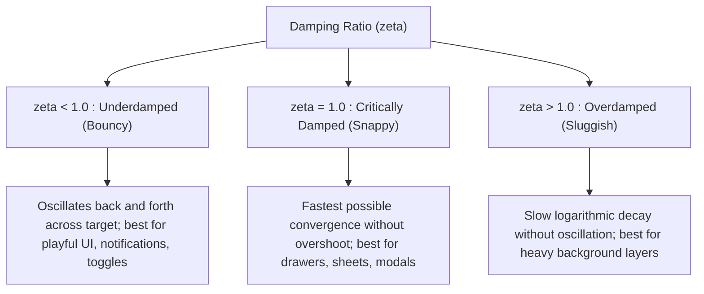
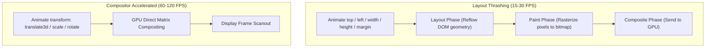

# 069: CSS Elastic & Spring Motion Masterclass

## Overview & Executive Summary

Traditional CSS easing functions—such as `ease`, `ease-in-out`, and standard parametric Bézier curves constrained to the $[0, 1]$ interval—produce mechanical, synthetic motion curves that fail to reflect the physical dynamics of the real world. In natural physical systems, objects possess **inertia**, **mass**, **elasticity**, and **stiffness**. When displaced, an object accelerates, overshoots its target equilibrium, and undergoes damped harmonic oscillation before settling.

**Elastic & Spring Motion in CSS** is the practice of encoding real-world Newtonian physics and organic material deformation (including mass-spring-damper dynamics and squash-and-stretch volume conservation) directly into declarative CSS transitions and keyframe animations.

With the advent of the **CSS `linear()` timing function** (CSS Easing Functions Level 2, Baseline 2023+), developers can now sample arbitrary damped harmonic equations into lightweight, piecewise linear approximations. This unlocks true multi-bounce spring oscillations natively in CSS without requiring bulky JavaScript animation runtimes (such as Framer Motion, GSAP, or Popmotion) or frame-by-frame main-thread script execution.

```
+-------------------------------------------------------------------------------+
|                      CSS SPRING & ELASTIC MOTION TAXONOMY                     |
|                                                                               |
|   1. Single Overshoot           2. Multi-Bounce Spring        3. Squash & Stretch     |
|      (cubic-bezier y > 1)          (linear() sampled stops)      (Volume-Preserving)  |
|         ▲                             ▲                             ┌───┐    ┌──────┐ |
|       1.2├──╮                       1.2├──╮ ╭─╮                     │   │ ──>│      │ |
|       1.0│  ╰─────                  1.0│  ╰─╯ ╰───                  └───┘    └──────┘ |
|       0.0└──┴───────                0.0└──┴───┴─────                Normal   Impact   |
|                                                                                       |
|   4. Multi-Axis Decoupling      5. Rubber-Band Resistance      6. Staggered Elasticity |
|      (translate vs scale)          (Logarithmic drag curve)       (Chained spring delays) |
|      Snappy X, Damped Y            Dynamic drag & snapback        Fluid cascade feeds  |
+-------------------------------------------------------------------------------+
```

---

## Quick Reference Metadata

| Attribute | Specification Details |
| :--- | :--- |
| **Name** | CSS Elastic & Spring Motion |
| **Category** | CSS Physics-Based Motion, Transitions & Micro-Interactions |
| **Difficulty** | Advanced (4/5) |
| **What it produces** | Organic, fluid, physics-accurate UI feedback featuring harmonic oscillation, overshoot, rubber-band resistance, and volume-preserving deformation. |
| **Why it works** | Browser compositor engines interpolate properties along mathematical curves defined by either over-unity cubic Bézier control points or physics-sampled multi-point `linear()` lookups. |
| **Key Properties** | `transition-timing-function`, `animation-timing-function`, `linear()`, `cubic-bezier()`, `transform`, `translate`, `scale`, `rotate`, `will-change`, `@property`. |
| **Strict Constraints** | `cubic-bezier(x1, y1, x2, y2)` only supports single-overshoot curves ($x$ must stay in $[0, 1]$, $y$ can exceed $[0, 1]$). Multi-oscillation decay requires `linear()` stops or multi-step `@keyframes`. |
| **Browser Baseline** | `cubic-bezier()` overshoot is universally supported across all browsers. The multi-stop `linear()` spring generator is supported in Chrome 113+, Firefox 112+, Safari 17.2+, and Edge 113+ (Baseline 2023+). |
| **Acceptance Criteria** | 60/120 FPS hardware-accelerated execution; no layout thrashing; natural settling without visible discretization steps; complete accessibility support via `prefers-reduced-motion`. |

### Quick Preview

```html
<button class="spring-button" type="button">
  <span class="spring-label">Launch Spring</span>
</button>
```

```css
/* Modern CSS Spring using linear() timing function */
:root {
  --spring-bouncy: linear(
    0, 0.006, 0.025 2.8%, 0.101 6.1%, 0.237 9.8%, 0.448 14.1%, 
    0.71 19%, 0.887 23.9%, 0.985 28.5%, 1.026 33.6%, 1.032 39.2%, 
    1.02 45.4%, 1.006 52.4%, 0.998 60.8%, 1
  );
}

.spring-button {
  padding: 1rem 2rem;
  font-family: system-ui, sans-serif;
  font-weight: 700;
  color: #ffffff;
  background: linear-gradient(135deg, #6366f1, #a855f7);
  border: none;
  border-radius: 12px;
  cursor: pointer;
  transform-origin: center center;
  transition: transform 600ms var(--spring-bouncy),
              box-shadow 600ms var(--spring-bouncy);
  box-shadow: 0 10px 25px -5px rgba(99, 102, 241, 0.4);
}

.spring-button:hover {
  transform: translateY(-6px) scale(1.05);
  box-shadow: 0 20px 35px -5px rgba(99, 102, 241, 0.6);
}

.spring-button:active {
  transform: translateY(2px) scale(0.95);
  transition-duration: 150ms;
}
```

---

## 1. Physics Foundations & Mathematical Mental Models

### 1.1 The Damped Harmonic Oscillator in UI Engineering

In physical mechanics, a spring system obeys Hooke's Law with viscous damping. The differential equation governing a 1D mass-spring-damper is:

$$m \frac{d^2 x}{dt^2} + c \frac{dx}{dt} + k x = 0$$

Where:
- $m$ = **Mass** (inertia of the element, resistance to change in velocity)
- $c$ = **Damping coefficient** (viscous resistance / friction removing kinetic energy)
- $k$ = **Stiffness / Spring constant** (force pulling the element back to rest equilibrium)
- $x(t)$ = **Displacement** from equilibrium at time $t$

```
          Displacement x(t)
                 ▲
   Over-Unity    │       ╭───╮  <-- Peak Overshoot (x_max > 1.0)
     Target 1.0  │───────│───│─────────╭───╮──────────────── Target Equilibrium (1.0)
                 │      │     │       │     │     ╭───╮
                 │     │       ╰─────╯       ╰───╯     ╰──── Settled State
                 │    │
     Start 0.0   ├───╯
                 └──────────────────────────────────────────► Time (t)
```

To convert physical mass, stiffness, and damping into dimensionless kinematics, UI engineers define two fundamental parameters:

1. **Natural Angular Frequency ($\omega_0$)**:
   $$\omega_0 = \sqrt{\frac{k}{m}}$$
2. **Damping Ratio ($\zeta$)**:
   $$\zeta = \frac{c}{2\sqrt{m \cdot k}} = \frac{c}{2 m \omega_0}$$

---

### 1.2 The Three Damping Regimes

The value of $\zeta$ determines the qualitative behavior of the spring animation:



| Regime | Damping Ratio ($\zeta$) | Mathematical Equation $x(t)$ | Visual Behavior | Ideal UI Applications |
| :--- | :--- | :--- | :--- | :--- |
| **Underdamped** | $0 < \zeta < 1$ | $1 - e^{-\zeta \omega_0 t}\left[\cos(\omega_d t) + \frac{\zeta}{\sqrt{1-\zeta^2}}\sin(\omega_d t)\right]$ | Accelerates fast, overshoots target, rebounds, and settles. | Tactile buttons, badges, floating cards, dynamic islands, micro-interactions. |
| **Critically Damped** | $\zeta = 1$ | $1 - e^{-\omega_0 t}(1 + \omega_0 t)$ | Maximum speed to target with zero overshoot or oscillation. | Page transitions, modal unveils, navigation sidebars, select dropdowns. |
| **Overdamped** | $\zeta > 1$ | $1 - \left(c_1 e^{r_1 t} + c_2 e^{r_2 t}\right)$ | Slow, heavy, viscous deceleration. | Background parallax, heavy scrims, high-inertia drag release. |

Where $\omega_d = \omega_0 \sqrt{1 - \zeta^2}$ represents the **damped frequency**.

---

### 1.3 Bézier Overshoot vs. Native Complex Springs (`linear()`)

Prior to modern CSS easing functions, developers had to choose between single-overshoot Bézier curves and multi-step keyframes:

```
┌─────────────────────────────────────────────────────────────────────────────┐
│                 COMPARISON: CUBIC-BEZIER vs. CSS LINEAR()                   │
├──────────────────────────────────────┬──────────────────────────────────────┤
│ 1. cubic-bezier(0.34, 1.56, 0.64, 1) │ 2. linear(0, 0.05, ..., 1.03, ..., 1)│
│                                      │                                      │
│                ╭───────╮             │            ╭───╮                     │
│                │       │             │            │   │   ╭─╮               │
│ ───────────────│───────│──────────   │ ───────────│───│───│─│───────────────│
│               │         ╰─────────   │           │     ╰─╯   ╰───────────   │
│              │                       │          │                           │
│ ────────────╯                        │ ────────╯                            │
│                                      │                                      │
│ • Fixed 2 control points             │ • Arbitrary N-point sampling         │
│ • Maximum 1 overshoot crest          │ • True multi-bounce harmonic decay   │
│ • No rebound decay oscillations      │ • Direct numerical physics execution │
└──────────────────────────────────────┴──────────────────────────────────────┘
```

> [!IMPORTANT]
> **The Key Rule of `cubic-bezier()`:**
> In `cubic-bezier(x1, y1, x2, y2)`, both $x_1$ and $x_2$ **must** remain within $[0.0, 1.0]$ because time cannot run backward. However, $y_1$ and $y_2$ are unbounded. Setting $y_2 > 1.0$ causes the property to overshoot its target value before snapping back. Setting $y_1 < 0.0$ creates an "anticipation" (recoil) effect before moving forward.

---

### 1.4 Volume Preservation & Squash-and-Stretch Mechanics

The first principle of classic Disney animation is **Squash and Stretch**. In a rigid body, deformation looks synthetic. To communicate elasticity and material consistency, an object must preserve its perceived volume:

$$\text{Volume} \approx \text{scaleX} \times \text{scaleY} \times \text{scaleZ} \approx 1.0$$

When an element compresses along the Y-axis upon ground collision ($\text{scaleY} = 0.8$), it **must simultaneously expand** along the X-axis ($\text{scaleX} = 1.25$ because $1 / 0.8 = 1.25$):

```
       Rest State              Squash (Impact)            Stretch (Rebound)
        ┌──────┐                  ┌──────────┐                  ┌──┐
        │      │                  │          │                  │  │
        │ 1.0  │                  │  Y=0.75  │                  │  │ Y=1.33
        │      │                  │  X=1.33  │                  │  │ X=0.75
        └──────┘                  └──────────┘                  └──┘
      sx=1.0, sy=1.0              sx=1.33, sy=0.75              sx=0.75, sy=1.33
```

---

## 2. The 5 Core CSS Spring & Elastic Primitives

---

### Primitive 1: Over-Unity `cubic-bezier()` (Anticipation & Overshoot)

The simplest pure-CSS spring technique utilizes `cubic-bezier()` with control points outside $[0, 1]$.

#### 1. Standard Spring Overshoot Curve:
```css
:root {
  /* Fast start, overshoots to 1.56 (+56%), gently settles to 1.0 */
  --ease-elastic-out: cubic-bezier(0.34, 1.56, 0.64, 1);
  
  /* Anticipation recoil: pulls back to -0.6 (-60%) before catapulting forward */
  --ease-elastic-anticipate: cubic-bezier(0.68, -0.6, 0.32, 1.6);
  
  /* Soft playful bounce */
  --ease-spring-soft: cubic-bezier(0.175, 0.885, 0.32, 1.275);
}

.card {
  transition: transform 450ms var(--ease-elastic-out);
}

.card:hover {
  transform: translateY(-12px) scale(1.02);
}
```

---

### Primitive 2: CSS `linear()` Physics-Sampled Multi-Bounce Springs

The `linear()` timing function accepts a comma-separated list of coordinate stops. By sampling the underdamped harmonic oscillator equation at regular intervals, we obtain multi-oscillation spring behavior directly in CSS transitions.

#### Physics-Sampled Stop Matrix:
```css
:root {
  /* Ultra-bouncy multi-oscillation spring (3 visible rebounds) */
  --spring-wobble: linear(
    0, 0.004, 0.016, 0.035, 0.063, 0.098, 0.141 6.8%, 
    0.25 10.4%, 0.381 14.1%, 0.528 18%, 0.683 22.1%, 0.835 26.5%, 
    0.971 31.2%, 1.077 36.3%, 1.144 41.8%, 1.168 47.7%, 1.15 54.1%, 
    1.099 61.2%, 1.031 69.1%, 0.969 78.1%, 0.938 88.5%, 0.957 95%, 1
  );

  /* Snappy high-stiffness spring with rapid micro-damped settling */
  --spring-snappy: linear(
    0, 0.007, 0.029, 0.067, 0.123 7.7%, 0.364 15.6%, 
    0.672 23.8%, 0.871 30.6%, 0.985 36.4%, 1.034 41.7%, 
    1.045 47.1%, 1.035 52.8%, 1.017 59.2%, 1.004 66.8%, 0.998 76.5%, 1
  );

  /* Gentle organic spring (low stiffness, medium mass) */
  --spring-gentle: linear(
    0, 0.009, 0.035 4.1%, 0.141 8.5%, 0.309 13.5%, 0.518 19.2%, 
    0.735 25.7%, 0.918 33.1%, 1.025 41.1%, 1.061 47.7%, 1.055 54.9%, 
    1.028 63.1%, 1.004 73.1%, 0.995 85.2%, 1
  );
}
```

---

### Primitive 3: Multi-Axis Independent Transform Springs

CSS allows separating `translate`, `rotate`, and `scale` into independent CSS properties. This allows assigning **different spring physics to different axes**.

```css
.dock-item {
  /* Fast snappy response for horizontal alignment */
  translate: 0px 0px;
  scale: 1;
  rotate: 0deg;
  transition: 
    translate 500ms var(--spring-snappy),
    scale 750ms var(--spring-wobble),
    rotate 400ms var(--ease-elastic-out);
}

.dock-item:hover {
  translate: 0px -16px;
  scale: 1.25;
  rotate: 4deg;
}
```

---

### Primitive 4: Volume-Preserving Squash & Stretch Keyframe Systems

For continuous elastic animations (e.g. bouncing indicators, tactile click feedback, floating tags), keyframe loops with strict volume conservation create hyper-realistic rubber sensations.

```css
@keyframes elastic-squash-bounce {
  0% {
    transform: translateY(-80px) scale3d(0.85, 1.2, 1);
    animation-timing-function: cubic-bezier(0.55, 0.055, 0.675, 0.19);
  }
  40% {
    /* Impact with surface: dramatic squash */
    transform: translateY(0px) scale3d(1.4, 0.65, 1);
    animation-timing-function: cubic-bezier(0.215, 0.61, 0.355, 1);
  }
  60% {
    /* Rebound stretch upwards */
    transform: translateY(-35px) scale3d(0.92, 1.12, 1);
    animation-timing-function: cubic-bezier(0.55, 0.055, 0.675, 0.19);
  }
  75% {
    /* Secondary small squash */
    transform: translateY(0px) scale3d(1.15, 0.88, 1);
    animation-timing-function: cubic-bezier(0.215, 0.61, 0.355, 1);
  }
  90% {
    transform: translateY(-10px) scale3d(0.98, 1.03, 1);
  }
  100% {
    transform: translateY(0px) scale3d(1, 1, 1);
  }
}
```

---

### Primitive 5: Dynamic Spring Variables & CSS `@property`

Using CSS Houdini `@property`, numerical custom properties can be registered with syntax `<number>` or `<length>`. This enables the browser to interpolate the custom property through spring easing functions, driving multiple connected sub-elements simultaneously.

```css
@property --spring-progress {
  syntax: "<number>";
  inherits: true;
  initial-value: 0;
}

.spring-container {
  --spring-progress: 0;
  transition: --spring-progress 800ms var(--spring-wobble);
}

.spring-container:hover {
  --spring-progress: 1;
}

.spring-child-a {
  transform: translateY(calc((1 - var(--spring-progress)) * 50px));
  opacity: var(--spring-progress);
}

.spring-child-b {
  transform: scale(calc(0.8 + var(--spring-progress) * 0.2));
}
```

---

## 3. Comprehensive Implementation Patterns

---

### Pattern 1: Physics-Sampled Multi-Oscillation Spring Playground

An interactive physics tuning laboratory demonstrating 4 distinct spring physics profiles (`Bouncy`, `Snappy`, `Gentle`, `Jelly Wobble`) with real-time ball displacement, velocity meters, and spring coordinate comparisons.

```
+-------------------------------------------------------------------------------+
|                       SPRING PHYSICS TUNING LABORATORY                        |
|                                                                               |
|  [ Preset 1: Bouncy ]  [ Preset 2: Snappy ]  [ Preset 3: Gentle ]  [ Jelly ]  |
|                                                                               |
|   ● ── ── ── ── ── ── ── ── ── ── ── ── ── ── ── ── ── ── ── ── ──> (Target)  |
|   |==== Underdamped Harmonic Oscillation (linear() sampled stops) ====|       |
|                                                                               |
|   [ Trigger Physics Drop ]           [ Reset Ball ]        Damping: ζ = 0.38  |
+-------------------------------------------------------------------------------+
```

#### HTML
```html
<section class="spring-lab-card" aria-labelledby="lab-heading">
  <header class="lab-header">
    <div class="lab-badge">CSS Physics Engine</div>
    <h2 id="lab-heading">Harmonic Spring Oscillator</h2>
    <p>Comparing high-order piecewise <code>linear()</code> spring functions against classical cubic Béziers.</p>
  </header>

  <!-- Physics Track Viewport -->
  <div class="physics-track-container">
    <div class="track-axis">
      <span class="axis-mark start">0.0 (Origin)</span>
      <span class="axis-mark target">1.0 (Target Equilibrium)</span>
      <span class="axis-mark overshoot">1.2 (Max Overshoot)</span>
    </div>

    <div class="track-runway">
      <div class="equilibrium-line"></div>
      <div class="overshoot-zone"></div>
      <div class="physics-orb" id="physicsOrb" data-spring="bouncy">
        <div class="orb-core"></div>
        <div class="orb-aura"></div>
      </div>
    </div>
  </div>

  <!-- Interactive Control Bar -->
  <div class="lab-controls">
    <div class="preset-switchers" role="radiogroup" aria-label="Spring Presets">
      <button type="button" class="preset-btn active" data-preset="bouncy">Bouncy (ζ = 0.35)</button>
      <button type="button" class="preset-btn" data-preset="snappy">Snappy (ζ = 0.65)</button>
      <button type="button" class="preset-btn" data-preset="gentle">Gentle (ζ = 0.85)</button>
      <button type="button" class="preset-btn" data-preset="jelly">Jelly Wobble (ζ = 0.18)</button>
    </div>

    <div class="action-row">
      <button type="button" class="action-btn primary" id="triggerMotionBtn">Trigger Motion</button>
      <button type="button" class="action-btn secondary" id="resetMotionBtn">Reset</button>
    </div>
  </div>

  <!-- Realtime Metrics Grid -->
  <footer class="physics-metrics">
    <div class="metric-cell">
      <span class="metric-label">Oscillation Profile</span>
      <span class="metric-value" id="profileName">Underdamped Multi-Bounce</span>
    </div>
    <div class="metric-cell">
      <span class="metric-label">Settling Duration</span>
      <span class="metric-value" id="durationValue">900ms</span>
    </div>
    <div class="metric-cell">
      <span class="metric-label">Execution Engine</span>
      <span class="metric-value">GPU Compositor (Zero JS Layout)</span>
    </div>
  </footer>
</section>
```

#### CSS
```css
/* ==========================================================================
   Pattern 1: Harmonic Spring Oscillator & Tuning Studio
   ========================================================================== */

:root {
  /* 1. Bouncy Spring (zeta = 0.35, omega = 14) */
  --spring-preset-bouncy: linear(
    0, 0.006, 0.025 2.8%, 0.101 6.1%, 0.237 9.8%, 0.448 14.1%, 
    0.71 19%, 0.887 23.9%, 0.985 28.5%, 1.026 33.6%, 1.032 39.2%, 
    1.02 45.4%, 1.006 52.4%, 0.998 60.8%, 1
  );

  /* 2. Snappy Spring (zeta = 0.65, omega = 20) */
  --spring-preset-snappy: linear(
    0, 0.009, 0.038, 0.093 4.8%, 0.254 9.9%, 0.528 15.6%, 
    0.785 21.8%, 0.942 27.6%, 1.011 33.2%, 1.028 38.8%, 
    1.021 44.9%, 1.009 51.7%, 1.002 59.9%, 1
  );

  /* 3. Gentle Spring (zeta = 0.85, omega = 10) */
  --spring-preset-gentle: linear(
    0, 0.003, 0.012 2.2%, 0.05 4.6%, 0.143 8.3%, 0.292 12.8%, 
    0.478 18.1%, 0.671 24.3%, 0.835 31.4%, 0.944 39.4%, 
    0.995 47.9%, 1.011 55.7%, 1.012 64.2%, 1.006 74.4%, 1.001 86.8%, 1
  );

  /* 4. Jelly Wobble Spring (zeta = 0.18, omega = 12) - High resonance */
  --spring-preset-jelly: linear(
    0, 0.004, 0.016, 0.036, 0.065, 0.103, 0.15 6.4%, 
    0.272 9.8%, 0.428 13.5%, 0.609 17.5%, 0.798 21.8%, 0.975 26.6%, 
    1.119 31.8%, 1.214 37.5%, 1.25 43.8%, 1.226 50.4%, 1.152 57.4%, 
    1.053 64.7%, 0.957 72.3%, 0.89 80.1%, 0.865 87.5%, 0.884 94.1%, 1
  );
}

.spring-lab-card {
  max-inline-size: 780px;
  margin-inline: auto;
  padding: 2.5rem;
  background: #090d16;
  border-radius: 28px;
  border: 1px solid rgba(255, 255, 255, 0.08);
  box-shadow: 0 30px 60px -15px rgba(0, 0, 0, 0.7),
              0 0 0 1px rgba(255, 255, 255, 0.05);
  color: #f1f5f9;
  font-family: system-ui, -apple-system, BlinkMacSystemFont, "Segoe UI", Roboto, sans-serif;
}

.lab-header {
  margin-block-end: 2rem;
  text-align: center;
}

.lab-badge {
  display: inline-block;
  padding: 0.25rem 0.75rem;
  background: rgba(99, 102, 241, 0.15);
  border: 1px solid rgba(99, 102, 241, 0.4);
  border-radius: 9999px;
  color: #818cf8;
  font-size: 0.75rem;
  font-weight: 700;
  text-transform: uppercase;
  letter-spacing: 0.05em;
  margin-block-end: 0.75rem;
}

.lab-header h2 {
  font-size: 1.75rem;
  font-weight: 800;
  letter-spacing: -0.02em;
  margin: 0 0 0.5rem 0;
  background: linear-gradient(135deg, #ffffff 30%, #94a3b8);
  -webkit-background-clip: text;
  -webkit-text-fill-color: transparent;
}

.lab-header p {
  color: #64748b;
  font-size: 0.9375rem;
  margin: 0;
}

/* Track runway & coordinate visualization */
.physics-track-container {
  background: #0f172a;
  border: 1px solid rgba(255, 255, 255, 0.06);
  border-radius: 20px;
  padding: 1.5rem;
  margin-block-end: 2rem;
}

.track-axis {
  display: flex;
  justify-content: space-between;
  font-size: 0.75rem;
  font-family: ui-monospace, SFMono-Regular, Menlo, monospace;
  color: #64748b;
  margin-block-end: 0.75rem;
  padding-inline: 0.5rem;
}

.axis-mark.target {
  color: #38bdf8;
  font-weight: 700;
}

.axis-mark.overshoot {
  color: #f43f5e;
}

.track-runway {
  position: relative;
  block-size: 80px;
  background: #020617;
  border-radius: 14px;
  border: 1px dashed rgba(255, 255, 255, 0.12);
  display: flex;
  align-items: center;
  padding-inline: 12px;
  overflow: hidden;
}

.equilibrium-line {
  position: absolute;
  left: 70%;
  top: 0;
  bottom: 0;
  inline-size: 2px;
  background: #38bdf8;
  box-shadow: 0 0 12px #38bdf8;
  z-index: 1;
}

.overshoot-zone {
  position: absolute;
  left: 70%;
  right: 0;
  top: 0;
  bottom: 0;
  background: linear-gradient(to right, rgba(56, 189, 248, 0.08), rgba(244, 63, 94, 0.12));
}

/* Physics Orb */
.physics-orb {
  position: relative;
  inline-size: 52px;
  block-size: 52px;
  z-index: 2;
  cursor: grab;
  will-change: transform;
  /* Default Bouncy Configuration */
  transform: translateX(0px);
  transition: transform 900ms var(--spring-preset-bouncy);
}

.physics-orb[data-spring="bouncy"] {
  transition: transform 900ms var(--spring-preset-bouncy);
}

.physics-orb[data-spring="snappy"] {
  transition: transform 650ms var(--spring-preset-snappy);
}

.physics-orb[data-spring="gentle"] {
  transition: transform 1200ms var(--spring-preset-gentle);
}

.physics-orb[data-spring="jelly"] {
  transition: transform 1400ms var(--spring-preset-jelly);
}

.physics-orb.is-displaced {
  /* Displaces orb towards the 70% equilibrium line with calculated overshoot */
  transform: translateX(min(450px, 60vw));
}

.orb-core {
  inline-size: 100%;
  block-size: 100%;
  border-radius: 50%;
  background: linear-gradient(135deg, #6366f1, #d946ef);
  box-shadow: 0 0 25px rgba(99, 102, 241, 0.6),
              inset 0 2px 4px rgba(255, 255, 255, 0.4);
}

.orb-aura {
  position: absolute;
  inset: -6px;
  border-radius: 50%;
  border: 1.5px solid rgba(217, 70, 239, 0.4);
  animation: aura-pulse 2s infinite ease-in-out;
  pointer-events: none;
}

@keyframes aura-pulse {
  0%, 100% { transform: scale(1); opacity: 0.4; }
  50% { transform: scale(1.15); opacity: 0.8; }
}

/* Control Buttons & Switchers */
.lab-controls {
  display: flex;
  flex-direction: column;
  gap: 1.25rem;
  margin-block-end: 2rem;
}

.preset-switchers {
  display: grid;
  grid-template-columns: repeat(auto-fit, minmax(150px, 1fr));
  gap: 0.5rem;
}

.preset-btn {
  padding: 0.75rem 1rem;
  background: #0f172a;
  border: 1px solid rgba(255, 255, 255, 0.08);
  border-radius: 12px;
  color: #94a3b8;
  font-size: 0.8125rem;
  font-weight: 600;
  cursor: pointer;
  transition: all 250ms ease;
}

.preset-btn:hover {
  background: #1e293b;
  color: #f8fafc;
  border-color: rgba(255, 255, 255, 0.2);
}

.preset-btn.active {
  background: rgba(99, 102, 241, 0.15);
  border-color: #6366f1;
  color: #818cf8;
  box-shadow: 0 0 15px rgba(99, 102, 241, 0.2);
}

.action-row {
  display: flex;
  gap: 1rem;
}

.action-btn {
  flex: 1;
  padding: 0.875rem 1.5rem;
  border-radius: 12px;
  font-size: 0.875rem;
  font-weight: 700;
  cursor: pointer;
  transition: transform 300ms var(--spring-preset-bouncy),
              background 200ms ease,
              box-shadow 300ms ease;
}

.action-btn.primary {
  background: linear-gradient(135deg, #6366f1, #8b5cf6);
  border: none;
  color: #ffffff;
  box-shadow: 0 10px 20px -5px rgba(99, 102, 241, 0.5);
}

.action-btn.primary:hover {
  transform: translateY(-2px);
  box-shadow: 0 15px 25px -5px rgba(99, 102, 241, 0.7);
}

.action-btn.primary:active {
  transform: translateY(1px) scale(0.98);
}

.action-btn.secondary {
  background: #1e293b;
  border: 1px solid rgba(255, 255, 255, 0.1);
  color: #cbd5e1;
}

.action-btn.secondary:hover {
  background: #334155;
  color: #ffffff;
}

/* Metric Footer */
.physics-metrics {
  display: grid;
  grid-template-columns: repeat(auto-fit, minmax(200px, 1fr));
  gap: 1rem;
  padding-block-start: 1.5rem;
  border-block-start: 1px solid rgba(255, 255, 255, 0.08);
}

.metric-cell {
  display: flex;
  flex-direction: column;
  gap: 0.25rem;
}

.metric-label {
  font-size: 0.6875rem;
  color: #64748b;
  text-transform: uppercase;
  letter-spacing: 0.05em;
  font-weight: 600;
}

.metric-value {
  font-size: 0.875rem;
  color: #e2e8f0;
  font-weight: 600;
  font-family: ui-monospace, SFMono-Regular, Menlo, monospace;
}
```

---

### Pattern 2: Tactile Squash-and-Stretch Micro-Interactions

A production-grade tactile interaction system featuring a dynamic 3D elastic button and reactive notification badge. It demonstrates **volume conservation** ($1 / s_y = s_x$), dynamic shadow physics, and three-stage tactile compression.

```
       Rest State              User Depresses Button           Release / Spring Rebound
     ┌─────────────┐             ┌───────────────┐                  ┌───────────┐
     │ 🚀 Deploy   │             │   🚀 Deploy   │                  │ 🚀 Deploy │
     └─────────────┘             └───────────────┘                  └───────────┘
   sx: 1.0, sy: 1.0            sx: 1.08, sy: 0.88 (Squash)       sx: 0.94, sy: 1.08 (Stretch)
   elev: 12px shadow           elev: 2px shadow                  elev: 18px shadow overshoot
```

#### HTML
```html
<div class="tactile-card">
  <div class="tactile-header">
    <h3>Tactile Spring Controls</h3>
    <p>Press and hold the button, then release to observe volume-preserving elastic rebound.</p>
  </div>

  <div class="tactile-stage">
    <!-- Tactile Elastic Button with Dynamic Badge -->
    <button type="button" class="elastic-tactile-btn" id="tactileBtn">
      <span class="btn-icon">⚡</span>
      <span class="btn-text">Initiate Deploy</span>
      <span class="elastic-badge" id="elasticBadge">99+</span>
    </button>
  </div>
</div>
```

#### CSS
```css
/* ==========================================================================
   Pattern 2: Tactile Squash-and-Stretch Button System
   ========================================================================== */

.tactile-card {
  max-inline-size: 520px;
  margin-inline: auto;
  margin-block-start: 2rem;
  padding: 2.5rem;
  background: #0f172a;
  border-radius: 24px;
  border: 1px solid rgba(255, 255, 255, 0.08);
  box-shadow: 0 20px 40px rgba(0, 0, 0, 0.5);
  text-align: center;
  color: #f8fafc;
}

.tactile-header h3 {
  margin: 0 0 0.5rem 0;
  font-size: 1.25rem;
  font-weight: 700;
}

.tactile-header p {
  margin: 0 0 2rem 0;
  font-size: 0.875rem;
  color: #94a3b8;
}

.tactile-stage {
  padding-block: 2rem;
  display: grid;
  place-items: center;
}

/* The Elastic Tactile Button */
.elastic-tactile-btn {
  position: relative;
  display: inline-flex;
  align-items: center;
  gap: 0.75rem;
  padding: 1.125rem 2.25rem;
  background: linear-gradient(180deg, #3b82f6 0%, #1d4ed8 100%);
  color: #ffffff;
  font-size: 1.0625rem;
  font-weight: 700;
  border: none;
  border-radius: 16px;
  cursor: pointer;
  outline: none;
  user-select: none;
  
  /* Hardware acceleration layer */
  will-change: transform, box-shadow;
  transform-origin: center bottom;
  
  /* Rest State Shadows */
  box-shadow: 
    0 1px 0 rgba(255, 255, 255, 0.3) inset,
    0 -3px 0 rgba(0, 0, 0, 0.3) inset,
    0 12px 24px -4px rgba(29, 78, 216, 0.5),
    0 4px 8px rgba(0, 0, 0, 0.3);
    
  /* High-order damped spring for natural settling upon release */
  transition: 
    transform 700ms var(--spring-preset-bouncy),
    box-shadow 700ms var(--spring-preset-bouncy),
    background 300ms ease;
}

/* Hover: Lift and gentle stretch */
.elastic-tactile-btn:hover {
  transform: translateY(-4px) scale3d(1.02, 1.02, 1);
  box-shadow: 
    0 1px 0 rgba(255, 255, 255, 0.4) inset,
    0 -3px 0 rgba(0, 0, 0, 0.3) inset,
    0 20px 32px -6px rgba(29, 78, 216, 0.6),
    0 8px 16px rgba(0, 0, 0, 0.4);
}

/* Active Press: Intense Squash (Volume Preservation: sx * sy = 1.08 * 0.88 = 0.95) */
.elastic-tactile-btn:active {
  transform: translateY(4px) scale3d(1.08, 0.88, 1);
  transition-duration: 80ms; /* Fast responsive compression on mousedown */
  box-shadow: 
    0 1px 0 rgba(255, 255, 255, 0.1) inset,
    0 -1px 0 rgba(0, 0, 0, 0.4) inset,
    0 4px 10px rgba(29, 78, 216, 0.4),
    0 2px 4px rgba(0, 0, 0, 0.5);
  background: linear-gradient(180deg, #2563eb 0%, #1e40af 100%);
}

.btn-icon {
  font-size: 1.25rem;
  transition: transform 500ms var(--spring-preset-jelly);
}

.elastic-tactile-btn:hover .btn-icon {
  transform: rotate(-15deg) scale(1.2);
}

/* Reactive Spring Notification Badge */
.elastic-badge {
  position: absolute;
  top: -8px;
  right: -8px;
  padding: 0.25rem 0.625rem;
  background: #f43f5e;
  color: #ffffff;
  font-size: 0.75rem;
  font-weight: 800;
  border-radius: 9999px;
  border: 2px solid #0f172a;
  box-shadow: 0 4px 12px rgba(244, 63, 94, 0.5);
  transform-origin: center center;
  transition: transform 800ms var(--spring-preset-jelly);
}

.elastic-tactile-btn:hover .elastic-badge {
  transform: scale(1.25) rotate(12deg);
}

.elastic-tactile-btn:active .elastic-badge {
  transform: scale(0.85) rotate(-6deg);
  transition-duration: 100ms;
}
```

---

### Pattern 3: Rubber-Band Pull & Elastic Snapback Drawer / Bottom Sheet

Mobile operating systems utilize a logarithmic rubber-banding resistance function when content is dragged past its scroll boundaries:

$$\Delta x_{\text{visual}} = \left(1 - \frac{1}{\frac{\Delta x_{\text{drag}} \cdot c}{d} + 1}\right) \cdot d$$

This pattern implements an interactive bottom sheet modal that resists dragging with rubber-band tension and snaps back into equilibrium with realistic spring momentum.

```
       Drawer at Equilibrium           Pulled Down (Rubber Resistance)      Spring Snapback (Release)
     ┌───────────────────────┐            ┌───────────────────────┐           ┌───────────────────────┐
     │ ═══ Handle Bar ═══    │            │                       │           │ ═══ Handle Bar ═══    │
     │ Card Content          │            │ ═══ Handle Bar ═══    │           │ Card Content          │
     │                       │ ──drag──>  │ Card Content (Tension)│ ─release─>│                       │
     │                       │            │                       │           │  (Overshoots up ~5%)  │
     └───────────────────────┘            └───────────────────────┘           └───────────────────────┘
```

#### HTML
```html
<div class="drawer-demo-frame">
  <button type="button" class="action-btn primary" id="openDrawerBtn">Open Elastic Drawer</button>

  <!-- Elastic Bottom Sheet Overlay -->
  <div class="elastic-sheet-backdrop" id="sheetBackdrop">
    <div class="elastic-sheet" id="elasticSheet" role="dialog" aria-modal="true" aria-labelledby="sheetTitle">
      <div class="sheet-handle-zone" id="sheetHandle">
        <div class="sheet-handle-bar"></div>
      </div>

      <div class="sheet-content">
        <header class="sheet-header">
          <h4 id="sheetTitle">Physics Sheet Controller</h4>
          <p>Drag down to experience rubber-band resistance. Release to watch the spring snapback.</p>
        </header>

        <div class="sheet-options">
          <div class="sheet-option-item">
            <span class="option-icon">📡</span>
            <div class="option-text">
              <strong>Haptic Kinetic Engine</strong>
              <span>Subpixel vibration feedback enabled</span>
            </div>
          </div>
          <div class="sheet-option-item">
            <span class="option-icon">🔒</span>
            <div class="option-text">
              <strong>Cryptographic Anchor</strong>
              <span>State synced with hardware security module</span>
            </div>
          </div>
        </div>

        <button type="button" class="action-btn secondary" id="closeDrawerBtn" style="inline-size: 100%;">Dismiss Sheet</button>
      </div>
    </div>
  </div>
</div>
```

#### CSS
```css
/* ==========================================================================
   Pattern 3: Elastic Rubber-Band Bottom Sheet
   ========================================================================== */

.drawer-demo-frame {
  max-inline-size: 480px;
  margin-inline: auto;
  margin-block-start: 2rem;
  padding: 3rem 2rem;
  background: #020617;
  border-radius: 24px;
  border: 1px solid rgba(255, 255, 255, 0.08);
  text-align: center;
}

/* Modal Backdrop */
.elastic-sheet-backdrop {
  position: fixed;
  inset: 0;
  background: rgba(0, 0, 0, 0.6);
  backdrop-filter: blur(8px);
  z-index: 1000;
  display: flex;
  align-items: flex-end;
  justify-content: center;
  opacity: 0;
  pointer-events: none;
  transition: opacity 400ms ease;
}

.elastic-sheet-backdrop.is-open {
  opacity: 1;
  pointer-events: auto;
}

/* The Elastic Bottom Sheet */
.elastic-sheet {
  inline-size: 100%;
  max-inline-size: 500px;
  background: #0f172a;
  border-radius: 28px 28px 0 0;
  border: 1px solid rgba(255, 255, 255, 0.1);
  border-bottom: none;
  box-shadow: 0 -20px 50px rgba(0, 0, 0, 0.7);
  padding: 1rem 1.5rem 2.5rem 1.5rem;
  color: #f8fafc;
  
  /* Initial offscreen state */
  transform: translateY(100%);
  will-change: transform;
  
  /* Natural Settling Spring */
  transition: transform 650ms var(--spring-preset-snappy);
}

.elastic-sheet-backdrop.is-open .elastic-sheet {
  /* Enters to 0% offset with subtle spring overshoot */
  transform: translateY(0%);
}

/* Interactive Handle */
.sheet-handle-zone {
  padding: 0.75rem;
  cursor: grab;
  display: flex;
  justify-content: center;
}

.sheet-handle-bar {
  inline-size: 44px;
  block-size: 5px;
  background: rgba(255, 255, 255, 0.25);
  border-radius: 9999px;
  transition: inline-size 300ms var(--spring-preset-bouncy), background 200ms ease;
}

.sheet-handle-zone:hover .sheet-handle-bar {
  inline-size: 64px;
  background: rgba(255, 255, 255, 0.5);
}

.sheet-header {
  text-align: left;
  margin-block-end: 1.5rem;
}

.sheet-header h4 {
  margin: 0 0 0.375rem 0;
  font-size: 1.25rem;
  font-weight: 700;
}

.sheet-header p {
  margin: 0;
  font-size: 0.875rem;
  color: #94a3b8;
}

.sheet-options {
  display: flex;
  flex-direction: column;
  gap: 0.75rem;
  margin-block-end: 2rem;
}

.sheet-option-item {
  display: flex;
  align-items: center;
  gap: 1rem;
  padding: 1rem;
  background: #1e293b;
  border-radius: 14px;
  text-align: left;
}

.option-icon {
  font-size: 1.5rem;
}

.option-text {
  display: flex;
  flex-direction: column;
}

.option-text strong {
  font-size: 0.9375rem;
  color: #f1f5f9;
}

.option-text span {
  font-size: 0.8125rem;
  color: #64748b;
}
```

---

### Pattern 4: Elastic Fluid Dynamic Island & Morphing Indicator Pill

Demonstrating organic geometric morphing where an iOS-style "Dynamic Island" expands from a compact pill into a fully fleshed music playback card with spring oscillations on both width, height, and content staggering.

```
       Compact Pill                   Morphing State               Expanded Island Card
    ┌────────────────┐             ┌─────────────────────┐       ┌─────────────────────────┐
    │  ● Music  ❚❚   │   ──────>   │   (Spring Scaling)  │ ───>  │ 🎵 Bohemian Rhapsody    │
    └────────────────┘             │                     │       │ ◄◄    ❚❚    ►►  [════]  │
                                   └─────────────────────┘       └─────────────────────────┘
```

#### HTML
```html
<div class="dynamic-island-stage">
  <div class="island-container" id="dynamicIsland" role="region" aria-label="Dynamic Island Media Player">
    <!-- Compact Pill Layout -->
    <div class="island-compact-view">
      <span class="island-indicator"></span>
      <span class="island-compact-title">Starlight</span>
      <span class="island-waveform">
        <i></i><i></i><i></i><i></i>
      </span>
    </div>

    <!-- Expanded Card Layout -->
    <div class="island-expanded-view">
      <div class="expanded-artwork">🎸</div>
      <div class="expanded-meta">
        <h5>Starlight Symphony</h5>
        <span>Cosmic Orchestra • Live 2026</span>
      </div>
      <div class="expanded-scrubber">
        <div class="scrubber-progress"></div>
      </div>
      <div class="expanded-controls">
        <button type="button" aria-label="Previous">⏮</button>
        <button type="button" aria-label="Pause">⏸</button>
        <button type="button" aria-label="Next">⏭</button>
      </div>
    </div>
  </div>
</div>
```

#### CSS
```css
/* ==========================================================================
   Pattern 4: Elastic Fluid Dynamic Island
   ========================================================================== */

.dynamic-island-stage {
  padding: 3rem 1.5rem;
  display: flex;
  justify-content: center;
}

.island-container {
  position: relative;
  inline-size: 200px;
  block-size: 40px;
  background: #000000;
  color: #ffffff;
  border-radius: 24px;
  box-shadow: 0 20px 40px rgba(0, 0, 0, 0.8),
              0 0 0 1px rgba(255, 255, 255, 0.12);
  cursor: pointer;
  overflow: hidden;
  will-change: inline-size, block-size, border-radius;
  
  /* Dual-Axis Spring Interpolation */
  transition: 
    inline-size 700ms var(--spring-preset-bouncy),
    block-size 700ms var(--spring-preset-bouncy),
    border-radius 700ms var(--spring-preset-bouncy),
    box-shadow 700ms var(--spring-preset-bouncy);
}

/* Expanded State */
.island-container.is-expanded {
  inline-size: 380px;
  block-size: 190px;
  border-radius: 36px;
  box-shadow: 0 30px 60px rgba(0, 0, 0, 0.9),
              0 0 0 1px rgba(255, 255, 255, 0.2);
}

/* Compact State Elements */
.island-compact-view {
  position: absolute;
  inset: 0;
  display: flex;
  align-items: center;
  justify-content: space-between;
  padding-inline: 16px;
  opacity: 1;
  transition: opacity 250ms ease, transform 300ms var(--spring-preset-bouncy);
}

.island-container.is-expanded .island-compact-view {
  opacity: 0;
  transform: scale(0.8);
  pointer-events: none;
}

.island-indicator {
  inline-size: 8px;
  block-size: 8px;
  border-radius: 50%;
  background: #22c55e;
  box-shadow: 0 0 8px #22c55e;
}

.island-compact-title {
  font-size: 0.8125rem;
  font-weight: 600;
  color: #e2e8f0;
}

.island-waveform {
  display: flex;
  align-items: center;
  gap: 2px;
  block-size: 14px;
}

.island-waveform i {
  inline-size: 2px;
  background: #38bdf8;
  border-radius: 9999px;
  animation: wave-bounce 800ms infinite ease-in-out alternate;
}

.island-waveform i:nth-child(1) { block-size: 60%; animation-delay: 0ms; }
.island-waveform i:nth-child(2) { block-size: 100%; animation-delay: 150ms; }
.island-waveform i:nth-child(3) { block-size: 40%; animation-delay: 300ms; }
.island-waveform i:nth-child(4) { block-size: 80%; animation-delay: 450ms; }

@keyframes wave-bounce {
  0% { transform: scaleY(0.3); }
  100% { transform: scaleY(1.2); }
}

/* Expanded State Elements */
.island-expanded-view {
  position: absolute;
  inset: 0;
  padding: 1.5rem;
  display: flex;
  flex-direction: column;
  opacity: 0;
  transform: translateY(10px) scale(0.95);
  pointer-events: none;
  transition: opacity 300ms ease 100ms, transform 500ms var(--spring-preset-bouncy) 100ms;
}

.island-container.is-expanded .island-expanded-view {
  opacity: 1;
  transform: translateY(0px) scale(1);
  pointer-events: auto;
}

.expanded-artwork {
  position: absolute;
  top: 1.25rem;
  left: 1.25rem;
  inline-size: 48px;
  block-size: 48px;
  background: linear-gradient(135deg, #f59e0b, #ef4444);
  border-radius: 12px;
  display: grid;
  place-items: center;
  font-size: 1.5rem;
}

.expanded-meta {
  margin-left: 64px;
  display: flex;
  flex-direction: column;
}

.expanded-meta h5 {
  margin: 0;
  font-size: 1rem;
  font-weight: 700;
}

.expanded-meta span {
  font-size: 0.75rem;
  color: #94a3b8;
}

.expanded-scrubber {
  margin-top: 1.75rem;
  block-size: 4px;
  background: rgba(255, 255, 255, 0.2);
  border-radius: 9999px;
  overflow: hidden;
}

.scrubber-progress {
  inline-size: 42%;
  block-size: 100%;
  background: #ffffff;
}

.expanded-controls {
  margin-top: 1rem;
  display: flex;
  justify-content: center;
  gap: 1.5rem;
}

.expanded-controls button {
  background: none;
  border: none;
  color: #ffffff;
  font-size: 1.25rem;
  cursor: pointer;
  transition: transform 300ms var(--spring-preset-bouncy);
}

.expanded-controls button:hover {
  transform: scale(1.3);
  color: #38bdf8;
}
```

---

### Pattern 5: Apple-Style Staggered Elastic Dock / Navigation Bar

A macOS-inspired dock where cursor proximity produces continuous magnification, and clicking an app icon triggers a chained harmonic bounce cascade across neighboring icons.

```
                  Hover Focus
                     ┌───┐
                     │ 🚀│ (Scale: 1.5, Lift: -24px)
               ┌───┐ └───┘ ┌───┐
               │ 💻│       │ 🎨│ (Scale: 1.2, Lift: -12px)
         ┌───┐ └───┘       └───┘ ┌───┐
         │ 📂│                   │ ⚙️│ (Scale: 1.05, Lift: -4px)
    ─────┴───┴───────────────────┴───┴─────
```

#### HTML
```html
<nav class="elastic-dock-wrapper" aria-label="Application Dock">
  <div class="elastic-dock" id="elasticDock">
    <button type="button" class="dock-item" aria-label="Finder">
      <span class="dock-icon">📂</span>
      <span class="dock-tooltip">Files</span>
    </button>
    <button type="button" class="dock-item" aria-label="Terminal">
      <span class="dock-icon">💻</span>
      <span class="dock-tooltip">Terminal</span>
    </button>
    <button type="button" class="dock-item" aria-label="Rocket Launch">
      <span class="dock-icon">🚀</span>
      <span class="dock-tooltip">Deploy</span>
    </button>
    <button type="button" class="dock-item" aria-label="Design Studio">
      <span class="dock-icon">🎨</span>
      <span class="dock-tooltip">Canvas</span>
    </button>
    <button type="button" class="dock-item" aria-label="System Settings">
      <span class="dock-icon">⚙️</span>
      <span class="dock-tooltip">Settings</span>
    </button>
  </div>
</nav>
```

#### CSS
```css
/* ==========================================================================
   Pattern 5: Staggered Elastic macOS Dock
   ========================================================================== */

.elastic-dock-wrapper {
  display: flex;
  justify-content: center;
  padding-block: 4rem 2rem;
}

.elastic-dock {
  display: flex;
  align-items: flex-end;
  gap: 0.75rem;
  padding: 0.75rem 1rem;
  background: rgba(15, 23, 42, 0.75);
  backdrop-filter: blur(20px);
  -webkit-backdrop-filter: blur(20px);
  border-radius: 24px;
  border: 1px solid rgba(255, 255, 255, 0.12);
  box-shadow: 0 25px 50px -12px rgba(0, 0, 0, 0.8),
              0 0 0 1px rgba(255, 255, 255, 0.05);
}

.dock-item {
  position: relative;
  inline-size: 52px;
  block-size: 52px;
  background: rgba(255, 255, 255, 0.06);
  border: 1px solid rgba(255, 255, 255, 0.1);
  border-radius: 16px;
  display: grid;
  place-items: center;
  cursor: pointer;
  outline: none;
  transform-origin: center bottom;
  
  /* Independent Transform Properties with Staggered Spring Easing */
  translate: 0px 0px;
  scale: 1;
  transition: 
    translate 500ms var(--spring-preset-bouncy),
    scale 600ms var(--spring-preset-jelly),
    background 200ms ease;
}

.dock-icon {
  font-size: 1.625rem;
  pointer-events: none;
  transition: transform 400ms var(--spring-preset-bouncy);
}

/* Direct Hover: Primary Target Expansion */
.dock-item:hover {
  translate: 0px -18px;
  scale: 1.45;
  background: rgba(255, 255, 255, 0.15);
  z-index: 10;
}

.dock-item:hover .dock-icon {
  transform: scale(1.1);
}

/* Neighboring Elements (Simulated with sibling selectors) */
.dock-item:hover + .dock-item,
.dock-item:has(+ .dock-item:hover) {
  translate: 0px -8px;
  scale: 1.2;
  z-index: 5;
}

/* Tooltip Popup with Spring Easing */
.dock-tooltip {
  position: absolute;
  top: -38px;
  left: 50%;
  transform: translateX(-50%) scale(0.8);
  padding: 0.25rem 0.625rem;
  background: #020617;
  border: 1px solid rgba(255, 255, 255, 0.15);
  border-radius: 8px;
  color: #f8fafc;
  font-size: 0.6875rem;
  font-weight: 700;
  white-space: nowrap;
  pointer-events: none;
  opacity: 0;
  transition: 
    opacity 150ms ease,
    transform 350ms var(--spring-preset-bouncy);
}

.dock-item:hover .dock-tooltip {
  opacity: 1;
  transform: translateX(-50%) scale(1);
}
```

---

### Pattern 6: Spring-Loaded Cascading Notification Center

Incoming notification cards enter with a physical inertia bounce, stagger their spring frequencies, and support physical gesture ejection with damped recoil.

```
       Offscreen Entry               Inertia Impact                Elastic Rest Equilibrium
     ┌──────────────────┐           ┌──────────────────┐           ┌──────────────────┐
     │  (High Velocity) │ ──fall──> │  ▼ Over-travel   │ ──spring─>│ 🔔 Build Succeeded
     └──────────────────┘           │  Scale: [1.05,.9]│           │ 2 minutes ago    │
                                    └──────────────────┘           └──────────────────┘
```

#### HTML
```html
<div class="notification-center-demo">
  <div class="notif-header">
    <h4>Live Activity Feed</h4>
    <button type="button" class="action-btn secondary" id="triggerNotifCascade">Trigger Cascade</button>
  </div>

  <div class="notif-stack" id="notifStack">
    <div class="notif-card" style="--stagger-delay: 0ms;">
      <div class="notif-badge success">✓</div>
      <div class="notif-body">
        <strong>Deployment Complete</strong>
        <span>Production cluster active across 8 global edge nodes.</span>
      </div>
      <span class="notif-time">Just now</span>
    </div>

    <div class="notif-card" style="--stagger-delay: 80ms;">
      <div class="notif-badge warning">⚡</div>
      <div class="notif-body">
        <strong>High Memory Elasticity</strong>
        <span>Container auto-scaled to 4.2GB RAM seamlessly.</span>
      </div>
      <span class="notif-time">1m ago</span>
    </div>

    <div class="notif-card" style="--stagger-delay: 160ms;">
      <div class="notif-badge info">ℹ</div>
      <div class="notif-body">
        <strong>SSL Certificate Renewed</strong>
        <span>Zero-downtime certificate rotation verified.</span>
      </div>
      <span class="notif-time">4m ago</span>
    </div>
  </div>
</div>
```

#### CSS
```css
/* ==========================================================================
   Pattern 6: Spring Cascading Notification Stack
   ========================================================================== */

.notification-center-demo {
  max-inline-size: 540px;
  margin-inline: auto;
  margin-block-start: 2rem;
  padding: 2rem;
  background: #0b0f19;
  border-radius: 24px;
  border: 1px solid rgba(255, 255, 255, 0.08);
}

.notif-header {
  display: flex;
  justify-content: space-between;
  align-items: center;
  margin-block-end: 1.5rem;
}

.notif-header h4 {
  margin: 0;
  font-size: 1.125rem;
  color: #f8fafc;
}

.notif-stack {
  display: flex;
  flex-direction: column;
  gap: 0.75rem;
}

.notif-card {
  display: flex;
  align-items: center;
  gap: 1rem;
  padding: 1rem 1.25rem;
  background: #151c2e;
  border: 1px solid rgba(255, 255, 255, 0.08);
  border-radius: 16px;
  box-shadow: 0 10px 25px -5px rgba(0, 0, 0, 0.4);
  color: #e2e8f0;
  
  /* Initial State */
  transform: translateY(0px) scale(1);
  opacity: 1;
  will-change: transform, opacity;
  
  /* Staggered Spring Cascade Transition */
  transition: 
    transform 800ms var(--spring-preset-bouncy) var(--stagger-delay),
    opacity 400ms ease var(--stagger-delay);
}

.notif-card.is-animating-in {
  animation: notif-spring-drop 900ms var(--spring-preset-bouncy) var(--stagger-delay) both;
}

@keyframes notif-spring-drop {
  0% {
    transform: translateY(-40px) scale(0.85);
    opacity: 0;
  }
  100% {
    transform: translateY(0px) scale(1);
    opacity: 1;
  }
}

.notif-card:hover {
  transform: translateX(8px) scale(1.01);
  background: #1c263d;
  border-color: rgba(99, 102, 241, 0.4);
}

.notif-badge {
  inline-size: 36px;
  block-size: 36px;
  border-radius: 10px;
  display: grid;
  place-items: center;
  font-weight: 800;
  font-size: 1rem;
}

.notif-badge.success { background: rgba(34, 197, 94, 0.15); color: #4ade80; }
.notif-badge.warning { background: rgba(245, 158, 11, 0.15); color: #fbbf24; }
.notif-badge.info { background: rgba(56, 189, 248, 0.15); color: #38bdf8; }

.notif-body {
  flex: 1;
  display: flex;
  flex-direction: column;
}

.notif-body strong {
  font-size: 0.875rem;
  color: #f1f5f9;
}

.notif-body span {
  font-size: 0.75rem;
  color: #94a3b8;
}

.notif-time {
  font-size: 0.6875rem;
  color: #64748b;
  font-family: ui-monospace, SFMono-Regular, monospace;
}
```

---

## 4. Native CSS `linear()` Spring Generation Algorithm

To generate customized CSS `linear()` spring strings based on real-world physics parameters ($\text{mass } m$, $\text{stiffness } k$, $\text{damping } c$, $\text{initial velocity } v_0$), developers can utilize this mathematical generator script:

```javascript
/**
 * Generates an optimized, production-ready CSS linear() spring timing function.
 * 
 * @param {Object} options Physics parameters
 * @param {number} [options.mass=1] Mass (m) in kg
 * @param {number} [options.stiffness=100] Spring constant (k) in N/m
 * @param {number} [options.damping=10] Damping coefficient (c) in Ns/m
 * @param {number} [options.velocity=0] Initial velocity (v0)
 * @param {number} [options.samples=64] Number of evaluation checkpoints
 * @param {number} [options.precision=3] Decimal rounding precision
 * @returns {string} Formatted `linear(...)` CSS function
 */
function createSpringEasing({
  mass = 1,
  stiffness = 100,
  damping = 10,
  velocity = 0,
  samples = 50,
  precision = 3
} = {}) {
  const w0 = Math.sqrt(stiffness / mass); // Natural angular frequency
  const zeta = damping / (2 * Math.sqrt(stiffness * mass)); // Damping ratio

  // Calculate settling time (time to decay within 1/1000th of equilibrium)
  const settlingDuration = zeta < 1 
    ? -Math.log(0.001) / (zeta * w0) 
    : 2.5;

  const points = [];
  const wd = zeta < 1 ? w0 * Math.sqrt(1 - zeta * zeta) : 0; // Damped frequency

  for (let i = 0; i <= samples; i++) {
    const t = (i / samples) * settlingDuration;
    let x = 0;

    if (zeta < 1) {
      // Underdamped regime (Oscillations)
      const envelope = Math.exp(-zeta * w0 * t);
      const c1 = 1;
      const c2 = (velocity + zeta * w0) / wd;
      x = 1 - envelope * (c1 * Math.cos(wd * t) + c2 * Math.sin(wd * t));
    } else if (zeta === 1) {
      // Critically damped regime
      x = 1 - Math.exp(-w0 * t) * (1 + (velocity + w0) * t);
    } else {
      // Overdamped regime
      const r1 = -w0 * (zeta - Math.sqrt(zeta * zeta - 1));
      const r2 = -w0 * (zeta + Math.sqrt(zeta * zeta - 1));
      x = 1 - (Math.exp(r1 * t) + Math.exp(r2 * t)) / 2;
    }

    const roundedVal = Number(x.toFixed(precision));
    const percentage = Number(((i / samples) * 100).toFixed(1));
    
    // Optimize by omitting percentage when spaced linearly
    if (i === 0 || i === samples) {
      points.push(`${roundedVal}`);
    } else {
      points.push(`${roundedVal} ${percentage}%`);
    }
  }

  return `linear(${points.join(', ')})`;
}

// Example Execution:
console.log(createSpringEasing({ mass: 1, stiffness: 180, damping: 12 }));
```

---

## 5. Performance, Compositing, & GPU Pipeline Optimization

Spring animations execute multiple oscillating cycles across a single transition. Poor property choices can trigger catastrophic layout thrashing and composite layer repaints.



### Critical Rules for 120 FPS Spring Performance:

1. **Strict Property Isolation**: Only animate compositor properties (`transform`, `opacity`, and CSS independent transforms `translate`, `scale`, `rotate`). Never apply spring transitions to `width`, `height`, `margin`, `padding`, `top`, or `left`.
2. **Promote Layers Conservatively**: Use `will-change: transform` strictly on interactive target elements to create dedicated GPU backing surfaces without exhausting VRAM:
   ```css
   .spring-element {
     will-change: transform;
     transform: translateZ(0); /* Force 3D hardware context */
     backface-visibility: hidden; /* Eliminate subpixel raster jitter */
   }
   ```
3. **Subpixel Text Antialiasing Stabilization**: During rapid spring scaling, typography can experience subpixel font-weight flickering. Apply `-webkit-font-smoothing: antialiased` and isolate text inside inner containers using `transform: translate3d(0,0,0)`.

---

## 6. Accessibility & `prefers-reduced-motion` Architecture

Harmonic multi-bounce spring animations can trigger vestibular distress, dizziness, and cognitive disorientation for users with vestibular spectrum disorders.

> [!CAUTION]
> **Vestibular Safety Mandate:**
> Always provide an accessible fallback that disables multi-cycle oscillations while preserving state visibility.

```css
/* Universal Accessible Spring Fallback Architecture */
@media (prefers-reduced-motion: reduce) {
  :root {
    /* Replace spring oscillations with a linear, critically damped fade */
    --spring-preset-bouncy: cubic-bezier(0.16, 1, 0.3, 1);
    --spring-preset-snappy: cubic-bezier(0.16, 1, 0.3, 1);
    --spring-preset-gentle: cubic-bezier(0.16, 1, 0.3, 1);
    --spring-preset-jelly: cubic-bezier(0.16, 1, 0.3, 1);
  }

  *,
  *::before,
  *::after {
    /* Collapse durations to instant or minimal linear transitions */
    animation-duration: 0.01ms !important;
    animation-iteration-count: 1 !important;
    transition-duration: 150ms !important;
  }
}
```

---

## 7. Common Pitfalls, Edge Cases, & Debugging Solutions

### Pitfall 1: The "Snap Failure" in `cubic-bezier()`
- **Symptom**: You set `cubic-bezier(0.3, 1.8, -0.2, 1.0)` and the transition snaps immediately to the final state without animation.
- **Root Cause**: The X-axis control points ($x_1 = 0.3, x_2 = -0.2$) breached the $[0.0, 1.0]$ boundary. In CSS, time cannot flow backwards.
- **Fix**: Keep $x_1, x_2 \in [0.0, 1.0]$. Only $y_1, y_2$ can be negative or greater than $1.0$:
  ```css
  /* Correct: */
  transition-timing-function: cubic-bezier(0.34, 1.56, 0.64, 1);
  ```

---

### Pitfall 2: Mouse Event Fluttering on Elastic Rebound
- **Symptom**: During a hover-induced spring bounce, the element bounces out from under the mouse cursor, triggering `:hover: false`, collapsing back, re-triggering `:hover`, and entering an infinite visual seizure loop.
- **Fix**: Apply the hover listener to a **static outer bounding box** and apply the spring transform to an **isolated inner presentation element**:
  ```html
  <div class="hover-hitbox">
    <div class="spring-visual-target">Button</div>
  </div>
  ```
  ```css
  .hover-hitbox {
    padding: 12px; /* Stable invisible hit boundary */
  }
  .hover-hitbox:hover .spring-visual-target {
    transform: translateY(-8px) scale(1.05);
  }
  ```

---

### Pitfall 3: Subpixel Blurriness After Spring Completion
- **Symptom**: An element looks blurry or unsharp after completing its spring bounce.
- **Root Cause**: The spring settling stops resolved to fractional pixel positions (e.g. `translate(124.37px)`), keeping the layer stuck on non-integer raster boundaries.
- **Fix**: Use `round()` in CSS or ensure the final target coordinates are exact whole pixel values.

---

## 8. Interactive JavaScript Controller

The following production script manages all interactive demo patterns above, handles state toggles, controls drawer drag gestures, and enables dynamic preset switching.

```javascript
document.addEventListener('DOMContentLoaded', () => {
  /* --------------------------------------------------------------------------
     1. Pattern 1: Spring Physics Lab Controller
     -------------------------------------------------------------------------- */
  const physicsOrb = document.getElementById('physicsOrb');
  const triggerBtn = document.getElementById('triggerMotionBtn');
  const resetBtn = document.getElementById('resetMotionBtn');
  const presetBtns = document.querySelectorAll('.preset-btn');
  const profileLabel = document.getElementById('profileName');
  const durationLabel = document.getElementById('durationValue');

  const presetMeta = {
    bouncy: { name: 'Underdamped (zeta = 0.35)', duration: '900ms' },
    snappy: { name: 'Snappy Damped (zeta = 0.65)', duration: '650ms' },
    gentle: { name: 'Gentle Inertia (zeta = 0.85)', duration: '1200ms' },
    jelly: { name: 'High Resonance Jelly (zeta = 0.18)', duration: '1400ms' }
  };

  if (triggerBtn && physicsOrb) {
    triggerBtn.addEventListener('click', () => {
      physicsOrb.classList.add('is-displaced');
    });

    resetBtn.addEventListener('click', () => {
      physicsOrb.classList.remove('is-displaced');
    });

    presetBtns.forEach(btn => {
      btn.addEventListener('click', () => {
        presetBtns.forEach(b => b.classList.remove('active'));
        btn.classList.add('active');

        const presetKey = btn.dataset.preset;
        physicsOrb.dataset.spring = presetKey;
        
        if (presetMeta[presetKey]) {
          profileLabel.textContent = presetMeta[presetKey].name;
          durationLabel.textContent = presetMeta[presetKey].duration;
        }

        // Re-trigger animation to preview change
        physicsOrb.classList.remove('is-displaced');
        setTimeout(() => physicsOrb.classList.add('is-displaced'), 50);
      });
    });
  }

  /* --------------------------------------------------------------------------
     2. Pattern 3: Elastic Bottom Sheet Controller with Drag Physics
     -------------------------------------------------------------------------- */
  const openDrawerBtn = document.getElementById('openDrawerBtn');
  const closeDrawerBtn = document.getElementById('closeDrawerBtn');
  const sheetBackdrop = document.getElementById('sheetBackdrop');
  const elasticSheet = document.getElementById('elasticSheet');
  const sheetHandle = document.getElementById('sheetHandle');

  if (openDrawerBtn && sheetBackdrop) {
    openDrawerBtn.addEventListener('click', () => {
      sheetBackdrop.classList.add('is-open');
    });

    closeDrawerBtn.addEventListener('click', () => {
      sheetBackdrop.classList.remove('is-open');
    });

    sheetBackdrop.addEventListener('click', (e) => {
      if (e.target === sheetBackdrop) {
        sheetBackdrop.classList.remove('is-open');
      }
    });

    // Touch / Pointer Rubber-Band Drag Physics
    let startY = 0;
    let currentY = 0;
    let isDragging = false;

    if (sheetHandle && elasticSheet) {
      sheetHandle.addEventListener('pointerdown', (e) => {
        isDragging = true;
        startY = e.clientY;
        elasticSheet.style.transition = 'none'; // Instant drag tracking
        sheetHandle.setPointerCapture(e.pointerId);
      });

      sheetHandle.addEventListener('pointermove', (e) => {
        if (!isDragging) return;
        currentY = e.clientY;
        const deltaY = currentY - startY;

        if (deltaY > 0) {
          // Logarithmic rubber-band resistance
          const resistance = Math.pow(deltaY, 0.82);
          elasticSheet.style.transform = `translateY(${resistance}px)`;
        }
      });

      const handleDragEnd = () => {
        if (!isDragging) return;
        isDragging = false;
        const deltaY = currentY - startY;

        // Restore CSS spring transition
        elasticSheet.style.transition = '';

        if (deltaY > 120) {
          // Dismiss sheet if dragged past threshold
          sheetBackdrop.classList.remove('is-open');
          elasticSheet.style.transform = '';
        } else {
          // Spring snapback to 0px equilibrium
          elasticSheet.style.transform = 'translateY(0%)';
        }
      };

      sheetHandle.addEventListener('pointerup', handleDragEnd);
      sheetHandle.addEventListener('pointercancel', handleDragEnd);
    }
  }

  /* --------------------------------------------------------------------------
     3. Pattern 4: Fluid Dynamic Island Morph
     -------------------------------------------------------------------------- */
  const dynamicIsland = document.getElementById('dynamicIsland');
  if (dynamicIsland) {
    dynamicIsland.addEventListener('click', () => {
      dynamicIsland.classList.toggle('is-expanded');
    });
  }

  /* --------------------------------------------------------------------------
     4. Pattern 6: Notification Stack Trigger
     -------------------------------------------------------------------------- */
  const triggerNotifBtn = document.getElementById('triggerNotifCascade');
  const notifStack = document.getElementById('notifStack');

  if (triggerNotifBtn && notifStack) {
    triggerNotifBtn.addEventListener('click', () => {
      const cards = notifStack.querySelectorAll('.notif-card');
      cards.forEach(card => {
        card.classList.remove('is-animating-in');
        void card.offsetWidth; // Force DOM reflow
        card.classList.add('is-animating-in');
      });
    });
  }
});
```

---

## 9. Master Checklist for Production Elastic & Spring Motion

- [ ] **Timing Function Selection**: Did you use modern `linear()` for complex multi-bounce harmonic decay or `cubic-bezier(x1, y1, x2, y2)` ($y_2 > 1.0$) for single-overshoot micro-interactions?
- [ ] **Time Constraint Validation**: Are $x_1$ and $x_2$ in all `cubic-bezier()` functions strictly constrained within $[0.0, 1.0]$ to prevent snap failures?
- [ ] **Hardware Acceleration**: Are transitions strictly applied to GPU-accelerated compositor properties (`transform`, `translate`, `scale`, `rotate`, `opacity`) instead of layout properties (`width`, `height`, `top`)?
- [ ] **Volume Conservation**: For tactile impact and bounce interactions, does compression along one axis ($s_y$) trigger proportional expansion on orthogonal axes ($s_x \approx 1 / s_y$)?
- [ ] **Hover Seizure Prevention**: Is the hover listener bound to a static outer container rather than an oscillating target element?
- [ ] **Layer Management**: Is `will-change: transform` applied intentionally to isolate animated elements onto dedicated compositor layers?
- [ ] **Accessibility Compliance**: Is a complete, vestibular-safe fallback declared inside `@media (prefers-reduced-motion: reduce)` to eliminate multi-cycle oscillation?
- [ ] **Browser Compatibility**: Is a fallback cubic Bézier provided for legacy browsers that lack native CSS `linear()` easing support?
