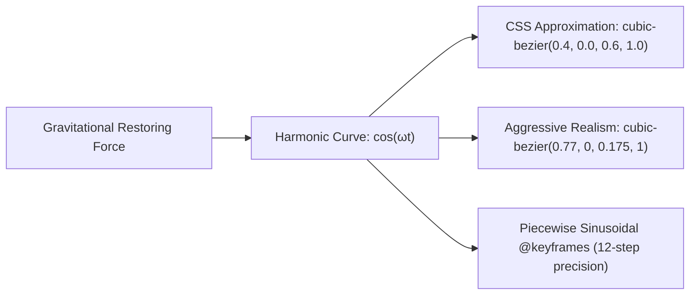
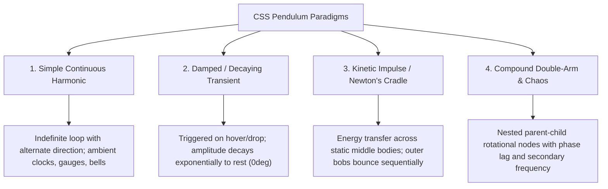

# 070: CSS Pendulum Motion & Harmonic Oscillation Masterclass

## Overview & Executive Summary

In physics-informed digital interface design, static transitions often fail to convey physical weight, inertia, and tactile materiality. **Pendulum motion**—the rotational harmonic oscillation of an object suspended from a fixed fulcrum under the influence of gravity, restoring torque, and momentum—is one of the most expressive kinetic principles in interface design.

When implemented with mathematical rigor in pure CSS, pendulum motion transforms sterile UI elements (such as swinging badges, notification bells, loading spinners, skeumorphic clock escapements, interactive hanging signs, and kinetic balance cradles) into organic, tactile, and captivating components that operate at a native 60–120 FPS on the GPU compositor thread.

```
+-------------------------------------------------------------------------------+
|                      CSS PENDULUM KINEMATICS TAXONOMY                         |
|                                                                               |
|   1. Simple Harmonic          2. Damped / Decaying       3. Kinetic Transfer  |
|      (Continuous Clock)          (Spring Impact / Drop)     (Newton's Cradle) |
|            ● Fulcrum                    ● Fulcrum                  ●●●●●      |
|           / \                          /   \                       |||||      |
|          /   \                        /  .  \                      |||||      |
|         /     \                      /   .   \                    O||||       |
|        (O)   (O)                   (O)  (O)  (O)                   ||||O      |
|        θmax  -θmax                  θ0 ──> θ1 ──> 0               Impact!     |
|                                                                               |
|   4. Compound / Coupled       5. 3D Conical / Volumetric                      |
|      (Double Pendulum Arm)       (Spherical Orbital Swing)                    |
|            ● Pivot 1                    ● Fulcrum (Apex)                      |
|            │                           /                                      |
|            ● Pivot 2 (Lag)            /   _--""--_ (Elliptical Path)          |
|             \                        (  (   (O)   )  )                        |
|             (O) Bob                   `--..____..--'                          |
+-------------------------------------------------------------------------------+
```

---

## Quick Reference Metadata

| Attribute | Specification Details |
| :--- | :--- |
| **Name** | CSS Pendulum Motion & Harmonic Oscillation |
| **Category** | CSS Animations, Kinematic Physics & Spatial Transforms |
| **Difficulty** | Advanced (4/5) |
| **What it produces** | Continuous, damped, or collision-driven rotational oscillations around an arbitrary spatial fulcrum, accurately simulating gravity, angular velocity, and kinetic energy dissipation. |
| **Why it works** | The browser applies coordinate-space matrix transformations (`rotate()`, `rotate3d()`) around a declared `transform-origin` pivot, while tailored `cubic-bezier` curves or piecewise sinusoidal keyframes model the non-linear acceleration of gravitational torque. |
| **Key Properties** | `transform-origin`, `transform: rotate() / rotateZ() / rotate3d()`, `animation-timing-function`, `cubic-bezier()`, `transform-style: preserve-3d`, `perspective`, `will-change: transform`. |
| **Strict Constraints** | Pivot points must align precisely with geometric suspension anchors; timing curves must match the sinusoidal deceleration at the trajectory zeniths ($v = 0, a = a_{\max}$) and peak velocity at the nadir ($v = v_{\max}, a = 0$). |
| **Browser Baseline** | Baseline 2020+ across all modern browsers (Chromium, Firefox, Safari, Edge) for 2D/3D hardware-accelerated transforms and CSS keyframe animations. |
| **Acceptance Criteria** | Perfectly fluid 60/120 FPS animation running exclusively on the GPU compositor thread without triggering layout recalibration or paint invalidation; full accessibility support via `@media (prefers-reduced-motion)`. |

### Quick Preview

```html
<div class="pendulum-stage">
  <div class="pendulum-arm">
    <div class="pendulum-rod"></div>
    <div class="pendulum-bob"></div>
  </div>
</div>
```

```css
.pendulum-stage {
  display: flex;
  justify-content: center;
  align-items: flex-start;
  min-height: 240px;
}

.pendulum-arm {
  /* Set the fulcrum pivot at the top-center */
  transform-origin: 50% 0%;
  animation: pendulum-swing 1.8s cubic-bezier(0.4, 0, 0.6, 1) infinite alternate;
  will-change: transform;
}

.pendulum-rod {
  inline-size: 2px;
  block-size: 140px;
  margin-inline: auto;
  background: linear-gradient(180deg, #64748b, #94a3b8);
}

.pendulum-bob {
  inline-size: 32px;
  block-size: 32px;
  border-radius: 50%;
  background: radial-gradient(circle at 35% 35%, #38bdf8, #0284c7);
  box-shadow: 0 8px 16px -2px rgba(2, 132, 199, 0.4);
}

@keyframes pendulum-swing {
  0% {
    transform: rotate(35deg);
  }
  100% {
    transform: rotate(-35deg);
  }
}
```

---

## 1. Anatomy & Mathematical Mental Models

### 1.1 The Classical Pendulum Equation & The Harmonic Oscillator

In classical mechanics, a simple gravity pendulum consists of a point mass $m$ suspended by a massless string or rod of length $L$ from a frictionless pivot. When displaced by an initial angle $\theta_0$, gravity exerts a restoring torque $\tau$:

$$\tau = -m g L \sin\theta = I \frac{d^2\theta}{dt^2}$$

For small angular displacements ($\theta \ll 1 \text{ rad}$, or $\sin\theta \approx \theta$), the motion simplifies to **Simple Harmonic Motion (SHM)**:

$$\theta(t) = \theta_{\max} \cos(\omega t + \phi)$$

Where the natural angular frequency $\omega$ and oscillation period $T$ depend strictly on length $L$ and gravitational acceleration $g$:

$$\omega = \sqrt{\frac{g}{L}}, \quad T = 2\pi\sqrt{\frac{L}{g}}$$

```
                        (0, 0) Pivot / Fulcrum (transform-origin: 50% 0%)
                           ●──────────────────────────────┐
                           │\                             │
                           │ \                            │
                           │  \                           │
                           │ θ \ L (Rod Length)           │ Vertical Axis
                           │    \                         │
                           │     \                        │
                           │      \                       │
                           │       \                      │
                    -θmax  ▼        (O) Bob (Mass m)      ▼ +θmax
               Zenith 1 ◄─────────── 0 ───────────► Zenith 2
               Velocity: v = 0       Velocity: v = max  Velocity: v = 0
               Accel: a = max        Accel: a = 0       Accel: a = max
               PE = Max, KE = 0      PE = 0, KE = Max   PE = Max, KE = 0
```

#### Kinematic Velocity & Acceleration Characteristics:
1. **At the Zeniths ($\theta = \pm\theta_{\max}$)**:
   - Angular velocity is momentarily zero ($\omega = 0$).
   - Tangential acceleration is maximized ($a_t = -g\sin\theta_{\max}$).
   - The CSS timing function must reach complete momentary suspension (zero slope in the Bézier velocity curve).
2. **At the Nadir / Equilibrium ($\theta = 0^\circ$)**:
   - Angular velocity reaches absolute maximum ($\omega = \omega_{\max}$).
   - Tangential acceleration is zero ($a_t = 0$).
   - Kinetic energy is $100\%$ of total mechanical energy.

---

### 1.2 Transforming Cartesian Box Models into Polar Rotations (`transform-origin`)

By default, standard CSS box elements rotate around their geometric center (`transform-origin: 50% 50%`). If an element is rotated without altering this anchor, it spins like a propeller rather than swinging like a pendulum.

```
       DEFAULT ORIGIN (50% 50%)            PENDULUM ORIGIN (50% 0%)
           ┌───────▲───────┐                  ┌───────●───────┐  <-- Pivot (Fulcrum)
           │       │       │                  │       │       │
           │   ───(●)───   │                  │       │       │
           │   Propeller   │                  │       │       │
           │       │       │                  │       │       │
           └───────▼───────┘                  └───────(O)─────┘  <-- Bob (Mass)
           Rotates around center              Swings around top anchor
```

#### Pivot Alignment Mathematics:
To avoid subpixel clipping or visual wobble, the `transform-origin` can be specified using keywords, percentages, or exact pixel lengths:
- **`transform-origin: 50% 0%`** (or `top center`): Standard top-center suspension.
- **`transform-origin: 50% -20px`**: Suspension from an external pivot floating above the DOM container.
- **`transform-origin: calc(50% + var(--pivot-x)) var(--pivot-y)`**: Dynamic parametrically driven fulcrum for asymmetrical mechanisms.

---

### 1.3 Velocity Curves: Why Standard `ease-in-out` Is Insufficient

While browser-native `ease-in-out` creates basic acceleration and deceleration, it does not match the true sinusoidal acceleration curve of gravitational restoring torque. 



| Easing Function | Mathematical Formula / Curve | Kinematic Feel | Best Use Case |
| :--- | :--- | :--- | :--- |
| `linear` | $f(t) = t$ | Mechanical, robotic conveyer | Continuous radar or steady motor |
| `ease-in-out` | `cubic-bezier(0.42, 0, 0.58, 1)` | Mild easing, feels slightly sluggish at zenith | Basic UI toggles |
| **Harmonic Sinusoid** | **`cubic-bezier(0.4, 0, 0.6, 1)`** | Natural gravitational hang at zeniths | Continuous wall clock pendulums |
| **High-Gravity Snap** | **`cubic-bezier(0.77, 0, 0.175, 1)`** | Heavy bob, high initial tension, steep apex drop | Heavy brass grandfather clocks |
| **Decaying Exponential** | Piecewise polynomial steps | Dynamic amplitude dissipation ($e^{-\gamma t}$) | Damped impact, door knockers, dropped signs |

---

### 1.4 The 4 Pendulum Paradigms in User Interfaces



---

## 2. The 5 Core CSS Pendulum Building Blocks & Primitives

---

### Primitive 1: The Precision Pivot Anchor

The suspension point must remain mathematically anchored regardless of container resizing or dynamic padding.

```css
.pendulum-node {
  /* Establish rotation fulcrum at the exact top-center vertex */
  transform-origin: 50% 0%;
  
  /* Prevent browser text-blur and subpixel jitter during rotation */
  backface-visibility: hidden;
  transform: translateZ(0);
  will-change: transform;
}
```

---

### Primitive 2: Symmetrical Harmonic Oscillation via `animation-direction: alternate`

By pairing a one-way half-cycle keyframe (`0%` to `100%`) with `animation-direction: alternate`, the browser automatically computes the exact reverse trajectory using the mirrored timing function.

```css
@keyframes harmonic-swing {
  0% {
    transform: rotate(var(--max-angle, 28deg));
  }
  100% {
    transform: rotate(calc(var(--max-angle, 28deg) * -1));
  }
}

.harmonic-pendulum {
  --max-angle: 30deg;
  --period: 1.6s;
  
  transform-origin: 50% 0%;
  animation: harmonic-swing var(--period) cubic-bezier(0.45, 0.05, 0.55, 0.95) infinite alternate;
}
```

---

### Primitive 3: Damped Transient Oscillation (Decaying Amplitude)

When an interactive element is released (e.g., pulling a hanging shop sign or hovering a notification bell), the kinetic energy dissipates according to an exponential decay envelope $\theta(t) = \theta_0 e^{-\zeta \omega t} \cos(\omega_d t)$. In pure CSS, this is synthesized using non-alternating keyframe sequences with exponentially decreasing peak angles.

```
Angle θ
+30° ─┐
      │  /\
      │ /  \
 0° ──┼─┼───\──────/\──────────/\───────/\─────── (Equilibrium)
      │      \    /  \        /  \     /  \
-30° ─┘       \  /    \      /    \   /    \
               \/      \    /      \_/      \___ (Rest)
                        \  /
                         \/
Time t ─────────────────────────────────────────>
```

#### Damped Keyframe Implementation:
```css
@keyframes damped-decay-swing {
  0%   { transform: rotate(0deg); }
  15%  { transform: rotate(32deg); }   /* 1st Zenith: Peak displacement */
  30%  { transform: rotate(-24deg); }  /* 2nd Zenith: 75% energy remaining */
  45%  { transform: rotate(17deg); }   /* 3rd Zenith: 53% energy */
  60%  { transform: rotate(-10deg); }  /* 4th Zenith: 31% energy */
  72%  { transform: rotate(6deg); }    /* 5th Zenith: 18% energy */
  83%  { transform: rotate(-3deg); }   /* 6th Zenith: 9% energy */
  92%  { transform: rotate(1.2deg); }  /* 7th Zenith: 3% energy */
  100% { transform: rotate(0deg); }    /* Absolute Rest */
}

.interactive-damped-bell {
  transform-origin: top center;
  animation: damped-decay-swing 2.4s cubic-bezier(0.25, 1, 0.5, 1) forwards;
}
```

---

### Primitive 4: Nested Hierarchical Oscillators (Compound & Double Pendulum)

In physical systems with flexible cords or multi-segment linkages, the bottom segment experiences **phase lag** and **secondary harmonic resonance**. CSS achieves this effortlessly by nesting child elements within parent rotation containers.

```
       Parent Arm [rotate(θ1)]
          ● Pivot 1 (50% 0%)
          │
          │ Length L1
          │
          ● Pivot 2 (50% 0% of child)
           \
            \ Child Tag [rotate(θ2)] (Length L2)
             \
             (O) Bob / Price Tag
```

```html
<div class="compound-parent">
  <div class="compound-child">
    <div class="compound-payload">Item</div>
  </div>
</div>
```

```css
.compound-parent {
  transform-origin: 50% 0%;
  animation: parent-swing 2s cubic-bezier(0.4, 0, 0.6, 1) infinite alternate;
}

.compound-child {
  transform-origin: 50% 0%;
  /* Child oscillates at a secondary frequency and phase offset */
  animation: child-lag-swing 2s cubic-bezier(0.35, 0.15, 0.45, 1.2) infinite alternate;
}

@keyframes parent-swing {
  0%   { transform: rotate(24deg); }
  100% { transform: rotate(-24deg); }
}

@keyframes child-lag-swing {
  0%   { transform: rotate(18deg); }
  100% { transform: rotate(-28deg); }
}
```

---

### Primitive 5: 3D Volumetric & Conical Pendulum (`rotate3d` & `perspective`)

A conical pendulum does not swing in a flat 2D plane; its bob traces a circular or elliptical orbit in 3D space while suspended from a fixed apex. By combining 3D perspective with dual-axis rotational keyframes, CSS delivers high-end volumetric depth.

```css
.stage-3d {
  perspective: 1000px;
  perspective-origin: 50% 20%;
}

.conical-pendulum {
  transform-style: preserve-3d;
  transform-origin: 50% 0% 0px;
  animation: conical-orbit 2.2s linear infinite;
}

@keyframes conical-orbit {
  0% {
    transform: rotateY(0deg) rotateZ(20deg);
  }
  100% {
    transform: rotateY(360deg) rotateZ(20deg);
  }
}
```

---

## 3. Comprehensive Implementation Patterns

---

### Pattern 1: The Master Grandfather Clock & Escapement Mechanism

A luxurious horological component featuring an authentic heavy brass pendulum, an escapement gear that advances in exact sync with the pendulum nadir crossing, and an ambient glassmorphic vacuum tube housing.

```
+-------------------------------------------------------------+
|             LUXURY HOROLOGICAL SKEUOMORPH STAGE             |
|                                                             |
|                    ┌───────────────────┐                    |
|                    │  [ 10 : 42 : 18 ] │  Chronometer Dial  |
|                    └─────────┬─────────┘                    |
|                              │                              |
|                      ▲ Escapement Gear                      |
|                     ┌┴┐ (Ticks at Nadir)                    |
|                     │ │                                     |
|                     │ │ Brass Suspension                    |
|                     │ │                                     |
|                    ( O ) Polished Heavy Bob                 |
|                   /     \                                   |
|                  ◄───────► Continuous Harmonic SHM          |
+-------------------------------------------------------------+
```

#### HTML
```html
<section class="clock-showcase" aria-labelledby="clock-title">
  <header class="showcase-header">
    <h2 id="clock-title">Precision Horological Escapement</h2>
    <p>Harmonic simple pendulum synchronized with a mechanical escapement pulse.</p>
  </header>

  <div class="clock-chassis">
    <!-- Escapement Chamber -->
    <div class="escapement-wheel" aria-hidden="true">
      <div class="wheel-spoke"></div>
      <div class="wheel-spoke"></div>
      <div class="wheel-spoke"></div>
      <div class="wheel-center"></div>
    </div>

    <!-- The Suspension & Pendulum Arm -->
    <div class="clock-pendulum-assembly">
      <div class="suspension-spring"></div>
      <div class="pendulum-shaft">
        <div class="shaft-core"></div>
        <div class="rating-nut"></div>
      </div>
      <div class="clock-bob">
        <div class="bob-core">
          <div class="bob-highlight"></div>
        </div>
      </div>
    </div>

    <!-- Volumetric Floor Shadow -->
    <div class="bob-shadow-projection" aria-hidden="true"></div>
  </div>
</section>
```

#### CSS
```css
/* ==========================================================================
   Pattern 1: Precision Grandfather Clock & Escapement
   ========================================================================== */

:root {
  --clock-period: 2s;
  --clock-max-angle: 22deg;
  --gold-primary: #f59e0b;
  --gold-sheen: #fef3c7;
  --gold-deep: #b45309;
  --brass-dark: #78350f;
  --chassis-bg: radial-gradient(circle at 50% 30%, #1e1e2d, #0d0d15);
}

.clock-showcase {
  display: flex;
  flex-direction: column;
  align-items: center;
  padding: 2.5rem 1.5rem;
  background: #09090f;
  border-radius: 24px;
  border: 1px solid rgba(255, 255, 255, 0.08);
  box-shadow: 0 30px 60px -12px rgba(0, 0, 0, 0.7);
  color: #f8fafc;
  font-family: 'Inter', system-ui, -apple-system, sans-serif;
  max-inline-size: 540px;
  margin-inline: auto;
}

.showcase-header {
  text-align: center;
  margin-block-end: 2rem;
}

.showcase-header h2 {
  font-size: 1.35rem;
  font-weight: 700;
  letter-spacing: -0.02em;
  margin: 0 0 0.5rem 0;
  background: linear-gradient(135deg, #ffffff 40%, #94a3b8);
  -webkit-background-clip: text;
  -webkit-text-fill-color: transparent;
}

.showcase-header p {
  font-size: 0.875rem;
  color: #64748b;
  margin: 0;
}

/* Clock Chassis Housing */
.clock-chassis {
  position: relative;
  inline-size: 280px;
  block-size: 380px;
  background: var(--chassis-bg);
  border-radius: 140px 140px 24px 24px;
  border: 2px solid rgba(245, 158, 11, 0.2);
  box-shadow: 
    inset 0 0 40px rgba(0, 0, 0, 0.8),
    0 20px 40px -10px rgba(0, 0, 0, 0.6),
    0 0 0 1px rgba(255, 255, 255, 0.05);
  display: flex;
  flex-direction: column;
  align-items: center;
  overflow: hidden;
}

/* Escapement Ticking Wheel */
.escapement-wheel {
  position: absolute;
  inset-block-start: 24px;
  inline-size: 52px;
  block-size: 52px;
  border-radius: 50%;
  border: 2px dashed rgba(245, 158, 11, 0.4);
  animation: escapement-tick calc(var(--clock-period) / 2) steps(1, end) infinite;
  display: grid;
  place-items: center;
}

.wheel-center {
  inline-size: 14px;
  block-size: 14px;
  border-radius: 50%;
  background: var(--gold-primary);
  box-shadow: 0 0 8px var(--gold-primary);
}

.wheel-spoke {
  position: absolute;
  inline-size: 2px;
  block-size: 100%;
  background: rgba(245, 158, 11, 0.3);
}

.wheel-spoke:nth-child(2) {
  transform: rotate(60deg);
}

.wheel-spoke:nth-child(3) {
  transform: rotate(120deg);
}

/* The Main Pendulum Assembly */
.clock-pendulum-assembly {
  position: absolute;
  inset-block-start: 48px;
  inline-size: 64px;
  block-size: 280px;
  transform-origin: 50% 0%;
  animation: clock-harmonic-swing var(--clock-period) cubic-bezier(0.4, 0, 0.6, 1) infinite alternate;
  will-change: transform;
  display: flex;
  flex-direction: column;
  align-items: center;
}

.suspension-spring {
  inline-size: 8px;
  block-size: 16px;
  background: linear-gradient(90deg, #475569, #cbd5e1, #334155);
  border-radius: 2px;
}

.pendulum-shaft {
  position: relative;
  inline-size: 4px;
  block-size: 200px;
  background: linear-gradient(90deg, var(--gold-deep), var(--gold-sheen), var(--brass-dark));
  box-shadow: 0 0 6px rgba(0, 0, 0, 0.5);
}

.rating-nut {
  position: absolute;
  inset-block-end: 0;
  inset-inline-start: 50%;
  transform: translateX(-50%);
  inline-size: 10px;
  block-size: 12px;
  background: linear-gradient(90deg, var(--gold-deep), var(--gold-primary));
  border-radius: 2px;
}

/* Polished Heavy Brass Bob */
.clock-bob {
  position: absolute;
  inset-block-end: 0;
  inline-size: 68px;
  block-size: 68px;
  border-radius: 50%;
  background: radial-gradient(circle at 35% 30%, var(--gold-sheen) 5%, var(--gold-primary) 35%, var(--gold-deep) 70%, var(--brass-dark) 100%);
  box-shadow: 
    0 12px 24px -4px rgba(0, 0, 0, 0.8),
    0 0 20px rgba(245, 158, 11, 0.25),
    inset 0 2px 4px rgba(255, 255, 255, 0.6),
    inset 0 -4px 8px rgba(0, 0, 0, 0.7);
  display: grid;
  place-items: center;
}

.bob-core {
  inline-size: 38px;
  block-size: 38px;
  border-radius: 50%;
  border: 1px solid rgba(254, 243, 199, 0.4);
  background: radial-gradient(circle at 35% 30%, rgba(255, 255, 255, 0.3), transparent 70%);
}

/* Reactive Projected Floor Shadow */
.bob-shadow-projection {
  position: absolute;
  inset-block-end: 18px;
  inline-size: 80px;
  block-size: 16px;
  background: radial-gradient(ellipse at center, rgba(0, 0, 0, 0.8) 0%, transparent 75%);
  animation: clock-shadow-shift var(--clock-period) cubic-bezier(0.4, 0, 0.6, 1) infinite alternate;
  will-change: transform, opacity;
}

/* Kinematic Keyframes */
@keyframes clock-harmonic-swing {
  0% {
    transform: rotate(var(--clock-max-angle));
  }
  100% {
    transform: rotate(calc(var(--clock-max-angle) * -1));
  }
}

@keyframes escapement-tick {
  0% {
    transform: rotate(0deg);
  }
  50% {
    transform: rotate(15deg);
  }
  100% {
    transform: rotate(30deg);
  }
}

@keyframes clock-shadow-shift {
  0% {
    transform: translateX(45px) scaleX(0.7);
    opacity: 0.35;
  }
  50% {
    transform: translateX(0px) scaleX(1.1);
    opacity: 0.85; /* Darkest and sharpest when closest to floor at nadir */
  }
  100% {
    transform: translateX(-45px) scaleX(0.7);
    opacity: 0.35;
  }
}
```

---

### Pattern 2: Newton's Cradle Kinetic Momentum & Collision Transfer

Newton's Cradle demonstrates the conservation of mechanical energy and momentum ($p = mv$). When Ball 1 collides with the static trio (Balls 2, 3, 4), momentum travels instantaneously through the lattice, causing Ball 5 to swing outward while Balls 1–4 remain immobile.

```
       STATE A: Left Swing               STATE B: Impact Transfer              STATE C: Right Swing
             ●   ● ● ● ●                         ● ● ● ● ●                         ● ● ● ●   ●
            /    │ │ │ │                         │ │ │ │ │                         │ │ │ │    \
           /     │ │ │ │                         │ │ │ │ │                         │ │ │ │     \
         (1)    (2)(3)(4)(5)                    (1)(2)(3)(4)(5)                   (1)(2)(3)(4) (5)
        Displaced  Resting                       Instant Collision                 Resting   Displaced
```

#### HTML
```html
<section class="cradle-showcase" aria-labelledby="cradle-title">
  <header class="showcase-header">
    <h2 id="cradle-title">Newton's Kinetic Energy Cradle</h2>
    <p>Momentum transfer via sequenced keyframe intervals.</p>
  </header>

  <div class="cradle-frame">
    <div class="cradle-rail top-rail"></div>
    
    <div class="cradle-string-cluster">
      <!-- Ball 1: Leftmost Impactor -->
      <div class="cradle-unit unit-left">
        <div class="bifilar-wires"></div>
        <div class="steel-sphere"><div class="specular-shine"></div></div>
      </div>

      <!-- Balls 2, 3, 4: Stationary Energy Transmitters -->
      <div class="cradle-unit unit-middle">
        <div class="bifilar-wires"></div>
        <div class="steel-sphere"><div class="specular-shine"></div></div>
      </div>
      <div class="cradle-unit unit-middle">
        <div class="bifilar-wires"></div>
        <div class="steel-sphere"><div class="specular-shine"></div></div>
      </div>
      <div class="cradle-unit unit-middle">
        <div class="bifilar-wires"></div>
        <div class="steel-sphere"><div class="specular-shine"></div></div>
      </div>

      <!-- Ball 5: Rightmost Receptor -->
      <div class="cradle-unit unit-right">
        <div class="bifilar-wires"></div>
        <div class="steel-sphere"><div class="specular-shine"></div></div>
      </div>
    </div>

    <div class="cradle-base"></div>
  </div>
</section>
```

#### CSS
```css
/* ==========================================================================
   Pattern 2: Newton's Cradle Kinetic Energy Transfer
   ========================================================================== */

:root {
  --cradle-cycle: 1.4s;
  --cradle-angle: 38deg;
  --sphere-diam: 36px;
}

.cradle-showcase {
  display: flex;
  flex-direction: column;
  align-items: center;
  padding: 2.5rem 1.5rem;
  background: #0b0f17;
  border-radius: 24px;
  border: 1px solid rgba(56, 189, 248, 0.15);
  box-shadow: 0 25px 50px -12px rgba(0, 0, 0, 0.7);
  max-inline-size: 540px;
  margin-inline: auto;
  color: #f1f5f9;
}

.cradle-frame {
  position: relative;
  inline-size: 320px;
  block-size: 260px;
  display: flex;
  flex-direction: column;
  align-items: center;
  justify-content: space-between;
}

.cradle-rail {
  inline-size: 260px;
  block-size: 8px;
  background: linear-gradient(90deg, #334155, #94a3b8 40%, #cbd5e1 50%, #94a3b8 60%, #334155);
  border-radius: 4px;
  box-shadow: 0 4px 12px rgba(0, 0, 0, 0.5);
  z-index: 2;
}

.cradle-string-cluster {
  display: flex;
  justify-content: center;
  inline-size: 100%;
  block-size: 210px;
}

.cradle-unit {
  position: relative;
  inline-size: var(--sphere-diam);
  block-size: 200px;
  transform-origin: 50% 0%;
  will-change: transform;
}

.bifilar-wires {
  inline-size: 100%;
  block-size: calc(100% - var(--sphere-diam));
  position: relative;
}

.bifilar-wires::before,
.bifilar-wires::after {
  content: '';
  position: absolute;
  inset-block-start: 0;
  inline-size: 1px;
  block-size: 100%;
  background: linear-gradient(180deg, rgba(203, 213, 225, 0.7), rgba(148, 163, 184, 0.2));
}

.bifilar-wires::before { inset-inline-start: 4px; }
.bifilar-wires::after  { inset-inline-end: 4px; }

.steel-sphere {
  inline-size: var(--sphere-diam);
  block-size: var(--sphere-diam);
  border-radius: 50%;
  background: radial-gradient(circle at 35% 30%, #ffffff 0%, #cbd5e1 20%, #64748b 55%, #1e293b 85%, #0f172a 100%);
  box-shadow: 
    0 8px 16px -2px rgba(0, 0, 0, 0.6),
    inset 0 -3px 6px rgba(0, 0, 0, 0.8),
    inset 0 2px 4px rgba(255, 255, 255, 0.9);
  position: relative;
  overflow: hidden;
}

.specular-shine {
  position: absolute;
  inset-block-start: 4px;
  inset-inline-start: 8px;
  inline-size: 10px;
  block-size: 6px;
  border-radius: 50%;
  background: rgba(255, 255, 255, 0.85);
  filter: blur(1px);
  transform: rotate(-25deg);
}

.cradle-base {
  inline-size: 280px;
  block-size: 14px;
  background: linear-gradient(180deg, #1e293b, #0f172a);
  border-radius: 6px;
  border: 1px solid rgba(255, 255, 255, 0.05);
  box-shadow: 0 10px 25px -5px rgba(0, 0, 0, 0.8);
}

/* ==========================================================================
   Newton's Cradle Sequenced Collision Timing:
   Cycle Division (T = 100%):
   0% -> 25%: Left Ball swings OUT to zenith
   25% -> 50%: Left Ball swings DOWN and impacts at 50%
   50% -> 75%: Right Ball receives energy and swings OUT to zenith
   75% -> 100%: Right Ball swings DOWN and impacts at 100% (Cycle resets)
   ========================================================================== */

.unit-left {
  animation: cradle-swing-left var(--cradle-cycle) infinite cubic-bezier(0.2, 0, 0.4, 1);
}

.unit-right {
  animation: cradle-swing-right var(--cradle-cycle) infinite cubic-bezier(0.2, 0, 0.4, 1);
}

/* Stationary Middle Balls (Micro-rebound shock absorbing at impact) */
.unit-middle {
  animation: cradle-shock-absorb var(--cradle-cycle) infinite ease;
}

@keyframes cradle-swing-left {
  0% {
    transform: rotate(0deg);
    animation-timing-function: cubic-bezier(0.2, 0, 0.3, 1);
  }
  25% {
    transform: rotate(var(--cradle-angle));
    animation-timing-function: cubic-bezier(0.7, 0, 0.8, 1);
  }
  50% {
    transform: rotate(0deg);
  }
  100% {
    transform: rotate(0deg);
  }
}

@keyframes cradle-swing-right {
  0% {
    transform: rotate(0deg);
  }
  50% {
    transform: rotate(0deg);
    animation-timing-function: cubic-bezier(0.2, 0, 0.3, 1);
  }
  75% {
    transform: rotate(calc(var(--cradle-angle) * -1));
    animation-timing-function: cubic-bezier(0.7, 0, 0.8, 1);
  }
  100% {
    transform: rotate(0deg);
  }
}

@keyframes cradle-shock-absorb {
  0%, 48%, 52%, 98%, 100% {
    transform: scale(1);
  }
  50%, 100% {
    /* Subtle horizontal compression pulse at the moment of impact */
    transform: scale(0.985, 1.015);
  }
}
```

---

### Pattern 3: Interactive Suspended Hanging Sign with Damped Inertial Decay

An interactive retail badge or boutique hanging sign suspended by dual chains. When hovered or clicked, it receives an angular impulse, swinging with realistic spring-damped decay that gradually returns to equilibrium.

```
                  ┌──────────────────────┐ Ceiling
                  ▼                      ▼
                  ⛓ Chains (Dual Pivot) ⛓
                  │                      │
                  ┌──────────────────────┐
                  │   OPEN FOR BUSINESS  │ Signboard
                  │     ★ EST. 2026 ★    │
                  └──────────────────────┘
                   \                    /
                    ◄── Damped Decay ──► (Settles smoothly to 0°)
```

#### HTML
```html
<section class="sign-showcase" aria-labelledby="sign-title">
  <header class="showcase-header">
    <h2 id="sign-title">Damped Boutique Hanging Sign</h2>
    <p>Hover or focus to apply an angular impulse with physical energy decay.</p>
  </header>

  <div class="sign-mount-rig">
    <!-- Ceiling Hooks -->
    <div class="ceiling-hook hook-left"></div>
    <div class="ceiling-hook hook-right"></div>

    <!-- The Oscillating Sign Rig -->
    <div class="hanging-sign-board" tabindex="0" role="button" aria-label="Boutique Signboard. Activate to swing.">
      <div class="suspension-chain chain-left"></div>
      <div class="suspension-chain chain-right"></div>

      <div class="board-plaque">
        <div class="plaque-bezel">
          <span class="plaque-subtitle">Artisanal Bakery</span>
          <span class="plaque-title">LA MAISON</span>
          <div class="plaque-divider">
            <span class="star-icon">★</span>
          </div>
          <span class="plaque-status">OPEN DAILY</span>
        </div>
      </div>
    </div>
  </div>
</section>
```

#### CSS
```css
/* ==========================================================================
   Pattern 3: Damped Boutique Hanging Sign
   ========================================================================== */

.sign-showcase {
  display: flex;
  flex-direction: column;
  align-items: center;
  padding: 3rem 1.5rem;
  background: #12131a;
  border-radius: 24px;
  border: 1px solid rgba(255, 255, 255, 0.08);
  max-inline-size: 540px;
  margin-inline: auto;
  color: #f8fafc;
}

.sign-mount-rig {
  position: relative;
  inline-size: 320px;
  block-size: 240px;
  display: flex;
  justify-content: center;
}

.ceiling-hook {
  position: absolute;
  inset-block-start: 0;
  inline-size: 14px;
  block-size: 14px;
  border: 3px solid #64748b;
  border-block-end: none;
  border-radius: 8px 8px 0 0;
  z-index: 3;
}

.hook-left  { inset-inline-start: 64px; }
.hook-right { inset-inline-end: 64px; }

/* The Oscillating Parent Container */
.hanging-sign-board {
  position: relative;
  inline-size: 260px;
  block-size: 200px;
  transform-origin: 50% 0%;
  cursor: pointer;
  outline: none;
  /* Default subtle idle ambient breeze */
  animation: ambient-idle-breeze 6s ease-in-out infinite alternate;
  will-change: transform;
}

/* Hover or Focus triggers aggressive impulse with realistic decay */
.hanging-sign-board:hover,
.hanging-sign-board:focus-visible {
  animation: physical-decay-swing 3.2s cubic-bezier(0.2, 0.85, 0.4, 1) forwards;
}

/* Dual Linked Chains */
.suspension-chain {
  position: absolute;
  inset-block-start: 6px;
  inline-size: 4px;
  block-size: 60px;
  background: repeating-linear-gradient(
    180deg,
    #94a3b8 0px,
    #94a3b8 6px,
    #475569 6px,
    #475569 12px
  );
  border-radius: 2px;
  box-shadow: 1px 2px 4px rgba(0, 0, 0, 0.6);
}

.chain-left  { inset-inline-start: 36px; }
.chain-right { inset-inline-end: 36px; }

/* Signboard Plaque Body */
.board-plaque {
  position: absolute;
  inset-block-start: 60px;
  inset-inline-start: 0;
  inline-size: 100%;
  block-size: 140px;
  background: linear-gradient(135deg, #2a1b12, #18100a);
  border: 3px solid #d97706;
  border-radius: 16px;
  box-shadow: 
    0 16px 32px -6px rgba(0, 0, 0, 0.8),
    inset 0 1px 1px rgba(251, 191, 36, 0.4),
    inset 0 0 20px rgba(0, 0, 0, 0.8);
  padding: 12px;
  box-sizing: border-box;
}

.plaque-bezel {
  inline-size: 100%;
  block-size: 100%;
  border: 1px dashed rgba(217, 119, 6, 0.5);
  border-radius: 10px;
  display: flex;
  flex-direction: column;
  align-items: center;
  justify-content: center;
  gap: 2px;
}

.plaque-subtitle {
  font-size: 0.65rem;
  letter-spacing: 0.25em;
  text-transform: uppercase;
  color: #fbbf24;
}

.plaque-title {
  font-family: 'Cinzel', Georgia, serif;
  font-size: 1.4rem;
  font-weight: 800;
  letter-spacing: 0.08em;
  color: #fef3c7;
  text-shadow: 0 2px 4px rgba(0, 0, 0, 0.9);
}

.plaque-divider {
  display: flex;
  align-items: center;
  inline-size: 60%;
  margin-block: 2px;
}

.plaque-divider::before,
.plaque-divider::after {
  content: '';
  flex: 1;
  block-size: 1px;
  background: rgba(217, 119, 6, 0.4);
}

.star-icon {
  font-size: 0.6rem;
  color: #fbbf24;
  padding-inline: 6px;
}

.plaque-status {
  font-size: 0.6rem;
  font-weight: 700;
  letter-spacing: 0.15em;
  color: #34d399;
}

/* ==========================================================================
   Keyframes: Damped Oscillation Envelope
   Angular sequence: +36deg -> -28deg -> +20deg -> -13deg -> +7deg -> -3deg -> 0
   ========================================================================== */

@keyframes physical-decay-swing {
  0% {
    transform: rotate(0deg);
  }
  12% {
    transform: rotate(36deg);
  }
  26% {
    transform: rotate(-28deg);
  }
  40% {
    transform: rotate(20deg);
  }
  54% {
    transform: rotate(-13deg);
  }
  68% {
    transform: rotate(7deg);
  }
  80% {
    transform: rotate(-3deg);
  }
  90% {
    transform: rotate(1deg);
  }
  100% {
    transform: rotate(0deg);
  }
}

@keyframes ambient-idle-breeze {
  0% {
    transform: rotate(2.5deg);
  }
  100% {
    transform: rotate(-2.5deg);
  }
}
```

---

### Pattern 4: Compound Double Pendulum & Kinetic Rope Tag

A double-jointed mechanical tag system (e.g., luggage tag, retail clothing label, or lanyard badge) with two articulated hinge points, displaying realistic inertia lag and secondary wave harmonics.

```
       Primary Suspension (Pivot 1)
          ●  (transform-origin: 50% 0%)
          │
          │ Primary Leather Strap [rotate(θ1)]
          │
          ●  Secondary Eyelet (Pivot 2, transform-origin: 50% 0%)
           \
            \ Acrylic Tag Body [rotate(θ2)]
             \
             ┌─────────────────┐
             │ VIP ALL ACCESS  │ (Whips dynamically with phase lag)
             └─────────────────┘
```

#### HTML
```html
<section class="compound-showcase" aria-labelledby="compound-title">
  <header class="showcase-header">
    <h2 id="compound-title">Compound Double-Arm Lanyard Tag</h2>
    <p>Hierarchical parent-child nodes exhibiting secondary resonance and phase lag.</p>
  </header>

  <div class="compound-stage">
    <!-- Primary Lanyard Arm (Joint 1) -->
    <div class="primary-strap">
      <div class="strap-leather"></div>
      
      <!-- Secondary Tag Node (Joint 2 - Nested Child) -->
      <div class="secondary-joint">
        <div class="metal-grommet"></div>
        <div class="acrylic-tag">
          <div class="tag-chip">
            <span class="chip-gold"></span>
          </div>
          <div class="tag-meta">
            <span class="tag-title">KINETIC PASS</span>
            <span class="tag-id">#9402-A</span>
          </div>
        </div>
      </div>
    </div>
  </div>
</section>
```

#### CSS
```css
/* ==========================================================================
   Pattern 4: Compound Double Pendulum
   ========================================================================== */

.compound-showcase {
  display: flex;
  flex-direction: column;
  align-items: center;
  padding: 3rem 1.5rem;
  background: #090d16;
  border-radius: 24px;
  border: 1px solid rgba(99, 102, 241, 0.2);
  max-inline-size: 540px;
  margin-inline: auto;
  color: #f8fafc;
}

.compound-stage {
  inline-size: 300px;
  block-size: 320px;
  display: flex;
  justify-content: center;
  position: relative;
}

/* Primary Arm: Root Joint */
.primary-strap {
  position: absolute;
  inset-block-start: 10px;
  inline-size: 20px;
  block-size: 110px;
  transform-origin: 50% 0%;
  animation: primary-harmonic-drive 2.4s cubic-bezier(0.42, 0, 0.58, 1) infinite alternate;
  will-change: transform;
}

.strap-leather {
  inline-size: 100%;
  block-size: 100%;
  background: linear-gradient(90deg, #1e1b4b, #3730a3, #1e1b4b);
  border-radius: 4px;
  box-shadow: 0 4px 10px rgba(0, 0, 0, 0.5);
}

/* Secondary Joint: Nested Directly Inside Primary Arm at its Base */
.secondary-joint {
  position: absolute;
  inset-block-start: 100px; /* Positioned at the bottom of the primary strap */
  inset-inline-start: 50%;
  transform: translateX(-50%);
  inline-size: 140px;
  block-size: 180px;
  transform-origin: 50% 0%; /* Rotates around the bottom of the strap */
  animation: secondary-phase-lag 2.4s cubic-bezier(0.35, 0.1, 0.3, 1.25) infinite alternate;
  will-change: transform;
  display: flex;
  flex-direction: column;
  align-items: center;
}

.metal-grommet {
  inline-size: 16px;
  block-size: 16px;
  border-radius: 50%;
  background: radial-gradient(circle at 35% 35%, #e2e8f0, #475569);
  border: 2px solid #0f172a;
  box-shadow: 0 2px 4px rgba(0, 0, 0, 0.6);
  z-index: 2;
  margin-block-end: -6px;
}

.acrylic-tag {
  inline-size: 130px;
  block-size: 160px;
  background: linear-gradient(135deg, rgba(30, 27, 75, 0.9), rgba(15, 23, 42, 0.95));
  backdrop-filter: blur(12px);
  border: 1px solid rgba(129, 140, 248, 0.3);
  border-radius: 12px;
  box-shadow: 
    0 16px 32px -4px rgba(0, 0, 0, 0.7),
    inset 0 1px 1px rgba(255, 255, 255, 0.2);
  padding: 16px 12px;
  box-sizing: border-box;
  display: flex;
  flex-direction: column;
  justify-content: space-between;
}

.tag-chip {
  inline-size: 32px;
  block-size: 24px;
  border-radius: 4px;
  background: linear-gradient(135deg, #d97706, #fbbf24);
  border: 1px solid #78350f;
  padding: 2px;
}

.chip-gold {
  display: block;
  inline-size: 100%;
  block-size: 100%;
  border: 1px dashed rgba(0, 0, 0, 0.4);
}

.tag-meta {
  display: flex;
  flex-direction: column;
}

.tag-title {
  font-size: 0.75rem;
  font-weight: 800;
  letter-spacing: 0.05em;
  color: #e0e7ff;
}

.tag-id {
  font-family: 'JetBrains Mono', monospace;
  font-size: 0.65rem;
  color: #818cf8;
}

/* ==========================================================================
   Compound Coupled Keyframes:
   Primary drives large oscillation; Secondary adds aggressive dynamic whip
   ========================================================================== */

@keyframes primary-harmonic-drive {
  0% {
    transform: rotate(26deg);
  }
  100% {
    transform: rotate(-26deg);
  }
}

@keyframes secondary-phase-lag {
  0% {
    /* Exaggerated whip at the outer zenith */
    transform: rotate(32deg);
  }
  50% {
    /* Straight alignment during maximum velocity crossing */
    transform: rotate(0deg);
  }
  100% {
    transform: rotate(-38deg);
  }
}
```

---

### Pattern 5: Interactive 3D Conical Pendulum with Volumetric Perspective & Dynamic Floor Shadow

A true spatial 3D conical pendulum where the mass traces a circular or elliptical path in three dimensions, projecting a dynamically scaling and skewing shadow onto the floor plane.

```
                    ● Fulcrum Apex (50% 0% 0px)
                   /
                  /   3D Volumetric Cone (rotateY + rotateZ)
                 /
               ( O ) Orbiting Bob
              .     .
            .  (Shadow) . Elliptical Floor Shadow Plane
              .     .
```

#### HTML
```html
<section class="conical-showcase" aria-labelledby="conical-title">
  <header class="showcase-header">
    <h2 id="conical-title">3D Conical Orbital Pendulum</h2>
    <p>Volumetric continuous spatial rotation with dynamic 2D ground shadow synthesis.</p>
  </header>

  <div class="conical-stage-3d">
    <!-- 3D Spatial Rig -->
    <div class="conical-rotator">
      <div class="conical-wire"></div>
      <div class="conical-orb">
        <div class="orb-atmosphere"></div>
      </div>
    </div>

    <!-- 2D Ground Shadow Projection -->
    <div class="conical-ground-shadow"></div>
  </div>
</section>
```

#### CSS
```css
/* ==========================================================================
   Pattern 5: 3D Volumetric Conical Pendulum
   ========================================================================== */

.conical-showcase {
  display: flex;
  flex-direction: column;
  align-items: center;
  padding: 3rem 1.5rem;
  background: radial-gradient(circle at 50% 20%, #111827, #030712);
  border-radius: 24px;
  border: 1px solid rgba(16, 185, 129, 0.15);
  max-inline-size: 540px;
  margin-inline: auto;
  color: #f8fafc;
}

.conical-stage-3d {
  position: relative;
  inline-size: 320px;
  block-size: 300px;
  perspective: 900px;
  perspective-origin: 50% 20%;
  display: flex;
  justify-content: center;
  align-items: flex-start;
}

/* 3D Rotational Container */
.conical-rotator {
  position: relative;
  inline-size: 2px;
  block-size: 200px;
  transform-style: preserve-3d;
  transform-origin: 50% 0% 0px;
  animation: conical-spin 2.2s linear infinite;
  will-change: transform;
}

.conical-wire {
  inline-size: 1px;
  block-size: 100%;
  background: linear-gradient(180deg, rgba(52, 211, 153, 0.8), rgba(16, 185, 129, 0.2));
  transform-origin: top center;
  transform: rotateZ(24deg);
}

.conical-orb {
  position: absolute;
  inset-block-end: -18px;
  inset-inline-start: -18px;
  inline-size: 36px;
  block-size: 36px;
  border-radius: 50%;
  background: radial-gradient(circle at 35% 30%, #a7f3d0, #10b981 40%, #065f46 80%, #022c22 100%);
  box-shadow: 
    0 0 20px rgba(16, 185, 129, 0.4),
    inset 0 2px 4px rgba(255, 255, 255, 0.7);
  transform: translateZ(0) rotateZ(24deg);
}

.orb-atmosphere {
  inline-size: 100%;
  block-size: 100%;
  border-radius: 50%;
  box-shadow: inset 0 0 8px rgba(255, 255, 255, 0.5);
}

/* Ground Shadow Tracing an Orbit Synchronized with the 3D Period */
.conical-ground-shadow {
  position: absolute;
  inset-block-end: 20px;
  inline-size: 40px;
  block-size: 18px;
  border-radius: 50%;
  background: radial-gradient(ellipse at center, rgba(0, 0, 0, 0.8) 0%, transparent 70%);
  filter: blur(4px);
  animation: shadow-orbit 2.2s linear infinite;
  will-change: transform, opacity;
}

/* ==========================================================================
   3D Spatial & Ground Shadow Keyframes
   ========================================================================== */

@keyframes conical-spin {
  0% {
    transform: rotateY(0deg) rotateZ(24deg);
  }
  100% {
    transform: rotateY(360deg) rotateZ(24deg);
  }
}

@keyframes shadow-orbit {
  0% {
    transform: translateX(70px) scale(0.85);
    opacity: 0.4; /* Furthest away in background */
  }
  25% {
    transform: translateX(0px) translateY(14px) scale(1.15);
    opacity: 0.9; /* Closest to viewer in foreground */
  }
  50% {
    transform: translateX(-70px) scale(0.85);
    opacity: 0.4; /* Furthest left */
  }
  75% {
    transform: translateX(0px) translateY(-14px) scale(0.7);
    opacity: 0.25; /* Farthest deep background */
  }
  100% {
    transform: translateX(70px) scale(0.85);
    opacity: 0.4;
  }
}
```

---

## 4. Physics-Accurate Keyframe Generation & Damping Decay Algorithms

When designing custom physics-based UI responses, building decaying keyframes by hand can lead to unnatural motion. Use the following mathematical formula to calculate exact angular displacements.

### 4.1 The Underdamped Decay Equation

$$\theta(t) = \theta_0 \cdot e^{-\zeta \omega_n t} \cdot \cos(\omega_d t)$$

Where:
- $\theta_0$ = Initial displacement angle (e.g. $40^\circ$).
- $\zeta$ = Damping ratio ($\zeta < 1$ for underdamped swinging).
- $\omega_n$ = Natural frequency of the pendulum.
- $\omega_d = \omega_n \sqrt{1 - \zeta^2}$ = Damped oscillation frequency.

### 4.2 Standard Damping Curve Keyframe Lookup Table

Use this standardized normalized table for a 10-step damped UI decay ($\zeta = 0.18$):

| Keyframe % | Normalized Time ($t/T$) | Amplitude Ratio | Target Angle ($\theta_0 = 40^\circ$) | Kinetic State |
| :--- | :--- | :--- | :--- | :--- |
| **0%** | $0.00$ | $0.00$ | $0.00^\circ$ | Neutral trigger |
| **12%** | $0.25$ | $+1.000$ | $+40.0^\circ$ | **1st Peak (Displacement)** |
| **27%** | $0.75$ | $-0.712$ | $-28.5^\circ$ | **2nd Peak (71% Energy)** |
| **42%** | $1.25$ | $+0.507$ | $+20.3^\circ$ | **3rd Peak (51% Energy)** |
| **56%** | $1.75$ | $-0.361$ | $-14.4^\circ$ | **4th Peak (36% Energy)** |
| **69%** | $2.25$ | $+0.257$ | $+10.3^\circ$ | **5th Peak (26% Energy)** |
| **81%** | $2.75$ | $-0.183$ | $-7.3^\circ$ | **6th Peak (18% Energy)** |
| **91%** | $3.25$ | $+0.091$ | $+3.6^\circ$ | **7th Peak (9% Energy)** |
| **97%** | $3.75$ | $-0.035$ | $-1.4^\circ$ | **8th Peak (Micro-settling)** |
| **100%** | $4.00$ | $0.000$ | $0.00^\circ$ | **Resting Equilibrium** |

---

## 5. Performance, GPU Compositing & 120 FPS Optimization

To ensure frictionless 120 FPS execution on high-refresh ProMotion and mobile displays, pendulum animations must strictly obey GPU compositor constraints.

```
+-------------------------------------------------------------------------------+
|                        CSS COMPOSITOR PIPELINE                                |
|                                                                               |
|   [DOM Mutation / Class] ──> [Recalculate Style] ──> [Layout] (SKIPPED)       |
|                                                          │                    |
|                                                          ▼                    |
|   [Composite Layers] <── [GPU Upload] <── [Paint / Raster] (SKIPPED)         |
|         │                                                                     |
|         ▼                                                                     |
|   120 FPS Hardware Matrix Multiply (transform: rotateZ)                       |
+-------------------------------------------------------------------------------+
```

### Critical Performance Rules:
1. **Never Animate Margins, Widths, or `top`/`left`**:
   - Animating `margin-left` or `top` triggers full document layout recalculation and paint invalidation on every frame.
   - **Only** animate `transform: rotate()` or `transform: rotate3d()`.
2. **Promote Layers Explicitly with `will-change`**:
   ```css
   .pendulum-arm {
     will-change: transform;
     transform: translateZ(0); /* Force independent compositor layer */
   }
   ```
3. **Subpixel Smoothing and Anti-Aliasing**:
   - Thin lines (like pendulum rods or wires) can exhibit flickering or stair-stepping (aliasing) during rotation.
   - Fix with `backface-visibility: hidden;` and `outline: 1px solid transparent;`.

---

## 6. Accessibility, Motion Sensitivities & `@media (prefers-reduced-motion)`

Continuous swinging motion is a recognized trigger for users with **vestibular disorders**, motion sickness, or cognitive processing differences. Every production pendulum system **must** provide an accessible resting state or gentle alternative.

```css
/* Accessible Motion Fallback */
@media (prefers-reduced-motion: reduce) {
  .clock-pendulum-assembly,
  .unit-left,
  .unit-right,
  .unit-middle,
  .hanging-sign-board,
  .primary-strap,
  .secondary-joint,
  .conical-rotator,
  .conical-ground-shadow,
  .bob-shadow-projection {
    /* Terminate all oscillating rotations immediately */
    animation: none !important;
    transform: rotate(0deg) !important;
  }

  /* Optional: Substitute gentle opacity pulse for active state indication */
  .escapement-wheel {
    animation: accessible-pulse 3s ease-in-out infinite alternate !important;
  }
}

@keyframes accessible-pulse {
  0%   { opacity: 0.4; }
  100% { opacity: 0.9; }
}
```

---

## 7. Common Pitfalls, Edge Cases & Debugging Solutions

### Pitfall 1: Pivot Center Drift Due to Box-Model Padding
- **Symptom**: The pendulum wobbles off-axis or drifts sideways as it swings.
- **Cause**: Unequal padding or border widths shifting the geometric center relative to `transform-origin: 50% 0%`.
- **Solution**: Set `box-sizing: border-box;` and ensure symmetrical lateral dimensions (`margin-inline: auto`).

### Pitfall 2: Stuttering or Snapping at the Trajectory Zeniths
- **Symptom**: The pendulum abruptly changes direction instead of smoothly decelerating to zero velocity.
- **Cause**: Using `ease` or `linear` timing functions instead of symmetrical `cubic-bezier` curves or `alternate` direction.
- **Solution**: Always use `animation-direction: alternate` with `cubic-bezier(0.4, 0, 0.6, 1)` or explicit sinusoidal keyframes.

### Pitfall 3: Hover Deadzone & Flashing During Movement
- **Symptom**: When attempting to hover an oscillating element, the cursor repeatedly slips off the moving body, causing rapid animation flickering.
- **Cause**: Placing the `:hover` pseudo-class directly on the moving `.pendulum-arm`.
- **Solution**: Wrap the pendulum inside a **static bounding hit-box** container and bind `:hover` to the parent:
  ```css
  /* Good: Stable static trigger container */
  .pendulum-wrapper:hover .pendulum-arm {
    animation-play-state: running;
  }
  ```

---

## 8. Interactive JavaScript Physics Controller

For dynamic applications where pendulum properties (such as length $L$, gravity $g$, or initial displacement $\theta_0$) change in real time, use this lightweight, zero-dependency controller to update CSS custom properties.

```javascript
/**
 * Interactive Pendulum Kinematics Controller
 * Calculates physical period T = 2π√(L/g) and binds live values to CSS custom properties.
 */
class PendulumPhysicsController {
  constructor(element, options = {}) {
    this.element = element;
    this.length = options.length || 180; // Length in pixels (mapped to meters)
    this.gravity = options.gravity || 9.81; // m/s^2
    this.maxAngle = options.maxAngle || 28; // Degrees
    this.scale = options.pixelMeterRatio || 100; // 100px = 1 meter
    
    this.update();
  }

  setLength(newLengthPx) {
    this.length = newLengthPx;
    this.update();
  }

  setGravity(newG) {
    this.gravity = newG;
    this.update();
  }

  setMaxAngle(newAngleDeg) {
    this.maxAngle = newAngleDeg;
    this.update();
  }

  calculatePeriod() {
    const lengthInMeters = this.length / this.scale;
    // T = 2π * sqrt(L / g)
    const periodInSeconds = 2 * Math.PI * Math.sqrt(lengthInMeters / this.gravity);
    return Math.max(0.2, periodInSeconds);
  }

  update() {
    const period = this.calculatePeriod();
    
    // Inject calculated physical constants into CSS variables
    this.element.style.setProperty('--clock-period', `${period.toFixed(3)}s`);
    this.element.style.setProperty('--clock-max-angle', `${this.maxAngle}deg`);
    this.element.style.setProperty('--pendulum-length', `${this.length}px`);
  }
}

// Example Initialization
document.addEventListener('DOMContentLoaded', () => {
  const clockEl = document.querySelector('.clock-chassis');
  if (clockEl) {
    const controller = new PendulumPhysicsController(clockEl, {
      length: 220,
      gravity: 9.81,
      maxAngle: 24
    });
    
    // Example: Dynamically adjust to Lunar Gravity (g = 1.62 m/s^2)
    // controller.setGravity(1.62);
  }
});
```

---

## 9. Master Production Checklist

Before shipping CSS pendulum animations to production, verify each requirement:

- [ ] **Pivot Integrity**: Has `transform-origin` been strictly locked to the geometric suspension vertex (`50% 0%` or calibrated offset)?
- [ ] **Zero Layout Thrashing**: Are animations exclusively utilizing `transform: rotate()` / `rotate3d()` without modifying layout properties?
- [ ] **Compositor Promotion**: Are high-frequency animated nodes isolated with `will-change: transform` and `transform: translateZ(0)`?
- [ ] **Sinusoidal Easing**: Does the velocity curve accurately simulate zero-velocity suspension at the zeniths ($v=0$) and peak velocity at the nadir?
- [ ] **Anti-Aliasing Shielding**: Are thin suspension wires and bobs protected against subpixel jitter using `backface-visibility: hidden`?
- [ ] **Accessible Reduced Motion**: Does the `@media (prefers-reduced-motion: reduce)` block cleanly settle all elements at neutral equilibrium ($0^\circ$)?
- [ ] **Hover Hit-Target Stability**: Are hover interactions attached to stable static bounding containers rather than swinging nodes?
- [ ] **Multi-Segment Synchronization**: For compound/double pendulums, are parent and child frequencies harmonically synchronized without timing drift?
