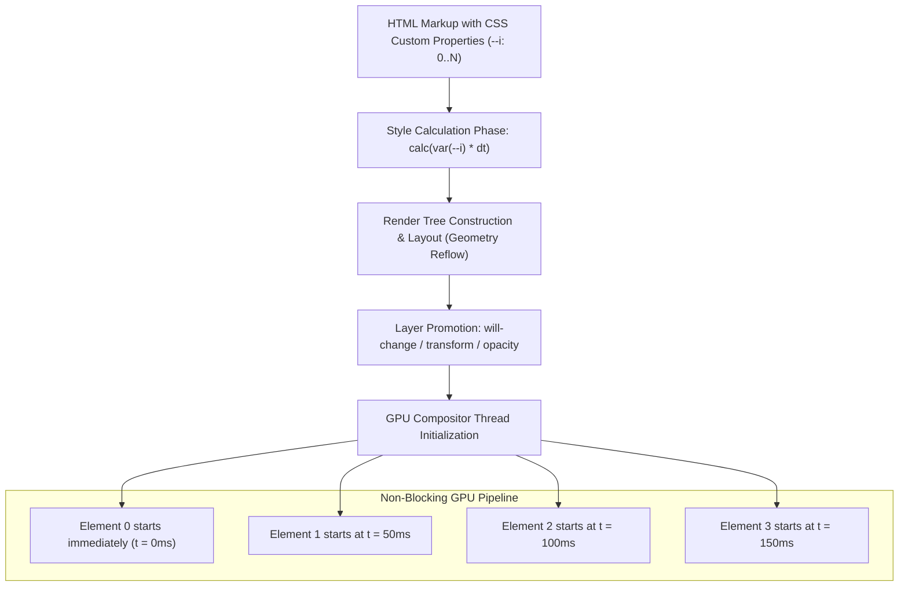

# 071: CSS Staggered Animation & Sequential Choreography Masterclass

## Overview & Executive Summary

In digital interface design, presenting multiple UI elements simultaneously—such as loading twenty cards at the exact same millisecond or opening a dropdown menu as a static block—creates visual noise and cognitive overload. The human visual cortex is hardwired to track motion; when dozens of objects move in perfect synchrony, they compete for focal attention and flatten the perceived depth and tactile quality of the interface.

**Staggered animation** (also known as *sequential choreography*, *cascading motion*, or *phase-offset sequencing*) is the deliberate temporal offsetting of transition or animation start times across a collection of related UI elements. By introducing incremental micro-delays ($\Delta t$) between sibling elements, staggered animation guides the user's gaze along a predictable visual vector, establishes clear hierarchical relationships, communicates spatial structure, and imparts a refined, organic rhythm to the interface.

When implemented with modern CSS architecture—leveraging CSS Custom Properties (`--i`, `--row`, `--col`), `calc()`, `@starting-style`, modern scroll-driven `view-timeline`, and composited GPU transforms—staggered animations execute at a locked 60–120 FPS directly on the GPU compositor thread without triggering layout reflows or main-thread bottlenecks.

```
+===============================================================================+
|                   CSS STAGGERED CHOREOGRAPHY TAXONOMY                         |
+===============================================================================+
|                                                                               |
|   1. 1D Linear Cascade              2. 2D Spatial / Diagonal Wave             |
|      (Lists, Nav Menus, Drawers)       (Product Grids, Media Galleries)       |
|      t0 ──► [ Item 1 ]                 (0,0) [Card 1] ──► [Card 2] ──► [Card 3]   |
|      t1 ────► [ Item 2 ]                       │             │            │   |
|      t2 ──────► [ Item 3 ]             (1,0) [Card 4] ──► [Card 5] ──► [Card 6]   |
|      t3 ────────► [ Item 4 ]                   │             │            │   |
|      Direction: Top -> Bottom          (2,0) [Card 7] ──► [Card 8] ──► [Card 9]   |
|      Delay: calc(var(--i) * 50ms)      Delay: calc((var(--r)+var(--c)) * 40ms)|
|                                                                               |
|   3. Hierarchical Nested Stagger    4. Continuous Phase-Shift Wave            |
|      (Parent Card -> Child Elements)   (Loading Dots, Audio Visualizers)      |
|      ┌─────────────────────────┐          ●      ●                     ●      |
|      │ 1. [Header Fade/Slide]  │         / \    / \     ●             / \     |
|      │ 2. [Image Scale-In]     │        /   \  /   \   / \           /   \    |
|      │ 3. [Badge Pop]          │       /     ●/     \ /   \         /     ●   |
|      │ 4. [CTA Button Bounce]  │      t0     t1     t2    t3       t0     t1   |
|      └─────────────────────────┘      Negative Delay: -calc(var(--i) * 150ms) |
|                                                                               |
|   5. Scroll-Driven Viewport Wave    6. Bi-Directional Reversible Cascade      |
|      (Timelines, Feed Streams)         (Enter Top->Down, Exit Down->Top)      |
|      [Viewport Top]                    ENTER: Item 1 -> Item 2 -> Item 3      |
|           │                            EXIT:  Item 3 -> Item 2 -> Item 1      |
|           ▼ (Scroll Trigger)           Dual Indexing:                         |
|      [● Node 1] (Triggered 10%)        Enter Delay: calc(var(--i) * 40ms)     |
|      [● Node 2] (Triggered 30%)        Exit Delay:  calc((var(--n)-var(--i))*40)|
+===============================================================================+
```

---

## Quick Reference Metadata

| Attribute | Specification Details |
| :--- | :--- |
| **Name** | CSS Staggered Animation & Sequential Choreography |
| **Category** | CSS Animations, Transitions, Kinematics & UI Choreography |
| **Specification** | [W3C CSS Animations Level 2](https://www.w3.org/TR/css-animations-2/), [W3C CSS Transitions Level 2](https://www.w3.org/TR/css-transitions-2/), [W3C Scroll-driven Animations](https://www.w3.org/TR/scroll-animations-1/) |
| **Difficulty** | Intermediate to Advanced (3.5 / 5) |
| **What it produces** | Harmonious, sequentially timed visual reveals, radial grid sweeps, nested component micro-choreographies, continuous looped waveforms, and scroll-linked timeline cascades. |
| **Why it works** | The browser's CSS evaluation engine calculates individual element delays at style resolution time via `calc()` arithmetic on custom properties (`--i`, `--row`, `--col`), scheduling independent animation start frames on the GPU compositor thread. |
| **Key Properties** | `animation-delay`, `transition-delay`, `calc()`, `var()`, `animation-fill-mode: both`, `@starting-style`, `view-timeline`, `animation-range`, `transform`, `opacity`, `filter`. |
| **Strict Constraints** | Total stagger choreography sequence should not exceed **600ms–800ms** to prevent user task blockage; individual step interval ($\Delta t$) must stay within **30ms–100ms**; always provide instantaneous zero-delay fallbacks for `@media (prefers-reduced-motion: reduce)`. |
| **Browser Baseline** | Baseline 2020+ across all modern evergreen browsers (Chromium, Firefox, Safari, Edge) for custom-property `calc()` staggering; Baseline 2023+ for `@starting-style` and Scroll-Driven Animations. |
| **Acceptance Criteria** | 60–120 FPS animation running on the GPU compositor thread without triggering layout reflows or paint recalculations; zero Flash of Unstyled Content (FOUC) before delay inception; strict accessibility adherence. |

### Quick Preview

```html
<ul class="stagger-list" role="list">
  <li class="stagger-item" style="--i: 0;">Alpha Release</li>
  <li class="stagger-item" style="--i: 1;">Beta Deployment</li>
  <li class="stagger-item" style="--i: 2;">Release Candidate</li>
  <li class="stagger-item" style="--i: 3;">General Availability</li>
</ul>
```

```css
:root {
  --stagger-step: 60ms;
  --stagger-base-duration: 400ms;
  --stagger-ease: cubic-bezier(0.16, 1, 0.3, 1);
}

.stagger-list {
  display: flex;
  flex-direction: column;
  gap: 0.75rem;
  list-style: none;
  padding: 0;
  margin: 0;
}

.stagger-item {
  padding: 1rem 1.25rem;
  background: #1e293b;
  color: #f8fafc;
  border-radius: 8px;
  border-left: 3px solid #38bdf8;
  
  /* The Core Stagger Engine: Index * Interval */
  animation: slide-in-fade var(--stagger-base-duration) var(--stagger-ease) both;
  animation-delay: calc(var(--i) * var(--stagger-step));
}

@keyframes slide-in-fade {
  0% {
    opacity: 0;
    transform: translateY(16px) scale(0.96);
  }
  100% {
    opacity: 1;
    transform: translateY(0) scale(1);
  }
}
```

---

## 1. Anatomy & Mathematical Mental Models

### 1.1 Temporal Sequencing & Perceptual Thresholds

Human visual perception operates with distinct psychological response boundaries. When orchestrating UI motion, understanding these temporal thresholds is critical:

```
0ms ─────── 20ms ─────── 50ms ─────── 100ms ─────── 150ms ─────── 400ms ─────── 800ms+
 │            │            │            │             │             │             │
 └─ Instant   └─ Micro-    └─ Sweet     └─ Maximum    └─ Sluggish   └─ Motion     └─ UX Barrier
    (Perceived   Stagger      Spot for     Linear        Friction      Completes     (User waits
    Simultaneous) (Dense UI)   Card/List   Stagger Step   (Feels Slow)  (Ideal Total) for UI)
```

1. **Simultaneity Threshold ($< 20\text{ms}$)**: Events occurring within 20 milliseconds are perceived by the human visual cortex as occurring simultaneously. A stagger step under $20\text{ms}$ creates an indistinct visual smear rather than a clear cascade.
2. **Optimal Stagger Step ($\Delta t = 30\text{ms} - 80\text{ms}$)**: The perceptual "Goldilocks zone." The human eye can track the direction and order of emergence effortlessly without waiting uncomfortably for the next item.
3. **Upper Interval Bound ($\Delta t > 120\text{ms}$)**: Causes the UI to feel sluggish, broken, or rate-limited.
4. **Total Sequence Budget ($T_{\text{total}} \le 600\text{ms} - 800\text{ms}$)**: The total time from the first element's departure to the final element's arrival must not exceed 800ms. If $N$ is large, $\Delta t$ must decrease or transition to logarithmic distribution.

---

### 1.2 Mathematical Stagger Formulations

The delay applied to any arbitrary element $i$ in a collection of size $N$ is determined by kinematic delay functions:

```
                            MATHEMATICAL STAGGER CURVES
Delay td
 ^
 |                                                . . . Linear: td = i * dt
 |                                            . '
 |                                        . '
 |                                    . '      _--""--_ Square Root: td = dt * sqrt(i)
 |                                . '    _--""
 |                            . '  _--""
 |                        . ' _--""
 |                    . '_-""
 |                . '-"
 |            .-'
 |        .-'
 |    .-'
 +-------------------------------------------------------------------------> Element Index (i)
 0    1    2    3    4    5    6    7    8    9    10   11   12   13   14   15
```

#### Formula 1: 1D Linear Cascade
For uniform lists, navigation links, and simple dropdowns:

$$t_d(i) = t_{\text{base}} + i \cdot \Delta t$$

Where $t_{\text{base}}$ is the initial pre-delay (e.g. waiting for a modal backdrop to fade in), $i \in \{0, 1, \dots, N-1\}$ is the zero-based element index, and $\Delta t$ is the constant step delay.

#### Formula 2: Sub-linear / Logarithmic Stagger (for Large Datasets, $N > 12$)
When displaying dozens of items, linear delay causes the 30th item to wait $30 \times 60\text{ms} = 1.8\text{s}$. Using square-root scaling compresses the tail:

$$t_d(i) = t_{\text{base}} + \Delta t \cdot \sqrt{i}$$

#### Formula 3: 2D Manhattan Matrix Wave (Grid Cascades)
In a 2D grid where each cell has coordinates $(\text{row}, \text{col})$, the wave propagates diagonally from top-left $(0,0)$ to bottom-right:

$$t_d(r, c) = (r + c) \cdot \Delta t$$

#### Formula 4: 2D Radial Euclidean Ripple (Center-Out Explosion)
To ripple outwards from a focal center coordinate $(r_0, c_0)$:

$$t_d(r, c) = \sqrt{(r - r_0)^2 + (c - c_0)^2} \cdot \Delta t$$

#### Formula 5: Bidirectional Reversible Exit Stagger
When a menu opens, items enter top-to-bottom ($i = 0 \to N-1$). When closing, items should exit in reverse order ($i = N-1 \to 0$) so the user's attention returns naturally to the trigger:

$$t_{d,\text{enter}}(i) = i \cdot \Delta t$$

$$t_{d,\text{exit}}(i) = (N - 1 - i) \cdot \Delta t$$

---

### 1.3 CSS Engine & Compositor Scheduling



#### Why `animation-fill-mode: both` Is Mandatory
Without `animation-fill-mode: both` (or `backface-visibility: hidden` with initial zero opacity), an element with `animation-delay: 200ms` will render in its default static CSS state during that 200ms window, and then abruptly snap to the `0%` keyframe state when the delay expires, causing an unsightly visual flicker (FOUC).

```css
/* CORRECT: Element immediately assumes 0% keyframe state during delay */
.stagger-item {
  animation: my-reveal 500ms ease-out both;
  animation-delay: calc(var(--i) * 60ms);
}
```

---

## 2. The 6 Core CSS Stagger Primitives

---

### Primitive 1: The Custom Property Index Pattern (`--i` & `calc()`)

The most versatile, modern, and clean pattern for staggered animations in standard web frameworks (React, Vue, Svelte, Astro, Vanilla JS).

```css
:root {
  --stagger-delay: 50ms;
  --stagger-duration: 450ms;
  --stagger-timing: cubic-bezier(0.2, 0.8, 0.2, 1);
}

.cascading-element {
  opacity: 0;
  transform: translateY(20px);
  
  animation-name: cascade-entrance;
  animation-duration: var(--stagger-duration);
  animation-timing-function: var(--stagger-timing);
  animation-fill-mode: forwards;
  
  /* Dynamic delay computation with default fallback */
  animation-delay: calc(var(--i, 0) * var(--stagger-delay));
}

@keyframes cascade-entrance {
  to {
    opacity: 1;
    transform: translateY(0);
  }
}
```

---

### Primitive 2: Pure CSS `:nth-child()` Fallback Matrix (Zero Inline Styles)

When working with CMS-generated markup, Markdown outputs, or legacy templates where inline styles (`style="--i: 0"`) cannot be injected, pure CSS `:nth-child` cascading rules assign delays declaratively:

```css
.static-list > .static-item {
  animation: item-reveal 400ms cubic-bezier(0.16, 1, 0.3, 1) both;
}

/* Automated 10-tier pure CSS cascade */
.static-list > .static-item:nth-child(1)  { animation-delay: 0ms; }
.static-list > .static-item:nth-child(2)  { animation-delay: 45ms; }
.static-list > .static-item:nth-child(3)  { animation-delay: 90ms; }
.static-list > .static-item:nth-child(4)  { animation-delay: 135ms; }
.static-list > .static-item:nth-child(5)  { animation-delay: 180ms; }
.static-list > .static-item:nth-child(6)  { animation-delay: 225ms; }
.static-list > .static-item:nth-child(7)  { animation-delay: 270ms; }
.static-list > .static-item:nth-child(8)  { animation-delay: 315ms; }
.static-list > .static-item:nth-child(9)  { animation-delay: 360ms; }
.static-list > .static-item:nth-child(10) { animation-delay: 405ms; }
/* Clamp for all subsequent items to avoid infinite delay buildup */
.static-list > .static-item:nth-child(n+11) { animation-delay: 450ms; }
```

---

### Primitive 3: 2D Spatial Coordinates (`--row` & `--col`)

For cards, photo galleries, and matrix displays, 2D coordinates generate multi-dimensional waves:

```css
.grid-cell {
  /* Wave propagates diagonally from (0,0) */
  animation: grid-scale-in 500ms cubic-bezier(0.34, 1.56, 0.64, 1) both;
  animation-delay: calc((var(--row, 0) + var(--col, 0)) * 50ms);
}

/* Optional Center-Out Radial Ripple */
.grid-cell-radial {
  /* Requires --dist computed relative to center (r-r0)^2 + (c-c0)^2 */
  animation-delay: calc(var(--dist, 0) * 60ms);
}

@keyframes grid-scale-in {
  0% {
    opacity: 0;
    transform: scale(0.8) translateY(24px);
  }
  100% {
    opacity: 1;
    transform: scale(1) translateY(0);
  }
}
```

---

### Primitive 4: Dual-Phase Transitions & `@starting-style`

With modern CSS Baseline 2023+, elements transitioning from `display: none` into the DOM can be animated without keyframes using native CSS transitions and `@starting-style`:

```css
.dialog-item {
  display: flex;
  opacity: 1;
  transform: translateX(0);
  transition: opacity 300ms ease, transform 400ms cubic-bezier(0.16, 1, 0.3, 1), display 400ms allow-discrete;
  transition-delay: calc(var(--i, 0) * 40ms);
}

/* Initial state before insertion into the render tree */
@starting-style {
  .dialog-item {
    opacity: 0;
    transform: translateX(-20px);
  }
}

/* Exit state when dialog closes */
.dialog-container:not([open]) .dialog-item {
  opacity: 0;
  transform: translateX(20px);
  transition-delay: calc((var(--total, 5) - var(--i, 0)) * 30ms);
}
```

---

### Primitive 5: Modern Scroll-Driven Stagger (`animation-timeline: view()`)

Using pure CSS scroll-driven animations, elements trigger a staggered cascade automatically as their container or parent section enters the viewport:

```css
@supports (animation-timeline: view()) {
  .timeline-card {
    /* Bind animation to the scroll position of the viewport */
    animation: scroll-fade-in linear both;
    animation-timeline: view();
    animation-range: entry 15% cover 35%;
    
    /* Additional micro-stagger based on child index */
    animation-delay: calc(var(--i) * 30ms);
  }

  @keyframes scroll-fade-in {
    0% {
      opacity: 0;
      transform: translateY(40px) scale(0.94);
    }
    100% {
      opacity: 1;
      transform: translateY(0) scale(1);
    }
  }
}
```

---

### Primitive 6: Continuous Looping Waveforms (The Negative Delay Phase Shift)

To create continuous ambient animations (such as audio equalizers, loader dots, or pulsing status rings) where all elements are in motion upon page load without waiting for initial delays to tick down, use **negative animation delays**:

```css
.wave-bar {
  animation: equalize 1.2s ease-in-out infinite alternate;
  /* Negative delay starts the animation mid-cycle immediately */
  animation-delay: calc(var(--i) * -160ms);
}

@keyframes equalize {
  0% {
    transform: scaleY(0.2);
  }
  100% {
    transform: scaleY(1);
  }
}
```

---

## 3. Comprehensive Implementation Patterns

---

### Pattern 1: E-Commerce Product Catalog Grid with 2D Wave Entry & Internal Card Stagger

A high-converting e-commerce product grid featuring a 2D diagonal matrix reveal upon container load, accompanied by a nested internal component choreography (image reveal $\to$ badge slide $\to$ title $\to$ price $\to$ star ratings $\to$ CTA button).

```
+-------------------------------------------------------------------------------+
|             2D MATRIX STAGGER WITH NESTED INTERNAL CHOREOGRAPHY               |
|                                                                               |
|   (r:0, c:0) Card 1 [t=0ms]        (r:0, c:1) Card 2 [t=45ms]                 |
|   ┌───────────────────────────┐    ┌───────────────────────────┐              |
|   │ 1. [Image Scale-In]       │    │ 1. [Image Scale-In]       │              |
|   │ 2. [Badge Slide-Down]     │    │ 2. [Badge Slide-Down]     │              |
|   │ 3. [Title Fade-Up]        │    │ 3. [Title Fade-Up]        │              |
|   │ 4. [Price Tag Pop]        │    │ 4. [Price Tag Pop]        │              |
|   │ 5. [Star Rating ★★★★★]    │    │ 5. [Star Rating ★★★★★]    │              |
|   │ 6. [Add to Cart Button]   │    │ 6. [Add to Cart Button]   │              |
|   └───────────────────────────┘    └───────────────────────────┘              |
|                                                                               |
|   (r:1, c:0) Card 3 [t=45ms]       (r:1, c:1) Card 4 [t=90ms]                 |
|   ┌───────────────────────────┐    ┌───────────────────────────┐              |
|   │   Diagonal Wave Front     │    │   Diagonal Wave Front     │              |
|   └───────────────────────────┘    └───────────────────────────┘              |
+-------------------------------------------------------------------------------+
```

#### HTML
```html
<section class="catalog-section" aria-labelledby="catalog-heading">
  <div class="catalog-header">
    <span class="catalog-eyebrow">Curated Hardware</span>
    <h2 id="catalog-heading">Next-Gen Audio Monitors</h2>
    <p>Spatial audio mastering monitors engineered with pure beryllium transducers.</p>
  </div>

  <div class="product-grid" role="list">
    <!-- Card 1: Row 0, Col 0 -->
    <article class="product-card" style="--row: 0; --col: 0;" role="listitem">
      <div class="card-media-wrapper">
        <div class="card-badge" style="--sub-i: 1;">Studio Reference</div>
        <div class="card-visual visual-1" style="--sub-i: 0;">
          <div class="driver-cone"></div>
        </div>
      </div>
      <div class="card-content">
        <div class="card-category" style="--sub-i: 2;">Mastering Series</div>
        <h3 class="card-title" style="--sub-i: 3;">Aether Monitor X-1</h3>
        <div class="card-rating" style="--sub-i: 4;" aria-label="5 out of 5 stars">
          <span class="star">★</span><span class="star">★</span><span class="star">★</span><span class="star">★</span><span class="star">★</span>
          <span class="rating-count">(128)</span>
        </div>
        <div class="card-footer" style="--sub-i: 5;">
          <div class="price-block">
            <span class="currency">$</span><span class="amount">1,499</span>
          </div>
          <button class="cart-btn" aria-label="Add Aether Monitor X-1 to cart">
            <span>Add to Cart</span>
          </button>
        </div>
      </div>
    </article>

    <!-- Card 2: Row 0, Col 1 -->
    <article class="product-card" style="--row: 0; --col: 1;" role="listitem">
      <div class="card-media-wrapper">
        <div class="card-badge badge-accent" style="--sub-i: 1;">New Arrival</div>
        <div class="card-visual visual-2" style="--sub-i: 0;">
          <div class="driver-cone"></div>
        </div>
      </div>
      <div class="card-content">
        <div class="card-category" style="--sub-i: 2;">Precision Active</div>
        <h3 class="card-title" style="--sub-i: 3;">Vortex Nearfield Pro</h3>
        <div class="card-rating" style="--sub-i: 4;" aria-label="4.9 out of 5 stars">
          <span class="star">★</span><span class="star">★</span><span class="star">★</span><span class="star">★</span><span class="star">★</span>
          <span class="rating-count">(94)</span>
        </div>
        <div class="card-footer" style="--sub-i: 5;">
          <div class="price-block">
            <span class="currency">$</span><span class="amount">899</span>
          </div>
          <button class="cart-btn" aria-label="Add Vortex Nearfield Pro to cart">
            <span>Add to Cart</span>
          </button>
        </div>
      </div>
    </article>

    <!-- Card 3: Row 1, Col 0 -->
    <article class="product-card" style="--row: 1; --col: 0;" role="listitem">
      <div class="card-media-wrapper">
        <div class="card-badge" style="--sub-i: 1;">Analog Tube</div>
        <div class="card-visual visual-3" style="--sub-i: 0;">
          <div class="driver-cone"></div>
        </div>
      </div>
      <div class="card-content">
        <div class="card-category" style="--sub-i: 2;">Valve Amp Series</div>
        <h3 class="card-title" style="--sub-i: 3;">Solaria Valve 8</h3>
        <div class="card-rating" style="--sub-i: 4;" aria-label="4.8 out of 5 stars">
          <span class="star">★</span><span class="star">★</span><span class="star">★</span><span class="star">★</span><span class="star">★</span>
          <span class="rating-count">(62)</span>
        </div>
        <div class="card-footer" style="--sub-i: 5;">
          <div class="price-block">
            <span class="currency">$</span><span class="amount">2,150</span>
          </div>
          <button class="cart-btn" aria-label="Add Solaria Valve 8 to cart">
            <span>Add to Cart</span>
          </button>
        </div>
      </div>
    </article>

    <!-- Card 4: Row 1, Col 1 -->
    <article class="product-card" style="--row: 1; --col: 1;" role="listitem">
      <div class="card-media-wrapper">
        <div class="card-badge badge-limit" style="--sub-i: 1;">Limited Edition</div>
        <div class="card-visual visual-4" style="--sub-i: 0;">
          <div class="driver-cone"></div>
        </div>
      </div>
      <div class="card-content">
        <div class="card-category" style="--sub-i: 2;">DSP Flagship</div>
        <h3 class="card-title" style="--sub-i: 3;">Kronos Sub-Bass 12</h3>
        <div class="card-rating" style="--sub-i: 4;" aria-label="5 out of 5 stars">
          <span class="star">★</span><span class="star">★</span><span class="star">★</span><span class="star">★</span><span class="star">★</span>
          <span class="rating-count">(210)</span>
        </div>
        <div class="card-footer" style="--sub-i: 5;">
          <div class="price-block">
            <span class="currency">$</span><span class="amount">1,799</span>
          </div>
          <button class="cart-btn" aria-label="Add Kronos Sub-Bass 12 to cart">
            <span>Add to Cart</span>
          </button>
        </div>
      </div>
    </article>
  </div>
</section>
```

#### CSS
```css
/* ==========================================================================
   Pattern 1: E-Commerce Product Catalog 2D Staggered Matrix
   ========================================================================== */

:root {
  --grid-step: 55ms;
  --internal-step: 35ms;
  --card-duration: 600ms;
  --card-ease: cubic-bezier(0.16, 1, 0.3, 1);
  --spring-bounce: cubic-bezier(0.34, 1.56, 0.64, 1);
  
  --bg-dark: #090d16;
  --surface-card: #111827;
  --surface-card-hover: #1f293d;
  --primary-glow: #38bdf8;
  --accent-gold: #fbbf24;
  --text-main: #f8fafc;
  --text-muted: #94a3b8;
  --border-subtle: rgba(255, 255, 255, 0.08);
}

.catalog-section {
  max-inline-size: 960px;
  margin-inline: auto;
  padding: 3rem 1.5rem;
  font-family: system-ui, -apple-system, BlinkMacSystemFont, 'Segoe UI', Roboto, sans-serif;
  color: var(--text-main);
}

.catalog-header {
  margin-block-end: 2.5rem;
  text-align: center;
}

.catalog-eyebrow {
  display: inline-block;
  font-size: 0.75rem;
  font-weight: 700;
  text-transform: uppercase;
  letter-spacing: 0.15em;
  color: var(--primary-glow);
  margin-block-end: 0.5rem;
}

.catalog-header h2 {
  font-size: 2rem;
  font-weight: 800;
  letter-spacing: -0.03em;
  margin: 0 0 0.75rem 0;
  background: linear-gradient(135deg, #ffffff 30%, #94a3b8);
  -webkit-background-clip: text;
  -webkit-text-fill-color: transparent;
}

.catalog-header p {
  color: var(--text-muted);
  font-size: 1rem;
  max-inline-size: 540px;
  margin-inline: auto;
}

/* The Responsive 2D Grid */
.product-grid {
  display: grid;
  grid-template-columns: repeat(auto-fit, minmax(280px, 1fr));
  gap: 1.5rem;
}

/* 2D Matrix Stagger Formulation */
.product-card {
  position: relative;
  background: var(--surface-card);
  border-radius: 16px;
  border: 1px solid var(--border-subtle);
  overflow: hidden;
  display: flex;
  flex-direction: column;
  box-shadow: 0 20px 40px -15px rgba(0, 0, 0, 0.5);
  transition: transform 300ms var(--card-ease), border-color 300ms ease, box-shadow 300ms ease;
  
  /* Primary Card Entry Animation */
  animation: card-2d-matrix-enter var(--card-duration) var(--card-ease) both;
  animation-delay: calc((var(--row) + var(--col)) * var(--grid-step));
  will-change: transform, opacity;
}

.product-card:hover {
  transform: translateY(-6px) scale(1.01);
  border-color: rgba(56, 189, 248, 0.4);
  box-shadow: 0 30px 60px -20px rgba(56, 189, 248, 0.25);
}

@keyframes card-2d-matrix-enter {
  0% {
    opacity: 0;
    transform: translateY(36px) scale(0.92);
  }
  100% {
    opacity: 1;
    transform: translateY(0) scale(1);
  }
}

/* Media Chamber with Generative Visual */
.card-media-wrapper {
  position: relative;
  block-size: 200px;
  background: radial-gradient(circle at 50% 50%, #1e293b, #0f172a);
  overflow: hidden;
  display: grid;
  place-items: center;
}

.card-visual {
  inline-size: 100px;
  block-size: 100px;
  border-radius: 50%;
  background: radial-gradient(circle at 35% 35%, #334155, #0f172a);
  border: 4px solid rgba(255, 255, 255, 0.1);
  box-shadow: inset 0 0 20px rgba(0, 0, 0, 0.8), 0 10px 20px rgba(0, 0, 0, 0.4);
  display: grid;
  place-items: center;
  
  /* Internal Stagger Layer 0 */
  animation: visual-zoom 700ms var(--spring-bounce) both;
  animation-delay: calc(((var(--row) + var(--col)) * var(--grid-step)) + (var(--sub-i) * var(--internal-step)));
}

.driver-cone {
  inline-size: 40px;
  block-size: 40px;
  border-radius: 50%;
  background: radial-gradient(circle at 40% 40%, var(--primary-glow), #0284c7);
  box-shadow: 0 0 15px rgba(56, 189, 248, 0.5);
}

@keyframes visual-zoom {
  0% {
    opacity: 0;
    transform: scale(0.5) rotate(-15deg);
  }
  100% {
    opacity: 1;
    transform: scale(1) rotate(0deg);
  }
}

/* Floating Badge */
.card-badge {
  position: absolute;
  inset-block-start: 12px;
  inset-inline-start: 12px;
  font-size: 0.7rem;
  font-weight: 700;
  text-transform: uppercase;
  letter-spacing: 0.05em;
  padding: 0.35rem 0.65rem;
  border-radius: 6px;
  background: rgba(15, 23, 42, 0.85);
  backdrop-filter: blur(8px);
  border: 1px solid rgba(255, 255, 255, 0.12);
  color: var(--primary-glow);
  z-index: 2;
  
  /* Internal Stagger Layer 1 */
  animation: badge-drop 450ms var(--card-ease) both;
  animation-delay: calc(((var(--row) + var(--col)) * var(--grid-step)) + (var(--sub-i) * var(--internal-step)));
}

.badge-accent {
  color: #34d399;
  border-color: rgba(52, 211, 153, 0.3);
}

.badge-limit {
  color: var(--accent-gold);
  border-color: rgba(251, 191, 36, 0.3);
}

@keyframes badge-drop {
  0% {
    opacity: 0;
    transform: translateY(-12px);
  }
  100% {
    opacity: 1;
    transform: translateY(0);
  }
}

/* Content Details Stagger Cascade */
.card-content {
  padding: 1.25rem;
  display: flex;
  flex-direction: column;
  flex: 1;
}

.card-category {
  font-size: 0.75rem;
  color: var(--text-muted);
  text-transform: uppercase;
  letter-spacing: 0.05em;
  margin-block-end: 0.25rem;
  
  animation: element-fade-up 450ms var(--card-ease) both;
  animation-delay: calc(((var(--row) + var(--col)) * var(--grid-step)) + (var(--sub-i) * var(--internal-step)));
}

.card-title {
  font-size: 1.15rem;
  font-weight: 700;
  margin: 0 0 0.5rem 0;
  color: var(--text-main);
  
  animation: element-fade-up 450ms var(--card-ease) both;
  animation-delay: calc(((var(--row) + var(--col)) * var(--grid-step)) + (var(--sub-i) * var(--internal-step)));
}

.card-rating {
  display: flex;
  align-items: center;
  gap: 0.2rem;
  color: var(--accent-gold);
  font-size: 0.85rem;
  margin-block-end: 1rem;
  
  animation: element-fade-up 450ms var(--card-ease) both;
  animation-delay: calc(((var(--row) + var(--col)) * var(--grid-step)) + (var(--sub-i) * var(--internal-step)));
}

.rating-count {
  color: var(--text-muted);
  font-size: 0.75rem;
  margin-inline-start: 0.35rem;
}

.card-footer {
  display: flex;
  align-items: center;
  justify-content: space-between;
  margin-block-start: auto;
  padding-block-start: 1rem;
  border-block-start: 1px solid var(--border-subtle);
  
  animation: element-fade-up 450ms var(--card-ease) both;
  animation-delay: calc(((var(--row) + var(--col)) * var(--grid-step)) + (var(--sub-i) * var(--internal-step)));
}

.price-block {
  display: flex;
  align-items: baseline;
  color: var(--text-main);
}

.currency {
  font-size: 0.9rem;
  font-weight: 600;
  color: var(--primary-glow);
}

.amount {
  font-size: 1.35rem;
  font-weight: 800;
  letter-spacing: -0.02em;
}

.cart-btn {
  background: linear-gradient(135deg, #0284c7, #0369a1);
  color: white;
  border: none;
  padding: 0.6rem 1rem;
  border-radius: 8px;
  font-size: 0.85rem;
  font-weight: 600;
  cursor: pointer;
  box-shadow: 0 4px 12px rgba(2, 132, 199, 0.3);
  transition: transform 200ms var(--spring-bounce), box-shadow 200ms ease, background 200ms ease;
}

.cart-btn:hover {
  transform: scale(1.05);
  background: linear-gradient(135deg, #0369a1, #0284c7);
  box-shadow: 0 6px 18px rgba(56, 189, 248, 0.4);
}

.cart-btn:active {
  transform: scale(0.96);
}

@keyframes element-fade-up {
  0% {
    opacity: 0;
    transform: translateY(12px);
  }
  100% {
    opacity: 1;
    transform: translateY(0);
  }
}
```

---

### Pattern 2: Interactive Glassmorphic Navigation Menu & Command Palette with Bi-Directional Stagger

An ultra-responsive keyboard command palette and navigational overlay with bi-directional choreography: entering elements cascade smoothly downwards with spring physics, and exiting elements collapse in reverse order.

```
+-------------------------------------------------------------------------------+
|               COMMAND PALETTE WITH BI-DIRECTIONAL STAGGER                     |
|                                                                               |
|   ┌─────────────────────────────────────────────────────────────┐             |
|   │ 🔍 Search commands, files, actions...              [ESC]     │             |
|   └─────────────────────────────────────────────────────────────┘             |
|                                                                               |
|   ENTER SEQUENCE (Top -> Down):                                               |
|   [t=0ms]   ► Category: Developer Tools                                       |
|   [t=35ms]    ├─ ⚡ [i:0] Deploy to Production Environment     (Cmd+Shift+D)  |
|   [t=70ms]    ├─ 🧪 [i:1] Execute End-to-End Test Suite       (Cmd+T)        |
|   [t=105ms]   └─ 📦 [i:2] Purge Edge CDN Edge Cache           (Cmd+Alt+P)    |
|   [t=140ms] ► Category: System Configuration                                  |
|   [t=175ms]   ├─ 🛡️ [i:3] Rotate API Credentials & Keys       (Cmd+K, R)     |
|   [t=210ms]   └─ 📊 [i:4] Export Telemetry Diagnostics Log    (Cmd+E)        |
|                                                                               |
|   EXIT SEQUENCE (Bottom -> Up):                                               |
|   [t=0ms]   Item 4 Collapses                                                  |
|   [t=30ms]  Item 3 Collapses                                                  |
|   [t=60ms]  Item 2 Collapses ...                                              |
+-------------------------------------------------------------------------------+
```

#### HTML
```html
<div class="palette-container" id="command-palette" data-state="open">
  <div class="palette-backdrop" aria-hidden="true"></div>
  
  <div class="palette-modal" role="dialog" aria-modal="true" aria-labelledby="palette-search-label">
    <!-- Header Search Bar -->
    <div class="palette-search-bar">
      <span class="search-icon" aria-hidden="true">⚡</span>
      <input type="text" id="palette-search-input" placeholder="Type a command or search actions..." aria-label="Command search">
      <kbd class="esc-badge">ESC</kbd>
    </div>

    <!-- Staggered Command Group 1 -->
    <div class="command-group">
      <div class="group-label" style="--i: 0;">Developer Operations</div>
      
      <ul class="command-list" role="menu">
        <li class="command-item" style="--i: 1;" role="menuitem" tabindex="0">
          <div class="command-main">
            <span class="cmd-icon icon-cyan">🚀</span>
            <div class="cmd-text">
              <span class="cmd-title">Deploy to Production Cluster</span>
              <span class="cmd-desc">Trigger immutable canary release pipeline</span>
            </div>
          </div>
          <div class="cmd-shortcut"><kbd>⌘</kbd><kbd>⇧</kbd><kbd>D</kbd></div>
        </li>

        <li class="command-item" style="--i: 2;" role="menuitem" tabindex="0">
          <div class="command-main">
            <span class="cmd-icon icon-emerald">🧪</span>
            <div class="cmd-text">
              <span class="cmd-title">Run Integration Test Matrix</span>
              <span class="cmd-desc">Execute 1,420 automated unit and E2E specs</span>
            </div>
          </div>
          <div class="cmd-shortcut"><kbd>⌘</kbd><kbd>T</kbd></div>
        </li>

        <li class="command-item" style="--i: 3;" role="menuitem" tabindex="0">
          <div class="command-main">
            <span class="cmd-icon icon-amber">🧹</span>
            <div class="cmd-text">
              <span class="cmd-title">Invalidate Cloudflare Edge Cache</span>
              <span class="cmd-desc">Purge all globally cached static asset layers</span>
            </div>
          </div>
          <div class="cmd-shortcut"><kbd>⌘</kbd><kbd>⌥</kbd><kbd>P</kbd></div>
        </li>
      </ul>
    </div>

    <!-- Staggered Command Group 2 -->
    <div class="command-group">
      <div class="group-label" style="--i: 4;">Security & Governance</div>
      
      <ul class="command-list" role="menu">
        <li class="command-item" style="--i: 5;" role="menuitem" tabindex="0">
          <div class="command-main">
            <span class="cmd-icon icon-rose">🛡️</span>
            <div class="cmd-text">
              <span class="cmd-title">Rotate IAM Access Tokens</span>
              <span class="cmd-desc">Invalidate existing session tokens and re-seed</span>
            </div>
          </div>
          <div class="cmd-shortcut"><kbd>⌘</kbd><kbd>K</kbd><kbd>R</kbd></div>
        </li>

        <li class="command-item" style="--i: 6;" role="menuitem" tabindex="0">
          <div class="command-main">
            <span class="cmd-icon icon-indigo">📈</span>
            <div class="cmd-text">
              <span class="cmd-title">Stream Telemetry Profiler</span>
              <span class="cmd-desc">Connect real-time websocket to observability bus</span>
            </div>
          </div>
          <div class="cmd-shortcut"><kbd>⌘</kbd><kbd>⇧</kbd><kbd>L</kbd></div>
        </li>
      </ul>
    </div>
  </div>
</div>
```

#### CSS
```css
/* ==========================================================================
   Pattern 2: Command Palette Bi-Directional Stagger
   ========================================================================== */

:root {
  --cmd-stagger-step: 35ms;
  --cmd-total-items: 7;
  --cmd-ease-enter: cubic-bezier(0.16, 1, 0.3, 1);
  --cmd-ease-exit: cubic-bezier(0.7, 0, 0.84, 0);
  
  --palette-bg: rgba(15, 23, 42, 0.85);
  --palette-surface: rgba(30, 41, 59, 0.7);
  --palette-hover: rgba(56, 189, 248, 0.12);
  --palette-border: rgba(255, 255, 255, 0.1);
}

.palette-container {
  position: fixed;
  inset: 0;
  display: grid;
  place-items: center;
  padding: 1.5rem;
  z-index: 1000;
  font-family: system-ui, -apple-system, sans-serif;
}

.palette-backdrop {
  position: absolute;
  inset: 0;
  background: rgba(4, 7, 13, 0.75);
  backdrop-filter: blur(12px);
  opacity: 0;
  transition: opacity 300ms ease;
}

.palette-container[data-state="open"] .palette-backdrop {
  opacity: 1;
}

.palette-modal {
  position: relative;
  inline-size: 100%;
  max-inline-size: 620px;
  background: var(--palette-bg);
  border: 1px solid var(--palette-border);
  border-radius: 18px;
  box-shadow: 0 25px 60px -15px rgba(0, 0, 0, 0.8), 0 0 0 1px rgba(255, 255, 255, 0.05);
  overflow: hidden;
  backdrop-filter: blur(20px);
  transform: scale(0.95) translateY(-10px);
  opacity: 0;
  transition: transform 350ms var(--cmd-ease-enter), opacity 300ms ease;
}

.palette-container[data-state="open"] .palette-modal {
  transform: scale(1) translateY(0);
  opacity: 1;
}

/* Search Bar */
.palette-search-bar {
  display: flex;
  align-items: center;
  gap: 0.75rem;
  padding: 1.25rem 1.5rem;
  border-block-end: 1px solid var(--palette-border);
  background: rgba(255, 255, 255, 0.02);
}

.search-icon {
  font-size: 1.25rem;
  color: #38bdf8;
}

#palette-search-input {
  flex: 1;
  background: transparent;
  border: none;
  outline: none;
  font-size: 1.05rem;
  color: #f8fafc;
}

#palette-search-input::placeholder {
  color: #64748b;
}

.esc-badge {
  font-size: 0.7rem;
  font-weight: 700;
  color: #94a3b8;
  background: rgba(255, 255, 255, 0.06);
  border: 1px solid rgba(255, 255, 255, 0.1);
  padding: 0.2rem 0.45rem;
  border-radius: 4px;
}

/* Stagger Groups */
.command-group {
  padding: 1rem 1.25rem;
}

.group-label {
  font-size: 0.7rem;
  font-weight: 700;
  text-transform: uppercase;
  letter-spacing: 0.1em;
  color: #64748b;
  margin-block-end: 0.5rem;
  padding-inline-start: 0.5rem;
  
  /* Stagger Reveal */
  opacity: 0;
  transform: translateY(-8px);
}

.palette-container[data-state="open"] .group-label {
  animation: cmd-enter-slide 400ms var(--cmd-ease-enter) both;
  animation-delay: calc(var(--i) * var(--cmd-stagger-step));
}

.command-list {
  list-style: none;
  padding: 0;
  margin: 0;
  display: flex;
  flex-direction: column;
  gap: 0.35rem;
}

/* The Staggered Command Items */
.command-item {
  display: flex;
  align-items: center;
  justify-content: space-between;
  padding: 0.75rem 0.85rem;
  border-radius: 10px;
  background: transparent;
  cursor: pointer;
  outline: none;
  border: 1px solid transparent;
  transition: background 150ms ease, border-color 150ms ease, transform 150ms ease;
  
  /* Initial State Before Open */
  opacity: 0;
  transform: translateX(-16px);
}

/* ENTER STATE: Top -> Down Cascade */
.palette-container[data-state="open"] .command-item {
  animation: cmd-enter-slide 450ms var(--cmd-ease-enter) both;
  animation-delay: calc(var(--i) * var(--cmd-stagger-step));
}

/* EXIT STATE: Reverse Bottom -> Up Collapse */
.palette-container[data-state="closing"] .command-item {
  animation: cmd-exit-slide 300ms var(--cmd-ease-exit) both;
  animation-delay: calc((var(--cmd-total-items) - var(--i)) * 25ms);
}

.command-item:hover,
.command-item:focus-visible {
  background: var(--palette-hover);
  border-color: rgba(56, 189, 248, 0.3);
  transform: translateX(4px);
}

.command-main {
  display: flex;
  align-items: center;
  gap: 0.85rem;
}

.cmd-icon {
  font-size: 1.15rem;
  inline-size: 36px;
  block-size: 36px;
  display: grid;
  place-items: center;
  border-radius: 8px;
  background: rgba(255, 255, 255, 0.04);
}

.cmd-text {
  display: flex;
  flex-direction: column;
}

.cmd-title {
  font-size: 0.92rem;
  font-weight: 600;
  color: #f1f5f9;
}

.cmd-desc {
  font-size: 0.78rem;
  color: #64748b;
}

.cmd-shortcut {
  display: flex;
  gap: 0.25rem;
}

.cmd-shortcut kbd {
  font-family: inherit;
  font-size: 0.72rem;
  font-weight: 600;
  color: #94a3b8;
  background: rgba(255, 255, 255, 0.05);
  border: 1px solid rgba(255, 255, 255, 0.1);
  padding: 0.2rem 0.4rem;
  border-radius: 4px;
}

@keyframes cmd-enter-slide {
  0% {
    opacity: 0;
    transform: translateX(-16px) scale(0.97);
  }
  100% {
    opacity: 1;
    transform: translateX(0) scale(1);
  }
}

@keyframes cmd-exit-slide {
  0% {
    opacity: 1;
    transform: translateX(0) scale(1);
  }
  100% {
    opacity: 0;
    transform: translateX(16px) scale(0.97);
  }
}
```

---

### Pattern 3: Fintech Executive Analytics Dashboard with Staggered Metrics & Bar Chart Pillars

A mission-critical financial analytics dashboard showcasing staggered KPI metric cards, a cascading data-density bar chart where column heights spring upwards sequentially from their baseline, and an animated radial gauge ring.

```
+-------------------------------------------------------------------------------+
|               FINTECH EXECUTIVE TELEMETRY DASHBOARD                           |
|                                                                               |
|   TOP KPI CARDS (Staggered Fly-In, t = i * 60ms):                             |
|   ┌──────────────────┐  ┌──────────────────┐  ┌──────────────────┐            |
|   │ 💎 Total Volume  │  │ ⚡ TPS Velocity   │  │ 🛡️ Fault Reserve │            |
|   │   $84,920,400    │  │   48,200 tx/s    │  │   99.9994%       │            |
|   └──────────────────┘  └──────────────────┘  └──────────────────┘            |
|         [Card 0]              [Card 1]              [Card 2]                  |
|                                                                               |
|   CASCADING BAR CHART (Staggered Growth from Baseline, t = i * 40ms):         |
|   100% │                                                                      |
|    80% │              █                                                       |
|    60% │        █     █     █           █                                     |
|    40% │  █     █     █     █     █     █     █     █                           |
|    20% │  █     █     █     █     █     █     █     █     █                     |
|     0% └──┴─────┴─────┴─────┴─────┴─────┴─────┴─────┴─────┴────               |
|          B0    B1    B2    B3    B4    B5    B6    B7    B8                   |
|         [t=0] [t=40] [t=80] [t=120]... (Spring ScaleY from bottom)           |
+-------------------------------------------------------------------------------+
```

#### HTML
```html
<section class="dashboard-section" aria-labelledby="dash-title">
  <header class="dash-header">
    <div>
      <h2 id="dash-title">Global Liquidity Pipeline</h2>
      <p class="dash-subtitle">Real-time throughput metrics across decentralized liquidity vaults.</p>
    </div>
    <div class="dash-badge-live">
      <span class="pulse-dot"></span> Live Stream
    </div>
  </header>

  <!-- Top Metric Cards (1D Stagger) -->
  <div class="kpi-grid">
    <div class="kpi-card" style="--i: 0;">
      <span class="kpi-label">Aggregated Volume (24h)</span>
      <div class="kpi-value-row">
        <span class="kpi-value">$84,920,400</span>
        <span class="kpi-trend trend-up">+14.2%</span>
      </div>
      <div class="kpi-bar-track"><div class="kpi-bar-fill fill-cyan" style="--fill-w: 78%;"></div></div>
    </div>

    <div class="kpi-card" style="--i: 1;">
      <span class="kpi-label">Settlement Throughput</span>
      <div class="kpi-value-row">
        <span class="kpi-value">48,200 <small>tx/s</small></span>
        <span class="kpi-trend trend-up">+8.7%</span>
      </div>
      <div class="kpi-bar-track"><div class="kpi-bar-fill fill-emerald" style="--fill-w: 92%;"></div></div>
    </div>

    <div class="kpi-card" style="--i: 2;">
      <span class="kpi-label">Vault Collateral Ratio</span>
      <div class="kpi-value-row">
        <span class="kpi-value">342.8%</span>
        <span class="kpi-trend trend-neutral">Optimal</span>
      </div>
      <div class="kpi-bar-track"><div class="kpi-bar-fill fill-indigo" style="--fill-w: 64%;"></div></div>
    </div>
  </div>

  <!-- Cascading Volume Histogram -->
  <div class="chart-container">
    <div class="chart-header">
      <h3>Hourly Settlement Velocity</h3>
      <span class="chart-timeframe">Trailing 12 Hours</span>
    </div>

    <div class="histogram-stage" role="graphics-document" aria-label="Hourly settlement bar chart">
      <!-- 12 Staggered Bars with transform-origin: bottom -->
      <div class="bar-column" style="--bar-i: 0; --h: 35%;">
        <div class="bar-pillar"></div>
        <span class="bar-tag">00:00</span>
      </div>
      <div class="bar-column" style="--bar-i: 1; --h: 52%;">
        <div class="bar-pillar"></div>
        <span class="bar-tag">01:00</span>
      </div>
      <div class="bar-column" style="--bar-i: 2; --h: 44%;">
        <div class="bar-pillar"></div>
        <span class="bar-tag">02:00</span>
      </div>
      <div class="bar-column" style="--bar-i: 3; --h: 68%;">
        <div class="bar-pillar"></div>
        <span class="bar-tag">03:00</span>
      </div>
      <div class="bar-column" style="--bar-i: 4; --h: 85%;">
        <div class="bar-pillar"></div>
        <span class="bar-tag">04:00</span>
      </div>
      <div class="bar-column" style="--bar-i: 5; --h: 92%;">
        <div class="bar-pillar highlight"></div>
        <span class="bar-tag">05:00</span>
      </div>
      <div class="bar-column" style="--bar-i: 6; --h: 76%;">
        <div class="bar-pillar"></div>
        <span class="bar-tag">06:00</span>
      </div>
      <div class="bar-column" style="--bar-i: 7; --h: 60%;">
        <div class="bar-pillar"></div>
        <span class="bar-tag">07:00</span>
      </div>
      <div class="bar-column" style="--bar-i: 8; --h: 70%;">
        <div class="bar-pillar"></div>
        <span class="bar-tag">08:00</span>
      </div>
      <div class="bar-column" style="--bar-i: 9; --h: 88%;">
        <div class="bar-pillar"></div>
        <span class="bar-tag">09:00</span>
      </div>
      <div class="bar-column" style="--bar-i: 10; --h: 95%;">
        <div class="bar-pillar highlight"></div>
        <span class="bar-tag">10:00</span>
      </div>
      <div class="bar-column" style="--bar-i: 11; --h: 80%;">
        <div class="bar-pillar"></div>
        <span class="bar-tag">11:00</span>
      </div>
    </div>
  </div>
</section>
```

#### CSS
```css
/* ==========================================================================
   Pattern 3: Fintech Analytics Dashboard Stagger
   ========================================================================== */

:root {
  --kpi-stagger-step: 70ms;
  --bar-stagger-step: 40ms;
  --spring-chart: cubic-bezier(0.34, 1.56, 0.64, 1);
  --dash-ease: cubic-bezier(0.16, 1, 0.3, 1);
  
  --dash-bg: #0b0f19;
  --card-surface: #131b2e;
  --border-card: rgba(255, 255, 255, 0.07);
}

.dashboard-section {
  max-inline-size: 940px;
  margin-inline: auto;
  padding: 2.5rem 1.5rem;
  background: var(--dash-bg);
  border-radius: 24px;
  border: 1px solid var(--border-card);
  color: #f8fafc;
  font-family: system-ui, -apple-system, sans-serif;
}

.dash-header {
  display: flex;
  justify-content: space-between;
  align-items: flex-start;
  margin-block-end: 2rem;
}

.dash-header h2 {
  font-size: 1.6rem;
  font-weight: 800;
  letter-spacing: -0.02em;
  margin: 0 0 0.35rem 0;
}

.dash-subtitle {
  color: #64748b;
  font-size: 0.9rem;
  margin: 0;
}

.dash-badge-live {
  display: flex;
  align-items: center;
  gap: 0.5rem;
  background: rgba(16, 185, 129, 0.12);
  border: 1px solid rgba(16, 185, 129, 0.3);
  color: #34d399;
  font-size: 0.75rem;
  font-weight: 700;
  padding: 0.35rem 0.75rem;
  border-radius: 9999px;
  text-transform: uppercase;
}

.pulse-dot {
  inline-size: 8px;
  block-size: 8px;
  border-radius: 50%;
  background: #34d399;
  box-shadow: 0 0 8px #34d399;
  animation: pulse-ring 1.5s ease-out infinite;
}

@keyframes pulse-ring {
  0% { transform: scale(0.9); opacity: 1; }
  100% { transform: scale(2.2); opacity: 0; }
}

/* KPI Cards 1D Stagger */
.kpi-grid {
  display: grid;
  grid-template-columns: repeat(auto-fit, minmax(260px, 1fr));
  gap: 1.25rem;
  margin-block-end: 2rem;
}

.kpi-card {
  background: var(--card-surface);
  border: 1px solid var(--border-card);
  border-radius: 16px;
  padding: 1.25rem;
  box-shadow: 0 10px 30px -10px rgba(0, 0, 0, 0.5);
  
  /* Staggered Entrance */
  animation: kpi-fly-in 550ms var(--dash-ease) both;
  animation-delay: calc(var(--i) * var(--kpi-stagger-step));
}

@keyframes kpi-fly-in {
  0% {
    opacity: 0;
    transform: translateY(24px) scale(0.95);
  }
  100% {
    opacity: 1;
    transform: translateY(0) scale(1);
  }
}

.kpi-label {
  font-size: 0.8rem;
  color: #94a3b8;
  font-weight: 500;
}

.kpi-value-row {
  display: flex;
  align-items: baseline;
  justify-content: space-between;
  margin-block: 0.5rem 1rem;
}

.kpi-value {
  font-size: 1.6rem;
  font-weight: 800;
  letter-spacing: -0.03em;
}

.kpi-value small {
  font-size: 0.85rem;
  color: #64748b;
  font-weight: 600;
}

.kpi-trend {
  font-size: 0.8rem;
  font-weight: 700;
  padding: 0.2rem 0.5rem;
  border-radius: 6px;
}

.trend-up {
  background: rgba(16, 185, 129, 0.15);
  color: #34d399;
}

.trend-neutral {
  background: rgba(56, 189, 248, 0.15);
  color: #38bdf8;
}

.kpi-bar-track {
  inline-size: 100%;
  block-size: 6px;
  background: rgba(255, 255, 255, 0.05);
  border-radius: 9999px;
  overflow: hidden;
}

.kpi-bar-fill {
  block-size: 100%;
  border-radius: 9999px;
  transform-origin: left center;
  animation: fill-grow 800ms var(--dash-ease) both;
  animation-delay: calc((var(--i) * var(--kpi-stagger-step)) + 200ms);
}

.fill-cyan { background: #38bdf8; inline-size: var(--fill-w); }
.fill-emerald { background: #34d399; inline-size: var(--fill-w); }
.fill-indigo { background: #818cf8; inline-size: var(--fill-w); }

@keyframes fill-grow {
  0% { transform: scaleX(0); }
  100% { transform: scaleX(1); }
}

/* Histogram Chart Container */
.chart-container {
  background: var(--card-surface);
  border: 1px solid var(--border-card);
  border-radius: 16px;
  padding: 1.5rem;
}

.chart-header {
  display: flex;
  justify-content: space-between;
  align-items: center;
  margin-block-end: 1.5rem;
}

.chart-header h3 {
  font-size: 1.05rem;
  font-weight: 700;
  margin: 0;
}

.chart-timeframe {
  font-size: 0.8rem;
  color: #64748b;
}

/* Staggered Baseline Pillars */
.histogram-stage {
  display: grid;
  grid-template-columns: repeat(12, 1fr);
  gap: 0.75rem;
  block-size: 220px;
  align-items: flex-end;
  padding-block-end: 1.5rem;
  border-block-end: 1px solid var(--border-card);
}

.bar-column {
  display: flex;
  flex-direction: column;
  align-items: center;
  block-size: 100%;
  justify-content: flex-end;
  position: relative;
}

.bar-pillar {
  inline-size: 100%;
  block-size: var(--h);
  background: linear-gradient(180deg, #38bdf8 0%, #0284c7 100%);
  border-radius: 6px 6px 2px 2px;
  box-shadow: 0 4px 12px rgba(2, 132, 199, 0.25);
  
  /* The Key Stagger Primitive: ScaleY from bottom anchor */
  transform-origin: 50% 100%;
  animation: bar-spring-up 750ms var(--spring-chart) both;
  animation-delay: calc(var(--bar-i) * var(--bar-stagger-step));
  will-change: transform;
}

.bar-pillar.highlight {
  background: linear-gradient(180deg, #f59e0b 0%, #d97706 100%);
  box-shadow: 0 4px 16px rgba(245, 158, 11, 0.4);
}

.bar-tag {
  position: absolute;
  inset-block-end: -1.4rem;
  font-size: 0.65rem;
  font-weight: 600;
  color: #64748b;
}

@keyframes bar-spring-up {
  0% {
    opacity: 0;
    transform: scaleY(0);
  }
  100% {
    opacity: 1;
    transform: scaleY(1);
  }
}
```

---

### Pattern 4: Dynamic Notification Stack & Real-Time Chat Feed with Looping Wave Dots

An interactive notification drawer where push alerts cascade into view with spring dampening, paired with an ambient typing indicator utilizing **negative delay phase-shifting**.

```
+-------------------------------------------------------------------------------+
|               NOTIFICATION DRAWER & CONTINUOUS WAVE INDICATOR                 |
|                                                                               |
|   NOTIFICATION FEED (Spring Damped Cascade):                                  |
|   ┌─────────────────────────────────────────────────────────────┐             |
|   │ 💎 [t=0ms] Payment Received: $450.00 from Starlight Media   │             |
|   └─────────────────────────────────────────────────────────────┘             |
|   ┌─────────────────────────────────────────────────────────────┐             |
|   │ 🛡️ [t=50ms] Security: New login from macOS Ventura, Tokyo   │             |
|   └─────────────────────────────────────────────────────────────┘             |
|   ┌─────────────────────────────────────────────────────────────┐             |
|   │ 🚀 [t=100ms] Deployment: Release v2.4.0 verified clean      │             |
|   └─────────────────────────────────────────────────────────────┘             |
|                                                                               |
|   TYPING INDICATOR WAVE (Negative Phase Shift: -calc(var(--i) * 150ms)):      |
|           ● [i:0]              ● [i:1]              ● [i:2]                   |
|         (t = 0ms)           (t = -150ms)         (t = -300ms)                 |
|        Starts Peak          Starts Mid-Rise      Starts Trough                |
|        Result: Seamless harmonic wave without startup jerkiness               |
+-------------------------------------------------------------------------------+
```

#### HTML
```html
<aside class="notification-drawer" aria-label="System Notifications">
  <div class="drawer-header">
    <h3>Activity Feed</h3>
    <span class="badge-count">3 New</span>
  </div>

  <div class="toast-stack" role="feed">
    <!-- Toast 1: Delay 0ms -->
    <div class="toast-card toast-success" style="--toast-i: 0;" role="article">
      <div class="toast-icon">💰</div>
      <div class="toast-body">
        <h4 class="toast-title">Settlement Completed</h4>
        <p class="toast-desc">Transaction #4891 cleared into treasury vault.</p>
        <time class="toast-time">Just now</time>
      </div>
      <button class="toast-close" aria-label="Dismiss notification">&times;</button>
    </div>

    <!-- Toast 2: Delay 50ms -->
    <div class="toast-card toast-warning" style="--toast-i: 1;" role="article">
      <div class="toast-icon">🔑</div>
      <div class="toast-body">
        <h4 class="toast-title">API Token Expiring</h4>
        <p class="toast-desc">Production read token expires in 4 hours.</p>
        <time class="toast-time">2m ago</time>
      </div>
      <button class="toast-close" aria-label="Dismiss notification">&times;</button>
    </div>

    <!-- Toast 3: Delay 100ms -->
    <div class="toast-card toast-info" style="--toast-i: 2;" role="article">
      <div class="toast-icon">⚡</div>
      <div class="toast-body">
        <h4 class="toast-title">Edge Node Activated</h4>
        <p class="toast-desc">Singapore AP-East gateway is now healthy.</p>
        <time class="toast-time">5m ago</time>
      </div>
      <button class="toast-close" aria-label="Dismiss notification">&times;</button>
    </div>
  </div>

  <!-- Real-Time Agent Typing Indicator (Continuous Stagger) -->
  <div class="typing-status-bar" aria-live="polite">
    <span class="agent-name">Antigravity Agent</span>
    <div class="typing-dots-wave" aria-label="Agent is typing">
      <span class="wave-dot" style="--dot-i: 0;"></span>
      <span class="wave-dot" style="--dot-i: 1;"></span>
      <span class="wave-dot" style="--dot-i: 2;"></span>
    </div>
  </div>
</aside>
```

#### CSS
```css
/* ==========================================================================
   Pattern 4: Notification Stack & Continuous Wave Dots
   ========================================================================== */

:root {
  --toast-step: 60ms;
  --toast-spring: cubic-bezier(0.34, 1.56, 0.64, 1);
  --drawer-bg: #0f172a;
}

.notification-drawer {
  inline-size: 100%;
  max-inline-size: 400px;
  background: var(--drawer-bg);
  border: 1px solid rgba(255, 255, 255, 0.08);
  border-radius: 20px;
  padding: 1.5rem;
  box-shadow: 0 20px 50px -10px rgba(0, 0, 0, 0.7);
  color: #f8fafc;
  font-family: system-ui, -apple-system, sans-serif;
  margin-inline: auto;
}

.drawer-header {
  display: flex;
  justify-content: space-between;
  align-items: center;
  margin-block-end: 1.25rem;
}

.drawer-header h3 {
  font-size: 1.1rem;
  font-weight: 700;
  margin: 0;
}

.badge-count {
  font-size: 0.75rem;
  font-weight: 700;
  background: #38bdf8;
  color: #0f172a;
  padding: 0.2rem 0.55rem;
  border-radius: 9999px;
}

.toast-stack {
  display: flex;
  flex-direction: column;
  gap: 0.85rem;
  margin-block-end: 1.5rem;
}

/* Toast Card Spring Entrance */
.toast-card {
  display: flex;
  gap: 0.85rem;
  padding: 1rem;
  background: #1e293b;
  border-radius: 12px;
  border: 1px solid rgba(255, 255, 255, 0.06);
  position: relative;
  
  /* The Staggered Spring Cascade */
  animation: toast-spring-enter 600ms var(--toast-spring) both;
  animation-delay: calc(var(--toast-i) * var(--toast-step));
  will-change: transform, opacity;
}

.toast-success { border-inline-start: 4px solid #10b981; }
.toast-warning { border-inline-start: 4px solid #f59e0b; }
.toast-info    { border-inline-start: 4px solid #38bdf8; }

.toast-icon {
  font-size: 1.25rem;
}

.toast-body {
  flex: 1;
}

.toast-title {
  font-size: 0.88rem;
  font-weight: 700;
  margin: 0 0 0.2rem 0;
}

.toast-desc {
  font-size: 0.78rem;
  color: #94a3b8;
  margin: 0 0 0.35rem 0;
  line-height: 1.4;
}

.toast-time {
  font-size: 0.7rem;
  color: #64748b;
}

.toast-close {
  background: transparent;
  border: none;
  color: #64748b;
  font-size: 1.2rem;
  cursor: pointer;
  line-height: 1;
  padding: 0;
}

.toast-close:hover {
  color: #f8fafc;
}

@keyframes toast-spring-enter {
  0% {
    opacity: 0;
    transform: translateY(20px) scale(0.92);
  }
  100% {
    opacity: 1;
    transform: translateY(0) scale(1);
  }
}

/* Typing Indicator with Continuous Negative Delay Phase Stagger */
.typing-status-bar {
  display: flex;
  align-items: center;
  justify-content: space-between;
  padding: 0.75rem 1rem;
  background: rgba(255, 255, 255, 0.03);
  border-radius: 10px;
  border: 1px solid rgba(255, 255, 255, 0.04);
}

.agent-name {
  font-size: 0.78rem;
  color: #94a3b8;
  font-weight: 600;
}

.typing-dots-wave {
  display: flex;
  align-items: center;
  gap: 0.35rem;
}

.wave-dot {
  inline-size: 6px;
  block-size: 6px;
  border-radius: 50%;
  background: #38bdf8;
  
  /* Negative delay phase-shift */
  animation: dot-wave 1.2s ease-in-out infinite alternate;
  animation-delay: calc(var(--dot-i) * -160ms);
}

@keyframes dot-wave {
  0% {
    transform: translateY(3px) scale(0.8);
    opacity: 0.4;
  }
  100% {
    transform: translateY(-4px) scale(1.2);
    opacity: 1;
    box-shadow: 0 0 6px rgba(56, 189, 248, 0.8);
  }
}
```

---

### Pattern 5: Kinetic Typography & Split-Text Cascade (3D Perspective Unveiling)

A dramatic hero headline reveal utilizing 3D perspective, rotational tumble, and character-by-character clip-path curtain unmasking.

```
+-------------------------------------------------------------------------------+
|               KINETIC 3D SPLIT-TEXT PERSPECTIVE CASCADE                       |
|                                                                               |
|   Perspective Horizon: perspective(1000px)                                    |
|                                                                               |
|   Letter 0     Letter 1     Letter 2     Letter 3     Letter 4     Letter 5   |
|   [t=0ms]      [t=30ms]     [t=60ms]     [t=90ms]     [t=120ms]    [t=150ms]  |
|      ▲            ▲            ▲            ▲            ▲            ▲       |
|     /            /            /            /            /            /        |
|    ┌───┐        ┌───┐        ┌───┐        ┌───┐        ┌───┐        ┌───┐     |
|    │ A │        │ U │        │ T │        │ O │        │ N │        │ O │ ... |
|    └───┘        └───┘        └───┘        └───┘        └───┘        └───┘     |
|   rotateX(0°)  rotateX(20°) rotateX(45°) rotateX(70°) rotateX(85°) rotateX(90°)|
+-------------------------------------------------------------------------------+
```

#### HTML
```html
<header class="hero-kinetic-stage">
  <div class="kinetic-wrapper">
    <h1 class="split-heading" aria-label="AUTONOMOUS">
      <!-- Split Characters with Indexed Stagger -->
      <span class="char-wrap" aria-hidden="true" style="--char-i: 0;"><span class="char-inner">A</span></span>
      <span class="char-wrap" aria-hidden="true" style="--char-i: 1;"><span class="char-inner">U</span></span>
      <span class="char-wrap" aria-hidden="true" style="--char-i: 2;"><span class="char-inner">T</span></span>
      <span class="char-wrap" aria-hidden="true" style="--char-i: 3;"><span class="char-inner">O</span></span>
      <span class="char-wrap" aria-hidden="true" style="--char-i: 4;"><span class="char-inner">N</span></span>
      <span class="char-wrap" aria-hidden="true" style="--char-i: 5;"><span class="char-inner">O</span></span>
      <span class="char-wrap" aria-hidden="true" style="--char-i: 6;"><span class="char-inner">M</span></span>
      <span class="char-wrap" aria-hidden="true" style="--char-i: 7;"><span class="char-inner">O</span></span>
      <span class="char-wrap" aria-hidden="true" style="--char-i: 8;"><span class="char-inner">U</span></span>
      <span class="char-wrap" aria-hidden="true" style="--char-i: 9;"><span class="char-inner">S</span></span>
    </h1>

    <p class="split-subtitle">
      <span class="word-wrap" style="--w-i: 0;"><span class="word-inner">Pioneering</span></span>
      <span class="word-wrap" style="--w-i: 1;"><span class="word-inner">deterministic</span></span>
      <span class="word-wrap" style="--w-i: 2;"><span class="word-inner">intelligence</span></span>
      <span class="word-wrap" style="--w-i: 3;"><span class="word-inner">across</span></span>
      <span class="word-wrap" style="--w-i: 4;"><span class="word-inner">distributed</span></span>
      <span class="word-wrap" style="--w-i: 5;"><span class="word-inner">networks.</span></span>
    </p>
  </div>
</header>
```

#### CSS
```css
/* ==========================================================================
   Pattern 5: Kinetic 3D Split-Text Typography Stagger
   ========================================================================== */

:root {
  --char-step: 35ms;
  --word-step: 45ms;
  --word-base-delay: 420ms;
  --kinetic-ease: cubic-bezier(0.16, 1, 0.3, 1);
}

.hero-kinetic-stage {
  min-block-size: 320px;
  display: grid;
  place-items: center;
  background: radial-gradient(circle at 50% 40%, #1e1b4b, #09090f);
  padding: 3rem 1.5rem;
  border-radius: 24px;
  border: 1px solid rgba(255, 255, 255, 0.08);
  font-family: system-ui, -apple-system, sans-serif;
  overflow: hidden;
}

.kinetic-wrapper {
  text-align: center;
  perspective: 1000px;
}

/* 3D Split Character Tumbler */
.split-heading {
  font-size: clamp(2.5rem, 8vw, 4.5rem);
  font-weight: 900;
  letter-spacing: 0.12em;
  margin: 0 0 1rem 0;
  display: flex;
  justify-content: center;
  transform-style: preserve-3d;
}

.char-wrap {
  display: inline-block;
  overflow: hidden;
  vertical-align: bottom;
}

.char-inner {
  display: inline-block;
  background: linear-gradient(180deg, #ffffff 20%, #a5b4fc 100%);
  -webkit-background-clip: text;
  -webkit-text-fill-color: transparent;
  transform-origin: 50% 100%;
  
  /* 3D Rotational Flip Stagger */
  animation: char-3d-flip 850ms var(--kinetic-ease) both;
  animation-delay: calc(var(--char-i) * var(--char-step));
  will-change: transform, opacity, filter;
}

@keyframes char-3d-flip {
  0% {
    opacity: 0;
    transform: rotateX(-90deg) translateY(40px) translateZ(-50px);
    filter: blur(12px);
  }
  100% {
    opacity: 1;
    transform: rotateX(0deg) translateY(0) translateZ(0);
    filter: blur(0px);
  }
}

/* Word-by-Word Curtain Unmask */
.split-subtitle {
  font-size: clamp(1rem, 2.5vw, 1.25rem);
  color: #94a3b8;
  display: flex;
  flex-wrap: wrap;
  justify-content: center;
  gap: 0.4rem;
  margin: 0;
}

.word-wrap {
  display: inline-block;
  overflow: hidden;
}

.word-inner {
  display: inline-block;
  animation: word-curtain-rise 600ms var(--kinetic-ease) both;
  animation-delay: calc(var(--word-base-delay) + (var(--w-i) * var(--word-step)));
}

@keyframes word-curtain-rise {
  0% {
    opacity: 0;
    transform: translateY(100%);
  }
  100% {
    opacity: 1;
    transform: translateY(0);
  }
}
```

---

### Pattern 6: Pure CSS Scroll-Driven Milestone Timeline (`view-timeline`)

A chronological engineering milestone timeline that reveals milestones sequentially as the user scrolls, featuring glowing connector lines and alternating left/right layout nodes.

```
+-------------------------------------------------------------------------------+
|               SCROLL-DRIVEN STAGGERED MILESTONE TIMELINE                      |
|                                                                               |
|   [Glowing Neon Beam: Linear Draw Down]                                       |
|                  │                                                            |
|       (Left)     ● [Milestone 1: Alpha Genesis]          (Scroll: 10% - 25%)  |
|                  │                                                            |
|                  ● [Milestone 2: Multi-Region Sharding]  (Scroll: 25% - 40%)  |
|       (Right)    │                                                            |
|                  ● [Milestone 3: Zero-Knowledge Proofs]  (Scroll: 40% - 55%)  |
|       (Left)     │                                                            |
|                  ▼                                                            |
+-------------------------------------------------------------------------------+
```

#### HTML
```html
<section class="timeline-section" aria-labelledby="timeline-title">
  <div class="timeline-header">
    <h2 id="timeline-title">Engineering Architecture Roadmap</h2>
    <p>Chronological delivery milestones across core protocol infrastructure.</p>
  </div>

  <div class="timeline-track-container">
    <!-- Glowing Central Neon Axis -->
    <div class="central-neon-axis" aria-hidden="true"></div>

    <div class="milestone-stream">
      <!-- Milestone 1 -->
      <div class="milestone-item node-left" style="--m-i: 0;">
        <div class="milestone-marker"></div>
        <article class="milestone-card">
          <span class="milestone-date">Q1 Milestone</span>
          <h3>Quantum-Resistant Hash Lattice</h3>
          <p>Implementation of Post-Quantum Cryptography (NIST FIPS 203) across all node validation handshakes.</p>
        </article>
      </div>

      <!-- Milestone 2 -->
      <div class="milestone-item node-right" style="--m-i: 1;">
        <div class="milestone-marker"></div>
        <article class="milestone-card">
          <span class="milestone-date">Q2 Milestone</span>
          <h3>Stateless Sharding Pipeline</h3>
          <p>Partitioning validation state across 1,024 concurrent execution shards with asynchronous cross-rollup messaging.</p>
        </article>
      </div>

      <!-- Milestone 3 -->
      <div class="milestone-item node-left" style="--m-i: 2;">
        <div class="milestone-marker"></div>
        <article class="milestone-card">
          <span class="milestone-date">Q3 Milestone</span>
          <h3>Hardware Zero-Knowledge Coprocessor</h3>
          <p>FPGA-accelerated recursive SNARK proof generation reaching sub-50ms finality intervals.</p>
        </article>
      </div>
    </div>
  </div>
</section>
```

#### CSS
```css
/* ==========================================================================
   Pattern 6: Scroll-Driven Staggered Timeline
   ========================================================================== */

:root {
  --timeline-ease: cubic-bezier(0.16, 1, 0.3, 1);
  --neon-cyan: #38bdf8;
  --neon-glow: rgba(56, 189, 248, 0.4);
}

.timeline-section {
  max-inline-size: 840px;
  margin-inline: auto;
  padding: 3rem 1.5rem;
  color: #f8fafc;
  font-family: system-ui, -apple-system, sans-serif;
}

.timeline-header {
  text-align: center;
  margin-block-end: 3.5rem;
}

.timeline-header h2 {
  font-size: 1.8rem;
  font-weight: 800;
  letter-spacing: -0.02em;
  margin: 0 0 0.5rem 0;
}

.timeline-header p {
  color: #94a3b8;
  margin: 0;
}

.timeline-track-container {
  position: relative;
  padding-block: 2rem;
}

/* Neon Central Axis */
.central-neon-axis {
  position: absolute;
  inset-block: 0;
  inset-inline-start: 50%;
  inline-size: 2px;
  background: linear-gradient(180deg, transparent, var(--neon-cyan) 15%, var(--neon-cyan) 85%, transparent);
  transform: translateX(-50%);
  box-shadow: 0 0 12px var(--neon-glow);
}

.milestone-stream {
  display: flex;
  flex-direction: column;
  gap: 3.5rem;
}

.milestone-item {
  position: relative;
  display: flex;
  align-items: center;
  inline-size: 50%;
}

.milestone-item.node-left {
  align-self: flex-start;
  padding-inline-end: 2.5rem;
  justify-content: flex-end;
  text-align: end;
}

.milestone-item.node-right {
  align-self: flex-end;
  padding-inline-start: 2.5rem;
  justify-content: flex-start;
  text-align: start;
}

/* Glowing Orbital Marker */
.milestone-marker {
  position: absolute;
  inset-block-start: 50%;
  inline-size: 14px;
  block-size: 14px;
  border-radius: 50%;
  background: var(--neon-cyan);
  box-shadow: 0 0 16px var(--neon-cyan);
  transform: translateY(-50%);
  z-index: 2;
}

.node-left .milestone-marker {
  inset-inline-end: -7px;
}

.node-right .milestone-marker {
  inset-inline-start: -7px;
}

/* Milestone Card */
.milestone-card {
  background: #111827;
  border: 1px solid rgba(255, 255, 255, 0.08);
  border-radius: 16px;
  padding: 1.5rem;
  box-shadow: 0 20px 40px -15px rgba(0, 0, 0, 0.6);
  max-inline-size: 340px;
}

.milestone-date {
  display: inline-block;
  font-size: 0.75rem;
  font-weight: 700;
  text-transform: uppercase;
  color: var(--neon-cyan);
  margin-block-end: 0.5rem;
}

.milestone-card h3 {
  font-size: 1.15rem;
  font-weight: 700;
  margin: 0 0 0.5rem 0;
  color: #f8fafc;
}

.milestone-card p {
  font-size: 0.85rem;
  color: #94a3b8;
  margin: 0;
  line-height: 1.5;
}

/* Modern Scroll-Driven Stagger Timeline Enhancement */
@supports (animation-timeline: view()) {
  .milestone-item {
    animation: timeline-node-reveal 500ms var(--timeline-ease) both;
    animation-timeline: view();
    animation-range: entry 20% cover 40%;
  }

  .node-left {
    animation-name: timeline-left-reveal;
  }

  .node-right {
    animation-name: timeline-right-reveal;
  }

  @keyframes timeline-left-reveal {
    0% {
      opacity: 0;
      transform: translateX(-30px) scale(0.92);
    }
    100% {
      opacity: 1;
      transform: translateX(0) scale(1);
    }
  }

  @keyframes timeline-right-reveal {
    0% {
      opacity: 0;
      transform: translateX(30px) scale(0.92);
    }
    100% {
      opacity: 1;
      transform: translateX(0) scale(1);
    }
  }
}

/* Responsive Mobile Layout */
@media (max-width: 640px) {
  .central-neon-axis {
    inset-inline-start: 18px;
    transform: none;
  }

  .milestone-item {
    inline-size: 100%;
    align-self: flex-start !important;
    padding-inline-start: 3rem !important;
    padding-inline-end: 0 !important;
    text-align: start !important;
  }

  .node-left .milestone-marker,
  .node-right .milestone-marker {
    inset-inline-start: 11px;
    inset-inline-end: auto;
  }
}
```

---

## 4. Automated Generation Algorithms & Preprocessor Tooling

### 4.1 SCSS Mixin for Automated Stagger Generators

When building enterprise design systems in SCSS, loops automatically generate classes and clamp maximum delays to avoid runaway timers:

```scss
/// Generate linear staggered delay utility classes
/// @param {Number} $count - Maximum elements to generate
/// @param {Time} $step [45ms] - Incremental delay step
/// @param {Time} $base [0ms] - Initial baseline offset
/// @param {Time} $max-clamp [600ms] - Ceiling threshold
@mixin generate-stagger($count: 20, $step: 45ms, $base: 0ms, $max-clamp: 600ms) {
  @for $i from 0 through ($count - 1) {
    $calculated-delay: $base + ($i * $step);
    
    // Clamp delay if exceeding safety threshold
    @if $calculated-delay > $max-clamp {
      $calculated-delay: $max-clamp;
    }

    &:nth-child(#{$i + 1}) {
      animation-delay: #{$calculated-delay};
    }
  }
}

.staggered-feed-item {
  animation: feed-slide-in 400ms cubic-bezier(0.16, 1, 0.3, 1) both;
  @include generate-stagger($count: 15, $step: 40ms, $base: 50ms, $max-clamp: 500ms);
}
```

---

## 5. Performance, GPU Compositing & 120 FPS Optimization

### 5.1 The Composite-Only Rule for Stagger Pipelines

Staggered animations execute multiple elements in rapid sequence. If an animated property triggers the **Layout (Reflow)** or **Paint** pipeline stages, the main thread will choke, dropping frames below 30 FPS.

```
+-------------------------------------------------------------------------------+
|                      GPU PIPELINE VS MAIN THREAD BOTTLENECK                   |
+-------------------------------------------------------------------------------+
|  ❌ REFLOW/PAINT HAZARDS (AVOID):                                             |
|     top, left, margin, width, height, padding, display, max-height            |
|     Result: Triggers recalculate style -> Reflow entire DOM -> CPU Paint     |
|                                                                               |
|  ✅ COMPOSITOR-SAFE PROPERTIES (60-120 FPS GUARANTEED):                       |
|     transform: translate3d(), scale(), rotateX/Y/Z()                          |
|     opacity: 0 -> 1                                                           |
|     filter: blur() (with moderation)                                          |
|     Result: Executed directly on GPU Layer without touching main thread       |
+-------------------------------------------------------------------------------+
```

### 5.2 Layer Explosion & `will-change` Hygiene

Applying `will-change: transform, opacity` indiscriminately across 500 staggered elements forces the GPU to allocate dedicated VRAM backing stores for each node, resulting in memory exhaustion on mobile devices.

#### Best Practice Rule:
Only promote elements that are actively animating, and release VRAM when motion concludes:

```css
/* SAFE: Target the container or apply only during entry state */
.stagger-container.is-animating .stagger-item {
  will-change: transform, opacity;
}

/* Reset layer once completed via animation end */
.stagger-container.is-complete .stagger-item {
  will-change: auto;
}
```

---

## 6. Accessibility, Motion Sensitivities & `@media (prefers-reduced-motion)`

### 6.1 Vestibular Disorders & Cognitive Overload

Rapid cascading motion can induce nausea, dizziness, or disorientation in users with vestibular system disorders. Furthermore, neurodivergent users (such as individuals with ADHD or autism) can experience acute cognitive distraction from unprompted cascading animations.

### 6.2 The Master Reduced-Motion Architecture

A robust reduced-motion fallback must **collapse all animation delays to 0s** and replace aggressive translations with clean, instant reveals or subtle fades:

```css
/* ==========================================================================
   Universal Accessible Stagger Architecture
   ========================================================================== */

@media (prefers-reduced-motion: reduce) {
  *,
  *::before,
  *::after {
    /* Collapse all staggered delays instantly */
    animation-delay: 0s !important;
    transition-delay: 0s !important;
    
    /* Shorten duration to imperceptible threshold */
    animation-duration: 0.001ms !important;
    transition-duration: 0.001ms !important;
    
    /* Prevent infinite continuous loops from distracting */
    animation-iteration-count: 1 !important;
  }

  /* Ensure elements remain fully visible and non-displaced */
  .stagger-item,
  .product-card,
  .command-item,
  .kpi-card,
  .bar-pillar,
  .char-inner,
  .milestone-item {
    opacity: 1 !important;
    transform: none !important;
    filter: none !important;
  }
}
```

---

## 7. Common Pitfalls, Edge Cases & Debugging Solutions

```
+===============================================================================+
|                   STAGGERED ANIMATION PITFALLS & SOLUTIONS                    |
+===============================================================================+
|  1. Flash of Unstyled Content (FOUC) during delay                             |
|     • Bug: Element is visible at (0,0), waits 200ms, snaps to initial offset. |
|     • Fix: Add 'animation-fill-mode: both;' to immediately apply 0% keyframe. |
|                                                                               |
|  2. Cumulative Delay Explosion on Dynamic Feeds                               |
|     • Bug: Item 50 in a list has delay = 50 * 50ms = 2.5 seconds wait.        |
|     • Fix: Clamp maximum delay with calc(min(var(--i) * 40ms, 450ms)).        |
|                                                                               |
|  3. Broken Reverse Exit Order                                                 |
|     • Bug: Menu opens top-to-bottom, but closes top-to-bottom (feels clumsy). |
|     • Fix: Exit delay = calc((var(--total) - var(--i)) * var(--step)).        |
|                                                                               |
|  4. Hover Deadzones During Stagger Delay                                      |
|     • Bug: User tries to click a staggered button while it is delaying.       |
|     • Fix: Use pointer-events: auto with instant :active overrides.           |
|                                                                               |
|  5. Responsive Breakpoint Matrix Mismatch                                     |
|     • Bug: Desktop is 3 columns, mobile is 1 column; static 2D grid breaks.   |
|     • Fix: Recalculate --col dynamically or fall back to linear 1D on mobile. |
+===============================================================================+
```

---

## 8. Interactive JavaScript Stagger Orchestrator & Utility Controller

A production-grade, zero-dependency ES6 / TypeScript utility that automatically assigns indexes, calculates 2D matrix coordinates, and handles viewport entry triggers.

```javascript
/**
 * StaggerOrchestrator.js
 * High-performance, zero-dependency staggered choreography utility.
 */
class StaggerOrchestrator {
  /**
   * Automatically assigns 1D index (--i) or 2D matrix coordinates (--row, --col)
   * to all direct children of a container.
   * 
   * @param {HTMLElement|string} container - Target container element or selector
   * @param {Object} options - Configuration options
   */
  static init(container, options = {}) {
    const el = typeof container === 'string' ? document.querySelector(container) : container;
    if (!el) return;

    const {
      mode = '1d', // '1d', '2d', or 'radial'
      staggerStep = 50,
      baseDelay = 0,
      maxClamp = 600,
      autoObserve = true
    } = options;

    const children = Array.from(el.children);
    const total = children.length;
    el.style.setProperty('--total', total);
    el.style.setProperty('--stagger-step', `${staggerStep}ms`);

    if (mode === '1d') {
      children.forEach((child, index) => {
        child.style.setProperty('--i', index);
      });
    } else if (mode === '2d' || mode === 'radial') {
      // Calculate dynamic columns based on computed CSS Grid
      const computedCols = window.getComputedStyle(el)
        .gridTemplateColumns.split(' ').length || 1;

      children.forEach((child, index) => {
        const row = Math.floor(index / computedCols);
        const col = index % computedCols;
        child.style.setProperty('--row', row);
        child.style.setProperty('--col', col);

        if (mode === 'radial') {
          const centerRow = (Math.ceil(total / computedCols) - 1) / 2;
          const centerCol = (computedCols - 1) / 2;
          const dist = Math.sqrt(Math.pow(row - centerRow, 2) + Math.pow(col - centerCol, 2));
          child.style.setProperty('--dist', dist.toFixed(2));
        }
      });
    }

    // Viewport Intersection Observer Trigger
    if (autoObserve && 'IntersectionObserver' in window) {
      const observer = new IntersectionObserver((entries) => {
        entries.forEach(entry => {
          if (entry.isIntersecting) {
            el.classList.add('is-stagger-active');
            observer.unobserve(el);
          }
        });
      }, { threshold: 0.15 });

      observer.observe(el);
    } else {
      el.classList.add('is-stagger-active');
    }
  }
}

// Auto-initialize on DOM ready
document.addEventListener('DOMContentLoaded', () => {
  document.querySelectorAll('[data-stagger]').forEach(container => {
    const mode = container.dataset.stagger || '1d';
    StaggerOrchestrator.init(container, { mode });
  });
});
```

---

## 9. Master Production Checklist

```
+===============================================================================+
|                  STAGGERED ANIMATION PRODUCTION CHECKLIST                     |
+===============================================================================+
|  MATHEMATICAL RIGOR & TIMING:                                                 |
|  [ ] Step interval (Δt) is tuned between 30ms and 80ms for optimal tracking.  |
|  [ ] Total sequence duration does not exceed 800ms across the entire set.    |
|  [ ] Large lists (N > 12) implement logarithmic decay or max-delay clamping.  |
|                                                                               |
|  CSS ARCHITECTURE & PERFORMANCE:                                              |
|  [ ] All animations operate exclusively on 'transform' and 'opacity'.         |
|  [ ] 'animation-fill-mode: both;' is applied to prevent pre-delay FOUC.       |
|  [ ] CSS custom properties (--i, --row, --col) are used for modularity.       |
|  [ ] 'will-change' is targeted and removed once animation terminates.         |
|                                                                               |
|  ACCESSIBILITY & USABILITY:                                                   |
|  [ ] Complete fallback for '@media (prefers-reduced-motion: reduce)' enabled. |
|  [ ] Focus order and screen reader reading flow match visual stagger sequence.|
|  [ ] Interactive elements remain clickable without artificial hover lag.      |
|  [ ] Reverse exit choreography is implemented on dismissable modals/menus.    |
+===============================================================================+
```
