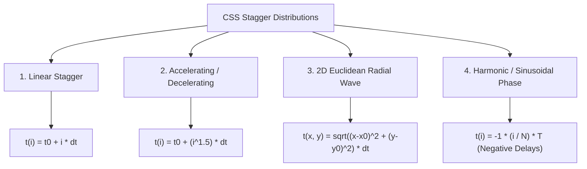

# 072: CSS Delay Sequencing & Staggered Motion Choreography Masterclass

## Overview & Executive Summary

In digital interface design, when multiple UI elements animate simultaneously with identical start times and durations, the result is often chaotic, overwhelming, and visually flat. The human visual cortex processes information through spatial relationships, temporal hierarchy, and focal orientation. **Delay sequencing**—also known as **staggered animation**, **motion choreography**, or **cascading timing**—is the deliberate introduction of mathematical time offsets ($\Delta t$) between animating elements or transition properties.

By structuring motion chronologically, delay sequencing directs user attention, establishes visual hierarchy, guides eye tracking across complex layouts, and communicates system hierarchy (e.g., parent container opening before child elements cascade into view).

When executed using pure CSS custom properties (`var(--i)`), trigonometric offsets, negative animation delays (`animation-delay: -t`), and GPU-accelerated compositing properties (`transform`, `opacity`), delay sequencing delivers fluid 60–120 FPS choreography without the runtime overhead of heavy JavaScript animation libraries.

```
+-------------------------------------------------------------------------------+
|                      CSS DELAY SEQUENCING TAXONOMY                            |
|                                                                               |
|   1. Linear Stagger Cascade     2. 2D Matrix / Radial Wave  3. Negative Phase |
|      (Lists, Menus, Feeds)         (Grid Cards, Dashboards)    (Harmonic Wave)|
|                                                                               |
|   Item 1: [===>        ]           [0.0s] [0.1s] [0.2s]        Node 1: ( -0.6s)
|   Item 2: . [===>      ]           [0.1s] [0.2s] [0.3s]        Node 2: ( -0.4s)
|   Item 3: . . [===>    ]           [0.2s] [0.3s] [0.4s]        Node 3: ( -0.2s)
|   Item 4: . . . [===>  ]             (Distance from center)    Node 4: (  0.0s)
|      t0  t1  t2  t3  t4                                         Instant Phase |
|                                                                               |
|   4. Multi-Property Pipeline    5. Bidirectional Reversal                     |
|      (State Morphing, Buttons)     (Enter vs. Exit Sequence)                  |
|                                                                               |
|   Width:   [====>      ]           Enter:  A -> B -> C -> D  (delay: i * dt)  |
|   Opacity: . . [====>  ]           Exit:   D -> C -> B -> A  (delay: (N-i)*dt)|
|   Content: . . . . [==>]           Graceful collapse in reverse order         |
+-------------------------------------------------------------------------------+
```

---

## Quick Reference Metadata

| Attribute | Specification Details |
| :--- | :--- |
| **Name** | CSS Delay Sequencing & Motion Choreography |
| **Category** | CSS Animations, Transitions, Kinematics & UI Choreography |
| **Difficulty** | Intermediate to Advanced (3.5/5) |
| **What it produces** | Harmonious, sequentially staggered UI entrances, exits, wave pulses, multi-stage layout morphs, and continuous phase-offset loops. |
| **Why it works** | The browser's animation subsystem offsets the execution timestamp of transitions and keyframes per element using `animation-delay` or `transition-delay`, computed dynamically via `calc(var(--i) * var(--stagger))`. |
| **Key Properties** | `animation-delay`, `transition-delay`, `animation-fill-mode: both`, `--custom-property`, `calc()`, `@starting-style`, `transition-behavior: allow-discrete`. |
| **Strict Constraints** | Total cascade duration must remain bounded ($\le 600\text{–}900\text{ms}$) to avoid perceived UI sluggishness; `animation-fill-mode: backwards` or `both` is mandatory to prevent initial state flickering (FOUC). |
| **Browser Baseline** | Baseline 2020+ for CSS Variables and `calc()` animation delays; Baseline 2024 for `@starting-style` discrete entry transitions. |
| **Acceptance Criteria** | 120 FPS compositor-only execution (`transform`, `opacity`); zero layout shifts (CLS = 0); full accessibility suppression via `@media (prefers-reduced-motion)`. |

### Quick Preview

```html
<ul class="stagger-list" style="--stagger-delay: 60ms;">
  <li style="--i: 0;">Dashboard Overview</li>
  <li style="--i: 1;">Analytics & Metrics</li>
  <li style="--i: 2;">User Management</li>
  <li style="--i: 3;">Security & Compliance</li>
  <li style="--i: 4;">Billing & Invoices</li>
</ul>
```

```css
.stagger-list {
  list-style: none;
  padding: 0;
  margin: 0;
  display: flex;
  flex-direction: column;
  gap: 12px;
}

.stagger-list li {
  padding: 14px 20px;
  border-radius: 8px;
  background: #1e293b;
  color: #f8fafc;
  font-family: system-ui, sans-serif;
  
  /* Initial off-screen state */
  opacity: 0;
  transform: translateY(20px) scale(0.97);
  
  /* Staggered animation with fill-mode both to prevent FOUC */
  animation: staggerSlideIn 0.5s cubic-bezier(0.16, 1, 0.3, 1) both;
  animation-delay: calc(var(--i) * var(--stagger-delay, 50ms));
}

@keyframes staggerSlideIn {
  to {
    opacity: 1;
    transform: translateY(0) scale(1);
  }
}
```

---

## 1. Kinematic Foundations & Mathematical Models

### 1.1 The Psychology of Visual Staging & Cognitive Load

In classical animation (Frank Thomas & Ollie Johnston's *The Illusion of Life*), **Staging** and **Overlapping Action** dictate that presenting all visual stimuli simultaneously creates sensory overload. 

In UI/UX engineering:
1. **Focal Anchor**: The human eye first catches the primary element ($t = 0$), then tracks the cascading flow in reading order (top-to-bottom or radial outwards).
2. **Perceived Performance**: Staggered loading feels faster than batch loading because the first element renders immediately ($0\text{ms}$ delay), providing instant visual feedback while subsequent elements finalize rendering.
3. **Spatial Hierarchy**: Delay differentiates parent containers from child elements, indicating causality and nested ownership.

```
SIMULTANEOUS POP (High Cognitive Load, Flash Effect):
Time 0ms:  [  Item 1  ] [  Item 2  ] [  Item 3  ] [  Item 4  ] -> Visual Blast!

STAGGERED CHOREOGRAPHY (Smooth Eye Tracking, Natural Reading Order):
Time 0ms:   [  Item 1  ]
Time 70ms:  [  Item 1  ] [  Item 2  ]
Time 140ms: [  Item 1  ] [  Item 2  ] [  Item 3  ]
Time 210ms: [  Item 1  ] [  Item 2  ] [  Item 3  ] [  Item 4  ]
```

---

### 1.2 Delay Offset Functions & Mathematical Curves

The time offset for item $i$ can follow several mathematical distributions depending on the intended kinematic weight:



| Stagger Type | Formula | Kinematic Character | Typical UI Use Case |
| :--- | :--- | :--- | :--- |
| **Constant / Linear** | $t_i = i \cdot \Delta t$ | Crisp, rhythmic, predictable | Standard lists, menus, navigation drawers, feed items |
| **Accelerating (Power)** | $t_i = (i)^{1.4} \cdot \Delta t$ | Starts briskly, extends into a trailing tail | Hero typography, dramatic intro sequences |
| **Decelerating (Log/Root)** | $t_i = \sqrt{i} \cdot \Delta t$ | Deliberate first item, followed by rapid cascade | Data table rows, high-density inventory items |
| **2D Radial (Euclidean)** | $t_{x,y} = \sqrt{(x - x_c)^2 + (y - y_c)^2} \cdot \Delta t$ | Omnidirectional ripple originating from cursor/center | Dashboard card grids, photo galleries, modal unlocks |
| **Manhattan Grid** | $t_{x,y} = (|x - x_0| + |y - y_0|) \cdot \Delta t$ | Diamond wave propagation across matrix columns/rows | Modular control panels, spreadsheet grid reveals |
| **Harmonic Negative** | $t_i = -\left(\frac{i}{N}\right) \cdot T$ | Infinite loop with pre-distributed phase offsets | Audio equalizers, orbital spinners, radar ripples |

---

### 1.3 `animation-delay` vs. `transition-delay`

Understanding the fundamental operational divergence between `@keyframes` animations and CSS `transition` delays is vital:

```
+-------------------------------------------------------------------------------+
|                       KEY DIFFERENCES AT A GLANCE                             |
|                                                                               |
| FEATURE               animation-delay              transition-delay           |
| --------------------+----------------------------+--------------------------- |
| Trigger Mechanism   | Fires immediately on DOM   | Requires state mutation   |
|                     | mount or class addition    | (:hover, :focus, class)   |
|                     |                            |                           |
| Initial State Hold  | Requires `fill-mode: both` | Governed by base CSS rule |
|                     | or `backwards`             | until transition starts   |
|                     |                            |                           |
| Multi-property      | Single delay for entire    | Unique delay per property |
| Granularity         | keyframe sequence          | (width, opacity, color)   |
|                     |                            |                           |
| Negative Values     | Supported: fast-forwards   | Supported: clips initial  |
|                     | into animation timeline    | transition duration       |
|                     |                            |                           |
| Interruptibility    | Restarts or aborts on class| Smoothly reverses or      |
|                     | removal                    | redirects in flight       |
+-------------------------------------------------------------------------------+
```

---

### 1.4 The Power of Negative Animation Delays (`animation-delay: -t`)

One of CSS's most powerful yet underutilized capabilities is the **negative animation delay**.

When you declare a positive delay (`animation-delay: 2s`), the browser waits 2 seconds before starting the animation from $0\%$.
When you declare a **negative delay** (`animation-delay: -2s`), the browser starts the animation **instantly at $t = 0$**, but executes it as if it has already been running for 2 seconds (jumping straight to the midpoint of the timeline).

```
Positive Delay (+0.5s):
t = 0.0s          t = 0.5s          t = 1.5s          t = 2.0s
[   WAIT / IDLE   |======== RUNNING (0% -> 100%) =======|   DONE / LOOP ]

Negative Delay (-0.5s on a 2.0s loop):
t = 0.0s                            t = 1.5s          t = 2.0s
[======= RUNNING (25% -> 100%) =====|== REPEAT (0% -> 25%) ==]
*Starts INSTANTLY with no gap, pre-offset by 25% phase angle!*
```

#### Why Negative Delay is Essential for Continuous Loops:
- Prevents the awkward visual hitch where elements sit static during startup.
- Enables synchronous audio visualizers, undulating waves, pulse rings, and orbiting celestial bodies where every element must be in active, phase-shifted motion the moment the page loads.

---

### 1.5 The Critical Role of `animation-fill-mode`

When an element has an `animation-delay: 200ms`, what style does it display during those first $200\text{ms}$?

```
Without `animation-fill-mode: backwards` or `both`:
Time 0ms - 199ms: Element displays its DEFAULT base stylesheet styles (e.g. opacity: 1, translateY: 0).
Time 200ms:       Animation starts! Element abruptly snaps to keyframe 0% (opacity: 0, translateY: 30px)
                  and begins moving. This causes an ugly visual flash (FOUC)!

With `animation-fill-mode: both` (or `backwards`):
Time 0ms - 199ms: Browser immediately locks the element to its Keyframe 0% state during the delay period.
Time 200ms:       Animation smoothly glides from Keyframe 0% to 100% with zero visual snapping.
```

> [!IMPORTANT]
> **Golden Rule of Staggered Animations**: Always specify `animation-fill-mode: both` (or `backwards` at minimum) whenever applying positive `animation-delay` to entrance animations.

---

## 2. The 6 Core CSS Delay Sequencing Building Blocks & Primitives

---

### Primitive 1: Dynamic CSS Variable Staggering via `--i` & `calc()`

Rather than writing repetitive class declarations (`.item-1`, `.item-2`, `.item-3`), define a single master stagger rule on the parent and supply index tokens via inline CSS variables.

```css
/* Parent container defines the timing token */
.stagger-container {
  --stagger-step: 75ms;
  --base-duration: 450ms;
}

/* Children calculate their individual delay automatically */
.stagger-item {
  opacity: 0;
  transform: translateY(24px);
  animation: cascadeEntrance var(--base-duration) cubic-bezier(0.2, 0.8, 0.2, 1) both;
  animation-delay: calc(var(--i, 0) * var(--stagger-step));
}

@keyframes cascadeEntrance {
  to {
    opacity: 1;
    transform: translateY(0);
  }
}
```

```html
<div class="stagger-container">
  <div class="stagger-item" style="--i: 0;">Alpha</div>
  <div class="stagger-item" style="--i: 1;">Beta</div>
  <div class="stagger-item" style="--i: 2;">Gamma</div>
  <div class="stagger-item" style="--i: 3;">Delta</div>
</div>
```

---

### Primitive 2: Negative Delay Waveform Synthesis for Seamless Ambient Loops

For continuous multi-node harmonic loops (equalizer bars, pulse rings, loading spinners), negative delay distributes nodes across a uniform cycle of period $T$.

```css
.wave-bar {
  --total-bars: 8;
  --period: 1.2s;
  
  width: 6px;
  height: 48px;
  background: #38bdf8;
  border-radius: 3px;
  transform-origin: bottom center;
  
  /* Negative delay distributes phase instantly */
  animation: soundBarScale var(--period) ease-in-out infinite alternate;
  animation-delay: calc((var(--i) / var(--total-bars)) * -1 * var(--period));
}

@keyframes soundBarScale {
  0% {
    transform: scaleY(0.15);
    background-color: #0284c7;
  }
  100% {
    transform: scaleY(1);
    background-color: #38bdf8;
  }
}
```

---

### Primitive 3: Multi-Property Phase Chaining (Per-Property `transition-delay`)

A single CSS `transition` rule can specify independent delays for every animated CSS property. This allows an element to morph sequentially (e.g., expand in width, then fade in content, then shift border color).

```css
.morph-card {
  width: 60px;
  height: 60px;
  opacity: 0.7;
  background: #1e293b;
  border: 2px solid transparent;
  
  /* Property Transition Pipeline:
     1. Width expands immediately (0ms delay)
     2. Opacity fades in after 150ms
     3. Border color highlights after 300ms
  */
  transition: 
    width 300ms cubic-bezier(0.4, 0, 0.2, 1) 0ms,
    opacity 250ms ease 150ms,
    border-color 200ms ease 300ms,
    background-color 200ms ease 300ms;
}

.morph-card.is-expanded {
  width: 320px;
  opacity: 1;
  border-color: #38bdf8;
  background: #0f172a;
}
```

---

### Primitive 4: Pure CSS `:nth-child(n)` Cascades (No Inline Variables Required)

When markup cannot be altered to inject inline style variables (e.g., CMS feeds, server-rendered markdown, third-party widgets), implement procedural nth-child delays in pure CSS.

```css
.feed-item {
  opacity: 0;
  transform: translateY(16px);
  animation: feedReveal 0.4s cubic-bezier(0.16, 1, 0.3, 1) forwards;
}

/* Procedural cascade offsets */
.feed-item:nth-child(1) { animation-delay: 0.05s; }
.feed-item:nth-child(2) { animation-delay: 0.10s; }
.feed-item:nth-child(3) { animation-delay: 0.15s; }
.feed-item:nth-child(4) { animation-delay: 0.20s; }
.feed-item:nth-child(5) { animation-delay: 0.25s; }
.feed-item:nth-child(6) { animation-delay: 0.30s; }
.feed-item:nth-child(7) { animation-delay: 0.35s; }
.feed-item:nth-child(8) { animation-delay: 0.40s; }

/* Cap max delay for subsequent items to prevent infinite wait */
.feed-item:nth-child(n + 9) { animation-delay: 0.45s; }
```

---

### Primitive 5: Bidirectional Enter / Exit Stagger Reversal

When opening a navigation menu, items should cascade from **top to bottom** ($0 \to 1 \to 2$).
When closing the menu, items should exit in **reverse order** from **bottom to top** ($2 \to 1 \to 0$).

```css
.nav-menu {
  --total-items: 4;
  --stagger-step: 50ms;
}

.nav-item {
  transform: translateX(-20px);
  opacity: 0;
  
  /* Default EXIT transition: Reversed cascade */
  transition: 
    transform 0.3s cubic-bezier(0.4, 0, 1, 1),
    opacity 0.2s ease;
  transition-delay: calc((var(--total-items) - var(--i) - 1) * var(--stagger-step));
}

/* OPEN state: Forward cascade */
.nav-menu.is-open .nav-item {
  transform: translateX(0);
  opacity: 1;
  
  transition: 
    transform 0.4s cubic-bezier(0.16, 1, 0.3, 1),
    opacity 0.3s ease;
  transition-delay: calc(var(--i) * var(--stagger-step));
}
```

---

### Primitive 6: Modern `@starting-style` & Discrete Transition Choreography

Modern CSS (Baseline 2024) allows staggering elements when they first enter the DOM or switch from `display: none` to `display: block` without relying on `@keyframes`.

```css
.dialog-card {
  display: flex;
  opacity: 1;
  transform: scale(1);
  transition: opacity 0.4s ease, transform 0.4s cubic-bezier(0.34, 1.56, 0.64, 1);
  transition-delay: calc(var(--i) * 60ms);
  transition-behavior: allow-discrete;
}

@starting-style {
  .dialog-card {
    opacity: 0;
    transform: scale(0.85);
  }
}
```

---

## 3. Comprehensive Production Implementation Patterns

---

### Pattern 1: Staggered Hero Staging & Typography Cascade

A complete marketing hero banner featuring an orchestrated sequential reveal:
1. Category badge pops in ($t = 0\text{ms}$).
2. Headline lines slide up sequentially ($t = 120\text{ms}, 240\text{ms}$).
3. Supporting paragraph fades in ($t = 360\text{ms}$).
4. Action buttons glide into position ($t = 480\text{ms}, 560\text{ms}$).
5. Hero visual card floats up ($t = 640\text{ms}$).

#### HTML
```html
<section class="hero-stage">
  <div class="hero-content">
    <div class="hero-badge hero-seq" style="--seq: 0;">
      <span class="pulse-dot"></span> Next-Gen Kinematics
    </div>
    
    <h1 class="hero-title">
      <span class="hero-line hero-seq" style="--seq: 1;">Architecting Precision</span>
      <span class="hero-line hero-seq" style="--seq: 2;">Motion in Pure CSS</span>
    </h1>
    
    <p class="hero-description hero-seq" style="--seq: 3;">
      Orchestrate high-performance, GPU-accelerated staggered timing sequences. 
      Zero external runtime dependencies. Built for modern web applications.
    </p>
    
    <div class="hero-actions">
      <a href="#explore" class="btn btn-primary hero-seq" style="--seq: 4;">
        Start Exploring
      </a>
      <a href="#docs" class="btn btn-secondary hero-seq" style="--seq: 5;">
        Documentation
      </a>
    </div>
  </div>

  <div class="hero-visual hero-seq" style="--seq: 6;">
    <div class="glass-dashboard-mockup">
      <div class="mockup-header">
        <span class="dot red"></span>
        <span class="dot yellow"></span>
        <span class="dot green"></span>
      </div>
      <div class="mockup-body">
        <div class="metric-row">
          <div class="metric-bar active" style="--fill: 85%;"></div>
          <div class="metric-bar" style="--fill: 60%;"></div>
          <div class="metric-bar" style="--fill: 92%;"></div>
        </div>
      </div>
    </div>
  </div>
</section>
```

#### CSS
```css
:root {
  --seq-base-delay: 110ms;
  --ease-spring: cubic-bezier(0.16, 1, 0.3, 1);
}

.hero-stage {
  min-height: 100vh;
  display: grid;
  grid-template-columns: 1.2fr 1fr;
  align-items: center;
  gap: 48px;
  padding: 80px 10%;
  background: radial-gradient(circle at top left, #1e1b4b, #090d16 70%);
  color: #f8fafc;
  font-family: -apple-system, BlinkMacSystemFont, "Segoe UI", Roboto, sans-serif;
  overflow: hidden;
}

/* Master Sequence Engine */
.hero-seq {
  opacity: 0;
  transform: translateY(28px);
  animation: heroSequenceEntry 0.75s var(--ease-spring) both;
  animation-delay: calc(var(--seq) * var(--seq-base-delay));
}

@keyframes heroSequenceEntry {
  0% {
    opacity: 0;
    transform: translateY(28px);
  }
  100% {
    opacity: 1;
    transform: translateY(0);
  }
}

/* Badge */
.hero-badge {
  display: inline-flex;
  align-items: center;
  gap: 8px;
  padding: 6px 14px;
  background: rgba(99, 102, 241, 0.15);
  border: 1px solid rgba(129, 140, 248, 0.3);
  border-radius: 9999px;
  font-size: 0.85rem;
  font-weight: 600;
  color: #818cf8;
  margin-bottom: 24px;
}

.pulse-dot {
  width: 8px;
  height: 8px;
  border-radius: 50%;
  background: #38bdf8;
  box-shadow: 0 0 8px #38bdf8;
  animation: pulseBeacon 1.8s ease-in-out infinite;
}

@keyframes pulseBeacon {
  0%, 100% { transform: scale(1); opacity: 0.8; }
  50% { transform: scale(1.4); opacity: 1; }
}

/* Typography Hierarchy */
.hero-title {
  font-size: clamp(2.5rem, 5vw, 4rem);
  font-weight: 800;
  line-height: 1.1;
  letter-spacing: -0.02em;
  margin: 0 0 20px 0;
}

.hero-line {
  display: block;
  background: linear-gradient(135deg, #ffffff 30%, #94a3b8);
  -webkit-background-clip: text;
  -webkit-text-fill-color: transparent;
}

.hero-description {
  font-size: 1.15rem;
  line-height: 1.6;
  color: #94a3b8;
  max-width: 520px;
  margin: 0 0 36px 0;
}

/* Buttons */
.hero-actions {
  display: flex;
  align-items: center;
  gap: 16px;
}

.btn {
  padding: 14px 28px;
  border-radius: 10px;
  font-weight: 600;
  text-decoration: none;
  font-size: 0.95rem;
  transition: transform 0.2s ease, box-shadow 0.2s ease;
}

.btn:hover {
  transform: translateY(-2px);
}

.btn-primary {
  background: linear-gradient(135deg, #6366f1, #4f46e5);
  color: #ffffff;
  box-shadow: 0 8px 20px -4px rgba(79, 70, 229, 0.5);
}

.btn-secondary {
  background: rgba(30, 41, 59, 0.7);
  border: 1px solid rgba(148, 163, 184, 0.2);
  color: #e2e8f0;
  backdrop-filter: blur(8px);
}

/* Visual Mockup Stage */
.hero-visual {
  perspective: 1000px;
}

.glass-dashboard-mockup {
  background: rgba(30, 41, 59, 0.45);
  border: 1px solid rgba(255, 255, 255, 0.1);
  backdrop-filter: blur(16px);
  border-radius: 16px;
  padding: 24px;
  box-shadow: 0 25px 50px -12px rgba(0, 0, 0, 0.6);
  transform: rotateY(-6deg) rotateX(4deg);
  transition: transform 0.5s ease;
}

.glass-dashboard-mockup:hover {
  transform: rotateY(0deg) rotateX(0deg);
}

.mockup-header {
  display: flex;
  gap: 8px;
  margin-bottom: 20px;
}

.dot {
  width: 10px;
  height: 10px;
  border-radius: 50%;
}
.dot.red { background: #ef4444; }
.dot.yellow { background: #eab308; }
.dot.green { background: #22c55e; }

.metric-row {
  display: flex;
  flex-direction: column;
  gap: 16px;
}

.metric-bar {
  height: 12px;
  background: #334155;
  border-radius: 6px;
  position: relative;
  overflow: hidden;
}

.metric-bar::after {
  content: "";
  position: absolute;
  left: 0;
  top: 0;
  bottom: 0;
  width: var(--fill, 50%);
  background: linear-gradient(90deg, #38bdf8, #818cf8);
  border-radius: 6px;
  transform: scaleX(0);
  transform-origin: left center;
  animation: barFill 1s cubic-bezier(0.16, 1, 0.3, 1) forwards;
  animation-delay: calc(var(--seq) * var(--seq-base-delay) + 0.3s);
}

@keyframes barFill {
  to { transform: scaleX(1); }
}

@media (max-width: 900px) {
  .hero-stage {
    grid-template-columns: 1fr;
    padding: 60px 6%;
  }
}
```

---

### Pattern 2: Interactive Cascading Navigation Menu with Bidirectional Delay Inversion

A sleek sidebar drawer navigation where list items cascade downwards when opening, and collapse upwards in reverse order when closing.

```
OPEN (Enter Order):          CLOSE (Exit Order Inverted):
[Header]      (Delay 0ms)     [Header]      (Delay 180ms)
  Item 1      (Delay 50ms)      Item 1      (Delay 120ms)
  Item 2      (Delay 100ms)     Item 2      (Delay 60ms)
  Item 3      (Delay 150ms)     Item 3      (Delay 0ms)
  Item 4      (Delay 200ms)
```

#### HTML
```html
<nav class="cascade-drawer" id="mainDrawer" style="--total-items: 5;">
  <div class="drawer-header">
    <div class="user-avatar">AD</div>
    <div class="user-info">
      <h4>Antigravity Dev</h4>
      <p>Pro Workspace</p>
    </div>
    <button class="drawer-toggle" id="drawerToggle" aria-label="Toggle Drawer">
      <span class="bar"></span>
      <span class="bar"></span>
    </button>
  </div>

  <ul class="drawer-nav">
    <li class="drawer-item" style="--i: 0;">
      <a href="#dash"><span class="icon">📊</span> Overview Dashboard</a>
    </li>
    <li class="drawer-item" style="--i: 1;">
      <a href="#nodes"><span class="icon">⚡</span> Cluster Nodes</a>
    </li>
    <li class="drawer-item" style="--i: 2;">
      <a href="#deploy"><span class="icon">🚀</span> Deployments & CI</a>
    </li>
    <li class="drawer-item" style="--i: 3;">
      <a href="#security"><span class="icon">🛡️</span> Access Control</a>
    </li>
    <li class="drawer-item" style="--i: 4;">
      <a href="#settings"><span class="icon">⚙️</span> Organization Settings</a>
    </li>
  </ul>
</nav>
```

#### CSS
```css
.cascade-drawer {
  --drawer-bg: #0f172a;
  --item-stagger: 45ms;
  
  width: 300px;
  background: var(--drawer-bg);
  border-radius: 16px;
  padding: 24px;
  box-shadow: 0 20px 40px rgba(0, 0, 0, 0.4);
  border: 1px solid rgba(255, 255, 255, 0.08);
  color: #f8fafc;
  font-family: system-ui, -apple-system, sans-serif;
}

.drawer-header {
  display: flex;
  align-items: center;
  gap: 12px;
  padding-bottom: 20px;
  border-bottom: 1px solid #1e293b;
  margin-bottom: 20px;
}

.user-avatar {
  width: 42px;
  height: 42px;
  border-radius: 10px;
  background: linear-gradient(135deg, #38bdf8, #6366f1);
  display: grid;
  place-items: center;
  font-weight: 700;
  font-size: 0.9rem;
}

.user-info h4 {
  margin: 0;
  font-size: 0.95rem;
}

.user-info p {
  margin: 2px 0 0 0;
  font-size: 0.75rem;
  color: #64748b;
}

.drawer-nav {
  list-style: none;
  padding: 0;
  margin: 0;
  display: flex;
  flex-direction: column;
  gap: 8px;
}

/* =========================================================================
   BIDIRECTIONAL DELAY INVERSION ENGINE
   - When .is-open is absent: items exit in REVERSE order ((total - i - 1) * dt)
   - When .is-open is present: items enter in FORWARD order (i * dt)
   ========================================================================= */

.drawer-item {
  transform: translateX(-30px);
  opacity: 0;
  filter: blur(4px);
  
  /* Exit state transition */
  transition: 
    transform 0.3s cubic-bezier(0.4, 0, 1, 1),
    opacity 0.25s ease,
    filter 0.25s ease;
  transition-delay: calc((var(--total-items) - var(--i) - 1) * var(--item-stagger));
}

.cascade-drawer.is-open .drawer-item {
  transform: translateX(0);
  opacity: 1;
  filter: blur(0);
  
  /* Enter state transition */
  transition: 
    transform 0.45s cubic-bezier(0.16, 1, 0.3, 1),
    opacity 0.35s ease,
    filter 0.35s ease;
  transition-delay: calc(var(--i) * var(--item-stagger) + 80ms);
}

.drawer-item a {
  display: flex;
  align-items: center;
  gap: 12px;
  padding: 12px 16px;
  border-radius: 8px;
  color: #94a3b8;
  text-decoration: none;
  font-weight: 500;
  font-size: 0.9rem;
  transition: background-color 0.2s ease, color 0.2s ease;
}

.drawer-item a:hover {
  background: #1e293b;
  color: #38bdf8;
}

.drawer-item .icon {
  font-size: 1.1rem;
}
```

#### JavaScript Controller
```javascript
const drawer = document.getElementById('mainDrawer');
const toggleBtn = document.getElementById('drawerToggle');

// Initialize open
drawer.classList.add('is-open');

toggleBtn.addEventListener('click', () => {
  drawer.classList.toggle('is-open');
});
```

---

### Pattern 3: 2D Interactive Radial & Diagonal Matrix Grid Reveal

When animating a multi-column card grid, a naive linear stagger ($i = 0, 1, 2, \dots$) creates an awkward diagonal sweep. A **2D spatial stagger** computes offsets based on row and column matrix coordinates or Euclidean distance from the origin $(0, 0)$.

```
2D DIAGONAL WAVE OFFSET FORMULA:
delay = (row + col) * delta_t

Col 0       Col 1       Col 2       Col 3
+-----------+-----------+-----------+-----------+
| (0,0)=0dt | (0,1)=1dt | (0,2)=2dt | (0,3)=3dt |  Row 0
+-----------+-----------+-----------+-----------+
| (1,0)=1dt | (1,1)=2dt | (1,2)=3dt | (1,3)=4dt |  Row 1
+-----------+-----------+-----------+-----------+
| (2,0)=2dt | (2,1)=3dt | (2,2)=4dt | (2,3)=5dt |  Row 2
+-----------+-----------+-----------+-----------+
```

#### HTML
```html
<div class="matrix-grid" style="--step-t: 70ms;">
  <!-- Row 0 -->
  <div class="matrix-card" style="--row: 0; --col: 0;">
    <div class="card-icon">⚡</div>
    <h3>Server Core</h3>
    <p>99.98% uptime</p>
  </div>
  <div class="matrix-card" style="--row: 0; --col: 1;">
    <div class="card-icon">🛡️</div>
    <h3>Firewall</h3>
    <p>Zero intrusions</p>
  </div>
  <div class="matrix-card" style="--row: 0; --col: 2;">
    <div class="card-icon">💾</div>
    <h3>NVMe Array</h3>
    <p>1.2 PB active</p>
  </div>

  <!-- Row 1 -->
  <div class="matrix-card" style="--row: 1; --col: 0;">
    <div class="card-icon">🌐</div>
    <h3>Edge CDN</h3>
    <p>24 PoPs active</p>
  </div>
  <div class="matrix-card" style="--row: 1; --col: 1;">
    <div class="card-icon">📈</div>
    <h3>Throughput</h3>
    <p>42.8 Gbps</p>
  </div>
  <div class="matrix-card" style="--row: 1; --col: 2;">
    <div class="card-icon">🔒</div>
    <h3>SSL Certs</h3>
    <p>100% valid</p>
  </div>

  <!-- Row 2 -->
  <div class="matrix-card" style="--row: 2; --col: 0;">
    <div class="card-icon">🤖</div>
    <h3>AI Agent</h3>
    <p>Idle (Standby)</p>
  </div>
  <div class="matrix-card" style="--row: 2; --col: 1;">
    <div class="card-icon">📬</div>
    <h3>Event Bus</h3>
    <p>0 dropped queue</p>
  </div>
  <div class="matrix-card" style="--row: 2; --col: 2;">
    <div class="card-icon">🔄</div>
    <h3>Sync Pipe</h3>
    <p>Synced 2s ago</p>
  </div>
</div>
```

#### CSS
```css
.matrix-grid {
  display: grid;
  grid-template-columns: repeat(3, 1fr);
  gap: 20px;
  max-width: 960px;
  margin: 40px auto;
  perspective: 1200px;
}

.matrix-card {
  background: rgba(30, 41, 59, 0.7);
  border: 1px solid rgba(255, 255, 255, 0.08);
  backdrop-filter: blur(12px);
  border-radius: 14px;
  padding: 24px;
  color: #f8fafc;
  font-family: system-ui, sans-serif;
  
  /* Initial off-stage 3D perspective orientation */
  opacity: 0;
  transform: translateY(30px) rotateX(15deg) scale(0.92);
  
  /* 2D Diagonal Stagger: delay = (row + col) * step */
  animation: matrixCardReveal 0.65s cubic-bezier(0.16, 1, 0.3, 1) both;
  animation-delay: calc((var(--row) + var(--col)) * var(--step-t, 60ms));
}

@keyframes matrixCardReveal {
  to {
    opacity: 1;
    transform: translateY(0) rotateX(0deg) scale(1);
  }
}

.matrix-card:hover {
  transform: translateY(-4px) scale(1.02);
  border-color: rgba(56, 189, 248, 0.4);
  box-shadow: 0 12px 24px -6px rgba(56, 189, 248, 0.2);
  transition: transform 0.25s ease, border-color 0.25s ease, box-shadow 0.25s ease;
}

.card-icon {
  font-size: 1.8rem;
  margin-bottom: 12px;
}

.matrix-card h3 {
  margin: 0 0 6px 0;
  font-size: 1.1rem;
  color: #e2e8f0;
}

.matrix-card p {
  margin: 0;
  font-size: 0.85rem;
  color: #38bdf8;
  font-weight: 500;
}

@media (max-width: 768px) {
  .matrix-grid {
    grid-template-columns: 1fr;
  }
}
```

---

### Pattern 4: Ambient Audio Visualizer & Multi-Orbit Pulse Waves (Negative Delay Synchronizer)

Demonstrating **negative animation delay** to orchestrate seamless, pre-warmed audio visualizer bars and pulsating concentric radar beacons with zero startup hitch.

#### HTML
```html
<div class="ambient-visualizer-container">
  <!-- Equalizer Spectrum with Phase Shifts -->
  <div class="audio-spectrum" style="--total-bands: 12; --cycle: 1.4s;">
    <div class="freq-band" style="--i: 0;"></div>
    <div class="freq-band" style="--i: 1;"></div>
    <div class="freq-band" style="--i: 2;"></div>
    <div class="freq-band" style="--i: 3;"></div>
    <div class="freq-band" style="--i: 4;"></div>
    <div class="freq-band" style="--i: 5;"></div>
    <div class="freq-band" style="--i: 6;"></div>
    <div class="freq-band" style="--i: 7;"></div>
    <div class="freq-band" style="--i: 8;"></div>
    <div class="freq-band" style="--i: 9;"></div>
    <div class="freq-band" style="--i: 10;"></div>
    <div class="freq-band" style="--i: 11;"></div>
  </div>

  <!-- Concentric Radar Echo Rings -->
  <div class="radar-beacon" style="--ring-total: 3; --ring-duration: 2.4s;">
    <div class="radar-core"></div>
    <div class="radar-ring" style="--r: 0;"></div>
    <div class="radar-ring" style="--r: 1;"></div>
    <div class="radar-ring" style="--r: 2;"></div>
  </div>
</div>
```

#### CSS
```css
.ambient-visualizer-container {
  display: flex;
  align-items: center;
  justify-content: space-around;
  padding: 40px;
  background: #090d16;
  border-radius: 20px;
  border: 1px solid #1e293b;
  max-width: 600px;
  margin: 30px auto;
}

/* =========================================================================
   SPECTRUM EQUALIZER BARS (NEGATIVE DELAY PHASE OFFSETS)
   ========================================================================= */
.audio-spectrum {
  display: flex;
  align-items: flex-end;
  gap: 5px;
  height: 64px;
  padding: 8px;
}

.freq-band {
  width: 6px;
  height: 100%;
  border-radius: 3px;
  background: linear-gradient(180deg, #38bdf8, #818cf8);
  transform-origin: bottom center;
  
  /* Negative delay starts the wave in an active distributed state */
  animation: equalizeHeight var(--cycle) cubic-bezier(0.45, 0.05, 0.55, 0.95) infinite alternate;
  animation-delay: calc((var(--i) / var(--total-bands)) * -1 * var(--cycle));
}

@keyframes equalizeHeight {
  0% {
    transform: scaleY(0.12);
    filter: hue-rotate(0deg);
  }
  50% {
    transform: scaleY(0.85);
  }
  100% {
    transform: scaleY(0.3);
    filter: hue-rotate(45deg);
  }
}

/* =========================================================================
   RADAR PULSE BEACON (NEGATIVE DELAY CONCENTRIC WAVES)
   ========================================================================= */
.radar-beacon {
  position: relative;
  width: 80px;
  height: 80px;
  display: grid;
  place-items: center;
}

.radar-core {
  width: 16px;
  height: 16px;
  background: #38bdf8;
  border-radius: 50%;
  box-shadow: 0 0 16px #38bdf8;
  z-index: 2;
}

.radar-ring {
  position: absolute;
  inset: 0;
  border: 2px solid #38bdf8;
  border-radius: 50%;
  opacity: 0;
  
  /* Negative delay spaces the concentric expanding rings seamlessly */
  animation: radarWaveExpand var(--ring-duration) cubic-bezier(0.2, 0.8, 0.4, 1) infinite;
  animation-delay: calc((var(--r) / var(--ring-total)) * -1 * var(--ring-duration));
}

@keyframes radarWaveExpand {
  0% {
    transform: scale(0.2);
    opacity: 0.9;
  }
  80% {
    opacity: 0.3;
  }
  100% {
    transform: scale(2.2);
    opacity: 0;
  }
}
```

---

### Pattern 5: Multi-Step Interactive Checkout / Wizard Pipeline

Orchestrating a multi-stage UI morph where checking out triggers a chained sequence:
1. Active step pill shrinks and turns green ($t = 0\text{ms}$).
2. Progress bar fills to $100\%$ ($t = 100\text{ms}$).
3. Summary card collapses ($t = 250\text{ms}$).
4. Success badge scales in with spring bounce ($t = 450\text{ms}$).
5. Confirmation details cascade item-by-item ($t = 600\text{ms}, 680\text{ms}, 760\text{ms}$).

#### HTML
```html
<div class="checkout-wizard is-complete" id="wizardBox">
  <!-- Progress Header -->
  <div class="wizard-stepper">
    <div class="step-node active done">
      <span class="step-num">✓</span>
      <span class="step-label">Cart</span>
    </div>
    <div class="step-connector">
      <div class="connector-fill"></div>
    </div>
    <div class="step-node active done">
      <span class="step-num">✓</span>
      <span class="step-label">Payment</span>
    </div>
  </div>

  <!-- Success Card with Staggered Confirmation -->
  <div class="wizard-confirmation">
    <div class="success-icon-wrapper stage-item" style="--stage: 0;">
      <svg class="checkmark-svg" viewBox="0 0 52 52">
        <circle class="checkmark-circle" cx="26" cy="26" r="24" fill="none"/>
        <path class="checkmark-check" fill="none" d="M14.1 27.2l7.1 7.2 16.7-16.8"/>
      </svg>
    </div>

    <h2 class="stage-item" style="--stage: 1;">Payment Authorized</h2>
    <p class="stage-item" style="--stage: 2;">Order #AG-94281 has been dispatched to your edge runtime.</p>

    <div class="receipt-breakdown">
      <div class="receipt-row stage-item" style="--stage: 3;">
        <span>Amount Paid</span>
        <strong>$128.00 USD</strong>
      </div>
      <div class="receipt-row stage-item" style="--stage: 4;">
        <span>Transaction Hash</span>
        <code>0x7f2a...8c19</code>
      </div>
      <div class="receipt-row stage-item" style="--stage: 5;">
        <span>Confirmation Sent</span>
        <span>dev@antigravity.io</span>
      </div>
    </div>
  </div>
</div>
```

#### CSS
```css
.checkout-wizard {
  background: #0f172a;
  border: 1px solid #1e293b;
  border-radius: 20px;
  padding: 36px;
  max-width: 480px;
  margin: 40px auto;
  color: #f8fafc;
  font-family: system-ui, sans-serif;
}

/* Stepper Header */
.wizard-stepper {
  display: flex;
  align-items: center;
  justify-content: space-between;
  margin-bottom: 36px;
}

.step-node {
  display: flex;
  flex-direction: column;
  align-items: center;
  gap: 6px;
}

.step-num {
  width: 32px;
  height: 32px;
  border-radius: 50%;
  background: #22c55e;
  color: #ffffff;
  display: grid;
  place-items: center;
  font-weight: 700;
  font-size: 0.9rem;
}

.step-label {
  font-size: 0.8rem;
  color: #94a3b8;
}

.step-connector {
  flex: 1;
  height: 3px;
  background: #334155;
  margin: 0 12px 20px 12px;
  position: relative;
  border-radius: 2px;
  overflow: hidden;
}

.connector-fill {
  position: absolute;
  inset: 0;
  background: #22c55e;
  transform: scaleX(0);
  transform-origin: left;
  animation: fillConnector 0.4s ease forwards 0.1s;
}

@keyframes fillConnector {
  to { transform: scaleX(1); }
}

/* =========================================================================
   STAGE-BY-STAGE CONFIRMATION CASCADE
   ========================================================================= */
.stage-item {
  opacity: 0;
  transform: translateY(16px);
  animation: stageEnter 0.5s cubic-bezier(0.16, 1, 0.3, 1) both;
  animation-delay: calc(var(--stage) * 80ms + 300ms);
}

@keyframes stageEnter {
  to {
    opacity: 1;
    transform: translateY(0);
  }
}

.success-icon-wrapper {
  width: 64px;
  height: 64px;
  margin: 0 auto 16px auto;
}

.checkmark-svg {
  width: 64px;
  height: 64px;
  border-radius: 50%;
  display: block;
  stroke-width: 3;
  stroke: #22c55e;
  stroke-miterlimit: 10;
  box-shadow: inset 0 0 0 #22c55e;
  animation: fillCircle 0.4s ease-in-out 0.4s forwards, scaleSpring 0.3s ease-in-out 0.8s both;
}

.checkmark-circle {
  stroke-dasharray: 166;
  stroke-dashoffset: 166;
  stroke-width: 3;
  stroke: #22c55e;
  animation: strokeArc 0.6s cubic-bezier(0.65, 0, 0.45, 1) 0.3s forwards;
}

.checkmark-check {
  transform-origin: 50% 50%;
  stroke-dasharray: 48;
  stroke-dashoffset: 48;
  animation: strokeCheck 0.35s cubic-bezier(0.65, 0, 0.45, 1) 0.75s forwards;
}

@keyframes strokeArc {
  to { stroke-dashoffset: 0; }
}

@keyframes strokeCheck {
  to { stroke-dashoffset: 0; }
}

@keyframes scaleSpring {
  0%, 100% { transform: none; }
  50% { transform: scale3d(1.1, 1.1, 1); }
}

.wizard-confirmation h2 {
  text-align: center;
  margin: 0 0 8px 0;
  font-size: 1.4rem;
}

.wizard-confirmation p {
  text-align: center;
  color: #94a3b8;
  font-size: 0.9rem;
  margin: 0 0 24px 0;
}

.receipt-breakdown {
  background: #1e293b;
  border-radius: 12px;
  padding: 16px;
  display: flex;
  flex-direction: column;
  gap: 12px;
}

.receipt-row {
  display: flex;
  justify-content: space-between;
  font-size: 0.85rem;
  color: #cbd5e1;
}

.receipt-row code {
  color: #38bdf8;
  background: #0f172a;
  padding: 2px 6px;
  border-radius: 4px;
}
```

---

### Pattern 6: Radial Speed-Dial Floating Action Button (FAB) with Trigonometric Delay

A floating action button that blossoms into an arc of sub-action icons with staggered angular burst timing.

```
RADIAL BURST CHOREOGRAPHY:
                   (Action 2: Angle 135°, delay: 100ms)
                        /
                       /
(Action 1: Angle 180°) -●- (Action 3: Angle 90°, delay: 50ms)
                       \
                        \
                  [ FAB TRIGGER ] (delay: 0ms)
```

#### HTML
```html
<div class="fab-speed-dial" id="speedDial" style="--total-actions: 4;">
  <button class="fab-trigger" id="fabToggle" aria-label="Open Actions">
    <span class="fab-icon">+</span>
  </button>

  <div class="fab-actions">
    <button class="action-btn" style="--i: 0; --angle: 90deg; --dist: 90px;" title="New Document">
      📄
    </button>
    <button class="action-btn" style="--i: 1; --angle: 120deg; --dist: 90px;" title="Upload Media">
      📸
    </button>
    <button class="action-btn" style="--i: 2; --angle: 150deg; --dist: 90px;" title="Share Link">
      🔗
    </button>
    <button class="action-btn" style="--i: 3; --angle: 180deg; --dist: 90px;" title="Create Team">
      👥
    </button>
  </div>
</div>
```

#### CSS
```css
.fab-speed-dial {
  position: fixed;
  bottom: 40px;
  right: 40px;
  z-index: 100;
}

.fab-trigger {
  width: 56px;
  height: 56px;
  border-radius: 50%;
  background: linear-gradient(135deg, #6366f1, #38bdf8);
  border: none;
  color: #ffffff;
  font-size: 1.8rem;
  display: grid;
  place-items: center;
  cursor: pointer;
  box-shadow: 0 8px 24px rgba(99, 102, 241, 0.5);
  transition: transform 0.3s cubic-bezier(0.34, 1.56, 0.64, 1);
  position: relative;
  z-index: 2;
}

.fab-speed-dial.is-active .fab-trigger {
  transform: rotate(135deg);
  background: #ef4444;
  box-shadow: 0 8px 24px rgba(239, 68, 68, 0.5);
}

.fab-actions {
  position: absolute;
  inset: 0;
  pointer-events: none;
}

.fab-speed-dial.is-active .fab-actions {
  pointer-events: auto;
}

.action-btn {
  position: absolute;
  width: 44px;
  height: 44px;
  border-radius: 50%;
  background: #1e293b;
  border: 1px solid rgba(255, 255, 255, 0.15);
  color: #ffffff;
  display: grid;
  place-items: center;
  font-size: 1.1rem;
  cursor: pointer;
  top: 6px;
  left: 6px;
  
  /* Initial collapsed state */
  transform: translate(0, 0) scale(0.3);
  opacity: 0;
  
  /* Retraction transition (reverse stagger) */
  transition: 
    transform 0.3s cubic-bezier(0.4, 0, 0.2, 1),
    opacity 0.2s ease;
  transition-delay: calc((var(--total-actions) - var(--i) - 1) * 30ms);
}

.fab-speed-dial.is-active .action-btn {
  /* Trigonometric displacement vector */
  transform: 
    translate(
      calc(cos(var(--angle)) * var(--dist) * -1),
      calc(sin(var(--angle)) * var(--dist) * -1)
    ) 
    scale(1);
  opacity: 1;
  
  /* Burst transition (forward stagger with spring overshoot) */
  transition: 
    transform 0.4s cubic-bezier(0.34, 1.56, 0.64, 1),
    opacity 0.3s ease;
  transition-delay: calc(var(--i) * 45ms + 40ms);
}

.action-btn:hover {
  background: #38bdf8;
  transform: 
    translate(
      calc(cos(var(--angle)) * var(--dist) * -1),
      calc(sin(var(--angle)) * var(--dist) * -1)
    ) 
    scale(1.15) !important;
}
```

---

## 4. Multi-Property & Exit Animation Delay Inversion Mechanics

### 4.1 The Reversal Algorithm

A common flaw in naive staggered implementations is that exiting items disappear simultaneously or in the exact same forward order, feeling unnatural.

```
FORWARD SEQUENCE (ENTER):
Item 0: delay = 0 * 50ms = 0ms
Item 1: delay = 1 * 50ms = 50ms
Item 2: delay = 2 * 50ms = 100ms
Item 3: delay = 3 * 50ms = 150ms

REVERSED SEQUENCE (EXIT):
Formula: delay = (Total - i - 1) * step
Item 0: delay = (4 - 0 - 1) * 50ms = 150ms  (Exits Last)
Item 1: delay = (4 - 1 - 1) * 50ms = 100ms
Item 2: delay = (4 - 2 - 1) * 50ms = 50ms
Item 3: delay = (4 - 3 - 1) * 50ms = 0ms    (Exits First)
```

```css
/* Generalized CSS Formula */
:root {
  --total: 5;
  --stagger: 60ms;
}

/* Base / Exit state */
.cascade-element {
  opacity: 0;
  transform: scale(0.9);
  transition: opacity 0.25s ease, transform 0.25s ease;
  transition-delay: calc((var(--total) - var(--i) - 1) * var(--stagger));
}

/* Active / Enter state */
.container.is-active .cascade-element {
  opacity: 1;
  transform: scale(1);
  transition: opacity 0.35s ease, transform 0.35s cubic-bezier(0.16, 1, 0.3, 1);
  transition-delay: calc(var(--i) * var(--stagger));
}
```

---

## 5. Modern CSS Features: `@starting-style`, Scroll-Driven Delays & Houdini

### 5.1 CSS Scroll-Driven Animations with Delay Sequencing

Modern CSS allows staggering elements as they enter the viewport using `view-timeline`:

```css
@keyframes scrollFadeUp {
  from {
    opacity: 0;
    transform: translateY(40px);
  }
  to {
    opacity: 1;
    transform: translateY(0);
  }
}

.scroll-stagger-card {
  view-timeline-name: --cardTimeline;
  view-timeline-axis: block;
  
  animation: scrollFadeUp 1s ease both;
  animation-timeline: --cardTimeline;
  /* Phase offset using animation-range */
  animation-range: entry calc(var(--i) * 5%) cover 35%;
}
```

---

## 6. Performance, GPU Compositing & 120 FPS Frame Budget

### 6.1 The Layout Thrashing Hazard

When animating staggered elements, animating layout properties (`top`, `margin`, `height`, `left`) forces the browser engine to perform a full Layout Recalculation (Reflow) on **every single staggered step** ($O(N)$ reflow cascades per second).

```
BAD (Forces Layout Thrashing):
.stagger-item {
  animation: badStagger 0.4s ease both;
  animation-delay: calc(var(--i) * 50ms);
}
@keyframes badStagger {
  from { margin-top: 30px; height: 0; } /* REFLOW on every frame */
  to   { margin-top: 0;    height: 60px; }
}

GOOD (Compositor-Only, Zero Reflow, 120 FPS):
.stagger-item {
  animation: goodStagger 0.4s cubic-bezier(0.16, 1, 0.3, 1) both;
  animation-delay: calc(var(--i) * 50ms);
  will-change: transform, opacity;
}
@keyframes goodStagger {
  from { transform: translateY(30px); opacity: 0; } /* GPU MATRIX ONLY */
  to   { transform: translateY(0);    opacity: 1; }
}
```

### 6.2 Managing Large Lists ($N > 30$)

For very large feeds or data grids ($N = 100+$), staggering every item individually means the 100th item waits $100 \times 50\text{ms} = 5.0\text{ seconds}$ before appearing.

**The Clamping Rule**: Clamp the maximum delay using `min()`:

```css
.dense-list-item {
  /* Delay caps at a maximum of 400ms */
  animation-delay: min(calc(var(--i) * 35ms), 400ms);
}
```

---

## 7. Accessibility, Assistive Technology & `prefers-reduced-motion`

Users with vestibular disorders or motion sensitivities can experience nausea or disorientation from cascading motion. 

### Production Accessibility Strategy:
1. When `prefers-reduced-motion: reduce` is detected, remove spatial movement and reduce/eliminate delays.
2. Maintain immediate visual access so assistive technology users are not blocked.

```css
@media (prefers-reduced-motion: reduce) {
  /* Global Delay & Motion Neutralization */
  *,
  *::before,
  *::after {
    animation-delay: 0s !important;
    animation-duration: 0.01ms !important;
    animation-iteration-count: 1 !important;
    transition-delay: 0s !important;
    transition-duration: 0.01ms !important;
    scroll-behavior: auto !important;
  }
  
  /* Fallback: Instant full opacity and zero transform */
  .hero-seq,
  .drawer-item,
  .matrix-card,
  .stage-item,
  .action-btn {
    opacity: 1 !important;
    transform: none !important;
    filter: none !important;
  }
}
```

---

## 8. Common Pitfalls, Edge Cases & Debugging Solutions

```
+-------------------------------------------------------------------------------+
|                       TROUBLESHOOTING MATRIX & EDGE CASES                     |
|                                                                               |
| SYMPTOM                ROOT CAUSE                    IMMEDIATE FIX            |
| ---------------------+-----------------------------+------------------------- |
| Elements flash on    | Missing `animation-fill-    | Add `animation-fill-     |
| screen at t=0 then   | mode: both` or `backwards`. | mode: both` to the rule. |
| snap back on delay   | Base styles show before 0%. |                          |
|                      |                             |                          |
| Rapid hover causes   | Long transition-delay on    | Reset delay to 0ms on    |
| laggy hover state    | active hover pseudo-class.  | `:hover { delay: 0s; }`. |
|                      |                             |                          |
| Exit sequence is     | Exit transition uses same   | Invert index: `(N-i-1)*dt|
| forward instead of   | forward delay as enter.     | for exit states.         |
| reversed             |                             |                          |
|                      |                             |                          |
| 50th item takes 3s   | Unbounded linear delay on   | Use `min(i * dt, max_t)` |
| to show up in feed   | large DOM collection.       | to clamp total time.     |
|                      |                             |                          |
| Continuous wave has  | Using positive delay causing| Switch to negative delay |
| 1s dead blank period | initial dead wait time.     | `calc(i * -1 * dt)`.     |
+-------------------------------------------------------------------------------+
```

---

## 9. Interactive JavaScript Utility & Stagger Calculator

A lightweight helper script to automatically populate CSS variables for 1D lists, 2D matrix grids, and radial Euclidean distance maps:

```javascript
/**
 * StaggerOrchestrator
 * Automatically assigns CSS variables for complex choreography
 */
class StaggerOrchestrator {
  /**
   * Apply 1D linear stagger tokens
   */
  static applyLinear(containerSelector, itemSelector) {
    const containers = document.querySelectorAll(containerSelector);
    containers.forEach(container => {
      const items = container.querySelectorAll(itemSelector);
      container.style.setProperty('--total-items', items.length);
      items.forEach((item, index) => {
        item.style.setProperty('--i', index);
      });
    });
  }

  /**
   * Apply 2D Matrix row/col coordinates
   */
  static applyGrid(gridSelector, itemSelector, columns) {
    const grids = document.querySelectorAll(gridSelector);
    grids.forEach(grid => {
      const items = grid.querySelectorAll(itemSelector);
      items.forEach((item, index) => {
        const row = Math.floor(index / columns);
        const col = index % columns;
        item.style.setProperty('--row', row);
        item.style.setProperty('--col', col);
        item.style.setProperty('--i', index);
      });
    });
  }

  /**
   * Apply Radial Euclidean Distance Stagger from center or cursor
   */
  static applyRadial(gridSelector, itemSelector, columns, rows) {
    const centerRow = (rows - 1) / 2;
    const centerCol = (columns - 1) / 2;
    
    document.querySelectorAll(gridSelector).forEach(grid => {
      const items = grid.querySelectorAll(itemSelector);
      items.forEach((item, index) => {
        const r = Math.floor(index / columns);
        const c = index % columns;
        const dist = Math.hypot(r - centerRow, c - centerCol);
        item.style.setProperty('--dist', dist.toFixed(3));
      });
    });
  }
}

// Example usage:
document.addEventListener('DOMContentLoaded', () => {
  StaggerOrchestrator.applyLinear('.stagger-list', 'li');
  StaggerOrchestrator.applyGrid('.matrix-grid', '.matrix-card', 3);
});
```

---

## 10. Master Production Checklist

- [ ] **Compositor Integrity**: Staggered animations modify only `transform`, `opacity`, and `filter`. No layout properties (`height`, `width`, `margin`, `top`, `left`).
- [ ] **FOUC Prevention**: All positive `animation-delay` rules declare `animation-fill-mode: both` or `backwards`.
- [ ] **Bounded Total Duration**: The entire cascade completes within $600\text{–}900\text{ms}$ to prevent user fatigue.
- [ ] **Clamped List Delays**: For feeds with dynamic lengths, delays are clamped using `min(calc(var(--i) * 40ms), 500ms)`.
- [ ] **Bidirectional Exit Reversal**: Interactive menus and collapsible cards invert their delay timing on exit using `calc((var(--total) - var(--i) - 1) * var(--stagger))`.
- [ ] **Negative Delay on Ambient Loops**: Infinite loops (equalizers, pulse rings) employ negative delays (`calc(var(--i) * -dt)`) to start in active phase without startup delay.
- [ ] **Accessibility Compliance**: Full motion and delay neutralization implemented under `@media (prefers-reduced-motion: reduce)`.
- [ ] **Hardware Acceleration**: `will-change: transform, opacity` applied prudently on active stages and removed once animations conclude.
