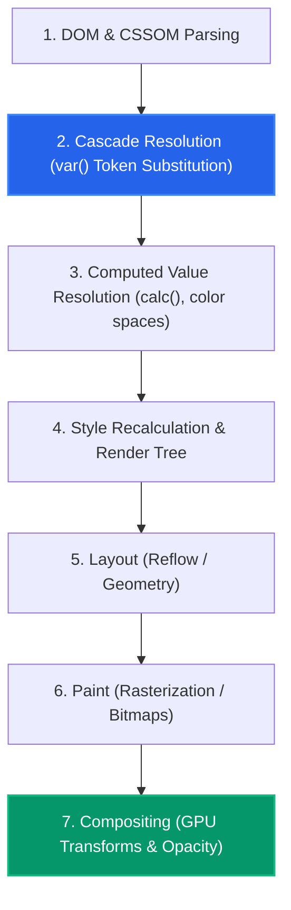
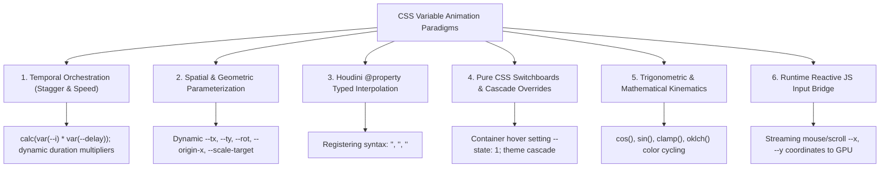
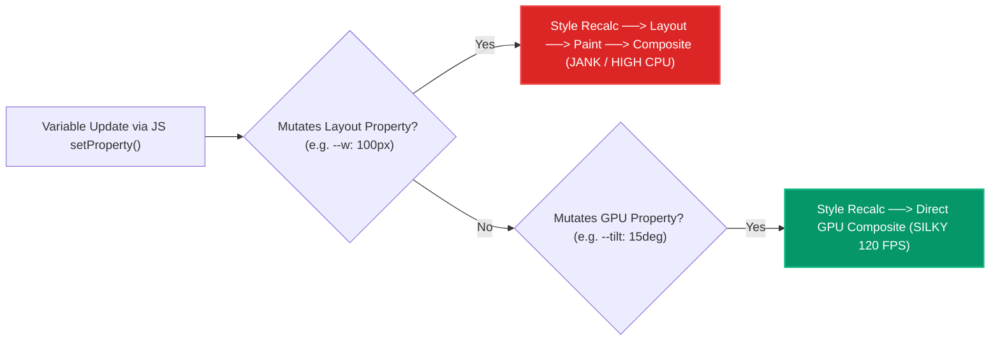

# 073: CSS Variables Controlling Animation & Dynamic Kinematic Systems Masterclass

## Overview & Executive Summary

In traditional CSS animation architectures, animation keyframes and transition parameters are static, rigidly hardcoded declarations. Modifying an animation's spatial trajectory, timing duration, stagger offset, color shift, or harmonic amplitude historically required duplicating `@keyframes` rules across dozens of selectors or relinquishing declarative CSS rendering in favor of heavy JavaScript animation libraries (such as GSAP, Framer Motion, or Anime.js).

**CSS Variables (Custom Properties) Controlling Animation** represents a foundational paradigm shift in modern web motion design: the **decoupling of animation mechanics from dynamic runtime parameters**. By parameterizing `@keyframes`, `transition`, and layout rules with CSS custom properties (`var(--...)`), developers create a flexible, reactive kinematic system where a single set of declarative rules can drive infinite contextual variations.

Furthermore, with the standardized **CSS Properties and Values API (CSS Houdini `@property`)**, custom properties can be formally registered with strict type definitions (`<angle>`, `<percentage>`, `<color>`, `<length>`, `<number>`). This unlocks direct interpolation of custom properties inside `@keyframes`—enabling hardware-accelerated animations of complex properties like conic-gradient rotation, polygon coordinates, and numeric counters natively on the GPU compositor thread at 60–120 FPS.

```
+-----------------------------------------------------------------------------------------+
|                  CSS CUSTOM PROPERTIES AS KINEMATIC CONTROL BUS                         |
|                                                                                         |
|   1. Declarative Control Bus      2. Houdini Typed Engine         3. Zero-Overhead Bridge |
|   (Dynamic Parametric Keyframes)  (Direct Property Interpolation) (Continuous JS Streaming)|
|                                                                                         |
|       Parent State / Theme            @property --angle {              Pointer / Scroll / Physics|
|               │                         syntax: '<angle>';                  │ (setProperty)   |
|       ┌───────┴───────┐                 inherits: false;                    ▼                 |
|       ▼               ▼                 initial-value: 0deg;          ┌───────────┐           |
|   --scale: 1.2;  --stagger: 40ms;     }                               │ :root / DOM │         |
|       │               │                                               └─────┬─────┘           |
|       ▼               ▼               @keyframes rotateGlow {               │                 |
|   @keyframes dynamicPulse {             0%   { --angle: 0deg; }             ▼                 |
|     100% {                              100% { --angle: 360deg; }     GPU Compositor Matrix   |
|       transform: scale(var(--scale)); }                               (Instant 120 FPS Sync)  |
|     }                                 }                                                       |
+-----------------------------------------------------------------------------------------+
```

---

## Quick Reference Metadata

| Attribute | Specification Details |
| :--- | :--- |
| **Name** | CSS Variables Controlling Animation & Dynamic Kinematic Systems |
| **Category** | CSS Custom Properties, GPU Compositing & Reactive Motion Architecture |
| **Difficulty** | Advanced (4/5) |
| **What it produces** | Highly parameterized, context-aware, and performant animations whose timing, trajectories, colors, scales, and states are dynamically modulated via CSS cascade overrides, user inputs, or lightweight JS streaming. |
| **Why it works** | The browser calculates computed values using custom property tokens during style resolution; registered Houdini typed properties (`@property`) are natively interpolated along mathematical manifolds by the animation compositor engine. |
| **Key Properties** | `var()`, `@property`, `syntax`, `inherits`, `initial-value`, `calc()`, `translate`, `rotate`, `scale`, `animation-delay`, `animation-duration`, `animation-play-state`, `will-change`. |
| **Strict Constraints** | Untyped custom properties cannot interpolate smoothly inside `@keyframes` (they switch discretely at 50%); typed interpolation requires `@property` registration. Avoid changing layout-triggering properties (`width`, `margin`, `top`) inside dynamic variables. |
| **Browser Baseline** | Standard custom properties and keyframe parameterization: Baseline 2017+ (universal). Houdini `@property` registration: Chrome 85+, Edge 85+, Safari 16.4+, Firefox 128+ (Baseline 2024+ across all major browser engines). |
| **Acceptance Criteria** | Zero layout thrashing ($0\text{ ms}$ reflow); 60/120 FPS GPU compositor thread execution; clean separation of structural CSS and runtime state; robust `@media (prefers-reduced-motion)` dampening. |

### Quick Preview

```html
<div class="reactive-badge" style="--stagger: 2; --accent: #38bdf8;">
  <span class="pulse-ring"></span>
  <span class="badge-label">Active Node</span>
</div>
```

```css
/* 1. Register typed variable for smooth GPU interpolation */
@property --glow-angle {
  syntax: '<angle>';
  inherits: false;
  initial-value: 0deg;
}

/* 2. Parameterized component styling */
.reactive-badge {
  --base-duration: 2.4s;
  --computed-delay: calc(var(--stagger, 0) * 180ms);
  
  position: relative;
  display: inline-flex;
  align-items: center;
  gap: 8px;
  padding: 8px 16px;
  background: #0f172a;
  border-radius: 9999px;
  border: 1px solid var(--accent, #64748b);
  animation: badge-hover var(--base-duration) ease-in-out infinite alternate;
  animation-delay: var(--computed-delay);
}

.pulse-ring {
  inline-size: 8px;
  block-size: 8px;
  border-radius: 50%;
  background: var(--accent, #38bdf8);
  box-shadow: 0 0 12px var(--accent, #38bdf8);
  animation: pulse-scale calc(var(--base-duration) * 0.5) ease-in-out infinite alternate;
}

/* 3. Parameterized Keyframes consuming variables */
@keyframes badge-hover {
  0% {
    transform: translateY(0px) scale(1);
  }
  100% {
    transform: translateY(-4px) scale(1.03);
  }
}

@keyframes pulse-scale {
  0% { transform: scale(0.8); opacity: 0.6; }
  100% { transform: scale(1.4); opacity: 1; }
}
```

---

## 1. Anatomy & Browser Engine Architecture

### 1.1 The Custom Property Lifecycle & Computation Pipeline

Understanding how CSS variables interact with the browser's rendering engine is essential for writing high-performance animated systems. The browser processes styles through a multi-stage pipeline:



1. **Cascade & Substitution Phase**: Untyped custom properties (`--foo: 20px`) are stored in the CSSOM as raw token streams. When a standard property references `var(--foo)`, the token substitution occurs during cascade resolution.
2. **Keyframe Evaluation**: In standard `@keyframes`, if an untyped variable is defined inside keyframe blocks (e.g. `0% { --x: 0px } 100% { --x: 100px }`), the browser cannot interpolate the token stream because it does not know if `--x` is a length, a string, a color, or an identifier. Thus, it performs a discrete flip at the $50\%$ milestone.
3. **The Houdini `@property` Typed Elevation**: When a property is registered via `@property`, the CSS engine parses and stores it with an internal typed representation (e.g. `CSSNumericValue`, `CSSKeywordValue`). The interpolation engine now computes intermediate values along continuous mathematical curves directly on the compositor.

---

### 1.2 Untyped Keyframe Dilemma vs. Houdini Typed Registration

```
┌─────────────────────────────────────────────────────────────────────────────────────────┐
│              UNTYPED CUSTOM PROPERTY vs. HOUDINI REGISTERED PROPERTY                    │
├───────────────────────────────────────────┬─────────────────────────────────────────────┤
│ 1. Untyped Token (Standard CSS)           │ 2. Registered @property (Houdini Typed)     │
│                                           │                                             │
│  @keyframes rotateUntyped {               │  @property --angle {                        │
│    0%   { --rot: 0deg; }                  │    syntax: '<angle>';                       │
│    100% { --rot: 360deg; }                │    inherits: false;                         │
│  }                                        │    initial-value: 0deg;                     │
│                                           │  }                                          │
│  .box {                                   │  @keyframes rotateTyped {                   │
│    transform: rotate(var(--rot));         │    0%   { --angle: 0deg; }                  │
│    animation: rotateUntyped 2s linear;    │    100% { --angle: 360deg; }                │
│  }                                        │  }                                          │
│                                           │  .box {                                     │
│  Result:                                  │    background: conic-gradient(from          │
│  • Token flips abruptly at 50%            │                var(--angle), red, blue);    │
│  • NO smooth rotational tweening          │    animation: rotateTyped 2s linear;        │
│  • Broken gradient/angle transitions      │  }                                          │
│                                           │  Result:                                    │
│                                           │  • Silky 60/120 FPS continuous tweening     │
│                                           │  • True mathematical angle interpolation    │
└───────────────────────────────────────────┴─────────────────────────────────────────────┘
```

#### Why Untyped Variables Work Flawlessly Outside Keyframe Blocks:
When custom properties are defined on parent elements or inline styles and *consumed* inside `@keyframes` (e.g., `@keyframes move { 100% { transform: translateX(var(--target-x)); } }`), the keyframe animates the standard `transform` property. The variable itself is static during the animation pass, and the browser smoothly interpolates the resulting `transform` matrix!

---

### 1.3 The Inversion of Control Architectural Pattern

In classical CSS architectures, variants and modifiers require tight coupling between selectors and keyframe definitions:

```css
/* Classical Tight Coupling (Anti-Pattern: High Specificity & Redundancy) */
.card { animation: card-enter 300ms ease; }
.card.fast { animation: card-enter-fast 150ms ease; }
.card.slow { animation: card-enter-slow 600ms ease; }
.card.stagger-1 { animation-delay: 50ms; }
.card.stagger-2 { animation-delay: 100ms; }
.card.stagger-3 { animation-delay: 150ms; }
.card.offset-left { animation-name: card-enter-left; }
.card.offset-right { animation-name: card-enter-right; }
```

By inverting control using custom property parameters, a single atomic `@keyframes` rule handles all permutations:

```css
/* Inversion of Control Pattern (Clean, Composable, Infinite Variants) */
:root {
  --anim-duration: 300ms;
  --anim-ease: cubic-bezier(0.16, 1, 0.3, 1);
  --anim-stagger-step: 60ms;
  --anim-offset-x: 0px;
  --anim-offset-y: 20px;
  --anim-scale-start: 0.95;
}

.card {
  --item-delay: calc(var(--i, 0) * var(--anim-stagger-step));
  animation: universal-enter var(--anim-duration) var(--anim-ease) both;
  animation-delay: var(--item-delay);
}

@keyframes universal-enter {
  0% {
    opacity: 0;
    transform: translate3d(var(--anim-offset-x), var(--anim-offset-y), 0) scale(var(--anim-scale-start));
  }
  100% {
    opacity: 1;
    transform: translate3d(0, 0, 0) scale(1);
  }
}
```

---

## 2. The 6 Core Paradigms of Variable-Controlled Animation



---

### Paradigm 1: Temporal Orchestration (Staggered Delay & Dynamic Duration)

By assigning an index custom property (`--i`) to sibling elements in markup or via generation loops, timing offsets are resolved purely in CSS using `calc()`.

```html
<ul class="stagger-list">
  <li style="--i: 0;">Alpha</li>
  <li style="--i: 1;">Beta</li>
  <li style="--i: 2;">Gamma</li>
  <li style="--i: 3;">Delta</li>
  <li style="--i: 4;">Epsilon</li>
</ul>
```

```css
.stagger-list {
  --base-delay: 80ms;
  --item-duration: 500ms;
  --speed-factor: 1;
  list-style: none;
  padding: 0;
  display: flex;
  flex-direction: column;
  gap: 8px;
}

.stagger-list li {
  animation: slide-in calc(var(--item-duration) / var(--speed-factor)) cubic-bezier(0.2, 0.8, 0.2, 1) both;
  animation-delay: calc(var(--i) * var(--base-delay) / var(--speed-factor));
}

@keyframes slide-in {
  from {
    opacity: 0;
    transform: translateX(-30px);
  }
  to {
    opacity: 1;
    transform: translateX(0);
  }
}
```

---

### Paradigm 2: Spatial & Geometric Parameterization

Dynamic spatial coordinates allow an element to explode outward, orbit, or travel toward arbitrary target endpoints while sharing a single keyframe rule.

```css
.particle {
  --tx: 100px;
  --ty: -50px;
  --rot: 180deg;
  --scale-end: 0.2;
  
  position: absolute;
  animation: burst 1.2s cubic-bezier(0.25, 1, 0.5, 1) forwards;
}

@keyframes burst {
  0% {
    opacity: 1;
    transform: translate3d(0, 0, 0) scale(1) rotate(0deg);
  }
  100% {
    opacity: 0;
    transform: translate3d(var(--tx), var(--ty), 0) scale(var(--scale-end)) rotate(var(--rot));
  }
}
```

---

### Paradigm 3: Houdini Typed Variable Interpolation (`@property`)

Houdini allows direct animation of CSS properties that were historically impossible to animate, such as gradient rotation angles, gradient stop positions, border radiuses with independent axes, or numeric values.

```css
/* Register the custom properties with strict data types */
@property --gradient-angle {
  syntax: '<angle>';
  inherits: false;
  initial-value: 0deg;
}

@property --stop-1 {
  syntax: '<percentage>';
  inherits: false;
  initial-value: 0%;
}

@property --stop-2 {
  syntax: '<percentage>';
  inherits: false;
  initial-value: 100%;
}

.houdini-glowing-card {
  inline-size: 320px;
  block-size: 200px;
  border-radius: 16px;
  background: conic-gradient(
    from var(--gradient-angle),
    #ec4899 var(--stop-1),
    #8b5cf6 50%,
    #06b6d4 var(--stop-2)
  );
  animation: 
    spin-angle 4s linear infinite,
    shift-stops 2s ease-in-out infinite alternate;
}

@keyframes spin-angle {
  to {
    --gradient-angle: 360deg;
  }
}

@keyframes shift-stops {
  0% {
    --stop-1: 10%;
    --stop-2: 90%;
  }
  100% {
    --stop-1: 35%;
    --stop-2: 65%;
  }
}
```

---

### Paradigm 4: Pure CSS Switchboards & Cascade Overrides

A single variable modified on a parent container or through a pseudo-class (`:hover`, `:active`, `:focus-within`) can orchestrate child states without mutating children directly.

```css
.dashboard-grid {
  --glow-intensity: 0;
  --card-scale: 1;
  --card-elevation: 0px;
  --shimmer-speed: 6s;
  
  display: grid;
  grid-template-columns: repeat(auto-fit, minmax(240px, 1fr));
  gap: 20px;
}

/* Master Switchboard: Activate state across all children */
.dashboard-grid:hover {
  --glow-intensity: 0.6;
  --shimmer-speed: 2s;
}

/* Individual Child Override */
.dashboard-grid .card:hover {
  --card-scale: 1.05;
  --card-elevation: -8px;
  --glow-intensity: 1;
}

.dashboard-grid .card {
  transform: translateY(var(--card-elevation)) scale(var(--card-scale));
  box-shadow: 0 10px 30px rgba(99, 102, 241, calc(var(--glow-intensity) * 0.4));
  transition: transform 300ms cubic-bezier(0.16, 1, 0.3, 1),
              box-shadow 300ms cubic-bezier(0.16, 1, 0.3, 1);
}
```

---

### Paradigm 5: Mathematical & Trigonometric Kinematics (`sin()`, `cos()`, `calc()`)

With Modern CSS (CSS Values and Units Level 4), mathematical functions like `sin()`, `cos()`, `tan()`, `sqrt()`, `hypot()`, and `clamp()` can compute parametric motion paths directly in CSS.

```css
/* Circular Distribution with Pure CSS Trigonometry */
.orbital-node {
  --angle-step: calc(360deg / var(--total-nodes));
  --current-angle: calc(var(--i) * var(--angle-step));
  --radius: 120px;
  
  /* Calculate X and Y coordinates on unit circle */
  --coord-x: calc(cos(var(--current-angle)) * var(--radius));
  --coord-y: calc(sin(var(--current-angle)) * var(--radius));
  
  position: absolute;
  transform: translate(var(--coord-x), var(--coord-y));
  animation: orbit-wobble 3s ease-in-out infinite alternate;
  animation-delay: calc(var(--i) * 150ms);
}

@keyframes orbit-wobble {
  0% {
    --radius: 110px;
  }
  100% {
    --radius: 135px;
  }
}
```

---

### Paradigm 6: Runtime Reactive JS Bridge (Zero-Overhead Input Streaming)

JavaScript is reserved exclusively for calculating raw physical inputs (pointer coordinates, device orientation, scroll velocity, audio frequency spectrum), streaming values directly into DOM CSS variables via `element.style.setProperty()`. The browser compositor handles all rendering, easing, and layout calculations asynchronously.

```javascript
// High-Performance Pointer Streamer (No Layout Thrashing)
const card = document.querySelector('.magnetic-card');

card.addEventListener('pointermove', (e) => {
  const rect = card.getBoundingClientRect();
  const x = e.clientX - rect.left; // x position within element
  const y = e.clientY - rect.top;  // y position within element
  
  const centerX = rect.width / 2;
  const centerY = rect.height / 2;
  
  // Normalized delta between -1.0 and 1.0
  const normalizedX = (x - centerX) / centerX;
  const normalizedY = (y - centerY) / centerY;
  
  // Directly stream to CSS variables
  card.style.setProperty('--mouse-x', `${x}px`);
  card.style.setProperty('--mouse-y', `${y}px`);
  card.style.setProperty('--tilt-x', `${normalizedY * -12}deg`);
  card.style.setProperty('--tilt-y', `${normalizedX * 12}deg`);
  card.style.setProperty('--glow-opacity', '1');
});

card.addEventListener('pointerleave', () => {
  card.style.setProperty('--tilt-x', '0deg');
  card.style.setProperty('--tilt-y', '0deg');
  card.style.setProperty('--glow-opacity', '0');
});
```

---

## 3. Deep-Dive Implementation Primitives & Code Recipes

---

### Primitive 1: The Houdini Typed Registration Matrix

Registering custom properties provides default fallback values, strict type checking, and flags for cascade inheritance.

```css
/* 1. Rotational Angle */
@property --spin-angle {
  syntax: '<angle>';
  inherits: false;
  initial-value: 0deg;
}

/* 2. Alpha / Percentage Scale */
@property --mask-scale {
  syntax: '<percentage>';
  inherits: false;
  initial-value: 0%;
}

/* 3. Color Space Stop */
@property --chroma-color {
  syntax: '<color>';
  inherits: false;
  initial-value: oklch(0.65 0.25 240);
}

/* 4. Unitless Physics Multiplier */
@property --impulse-factor {
  syntax: '<number>';
  inherits: true;
  initial-value: 1;
}

/* 5. Spatial Displacement Length */
@property --displacement-z {
  syntax: '<length>';
  inherits: false;
  initial-value: 0px;
}
```

---

### Primitive 2: The Cascading Stagger Formula

Calculating phase offsets, delays, and staggered hue rotations from element indices.

```css
.stagger-item {
  --i: 0;                   /* Item index (0, 1, 2...) */
  --total: 10;              /* Total count */
  --stagger-ms: 75ms;       /* Time step */
  --hue-step: calc(360deg / var(--total));
  
  /* Calculated delay and unique color */
  --delay: calc(var(--i) * var(--stagger-ms));
  --item-color: oklch(0.7 0.2 calc(var(--i) * var(--hue-step)));
  
  animation: wave-motion 2s cubic-bezier(0.4, 0, 0.2, 1) infinite alternate;
  animation-delay: var(--delay);
  background-color: var(--item-color);
}
```

---

### Primitive 3: The Parametric Multi-Axis Transform Keyframe

A single universal `@keyframes` definition that accepts multi-axis translate, rotate, scale, skew, and transform-origin overrides.

```css
@keyframes parametric-motion {
  0% {
    opacity: var(--op-start, 0);
    transform: 
      translate3d(var(--x-start, 0px), var(--y-start, 0px), var(--z-start, 0px))
      rotateX(var(--rx-start, 0deg))
      rotateY(var(--ry-start, 0deg))
      rotateZ(var(--rz-start, 0deg))
      scale3d(var(--sx-start, 1), var(--sy-start, 1), var(--sz-start, 1));
  }
  100% {
    opacity: var(--op-end, 1);
    transform: 
      translate3d(var(--x-end, 0px), var(--y-end, 0px), var(--z-end, 0px))
      rotateX(var(--rx-end, 0deg))
      rotateY(var(--ry-end, 0deg))
      rotateZ(var(--rz-end, 0deg))
      scale3d(var(--sx-end, 1), var(--sy-end, 1), var(--sz-end, 1));
  }
}
```

---

### Primitive 4: Trigonometric Orbital Synthesis with CSS `cos()` / `sin()`

Continuous rotating spatial orbits without nested rotating wrapper divs.

```css
@property --orbit-angle {
  syntax: '<angle>';
  inherits: false;
  initial-value: 0deg;
}

.satellite {
  --orbit-radius: 140px;
  --cx: calc(cos(var(--orbit-angle)) * var(--orbit-radius));
  --cy: calc(sin(var(--orbit-angle)) * var(--orbit-radius));
  
  position: absolute;
  top: 50%;
  left: 50%;
  transform: translate(-50%, -50%) translate3d(var(--cx), var(--cy), 0);
  animation: orbit-traverse 6s linear infinite;
}

@keyframes orbit-traverse {
  0% {
    --orbit-angle: 0deg;
  }
  100% {
    --orbit-angle: 360deg;
  }
}
```

---

## 4. Production-Grade UI Component Implementations

---

### Component 1: Houdini Morphing Cybernetic Reactor & Conic Radar

An interactive holographic HUD radar element utilizing registered `@property` angles, radial glow stops, and dynamic harmonic pulsing.

```html
<div class="cyber-reactor" id="reactor">
  <div class="reactor-core"></div>
  <div class="radar-sweep"></div>
  <div class="energy-ring ring-1"></div>
  <div class="energy-ring ring-2"></div>
  <div class="reactor-status">
    <span class="status-val">98.4%</span>
    <span class="status-label">STABILIZED</span>
  </div>
</div>
```

```css
/* Register typed properties for smooth radar and energy wave rendering */
@property --radar-angle {
  syntax: '<angle>';
  inherits: false;
  initial-value: 0deg;
}

@property --core-pulse {
  syntax: '<percentage>';
  inherits: false;
  initial-value: 20%;
}

@property --ring-hue {
  syntax: '<number>';
  inherits: false;
  initial-value: 190;
}

.cyber-reactor {
  --reactor-size: 280px;
  --accent-color: oklch(0.75 0.22 var(--ring-hue));
  
  position: relative;
  inline-size: var(--reactor-size);
  block-size: var(--reactor-size);
  border-radius: 50%;
  background: #030712;
  box-shadow: 
    0 0 50px rgba(6, 182, 212, 0.15),
    inset 0 0 40px rgba(0, 0, 0, 0.8);
  display: flex;
  justify-content: center;
  align-items: center;
  overflow: hidden;
  border: 2px solid rgba(56, 189, 248, 0.2);
}

/* Conic Radar Sweep */
.radar-sweep {
  position: absolute;
  inset: 0;
  border-radius: 50%;
  background: conic-gradient(
    from var(--radar-angle),
    transparent 0deg,
    transparent 280deg,
    oklch(0.75 0.22 var(--ring-hue) / 0.1) 320deg,
    oklch(0.75 0.22 var(--ring-hue) / 0.7) 360deg
  );
  animation: rotate-radar 3s linear infinite;
  pointer-events: none;
}

/* Pulsing Core */
.reactor-core {
  position: absolute;
  inline-size: 100px;
  block-size: 100px;
  border-radius: 50%;
  background: radial-gradient(
    circle,
    oklch(0.9 0.25 var(--ring-hue)) 0%,
    oklch(0.65 0.2 var(--ring-hue) / 0.4) var(--core-pulse),
    transparent 70%
  );
  filter: blur(4px);
  animation: pulse-core-energy 2s ease-in-out infinite alternate;
}

/* Nested Energy Rings */
.energy-ring {
  position: absolute;
  border-radius: 50%;
  border: 1px dashed oklch(0.75 0.22 var(--ring-hue) / 0.4);
  animation: spin-ring 12s linear infinite;
}

.ring-1 {
  inline-size: 180px;
  block-size: 180px;
  animation-duration: 8s;
  animation-direction: reverse;
}

.ring-2 {
  inline-size: 230px;
  block-size: 230px;
  border-style: dotted;
  animation-duration: 16s;
}

.reactor-status {
  position: relative;
  z-index: 10;
  display: flex;
  flex-direction: column;
  align-items: center;
  font-family: 'Courier New', monospace;
  color: #f8fafc;
}

.status-val {
  font-size: 1.5rem;
  font-weight: 800;
  text-shadow: 0 0 10px oklch(0.75 0.22 var(--ring-hue));
}

.status-label {
  font-size: 0.65rem;
  letter-spacing: 0.2em;
  color: oklch(0.75 0.22 var(--ring-hue));
}

/* Keyframes modulating typed properties directly */
@keyframes rotate-radar {
  0% {
    --radar-angle: 0deg;
  }
  100% {
    --radar-angle: 360deg;
  }
}

@keyframes pulse-core-energy {
  0% {
    --core-pulse: 15%;
    --ring-hue: 180;
  }
  100% {
    --core-pulse: 55%;
    --ring-hue: 220;
  }
}

@keyframes spin-ring {
  to {
    transform: rotate(360deg);
  }
}
```

---

### Component 2: 3D Holographic Parallax Kinetic Card with Specular Glow

A physical card reacting to pointer position in 3D coordinate space with specular sheen, dynamic drop shadows, and internal element layer parallax.

```html
<div class="parallax-card-stage">
  <div class="hologram-card" id="holoCard">
    <div class="card-glare"></div>
    <div class="card-content">
      <div class="card-chip"></div>
      <span class="card-tier">TITANIUM QUANTUM</span>
      <h3 class="card-title">Neural Compute Node</h3>
      <p class="card-desc">Decentralized AI matrix execution node with dynamic memory bandwidth.</p>
      <div class="card-footer">
        <span class="card-id">NODE // 8092-TX</span>
        <span class="card-active-dot"></span>
      </div>
    </div>
  </div>
</div>
```

```css
.parallax-card-stage {
  perspective: 1000px;
  display: flex;
  justify-content: center;
  align-items: center;
  padding: 40px;
}

.hologram-card {
  --mouse-x: 50%;
  --mouse-y: 50%;
  --tilt-x: 0deg;
  --tilt-y: 0deg;
  --glare-opacity: 0;
  --card-bg: #0f172a;
  
  position: relative;
  inline-size: 340px;
  block-size: 460px;
  background: var(--card-bg);
  border-radius: 24px;
  border: 1px solid rgba(255, 255, 255, 0.1);
  transform-style: preserve-3d;
  transform: rotateX(var(--tilt-x)) rotateY(var(--tilt-y));
  transition: transform 150ms cubic-bezier(0.2, 0, 0.2, 1),
              box-shadow 300ms ease;
  box-shadow: 
    calc(var(--tilt-y) * -1.5) calc(var(--tilt-x) * 1.5) 40px rgba(0, 0, 0, 0.5),
    0 0 20px rgba(99, 102, 241, 0.15);
  overflow: hidden;
  cursor: pointer;
}

/* Dynamic Specular Sheen reacting to pointer coordinates */
.card-glare {
  position: absolute;
  inset: 0;
  border-radius: 24px;
  background: radial-gradient(
    circle 300px at var(--mouse-x) var(--mouse-y),
    rgba(255, 255, 255, 0.25),
    rgba(99, 102, 241, 0.15) 40%,
    transparent 80%
  );
  opacity: var(--glare-opacity);
  mix-blend-mode: overlay;
  transition: opacity 300ms ease;
  pointer-events: none;
  z-index: 5;
}

.card-content {
  position: relative;
  z-index: 2;
  box-sizing: border-box;
  inline-size: 100%;
  block-size: 100%;
  padding: 32px;
  display: flex;
  flex-direction: column;
  justify-content: space-between;
  transform: translateZ(40px); /* 3D Parallax lift */
  color: #f8fafc;
}

.card-chip {
  inline-size: 44px;
  block-size: 32px;
  border-radius: 6px;
  background: linear-gradient(135deg, #e2e8f0, #94a3b8);
  box-shadow: inset 0 0 4px rgba(0, 0, 0, 0.3);
}

.card-tier {
  font-size: 0.75rem;
  letter-spacing: 0.15em;
  color: #818cf8;
  font-weight: 700;
  margin-top: 16px;
}

.card-title {
  font-size: 1.5rem;
  font-weight: 800;
  margin: 8px 0;
  color: #ffffff;
  transform: translateZ(25px); /* Sub-element parallax */
}

.card-desc {
  font-size: 0.875rem;
  line-height: 1.5;
  color: #94a3b8;
  transform: translateZ(15px);
}

.card-footer {
  display: flex;
  justify-content: space-between;
  align-items: center;
  border-top: 1px solid rgba(255, 255, 255, 0.1);
  padding-top: 16px;
  font-family: monospace;
  font-size: 0.8rem;
  color: #64748b;
}

.card-active-dot {
  inline-size: 8px;
  block-size: 8px;
  border-radius: 50%;
  background: #10b981;
  box-shadow: 0 0 10px #10b981;
}
```

```javascript
// High-FPS Event Streamer
const holoCard = document.getElementById('holoCard');

holoCard.addEventListener('pointermove', (e) => {
  const rect = holoCard.getBoundingClientRect();
  const px = e.clientX - rect.left;
  const py = e.clientY - rect.top;
  
  const midX = rect.width / 2;
  const midY = rect.height / 2;
  
  const tiltY = ((px - midX) / midX) * 16;
  const tiltX = -((py - midY) / midY) * 16;
  
  holoCard.style.setProperty('--mouse-x', `${px}px`);
  holoCard.style.setProperty('--mouse-y', `${py}px`);
  holoCard.style.setProperty('--tilt-x', `${tiltX.toFixed(2)}deg`);
  holoCard.style.setProperty('--tilt-y', `${tiltY.toFixed(2)}deg`);
  holoCard.style.setProperty('--glare-opacity', '1');
});

holoCard.addEventListener('pointerleave', () => {
  holoCard.style.setProperty('--tilt-x', '0deg');
  holoCard.style.setProperty('--tilt-y', '0deg');
  holoCard.style.setProperty('--glare-opacity', '0');
});
```

---

### Component 3: Parametric Orbiting Particle Halo with CSS Trigonometry

A multi-tiered kinetic solar system using trigonometric custom properties to place and spin particles without complex markup wrappers.

```html
<div class="particle-halo" style="--total: 12;">
  <div class="halo-item" style="--i: 0;"></div>
  <div class="halo-item" style="--i: 1;"></div>
  <div class="halo-item" style="--i: 2;"></div>
  <div class="halo-item" style="--i: 3;"></div>
  <div class="halo-item" style="--i: 4;"></div>
  <div class="halo-item" style="--i: 5;"></div>
  <div class="halo-item" style="--i: 6;"></div>
  <div class="halo-item" style="--i: 7;"></div>
  <div class="halo-item" style="--i: 8;"></div>
  <div class="halo-item" style="--i: 9;"></div>
  <div class="halo-item" style="--i: 10;"></div>
  <div class="halo-item" style="--i: 11;"></div>
  <div class="halo-center-sun"></div>
</div>
```

```css
@property --spin-progress {
  syntax: '<angle>';
  inherits: true;
  initial-value: 0deg;
}

.particle-halo {
  --radius-base: 130px;
  --halo-speed: 8s;
  
  position: relative;
  inline-size: 320px;
  block-size: 320px;
  display: flex;
  justify-content: center;
  align-items: center;
  animation: spin-halo-angle var(--halo-speed) linear infinite;
}

.halo-center-sun {
  inline-size: 40px;
  block-size: 40px;
  border-radius: 50%;
  background: radial-gradient(circle, #facc15, #f97316);
  box-shadow: 0 0 30px #f97316;
}

.halo-item {
  --base-angle: calc(var(--i) * (360deg / var(--total)));
  --current-angle: calc(var(--base-angle) + var(--spin-progress));
  
  /* Parametric trigonometry */
  --x: calc(cos(var(--current-angle)) * var(--radius-base));
  --y: calc(sin(var(--current-angle)) * var(--radius-base));
  --hue: calc(var(--i) * (360 / var(--total)));
  
  position: absolute;
  inline-size: 14px;
  block-size: 14px;
  border-radius: 50%;
  background: oklch(0.8 0.25 var(--hue));
  box-shadow: 0 0 12px oklch(0.8 0.25 var(--hue));
  transform: translate(var(--x), var(--y));
  animation: particle-breathe 2s ease-in-out infinite alternate;
  animation-delay: calc(var(--i) * 120ms);
}

@keyframes spin-halo-angle {
  0% {
    --spin-progress: 0deg;
  }
  100% {
    --spin-progress: 360deg;
  }
}

@keyframes particle-breathe {
  0% {
    --radius-base: 110px;
    scale: 0.7;
  }
  100% {
    --radius-base: 145px;
    scale: 1.3;
  }
}
```

---

### Component 4: Adaptive Kinetic Audio Visualizer / Frequency Spectrum

A dynamic equalizer driven by custom property parameters that can be throttled or modified via audio analysis scripts or pure CSS cascades.

```html
<div class="audio-spectrum" style="--bar-count: 16; --tempo-scale: 1;">
  <div class="bar" style="--i: 0; --weight: 0.4;"></div>
  <div class="bar" style="--i: 1; --weight: 0.7;"></div>
  <div class="bar" style="--i: 2; --weight: 0.9;"></div>
  <div class="bar" style="--i: 3; --weight: 0.5;"></div>
  <div class="bar" style="--i: 4; --weight: 0.85;"></div>
  <div class="bar" style="--i: 5; --weight: 1.0;"></div>
  <div class="bar" style="--i: 6; --weight: 0.65;"></div>
  <div class="bar" style="--i: 7; --weight: 0.3;"></div>
  <div class="bar" style="--i: 8; --weight: 0.45;"></div>
  <div class="bar" style="--i: 9; --weight: 0.8;"></div>
  <div class="bar" style="--i: 10; --weight: 0.95;"></div>
  <div class="bar" style="--i: 11; --weight: 0.6;"></div>
  <div class="bar" style="--i: 12; --weight: 0.75;"></div>
  <div class="bar" style="--i: 13; --weight: 0.88;"></div>
  <div class="bar" style="--i: 14; --weight: 0.52;"></div>
  <div class="bar" style="--i: 15; --weight: 0.35;"></div>
</div>
```

```css
.audio-spectrum {
  --base-duration: 900ms;
  --max-height: 120px;
  
  display: flex;
  align-items: flex-end;
  gap: 6px;
  block-size: var(--max-height);
  padding: 20px;
  background: #020617;
  border-radius: 16px;
  border: 1px solid #1e293b;
}

.bar {
  --duration: calc((var(--base-duration) + (var(--i) * 35ms)) / var(--tempo-scale));
  --bar-hue: calc(160 + (var(--i) * 12));
  
  inline-size: 8px;
  block-size: calc(var(--max-height) * var(--weight));
  background: linear-gradient(
    to top,
    oklch(0.6 0.2 var(--bar-hue)),
    oklch(0.85 0.25 calc(var(--bar-hue) + 40))
  );
  border-radius: 4px;
  transform-origin: bottom center;
  animation: equalize var(--duration) ease-in-out infinite alternate;
  animation-delay: calc(var(--i) * -60ms);
}

@keyframes equalize {
  0% {
    transform: scaleY(0.15);
    filter: brightness(0.7);
  }
  50% {
    transform: scaleY(calc(var(--weight) * 1.2));
  }
  100% {
    transform: scaleY(1);
    filter: brightness(1.3);
    box-shadow: 0 0 12px oklch(0.7 0.25 var(--bar-hue));
  }
}
```

---

## 5. Performance Engineering, Compositor Offloading & Memory Profiling

### 5.1 GPU Compositor Optimization vs. Layout & Paint Invalidation

Animations in modern browser engines execute on one of three layers:

| Layer | CSS Properties | Frame Budget | Performance Characteristic |
| :--- | :--- | :--- | :--- |
| **Layout (Reflow)** | `width`, `height`, `margin`, `padding`, `top`, `left` | $16.6\text{ ms}$ (at 60 Hz) / $8.3\text{ ms}$ (at 120 Hz) | **Unacceptable for animation**. Triggers full document geometric tree recalculation. Causes severe frame stutter (jank). |
| **Paint (Raster)** | `background-color`, `border-color`, `box-shadow`, `color` | Dependent on raster area and CPU/GPU memory bandwidth | **Moderate**. Re-draws pixel bitmaps on CPU/GPU. Suitable for occasional transitions, poor for continuous 120 FPS keyframes. |
| **Compositor (GPU)** | `transform` (`translate`, `scale`, `rotate`), `opacity`, `filter`, `@property` transforms | Off-main-thread (GPU VRAM matrix operations) | **Optimal (60–120 FPS Constant)**. Compositor thread calculates 4x4 matrix transforms without locking main thread JS. |



---

### 5.2 The Perils of Variable Cascade Invalidation

When updating CSS variables via JavaScript (`element.style.setProperty('--val', x)`), the scope of the target element determines the style recalculation subtree:

```javascript
// ❌ ANTI-PATTERN: Updating variable on :root invalidates entire DOM tree!
document.documentElement.style.setProperty('--mouse-x', `${e.clientX}px`);

// ✅ BEST PRACTICE: Scope variable updates directly to target component leaf node!
const localCard = e.currentTarget;
localCard.style.setProperty('--mouse-x', `${localX}px`);
```

Setting a custom property on `document.documentElement` forces the browser's CSS engine to traverse and re-evaluate computed values for **every element in the DOM tree** that inherits from `:root`. By scoping updates strictly to the interacting component, style recalculation is restricted to only that sub-branch.

---

### 5.3 Optimal Streaming with `requestAnimationFrame` Throttling

To prevent event listener pile-ups during high-frequency pointer or scroll events (e.g. 1000 Hz gaming mice), wrap CSS variable assignments in a scheduled animation frame:

```javascript
class KineticVariableController {
  constructor(element) {
    this.el = element;
    this.rafId = null;
    this.targetX = 0;
    this.targetY = 0;
    
    this.onMove = this.onMove.bind(this);
    this.update = this.update.bind(this);
    
    this.el.addEventListener('pointermove', this.onMove, { passive: true });
  }

  onMove(e) {
    const rect = this.el.getBoundingClientRect();
    this.targetX = e.clientX - rect.left;
    this.targetY = e.clientY - rect.top;

    if (!this.rafId) {
      this.rafId = requestAnimationFrame(this.update);
    }
  }

  update() {
    this.el.style.setProperty('--local-x', `${this.targetX}px`);
    this.el.style.setProperty('--local-y', `${this.targetY}px`);
    this.rafId = null;
  }

  destroy() {
    this.el.removeEventListener('pointermove', this.onMove);
    if (this.rafId) cancelAnimationFrame(this.rafId);
  }
}
```

---

## 6. Accessibility, Reduced Motion & Progressive Enhancement

### 6.1 Implementing `@media (prefers-reduced-motion)` via Custom Property Dampers

Rather than manually nullifying hundreds of animation properties across an application, configure global kinematic multiplier variables that scale to zero when reduced motion is preferred.

```css
:root {
  --motion-multiplier: 1;
  --motion-duration-factor: 1;
  --motion-displacement-factor: 1;
}

@media (prefers-reduced-motion: reduce) {
  :root {
    --motion-multiplier: 0;
    --motion-duration-factor: 0.0001; /* Fast-forward to completed state */
    --motion-displacement-factor: 0;   /* Eliminate spatial movement */
  }
}

/* All components automatically respect user accessibility preferences */
.animated-card {
  --base-y: 20px;
  --base-time: 400ms;
  
  transform: translateY(calc(var(--base-y) * var(--motion-displacement-factor)));
  transition: transform calc(var(--base-time) * var(--motion-duration-factor)) ease,
              opacity calc(var(--base-time) * var(--motion-duration-factor)) ease;
}
```

---

### 6.2 Progressive Enhancement & Feature Detection for `@property`

Provide graceful fallbacks for legacy browsers that lack Houdini `@property` support:

```css
/* Fallback: Static gradient or standard transform */
.glowing-element {
  background: linear-gradient(135deg, #6366f1, #ec4899);
}

/* Enhanced: Dynamic rotating Houdini conic-gradient */
@supports (background: paint(something)) or (syntax: '<angle>') {
  @property --glow-deg {
    syntax: '<angle>';
    inherits: false;
    initial-value: 0deg;
  }

  .glowing-element {
    background: conic-gradient(from var(--glow-deg), #6366f1, #ec4899, #6366f1);
    animation: rotate-glow 4s linear infinite;
  }

  @keyframes rotate-glow {
    to {
      --glow-deg: 360deg;
    }
  }
}
```

---

## 7. Anti-Patterns, Common Pitfalls & Troubleshooting

---

### 7.1 The Unit-Stripping & Unit-Multiplication Trap

CSS custom properties are strictly tokenized. You cannot simply append a unit string to a unitless custom property.

```css
/* ❌ BROKEN: Attempting string concatenation */
:root {
  --size: 40;
}
.box {
  /* Syntax Error: calc() will fail or treat as invalid */
  width: var(--size)px; 
}

/* ✅ CORRECT: Explicit unit multiplication with calc() */
:root {
  --size: 40;
}
.box {
  width: calc(var(--size) * 1px);
  height: calc(var(--size) * 1rem);
  transform: rotate(calc(var(--size) * 1deg));
  transition-duration: calc(var(--size) * 1ms);
}
```

---

### 7.2 The Inherited Property Leak Bug

When assigning a custom property to a parent element, all descendant nodes inherit that property by default unless explicitly configured or scoped.

```css
/* ❌ PITFALL: Unintended cascade propagation */
.parent {
  --scale: 1.2;
  transform: scale(var(--scale));
}

.child {
  /* Child inherits --scale: 1.2 and compounds to 1.44x scale! */
  transform: scale(var(--scale)); 
}

/* ✅ SOLUTION 1: Reset custom property on child */
.child {
  --scale: 1;
  transform: scale(var(--scale));
}

/* ✅ SOLUTION 2: Use Houdini with inherits: false */
@property --scale {
  syntax: '<number>';
  inherits: false;
  initial-value: 1;
}
```

---

### 7.3 Fallback Value Resiliency

Always provide robust fallback parameters inside `var()` declarations to guarantee visual stability during hydration or stylesheet loading delays:

```css
.hero-title {
  /* Provide fallback default values */
  animation: float 
    var(--hero-duration, 3s) 
    var(--hero-ease, cubic-bezier(0.4, 0, 0.2, 1)) 
    var(--hero-delay, 0s) 
    infinite alternate;
  
  transform: translateY(var(--hero-offset-y, -10px));
}
```

---

## 8. Complete Standalone Interactive Sandbox & Studio

Below is the complete, self-contained interactive demo featuring HTML, modern CSS styling with glassmorphism aesthetics, dynamic custom property orchestration, Houdini typed properties, and a live parameter control dashboard.

Save as an HTML file or preview in any modern browser:

```html
<!DOCTYPE html>
<html lang="en">
<head>
  <meta charset="UTF-8">
  <meta name="viewport" content="width=device-width, initial-scale=1.0">
  <title>CSS Variables Controlling Animation Studio</title>
  <style>
    /* ==========================================================================
       1. CSS Houdini @property Registrations
       ========================================================================== */
    @property --conic-angle {
      syntax: '<angle>';
      inherits: false;
      initial-value: 0deg;
    }

    @property --glow-spread {
      syntax: '<percentage>';
      inherits: false;
      initial-value: 30%;
    }

    @property --accent-hue {
      syntax: '<number>';
      inherits: false;
      initial-value: 210;
    }

    /* ==========================================================================
       2. Global Tokens & Base Reset
       ========================================================================== */
    :root {
      --bg-surface: #090d16;
      --bg-card: rgba(15, 23, 42, 0.75);
      --border-color: rgba(255, 255, 255, 0.1);
      --text-primary: #f8fafc;
      --text-muted: #94a3b8;
      
      /* Dynamic Master Controls (Manipulated by UI Sliders) */
      --studio-speed: 1;
      --studio-stagger: 60ms;
      --studio-hue: 215;
      --studio-scale: 1.05;
      --studio-blur: 16px;
      --play-state: running;
    }

    * {
      box-sizing: border-box;
      margin: 0;
      padding: 0;
    }

    body {
      min-height: 100vh;
      background-color: var(--bg-surface);
      background-image: 
        radial-gradient(at 0% 0%, rgba(99, 102, 241, 0.15) 0px, transparent 50%),
        radial-gradient(at 100% 100%, rgba(236, 72, 153, 0.15) 0px, transparent 50%);
      font-family: system-ui, -apple-system, BlinkMacSystemFont, 'Segoe UI', Roboto, sans-serif;
      color: var(--text-primary);
      display: flex;
      flex-direction: column;
      align-items: center;
      padding: 40px 20px;
    }

    h1 {
      font-size: 2.25rem;
      font-weight: 800;
      margin-bottom: 8px;
      background: linear-gradient(135deg, #38bdf8, #818cf8, #c084fc);
      -webkit-background-clip: text;
      -webkit-text-fill-color: transparent;
    }

    p.subtitle {
      color: var(--text-muted);
      margin-bottom: 36px;
      font-size: 1rem;
      text-align: center;
      max-width: 600px;
    }

    /* ==========================================================================
       3. Main Layout Grid
       ========================================================================== */
    .studio-container {
      display: grid;
      grid-template-columns: 340px 1fr;
      gap: 32px;
      max-width: 1100px;
      width: 100%;
    }

    @media (max-width: 860px) {
      .studio-container {
        grid-template-columns: 1fr;
      }
    }

    /* ==========================================================================
       4. Real-Time Control Panel (Glassmorphism)
       ========================================================================== */
    .control-panel {
      background: var(--bg-card);
      backdrop-filter: blur(var(--studio-blur));
      -webkit-backdrop-filter: blur(var(--studio-blur));
      border: 1px solid var(--border-color);
      border-radius: 20px;
      padding: 24px;
      display: flex;
      flex-direction: column;
      gap: 20px;
      box-shadow: 0 20px 40px rgba(0, 0, 0, 0.4);
      height: fit-content;
    }

    .control-panel h2 {
      font-size: 1.2rem;
      font-weight: 700;
      border-bottom: 1px solid var(--border-color);
      padding-bottom: 12px;
      display: flex;
      align-items: center;
      justify-content: space-between;
    }

    .control-group {
      display: flex;
      flex-direction: column;
      gap: 8px;
    }

    .control-group label {
      font-size: 0.85rem;
      font-weight: 600;
      color: var(--text-muted);
      display: flex;
      justify-content: space-between;
    }

    .control-group input[type="range"] {
      width: 100%;
      accent-color: #38bdf8;
      cursor: pointer;
    }

    .btn-toggle {
      background: linear-gradient(135deg, #0284c7, #6366f1);
      color: #fff;
      border: none;
      border-radius: 10px;
      padding: 12px;
      font-weight: 700;
      cursor: pointer;
      transition: filter 200ms ease;
    }

    .btn-toggle:hover {
      filter: brightness(1.15);
    }

    /* ==========================================================================
       5. Stage & Dynamic Components
       ========================================================================== */
    .stage-area {
      display: flex;
      flex-direction: column;
      gap: 24px;
    }

    /* Component: Kinetic Houdini Orbit Reactor */
    .reactor-display-card {
      background: var(--bg-card);
      backdrop-filter: blur(var(--studio-blur));
      border: 1px solid var(--border-color);
      border-radius: 20px;
      padding: 32px;
      display: flex;
      flex-direction: column;
      align-items: center;
      justify-content: center;
      min-height: 280px;
      position: relative;
      overflow: hidden;
    }

    .hud-reactor {
      --current-hue: var(--studio-hue);
      --accent: oklch(0.75 0.2 var(--current-hue));
      --reactor-dur: calc(6s / var(--studio-speed));
      
      position: relative;
      width: 180px;
      height: 180px;
      border-radius: 50%;
      background: conic-gradient(
        from var(--conic-angle),
        transparent 0deg,
        transparent 280deg,
        var(--accent) 360deg
      );
      animation: spin-conic-glow var(--reactor-dur) linear infinite;
      animation-play-state: var(--play-state);
      display: flex;
      justify-content: center;
      align-items: center;
    }

    .hud-reactor::before {
      content: '';
      position: absolute;
      inset: 8px;
      border-radius: 50%;
      background: #0b1120;
    }

    .hud-core {
      position: relative;
      z-index: 2;
      width: 80px;
      height: 80px;
      border-radius: 50%;
      background: radial-gradient(circle, var(--accent) 0%, transparent var(--glow-spread));
      animation: pulse-glow-spread calc(2s / var(--studio-speed)) ease-in-out infinite alternate;
      animation-play-state: var(--play-state);
      box-shadow: 0 0 24px var(--accent);
    }

    /* Component: Dynamic Stagger Wave Matrix */
    .matrix-display-card {
      background: var(--bg-card);
      backdrop-filter: blur(var(--studio-blur));
      border: 1px solid var(--border-color);
      border-radius: 20px;
      padding: 24px;
    }

    .matrix-display-card h3 {
      font-size: 1rem;
      margin-bottom: 16px;
      color: var(--text-muted);
    }

    .wave-grid {
      display: grid;
      grid-template-columns: repeat(8, 1fr);
      gap: 10px;
    }

    .wave-cell {
      --item-hue: calc(var(--studio-hue) + (var(--i) * 15));
      --item-delay: calc(var(--i) * var(--studio-stagger));
      --item-dur: calc(1.6s / var(--studio-speed));
      
      height: 54px;
      border-radius: 8px;
      background: oklch(0.65 0.22 var(--item-hue));
      box-shadow: 0 4px 12px oklch(0.65 0.22 var(--item-hue) / 0.3);
      animation: cell-kinetic-pulse var(--item-dur) cubic-bezier(0.4, 0, 0.2, 1) infinite alternate;
      animation-delay: var(--item-delay);
      animation-play-state: var(--play-state);
    }

    /* ==========================================================================
       6. Parameterized Keyframe Rules
       ========================================================================== */
    @keyframes spin-conic-glow {
      0% {
        --conic-angle: 0deg;
      }
      100% {
        --conic-angle: 360deg;
      }
    }

    @keyframes pulse-glow-spread {
      0% {
        --glow-spread: 20%;
        transform: scale(0.85);
      }
      100% {
        --glow-spread: 75%;
        transform: scale(var(--studio-scale));
      }
    }

    @keyframes cell-kinetic-pulse {
      0% {
        transform: scaleY(0.4) translateY(10px);
        opacity: 0.4;
      }
      100% {
        transform: scaleY(1.1) translateY(-6px);
        opacity: 1;
      }
    }
  </style>
</head>
<body>

  <h1>CSS Variables Controlling Animation</h1>
  <p class="subtitle">Interactive kinematic studio demonstrating dynamic keyframe parameterization, Houdini @property typing, and cascade-driven motion orchestration.</p>

  <div class="studio-container">
    
    <!-- Real-Time Controls -->
    <aside class="control-panel">
      <h2>
        <span>Parameters</span>
        <span style="font-size: 0.75rem; color: #38bdf8;">LIVE CSSOM</span>
      </h2>

      <div class="control-group">
        <label for="speedRange">
          <span>Speed Multiplier</span>
          <span id="speedVal">1.0x</span>
        </label>
        <input type="range" id="speedRange" min="0.2" max="3.0" step="0.1" value="1.0">
      </div>

      <div class="control-group">
        <label for="staggerRange">
          <span>Stagger Delay (--stagger)</span>
          <span id="staggerVal">60ms</span>
        </label>
        <input type="range" id="staggerRange" min="10" max="150" step="5" value="60">
      </div>

      <div class="control-group">
        <label for="hueRange">
          <span>Base Hue Spectrum</span>
          <span id="hueVal">215°</span>
        </label>
        <input type="range" id="hueRange" min="0" max="360" step="1" value="215">
      </div>

      <div class="control-group">
        <label for="scaleRange">
          <span>Scale Amplitude</span>
          <span id="scaleVal">1.05</span>
        </label>
        <input type="range" id="scaleRange" min="1.0" max="1.4" step="0.02" value="1.05">
      </div>

      <button class="btn-toggle" id="btnTogglePlay">Pause / Resume Keyframes</button>
    </aside>

    <!-- Visual Output Stage -->
    <main class="stage-area">
      
      <!-- Houdini Reactor -->
      <section class="reactor-display-card">
        <div class="hud-reactor">
          <div class="hud-core"></div>
        </div>
      </section>

      <!-- Staggered Kinetic Wave Matrix -->
      <section class="matrix-display-card">
        <h3>Staggered Wave Grid (Indexed via --i and --studio-stagger)</h3>
        <div class="wave-grid">
          <div class="wave-cell" style="--i: 0;"></div>
          <div class="wave-cell" style="--i: 1;"></div>
          <div class="wave-cell" style="--i: 2;"></div>
          <div class="wave-cell" style="--i: 3;"></div>
          <div class="wave-cell" style="--i: 4;"></div>
          <div class="wave-cell" style="--i: 5;"></div>
          <div class="wave-cell" style="--i: 6;"></div>
          <div class="wave-cell" style="--i: 7;"></div>
          <div class="wave-cell" style="--i: 8;"></div>
          <div class="wave-cell" style="--i: 9;"></div>
          <div class="wave-cell" style="--i: 10;"></div>
          <div class="wave-cell" style="--i: 11;"></div>
          <div class="wave-cell" style="--i: 12;"></div>
          <div class="wave-cell" style="--i: 13;"></div>
          <div class="wave-cell" style="--i: 14;"></div>
          <div class="wave-cell" style="--i: 15;"></div>
        </div>
      </section>

    </main>

  </div>

  <script>
    // ==========================================================================
    // Reactive JavaScript to CSS Variable Control Bus
    // ==========================================================================
    const root = document.documentElement;
    const speedRange = document.getElementById('speedRange');
    const staggerRange = document.getElementById('staggerRange');
    const hueRange = document.getElementById('hueRange');
    const scaleRange = document.getElementById('scaleRange');
    const btnTogglePlay = document.getElementById('btnTogglePlay');

    const speedVal = document.getElementById('speedVal');
    const staggerVal = document.getElementById('staggerVal');
    const hueVal = document.getElementById('hueVal');
    const scaleVal = document.getElementById('scaleVal');

    speedRange.addEventListener('input', (e) => {
      const val = parseFloat(e.target.value).toFixed(1);
      root.style.setProperty('--studio-speed', val);
      speedVal.textContent = `${val}x`;
    });

    staggerRange.addEventListener('input', (e) => {
      const val = e.target.value;
      root.style.setProperty('--studio-stagger', `${val}ms`);
      staggerVal.textContent = `${val}ms`;
    });

    hueRange.addEventListener('input', (e) => {
      const val = e.target.value;
      root.style.setProperty('--studio-hue', val);
      hueVal.textContent = `${val}°`;
    });

    scaleRange.addEventListener('input', (e) => {
      const val = parseFloat(e.target.value).toFixed(2);
      root.style.setProperty('--studio-scale', val);
      scaleVal.textContent = val;
    });

    let isPlaying = true;
    btnTogglePlay.addEventListener('click', () => {
      isPlaying = !isPlaying;
      root.style.setProperty('--play-state', isPlaying ? 'running' : 'paused');
      btnTogglePlay.textContent = isPlaying ? 'Pause Keyframes' : 'Resume Keyframes';
    });
  </script>
</body>
</html>
```

---

## 9. Summary Key Takeaways

1. **Decouple Mechanics from Parameters**: Write generic, composable `@keyframes` that rely on `var(--x)`, `var(--y)`, `var(--scale)`, and `var(--delay)`. This eliminates stylesheet bloat and prevents redundant animation rules.
2. **Use `@property` for Direct Keyframe Interpolation**: Standard custom properties are untyped tokens that flip at $50\%$ in `@keyframes`. Registering properties with `syntax: '<angle>' | '<color>' | '<percentage>' | '<length>'` allows the browser to interpolate them continuously on the GPU.
3. **Index Sibling Staggers**: Utilize inline `--i` indices to compute complex delays (`calc(var(--i) * var(--stagger))`) and color spectrum distributions natively without JavaScript layout loops.
4. **Scope JS Updates Locally**: Avoid setting high-frequency variables on `document.documentElement` (`:root`). Instead, call `.style.setProperty()` on the closest target container to constrain style recalculations.
5. **Honor Reduced Motion Globally**: Parameterize animation durations and displacements with global multipliers (`--motion-duration-factor`, `--motion-displacement-factor`) so `@media (prefers-reduced-motion)` effortlessly adapts the entire system.
