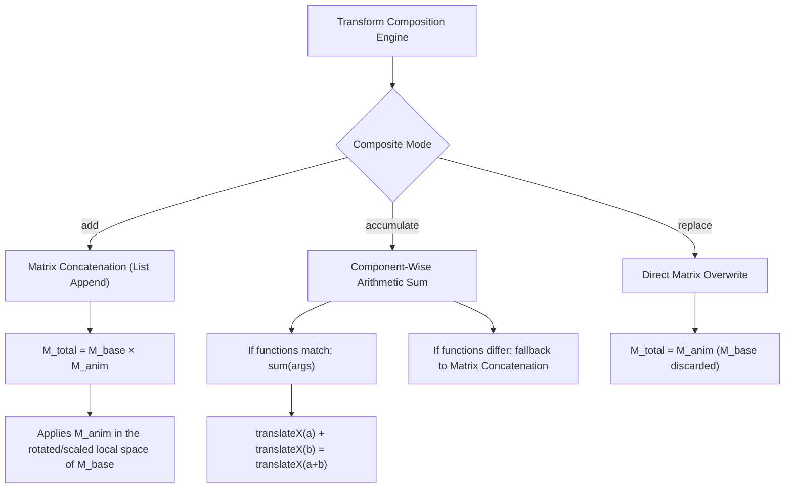
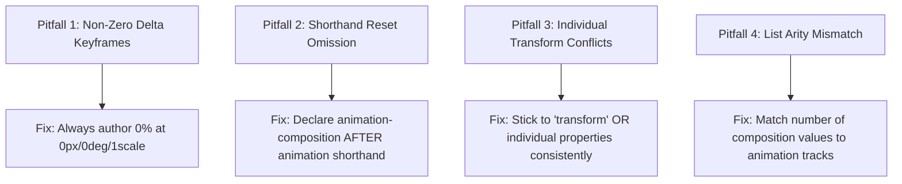

# 074: CSS Animation Composition (`animation-composition`) Masterclass

## Overview & Executive Summary

In traditional CSS development, combining multiple animations on the same element has always suffered from a fundamental limitation: **destructive property overwrite**. Under standard CSS cascade and animation semantics, if two or more keyframe animations target the same property (such as `transform`, `filter`, `box-shadow`, or `opacity`), the last declared animation completely replaces all preceding animation effects and obliterates any base inline or hover styles.

Historically, UI engineers were forced into costly, anti-pattern architectural workarounds:
1. **DOM Wrapper Hell**: Nesting multiple redundant `<div>` or `<span>` wrapper elements just to apply individual transform operations (e.g., an outer wrapper for horizontal drift, a middle wrapper for vertical floating, and an inner wrapper for rotational wobble).
2. **Monolithic Keyframe Duplication**: Manually baking every simultaneous motion into a single, brittle, unmaintainable `@keyframes` timeline where every milestone must recalculate combined translate, rotate, and scale coordinates.
3. **CSS Variable Hacks**: Piping transform values through custom properties (`--tx`, `--ty`, `--rot`), which breaks modular utility classes and prevents clean animation composition across independent stylesheets.

The CSS Animations Level 2 specification solves this permanently with the **`animation-composition`** property.

```
================================================================================
                    THE ANIMATION COMPOSITION PARADIGM SHIFT
================================================================================

  LEGACY WORKAROUND: "WRAPPER HELL"           MODERN CSS: animation-composition
  ---------------------------------           ---------------------------------
  <div class="drift-wrapper">                 <button class="kinetic-badge">
    <div class="float-wrapper">                 <!-- Single clean DOM node! -->
      <div class="wobble-wrapper">              Notifications (4)
        <button class="badge">                </button>
          Notifications (4)
        </button>                             .kinetic-badge {
      </div>                                    /* 3 independent keyframe tracks */
    </div>                                      animation: drift 8s linear infinite,
  </div>                                                   float 3s ease-in-out infinite,
                                                           wobble 1s ease-in-out infinite;
  DOM overhead: 4 nodes, 3 layout contexts.      animation-composition: add;
  Styles cannot easily share state.           }
================================================================================
```

The `animation-composition` property defines the **composite operation** used when multiple animations affect the same CSS property simultaneously, or when an animation acts upon an element with an existing underlying base style (such as an inline `transform: scale(1.1)` on `:hover`).

The property accepts three distinct composite operations:
- **`replace`** (Default): The animated value completely replaces the underlying value.
- **`add`**: The animated value is added to / appended after the underlying value (concatenating transform lists or summing scalar dimensions).
- **`accumulate`**: The animated value is algebraically combined with the underlying value (combining matching transform functions, summing pixel offsets, or merging color channels).

---

## Quick Reference Metadata

| Attribute | Specification Details |
| :--- | :--- |
| **Name** | CSS Animation Composition (`animation-composition`) |
| **Category** | CSS Animations Level 2, Keyframe Kinematics & Spatial Transforms |
| **Specification** | [W3C CSS Animations Level 2 § Animation Composition](https://www.w3.org/TR/css-animations-2/#animation-composition) |
| **Difficulty** | Advanced (4.3 / 5) |
| **What it produces** | Layered, multi-track, decoupled CSS keyframe animations that stack, add, or accumulate on the same element and property without overriding base styles or requiring nested DOM wrapper nodes. |
| **Why it works** | The browser's animation compositing engine evaluates keyframes against an underlying base value using vector/matrix addition (`add`), component-wise scalar accumulation (`accumulate`), or direct replacement (`replace`). |
| **Key Values** | `replace`, `add`, `accumulate`, and comma-separated lists for multi-animation assignment (e.g., `animation-composition: add, accumulate;`). |
| **Primary Target Properties** | `transform`, `filter`, `box-shadow`, `translate`, `rotate`, `scale`, `opacity`, `clip-path`, `color`, `background-position`. |
| **Browser Baseline** | **Baseline 2023+ (Widely Available)**: Chrome 112+ (Apr 2023), Safari 16.0+ (Sep 2022), Firefox 115+ (Jul 2023), Edge 112+ (Apr 2023). |
| **Acceptance Criteria** | 60/120 FPS hardware-accelerated execution on the GPU compositor thread; zero DOM bloat; seamless preservation of `:hover` / `:active` base transforms during continuous ambient animation; full `@media (prefers-reduced-motion)` compliance. |

### Quick Preview

```html
<button class="composed-interactive-btn">
  <span class="btn-sparkle">✦</span>
  <span class="btn-text">Boost Velocity</span>
</button>
```

```css
/* Base interactive styling */
.composed-interactive-btn {
  display: inline-flex;
  align-items: center;
  gap: 0.75rem;
  padding: 0.875rem 1.75rem;
  font-family: system-ui, sans-serif;
  font-size: 1rem;
  font-weight: 600;
  color: #f8fafc;
  background: linear-gradient(135deg, #6366f1, #a855f7);
  border: none;
  border-radius: 9999px;
  cursor: pointer;
  box-shadow: 0 10px 25px -5px rgba(99, 102, 241, 0.4);
  
  /* Base state transform */
  transform: translateY(0px) scale(1);
  transition: transform 0.25s cubic-bezier(0.34, 1.56, 0.64, 1);

  /* Layered animations: Ambient floating + Idle pulse */
  animation: 
    ambient-float 3s ease-in-out infinite alternate,
    idle-breath 2s ease-in-out infinite alternate;
  
  /* Critical: 'add' composites animations ON TOP of base transform & each other */
  animation-composition: add;
}

/* Base transform changes on hover; ambient animations naturally stack on top! */
.composed-interactive-btn:hover {
  transform: translateY(-4px) scale(1.08);
}

.composed-interactive-btn:active {
  transform: translateY(1px) scale(0.96);
}

/* Keyframes define DELTAS (relative offsets), not absolute states */
@keyframes ambient-float {
  0%   { transform: translateY(0px); }
  100% { transform: translateY(-8px); }
}

@keyframes idle-breath {
  0%   { transform: scale(1); }
  100% { transform: scale(1.03); }
}
```

---

## 1. Anatomy & Mathematical Mental Models

### 1.1 The Composite Operation Mathematical Model

When the browser renders an animated element at time $t$, it calculates the resulting value $V_{\text{result}}(t)$ by evaluating the **underlying value** $V_{\text{underlying}}$ against the **animated effect value** $V_{\text{anim}}(t)$.

$$\mathbf{V}_{\text{result}}(t) = \text{CompositeOp}\Big( \mathbf{V}_{\text{underlying}}, \mathbf{V}_{\text{anim}}(t) \Big)$$

```
┌─────────────────────────────────────────────────────────────────────────────┐
│                      COMPOSITE EVALUATION PIPELINE                          │
│                                                                             │
│   [Base Element Style]  ──> V_underlying (e.g., transform: scale(1.1))       │
│                                 │                                           │
│   [Keyframe Track 1]    ──> V_anim_1     (e.g., transform: translateY(-10px))│
│                                 ▼                                           │
│                         ┌───────────────┐                                   │
│                         │ animation-    │ ──> replace: V_anim_1             │
│                         │ composition   │ ──> add:     V_underlying V_anim_1│
│                         │ mode          │ ──> accum:   V_underlying + V_anim│
│                         └───────┬───────┘                                   │
│                                 ▼                                           │
│                         [Layer 1 Output]                                    │
│                                 │                                           │
│   [Keyframe Track 2]    ──> V_anim_2     (e.g., transform: rotate(15deg))   │
│                                 ▼                                           │
│                         [Final Computed Matrix at 120 FPS]                  │
└─────────────────────────────────────────────────────────────────────────────┘
```

---

### 1.2 Deep Dive: `replace` vs. `add` vs. `accumulate`

Understanding the exact mathematical distinction between the three composition values is essential for mastering kinetic typography, physical interactions, and spatial layering.

```
+-------------------------------------------------------------------------------+
|                    THE THREE COMPOSITE BEHAVIORS COMPARED                     |
+-------------------+---------------------------+-------------------------------+
| Composite Value   | Mathematical Formula      | Transform List Behavior       |
+-------------------+---------------------------+-------------------------------+
| replace (Default) | V_res = V_anim            | Overwrites base transform     |
| add               | V_res = V_base · V_anim   | Appends to transform list     |
| accumulate        | V_res = V_base + V_anim   | Merges matching functions     |
+-------------------+---------------------------+-------------------------------+
```

```
================================================================================
                     VISUALIZING THE THREE COMPOSITION MODES
================================================================================

  Base Style:     transform: translateX(100px);
  Animation 0%:   transform: translateX(0px);
  Animation 100%: transform: translateX(50px);

  1. REPLACE (Default)
     At 0%:   transform: translateX(0px);   <-- Base 100px is ERASED instantly!
     At 100%: transform: translateX(50px);

  2. ADD
     At 0%:   transform: translateX(100px) translateX(0px);
     At 100%: transform: translateX(100px) translateX(50px);
     Result:  Two separate matrix operations evaluated left-to-right (150px total).

  3. ACCUMULATE
     At 0%:   transform: translateX(100px + 0px)  => translateX(100px);
     At 100%: transform: translateX(100px + 50px) => translateX(150px);
     Result:  Parameters of identical functions are summed into a single operation.
================================================================================
```

#### Detailed Comparison Across CSS Data Types:

| Property / Data Type | Base Value | Animated Keyframe Value | `replace` Result | `add` Result | `accumulate` Result |
| :--- | :--- | :--- | :--- | :--- | :--- |
| **`transform` (Matching Type)** | `translateX(100px)` | `translateX(50px)` | `translateX(50px)` | `translateX(100px) translateX(50px)` | `translateX(150px)` |
| **`transform` (Differing Types)** | `scale(1.2)` | `rotate(45deg)` | `rotate(45deg)` | `scale(1.2) rotate(45deg)` | `scale(1.2) rotate(45deg)` |
| **`filter` (Matching Function)** | `blur(10px)` | `blur(5px)` | `blur(5px)` | `blur(10px) blur(5px)` | `blur(15px)` |
| **`filter` (Differing Functions)** | `brightness(1.5)` | `contrast(1.2)` | `contrast(1.2)` | `brightness(1.5) contrast(1.2)` | `brightness(1.5) contrast(1.2)` |
| **`opacity` (Scalar 0..1)** | `0.4` | `0.3` | `0.3` | `0.7` ($0.4 + 0.3$) | `0.7` ($0.4 + 0.3$) |
| **`box-shadow` (List)** | `0 4px 6px #000` | `0 10px 20px #6366f1` | `0 10px 20px #6366f1` | `0 4px 6px #000, 0 10px 20px #6366f1` | `0 14px 26px ...` (Summed coords) |
| **`color` / RGB Channels** | `rgb(100, 0, 0)` | `rgb(50, 50, 0)` | `rgb(50, 50, 0)` | `rgb(150, 50, 0)` | `rgb(150, 50, 0)` |

---

### 1.3 Transform Matrix Multiplication vs. Function Accumulation

When composing complex 3D transformations, the difference between `add` and `accumulate` becomes critical:



---

### 1.4 The Multi-Track Animation Stack Architecture

Like audio mixing consoles where separate vocal, drum, and synth tracks are summed into a master audio bus, modern CSS allows you to declare **independent kinetic tracks** running at distinct frequencies, easing curves, and iteration loops.

```
================================================================================
                    MULTI-TRACK KINETIC MIXING ARCHITECTURE
================================================================================

  TRACK 1: Ambient Y-Drift  ──[ 4.2s  sine-ease ]──>  translateY(±12px)
                                                           │
  TRACK 2: Micro-Wobble     ──[ 1.1s  custom-bez]──>  rotate(±2.5deg)
                                                           │  (animation-composition: add)
  TRACK 3: Click Elasticity ──[ 0.6s  spring    ]──>  scale(0.92 -> 1.0)
                                                           │
  TRACK 4: Base Hover State ──[ CSS Transition  ]──>  translateY(-6px) scale(1.05)
                                                           ▼
                                                MASTER COMPOSITOR BUS
                                                Final 120 FPS Matrix
================================================================================
```

---

## 2. The 5 Core CSS Animation Composition Primitives

---

### Primitive 1: Additive Base-State Preservation

The most frequent real-world challenge is running an ambient floating animation on an interactive button or card without disabling `:hover` or `:active` translations.

```css
/* The element has a fundamental resting & hover transform */
.interactive-node {
  transform: translateY(0px) scale(1);
  transition: transform 0.3s cubic-bezier(0.16, 1, 0.3, 1);

  /* Attach the ambient motion track */
  animation: ambient-hover-bob 2.4s ease-in-out infinite alternate;
  
  /* Prevent ambient keyframes from replacing hover scale/translation */
  animation-composition: add;
}

/* User hovers: base transform shifts cleanly to translateY(-10px) scale(1.06) */
.interactive-node:hover {
  transform: translateY(-10px) scale(1.06);
}

/* Delta keyframes: only define the oscillation offset */
@keyframes ambient-hover-bob {
  0% {
    transform: translateY(0px);
  }
  100% {
    transform: translateY(-6px);
  }
}
```

---

### Primitive 2: Decoupled Multi-Axis Harmonic Oscillators (Lissajous Curves)

By assigning separate animations to horizontal and vertical translations with differing prime-number durations, you create non-repeating, organic Lissajous orbital trajectories on a single DOM node.

```css
.lissajous-particle {
  inline-size: 20px;
  block-size: 20px;
  border-radius: 50%;
  background: #38bdf8;

  /* Multi-track animations with co-prime oscillation periods */
  animation: 
    harmonic-x 3.1s ease-in-out infinite alternate,
    harmonic-y 2.3s ease-in-out infinite alternate,
    harmonic-spin 5.7s linear infinite;

  /* Composite all three spatial tracks additively */
  animation-composition: add;
}

@keyframes harmonic-x {
  0%   { transform: translateX(-60px); }
  100% { transform: translateX(60px); }
}

@keyframes harmonic-y {
  0%   { transform: translateY(-40px); }
  100% { transform: translateY(40px); }
}

@keyframes harmonic-spin {
  0%   { transform: rotate(0deg); }
  100% { transform: rotate(360deg); }
}
```

---

### Primitive 3: Accumulative Filter and Glow Stacking

When layering dynamic visual effects (such as lighting flashes over ambient neon pulses), `animation-composition: accumulate` allows numeric filter parameters like `blur()` and `drop-shadow()` to sum together cleanly.

```css
.cyber-hud-beacon {
  background: #0f172a;
  border: 2px solid #06b6d4;
  color: #06b6d4;
  
  /* Base glow filter */
  filter: drop-shadow(0 0 8px rgba(6, 182, 212, 0.5)) blur(0px);

  /* Dual filter animations */
  animation: 
    neon-breathe 2s ease-in-out infinite alternate,
    radar-ping 0.8s ease-out infinite;
  
  /* Accumulate sums the blur and drop-shadow radius values */
  animation-composition: accumulate;
}

@keyframes neon-breathe {
  0%   { filter: drop-shadow(0 0 2px rgba(6, 182, 212, 0.2)) blur(0px); }
  100% { filter: drop-shadow(0 0 16px rgba(6, 182, 212, 0.8)) blur(0.5px); }
}

@keyframes radar-ping {
  0%   { filter: drop-shadow(0 0 0px rgba(255, 255, 255, 0)); }
  50%  { filter: drop-shadow(0 0 24px rgba(255, 255, 255, 0.9)); }
  100% { filter: drop-shadow(0 0 0px rgba(255, 255, 255, 0)); }
}
```

---

### Primitive 4: Comma-Separated Composition Lists

You can assign different composition rules to distinct animation slots in the `animation` declaration by supplying a comma-separated list of composition strategies.

```css
.complex-hybrid-entity {
  animation: 
    base-entrance 1s cubic-bezier(0.16, 1, 0.3, 1) forwards,     /* Track 1: Entrance */
    ambient-wobble 3s ease-in-out infinite alternate,           /* Track 2: Wobble */
    alert-color-flash 0.5s ease-in-out infinite alternate;      /* Track 3: Flash */

  /* Track 1 REPLACES initial state; Track 2 and 3 ADD on top */
  animation-composition: replace, add, add;
}
```

---

### Primitive 5: Relative Delta Keyframe Authoring Rule

When authoring keyframes for `animation-composition: add` or `accumulate`, the keyframe coordinates **must represent delta offsets from zero ($\Delta = 0$)**, rather than absolute coordinates.

```css
/* ❌ BAD (Legacy Mindset): Absolute Keyframe declaration */
@keyframes bad-float {
  0%   { transform: translateY(120px); } /* Will add 120px to base style! */
  100% { transform: translateY(140px); }
}

/*  GOOD (Additive Mindset): Pure Delta Offset declaration */
@keyframes good-float {
  0%   { transform: translateY(0px); }   /* 0px delta leaves base position untouched */
  100% { transform: translateY(-20px); } /* Translates -20px relative to whatever base is */
}
```

---

## 3. 6 Complete, Production-Ready Real-World Implementations

---

### Pattern 1: The Zero-Wrapper Kinetic Glassmorphic Card

A complete, high-fidelity UI card featuring simultaneous 3D hover-tilt, continuous floating levitation, micro-rotational breathing, and interactive click compression—rendered on a **single DOM element** with zero wrapper containers.

```html
<div class="demo-viewport">
  <article class="kinetic-glass-card" tabindex="0">
    <div class="card-chip">PRO SYSTEM</div>
    <h3 class="card-title">Autonomous Core</h3>
    <p class="card-desc">
      Ultra-low latency edge compute node featuring self-healing neural routing and hardware encryption.
    </p>
    <div class="card-footer">
      <span class="status-indicator">
        <span class="status-dot"></span> Online
      </span>
      <button class="card-action-btn">Connect &rarr;</button>
    </div>
  </article>
</div>
```

```css
.demo-viewport {
  display: grid;
  place-items: center;
  min-block-size: 380px;
  padding: 2rem;
  background: radial-gradient(circle at 50% 30%, #1e1b4b, #0f172a, #020617);
  perspective: 1200px;
}

.kinetic-glass-card {
  --card-bg: rgba(30, 41, 59, 0.7);
  --card-border: rgba(148, 163, 184, 0.15);
  --card-glow: rgba(99, 102, 241, 0.25);

  inline-size: 100%;
  max-inline-size: 340px;
  padding: 2rem;
  border-radius: 24px;
  background: var(--card-bg);
  backdrop-filter: blur(16px);
  -webkit-backdrop-filter: blur(16px);
  border: 1px solid var(--card-border);
  color: #f8fafc;
  cursor: pointer;
  outline: none;
  box-shadow: 
    0 20px 40px -15px rgba(0, 0, 0, 0.6),
    0 0 0 1px rgba(255, 255, 255, 0.05);

  /* Base spatial state & smooth transition for hover/focus */
  transform: translateY(0px) rotateX(0deg) rotateY(0deg) scale(1);
  transition: 
    transform 0.4s cubic-bezier(0.16, 1, 0.3, 1),
    border-color 0.3s ease,
    box-shadow 0.4s ease;

  /* Multi-track animations: Float + Ambient Yaw Wobble */
  animation: 
    card-levitate 4.5s ease-in-out infinite alternate,
    card-yaw-wobble 6.2s ease-in-out infinite alternate;
  
  /* Additive composition keeps the base hover-tilt completely intact! */
  animation-composition: add;
  will-change: transform;
}

/* User Hover: Shifts base transformation matrix */
.kinetic-glass-card:hover,
.kinetic-glass-card:focus-visible {
  transform: translateY(-12px) rotateX(6deg) rotateY(-4deg) scale(1.03);
  border-color: rgba(168, 85, 247, 0.5);
  box-shadow: 
    0 30px 60px -20px var(--card-glow),
    0 0 30px 2px rgba(168, 85, 247, 0.2),
    0 0 0 1px rgba(255, 255, 255, 0.1);
}

/* User Active / Click: Direct spring compression */
.kinetic-glass-card:active {
  transform: translateY(-4px) scale(0.97);
  transition-duration: 0.1s;
}

/* Kinetic Track 1: Smooth Vertical Levitation */
@keyframes card-levitate {
  0% {
    transform: translateY(0px);
  }
  100% {
    transform: translateY(-14px);
  }
}

/* Kinetic Track 2: Subtle Angular Micro-Yaw */
@keyframes card-yaw-wobble {
  0% {
    transform: rotateZ(-1.2deg) rotateY(-2deg);
  }
  100% {
    transform: rotateZ(1.2deg) rotateY(2deg);
  }
}

/* Typography and internal components */
.card-chip {
  display: inline-block;
  font-size: 0.75rem;
  font-weight: 700;
  letter-spacing: 0.08em;
  padding: 0.25rem 0.75rem;
  border-radius: 9999px;
  background: rgba(99, 102, 241, 0.2);
  color: #a5b4fc;
  border: 1px solid rgba(99, 102, 241, 0.4);
  margin-block-end: 1rem;
}

.card-title {
  font-size: 1.5rem;
  font-weight: 700;
  margin-block: 0 0.5rem;
  color: #ffffff;
}

.card-desc {
  font-size: 0.9375rem;
  line-height: 1.6;
  color: #94a3b8;
  margin-block-end: 1.75rem;
}

.card-footer {
  display: flex;
  justify-content: space-between;
  align-items: center;
}

.status-indicator {
  display: inline-flex;
  align-items: center;
  gap: 0.5rem;
  font-size: 0.875rem;
  font-weight: 500;
  color: #34d399;
}

.status-dot {
  inline-size: 8px;
  block-size: 8px;
  border-radius: 50%;
  background: #34d399;
  box-shadow: 0 0 10px #34d399;
  animation: dot-pulse 1.8s ease-in-out infinite alternate;
  animation-composition: add;
}

@keyframes dot-pulse {
  0%   { transform: scale(1); opacity: 0.6; }
  100% { transform: scale(1.4); opacity: 1; }
}

.card-action-btn {
  padding: 0.5rem 1rem;
  border-radius: 12px;
  background: #6366f1;
  color: #ffffff;
  border: none;
  font-weight: 600;
  font-size: 0.875rem;
  cursor: pointer;
  transition: background 0.2s;
}

.card-action-btn:hover {
  background: #4f46e5;
}
```

---

### Pattern 2: Modular Decoupled Notification Badge Engine

A component system where utility classes (`.is-pulsing`, `.is-wobbling`, `.is-floating`, `.is-dismissing`) can be dynamically added to any UI element simultaneously without colliding or overriding each other's transforms.

```html
<div class="notification-hub">
  <!-- Badge with 3 composable classes applied concurrently -->
  <div class="notify-badge is-floating is-pulsing is-wobbling">
    <svg class="bell-icon" viewBox="0 0 24 24" fill="none" stroke="currentColor" stroke-width="2">
      <path d="M18 8A6 6 0 0 0 6 8c0 7-3 9-3 9h18s-3-2-3-9"></path>
      <path d="M13.73 21a2 2 0 0 1-3.46 0"></path>
    </svg>
    <span class="count-pill">9+</span>
  </div>
</div>
```

```css
/* Base Badge Container */
.notify-badge {
  position: relative;
  display: inline-flex;
  align-items: center;
  justify-content: center;
  inline-size: 56px;
  block-size: 56px;
  background: #1e293b;
  border: 2px solid #334155;
  border-radius: 16px;
  color: #f1f5f9;
  cursor: pointer;
  transform: scale(1) translateY(0px) rotate(0deg);
  transition: transform 0.2s cubic-bezier(0.34, 1.56, 0.64, 1);
  will-change: transform;
}

.notify-badge:hover {
  transform: scale(1.1) translateY(-2px);
}

.bell-icon {
  inline-size: 26px;
  block-size: 26px;
}

.count-pill {
  position: absolute;
  inset-block-start: -6px;
  inset-inline-end: -6px;
  background: #ef4444;
  color: #ffffff;
  font-size: 0.75rem;
  font-weight: 700;
  padding: 0.15rem 0.5rem;
  border-radius: 9999px;
  border: 2px solid #0f172a;
}

/* ==========================================================================
   MODULAR COMPOSABLE UTILITIES
   Each class attaches its own independent animation track via 'add'
   ========================================================================== */

.is-floating {
  animation: mod-float 3.2s ease-in-out infinite alternate !important;
  animation-composition: add !important;
}

.is-pulsing {
  animation: mod-pulse 2s ease-in-out infinite alternate !important;
  animation-composition: add !important;
}

.is-wobbling {
  animation: mod-wobble 1.4s ease-in-out infinite alternate !important;
  animation-composition: add !important;
}

.is-dismissing {
  animation: mod-dismiss 0.5s cubic-bezier(0.16, 1, 0.3, 1) forwards !important;
  animation-composition: add !important;
}

/* Standalone Delta Keyframe Tracks */
@keyframes mod-float {
  0%   { transform: translateY(0px); }
  100% { transform: translateY(-8px); }
}

@keyframes mod-pulse {
  0%   { transform: scale(1); }
  100% { transform: scale(1.05); }
}

@keyframes mod-wobble {
  0%   { transform: rotate(-3.5deg); }
  100% { transform: rotate(3.5deg); }
}

@keyframes mod-dismiss {
  0%   { transform: scale(1) translateY(0); opacity: 1; }
  100% { transform: scale(0.6) translateY(20px); opacity: 0; }
}
```

---

### Pattern 3: The Multi-Frequency Lissajous Orbital Particle Field

Creates mesmerizing, non-repeating planetary/quantum orbits by compounding independent sinusoidal coordinate transformations with `animation-composition: add`.

```html
<div class="orbit-stage">
  <div class="orbit-center-sun"></div>
  <div class="lissajous-orb orb-alpha"></div>
  <div class="lissajous-orb orb-beta"></div>
  <div class="lissajous-orb orb-gamma"></div>
</div>
```

```css
.orbit-stage {
  position: relative;
  inline-size: 320px;
  block-size: 320px;
  border-radius: 50%;
  background: radial-gradient(circle, #0f172a 0%, #020617 100%);
  border: 1px dashed rgba(255, 255, 255, 0.1);
  display: grid;
  place-items: center;
  overflow: hidden;
}

.orbit-center-sun {
  inline-size: 36px;
  block-size: 36px;
  border-radius: 50%;
  background: radial-gradient(circle, #f59e0b, #d97706);
  box-shadow: 0 0 25px #f59e0b;
}

.lissajous-orb {
  position: absolute;
  inline-size: 14px;
  block-size: 14px;
  border-radius: 50%;
  will-change: transform;
}

/* Orb Alpha: Ratio 3:2 Lissajous Curve (Figure 8 Knot) */
.orb-alpha {
  background: #38bdf8;
  box-shadow: 0 0 14px #38bdf8;
  animation: 
    liss-x 2.4s ease-in-out infinite alternate,
    liss-y 1.6s ease-in-out infinite alternate;
  animation-composition: add;
}

/* Orb Beta: Ratio 5:4 Complex Celestial Orbit */
.orb-beta {
  background: #ec4899;
  box-shadow: 0 0 14px #ec4899;
  animation: 
    liss-x 3.5s ease-in-out infinite alternate,
    liss-y 2.8s ease-in-out infinite alternate,
    liss-z-spin 7s linear infinite;
  animation-composition: add;
}

/* Orb Gamma: High-speed Harmonic Wave */
.orb-gamma {
  background: #10b981;
  box-shadow: 0 0 14px #10b981;
  animation: 
    liss-x 1.9s ease-in-out infinite alternate,
    liss-y 3.8s ease-in-out infinite alternate;
  animation-composition: add;
}

@keyframes liss-x {
  0%   { transform: translateX(-90px); }
  100% { transform: translateX(90px); }
}

@keyframes liss-y {
  0%   { transform: translateY(-70px); }
  100% { transform: translateY(70px); }
}

@keyframes liss-z-spin {
  0%   { transform: rotate(0deg) scale(0.85); }
  50%  { transform: scale(1.2); }
  100% { transform: rotate(360deg) scale(0.85); }
}
```

---

### Pattern 4: Gamified Reward Loot-Chest with Damped Hover Shake & Burst

Demonstrates how `animation-composition: add` enables an interactive game element to have an ambient idle float, an intense spring wobble on hover, and an explosive scale expansion on click without collision.

```html
<div class="loot-stage">
  <div class="loot-chest" id="lootChest" role="button" aria-label="Open Reward Chest">
    <div class="chest-glow"></div>
    <div class="chest-box">
      <div class="chest-lock">✦</div>
    </div>
  </div>
</div>
```

```css
.loot-stage {
  display: grid;
  place-items: center;
  min-block-size: 260px;
}

.loot-chest {
  position: relative;
  display: inline-block;
  cursor: pointer;
  user-select: none;
  
  /* Base state */
  transform: translateY(0px) rotate(0deg) scale(1);
  transition: transform 0.2s cubic-bezier(0.34, 1.56, 0.64, 1);

  /* Ambient Track: Calm floating */
  animation: chest-ambient-hover 3s ease-in-out infinite alternate;
  animation-composition: add;
}

/* Hover: Injects violent kinetic tension and spring excitation */
.loot-chest:hover {
  animation: 
    chest-ambient-hover 3s ease-in-out infinite alternate,
    chest-damped-shiver 0.35s ease-in-out infinite alternate;
  animation-composition: add;
}

/* Active / Click: Impact expansion */
.loot-chest:active {
  transform: scale(0.92);
}

.loot-chest.opened {
  animation: 
    chest-burst-reveal 0.8s cubic-bezier(0.16, 1, 0.3, 1) forwards;
  animation-composition: add;
}

.chest-box {
  inline-size: 90px;
  block-size: 80px;
  background: linear-gradient(180deg, #d97706, #78350f);
  border: 3px solid #fef08a;
  border-radius: 18px;
  display: grid;
  place-items: center;
  box-shadow: 
    0 16px 30px -8px rgba(0, 0, 0, 0.7),
    inset 0 2px 4px rgba(255, 255, 255, 0.4);
}

.chest-lock {
  font-size: 1.75rem;
  color: #fef08a;
  filter: drop-shadow(0 0 8px #f59e0b);
}

@keyframes chest-ambient-hover {
  0%   { transform: translateY(0px); }
  100% { transform: translateY(-10px); }
}

@keyframes chest-damped-shiver {
  0%   { transform: rotate(-4deg) scale(1.02); }
  100% { transform: rotate(4deg) scale(1.04); }
}

@keyframes chest-burst-reveal {
  0%   { transform: scale(1); }
  40%  { transform: scale(1.35) rotate(-6deg); }
  100% { transform: scale(1.15) translateY(-20px); }
}
```

---

### Pattern 5: Cyberpunk HUD Beacon with Multi-Layered Filter Accumulation

Demonstrates `animation-composition: accumulate` combining base CSS filters with multiple dynamic scanline pulses and neon surges without wiping out existing filter properties.

```html
<div class="hud-beacon-panel">
  <div class="hud-scanner-unit">
    <div class="hud-grid-crosshair"></div>
    <span class="hud-status-text">TARGET ACQUIRED</span>
  </div>
</div>
```

```css
.hud-beacon-panel {
  display: grid;
  place-items: center;
  min-block-size: 240px;
  background: #020617;
}

.hud-scanner-unit {
  position: relative;
  display: flex;
  flex-direction: column;
  align-items: center;
  gap: 1rem;
  padding: 1.75rem 2.5rem;
  border-radius: 12px;
  background: rgba(8, 47, 73, 0.4);
  border: 1px solid #0284c7;
  color: #38bdf8;
  font-family: 'Courier New', Courier, monospace;
  letter-spacing: 0.15em;
  font-weight: 700;

  /* Base Filter Configuration */
  filter: drop-shadow(0 0 6px rgba(56, 189, 248, 0.4)) blur(0px) brightness(1);

  /* Dual keyframe tracks for HUD breathing and radar sweep */
  animation: 
    hud-neon-surge 2.4s ease-in-out infinite alternate,
    hud-glitch-flicker 4s steps(2, start) infinite;

  /* ACCUMULATE adds numeric filter values together component-wise */
  animation-composition: accumulate;
}

@keyframes hud-neon-surge {
  0% {
    filter: drop-shadow(0 0 2px rgba(56, 189, 248, 0.2)) brightness(0.9);
  }
  100% {
    filter: drop-shadow(0 0 18px rgba(56, 189, 248, 0.9)) brightness(1.3);
  }
}

@keyframes hud-glitch-flicker {
  0%, 100% {
    filter: blur(0px) hue-rotate(0deg);
  }
  92% {
    filter: blur(0px) hue-rotate(0deg);
  }
  94% {
    filter: blur(1.5px) hue-rotate(90deg);
  }
  96% {
    filter: blur(0px) hue-rotate(0deg);
  }
  98% {
    filter: blur(2px) hue-rotate(-90deg);
  }
}

.hud-grid-crosshair {
  inline-size: 32px;
  block-size: 32px;
  border: 2px dashed #38bdf8;
  border-radius: 50%;
  animation: crosshair-rotate 8s linear infinite;
  animation-composition: add;
}

@keyframes crosshair-rotate {
  0%   { transform: rotate(0deg); }
  100% { transform: rotate(360deg); }
}
```

---

### Pattern 6: Decoupled Staggered Kinetic Typography

Applies modular wave offsets, character jitter, and ambient breathing across individual glyph spans without breaking baseline layout or font geometry.

```html
<h2 class="kinetic-text-heading" aria-label="COMPOSABLE">
  <span class="glyph" style="--i: 0">C</span>
  <span class="glyph" style="--i: 1">O</span>
  <span class="glyph" style="--i: 2">M</span>
  <span class="glyph" style="--i: 3">P</span>
  <span class="glyph" style="--i: 4">O</span>
  <span class="glyph" style="--i: 5">S</span>
  <span class="glyph" style="--i: 6">A</span>
  <span class="glyph" style="--i: 7">B</span>
  <span class="glyph" style="--i: 8">L</span>
  <span class="glyph" style="--i: 9">E</span>
</h2>
```

```css
.kinetic-text-heading {
  display: flex;
  gap: 0.15em;
  font-family: system-ui, sans-serif;
  font-size: 3.5rem;
  font-weight: 900;
  color: #ffffff;
  letter-spacing: -0.02em;
}

.glyph {
  display: inline-block;
  /* Base state */
  transform: translateY(0px) rotate(0deg) scale(1);
  transition: transform 0.25s cubic-bezier(0.34, 1.56, 0.64, 1), color 0.2s;
  cursor: pointer;

  /* Staggered Sine Wave + High Frequency Micro-Jitter */
  animation: 
    text-sine-wave 2.6s ease-in-out infinite alternate,
    text-glyph-jitter 3.8s ease-in-out infinite alternate;
  
  /* Stagger delays per character */
  animation-delay: calc(var(--i) * 120ms);
  animation-composition: add;
}

.glyph:hover {
  transform: translateY(-16px) scale(1.3) rotate(8deg);
  color: #38bdf8;
}

@keyframes text-sine-wave {
  0% {
    transform: translateY(0px);
  }
  100% {
    transform: translateY(-12px);
  }
}

@keyframes text-glyph-jitter {
  0% {
    transform: rotate(-3deg);
  }
  100% {
    transform: rotate(3deg);
  }
}
```

---

## 4. Web Animations API (WAAPI) Integration & Dynamic Controller

`animation-composition` maps directly to the Web Animations API `composite` and `iterationComposite` options. The following production controller dynamically mounts and mixes programmatic kinetic tracks on any DOM element.

```javascript
/**
 * KineticCompositionController
 * Orchestrates multi-track CSS & WAAPI animations using native additive composition.
 */
export class KineticCompositionController {
  /**
   * @param {HTMLElement} element 
   */
  constructor(element) {
    if (!(element instanceof HTMLElement)) {
      throw new Error("KineticCompositionController requires a valid HTMLElement");
    }
    this.element = element;
    this.activeTracks = new Map();
  }

  /**
   * Mounts a new additive kinetic track onto the element
   * @param {string} trackName - Unique identifier for the motion track
   * @param {Keyframe[] | PropertyIndexedKeyframes} keyframes - Keyframe definitions
   * @param {KeyframeAnimationOptions} options - Timing options
   * @param {'add' | 'accumulate' | 'replace'} [compositeMode='add']
   */
  addTrack(trackName, keyframes, options, compositeMode = 'add') {
    // Cancel existing track with identical name if present
    if (this.activeTracks.has(trackName)) {
      this.removeTrack(trackName);
    }

    const animation = this.element.animate(keyframes, {
      ...options,
      composite: compositeMode, // Map to WAAPI composition
      iterationComposite: compositeMode === 'accumulate' ? 'accumulate' : 'replace'
    });

    this.activeTracks.set(trackName, animation);
    return animation;
  }

  /**
   * Removes and cancels an active animation track
   * @param {string} trackName 
   */
  removeTrack(trackName) {
    const anim = this.activeTracks.get(trackName);
    if (anim) {
      anim.cancel();
      this.activeTracks.delete(trackName);
    }
  }

  /**
   * Gracefully cancels all active kinetic tracks
   */
  clearAllTracks() {
    for (const [name] of this.activeTracks) {
      this.removeTrack(name);
    }
  }
}

// Example Usage in Production:
document.addEventListener('DOMContentLoaded', () => {
  const cardElement = document.querySelector('.kinetic-glass-card');
  if (!cardElement) return;

  const controller = new KineticCompositionController(cardElement);

  // Track 1: Smooth Additive Ambient Float
  controller.addTrack(
    'ambient-float',
    [
      { transform: 'translateY(0px)' },
      { transform: 'translateY(-10px)' }
    ],
    {
      duration: 3200,
      iterations: Infinity,
      direction: 'alternate',
      easing: 'ease-in-out'
    },
    'add'
  );

  // Track 2: Mouse Movement Magnetic Tilt Offset (Additive)
  window.addEventListener('pointermove', (e) => {
    const { clientX, clientY } = e;
    const rect = cardElement.getBoundingClientRect();
    const centerX = rect.left + rect.width / 2;
    const centerY = rect.top + rect.height / 2;

    const deltaX = (clientX - centerX) / (window.innerWidth / 2);
    const deltaY = (clientY - centerY) / (window.innerHeight / 2);

    // Apply interactive magnetic yaw track without disrupting ambient float
    controller.addTrack(
      'magnetic-tilt',
      [
        { transform: `rotateX(${-deltaY * 8}deg) rotateY(${deltaX * 8}deg)` }
      ],
      {
        duration: 400,
        fill: 'forwards',
        easing: 'cubic-bezier(0.16, 1, 0.3, 1)'
      },
      'add'
    );
  });
});
```

---

## 5. Performance, GPU Compositing & 120 FPS Optimization

To maintain continuous 60–120 FPS rendering without frame drops on high-refresh mobile and desktop displays, animated properties must adhere strictly to compositor-only execution rules.

```
================================================================================
                        GPU COMPOSITOR PIPELINE TRACE
================================================================================

  [DOM Mutation / Hover] ──> [Recalculate Style] ──> [Layout] (SKIPPED)
                                                        │
                                                        ▼
  [Composite Layers] <── [GPU Upload] <── [Paint / Raster] (SKIPPED)
        │
        ▼
  120 FPS Hardware Matrix Multiplies (transform / opacity / animation-composition: add)
================================================================================
```

### Critical Performance Guidelines:

1. **Only Animate Compositor Properties**:
   - `transform` and `opacity` are guaranteed to run directly on the GPU compositor thread without triggering layout recalibrations or repaints.
   - `filter` is hardware-accelerated in modern Chromium, Safari, and Firefox, but excessive `blur()` radii (> 20px) under `accumulate` can increase GPU rasterization load.
2. **Promote Layers Explicitly**:
   ```css
   .composed-element {
     will-change: transform;
     transform: translateZ(0); /* Force discrete compositor layer */
   }
   ```
3. **Avoid Unintended Accumulation Overflow**:
   - When using `animation-composition: accumulate` on scalar values like `scale()` or `opacity`, verify that repeating loops do not continuously scale past intended boundaries if not reset at 0%.

---

## 6. Accessibility & `@media (prefers-reduced-motion)`

Multi-track composed animations (combining floating, wobble, and pulse) can trigger vestibular disorientation, vertigo, or nausea in motion-sensitive individuals. A comprehensive reduced-motion strategy must cleanly resolve all additive tracks to resting equilibrium ($0\Delta$).

```css
/* ==========================================================================
   ACCESSIBLE REDUCED MOTION SPECIFICATION
   ========================================================================== */
@media (prefers-reduced-motion: reduce) {
  *,
  *::before,
  *::after {
    /* 1. Terminate all multi-track keyframe loops immediately */
    animation-duration: 0.01ms !important;
    animation-iteration-count: 1 !important;
    
    /* 2. Revert composition to default replacement to prevent accumulated drift */
    animation-composition: replace !important;
    
    /* 3. Shorten interactive transitions to instant or subtle fades */
    transition-duration: 0.1s !important;
  }

  /* Preserve essential non-motion state feedback using gentle opacity fades */
  .kinetic-glass-card:hover,
  .composed-interactive-btn:hover {
    transform: none !important;
    opacity: 0.92;
  }
}
```

---

## 7. Common Pitfalls, Edge Cases & Debugging Solutions



### Pitfall 1: The Initial Non-Zero Delta Trap
- **Symptom**: When the animation starts, the element violently jumps twice as far as intended.
- **Cause**: If an element has `transform: translateY(20px)` and an additive animation declares `0% { transform: translateY(20px); }`, `add` computes $20\text{px} + 20\text{px} = 40\text{px}$ on frame 0.
- **Solution**: Always author additive keyframes starting from **zero offset** (`0% { transform: translateY(0px); }`).

### Pitfall 2: Overriding via Shorthand Placement
- **Symptom**: `animation-composition: add` appears to have no effect; animations still overwrite each other.
- **Cause**: Placing `animation: ...` *after* `animation-composition` in the CSS cascade can reset `animation-composition` to its default value in some parsers.
- **Solution**: Always declare `animation-composition` **below** the `animation` shorthand.
  ```css
  /*  CORRECT ORDER */
  .my-node {
    animation: track-a 2s infinite, track-b 3s infinite;
    animation-composition: add;
  }
  ```

### Pitfall 3: Mixing `transform` with Individual Transform Properties
- **Symptom**: The `translate` property is not composing with `transform: rotate()`.
- **Cause**: CSS individual transform properties (`translate`, `rotate`, `scale`) and the traditional `transform` list property are evaluated as independent layers in the CSS Transforms Level 2 spec.
- **Solution**: Either compose entirely within the `transform` property using `animation-composition: add`, or animate individual properties directly.

---

## 8. Master Production Checklist

Before deploying composed CSS animations to production, verify every item:

- [ ] **Cascade Order**: Is `animation-composition` declared **after** all `animation` shorthand declarations?
- [ ] **Zero-Delta Verification**: Do all additive keyframe tracks initiate from neutral zero state (`translate(0)`, `rotate(0deg)`, `scale(1)`)?
- [ ] **Compositor Promotion**: Are all animated nodes promoted to hardware layers via `will-change: transform`?
- [ ] **Reduced Motion Fallback**: Does `@media (prefers-reduced-motion: reduce)` cleanly settle all layered tracks?
- [ ] **Arity Alignment**: For multi-animation declarations with mixed composition modes, does the list of composition values match the count of animation tracks?
- [ ] **Zero DOM Bloat**: Have all redundant wrapper `<div>` nodes created solely for transform isolation been eliminated?
- [ ] **Cross-Browser Verification**: Has the composition behavior been tested in Chrome 112+, Safari 16+, and Firefox 115+?
