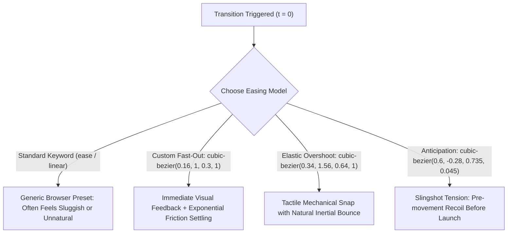

# 075: CSS Custom cubic-bezier() Timing Functions & Easing Curves Masterclass

## Overview & Executive Summary

In digital product design and UI engineering, the difference between a mechanical, amateur interface and a fluid, tactile, award-winning user experience lies in **motion cadence**. Default CSS easing keywords (`ease`, `linear`, `ease-in`, `ease-out`, `ease-in-out`) represent generic mathematical presets that often feel sluggish, disconnected from physical momentum, or devoid of brand identity.

**Custom `cubic-bezier()` timing functions** allow developers and motion designers to mathematically define the exact acceleration, velocity curves, overshoot dynamics, and settling behavior of transitions and keyframe animations. By manipulating a third-order parametric polynomial curve in a two-dimensional unit coordinate space, you can simulate real-world physical properties such as mass, gravity, elasticity, hydraulic resistance, and kinetic snap—running natively on the browser's GPU compositor thread at a fluid 60 to 120 FPS.

```
+-------------------------------------------------------------------------------+
|                    CSS CUBIC-BEZIER KINEMATICS & COORDINATE SPACE             |
|                                                                               |
|   1. Standard Sigmoid (Ease)    2. Over-Unity Elastic Snap     3. Slingshot Anticipation |
|      cubic-bezier(0.4, 0, 0.2, 1)  cubic-bezier(0.34, 1.56, 0.64, 1)  cubic-bezier(0.6, -0.3, 0.7, 0) |
|         Progression Y (1.0)           Progression Y (1.0)           Progression Y (1.0)       |
|       1.0┌───────P3(1,1)            1.5┌───────P1(y>1)            1.0┌───────P3(1,1)          |
|          │      /                      │      /\                     │      /                 |
|          │    ╭╯                       │     ╭╯ ╰─P3(1,1)            │    ╭╯                  |
|          │  ╭╯                         │   ╭╯                        │   │                    |
|          │ ╭╯                          │ ╭╯                          │  │                     |
|          │╭╯                         1.0││                         0.0│  │                     |
|       0.0└P0(0,0)───Time X          0.0└P0(0,0)───Time X         -0.3└─P1(y<0)──Time X       |
|                                                                                       |
|   4. Ultra-Decel Fast-Out       5. Symmetrical S-Curve        6. Dual-Phase Asymmetry |
|      (Apple/Material Decel)        (Cinematic Heavy Inertia)     (Snappy Open, Fast Dismiss) |
|      cubic-bezier(0.16, 1, 0.3, 1) cubic-bezier(0.85, 0, 0.15, 1) Enter vs Exit Curves       |
+-------------------------------------------------------------------------------+
```

---

## Quick Reference Metadata

| Attribute | Specification Details |
| :--- | :--- |
| **Name** | CSS Custom `cubic-bezier()` Timing Functions & Easing Curves |
| **Category** | CSS Motion Engineering, Transitions & Micro-Interactions |
| **Difficulty** | Intermediate to Advanced (3.5/5) |
| **What it produces** | Bespoke acceleration curves, momentum dissipation, single-bounce overshoots, elastic snaps, and anticipation recoil directly within CSS transitions and keyframes. |
| **Why it works** | The browser's animation subsystem computes an analytical cubic Bézier interpolation curve $B(t)$ defined by four control points ($P_0, P_1, P_2, P_3$), mapping normalized time ($X$) to property progression ($Y$). |
| **Key Properties** | `transition-timing-function`, `animation-timing-function`, `transition`, `animation`, `transform`, `opacity`, `will-change`, `@property`. |
| **Strict Constraints** | The control point time coordinates must remain strictly inside the unit interval: $0 \le x_1, x_2 \le 1$. If $x_1$ or $x_2$ falls outside $[0, 1]$, the entire CSS declaration is invalid and dropped. The progression coordinates $y_1, y_2$ have no bounds ($-\infty < y < \infty$), allowing overshoot ($y > 1$) and anticipation ($y < 0$). |
| **Browser Baseline** | Baseline 2015+ (Universal across Chrome, Firefox, Safari, Edge, iOS Safari, Android Chrome). |
| **Acceptance Criteria** | Silky 60/120 FPS hardware-composited transitions; zero layout thrashing or paint invalidations; distinct tactile feel tailored to user intent; complete accessible fallbacks via `@media (prefers-reduced-motion)`. |

### Quick Preview

```html
<button class="bezier-btn" type="button">
  <span class="btn-text">Interact With Physics</span>
  <span class="btn-glow" aria-hidden="true"></span>
</button>
```

```css
:root {
  /* Fast-out exponential deceleration curve */
  --ease-out-expo: cubic-bezier(0.16, 1, 0.3, 1);
  /* Snappy elastic recoil overshoot */
  --ease-elastic: cubic-bezier(0.34, 1.56, 0.64, 1);
}

.bezier-btn {
  position: relative;
  padding: 1rem 2.25rem;
  font-family: system-ui, -apple-system, sans-serif;
  font-size: 1rem;
  font-weight: 600;
  color: #ffffff;
  background: #0f172a;
  border: 1px solid rgba(255, 255, 255, 0.15);
  border-radius: 12px;
  cursor: pointer;
  overflow: hidden;
  transform: translateZ(0);
  /* Apply custom cubic bezier to transform and shadow */
  transition: transform 400ms var(--ease-elastic),
              border-color 300ms var(--ease-out-expo),
              box-shadow 400ms var(--ease-elastic);
  box-shadow: 0 4px 12px rgba(0, 0, 0, 0.3);
}

.bezier-btn:hover {
  transform: translateY(-4px) scale(1.03);
  border-color: rgba(99, 102, 241, 0.6);
  box-shadow: 0 16px 32px -4px rgba(99, 102, 241, 0.4);
}

.bezier-btn:active {
  transform: translateY(1px) scale(0.97);
  transition-duration: 150ms;
}
```

---

## 1. Mathematical Foundations & Browser Mechanics

### 1.1 The Cubic Bézier Formula & Parametric Representation

A cubic Bézier curve is a parametric 2D curve defined by four control points:
- **$P_0 = (0, 0)$**: The fixed origin, representing time $t=0$ and initial property progression $0\%$.
- **$P_1 = (x_1, y_1)$**: The first dynamic control point handle (governs initial acceleration and trajectory tangent).
- **$P_2 = (x_2, y_2)$**: The second dynamic control point handle (governs terminal deceleration and approach vector).
- **$P_3 = (1, 1)$**: The fixed termination point, representing normalized time $t=1$ and target property progression $100\%$.

The explicit polynomial equation for the curve is:

$$B(t) = (1-t)^3 P_0 + 3(1-t)^2 t P_1 + 3(1-t) t^2 P_2 + t^3 P_3, \quad t \in [0, 1]$$

Decomposing into separate Cartesian coordinate components:

$$X(t) = 3(1-t)^2 t \, x_1 + 3(1-t) t^2 \, x_2 + t^3$$

$$Y(t) = 3(1-t)^2 t \, y_1 + 3(1-t) t^2 \, y_2 + t^3$$

```
 Progression Y (Value)
       ▲
   1.0 │                       P2 (x2, y2) ────── P3 (1.0, 1.0)
       │                                     /
       │                                ╭──╯
       │                           ╭───╯
       │                       ╭──╯
       │                  ╭───╯
       │              ╭──╯
   0.0 │ P0 (0,0) ──── P1 (x1, y1)
       └────────────────────────────────────────────────► Normalized Time X
       0.0                                            1.0
```

#### How the Browser Solves Bézier Curves in C++ (Blink / Gecko / WebKit):
In computer graphics and browser rendering engines:
1. The CSS transition clock provides a normalized elapsed time $X \in [0, 1]$.
2. The engine must determine the parametric parameter $t$ such that $X(t) = X_{\text{elapsed}}$. Because $X(t)$ is cubic, analytical inversion is expensive, so browsers use **Newton-Raphson numerical iteration** (with bisection fallback for stability):
   $$t_{n+1} = t_n - \frac{X(t_n) - X_{\text{elapsed}}}{X'(t_n)}$$
3. Once $t$ is calculated to within subpixel tolerance ($\epsilon < 10^{-6}$), the engine computes $Y(t)$ directly.
4. $Y(t)$ is multiplied by the target delta $(\Delta = \text{EndValue} - \text{StartValue})$ and applied to the DOM/RenderLayer property matrix.

---

### 1.2 Standard Keyword Mapping vs. Custom Béziers

CSS provides five predefined easing keywords. Each is simply an alias for an underlying `cubic-bezier()` definition:

| Keyword | Equivalent `cubic-bezier()` | Initial Slope ($dy/dx$ at $t=0$) | Terminal Slope ($dy/dx$ at $t=1$) | Characteristic Feel |
| :--- | :--- | :--- | :--- | :--- |
| `linear` | `cubic-bezier(0.0, 0.0, 1.0, 1.0)` | $1.0$ (Constant) | $1.0$ (Constant) | Mechanical, robotic, robotic conveyer belt. |
| `ease` (Default) | `cubic-bezier(0.25, 0.1, 0.25, 1.0)` | $0.4$ (Mild start) | $0.0$ (Soft landing) | Generic default; slightly sluggish onset. |
| `ease-in` | `cubic-bezier(0.42, 0.0, 1.0, 1.0)` | $0.0$ (Slow start) | $1.0$ (Abrupt stop) | Heavy acceleration; crashes into boundary without braking. |
| `ease-out` | `cubic-bezier(0.0, 0.0, 0.58, 1.0)` | $1.0$ (Fast start) | $0.0$ (Gentle stop) | Friction deceleration; pleasant for entry UI. |
| `ease-in-out` | `cubic-bezier(0.42, 0.0, 0.58, 1.0)` | $0.0$ (Slow start) | $0.0$ (Slow finish) | Symmetric S-curve; often too slow at the extremities. |



---

### 1.3 The 4 Curvature Regimes & Velocity Profiles

Understanding how the placement of control points $(P_1, P_2)$ dictates the instantaneous velocity ($v(t) = \frac{dY}{dX}$) is essential for professional motion design.

```
1. DECELERATING (Ease-Out)       2. ACCELERATING (Ease-In)        3. OVER-UNITY (Overshoot)
   P1 is steep, P2 is flat          P1 is flat, P2 is steep          P1.y or P2.y > 1.0
   1.0┌───────...P2                 1.0┌────────────P2               1.4┌───────P1
      │      /                         │           /                    │      /\
      │    ╭╯                          │         ╭╯                     │    ╭╯  ╰─P3
      │  ╭╯                            │       ╭╯                    1.0│  ╭╯
      │ ╭╯                             │     ╭╯                         │ ╭╯
   0.0└P1───────Time X              0.0└P1──╯───────Time X           0.0└P0───────Time X
   Velocity: High -> Low            Velocity: Low -> High            Overshoots 100% boundary
```

#### The Four Archetypal Regimes:
1. **Exponential Fast-Out (Deceleration)**: $x_1 \approx 0.05 \text{–} 0.2$, $y_1 \approx 1.0$. The element explodes into motion immediately upon interaction (providing instantaneous feedback to user input) and uses $80\%$ of its duration gently settling into place.
2. **Dynamic Acceleration (Ease-In)**: $x_1 \approx 0.4 \text{–} 0.8$, $y_1 \approx 0.0$, $x_2 \approx 0.9$, $y_2 \approx 1.0$. Used almost exclusively for **exit transitions** where elements depart the viewport and do not need a gentle landing.
3. **Over-Unity Bounce (Overshoot / Spring)**: $y_1 > 1.0$ or $y_2 > 1.0$. The curve exceeds $1.0$, travelling past the destination before snapping back.
4. **Anticipatory Recoil**: $y_1 < 0.0$ or $y_2 < 0.0$. The curve dips below $0.0$, pulling backward like a bowstring before rocketing forward.

---

## 2. The 5 Core CSS Custom Bézier Building Blocks & Primitives

---

### Primitive 1: The High-Performance Exponential Deceleration Curve

The most critical easing curve in modern UI engineering (used across Apple iOS, macOS, and Google Material Design). It provides immediate visual acknowledgement with zero perceived latency.

```css
:root {
  /* Fast-out, soft-landing curve */
  --ease-out-expo: cubic-bezier(0.16, 1, 0.3, 1);
  --ease-out-quint: cubic-bezier(0.22, 1, 0.36, 1);
}

.modal-surface {
  opacity: 0;
  transform: translateY(20px) scale(0.96);
  transition: opacity 350ms var(--ease-out-expo),
              transform 450ms var(--ease-out-expo);
  will-change: transform, opacity;
}

.modal-surface.is-active {
  opacity: 1;
  transform: translateY(0) scale(1);
}
```

---

### Primitive 2: Single-Bounce Elastic Overshoot Curve ($y > 1$)

By configuring $y_2 > 1.0$ (typically between $1.2$ and $1.6$), the property sails past $100\%$ and returns to rest. Perfect for badges, switches, floating tags, and interactive buttons.

```css
:root {
  /* Snappy, physical overshoot */
  --ease-overshoot-subtle: cubic-bezier(0.34, 1.3, 0.64, 1);
  --ease-overshoot-dramatic: cubic-bezier(0.34, 1.56, 0.64, 1);
  --ease-overshoot-extreme: cubic-bezier(0.175, 0.885, 0.32, 1.275);
}

.notification-badge {
  transform: scale(0);
  transition: transform 500ms var(--ease-overshoot-dramatic);
}

.notification-badge.is-visible {
  transform: scale(1); /* Spikes to scale(1.56) at ~60% duration, then settles to 1.0 */
}
```

---

### Primitive 3: Anticipation & Recoil Launch Curve ($y < 0$)

By pulling $y_1 < 0.0$, an element recedes in the opposite direction before thrusting toward its final state.

```css
:root {
  /* Slingshot anticipation curve */
  --ease-in-back: cubic-bezier(0.6, -0.28, 0.735, 0.045);
  --ease-in-out-back: cubic-bezier(0.68, -0.6, 0.32, 1.6);
}

.slingshot-card {
  transform: translateX(0);
  transition: transform 600ms var(--ease-in-out-back);
}

.slingshot-card:hover {
  /* Pulls slightly left (-10px) before accelerating smoothly to +120px */
  transform: translateX(120px);
}
```

---

### Primitive 4: Symmetrical Cinematic S-Curve (Heavy Mechanical Inertia)

When animating large spatial shifts, full-page transitions, or heavy skeuomorphic components, a steep sigmoidal curve creates a sensation of immense physical weight.

```css
:root {
  /* Heavy inertia S-curve */
  --ease-in-out-quart: cubic-bezier(0.77, 0, 0.175, 1);
  --ease-in-out-quint: cubic-bezier(0.83, 0, 0.17, 1);
}

.viewport-slider {
  transform: translateX(0%);
  transition: transform 900ms var(--ease-in-out-quart);
}

.viewport-slider.page-2 {
  transform: translateX(-100%);
}
```

---

### Primitive 5: Asymmetric Dual-Phase Timing Architecture

Professional user interfaces **never** use the same timing curve for opening and closing states. Elements should enter deliberately with a gentle deceleration curve, but exit swiftly with an accelerating curve.

```css
:root {
  --drawer-enter-ease: cubic-bezier(0.16, 1, 0.3, 1); /* 450ms Decel */
  --drawer-exit-ease: cubic-bezier(0.7, 0, 0.84, 0);   /* 250ms Accel */
}

.slide-over-panel {
  transform: translateX(100%);
  /* Default: Exit timing (Fast, accelerating, non-distracting) */
  transition: transform 250ms var(--drawer-exit-ease),
              opacity 200ms ease-in;
}

.slide-over-panel.is-open {
  transform: translateX(0%);
  /* Active: Entry timing (Smooth, cushioned, luxurious) */
  transition: transform 450ms var(--drawer-enter-ease),
              opacity 300ms ease-out;
}
```

---

## 3. Comprehensive Implementation Patterns

---

### Pattern 1: The High-End Interactive Action Sheet & Bottom Drawer

A production-grade mobile/desktop bottom sheet with custom bezier physics, backdrop blur filter synchronization, staggered child pill elements, and asymmetric enter/exit velocity curves.

```
+-------------------------------------------------------------+
|              BOTTOM DRAWER KINEMATIC TIMING                 |
|                                                             |
|   1. Entry: Fast upward burst, cushioned deceleration       |
|      curve: cubic-bezier(0.32, 0.72, 0, 1)                  |
|                                                             |
|   2. Children: Staggered spring cascade                     |
|      curve: cubic-bezier(0.34, 1.4, 0.64, 1)                |
|                                                             |
|   ┌─────────────────────────────────────────────────────┐   |
|   │ ═══ Drag Indicator Bar                              │   |
|   │                                                     │   |
|   │  [ Action 1: Transfer Funds ]   (Stagger 1: 50ms)   │   |
|   │  [ Action 2: Split Receipt  ]   (Stagger 2: 100ms)  │   |
|   │  [ Action 3: Export CSV     ]   (Stagger 3: 150ms)  │   |
|   └─────────────────────────────────────────────────────┘   |
+-------------------------------------------------------------+
```

#### HTML
```html
<section class="drawer-demo" aria-labelledby="drawer-heading">
  <header class="demo-controls">
    <h2 id="drawer-heading">Kinetic Action Sheet</h2>
    <p>Custom cubic-bezier curves orchestrating sheet translation and child cascades.</p>
    <button class="trigger-btn" id="openDrawerBtn" type="button" aria-expanded="false" aria-controls="actionDrawer">
      Open Sheet
    </button>
  </header>

  <!-- Scrim Backdrop Overlay -->
  <div class="drawer-scrim" id="drawerScrim" aria-hidden="true"></div>

  <!-- Bottom Drawer Sheet -->
  <aside class="action-drawer" id="actionDrawer" role="dialog" aria-modal="true" aria-hidden="true" aria-labelledby="sheetTitle">
    <div class="drawer-handle" aria-hidden="true"></div>
    
    <div class="drawer-content">
      <header class="drawer-header">
        <h3 id="sheetTitle">Account Operations</h3>
        <p>Select an instant financial action</p>
      </header>

      <ul class="action-list" role="list">
        <li class="action-item" style="--stagger: 1;">
          <button class="action-btn" type="button">
            <span class="action-icon" aria-hidden="true">⚡</span>
            <span class="action-label">Instant Wire Transfer</span>
          </button>
        </li>
        <li class="action-item" style="--stagger: 2;">
          <button class="action-btn" type="button">
            <span class="action-icon" aria-hidden="true">🔄</span>
            <span class="action-label">Automated Rebalance</span>
          </button>
        </li>
        <li class="action-item" style="--stagger: 3;">
          <button class="action-btn" type="button">
            <span class="action-icon" aria-hidden="true">📊</span>
            <span class="action-label">Quarterly Tax Forecast</span>
          </button>
        </li>
        <li class="action-item" style="--stagger: 4;">
          <button class="action-btn action-btn-danger" id="closeDrawerBtn" type="button">
            <span class="action-icon" aria-hidden="true">✕</span>
            <span class="action-label">Cancel & Dismiss</span>
          </button>
        </li>
      </ul>
    </div>
  </aside>
</section>
```

#### CSS
```css
/* ==========================================================================
   Pattern 1: Precision Bottom Drawer with Asymmetric Easing
   ========================================================================== */

:root {
  /* Sheet Entrance: Apple-grade fluid decel curve */
  --sheet-ease-in: cubic-bezier(0.32, 0.72, 0, 1);
  /* Sheet Dismissal: Snappy, accelerating exit */
  --sheet-ease-out: cubic-bezier(0.4, 0, 1, 1);
  /* Staggered Item Pop: Subtle overshoot for list items */
  --item-ease-pop: cubic-bezier(0.34, 1.4, 0.64, 1);
}

.drawer-demo {
  position: relative;
  min-block-size: 520px;
  background: #090d16;
  border-radius: 24px;
  border: 1px solid rgba(255, 255, 255, 0.08);
  box-shadow: 0 30px 60px -12px rgba(0, 0, 0, 0.8);
  overflow: hidden;
  display: flex;
  flex-direction: column;
  align-items: center;
  justify-content: center;
  padding: 2rem;
  font-family: 'Inter', system-ui, -apple-system, sans-serif;
  color: #f8fafc;
}

.demo-controls {
  text-align: center;
  z-index: 1;
}

.demo-controls h2 {
  font-size: 1.5rem;
  font-weight: 700;
  margin: 0 0 0.5rem 0;
  background: linear-gradient(135deg, #ffffff, #94a3b8);
  -webkit-background-clip: text;
  -webkit-text-fill-color: transparent;
}

.demo-controls p {
  color: #64748b;
  font-size: 0.9rem;
  margin: 0 0 1.5rem 0;
}

.trigger-btn {
  padding: 0.875rem 2rem;
  background: linear-gradient(135deg, #6366f1, #4f46e5);
  color: #ffffff;
  font-weight: 600;
  font-size: 0.95rem;
  border: 1px solid rgba(255, 255, 255, 0.2);
  border-radius: 12px;
  cursor: pointer;
  box-shadow: 0 10px 20px -5px rgba(99, 102, 241, 0.5);
  transition: transform 300ms var(--sheet-ease-in),
              box-shadow 300ms var(--sheet-ease-in);
}

.trigger-btn:hover {
  transform: translateY(-2px);
  box-shadow: 0 14px 28px -4px rgba(99, 102, 241, 0.6);
}

/* Scrim / Backdrop */
.drawer-scrim {
  position: absolute;
  inset: 0;
  background: rgba(0, 0, 0, 0.65);
  backdrop-filter: blur(8px);
  opacity: 0;
  pointer-events: none;
  transition: opacity 400ms var(--sheet-ease-out);
  z-index: 10;
}

.drawer-scrim.is-active {
  opacity: 1;
  pointer-events: auto;
  transition: opacity 500ms var(--sheet-ease-in);
}

/* Action Drawer Surface */
.action-drawer {
  position: absolute;
  inset-inline: 0;
  inset-block-end: 0;
  background: #131b2e;
  border-start-start-radius: 28px;
  border-start-end-radius: 28px;
  border-block-start: 1px solid rgba(255, 255, 255, 0.12);
  padding: 1.25rem 1.75rem 2rem;
  box-shadow: 0 -20px 40px rgba(0, 0, 0, 0.6);
  z-index: 20;
  
  /* Exit state (Default) */
  transform: translateY(100%);
  transition: transform 350ms var(--sheet-ease-out);
  will-change: transform;
}

.action-drawer.is-open {
  /* Open state: Smooth deceleration arrival */
  transform: translateY(0%);
  transition: transform 550ms var(--sheet-ease-in);
}

.drawer-handle {
  inline-size: 44px;
  block-size: 5px;
  background: rgba(255, 255, 255, 0.2);
  border-radius: 10px;
  margin: 0 auto 1.5rem;
}

.drawer-header {
  margin-block-end: 1.25rem;
}

.drawer-header h3 {
  font-size: 1.2rem;
  margin: 0 0 0.25rem 0;
  color: #f1f5f9;
}

.drawer-header p {
  font-size: 0.85rem;
  color: #94a3b8;
  margin: 0;
}

.action-list {
  list-style: none;
  padding: 0;
  margin: 0;
  display: flex;
  flex-direction: column;
  gap: 0.75rem;
}

/* Cascaded Child Animation */
.action-item {
  opacity: 0;
  transform: translateY(24px) scale(0.96);
  transition: opacity 250ms var(--sheet-ease-out),
              transform 250ms var(--sheet-ease-out);
}

.action-drawer.is-open .action-item {
  opacity: 1;
  transform: translateY(0) scale(1);
  transition: opacity 450ms var(--item-ease-pop),
              transform 500ms var(--item-ease-pop);
  /* Stagger delay math based on custom property index */
  transition-delay: calc(var(--stagger) * 55ms + 120ms);
}

.action-btn {
  inline-size: 100%;
  display: flex;
  align-items: center;
  gap: 1rem;
  padding: 0.9rem 1.25rem;
  background: rgba(255, 255, 255, 0.04);
  border: 1px solid rgba(255, 255, 255, 0.06);
  border-radius: 14px;
  color: #f8fafc;
  font-size: 0.95rem;
  font-weight: 500;
  cursor: pointer;
  transition: background 200ms ease,
              transform 250ms var(--item-ease-pop);
}

.action-btn:hover {
  background: rgba(255, 255, 255, 0.08);
  transform: translateX(4px);
}

.action-btn:active {
  transform: scale(0.98);
}

.action-btn-danger {
  color: #f87171;
  background: rgba(239, 68, 68, 0.08);
  border-color: rgba(239, 68, 68, 0.2);
}

.action-btn-danger:hover {
  background: rgba(239, 68, 68, 0.15);
}
```

---

### Pattern 2: The Elastic Morphing Toggle Switch with Anticipatory Recoil

A toggle switch where the moving thumb utilizes an anticipatory recoil curve ($y_1 < 0$) during the departure phase, stretches dynamically along its motion axis, and undergoes an elastic overshoot ($y_2 > 1$) upon landing.

```
+-------------------------------------------------------------+
|              ELASTIC TOGGLE DEFORMATION & EASING            |
|                                                             |
|   1. Drag Initiation: Backwards recoil (y1 = -0.4)          |
|   2. Mid-Flight: Horizontal expansion / squash              |
|   3. Landing: Overshoot snap (y2 = 1.45)                    |
|                                                             |
|       OFF State               Mid-Flight (Stretch)            ON State (Settled)
|     ┌───────────┐           ┌───────────┐                  ┌───────────┐
|     │ (●)       │   ───>    │   ( ══ )  │          ───>    │       (●) │
|     └───────────┘           └───────────┘                  └───────────┘
|     Scale: 1.0x             Scale: 1.35x X, 0.85x Y        Overshoots -> Rest
+-------------------------------------------------------------+
```

#### HTML
```html
<section class="switch-showcase" aria-labelledby="switch-heading">
  <h2 id="switch-heading" class="sr-only">Elastic Toggle Interaction</h2>
  
  <div class="toggle-card">
    <div class="toggle-info">
      <span class="toggle-title">Haptic Turbo Boost</span>
      <span class="toggle-desc">Enable nonlinear kinetic GPU rendering</span>
    </div>

    <!-- Semantic Checkbox with CSS Elastic Binding -->
    <label class="elastic-switch" for="turboToggle">
      <input type="checkbox" id="turboToggle" class="switch-input" role="switch">
      <span class="switch-track" aria-hidden="true">
        <span class="switch-thumb">
          <span class="thumb-core"></span>
        </span>
      </span>
    </label>
  </div>
</section>
```

#### CSS
```css
/* ==========================================================================
   Pattern 2: Elastic Toggle Switch with Anticipation & Overshoot
   ========================================================================== */

:root {
  /* Anticipation + High-snap overshoot */
  --switch-ease: cubic-bezier(0.68, -0.4, 0.265, 1.45);
  --switch-track-off: #1e293b;
  --switch-track-on: #10b981;
}

.switch-showcase {
  display: flex;
  justify-content: center;
  align-items: center;
  padding: 3rem 1.5rem;
}

.toggle-card {
  display: flex;
  align-items: center;
  justify-content: space-between;
  gap: 2rem;
  inline-size: 100%;
  max-inline-size: 420px;
  background: #0f172a;
  border: 1px solid rgba(255, 255, 255, 0.1);
  padding: 1.5rem 1.75rem;
  border-radius: 20px;
  box-shadow: 0 15px 30px -5px rgba(0, 0, 0, 0.5);
}

.toggle-info {
  display: flex;
  flex-direction: column;
}

.toggle-title {
  font-size: 1rem;
  font-weight: 600;
  color: #f8fafc;
}

.toggle-desc {
  font-size: 0.8rem;
  color: #64748b;
  margin-block-start: 0.2rem;
}

/* Screen reader hidden input */
.switch-input {
  position: absolute;
  inline-size: 1px;
  block-size: 1px;
  padding: 0;
  margin: -1px;
  overflow: hidden;
  clip: rect(0, 0, 0, 0);
  white-space: nowrap;
  border: 0;
}

/* Interactive Switch Track */
.elastic-switch {
  display: inline-block;
  position: relative;
  cursor: pointer;
  user-select: none;
}

.switch-track {
  display: block;
  inline-size: 64px;
  block-size: 36px;
  background: var(--switch-track-off);
  border-radius: 999px;
  padding: 3px;
  box-shadow: inset 0 2px 4px rgba(0, 0, 0, 0.6),
              0 0 0 1px rgba(255, 255, 255, 0.08);
  transition: background-color 450ms var(--switch-ease),
              box-shadow 450ms var(--switch-ease);
  position: relative;
}

/* Moving Thumb Body */
.switch-thumb {
  position: absolute;
  inset-block-start: 3px;
  inset-inline-start: 3px;
  inline-size: 30px;
  block-size: 30px;
  background: #ffffff;
  border-radius: 50%;
  box-shadow: 0 4px 10px rgba(0, 0, 0, 0.4),
              0 1px 2px rgba(0, 0, 0, 0.2);
  /* The core cubic bezier driving coordinate shift */
  transition: transform 550ms var(--switch-ease);
  transform-origin: center center;
  will-change: transform;
  display: grid;
  place-items: center;
}

.thumb-core {
  inline-size: 10px;
  block-size: 10px;
  border-radius: 50%;
  background: #cbd5e1;
  transition: background-color 300ms ease;
}

/* Checked ON State */
.switch-input:checked + .switch-track {
  background: var(--switch-track-on);
  box-shadow: inset 0 2px 4px rgba(0, 0, 0, 0.3),
              0 0 20px rgba(16, 185, 129, 0.4);
}

.switch-input:checked + .switch-track .switch-thumb {
  /* Translates across full track width with elastic overshoot past 28px */
  transform: translateX(28px);
}

.switch-input:checked + .switch-track .thumb-core {
  background: var(--switch-track-on);
}

/* Focus Ring Accessibility */
.switch-input:focus-visible + .switch-track {
  outline: 2px solid #6366f1;
  outline-offset: 3px;
}
```

---

### Pattern 3: Radial FAB Menu Explosion with Staggered Bézier Trajectories

A Floating Action Button (FAB) that expands into a multi-directional orbital node array. Each sub-node uses an overshooting bezier timing function (`cubic-bezier(0.175, 0.885, 0.32, 1.275)`) combined with trigonometric coordinate transforms.

```
+-------------------------------------------------------------+
|                 RADIAL FAB BURST KINEMATICS                 |
|                                                             |
|                     (●) Node 2                              |
|                    /                                        |
|                   /  cubic-bezier(0.175, 0.885, 0.32, 1.275)|
|       Node 1 (●) ─── [ ★ FAB ] ─── (●) Node 3              |
|                   \                                         |
|                    \                                        |
|                     (●) Node 4                              |
|                                                             |
|   - Master Icon: Rotates 135deg with heavy snap             |
|   - Orbitals: Pop outward with distinct angle vectors       |
+-------------------------------------------------------------+
```

#### HTML
```html
<nav class="fab-container" aria-label="Quick Actions Floating Menu">
  <!-- Radial Orbital Nodes -->
  <div class="fab-orbit-group" id="fabGroup">
    <button class="fab-node node-1" type="button" aria-label="Upload Media" style="--tx: -55px; --ty: -65px; --delay: 0ms;">
      <span class="node-icon">📷</span>
    </button>
    <button class="fab-node node-2" type="button" aria-label="Write Document" style="--tx: 0px; --ty: -85px; --delay: 40ms;">
      <span class="node-icon">✍️</span>
    </button>
    <button class="fab-node node-3" type="button" aria-label="Voice Memo" style="--tx: 55px; --ty: -65px; --delay: 80ms;">
      <span class="node-icon">🎙️</span>
    </button>
  </div>

  <!-- Primary Trigger Button -->
  <button class="fab-master-btn" id="fabMasterBtn" type="button" aria-expanded="false" aria-label="Toggle Quick Action Menu">
    <svg class="fab-cross-icon" viewBox="0 0 24 24" width="24" height="24" fill="none" stroke="currentColor" stroke-width="2.5" stroke-linecap="round">
      <line x1="12" y1="5" x2="12" y2="19"></line>
      <line x1="5" y1="12" x2="19" y2="12"></line>
    </svg>
  </button>
</nav>
```

#### CSS
```css
/* ==========================================================================
   Pattern 3: Radial FAB Menu Explosion with Staggered Béziers
   ========================================================================== */

:root {
  /* Elastic explosion snap */
  --fab-ease-burst: cubic-bezier(0.175, 0.885, 0.32, 1.275);
  /* Fast collapse curve */
  --fab-ease-collapse: cubic-bezier(0.6, -0.28, 0.735, 0.045);
  /* Master trigger icon rotation curve */
  --fab-ease-rot: cubic-bezier(0.34, 1.56, 0.64, 1);
}

.fab-container {
  position: relative;
  inline-size: 64px;
  block-size: 64px;
  margin: 4rem auto 2rem;
}

/* Master Button */
.fab-master-btn {
  position: absolute;
  inset: 0;
  inline-size: 100%;
  block-size: 100%;
  border-radius: 50%;
  background: linear-gradient(135deg, #ec4899, #8b5cf6);
  border: none;
  color: #ffffff;
  cursor: pointer;
  display: grid;
  place-items: center;
  box-shadow: 0 10px 25px -4px rgba(236, 72, 153, 0.5);
  z-index: 5;
  transition: transform 450ms var(--fab-ease-rot),
              box-shadow 450ms var(--fab-ease-rot);
}

.fab-master-btn:hover {
  transform: scale(1.06);
  box-shadow: 0 14px 30px -2px rgba(236, 72, 153, 0.65);
}

.fab-cross-icon {
  transition: transform 500ms var(--fab-ease-rot);
  transform-origin: center;
}

/* Master Rotated State when Active */
.fab-container.is-active .fab-master-btn {
  background: linear-gradient(135deg, #f43f5e, #e11d48);
}

.fab-container.is-active .fab-cross-icon {
  transform: rotate(135deg);
}

/* Orbital Node Pool */
.fab-orbit-group {
  position: absolute;
  inset: 0;
  pointer-events: none;
}

.fab-container.is-active .fab-orbit-group {
  pointer-events: auto;
}

.fab-node {
  position: absolute;
  inset-block-start: 8px;
  inset-inline-start: 8px;
  inline-size: 48px;
  block-size: 48px;
  border-radius: 50%;
  background: #1e293b;
  border: 1px solid rgba(255, 255, 255, 0.15);
  color: #ffffff;
  font-size: 1.1rem;
  cursor: pointer;
  display: grid;
  place-items: center;
  box-shadow: 0 8px 16px rgba(0, 0, 0, 0.4);
  
  /* Collapsed Default State */
  transform: translate(0, 0) scale(0);
  opacity: 0;
  transition: transform 300ms var(--fab-ease-collapse),
              opacity 200ms ease;
  will-change: transform, opacity;
}

/* Expanded Active State with Parametric Radial Trajectories */
.fab-container.is-active .fab-node {
  transform: translate(var(--tx), var(--ty)) scale(1);
  opacity: 1;
  transition: transform 550ms var(--fab-ease-burst),
              opacity 300ms ease;
  transition-delay: var(--delay);
}

.fab-node:hover {
  transform: translate(var(--tx), var(--ty)) scale(1.15) !important;
  background: #334155;
}
```

---

### Pattern 4: 3D Perspective Flip Card with Heavy Angular Momentum

A two-sided 3D card mechanism utilizing a customized quintic sigmoidal Bézier curve (`cubic-bezier(0.77, 0, 0.175, 1)`). This simulates heavy rotational inertia, accelerating rapidly through the $90^\circ$ apex and braking smoothly into the opposite face.

```
+-------------------------------------------------------------+
|              3D INERTIAL ROTATION KINEMATICS                |
|                                                             |
|   Perspective Space (perspective: 1200px)                   |
|   Timing Curve: cubic-bezier(0.77, 0, 0.175, 1)             |
|                                                             |
|    0deg Front Face           90deg Apex (Max Velocity)    180deg Back Face
|   ┌───────────────┐               │ │                     ┌───────────────┐
|   │ Visa Platinum │     ───>      │ │ (Thin Edge)  ───>   │ CVV & Balance │
|   │ 4000 1234 ... │               │ │                     │ $14,850.00    │
|   └───────────────┘                                       └───────────────┘
+-------------------------------------------------------------+
```

#### HTML
```html
<section class="flip-showcase" aria-labelledby="flip-title">
  <header class="showcase-header">
    <h2 id="flip-title">Inertial 3D Card Rotation</h2>
    <p>Controlled angular acceleration with dynamic specular lighting sheen.</p>
  </header>

  <div class="card-3d-stage">
    <div class="card-flipper" id="cardFlipper" tabindex="0" role="button" aria-pressed="false" aria-label="Flip credit card for security credentials">
      <!-- Front Face -->
      <article class="card-face card-front">
        <div class="card-chip" aria-hidden="true"></div>
        <div class="card-number">4532 •••• •••• 8892</div>
        <div class="card-footer">
          <span class="card-holder">ELENA ROSTOVA</span>
          <span class="card-expiry">09/29</span>
        </div>
        <div class="card-specular-glare" aria-hidden="true"></div>
      </article>

      <!-- Back Face -->
      <article class="card-face card-back">
        <div class="mag-stripe" aria-hidden="true"></div>
        <div class="cvv-box">
          <span class="cvv-label">CVV</span>
          <span class="cvv-code">742</span>
        </div>
        <p class="card-disclaimer">Authorized signature required. Issued by Antigravity Reserve Bank.</p>
        <div class="card-specular-glare" aria-hidden="true"></div>
      </article>
    </div>
  </div>
</section>
```

#### CSS
```css
/* ==========================================================================
   Pattern 4: 3D Perspective Flip Card with Heavy Momentum
   ========================================================================== */

:root {
  /* Heavy mechanical S-curve */
  --card-flip-ease: cubic-bezier(0.77, 0, 0.175, 1);
  --glare-ease: cubic-bezier(0.4, 0, 0.2, 1);
}

.flip-showcase {
  display: flex;
  flex-direction: column;
  align-items: center;
  padding: 3rem 1.5rem;
  background: #0b0f19;
  border-radius: 24px;
  border: 1px solid rgba(255, 255, 255, 0.08);
  max-inline-size: 540px;
  margin: 0 auto;
  color: #f8fafc;
}

.showcase-header {
  text-align: center;
  margin-block-end: 2rem;
}

.showcase-header h2 {
  font-size: 1.35rem;
  margin: 0 0 0.5rem 0;
}

.showcase-header p {
  color: #64748b;
  font-size: 0.875rem;
  margin: 0;
}

/* 3D Perspective Viewport */
.card-3d-stage {
  inline-size: 340px;
  block-size: 215px;
  perspective: 1200px;
}

.card-flipper {
  position: relative;
  inline-size: 100%;
  block-size: 100%;
  transform-style: preserve-3d;
  cursor: pointer;
  outline: none;
  /* Core Bézier transition driving full 3D matrix */
  transition: transform 850ms var(--card-flip-ease);
  will-change: transform;
}

.card-flipper:focus-visible {
  box-shadow: 0 0 0 3px #6366f1;
  border-radius: 16px;
}

/* Flip Trigger State */
.card-flipper.is-flipped {
  transform: rotateY(180deg);
}

/* Card Faces */
.card-face {
  position: absolute;
  inset: 0;
  border-radius: 16px;
  padding: 1.5rem;
  backface-visibility: hidden;
  overflow: hidden;
  box-shadow: 0 20px 40px -10px rgba(0, 0, 0, 0.7),
              0 0 0 1px rgba(255, 255, 255, 0.1);
  display: flex;
  flex-direction: column;
  justify-content: space-between;
}

/* Front Face Styling */
.card-front {
  background: linear-gradient(135deg, #1e1b4b 0%, #312e81 50%, #4338ca 100%);
}

.card-chip {
  inline-size: 42px;
  block-size: 32px;
  background: linear-gradient(135deg, #fcd34d, #f59e0b);
  border-radius: 6px;
  box-shadow: inset 0 0 0 1px rgba(0, 0, 0, 0.2);
}

.card-number {
  font-family: 'Courier New', Courier, monospace;
  font-size: 1.25rem;
  letter-spacing: 0.15em;
  color: #f1f5f9;
  text-shadow: 0 2px 4px rgba(0, 0, 0, 0.5);
}

.card-footer {
  display: flex;
  justify-content: space-between;
  font-size: 0.8rem;
  letter-spacing: 0.05em;
  color: #cbd5e1;
}

/* Back Face Styling */
.card-back {
  background: linear-gradient(135deg, #0f172a 0%, #1e293b 100%);
  transform: rotateY(180deg);
  padding-inline: 0;
}

.mag-stripe {
  inline-size: 100%;
  block-size: 44px;
  background: #020617;
  margin-block-start: 0.5rem;
}

.cvv-box {
  margin-inline: 1.5rem;
  background: #ffffff;
  padding: 0.4rem 0.75rem;
  border-radius: 4px;
  display: flex;
  justify-content: space-between;
  align-items: center;
}

.cvv-label {
  font-size: 0.7rem;
  color: #64748b;
  font-weight: 700;
}

.cvv-code {
  font-family: monospace;
  font-weight: 700;
  color: #0f172a;
}

.card-disclaimer {
  font-size: 0.65rem;
  color: #64748b;
  margin-inline: 1.5rem;
  margin-block-end: 0.5rem;
}

/* Dynamic Specular Sheen Glare */
.card-specular-glare {
  position: absolute;
  inset: 0;
  background: linear-gradient(105deg, transparent 30%, rgba(255, 255, 255, 0.25) 50%, transparent 70%);
  transform: translateX(-100%);
  transition: transform 850ms var(--glare-ease);
  pointer-events: none;
}

.card-flipper.is-flipped .card-specular-glare {
  transform: translateX(100%);
}
```

---

### Pattern 5: Notification Toast Stack with Slingshot Entrance & Recoil Exit

A toast notification system combining an overshooting entrance (`cubic-bezier(0.2, 0.9, 0.3, 1.3)`) and an anticipatory recoil exit (`cubic-bezier(0.7, -0.4, 0.9, 0.6)`).

```
+-------------------------------------------------------------+
|             TOAST SLINGSHOT ENTRY & RECOIL EXIT             |
|                                                             |
|   1. Entry: Pops in from top right with elastic landing     |
|      cubic-bezier(0.2, 0.9, 0.3, 1.3)                       |
|                                                             |
|   2. Exit: Pulls inward slightly, then launches away        |
|      cubic-bezier(0.7, -0.4, 0.9, 0.6)                      |
|                                                             |
|      Offscreen Right                                Viewport
|      [ Toast Box ] ──────── (Slingshot Entry) ────> [ Toast ]
|      [ Toast Box ] <─────── (Recoil Exit) ───────── [ Toast ]
+-------------------------------------------------------------+
```

#### HTML
```html
<section class="toast-showcase" aria-labelledby="toast-heading">
  <div class="toast-controls">
    <h2 id="toast-heading">Toast Kinetic Lifecycle</h2>
    <p>Anticipatory departure and elastic arrival timing functions.</p>
    <button class="toast-trigger-btn" id="spawnToastBtn" type="button">Trigger Notification</button>
  </div>

  <!-- Toast Display Viewport -->
  <div class="toast-viewport" id="toastViewport" aria-live="polite">
    <div class="kinetic-toast" id="activeToast" role="status">
      <div class="toast-status-icon" aria-hidden="true">✓</div>
      <div class="toast-body">
        <strong class="toast-title">Deployment Succeeded</strong>
        <span class="toast-message">Production bundle deployed in 480ms.</span>
      </div>
      <button class="toast-dismiss-btn" id="dismissToastBtn" type="button" aria-label="Dismiss Notification">✕</button>
      <div class="toast-progress-track">
        <div class="toast-progress-bar"></div>
      </div>
    </div>
  </div>
</section>
```

#### CSS
```css
/* ==========================================================================
   Pattern 5: Toast Slingshot Entrance & Recoil Exit
   ========================================================================== */

:root {
  /* Slingshot arrival: overshoots equilibrium */
  --toast-ease-enter: cubic-bezier(0.2, 0.9, 0.3, 1.3);
  /* Recoil departure: compresses backward then shoots out */
  --toast-ease-leave: cubic-bezier(0.7, -0.4, 0.9, 0.6);
}

.toast-showcase {
  position: relative;
  min-block-size: 380px;
  background: #0f172a;
  border-radius: 24px;
  border: 1px solid rgba(255, 255, 255, 0.08);
  padding: 2rem;
  display: flex;
  flex-direction: column;
  align-items: center;
  justify-content: center;
  overflow: hidden;
  font-family: 'Inter', system-ui, sans-serif;
  color: #f8fafc;
}

.toast-controls {
  text-align: center;
}

.toast-controls h2 {
  margin: 0 0 0.5rem 0;
  font-size: 1.35rem;
}

.toast-controls p {
  color: #64748b;
  font-size: 0.875rem;
  margin: 0 0 1.5rem 0;
}

.toast-trigger-btn {
  padding: 0.75rem 1.75rem;
  background: #10b981;
  color: #022c22;
  font-weight: 700;
  border: none;
  border-radius: 10px;
  cursor: pointer;
  box-shadow: 0 10px 20px -5px rgba(16, 185, 129, 0.4);
  transition: transform 200ms ease;
}

.toast-trigger-btn:hover {
  transform: translateY(-2px);
}

/* Viewport Container Anchor */
.toast-viewport {
  position: absolute;
  inset-block-start: 24px;
  inset-inline-end: 24px;
  z-index: 100;
}

/* Kinetic Toast Element */
.kinetic-toast {
  position: relative;
  display: flex;
  align-items: center;
  gap: 1rem;
  inline-size: 340px;
  padding: 1rem 1.25rem 1.25rem;
  background: #1e293b;
  border: 1px solid rgba(16, 185, 129, 0.3);
  border-radius: 14px;
  box-shadow: 0 20px 35px -5px rgba(0, 0, 0, 0.6),
              0 0 20px rgba(16, 185, 129, 0.15);
  overflow: hidden;
  
  /* Initial Dismissed State */
  transform: translateX(120%) scale(0.9);
  opacity: 0;
  pointer-events: none;
  transition: transform 400ms var(--toast-ease-leave),
              opacity 300ms ease;
  will-change: transform, opacity;
}

/* Active Visible State */
.kinetic-toast.is-showing {
  transform: translateX(0%) scale(1);
  opacity: 1;
  pointer-events: auto;
  transition: transform 600ms var(--toast-ease-enter),
              opacity 400ms ease;
}

.toast-status-icon {
  inline-size: 32px;
  block-size: 32px;
  border-radius: 50%;
  background: rgba(16, 185, 129, 0.15);
  color: #10b981;
  display: grid;
  place-items: center;
  font-weight: 700;
  flex-shrink: 0;
}

.toast-body {
  display: flex;
  flex-direction: column;
  flex-grow: 1;
}

.toast-title {
  font-size: 0.9rem;
  color: #f1f5f9;
}

.toast-message {
  font-size: 0.75rem;
  color: #94a3b8;
  margin-block-start: 0.15rem;
}

.toast-dismiss-btn {
  background: transparent;
  border: none;
  color: #64748b;
  cursor: pointer;
  font-size: 1rem;
  padding: 0.25rem;
  transition: color 150ms ease;
}

.toast-dismiss-btn:hover {
  color: #f1f5f9;
}

/* Progress Countdown Bar */
.toast-progress-track {
  position: absolute;
  inset-block-end: 0;
  inset-inline: 0;
  block-size: 3px;
  background: rgba(255, 255, 255, 0.05);
}

.toast-progress-bar {
  inline-size: 100%;
  block-size: 100%;
  background: #10b981;
  transform-origin: left center;
  transform: scaleX(0);
}

.kinetic-toast.is-showing .toast-progress-bar {
  transform: scaleX(1);
  transition: transform 4000ms linear;
}
```

---

## 4. Production Design Token System & Bézier Library

Modern engineering teams standardize easing tokens within design systems (e.g. Tailwind config, CSS custom properties, or Figma variables). Below is the comprehensive Robert Penner and Modern Kinematic Easing Token Architecture.

### 4.1 Master CSS Custom Property Token Dictionary

```css
:root {
  /* ========================================================================
     QUADRATIC EASING (Soft, subtle micro-interactions)
     ======================================================================== */
  --ease-in-quad:      cubic-bezier(0.55, 0.085, 0.68, 0.53);
  --ease-out-quad:     cubic-bezier(0.25, 0.46, 0.45, 0.94);
  --ease-in-out-quad:  cubic-bezier(0.455, 0.03, 0.515, 0.955);

  /* ========================================================================
     CUBIC EASING (Standard UI default for tooltips and hover highlights)
     ======================================================================== */
  --ease-in-cubic:     cubic-bezier(0.55, 0.055, 0.675, 0.19);
  --ease-out-cubic:    cubic-bezier(0.215, 0.61, 0.355, 1);
  --ease-in-out-cubic: cubic-bezier(0.645, 0.045, 0.355, 1);

  /* ========================================================================
     QUARTIC & QUINTIC EASING (Pronounced, snappy, mobile-like acceleration)
     ======================================================================== */
  --ease-in-quart:     cubic-bezier(0.895, 0.03, 0.685, 0.22);
  --ease-out-quart:    cubic-bezier(0.165, 0.84, 0.44, 1);
  --ease-in-out-quart: cubic-bezier(0.77, 0, 0.175, 1);

  --ease-in-quint:     cubic-bezier(0.755, 0.05, 0.855, 0.06);
  --ease-out-quint:    cubic-bezier(0.23, 1, 0.32, 1);
  --ease-in-out-quint: cubic-bezier(0.86, 0, 0.07, 1);

  /* ========================================================================
     EXPONENTIAL EASING (Maximum fast-out impact, iOS-style physics)
     ======================================================================== */
  --ease-in-expo:      cubic-bezier(0.95, 0.05, 0.795, 0.035);
  --ease-out-expo:     cubic-bezier(0.19, 1, 0.22, 1);
  --ease-in-out-expo:  cubic-bezier(1, 0, 0, 1);

  /* ========================================================================
     CIRCULAR EASING (Sudden acceleration, steep deceleration)
     ======================================================================== */
  --ease-in-circ:      cubic-bezier(0.6, 0.04, 0.98, 0.335);
  --ease-out-circ:     cubic-bezier(0.075, 0.82, 0.165, 1);
  --ease-in-out-circ:  cubic-bezier(0.785, 0.135, 0.15, 0.86);

  /* ========================================================================
     BACK & OVERSHOOT EASING (Tactile spring and anticipation)
     ======================================================================== */
  --ease-in-back:      cubic-bezier(0.6, -0.28, 0.735, 0.045);
  --ease-out-back:     cubic-bezier(0.175, 0.885, 0.32, 1.275);
  --ease-in-out-back:  cubic-bezier(0.68, -0.55, 0.265, 1.55);

  /* ========================================================================
     PLATFORM HARMONIC PROFILES (Industry Standard Brand Curves)
     ======================================================================== */
  --ease-apple-fluid:      cubic-bezier(0.32, 0.72, 0, 1);
  --ease-material-standard: cubic-bezier(0.2, 0, 0, 1);
  --ease-material-decel:   cubic-bezier(0.05, 0.7, 0.1, 1.0);
  --ease-material-accel:   cubic-bezier(0.3, 0, 0.8, 0.15);
}
```

### 4.2 Easing Selection Decision Matrix

| Motion Intent | Recommended Curve | Typical Duration | Best Use Case |
| :--- | :--- | :--- | :--- |
| **Incoming Dialogue / Modal** | `var(--ease-out-expo)` | `350ms – 450ms` | Fly-in sheets, dialogs, drawers. |
| **Hover Feedback & Micro-Pops** | `var(--ease-out-back)` | `200ms – 300ms` | Buttons, badges, toggle knobs. |
| **Dismissal / Offscreen Exit** | `var(--ease-in-quint)` | `180ms – 250ms` | Closing banners, deleting list rows. |
| **Full-Page Carousel Slide** | `var(--ease-in-out-quart)` | `600ms – 850ms` | Hero sliders, onboarding wizards. |
| **Accordion Expand / Collapse** | `var(--ease-apple-fluid)` | `300ms – 400ms` | FAQ toggles, nested menus. |

---

## 5. Performance, GPU Compositing & 120 FPS Rendering

For animations to hit a stutter-free 120 FPS on Apple ProMotion and Android high-refresh screens, the browser compositor pipeline must be respected.

```
+-------------------------------------------------------------------------------+
|                       GPU COMPOSITOR FAST-PATH PIPELINE                       |
|                                                                               |
|   1. Style Recalc  ──>  2. Layout (SKIPPED)  ──>  3. Paint (SKIPPED)          |
|                                                          │                    |
|                                                          ▼                    |
|   Compositor Thread Evaluates cubic-bezier(x1, y1, x2, y2) Matrix Multiply    |
|   Directly on Layer Texture (transform: translate/scale/rotate, opacity)     |
+-------------------------------------------------------------------------------+
```

### Critical Compositor Rules:
1. **Never Animate Geometric Dimensions with Overshoot**:
   - If you animate `width` or `height` using an overshoot curve ($y > 1.0$), you force layout recalculation and geometry reflow on **every single frame**, causing main thread jank and stutter.
   - **Always** animate `transform: scale()` or `transform: translate()` instead.
2. **Handle Viewport Clipping during $y > 1$ Overshoot**:
   - If a child element scales up past $1.0$ inside a parent with `overflow: hidden`, the overshoot might be clipped abruptly.
   - Ensure adequate internal padding or use `overflow: visible` where spring animations occur.
3. **Layer Promotion with `will-change`**:
   ```css
   .accelerated-node {
     will-change: transform, opacity;
     transform: translateZ(0); /* Forces dedicated GPU texture allocation */
   }
   ```

---

## 6. Accessibility & `@media (prefers-reduced-motion)`

High-amplitude overshoots ($y > 1.4$) and rapid anticipatory recoils can trigger dizziness, disorientation, or nausea in users with vestibular sensitivity. Production web applications must provide graceful degradation.

```css
/* Accessible Motion Fallback Architecture */
@media (prefers-reduced-motion: reduce) {
  *,
  *::before,
  *::after {
    /* Replace aggressive bounce curves with instantaneous or gentle linear fades */
    transition-timing-function: linear !important;
    animation-timing-function: linear !important;
  }

  .action-drawer,
  .kinetic-toast,
  .card-flipper,
  .fab-node {
    /* Collapse multi-phase spatial translations to simple opacity changes */
    transform: none !important;
    transition-duration: 150ms !important;
  }

  .action-item {
    transition-delay: 0ms !important;
    transform: none !important;
  }
}
```

---

## 7. Common Pitfalls, Edge Cases & Troubleshooting

### Pitfall 1: Coordinate Clamping Syntax Error ($X \notin [0, 1]$)
- **Symptom**: The transition behaves like `linear` or fails completely.
- **Cause**: Supplying an $x$ value less than 0 or greater than 1 (e.g. `cubic-bezier(1.2, 0.5, -0.2, 1)`).
- **Rule**: $0 \le x_1 \le 1$ and $0 \le x_2 \le 1$. Only the $y$ parameters may exceed $[0, 1]$.

### Pitfall 2: Mid-Transition Interruption Velocity Discontinuity
- **Symptom**: When a user rapidly hovers on and off an element, the reverse animation jerks or stutters.
- **Explanation**: The browser must invert the cubic Bézier curve from the current fractional progression point.
- **Solution**: Set matching transition durations or use symmetric `cubic-bezier` curves for bidirectional hover states.

### Pitfall 3: Subpixel Blurring During Overshoot Scaling
- **Symptom**: Text becomes blurry or renders jagged edges when $scale > 1.0$.
- **Solution**: Apply `backface-visibility: hidden;` and `transform: translateZ(0);` to enforce crisp bilinear filtering.

---

## 8. Interactive JavaScript Bézier Visualizer & Sandbox Controller

For interactive documentation, component libraries, and internal design system sandboxes, use this zero-dependency JavaScript controller to render the live Bézier curve on an HTML `<canvas>` and inject custom parameters into CSS custom properties.

```javascript
/**
 * Custom Cubic Bézier Kinematics Engine & Canvas Visualizer
 */
class BezierKinematicsEngine {
  constructor(canvas, p1x, p1y, p2x, p2y) {
    this.canvas = canvas;
    this.ctx = canvas.getContext('2d');
    this.p1 = { x: Math.max(0, Math.min(1, p1x)), y: p1y };
    this.p2 = { x: Math.max(0, Math.min(1, p2x)), y: p2y };
    
    this.render();
  }

  /**
   * Evaluates Cartesian (X, Y) coordinate at parametric step t [0, 1]
   */
  sample(t) {
    const cx = 3 * this.p1.x;
    const bx = 3 * (this.p2.x - this.p1.x) - cx;
    const ax = 1 - cx - bx;

    const cy = 3 * this.p1.y;
    const by = 3 * (this.p2.y - this.p1.y) - cy;
    const ay = 1 - cy - by;

    const x = ((ax * t + bx) * t + cx) * t;
    const y = ((ay * t + by) * t + cy) * t;

    return { x, y };
  }

  /**
   * Generates formatted CSS cubic-bezier string
   */
  getCssString() {
    return `cubic-bezier(${this.p1.x.toFixed(2)}, ${this.p1.y.toFixed(2)}, ${this.p2.x.toFixed(2)}, ${this.p2.y.toFixed(2)})`;
  }

  /**
   * Renders the coordinate bounding box, handle lines, and curve
   */
  render() {
    const { width, height } = this.canvas;
    const ctx = this.ctx;
    const pad = 40;
    const innerW = width - pad * 2;
    const innerH = height - pad * 2;

    ctx.clearRect(0, 0, width, height);

    // Map normalized [0, 1] space to Canvas pixels (inverting Y axis)
    const toCanvasX = (x) => pad + x * innerW;
    const toCanvasY = (y) => height - pad - y * innerH;

    // Draw Grid & 1.0 Target Line
    ctx.strokeStyle = 'rgba(255, 255, 255, 0.1)';
    ctx.lineWidth = 1;
    ctx.beginPath();
    ctx.moveTo(pad, toCanvasY(0));
    ctx.lineTo(width - pad, toCanvasY(0));
    ctx.moveTo(pad, toCanvasY(1));
    ctx.lineTo(width - pad, toCanvasY(1));
    ctx.stroke();

    // Draw Control Handle Lines
    ctx.strokeStyle = 'rgba(99, 102, 241, 0.4)';
    ctx.beginPath();
    ctx.moveTo(toCanvasX(0), toCanvasY(0));
    ctx.lineTo(toCanvasX(this.p1.x), toCanvasY(this.p1.y));
    ctx.moveTo(toCanvasX(1), toCanvasY(1));
    ctx.lineTo(toCanvasX(this.p2.x), toCanvasY(this.p2.y));
    ctx.stroke();

    // Draw Bézier Polynomial Curve
    ctx.strokeStyle = '#6366f1';
    ctx.lineWidth = 3;
    ctx.beginPath();
    ctx.moveTo(toCanvasX(0), toCanvasY(0));
    
    const steps = 100;
    for (let i = 1; i <= steps; i++) {
      const pt = this.sample(i / steps);
      ctx.lineTo(toCanvasX(pt.x), toCanvasY(pt.y));
    }
    ctx.stroke();

    // Draw Control Points
    this.drawPoint(toCanvasX(this.p1.x), toCanvasY(this.p1.y), '#38bdf8', 'P1');
    this.drawPoint(toCanvasX(this.p2.x), toCanvasY(this.p2.y), '#ec4899', 'P2');
  }

  drawPoint(cx, cy, color, label) {
    const ctx = this.ctx;
    ctx.fillStyle = color;
    ctx.beginPath();
    ctx.arc(cx, cy, 6, 0, Math.PI * 2);
    ctx.fill();

    ctx.fillStyle = '#ffffff';
    ctx.font = '11px sans-serif';
    ctx.fillText(label, cx + 10, cy + 4);
  }

  /**
   * Applies the calculated curve to a target DOM container
   */
  applyToElement(element, cssVariable = '--active-ease') {
    element.style.setProperty(cssVariable, this.getCssString());
  }
}

// Example Initialization
document.addEventListener('DOMContentLoaded', () => {
  // Wire up Drawer Showcase interactive toggles
  const openBtn = document.getElementById('openDrawerBtn');
  const closeBtn = document.getElementById('closeDrawerBtn');
  const drawer = document.getElementById('actionDrawer');
  const scrim = document.getElementById('drawerScrim');

  if (openBtn && drawer && scrim) {
    const toggleDrawer = (isOpen) => {
      drawer.classList.toggle('is-open', isOpen);
      scrim.classList.toggle('is-active', isOpen);
      openBtn.setAttribute('aria-expanded', String(isOpen));
      drawer.setAttribute('aria-hidden', String(!isOpen));
    };

    openBtn.addEventListener('click', () => toggleDrawer(true));
    closeBtn?.addEventListener('click', () => toggleDrawer(false));
    scrim.addEventListener('click', () => toggleDrawer(false));
  }

  // Wire up FAB Menu Burst
  const fabMaster = document.getElementById('fabMasterBtn');
  const fabContainer = document.querySelector('.fab-container');
  if (fabMaster && fabContainer) {
    fabMaster.addEventListener('click', () => {
      const isExpanded = fabContainer.classList.toggle('is-active');
      fabMaster.setAttribute('aria-expanded', String(isExpanded));
    });
  }

  // Wire up 3D Flip Card
  const card = document.getElementById('cardFlipper');
  if (card) {
    card.addEventListener('click', () => {
      const isFlipped = card.classList.toggle('is-flipped');
      card.setAttribute('aria-pressed', String(isFlipped));
    });
  }

  // Wire up Toast Lifecycle
  const spawnBtn = document.getElementById('spawnToastBtn');
  const dismissBtn = document.getElementById('dismissToastBtn');
  const toast = document.getElementById('activeToast');
  let toastTimer;

  if (spawnBtn && toast) {
    spawnBtn.addEventListener('click', () => {
      clearTimeout(toastTimer);
      toast.classList.add('is-showing');
      
      toastTimer = setTimeout(() => {
        toast.classList.remove('is-showing');
      }, 4500);
    });

    dismissBtn?.addEventListener('click', () => {
      clearTimeout(toastTimer);
      toast.classList.remove('is-showing');
    });
  }
});
```

---

## 9. Master Production Checklist

Before shipping custom Bézier animations to production, audit against this verification matrix:

- [ ] **Valid Domain Range**: Are $x_1$ and $x_2$ strictly within $[0, 1]$ across all token variables?
- [ ] **GPU Accelerated Pipeline**: Are transitions confined strictly to `transform` and `opacity`?
- [ ] **Asymmetric Velocity Pairing**: Do opening and closing transitions employ distinct acceleration profiles (fast-out enter vs. fast-in exit)?
- [ ] **Clipping Safeguard**: For curves with $y > 1.0$ (overshoot), have parent containers been checked to prevent unintended boundary clipping?
- [ ] **Accessible Motion Alternative**: Is a `@media (prefers-reduced-motion: reduce)` media query included that neutralizes extreme spatial swings?
- [ ] **Layer Promotion**: Have animated elements that undergo high-frequency transitions been isolated using `will-change: transform`?
- [ ] **Semantic Touch Hit-Targets**: Do elements animated with anticipation ($y < 0$) maintain stable pointer hit-regions without cursor jitter?
- [ ] **Design Token Consistency**: Are bespoke cubic-bezier strings extracted into reusable CSS custom properties (`:root`) rather than hardcoded ad-hoc?
