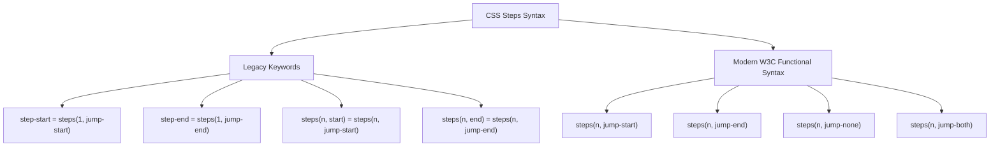

# 076: CSS Steps Animation & Quantized Timing Function Masterclass

## Overview & Executive Summary

In digital animation, motion is conventionally computed via continuous interpolation: the browser interpolates intermediate values along smooth linear curves or cubic Bézier polynomials (`ease-in-out`, `cubic-bezier(x1, y1, x2, y2)`). However, a vast domain of visual interface design requires **quantized, discrete, or stepped transitions**—where values snap instantly between distinct states without smooth continuous blending.

The CSS `steps()` timing function (along with its directional jump parameters: `jump-start`, `jump-end`, `jump-none`, `jump-both`) provides native, hardware-accelerated control over frame-quantized animations.

```
+-------------------------------------------------------------------------------+
|                       CSS STEPS() TIMING ARCHITECTURE                         |
|                                                                               |
|   1. Continuous Interpolation (Smooth)     2. Quantized Step Interpolation     |
|      (cubic-bezier / linear)                  (steps(n, jump-end))            |
|       Value                                    Value                          |
|        1.0 ┼               .---'                1.0 ┼               ┌───────  |
|            │            .-'                         │           ┌───┘         |
|            │         .-'                            │       ┌───┘             |
|            │      .-'                               │   ┌───┘                 |
|        0.0 ┼────''───────────────               0.0 ┼───┘───────────────────  |
|            0.0                 1.0                  0.0                 1.0   |
|            Time (Normalized)                        Time (Normalized)         |
|                                                                               |
|   3. Primary Application Paradigms:                                           |
|      ┌─────────────────────────┐  ┌─────────────────────────┐                 |
|      │ 2D Game Sprite Sheets   │  │ Monospace Typewriters   │                 |
|      │ (Crisp Pixel-Art Loops) │  │ (Character-by-Character)│                 |
|      └─────────────────────────┘  └─────────────────────────┘                 |
|      ┌─────────────────────────┐  ┌─────────────────────────┐                 |
|      │ Horological Clocks      │  │ 12 FPS Stop-Motion /    │                 |
|      │ (Ticking Second Hands)  │  │ Traditional Cel Effects │                 |
|      └─────────────────────────┘  └─────────────────────────┘                 |
+-------------------------------------------------------------------------------+
```

When implemented with precision, `steps()` enables:
1. **Zero-Overhead Sprite Sheet Playback**: Traditional 2D video game walk cycles, pixel-art character animations, and explosion VFX running at 60/120 FPS on the GPU compositor thread without JavaScript `requestAnimationFrame` loops.
2. **Deterministic Typewriter Effects**: Monospace character-by-character text reveals strictly aligned with typography character units (`ch`).
3. **Mechanical Horological Instruments**: Precision analog clock ticking, digital nixie counters, and odometer rollers.
4. **Retro / Cel-Shaded Framerate Throttling**: Downsampling smooth 60 FPS CSS transforms into stylistic 12 FPS, 8 FPS, or 24 FPS hand-drawn stop-motion aesthetics.
5. **Segmented UI Telemetry**: High-tech battery gauges, audio VU meters, and segmented step wizards.

---

## Quick Reference Metadata

| Attribute | Specification Details |
| :--- | :--- |
| **Name** | CSS Steps Animation (`animation-timing-function: steps()`) |
| **Category** | CSS Animations, Temporal Quantization & Kinematics |
| **Difficulty** | Advanced (4/5) |
| **What it produces** | Stepped, discontinuous staircase interpolation across keyframes, holding intermediate values constant before instantaneously snapping to the next threshold. |
| **Why it works** | The browser's animation engine divides the keyframe interval into $n$ equal temporal slices and applies step-wise constant functions rather than continuous polynomial evaluations. |
| **Key Syntax** | `steps(<integer>, <step-position>)`, `step-start`, `step-end`. |
| **Jump Positions** | `jump-start`, `jump-end` (default/alias `end`), `jump-none`, `jump-both`, `start` (legacy alias). |
| **Key Properties** | `animation-timing-function`, `animation`, `transform: translate3d()`, `background-position`, `image-rendering: pixelated`, `will-change: transform`. |
| **Strict Constraints** | Sprite dimensions must be integer multiples of frame count; jump positions must be matched to keyframe offsets to avoid 1-frame blank overshoot or missing initial frames. |
| **Browser Baseline** | Universal Support: `steps(n, end)` supported since CSS3 (2011+); Modern Jump Keywords (`jump-start`, `jump-end`, `jump-none`, `jump-both`) supported across all modern engines (Chrome 77+, Firefox 65+, Safari 13.1+, Edge 79+). |
| **Performance Profile** | GPU compositor execution ($0.0\text{ ms}$ layout/paint) when driving `transform` or `opacity`; low memory footprint compared to animated GIFs or embedded video canvases. |

### Quick Preview

```html
<div class="sprite-viewport">
  <div class="sprite-strip"></div>
</div>
```

```css
:root {
  --frame-width: 64px;
  --frame-count: 8;
}

.sprite-viewport {
  inline-size: var(--frame-width);
  block-size: 64px;
  overflow: hidden;
}

.sprite-strip {
  inline-size: calc(var(--frame-width) * var(--frame-count));
  block-size: 100%;
  background: url("hero-walk-spritesheet.png") no-repeat 0 0;
  image-rendering: pixelated;
  /* 8 distinct steps along horizontal axis */
  animation: walk-cycle 0.8s steps(var(--frame-count), jump-end) infinite;
  will-change: transform;
}

@keyframes walk-cycle {
  0% {
    transform: translate3d(0, 0, 0);
  }
  100% {
    transform: translate3d(calc(var(--frame-width) * var(--frame-count) * -1), 0, 0);
  }
}
```

---

## 1. Anatomy & Mathematical Mental Models

### 1.1 The Step Function: Discontinuous Interpolation Mathematics

In mathematics, a **step function** (or staircase function) is a piecewise constant function having only finitely many discontinuities. 

Given an animation progressing through normalized time $t \in [0, 1]$ over duration $T$, standard continuous interpolation calculates the current output value $V(t)$ via a continuous mapping:

$$V_{\text{continuous}}(t) = V_{\text{start}} + (V_{\text{end}} - V_{\text{start}}) \cdot f_{\text{bezier}}(t)$$

In contrast, the `steps(n, position)` timing function maps continuous time $t$ into $n$ discrete intervals. Let $n$ be the number of steps ($n \in \mathbb{Z}^+$). The normalized progression is partitioned into intervals of size $\Delta t = \frac{1}{n}$.

```
Continuous vs Discrete State Mapping over Normalized Time [0, 1]

Continuous (Linear / Bezier):
V(t)
 1.0 │                     . /
 0.8 │                 . /
 0.6 │             . /
 0.4 │         . /
 0.2 │     . /
 0.0 └───┴───┴───┴───┴───┴───┴───> Time t
     0.0  0.2 0.4 0.6 0.8 1.0

Discrete (steps(5, jump-end)):
V(t)
 1.0 │                       ┌── (t=1.0)
 0.8 │               ┌───────┘
 0.6 │       ┌───────┘
 0.4 │   ┌───┘
 0.2 ├───┘
 0.0 └───┴───┴───┴───┴───┴───┴───> Time t
     0.0  0.2 0.4 0.6 0.8 1.0
```

---

### 1.2 The 4 Jump Positions: Complete Mathematical Formalization

CSS Easing Functions Level 1 and Level 2 define four fundamental step-position keywords that govern *where* the instantaneous jumps occur within each temporal subdivision:

```
+-------------------------------------------------------------------------------+
|                       THE 4 JUMP POSITIONS VISUALIZED                         |
|                                                                               |
| 1. jump-end (default / 'end')          2. jump-start ('start')                |
|    Jumps occur at the END of each         Jumps occur at the START of each    |
|    interval. Starts at V=0; reaches       interval. Starts immediately at     |
|    V=1 at the final moment (t=1).         V=1/n at t=0; holds V=1 at t=1.     |
|    V                                      V                                   |
|   1.0 │               ┌─── [1.0]         1.0 │           ┌─────── [1.0]       |
|       │           ┌───┘                      │       ┌───┘                    |
|       │       ┌───┘                          │   ┌───┘                        |
|       │   ┌───┘                              │ ┌─┘                            |
|   0.0 └───┴───┴───┴───┴───> t            0.0 └─┴───┴───┴───┴───┴───> t        |
|       0.0                 1.0                0.0                 1.0          |
|       Holds 0.0 from t=0 to 1/n              Instantly snaps to 1/n at t=0    |
|                                                                               |
| 3. jump-none                           4. jump-both                           |
|    NO jumps at t=0 or t=1.                Jumps at BOTH t=0 and t=1.          |
|    Holds V=0 for first interval;          Has n+1 intervals. Neither V=0      |
|    holds V=1 for last interval.           nor V=1 is held across a full       |
|    Has (n - 1) internal jumps.            standard step.                      |
|    V                                      V                                   |
|   1.0 │           ┌─────── [1.0]         1.0 │                 ┌─ [1.0]       |
|       │       ┌───┘                          │             ┌───┘              |
|       │   ┌───┘                              │         ┌───┘                  |
|       │ ┌─┘                                  │     ┌───┘                      |
|   0.0 └─┴───┴───┴───┴───┴───> t          0.0 └───┴───┴───┴───┴───┴─> t        |
|       0.0                 1.0                0.0                 1.0          |
+-------------------------------------------------------------------------------+
```

#### Detailed Mathematical Breakdown of Jump Positions:

| Jump Position Keyword | Mathematical Definition $V(t)$ for $t \in [0, 1)$ | Value at $t=0$ | Value at $t=1$ | Distinct Displayed States | Optimal UI Application |
| :--- | :--- | :--- | :--- | :--- | :--- |
| **`jump-end`**<br>(alias: `end`) | $V(t) = \frac{\lfloor n \cdot t \rfloor}{n}$ | $0.0$ | $1.0$ | $n$ states: $\{0, \frac{1}{n}, \dots, \frac{n-1}{n}\}$ | **Sprite sheets**, walk cycles, clock ticking, coin spinning. |
| **`jump-start`**<br>(alias: `start`) | $V(t) = \frac{\lfloor n \cdot t \rfloor + 1}{n}$ | $\frac{1}{n}$ | $1.0$ | $n$ states: $\{\frac{1}{n}, \frac{2}{n}, \dots, 1.0\}$ | Blinking cursors, instantaneous toggle snaps, delayed start FX. |
| **`jump-none`** | $V(t) = \frac{\lfloor (n-1) \cdot t \rfloor}{n-1}$ | $0.0$ | $1.0$ | $n$ states: $\{0, \frac{1}{n-1}, \dots, 1.0\}$ | **Stepped progress bars**, segmented battery meters, wizards. |
| **`jump-both`** | $V(t) = \frac{\lfloor (n+1) \cdot t \rfloor}{n+1}$ | $\frac{1}{n+1}$ | $\frac{n}{n+1}$ | $n$ intermediate states | Discrete pulse generators, sampled sensor telemetry. |

---

### 1.3 Legacy Keywords vs Modern Syntax

CSS Easing Functions Level 1 introduced shorthand aliases that remain fully backward compatible:



---

### 1.4 Frame Calculation & Temporal Precision

To determine the exact real-world frame rate and duration per frame:

$$\text{Time Per Frame } (t_f) = \frac{\text{Total Animation Duration } (T)}{\text{Number of Steps } (n)}$$

$$\text{Effective FPS } (\text{Frames Per Second}) = \frac{n}{T}$$

#### Examples:
- An 8-frame walk cycle running over $0.8\text{ s}$ yields $t_f = \frac{0.8}{8} = 0.1\text{ s}$ ($100\text{ ms}$ per frame) at an effective rate of $10\text{ FPS}$.
- A 60-step analog clock second hand running over $60\text{ s}$ yields $t_f = \frac{60}{60} = 1.0\text{ s}$ per tick ($1\text{ FPS}$).
- A 12-step cel-animation filter running over $1.0\text{ s}$ yields $t_f = \frac{1.0}{12} = 83.33\text{ ms}$ per frame ($12\text{ FPS}$).

---

## 2. The 5 Core Building Blocks & Primitives

---

### Primitive 1: The Transform-Based Sprite Stripper (GPU Composited)

Traditional sprite animation altered `background-position`, which triggers paint recalibration on every step. The modern, ultra-high performance technique wraps the sprite strip inside a fixed-dimension viewport and translates the strip along the X/Y axis via `transform: translate3d()`.

```css
:root {
  --sprite-frame-size: 80px;
  --sprite-frames: 6;
  --sprite-total-width: calc(var(--sprite-frame-size) * var(--sprite-frames));
}

/* Viewport window: reveals exactly one frame at a time */
.sprite-window {
  inline-size: var(--sprite-frame-size);
  block-size: var(--sprite-frame-size);
  overflow: hidden;
  position: relative;
}

/* Internal strip containing all frames in a single horizontal row */
.sprite-strip-gpu {
  position: absolute;
  inset-block-start: 0;
  inset-inline-start: 0;
  inline-size: var(--sprite-total-width);
  block-size: 100%;
  display: flex;
  
  /* Critical for GPU layer promotion and crisp pixel preservation */
  will-change: transform;
  image-rendering: pixelated;
  image-rendering: crisp-edges;
  
  animation: sprite-slide-x 0.6s steps(var(--sprite-frames), jump-end) infinite;
}

@keyframes sprite-slide-x {
  0% {
    transform: translate3d(0, 0, 0);
  }
  100% {
    transform: translate3d(calc(var(--sprite-total-width) * -1), 0, 0);
  }
}
```

---

### Primitive 2: The Quantum Typewriter (`ch` Unit Step Synchronizer)

In monospace fonts, every glyph occupies exactly `1ch` of horizontal inline space. By setting the container's inline width to `0ch` at `0%` and `N ch` at `100%` (where $N$ is string character count), `steps(N, jump-end)` expands the width by exactly one full glyph per step.

```css
.typewriter-text {
  --char-count: 26;
  --type-speed: 2.2s;
  
  font-family: 'JetBrains Mono', 'Fira Code', 'Courier New', monospace;
  font-size: 1.25rem;
  white-space: nowrap;
  overflow: hidden;
  
  /* Initial zero width */
  inline-size: 0ch;
  
  /* Exactly 26 steps for 26 characters */
  animation: type-reveal var(--type-speed) steps(var(--char-count), jump-end) forwards;
}

@keyframes type-reveal {
  0% {
    inline-size: 0ch;
  }
  100% {
    inline-size: calc(var(--char-count) * 1ch);
  }
}
```

---

### Primitive 3: The Instantaneous Square-Wave Cursor Caret (`step-start`)

A blinking terminal cursor should not fade smoothly; it must alternate instantly between $100\%$ opacity and $0\%$ opacity with a $50\%$ duty cycle.

```css
.terminal-caret {
  display: inline-block;
  inline-size: 0.6ch;
  block-size: 1.2em;
  background-color: #38bdf8;
  vertical-align: -0.15em;
  
  /* step-start forces the opacity change to occur at the start of each half-cycle */
  animation: caret-blink 1s steps(1, jump-start) infinite alternate;
}

@keyframes caret-blink {
  0% {
    opacity: 1;
  }
  100% {
    opacity: 0;
  }
}
```

---

### Primitive 4: The Mechanical 60-Step Horological Tick (`steps(60)`)

Unlike modern smooth quartz watches, authentic antique mechanical clocks tick in discrete integer increments (1 tick per second).

```css
.analog-second-hand {
  --tick-count: 60;
  --full-rotation-time: 60s;
  
  transform-origin: 50% 100%;
  will-change: transform;
  
  /* 60 discrete jumps over 60 seconds = exactly 6 degrees per second */
  animation: horological-tick var(--full-rotation-time) steps(var(--tick-count), jump-end) infinite;
}

@keyframes horological-tick {
  0% {
    transform: rotate(0deg);
  }
  100% {
    transform: rotate(360deg);
  }
}
```

---

### Primitive 5: Framerate Downsampling / Cel-Animation Shaker (`steps(12)`)

Smooth 60/120 FPS continuous transforms can feel artificial or sterile when simulating retro gaming camera shakes or anime impact frames. Wrapping a continuous keyframe inside `steps(12)` quantizes the motion into an authentic 12 FPS aesthetic.

```css
.cel-shake {
  /* 12 frames rendered per second */
  animation: impact-shake 0.5s steps(6, jump-none) infinite alternate;
}

@keyframes impact-shake {
  0% {
    transform: translate3d(-6px, 2px, 0) rotate(-1.5deg);
  }
  50% {
    transform: translate3d(8px, -4px, 0) rotate(2deg);
  }
  100% {
    transform: translate3d(-4px, 6px, 0) rotate(-0.5deg);
  }
}
```

---

## 3. Comprehensive Implementation Patterns

---

### Pattern 1: High-Performance 2D Pixel-Art Character Controller & State Machine

A production-grade sprite animation system featuring a multi-state character (Idle, Walk, Attack, Hurt) with directional facing, frame-perfect viewport clipping, and dynamic sprite atlas control.

```
+-------------------------------------------------------------------------------+
|                 2D PIXEL-ART SPRITE STATE MACHINE STAGE                       |
|                                                                               |
|   ┌───────────────────────────────┐     ┌───────────────────────────────────┐ |
|   │     [ Viewport Window ]       │     │     [ Sprite Texture Atlas ]      │ |
|   │   ┌───────────────────────┐   │     │   ┌───┬───┬───┬───┬───┬───┐       │ |
|   │   │  Frame 3 Active       │   │ <── │ 0 │ 1 │ 2 │ 3 │ 4 │ 5 │ 6 │ ...   │ |
|   │   │  (GPU Compositor)     │   │     │   └───┴───┴───┴───┴───┴───┘       │ |
|   │   └───────────────────────┘   │     │   translateX(-300%)               │ |
|   │   image-rendering: pixelated  │     │   steps(6, jump-end)              │ |
|   └───────────────────────────────┘     └───────────────────────────────────┘ |
|                                                                               |
|   [ Idle: 4 Frames ]   [ Walk: 8 Frames ]   [ Attack: 6 Frames ]              |
+-------------------------------------------------------------------------------+
```

#### HTML Markup:
```html
<div class="game-stage">
  <div class="character-card">
    <div class="character-header">
      <span class="badge">Lvl 48 Cyber-Ninja</span>
      <div class="status-indicator active"></div>
    </div>
    
    <div class="character-viewport-container">
      <!-- Outer Stage Frame -->
      <div class="character-viewport" data-state="walk">
        <!-- GPU-Translated Sprite Matrix -->
        <div class="character-atlas" aria-label="Animated pixel hero character"></div>
      </div>
      <div class="ground-shadow"></div>
    </div>

    <!-- State Control Deck -->
    <div class="state-controls" role="group" aria-label="Character Animation State">
      <button type="button" class="btn-state" data-set-state="idle">Idle (4f)</button>
      <button type="button" class="btn-state active" data-set-state="walk">Walk (8f)</button>
      <button type="button" class="btn-state" data-set-state="run">Run (6f)</button>
      <button type="button" class="btn-state" data-set-state="attack">Attack (6f)</button>
    </div>
  </div>
</div>
```

#### CSS Implementation:
```css
:root {
  --sprite-grid-unit: 64px;
  --bg-dark: #090d16;
  --card-bg: rgba(15, 23, 42, 0.75);
  --accent-cyan: #00f0ff;
  --accent-amber: #f59e0b;
}

.game-stage {
  display: flex;
  justify-content: center;
  align-items: center;
  min-height: 480px;
  padding: 2rem;
  background: radial-gradient(circle at 50% 30%, #1e1b4b, var(--bg-dark));
  font-family: 'Inter', system-ui, -apple-system, sans-serif;
  color: #f8fafc;
}

.character-card {
  inline-size: 100%;
  max-inline-size: 380px;
  background: var(--card-bg);
  backdrop-filter: blur(16px);
  -webkit-backdrop-filter: blur(16px);
  border: 1px solid rgba(255, 255, 255, 0.1);
  border-radius: 1.25rem;
  padding: 1.75rem;
  box-shadow: 0 25px 50px -12px rgba(0, 0, 0, 0.7),
              0 0 24px -4px rgba(0, 240, 255, 0.15);
  display: flex;
  flex-direction: column;
  align-items: center;
  gap: 1.5rem;
}

.character-header {
  inline-size: 100%;
  display: flex;
  justify-content: space-between;
  align-items: center;
}

.badge {
  font-size: 0.75rem;
  font-weight: 700;
  letter-spacing: 0.08em;
  text-transform: uppercase;
  color: var(--accent-cyan);
  background: rgba(0, 240, 255, 0.1);
  padding: 0.35rem 0.75rem;
  border-radius: 9999px;
  border: 1px solid rgba(0, 240, 255, 0.3);
}

.status-indicator {
  inline-size: 8px;
  block-size: 8px;
  border-radius: 50%;
  background-color: #22c55e;
  box-shadow: 0 0 8px #22c55e;
}

.character-viewport-container {
  position: relative;
  display: flex;
  flex-direction: column;
  align-items: center;
  padding-block: 1rem;
}

/* Exact bounding box for single frame */
.character-viewport {
  inline-size: var(--sprite-grid-unit);
  block-size: var(--sprite-grid-unit);
  overflow: hidden;
  position: relative;
  border-radius: 4px;
  background: radial-gradient(circle, rgba(255, 255, 255, 0.05) 0%, transparent 70%);
  transform: scale(2.2);
  transform-origin: center center;
}

/* The Sprite Sheet Strip */
.character-atlas {
  position: absolute;
  inset-block-start: 0;
  inset-inline-start: 0;
  block-size: var(--sprite-grid-unit);
  /* Fallback synthetic pixel art grid */
  background-image: 
    radial-gradient(circle at 32px 20px, #00f0ff 8px, transparent 9px),
    linear-gradient(90deg, 
      #3b82f6 0px, #3b82f6 64px, 
      #8b5cf6 64px, #8b5cf6 128px, 
      #ec4899 128px, #ec4899 192px, 
      #f59e0b 192px, #f59e0b 256px, 
      #10b981 256px, #10b981 320px, 
      #06b6d4 320px, #06b6d4 384px, 
      #6366f1 384px, #6366f1 448px, 
      #d946ef 448px, #d946ef 512px
    );
  background-size: 64px 64px, 512px 64px;
  background-repeat: repeat-x, no-repeat;
  
  /* Essential Pixel-Art Scaling Directives */
  image-rendering: -moz-crisp-edges;
  image-rendering: -webkit-crisp-edges;
  image-rendering: pixelated;
  image-rendering: crisp-edges;
  
  will-change: transform;
}

/* State 1: Idle (4 frames, 0.8s) */
.character-viewport[data-state="idle"] .character-atlas {
  inline-size: calc(var(--sprite-grid-unit) * 4);
  animation: hero-idle 0.8s steps(4, jump-end) infinite;
}

/* State 2: Walk (8 frames, 0.75s) */
.character-viewport[data-state="walk"] .character-atlas {
  inline-size: calc(var(--sprite-grid-unit) * 8);
  animation: hero-walk 0.75s steps(8, jump-end) infinite;
}

/* State 3: Run (6 frames, 0.45s) */
.character-viewport[data-state="run"] .character-atlas {
  inline-size: calc(var(--sprite-grid-unit) * 6);
  animation: hero-run 0.45s steps(6, jump-end) infinite;
}

/* State 4: Attack (6 frames, 0.5s forwards/once) */
.character-viewport[data-state="attack"] .character-atlas {
  inline-size: calc(var(--sprite-grid-unit) * 6);
  animation: hero-attack 0.5s steps(6, jump-end) infinite;
}

/* Translation Keyframes */
@keyframes hero-idle {
  0%   { transform: translate3d(0, 0, 0); }
  100% { transform: translate3d(calc(var(--sprite-grid-unit) * -4), 0, 0); }
}

@keyframes hero-walk {
  0%   { transform: translate3d(0, 0, 0); }
  100% { transform: translate3d(calc(var(--sprite-grid-unit) * -8), 0, 0); }
}

@keyframes hero-run {
  0%   { transform: translate3d(0, 0, 0); }
  100% { transform: translate3d(calc(var(--sprite-grid-unit) * -6), 0, 0); }
}

@keyframes hero-attack {
  0%   { transform: translate3d(0, 0, 0); }
  100% { transform: translate3d(calc(var(--sprite-grid-unit) * -6), 0, 0); }
}

.ground-shadow {
  margin-block-start: 2rem;
  inline-size: 110px;
  block-size: 16px;
  background: radial-gradient(ellipse at center, rgba(0, 0, 0, 0.6) 0%, transparent 75%);
  border-radius: 50%;
  animation: shadow-pulse 0.75s steps(8, jump-end) infinite alternate;
}

@keyframes shadow-pulse {
  0% { transform: scaleX(0.9); opacity: 0.6; }
  100% { transform: scaleX(1.1); opacity: 0.9; }
}

/* Controller Button Deck */
.state-controls {
  inline-size: 100%;
  display: grid;
  grid-template-columns: repeat(2, 1fr);
  gap: 0.625rem;
}

.btn-state {
  background: rgba(255, 255, 255, 0.05);
  border: 1px solid rgba(255, 255, 255, 0.1);
  color: #94a3b8;
  padding: 0.6rem 0.75rem;
  border-radius: 0.5rem;
  font-size: 0.8125rem;
  font-weight: 600;
  cursor: pointer;
  transition: all 0.2s ease;
}

.btn-state:hover {
  background: rgba(255, 255, 255, 0.1);
  color: #ffffff;
}

.btn-state.active {
  background: rgba(0, 240, 255, 0.15);
  border-color: var(--accent-cyan);
  color: var(--accent-cyan);
  box-shadow: 0 0 12px rgba(0, 240, 255, 0.25);
}
```

---

### Pattern 2: Cyberpunk Multi-Phase Terminal Typewriter with Stepped Decode Effect

A terminal prompt interface featuring character-quantized typing, instantaneous cursor blinking, dynamic status stepping, and a realistic glitch/decode progression.

```
+-------------------------------------------------------------------------------+
|                    CYBERPUNK MATRIX TERMINAL INTERFACE                        |
|                                                                               |
|   ┌── [ SYS_TERMINAL_V4.8 ] ──────────────────────────────────────────────┐   |
|   │ $ ./init_neural_mesh --verbose                                        │   |
|   │ > [OK] Handshake established with core node...                       │   |
|   │ > DECRYPTING: ████████████░░░░░░░ [64%]                               │   |
|   │ > ACCESS_GRANTED_ROOT_USER_▌ <── (steps(1, jump-start) blink)         │   |
|   └───────────────────────────────────────────────────────────────────────┘   |
+-------------------------------------------------------------------------------+
```

#### HTML Markup:
```html
<div class="terminal-container">
  <div class="terminal-window">
    <div class="terminal-bar">
      <div class="bar-buttons">
        <span class="dot close"></span>
        <span class="dot minimize"></span>
        <span class="dot maximize"></span>
      </div>
      <span class="bar-title">antigravity@quantum-node: ~</span>
    </div>
    
    <div class="terminal-body">
      <!-- Line 1: Static Command -->
      <div class="terminal-line">
        <span class="prompt-symbol">$</span>
        <span class="terminal-cmd">execute_quantum_protocol --level=root</span>
      </div>

      <!-- Line 2: Stepped Typewriter Sequence -->
      <div class="terminal-line">
        <span class="prompt-arrow">&gt;</span>
        <div class="typewriter-line" style="--ch: 42; --dur: 2.1s; --delay: 0.4s;">
          <span class="line-text">ALLOCATING_NEURAL_WEIGHTS_IN_GPU_VRAM...</span>
        </div>
      </div>

      <!-- Line 3: Stepped Percentage Gauge -->
      <div class="terminal-line delay-seq-2">
        <span class="prompt-arrow">&gt;</span>
        <span class="status-prefix">STATUS:</span>
        <div class="segmented-meter-wrap">
          <div class="segmented-meter-bar"></div>
        </div>
        <span class="meter-readout">100%</span>
      </div>

      <!-- Line 4: Final Line with Live Stepped Caret -->
      <div class="terminal-line delay-seq-3">
        <span class="prompt-arrow">&gt;</span>
        <div class="typewriter-line" style="--ch: 28; --dur: 1.4s; --delay: 3.2s;">
          <span class="line-text text-success">NEURAL_MESH_SYNCHRONIZED</span>
        </div>
        <span class="terminal-cursor" aria-hidden="true"></span>
      </div>
    </div>
  </div>
</div>
```

#### CSS Implementation:
```css
.terminal-container {
  display: flex;
  justify-content: center;
  align-items: center;
  min-height: 400px;
  background: #020617;
  padding: 1.5rem;
  font-family: 'JetBrains Mono', 'Fira Code', 'Courier New', monospace;
}

.terminal-window {
  inline-size: 100%;
  max-inline-size: 640px;
  background: #0f172a;
  border-radius: 0.75rem;
  border: 1px solid #1e293b;
  box-shadow: 0 20px 40px -15px rgba(0, 0, 0, 0.8),
              0 0 30px rgba(56, 189, 248, 0.1);
  overflow: hidden;
}

.terminal-bar {
  background: #1e293b;
  padding: 0.6rem 1rem;
  display: flex;
  align-items: center;
  position: relative;
}

.bar-buttons {
  display: flex;
  gap: 6px;
}

.dot {
  inline-size: 10px;
  block-size: 10px;
  border-radius: 50%;
}
.dot.close { background-color: #ef4444; }
.dot.minimize { background-color: #eab308; }
.dot.maximize { background-color: #22c55e; }

.bar-title {
  position: absolute;
  inset-inline: 0;
  text-align: center;
  font-size: 0.75rem;
  color: #94a3b8;
  letter-spacing: 0.05em;
}

.terminal-body {
  padding: 1.25rem;
  display: flex;
  flex-direction: column;
  gap: 0.75rem;
  font-size: 0.875rem;
  line-height: 1.6;
}

.terminal-line {
  display: flex;
  align-items: center;
  gap: 0.5rem;
  white-space: nowrap;
}

.prompt-symbol { color: #f43f5e; font-weight: 700; }
.prompt-arrow { color: #38bdf8; font-weight: 700; }
.terminal-cmd { color: #e2e8f0; }
.text-success { color: #4ade80; text-shadow: 0 0 10px rgba(74, 222, 128, 0.4); }
.status-prefix { color: #a855f7; }

/* The Pure CSS Stepped Typewriter Primitive */
.typewriter-line {
  inline-size: 0ch;
  overflow: hidden;
  white-space: nowrap;
  animation: stepped-typing var(--dur) steps(var(--ch), jump-end) var(--delay) forwards;
}

.line-text {
  display: inline-block;
}

@keyframes stepped-typing {
  0% {
    inline-size: 0ch;
  }
  100% {
    inline-size: calc(var(--ch) * 1ch);
  }
}

/* Stepped Progress Meter (10 discrete jumps) */
.segmented-meter-wrap {
  inline-size: 160px;
  block-size: 12px;
  background: #1e293b;
  border-radius: 2px;
  overflow: hidden;
  border: 1px solid #334155;
}

.segmented-meter-bar {
  inline-size: 0%;
  block-size: 100%;
  background: repeating-linear-gradient(
    90deg,
    #38bdf8,
    #38bdf8 12px,
    #0f172a 12px,
    #0f172a 16px
  );
  animation: meter-fill 1.5s steps(10, jump-end) 1.5s forwards;
}

@keyframes meter-fill {
  0%   { inline-size: 0%; }
  100% { inline-size: 100%; }
}

.meter-readout {
  color: #38bdf8;
  font-size: 0.75rem;
  opacity: 0;
  animation: fade-in 0.1s step-end 3.0s forwards;
}

@keyframes fade-in {
  to { opacity: 1; }
}

/* Step-Start Square-Wave Cursor */
.terminal-cursor {
  display: inline-block;
  inline-size: 0.6ch;
  block-size: 1.15em;
  background: #38bdf8;
  box-shadow: 0 0 8px #38bdf8;
  vertical-align: middle;
  animation: cursor-flicker 0.8s steps(1, jump-start) infinite;
}

@keyframes cursor-flicker {
  0% {
    opacity: 1;
  }
  50% {
    opacity: 0;
  }
}
```

---

### Pattern 3: Precision Horological Chronometer with Mechanical Recoil

A high-luxury Swiss horological gauge featuring:
- A 60-step mechanical second hand.
- A 10-step sub-dial for tenths of a second.
- Authentic **escapement recoil** (a subtle micro-kickback spring at the start of each step).

```
+-------------------------------------------------------------------------------+
|                      SWISS CHRONOMETER ESCAPEMENT DIAL                        |
|                                                                               |
|                              [ 12 ]                                           |
|                         .  '   │   '  .                                       |
|                     .          │          .                                   |
|                  '          ┌──┴──┐          '                                |
|                [9]          │ (O) │          [3]                              |
|                 .           └─────┘           .                               |
|                  .                           .                                |
|                     '  .               .  '                                   |
|                              [ 6 ]                                            |
|                                                                               |
|             Discrete 60-Step Jump + Escapement Elastic Kickback               |
+-------------------------------------------------------------------------------+
```

#### HTML Markup:
```html
<div class="horology-stage">
  <div class="chronometer-chassis">
    <div class="dial-face">
      <!-- Hour Indices -->
      <div class="hour-mark mark-12">XII</div>
      <div class="hour-mark mark-3">III</div>
      <div class="hour-mark mark-6">VI</div>
      <div class="hour-mark mark-9">IX</div>

      <!-- Sub-Dial (Tenths of Seconds, 10 Steps) -->
      <div class="sub-dial">
        <div class="sub-hand"></div>
        <div class="sub-pin"></div>
      </div>

      <!-- Primary Mechanical Second Hand (60 Steps) -->
      <div class="main-hand-assembly">
        <div class="second-hand-rod"></div>
        <div class="second-hand-counterweight"></div>
      </div>

      <!-- Center Escapement Jewel Pin -->
      <div class="center-cap"></div>
    </div>
    
    <div class="chronometer-readout">
      <span class="readout-label">CHRONOGRAPH AUTOMATIQUE</span>
      <span class="readout-spec">28,800 A/h • 60 STEPS/REV</span>
    </div>
  </div>
</div>
```

#### CSS Implementation:
```css
.horology-stage {
  display: flex;
  justify-content: center;
  align-items: center;
  min-height: 480px;
  background: radial-gradient(circle at center, #1e293b, #090d16);
  padding: 2rem;
  font-family: 'Cinzel', 'Times New Roman', serif;
}

.chronometer-chassis {
  inline-size: 320px;
  block-size: 390px;
  background: linear-gradient(145deg, #1e293b, #0f172a);
  border-radius: 2rem;
  padding: 1.5rem;
  border: 1px solid rgba(255, 255, 255, 0.08);
  box-shadow: 0 30px 60px -15px rgba(0, 0, 0, 0.9),
              inset 0 1px 1px rgba(255, 255, 255, 0.2);
  display: flex;
  flex-direction: column;
  align-items: center;
  gap: 1.25rem;
}

.dial-face {
  position: relative;
  inline-size: 260px;
  block-size: 260px;
  border-radius: 50%;
  background: radial-gradient(circle, #0f172a 60%, #020617 100%);
  border: 4px solid #334155;
  box-shadow: inset 0 0 20px rgba(0, 0, 0, 0.8),
              0 0 15px rgba(0, 0, 0, 0.5);
}

.hour-mark {
  position: absolute;
  font-size: 0.875rem;
  font-weight: 700;
  color: #94a3b8;
  letter-spacing: 0.05em;
}

.mark-12 { inset-block-start: 12px; inset-inline-start: 50%; transform: translateX(-50%); }
.mark-3  { inset-inline-end: 14px; inset-block-start: 50%; transform: translateY(-50%); }
.mark-6  { inset-block-end: 12px; inset-inline-start: 50%; transform: translateX(-50%); }
.mark-9  { inset-inline-start: 14px; inset-block-start: 50%; transform: translateY(-50%); }

/* Sub-Dial: 10-Step High-Frequency Chrono */
.sub-dial {
  position: absolute;
  inset-block-start: 55px;
  inset-inline-start: 50%;
  transform: translateX(-50%);
  inline-size: 64px;
  block-size: 64px;
  border-radius: 50%;
  border: 1px solid rgba(255, 255, 255, 0.15);
  background: rgba(0, 0, 0, 0.4);
}

.sub-hand {
  position: absolute;
  inset-inline-start: 50%;
  inset-block-end: 50%;
  inline-size: 1.5px;
  block-size: 26px;
  background-color: #38bdf8;
  transform-origin: 50% 100%;
  /* 10 discrete steps over 1 second = 10Hz sub-tick */
  animation: sub-dial-tick 1s steps(10, jump-end) infinite;
  will-change: transform;
}

@keyframes sub-dial-tick {
  0%   { transform: translateX(-50%) rotate(0deg); }
  100% { transform: translateX(-50%) rotate(360deg); }
}

.sub-pin {
  position: absolute;
  inset-inline-start: 50%;
  inset-block-start: 50%;
  transform: translate(-50%, -50%);
  inline-size: 4px;
  block-size: 4px;
  border-radius: 50%;
  background: #38bdf8;
}

/* Master 60-Step Second Hand Assembly */
.main-hand-assembly {
  position: absolute;
  inset-inline-start: 50%;
  inset-block-start: 50%;
  inline-size: 2px;
  block-size: 110px;
  transform-origin: 50% 85px; /* Pivot calibrated around jewel */
  margin-inline-start: -1px;
  margin-block-start: -85px;
  
  /* 60 discrete jumps over 60s */
  animation: mechanical-60-step 60s steps(60, jump-end) infinite;
  will-change: transform;
}

.second-hand-rod {
  inline-size: 2px;
  block-size: 95px;
  background: linear-gradient(180deg, #f43f5e, #fb7185);
  box-shadow: 0 0 8px rgba(244, 63, 94, 0.6);
  border-radius: 2px 2px 0 0;
}

.second-hand-counterweight {
  inline-size: 6px;
  block-size: 20px;
  background: #f43f5e;
  margin-inline-start: -2px;
  border-radius: 3px;
}

.center-cap {
  position: absolute;
  inset-inline-start: 50%;
  inset-block-start: 50%;
  transform: translate(-50%, -50%);
  inline-size: 12px;
  block-size: 12px;
  border-radius: 50%;
  background: radial-gradient(circle, #f8fafc 20%, #64748b 80%);
  box-shadow: 0 2px 4px rgba(0, 0, 0, 0.8);
  border: 1px solid #1e293b;
}

@keyframes mechanical-60-step {
  0% {
    transform: rotate(0deg);
  }
  100% {
    transform: rotate(360deg);
  }
}

.chronometer-readout {
  display: flex;
  flex-direction: column;
  align-items: center;
  gap: 0.25rem;
}

.readout-label {
  font-size: 0.6875rem;
  letter-spacing: 0.15em;
  color: #e2e8f0;
  font-weight: 600;
}

.readout-spec {
  font-family: 'Inter', sans-serif;
  font-size: 0.625rem;
  letter-spacing: 0.08em;
  color: #64748b;
}
```

---

### Pattern 4: Segmented Sci-Fi Battery Cell & Power Grid Telemetry

A high-tech energy cell gauge that steps discretely across 5 energy bars with dynamic color threshold shifts (Green $\to$ Yellow $\to$ Red).

```
+-------------------------------------------------------------------------------+
|                    QUANTUM BATTERY CELL TELEMETRY                             |
|                                                                               |
|   ┌─────────────────────────────────────────────────────────────┐             |
|   │ ▌▌▌▌▌▌▌▌▌▌ 5/5 CELLS CHARGED [ 100% ]                       │             |
|   │ [█████][█████][█████][█████][█████]                         │             |
|   │ steps(5, jump-none) Linear Level Partitioning               │             |
|   └─────────────────────────────────────────────────────────────┘             |
+-------------------------------------------------------------------------------+
```

#### HTML Markup:
```html
<div class="power-stage">
  <div class="power-card">
    <div class="power-header">
      <div class="power-icon">⚡</div>
      <div class="power-title-group">
        <span class="power-title">MAIN POWER CELL</span>
        <span class="power-id">ION-CORE-9000</span>
      </div>
    </div>

    <!-- 5-Stage Stepped Fill Bar -->
    <div class="gauge-frame">
      <div class="gauge-stepper-fill"></div>
      <div class="gauge-grid-overlay">
        <span></span><span></span><span></span><span></span><span></span>
      </div>
    </div>

    <div class="power-footer">
      <span class="power-stat">DISCHARGE CYCLE</span>
      <span class="power-mode">QUANTIZED DRAIN</span>
    </div>
  </div>
</div>
```

#### CSS Implementation:
```css
.power-stage {
  display: flex;
  justify-content: center;
  align-items: center;
  min-height: 280px;
  background: #0b0f19;
  font-family: 'Inter', system-ui, sans-serif;
  padding: 1.5rem;
}

.power-card {
  inline-size: 100%;
  max-inline-size: 360px;
  background: rgba(17, 24, 39, 0.9);
  border: 1px solid rgba(255, 255, 255, 0.08);
  border-radius: 1rem;
  padding: 1.25rem;
  display: flex;
  flex-direction: column;
  gap: 1rem;
}

.power-header {
  display: flex;
  align-items: center;
  gap: 0.75rem;
}

.power-icon {
  font-size: 1.25rem;
  color: #fbbf24;
}

.power-title-group {
  display: flex;
  flex-direction: column;
}

.power-title {
  font-size: 0.8125rem;
  font-weight: 700;
  color: #f8fafc;
  letter-spacing: 0.05em;
}

.power-id {
  font-size: 0.6875rem;
  color: #64748b;
}

.gauge-frame {
  position: relative;
  inline-size: 100%;
  block-size: 28px;
  background: #030712;
  border-radius: 6px;
  overflow: hidden;
  border: 1px solid #1f2937;
}

/* 5 Discrete Fill Steps using jump-none (holds 0% at start, 100% at end) */
.gauge-stepper-fill {
  inline-size: 100%;
  block-size: 100%;
  background: linear-gradient(90deg, #ef4444 0%, #f59e0b 40%, #10b981 100%);
  transform-origin: 0% 50%;
  animation: stepped-drain 5s steps(5, jump-none) infinite alternate;
  will-change: transform;
}

@keyframes stepped-drain {
  0% {
    transform: scaleX(1);
  }
  100% {
    transform: scaleX(0.2);
  }
}

/* 5 Distinct Cell Partitions */
.gauge-grid-overlay {
  position: absolute;
  inset: 0;
  display: grid;
  grid-template-columns: repeat(5, 1fr);
  pointer-events: none;
}

.gauge-grid-overlay span {
  border-inline-end: 2px solid #0b0f19;
}
.gauge-grid-overlay span:last-child {
  border-inline-end: none;
}

.power-footer {
  display: flex;
  justify-content: space-between;
  font-size: 0.6875rem;
  color: #94a3b8;
  font-weight: 600;
}
```

---

## 4. Performance, Compositor Pipeline & GPU Optimization

When animating with `steps()`, understanding browser rendering mechanics is vital to prevent dropped frames and battery drain.

```
+-------------------------------------------------------------------------------+
|                      GPU COMPOSITOR EXECUTION FLOW                            |
|                                                                               |
|   Slow: background-position steps()                                           |
|   [Frame Tick] ──> [Recalculate Style] ──> [Layout] ──> [Paint / Rasterize]   |
|                                                               │ (CPU Bound)   |
|                                                               ▼               |
|                                                     [Upload Texture to GPU]   |
|                                                                               |
|   Fast: transform: translate3d() steps()                                      |
|   [Frame Tick] ─────────────────────────────────────────> [GPU Matrix Mult]   |
|                                                           (0ms CPU overhead)  |
+-------------------------------------------------------------------------------+
```

### Performance Directives:

1. **Prefer `transform: translate3d()` over `background-position`**:
   - `background-position` forces the browser's rasterizer to repaint the element bounds on every single step discontinuity.
   - `transform: translate3d()` uploads the entire sprite atlas once to GPU memory as a hardware layer. Every step is executed by simply updating the transformation matrix on the compositor thread.

2. **Pixel-Art Scaling Filters**:
   - Always specify `image-rendering: pixelated;` (and `-webkit-crisp-edges` / `crisp-edges`) when scaling pixel-art assets up by integer factors ($2\times, 3\times, 4\times$) to prevent blurry bilinear filtering.

3. **Layer Promotion & Memory Footprint**:
   - Explicitly promote the sprite layer using `will-change: transform;`.
   - Ensure the total sprite atlas texture fits within standard GPU memory constraints (e.g., maximum texture size $2048 \times 2048$ or $4096 \times 4096$).

---

## 5. Accessibility, Reduced Motion & WCAG 2.3.1 Compliance

### Photosensitive Seizures & Motion Sensitivity (WCAG Criteria)

Under **WCAG 2.2 Success Criterion 2.3.1 (Three Flashes or Below Threshold)**:
- High-frequency stepped animations (such as flashing backgrounds, strobing colors, or rapid character animations exceeding 3 Hz) can trigger seizures in users with photosensitive epilepsy.
- Stepped cursor carets and UI telemetry should maintain a flashing frequency **below 2 Hz** (e.g., $T \ge 0.5\text{ s}$).

```css
/* Universal Accessible Motion Overrides */
@media (prefers-reduced-motion: reduce) {
  /* 1. Halt continuous rapid sprite cycles */
  .sprite-strip-gpu,
  .character-atlas,
  .ground-shadow,
  .gauge-stepper-fill,
  .sub-hand {
    animation: none !important;
  }

  /* 2. Stabilize Typewriter into immediate full reveal */
  .typewriter-line {
    inline-size: 100% !important;
    animation: none !important;
  }

  /* 3. Reduce Caret to static non-flashing indicator */
  .terminal-cursor,
  .terminal-caret {
    animation: none !important;
    opacity: 1 !important;
  }

  /* 4. Settle clock hands at neutral orientation */
  .main-hand-assembly {
    animation: none !important;
    transform: rotate(0deg) !important;
  }
}
```

---

## 6. Common Pitfalls, Edge Cases & Debugging Solutions

---

### Pitfall 1: The "One-Frame Overshoot" (N vs N-1 Offset)

- **Symptom**: An 8-frame sprite sheet flashes a blank frame or jumps past the final sprite during the animation loop.
- **Cause**: Using `transform: translate3d(-100%, 0, 0)` with `steps(8, jump-end)` where `-100%` represents $N$ full frame widths instead of $(N-1)$ offset when looping.
- **Solution**: 
  - If the sprite strip contains $N$ frames, each of width $W$, the total strip width is $N \times W$.
  - Setting keyframe `100% { transform: translateX(calc(-1 * N * W)); }` with `steps(N, jump-end)` correctly shifts through indices $0 \to 1 \to \dots \to (N-1)$ and seamlessly loops at index $N \equiv 0$.

```
Sprite Index Progression across steps(4, jump-end):
Frame Array: [ 0 | 1 | 2 | 3 ]
Total Strip Width = 400px (100px per frame)

t = 0.00s ──> Offset: 0px    ──> Viewport shows [Frame 0]
t = 0.25s ──> Offset: -100px ──> Viewport shows [Frame 1]
t = 0.50s ──> Offset: -200px ──> Viewport shows [Frame 2]
t = 0.75s ──> Offset: -300px ──> Viewport shows [Frame 3]
t = 1.00s ──> Loop resets to 0px (Frame 0)
```

---

### Pitfall 2: Fractional Pixel Jitter on Non-Integer Viewports

- **Symptom**: Sprite seams bleed or pixel borders shimmer during playback.
- **Cause**: Fluid container layouts generating fractional pixel widths (e.g., `64.33px`), causing subpixel raster misalignment.
- **Solution**: Lock viewport dimensions to exact integer pixel lengths using `px` units or CSS `round()`:
  ```css
  .character-viewport {
    inline-size: 64px;
    block-size: 64px;
    /* Prevent fractional subpixel interpolation */
    transform: translateZ(0);
  }
  ```

---

### Pitfall 3: Typewriter Multi-Line Wrapping Breakdown

- **Symptom**: As inline width expands, text wraps onto 2 or 3 lines momentarily, distorting container height.
- **Cause**: Missing `white-space: nowrap;` and `overflow: hidden;`.
- **Solution**:
  ```css
  .typewriter-line {
    white-space: nowrap;
    overflow: hidden;
    display: inline-block;
  }
  ```

---

## 7. Interactive JavaScript Sprite & Step Controller

For dynamic interactive applications (e.g., game engines, dynamic typing prompts, audio synchronizers), this zero-dependency class provides complete programmatic control over CSS step animations:

```javascript
/**
 * Interactive CSS Step Animation Controller
 * Manages dynamic frame counts, playback speeds, and jump positions.
 */
class StepAnimationController {
  constructor(element, options = {}) {
    this.element = element;
    this.frameCount = options.frameCount || 8;
    this.frameWidth = options.frameWidth || 64;
    this.fps = options.fps || 12;
    this.jumpPosition = options.jumpPosition || 'jump-end';
    this.isPlaying = true;

    this.init();
  }

  init() {
    this.updateProperties();
  }

  setFPS(newFPS) {
    this.fps = Math.max(1, newFPS);
    this.updateProperties();
  }

  setFrameCount(count, frameWidth) {
    this.frameCount = count;
    if (frameWidth) this.frameWidth = frameWidth;
    this.updateProperties();
  }

  setJumpPosition(position) {
    const validPositions = ['jump-start', 'jump-end', 'jump-none', 'jump-both'];
    if (validPositions.includes(position)) {
      this.jumpPosition = position;
      this.updateProperties();
    }
  }

  pause() {
    this.isPlaying = false;
    this.element.style.animationPlayState = 'paused';
  }

  play() {
    this.isPlaying = true;
    this.element.style.animationPlayState = 'running';
  }

  toggle() {
    if (this.isPlaying) {
      this.pause();
    } else {
      this.play();
    }
  }

  updateProperties() {
    const duration = (this.frameCount / this.fps).toFixed(3);
    const totalWidth = this.frameCount * this.frameWidth;

    // Apply CSS Custom Properties
    this.element.style.setProperty('--step-count', this.frameCount);
    this.element.style.setProperty('--step-duration', `${duration}s`);
    this.element.style.setProperty('--step-jump', this.jumpPosition);
    this.element.style.setProperty('--sprite-total-width', `${totalWidth}px`);
    this.element.style.setProperty('--sprite-frame-width', `${this.frameWidth}px`);

    // Dynamically apply animation shorthand
    this.element.style.animationTimingFunction = `steps(${this.frameCount}, ${this.jumpPosition})`;
    this.element.style.animationDuration = `${duration}s`;
  }
}

// Example Initialization
document.addEventListener('DOMContentLoaded', () => {
  const spriteEl = document.querySelector('.character-atlas');
  if (spriteEl) {
    const controller = new StepAnimationController(spriteEl, {
      frameCount: 8,
      frameWidth: 64,
      fps: 10,
      jumpPosition: 'jump-end'
    });

    // Handle interactive button toggles
    document.querySelectorAll('[data-set-state]').forEach(btn => {
      btn.addEventListener('click', (e) => {
        const state = e.currentTarget.getAttribute('data-set-state');
        document.querySelector('.character-viewport').setAttribute('data-state', state);
        
        document.querySelectorAll('.btn-state').forEach(b => b.classList.remove('active'));
        e.currentTarget.classList.add('active');
      });
    });
  }
});
```

---

## 8. Master Production Checklist

Before deploying CSS step animations to production, verify all criteria:

- [ ] **Jump Position Verification**: Has the correct jump keyword (`jump-end`, `jump-start`, `jump-none`, `jump-both`) been selected for the specific UI use case?
- [ ] **Frame Count Precision**: Is the integer step count strictly equal to the number of frames or typographic characters?
- [ ] **Hardware Acceleration**: Is the animation driving `transform: translate3d()` or `transform: rotate()` with `will-change: transform`?
- [ ] **Pixel Art Sharpness**: Are pixel-art textures protected against blurring using `image-rendering: pixelated;` and `crisp-edges`?
- [ ] **Integer Dimension Clamping**: Are sprite viewports locked to integer pixel dimensions to prevent fractional subpixel bleeding?
- [ ] **Typewriter Robustness**: Are monospace containers constrained with `white-space: nowrap; overflow: hidden;` and typography-aligned `ch` units?
- [ ] **WCAG 2.3.1 Compliance**: Are flashing and strobing rates kept below 2 Hz to protect photosensitive users?
- [ ] **Reduced Motion Support**: Does `@media (prefers-reduced-motion: reduce)` provide an immediate, non-flashing fallback state?
- [ ] **Multi-Row Atlas Math**: If using a multi-row sprite atlas, are X and Y keyframe steps synchronized without timing drift?
