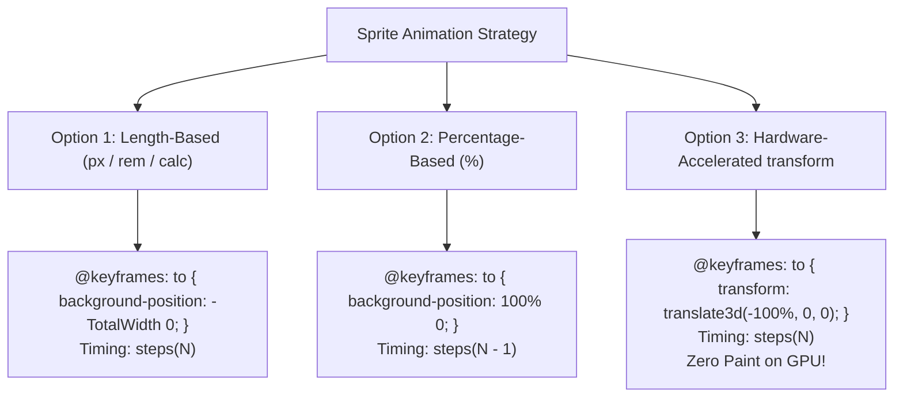

# 077: CSS `steps()` Timing Function & Frame-by-Frame Sprite Animation Masterclass

## Overview & Executive Summary

In traditional web animation, the browser interpolates intermediate property values smoothly across continuous Bézier curves (`ease`, `linear`, `cubic-bezier()`). While continuous interpolation is ideal for spatial translations, fades, and smooth rotations, it completely breaks down when animating **discrete, quantized states**—such as hand-drawn cel animations, retro pixel-art game characters, mechanical rotary ratchets, skeuomorphic dial switches, tactical radar sweeps, and Twitter/X-style particle burst reaction icons.

The CSS **`steps()` timing function** (CSS Easing Functions Level 1 & Level 2) instructs the browser's animation engine to divide an animation duration into a finite number of equidistant, instantaneous jumps. Instead of smoothly gliding between states, the property value remains fixed and instantaneously snaps to the next quantized coordinate at calculated temporal intervals.

When combined with an image atlas or filmstrip (a **sprite sheet**), the `steps()` function enables developers to execute complex, multi-frame character sequences, cinematic micro-interactions, and high-frequency kinetic visual effects purely in CSS—running at 60 to 120 FPS on the GPU compositor thread without relying on heavy JavaScript animation libraries, GIF artifacts, or unoptimized video embeds.

```
+---------------------------------------------------------------------------------------------------+
|                        CSS CONTINUOUS VS DISCRETE INTERPOLATION PARADIGM                          |
|                                                                                                   |
|   1. Continuous Interpolation (ease / linear)            2. Discrete Quantization (steps(5))      |
|      Value                                                  Value                                 |
|        ▲        ╭───────────────╮ (Smooth Curve)              ▲                 ┌─────── (Frame 4)|
|    1.0 │       /                 \                        1.0 │                 │                 |
|        │      /                   \                           │         ┌───────┘        (Frame 3)|
|        │     /                     \                          │         │                         |
|        │    /                       \                         │ ┌───────┘                (Frame 2)|
|    0.0 └───┴─────────────────────────┴───► Time           0.0 └─┴────────────────────────► Time   |
|        Smooth continuous float coordinates                    Instantaneous discrete frame jumps  |
|                                                                                                   |
|   3. Horizontal Linear Sprite Strip                      4. Hardware-Accelerated Viewport Clip    |
|      ┌──────┬──────┬──────┬──────┬──────┐                  ┌──────────────┐                       |
|      │ F-01 │ F-02 │ F-03 │ F-04 │ F-05 │                  │ [F-03]       │ ◄── Viewport (Clip)  |
|      └──────┴──────┴──────┴──────┴──────┘                  └──────────────┘                       |
|      ◄──────────────── Total Strip Width ──────────────►   Shifted by transform: translateX()    |
+---------------------------------------------------------------------------------------------------+
```

---

## Quick Reference Metadata

| Attribute | Specification Details |
| :--- | :--- |
| **Name** | CSS `steps()` Timing Function & Sprite Animation |
| **Category** | CSS Animations, Frame-by-Frame Graphics & UI Micro-Interactions |
| **Difficulty** | Advanced (4/5) |
| **What it produces** | Ultra-crisp, high-performance, frame-by-frame 2D animations (pixel art, character locomotion, particle bursts, mechanical toggles, animated icons) without JavaScript runtimes. |
| **Why it works** | The browser's timing engine quantizes the time domain into $N$ discrete intervals, suppressing linear/cubic interpolation and updating coordinates (`background-position` or `transform`) instantaneously at each step boundary. |
| **Key Properties** | `animation-timing-function: steps(n, <jump-term>)`, `step-start`, `step-end`, `background-position`, `transform: translate3d()`, `image-rendering: pixelated / crisp-edges`, `will-change: transform`. |
| **Strict Constraints** | Number of steps ($N$) must strictly correspond to the frame count and displacement vector; percentage-based `background-position` calculations differ fundamentally from length-based pixel offsets ($N-1$ vs $N$). |
| **Browser Baseline** | Baseline 2015+ for standard `steps(n, start/end)`. Modern `jump-start`, `jump-end`, `jump-none`, `jump-both` keywords are supported across all modern browsers (Chrome 77+, Firefox 65+, Safari 14+, Edge 79+). |
| **Acceptance Criteria** | 60/120 FPS hardware-accelerated rendering; zero frame drift or subpixel seam bleeding; crisp edge preservation on high-DPI displays; accessible fallback via `@media (prefers-reduced-motion)`. |

### Quick Preview

```html
<div class="sprite-container" role="img" aria-label="Animated running character">
  <div class="pixel-runner"></div>
</div>
```

```css
:root {
  --frame-width: 64px;
  --frame-height: 64px;
  --frame-count: 8;
  --total-strip-width: calc(var(--frame-width) * var(--frame-count)); /* 512px */
}

.sprite-container {
  display: inline-flex;
  padding: 16px;
  background: #0f172a;
  border-radius: 16px;
  box-shadow: 0 10px 25px -5px rgba(0, 0, 0, 0.5);
}

.pixel-runner {
  inline-size: var(--frame-width);
  block-size: var(--frame-height);
  background-image: url('data:image/svg+xml;utf8,<svg xmlns="http://www.w3.org/2000/svg" viewBox="0 0 512 64"><rect width="64" height="64" fill="%2338bdf8"/><rect x="64" width="64" height="64" fill="%23818cf8"/><rect x="128" width="64" height="64" fill="%23c084fc"/><rect x="192" width="64" height="64" fill="%23f472b6"/><rect x="256" width="64" height="64" fill="%23fb7185"/><rect x="320" width="64" height="64" fill="%23fb923c"/><rect x="384" width="64" height="64" fill="%23facc15"/><rect x="448" width="64" height="64" fill="%234ade80"/></svg>');
  background-repeat: no-repeat;
  background-position: 0 0;
  background-size: var(--total-strip-width) var(--frame-height);
  image-rendering: pixelated;
  image-rendering: crisp-edges;
  animation: run-cycle 0.8s steps(var(--frame-count)) infinite;
}

@keyframes run-cycle {
  from {
    background-position: 0px 0px;
  }
  to {
    background-position: calc(-1 * var(--total-strip-width)) 0px;
  }
}
```

---

## 1. Anatomy & Mathematical Mental Models

### 1.1 The `steps()` Specification & Step Jump Terminology

Under the **CSS Easing Functions Level 1 & Level 2** specification, the `steps()` function takes two arguments:
1. **$N$ (Integer > 0)**: The number of equidistant intervals.
2. **Jump Term (Direction Keyword)**: Specifies the exact temporal instant at which property values jump.

$$\text{steps}(n, \langle\text{jump-term}\rangle)$$

```
+---------------------------------------------------------------------------------------------------+
|                            THE 4 CSS STEP JUMP TERMS COMPARED (n = 4)                             |
|                                                                                                   |
|   1. jump-end (or 'end') [DEFAULT]                       2. jump-start (or 'start')               |
|      Value jumps at the END of each interval.               Value jumps at the START of interval. |
|      Holds initial 0% value during first interval.          Jumps immediately at t = 0.           |
|      1.0 ┼               ┌───                               1.0 ┼       ┌───────┌───────┌───      |
|          │       ┌───────┘                                      │       │       │       │         |
|          │   ┌───┘                                              │   ┌───┘       │       │         |
|      0.0 └───┴───┴───────┴───► Time                         0.0 └───┴───┴───────┴───────┴───► Time|
|          0s  25% 50% 75% 100%                                   0s  25% 50% 75% 100%              |
|                                                                                                   |
|   3. jump-none                                           4. jump-both                             |
|      Holds at BOTH start (0%) and end (100%).               Jumps at BOTH start and end.          |
|      Produces (n - 1) internal transitions.                 Produces (n + 1) discrete states.     |
|      1.0 ┼           ┌───────                               1.0 ┼                   ┌───          |
|          │       ┌───┘                                          │           ┌───────┘             |
|          │   ┌───┘                                              │       ┌───┘                     |
|      0.0 └───┴───┴───────┴───► Time                         0.0 └───┌───┴───┴───────┴───► Time    |
|          0s  33% 66%    100%                                    0s  20% 40% 60% 80% 100%          |
+---------------------------------------------------------------------------------------------------+
```

#### Detailed Breakdown of Jump Keywords:

| Keyword | Alias | Behavior Description | Output Values Sampled (Normalized $[0, 1]$ for $n=4$) |
| :--- | :--- | :--- | :--- |
| **`jump-end`** | `end` | Value remains constant until the end of each sub-interval. **This is the industry standard for sprite strips.** | $0.00 \to 0.25 \to 0.50 \to 0.75$ (loops to $0.00$) |
| **`jump-start`** | `start` | Value jumps immediately at the start of each sub-interval ($t=0$). The initial 0% value is never visibly held. | $0.25 \to 0.50 \to 0.75 \to 1.00$ |
| **`jump-none`** | — | Neither the 0% nor the 100% boundary experiences a jump. The duration is split across $n-1$ intermediate steps. | $0.00 \to 0.333 \to 0.666 \to 1.00$ |
| **`jump-both`** | — | Jumps occur at both $t=0$ and $t=\text{duration}$. Creates $n+1$ distinct sub-intervals with pauses at both ends. | $0.00 \to 0.20 \to 0.40 \to 0.60 \to 0.80 \to 1.00$ |
| **`step-start`** | `steps(1, jump-start)` | Transitions immediately to the final state at the very start of the animation. | $1.00$ |
| **`step-end`** | `steps(1, jump-end)` | Holds the initial state for the entire duration, snapping to the end state at the final instant. | $0.00$ |

---

### 1.2 The "N vs N-1" Frame Offset Mathematics & Coordinate Systems

One of the most frequent bugs in CSS sprite animation is the **"Ghost Frame"** or **"Blank Frame"** glitch—where an empty box or jarring flicker appears at the end of the loop. This occurs when developers confuse **Length-Based Coordinate Shifts** with **Percentage-Based Background Shifting**.

```
+---------------------------------------------------------------------------------------------------+
|                       LENGTH SHIFT (steps(N)) VS PERCENTAGE SHIFT (steps(N-1))                    |
|                                                                                                   |
|   Case A: Absolute Length / Pixel Shifting (steps(N))                                              |
|   Strip: [ Frame 0 ] [ Frame 1 ] [ Frame 2 ] [ Frame 3 ] [ OUT OF BOUNDS ]                        |
|   X:     0px        -100px      -200px      -300px      -400px (Target End)                       |
|          │◄──Step 1──►│◄──Step 2──►│◄──Step 3──►│◄──Step 4──►│ (Never held when jumping to 0px)   |
|                                                                                                   |
|   Case B: CSS Percentage Shifting (steps(N-1))                                                    |
|   Formula: offset = (container_width - image_width) * percentage                                  |
|   At 0%:   (100px - 400px) * 0.00 = 0px      (Shows Frame 0)                                      |
|   At 100%: (100px - 400px) * 1.00 = -300px   (Shows Frame 3, exactly aligned!)                    |
|   Number of step transitions needed between Frame 0 and Frame 3 = 3 steps -> steps(3)             |
+---------------------------------------------------------------------------------------------------+
```

#### Mathematical Proof of the CSS Background Percentage Formula:

In the CSS Box Model specification, `background-position: X% Y%` does **not** simply scale the image coordinates. Instead, the browser aligns the $X\%$ point of the image with the $X\%$ point of the container:

$$\text{Pixel Offset} = \left( W_{\text{container}} - W_{\text{image}} \right) \times \frac{P}{100}$$

For a sprite strip with $N$ frames of width $W$, the total image width is $W_{\text{image}} = N \cdot W$, and the container width is $W_{\text{container}} = W$.

When $P = 100\%$:

$$\text{Pixel Offset}_{100\%} = (W - N \cdot W) \times 1.0 = -W(N - 1)$$

Notice that at $100\%$, the background is shifted by exactly $-(N - 1)W$, which displays the **last valid frame ($N-1$)**. 

Therefore:
- When animating from `0%` to `100%`, the animation traverses through $(N - 1)$ intervals $\implies$ **You must use `steps(N - 1)`**.
- When animating from `0px` to `-(N * W)px`, the animation traverses through $N$ intervals $\implies$ **You must use `steps(N)`**.



---

### 1.3 Pixel Art & High-DPI Anti-Aliasing Control

When rendering low-resolution retro sprites (e.g., $16 \times 16$ or $32 \times 32$ pixel art) on modern high-DPI screens (Retina displays with $\text{DPR} \ge 2.0$), browsers default to **bilinear interpolation**, resulting in muddy, blurry graphics.

To enforce razor-sharp nearest-neighbor pixel scaling, apply the cross-browser `image-rendering` standard:

```css
.retro-pixel-sprite {
  /* Modern Standard */
  image-rendering: pixelated;
  
  /* Safari / WebKit Fallback */
  image-rendering: -webkit-optimize-contrast;
  
  /* Firefox Gecko Fallback */
  image-rendering: crisp-edges;
}
```

---

## 2. Architecture & Implementation Paradigms

```
+---------------------------------------------------------------------------------------------------+
|                             SPRITE ANIMATION ARCHITECTURE MATRIX                                  |
|                                                                                                   |
|   Paradigm 1: background-position Strip      Paradigm 2: GPU-Accelerated Viewport Clip            |
|   ┌────────────────────────────────┐         ┌──────────────────────────────────────┐             |
|   │ .sprite-box                    │         │ .viewport (overflow: hidden)         │             |
|   │ ┌────────────┐                 │         │ ┌──────────────────────────────────┐ │             |
|   │ │ (Visible)  │ (Background)    │         │ │ .filmstrip (transform: translate)│ │             |
|   │ └────────────┘                 │         │ └──────────────────────────────────┘ │             |
|   └────────────────────────────────┘         └──────────────────────────────────────┘             |
|   * High memory efficiency                   * Zero layout / paint invalidation                   |
|   * Single DOM element                       * 120 FPS native compositor execution                |
|                                                                                                   |
|   Paradigm 3: 2D Matrix / Multi-Row Grid     Paradigm 4: Vector SVG Sprite Atlas                  |
|   ┌──────┬──────┬──────┬──────┐              ┌──────────────────────────────────────┐             |
|   │Idle0 │Idle1 │Idle2 │Idle3 │              │ <svg viewBox="0 0 1024 128">         │             |
|   ├──────┼──────┼──────┼──────┤              │   <path ... />                       │             |
|   │Walk0 │Walk1 │Walk2 │Walk3 │              │ </svg>                               │             |
|   ├──────┼──────┼──────┼──────┤              └──────────────────────────────────────┘             |
|   │Jump0 │Jump1 │Jump2 │Jump3 │              * Infinite mathematical scalability                  |
|   └──────┴──────┴──────┴──────┘              * Zero compression artifacts at 4K/8K                |
+---------------------------------------------------------------------------------------------------+
```

---

## 3. Six Complete Production-Grade Implementations

### Implementation 1: The Interactive Micro-Interaction Like Heart Burst

A high-impact, 28-frame particle explosion like-button inspired by modern social media platforms (Twitter/X). Features scale bounce feedback, glowing particles, and full keyboard accessibility.

```html
<div class="like-button-stage">
  <button 
    class="like-button" 
    type="button" 
    aria-label="Like this post" 
    aria-pressed="false"
    id="likeToggleBtn"
  >
    <span class="like-icon-wrapper">
      <span class="like-sprite"></span>
    </span>
    <span class="like-label">Favorite</span>
    <span class="like-counter" aria-live="polite">2,481</span>
  </button>
</div>
```

```css
/* Design Tokens */
:root {
  --heart-frame-size: 100px;
  --heart-total-frames: 28;
  --heart-strip-width: calc(var(--heart-frame-size) * var(--heart-total-frames)); /* 2800px */
  --heart-duration: 0.75s;
}

.like-button-stage {
  display: flex;
  justify-content: center;
  align-items: center;
  min-block-size: 200px;
  background: radial-gradient(circle at center, #1e1b4b 0%, #0f172a 100%);
  border-radius: 20px;
  padding: 24px;
}

.like-button {
  display: inline-flex;
  align-items: center;
  gap: 12px;
  padding: 8px 24px 8px 12px;
  background: rgba(255, 255, 255, 0.05);
  border: 1px solid rgba(255, 255, 255, 0.12);
  border-radius: 9999px;
  color: #e2e8f0;
  font-family: system-ui, -apple-system, sans-serif;
  font-size: 1.125rem;
  font-weight: 600;
  cursor: pointer;
  backdrop-filter: blur(12px);
  box-shadow: 0 10px 30px -5px rgba(0, 0, 0, 0.4);
  transition: background 0.25s ease, border-color 0.25s ease, transform 0.15s ease;
  user-select: none;
}

.like-button:hover {
  background: rgba(255, 255, 255, 0.1);
  border-color: rgba(244, 63, 94, 0.4);
  transform: translateY(-2px);
}

.like-button:active {
  transform: translateY(1px) scale(0.98);
}

.like-icon-wrapper {
  position: relative;
  inline-size: 50px;
  block-size: 50px;
  display: grid;
  place-items: center;
  overflow: visible;
}

/* 28-Frame Vector SVG Heart & Confetti Explosion Strip */
.like-sprite {
  position: absolute;
  inline-size: var(--heart-frame-size);
  block-size: var(--heart-frame-size);
  background-image: url('data:image/svg+xml;utf8,<svg xmlns="http://www.w3.org/2000/svg" viewBox="0 0 2800 100"><defs><linearGradient id="h" x1="0" y1="0" x2="1" y2="1"><stop offset="0%25" stop-color="%23f43f5e"/><stop offset="100%25" stop-color="%23e11d48"/></linearGradient></defs><g fill="none" stroke="%2394a3b8" stroke-width="6"><path d="M50 68 C20 48 20 22 36 18 C45 15 50 25 50 25 C50 25 55 15 64 18 C80 22 80 48 50 68 Z"/></g><g transform="translate(100,0)"><path fill="%23f43f5e" opacity="0.3" d="M50 68 C20 48 20 22 36 18 C45 15 50 25 50 25 C50 25 55 15 64 18 C80 22 80 48 50 68 Z"/></g><g transform="translate(200,0)"><circle cx="50" cy="45" r="12" fill="%23f43f5e"/><circle cx="50" cy="45" r="8" fill="%23fb7185"/></g><g transform="translate(300,0)"><circle cx="50" cy="45" r="28" fill="%23f43f5e" opacity="0.6"/><circle cx="50" cy="45" r="20" fill="%230f172a"/></g><g transform="translate(400,0)"><circle cx="50" cy="45" r="38" fill="%23e11d48" opacity="0.8"/><circle cx="50" cy="45" r="32" fill="%230f172a"/><circle cx="20" cy="20" r="3" fill="%23facc15"/><circle cx="80" cy="20" r="3" fill="%2338bdf8"/></g><g transform="translate(500,0)"><path fill="url(%23h)" transform="translate(25,20) scale(0.5)" d="M50 68 C20 48 20 22 36 18 C45 15 50 25 50 25 C50 25 55 15 64 18 C80 22 80 48 50 68 Z"/><circle cx="15" cy="15" r="4" fill="%23facc15"/><circle cx="85" cy="15" r="4" fill="%2338bdf8"/><circle cx="50" cy="10" r="3" fill="%234ade80"/><circle cx="15" cy="75" r="3" fill="%23c084fc"/></g><g transform="translate(600,0)"><path fill="url(%23h)" transform="translate(15,10) scale(0.7)" d="M50 68 C20 48 20 22 36 18 C45 15 50 25 50 25 C50 25 55 15 64 18 C80 22 80 48 50 68 Z"/><circle cx="10" cy="10" r="3" fill="%23facc15"/><circle cx="90" cy="10" r="3" fill="%2338bdf8"/><circle cx="50" cy="5" r="3" fill="%234ade80"/><circle cx="10" cy="80" r="2" fill="%23c084fc"/></g><g transform="translate(700,0)"><path fill="url(%23h)" transform="translate(5,2) scale(0.9)" d="M50 68 C20 48 20 22 36 18 C45 15 50 25 50 25 C50 25 55 15 64 18 C80 22 80 48 50 68 Z"/><circle cx="5" cy="5" r="2" fill="%23facc15"/><circle cx="95" cy="5" r="2" fill="%2338bdf8"/></g><g transform="translate(800,0)"><path fill="url(%23h)" d="M50 68 C20 48 20 22 36 18 C45 15 50 25 50 25 C50 25 55 15 64 18 C80 22 80 48 50 68 Z"/></g><g transform="translate(900,0)"><path fill="url(%23h)" transform="translate(-2,-2) scale(1.04)" d="M50 68 C20 48 20 22 36 18 C45 15 50 25 50 25 C50 25 55 15 64 18 C80 22 80 48 50 68 Z"/></g><g transform="translate(1000,0)"><path fill="url(%23h)" d="M50 68 C20 48 20 22 36 18 C45 15 50 25 50 25 C50 25 55 15 64 18 C80 22 80 48 50 68 Z"/></g><g transform="translate(1100,0)"><path fill="url(%23h)" d="M50 68 C20 48 20 22 36 18 C45 15 50 25 50 25 C50 25 55 15 64 18 C80 22 80 48 50 68 Z"/></g><g transform="translate(1200,0)"><path fill="url(%23h)" d="M50 68 C20 48 20 22 36 18 C45 15 50 25 50 25 C50 25 55 15 64 18 C80 22 80 48 50 68 Z"/></g><g transform="translate(1300,0)"><path fill="url(%23h)" d="M50 68 C20 48 20 22 36 18 C45 15 50 25 50 25 C50 25 55 15 64 18 C80 22 80 48 50 68 Z"/></g><g transform="translate(1400,0)"><path fill="url(%23h)" d="M50 68 C20 48 20 22 36 18 C45 15 50 25 50 25 C50 25 55 15 64 18 C80 22 80 48 50 68 Z"/></g><g transform="translate(1500,0)"><path fill="url(%23h)" d="M50 68 C20 48 20 22 36 18 C45 15 50 25 50 25 C50 25 55 15 64 18 C80 22 80 48 50 68 Z"/></g><g transform="translate(1600,0)"><path fill="url(%23h)" d="M50 68 C20 48 20 22 36 18 C45 15 50 25 50 25 C50 25 55 15 64 18 C80 22 80 48 50 68 Z"/></g><g transform="translate(1700,0)"><path fill="url(%23h)" d="M50 68 C20 48 20 22 36 18 C45 15 50 25 50 25 C50 25 55 15 64 18 C80 22 80 48 50 68 Z"/></g><g transform="translate(1800,0)"><path fill="url(%23h)" d="M50 68 C20 48 20 22 36 18 C45 15 50 25 50 25 C50 25 55 15 64 18 C80 22 80 48 50 68 Z"/></g><g transform="translate(1900,0)"><path fill="url(%23h)" d="M50 68 C20 48 20 22 36 18 C45 15 50 25 50 25 C50 25 55 15 64 18 C80 22 80 48 50 68 Z"/></g><g transform="translate(2000,0)"><path fill="url(%23h)" d="M50 68 C20 48 20 22 36 18 C45 15 50 25 50 25 C50 25 55 15 64 18 C80 22 80 48 50 68 Z"/></g><g transform="translate(2100,0)"><path fill="url(%23h)" d="M50 68 C20 48 20 22 36 18 C45 15 50 25 50 25 C50 25 55 15 64 18 C80 22 80 48 50 68 Z"/></g><g transform="translate(2200,0)"><path fill="url(%23h)" d="M50 68 C20 48 20 22 36 18 C45 15 50 25 50 25 C50 25 55 15 64 18 C80 22 80 48 50 68 Z"/></g><g transform="translate(2300,0)"><path fill="url(%23h)" d="M50 68 C20 48 20 22 36 18 C45 15 50 25 50 25 C50 25 55 15 64 18 C80 22 80 48 50 68 Z"/></g><g transform="translate(2400,0)"><path fill="url(%23h)" d="M50 68 C20 48 20 22 36 18 C45 15 50 25 50 25 C50 25 55 15 64 18 C80 22 80 48 50 68 Z"/></g><g transform="translate(2500,0)"><path fill="url(%23h)" d="M50 68 C20 48 20 22 36 18 C45 15 50 25 50 25 C50 25 55 15 64 18 C80 22 80 48 50 68 Z"/></g><g transform="translate(2600,0)"><path fill="url(%23h)" d="M50 68 C20 48 20 22 36 18 C45 15 50 25 50 25 C50 25 55 15 64 18 C80 22 80 48 50 68 Z"/></g><g transform="translate(2700,0)"><path fill="url(%23h)" d="M50 68 C20 48 20 22 36 18 C45 15 50 25 50 25 C50 25 55 15 64 18 C80 22 80 48 50 68 Z"/></g></svg>');
  background-repeat: no-repeat;
  background-position: 0px 0px;
  background-size: var(--heart-strip-width) var(--heart-frame-size);
  pointer-events: none;
}

/* Active Liked State Animation */
.like-button[aria-pressed="true"] .like-sprite {
  animation: heart-burst var(--heart-duration) steps(calc(var(--heart-total-frames) - 1)) forwards;
}

.like-button[aria-pressed="true"] {
  border-color: rgba(244, 63, 94, 0.6);
  background: rgba(244, 63, 94, 0.15);
}

.like-button[aria-pressed="true"] .like-label {
  color: #f43f5e;
}

@keyframes heart-burst {
  0% {
    background-position: 0% 0%;
  }
  100% {
    background-position: 100% 0%;
  }
}
```

---

### Implementation 2: Hardware-Accelerated 16-Bit Retro Character Controller

This paradigm completely eliminates paint invalidation by placing a dedicated DOM filmstrip element inside an `overflow: hidden` viewport and shifting it via `transform: translate3d()` on the GPU compositor. Includes Idle, Walk, and Attack state toggles with directional flipping.

```html
<div class="game-stage">
  <div class="character-hud">
    <div class="hud-status">Hero State: <span id="heroStateLabel">WALK</span></div>
    <div class="hud-controls">
      <button class="hud-btn active" data-state="walk">Walk</button>
      <button class="hud-btn" data-state="idle">Idle</button>
      <button class="hud-btn" data-state="attack">Attack</button>
      <button class="hud-btn" id="flipDirBtn">Flip Direction</button>
    </div>
  </div>

  <div class="character-arena">
    <div class="character-shadow"></div>
    <div class="character-rig" id="heroRig" data-state="walk" data-facing="right">
      <!-- Hardware Viewport -->
      <div class="sprite-viewport">
        <!-- 6-Frame GPU Filmstrip -->
        <div class="sprite-filmstrip"></div>
      </div>
    </div>
  </div>
</div>
```

```css
:root {
  --hero-frame-w: 64px;
  --hero-frame-h: 64px;
  --hero-walk-frames: 6;
  --hero-idle-frames: 4;
  --hero-attack-frames: 8;
}

.game-stage {
  display: flex;
  flex-direction: column;
  align-items: center;
  gap: 20px;
  padding: 32px;
  background: #020617;
  border: 1px solid #1e293b;
  border-radius: 24px;
  box-shadow: inset 0 0 100px rgba(0, 0, 0, 0.8), 0 20px 40px rgba(0, 0, 0, 0.6);
}

.character-hud {
  display: flex;
  flex-wrap: wrap;
  align-items: center;
  justify-content: space-between;
  inline-size: 100%;
  max-inline-size: 480px;
  padding: 12px 20px;
  background: #0f172a;
  border: 1px solid #334155;
  border-radius: 12px;
  font-family: monospace;
  color: #38bdf8;
}

.hud-controls {
  display: flex;
  gap: 8px;
}

.hud-btn {
  background: #1e293b;
  color: #94a3b8;
  border: 1px solid #475569;
  border-radius: 6px;
  padding: 6px 12px;
  font-family: inherit;
  font-size: 0.875rem;
  font-weight: 700;
  cursor: pointer;
  transition: all 0.2s ease;
}

.hud-btn:hover,
.hud-btn.active {
  background: #0284c7;
  color: #ffffff;
  border-color: #38bdf8;
  box-shadow: 0 0 12px rgba(56, 189, 248, 0.4);
}

.character-arena {
  position: relative;
  inline-size: 280px;
  block-size: 180px;
  display: grid;
  place-items: center;
  background: linear-gradient(180deg, #090d16 0%, #111827 80%, #1e293b 100%);
  border-radius: 16px;
  border: 2px solid #1e293b;
  overflow: hidden;
}

.character-shadow {
  position: absolute;
  bottom: 38px;
  inline-size: 48px;
  block-size: 14px;
  background: radial-gradient(ellipse at center, rgba(0, 0, 0, 0.7) 0%, rgba(0, 0, 0, 0) 70%);
  border-radius: 50%;
}

.character-rig {
  position: relative;
  z-index: 2;
  transition: transform 0.2s cubic-bezier(0.34, 1.56, 0.64, 1);
  will-change: transform;
}

.character-rig[data-facing="left"] {
  transform: scaleX(-1);
}

.sprite-viewport {
  inline-size: var(--hero-frame-w);
  block-size: var(--hero-frame-h);
  overflow: hidden;
  position: relative;
}

.sprite-filmstrip {
  position: absolute;
  top: 0;
  left: 0;
  block-size: var(--hero-frame-h);
  will-change: transform;
  image-rendering: pixelated;
  image-rendering: crisp-edges;
}

/* State 1: Walk Cycle (6 Frames) */
.character-rig[data-state="walk"] .sprite-filmstrip {
  inline-size: calc(var(--hero-frame-w) * var(--hero-walk-frames));
  background-image: url('data:image/svg+xml;utf8,<svg xmlns="http://www.w3.org/2000/svg" viewBox="0 0 384 64"><rect x="16" y="10" width="32" height="44" fill="%2338bdf8" rx="4"/><rect x="80" y="8" width="32" height="46" fill="%2338bdf8" rx="4"/><rect x="144" y="12" width="32" height="42" fill="%2338bdf8" rx="4"/><rect x="208" y="10" width="32" height="44" fill="%2338bdf8" rx="4"/><rect x="272" y="8" width="32" height="46" fill="%2338bdf8" rx="4"/><rect x="336" y="12" width="32" height="42" fill="%2338bdf8" rx="4"/><circle cx="40" cy="22" r="4" fill="%23ffffff"/><circle cx="104" cy="20" r="4" fill="%23ffffff"/><circle cx="168" cy="24" r="4" fill="%23ffffff"/><circle cx="232" cy="22" r="4" fill="%23ffffff"/><circle cx="296" cy="20" r="4" fill="%23ffffff"/><circle cx="360" cy="24" r="4" fill="%23ffffff"/></svg>');
  animation: gpu-walk-cycle 0.65s steps(var(--hero-walk-frames)) infinite;
}

/* State 2: Idle Breathing (4 Frames) */
.character-rig[data-state="idle"] .sprite-filmstrip {
  inline-size: calc(var(--hero-frame-w) * var(--hero-idle-frames));
  background-image: url('data:image/svg+xml;utf8,<svg xmlns="http://www.w3.org/2000/svg" viewBox="0 0 256 64"><rect x="16" y="12" width="32" height="42" fill="%2338bdf8" rx="4"/><rect x="80" y="10" width="32" height="44" fill="%2338bdf8" rx="4"/><rect x="144" y="8" width="32" height="46" fill="%2338bdf8" rx="4"/><rect x="208" y="10" width="32" height="44" fill="%2338bdf8" rx="4"/><circle cx="40" cy="24" r="4" fill="%23ffffff"/><circle cx="104" cy="22" r="4" fill="%23ffffff"/><circle cx="168" cy="20" r="4" fill="%23ffffff"/><circle cx="232" cy="22" r="4" fill="%23ffffff"/></svg>');
  animation: gpu-idle-cycle 1.2s steps(var(--hero-idle-frames)) infinite;
}

/* State 3: Attack Slash (8 Frames) */
.character-rig[data-state="attack"] .sprite-filmstrip {
  inline-size: calc(var(--hero-frame-w) * var(--hero-attack-frames));
  background-image: url('data:image/svg+xml;utf8,<svg xmlns="http://www.w3.org/2000/svg" viewBox="0 0 512 64"><rect x="16" y="10" width="32" height="44" fill="%23fb7185" rx="4"/><rect x="80" y="10" width="32" height="44" fill="%23fb7185" rx="4"/><rect x="144" y="10" width="32" height="44" fill="%23fb7185" rx="4"/><path d="M180 20 Q 200 32 180 44" stroke="%23facc15" stroke-width="4" fill="none"/><rect x="208" y="10" width="32" height="44" fill="%23fb7185" rx="4"/><path d="M240 10 Q 270 32 240 54" stroke="%23facc15" stroke-width="6" fill="none"/><rect x="272" y="10" width="32" height="44" fill="%23fb7185" rx="4"/><path d="M304 15 Q 330 32 304 50" stroke="%23ffffff" stroke-width="4" fill="none"/><rect x="336" y="10" width="32" height="44" fill="%23fb7185" rx="4"/><rect x="400" y="10" width="32" height="44" fill="%23fb7185" rx="4"/><rect x="464" y="10" width="32" height="44" fill="%23fb7185" rx="4"/></svg>');
  animation: gpu-attack-cycle 0.5s steps(var(--hero-attack-frames)) forwards;
}

/* Hardware-Accelerated Matrix Transforms (Zero Paint Invalidation!) */
@keyframes gpu-walk-cycle {
  from {
    transform: translate3d(0, 0, 0);
  }
  to {
    transform: translate3d(-100%, 0, 0);
  }
}

@keyframes gpu-idle-cycle {
  from {
    transform: translate3d(0, 0, 0);
  }
  to {
    transform: translate3d(-100%, 0, 0);
  }
}

@keyframes gpu-attack-cycle {
  from {
    transform: translate3d(0, 0, 0);
  }
  to {
    transform: translate3d(-100%, 0, 0);
  }
}
```

---

### Implementation 3: Skeuomorphic Mechanical Rotary Toggle Switch

A tactile 12-frame mechanical dial switch with physical stepping, glowing neon indicator lights, and high-precision dial snapping.

```html
<div class="rotary-switch-box">
  <label class="rotary-label" for="rotaryToggle">
    <input type="checkbox" id="rotaryToggle" class="rotary-input" />
    <span class="rotary-dial"></span>
    <span class="rotary-legend">TURBO DRIVE</span>
  </label>
</div>
```

```css
:root {
  --dial-size: 80px;
  --dial-frames: 12;
  --dial-strip-h: calc(var(--dial-size) * var(--dial-frames)); /* 960px */
}

.rotary-switch-box {
  display: flex;
  justify-content: center;
  padding: 40px;
  background: #18181b;
  border: 1px solid #27272a;
  border-radius: 20px;
}

.rotary-label {
  display: flex;
  flex-direction: column;
  align-items: center;
  gap: 16px;
  cursor: pointer;
}

.rotary-input {
  position: absolute;
  opacity: 0;
  inline-size: 0;
  block-size: 0;
}

.rotary-dial {
  inline-size: var(--dial-size);
  block-size: var(--dial-size);
  border-radius: 50%;
  background-image: url('data:image/svg+xml;utf8,<svg xmlns="http://www.w3.org/2000/svg" viewBox="0 0 80 960"><defs><radialGradient id="m" cx="40" cy="40" r="38" gradientUnits="userSpaceOnUse"><stop offset="0%25" stop-color="%2352525b"/><stop offset="100%25" stop-color="%2318181b"/></radialGradient></defs><g id="d"><circle cx="40" cy="40" r="36" fill="url(%23m)" stroke="%2371717a" stroke-width="2"/><line x1="40" y1="12" x2="40" y2="28" stroke="%2338bdf8" stroke-width="4" stroke-linecap="round"/></g><use href="%23d" y="80" transform="rotate(30, 40, 120)"/><use href="%23d" y="160" transform="rotate(60, 40, 200)"/><use href="%23d" y="240" transform="rotate(90, 40, 280)"/><use href="%23d" y="320" transform="rotate(120, 40, 360)"/><use href="%23d" y="400" transform="rotate(150, 40, 440)"/><use href="%23d" y="480" transform="rotate(180, 40, 520)"/><use href="%23d" y="560" transform="rotate(210, 40, 600)"/><use href="%23d" y="640" transform="rotate(240, 40, 680)"/><use href="%23d" y="720" transform="rotate(270, 40, 760)"/><use href="%23d" y="800" transform="rotate(300, 40, 840)"/><use href="%23d" y="880" transform="rotate(330, 40, 920)"/></svg>');
  background-repeat: no-repeat;
  background-position: 0 0;
  background-size: var(--dial-size) var(--dial-strip-h);
  box-shadow: 0 8px 24px rgba(0, 0, 0, 0.6), inset 0 2px 4px rgba(255, 255, 255, 0.2);
  transition: transform 0.15s ease;
}

.rotary-label:hover .rotary-dial {
  box-shadow: 0 8px 28px rgba(56, 189, 248, 0.25), inset 0 2px 4px rgba(255, 255, 255, 0.3);
}

.rotary-legend {
  font-family: system-ui, sans-serif;
  font-size: 0.875rem;
  font-weight: 800;
  letter-spacing: 0.15em;
  color: #71717a;
  transition: color 0.3s ease, text-shadow 0.3s ease;
}

/* Checked State Forward Rotation */
.rotary-input:checked + .rotary-dial {
  animation: dial-rotate-on 0.4s steps(calc(var(--dial-frames) - 1)) forwards;
}

/* Unchecked State Reverse Rotation */
.rotary-input:not(:checked) + .rotary-dial {
  animation: dial-rotate-off 0.4s steps(calc(var(--dial-frames) - 1)) forwards;
}

.rotary-input:checked ~ .rotary-legend {
  color: #38bdf8;
  text-shadow: 0 0 12px rgba(56, 189, 248, 0.8);
}

@keyframes dial-rotate-on {
  0% {
    background-position: 0 0%;
  }
  100% {
    background-position: 0 100%;
  }
}

@keyframes dial-rotate-off {
  0% {
    background-position: 0 100%;
  }
  100% {
    background-position: 0 0%;
  }
}
```

---

### Implementation 4: Circular Tactical Hologram & Radar Scanner

An 18-frame sci-fi radar sweep with stepped sonar blips and telemetry data rings.

```html
<div class="radar-card">
  <div class="radar-viewport">
    <div class="radar-sweep-sprite"></div>
    <div class="radar-crosshair"></div>
  </div>
  <div class="radar-readout">
    <span class="status-ping">● TARGET DETECTED</span>
    <span class="coords-data">AZ: 042° / RNG: 1.4km</span>
  </div>
</div>
```

```css
:root {
  --radar-size: 140px;
  --radar-frames: 18;
}

.radar-card {
  display: inline-flex;
  flex-direction: column;
  align-items: center;
  gap: 16px;
  padding: 24px;
  background: #02120e;
  border: 1px solid #064e3b;
  border-radius: 18px;
  box-shadow: 0 12px 36px rgba(0, 0, 0, 0.7), inset 0 0 20px rgba(16, 185, 129, 0.1);
}

.radar-viewport {
  position: relative;
  inline-size: var(--radar-size);
  block-size: var(--radar-size);
  border-radius: 50%;
  border: 2px solid #059669;
  background: radial-gradient(circle at center, #022c22 0%, #02120e 100%);
  overflow: hidden;
  box-shadow: 0 0 20px rgba(16, 185, 129, 0.2);
}

.radar-sweep-sprite {
  position: absolute;
  inset: 0;
  background-image: url('data:image/svg+xml;utf8,<svg xmlns="http://www.w3.org/2000/svg" viewBox="0 0 2520 140"><g stroke="%2310b981" stroke-width="1.5" fill="none"><circle cx="70" cy="70" r="30" stroke-dasharray="4,4"/><circle cx="70" cy="70" r="55"/><line x1="70" y1="70" x2="120" y2="70" stroke-width="3"/></g><g transform="translate(140,0)" stroke="%2310b981" stroke-width="1.5" fill="none"><circle cx="70" cy="70" r="30" stroke-dasharray="4,4"/><circle cx="70" cy="70" r="55"/><line x1="70" y1="70" x2="117" y2="87" stroke-width="3"/></g><g transform="translate(280,0)" stroke="%2310b981" stroke-width="1.5" fill="none"><circle cx="70" cy="70" r="30" stroke-dasharray="4,4"/><circle cx="70" cy="70" r="55"/><line x1="70" y1="70" x2="108" y2="104" stroke-width="3"/></g><g transform="translate(420,0)" stroke="%2310b981" stroke-width="1.5" fill="none"><circle cx="70" cy="70" r="30" stroke-dasharray="4,4"/><circle cx="70" cy="70" r="55"/><line x1="70" y1="70" x2="95" y2="117" stroke-width="3"/></g><g transform="translate(560,0)" stroke="%2310b981" stroke-width="1.5" fill="none"><circle cx="70" cy="70" r="30" stroke-dasharray="4,4"/><circle cx="70" cy="70" r="55"/><line x1="70" y1="70" x2="70" y2="125" stroke-width="3"/><circle cx="45" cy="95" r="4" fill="%2334d399"/></g><g transform="translate(700,0)" stroke="%2310b981" stroke-width="1.5" fill="none"><circle cx="70" cy="70" r="30" stroke-dasharray="4,4"/><circle cx="70" cy="70" r="55"/><line x1="70" y1="70" x2="45" y2="117" stroke-width="3"/><circle cx="45" cy="95" r="5" fill="%2334d399" opacity="0.8"/></g><g transform="translate(840,0)" stroke="%2310b981" stroke-width="1.5" fill="none"><circle cx="70" cy="70" r="30" stroke-dasharray="4,4"/><circle cx="70" cy="70" r="55"/><line x1="70" y1="70" x2="32" y2="105" stroke-width="3"/><circle cx="45" cy="95" r="4" fill="%2334d399" opacity="0.6"/></g><g transform="translate(980,0)" stroke="%2310b981" stroke-width="1.5" fill="none"><circle cx="70" cy="70" r="30" stroke-dasharray="4,4"/><circle cx="70" cy="70" r="55"/><line x1="70" y1="70" x2="23" y2="87" stroke-width="3"/><circle cx="45" cy="95" r="3" fill="%2334d399" opacity="0.4"/></g><g transform="translate(1120,0)" stroke="%2310b981" stroke-width="1.5" fill="none"><circle cx="70" cy="70" r="30" stroke-dasharray="4,4"/><circle cx="70" cy="70" r="55"/><line x1="70" y1="70" x2="15" y2="70" stroke-width="3"/></g><g transform="translate(1260,0)" stroke="%2310b981" stroke-width="1.5" fill="none"><circle cx="70" cy="70" r="30" stroke-dasharray="4,4"/><circle cx="70" cy="70" r="55"/><line x1="70" y1="70" x2="23" y2="53" stroke-width="3"/></g><g transform="translate(1400,0)" stroke="%2310b981" stroke-width="1.5" fill="none"><circle cx="70" cy="70" r="30" stroke-dasharray="4,4"/><circle cx="70" cy="70" r="55"/><line x1="70" y1="70" x2="32" y2="35" stroke-width="3"/></g><g transform="translate(1540,0)" stroke="%2310b981" stroke-width="1.5" fill="none"><circle cx="70" cy="70" r="30" stroke-dasharray="4,4"/><circle cx="70" cy="70" r="55"/><line x1="70" y1="70" x2="45" y2="23" stroke-width="3"/></g><g transform="translate(1680,0)" stroke="%2310b981" stroke-width="1.5" fill="none"><circle cx="70" cy="70" r="30" stroke-dasharray="4,4"/><circle cx="70" cy="70" r="55"/><line x1="70" y1="70" x2="70" y2="15" stroke-width="3"/></g><g transform="translate(1820,0)" stroke="%2310b981" stroke-width="1.5" fill="none"><circle cx="70" cy="70" r="30" stroke-dasharray="4,4"/><circle cx="70" cy="70" r="55"/><line x1="70" y1="70" x2="95" y2="23" stroke-width="3"/></g><g transform="translate(1960,0)" stroke="%2310b981" stroke-width="1.5" fill="none"><circle cx="70" cy="70" r="30" stroke-dasharray="4,4"/><circle cx="70" cy="70" r="55"/><line x1="70" y1="70" x2="108" y2="35" stroke-width="3"/></g><g transform="translate(2100,0)" stroke="%2310b981" stroke-width="1.5" fill="none"><circle cx="70" cy="70" r="30" stroke-dasharray="4,4"/><circle cx="70" cy="70" r="55"/><line x1="70" y1="70" x2="117" y2="53" stroke-width="3"/></g><g transform="translate(2240,0)" stroke="%2310b981" stroke-width="1.5" fill="none"><circle cx="70" cy="70" r="30" stroke-dasharray="4,4"/><circle cx="70" cy="70" r="55"/><line x1="70" y1="70" x2="120" y2="70" stroke-width="3"/></g><g transform="translate(2380,0)" stroke="%2310b981" stroke-width="1.5" fill="none"><circle cx="70" cy="70" r="30" stroke-dasharray="4,4"/><circle cx="70" cy="70" r="55"/><line x1="70" y1="70" x2="120" y2="70" stroke-width="3"/></g></svg>');
  background-repeat: no-repeat;
  background-size: calc(var(--radar-size) * var(--radar-frames)) var(--radar-size);
  animation: radar-sweep-loop 2s steps(var(--radar-frames)) infinite;
}

.radar-crosshair {
  position: absolute;
  inset: 0;
  background: 
    linear-gradient(90deg, transparent 49.5%, rgba(16, 185, 129, 0.4) 50%, transparent 50.5%),
    linear-gradient(0deg, transparent 49.5%, rgba(16, 185, 129, 0.4) 50%, transparent 50.5%);
  pointer-events: none;
}

.radar-readout {
  display: flex;
  flex-direction: column;
  align-items: center;
  gap: 4px;
  font-family: monospace;
}

.status-ping {
  color: #34d399;
  font-size: 0.8125rem;
  font-weight: 700;
  letter-spacing: 0.1em;
  animation: pulse-readout 1s ease-in-out infinite alternate;
}

.coords-data {
  color: #065f46;
  font-size: 0.75rem;
}

@keyframes radar-sweep-loop {
  from {
    background-position: 0px 0px;
  }
  to {
    background-position: calc(-1 * var(--radar-size) * var(--radar-frames)) 0px;
  }
}

@keyframes pulse-readout {
  from { opacity: 0.6; }
  to { opacity: 1; }
}
```

---

### Implementation 5: Isometric Spinning Gold Coin & Sparkle Reward

An 8-frame spinning 3D coin complete with gold bevel specular glints and a celebratory bounce effect on click/hover.

```html
<div class="reward-stage">
  <button class="coin-badge" type="button" aria-label="Collect bonus coins">
    <span class="coin-sprite"></span>
    <span class="coin-value">+500 PTS</span>
  </button>
</div>
```

```css
:root {
  --coin-frame-size: 48px;
  --coin-frames: 8;
  --coin-strip-w: calc(var(--coin-frame-size) * var(--coin-frames)); /* 384px */
}

.reward-stage {
  display: flex;
  justify-content: center;
  padding: 32px;
  background: #111827;
  border-radius: 16px;
}

.coin-badge {
  display: inline-flex;
  align-items: center;
  gap: 12px;
  padding: 8px 20px 8px 12px;
  background: linear-gradient(135deg, #1f2937 0%, #111827 100%);
  border: 2px solid #eab308;
  border-radius: 9999px;
  cursor: pointer;
  box-shadow: 0 8px 20px rgba(234, 179, 8, 0.25);
  transition: transform 0.2s cubic-bezier(0.34, 1.56, 0.64, 1), box-shadow 0.2s ease;
}

.coin-badge:hover {
  transform: translateY(-4px) scale(1.05);
  box-shadow: 0 12px 28px rgba(234, 179, 8, 0.45);
}

.coin-badge:active {
  transform: translateY(2px) scale(0.96);
}

.coin-sprite {
  inline-size: var(--coin-frame-size);
  block-size: var(--coin-frame-size);
  background-image: url('data:image/svg+xml;utf8,<svg xmlns="http://www.w3.org/2000/svg" viewBox="0 0 384 48"><defs><linearGradient id="g" x1="0" y1="0" x2="1" y2="1"><stop offset="0%25" stop-color="%23fef08a"/><stop offset="50%25" stop-color="%23eab308"/><stop offset="100%25" stop-color="%23a16207"/></linearGradient></defs><g><ellipse cx="24" cy="24" rx="20" ry="20" fill="url(%23g)" stroke="%23ca8a04" stroke-width="2"/><text x="24" y="29" font-family="sans-serif" font-weight="bold" font-size="16" fill="%23713f12" text-anchor="middle">$</text></g><g transform="translate(48,0)"><ellipse cx="24" cy="24" rx="15" ry="20" fill="url(%23g)" stroke="%23ca8a04" stroke-width="2"/></g><g transform="translate(96,0)"><ellipse cx="24" cy="24" rx="8" ry="20" fill="url(%23g)" stroke="%23ca8a04" stroke-width="2"/></g><g transform="translate(144,0)"><ellipse cx="24" cy="24" rx="2" ry="20" fill="url(%23g)" stroke="%23ca8a04" stroke-width="2"/></g><g transform="translate(192,0)"><ellipse cx="24" cy="24" rx="8" ry="20" fill="url(%23g)" stroke="%23ca8a04" stroke-width="2"/></g><g transform="translate(240,0)"><ellipse cx="24" cy="24" rx="15" ry="20" fill="url(%23g)" stroke="%23ca8a04" stroke-width="2"/></g><g transform="translate(288,0)"><ellipse cx="24" cy="24" rx="20" ry="20" fill="url(%23g)" stroke="%23ca8a04" stroke-width="2"/><text x="24" y="29" font-family="sans-serif" font-weight="bold" font-size="16" fill="%23713f12" text-anchor="middle">$</text></g><g transform="translate(336,0)"><ellipse cx="24" cy="24" rx="20" ry="20" fill="url(%23g)" stroke="%23ca8a04" stroke-width="2"/><circle cx="16" cy="16" r="3" fill="%23ffffff"/></g></svg>');
  background-repeat: no-repeat;
  background-size: var(--coin-strip-w) var(--coin-frame-size);
  animation: coin-spin-loop 0.8s steps(var(--coin-frames)) infinite;
}

.coin-value {
  font-family: system-ui, sans-serif;
  font-weight: 800;
  color: #fef08a;
  letter-spacing: 0.05em;
  text-shadow: 0 2px 4px rgba(0, 0, 0, 0.5);
}

@keyframes coin-spin-loop {
  from {
    background-position: 0px 0px;
  }
  to {
    background-position: calc(-1 * var(--coin-strip-w)) 0px;
  }
}
```

---

### Implementation 6: Stepped Monospace Terminal Typer & Blinking Cursor

The `steps()` function is not limited to image graphics—it can also discretize text widths. This component leverages `steps(ch)` with CSS `ch` units to create a classic typewriter effect.

```html
<div class="terminal-window">
  <div class="terminal-header">
    <span class="t-dot dot-red"></span>
    <span class="t-dot dot-yellow"></span>
    <span class="t-dot dot-green"></span>
    <span class="terminal-title">bash - session_01</span>
  </div>
  <div class="terminal-body">
    <span class="terminal-prompt">&gt;&nbsp;</span>
    <span class="typewriter-text">git commit -m "feat: sprite engine ready"</span>
    <span class="terminal-cursor"></span>
  </div>
</div>
```

```css
:root {
  --terminal-chars: 42; /* Character count of the string */
  --type-duration: 2.8s;
}

.terminal-window {
  inline-size: 100%;
  max-inline-size: 520px;
  background: #090d16;
  border: 1px solid #1e293b;
  border-radius: 12px;
  box-shadow: 0 16px 40px rgba(0, 0, 0, 0.6);
  overflow: hidden;
  font-family: 'JetBrains Mono', 'Courier New', Courier, monospace;
}

.terminal-header {
  display: flex;
  align-items: center;
  gap: 8px;
  padding: 10px 16px;
  background: #0f172a;
  border-block-end: 1px solid #1e293b;
}

.t-dot {
  inline-size: 10px;
  block-size: 10px;
  border-radius: 50%;
}
.dot-red { background: #ef4444; }
.dot-yellow { background: #f59e0b; }
.dot-green { background: #10b981; }

.terminal-title {
  margin-inline-start: 8px;
  font-size: 0.75rem;
  color: #64748b;
}

.terminal-body {
  display: flex;
  align-items: center;
  padding: 20px 24px;
  font-size: 1rem;
  color: #38bdf8;
  white-space: nowrap;
}

.terminal-prompt {
  color: #4ade80;
  font-weight: 700;
}

.typewriter-text {
  display: inline-block;
  overflow: hidden;
  inline-size: 0ch;
  animation: type-command var(--type-duration) steps(var(--terminal-chars)) 0.5s forwards;
}

.terminal-cursor {
  display: inline-block;
  inline-size: 8px;
  block-size: 1.2em;
  background: #38bdf8;
  margin-inline-start: 2px;
  animation: cursor-blink 0.8s steps(2, jump-start) infinite;
}

@keyframes type-command {
  from {
    inline-size: 0ch;
  }
  to {
    inline-size: calc(var(--terminal-chars) * 1ch);
  }
}

@keyframes cursor-blink {
  0%, 100% {
    opacity: 1;
  }
  50% {
    opacity: 0;
  }
}
```

---

## 4. Performance, Compositor Pipeline & 120 FPS Optimization

When choosing between `background-position` and `transform: translate3d()` for high-density sprite animations, understanding the browser rendering engine's internal pipeline is crucial.

```
+---------------------------------------------------------------------------------------------------+
|                            RENDERING PIPELINE PERFORMANCE COMPARISON                              |
|                                                                                                   |
|   1. background-position Approach (Main Thread + Raster)                                          |
|   [Frame Time: 6-12ms] ──> [Recalc Style] ──> [Paint / Rasterize Texture] ──> [Upload to GPU]    |
|   * Triggers paint invalidation rects on every step jump.                                         |
|   * High CPU and battery overhead on mobile screens.                                              |
|                                                                                                   |
|   2. transform: translate3d() Approach (Compositor Thread)                                        |
|   [Frame Time: 0.1ms]  ──> [Compositor Matrix Shift] (GPU VRAM Texture Offset)                   |
|   * Layout: SKIPPED (0ms)                                                                         |
|   * Paint:  SKIPPED (0ms)                                                                         |
|   * Runs seamlessly at 120Hz ProMotion without frame drops.                                       |
+---------------------------------------------------------------------------------------------------+
```

### Critical Production Performance Guidelines:

1. **Prefer `transform: translate3d()` for High-Frequency Game Loops**:
   - For long-running, continuous character animations, wrap the sprite strip inside an `overflow: hidden` container and animate `transform: translate3d()`.
2. **Promote Layers with `will-change`**:
   ```css
   .sprite-filmstrip {
     will-change: transform;
     transform: translateZ(0); /* Isolate GPU texture layer */
   }
   ```
3. **Power-of-Two Texture Dimensions (POT)**:
   - When exporting sprite sheet PNGs or WebPs, format overall dimensions to powers of two ($256\times256$, $512\times512$, $1024\times1024$, $2048\times2048$). Mobile GPU texture samplers compress and access POT atlases with significantly higher memory efficiency.
4. **Prevent Subpixel Seam Bleed via 1px Gutter Padding**:
   - On display devices with fractional device pixel ratios (e.g., 1.25x or 1.5x on Windows displays), rounding errors can cause adjacent frames to bleed through at the boundary seams.
   - **Fix**: Leave a 1px extruded transparent or matching-color gutter between sprite cells in your texture atlas, or clamp viewport boundaries with `contain: paint`.

---

## 5. Accessibility & Motion Sensitivities (`prefers-reduced-motion`)

Continuous high-frequency stepping animations can trigger **vestibular disorientation**, photo-sensitive dizziness, or cognitive fatigue. Every production sprite system must implement an accessible resting equilibrium state.

```css
/* Accessibility Compliance Rule */
@media (prefers-reduced-motion: reduce) {
  /* Terminate all infinite looping animations */
  .pixel-runner,
  .character-rig .sprite-filmstrip,
  .radar-sweep-sprite,
  .coin-sprite {
    animation: none !important;
  }

  /* Settle on a neutral, representative canonical frame */
  .pixel-runner {
    background-position: 0px 0px !important;
  }
  
  .character-rig .sprite-filmstrip {
    transform: translate3d(0, 0, 0) !important;
  }

  /* Maintain functional typewriter visibility */
  .typewriter-text {
    inline-size: auto !important;
    animation: none !important;
  }

  .terminal-cursor {
    animation: none !important;
    opacity: 1 !important;
  }
}
```

---

## 6. Common Pitfalls, Edge Cases & Debugging Solutions

### Pitfall 1: The "Ghost Frame / Blank Flash" at Animation End
- **Symptom**: A blank space flashes momentarily between cycles.
- **Cause**: Using `steps(N)` with percentage coordinates (`background-position: 0%` to `100%`) instead of `steps(N - 1)`, causing the browser to sample an extra step past the end of the image.
- **Solution**: Use `steps(calc(var(--frames) - 1))` when shifting across `0%` to `100%`, or use exact length translations (`-(N * W)px`) with `steps(N)`.

### Pitfall 2: Blurred Pixel Art on High-DPI Displays
- **Symptom**: Pixel art sprites look blurry, fuzzy, and washed out.
- **Cause**: Browser default bilinear texture filtering.
- **Solution**: Explicitly set `image-rendering: pixelated;` and fallback `image-rendering: crisp-edges;`.

### Pitfall 3: Background Bleed on Fractional Displays
- **Symptom**: A thin vertical sliver of the adjacent frame is visible along the border.
- **Cause**: Fractional device pixel ratios ($\text{DPR} = 1.25$ or $1.75$) causing subpixel raster rounding.
- **Solution**: Add `backface-visibility: hidden;`, ensure whole integer frame sizes, and add a 1px border gutter around frames in image authoring tools.

### Pitfall 4: Hover Trigger Stutter
- **Symptom**: Moving the cursor over the sprite rapidly restarts the animation mid-frame.
- **Cause**: Binding the `:hover` pseudo-class directly to an element whose dimensions or positions change dynamically.
- **Solution**: Bind the interaction state to a static parent container and delegate execution to the child.

---

## 7. Interactive JavaScript Controller & State Machine

For rich web applications or browser games that require dynamic playback control (play, pause, frame scrubbing, state changes, and completion callbacks), use this zero-dependency, modular `SpriteAnimationEngine`.

```javascript
/**
 * Zero-Dependency Sprite Animation Engine & State Machine
 * Supports hardware-accelerated transforms, custom FPS throttling, and event hooks.
 */
class SpriteAnimationEngine {
  constructor(element, config = {}) {
    this.element = element;
    this.filmstrip = element.querySelector('.sprite-filmstrip') || element;
    this.frameWidth = config.frameWidth || 64;
    this.frameHeight = config.frameHeight || 64;
    this.frameCount = config.frameCount || 6;
    this.fps = config.fps || 12; // Frame rate independent of monitor Hz
    this.loop = config.loop !== false;
    
    this.currentFrame = 0;
    this.isPlaying = false;
    this.lastTimestamp = 0;
    this.frameInterval = 1000 / this.fps;
    this.animationFrameId = null;
    
    this.onFrameCallback = config.onFrame || null;
    this.onCompleteCallback = config.onComplete || null;

    this.render();
  }

  setFps(newFps) {
    this.fps = newFps;
    this.frameInterval = 1000 / this.fps;
  }

  setFrameCount(count) {
    this.frameCount = count;
    this.currentFrame = Math.min(this.currentFrame, count - 1);
    this.render();
  }

  play() {
    if (this.isPlaying) return;
    this.isPlaying = true;
    this.lastTimestamp = performance.now();
    this.tick = this.tick.bind(this);
    this.animationFrameId = requestAnimationFrame(this.tick);
  }

  pause() {
    this.isPlaying = false;
    if (this.animationFrameId) {
      cancelAnimationFrame(this.animationFrameId);
      this.animationFrameId = null;
    }
  }

  goToAndStop(frameIndex) {
    this.pause();
    this.currentFrame = Math.max(0, Math.min(frameIndex, this.frameCount - 1));
    this.render();
  }

  tick(timestamp) {
    if (!this.isPlaying) return;

    const elapsed = timestamp - this.lastTimestamp;

    if (elapsed >= this.frameInterval) {
      this.lastTimestamp = timestamp - (elapsed % this.frameInterval);
      this.currentFrame++;

      if (this.currentFrame >= this.frameCount) {
        if (this.loop) {
          this.currentFrame = 0;
        } else {
          this.currentFrame = this.frameCount - 1;
          this.pause();
          if (typeof this.onCompleteCallback === 'function') {
            this.onCompleteCallback();
          }
          return;
        }
      }

      this.render();

      if (typeof this.onFrameCallback === 'function') {
        this.onFrameCallback(this.currentFrame);
      }
    }

    this.animationFrameId = requestAnimationFrame(this.tick);
  }

  render() {
    const offsetX = -(this.currentFrame * this.frameWidth);
    // Use hardware-accelerated 3D matrix translation
    this.filmstrip.style.transform = `translate3d(${offsetX}px, 0px, 0px)`;
  }
}

// Example Initialization
document.addEventListener('DOMContentLoaded', () => {
  const heroElement = document.querySelector('.character-rig');
  if (heroElement) {
    const heroEngine = new SpriteAnimationEngine(heroElement, {
      frameWidth: 64,
      frameHeight: 64,
      frameCount: 6,
      fps: 10,
      loop: true,
      onFrame: (frame) => {
        // Optional telemetry / sound sync hook
        // console.log(`Hero step: ${frame}`);
      }
    });

    // heroEngine.play();
  }
});
```

---

## 8. Master Production Verification Checklist

Before shipping CSS `steps()` sprite animations to production, audit your implementation against this 10-point checklist:

- [ ] **Frame Count Calibration**: Does the `steps(N)` count strictly match the frame math ($N$ for pixel length shifts, $N-1$ for `0%` to `100%` percentage background shifts)?
- [ ] **Zero Ghost Frames**: Has the animation loop been tested at slow speed (`animation-duration: 10s`) to confirm zero blank flashes or missing intermediate frames?
- [ ] **Pixel Art Sharpness**: Are low-res sprites protected with `image-rendering: pixelated;` and `image-rendering: crisp-edges;`?
- [ ] **Compositor Acceleration**: Are high-frequency animated layers isolated with `transform: translate3d()` and `will-change: transform` to bypass paint recalculations?
- [ ] **Subpixel Seam Immunity**: Have sprites been validated on Windows ($125\%$ DPR) and Apple Retina ($200\%$ / $300\%$ DPR) screens to ensure no background edge bleeding occurs?
- [ ] **Accessible Reduced Motion**: Does `@media (prefers-reduced-motion: reduce)` gracefully settle looping animations onto a clean, static canonical frame?
- [ ] **Power-of-Two Textures**: Are raster sprite sheet images saved in POT dimensions (e.g. $512\times512$, $1024\times1024$) with modern WebP or optimized PNG encoding?
- [ ] **Accessible HTML Semantics**: Do interactive animated buttons include clear `aria-label`, `aria-pressed`, or `role="img"` attributes?
- [ ] **Stable Hover Hit-Targets**: Are mouse and pointer interaction triggers attached to static bounding boxes rather than the animating nodes?
- [ ] **CSS Custom Property Modularity**: Are frame widths, counts, and strip dimensions centralized in `:root` CSS variables for instantaneous re-theming and maintainability?
