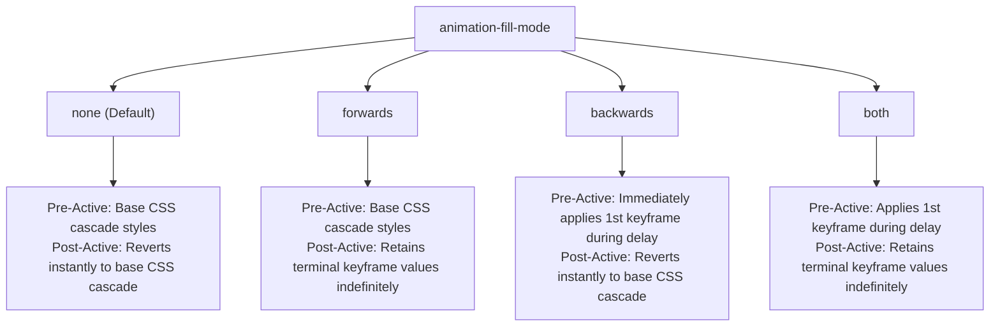
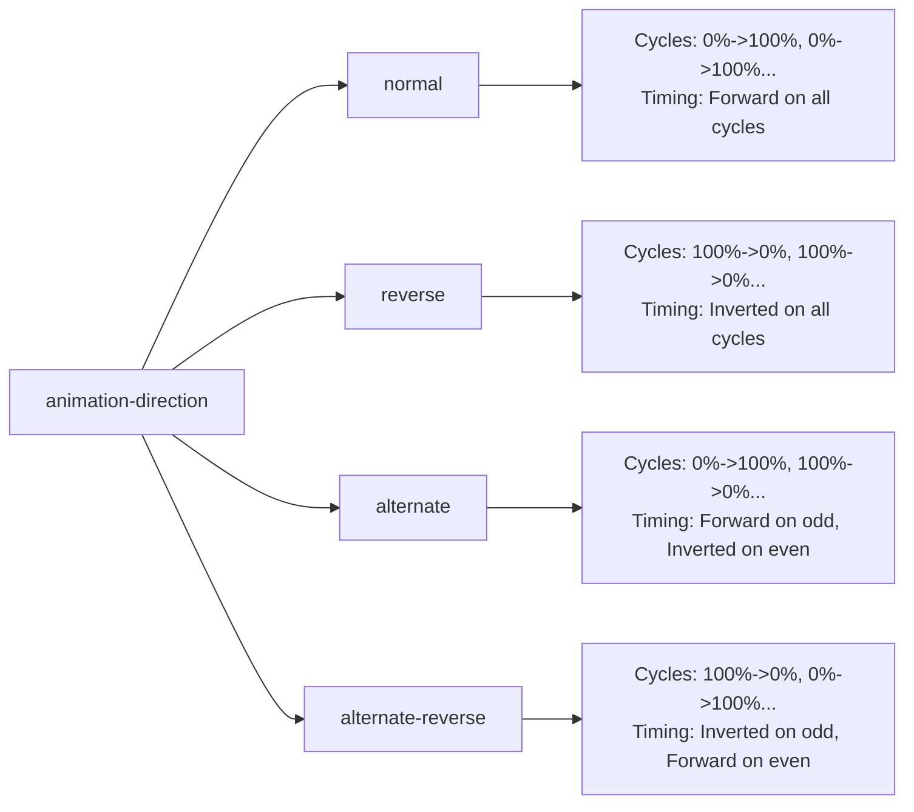

# 078: CSS Animation Direction & Fill Modes Masterclass

## Overview & Executive Summary

In modern user interface engineering, declarative CSS animations often suffer from subtle yet severe lifecycle flaws: jarring visual snaps when animations complete, "flashes of unstyled or resting content" (FOUC) during delayed entrance sequences, and redundant dual-keyframe declarations authored solely to make an animation loop seamlessly. 

Two foundational yet frequently misunderstood CSS properties govern the temporal lifecycle and state persistence of keyframe animations:
1. **`animation-direction`**: Controls the sequence and trajectory in which keyframes are evaluated across successive iteration cycles (`normal`, `reverse`, `alternate`, `alternate-reverse`), including automatic mathematical inversion of Bézier timing functions.
2. **`animation-fill-mode`**: Controls how keyframe computed styles are applied to an element **outside** the active execution window—specifically during the pre-execution `animation-delay` phase (`backwards`) and after the animation has reached terminal completion (`forwards`), or both (`both`).

Mastering the mathematical synergy between direction vectors and lifecycle fill modes empowers developers to build bulletproof staggered entrance choreography, stateful micro-interactions, reversible UI timelines, and buttery-smooth continuous loops running at 60–120 FPS on the GPU compositor thread without relying on fragile JavaScript style mutations.

```
+---------------------------------------------------------------------------------------------------+
|                         CSS ANIMATION TEMPORAL LIFECYCLE & FILL ZONES                             |
|                                                                                                   |
|  CSS Applied ──> [   ANIMATION-DELAY   ] ──> [      ACTIVE EXECUTION DURATION      ] ──> Terminal |
|                  |                     |     |                                     |     Rest     |
|                  |<── PRE-EXECUTION ──>|     |<──────── ITERATION CYCLES ─────────>|     State    |
|                  |                     |     |                                     |              |
|  FILL MODES:     |                     |     |                                     |              |
|  ----------------+---------------------+-----+-------------------------------------+------------+
|  none            |  Base CSS Cascade   | ──> |  Active Keyframe Interpolation      | ──> Base CSS |
|  backwards       |  1st Keyframe Style | ──> |  Active Keyframe Interpolation      | ──> Base CSS |
|  forwards        |  Base CSS Cascade   | ──> |  Active Keyframe Interpolation      | ──> Last KF  |
|  both            |  1st Keyframe Style | ──> |  Active Keyframe Interpolation      | ──> Last KF  |
|                                                                                                   |
|  DIRECTION VECTORS (Across Iteration Cycles 1, 2, 3, ...):                                        |
|  -----------------------------------------------------------------------------------------------+ |
|  normal            Cycle 1: [0% ──> 100%]       Cycle 2: [0% ──> 100%]       Cycle 3: [0% ──> 100%] |
|  reverse           Cycle 1: [100% ──> 0%]       Cycle 2: [100% ──> 0%]       Cycle 3: [100% ──> 0%] |
|  alternate         Cycle 1: [0% ──> 100%]       Cycle 2: [100% ──> 0%]       Cycle 3: [0% ──> 100%] |
|  alternate-reverse Cycle 1: [100% ──> 0%]       Cycle 2: [0% ──> 100%]       Cycle 3: [100% ──> 0%] |
+---------------------------------------------------------------------------------------------------+
```

---

## Quick Reference Metadata

| Attribute | Specification Details |
| :--- | :--- |
| **Name** | CSS Animation Direction & Fill Modes |
| **Category** | CSS Animations, Timing Architecture & State Retention |
| **Difficulty** | Advanced (4/5) |
| **What it produces** | Seamlessly looping bi-directional keyframes, flicker-free staggered entrance orchestrations, and persistent post-animation UI states without JavaScript class hacks. |
| **Why it works** | The browser's animation subsystem maps time coordinates across keyframe sequences based on the direction vector, and binds first/last keyframe computed styles to the element before delay expiry and after iteration termination. |
| **Key Properties** | `animation-direction`, `animation-fill-mode`, `animation-delay`, `animation-iteration-count`, `animation-timing-function`, `animation-play-state`, `animation`. |
| **Strict Constraints** | Timing functions automatically invert along the Bézier diagonal during reverse cycles ($P_1 \leftrightarrow P_2$). `forwards` retention depends on iteration count parity in `alternate` modes. |
| **Browser Baseline** | Baseline 2015+ across all modern browsers (Chromium, Firefox, Safari, WebKit, Edge) for CSS Animations Level 1 & Level 2 specifications. |
| **Acceptance Criteria** | 100% flicker-free delayed staggered entrances; perfectly seamless loop transitions without redundant `@keyframes` duplication; deterministic terminal state retention; full `@media (prefers-reduced-motion)` ergonomics. |

### Quick Preview

```html
<!-- Staggered Entrance Card with 'both' fill-mode and bi-directional hover pulse -->
<div class="card-stage">
  <article class="stagger-card" style="--stagger-delay: 200ms;">
    <span class="card-badge">Pro Feature</span>
    <h3 class="card-title">Real-Time Telemetry</h3>
    <p class="card-desc">Stateful animations holding their terminal positions seamlessly.</p>
  </article>
</div>
```

```css
.card-stage {
  display: flex;
  justify-content: center;
  padding: 2rem;
  background: #090d16;
}

.stagger-card {
  --stagger-delay: 0ms;
  inline-size: 320px;
  padding: 1.5rem;
  border-radius: 16px;
  background: rgba(30, 41, 59, 0.7);
  border: 1px solid rgba(255, 255, 255, 0.1);
  color: #f8fafc;
  
  /* Initial base state: visually neutral */
  transform-origin: center bottom;
  
  /* 
   * 'backwards' / 'both' prevents Flash Of Unstyled Content during --stagger-delay:
   * Keyframe 0% (opacity: 0, translateY: 30px) is applied IMMEDIATELY on load!
   */
  animation: card-reveal 800ms cubic-bezier(0.16, 1, 0.3, 1) var(--stagger-delay) both;
  will-change: transform, opacity;
}

@keyframes card-reveal {
  0% {
    opacity: 0;
    transform: translateY(32px) scale(0.94);
    filter: blur(8px);
  }
  100% {
    opacity: 1;
    transform: translateY(0px) scale(1);
    filter: blur(0px);
  }
}

/* Ambient glow utilizing bi-directional alternating oscillation */
.card-badge {
  display: inline-block;
  padding: 0.25rem 0.75rem;
  border-radius: 9999px;
  background: #3b82f6;
  font-size: 0.75rem;
  font-weight: 600;
  text-transform: uppercase;
  letter-spacing: 0.05em;
  
  /* 'alternate' oscillates 0% -> 100% -> 0% smoothly without snapping */
  animation: badge-glow 2s ease-in-out infinite alternate;
}

@keyframes badge-glow {
  0% {
    box-shadow: 0 0 0px rgba(59, 130, 246, 0.2);
    transform: scale(1);
  }
  100% {
    box-shadow: 0 0 16px 4px rgba(59, 130, 246, 0.6);
    transform: scale(1.05);
  }
}
```

---

## 1. Anatomy & Mathematical Mental Models

### 1.1 The Temporal Lifecycle of an Animation

Every CSS animation exists across three distinct temporal domains:
1. **The Pre-Active Phase ($t < \text{delay}$)**: The temporal interval between when the `animation-name` is applied to the element and when the timer elapsed equals `animation-delay`.
2. **The Active Phase ($\text{delay} \le t \le \text{delay} + (\text{duration} \times \text{iterations})$)**: The duration over which the browser samples and interpolates keyframe definitions on the GPU compositor timeline.
3. **The Post-Active Phase ($t > \text{delay} + (\text{duration} \times \text{iterations})$)**: The indefinite period after the animation has finished its declared iteration count.

```
Time Axis (t) ───────────────────────────────────────────────────────────────────────────────────►
            │                                     │                                      │
            ▼                                     ▼                                      ▼
      [Animation Set]                       [Delay Ends]                         [Execution Ends]
            │                                     │                                      │
  ◄─────────┴─────────────────────────────────────┼──────────────────────────────────────┼─────────►
       PRE-ACTIVE (Delay Period)             ACTIVE DURATION                         POST-ACTIVE
  Governed by: 'backwards' & 'both'      Governed by 'direction' & timing      Governed by: 'forwards' & 'both'
```

---

### 1.2 Mathematical Mechanics of `animation-fill-mode`

The `animation-fill-mode` property controls how keyframe properties map outside the active execution window:



#### Analytical Breakdown of Fill Modes:

| Fill Mode | Style Applied During `animation-delay` | Style Applied During Active Duration | Style Retained After Animation Ends |
| :--- | :--- | :--- | :--- |
| **`none`** | Base CSS cascade values | Keyframe interpolation values | Base CSS cascade values (instant snap back) |
| **`forwards`** | Base CSS cascade values | Keyframe interpolation values | **Terminal keyframe computed values** |
| **`backwards`** | **Initial keyframe computed values** | Keyframe interpolation values | Base CSS cascade values (instant snap back) |
| **`both`** | **Initial keyframe computed values** | Keyframe interpolation values | **Terminal keyframe computed values** |

> [!IMPORTANT]
> **What defines the "Initial" and "Terminal" Keyframe?**
> The specific keyframe sampled for `backwards` (initial) and `forwards` (terminal) depends directly on `animation-direction` and the odd/even parity of `animation-iteration-count`:
> - In `normal` mode: Initial is `0%`, Terminal is `100%`.
> - In `reverse` mode: Initial is `100%`, Terminal is `0%`.
> - In `alternate` mode: Initial is `0%`. Terminal is `100%` if iteration count is odd (1, 3, 5...), but `0%` if iteration count is even (2, 4, 6...).
> - In `alternate-reverse` mode: Initial is `100%`. Terminal is `0%` if iteration count is odd, but `100%` if iteration count is even.

---

### 1.3 Mathematical Mechanics of `animation-direction`

`animation-direction` controls the direction vector of keyframe progression across successive iteration cycles.

```
Cycle 1:   [0% ====================================> 100%]
normal:    0% ─────────────────────────────────────► 100%
reverse:   100% ◄───────────────────────────────────── 0%

Cycle 2:
normal:    0% ─────────────────────────────────────► 100%
alternate: 100% ◄───────────────────────────────────── 0%
```

#### Bézier Timing Function Inversion Mathematics

When an animation runs in reverse (either via `animation-direction: reverse` or during the even cycles of `alternate`), the browser does **not** simply replay the timing function forwards. It performs an exact point-reflection of the cubic Bézier curve control points across the central diagonal axis.

For a cubic Bézier defined by control points $P_0(0,0), P_1(x_1, y_1), P_2(x_2, y_2), P_3(1,1)$:

$$\text{Forward Curve: } \mathcal{B}(t) = \text{cubic-bezier}(x_1, y_1, x_2, y_2)$$

$$\text{Reversed Inverted Curve: } \mathcal{B}_{\text{rev}}(t) = \text{cubic-bezier}(1 - x_2, 1 - y_2, 1 - x_1, 1 - y_1)$$

```
     FORWARD TIMING (ease-in)                REVERSED INVERTED (ease-out)
  1.0 ┌───────────────────● P3            1.0 ┌───────────●───────● P3
      │                  /                    │        .-' \     /
      │                .-'                    │      .'     `---' P2
      │              .'                       │     /
  0.5 │            .'                     0.5 │    /
      │          .'                           │   /
      │     P1 .'                             │  / P1
      │  .---●                                │ ●
  0.0 ●───────────────────                0.0 ●───────────────────
     0.0       0.5       1.0                 0.0       0.5       1.0
      Slow start, fast end                    Fast start, slow end
```

#### Consequence of Inversion:
- `ease-in` (`cubic-bezier(0.42, 0, 1, 1)`) becomes `ease-out` (`cubic-bezier(0, 0, 0.58, 1)`).
- `ease-out` becomes `ease-in`.
- Symmetrical curves like `ease-in-out` (`cubic-bezier(0.42, 0, 0.58, 1)`) remain symmetrical.
- Asymmetrical custom curves like `cubic-bezier(0.1, 0.9, 0.2, 1.0)` invert into `cubic-bezier(0.8, 0.0, 0.9, 0.1)`.
- Stepped timing functions: `steps(n, start)` becomes `steps(n, end)`.

---

### 1.4 The 4 Direction Paradigms



1. **`normal`**: Every cycle plays from $0\%$ to $100\%$. At the end of each iteration, the state resets abruptly to $0\%$ and plays forward again.
2. **`reverse`**: Every cycle plays from $100\%$ down to $0\%$. The timing function is inverted on every iteration.
3. **`alternate`**: Odd iterations ($1, 3, 5, \dots$) play forward ($0\% \to 100\%$). Even iterations ($2, 4, 6, \dots$) play backward ($100\% \to 0\%$). Eliminates loop discontinuities and requires only 2 keyframes to achieve a seamless round-trip loop.
4. **`alternate-reverse`**: Odd iterations ($1, 3, 5, \dots$) play backward ($100\% \to 0\%$). Even iterations ($2, 4, 6, \dots$) play forward ($0\% \to 100\%$).

---

## 2. Core Building Blocks & Primitives

---

### Primitive 1: The Anti-FOUC Delayed Entrance (`fill-mode: backwards` & `both`)

When animating an element into view after an `animation-delay`, setting `opacity: 0` in base CSS is often problematic because if JavaScript or CSS fails to load, the element remains permanently hidden. `animation-fill-mode: backwards` (or `both`) solves this cleanly by keeping base CSS visible for progressive enhancement while instantaneously applying the `0%` keyframe style during the delay.

```css
/* Base element is visible by default for resilience without JS */
.entrance-card {
  opacity: 1;
  transform: translateY(0);
}

/* When animation class is attached: */
.entrance-card.animate-in {
  /* 
   * During the 400ms delay, the browser immediately applies 0% keyframe 
   * (opacity: 0; transform: translateY(24px)). 
   * After 800ms animation finishes, 'both' ensures it holds 100% keyframe styles.
   */
  animation-name: slide-fade-in;
  animation-duration: 800ms;
  animation-delay: 400ms;
  animation-timing-function: cubic-bezier(0.16, 1, 0.3, 1);
  animation-fill-mode: both;
}

@keyframes slide-fade-in {
  0% {
    opacity: 0;
    transform: translateY(24px);
  }
  100% {
    opacity: 1;
    transform: translateY(0);
  }
}
```

---

### Primitive 2: Symmetrical Oscillation without Redundant Keyframes (`direction: alternate`)

In naive CSS development, creating an oscillating pulse often results in redundant 3-step keyframes:

```css
/* NAIVE ANTI-PATTERN: 3 keyframes, manual curve balancing */
@keyframes naive-pulse {
  0%   { transform: scale(1); }
  50%  { transform: scale(1.15); }
  100% { transform: scale(1); }
}
.naive-item {
  animation: naive-pulse 2s infinite;
}
```

With `animation-direction: alternate`, the keyframe sequence is reduced to 2 points, and the browser mathematically guarantees exact symmetry and reversed timing:

```css
/* IDIOMATIC & ELEGANT: 2 keyframes + alternate */
@keyframes clean-pulse {
  0%   { transform: scale(1); opacity: 0.7; }
  100% { transform: scale(1.15); opacity: 1; }
}

.pro-item {
  /* Automatically reverses trajectory on even cycles: 0% -> 100% -> 0% */
  animation: clean-pulse 1s cubic-bezier(0.4, 0, 0.2, 1) infinite alternate;
}
```

---

### Primitive 3: Terminal State Persistence (`fill-mode: forwards`)

For one-off UI state transitions (like opening a drawer, checking a task checkbox, or triggering an exit animation), `animation-fill-mode: forwards` locks the final frame in place permanently.

```css
.task-item.is-completed {
  animation: complete-strike 500ms cubic-bezier(0.2, 0.8, 0.2, 1) forwards;
}

@keyframes complete-strike {
  0% {
    transform: translateX(0);
    opacity: 1;
  }
  50% {
    transform: translateX(12px);
    color: #10b981;
  }
  100% {
    transform: translateX(0);
    opacity: 0.5;
    text-decoration: line-through;
    filter: grayscale(1);
  }
}
```

---

### Primitive 4: Inverted Entrance for Exit Sequences (`direction: reverse`)

By pairing an entrance keyframe definition with `animation-direction: reverse`, you can reuse existing `@keyframes` declarations to create exit animations without duplicating code:

```css
/* Shared Master Keyframe Definition */
@keyframes modal-scale-fade {
  0% {
    opacity: 0;
    transform: scale(0.85) translateY(20px);
    pointer-events: none;
  }
  100% {
    opacity: 1;
    transform: scale(1) translateY(0);
    pointer-events: auto;
  }
}

/* Modal Open: Normal forward entrance */
.modal.is-open {
  animation: modal-scale-fade 350ms cubic-bezier(0.16, 1, 0.3, 1) forwards;
}

/* Modal Close: Reused keyframe in reverse! */
.modal.is-closing {
  /* 
   * Plays 100% -> 0%. 
   * Timing function cubic-bezier(0.16, 1, 0.3, 1) inverts into a fast snap exit!
   * 'forwards' holds the 0% state (hidden) at completion.
   */
  animation: modal-scale-fade 250ms cubic-bezier(0.16, 1, 0.3, 1) reverse forwards;
}
```

---

### Primitive 5: Master Shorthand Property Grammar

The CSS `animation` shorthand accepts up to 8 distinct sub-properties. The order of `<time>` values is strictly enforced by the CSS specification:

```
animation: [name] [duration] [timing-function] [delay] [iteration-count] [direction] [fill-mode] [play-state];
```

```css
/* Complete Formal Dissection of the Animation Shorthand: */
.animated-element {
  animation: 
    slide-in-glow      /* 1. animation-name */
    600ms              /* 2. animation-duration (1st time value) */
    ease-in-out        /* 3. animation-timing-function */
    200ms              /* 4. animation-delay (2nd time value!) */
    infinite           /* 5. animation-iteration-count */
    alternate          /* 6. animation-direction */
    both               /* 7. animation-fill-mode */
    running;           /* 8. animation-play-state */
}
```

---

## 3. Comprehensive Implementation Patterns

---

### Pattern 1: High-Performance Staggered Dashboard Orchestration

A multi-card analytics dashboard where cards enter sequentially with staggered delays. By leveraging `animation-fill-mode: both`, each card remains locked at its invisible, translated `0%` keyframe state throughout its respective delay period, eliminating any initial render glitch or FOUC.

```
+-------------------------------------------------------------------------------+
|                      STAGGERED DASHBOARD ORCHESTRATION                        |
|                                                                               |
|  Timeline (t):                                                                |
|  Card 1 (delay: 0ms)    [0% ========> 100%] (Locks at 100% via 'both')        |
|  Card 2 (delay: 150ms)  [0% locked] ──> [0% ========> 100%] (Locks at 100%)   |
|  Card 3 (delay: 300ms)  [0% locked] ───────> [0% ========> 100%] (Locks)      |
|  Card 4 (delay: 450ms)  [0% locked] ────────────> [0% ========> 100%] (Locks) |
+-------------------------------------------------------------------------------+
```

#### HTML Structure:
```html
<div class="dashboard-container">
  <header class="dashboard-header">
    <h2 class="dashboard-title">System Metrics</h2>
    <span class="live-status-pill">Live Telemetry</span>
  </header>
  
  <div class="metrics-grid">
    <article class="metric-card" style="--stagger-index: 0;">
      <div class="metric-icon-box cpu-icon">⚡</div>
      <div class="metric-meta">
        <span class="metric-label">CPU Compute Load</span>
        <strong class="metric-value">42.8%</strong>
      </div>
      <div class="metric-chart-bar" style="--bar-fill: 42.8%;"></div>
    </article>

    <article class="metric-card" style="--stagger-index: 1;">
      <div class="metric-icon-box mem-icon">💾</div>
      <div class="metric-meta">
        <span class="metric-label">Memory Allocation</span>
        <strong class="metric-value">14.2 GB</strong>
      </div>
      <div class="metric-chart-bar" style="--bar-fill: 71.0%;"></div>
    </article>

    <article class="metric-card" style="--stagger-index: 2;">
      <div class="metric-icon-box net-icon">🌐</div>
      <div class="metric-meta">
        <span class="metric-label">Ingress Throughput</span>
        <strong class="metric-value">1.84 Gbps</strong>
      </div>
      <div class="metric-chart-bar" style="--bar-fill: 55.4%;"></div>
    </article>

    <article class="metric-card" style="--stagger-index: 3;">
      <div class="metric-icon-box disk-icon">🛡️</div>
      <div class="metric-meta">
        <span class="metric-label">Health & Redundancy</span>
        <strong class="metric-value">99.99%</strong>
      </div>
      <div class="metric-chart-bar" style="--bar-fill: 99.99%;"></div>
    </article>
  </div>
</div>
```

#### CSS Implementation:
```css
:root {
  --bg-space: #0b0f19;
  --card-bg: rgba(22, 30, 46, 0.85);
  --card-border: rgba(255, 255, 255, 0.08);
  --accent-cyan: #06b6d4;
  --accent-emerald: #10b981;
  --accent-violet: #8b5cf6;
  --accent-amber: #f59e0b;
}

.dashboard-container {
  max-inline-size: 960px;
  margin-inline: auto;
  padding: 2.5rem 1.5rem;
  background: var(--bg-space);
  font-family: system-ui, -apple-system, BlinkMacSystemFont, 'Segoe UI', Roboto, sans-serif;
  color: #f1f5f9;
}

.dashboard-header {
  display: flex;
  justify-content: space-between;
  align-items: center;
  margin-block-end: 2rem;
}

.dashboard-title {
  margin: 0;
  font-size: 1.5rem;
  font-weight: 700;
  letter-spacing: -0.02em;
}

/* Bi-directional pulsing live status beacon */
.live-status-pill {
  display: inline-flex;
  align-items: center;
  gap: 0.5rem;
  padding: 0.35rem 0.85rem;
  border-radius: 9999px;
  background: rgba(16, 185, 129, 0.12);
  border: 1px solid rgba(16, 185, 129, 0.3);
  color: var(--accent-emerald);
  font-size: 0.8125rem;
  font-weight: 600;
}

.live-status-pill::before {
  content: '';
  inline-size: 8px;
  block-size: 8px;
  border-radius: 50%;
  background: var(--accent-emerald);
  /* Smooth oscillating radar glow using alternate */
  animation: beacon-ping 1.4s cubic-bezier(0.4, 0, 0.6, 1) infinite alternate;
}

@keyframes beacon-ping {
  0% {
    transform: scale(0.85);
    opacity: 0.4;
    box-shadow: 0 0 0px var(--accent-emerald);
  }
  100% {
    transform: scale(1.25);
    opacity: 1;
    box-shadow: 0 0 10px var(--accent-emerald);
  }
}

.metrics-grid {
  display: grid;
  grid-template-columns: repeat(auto-fit, minmax(210px, 1fr));
  gap: 1.25rem;
}

/* 
 * The Staggered Card:
 * Uses --stagger-index with calc() delay and 'both' fill-mode
 */
.metric-card {
  --base-delay: 120ms;
  --stagger-step: 140ms;
  --computed-delay: calc(var(--base-delay) + (var(--stagger-index, 0) * var(--stagger-step)));
  
  display: flex;
  flex-direction: column;
  padding: 1.5rem;
  border-radius: 16px;
  background: var(--card-bg);
  border: 1px solid var(--card-border);
  backdrop-filter: blur(12px);
  box-shadow: 0 12px 32px -8px rgba(0, 0, 0, 0.5);
  
  /* GPU Compositor Isolation */
  will-change: transform, opacity, filter;
  
  /*
   * ANIMATION DEFINITION:
   * 1. Duration: 750ms
   * 2. Timing: Custom snappy spring bezier
   * 3. Delay: Calculated per card
   * 4. Fill-mode: 'both' -> 0% keyframe applied immediately on mount, 100% held permanently!
   */
  animation: card-reveal-spring 750ms cubic-bezier(0.16, 1, 0.3, 1) var(--computed-delay) both;
}

@keyframes card-reveal-spring {
  0% {
    opacity: 0;
    transform: translateY(40px) scale(0.92);
    filter: blur(10px);
  }
  100% {
    opacity: 1;
    transform: translateY(0px) scale(1);
    filter: blur(0px);
  }
}

.metric-icon-box {
  inline-size: 40px;
  block-size: 40px;
  border-radius: 10px;
  display: grid;
  place-items: center;
  font-size: 1.25rem;
  margin-block-end: 1rem;
  background: rgba(255, 255, 255, 0.05);
}

.metric-meta {
  display: flex;
  flex-direction: column;
  gap: 0.25rem;
}

.metric-label {
  font-size: 0.8125rem;
  color: #94a3b8;
  font-weight: 500;
}

.metric-value {
  font-size: 1.625rem;
  font-weight: 700;
  letter-spacing: -0.03em;
  color: #ffffff;
}

/* Staggered progress bar filling */
.metric-chart-bar {
  margin-block-start: 1.25rem;
  inline-size: 100%;
  block-size: 6px;
  border-radius: 9999px;
  background: rgba(255, 255, 255, 0.08);
  position: relative;
  overflow: hidden;
}

.metric-chart-bar::after {
  content: '';
  position: absolute;
  inset-block: 0;
  inset-inline-start: 0;
  inline-size: var(--bar-fill, 50%);
  border-radius: inherit;
  background: linear-gradient(90deg, var(--accent-cyan), var(--accent-emerald));
  
  /* Progress bar animates with additional delay and holds full width */
  transform-origin: left center;
  animation: bar-grow 1s cubic-bezier(0.16, 1, 0.3, 1) calc(var(--computed-delay) + 200ms) both;
}

@keyframes bar-grow {
  0% {
    transform: scaleX(0);
  }
  100% {
    transform: scaleX(1);
  }
}
```

---

### Pattern 2: Bi-Directional Interactive Drawer & Modal Lifecycle

When creating modals, fly-out drawers, or collapsible accordions, developers frequently write two separate `@keyframes` rules (e.g., `drawer-slide-in` and `drawer-slide-out`). By combining `animation-direction: reverse` with `animation-fill-mode: forwards`, a single keyframe rule handles both forward entrance and reversed dismissal with mathematically inverted deceleration.

```
+-------------------------------------------------------------------------------+
|                   SINGLE KEYFRAME BI-DIRECTIONAL DRAWER                       |
|                                                                               |
|  @keyframes drawer-glide {                                                    |
|    0%   { transform: translateX(100%); opacity: 0; }  <── (Closed State)     |
|    100% { transform: translateX(0%);   opacity: 1; }  <── (Open State)       |
|  }                                                                            |
|                                                                               |
|  .drawer.is-open:     direction: normal;  fill-mode: forwards (0% -> 100%)    |
|  .drawer.is-closing:  direction: reverse; fill-mode: forwards (100% -> 0%)    |
+-------------------------------------------------------------------------------+
```

#### HTML Structure:
```html
<div class="drawer-fixture">
  <button id="toggleDrawerBtn" class="control-trigger-btn" type="button">
    Toggle Settings Drawer
  </button>

  <div class="drawer-backdrop" id="drawerBackdrop"></div>

  <aside class="drawer-panel" id="drawerPanel" aria-hidden="true">
    <div class="drawer-header">
      <h3 class="drawer-title">Workspace Settings</h3>
      <button id="closeDrawerBtn" class="drawer-close-btn" aria-label="Close drawer">✕</button>
    </div>
    <div class="drawer-content">
      <p class="drawer-text">
        This drawer utilizes a single unified <code>@keyframes drawer-motion</code> declaration.
      </p>
      <div class="setting-row">
        <span>Hardware Acceleration</span>
        <input type="checkbox" checked class="custom-toggle" />
      </div>
      <div class="setting-row">
        <span>Subpixel Antialiasing</span>
        <input type="checkbox" checked class="custom-toggle" />
      </div>
    </div>
  </aside>
</div>
```

#### CSS Implementation:
```css
.drawer-fixture {
  position: relative;
  min-block-size: 380px;
  display: grid;
  place-items: center;
  background: #0f172a;
  border-radius: 16px;
  overflow: hidden;
  border: 1px solid rgba(255, 255, 255, 0.08);
}

.control-trigger-btn {
  padding: 0.75rem 1.5rem;
  border-radius: 12px;
  background: #3b82f6;
  color: #ffffff;
  font-weight: 600;
  border: none;
  cursor: pointer;
  box-shadow: 0 4px 14px rgba(59, 130, 246, 0.4);
  transition: transform 0.15s ease, background 0.15s ease;
}

.control-trigger-btn:hover {
  background: #2563eb;
  transform: translateY(-1px);
}

/* Master Shared Backdrop Animation */
@keyframes backdrop-fade {
  0% {
    opacity: 0;
    visibility: hidden;
  }
  100% {
    opacity: 1;
    visibility: visible;
  }
}

.drawer-backdrop {
  position: absolute;
  inset: 0;
  background: rgba(0, 0, 0, 0.65);
  backdrop-filter: blur(4px);
  opacity: 0;
  visibility: hidden;
  pointer-events: none;
}

.drawer-backdrop.is-active {
  pointer-events: auto;
  animation: backdrop-fade 350ms cubic-bezier(0.16, 1, 0.3, 1) forwards;
}

.drawer-backdrop.is-closing {
  pointer-events: none;
  animation: backdrop-fade 300ms cubic-bezier(0.16, 1, 0.3, 1) reverse forwards;
}

/* Master Shared Drawer Motion Keyframe */
@keyframes drawer-motion {
  0% {
    transform: translateX(100%);
    box-shadow: 0 0 0 rgba(0, 0, 0, 0);
  }
  100% {
    transform: translateX(0%);
    box-shadow: -16px 0 48px rgba(0, 0, 0, 0.75);
  }
}

.drawer-panel {
  position: absolute;
  inset-block: 0;
  inset-inline-end: 0;
  inline-size: 320px;
  background: #1e293b;
  border-inline-start: 1px solid rgba(255, 255, 255, 0.1);
  padding: 1.75rem;
  display: flex;
  flex-direction: column;
  color: #f8fafc;
  transform: translateX(100%); /* Resting default state */
  z-index: 10;
  will-change: transform;
}

/* State 1: Open Triggered (Forward Execution) */
.drawer-panel.is-open {
  animation: drawer-motion 400ms cubic-bezier(0.16, 1, 0.3, 1) normal forwards;
}

/* State 2: Close Triggered (Reverse Execution Reusing Keyframe) */
.drawer-panel.is-closing {
  /*
   * 'reverse' plays 100% -> 0%.
   * Timing curve inverts to accelerate rapidly off-screen.
   * 'forwards' holds the 0% state (transform: translateX(100%)) at the end!
   */
  animation: drawer-motion 300ms cubic-bezier(0.16, 1, 0.3, 1) reverse forwards;
}

.drawer-header {
  display: flex;
  justify-content: space-between;
  align-items: center;
  margin-block-end: 1.5rem;
}

.drawer-title {
  margin: 0;
  font-size: 1.25rem;
  font-weight: 700;
}

.drawer-close-btn {
  background: transparent;
  border: none;
  color: #94a3b8;
  font-size: 1.25rem;
  cursor: pointer;
  padding: 0.25rem;
  border-radius: 6px;
}

.drawer-close-btn:hover {
  color: #ffffff;
  background: rgba(255, 255, 255, 0.1);
}

.drawer-content {
  display: flex;
  flex-direction: column;
  gap: 1rem;
}

.drawer-text {
  font-size: 0.875rem;
  color: #94a3b8;
  line-height: 1.5;
  margin: 0;
}

.setting-row {
  display: flex;
  justify-content: space-between;
  align-items: center;
  padding: 0.75rem;
  background: rgba(0, 0, 0, 0.2);
  border-radius: 8px;
  font-size: 0.875rem;
}

.custom-toggle {
  inline-size: 1.25rem;
  block-size: 1.25rem;
  accent-color: #3b82f6;
  cursor: pointer;
}
```

#### JavaScript Controller:
```javascript
const toggleBtn = document.getElementById('toggleDrawerBtn');
const closeBtn = document.getElementById('closeDrawerBtn');
const backdrop = document.getElementById('drawerBackdrop');
const panel = document.getElementById('drawerPanel');

function openDrawer() {
  backdrop.classList.remove('is-closing');
  panel.classList.remove('is-closing');
  
  backdrop.classList.add('is-active');
  panel.classList.add('is-open');
  panel.setAttribute('aria-hidden', 'false');
}

function closeDrawer() {
  if (!panel.classList.contains('is-open')) return;
  
  backdrop.classList.remove('is-active');
  panel.classList.remove('is-open');
  
  backdrop.classList.add('is-closing');
  panel.classList.add('is-closing');
  panel.setAttribute('aria-hidden', 'true');
}

toggleBtn.addEventListener('click', openDrawer);
closeBtn.addEventListener('click', closeDrawer);
backdrop.addEventListener('click', closeDrawer);
```

---

### Pattern 3: The Infinite Breathing Audio Visualizer & Waveform

Audio visualizers, voice assistant waveforms, and ambient breathing orbs require continuous, seamless looping motion. By using `animation-direction: alternate`, you eliminate the need for complex piecewise 0% -> 50% -> 100% keyframes while achieving non-linear organic harmonic oscillation.

```
+-------------------------------------------------------------------------------+
|                    HARMONIC ALTERNATING WAVEFORM BARS                         |
|                                                                               |
|   Bar 1 (alternate, 700ms)    Bar 2 (alternate, 1100ms)   Bar 3 (alternate)   |
|         ┌───┐                       ┌───┐                       ┌───┐         |
|         │   │ ▲                     │   │ ▲                     │   │ ▲       |
|         │   │ │ Oscillation         │   │ │ Oscillation         │   │ │       |
|         │   │ ▼                     │   │ ▼                     │   │ ▼       |
|         └───┘                       └───┘                       └───┘         |
|   0% <======> 100%            0% <======> 100%            0% <======> 100%    |
+-------------------------------------------------------------------------------+
```

#### HTML Structure:
```html
<div class="audio-stage">
  <div class="waveform-container" aria-label="Audio Visualizer">
    <div class="waveform-bar" style="--bar-duration: 650ms; --max-scale: 2.8;"></div>
    <div class="waveform-bar" style="--bar-duration: 950ms; --max-scale: 4.2;"></div>
    <div class="waveform-bar" style="--bar-duration: 520ms; --max-scale: 1.9;"></div>
    <div class="waveform-bar" style="--bar-duration: 1100ms; --max-scale: 5.0;"></div>
    <div class="waveform-bar" style="--bar-duration: 780ms; --max-scale: 3.4;"></div>
    <div class="waveform-bar" style="--bar-duration: 600ms; --max-scale: 2.3;"></div>
    <div class="waveform-bar" style="--bar-duration: 880ms; --max-scale: 4.6;"></div>
    <div class="waveform-bar" style="--bar-duration: 720ms; --max-scale: 3.1;"></div>
  </div>
  
  <div class="audio-controls">
    <span class="track-info">Synthesizer Stream: 48kHz / 24-bit</span>
  </div>
</div>
```

#### CSS Implementation:
```css
.audio-stage {
  padding: 3rem 2rem;
  background: radial-gradient(circle at center, #1e1b4b 0%, #030712 100%);
  border-radius: 20px;
  display: flex;
  flex-direction: column;
  align-items: center;
  gap: 2rem;
  box-shadow: inset 0 1px 0 rgba(255, 255, 255, 0.1), 0 20px 40px rgba(0, 0, 0, 0.6);
}

.waveform-container {
  display: flex;
  align-items: center;
  justify-content: center;
  gap: 8px;
  block-size: 120px;
}

/* 
 * The Minimal 2-Point Oscillating Keyframe
 * Only defines 0% (rest) and 100% (peak expansion)
 */
@keyframes bar-oscillate {
  0% {
    transform: scaleY(0.4);
    opacity: 0.5;
    filter: brightness(0.9);
  }
  100% {
    transform: scaleY(var(--max-scale, 3));
    opacity: 1;
    filter: brightness(1.3) drop-shadow(0 0 8px rgba(168, 85, 247, 0.7));
  }
}

.waveform-bar {
  inline-size: 6px;
  block-size: 20px;
  border-radius: 9999px;
  background: linear-gradient(180deg, #c084fc, #6366f1);
  transform-origin: center center;
  will-change: transform, opacity, filter;
  
  /* 
   * 'alternate' direction automatically handles 0% -> 100% -> 0% 
   * with mirrored sinusoidal timing!
   */
  animation-name: bar-oscillate;
  animation-duration: var(--bar-duration, 800ms);
  animation-timing-function: cubic-bezier(0.45, 0.05, 0.55, 0.95);
  animation-iteration-count: infinite;
  animation-direction: alternate;
}

.track-info {
  font-size: 0.8125rem;
  color: #a5b4fc;
  font-family: monospace;
  letter-spacing: 0.05em;
  background: rgba(99, 102, 241, 0.1);
  padding: 0.4rem 1rem;
  border-radius: 9999px;
  border: 1px solid rgba(99, 102, 241, 0.2);
}
```

---

### Pattern 4: The Finite Countdown Progress Engine with Lock State

A circular/linear multi-step checkout countdown timer that executes for an exact number of cycles ($N=3$), alternates pulse warnings on each cycle, and locks in its terminal warning state upon completion using `animation-fill-mode: forwards`.

```
+-------------------------------------------------------------------------------+
|                    FINITE MULTI-CYCLE COUNTDOWN ENGINE                        |
|                                                                               |
|  Cycle 1 (Forward):   [0% ===================> 100%] (Mild Warning)           |
|  Cycle 2 (Reverse):   [100% <=================== 0%] (Medium Warning)         |
|  Cycle 3 (Forward):   [0% ===================> 100%] (Critical Lock State)    |
|                                                                               |
|  Terminates at Cycle 3 end -> Holds 100% Keyframe via 'forwards'              |
+-------------------------------------------------------------------------------+
```

#### HTML Structure:
```html
<div class="countdown-card">
  <div class="countdown-indicator">
    <div class="countdown-core">
      <span class="countdown-number" id="countdownSec">15</span>
      <span class="countdown-sub">sec left</span>
    </div>
  </div>

  <div class="countdown-footer">
    <div class="step-progress-track">
      <div class="step-progress-fill"></div>
    </div>
    <p class="reservation-text">Securing session tokens...</p>
  </div>
</div>
```

#### CSS Implementation:
```css
.countdown-card {
  inline-size: 340px;
  padding: 2rem;
  border-radius: 24px;
  background: #111827;
  border: 1px solid rgba(255, 255, 255, 0.08);
  display: flex;
  flex-direction: column;
  align-items: center;
  gap: 1.5rem;
  color: #f9fafb;
  box-shadow: 0 20px 40px -10px rgba(0, 0, 0, 0.7);
}

.countdown-indicator {
  inline-size: 140px;
  block-size: 140px;
  border-radius: 50%;
  padding: 8px;
  background: rgba(255, 255, 255, 0.03);
  display: grid;
  place-items: center;
  position: relative;
}

/* 
 * Multi-Cycle Pulsing Ring:
 * Runs for exactly 3 iterations, alternating direction,
 * and holds the 100% critical state at the end (forwards)!
 */
@keyframes ring-urgency-pulse {
  0% {
    box-shadow: 0 0 0 0px rgba(59, 130, 246, 0.4), inset 0 0 0 2px rgba(59, 130, 246, 0.4);
    border-color: #3b82f6;
  }
  100% {
    box-shadow: 0 0 24px 6px rgba(239, 68, 68, 0.6), inset 0 0 0 4px rgba(239, 68, 68, 0.8);
    border-color: #ef4444;
  }
}

.countdown-indicator::before {
  content: '';
  position: absolute;
  inset: 0;
  border-radius: 50%;
  border: 2px solid transparent;
  
  /* 
   * 3 cycles * 5s = 15s total countdown
   * Cycle 1: Forward (Blue -> Red)
   * Cycle 2: Reverse (Red -> Blue)
   * Cycle 3: Forward (Blue -> Red) -> Holds RED indefinitely at end via forwards!
   */
  animation: ring-urgency-pulse 5s ease-in-out 3 alternate forwards;
}

.countdown-core {
  display: flex;
  flex-direction: column;
  align-items: center;
  justify-content: center;
}

.countdown-number {
  font-size: 2.5rem;
  font-weight: 800;
  line-height: 1;
  font-variant-numeric: tabular-nums;
  letter-spacing: -0.04em;
}

.countdown-sub {
  font-size: 0.75rem;
  color: #9ca3af;
  text-transform: uppercase;
  letter-spacing: 0.05em;
  margin-block-start: 0.25rem;
}

.countdown-footer {
  inline-size: 100%;
  display: flex;
  flex-direction: column;
  gap: 0.75rem;
  align-items: center;
}

.step-progress-track {
  inline-size: 100%;
  block-size: 6px;
  background: rgba(255, 255, 255, 0.1);
  border-radius: 9999px;
  overflow: hidden;
}

@keyframes countdown-deplete {
  0% {
    transform: scaleX(1);
    background: #3b82f6;
  }
  70% {
    background: #f59e0b;
  }
  100% {
    transform: scaleX(0);
    background: #ef4444;
  }
}

.step-progress-fill {
  inline-size: 100%;
  block-size: 100%;
  transform-origin: left center;
  /* 15-second finite progress depletion with persistent 0-width end state */
  animation: countdown-deplete 15s linear forwards;
}

.reservation-text {
  font-size: 0.8125rem;
  color: #9ca3af;
  margin: 0;
}
```

---

### Pattern 5: Bi-Directional Interactive Skeleton Shimmer & Content Swap

A shimmering skeleton loader that pulses smoothly back-and-forth (`direction: alternate`), which cleanly transitions into loaded content using `animation-fill-mode: forwards` to eliminate any sudden disappearance jump.

```html
<div class="skeleton-fixture">
  <div class="skeleton-card" id="skeletonCard">
    <div class="skeleton-avatar"></div>
    <div class="skeleton-body">
      <div class="skeleton-line headline"></div>
      <div class="skeleton-line text short"></div>
      <div class="skeleton-line text long"></div>
    </div>
  </div>
</div>
```

```css
.skeleton-fixture {
  padding: 2rem;
  background: #0f172a;
  border-radius: 16px;
}

.skeleton-card {
  inline-size: 300px;
  padding: 1.5rem;
  border-radius: 16px;
  background: #1e293b;
  border: 1px solid rgba(255, 255, 255, 0.05);
  display: flex;
  gap: 1rem;
}

.skeleton-avatar {
  inline-size: 48px;
  block-size: 48px;
  border-radius: 50%;
  background: #334155;
}

.skeleton-body {
  flex: 1;
  display: flex;
  flex-direction: column;
  gap: 0.625rem;
}

.skeleton-line {
  block-size: 12px;
  border-radius: 6px;
  background: #334155;
}

.skeleton-line.headline {
  block-size: 16px;
  inline-size: 80%;
}

.skeleton-line.text.short {
  inline-size: 55%;
}

.skeleton-line.text.long {
  inline-size: 95%;
}

/* 
 * Continuous bi-directional shimmer wave 
 * Smoothly oscillates without sudden snapbacks
 */
@keyframes shimmer-wave {
  0% {
    opacity: 0.35;
    filter: brightness(0.85);
  }
  100% {
    opacity: 1;
    filter: brightness(1.3);
  }
}

.skeleton-avatar,
.skeleton-line {
  animation: shimmer-wave 900ms ease-in-out infinite alternate;
  will-change: opacity, filter;
}

/* When data is loaded, smooth exit */
.skeleton-card.is-loaded {
  animation: skeleton-fade-out 400ms cubic-bezier(0.16, 1, 0.3, 1) forwards;
}

@keyframes skeleton-fade-out {
  0% {
    opacity: 1;
    transform: scale(1);
  }
  100% {
    opacity: 0;
    transform: scale(0.95);
    visibility: hidden;
  }
}
```

---

## 4. The 4x4 Direction & Fill-Mode Permutation Matrix

The following exhaustive lookup matrix analyzes the exact behavior for all 16 permutations of `animation-direction` and `animation-fill-mode` across an animation defined with:
- Keyframe `0%`: `opacity: 0; transform: translateY(20px)`
- Keyframe `100%`: `opacity: 1; transform: translateY(0px)`
- Duration: `1s`, Delay: `1s`, Iteration Count: $N = 2$ (Even) or $N = 1$ (Odd)

| `animation-direction` | `animation-fill-mode` | State During Delay ($t < 1s$) | Cycle 1 ($1s \le t \le 2s$) | Cycle 2 ($2s \le t \le 3s$) | Resting State ($N=1$ Odd) | Resting State ($N=2$ Even) |
| :--- | :--- | :--- | :--- | :--- | :--- | :--- |
| **`normal`** | `none` | Base CSS | $0\% \to 100\%$ | $0\% \to 100\%$ | Base CSS | Base CSS |
| **`normal`** | `forwards` | Base CSS | $0\% \to 100\%$ | $0\% \to 100\%$ | **$100\%$ Keyframe** | **$100\%$ Keyframe** |
| **`normal`** | `backwards` | **$0\%$ Keyframe** | $0\% \to 100\%$ | $0\% \to 100\%$ | Base CSS | Base CSS |
| **`normal`** | `both` | **$0\%$ Keyframe** | $0\% \to 100\%$ | $0\% \to 100\%$ | **$100\%$ Keyframe** | **$100\%$ Keyframe** |
| **`reverse`** | `none` | Base CSS | $100\% \to 0\%$ | $100\% \to 0\%$ | Base CSS | Base CSS |
| **`reverse`** | `forwards` | Base CSS | $100\% \to 0\%$ | $100\% \to 0\%$ | **$0\%$ Keyframe** | **$0\%$ Keyframe** |
| **`reverse`** | `backwards` | **$100\%$ Keyframe** | $100\% \to 0\%$ | $100\% \to 0\%$ | Base CSS | Base CSS |
| **`reverse`** | `both` | **$100\%$ Keyframe** | $100\% \to 0\%$ | $100\% \to 0\%$ | **$0\%$ Keyframe** | **$0\%$ Keyframe** |
| **`alternate`** | `none` | Base CSS | $0\% \to 100\%$ | $100\% \to 0\%$ | Base CSS | Base CSS |
| **`alternate`** | `forwards` | Base CSS | $0\% \to 100\%$ | $100\% \to 0\%$ | **$100\%$ Keyframe** | **$0\%$ Keyframe** |
| **`alternate`** | `backwards` | **$0\%$ Keyframe** | $0\% \to 100\%$ | $100\% \to 0\%$ | Base CSS | Base CSS |
| **`alternate`** | `both` | **$0\%$ Keyframe** | $0\% \to 100\%$ | $100\% \to 0\%$ | **$100\%$ Keyframe** | **$0\%$ Keyframe** |
| **`alternate-reverse`** | `none` | Base CSS | $100\% \to 0\%$ | $0\% \to 100\%$ | Base CSS | Base CSS |
| **`alternate-reverse`** | `forwards` | Base CSS | $100\% \to 0\%$ | $0\% \to 100\%$ | **$0\%$ Keyframe** | **$100\%$ Keyframe** |
| **`alternate-reverse`** | `backwards` | **$100\%$ Keyframe** | $100\% \to 0\%$ | $0\% \to 100\%$ | Base CSS | Base CSS |
| **`alternate-reverse`** | `both` | **$100\%$ Keyframe** | $100\% \to 0\%$ | $0\% \to 100\%$ | **$0\%$ Keyframe** | **$100\%$ Keyframe** |

---

## 5. Performance, GPU Compositing & 120 FPS Optimization

### 5.1 The Compositor-Only Property Contract

To ensure 120 FPS fluidity on modern high-refresh screens, properties animated under different direction and fill modes must never invalidate the document layout or require repaint passes on every frame tick.

```
+-------------------------------------------------------------------------------+
|                       GPU COMPOSITOR PIPELINE BYPASS                          |
|                                                                               |
|   BAD: Animating 'left', 'margin', 'height'                                   |
|   [Frame Tick] ──> [Recalc Style] ──> [Layout (Reflow)] ──> [Paint] ──> [GPU] |
|                                                                               |
|   PERFECT: Animating 'transform', 'opacity', 'filter'                         |
|   [Frame Tick] ───────────────────────────────────────────────────────> [GPU] |
+-------------------------------------------------------------------------------+
```

#### Rules for High-Performance Animation:
1. **Strictly animate compositor properties**:
   - Translate / Scale / Rotate: `transform: translate3d(...)` / `translateY(...)` / `scale(...)`
   - Transparency: `opacity`
   - Blending & Filters: `filter: blur(...)` / `backdrop-filter`
2. **Promote active elements to independent GPU layers**:
   ```css
   .accelerated-node {
     will-change: transform, opacity;
     transform: translateZ(0); /* Hardware layer allocation */
   }
   ```
3. **Beware of `forwards` and Stale GPU Layer Memory**:
   - Leaving hundreds of DOM elements in a `fill-mode: forwards` state with `will-change: transform` can consume excessive video memory (VRAM) on mobile devices.
   - Once an entrance animation finishes, remove `will-change: transform` or remove the temporary class if layer promotion is no longer needed.

---

## 6. Accessibility, Motion Sensitivities & `@media (prefers-reduced-motion)`

Animations with `animation-fill-mode: forwards` or `both` pose a unique accessibility challenge: if an entrance animation sets `0% { opacity: 0 }` and `100% { opacity: 1 }` with `fill-mode: both`, disabling the animation entirely via `animation: none !important;` might leave the element stuck in its base cascade state!

### Production-Grade Reduced Motion Ergonomics

```css
/* Master Accessible Fallback Pattern */
@media (prefers-reduced-motion: reduce) {
  *,
  *::before,
  *::after {
    /* 
     * Setting duration to an ultra-fast instantaneous micro-tick (0.01ms) 
     * preserves the execution of 'forwards' and 'both' fill modes, 
     * guaranteeing elements settle immediately into their terminal 100% state!
     */
    animation-duration: 0.01ms !important;
    animation-iteration-count: 1 !important;
    animation-delay: 0ms !important;
    transition-duration: 0.01ms !important;
    scroll-behavior: auto !important;
  }
}
```

> [!TIP]
> **Why `0.01ms` is superior to `animation: none`**:
> If an element relies on `animation: slide-in 1s 500ms both;` to reveal text, setting `animation: none !important;` will prevent the animation engine from ever evaluating keyframe `100%`. Setting duration to `0.01ms` forces the browser to evaluate the animation instantly and lock into its terminal `100%` visible state without visual motion or cognitive strain.

---

## 7. Common Pitfalls, Edge Cases & Debugging Solutions

---

### Pitfall 1: Flash of Unstyled Content (FOUC) During Staggered Delay
- **Symptom**: An element flashes on screen in its resting position for a fraction of a second before vanishing and playing its slide-in animation.
- **Cause**: Using `animation-fill-mode: forwards` or `none` with an `animation-delay`. The `0%` keyframe is not applied until the delay expires.
- **Solution**: Switch to `animation-fill-mode: backwards` or `animation-fill-mode: both`.

```css
/* BROKEN: Flashes before 300ms delay */
.flashing-card {
  animation: enter 600ms 300ms forwards;
}

/* FIXED: Zero flash; holds 0% keyframe during 300ms delay */
.fixed-card {
  animation: enter 600ms 300ms both;
}
```

---

### Pitfall 2: Redundant `forwards` on Infinite Animations
- **Symptom**: Writing `animation: spin 2s linear infinite forwards;`.
- **Cause**: Misunderstanding the lifecycle. An `infinite` animation never reaches a post-active phase.
- **Solution**: Omit `forwards` on `infinite` loops to keep CSS declarations clean and intentional.

```css
/* Redundant: */
.spinner { animation: spin 1s linear infinite forwards; }

/* Idiomatic: */
.spinner { animation: spin 1s linear infinite; }
```

---

### Pitfall 3: Reversing Stepped Timing Functions (`steps()`)
- **Symptom**: A frame-by-frame sprite sheet animation stutters or shows an empty blank frame when reversed.
- **Cause**: When reversed, `steps(n, end)` automatically flips to `steps(n, start)`. If the sprite sheet does not account for the step offset, the initial sampled frame shifts by one step width.
- **Solution**: Explicitly calibrate sprite dimensions and use `steps(n, jump-none)` if step symmetry is required.

---

### Pitfall 4: `getComputedStyle()` vs. Animation Fill Mode Values
- **Symptom**: JavaScript reads `element.style.transform` and returns an empty string `""` even though the element visually holds its `fill-mode: forwards` position.
- **Cause**: Fill modes are applied on the computed style layer, not the inline `style` attribute.
- **Solution**: Use `window.getComputedStyle(element).transform` to query the true matrix value applied by the fill mode.

```javascript
// Incorrect: returns ""
console.log(card.style.transform);

// Correct: returns "matrix(1, 0, 0, 1, 0, 0)"
console.log(window.getComputedStyle(card).transform);
```

---

## 8. Web Animations API (WAAPI) Controller & Interop

Modern web applications often bridge declarative CSS animations with programmatic JavaScript controls using the **Web Animations API (WAAPI)**. WAAPI directly mirrors CSS `animation-direction` and `animation-fill-mode` properties.

```javascript
/**
 * Programmatic Web Animations API Controller
 * Demonstrates bi-directional playback and runtime fill-mode manipulation.
 */
class DirectionalAnimationManager {
  constructor(element) {
    this.element = element;
    
    // Keyframes matching CSS definition
    this.keyframes = [
      { opacity: 0, transform: 'translateY(30px) scale(0.95)', filter: 'blur(6px)' },
      { opacity: 1, transform: 'translateY(0px) scale(1.0)', filter: 'blur(0px)' }
    ];
    
    // Options matching CSS Animation properties
    this.options = {
      duration: 600,
      easing: 'cubic-bezier(0.16, 1, 0.3, 1)',
      delay: 150,
      fill: 'both',            // Equivalent to animation-fill-mode: both
      direction: 'normal',     // Equivalent to animation-direction: normal
      iterations: 1
    };
    
    this.animation = null;
  }

  playForward() {
    if (this.animation) this.animation.cancel();
    
    this.options.direction = 'normal';
    this.animation = this.element.animate(this.keyframes, this.options);
    return this.animation.finished;
  }

  playReverse() {
    if (this.animation) this.animation.cancel();
    
    // WAAPI inverts keyframes and timing curves identically to CSS 'reverse'
    this.options.direction = 'reverse';
    this.animation = this.element.animate(this.keyframes, this.options);
    return this.animation.finished;
  }

  togglePlayback() {
    if (!this.animation) {
      return this.playForward();
    }
    
    // Dynamically reverse running animation
    this.animation.reverse();
  }
}

// Example usage:
// const manager = new DirectionalAnimationManager(document.querySelector('.metric-card'));
// manager.playForward().then(() => console.log('Terminal state held via fill: both'));
```

---

## 9. Master Production Checklist

Before shipping CSS animations to production, verify each requirement:

- [ ] **Delay Safety**: Does every animation with an `animation-delay` employ `fill-mode: backwards` or `both` to prevent Flash of Unstyled Content (FOUC)?
- [ ] **Terminal State Integrity**: For non-looping state transitions, is `fill-mode: forwards` or `both` declared so the element doesn't snap back to base cascade styles?
- [ ] **Loop Economy**: Are continuous back-and-forth oscillations using `direction: alternate` with 2-point keyframes rather than redundant 3-point keyframes?
- [ ] **Timing Inversion Awareness**: Have you tested that reversed cycles with asymmetrical Bézier curves decelerate properly at the intended endpoint?
- [ ] **GPU Compositor Purity**: Are all animated keyframe properties strictly restricted to `transform`, `opacity`, and `filter`?
- [ ] **Layer Memory Cleanup**: Are temporary elements relieved of `will-change` once their terminal `forwards` state has been achieved?
- [ ] **Accessible Reduced Motion**: Does `@media (prefers-reduced-motion: reduce)` use `animation-duration: 0.01ms` to settle `forwards`/`both` animations into their terminal visible state without flickering?
- [ ] **Shorthand Syntax Order**: When using the `animation` shorthand, is `animation-duration` placed before `animation-delay`?
