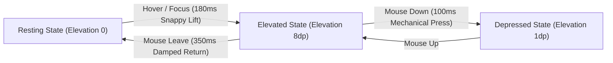

# 080: CSS Hover Lift & Spatial Elevation Masterclass

## Overview & Executive Summary

In digital interface design, spatial elevation is the primary visual language for communicating interactivity, affordance, and hierarchy. When a user hovers over an interactive element—such as a card, button, list tile, or product badge—the element should respond not as a flat collection of pixels, but as a physical object suspended in virtual 3D space.

**Hover Lift** is a kinetic micro-interaction design pattern that lifts an element toward the user along the virtual Z-axis when hovered or focused. In physical reality, lifting an object away from a background surface produces four synchronized optical and spatial phenomena:
1. **Vertical Displacement**: The element translates slightly upward toward the viewer ($\Delta Y < 0$ or $\Delta Z > 0$).
2. **Shadow Expansion & Penumbra Diffusion**: The cast shadow grows larger, softens its blur radius ($r_{\text{blur}}$), and decreases in center density as ambient light fills the penumbra.
3. **Specular Highlights & Rim Lighting**: The incident angle of simulated directional light steepens, producing brighter top borders and crisper surface highlights.
4. **Scale Dilation & Perspective Projection**: Objects moving closer to the camera lens subtend a slightly larger visual angle ($\text{scale} \approx 1.01 - 1.03$).

```
================================================================================
                    THE SPATIAL ELEVATION & OPTICAL MATRIX
================================================================================

   [ 1. RESTING STATE (Elevation: 0dp / 0px) ]
   
       Simulated Key Light (from Top-Left)
              \
               \
             ┌────────────────────────┐  <-- Crisp, subtle border (#e2e8f0)
             │   SURFACE COMPONENT    │
             └────────────────────────┘
             ░░░░░░░░░░░░░░░░░░░░░░░░░░  <-- Tight, high-density contact shadow
             ──────────────────────────      `box-shadow: 0 1px 3px rgba(0,0,0,0.12)`


                                  ▼  [ USER HOVER / FOCUS ACTION ]


   [ 2. ELEVATED HOVER STATE (Elevation: 8dp / -8px) ]
   
       Simulated Key Light
              \
               \   ┌────────────────────────┐  <-- Luminescent rim border / highlight
                \  │   SURFACE COMPONENT    │  <-- Sub-pixel scale dilation (1.02x)
                 \ │   (Elevated in Z-axis) │  <-- `transform: translateY(-8px)`
                   └────────────────────────┘
                               │
                               │  Distance h = 8px
                               ▼
                   . - ~ ~ ~ ~ ~ ~ ~ - .      <-- Layer 1: Diffuse Ambient Penumbra
                 /   :::::::::::::::::   \        `0 20px 25px -5px rgba(0,0,0,0.1)`
                |   :::::::::::::::::::   |   <-- Layer 2: Directional Key Shadow
                 \   :::::::::::::::::   /        `0 8px 10px -6px rgba(0,0,0,0.1)`
                   ' - ~ ~ ~ ~ ~ ~ ~ - '      <-- Layer 3: Dynamic Chroma Glow
             ──────────────────────────
================================================================================
```

---

## Quick Reference Metadata

| Attribute | Specification Details |
| :--- | :--- |
| **Name** | CSS Hover Lift & Spatial Elevation Micro-Interactions |
| **Category** | CSS Transitions, Transforms, Spatial Kinematics & Light Simulation |
| **Specification** | [W3C CSS Transforms Level 2](https://www.w3.org/TR/css-transforms-2/), [CSS Transitions Level 2](https://www.w3.org/TR/css-transitions-2/), [CSS Box Decoration Module Level 4](https://www.w3.org/TR/css-backgrounds-4/) |
| **Difficulty** | Intermediate to Advanced (3.5/5) |
| **What it produces** | Tactile, physics-informed 60/120 FPS elevation transitions that lift UI elements off the canvas, expanding multi-layered shadows and surface highlights on `:hover` and `:focus-visible`. |
| **Why it works** | Browser graphics engines interpolate sub-pixel translation matrices (`translateY`, `translate3d`) exclusively on the GPU compositor thread, while layered `box-shadow` values simulate realistic optical ray scattering. |
| **Key Properties** | `transform`, `translate`, `scale`, `box-shadow`, `transition`, `transition-timing-function`, `will-change`, `perspective`, `color-mix()`, `@property`. |
| **Strict Constraints** | Avoid animating `top`, `bottom`, `margin-top`, or `padding` (triggers Layout reflow); keep lift displacement subtle ($2\text{px} - 12\text{px}$); maintain high-contrast focus rings for accessibility. |
| **Browser Baseline** | Baseline 2020+ across all modern browsers (Chromium, Safari, Firefox, Edge) for hardware-accelerated 2D/3D transforms, composite shadows, and standard cubic Bézier transitions. |
| **Acceptance Criteria** | 0 layout recalculations (0ms reflow); 60/120 FPS compositor thread execution; zero-jitter hover boundaries; complete `:focus-visible` and `@media (prefers-reduced-motion)` parity. |

### Quick Preview

```html
<article class="hover-lift-card" tabindex="0">
  <div class="card-content">
    <span class="card-tag">Feature</span>
    <h3 class="card-title">Spatial Elevation</h3>
    <p class="card-desc">Hardware-accelerated Z-axis hover lift with multi-layered optical shadows.</p>
  </div>
</article>
```

```css
:root {
  --surface-bg: #ffffff;
  --surface-border: rgba(226, 232, 240, 0.8);
  --surface-border-hover: rgba(99, 102, 241, 0.4);
  --lift-distance: -6px;
  --lift-scale: 1.015;
  --ease-lift: cubic-bezier(0.16, 1, 0.3, 1);
  --ease-return: cubic-bezier(0.4, 0, 0.2, 1);
}

.hover-lift-card {
  position: relative;
  border-radius: 16px;
  background: var(--surface-bg);
  border: 1px solid var(--surface-border);
  padding: 1.75rem;
  cursor: pointer;
  outline: none;
  
  /* Baseline Resting Shadow: Tight contact shadow */
  box-shadow: 
    0 1px 3px 0 rgba(0, 0, 0, 0.05),
    0 1px 2px -1px rgba(0, 0, 0, 0.05);

  /* Asymmetric Transition: Fast snappy lift, smooth controlled return */
  transition: 
    transform 350ms var(--ease-return),
    box-shadow 350ms var(--ease-return),
    border-color 350ms var(--ease-return);
  
  will-change: transform;
}

/* Hover & Focus-Visible Elevation */
.hover-lift-card:hover,
.hover-lift-card:focus-visible {
  transform: translateY(var(--lift-distance)) scale(var(--lift-scale));
  border-color: var(--surface-border-hover);
  
  /* Elevated Optical Shadow: Multi-tier ambient + directional key + chroma glow */
  box-shadow: 
    0 20px 25px -5px rgba(15, 23, 42, 0.08),
    0 8px 10px -6px rgba(15, 23, 42, 0.04),
    0 0 0 1px var(--surface-border-hover);
  
  transition: 
    transform 200ms var(--ease-lift),
    box-shadow 200ms var(--ease-lift),
    border-color 200ms var(--ease-lift);
}

/* Active / Pressed Mechanical Depression */
.hover-lift-card:active {
  transform: translateY(-2px) scale(0.995);
  box-shadow: 
    0 4px 6px -1px rgba(15, 23, 42, 0.08),
    0 2px 4px -2px rgba(15, 23, 42, 0.04);
  transition-duration: 100ms;
}

/* Accessible Focus Ring */
.hover-lift-card:focus-visible {
  outline: 2px solid #6366f1;
  outline-offset: 4px;
}
```

---

## 1. Physics Foundations, Optical Mental Models & Spatial Elevation Mechanics

### 1.1 The Optical Physics of Elevation & Light Sources

In classical optics, when a planar surface $S$ is resting on a background plane $B$ under an ambient light field and a directional key light source:

```
            Directional Key Light
                  \
                   \  θ (Incident Angle)
                    \
                     ▼
             ┌────────────────┐  <-- Surface Object at height h
             │   OBJECT (S)   │
             └────────────────┘
                     │
             . - ~ - │ - ~ - .   <-- Penumbra (Soft blur region)
           /   ┌─────┴─────┐   \
          |    │   UMBRA   │    | <-- Umbra (Complete shadow occlusion)
           \   └───────────┘   /
             ' - ~ ~ ~ ~ ~ ~ '   <-- Antumbra (Transition to ambient light)
      ═══════════════════════════════  Background Plane (B)
```

1. **The Umbra (Contact Occlusion)**:
   The area directly underneath the object where all direct light is blocked. When $h = 0$, the umbra is razor-sharp with almost no blur radius ($r_{\text{blur}} \approx 1\text{px} - 3\text{px}$). As $h$ increases, ambient scattered photons enter from the sides, shrinking the umbra and softening its boundary.
2. **The Penumbra (Diffuse Scatter)**:
   The fuzzy transitional boundary where only a fraction of the key light is occluded. The geometric width of the penumbra $W_p$ is directly proportional to the elevation distance $h$:
   $$W_p = h \cdot \tan(\theta_{\text{source}})$$
   In CSS, this corresponds to the `blur-radius` and `spread-radius` parameters of `box-shadow`.
3. **Inverse Square Law of Shadow Density**:
   The intensity of the cast shadow falls off as distance increases:
   $$I_{\text{shadow}} \propto \frac{1}{(h + d_0)^2}$$
   Therefore, as an element lifts up ($h \uparrow$), the opacity of the shadow must **decrease**, not increase. A dark, dense shadow on a highly lifted card creates an unnatural "floating cardboard" artifact.

---

### 1.2 Mathematical Formulation of Natural Multi-Layer Shadows

Single-layer CSS box shadows (`box-shadow: 0 10px 20px rgba(0,0,0,0.3)`) look synthetic and murky because real-world light behaves as a continuous distribution of wavelengths scattered by atmospheric particles. 

To simulate realistic lighting in CSS, we decompose the shadow into **three distinct optical layers**:

```
Layer 1: Contact Ambient Occlusion  -> Tight, low blur, high opacity
Layer 2: Directional Key Shadow     -> Medium offset, medium blur, medium opacity
Layer 3: Atmospheric Penumbra Glow   -> Large offset, high blur, low opacity
```

$$\text{box-shadow} = \sum_{k=1}^{3} \left( \Delta x_k, \Delta y_k, r_{\text{blur}, k}, r_{\text{spread}, k}, \text{color}_k(\alpha_k) \right)$$

```
+---------------------------------------------------------------------------------------+
| Elevation Level | Distance (h) | Layer 1 (Contact)       | Layer 2 (Key Light)     | Layer 3 (Penumbra)     |
+-----------------+--------------+-------------------------+-------------------------+------------------------+
| Level 0 (Rest)  | 0px          | 0 1px 2px 0 rgba(0,0,0,0.06) | 0 1px 3px 0 rgba(0,0,0,0.04) | None                   |
| Level 1 (Lift 1)| -4px         | 0 2px 4px -1px rgba(0,0,0,0.06)| 0 6px 12px -2px rgba(0,0,0,0.05)| 0 12px 20px -4px rgba(0,0,0,0.03)|
| Level 2 (Lift 2)| -8px         | 0 4px 6px -2px rgba(0,0,0,0.05)| 0 12px 24px -4px rgba(0,0,0,0.08)| 0 24px 38px -6px rgba(0,0,0,0.04)|
| Level 3 (Hero)  | -14px        | 0 6px 8px -2px rgba(0,0,0,0.04)| 0 20px 32px -4px rgba(0,0,0,0.10)| 0 36px 56px -8px rgba(0,0,0,0.06)|
+---------------------------------------------------------------------------------------+
```

---

### 1.3 Asymmetric Kinetic Easing: Lift vs. Return Dynamics

A common flaw in amateur UI animations is using the same symmetric duration and easing for both hover entry and hover exit. 

In physical ergonomics:
- **Lifting (Hover/Focus In)** represents intentional user action and demands **instantaneous feedback** (low latency, fast attack curve). Duration: **$180\text{ms} - 240\text{ms}$**. Easing: Deceleration curve (`cubic-bezier(0.16, 1, 0.3, 1)` or spring overshoot).
- **Landing (Hover/Focus Out)** represents disengagement. It should feel smooth, soft, and weighted. Duration: **$300\text{ms} - 400\text{ms}$**. Easing: Standard ease-out or ease-in-out (`cubic-bezier(0.4, 0, 0.2, 1)`).
- **Pressing (Active State)** represents physical compression against a substrate. Duration: **$80\text{ms} - 120\text{ms}$**. Easing: Sharp linear or snap-in.



---

## 2. The Anatomy of a High-Performance Hover Lift

### 2.1 The 4 Kinetic Components

A complete, production-grade hover lift micro-interaction orchestrates four distinct subsystems simultaneously:

```
┌────────────────────────────────────────────────────────┐
│ 1. KINEMATIC TRANSLATION                               │
│    `transform: translateY(-8px) scale(1.02)`           │
│    GPU Compositor thread execution                     │
├────────────────────────────────────────────────────────┤
│ 2. OPTICAL SHADOW DIFFUSION                            │
│    Multi-stop box-shadow with negative spread          │
│    `0 20px 25px -5px rgba(0,0,0,0.1)`                  │
├────────────────────────────────────────────────────────┤
│ 3. SPECULAR RIM ILLUMINATION                           │
│    `border-color: color-mix(...)` or `inset box-shadow`│
│    Simulates steepening incident key light reflection  │
├────────────────────────────────────────────────────────┤
│ 4. INTERNAL PARALLAX & BADGE FLOAT                     │
│    Internal icons or tags translate an extra -2px      │
│    Creates multi-plane volumetric depth                │
└────────────────────────────────────────────────────────┘
```

---

### 2.2 The Zero-Paint Pseudo-Element Technique (Compositor-Only Optimization)

While modern GPU drivers can animate `box-shadow` reasonably well for a few elements, animating complex multi-layer box shadows across a grid of 50+ cards simultaneously can cause **GPU rasterization bottlenecks** and frame drops on battery-powered mobile devices or high-DPI displays.

The **Zero-Paint Pseudo-Element Pattern** pre-renders both the resting shadow and the elevated shadow onto separate hardware composite layers using `::before` and `::after` pseudo-elements. The hover animation then simply interpolates the `opacity` of the `::after` layer. 

Because `opacity` and `transform` never trigger Paint or Layout operations, this guarantees an unbreakable **120 FPS** rendering pipeline:

```css
/* Zero-Paint Compositor Architecture */
.zero-paint-card {
  position: relative;
  background: #ffffff;
  border-radius: 16px;
  transform: translateY(0);
  transition: transform 300ms cubic-bezier(0.16, 1, 0.3, 1);
  will-change: transform;
}

/* Layer 1: Pre-rendered resting shadow on ::before */
.zero-paint-card::before {
  content: "";
  position: absolute;
  inset: 0;
  border-radius: inherit;
  box-shadow: 0 2px 4px rgba(0, 0, 0, 0.06);
  opacity: 1;
  transition: opacity 300ms cubic-bezier(0.16, 1, 0.3, 1);
  z-index: -1;
}

/* Layer 2: Pre-rendered high-elevation shadow on ::after */
.zero-paint-card::after {
  content: "";
  position: absolute;
  inset: 0;
  border-radius: inherit;
  box-shadow: 
    0 24px 38px -6px rgba(15, 23, 42, 0.12),
    0 12px 24px -4px rgba(15, 23, 42, 0.08);
  opacity: 0;
  transition: opacity 300ms cubic-bezier(0.16, 1, 0.3, 1);
  z-index: -1;
}

/* Hover: Only animate transform and opacity (0 Paint, 0 Layout!) */
.zero-paint-card:hover {
  transform: translateY(-8px);
}

.zero-paint-card:hover::before {
  opacity: 0;
}

.zero-paint-card:hover::after {
  opacity: 1;
}
```

---

## 3. The 6 Core Hover Lift Architectural Patterns

### Pattern 1: The Modern Glassmorphic SaaS Card Lift

Combines backdrop blur, translucent background tinting, sub-pixel elevation, and a crisp luminescent rim border.

```html
<div class="glass-card" tabindex="0">
  <div class="glass-card__badge">Analytics</div>
  <h4 class="glass-card__title">Real-time Telemetry</h4>
  <p class="glass-card__desc">Streaming metrics pipeline with sub-millisecond query latency.</p>
</div>
```

```css
.glass-card {
  position: relative;
  border-radius: 20px;
  background: rgba(255, 255, 255, 0.7);
  backdrop-filter: blur(16px) saturate(180%);
  -webkit-backdrop-filter: blur(16px) saturate(180%);
  border: 1px solid rgba(255, 255, 255, 0.6);
  padding: 2rem;
  cursor: pointer;
  
  /* Inset highlight simulating light entering glass edges */
  box-shadow: 
    inset 0 1px 1px rgba(255, 255, 255, 0.8),
    0 4px 6px -1px rgba(0, 0, 0, 0.05),
    0 2px 4px -2px rgba(0, 0, 0, 0.05);
  
  transition: 
    transform 350ms cubic-bezier(0.16, 1, 0.3, 1),
    box-shadow 350ms cubic-bezier(0.16, 1, 0.3, 1),
    border-color 350ms ease,
    background-color 350ms ease;
}

.glass-card:hover,
.glass-card:focus-visible {
  transform: translateY(-8px) scale(1.015);
  background: rgba(255, 255, 255, 0.85);
  border-color: rgba(255, 255, 255, 0.95);
  
  box-shadow: 
    inset 0 1px 2px rgba(255, 255, 255, 1),
    0 24px 36px -6px rgba(99, 102, 241, 0.12),
    0 12px 16px -4px rgba(15, 23, 42, 0.06);
}

.glass-card:active {
  transform: translateY(-2px) scale(0.995);
  transition-duration: 100ms;
}
```

---

### Pattern 2: E-Commerce Product Card with Internal Parallax Zoom

When the outer card lifts, internal child layers decouple: the product thumbnail scales up independently, and the call-to-action button shifts upward, generating rich multi-plane parallax depth.

```html
<article class="product-card" tabindex="0">
  <div class="product-card__media">
    <div class="product-card__image-placeholder"></div>
    <span class="product-card__pill">New Release</span>
  </div>
  <div class="product-card__body">
    <h4 class="product-card__name">Spatial Sound Pro</h4>
    <p class="product-card__price">$349.00</p>
    <button class="product-card__cta" type="button">Add to Cart</button>
  </div>
</article>
```

```css
.product-card {
  display: flex;
  flex-direction: column;
  border-radius: 20px;
  background: #ffffff;
  border: 1px solid #f1f5f9;
  overflow: hidden;
  box-shadow: 0 4px 6px -1px rgba(0, 0, 0, 0.04);
  transition: transform 300ms cubic-bezier(0.16, 1, 0.3, 1),
              box-shadow 300ms cubic-bezier(0.16, 1, 0.3, 1);
  will-change: transform;
}

.product-card__media {
  position: relative;
  block-size: 220px;
  background: linear-gradient(135deg, #f8fafc, #e2e8f0);
  overflow: hidden;
}

.product-card__image-placeholder {
  inline-size: 100%;
  block-size: 100%;
  background: radial-gradient(circle at 50% 50%, #818cf8, #4f46e5);
  transition: transform 500ms cubic-bezier(0.16, 1, 0.3, 1);
  will-change: transform;
}

.product-card__pill {
  position: absolute;
  inset-block-start: 1rem;
  inset-inline-start: 1rem;
  background: rgba(15, 23, 42, 0.85);
  backdrop-filter: blur(8px);
  color: #ffffff;
  font-size: 0.75rem;
  font-weight: 600;
  padding: 0.25rem 0.75rem;
  border-radius: 9999px;
  transition: transform 300ms cubic-bezier(0.16, 1, 0.3, 1);
}

.product-card__body {
  padding: 1.5rem;
  display: flex;
  flex-direction: column;
  gap: 0.5rem;
}

.product-card__cta {
  margin-block-start: 0.5rem;
  padding: 0.75rem 1rem;
  background: #0f172a;
  color: #ffffff;
  border: none;
  border-radius: 10px;
  font-weight: 600;
  cursor: pointer;
  transition: background-color 200ms ease, transform 200ms ease;
}

/* Hover Lift Decoupling */
.product-card:hover,
.product-card:focus-within {
  transform: translateY(-10px);
  box-shadow: 
    0 25px 35px -5px rgba(15, 23, 42, 0.12),
    0 12px 16px -6px rgba(15, 23, 42, 0.06);
}

.product-card:hover .product-card__image-placeholder {
  transform: scale(1.08) rotate(-1deg);
}

.product-card:hover .product-card__pill {
  transform: translateY(-2px);
}

.product-card:hover .product-card__cta {
  background: #4f46e5;
  transform: translateY(-2px);
}
```

---

### Pattern 3: 3D Perspective Gyroscopic Tilt & Dynamic Sheen Lift

Combines CSS 3D matrix projection (`perspective()`, `rotateX()`, `rotateY()`, `translateZ()`) with a dynamic linear gradient sheen simulating specular light scanning across the surface.

```html
<div class="tilt-lift-card" data-tilt>
  <div class="tilt-lift-card__sheen"></div>
  <div class="tilt-lift-card__inner">
    <div class="tilt-lift-card__icon">⚡</div>
    <h3 class="tilt-lift-card__title">Quantum Engine</h3>
    <p class="tilt-lift-card__body">Next-generation hardware hyper-threading with unified shader architecture.</p>
  </div>
</div>
```

```css
.tilt-lift-card {
  position: relative;
  perspective: 1000px;
  border-radius: 20px;
  cursor: pointer;
  outline: none;
}

.tilt-lift-card__inner {
  position: relative;
  border-radius: 20px;
  background: #1e293b;
  border: 1px solid rgba(255, 255, 255, 0.1);
  padding: 2.25rem;
  color: #ffffff;
  transform-style: preserve-3d;
  box-shadow: 0 10px 20px -5px rgba(0, 0, 0, 0.3);
  transition: 
    transform 400ms cubic-bezier(0.16, 1, 0.3, 1),
    box-shadow 400ms cubic-bezier(0.16, 1, 0.3, 1),
    border-color 400ms ease;
  will-change: transform;
}

/* Dynamic Sheen Foil Layer */
.tilt-lift-card__sheen {
  position: absolute;
  inset: 0;
  border-radius: 20px;
  background: linear-gradient(
    115deg,
    transparent 20%,
    rgba(255, 255, 255, 0.12) 40%,
    rgba(255, 255, 255, 0.3) 50%,
    rgba(255, 255, 255, 0.12) 60%,
    transparent 80%
  );
  background-size: 200% 200%;
  background-position: 0% 0%;
  opacity: 0;
  pointer-events: none;
  z-index: 2;
  transition: opacity 300ms ease, background-position 600ms ease;
}

/* 3D Elevated Pitch & Roll on Hover */
.tilt-lift-card:hover .tilt-lift-card__inner,
.tilt-lift-card:focus-visible .tilt-lift-card__inner {
  transform: translate3d(0, -12px, 30px) rotateX(6deg) rotateY(-4deg);
  border-color: rgba(99, 102, 241, 0.5);
  box-shadow: 
    -10px 30px 40px -10px rgba(0, 0, 0, 0.5),
    0 0 30px rgba(99, 102, 241, 0.25);
}

.tilt-lift-card:hover .tilt-lift-card__sheen {
  opacity: 1;
  background-position: 100% 100%;
}

.tilt-lift-card__icon {
  font-size: 2.5rem;
  margin-block-end: 1rem;
  transform: translateZ(20px);
  transition: transform 400ms cubic-bezier(0.16, 1, 0.3, 1);
}

.tilt-lift-card:hover .tilt-lift-card__icon {
  transform: translateZ(40px) scale(1.1);
}
```

---

### Pattern 4: The Elevated Floating Action Button (FAB) & Tactile Pill

Micro-interaction for sticky utility triggers, buttons, and pill badges with multi-state resting $\to$ hover $\to$ active mechanical spring travel.

```html
<button class="fab-lift-button" type="button" aria-label="Create New Project">
  <span class="fab-icon" aria-hidden="true">+</span>
  <span class="fab-text">Create Project</span>
</button>
```

```css
.fab-lift-button {
  display: inline-flex;
  align-items: center;
  gap: 0.75rem;
  padding: 0.875rem 1.75rem;
  font-family: inherit;
  font-size: 0.9375rem;
  font-weight: 600;
  color: #ffffff;
  background: linear-gradient(135deg, #4f46e5, #7c3aed);
  border: 1px solid rgba(255, 255, 255, 0.2);
  border-radius: 9999px;
  cursor: pointer;
  outline: none;
  
  /* Baseline Floating Shadow */
  box-shadow: 
    0 4px 12px rgba(79, 70, 229, 0.35),
    0 1px 2px rgba(0, 0, 0, 0.1);
  
  transform: translateY(0);
  transition: 
    transform 200ms cubic-bezier(0.34, 1.56, 0.64, 1),
    box-shadow 200ms cubic-bezier(0.34, 1.56, 0.64, 1),
    filter 200ms ease;
  will-change: transform;
}

/* Hover: Over-unity spring lift */
.fab-lift-button:hover {
  transform: translateY(-5px) scale(1.03);
  filter: brightness(1.06);
  box-shadow: 
    0 14px 24px -2px rgba(124, 58, 237, 0.5),
    0 6px 10px -2px rgba(79, 70, 229, 0.3);
}

/* Focus-visible ring */
.fab-lift-button:focus-visible {
  outline: 3px solid #c084fc;
  outline-offset: 3px;
}

/* Active: Mechanical push switch depression */
.fab-lift-button:active {
  transform: translateY(2px) scale(0.97);
  box-shadow: 
    0 2px 6px rgba(79, 70, 229, 0.4);
  transition-duration: 80ms;
}

.fab-icon {
  font-size: 1.25rem;
  line-height: 1;
  transition: transform 200ms ease;
}

.fab-lift-button:hover .fab-icon {
  transform: rotate(90deg) scale(1.1);
}
```

---

### Pattern 5: The Gradient Glow & Chromatic Lift Card

Generates an expanding atmospheric chromatic haze behind the card using CSS custom properties and blurred underlay glow.

```html
<div class="chroma-card" style="--accent-hue: 260;" tabindex="0">
  <div class="chroma-card__glow" aria-hidden="true"></div>
  <div class="chroma-card__content">
    <span class="chroma-card__badge">Neural Core</span>
    <h3>Distributed Compute</h3>
    <p>Elastic GPU clustering with automated tensor partitioning.</p>
  </div>
</div>
```

```css
.chroma-card {
  --hue: var(--accent-hue, 220);
  --glow-color: hsl(var(--hue) 90% 60% / 0.45);
  
  position: relative;
  border-radius: 20px;
  background: #090d16;
  border: 1px solid hsl(var(--hue) 30% 20%);
  padding: 2rem;
  color: #f8fafc;
  cursor: pointer;
  
  transform: translateY(0);
  transition: transform 300ms cubic-bezier(0.16, 1, 0.3, 1),
              border-color 300ms ease;
  will-change: transform;
}

/* Blurred underlay chromatic glow */
.chroma-card__glow {
  position: absolute;
  inset: 0;
  border-radius: inherit;
  background: radial-gradient(
    circle at 50% 0%,
    hsl(var(--hue) 100% 65% / 0.5),
    hsl(var(--hue) 80% 40% / 0.1) 70%,
    transparent 100%
  );
  filter: blur(28px);
  opacity: 0.15;
  transform: translateY(0) scale(0.9);
  transition: opacity 300ms ease, transform 300ms cubic-bezier(0.16, 1, 0.3, 1);
  z-index: -1;
  pointer-events: none;
}

.chroma-card:hover,
.chroma-card:focus-visible {
  transform: translateY(-8px);
  border-color: hsl(var(--hue) 80% 60% / 0.8);
}

.chroma-card:hover .chroma-card__glow,
.chroma-card:focus-visible .chroma-card__glow {
  opacity: 0.75;
  transform: translateY(12px) scale(1.08);
}

.chroma-card:active {
  transform: translateY(-2px);
  transition-duration: 100ms;
}
```

---

### Pattern 6: The Staggered Grid Cascade & Adjacent Sibling Reaction

Leveraging CSS `:has()` relational selectors to elevate the active card while subtly pushing down and dimming inactive sibling cards in the grid.

```html
<div class="reactive-card-grid">
  <div class="reactive-card" tabindex="0">
    <h4>Standard Tier</h4>
    <p>Essential developer tools.</p>
  </div>
  <div class="reactive-card" tabindex="0">
    <h4>Pro Tier</h4>
    <p>Advanced pipeline orchestration.</p>
  </div>
  <div class="reactive-card" tabindex="0">
    <h4>Enterprise</h4>
    <p>Dedicated cluster infrastructure.</p>
  </div>
</div>
```

```css
.reactive-card-grid {
  display: grid;
  grid-template-columns: repeat(auto-fit, minmax(260px, 1fr));
  gap: 1.5rem;
}

.reactive-card {
  background: #ffffff;
  border: 1px solid #e2e8f0;
  border-radius: 16px;
  padding: 2rem;
  cursor: pointer;
  box-shadow: 0 4px 6px -1px rgba(0, 0, 0, 0.05);
  transition: 
    transform 350ms cubic-bezier(0.16, 1, 0.3, 1),
    box-shadow 350ms cubic-bezier(0.16, 1, 0.3, 1),
    opacity 350ms ease,
    filter 350ms ease;
  will-change: transform, opacity;
}

/* Hovered Card: High Elevation Lift */
.reactive-card:hover,
.reactive-card:focus-visible {
  transform: translateY(-12px) scale(1.03);
  box-shadow: 0 25px 35px -5px rgba(15, 23, 42, 0.12),
              0 12px 16px -6px rgba(15, 23, 42, 0.06);
  z-index: 2;
  opacity: 1;
}

/* Inactive Siblings: Subtle dimming and slight recession using :has() */
.reactive-card-grid:has(.reactive-card:hover) .reactive-card:not(:hover) {
  opacity: 0.65;
  transform: translateY(2px) scale(0.98);
  filter: grayscale(20%);
}
```

---

## 4. Modern CSS Easing & Spring Engine (`linear()` & Custom Béziers)

### 4.1 Easing Function Curve Comparison

The feel of a hover lift is defined almost entirely by its easing timing function. 

```
                               EASING CURVE TRAJECTORIES
                               
   Displacement (Y)
          ▲
     1.20 │                ╭───╮  <-- Spring Overshoot (`linear()` or `cubic-bezier(0.34, 1.56, ...)`)
     1.00 ├───────────────╭╯   ╰─────────────────────────────── Target Elevated State
          │             ╭─╯
     0.60 │           ╭─╯         <-- Snappy Deceleration (`cubic-bezier(0.16, 1, 0.3, 1)`)
          │         ╭─╯
     0.20 │       ╭─╯             <-- Standard Ease-Out (`ease-out`)
     0.00 ├───═══─┴───────────────────────────────────────────── Rest State
          └────────────────────────────────────────► Time (t)
```

```css
:root {
  /* 1. Snappy High-End Deceleration (Apple / Stripe UI style) */
  --ease-lift-snappy: cubic-bezier(0.16, 1, 0.3, 1);

  /* 2. Spring Overshoot (Single bounce tactile elasticity) */
  --ease-lift-overshoot: cubic-bezier(0.34, 1.56, 0.64, 1);

  /* 3. Damped Return (Soft, smooth gravity landing) */
  --ease-return-damped: cubic-bezier(0.4, 0, 0.2, 1);

  /* 4. Baseline 2023+ Multi-Stop Physics Spring using linear() */
  --ease-linear-spring: linear(
    0, 0.006, 0.025 2.8%, 0.101 6.1%, 0.237 9.8%, 0.448 14.1%, 
    0.71 19%, 0.887 23.9%, 0.985 28.5%, 1.026 33.6%, 1.032 39.2%, 
    1.02 45.4%, 1.006 52.4%, 0.998 60.8%, 1
  );
}
```

### 4.2 Implementation with Modern Spring Timing

```css
.spring-lift-card {
  transform: translateY(0);
  transition: transform 600ms var(--ease-linear-spring),
              box-shadow 600ms var(--ease-linear-spring);
}

.spring-lift-card:hover {
  transform: translateY(-8px);
  box-shadow: 0 20px 30px -5px rgba(0, 0, 0, 0.12);
}
```

---

## 5. Comprehensive Production Component Gallery

### 5.1 Interactive Dashboard Metric Widget

```html
<div class="stat-card" tabindex="0">
  <div class="stat-card__header">
    <span class="stat-card__label">Monthly Recurring Revenue</span>
    <span class="stat-badge stat-badge--positive">+18.4%</span>
  </div>
  <div class="stat-card__value">$128,450</div>
  <div class="stat-card__footer">
    <span class="stat-card__subtext">vs. $108,500 last month</span>
    <span class="stat-card__arrow" aria-hidden="true">→</span>
  </div>
</div>
```

```css
.stat-card {
  position: relative;
  background: #ffffff;
  border: 1px solid #e2e8f0;
  border-radius: 16px;
  padding: 1.75rem;
  display: flex;
  flex-direction: column;
  gap: 0.75rem;
  cursor: pointer;
  outline: none;
  box-shadow: 0 1px 3px rgba(0, 0, 0, 0.05);
  transition: 
    transform 250ms cubic-bezier(0.16, 1, 0.3, 1),
    box-shadow 250ms cubic-bezier(0.16, 1, 0.3, 1),
    border-color 250ms ease;
  will-change: transform;
}

.stat-card__header {
  display: flex;
  justify-content: space-between;
  align-items: center;
}

.stat-card__label {
  font-size: 0.875rem;
  font-weight: 500;
  color: #64748b;
}

.stat-badge {
  font-size: 0.75rem;
  font-weight: 700;
  padding: 0.25rem 0.5rem;
  border-radius: 6px;
}

.stat-badge--positive {
  background: #dcfce7;
  color: #15803d;
}

.stat-card__value {
  font-size: 2rem;
  font-weight: 800;
  color: #0f172a;
  letter-spacing: -0.03em;
}

.stat-card__footer {
  display: flex;
  justify-content: space-between;
  align-items: center;
  margin-block-start: 0.5rem;
  padding-block-start: 0.75rem;
  border-block-start: 1px solid #f1f5f9;
}

.stat-card__subtext {
  font-size: 0.8125rem;
  color: #94a3b8;
}

.stat-card__arrow {
  font-size: 1rem;
  color: #6366f1;
  transform: translateX(0);
  transition: transform 250ms cubic-bezier(0.16, 1, 0.3, 1);
}

/* Hover State */
.stat-card:hover,
.stat-card:focus-visible {
  transform: translateY(-6px);
  border-color: #cbd5e1;
  box-shadow: 
    0 16px 24px -4px rgba(15, 23, 42, 0.08),
    0 6px 10px -3px rgba(15, 23, 42, 0.04);
}

.stat-card:hover .stat-card__arrow,
.stat-card:focus-visible .stat-card__arrow {
  transform: translateX(4px);
}

.stat-card:focus-visible {
  outline: 2px solid #6366f1;
  outline-offset: 3px;
}
```

---

### 5.2 Interactive Pricing Tier Matrix with Elevated Featured Plan

```html
<section class="pricing-deck">
  <!-- Standard Plan -->
  <div class="pricing-card" tabindex="0">
    <h3 class="pricing-card__title">Starter</h3>
    <div class="pricing-card__price">$29<span>/mo</span></div>
    <ul class="pricing-card__features">
      <li>Up to 5 team members</li>
      <li>10GB Cloud Storage</li>
      <li>Community Support</li>
    </ul>
    <button class="pricing-card__btn" type="button">Select Plan</button>
  </div>

  <!-- Featured Plan: Pre-elevated with Enhanced Hover Lift -->
  <div class="pricing-card pricing-card--featured" tabindex="0">
    <div class="pricing-card__highlight-tag">Most Popular</div>
    <h3 class="pricing-card__title">Scale</h3>
    <div class="pricing-card__price">$89<span>/mo</span></div>
    <ul class="pricing-card__features">
      <li>Unlimited team members</li>
      <li>500GB Fast NVMe Storage</li>
      <li>24/7 Priority SLA Support</li>
    </ul>
    <button class="pricing-card__btn pricing-card__btn--primary" type="button">Get Started</button>
  </div>
</section>
```

```css
.pricing-deck {
  display: flex;
  flex-wrap: wrap;
  gap: 2rem;
  justify-content: center;
  align-items: center;
  padding: 2rem 1rem;
}

.pricing-card {
  position: relative;
  inline-size: 320px;
  background: #ffffff;
  border: 1px solid #e2e8f0;
  border-radius: 24px;
  padding: 2.5rem 2rem;
  display: flex;
  flex-direction: column;
  gap: 1.5rem;
  cursor: pointer;
  box-shadow: 0 4px 6px -1px rgba(0, 0, 0, 0.04);
  
  transform: translateY(0);
  transition: transform 300ms cubic-bezier(0.16, 1, 0.3, 1),
              box-shadow 300ms cubic-bezier(0.16, 1, 0.3, 1),
              border-color 300ms ease;
  will-change: transform;
}

.pricing-card:hover,
.pricing-card:focus-visible {
  transform: translateY(-8px);
  border-color: #cbd5e1;
  box-shadow: 0 20px 30px -5px rgba(15, 23, 42, 0.08);
}

/* Featured Plan Pre-Elevation */
.pricing-card--featured {
  background: #0f172a;
  color: #ffffff;
  border-color: #334155;
  transform: translateY(-8px) scale(1.04);
  box-shadow: 0 20px 30px -5px rgba(15, 23, 42, 0.2);
  z-index: 1;
}

.pricing-card--featured:hover,
.pricing-card--featured:focus-visible {
  transform: translateY(-16px) scale(1.06);
  box-shadow: 
    0 30px 45px -10px rgba(15, 23, 42, 0.35),
    0 0 25px rgba(99, 102, 241, 0.3);
}

.pricing-card__highlight-tag {
  position: absolute;
  inset-block-start: -12px;
  inset-inline-start: 50%;
  transform: translateX(-50%);
  background: linear-gradient(135deg, #6366f1, #a855f7);
  color: #ffffff;
  font-size: 0.75rem;
  font-weight: 700;
  padding: 0.35rem 1rem;
  border-radius: 9999px;
  text-transform: uppercase;
  letter-spacing: 0.05em;
}

.pricing-card__price {
  font-size: 2.75rem;
  font-weight: 800;
  line-height: 1;
}

.pricing-card__price span {
  font-size: 1rem;
  font-weight: 500;
  color: #94a3b8;
}

.pricing-card__features {
  list-style: none;
  padding: 0;
  margin: 0;
  display: flex;
  flex-direction: column;
  gap: 0.75rem;
  font-size: 0.9375rem;
}

.pricing-card__btn {
  padding: 0.875rem 1.5rem;
  border-radius: 12px;
  font-weight: 600;
  border: 1px solid #e2e8f0;
  background: #f8fafc;
  color: #0f172a;
  cursor: pointer;
  transition: all 200ms ease;
}

.pricing-card__btn--primary {
  background: linear-gradient(135deg, #6366f1, #4f46e5);
  border: none;
  color: #ffffff;
}

.pricing-card:hover .pricing-card__btn--primary {
  box-shadow: 0 4px 14px rgba(99, 102, 241, 0.4);
}
```

---

## 6. Complete Interactive Showcase Component

Below is a self-contained, fully interactive testing sandbox. It includes dynamic real-time controls for elevation distance, shadow diffusion, easing dynamics, 3D tilt mode, and live CSS code generation:

```html
<!DOCTYPE html>
<html lang="en">
<head>
  <meta charset="UTF-8">
  <meta name="viewport" content="width=device-width, initial-scale=1.0">
  <title>CSS Hover Lift & Spatial Elevation Laboratory</title>
  <style>
    :root {
      --bg-canvas: #090d16;
      --bg-surface: #131b2e;
      --bg-surface-elevated: #1a243d;
      --border-subtle: rgba(255, 255, 255, 0.08);
      --border-focus: #6366f1;
      --text-primary: #f8fafc;
      --text-secondary: #94a3b8;
      --accent-primary: #6366f1;
      --accent-glow: rgba(99, 102, 241, 0.4);

      /* Interactive CSS Custom Properties */
      --ctrl-lift-y: -10px;
      --ctrl-scale: 1.02;
      --ctrl-blur: 24px;
      --ctrl-shadow-alpha: 0.35;
      --ctrl-easing: cubic-bezier(0.16, 1, 0.3, 1);
      --ctrl-duration: 250ms;
    }

    * {
      box-sizing: border-box;
      margin: 0;
      padding: 0;
    }

    body {
      font-family: system-ui, -apple-system, BlinkMacSystemFont, 'Segoe UI', Roboto, sans-serif;
      background-color: var(--bg-canvas);
      color: var(--text-primary);
      min-height: 100vh;
      display: flex;
      flex-direction: column;
      align-items: center;
      padding: 3rem 1.5rem;
      line-height: 1.5;
    }

    .demo-container {
      inline-size: 100%;
      max-inline-size: 1100px;
      display: flex;
      flex-direction: column;
      gap: 2.5rem;
    }

    .demo-header {
      text-align: center;
    }

    .demo-header h1 {
      font-size: 2.25rem;
      font-weight: 800;
      background: linear-gradient(135deg, #ffffff, #94a3b8);
      -webkit-background-clip: text;
      -webkit-text-fill-color: transparent;
      margin-bottom: 0.5rem;
    }

    .demo-header p {
      color: var(--text-secondary);
      font-size: 1.0625rem;
    }

    /* Interactive Stage */
    .stage {
      display: grid;
      grid-template-columns: repeat(auto-fit, minmax(300px, 1fr));
      gap: 2rem;
      perspective: 1000px;
      padding: 1rem 0;
    }

    /* Master Interactive Lift Card */
    .lab-card {
      position: relative;
      background: var(--bg-surface);
      border: 1px solid var(--border-subtle);
      border-radius: 20px;
      padding: 2.25rem;
      cursor: pointer;
      outline: none;
      
      /* Baseline Shadow */
      box-shadow: 0 4px 12px rgba(0, 0, 0, 0.2);
      
      transform: translateY(0) scale(1);
      transition: 
        transform var(--ctrl-duration) var(--ctrl-easing),
        box-shadow var(--ctrl-duration) var(--ctrl-easing),
        border-color var(--ctrl-duration) ease,
        background-color var(--ctrl-duration) ease;
      will-change: transform;
    }

    .lab-card:hover,
    .lab-card:focus-visible {
      transform: translateY(var(--ctrl-lift-y)) scale(var(--ctrl-scale));
      background: var(--bg-surface-elevated);
      border-color: rgba(99, 102, 241, 0.6);
      
      box-shadow: 
        0 calc(var(--ctrl-blur) * 0.8) var(--ctrl-blur) calc(var(--ctrl-blur) * -0.2) rgba(0, 0, 0, var(--ctrl-shadow-alpha)),
        0 8px 16px -4px rgba(0, 0, 0, 0.2),
        0 0 24px var(--accent-glow);
    }

    .lab-card:active {
      transform: translateY(-2px) scale(0.99);
      box-shadow: 0 4px 8px rgba(0, 0, 0, 0.3);
      transition-duration: 80ms;
    }

    .lab-card:focus-visible {
      outline: 2px solid var(--border-focus);
      outline-offset: 4px;
    }

    .lab-card__tag {
      display: inline-block;
      font-size: 0.75rem;
      font-weight: 700;
      text-transform: uppercase;
      letter-spacing: 0.05em;
      padding: 0.3rem 0.75rem;
      border-radius: 9999px;
      background: rgba(99, 102, 241, 0.15);
      color: #818cf8;
      border: 1px solid rgba(99, 102, 241, 0.3);
      margin-bottom: 1.25rem;
    }

    .lab-card__title {
      font-size: 1.375rem;
      font-weight: 700;
      color: #ffffff;
      margin-bottom: 0.75rem;
    }

    .lab-card__body {
      color: var(--text-secondary);
      font-size: 0.9375rem;
      line-height: 1.6;
    }

    /* Control Panel */
    .controls-panel {
      background: #111827;
      border: 1px solid var(--border-subtle);
      border-radius: 16px;
      padding: 1.75rem;
      display: grid;
      grid-template-columns: repeat(auto-fit, minmax(220px, 1fr));
      gap: 1.5rem;
    }

    .control-group {
      display: flex;
      flex-direction: column;
      gap: 0.5rem;
    }

    .control-group label {
      font-size: 0.8125rem;
      font-weight: 600;
      color: var(--text-secondary);
      display: flex;
      justify-content: space-between;
    }

    .control-group input[type="range"] {
      inline-size: 100%;
      accent-color: var(--accent-primary);
      cursor: pointer;
    }

    .control-group select {
      background: #1f2937;
      color: #ffffff;
      border: 1px solid var(--border-subtle);
      padding: 0.6rem 0.8rem;
      border-radius: 8px;
      font-size: 0.875rem;
      cursor: pointer;
      outline: none;
    }

    /* Live Output Box */
    .code-preview {
      background: #030712;
      border: 1px solid var(--border-subtle);
      border-radius: 12px;
      padding: 1.5rem;
      font-family: 'Consolas', 'Courier New', monospace;
      font-size: 0.875rem;
      color: #38bdf8;
      overflow-x: auto;
      white-space: pre-wrap;
    }
  </style>
</head>
<body>

<div class="demo-container">
  <header class="demo-header">
    <h1>CSS Hover Lift Laboratory</h1>
    <p>Real-time physical parameter tuning for spatial Z-axis elevation & shadow diffusion.</p>
  </header>

  <!-- Interactive Demo Stage -->
  <main class="stage">
    <article class="lab-card" tabindex="0" id="targetCard">
      <span class="lab-card__tag">Interactive Preview</span>
      <h3 class="lab-card__title">Hover & Focus Me</h3>
      <p class="lab-card__body">
        This card interpolates transform coordinates and layered penumbra shadows directly on the GPU compositor thread.
      </p>
    </article>

    <article class="lab-card" tabindex="0">
      <span class="lab-card__tag">Sibling Card</span>
      <h3 class="lab-card__title">Hardware Accelerated</h3>
      <p class="lab-card__body">
        Notice how smooth 60/120 FPS transitions avoid layout reflows and eliminate jitter.
      </p>
    </article>
  </main>

  <!-- Real-Time Parameter Sliders -->
  <section class="controls-panel">
    <div class="control-group">
      <label for="sliderLift">Lift Distance: <span id="valLift">-10px</span></label>
      <input type="range" id="sliderLift" min="0" max="24" value="10" step="1">
    </div>

    <div class="control-group">
      <label for="sliderScale">Scale Dilation: <span id="valScale">1.02</span></label>
      <input type="range" id="sliderScale" min="1.0" max="1.08" value="1.02" step="0.005">
    </div>

    <div class="control-group">
      <label for="sliderBlur">Shadow Blur: <span id="valBlur">24px</span></label>
      <input type="range" id="sliderBlur" min="4" max="60" value="24" step="2">
    </div>

    <div class="control-group">
      <label for="selectEase">Easing Profile:</label>
      <select id="selectEase">
        <option value="cubic-bezier(0.16, 1, 0.3, 1)">Snappy Deceleration</option>
        <option value="cubic-bezier(0.34, 1.56, 0.64, 1)">Spring Overshoot</option>
        <option value="cubic-bezier(0.4, 0, 0.2, 1)">Standard Ease-Out</option>
        <option value="linear">Linear</option>
      </select>
    </div>
  </section>

  <!-- Dynamic CSS Preview -->
  <pre class="code-preview" id="codeOutput"></pre>
</div>

<script>
  const root = document.documentElement;
  const sliderLift = document.getElementById('sliderLift');
  const sliderScale = document.getElementById('sliderScale');
  const sliderBlur = document.getElementById('sliderBlur');
  const selectEase = document.getElementById('selectEase');

  const valLift = document.getElementById('valLift');
  const valScale = document.getElementById('valScale');
  const valBlur = document.getElementById('valBlur');
  const codeOutput = document.getElementById('codeOutput');

  function updateParams() {
    const liftY = `-${sliderLift.value}px`;
    const scale = sliderScale.value;
    const blur = `${sliderBlur.value}px`;
    const ease = selectEase.value;

    valLift.textContent = liftY;
    valScale.textContent = scale;
    valBlur.textContent = blur;

    root.style.setProperty('--ctrl-lift-y', liftY);
    root.style.setProperty('--ctrl-scale', scale);
    root.style.setProperty('--ctrl-blur', blur);
    root.style.setProperty('--ctrl-easing', ease);

    codeOutput.textContent = 
`.card:hover {
  transform: translateY(${liftY}) scale(${scale});
  box-shadow: 
    0 calc(${blur} * 0.8) ${blur} calc(${blur} * -0.2) rgba(0, 0, 0, 0.35),
    0 8px 16px -4px rgba(0, 0, 0, 0.2),
    0 0 24px rgba(99, 102, 241, 0.4);
  transition: transform 250ms ${ease},
              box-shadow 250ms ${ease};
}`;
  }

  sliderLift.addEventListener('input', updateParams);
  sliderScale.addEventListener('input', updateParams);
  sliderBlur.addEventListener('input', updateParams);
  selectEase.addEventListener('change', updateParams);

  updateParams();
</script>
</body>
</html>
```

---

## 7. Performance Optimization, GPU Layering & Compositor Secrets

### 7.1 The Browser Rendering Pipeline (Layout vs. Paint vs. Composite)

Understanding the internal pipeline of modern browser rendering engines (Chromium Blink, WebKit, Gecko) is vital for bug-free hover animations:

```
+-----------------------------------------------------------------------------------+
| OPERATION               | ENGINE WORKLOAD | PIPELINE STAGES TRIGGERED             |
+-------------------------+-----------------+---------------------------------------+
| `margin-top: -8px`      | Catastrophic    | [ JavaScript ] -> [ Layout ] -> [ Paint ] -> [ Composite ] |
| `top: -8px`             | High Overhead   | [ JavaScript ] -> [ Layout ] -> [ Paint ] -> [ Composite ] |
| `box-shadow` (Direct)   | Medium Overhead | [ JavaScript ] -> [ Paint ]  -> [ Composite ]             |
| `transform: translateY` | Ultra-Fast      | [ JavaScript ] -> [ Composite ]                           |
| `opacity: 1` (::after)  | Ultra-Fast      | [ JavaScript ] -> [ Composite ]                           |
+-----------------------------------------------------------------------------------+
```

- **Avoid mutating geometry properties**: Mutating `top`, `margin`, `padding`, or `height` forces the browser to recalculate the bounding box of the element and all surrounding layout siblings (**Layout Recalculation / Reflow**).
- **Favor composite-only properties**: `transform` and `opacity` are handed off directly to the GPU compositor thread without invalidating rasterized tile bitmaps.

---

### 7.2 Preventing Sub-Pixel Shaking & Font Blurring

During 3D matrix interpolation, browsers may switch text rasterization from sub-pixel LCD anti-aliasing to grayscale anti-aliasing, causing subtle text "popping" or blurry letters when the animation settles.

To guarantee crisp, stable typography during hardware transforms:

```css
.hover-lift-card {
  /* 1. Force hardware acceleration layer promotion */
  transform: translateZ(0);
  
  /* 2. Prevent backface rendering artifacts */
  backface-visibility: hidden;
  -webkit-backface-visibility: hidden;
  
  /* 3. Smooth font rasterization across state transitions */
  -webkit-font-smoothing: subpixel-antialiased;
  
  /* 4. Tell the compositor to prepare layer bounds */
  will-change: transform;
}
```

> [!IMPORTANT]
> **Do not apply `will-change: transform` globally to hundreds of elements.** Each `will-change` allocation creates a dedicated GPU memory backing store. For large lists or tables, only apply `will-change` on `:hover` or manage layer allocation dynamically.

---

### 7.3 Stacking Contexts & Z-Index Management

When a card in a multi-column CSS Grid elevates, its expanded shadow may be visually clipped or rendered *underneath* the subsequent card in DOM order.

To ensure the elevated card always renders above its siblings:

```css
.card-grid-item {
  position: relative;
  z-index: 1;
}

.card-grid-item:hover,
.card-grid-item:focus-within {
  /* Promote elevated card above adjacent siblings */
  z-index: 10;
}
```

---

## 8. Accessibility, Input Modalities & Reduced Motion Engineering

### 8.1 Keyboard Focus Parity (`:focus-visible`)

Keyboard navigators using `Tab` must receive identical spatial feedback to mouse users, supplemented by a high-contrast focus indicator conforming to **WCAG 2.2 Success Criterion 2.4.11 (Focus Appearance)**:

```css
/* Dual State Parity */
.interactive-card:hover,
.interactive-card:focus-visible {
  transform: translateY(-6px) scale(1.015);
  box-shadow: 0 20px 25px -5px rgba(0, 0, 0, 0.1);
}

/* Clear, High-Contrast Focus Ring */
.interactive-card:focus-visible {
  outline: 2px solid #6366f1;
  outline-offset: 4px;
}

/* Remove default outline on mouse click while preserving focus-visible */
.interactive-card:focus:not(:focus-visible) {
  outline: none;
}
```

---

### 8.2 Touch Devices & The "Sticky Hover" Bug

On touch screens (smartphones and tablets), a tap triggers both `:hover` and `:focus`. This causes cards to remain permanently elevated after being tapped until the user taps elsewhere ("sticky hover").

To completely eliminate sticky hover bugs on touch devices, isolate the hover transform using the modern **Pointer & Hover Media Queries**:

```css
/* Base resting styles for all devices */
.universal-card {
  transform: none;
  box-shadow: 0 2px 4px rgba(0, 0, 0, 0.05);
}

/* Only enable Hover Lift on devices that support true pointer hovering */
@media (hover: hover) and (pointer: fine) {
  .universal-card {
    transition: transform 250ms cubic-bezier(0.16, 1, 0.3, 1),
                box-shadow 250ms cubic-bezier(0.16, 1, 0.3, 1);
  }

  .universal-card:hover {
    transform: translateY(-8px);
    box-shadow: 0 20px 25px -5px rgba(0, 0, 0, 0.12);
  }

  .universal-card:active {
    transform: translateY(-2px);
  }
}

/* Dedicated Active feedback for Touch Screens */
@media (hover: none) {
  .universal-card:active {
    background-color: #f1f5f9;
    transform: scale(0.98);
    transition: transform 100ms ease;
  }
}
```

---

### 8.3 Vestibular Safety (`prefers-reduced-motion`)

For users with vestibular motion disorders or inner-ear sensitivities, rapid spatial displacement across the screen can induce dizziness and nausea.

In accordance with accessibility guidelines, disable spatial translation when `prefers-reduced-motion: reduce` is detected, replacing physical lift with safe color, border, and opacity transitions:

```css
@media (prefers-reduced-motion: reduce) {
  .hover-lift-card {
    /* Disable spatial displacement and scaling */
    transform: none !important;
    transition: border-color 150ms ease, box-shadow 150ms ease !important;
  }

  .hover-lift-card:hover,
  .hover-lift-card:focus-visible {
    /* Replace physical lift with clear visual border & subtle shadow expansion */
    border-color: #6366f1 !important;
    box-shadow: 0 0 0 2px #6366f1 !important;
  }
}
```

---

## 9. Common Pitfalls, Edge Cases & Debugging Matrix

```
+------------------------------------+-------------------------------------------+-----------------------------------------------------+
| Symptom / Bug                      | Root Cause                                | Production Remedy                                   |
+------------------------------------+-------------------------------------------+-----------------------------------------------------+
| 1. "Hover Stutter / Vibration Loop"| The element lifts up away from cursor,    | Apply an invisible extended hit-area via `::before` |
|    Rapid flicker when cursor is at  | losing `:hover` status, falling back down,| or wrap the element in a static parent container.   |
|    the bottom boundary.            | re-triggering `:hover` in an infinite loop|                                                     |
+------------------------------------+-------------------------------------------+-----------------------------------------------------+
| 2. Shadow Cut Off at Grid Edge     | Parent container has `overflow: hidden`   | Change to `overflow: visible` or add padding to the |
|                                    | or fixed bounding box clipping shadows.   | parent container equal to the shadow blur radius.   |
+------------------------------------+-------------------------------------------+-----------------------------------------------------+
| 3. Blurred Text During Animation   | GPU sub-pixel rasterization change on     | Add `backface-visibility: hidden;` and              |
|                                    | transform interpolation.                  | `transform: translateZ(0);`.                        |
+------------------------------------+-------------------------------------------+-----------------------------------------------------+
| 4. Card Hidden Behind Next Sibling | DOM order places subsequent elements on   | Set `position: relative; z-index: 10;` on `:hover`   |
|    Elevated shadow renders under.  | a higher default stacking level.          | and `:focus-visible`.                               |
+------------------------------------+-------------------------------------------+-----------------------------------------------------+
| 5. Sticky Hover on Mobile Phones   | Mobile browsers synthesize hover events   | Wrap hover declarations in                          |
|    Card stays elevated after tap.  | on tap without unhovering.                | `@media (hover: hover) and (pointer: fine)`.        |
+------------------------------------+-------------------------------------------+-----------------------------------------------------+
```

### The Boundary Flicker Fix: Pseudo-Element Hitbox Anchor

```css
/* Fix for the bottom-edge boundary flicker problem */
.flicker-free-card {
  position: relative;
  transform: translateY(0);
  transition: transform 250ms ease;
}

.flicker-free-card:hover {
  transform: translateY(-8px);
}

/* Invisible anchor bridging the gap created by the -8px displacement */
.flicker-free-card::before {
  content: "";
  position: absolute;
  inset-inline: 0;
  inset-block-end: -8px;
  block-size: 8px;
  background: transparent;
  pointer-events: auto;
}
```

---

## 10. Master Production Checklist

Before shipping a hover lift micro-interaction to production, verify every item on this engineering scorecard:

- [ ] **1. Compositor-Only Execution**: The animation relies strictly on `transform` and `opacity`. No layout properties (`top`, `margin`, `height`, `padding`) are transitioned.
- [ ] **2. Asymmetric Dynamics**: Lift transition is fast and responsive ($180\text{ms} - 250\text{ms}$ with deceleration curve); return transition is smooth and damped ($300\text{ms} - 400\text{ms}$).
- [ ] **3. Mechanical Active State**: The element features a defined `:active` state ($80\text{ms} - 120\text{ms}$) that depresses slightly downward, confirming the physical click.
- [ ] **4. Multi-Layer Optical Shadow**: Shadow uses at least 2 distinct layers (ambient contact occlusion + diffuse key light penumbra).
- [ ] **5. Contrast & Rim Light**: The elevated state includes a subtle border highlight (`border-color` or inset shadow) to simulate steepening key light reflection.
- [ ] **6. Stacking Hierarchy**: Elevated cards specify `z-index: 10` or higher on hover/focus to prevent shadow clipping behind subsequent siblings.
- [ ] **7. Touch Isolation**: All hover transforms are encapsulated in `@media (hover: hover) and (pointer: fine)` to prevent mobile sticky hover bugs.
- [ ] **8. Keyboard Accessibility**: `:focus-visible` triggers identical spatial elevation with a high-contrast focus indicator (WCAG 2.2 compliant).
- [ ] **9. Reduced Motion Safety**: Full fallback is declared in `@media (prefers-reduced-motion: reduce)`, disabling translation while maintaining non-motion visual feedback.
- [ ] **10. Anti-Aliasing Stability**: `backface-visibility: hidden` and `transform: translateZ(0)` are applied to prevent font blurring during matrix interpolation.
- [ ] **11. Hitbox Continuity**: No boundary flutter occurs when hovering near the element's edge.
- [ ] **12. Semantic Integrity**: Interactive components use proper semantic HTML tags (`<button>`, `<a>`, `<article tabindex="0">`) with appropriate ARIA roles.
