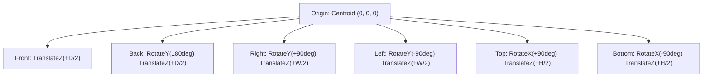

# 081: CSS 3D Rectangular Prism & Volumetric Cuboid Masterclass

## Overview & Executive Summary

In digital interface engineering and visual computing, constructing true volumetric three-dimensional forms without heavy external engines (such as Three.js or WebGL) represents the pinnacle of native browser rendering. A **Rectangular Prism** (geometrically classified as a *right rectangular cuboid*) is a three-dimensional polyhedron bounded by six mutually perpendicular planar quadrilateral faces: **Front**, **Back**, **Top**, **Bottom**, **Left**, and **Right**.

While a cube represents an equilateral sub-case where width ($W$), height ($H$), and depth ($D$) are identical ($W = H = D$), a **Rectangular Prism** accommodates arbitrary non-uniform spatial dimensions ($W \neq H \neq D$). This dimensional heterogeneity introduces unique geometric constraints:
1. **Opposing Face Congruence**: Front/Back ($W \times H$), Left/Right ($D \times H$), and Top/Bottom ($W \times D$) form three pairs of distinct rectangular geometries.
2. **Variable Normal Translation Offsets**: Each face must translate along its local normal vector by half the length of its orthogonal axis ($W/2$, $H/2$, or $D/2$).
3. **Compound Shading & Light Attenuation**: Non-uniform face areas receive incident key light and ambient occlusion at varying surface ratios, demanding differential photometric shading.

```
================================================================================
                    THE 3D RECTANGULAR PRISM GEOMETRIC MATRIX
================================================================================

                               +Y (Up / Pitch Axis)
                                │
                                │    Top Face (W × D)
                                │     ┌────────────────────────┐
                                │    ╱                        ╱│
                                │   ╱                        ╱ │
                                │  ┌────────────────────────┐  │  Right Face (D × H)
                                │  │                        │  │ ┌───┐
                                │  │                        │  │ │   │
 -X (Left / Yaw) ───────────────┼──│   FRONT FACE (W × H)   │──┼─│───│─────────────── +X (Right / Yaw)
                                │  │                        │  │ │   │
                                │  │                        │  │ └───┘
                                │  │                        │  ╱
                                │  └────────────────────────┘ ╱
                                │   Bottom Face (W × D)      ╱
                                │                           ╱
                                └─── -Z (Depth Axis) ─────── +Z (Towards Viewer)
                                       
    Face Dimensions:
    - Front / Back : Width (W) × Height (H)  --> Translated along Z by ±(D / 2)
    - Left / Right : Depth (D) × Height (H)  --> Rotated ±90° Y, Translated Z by +(W / 2)
    - Top / Bottom : Width (W) × Depth (D)   --> Rotated ±90° X, Translated Z by +(H / 2)

================================================================================
```

---

## Quick Reference Metadata

| Attribute | Specification Details |
| :--- | :--- |
| **Name** | CSS 3D Rectangular Prism (Volumetric Cuboid) |
| **Category** | CSS 3D Transforms, Spatial Compositing & Polyhedral Modeling |
| **Specification** | [W3C CSS Transforms Module Level 2](https://www.w3.org/TR/css-transforms-2/), [CSS Box Model Module Level 3](https://www.w3.org/TR/css-box-3/) |
| **Difficulty** | Advanced (4.5 / 5.0) |
| **What it produces** | Fully interactive, hardware-accelerated 6-faced volumetric 3D cuboids with custom dimensions ($W \times H \times D$), dynamic shading, realistic floor contact shadows, and 120 FPS rotation. |
| **Why it works** | The browser's compositing engine instantiates a shared 3D projective coordinate space via `transform-style: preserve-3d`, executing 4×4 affine matrix transformations on GPU vertex pipelines. |
| **Key Properties** | `transform`, `transform-style`, `perspective`, `perspective-origin`, `backface-visibility`, `transform-origin`, `rotateX`, `rotateY`, `rotateZ`, `translate3d`. |
| **Strict Constraints** | Requires `transform-style: preserve-3d` on all intermediate parent nodes; avoid `overflow: hidden`, `clip-path`, or `filter` on containers (triggers immediate 3D flattening); prevent sub-pixel seams with micro-scaling. |
| **Browser Baseline** | Baseline 2020+ across Chromium, Safari, Firefox, and Edge for full 3D transform matrices, CSS custom properties in transforms, and GPU composite acceleration. |
| **Performance Profile** | **Compositor Thread Only**: Zero layout reflow, zero repaint during rotational animation; 60/120 FPS execution when geometry is established via custom properties. |

### Quick Preview

```html
<div class="scene-viewport">
  <div class="prism-cuboid" role="img" aria-label="3D Interactive Rectangular Prism">
    <div class="prism-face face-front">Front (W×H)</div>
    <div class="prism-face face-back">Back (W×H)</div>
    <div class="prism-face face-right">Right (D×H)</div>
    <div class="prism-face face-left">Left (D×H)</div>
    <div class="prism-face face-top">Top (W×D)</div>
    <div class="prism-face face-bottom">Bottom (W×D)</div>
  </div>
</div>
```

```css
:root {
  --prism-w: 240px;  /* Width (X-axis)  */
  --prism-h: 150px;  /* Height (Y-axis) */
  --prism-d: 100px;  /* Depth (Z-axis)  */

  /* Pre-calculated half-dimension offsets */
  --half-w: calc(var(--prism-w) / 2);
  --half-h: calc(var(--prism-h) / 2);
  --half-d: calc(var(--prism-d) / 2);

  /* Photometric Shading Palette (OKLCH) */
  --color-top:    oklch(0.85 0.12 240);  /* Direct Key Light: Highlighted */
  --color-front:  oklch(0.70 0.14 240);  /* Primary Visual Face: Neutral  */
  --color-right:  oklch(0.58 0.15 240);  /* Oblique Face: Midtone Shadow  */
  --color-left:   oklch(0.50 0.15 240);  /* Opposing Face: Moderate Shadow*/
  --color-back:   oklch(0.40 0.12 240);  /* Obscured Face: Deep Shadow    */
  --color-bottom: oklch(0.30 0.10 240);  /* Occluded Face: Ambient Shadow */
}

/* 1. Spatial Perspective Viewport */
.scene-viewport {
  inline-size: 100%;
  block-size: 380px;
  display: grid;
  place-items: center;
  perspective: 1000px;
  perspective-origin: 50% 50%;
  background: radial-gradient(circle at center, #1e293b, #0f172a);
  overflow: hidden;
}

/* 2. 3D Pivot Assembly */
.prism-cuboid {
  position: relative;
  inline-size: var(--prism-w);
  block-size: var(--prism-h);
  transform-style: preserve-3d;
  transform: rotateX(-22deg) rotateY(38deg);
  transition: transform 600ms cubic-bezier(0.16, 1, 0.3, 1);
  cursor: grab;
}

.scene-viewport:hover .prism-cuboid {
  transform: rotateX(-15deg) rotateY(218deg);
}

/* 3. Base Face Stacking */
.prism-face {
  position: absolute;
  inset-inline-start: 50%;
  inset-block-start: 50%;
  display: flex;
  align-items: center;
  justify-content: center;
  font-family: system-ui, -apple-system, sans-serif;
  font-size: 0.85rem;
  font-weight: 700;
  color: #ffffff;
  text-shadow: 0 1px 2px rgba(0, 0, 0, 0.6);
  border: 1px solid rgba(255, 255, 255, 0.2);
  backface-visibility: visible;
  user-select: none;
  box-sizing: border-box;
}

/* 4. Orthogonal Face Transformations */

/* Front Face: Size W × H */
.face-front {
  inline-size: var(--prism-w);
  block-size: var(--prism-h);
  background: var(--color-front);
  transform: translate3d(-50%, -50%, var(--half-d));
}

/* Back Face: Size W × H */
.face-back {
  inline-size: var(--prism-w);
  block-size: var(--prism-h);
  background: var(--color-back);
  transform: translate3d(-50%, -50%, calc(var(--half-d) * -1)) rotateY(180deg);
}

/* Right Face: Size D × H */
.face-right {
  inline-size: var(--prism-d);
  block-size: var(--prism-h);
  background: var(--color-right);
  transform: translate3d(-50%, -50%, 0) rotateY(90deg) translateZ(var(--half-w));
}

/* Left Face: Size D × H */
.face-left {
  inline-size: var(--prism-d);
  block-size: var(--prism-h);
  background: var(--color-left);
  transform: translate3d(-50%, -50%, 0) rotateY(-90deg) translateZ(var(--half-w));
}

/* Top Face: Size W × D */
.face-top {
  inline-size: var(--prism-w);
  block-size: var(--prism-d);
  background: var(--color-top);
  transform: translate3d(-50%, -50%, 0) rotateX(90deg) translateZ(var(--half-h));
}

/* Bottom Face: Size W × D */
.face-bottom {
  inline-size: var(--prism-w);
  block-size: var(--prism-d);
  background: var(--color-bottom);
  transform: translate3d(-50%, -50%, 0) rotateX(-90deg) translateZ(var(--half-h));
}
```

---

## 1. Geometric Foundations, 3D Vector Math & Spatial Coordinate Systems

### 1.1 The Anatomy of a 3D Cuboid ($W, H, D$)

A rectangular prism is characterized by three spatial dimensions defined along mutually orthogonal axes:

$$\vec{u}_x = \begin{pmatrix} W \\ 0 \\ 0 \end{pmatrix}, \quad \vec{u}_y = \begin{pmatrix} 0 \\ H \\ 0 \end{pmatrix}, \quad \vec{u}_z = \begin{pmatrix} 0 \\ 0 \\ D \end{pmatrix}$$

```
                       Top Vertices:
                       v5: (-W/2, -H/2, -D/2)   v6: (+W/2, -H/2, -D/2)
                       v7: (-W/2, -H/2, +D/2)   v8: (+W/2, -H/2, +D/2)
                       
                              v5 ┌────────────────────────┐ v6
                                ╱│                       ╱│
                               ╱ │                      ╱ │
                           v7 ┌────────────────────────┐v8│
                              │  │                     │  │
                              │  │                     │  │
                              │  │ v1                  │  │ v2
                              │  └─────────────────────│──┘
                              │ ╱                      │ ╱
                              └────────────────────────┘
                             v3                         v4
                             
                       Bottom Vertices:
                       v1: (-W/2, +H/2, -D/2)   v2: (+W/2, +H/2, -D/2)
                       v3: (-W/2, +H/2, +D/2)   v4: (+W/2, +H/2, +D/2)
```

The geometric properties of the prism are derived as:
- **Total Surface Area**: $A = 2(WH + WD + HD)$
- **Enclosed Volume**: $V = W \times H \times D$
- **Space Diagonal**: $d_{\text{space}} = \sqrt{W^2 + H^2 + D^2}$

---

### 1.2 The CSS 3D Coordinate Space

Unlike traditional Cartesian mathematics where $+Y$ points upwards, the **W3C CSS Screen Coordinate System** is oriented as follows:
- **$+X$ (Right)**: Horizontal axis from left to right.
- **$+Y$ (Down)**: Vertical axis directed downwards toward the bottom of the screen.
- **$+Z$ (Outward)**: Depth axis pointing out of the screen toward the observer's eyes.

```
       -Y (Up)
          │
          │
          │
-X ───────┼─────── +X (Right)
 (Left)   │
          │
          │
       +Y (Down)
       
       (⊙ +Z points out toward viewer)
       (⊗ -Z points into the display)
```

Rotations obey the **Right-Hand Rule with respect to inverted $Y$**:
- `rotateX(θ)`: Tilts the top of the element toward (positive $\theta$) or away from the viewer.
- `rotateY(θ)`: Turns the right side away from (positive $\theta$) or toward the viewer.
- `rotateZ(θ)`: Rotates the element clockwise in the 2D display plane.

---

### 1.3 Transformation Matrix Derivations for the 6 Faces

To construct an enclosed polyhedron from six flat DOM planes, each face begins anchored at the centroid $(0, 0, 0)$ via `left: 50%; top: 50%; translate: -50% -50%` and is subjected to an affine transformation matrix $\mathbf{M} \in \mathbb{R}^{4 \times 4}$.



#### Detailed Mathematical Matrix Breakdown

$$\mathbf{M}_{\text{face}} = \mathbf{T}_{\text{centroid}} \cdot \mathbf{R}_{\text{axis}}(\theta) \cdot \mathbf{T}_{\text{normal}}(d)$$

1. **Front Face ($W \times H$)**:
   $$\mathbf{M}_{\text{front}} = \begin{pmatrix} 1 & 0 & 0 & 0 \\ 0 & 1 & 0 & 0 \\ 0 & 0 & 1 & +D/2 \\ 0 & 0 & 0 & 1 \end{pmatrix}$$
   *CSS Syntax*: `transform: translate3d(-50%, -50%, calc(var(--depth) / 2));`

2. **Back Face ($W \times H$)**:
   $$\mathbf{M}_{\text{back}} = \begin{pmatrix} -1 & 0 & 0 & 0 \\ 0 & 1 & 0 & 0 \\ 0 & 0 & -1 & -D/2 \\ 0 & 0 & 0 & 1 \end{pmatrix}$$
   *CSS Syntax*: `transform: translate3d(-50%, -50%, calc(var(--depth) / -2)) rotateY(180deg);`

3. **Right Face ($D \times H$)**:
   $$\mathbf{M}_{\text{right}} = \mathbf{R}_y(90^\circ) \cdot \mathbf{T}_z(W/2) = \begin{pmatrix} 0 & 0 & 1 & +W/2 \\ 0 & 1 & 0 & 0 \\ -1 & 0 & 0 & 0 \\ 0 & 0 & 0 & 1 \end{pmatrix}$$
   *CSS Syntax*: `transform: translate3d(-50%, -50%, 0) rotateY(90deg) translateZ(calc(var(--width) / 2));`

4. **Left Face ($D \times H$)**:
   $$\mathbf{M}_{\text{left}} = \mathbf{R}_y(-90^\circ) \cdot \mathbf{T}_z(W/2) = \begin{pmatrix} 0 & 0 & -1 & -W/2 \\ 0 & 1 & 0 & 0 \\ 1 & 0 & 0 & 0 \\ 0 & 0 & 0 & 1 \end{pmatrix}$$
   *CSS Syntax*: `transform: translate3d(-50%, -50%, 0) rotateY(-90deg) translateZ(calc(var(--width) / 2));`

5. **Top Face ($W \times D$)**:
   $$\mathbf{M}_{\text{top}} = \mathbf{R}_x(90^\circ) \cdot \mathbf{T}_z(H/2) = \begin{pmatrix} 1 & 0 & 0 & 0 \\ 0 & 0 & -1 & -H/2 \\ 0 & 1 & 0 & 0 \\ 0 & 0 & 0 & 1 \end{pmatrix}$$
   *CSS Syntax*: `transform: translate3d(-50%, -50%, 0) rotateX(90deg) translateZ(calc(var(--height) / 2));`

6. **Bottom Face ($W \times D$)**:
   $$\mathbf{M}_{\text{bottom}} = \mathbf{R}_x(-90^\circ) \cdot \mathbf{T}_z(H/2) = \begin{pmatrix} 1 & 0 & 0 & 0 \\ 0 & 0 & 1 & +H/2 \\ 0 & -1 & 0 & 0 \\ 0 & 0 & 0 & 1 \end{pmatrix}$$
   *CSS Syntax*: `transform: translate3d(-50%, -50%, 0) rotateX(-90deg) translateZ(calc(var(--height) / 2));`

> [!IMPORTANT]
> **Order of Operations in Transform Lists**:
> In CSS, transform functions execute **from right to left** (local coordinate frames) or **from left to right** (global coordinate frames). In our formulation `rotateY(90deg) translateZ(W/2)`, the element first rotates its local normal vector toward $+X$, then moves along that transformed normal by half the width ($W/2$).

---

## 2. The Core CSS 3D Engine Architecture

### 2.1 The Perspective Pipeline

To map a three-dimensional mathematical model onto a two-dimensional computer display, the browser applies a **Perspective Projection Matrix**:

$$P = \begin{pmatrix} 1 & 0 & 0 & 0 \\ 0 & 1 & 0 & 0 \\ 0 & 0 & 1 & 0 \\ 0 & 0 & -1/d & 1 \end{pmatrix}$$

Where $d$ is the `perspective` distance in pixels.

```
       Observer / Eye
             ●  (Z = d)
            / \
           /   \
          /     \
   ──────┌───────┐────── Display Plane (Z = 0)
        /│       │\
       / │ Prism │ \
      /  │ Cuboid│  \
     /   └───────┘   \
    ─────────────────── Far Clipping Plane
```

- **Focal Length Equivalents**:
  - `perspective: 500px`: Wide-angle lens ($~110^\circ$ FOV). Dramatic spatial distortion; close edges appear significantly larger than rear edges.
  - `perspective: 1000px`: Standard normal lens ($~50^\circ$ FOV). Natural human ocular depth perception.
  - `perspective: 2500px` or `perspective: none`: Isometric telephoto tele-lens ($< 20^\circ$ FOV). Parallel orthogonal lines remain nearly parallel.

---

### 2.2 Preserving 3D Space: `transform-style: preserve-3d`

By default, every DOM element flattens its children into a 2D texture cache (`transform-style: flat`). When building polyhedra:

```
[ Viewport: perspective: 1000px ]
       │
       ▼
[ Assembly Node: transform-style: preserve-3d ]  <-- REQUIRED!
       ├─► Face 1: (3D Coplanar Layer)
       ├─► Face 2: (3D Coplanar Layer)
       └─► Face 3: (3D Coplanar Layer)
```

> [!WARNING]
> **The 3D Flattening Trap**:
> Applying any of the following CSS properties to the container or intermediate parents will destroy `preserve-3d` and immediately flatten the prism into a single flat layer:
> - `overflow: hidden`, `overflow: scroll`, `overflow: auto`
> - `clip-path`
> - `filter` (e.g. `blur()`, `drop-shadow()`)
> - `backdrop-filter`
> - `opacity` (in certain legacy WebKit versions when `< 1.0`)
> - `contain: paint` or `contain: strict`

---

### 2.3 Eliminating Anti-Aliasing Seams (The 1px Edge Glitch)

When rendering adjacent 3D faces, GPU rasterizers calculate sub-pixel fragment edges that occasionally allow background pixels to leak through, producing a flickering 1px seam along the edges of the prism.

```
Flickering Sub-pixel Seam:
┌─────────────────┐ ░░░ ┌─────────────────┐
│   Front Face    │ ░░░ │   Right Face    │  <-- 1px background bleed
└─────────────────┘ ░░░ └─────────────────┘
```

#### Production Solutions:

1. **Micro-Dilation (The $0.5\text{px}$ Expansion)**:
   ```css
   .face-front, .face-back {
     inline-size: calc(var(--prism-w) + 1px);
     block-size: calc(var(--prism-h) + 1px);
   }
   ```
2. **Transparent Outline Bleed**:
   ```css
   .prism-face {
     outline: 1px solid transparent; /* Forces GPU hardware edge anti-aliasing */
     -webkit-backface-visibility: hidden;
     backface-visibility: hidden;
   }
   ```
3. **Sub-pixel Scale Bias**:
   ```css
   .prism-cuboid {
     transform: rotateX(...) rotateY(...) scale3d(1.002, 1.002, 1.002);
   }
   ```

---

## 3. Realistic Light, Shading & Material Optical Systems

### 3.1 Simulated Directional Key Light & Lambertian Diffuse Shading

In real-world computer graphics, diffuse luminance is calculated via **Lambert's Cosine Law**:

$$I_d = I_{\text{light}} \cdot k_d \cdot (\vec{N} \cdot \vec{L})$$

Where $\vec{N}$ is the face unit normal vector and $\vec{L}$ is the directional key light vector.

```
       Simulated Key Light (from Top-Left, L = [-0.5, -0.8, 0.3])
             \
              \
               ▼
         ┌────────────────────────┐  <-- Top Face: N = [0, -1, 0]  (High Dot Product: Brightest)
        ╱                        ╱│
       ╱                        ╱ │
      ┌────────────────────────┐  │  <-- Right Face: N = [1, 0, 0]  (Negative Dot: Shadow)
      │                        │  │
      │   Front Face           │  ╱
      │   N = [0, 0, 1]        │ ╱   <-- Front Face: Medium Dot Product (Midtone)
      └────────────────────────┘
```

### 3.2 Dynamic OKLCH Photometric Shading Tokens

By leveraging modern CSS `oklch()` color spaces, we modulate the perceptual lightness ($L$) while maintaining exact chromatic fidelity:

```css
:root {
  --hue-brand: 250;
  --chroma-brand: 0.16;

  /* Ambient Light Base: L = 0.40 */
  --light-ambient: 0.40;

  /* Modulated Face Lightness */
  --light-top:    calc(var(--light-ambient) + 0.45); /* L = 0.85 (Key Highlight) */
  --light-front:  calc(var(--light-ambient) + 0.25); /* L = 0.65 (Direct Fill)    */
  --light-right:  calc(var(--light-ambient) + 0.12); /* L = 0.52 (Midtone Grazing)*/
  --light-left:   calc(var(--light-ambient) + 0.05); /* L = 0.45 (Shadowed Side)  */
  --light-back:   calc(var(--light-ambient) - 0.10); /* L = 0.30 (Obscured)       */
  --light-bottom: calc(var(--light-ambient) - 0.20); /* L = 0.20 (Floor Occluded) */

  --color-face-top:    oklch(var(--light-top)    var(--chroma-brand) var(--hue-brand));
  --color-face-front:  oklch(var(--light-front)  var(--chroma-brand) var(--hue-brand));
  --color-face-right:  oklch(var(--light-right)  var(--chroma-brand) var(--hue-brand));
  --color-face-left:   oklch(var(--light-left)   var(--chroma-brand) var(--hue-brand));
  --color-face-back:   oklch(var(--light-back)   var(--chroma-brand) var(--hue-brand));
  --color-face-bottom: oklch(var(--light-bottom) var(--chroma-brand) var(--hue-brand));
}
```

---

### 3.3 Dynamic Floor Shadows & Contact Occlusion in 3D Space

A floating 3D object requires a grounded contact shadow to anchor its spatial presence. In CSS 3D, we position a shadow plane directly on the virtual floor ($Y = H/2 + \text{elevation}$) rotated into horizontal alignment:

```html
<div class="prism-assembly">
  <div class="prism-cuboid">
    <!-- 6 Faces -->
  </div>
  <div class="prism-shadow-plane"></div>
</div>
```

```css
.prism-shadow-plane {
  position: absolute;
  inline-size: calc(var(--prism-w) * 1.2);
  block-size: calc(var(--prism-d) * 1.2);
  inset-inline-start: 50%;
  inset-block-start: 50%;
  transform: translate3d(-50%, -50%, 0) rotateX(90deg) translateZ(calc(var(--half-h) + 60px));
  background: radial-gradient(
    ellipse at center,
    rgba(15, 23, 42, 0.75) 0%,
    rgba(15, 23, 42, 0.35) 40%,
    transparent 75%
  );
  filter: blur(12px);
  pointer-events: none;
}
```

---

## 4. The 6 Core Rectangular Prism Architectural Patterns

### Pattern 1: The Interactive 3D Product Packaging Box (SaaS / Tech Hardware)

An interactive software retail box or luxury hardware package featuring custom dimensions, holographic finish, barcode details, and mouse hover rotation.

```
┌────────────────────────────────────────────────────────┐
│ [Pattern 1: High-Tech Retail Software Box]            │
│ Dimensions: W = 200px, H = 280px, D = 60px             │
│ Top: Security Seal | Left Spine: Title & Logo          │
└────────────────────────────────────────────────────────┘
```

```html
<div class="software-box-scene">
  <div class="software-box" tabindex="0">
    <div class="box-face box-front">
      <div class="software-badge">ULTRA V2</div>
      <h2>Antigravity OS</h2>
      <p>Next-Gen Neural Runtime</p>
      <div class="box-footer">Enterprise Edition</div>
    </div>
    <div class="box-face box-back">
      <h3>System Specifications</h3>
      <ul>
        <li>GPU Compositor Level 3</li>
        <li>Sub-pixel 120 FPS Engine</li>
        <li>Universal Node Architecture</li>
      </ul>
      <div class="barcode">||| | |||| || | |||</div>
    </div>
    <div class="box-face box-left">
      <span class="spine-text">ANTIGRAVITY OS — ENTERPRISE EDITION</span>
    </div>
    <div class="box-face box-right">
      <span class="spine-text">BUILD 2026.08 // SECURE CORE</span>
    </div>
    <div class="box-face box-top">
      <div class="seal-sticker">AUTHENTIC SECURITY SEAL</div>
    </div>
    <div class="box-face box-bottom">
      <span>UPC 8-90412-0021-9</span>
    </div>
  </div>
</div>
```

```css
:root {
  --box-w: 200px;
  --box-h: 280px;
  --box-d: 60px;
  --box-half-w: calc(var(--box-w) / 2);
  --box-half-h: calc(var(--box-h) / 2);
  --box-half-d: calc(var(--box-d) / 2);
}

.software-box-scene {
  perspective: 1200px;
  inline-size: 100%;
  block-size: 420px;
  display: grid;
  place-items: center;
  background: radial-gradient(circle at center, #1e1b4b, #0f172a);
}

.software-box {
  position: relative;
  inline-size: var(--box-w);
  block-size: var(--box-h);
  transform-style: preserve-3d;
  transform: rotateX(-14deg) rotateY(-28deg);
  transition: transform 500ms cubic-bezier(0.16, 1, 0.3, 1);
  cursor: pointer;
}

.software-box:hover,
.software-box:focus-visible {
  transform: rotateX(-8deg) rotateY(155deg) scale3d(1.05, 1.05, 1.05);
}

.box-face {
  position: absolute;
  inset-inline-start: 50%;
  inset-block-start: 50%;
  box-sizing: border-box;
  padding: 1.25rem;
  border-radius: 2px;
  backface-visibility: visible;
  color: #ffffff;
  font-family: system-ui, sans-serif;
  overflow: hidden;
}

.box-front {
  inline-size: var(--box-w);
  block-size: var(--box-h);
  background: linear-gradient(135deg, #4f46e5, #312e81);
  transform: translate3d(-50%, -50%, var(--box-half-d));
  border: 1px solid rgba(255, 255, 255, 0.3);
  box-shadow: inset 0 0 40px rgba(0, 0, 0, 0.4);
}

.box-back {
  inline-size: var(--box-w);
  block-size: var(--box-h);
  background: #1e1b4b;
  transform: translate3d(-50%, -50%, calc(var(--box-half-d) * -1)) rotateY(180deg);
  border: 1px solid rgba(255, 255, 255, 0.15);
  font-size: 0.75rem;
}

.box-left {
  inline-size: var(--box-d);
  block-size: var(--box-h);
  background: #3730a3;
  transform: translate3d(-50%, -50%, 0) rotateY(-90deg) translateZ(var(--box-half-w));
  border: 1px solid rgba(255, 255, 255, 0.2);
  display: flex;
  align-items: center;
  justify-content: center;
}

.box-right {
  inline-size: var(--box-d);
  block-size: var(--box-h);
  background: #232060;
  transform: translate3d(-50%, -50%, 0) rotateY(90deg) translateZ(var(--box-half-w));
  border: 1px solid rgba(255, 255, 255, 0.15);
  display: flex;
  align-items: center;
  justify-content: center;
}

.box-top {
  inline-size: var(--box-w);
  block-size: var(--box-d);
  background: #6366f1;
  transform: translate3d(-50%, -50%, 0) rotateX(90deg) translateZ(var(--box-half-h));
  border: 1px solid rgba(255, 255, 255, 0.4);
  display: flex;
  align-items: center;
  justify-content: center;
}

.box-bottom {
  inline-size: var(--box-w);
  block-size: var(--box-d);
  background: #0f172a;
  transform: translate3d(-50%, -50%, 0) rotateX(-90deg) translateZ(var(--box-half-h));
}

.spine-text {
  writing-mode: vertical-rl;
  text-orientation: mixed;
  transform: rotate(180deg);
  letter-spacing: 0.15em;
  font-weight: 800;
  font-size: 0.75rem;
}
```

---

### Pattern 2: Volumetric 3D Isometric Progress Gauge / Bar

A 3D extruded rectangular cuboid that functions as a continuous volumetric liquid gauge or data metric bar.

```
Isometric View:
         ┌───────────────────────────────────────────────────┐
        ╱                                                   ╱│
       ╱                     TOP                           ╱ │
      ┌───────────────────────────────────────────────────┐  │ RIGHT
      │██████████████████████████░░░░░░░░░░░░░░░░░░░░░░░░│  │
      │████████  PROGRESS 58%   ░░░░░░░░░░░░░░░░░░░░░░░░│  ╱
      └───────────────────────────────────────────────────┘ ╱
```

```html
<div class="isometric-bar-scene">
  <div class="volumetric-bar" style="--fill-pct: 72%;">
    <!-- Track Frame -->
    <div class="vbar-face vbar-front"><div class="vbar-liquid"></div></div>
    <div class="vbar-face vbar-top"><div class="vbar-liquid"></div></div>
    <div class="vbar-face vbar-bottom"></div>
    <div class="vbar-face vbar-left"><div class="vbar-liquid liquid-cap"></div></div>
    <div class="vbar-face vbar-right"></div>
    <div class="vbar-face vbar-back"></div>
  </div>
</div>
```

```css
:root {
  --vbar-w: 320px;
  --vbar-h: 40px;
  --vbar-d: 40px;
}

.isometric-bar-scene {
  perspective: 900px;
  display: grid;
  place-items: center;
  block-size: 200px;
  background: #090d16;
}

.volumetric-bar {
  position: relative;
  inline-size: var(--vbar-w);
  block-size: var(--vbar-h);
  transform-style: preserve-3d;
  transform: rotateX(-30deg) rotateY(45deg);
}

.vbar-face {
  position: absolute;
  inset-inline-start: 50%;
  inset-block-start: 50%;
  background: rgba(255, 255, 255, 0.05);
  border: 1px solid rgba(255, 255, 255, 0.15);
  box-sizing: border-box;
  overflow: hidden;
}

.vbar-front {
  inline-size: var(--vbar-w);
  block-size: var(--vbar-h);
  transform: translate3d(-50%, -50%, calc(var(--vbar-d) / 2));
}

.vbar-top {
  inline-size: var(--vbar-w);
  block-size: var(--vbar-d);
  transform: translate3d(-50%, -50%, 0) rotateX(90deg) translateZ(calc(var(--vbar-h) / 2));
}

.vbar-left {
  inline-size: var(--vbar-d);
  block-size: var(--vbar-h);
  transform: translate3d(-50%, -50%, 0) rotateY(-90deg) translateZ(calc(var(--vbar-w) / 2));
}

.vbar-right {
  inline-size: var(--vbar-d);
  block-size: var(--vbar-h);
  transform: translate3d(-50%, -50%, 0) rotateY(90deg) translateZ(calc(var(--vbar-w) / 2));
}

.vbar-liquid {
  inline-size: var(--fill-pct);
  block-size: 100%;
  background: linear-gradient(90deg, #06b6d4, #3b82f6);
  box-shadow: 0 0 20px #06b6d4;
  transition: inline-size 1s cubic-bezier(0.16, 1, 0.3, 1);
}

.liquid-cap {
  inline-size: 100%;
  background: #06b6d4;
}
```

---

### Pattern 3: 4-Sided Revolving Information Kiosk (Continuous Carousel)

A rectangular column prism ($W = 220\text{px}, H = 300\text{px}, D = 220\text{px}$) rotating smoothly to display four distinct content slides.

```
Top View Orbit:
                 [ Side 4: Analytics ]
                          ▲
                          │
  [ Side 3: Security ] ───┼─── [ Side 1: Features ] (Facing Viewer)
                          │
                          ▼
                 [ Side 2: Pricing ]
```

```html
<div class="kiosk-scene">
  <div class="kiosk-prism" style="--kiosk-angle: 0deg;">
    <article class="kiosk-face k-front">
      <h3>01. Intelligence</h3>
      <p>Deep neural reasoning pipelines running at the edge.</p>
    </article>
    <article class="kiosk-face k-right">
      <h3>02. Velocity</h3>
      <p>Sub-millisecond compositor rendering across all threads.</p>
    </article>
    <article class="kiosk-face k-back">
      <h3>03. Security</h3>
      <p>Cryptographic sandbox execution with hardware attestation.</p>
    </article>
    <article class="kiosk-face k-left">
      <h3>04. Scale</h3>
      <p>Horizontal cluster scaling with zero configuration.</p>
    </article>
    <div class="kiosk-cap k-top"></div>
    <div class="kiosk-cap k-bottom"></div>
  </div>
</div>
```

```css
:root {
  --k-size: 240px;
  --k-height: 320px;
  --k-half: calc(var(--k-size) / 2);
}

.kiosk-scene {
  perspective: 1100px;
  block-size: 440px;
  display: grid;
  place-items: center;
  background: #020617;
}

.kiosk-prism {
  position: relative;
  inline-size: var(--k-size);
  block-size: var(--k-height);
  transform-style: preserve-3d;
  transform: rotateX(-10deg) rotateY(var(--kiosk-angle));
  transition: transform 800ms cubic-bezier(0.16, 1, 0.3, 1);
  animation: kioskSpin 16s infinite linear;
}

.kiosk-prism:hover {
  animation-play-state: paused;
}

@keyframes kioskSpin {
  0%   { transform: rotateX(-10deg) rotateY(0deg); }
  100% { transform: rotateX(-10deg) rotateY(-360deg); }
}

.kiosk-face {
  position: absolute;
  inline-size: var(--k-size);
  block-size: var(--k-height);
  inset-inline-start: 50%;
  inset-block-start: 50%;
  padding: 2rem;
  box-sizing: border-box;
  background: rgba(15, 23, 42, 0.85);
  border: 1px solid rgba(99, 102, 241, 0.3);
  backdrop-filter: blur(16px);
  color: #f8fafc;
  border-radius: 8px;
}

.k-front  { transform: translate3d(-50%, -50%, var(--k-half)); }
.k-right  { transform: translate3d(-50%, -50%, 0) rotateY(90deg) translateZ(var(--k-half)); }
.k-back   { transform: translate3d(-50%, -50%, calc(var(--k-half) * -1)) rotateY(180deg); }
.k-left   { transform: translate3d(-50%, -50%, 0) rotateY(-90deg) translateZ(var(--k-half)); }

.kiosk-cap {
  position: absolute;
  inline-size: var(--k-size);
  block-size: var(--k-size);
  inset-inline-start: 50%;
  inset-block-start: 50%;
  background: #1e1b4b;
  border: 1px solid rgba(99, 102, 241, 0.4);
}

.k-top    { transform: translate3d(-50%, -50%, 0) rotateX(90deg) translateZ(calc(var(--k-height) / 2)); }
.k-bottom { transform: translate3d(-50%, -50%, 0) rotateX(-90deg) translateZ(calc(var(--k-height) / 2)); }
```

---

### Pattern 4: 3D Isometric Tactile Button / Push Block

A rectangular prism styled as a physical hardware key with tactile depression physics along the Z-axis when clicked.

```
Resting Elevation (+16px Z)          Depressed Active State (+4px Z)
      ┌───────────────┐                    ┌───────────────┐
     ╱               ╱│                   ╱               ╱│
    ┌───────────────┐ │                  ┌───────────────┐ │
    │   LAUNCH AGY  │ │                  │   LAUNCH AGY  │ │
    │               │ ╱                  │               │ ╱
    └───────────────┘╱                   └───────────────┘╱
```

```html
<div class="button-scene">
  <button class="tactile-3d-btn" type="button">
    <span class="btn-face btn-front">DEPLOY INSTANCE</span>
    <span class="btn-face btn-top"></span>
    <span class="btn-face btn-bottom"></span>
    <span class="btn-face btn-left"></span>
    <span class="btn-face btn-right"></span>
    <span class="btn-face btn-back"></span>
  </button>
</div>
```

```css
:root {
  --btn-w: 220px;
  --btn-h: 56px;
  --btn-d: 28px;
  --btn-half-w: calc(var(--btn-w) / 2);
  --btn-half-h: calc(var(--btn-h) / 2);
  --btn-half-d: calc(var(--btn-d) / 2);
}

.button-scene {
  perspective: 800px;
  display: grid;
  place-items: center;
  block-size: 180px;
  background: #0f172a;
}

.tactile-3d-btn {
  position: relative;
  inline-size: var(--btn-w);
  block-size: var(--btn-h);
  background: transparent;
  border: none;
  cursor: pointer;
  transform-style: preserve-3d;
  transform: rotateX(-20deg) rotateY(25deg) translateZ(0);
  transition: transform 120ms cubic-bezier(0.16, 1, 0.3, 1);
  outline: none;
}

.tactile-3d-btn:hover {
  transform: rotateX(-20deg) rotateY(25deg) translateZ(8px);
}

.tactile-3d-btn:active {
  transform: rotateX(-20deg) rotateY(25deg) translateZ(-12px);
}

.btn-face {
  position: absolute;
  inset-inline-start: 50%;
  inset-block-start: 50%;
  box-sizing: border-box;
}

.btn-front {
  inline-size: var(--btn-w);
  block-size: var(--btn-h);
  background: linear-gradient(135deg, #10b981, #059669);
  border: 1px solid rgba(255, 255, 255, 0.3);
  transform: translate3d(-50%, -50%, var(--btn-half-d));
  display: flex;
  align-items: center;
  justify-content: center;
  font-weight: 800;
  color: white;
  letter-spacing: 0.05em;
  border-radius: 4px;
}

.btn-top {
  inline-size: var(--btn-w);
  block-size: var(--btn-d);
  background: #34d399;
  transform: translate3d(-50%, -50%, 0) rotateX(90deg) translateZ(var(--btn-half-h));
}

.btn-bottom {
  inline-size: var(--btn-w);
  block-size: var(--btn-d);
  background: #047857;
  transform: translate3d(-50%, -50%, 0) rotateX(-90deg) translateZ(var(--btn-half-h));
}

.btn-right {
  inline-size: var(--btn-d);
  block-size: var(--btn-h);
  background: #065f46;
  transform: translate3d(-50%, -50%, 0) rotateY(90deg) translateZ(var(--btn-half-w));
}

.btn-left {
  inline-size: var(--btn-d);
  block-size: var(--btn-h);
  background: #059669;
  transform: translate3d(-50%, -50%, 0) rotateY(-90deg) translateZ(var(--btn-half-w));
}
```

---

### Pattern 5: Cyberpunk Hologram / Glassmorphic Refractive Prism

A luminous translucent prism with frosted glass faces, cyan wireframe borders, and a floating inner energy core.

```html
<div class="hologram-scene">
  <div class="holo-prism">
    <div class="holo-face h-front"></div>
    <div class="holo-face h-back"></div>
    <div class="holo-face h-right"></div>
    <div class="holo-face h-left"></div>
    <div class="holo-face h-top"></div>
    <div class="holo-face h-bottom"></div>
    
    <!-- Floating Internal Core -->
    <div class="holo-core">
      <span class="core-glyph">❖</span>
    </div>
  </div>
</div>
```

```css
:root {
  --holo-w: 220px;
  --holo-h: 220px;
  --holo-d: 220px;
  --holo-half: 110px;
}

.hologram-scene {
  perspective: 1000px;
  block-size: 400px;
  display: grid;
  place-items: center;
  background: #030712;
}

.holo-prism {
  position: relative;
  inline-size: var(--holo-w);
  block-size: var(--holo-h);
  transform-style: preserve-3d;
  animation: holoOrbit 12s infinite linear;
}

@keyframes holoOrbit {
  0%   { transform: rotateX(-20deg) rotateY(0deg) rotateZ(0deg); }
  100% { transform: rotateX(-20deg) rotateY(360deg) rotateZ(360deg); }
}

.holo-face {
  position: absolute;
  inline-size: var(--holo-w);
  block-size: var(--holo-h);
  inset-inline-start: 50%;
  inset-block-start: 50%;
  background: rgba(6, 182, 212, 0.08);
  border: 1px solid rgba(6, 182, 212, 0.6);
  box-shadow: inset 0 0 25px rgba(6, 182, 212, 0.2);
  backdrop-filter: blur(4px);
}

.h-front  { transform: translate3d(-50%, -50%, var(--holo-half)); }
.h-back   { transform: translate3d(-50%, -50%, calc(var(--holo-half) * -1)) rotateY(180deg); }
.h-right  { transform: translate3d(-50%, -50%, 0) rotateY(90deg) translateZ(var(--holo-half)); }
.h-left   { transform: translate3d(-50%, -50%, 0) rotateY(-90deg) translateZ(var(--holo-half)); }
.h-top    { transform: translate3d(-50%, -50%, 0) rotateX(90deg) translateZ(var(--holo-half)); }
.h-bottom { transform: translate3d(-50%, -50%, 0) rotateX(-90deg) translateZ(var(--holo-half)); }

.holo-core {
  position: absolute;
  inset-inline-start: 50%;
  inset-block-start: 50%;
  transform: translate3d(-50%, -50%, 0);
  font-size: 3rem;
  color: #38bdf8;
  text-shadow: 0 0 30px #38bdf8, 0 0 60px #0284c7;
  animation: pulseCore 2s ease-in-out infinite alternate;
}

@keyframes pulseCore {
  0%   { transform: translate3d(-50%, -50%, 0) scale(0.8); opacity: 0.6; }
  100% { transform: translate3d(-50%, -50%, 0) scale(1.2); opacity: 1.0; }
}
```

---

### Pattern 6: Flat-to-3D Origami Box Assembly (Net Folding Animation)

In geometric origami, a cuboid net unfolds flat on a 2D plane ($Z = 0$). By applying kinetic hinge rotations around `transform-origin` edge lines, the flat net dynamically folds into an enclosed 3D rectangular prism.

```
Flat 2D Net Layout:
                       ┌──────────────┐
                       │   TOP FACE   │ (Hinged at Bottom)
        ┌──────────────┼──────────────┼──────────────┐
        │  LEFT FACE   │  FRONT FACE  │  RIGHT FACE  │
        │(Hinged Right)│  (Root Base) │(Hinged Left) │
        └──────────────┼──────────────┼──────────────┘
                       │ BOTTOM FACE  │ (Hinged at Top)
                       ├──────────────┤
                       │  BACK FACE   │ (Hinged at Bottom)
                       └──────────────┘
```

```html
<div class="origami-scene">
  <div class="origami-net" tabindex="0">
    <!-- Center Base: Front Face -->
    <div class="net-face net-front">
      <span>BASE</span>
      
      <!-- Child Top Face (Hinged Top Edge) -->
      <div class="net-face net-top"><span>TOP</span></div>
      
      <!-- Child Bottom Face (Hinged Bottom Edge) -->
      <div class="net-face net-bottom">
        <span>BOTTOM</span>
        <!-- Grandchild Back Face (Hinged Bottom of Bottom) -->
        <div class="net-face net-back"><span>BACK</span></div>
      </div>
      
      <!-- Child Left Face (Hinged Left Edge) -->
      <div class="net-face net-left"><span>LEFT</span></div>
      
      <!-- Child Right Face (Hinged Right Edge) -->
      <div class="net-face net-right"><span>RIGHT</span></div>
    </div>
  </div>
</div>
```

```css
:root {
  --net-w: 180px;
  --net-h: 140px;
  --net-d: 90px;
}

.origami-scene {
  perspective: 1200px;
  block-size: 480px;
  display: grid;
  place-items: center;
  background: #0f172a;
}

.origami-net {
  position: relative;
  inline-size: var(--net-w);
  block-size: var(--net-h);
  transform-style: preserve-3d;
  transform: rotateX(-25deg) rotateY(35deg);
  transition: transform 800ms ease;
  cursor: pointer;
}

.net-face {
  position: absolute;
  box-sizing: border-box;
  background: rgba(99, 102, 241, 0.85);
  border: 1px solid rgba(255, 255, 255, 0.4);
  transform-style: preserve-3d;
  transition: transform 1.2s cubic-bezier(0.16, 1, 0.3, 1);
  display: grid;
  place-items: center;
  color: white;
  font-weight: 700;
  font-size: 0.8rem;
}

/* Front Face Base */
.net-front {
  inset: 0;
  background: #4338ca;
}

/* Top Face: Hinges at Top Edge */
.net-top {
  inline-size: var(--net-w);
  block-size: var(--net-d);
  inset-block-end: 100%;
  inset-inline-start: 0;
  transform-origin: bottom center;
  transform: rotateX(0deg); /* Flat State */
}

/* Bottom Face: Hinges at Bottom Edge */
.net-bottom {
  inline-size: var(--net-w);
  block-size: var(--net-d);
  inset-block-start: 100%;
  inset-inline-start: 0;
  transform-origin: top center;
  transform: rotateX(0deg); /* Flat State */
}

/* Back Face: Hinges at Bottom of Bottom Face */
.net-back {
  inline-size: var(--net-w);
  block-size: var(--net-h);
  inset-block-start: 100%;
  inset-inline-start: 0;
  transform-origin: top center;
  transform: rotateX(0deg); /* Flat State */
  background: #312e81;
}

/* Left Face: Hinges at Left Edge */
.net-left {
  inline-size: var(--net-d);
  block-size: var(--net-h);
  inset-inline-end: 100%;
  inset-block-start: 0;
  transform-origin: right center;
  transform: rotateY(0deg); /* Flat State */
  background: #3730a3;
}

/* Right Face: Hinges at Right Edge */
.net-right {
  inline-size: var(--net-d);
  block-size: var(--net-h);
  inset-inline-start: 100%;
  inset-block-start: 0;
  transform-origin: left center;
  transform: rotateY(0deg); /* Flat State */
  background: #4f46e5;
}

/* FOLDED 3D STATE TRIGGER */
.origami-net:hover .net-top,
.origami-net:focus-visible .net-top {
  transform: rotateX(-90deg);
}

.origami-net:hover .net-bottom,
.origami-net:focus-visible .net-bottom {
  transform: rotateX(90deg);
}

.origami-net:hover .net-back,
.origami-net:focus-visible .net-back {
  transform: rotateX(90deg);
}

.origami-net:hover .net-left,
.origami-net:focus-visible .net-left {
  transform: rotateY(-90deg);
}

.origami-net:hover .net-right,
.origami-net:focus-visible .net-right {
  transform: rotateY(90deg);
}
```

---

## 5. Interactive Orbit, Drag & Motion Controls

### 5.1 CSS Custom Property Driven Yaw & Pitch

Rather than hardcoding keyframe angles, binding the 3D rotation matrix to CSS Custom Properties enables dynamic JavaScript mouse tracking or CSS slider controls with 0 layout reflow.

```css
.interactive-prism {
  --rot-x: -20deg;
  --rot-y: 35deg;
  --rot-z: 0deg;

  transform-style: preserve-3d;
  transform: rotateX(var(--rot-x)) rotateY(var(--rot-y)) rotateZ(var(--rot-z));
  will-change: transform;
}
```

### 5.2 Lightweight Pointer Drag Controller (Zero Dependency)

```javascript
/**
 * Lightweight 60 FPS Gyroscopic Drag Controller for CSS 3D Prisms
 */
function attach3DOrbitController(sceneElement, prismElement) {
  let isDragging = false;
  let startX = 0, startY = 0;
  let currentRotX = -20;
  let currentRotY = 35;

  sceneElement.addEventListener('pointerdown', (e) => {
    isDragging = true;
    startX = e.clientX;
    startY = e.clientY;
    sceneElement.setPointerCapture(e.pointerId);
  });

  sceneElement.addEventListener('pointermove', (e) => {
    if (!isDragging) return;
    const deltaX = e.clientX - startX;
    const deltaY = e.clientY - startY;

    // Sensitivity factor: 0.4 degrees per pixel
    const newRotY = currentRotY + deltaX * 0.4;
    const newRotX = Math.max(-85, Math.min(85, currentRotX - deltaY * 0.4));

    prismElement.style.setProperty('--rot-y', `${newRotY}deg`);
    prismElement.style.setProperty('--rot-x', `${newRotX}deg`);
  });

  const stopDrag = () => { isDragging = false; };
  sceneElement.addEventListener('pointerup', stopDrag);
  sceneElement.addEventListener('pointercancel', stopDrag);
}
```

---

## 6. Comprehensive Production Component Gallery

### 6.1 Interactive 3D Product Showcase Kiosk with Dimension Controls

A complete, self-contained interactive component featuring live dimension sliders ($W, H, D$), lighting controls, and full keyboard accessibility.

```html
<div class="showcase-card" id="prismShowcase">
  <header class="showcase-header">
    <h2>CSS 3D Volumetric Prism Generator</h2>
    <p>Real-time affine matrix coordinate synthesizer</p>
  </header>

  <div class="viewport-stage" id="viewportStage">
    <div class="prism-assembly" id="dynamicPrism">
      <!-- 6 Structural Faces -->
      <div class="face f-front"><span class="face-lbl">FRONT</span></div>
      <div class="face f-back"><span class="face-lbl">BACK</span></div>
      <div class="face f-right"><span class="face-lbl">RIGHT</span></div>
      <div class="face f-left"><span class="face-lbl">LEFT</span></div>
      <div class="face f-top"><span class="face-lbl">TOP</span></div>
      <div class="face f-bottom"><span class="face-lbl">BOTTOM</span></div>
    </div>
    <div class="stage-ground-grid"></div>
  </div>

  <form class="controls-panel" aria-label="Prism Dimension Controls">
    <div class="ctrl-group">
      <label for="inputW">Width (<span id="valW">220</span>px)</label>
      <input type="range" id="inputW" min="80" max="320" value="220" />
    </div>
    <div class="ctrl-group">
      <label for="inputH">Height (<span id="valH">140</span>px)</label>
      <input type="range" id="inputH" min="60" max="260" value="140" />
    </div>
    <div class="ctrl-group">
      <label for="inputD">Depth (<span id="valD">100</span>px)</label>
      <input type="range" id="inputD" min="40" max="220" value="100" />
    </div>
  </form>
</div>
```

```css
/* Container Card */
.showcase-card {
  inline-size: 100%;
  max-inline-size: 680px;
  margin-inline: auto;
  background: #0f172a;
  border: 1px solid #334155;
  border-radius: 20px;
  padding: 2rem;
  box-shadow: 0 25px 50px -12px rgba(0, 0, 0, 0.5);
  color: #f8fafc;
}

.showcase-header h2 {
  margin: 0;
  font-size: 1.5rem;
  background: linear-gradient(90deg, #60a5fa, #a78bfa);
  -webkit-background-clip: text;
  -webkit-text-fill-color: transparent;
}

.showcase-header p {
  margin: 0.25rem 0 1.5rem;
  color: #94a3b8;
  font-size: 0.875rem;
}

/* 3D Viewport Stage */
.viewport-stage {
  perspective: 1200px;
  block-size: 340px;
  background: radial-gradient(circle at center, #1e293b 0%, #090d16 100%);
  border-radius: 12px;
  display: grid;
  place-items: center;
  position: relative;
  overflow: hidden;
  border: 1px solid #1e293b;
}

/* Dynamic Prism Assembly */
.prism-assembly {
  --w: 220px;
  --h: 140px;
  --d: 100px;
  --hw: calc(var(--w) / 2);
  --hh: calc(var(--h) / 2);
  --hd: calc(var(--d) / 2);
  --rx: -22deg;
  --ry: 38deg;

  position: relative;
  inline-size: var(--w);
  block-size: var(--h);
  transform-style: preserve-3d;
  transform: rotateX(var(--rx)) rotateY(var(--ry));
  transition: transform 300ms ease-out;
}

.face {
  position: absolute;
  inset-inline-start: 50%;
  inset-block-start: 50%;
  display: grid;
  place-items: center;
  border: 1px solid rgba(255, 255, 255, 0.25);
  font-weight: 800;
  font-size: 0.75rem;
  letter-spacing: 0.1em;
  color: rgba(255, 255, 255, 0.9);
  backface-visibility: visible;
  box-sizing: border-box;
}

.f-front {
  inline-size: var(--w);
  block-size: var(--h);
  background: oklch(0.65 0.18 250 / 0.9);
  transform: translate3d(-50%, -50%, var(--hd));
}

.f-back {
  inline-size: var(--w);
  block-size: var(--h);
  background: oklch(0.38 0.14 250 / 0.9);
  transform: translate3d(-50%, -50%, calc(var(--hd) * -1)) rotateY(180deg);
}

.f-right {
  inline-size: var(--d);
  block-size: var(--h);
  background: oklch(0.55 0.18 250 / 0.9);
  transform: translate3d(-50%, -50%, 0) rotateY(90deg) translateZ(var(--hw));
}

.f-left {
  inline-size: var(--d);
  block-size: var(--h);
  background: oklch(0.48 0.18 250 / 0.9);
  transform: translate3d(-50%, -50%, 0) rotateY(-90deg) translateZ(var(--hw));
}

.f-top {
  inline-size: var(--w);
  block-size: var(--d);
  background: oklch(0.78 0.16 250 / 0.9);
  transform: translate3d(-50%, -50%, 0) rotateX(90deg) translateZ(var(--hh));
}

.f-bottom {
  inline-size: var(--w);
  block-size: var(--d);
  background: oklch(0.28 0.10 250 / 0.9);
  transform: translate3d(-50%, -50%, 0) rotateX(-90deg) translateZ(var(--hh));
}

/* Floor Grid */
.stage-ground-grid {
  position: absolute;
  inline-size: 600px;
  block-size: 600px;
  background-image: 
    linear-gradient(rgba(255, 255, 255, 0.05) 1px, transparent 1px),
    linear-gradient(90deg, rgba(255, 255, 255, 0.05) 1px, transparent 1px);
  background-size: 30px 30px;
  transform: rotateX(90deg) translateZ(120px);
  pointer-events: none;
}

/* Slider Controls */
.controls-panel {
  display: grid;
  grid-template-columns: repeat(auto-fit, minmax(160px, 1fr));
  gap: 1.25rem;
  margin-block-start: 1.5rem;
}

.ctrl-group {
  display: flex;
  flex-direction: column;
  gap: 0.5rem;
}

.ctrl-group label {
  font-size: 0.8rem;
  color: #cbd5e1;
  font-weight: 600;
}

.ctrl-group input[type="range"] {
  accent-color: #6366f1;
  cursor: pointer;
}
```

---

## 7. Performance Optimization, GPU Layering & Compositor Secrets

### 7.1 The Browser Rendering Pipeline (Layout vs. Paint vs. Composite)

```
╔═══════════════════════════════════════════════════════════════════════════════╗
║                   CSS 3D HARDWARE EXECUTION PIPELINE                         ║
╠═══════════════════════════════════════════════════════════════════════════════╣
║                                                                               ║
║   DOM Update (Variables) ──► Recalculate Styles (0.2ms)                       ║
║                                     │                                         ║
║                                     ▼                                         ║
║                          [ SKIPPED LAYOUT / REFLOW ]                          ║
║                                     │                                         ║
║                                     ▼                                         ║
║                          [ SKIPPED REPAINT / RASTER ]                         ║
║                                     │                                         ║
║                                     ▼                                         ║
║                          GPU Vertex Shader Composite                          ║
║                          - Matrix Multiplication: M_total                     ║
║                          - Z-Buffering & Occlusion Culling                    ║
║                          - 120 FPS Native Display Sync                        ║
║                                                                               ║
╚═══════════════════════════════════════════════════════════════════════════════╝
```

### 7.2 Stacking Contexts & Z-Index Management in 3D Space

In 2D CSS, overlapping elements are ordered strictly by the CSS stacking rules (`z-index` and DOM order). In a `preserve-3d` context:

1. **Physical Spatial Depth Precedence**: The GPU z-buffer orders pixel fragments according to their calculated camera distance ($Z_{\text{camera}}$), superseding `z-index`.
2. **Z-Fighting Phenomenon**: If two faces share identical spatial depth ($Z_1 = Z_2$), rounding errors produce visual pixel flashing.
   - *Fix*: Introduce a micro-offset: `translateZ(calc(var(--depth) / 2 + 0.5px))`.

---

## 8. Accessibility, Input Modalities & Reduced Motion Engineering

### 8.1 Accessible DOM Hierarchy & Screen Readers

A 3D prism visual model must not compromise document semantics:

1. **Semantic Role**: Use `role="img"` with a descriptive `aria-label` for decorative 3D models.
2. **Interactive Cards**: Ensure text content inside faces remains navigable via standard screen reader virtual cursors.
3. **Hidden Backfaces**: Decorative reverse faces can be marked `aria-hidden="true"`.

```html
<div class="prism-widget" role="region" aria-label="3D Interactive Metric Gauge">
  <div class="prism-scene" aria-hidden="true">
    <!-- Visual 3D Mesh -->
  </div>
  <div class="sr-only">
    Current Storage Allocation: 140 Gigabytes of 200 Gigabytes total capacity (70% utilized).
  </div>
</div>
```

---

### 8.2 Keyboard Focus Parity (`:focus-visible`)

Interactive faces must provide clear outline boundaries without distorting the 3D projection:

```css
.prism-cuboid:focus-visible {
  outline: 2px solid #38bdf8;
  outline-offset: 8px;
}

.face:focus-visible {
  outline: 2px solid #ffffff;
  outline-offset: -4px;
}
```

---

### 8.3 Vestibular Safety (`prefers-reduced-motion`)

For users with vestibular disorders or motion sensitivities, continuous rotation or violent tilt must be gracefully disabled:

```css
@media (prefers-reduced-motion: reduce) {
  .prism-cuboid,
  .kiosk-prism,
  .holo-prism {
    animation: none !important;
    transition: none !important;
    transform: rotateX(-15deg) rotateY(25deg) !important;
  }
}
```

---

## 9. Common Pitfalls, Edge Cases & Debugging Matrix

| Symptom | Root Cause | Diagnosis Method | Production Fix |
| :--- | :--- | :--- | :--- |
| **Prism looks completely flat (2D)** | Ancestor has `overflow: hidden`, `clip-path`, or missing `preserve-3d`. | Inspect computed styles of all parent containers in DevTools. | Remove clipping properties from parent nodes; ensure `transform-style: preserve-3d` is set on the direct container. |
| **Faces clip through each other during rotation** | Incorrect translation offsets ($W/2$ vs $D/2$ mismatch). | Verify that Right/Left use half-width ($W/2$) and Top/Bottom use half-height ($H/2$). | Standardize variable names: `--half-w`, `--half-h`, `--half-d`. |
| **White/background lines flicker along edges** | Sub-pixel GPU rasterization seam. | Visible when rotating slowly against high-contrast backgrounds. | Add `outline: 1px solid transparent` and expand face dimensions by `+1px`. |
| **Back face text appears mirrored/backwards** | Missing local $180^\circ$ Y-axis rotation. | Check if back face uses only `translateZ(-D/2)`. | Use `rotateY(180deg) translateZ(D/2)` to orient typography toward the exterior. |
| **Mouse hover hitbox flickers violently** | Transformed element leaves mouse cursor footprint during rotation. | Cursor enters/leaves boundaries rapidly. | Apply pointer event listeners to the stationary outer `.scene-viewport` rather than the rotating inner node. |

---

## 10. Master Production Checklist

- [ ] **Geometry Verification**:
  - [ ] Front & Back faces dimensioned to $W \times H$.
  - [ ] Left & Right faces dimensioned to $D \times H$.
  - [ ] Top & Bottom faces dimensioned to $W \times D$.
- [ ] **Transform Mathematics**:
  - [ ] Front face translated $+D/2$ along Z.
  - [ ] Back face rotated $180^\circ$ Y and translated $+D/2$ along Z.
  - [ ] Right face rotated $+90^\circ$ Y and translated $+W/2$ along Z.
  - [ ] Left face rotated $-90^\circ$ Y and translated $+W/2$ along Z.
  - [ ] Top face rotated $+90^\circ$ X and translated $+H/2$ along Z.
  - [ ] Bottom face rotated $-90^\circ$ X and translated $+H/2$ along Z.
- [ ] **Rendering Pipeline**:
  - [ ] `perspective` defined on viewport container ($800\text{px} - 1500\text{px}$).
  - [ ] `transform-style: preserve-3d` applied on pivot container.
  - [ ] No `overflow: hidden`, `clip-path`, or `filter` on intermediate nodes.
  - [ ] Anti-aliasing seam prevention (`outline: 1px solid transparent` or `+1px` dilation) active.
- [ ] **Photometric Shading**:
  - [ ] Individual face lightness values modulated via `oklch()` or `color-mix()`.
  - [ ] Realistic floor contact shadow rendered on horizontal ground plane.
- [ ] **Accessibility & Performance**:
  - [ ] Full `@media (prefers-reduced-motion: reduce)` override provided.
  - [ ] High-contrast `:focus-visible` focus ring styles tested.
  - [ ] 120 FPS compositor-thread animation verified in Chrome DevTools Performance panel.
