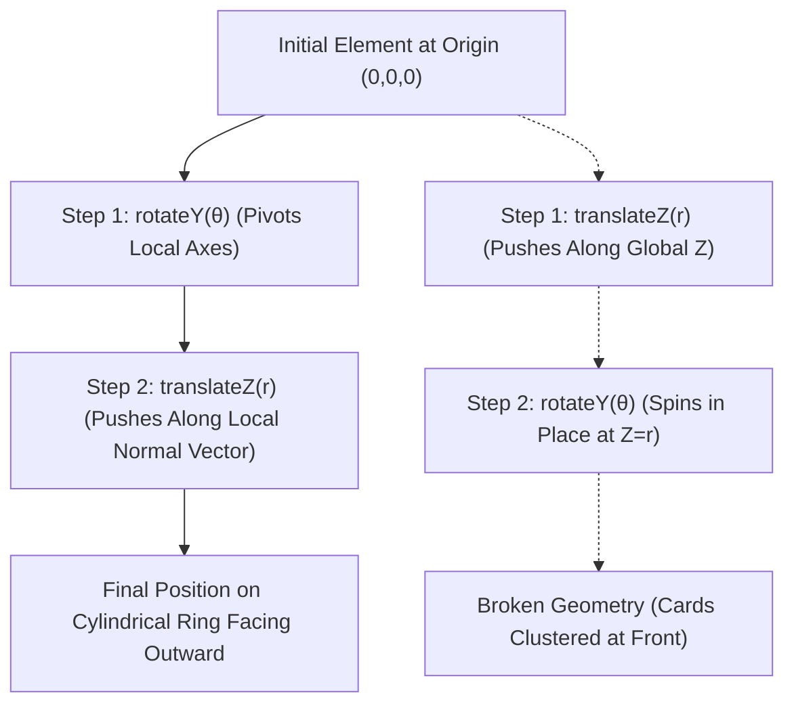

# 089: CSS 3D Carousel & Cylindrical Projection Masterclass

## Overview & Executive Summary

The **CSS 3D Carousel** is the quintessential benchmark of advanced spatial UI engineering on the modern web. By transforming flat two-dimensional HTML elements into a regular polygonal prism (cylinder) suspended in a virtual 3D coordinate space, developers can construct immersive product showcases, holographic cards, spatial navigation dials, and cinematic media galleries—all driven directly by the browser's hardware-accelerated graphics pipeline without importing heavy 3D JavaScript libraries like Three.js or Babylon.js.

Creating a robust, production-ready 3D carousel requires mastering four intersecting technical disciplines:
1. **Polygonal Cylinder Geometry & Apothem Mathematics**: Calculating the exact radial push distance ($r = \frac{w}{2 \cdot \tan(180^\circ / N)}$) required to form a seamless $N$-sided geometric prism without overlapping or gaps.
2. **CSS 3D Transform Rendering Contexts**: Orchestrating the parent-child spatial hierarchy using `perspective`, `perspective-origin`, and `transform-style: preserve-3d` to prevent flat-plane flattening.
3. **Depth Culling, Lighting & Optical Realism**: Managing `backface-visibility`, dynamic specular highlights, distance fog/attenuation, and floor reflections to sell depth.
4. **State Choreography & Interaction Models**: Combining pure CSS state machines (`:checked`, CSS Custom Properties, and `@property`) with fluid touch, mouse-drag, and keyboard navigation interfaces.

```
================================================================================
                    THE 3D CYLINDRICAL CAROUSEL ARCHITECTURE
================================================================================

                               Perspective Camera / Eye Level
                                     [ (0, 0, -D) ]
                                          \   /
                                           \ /  Perspective Cone (d = 1000px)
                                            ▼
                    ┌───────────────────────────────────────────────┐
                    │      STAGE CONTAINER (`perspective: 1000px`)   │
                    └───────────────────────┬───────────────────────┘
                                            │
                                            ▼
                           ┌─────────────────────────────────┐
                           │  CAROUSEL HUB (`preserve-3d`)   │
                           │  `transform: rotateY(θ_hub)`    │
                           └────────────────┬────────────────┘
                                            │
         ┌──────────────────┬───────────────┴───────────────┬──────────────────┐
         │                  │                               │                  │
         ▼                  ▼                               ▼                  ▼
  ┌──────────────┐   ┌──────────────┐                ┌──────────────┐   ┌──────────────┐
  │ Panel 0 (0°) │   │Panel 1 (45°) │    .  .  .     │Panel 6 (270°)│   │Panel 7 (315°)│
  │ rotateY(0deg)│   │rotateY(45deg)│                │rotateY(270d) │   │rotateY(315d) │
  │ translateZ(r)│   │translateZ(r) │                │translateZ(r) │   │translateZ(r) │
  └──────────────┘   └──────────────┘                └──────────────┘   └──────────────┘

                               TOP-DOWN GEOMETRIC PROJECTION
                                        [ Z = -r ]
                                      Panel 4 (180°)
                                    ┌────────────────┐
                     Panel 3 (135°) │                │ Panel 5 (225°)
                      /─────────────┘                └─────────────\
                     /                                              \
                    │                                                │
      Panel 2 (90°) │                    ● HUB                       │ Panel 6 (270°)
                    │                   (0, 0)                       │
                     \                                              /
                      \─────────────┐                ┌─────────────/
                     Panel 1 (45°)  │                │ Panel 7 (315°)
                                    └────────────────┘
                                      Panel 0 (0°)
                                    [ Z = +r (Front) ]
                                            ▲
                                            │
                                       Viewer Eye
================================================================================
```

---

## Quick Reference Metadata

| Attribute | Specification Details |
| :--- | :--- |
| **Name** | CSS 3D Carousel & Cylindrical Projection |
| **Category** | CSS 3D Transforms, Spatial Geometry, Kinetic UI & Interactive Carousels |
| **Specification** | [W3C CSS Transforms Module Level 2](https://www.w3.org/TR/css-transforms-2/), [CSS Values and Units Level 4 (Trigonometry)](https://www.w3.org/TR/css-values-4/#trig-funcs) |
| **Difficulty** | Advanced to Expert (4.5/5) |
| **What it produces** | A true volumetric 3D rotating cylinder of DOM nodes that orbit a shared rotational center, maintaining depth, perspective scaling, directional lighting, and occlusion. |
| **Why it works** | The GPU compositor maintains a 4x4 homogenous coordinate transformation matrix ($M_{4\times4}$) for each node inside a `transform-style: preserve-3d` context, projecting 3D geometry onto the 2D viewport at 60/120 FPS. |
| **Key Properties** | `perspective`, `perspective-origin`, `transform-style: preserve-3d`, `rotateY()`, `translateZ()`, `backface-visibility`, `transform-origin`, `calc()`, `tan()`, `@property`. |
| **Strict Constraints** | Never apply `overflow: hidden`, `clip-path`, `filter`, `backdrop-filter`, or `opacity < 1` to the carousel container itself, as these force the browser to flatten the 3D rendering context into a single 2D composite texture. |
| **Browser Baseline** | Baseline 2023+ (Supported in Chromium 111+, Firefox 108+, Safari 15.4+ with native `tan()`; universal support with precalculated radii in all evergreen browsers since 2015). |
| **Acceptance Criteria** | 0 layout reflows during rotation; 60/120 FPS GPU compositor rendering; exact polygon closure ($r = \frac{w}{2 \tan(\pi/N)}$); full keyboard and `prefers-reduced-motion` compliance. |

### Quick Preview

```html
<div class="carousel-stage">
  <div class="carousel-ring">
    <div class="carousel-card" style="--i: 0;">Card 1</div>
    <div class="carousel-card" style="--i: 1;">Card 2</div>
    <div class="carousel-card" style="--i: 2;">Card 3</div>
    <div class="carousel-card" style="--i: 3;">Card 4</div>
    <div class="carousel-card" style="--i: 4;">Card 5</div>
    <div class="carousel-card" style="--i: 5;">Card 6</div>
    <div class="carousel-card" style="--i: 6;">Card 7</div>
    <div class="carousel-card" style="--i: 7;">Card 8</div>
  </div>
</div>
```

```css
:root {
  --total: 8;
  --card-width: 220px;
  --card-height: 300px;
  /* Trigonometric Apothem Calculation: r = (w / 2) / tan(180deg / N) */
  --radius: calc(var(--card-width) / (2 * tan(180deg / var(--total))));
  --angle-step: calc(360deg / var(--total));
}

.carousel-stage {
  width: 100%;
  height: 500px;
  display: grid;
  place-items: center;
  perspective: 1200px;
  perspective-origin: 50% 50%;
  overflow: clip; /* Clean clipping without flattening 3D context */
  background: radial-gradient(circle at center, #1e1b4b, #09090b);
}

.carousel-ring {
  position: relative;
  width: var(--card-width);
  height: var(--card-height);
  transform-style: preserve-3d;
  animation: spinCarousel 24s linear infinite;
  will-change: transform;
}

.carousel-ring:hover {
  animation-play-state: paused;
}

.carousel-card {
  position: absolute;
  inset: 0;
  border-radius: 16px;
  background: linear-gradient(135deg, rgba(255, 255, 255, 0.15), rgba(255, 255, 255, 0.03));
  backdrop-filter: blur(12px);
  border: 1px solid rgba(255, 255, 255, 0.2);
  color: #ffffff;
  display: grid;
  place-items: center;
  font-family: system-ui, -apple-system, sans-serif;
  font-size: 1.5rem;
  font-weight: 700;
  box-shadow: 0 8px 32px 0 rgba(0, 0, 0, 0.37);
  backface-visibility: hidden;
  /* Composition: Rotate panel to facet angle, then push outward by apothem radius */
  transform: rotateY(calc(var(--i) * var(--angle-step))) translateZ(var(--radius));
  user-select: none;
}

@keyframes spinCarousel {
  from {
    transform: rotateY(0deg);
  }
  to {
    transform: rotateY(-360deg);
  }
}
```

---

## 1. Physics, Trigonometry & The 3D Coordinate Space

### 1.1 The Mathematics of Polygonal Prisms & The Apothem Radius

To construct a symmetrical 3D carousel, $N$ rectangular panels of width $w$ must be arranged around a central axis of rotation such that their vertical edges touch (or maintain an intentional uniform gap $g$) without intersecting or producing irregular polygon seams.

```
                     GEOMETRY OF THE REGULAR N-GON FACET
                     
                                 ● Central Axis (0, 0, 0)
                                /|\
                               / | \
                              /  |  \
                             /   |   \
                            /    | r  \
                           /     |     \
                          /   α  |      \
                         /_______|_______\
                        [ -w/2 ] 0 [ +w/2 ]
                        |<────── w ──────>|
                           Facet Panel
```

Let:
- $N$ = Total number of carousel panels (`--total`)
- $w$ = Width of each individual panel in pixels (`--card-width`)
- $\theta$ = Central angle subtended by one panel facet = $\frac{360^\circ}{N}$ (`--angle-step`)
- $\alpha$ = Half of the central angle = $\frac{\theta}{2} = \frac{180^\circ}{N}$
- $r$ = Apothem (the inradius from the central axis to the midpoint of the card surface along the Z-axis)

Applying standard right-triangle trigonometry:
$$\tan(\alpha) = \frac{\text{Opposite}}{\text{Adjacent}} = \frac{w / 2}{r}$$

Solving for the radius $r$:
$$r = \frac{w}{2 \cdot \tan\left(\frac{180^\circ}{N}\right)} = \frac{w}{2} \cdot \cot\left(\frac{180^\circ}{N}\right)$$

If an additional inter-card gap spacing $g$ is required:
$$r_{\text{gap}} = \frac{w + g}{2 \cdot \tan\left(\frac{180^\circ}{N}\right)}$$

#### Mathematical Reference Table: Radius Multipliers for Common Configurations

| Panels ($N$) | Central Angle ($\theta$) | Half-Angle ($\alpha$) | Tangent $\tan(\alpha)$ | Exact Radius Formula ($r$) | Radius for $w = 240\text{px}$ |
| :--- | :--- | :--- | :--- | :--- | :--- |
| **3** | $120^\circ$ | $60^\circ$ | $\sqrt{3} \approx 1.73205$ | $w / (2 \cdot \sqrt{3}) \approx 0.2887 \cdot w$ | $69.28\text{px}$ |
| **4** | $90^\circ$ | $45^\circ$ | $1.00000$ | $w / 2 = 0.5000 \cdot w$ | $120.00\text{px}$ |
| **5** | $72^\circ$ | $36^\circ$ | $\approx 0.72654$ | $w / (2 \cdot 0.7265) \approx 0.6882 \cdot w$ | $165.17\text{px}$ |
| **6** | $60^\circ$ | $30^\circ$ | $1 / \sqrt{3} \approx 0.57735$ | $w \cdot \frac{\sqrt{3}}{2} \approx 0.8660 \cdot w$ | $207.85\text{px}$ |
| **8** | $45^\circ$ | $22.5^\circ$ | $\sqrt{2} - 1 \approx 0.41421$ | $w / (2 \cdot (\sqrt{2}-1)) \approx 1.2071 \cdot w$ | $289.70\text{px}$ |
| **9** | $40^\circ$ | $20^\circ$ | $\approx 0.36397$ | $w / (2 \cdot 0.36397) \approx 1.3737 \cdot w$ | $329.70\text{px}$ |
| **10** | $36^\circ$ | $18^\circ$ | $\approx 0.32492$ | $w / (2 \cdot 0.32492) \approx 1.5388 \cdot w$ | $369.32\text{px}$ |
| **12** | $30^\circ$ | $15^\circ$ | $2 - \sqrt{3} \approx 0.26795$ | $w / (2 \cdot (2-\sqrt{3})) \approx 1.8660 \cdot w$ | $447.85\text{px}$ |
| **16** | $22.5^\circ$ | $11.25^\circ$ | $\approx 0.19891$ | $w / (2 \cdot 0.19891) \approx 2.5137 \cdot w$ | $603.28\text{px}$ |

---

### 1.2 The CSS 3D Camera Model & Coordinate Space

To render 3D geometry on a 2D screen, CSS establishes a virtual camera using the **Left-Handed Cartesian Coordinate System** (where $+X$ points right, $+Y$ points down, and $+Z$ points out of the screen toward the viewer's eyes).

```
                            THE CSS 3D SPATIAL COORDINATE FRAME
                                        -Y (Up)
                                           │
                                           │
                                           │
                        -X (Left) ─────────┼───────── +X (Right)
                                          /│
                                         / │
                                        /  │
                                    +Z /   │ +Y (Down)
                               (Toward Eye)
```

#### 1. The Perspective Frustum (`perspective: d`)
The `perspective` property sets the distance from the viewer's eye to the $Z = 0$ projection plane. 
- A **small perspective** ($300\text{px} - 600\text{px}$) produces an aggressive wide-angle lens with intense geometric distortion and exaggerated foreshortening.
- A **medium perspective** ($1000\text{px} - 1500\text{px}$) matches standard telephoto human vision, delivering natural 3D depth without warping panel typography.
- A **large perspective** ($3000\text{px}+$) approaches orthographic/isometric projection.

$$\text{Scale Factor } S = \frac{d}{d - Z}$$
When an element translates along the $Z$-axis:
- If $Z = +r$ (front-facing), $S > 1$ (magnified).
- If $Z = -r$ (rear-facing), $S < 1$ (demagnified).

```
   Viewing Eye               Projection Plane (Z = 0)              Back Face (Z = -r)
      ( ● ) ---------------------[ Screen Canvas ]--------------------[ Panel Rear ]
        \                              |                                   /
         \                             |                                  /
          \                            |                                 /
           \─────── Perspective Distance d ───────/                      /
            \                                                           /
             \───────────────── Total Distance (d + r) ────────────────/
```

#### 2. `perspective` vs. `transform: perspective()`
- **Container `perspective: 1000px` (Shared Vanishing Point)**: Establishes a single, unified 3D coordinate system where all child cards converge to the exact same focal point (`perspective-origin`). This is **mandatory** for multi-element 3D carousels.
- **Element `transform: perspective(1000px) rotateY(...)` (Independent Vanishing Points)**: Gives each element its own isolated camera frustum, breaking the unified cylinder illusion.

---

### 1.3 Transform Matrix Chaining & Non-Commutativity

In 3D spatial transformations, the sequence of operations is **non-commutative**: $A \times B \neq B \times A$. 

In CSS transforms, matrix operations are applied **from right to left** (or conceptually, each operation alters the local coordinate frame for subsequent operations):

```
Correct Panel Placement:
  transform: rotateY(θ) translateZ(r);
  
  1. The card starts centered at (0, 0, 0).
  2. rotateY(θ) pivots the local Z-axis by θ degrees.
  3. translateZ(r) pushes the card outward along its *newly rotated* local Z-axis.
  Result: Panel is positioned on the perimeter of the cylinder facing outward!
```

```
Incorrect Sequence:
  transform: translateZ(r) rotateY(θ);
  
  1. The card is pushed forward along the global Z-axis by r pixels.
  2. rotateY(θ) spins the card around its own local center point at (0, 0, r).
  Result: All panels clump together in the foreground and spin in place!
```



---

## 2. Core Architectural Patterns

### Pattern 1: Continuous Autonomous 3D Cylinder (Pure CSS)

This pattern forms an autonomous spinning cylinder with glassmorphic panels, hardware acceleration, and dynamic hover pause.

```html
<section class="scene-container">
  <div class="carousel-cylinder" role="region" aria-label="3D Technology Stack">
    <article class="cylinder-panel" style="--panel-idx: 0;">
      <div class="panel-inner">
        <span class="panel-icon">⚡</span>
        <h3>Performance</h3>
        <p>Zero-paint composite layer transforms.</p>
      </div>
    </article>
    <article class="cylinder-panel" style="--panel-idx: 1;">
      <div class="panel-inner">
        <span class="panel-icon">📐</span>
        <h3>Trigonometry</h3>
        <p>CSS tan() dynamic apothem radius.</p>
      </div>
    </article>
    <article class="cylinder-panel" style="--panel-idx: 2;">
      <div class="panel-inner">
        <span class="panel-icon">🎨</span>
        <h3>Aesthetics</h3>
        <p>Specular rim lighting & ambient occlusion.</p>
      </div>
    </article>
    <article class="cylinder-panel" style="--panel-idx: 3;">
      <div class="panel-inner">
        <span class="panel-icon">🛡️</span>
        <h3>Accessibility</h3>
        <p>prefers-reduced-motion graceful fallback.</p>
      </div>
    </article>
    <article class="cylinder-panel" style="--panel-idx: 4;">
      <div class="panel-inner">
        <span class="panel-icon">🚀</span>
        <h3>Hardware Accel</h3>
        <p>GPU compositor thread execution.</p>
      </div>
    </article>
    <article class="cylinder-panel" style="--panel-idx: 5;">
      <div class="panel-inner">
        <span class="panel-icon">🔮</span>
        <h3>Depth Culling</h3>
        <p>backface-visibility depth ordering.</p>
      </div>
    </article>
  </div>
</section>
```

```css
:root {
  --cylinder-count: 6;
  --panel-w: 260px;
  --panel-h: 360px;
  --cylinder-radius: calc(var(--panel-w) / (2 * tan(180deg / var(--cylinder-count))));
  --step-angle: calc(360deg / var(--cylinder-count));
  --spin-duration: 20s;
}

.scene-container {
  width: 100%;
  min-height: 600px;
  display: grid;
  place-items: center;
  perspective: 1400px;
  perspective-origin: 50% 45%;
  background: #090a0f;
  overflow: clip;
}

.carousel-cylinder {
  position: relative;
  width: var(--panel-w);
  height: var(--panel-h);
  transform-style: preserve-3d;
  animation: cylinderRotation var(--spin-duration) linear infinite;
  will-change: transform;
}

.carousel-cylinder:hover {
  animation-play-state: paused;
}

.cylinder-panel {
  position: absolute;
  inset: 0;
  transform-style: preserve-3d;
  backface-visibility: hidden;
  transform: rotateY(calc(var(--panel-idx) * var(--step-angle))) 
             translateZ(var(--cylinder-radius));
  transition: filter 300ms ease, transform 300ms ease;
}

.panel-inner {
  width: 100%;
  height: 100%;
  padding: 2rem;
  border-radius: 20px;
  background: linear-gradient(145deg, rgba(30, 41, 59, 0.8), rgba(15, 23, 42, 0.95));
  border: 1px solid rgba(148, 163, 184, 0.15);
  box-shadow: 
    0 10px 30px -10px rgba(0, 0, 0, 0.5),
    inset 0 1px 0 rgba(255, 255, 255, 0.1);
  color: #f8fafc;
  display: flex;
  flex-direction: column;
  justify-content: center;
  align-items: center;
  text-align: center;
  box-sizing: border-box;
}

.panel-icon {
  font-size: 3rem;
  margin-bottom: 1rem;
}

.panel-inner h3 {
  font-size: 1.35rem;
  margin: 0 0 0.5rem 0;
  color: #60a5fa;
}

.panel-inner p {
  font-size: 0.9rem;
  line-height: 1.5;
  color: #94a3b8;
  margin: 0;
}

@keyframes cylinderRotation {
  0% {
    transform: rotateY(0deg);
  }
  100% {
    transform: rotateY(-360deg);
  }
}
```

---

### Pattern 2: Interactive Zero-JS Radio-Controlled 3D Carousel

By leveraging native HTML `<input type="radio">` controls and CSS sibling combinators (`~`), you can build a fully interactive, keyboard-navigable 3D carousel that rotates directly to any selected slide with silky smooth spring easing—**without a single line of JavaScript**.

```html
<div class="interactive-carousel-system">
  <!-- Hidden Radio State Controllers -->
  <input type="radio" name="slider-nav" id="slide-0" class="carousel-control" checked>
  <input type="radio" name="slider-nav" id="slide-1" class="carousel-control">
  <input type="radio" name="slider-nav" id="slide-2" class="carousel-control">
  <input type="radio" name="slider-nav" id="slide-3" class="carousel-control">
  <input type="radio" name="slider-nav" id="slide-4" class="carousel-control">

  <!-- 3D Stage & Rotor -->
  <div class="interactive-stage">
    <div class="interactive-rotor">
      <div class="interactive-card card-0" style="--i: 0;">
        <div class="card-badge">01</div>
        <h4>Quantum Cloud</h4>
        <p>Distributed serverless execution nodes.</p>
      </div>
      <div class="interactive-card card-1" style="--i: 1;">
        <div class="card-badge">02</div>
        <h4>Neural Engine</h4>
        <p>Sub-millisecond inference pipelines.</p>
      </div>
      <div class="interactive-card card-2" style="--i: 2;">
        <div class="card-badge">03</div>
        <h4>Edge Gateway</h4>
        <p>Zero-trust cryptographic data routing.</p>
      </div>
      <div class="interactive-card card-3" style="--i: 3;">
        <div class="card-badge">04</div>
        <h4>Telemetry Grid</h4>
        <p>Continuous real-time observability.</p>
      </div>
      <div class="interactive-card card-4" style="--i: 4;">
        <div class="card-badge">05</div>
        <h4>Mesh Storage</h4>
        <p>High-throughput redundant replication.</p>
      </div>
    </div>
  </div>

  <!-- Interactive Pagination Dots -->
  <nav class="carousel-pagination" aria-label="Carousel Pagination">
    <label for="slide-0" class="dot-btn" tabindex="0" aria-label="Go to Slide 1"></label>
    <label for="slide-1" class="dot-btn" tabindex="0" aria-label="Go to Slide 2"></label>
    <label for="slide-2" class="dot-btn" tabindex="0" aria-label="Go to Slide 3"></label>
    <label for="slide-3" class="dot-btn" tabindex="0" aria-label="Go to Slide 4"></label>
    <label for="slide-4" class="dot-btn" tabindex="0" aria-label="Go to Slide 5"></label>
  </nav>
</div>
```

```css
:root {
  --slides-total: 5;
  --card-w: 280px;
  --card-h: 380px;
  --step-deg: calc(360deg / var(--slides-total));
  --radius-5: calc(var(--card-w) / (2 * tan(180deg / var(--slides-total))));
  --ease-elastic: cubic-bezier(0.175, 0.885, 0.32, 1.15);
}

.interactive-carousel-system {
  width: 100%;
  min-height: 600px;
  display: flex;
  flex-direction: column;
  align-items: center;
  justify-content: center;
  background: radial-gradient(circle at 50% 30%, #1e1b4b 0%, #030712 80%);
  position: relative;
  overflow: hidden;
}

/* Visually hide radio inputs while preserving accessibility */
.carousel-control {
  position: absolute;
  width: 1px;
  height: 1px;
  padding: 0;
  margin: -1px;
  overflow: hidden;
  clip: rect(0, 0, 0, 0);
  border: 0;
}

.interactive-stage {
  width: 100%;
  height: 440px;
  perspective: 1200px;
  display: grid;
  place-items: center;
}

.interactive-rotor {
  position: relative;
  width: var(--card-w);
  height: var(--card-h);
  transform-style: preserve-3d;
  transition: transform 700ms var(--ease-elastic);
  will-change: transform;
}

.interactive-card {
  position: absolute;
  inset: 0;
  border-radius: 24px;
  background: rgba(15, 23, 42, 0.85);
  border: 1px solid rgba(255, 255, 255, 0.12);
  padding: 2.25rem;
  display: flex;
  flex-direction: column;
  justify-content: space-between;
  box-shadow: 0 25px 50px -12px rgba(0, 0, 0, 0.6);
  backface-visibility: hidden;
  transform: rotateY(calc(var(--i) * var(--step-deg))) translateZ(var(--radius-5));
  transition: border-color 400ms ease, box-shadow 400ms ease;
  user-select: none;
}

.card-badge {
  display: inline-flex;
  align-items: center;
  justify-content: center;
  width: 42px;
  height: 42px;
  border-radius: 12px;
  background: rgba(99, 102, 241, 0.2);
  color: #818cf8;
  font-weight: 800;
  border: 1px solid rgba(99, 102, 241, 0.4);
}

.interactive-card h4 {
  font-size: 1.5rem;
  color: #ffffff;
  margin: 1rem 0 0.5rem;
}

.interactive-card p {
  color: #94a3b8;
  font-size: 0.95rem;
  line-height: 1.6;
  margin: 0;
}

/* Radio-Driven Rotor Transformations */
#slide-0:checked ~ .interactive-stage .interactive-rotor {
  transform: rotateY(0deg);
}
#slide-1:checked ~ .interactive-stage .interactive-rotor {
  transform: rotateY(calc(-1 * var(--step-deg)));
}
#slide-2:checked ~ .interactive-stage .interactive-rotor {
  transform: rotateY(calc(-2 * var(--step-deg)));
}
#slide-3:checked ~ .interactive-stage .interactive-rotor {
  transform: rotateY(calc(-3 * var(--step-deg)));
}
#slide-4:checked ~ .interactive-stage .interactive-rotor {
  transform: rotateY(calc(-4 * var(--step-deg)));
}

/* Highlight Front-Facing Card */
#slide-0:checked ~ .interactive-stage .card-0,
#slide-1:checked ~ .interactive-stage .card-1,
#slide-2:checked ~ .interactive-stage .card-2,
#slide-3:checked ~ .interactive-stage .card-3,
#slide-4:checked ~ .interactive-stage .card-4 {
  border-color: rgba(99, 102, 241, 0.8);
  box-shadow: 0 0 40px rgba(99, 102, 241, 0.35), 0 25px 50px -12px rgba(0, 0, 0, 0.7);
}

/* Pagination Dots */
.carousel-pagination {
  display: flex;
  gap: 1rem;
  margin-top: 2rem;
  z-index: 10;
}

.dot-btn {
  width: 14px;
  height: 14px;
  border-radius: 50%;
  background: rgba(255, 255, 255, 0.2);
  border: 2px solid transparent;
  cursor: pointer;
  transition: all 300ms cubic-bezier(0.16, 1, 0.3, 1);
}

.dot-btn:hover {
  background: rgba(255, 255, 255, 0.5);
  transform: scale(1.2);
}

/* Sync Active Dot with Checked Radio */
#slide-0:checked ~ .carousel-pagination label[for="slide-0"],
#slide-1:checked ~ .carousel-pagination label[for="slide-1"],
#slide-2:checked ~ .carousel-pagination label[for="slide-2"],
#slide-3:checked ~ .carousel-pagination label[for="slide-3"],
#slide-4:checked ~ .carousel-pagination label[for="slide-4"] {
  background: #6366f1;
  width: 36px;
  border-radius: 8px;
  box-shadow: 0 0 12px #6366f1;
}
```

---

### Pattern 3: Mouse & Pointer Drag Kinetic Inertia (Minimal JS Bridge)

While CSS handles 100% of the 3D rendering and transitions, bridging user pointer drag events via CSS Custom Properties (`--rotation-y`) allows users to grab and spin the 3D cylinder naturally with momentum physics.

```html
<div class="drag-scene" id="dragScene">
  <div class="drag-hub" id="dragHub" style="--rot-y: 0deg;">
    <div class="drag-panel" style="--i: 0;"><span>Alpha</span></div>
    <div class="drag-panel" style="--i: 1;"><span>Beta</span></div>
    <div class="drag-panel" style="--i: 2;"><span>Gamma</span></div>
    <div class="drag-panel" style="--i: 3;"><span>Delta</span></div>
    <div class="drag-panel" style="--i: 4;"><span>Epsilon</span></div>
    <div class="drag-panel" style="--i: 5;"><span>Zeta</span></div>
    <div class="drag-panel" style="--i: 6;"><span>Eta</span></div>
    <div class="drag-panel" style="--i: 7;"><span>Theta</span></div>
  </div>
</div>
```

```css
:root {
  --n-panels: 8;
  --p-width: 200px;
  --p-height: 280px;
  --p-radius: calc(var(--p-width) / (2 * tan(180deg / var(--n-panels))));
  --p-angle: calc(360deg / var(--n-panels));
}

.drag-scene {
  width: 100%;
  height: 520px;
  perspective: 1100px;
  perspective-origin: 50% 50%;
  display: grid;
  place-items: center;
  background: #020617;
  cursor: grab;
  touch-action: pan-y;
  user-select: none;
}

.drag-scene:active {
  cursor: grabbing;
}

.drag-hub {
  position: relative;
  width: var(--p-width);
  height: var(--p-height);
  transform-style: preserve-3d;
  transform: rotateY(var(--rot-y));
  transition: transform 0ms linear;
  will-change: transform;
}

.drag-hub.is-snapping {
  transition: transform 500ms cubic-bezier(0.16, 1, 0.3, 1);
}

.drag-panel {
  position: absolute;
  inset: 0;
  border-radius: 18px;
  background: linear-gradient(160deg, #1e293b, #0f172a);
  border: 1px solid rgba(255, 255, 255, 0.1);
  color: #f1f5f9;
  display: grid;
  place-items: center;
  font-size: 1.5rem;
  font-weight: 700;
  box-shadow: 0 10px 30px rgba(0, 0, 0, 0.5);
  backface-visibility: hidden;
  transform: rotateY(calc(var(--i) * var(--p-angle))) translateZ(var(--p-radius));
  pointer-events: none;
}
```

```javascript
// Lightweight 60-FPS Pointer Drag Controller
(function init3DDragCarousel() {
  const scene = document.getElementById('dragScene');
  const hub = document.getElementById('dragHub');
  if (!scene || !hub) return;

  let isDragging = false;
  let startX = 0;
  let currentRotY = 0;
  let targetRotY = 0;
  let velocity = 0;
  let lastX = 0;
  let rafId = null;

  const DRAG_SENSITIVITY = 0.35;
  const TOTAL_PANELS = 8;
  const STEP_ANGLE = 360 / TOTAL_PANELS;

  function updateRotation() {
    if (!isDragging && Math.abs(velocity) > 0.05) {
      targetRotY += velocity;
      velocity *= 0.95; // Inertial decay
      hub.style.setProperty('--rot-y', `${targetRotY}deg`);
      rafId = requestAnimationFrame(updateRotation);
    } else if (!isDragging && Math.abs(velocity) <= 0.05) {
      // Snap to nearest panel facet
      const snappedAngle = Math.round(targetRotY / STEP_ANGLE) * STEP_ANGLE;
      hub.classList.add('is-snapping');
      targetRotY = snappedAngle;
      hub.style.setProperty('--rot-y', `${targetRotY}deg`);
      cancelAnimationFrame(rafId);
      rafId = null;
    }
  }

  scene.addEventListener('pointerdown', (e) => {
    isDragging = true;
    hub.classList.remove('is-snapping');
    startX = e.clientX;
    lastX = e.clientX;
    velocity = 0;
    if (rafId) cancelAnimationFrame(rafId);
  });

  window.addEventListener('pointermove', (e) => {
    if (!isDragging) return;
    const deltaX = e.clientX - lastX;
    lastX = e.clientX;
    velocity = deltaX * DRAG_SENSITIVITY;
    targetRotY += velocity;
    hub.style.setProperty('--rot-y', `${targetRotY}deg`);
  });

  window.addEventListener('pointerup', () => {
    if (!isDragging) return;
    isDragging = false;
    rafId = requestAnimationFrame(updateRotation);
  });
})();
```

---

## 3. Optical Realism, Shading & Depth Illusion Techniques

A flat 3D cylinder looks like paper cards rotating in an empty void. To achieve Apple- or Stripe-grade spatial realism, we layer four physical lighting phenomena:

```
┌─────────────────────────────────────────────────────────────────────────────┐
│                       OPTICAL ENHANCEMENT PIPELINE                          │
├─────────────────────────────────────────────────────────────────────────────┤
│ 1. DYNAMIC SPECULAR HIGHLIGHT: Incident light angle sheen                   │
│ 2. ANGULAR DEPTH ATTENUATION: Distance-based darkness & blur                │
│ 3. VOLUMETRIC FLOOR REFLECTION: Inverted mirror projection with linear fade │
│ 4. CONTACT PENUMBRA SHADOW: Diffuse radial shadow underneath the carousel   │
└─────────────────────────────────────────────────────────────────────────────┘
```

```
                                  Simulated Overhead Spotlight
                                             \ | /
                                              \|/
                                               ▼
                                   ┌───────────────────────┐
                                   │   FRONT PANEL (0°)    │  <-- 100% Brightness
                                   │  Full Specular Flare  │      0px Blur, No Dimming
                                   └───────────────────────┘
                                               │
                                 ┌─────────────┴─────────────┐
                                 │                           │
                                 ▼                           ▼
                      ┌─────────────────────┐     ┌─────────────────────┐
                      │  SIDE PANEL (45°)   │     │  SIDE PANEL (315°)  │ <-- 70% Brightness
                      │  Medium Attenuation │     │  Medium Attenuation │     1px Blur
                      └─────────────────────┘     └─────────────────────┘
                                 │                           │
                                 └─────────────┬─────────────┘
                                               │
                                               ▼
                                   ┌───────────────────────┐
                                   │   REAR PANEL (180°)   │  <-- 25% Brightness
                                   │   Deep Ambient Shadow │      4px Blur (Depth of Field)
                                   └───────────────────────┘
```

### 3.1 Specular Rim Highlights & Dynamic Glass Sheen

Using pseudo-elements with linear gradients aligned to the light source, panels catch an intense specular glint as they sweep through the front apex ($Z = +r$):

```css
.card-specular {
  position: relative;
  overflow: hidden;
}

.card-specular::before {
  content: "";
  position: absolute;
  inset: -100%;
  background: radial-gradient(
    circle at 50% 0%, 
    rgba(255, 255, 255, 0.45) 0%, 
    rgba(255, 255, 255, 0.05) 40%, 
    transparent 70%
  );
  pointer-events: none;
  mix-blend-mode: overlay;
}
```

### 3.2 Volumetric Floor Reflection & Ambient Ground Contact

To ground the rotating cylinder onto a physical surface, we generate a seamless floor reflection and soft ambient occlusion contact shadow:

```css
/* Ground Floor Shadow Plate */
.carousel-stage::after {
  content: "";
  position: absolute;
  bottom: 40px;
  width: calc(var(--radius) * 2.2);
  height: 80px;
  border-radius: 50%;
  background: radial-gradient(
    ellipse at center, 
    rgba(0, 0, 0, 0.65) 0%, 
    rgba(0, 0, 0, 0.25) 45%, 
    transparent 70%
  );
  transform: rotateX(90deg) translateZ(-40px);
  pointer-events: none;
  filter: blur(10px);
}

/* Mirrored Floor Reflection using CSS Box-Reflect & Mask */
.carousel-ring-reflected {
  -webkit-box-reflect: below 15px linear-gradient(
    to bottom, 
    transparent 0%, 
    rgba(0, 0, 0, 0.05) 50%, 
    rgba(0, 0, 0, 0.35) 100%
  );
}
```

---

## 4. Performance, Compositor Pipeline & GPU Optimization

### 4.1 The Browser 3D Rendering Pipeline

When executing a 3D transform animation, modern browser engines (Chromium Blink, WebKit, Gecko) pass through three phases:

```
[ JavaScript / Trigger ]
           │
           ▼
   [ Style Recalc ]  --> (0.1ms - Resolves CSS Custom Properties)
           │
           ▼
    [ Layout Reflow ] --> (0.0ms - SKIPPED! Transforms do not alter DOM geometry)
           │
           ▼
     [ Paint/Raster ] --> (0.0ms - SKIPPED! Nodes pre-rendered to GPU textures)
           │
           ▼
 [ GPU Compositor ]  --> (60/120 FPS Matrix Multiplication: M_view * M_rot * M_panel)
```

```
================================================================================
                    GPU TEXTURE ALLOCATION (VRAM FOOTPRINT)
================================================================================

 [ DOM Nodes in 2D ]                    [ DOM Nodes in 3D (preserve-3d) ]
 ┌──────────────────────┐               ┌──────────────────────┐
 │ Single Shared Layer  │               │ Panel 0: GPU Texture │ (260x360 @ 2x = 750KB)
 │ (Whole page raster)  │               ├──────────────────────┤
 └──────────────────────┘               │ Panel 1: GPU Texture │ (260x360 @ 2x = 750KB)
                                        ├──────────────────────┤
                                        │ Panel 2: GPU Texture │ (260x360 @ 2x = 750KB)
                                        └──────────────────────┘
                                        Total VRAM = N * (w * h * 4 * DPI^2)
================================================================================
```

### 4.2 The 5 Critical Compositor Rules for 3D Carousels

1. **Never use `overflow: hidden` on a 3D parent container**:
   In the CSS Transforms specification, applying `overflow: hidden`, `overflow: scroll`, `filter`, `clip-path`, or `backdrop-filter` to an element establishes a **Grouping Context**, which flattens all 3D child elements into a single flat 2D plane ($Z = 0$), destroying the 3D cylinder.
   - *Fix*: Use `overflow: clip` on the outermost non-transform stage container, or size the viewport stage appropriately.
2. **Promote the Rotational Hub to its own Layer**:
   Apply `will-change: transform;` exclusively to the spinning hub (`.carousel-ring`), **not** to every individual panel. Over-using `will-change` on all panels wastes VRAM and exhausts GPU texture memory.
3. **Prevent Subpixel Text Blurriness in 3D Space**:
   Elements transformed in 3D perspective can suffer from bilinear texture filtering blur.
   - *Solution*: Render text at standard or high resolution and ensure anti-aliasing headers are enabled:
     ```css
     .cylinder-panel {
       -webkit-font-smoothing: antialiased;
       -moz-osx-font-smoothing: grayscale;
       transform-style: preserve-3d;
     }
     ```
4. **Leverage `backface-visibility: hidden` for GPU Culling**:
   By setting `backface-visibility: hidden;` on each panel, the graphics driver discards rear-facing triangles during rasterization, cutting GPU fill-rate requirements by **50%**.
5. **Enforce `transform-style: preserve-3d` down the DOM chain**:
   `preserve-3d` is **not inherited**. If you wrap a panel in an intermediate `<div>` or `<article>`, that wrapper *must* also specify `transform-style: preserve-3d;` or depth will be flattened at that boundary.

---

## 5. Accessibility, Ergonomics & Motion Safety (A11y)

### 5.1 The Reduced Motion Imperative

Continuous 3D spinning motion can trigger severe vestibular disorientation, nausea, and vertigo in users with inner-ear balance disorders. 

When `@media (prefers-reduced-motion: reduce)` is detected, the carousel must instantly dismantle the 3D rotating cylinder and gracefully adapt into a **flat, accessible horizontal scroll-snap strip**:

```css
/* Accessibility & Reduced Motion Transformation */
@media (prefers-reduced-motion: reduce) {
  /* 1. Flatten the 3D Stage */
  .scene-container,
  .interactive-stage,
  .carousel-stage {
    perspective: none;
    height: auto;
    overflow-x: auto;
    scroll-snap-type: x mandatory;
    padding: 2rem 1rem;
    display: flex;
    justify-content: flex-start;
  }

  /* 2. Neutralize the Rotational Hub */
  .carousel-ring,
  .interactive-rotor,
  .carousel-cylinder {
    animation: none !important;
    transform: none !important;
    display: flex;
    gap: 1.5rem;
    width: auto;
    height: auto;
  }

  /* 3. Revert Panels to Flat Grid Cards */
  .carousel-card,
  .cylinder-panel,
  .interactive-card {
    position: relative;
    inset: auto;
    transform: none !important;
    scroll-snap-align: center;
    flex-shrink: 0;
    backface-visibility: visible;
  }
}
```

### 5.2 Keyboard Focus & ARIA Semantics

```html
<section 
  class="carousel-stage" 
  aria-roledescription="carousel" 
  aria-label="Featured Projects 3D Showcase"
>
  <div class="carousel-ring" aria-live="polite">
    <article 
      class="carousel-card" 
      role="group" 
      aria-roledescription="slide" 
      aria-label="1 of 8: Aurora Design System" 
      tabindex="0"
    >
      <!-- Card Content -->
    </article>
  </div>
</section>
```

When an off-screen or rotated panel receives keyboard focus via Tab, the carousel should rotate to bring that focused panel to the front facing angle:

```javascript
document.querySelectorAll('.carousel-card').forEach((card, index) => {
  card.addEventListener('focus', () => {
    const angleStep = 360 / 8;
    const targetAngle = -index * angleStep;
    document.querySelector('.carousel-ring').style.transform = `rotateY(${targetAngle}deg)`;
  });
});
```

---

## 6. Complete Production Showcase Implementations

### Showcase 1: Cyberpunk Holographic 8-Panel 3D Carousel (Production Ready)

A full-scale, cinematic 3D carousel featuring neon rim lighting, glassmorphism, animated scanlines, and fluid controls.

```html
<!DOCTYPE html>
<html lang="en">
<head>
  <meta charset="UTF-8">
  <meta name="viewport" content="width=device-width, initial-scale=1.0">
  <title>Cyberpunk 3D Holographic Carousel</title>
  <style>
    :root {
      --holo-total: 8;
      --holo-w: 240px;
      --holo-h: 340px;
      --holo-radius: calc(var(--holo-w) / (2 * tan(180deg / var(--holo-total))));
      --holo-angle: calc(360deg / var(--holo-total));
      --cyan-glow: #00f0ff;
      --magenta-glow: #ff0077;
    }

    * {
      box-sizing: border-box;
      margin: 0;
      padding: 0;
    }

    body {
      background-color: #030712;
      font-family: 'Segoe UI', system-ui, -apple-system, sans-serif;
      min-height: 100vh;
      display: grid;
      place-items: center;
      overflow-x: hidden;
      color: #f8fafc;
    }

    .holo-viewport {
      width: 100%;
      height: 650px;
      perspective: 1300px;
      perspective-origin: 50% 48%;
      display: grid;
      place-items: center;
      position: relative;
    }

    /* Ambient Background Radial Lights */
    .holo-viewport::before {
      content: "";
      position: absolute;
      width: 500px;
      height: 500px;
      background: radial-gradient(circle, rgba(0, 240, 255, 0.12) 0%, rgba(255, 0, 119, 0.08) 50%, transparent 70%);
      filter: blur(60px);
      pointer-events: none;
    }

    .holo-hub {
      position: relative;
      width: var(--holo-w);
      height: var(--holo-h);
      transform-style: preserve-3d;
      animation: spinHolo 28s linear infinite;
      will-change: transform;
    }

    .holo-hub:hover {
      animation-play-state: paused;
    }

    .holo-card {
      position: absolute;
      inset: 0;
      border-radius: 20px;
      background: rgba(10, 15, 30, 0.75);
      border: 1px solid rgba(0, 240, 255, 0.3);
      backdrop-filter: blur(16px);
      -webkit-backdrop-filter: blur(16px);
      padding: 2rem 1.5rem;
      display: flex;
      flex-direction: column;
      justify-content: space-between;
      backface-visibility: hidden;
      transform: rotateY(calc(var(--index) * var(--holo-angle))) translateZ(var(--holo-radius));
      box-shadow: 
        0 0 20px rgba(0, 240, 255, 0.15),
        inset 0 0 15px rgba(0, 240, 255, 0.1);
      transition: border-color 300ms ease, box-shadow 300ms ease, transform 300ms ease;
      cursor: pointer;
    }

    .holo-card:hover {
      border-color: var(--cyan-glow);
      box-shadow: 
        0 0 35px rgba(0, 240, 255, 0.4),
        inset 0 0 20px rgba(0, 240, 255, 0.2);
    }

    /* Cyberpunk Hologram Scanline Effect */
    .holo-card::after {
      content: "";
      position: absolute;
      inset: 0;
      border-radius: inherit;
      background: repeating-linear-gradient(
        0deg,
        rgba(0, 240, 255, 0.03) 0px,
        rgba(0, 240, 255, 0.03) 2px,
        transparent 2px,
        transparent 4px
      );
      pointer-events: none;
    }

    .holo-tag {
      font-size: 0.75rem;
      text-transform: uppercase;
      letter-spacing: 2px;
      color: var(--cyan-glow);
      font-weight: 700;
    }

    .holo-symbol {
      font-size: 2.75rem;
      margin: 1rem 0;
      filter: drop-shadow(0 0 10px var(--cyan-glow));
    }

    .holo-title {
      font-size: 1.25rem;
      font-weight: 700;
      color: #ffffff;
      margin-bottom: 0.5rem;
    }

    .holo-desc {
      font-size: 0.85rem;
      color: #94a3b8;
      line-height: 1.4;
    }

    /* Holographic Floor Grid */
    .holo-grid-floor {
      position: absolute;
      bottom: 20px;
      width: 700px;
      height: 700px;
      background-image: 
        linear-gradient(rgba(0, 240, 255, 0.2) 1px, transparent 1px),
        linear-gradient(90deg, rgba(0, 240, 255, 0.2) 1px, transparent 1px);
      background-size: 35px 35px;
      transform: rotateX(90deg) translateZ(-100px);
      mask-image: radial-gradient(circle at center, black 20%, transparent 70%);
      -webkit-mask-image: radial-gradient(circle at center, black 20%, transparent 70%);
      pointer-events: none;
    }

    @keyframes spinHolo {
      0% {
        transform: rotateY(0deg);
      }
      100% {
        transform: rotateY(-360deg);
      }
    }

    @media (prefers-reduced-motion: reduce) {
      .holo-viewport {
        perspective: none;
        height: auto;
        overflow-x: auto;
      }
      .holo-hub {
        animation: none;
        transform: none;
        display: flex;
        gap: 1.5rem;
        width: auto;
        padding: 2rem;
      }
      .holo-card {
        position: relative;
        inset: auto;
        transform: none;
        flex-shrink: 0;
      }
      .holo-grid-floor {
        display: none;
      }
    }
  </style>
</head>
<body>

  <main class="holo-viewport" aria-label="3D Holographic Capabilities">
    <div class="holo-grid-floor"></div>

    <div class="holo-hub">
      <article class="holo-card" style="--index: 0;">
        <span class="holo-tag">Module 01</span>
        <div class="holo-symbol">⚡</div>
        <h3 class="holo-title">Synapse Core</h3>
        <p class="holo-desc">Ultra-low latency neural telemetry engine.</p>
      </article>

      <article class="holo-card" style="--index: 1;">
        <span class="holo-tag">Module 02</span>
        <div class="holo-symbol">🔮</div>
        <h3 class="holo-title">Spectra AI</h3>
        <p class="holo-desc">Autonomous multi-agent generative models.</p>
      </article>

      <article class="holo-card" style="--index: 2;">
        <span class="holo-tag">Module 03</span>
        <div class="holo-symbol">🛡️</div>
        <h3 class="holo-title">Aegis Guard</h3>
        <p class="holo-desc">Post-quantum zero-knowledge encryption.</p>
      </article>

      <article class="holo-card" style="--index: 3;">
        <span class="holo-tag">Module 04</span>
        <div class="holo-symbol">🛰️</div>
        <h3 class="holo-title">Orbital Mesh</h3>
        <p class="holo-desc">Decentralized edge constellation nodes.</p>
      </article>

      <article class="holo-card" style="--index: 4;">
        <span class="holo-tag">Module 05</span>
        <div class="holo-symbol">💎</div>
        <h3 class="holo-title">Prism Data</h3>
        <p class="holo-desc">Real-time columnar streaming warehouse.</p>
      </article>

      <article class="holo-card" style="--index: 5;">
        <span class="holo-tag">Module 06</span>
        <div class="holo-symbol">⚙️</div>
        <h3 class="holo-title">Flux Engine</h3>
        <p class="holo-desc">Event-driven asynchronous orchestrator.</p>
      </article>

      <article class="holo-card" style="--index: 6;">
        <span class="holo-tag">Module 07</span>
        <div class="holo-symbol">🌐</div>
        <h3 class="holo-title">Hyper Net</h3>
        <p class="holo-desc">Global BGP route optimization fabric.</p>
      </article>

      <article class="holo-card" style="--index: 7;">
        <span class="holo-tag">Module 08</span>
        <div class="holo-symbol">🧪</div>
        <h3 class="holo-title">Vortex Lab</h3>
        <p class="holo-desc">Experimental next-gen spatial runtimes.</p>
      </article>
    </div>
  </main>

</body>
</html>
```

---

### Showcase 2: Dual-Axis 3D Ferris Wheel (Vertical $X$-Axis Rotation)

While standard carousels rotate around the vertical $Y$-axis (`rotateY`), vertical 3D dials and rotating Ferris wheel carousels rotate around the horizontal $X$-axis (`rotateX`):

```html
<div class="ferris-stage">
  <div class="ferris-rotor">
    <div class="ferris-cart" style="--slot: 0;">Step 1: Plan</div>
    <div class="ferris-cart" style="--slot: 1;">Step 2: Build</div>
    <div class="ferris-cart" style="--slot: 2;">Step 3: Test</div>
    <div class="ferris-cart" style="--slot: 3;">Step 4: Deploy</div>
    <div class="ferris-cart" style="--slot: 4;">Step 5: Scale</div>
    <div class="ferris-cart" style="--slot: 5;">Step 6: Monitor</div>
  </div>
</div>
```

```css
:root {
  --f-count: 6;
  --f-height: 120px;
  --f-width: 320px;
  /* Vertical apothem calculated from card height instead of width */
  --f-radius: calc(var(--f-height) / (2 * tan(180deg / var(--f-count))));
  --f-step: calc(360deg / var(--f-count));
}

.ferris-stage {
  width: 100%;
  height: 480px;
  perspective: 1000px;
  perspective-origin: 50% 50%;
  display: grid;
  place-items: center;
  background: #0f172a;
}

.ferris-rotor {
  position: relative;
  width: var(--f-width);
  height: var(--f-height);
  transform-style: preserve-3d;
  animation: ferrisSpin 16s linear infinite;
}

.ferris-cart {
  position: absolute;
  inset: 0;
  border-radius: 14px;
  background: linear-gradient(135deg, #6366f1, #4338ca);
  color: white;
  display: grid;
  place-items: center;
  font-weight: 700;
  font-size: 1.25rem;
  box-shadow: 0 10px 25px rgba(0, 0, 0, 0.4);
  backface-visibility: hidden;
  /* Rotate around X-axis, then push along Z */
  transform: rotateX(calc(var(--slot) * var(--f-step))) translateZ(var(--f-radius));
}

@keyframes ferrisSpin {
  0% {
    transform: rotateX(0deg);
  }
  100% {
    transform: rotateX(360deg);
  }
}
```

---

## 7. Common Pitfalls, Gotchas & Anti-Patterns

### Gotcha 1: The "Flattened Card" Bug (Loss of `preserve-3d`)
- **Symptom**: All panels render on a flat 2D surface instead of wrapping around the cylinder.
- **Root Cause**: An intermediate DOM ancestor between the `perspective` container and the panels is missing `transform-style: preserve-3d;` or has `overflow: hidden`, `filter`, `clip-path`, `opacity < 1`, or `isolation: isolate`.
- **Solution**: Inspect the DOM hierarchy and ensure every intermediate parent maintains `transform-style: preserve-3d` with unflattened bounding boxes.

### Gotcha 2: Intersecting Adjacent Panels (Polygon Collisions)
- **Symptom**: Panel edges visually clip into each other during rotation.
- **Root Cause**: The apothem radius $r$ was manually estimated rather than derived from the exact formula $r = \frac{w}{2 \tan(180^\circ / N)}$.
- **Solution**: Use native CSS trigonometric functions (`tan()`) or add an explicit safety gap ($g = 10\text{px}$) to the radius formula:
  ```css
  --radius: calc((var(--w) + 12px) / (2 * tan(180deg / var(--n))));
  ```

### Gotcha 3: Click/Pointer Dead Zones on Rear Panels
- **Symptom**: Buttons or interactive links inside the front panel cannot be clicked because an invisible, reversed rear panel covers the viewport.
- **Root Cause**: `backface-visibility: visible` keeps rear panels active in the browser's hit-testing tree.
- **Solution**: Always apply `backface-visibility: hidden;` to carousel panels, or dynamically toggle `pointer-events: none` on off-angle panels.

### Gotcha 4: Inverted Z-Order Stacking in Safari / WebKit
- **Symptom**: Rear cards intermittently flicker or render in front of foreground cards during rotation in Safari.
- **Root Cause**: WebKit's depth-buffer sorting can fail when panels share exact coplanar coordinate intersections.
- **Solution**: Add a microscopic subpixel offset to the front card or enforce `-webkit-transform-style: preserve-3d;` with `translateZ(0.1px)`.

---

## 8. Architectural Comparison Matrix

| Dimension | CSS 3D Cylindrical Carousel | CSS 2D Scroll-Snap Carousel | Three.js / WebGL 3D Mesh | Canvas 2D Emulation |
| :--- | :--- | :--- | :--- | :--- |
| **GPU Compositor 60/120 FPS** | ✅ Native (Zero Layout/Paint) | ✅ Native | ✅ Native (GPU Shader) | ❌ CPU Raster bound |
| **Bundle Size Overhead** | **0 KB** (Pure CSS) | **0 KB** (Pure CSS) | ~150 KB - 600 KB | ~10 KB - 40 KB |
| **DOM & SEO Accessibility** | ✅ Full DOM (Links, Text, A11y) | ✅ Full DOM | ❌ Canvas Texture (No DOM) | ❌ Canvas Texture |
| **Styling Flexibility** | ✅ Complete CSS/Tailwind rules | ✅ Complete CSS | ❌ WebGL Shader Materials | ❌ Canvas 2D API |
| **Mobile Battery Consumption** | 🟢 Extremely Low | 🟢 Minimal | 🔴 High (Continuous WebGL loop) | 🟡 Medium |
| **Complex Curved Meshes** | ❌ Planar Polygons Only | ❌ 2D Only | ✅ Arbitrary 3D Geometries | ❌ 2D Only |
| **Setup Complexity** | 🟡 Moderate (Math & CSS) | 🟢 Simple | 🔴 High (Matrices & Scene graph)| 🔴 High |

---

## 9. Engineering Checklist for Production Deployment

- [ ] **Exact Trigonometric Radius**: Computed using $r = \frac{w}{2 \tan(180^\circ / N)}$ with zero polygon clipping.
- [ ] **Grouping Context Audit**: Verified that no ancestor container between the perspective stage and the panels applies `overflow: hidden`, `clip-path`, `filter`, or `backdrop-filter`.
- [ ] **Depth Culling**: Configured `backface-visibility: hidden` across all panels for 50% GPU fill-rate reduction.
- [ ] **Compositor Promotion**: Applied `will-change: transform` to the rotating hub container.
- [ ] **Accessible Reduced Motion Fallback**: Tested `@media (prefers-reduced-motion: reduce)` to confirm instant transformation into a flat, horizontal scroll-snap track.
- [ ] **Keyboard Navigability**: Verified that pressing `Tab` focuses through panels and rotates the front facet smoothly into view.
- [ ] **High-DPI Text Sharpness**: Added `-webkit-font-smoothing: antialiased` to maintain crisp typography across 3D perspective scales.
