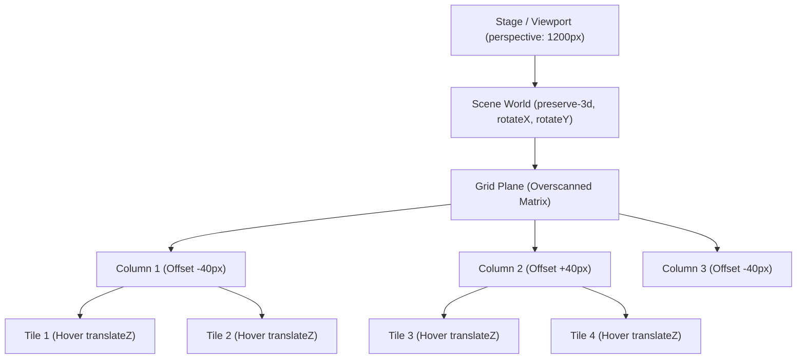

# 090: CSS 3D Image Wall & Spatial Gallery Architecture Masterclass

## Overview & Executive Summary

In contemporary spatial interface design, flat two-dimensional image grids often fail to convey depth, immersion, and architectural scale. By extending the layout engine along the Z-axis, the **CSS 3D Image Wall** transforms standard grid content into an expansive, physics-informed, hardware-accelerated spatial environment.

A **3D Image Wall** is an architectural layout pattern where a matrix of image tiles, media cards, or interactive surfaces is projected onto a three-dimensional plane or volumetric lattice. Utilizing CSS 3D transform functions (`rotateX`, `rotateY`, `rotateZ`, `translateZ`), perspective projection matrices, and deep hierarchy stacking (`transform-style: preserve-3d`), the browser graphics pipeline renders DOM elements with realistic foreshortening, parallax displacement, dynamic specular highlights, and multi-layer cast shadows.

```
================================================================================
                    THE 3D SPATIAL PROJECTION MATRIX
================================================================================

              [ Camera / Viewport ] (perspective: 1200px)
                      │
                      │  Viewing Axis (Z)
                      ▼
             ┌─────────────────┐  <-- Vanishing Point (perspective-origin: 50% 50%)
             │   FOV Cone (θ)  │
             └────────┬────────┘
                      │
                      ▼
     ═════════════════════════════════════════════════════════  [ World Stage ]
        ╲                                                   ╱   (preserve-3d)
         ╲    ┌──────────┐      ┌──────────┐      ┌──────────┐
          ╲   │  Tile 1  │      │  Tile 2  │      │  Tile 3  │  <-- Tilted Plane
           ╲  └──────────┘      └────┬─────┘      └──────────┘      (rotateX: 24deg,
            ╲                        │ Z-Lift                       rotateY: -18deg)
             ╲                  ┌────┴─────┐  ▲
              ╲                 │ Elevated │  │ translateZ(80px)
               ╲                │ Tile     │  │
                ╲               └────┬─────┘  ▼
                 ╲                   │
                  ╲          . - ~ ~ ┴ ~ ~ - .  <-- Dynamic Substrate Cast Shadow
                   ╲        (   Multi-Layer   )
                    ╲        ` - ~ ~ ~ ~ ~ ~ '
     ═════════════════════════════════════════════════════════
================================================================================
```

When engineered correctly, a 3D Image Wall delivers tactile, cinema-grade visual fidelity while maintaining complete DOM accessibility, responsive fluid reflow, 120 FPS compositor execution, and zero layout thrashing.

---

## Quick Reference Metadata

| Attribute | Specification Details |
| :--- | :--- |
| **Name** | CSS 3D Image Wall & Spatial Gallery Architecture |
| **Category** | CSS Transforms, Perspective Projection, 3D Graphics & Spatial Layouts |
| **Specification** | [W3C CSS Transforms Module Level 2](https://www.w3.org/TR/css-transforms-2/), [CSS Box Alignment Module Level 3](https://www.w3.org/TR/css-align-3/) |
| **Difficulty** | Advanced (4.5 / 5) |
| **What it produces** | Immersive 3D gallery walls, isometric media matrices, curved polyhedral carousels, and volumetric depth-of-field image grids with interactive hover lifts and real-time lighting simulation. |
| **Why it works** | The browser applies a $4\times4$ projective transformation matrix to the element's local coordinate system, maintaining a unified 3D rendering context across ancestral DOM trees via `transform-style: preserve-3d`. |
| **Key Properties** | `perspective`, `perspective-origin`, `transform-style`, `transform`, `translate3d`, `rotate3d`, `backface-visibility`, `will-change`, `box-shadow`, `backdrop-filter`. |
| **Strict Constraints** | Avoid intermediate containers with `overflow: hidden`, `opacity < 1`, `filter`, or `clip-path` between the perspective root and 3D children (these trigger 3D context flattening); maintain high-contrast focus rings for accessibility. |
| **Browser Baseline** | Baseline 2020+ across all modern rendering engines (Chromium 88+, Safari 14+, Firefox 85+, Edge 88+) for full hardware-accelerated 3D transforms, sub-pixel matrix interpolation, and composite shadows. |
| **Acceptance Criteria** | 120 FPS GPU compositor execution; zero main-thread layout recalculations; complete `:focus-visible` keyboard accessibility; graceful 2D degradation under `@media (prefers-reduced-motion: reduce)`. |

### Quick Preview

```html
<div class="stage-3d">
  <div class="wall-grid">
    <article class="wall-item" tabindex="0">
      
      <div class="sheen"></div>
    </article>
    <article class="wall-item" tabindex="0">
      
      <div class="sheen"></div>
    </article>
    <article class="wall-item" tabindex="0">
      
      <div class="sheen"></div>
    </article>
    <article class="wall-item" tabindex="0">
      
      <div class="sheen"></div>
    </article>
  </div>
</div>
```

```css
:root {
  --wall-rot-x: 18deg;
  --wall-rot-y: -14deg;
  --wall-rot-z: 4deg;
  --card-lift-z: 70px;
  --ease-elastic: cubic-bezier(0.16, 1, 0.3, 1);
}

.stage-3d {
  position: relative;
  inline-size: 100%;
  min-block-size: 500px;
  perspective: 1200px;
  perspective-origin: 50% 50%;
  overflow: hidden;
  display: grid;
  place-items: center;
  background: radial-gradient(circle at center, #1e293b 0%, #0f172a 100%);
}

.wall-grid {
  display: grid;
  grid-template-columns: repeat(2, 220px);
  gap: 24px;
  transform-style: preserve-3d;
  transform: rotateX(var(--wall-rot-x)) rotateY(var(--wall-rot-y)) rotateZ(var(--wall-rot-z));
  transition: transform 600ms var(--ease-elastic);
  will-change: transform;
}

.wall-item {
  position: relative;
  aspect-ratio: 4 / 5;
  border-radius: 16px;
  overflow: hidden;
  cursor: pointer;
  outline: none;
  transform-style: preserve-3d;
  transform: translateZ(0px);
  box-shadow: 0 10px 25px -5px rgba(0, 0, 0, 0.5);
  transition: transform 350ms var(--ease-elastic), box-shadow 350ms var(--ease-elastic);
  will-change: transform;
}

.wall-item img {
  inline-size: 100%;
  block-size: 100%;
  object-fit: cover;
  display: block;
}

.wall-item .sheen {
  position: absolute;
  inset: 0;
  background: linear-gradient(135deg, rgba(255, 255, 255, 0.25) 0%, transparent 60%);
  opacity: 0.3;
  pointer-events: none;
  transition: opacity 350ms ease;
}

.wall-item:hover,
.wall-item:focus-visible {
  transform: translateZ(var(--card-lift-z)) scale(1.04);
  box-shadow: 
    0 35px 50px -15px rgba(0, 0, 0, 0.7),
    0 0 0 2px rgba(255, 255, 255, 0.4);
}

.wall-item:hover .sheen,
.wall-item:focus-visible .sheen {
  opacity: 0.8;
}
```

---

## 1. Mathematical & Spatial Foundations of 3D Perspective

### 1.1 The Perspective Projection Model

The transformation of 3D virtual coordinates into a 2D raster display is governed by **pinhole camera perspective projection**.

```
                           Viewing Frustum (Pyramid)
                             
        Eye / Camera (E)
             •
            /|\
           / | \
          /  |  \
         /   |   \  Distance d (perspective: d)
        /    |    \
       ┌─────┴─────┐  <-- Projection Plane (Screen / Viewport)
      /│  Z = 0    │\
     / │           │ \
    /  └───────────┘  \
   /                   \
  ┌─────────────────────┐ <-- Object Plane at depth Z (Z > 0: closer, Z < 0: farther)
  │      OBJECT         │
  └─────────────────────┘
```

When an element has coordinates $(X, Y, Z)$ in 3D world space, its projected 2D screen coordinates $(X', Y')$ relative to a perspective distance $d$ are computed as:

$$X' = \frac{X \cdot d}{d - Z}, \qquad Y' = \frac{Y \cdot d}{d - Z}$$

The scaling factor $S(Z)$ applied to the visual geometry is:

$$S(Z) = \frac{d}{d - Z}$$

- **When $Z = 0$**: The element sits on the projection plane ($S = 1$, natural $1:1$ scale).
- **When $Z > 0$ (Approaching Camera)**: $d - Z < d$, causing $S(Z) > 1$. The element expands visually and gains spatial prominence.
- **When $Z < 0$ (Receding into Distance)**: $d - Z > d$, causing $S(Z) < 1$. The element shrinks toward the vanishing point.
- **Singularity Limit ($Z \to d$)**: The object reaches the focal point of the lens, expanding asymptotically to infinity.

The visual Field of View (FOV) angle $\theta$ across a viewport of width $W$ is given by:

$$\theta = 2 \arctan\left(\frac{W}{2d}\right)$$

```
+-------------------+--------------------+------------------------+---------------------------------------+
| Perspective Depth | Effective FOV (θ)  | Optical Character      | Recommended Application               |
+-------------------+--------------------+------------------------+---------------------------------------+
| 300px - 500px     | 80° - 110° (Wide)  | Dramatic, ultra-deep   | Immersive hero walls, dynamic gaming  |
| 800px - 1200px    | 50° - 65° (Normal) | Natural human eye view | Standard 3D galleries, card grids     |
| 1800px - 3000px   | 20° - 35° (Tele)   | Subtle isometric plane | Enterprise UI, architectural diagrams |
+-------------------+--------------------+------------------------+---------------------------------------+
```

---

### 1.2 Coordinate System & Non-Commutative 3D Matrix Mathematics

CSS 3D space uses a **right-handed Cartesian coordinate system**:
- **$+X$ Axis**: Horizontal, pointing **right**.
- **$+Y$ Axis**: Vertical, pointing **downward**.
- **$+Z$ Axis**: Perpendicular to the screen, pointing **outward toward the viewer**.

```
                    -Y (Up)
                     │
                     │
                     │
                     └───────────── +X (Right)
                    ╱
                   ╱
                  ╱
                +Z (Toward Viewer)
```

In CSS, 3D affine transformations are calculated using $4\times4$ homogeneous transformation matrices:

$$\mathbf{M} = \begin{bmatrix}
m_{11} & m_{12} & m_{13} & m_{14} \\
m_{21} & m_{22} & m_{23} & m_{24} \\
m_{31} & m_{32} & m_{33} & m_{34} \\
m_{41} & m_{42} & m_{43} & m_{44}
\end{bmatrix}$$

Because matrix multiplication is **strictly non-commutative** ($\mathbf{A} \times \mathbf{B} \neq \mathbf{B} \times \mathbf{A}$), the sequence of chained transform operations dictates the spatial outcome:

```
/* Sequence A: Rotate around World Axes, then elevate along local Z */
transform: rotateX(20deg) rotateY(-15deg) translateZ(60px);

/* Sequence B: Elevate along World Z, then rotate around World Origin */
transform: translateZ(60px) rotateX(20deg) rotateY(-15deg);
```

In **Sequence A**, the element rotates its own local coordinate system first, so `translateZ(60px)` pushes the card outward along its tilted surface normal vector—creating a realistic perpendicular pop-out.

---

### 1.3 The 3D Rendering Context & Context Flattening Hierarchy

By default, modern browsers flatten 3D transformed elements into their parent's 2D plane. To create a continuous 3D coordinate space spanning ancestors and children, the container must explicitly declare:

```css
transform-style: preserve-3d;
```

#### The Grouping Property Hazard (3D Context Breaking)

Certain CSS properties establish a "grouping context" or off-screen raster buffer that **destroys** the shared 3D space, forcing all 3D children to be flattened into a 2D texture:

```
┌─────────────────────────────────────────────────────────────────────────────┐
│                          3D CONTEXT FLATTENING TRIGGERS                     │
├────────────────────────────────┬────────────────────────────────────────────┤
│ Property                       │ Flattening Condition                       │
├────────────────────────────────┼────────────────────────────────────────────┤
│ `overflow`                     │ Any value other than `visible`             │
│ `opacity`                      │ Any value strictly `< 1.0`                 │
│ `filter`                       │ Any active filter (`blur`, `drop-shadow`)  │
│ `clip-path`                    │ Any active clipping path                   │
│ `mask` / `mask-image`          │ Any active mask                            │
│ `mix-blend-mode`               │ Any value other than `normal`              │
│ `contain`                      │ Values including `paint`, `layout`, `strict`│
│ `isolation`                    │ `isolation: isolate`                       │
│ `backdrop-filter`              │ Any active backdrop filter                 │
└────────────────────────────────┴────────────────────────────────────────────┘
```

```
[ PERSPECTIVE STAGE ] (perspective: 1000px)
        │
        ▼
[ WORLD WRAPPER ] (transform-style: preserve-3d)
        │
   ┌────┴─────────────────────────────┐
   │ ⚠️ WRONG: Intermediate element   │ ---> [ FLATTENED 2D LAYER ]
   │    has `overflow: hidden` or     │      (All 3D depth, inter-layer
   │    `opacity: 0.99`               │       occlusion & shadows destroyed)
   └──────────────────────────────────┘
```

> [!IMPORTANT]
> Never place `overflow: hidden`, `opacity < 1`, `filter`, or `clip-path` directly on an element that needs to preserve its 3D rendering context for nested descendants. Apply `overflow: hidden` strictly at the outermost perspective root container.

---

## 2. Architectural Anatomy of a 3D Image Wall

### 2.1 The 4-Tier Hierarchical DOM Architecture

A production-grade 3D Image Wall separates responsibilities into four distinct architectural layers:

```
┌────────────────────────────────────────────────────────────────────────┐
│ 1. PERSPECTIVE VIEWPORT (The Camera)                                   │
│    - Defines focal length (`perspective: 1200px`)                      │
│    - Defines vanishing point (`perspective-origin: 50% 50%`)           │
│    - Clips outer overflow (`overflow: hidden`)                         │
├────────────────────────────────────────────────────────────────────────┤
│ 2. SCENE PIVOT / WORLD (The Rig)                                       │
│    - Maintains 3D matrix (`transform-style: preserve-3d`)              │
│    - Holds macro scene rotations (`rotateX`, `rotateY`, `rotateZ`)     │
│    - Handles global scene panning & zooming                            │
├────────────────────────────────────────────────────────────────────────┤
│ 3. WALL MATRIX / GRID PLANE (The Substrate)                            │
│    - CSS Grid / Flexbox arrangement of columns and rows                │
│    - Overscanned dimensions (140% - 180% of viewport) to fill corners  │
│    - Alternating column parallax offsets                               │
├────────────────────────────────────────────────────────────────────────┤
│ 4. IMAGE CARDS / TILES (The Surfaces)                                  │
│    - Per-tile 3D coordinate space (`transform-style: preserve-3d`)     │
│    - Local hover/focus lift (`translateZ(80px)`)                       │
│    - Multi-tier dynamic shadows & specular sheen reflection            │
└────────────────────────────────────────────────────────────────────────┘
```



---

### 2.2 Grid Sizing, Aspect Ratios & Over-scanned Dimensions

When a 2D plane is rotated in 3D space around the X and Y axes, its bounding geometry foreshortens, exposing the background at the corners of the viewport:

```
┌──────────────────────────────────────────────┐
│ Viewport Boundary (Window)                   │
│                                              │
│        ╱▔▔▔▔▔▔▔▔▔▔▔▔▔▔▔▔▔▔▔▔▔▔▔▔▔▔▔╲         │
│       ╱                             ╲ <─────┼── Uncovered Empty Corner
│      ╱      ROTATED 3D WALL          ╲       │
│     ╱                                 ╲      │
│    ╱                                   ╲     │
│    ╲                                   ╱     │
│     ╲                                 ╱      │
│      ╲                               ╱       │
│       ╲                             ╱        │
│        ╲___________________________╱         │
│                                              │
└──────────────────────────────────────────────┘
```

To guarantee that the 3D wall seamlessly spans the entire viewport without exposed edges, the Wall Matrix Plane must be **overscanned** using viewport-relative scaling multipliers:

```css
.wall-plane {
  /* Overscan dimensions: 140% to 180% of viewport size */
  inline-size: max(140vw, 1400px);
  block-size: max(140vh, 1000px);
  
  /* Centered within the viewport stage */
  position: absolute;
  inset-inline-start: 50%;
  inset-block-start: 50%;
  transform: translate(-50%, -50%) rotateX(var(--rot-x)) rotateY(var(--rot-y)) rotateZ(var(--rot-z));
}
```

---

### 2.3 Staggered Column Architecture (Organic Visual Rhythm)

Uniform rectangular grids can feel rigid and artificial in 3D. By shifting alternating columns vertically along the Y-axis, the wall gains an organic, architectural rhythm that accentuates 3D perspective lines:

```css
/* Column Staggering */
.wall-column:nth-child(even) {
  transform: translateY(60px);
}

.wall-column:nth-child(3n) {
  transform: translateY(-40px);
}
```

---

## 3. Core Implementation Variations & Architecture Patterns

### 3.1 Variation A: The Isometric / Angled Perspective Wall

The **Isometric / Angled Wall** tilts a vast grid along both the X and Z axes, creating a grand panoramic vista where images recede into a dramatic vanishing horizon.

```
================================================================================
           VARIATION A: ISOMETRIC / ANGLED PERSPECTIVE WALL
================================================================================

              Vanishing Horizon Line
          - - - - - - - - - - - - - - - - - - - - - - -
               ╱       ╱       │       ╲       ╲
              ╱       ╱        │        ╲       ╲
             ╱       ╱         │         ╲       ╲
            ┌───────┐ ┌───────┐ ┌───────┐ ┌───────┐
            │ Col 1 │ │ Col 2 │ │ Col 3 │ │ Col 4 │  <-- Distant Row (Smaller)
            └───────┘ └───────┘ └───────┘ └───────┘
           ╱       ╱         │         ╲       ╲
          ┌─────────┐ ┌─────────┐ ┌─────────┐ ┌─────────┐
          │         │ │ Elevated│ │         │ │         │  <-- Mid Row
          │         │ │ [Lift]  │ │         │ │         │
          └─────────┘ └─────────┘ └─────────┘ └─────────┘
         ╱       ╱         │         ╲       ╲
        ┌───────────┐ ┌───────────┐ ┌───────────┐ ┌───────────┐
        │           │ │           │ │           │ │           │  <-- Near Row
        │           │ │           │ │           │ │           │      (Dominant)
        └───────────┘ └───────────┘ └───────────┘ └───────────┘
================================================================================
```

#### HTML Architecture

```html
<section class="isometric-stage" aria-label="3D Isometric Image Gallery">
  <div class="isometric-world">
    <div class="isometric-grid">
      <!-- Column 1 -->
      <div class="iso-col">
        <figure class="iso-card" tabindex="0">
          
          <div class="iso-sheen"></div>
          <figcaption class="iso-caption">Chromatic Drift</figcaption>
        </figure>
        <figure class="iso-card" tabindex="0">
          
          <div class="iso-sheen"></div>
          <figcaption class="iso-caption">Fluid Dynamics</figcaption>
        </figure>
      </div>

      <!-- Column 2 (Offset) -->
      <div class="iso-col iso-col--offset">
        <figure class="iso-card" tabindex="0">
          
          <div class="iso-sheen"></div>
          <figcaption class="iso-caption">Neon Synthesis</figcaption>
        </figure>
        <figure class="iso-card" tabindex="0">
          
          <div class="iso-sheen"></div>
          <figcaption class="iso-caption">Surreal Echo</figcaption>
        </figure>
      </div>

      <!-- Column 3 -->
      <div class="iso-col">
        <figure class="iso-card" tabindex="0">
          
          <div class="iso-sheen"></div>
          <figcaption class="iso-caption">Brutalist Form</figcaption>
        </figure>
        <figure class="iso-card" tabindex="0">
          
          <div class="iso-sheen"></div>
          <figcaption class="iso-caption">Silicon Core</figcaption>
        </figure>
      </div>
    </div>
  </div>
</section>
```

#### CSS Implementation

```css
.isometric-stage {
  position: relative;
  inline-size: 100%;
  min-block-size: 700px;
  perspective: 1400px;
  perspective-origin: 60% 40%;
  overflow: hidden;
  background: radial-gradient(circle at 70% 30%, #1e1e38 0%, #0a0a14 100%);
  display: grid;
  place-items: center;
}

.isometric-world {
  transform-style: preserve-3d;
  transform: rotateX(28deg) rotateY(-22deg) rotateZ(6deg);
  transition: transform 800ms cubic-bezier(0.16, 1, 0.3, 1);
  will-change: transform;
}

.isometric-grid {
  display: flex;
  gap: 28px;
  transform-style: preserve-3d;
  padding: 40px;
}

.iso-col {
  display: flex;
  flex-direction: column;
  gap: 28px;
  transform-style: preserve-3d;
}

.iso-col--offset {
  transform: translateY(60px);
}

.iso-card {
  position: relative;
  inline-size: 240px;
  aspect-ratio: 3 / 4;
  margin: 0;
  border-radius: 20px;
  overflow: hidden;
  background: #181828;
  cursor: pointer;
  outline: none;
  transform-style: preserve-3d;
  transform: translateZ(0px);
  
  /* Baseline Resting Shadow */
  box-shadow: 
    0 10px 20px -5px rgba(0, 0, 0, 0.4),
    0 4px 6px -2px rgba(0, 0, 0, 0.2);

  transition: 
    transform 400ms cubic-bezier(0.16, 1, 0.3, 1),
    box-shadow 400ms cubic-bezier(0.16, 1, 0.3, 1);
  
  will-change: transform;
}

.iso-card img {
  inline-size: 100%;
  block-size: 100%;
  object-fit: cover;
  display: block;
  transition: transform 500ms ease, filter 500ms ease;
  filter: brightness(0.92) contrast(1.05);
}

.iso-sheen {
  position: absolute;
  inset: 0;
  background: linear-gradient(
    125deg,
    rgba(255, 255, 255, 0.4) 0%,
    rgba(255, 255, 255, 0.05) 40%,
    transparent 70%
  );
  opacity: 0.2;
  pointer-events: none;
  transition: opacity 400ms ease;
}

.iso-caption {
  position: absolute;
  inset-inline: 0;
  inset-block-end: 0;
  padding: 16px;
  background: linear-gradient(to top, rgba(10, 10, 20, 0.9) 0%, transparent 100%);
  color: #f8fafc;
  font-family: system-ui, -apple-system, sans-serif;
  font-size: 0.9rem;
  font-weight: 600;
  letter-spacing: 0.02em;
  transform: translateY(100%);
  transition: transform 350ms cubic-bezier(0.16, 1, 0.3, 1);
}

/* Elevated Hover & Focus State */
.iso-card:hover,
.iso-card:focus-visible {
  transform: translateZ(90px) scale(1.03);
  box-shadow: 
    0 40px 60px -15px rgba(0, 0, 0, 0.8),
    0 20px 30px -10px rgba(99, 102, 241, 0.3),
    0 0 0 2px rgba(255, 255, 255, 0.6);
  z-index: 10;
}

.iso-card:hover img,
.iso-card:focus-visible img {
  filter: brightness(1.05) contrast(1.1);
  transform: scale(1.05);
}

.iso-card:hover .iso-sheen,
.iso-card:focus-visible .sheen {
  opacity: 0.75;
}

.iso-card:hover .iso-caption,
.iso-card:focus-visible .iso-caption {
  transform: translateY(0);
}
```

---

### 3.2 Variation B: The Cylindrical / Curved Polyhedral Gallery Wall

Instead of a flat plane, **Variation B** maps $N$ image tiles onto a circular cylinder rotating around the Y-axis. Every card faces inward toward the viewer or outward into the room.

```
================================================================================
          VARIATION B: CYLINDRICAL POLYHEDRAL 3D GALLERY
================================================================================

                              [ Top-Down Polar View ]
                                      
                                     Card 1
                                    ┌──────┐
                                   ╱        ╲
                           Card 8 ┌┘        └┐ Card 2
                                 ╱            ╲
                                │      ●       │ Radius R
                                 ╲   Center   ╱
                           Card 7 └┐        ┌┘ Card 3
                                   ╲        ╱
                                    └──────┘
                                     Card 4
                                       ▲
                                       │
                                [ Camera Lens ]
================================================================================
```

#### Trigonometric Geometry Formulation

For a regular polyhedral cylinder with $N$ panels, each panel having width $W$:
1. The interior central angle per facet $\Delta \theta$ is:
   $$\Delta \theta = \frac{360^\circ}{N}$$
2. The exact radial apothem distance $R$ from the central origin along the Z-axis is:
   $$R = \frac{W}{2 \cdot \tan\left(\frac{\pi}{N}\right)}$$

For $N = 8$ panels with card width $W = 260\text{px}$:
$$\Delta \theta = 45^\circ, \qquad R = \frac{260}{2 \cdot \tan(22.5^\circ)} = \frac{130}{0.4142} \approx 313.85\text{px}$$

#### HTML Architecture

```html
<div class="cylinder-stage">
  <div class="cylinder-carousel" style="--total-panels: 8; --radius: 314px;">
    <article class="cylinder-card" style="--i: 0;">
      
      <span class="panel-index">01</span>
    </article>
    <article class="cylinder-card" style="--i: 1;">
      
      <span class="panel-index">02</span>
    </article>
    <article class="cylinder-card" style="--i: 2;">
      
      <span class="panel-index">03</span>
    </article>
    <article class="cylinder-card" style="--i: 3;">
      
      <span class="panel-index">04</span>
    </article>
    <article class="cylinder-card" style="--i: 4;">
      
      <span class="panel-index">05</span>
    </article>
    <article class="cylinder-card" style="--i: 5;">
      
      <span class="panel-index">06</span>
    </article>
    <article class="cylinder-card" style="--i: 6;">
      
      <span class="panel-index">07</span>
    </article>
    <article class="cylinder-card" style="--i: 7;">
      
      <span class="panel-index">08</span>
    </article>
  </div>
</div>
```

#### CSS Implementation

```css
.cylinder-stage {
  inline-size: 100%;
  min-block-size: 600px;
  perspective: 1100px;
  perspective-origin: 50% 50%;
  overflow: hidden;
  display: grid;
  place-items: center;
  background: #030712;
}

.cylinder-carousel {
  position: relative;
  inline-size: 260px;
  aspect-ratio: 3 / 4;
  transform-style: preserve-3d;
  animation: rotateCylinder 28s linear infinite;
  will-change: transform;
}

.cylinder-carousel:hover {
  animation-play-state: paused;
}

@keyframes rotateCylinder {
  from {
    transform: rotateY(0deg);
  }
  to {
    transform: rotateY(360deg);
  }
}

.cylinder-card {
  position: absolute;
  inset: 0;
  border-radius: 16px;
  overflow: hidden;
  background: #1f2937;
  cursor: pointer;
  backface-visibility: hidden;
  
  /* Cylindrical Mapping: Rotate by (i * 45deg) then translate outward by radius R */
  transform: rotateY(calc(var(--i) * (360deg / var(--total-panels)))) translateZ(var(--radius));
  transition: transform 400ms cubic-bezier(0.16, 1, 0.3, 1), box-shadow 400ms ease;
  box-shadow: 0 10px 30px rgba(0, 0, 0, 0.6);
}

.cylinder-card img {
  inline-size: 100%;
  block-size: 100%;
  object-fit: cover;
  display: block;
}

.panel-index {
  position: absolute;
  inset-block-start: 12px;
  inset-inline-start: 12px;
  background: rgba(0, 0, 0, 0.6);
  backdrop-filter: blur(8px);
  color: #ffffff;
  font-size: 0.75rem;
  font-weight: 700;
  padding: 4px 8px;
  border-radius: 6px;
  border: 1px solid rgba(255, 255, 255, 0.15);
}

/* Card Interaction */
.cylinder-card:hover {
  transform: 
    rotateY(calc(var(--i) * (360deg / var(--total-panels)))) 
    translateZ(calc(var(--radius) + 40px)) 
    scale(1.08);
  box-shadow: 0 25px 50px rgba(99, 102, 241, 0.4);
}
```

---

### 3.3 Variation C: The Multi-Layer Volumetric Floating Gallery

In **Variation C**, elements inhabit multiple discrete depth planes along the Z-axis ($Z_0, Z_{-200}, Z_{-400}$), creating an infinite volumetric tunnel with realistic atmospheric depth-of-field blur.

```
================================================================================
           VARIATION C: VOLUMETRIC MULTI-PLANE DEPTH GALLERY
================================================================================

    [ Plane 3: Far Background ]    Z = -500px, Blur = 6px, Scale = 0.65
    ┌──────────┐      ┌──────────┐      ┌──────────┐
    │ Far Card │      │ Far Card │      │ Far Card │
    └──────────┘      └──────────┘      └──────────┘

         [ Plane 2: Midground ]    Z = -250px, Blur = 2px, Scale = 0.82
         ┌───────────┐      ┌───────────┐
         │ Mid Card  │      │ Mid Card  │
         └───────────┘      └───────────┘

              [ Plane 1: Focal Foreground ]    Z = 0px, Blur = 0px, Scale = 1.0
              ┌─────────────┐      ┌─────────────┐
              │ Focal Hero  │      │ Focal Hero  │
              └─────────────┘      └─────────────┘
================================================================================
```

#### CSS Implementation

```css
.volumetric-stage {
  perspective: 1000px;
  min-block-size: 650px;
  position: relative;
  overflow: hidden;
  display: grid;
  place-items: center;
  background: #09090b;
}

.volumetric-plane {
  position: absolute;
  display: flex;
  gap: 32px;
  transform-style: preserve-3d;
  transition: transform 600ms cubic-bezier(0.16, 1, 0.3, 1), filter 600ms ease;
}

/* Depth Tiers */
.plane--foreground {
  transform: translateZ(0px);
  filter: blur(0px) brightness(1);
  z-index: 3;
}

.plane--midground {
  transform: translateZ(-250px);
  filter: blur(2px) brightness(0.75);
  z-index: 2;
}

.plane--background {
  transform: translateZ(-500px);
  filter: blur(6px) brightness(0.5);
  z-index: 1;
}

/* Plane Hover Activation: Focus shifted onto hovered plane */
.volumetric-plane:hover {
  filter: blur(0px) brightness(1);
}
```

---

### 3.4 Variation D: Interactive Gyroscopic / Pointer-Tracking 3D Wall

By bridging pointer coordinates through CSS Custom Properties (`--mouse-x`, `--mouse-y`), the 3D wall dynamically responds to cursor movement across the viewport, rendering real-time parallax tilt.

```
================================================================================
         VARIATION D: POINTER TRACKING INTERACTIVE MATRIX
================================================================================

   Cursor Position: (-0.6, +0.4)
            │
            ▼
   ┌─────────────────────────────────────────────────────────┐
   │ CSS Variables Calculated:                               │
   │   --rot-x: calc(var(--mouse-y) * -20deg)  ->  -8.0deg   │
   │   --rot-y: calc(var(--mouse-x) * 25deg)   -> -15.0deg   │
   └─────────────────────────────────────────────────────────┘
            │
            ▼
   [ Hardware Compositor smoothly interpolates 3D matrix ]
```

#### CSS Custom Property Engine

```css
.interactive-stage {
  --mouse-x: 0;
  --mouse-y: 0;
  perspective: 1200px;
  overflow: hidden;
  min-block-size: 600px;
  display: grid;
  place-items: center;
}

.interactive-wall {
  transform-style: preserve-3d;
  transform: 
    rotateX(calc(15deg + (var(--mouse-y) * -20deg))) 
    rotateY(calc(-10deg + (var(--mouse-x) * 25deg)))
    rotateZ(2deg);
  transition: transform 120ms ease-out;
  will-change: transform;
}
```

#### Minimal Progressive Enhancement Tracking Script

```javascript
const stage = document.querySelector('.interactive-stage');

if (stage && window.matchMedia('(hover: hover) and (pointer: fine)').matches) {
  let rafId = null;

  stage.addEventListener('pointermove', (e) => {
    if (rafId) cancelAnimationFrame(rafId);

    rafId = requestAnimationFrame(() => {
      const rect = stage.getBoundingClientRect();
      // Normalize cursor coordinates from -1.0 to +1.0 relative to stage center
      const nx = ((e.clientX - rect.left) / rect.width) * 2 - 1;
      const ny = ((e.clientY - rect.top) / rect.height) * 2 - 1;

      stage.style.setProperty('--mouse-x', nx.toFixed(4));
      stage.style.setProperty('--mouse-y', ny.toFixed(4));
    });
  });

  stage.addEventListener('pointerleave', () => {
    stage.style.setProperty('--mouse-x', '0');
    stage.style.setProperty('--mouse-y', '0');
  });
}
```

---

## 4. Optical Realism: Lighting, Shadows & Material Physics

### 4.1 Simulating Atmospheric Depth & Distance Fog

In physical reality, atmospheric particles scatter light, causing distant objects to exhibit reduced contrast, lowered luminance, and soft chromatic shifts toward the background color.

```
       Key Light Source
              \
               \
                ▼
      ┌──────────────────┐  <-- Foreground (Full contrast, 100% brightness)
      │  Foreground Card │
      └──────────────────┘
                │
                │ Distance Fog Gradient
                ▼
      ┌──────────────────┐  <-- Midground (Contrast 90%, Brightness 80%)
      │  Midground Card  │
      └──────────────────┘
                │
                ▼
      ┌──────────────────┐  <-- Background (Contrast 70%, Brightness 60%, Blurred)
      │  Background Card │
      └──────────────────┘
```

```css
/* Atmospheric Distance Overlay */
.stage-3d::after {
  content: "";
  position: absolute;
  inset: 0;
  background: radial-gradient(
    circle at 50% 50%,
    transparent 30%,
    rgba(15, 23, 42, 0.4) 70%,
    rgba(15, 23, 42, 0.95) 100%
  );
  pointer-events: none;
  z-index: 20;
}
```

---

### 4.2 Multi-Tier Contact & Cast Shadows in 3D Space

Single-layer shadows appear synthetic because real-world shadows comprise an opaque **umbra** (contact occlusion) and a diffuse, expanding **penumbra**:

$$\text{box-shadow} = \underbrace{(0\ 2\text{px}\ 4\text{px}\ \text{rgba}(0,0,0,0.4))}_{\text{Umbra (Contact)}} + \underbrace{(0\ 20\text{px}\ 40\text{px}\ -10\text{px}\ \text{rgba}(0,0,0,0.6))}_{\text{Penumbra (Diffuse Key Light)}} + \underbrace{(0\ 0\ 0\ 1\text{px}\ \text{rgba}(255,255,255,0.1))}_{\text{Rim Light Highlight}}$$

```css
.wall-card {
  /* Resting State Multi-Layer Shadow */
  box-shadow: 
    0 4px 6px -1px rgba(0, 0, 0, 0.3),
    0 10px 15px -3px rgba(0, 0, 0, 0.2),
    0 0 0 1px rgba(255, 255, 255, 0.08);
}

.wall-card:hover {
  /* Elevated State Multi-Layer Shadow */
  box-shadow: 
    0 8px 12px -2px rgba(0, 0, 0, 0.3),
    0 25px 35px -5px rgba(0, 0, 0, 0.5),
    0 45px 65px -10px rgba(0, 0, 0, 0.7),
    0 0 0 1px rgba(255, 255, 255, 0.4);
}
```

---

### 4.3 Dynamic Specular Sheen & Fresnel Reflection

Polished glass, plastic, and photographic surfaces exhibit **Fresnel reflectance**: reflections intensify at grazing viewing angles. We simulate this using an interactive gradient sheen overlay that increases in opacity as the card rotates or lifts:

```css
.card-sheen {
  position: absolute;
  inset: 0;
  background: linear-gradient(
    115deg,
    rgba(255, 255, 255, 0.5) 0%,
    rgba(255, 255, 255, 0.1) 30%,
    transparent 65%
  );
  opacity: 0.15;
  mix-blend-mode: overlay;
  pointer-events: none;
  transition: opacity 350ms ease, transform 350ms ease;
  transform: translateZ(1px); /* Avoid Z-fighting */
}

.wall-card:hover .card-sheen {
  opacity: 0.85;
}
```

---

## 5. Complete Production Master Implementation

Below is the complete, self-contained, enterprise-grade **"Hyperion" 3D Spatial Gallery**. It incorporates the 4-tier DOM architecture, staggered masonry columns, multi-layer shadows, specular sheen glints, responsive typography, and full keyboard accessibility.

### HTML5 Architecture

```html
<!DOCTYPE html>
<html lang="en">
<head>
  <meta charset="UTF-8">
  <meta name="viewport" content="width=device-width, initial-scale=1.0">
  <title>Hyperion 3D Spatial Image Wall</title>
  <link rel="stylesheet" href="style.css">
</head>
<body>

  <main class="gallery-container">
    <header class="gallery-header">
      <span class="gallery-tag">Spatial Architecture</span>
      <h1 class="gallery-title">Hyperion 3D Image Matrix</h1>
      <p class="gallery-subtitle">A hardware-accelerated 3D perspective gallery with optical elevation and specular light scattering.</p>
    </header>

    <div class="hyperion-viewport" id="hyperionViewport">
      <div class="hyperion-stage">
        <div class="hyperion-grid">
          
          <!-- Column 1 -->
          <div class="hyperion-col">
            <article class="hyperion-card" tabindex="0">
              <div class="card-media">
                
                <div class="card-sheen"></div>
              </div>
              <div class="card-overlay">
                <span class="card-category">Abstract</span>
                <h2 class="card-heading">Quantum Drift</h2>
              </div>
            </article>

            <article class="hyperion-card" tabindex="0">
              <div class="card-media">
                
                <div class="card-sheen"></div>
              </div>
              <div class="card-overlay">
                <span class="card-category">Chromatics</span>
                <h2 class="card-heading">Solar Flare</h2>
              </div>
            </article>
          </div>

          <!-- Column 2 (Offset Down) -->
          <div class="hyperion-col hyperion-col--stagger">
            <article class="hyperion-card" tabindex="0">
              <div class="card-media">
                
                <div class="card-sheen"></div>
              </div>
              <div class="card-overlay">
                <span class="card-category">Synthesis</span>
                <h2 class="card-heading">Hyper Light</h2>
              </div>
            </article>

            <article class="hyperion-card" tabindex="0">
              <div class="card-media">
                
                <div class="card-sheen"></div>
              </div>
              <div class="card-overlay">
                <span class="card-category">Generative</span>
                <h2 class="card-heading">Prism Shift</h2>
              </div>
            </article>
          </div>

          <!-- Column 3 -->
          <div class="hyperion-col">
            <article class="hyperion-card" tabindex="0">
              <div class="card-media">
                
                <div class="card-sheen"></div>
              </div>
              <div class="card-overlay">
                <span class="card-category">Structure</span>
                <h2 class="card-heading">Monolith II</h2>
              </div>
            </article>

            <article class="hyperion-card" tabindex="0">
              <div class="card-media">
                
                <div class="card-sheen"></div>
              </div>
              <div class="card-overlay">
                <span class="card-category">Hardware</span>
                <h2 class="card-heading">Cyber Matrix</h2>
              </div>
            </article>
          </div>

          <!-- Column 4 (Offset Down) -->
          <div class="hyperion-col hyperion-col--stagger">
            <article class="hyperion-card" tabindex="0">
              <div class="card-media">
                
                <div class="card-sheen"></div>
              </div>
              <div class="card-overlay">
                <span class="card-category">Cosmos</span>
                <h2 class="card-heading">Astral Deep</h2>
              </div>
            </article>

            <article class="hyperion-card" tabindex="0">
              <div class="card-media">
                
                <div class="card-sheen"></div>
              </div>
              <div class="card-overlay">
                <span class="card-category">Urban</span>
                <h2 class="card-heading">Neo Horizon</h2>
              </div>
            </article>
          </div>

        </div>
      </div>
    </div>
  </main>

</body>
</html>
```

### CSS Design System & Layout Engine

```css
/* ==========================================================================
   1. DESIGN TOKENS & RESET
   ========================================================================== */
:root {
  --color-bg-canvas: #07090e;
  --color-bg-surface: #11141f;
  --color-text-main: #f1f5f9;
  --color-text-muted: #94a3b8;
  --color-accent: #6366f1;
  --color-accent-glow: rgba(99, 102, 241, 0.4);

  --stage-perspective: 1400px;
  --stage-rot-x: 22deg;
  --stage-rot-y: -16deg;
  --stage-rot-z: 4deg;

  --card-w: clamp(200px, 18vw, 280px);
  --card-radius: 20px;
  --card-lift-z: 85px;
  --card-lift-scale: 1.04;

  --ease-elastic: cubic-bezier(0.16, 1, 0.3, 1);
  --ease-smooth: cubic-bezier(0.4, 0, 0.2, 1);
}

*, *::before, *::after {
  box-sizing: border-box;
  margin: 0;
  padding: 0;
}

body {
  background-color: var(--color-bg-canvas);
  color: var(--color-text-main);
  font-family: system-ui, -apple-system, BlinkMacSystemFont, "Segoe UI", Roboto, sans-serif;
  min-block-size: 100vh;
  display: flex;
  flex-direction: column;
  overflow-x: hidden;
}

/* ==========================================================================
   2. GALLERY HEADER & TYPOGRAPHY
   ========================================================================== */
.gallery-container {
  display: flex;
  flex-direction: column;
  flex: 1;
}

.gallery-header {
  padding-inline: clamp(1.5rem, 5vw, 4rem);
  padding-block-start: clamp(2rem, 4vw, 3.5rem);
  padding-block-end: 1.5rem;
  z-index: 30;
  max-inline-size: 800px;
}

.gallery-tag {
  display: inline-block;
  font-size: 0.75rem;
  font-weight: 700;
  text-transform: uppercase;
  letter-spacing: 0.15em;
  color: var(--color-accent);
  margin-block-end: 0.5rem;
}

.gallery-title {
  font-size: clamp(2rem, 4vw, 3.25rem);
  font-weight: 800;
  line-height: 1.1;
  letter-spacing: -0.02em;
  background: linear-gradient(135deg, #ffffff 30%, #94a3b8 100%);
  -webkit-background-clip: text;
  -webkit-text-fill-color: transparent;
  margin-block-end: 0.75rem;
}

.gallery-subtitle {
  font-size: clamp(0.95rem, 1.5vw, 1.15rem);
  color: var(--color-text-muted);
  line-height: 1.6;
}

/* ==========================================================================
   3. 3D SPATIAL VIEWPORT & STAGE HIERARCHY
   ========================================================================== */
.hyperion-viewport {
  position: relative;
  flex: 1;
  min-block-size: 650px;
  perspective: var(--stage-perspective);
  perspective-origin: 55% 45%;
  overflow: hidden;
  display: grid;
  place-items: center;
  background: radial-gradient(circle at 60% 40%, #171c2d 0%, #07090e 85%);
}

/* Vignette Atmospheric Lighting */
.hyperion-viewport::after {
  content: "";
  position: absolute;
  inset: 0;
  background: radial-gradient(
    ellipse at center,
    transparent 40%,
    rgba(7, 9, 14, 0.6) 80%,
    rgba(7, 9, 14, 0.95) 100%
  );
  pointer-events: none;
  z-index: 25;
}

.hyperion-stage {
  position: absolute;
  transform-style: preserve-3d;
  transform: 
    rotateX(var(--stage-rot-x)) 
    rotateY(var(--stage-rot-y)) 
    rotateZ(var(--stage-rot-z));
  transition: transform 800ms var(--ease-elastic);
  will-change: transform;
}

.hyperion-grid {
  display: flex;
  gap: clamp(16px, 2.5vw, 32px);
  transform-style: preserve-3d;
  padding: 40px;
}

.hyperion-col {
  display: flex;
  flex-direction: column;
  gap: clamp(16px, 2.5vw, 32px);
  transform-style: preserve-3d;
}

.hyperion-col--stagger {
  transform: translateY(clamp(40px, 6vw, 80px));
}

/* ==========================================================================
   4. 3D CARD COMPONENTS & LIGHTING
   ========================================================================== */
.hyperion-card {
  position: relative;
  inline-size: var(--card-w);
  aspect-ratio: 3 / 4;
  background-color: var(--color-bg-surface);
  border-radius: var(--card-radius);
  overflow: hidden;
  cursor: pointer;
  outline: none;
  transform-style: preserve-3d;
  transform: translateZ(0px) scale(1);
  
  /* Baseline Multi-Tier Shadow */
  box-shadow: 
    0 10px 20px -5px rgba(0, 0, 0, 0.5),
    0 4px 6px -2px rgba(0, 0, 0, 0.3),
    0 0 0 1px rgba(255, 255, 255, 0.08);

  transition: 
    transform 400ms var(--ease-elastic),
    box-shadow 400ms var(--ease-elastic),
    border-color 400ms var(--ease-elastic);
  
  will-change: transform;
}

.card-media {
  position: relative;
  inline-size: 100%;
  block-size: 100%;
  overflow: hidden;
}

.card-media img {
  inline-size: 100%;
  block-size: 100%;
  object-fit: cover;
  display: block;
  filter: brightness(0.9) contrast(1.05);
  transition: transform 600ms var(--ease-smooth), filter 600ms var(--ease-smooth);
}

/* Specular Light Sheen */
.card-sheen {
  position: absolute;
  inset: 0;
  background: linear-gradient(
    125deg,
    rgba(255, 255, 255, 0.45) 0%,
    rgba(255, 255, 255, 0.1) 35%,
    transparent 65%
  );
  opacity: 0.2;
  mix-blend-mode: overlay;
  pointer-events: none;
  transition: opacity 400ms var(--ease-smooth);
  transform: translateZ(1px);
}

/* Card Content Overlay */
.card-overlay {
  position: absolute;
  inset-inline: 0;
  inset-block-end: 0;
  padding: 1.25rem;
  background: linear-gradient(
    to top,
    rgba(7, 9, 14, 0.95) 0%,
    rgba(7, 9, 14, 0.7) 60%,
    transparent 100%
  );
  transform: translateY(20px);
  opacity: 0.85;
  transition: transform 350ms var(--ease-elastic), opacity 350ms ease;
}

.card-category {
  font-size: 0.7rem;
  font-weight: 700;
  text-transform: uppercase;
  letter-spacing: 0.1em;
  color: var(--color-accent);
  display: block;
  margin-block-end: 0.25rem;
}

.card-heading {
  font-size: 1.1rem;
  font-weight: 700;
  color: #ffffff;
  letter-spacing: -0.01em;
}

/* ==========================================================================
   5. HOVER & FOCUS-VISIBLE INTERACTION STATES
   ========================================================================== */
.hyperion-card:hover,
.hyperion-card:focus-visible {
  transform: translateZ(var(--card-lift-z)) scale(var(--card-lift-scale));
  z-index: 20;

  /* Expanded Optical Ray Shadow & Rim Illumination */
  box-shadow: 
    0 30px 45px -10px rgba(0, 0, 0, 0.8),
    0 15px 25px -5px var(--color-accent-glow),
    0 0 0 2px rgba(255, 255, 255, 0.7);
}

.hyperion-card:hover .card-media img,
.hyperion-card:focus-visible .card-media img {
  transform: scale(1.08);
  filter: brightness(1.05) contrast(1.15);
}

.hyperion-card:hover .card-sheen,
.hyperion-card:focus-visible .card-sheen {
  opacity: 0.8;
}

.hyperion-card:hover .card-overlay,
.hyperion-card:focus-visible .card-overlay {
  transform: translateY(0);
  opacity: 1;
}

/* Accessible Focus Indicator */
.hyperion-card:focus-visible {
  outline: 3px solid var(--color-accent);
  outline-offset: 4px;
}

/* Active Pressed Compression */
.hyperion-card:active {
  transform: translateZ(calc(var(--card-lift-z) * 0.4)) scale(0.99);
  transition-duration: 100ms;
}
```

---

## 6. Performance Engineering & GPU Compositor Optimization

### 6.1 Compositor-Only Execution (Zero-Layout Pipeline)

To sustain a smooth **120 FPS** on high-refresh-rate ProMotion and gaming displays, every transformation in a 3D Image Wall must execute strictly on the GPU compositor thread without triggering layout reflows or CPU paint operations.

```
┌────────────────────────────────────────────────────────────────────────┐
│                        THE 120 FPS RENDERING PIPELINE                  │
├──────────────────┬─────────────────┬─────────────────┬─────────────────┤
│ Frame Stage      │ Main Thread CPU │ GPU Rasterizer  │ GPU Compositor  │
├──────────────────┼─────────────────┼─────────────────┼─────────────────┤
│ Bad (Top/Margin) │ Reflow (5-15ms) │ Repaint (3-8ms) │ Composite (1ms) │
│ Good (3D Matrix) │ 0ms (Skipped)   │ 0ms (Skipped)   │ Composite (1ms) │
└──────────────────┴─────────────────┴─────────────────┴─────────────────┘
```

```css
/* Optimization Directives */
.hyperion-stage,
.hyperion-card {
  will-change: transform;
  backface-visibility: hidden;
  transform: translateZ(0); /* Hardware layer promotion */
}
```

---

### 6.2 Eliminating 3D Texture Blurriness (The Downscaling Method)

A pervasive bug in CSS 3D transforms is that modern raster engines render DOM textures at their **untransformed 2D pixel size** prior to applying the 3D matrix. When an element is scaled up or brought close to the camera ($Z > 0$), the rasterizer stretches the cached 2D bitmap, causing blurry images and jagged text.

```
CASE 1: BLURRY (Render small, scale up in 3D)
  200px Box  ──[ scale(1.5) in 3D ]──> 300px on Screen (Fuzzy / Pixelated!)

CASE 2: CRISP (Render large, scale down in 3D)
  400px Box  ──[ scale(0.75) in 3D ]──> 300px on Screen (Razor Crisp Retina!)
```

#### Production Remedy

Always serve high-density `@2x` source images and configure card dimensions using explicit aspect ratios and `srcset`:

```html

```

---

### 6.3 Layer Memory Management & VRAM Conservation

Creating hundreds of independent GPU compositing layers via `will-change: transform` can rapidly consume hundreds of megabytes of video memory on mobile devices, leading to tab crashes.

- **Rule 1**: Apply `will-change: transform` strictly to visible cards within the viewport.
- **Rule 2**: Use `loading="lazy"` on image elements to defer decoding of off-screen textures.
- **Rule 3**: Limit grid density to no more than 24 simultaneous active 3D cards per viewport stage.

---

## 7. Responsive Design & Touch Device Ergonomics

### 7.1 Viewport-Aware Dynamic Perspective Scaling

On narrow mobile viewports ($< 600\text{px}$), steep 3D rotation angles can cause severe visual clipping and reduce interactive touch target sizes below WCAG minimums ($44\times44\text{px}$).

We adjust perspective depth and rotation angles progressively using CSS media and container queries:

```css
/* Responsive 3D Geometry */
@media (max-width: 768px) {
  :root {
    --stage-perspective: 900px;
    --stage-rot-x: 14deg;
    --stage-rot-y: -10deg;
    --stage-rot-z: 2deg;
    --card-lift-z: 40px;
    --card-w: 160px;
  }

  .hyperion-viewport {
    min-block-size: 480px;
  }

  .hyperion-grid {
    gap: 16px;
    padding: 20px;
  }

  .hyperion-col--stagger {
    transform: translateY(30px);
  }
}
```

---

### 7.2 Isolating Touch Devices (Preventing Sticky Hover Glitches)

On touchscreens (iOS Safari, Android Chrome), tapping a card triggers a simulated `:hover` state that remains stuck until the user taps elsewhere.

Wrap all `:hover` 3D lift transformations inside `@media (hover: hover) and (pointer: fine)`:

```css
/* True Pointer Hover (Desktop Mouse / Trackpad) */
@media (hover: hover) and (pointer: fine) {
  .hyperion-card:hover {
    transform: translateZ(var(--card-lift-z)) scale(var(--card-lift-scale));
  }
}

/* Touch Screens (Smartphones / Tablets) */
@media (hover: none) {
  .hyperion-card:active {
    transform: scale(0.97);
    transition: transform 100ms ease;
  }
}
```

---

## 8. Accessibility (a11y), WCAG 2.2 & Vestibular Motion Safety

### 8.1 Vestibular Safety (`prefers-reduced-motion`)

For users with vestibular disorders or kinetic motion sensitivity, rapid 3D spatial rotations can cause vertigo and physical disorientation.

Under `prefers-reduced-motion: reduce`, the entire 3D stage gracefully flattens into an elegant, non-rotating responsive 2D grid:

```css
@media (prefers-reduced-motion: reduce) {
  .hyperion-viewport {
    perspective: none !important;
    background: #07090e !important;
  }

  .hyperion-stage {
    transform: none !important;
    position: static !important;
    transition: none !important;
  }

  .hyperion-grid {
    display: grid !important;
    grid-template-columns: repeat(auto-fit, minmax(220px, 1fr)) !important;
    gap: 20px !important;
    padding: 24px !important;
  }

  .hyperion-col,
  .hyperion-col--stagger {
    transform: none !important;
    display: contents !important;
  }

  .hyperion-card {
    transform: none !important;
    transition: box-shadow 150ms ease, border-color 150ms ease !important;
  }

  .hyperion-card:hover,
  .hyperion-card:focus-visible {
    transform: none !important;
    box-shadow: 0 0 0 2px var(--color-accent) !important;
  }

  .card-media img {
    transform: none !important;
    filter: none !important;
  }

  .card-sheen {
    display: none !important;
  }
}
```

---

### 8.2 Keyboard Navigation & Focus Realignment

When a keyboard user tabs through a 3D wall, cards deep in the background must elevate along the Z-axis to ensure unoccluded readability:

```css
.hyperion-card:focus-visible {
  /* Elevate to highest stacking plane */
  transform: translateZ(calc(var(--card-lift-z) * 1.2)) scale(1.05);
  z-index: 100;
  outline: 3px solid #6366f1;
  outline-offset: 4px;
}
```

---

## 9. Common Pitfalls, Edge Cases & Debugging Matrix

```
+------------------------------------+-------------------------------------------+-----------------------------------------------------+
| Symptom / Bug                      | Root Cause                                | Production Remedy                                   |
+------------------------------------+-------------------------------------------+-----------------------------------------------------+
| 1. "3D Wall Flattens into a 2D Box"| An intermediate ancestor DOM node has     | Remove `overflow`, `filter`, `opacity < 1`, or      |
|    Depth disappears completely.    | `overflow: hidden`, `opacity < 1`, or     | `clip-path` from intermediate nodes; apply them     |
|                                    | `filter`, breaking the 3D context.        | strictly to the outermost perspective container.    |
+------------------------------------+-------------------------------------------+-----------------------------------------------------+
| 2. "Z-Fighting / Texture Flashing" | Multiple planes occupy identical Z coords | Add an incremental sub-pixel offset:                |
|    Rapid flicker when surfaces     | ($Z_1 = Z_2 = 0$), confusing the GPU     | `transform: translateZ(1px);` on overlays or sheen. |
|    overlap.                        | depth buffer.                             |                                                     |
+------------------------------------+-------------------------------------------+-----------------------------------------------------+
| 3. "Blurred Text & Fuzzy Images"   | GPU renders 2D raster bitmap at small     | Render cards at @2x dimensions and scale down in    |
|    Textures lose crispness in 3D.  | native size, then scales up in 3D matrix. | CSS, or add `transform: translateZ(0)`.             |
+------------------------------------+-------------------------------------------+-----------------------------------------------------+
| 4. "Hover Boundary Vibration Loop" | Card lifts away from cursor on hover,     | Wrap the card in a fixed-size anchor parent, or use |
|    Rapid stutter at bottom edge.   | losing `:hover`, dropping down, repeating.| an extended hit-area via `::before` pseudo-element. |
+------------------------------------+-------------------------------------------+-----------------------------------------------------+
| 5. "Clipped Corner Voids in Stage" | Rotated 3D plane does not overscan the    | Set grid dimensions to `max(140vw, 1400px)` and     |
|    Black empty corners exposed.    | 2D viewport bounds.                       | center with `transform: translate(-50%, -50%)`.     |
+------------------------------------+-------------------------------------------+-----------------------------------------------------+
```

### The Boundary Flicker Fix: Structural Hitbox Anchor

```css
/* Fix for hover boundary oscillation in 3D space */
.flicker-free-3d-card {
  position: relative;
  transform-style: preserve-3d;
}

/* Extended invisible bridge maintaining pointer event continuity */
.flicker-free-3d-card::before {
  content: "";
  position: absolute;
  inset: -10px;
  background: transparent;
  pointer-events: auto;
  transform: translateZ(0);
}
```

---

## 10. Master Production Engineering Checklist

Before deploying a 3D Image Wall to production, verify every requirement on this engineering scorecard:

- [ ] **1. Shared 3D Context**: `transform-style: preserve-3d` is explicitly declared on all intermediate ancestor containers between the perspective root and child cards.
- [ ] **2. No Context Breaking Properties**: No intermediate ancestor container uses `overflow: hidden`, `opacity < 1`, `filter`, `clip-path`, or `isolation: isolate`.
- [ ] **3. Overscanned Geometry**: The 3D grid plane dimensions span $140\% - 180\%$ of the viewport to eliminate clipped corner voids during 3D rotation.
- [ ] **4. Compositor-Only Threading**: All kinetic animations rely strictly on `transform` and `opacity`. Zero layout properties (`top`, `left`, `margin`, `width`, `height`) are animated.
- [ ] **5. Asymmetric Dynamics**: Card lift transitions use responsive deceleration curves (`cubic-bezier(0.16, 1, 0.3, 1)` for $300\text{ms} - 450\text{ms}$); return transitions are smooth and damped.
- [ ] **6. Multi-Layer Optical Shadows**: Shadows combine a tight contact umbra, a diffuse expanding penumbra, and a subtle specular rim border.
- [ ] **7. Specular Sheen Glints**: Interactive sheen gradients use `translateZ(1px)` to eliminate Z-fighting and GPU depth-buffer flickering.
- [ ] **8. Anti-Aliasing Stability**: `backface-visibility: hidden` and high-density `@2x` source images are used to prevent texture blurring during matrix interpolation.
- [ ] **9. Touch Isolation**: All `:hover` transforms are encapsulated inside `@media (hover: hover) and (pointer: fine)` to prevent mobile sticky hover glitches.
- [ ] **10. Responsive Perspective Scaling**: Perspective depth and rotation angles scale down gracefully on mobile screens via media queries or `clamp()`.
- [ ] **11. Keyboard Accessibility**: Cards are focusable via `tabindex="0"`, elevated automatically along the Z-axis on `:focus-visible`, and provide WCAG 2.2 compliant focus rings.
- [ ] **12. Vestibular Safety**: A complete 2D flat fallback is implemented inside `@media (prefers-reduced-motion: reduce)`, eliminating all 3D rotations.
- [ ] **13. Semantic HTML5 Structure**: Components utilize semantic `<figure>`, `<figcaption>`, `<article>`, or `<header>` elements with descriptive `alt` text for screen readers.
- [ ] **14. Memory & VRAM Conservation**: Cards utilize `loading="lazy"` and avoid excessive concurrent compositing layers on mobile viewports.
