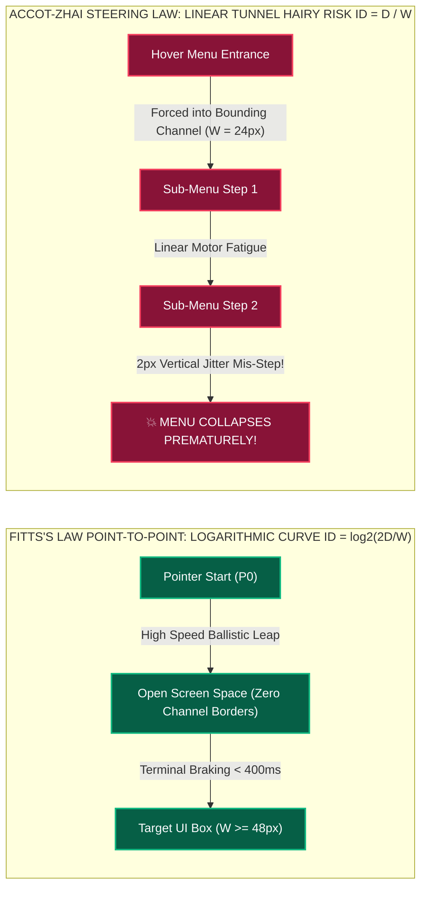

# Module 03 — Lesson 01: Ergonomics & Motor Precision: Fitts's Law Target Sizing, Hick's Law Entropy, Touch Thumb-Zones & The Motor Navigation Geometry Lab

---

## Mastery Rule
> **"Physical interactive software navigation is governed by unyielding spatial mathematics and muscular kinesiology. If a UI target requires agonizing fine-motor micro-adjustments at its terminal spatial boundary, or if choice proliferation drives decision bit-entropy beyond short-term memory span, user interaction instantly degrades from effortless instinctive flow into stressful physical labor. Engineer interactive software for minimum Index of Difficulty ($ID$), zero-error hit-box boundaries, and natural biomechanical thumb reach."**

---

## 0. PREAMBLE: Context, Prerequisites & Cognitive Frameworks

### 0.1 Prerequisites
* **Module 01 Lesson 01:** Mastery over the Norman Interaction Cycle, specifically translating intention across the **Gulf of Execution** (motor formulation and action performance).
* **Module 02 Lesson 01:** Competency in Pre-Attentive Visual Processing and oculomotor saccadic scanning; understanding that locating an element visually via peripheral feature detectors represents only step one before physical motor actuation must take place.

### 0.2 Learning Dependencies
* **Fitts's Law Mathematics ($ID = \log_2(2D / W)$):** Calculating movement amplitude versus target precision tolerance, and leveraging infinite physical hardware boundaries.
* **Hick-Hyman Law Entropy Mathematics ($RT = a + b \log_2(N + 1)$):** Quantifying human decision-making speed under variable informational choice loads.
* **Accot-Zhai Steering Law (Trajectory-Based Navigation):** Understanding the severe linear precision costs ($ID = D / W$) incurred when moving a pointer through bounded spatial channels, such as cascading hover menus and multi-level dropdown UIs.
* **Capacitive Touch Physiology & Reachology:** Steven Hoober’s mobile physical device grasp analysis and ergonomic thumb arc geometry.
* **Proactive Hit-Box Architecture:** Separating visual rendering surface area from invisible interactive touch-event padding geometry.

### 0.3 Usability & Psychological References
* **Fitts, P. M. (1954):** *The Information Capacity of the Human Motor System in Controlling the Amplitude of Movement*. Journal of Experimental Psychology, 47(6), 381-391.
* **Hick, W. E. (1952):** *On the rate of gain of information*. Quarterly Journal of Experimental Psychology, 4(1), 11-26.
* **Hyman, R. (1953):** *Stimulus information as a determinant of reaction time*. Journal of Experimental Psychology, 45(3), 188-196.
* **Accot, J., & Zhai, S. (1997):** *Beyond Fitts's Law: Models for Trajectory-Based UI Tasks*. Proceedings of ACM CHI 1997.
* **Hoober, S. (2013 / 2017):** *How Do Users Really Hold Mobile Devices?* UX Matters & *The Thumb Zone: Designing For Mobile Users*. Smashing Magazine.
* **MacKenzie, I. S. (1992):** *Fitts's Law as a research and design tool in human-computer interaction*. Human-Computer Interaction, 7(1), 91-139.
* **W3C WCAG 2.2 Accessibility Standards:** *Success Criterion 2.5.8 Target Size (Minimum)* and *2.5.5 Target Size (Enhanced)*.
* **Apple Human Interface Guidelines (HIG):** *Touch & Pointing Standards ($44\times 44\text{pt}$ hit-box dimensions)* and *visionOS Spatial Eye-Gaze + Pinch Kinematics*.
* **Google Material Design 3 Guidance:** *Touch Targets & Layout Spacing ($48\times 48\text{dp}$ touch grid with $8\text{dp}$ minimum separation gaps)*.

---

## 1. Mental Model & Operational Reality

Once a user's oculomotor vision settles upon an operational control button on screen, the computational responsibility shifts from retinal visual processing to the **Human Motor Control System**. The brain constructs a high-velocity electrical firing sequence that propels muscular actuation: rotating the wrist, extending the index finger across a touch glass screen, or pushing a physical desktop mouse device across a table surface.

Why does ergonomic interaction physics require quantitative scientific precision rather than intuitive guesswork? Because human motor actuation is inherently imperfect and characterized by mechanical tremor, neurological signal latency, and structural targeting overshoot.

```
+----------------------------------------------------------------------------------------+
|                      THE HUMAN KINETIC ACTUATION CONTROL LOOP                          |
+----------------------------------------------------------------------------------------+
|  FOVEAL TARGET LOCK (Visual Input)       NEUROMUSCULAR MOTOR SIGNAL FIRING             |
|  ~~~~~~~~~~~~~~~~~~~~~~~~~~~~~~~~~       ~~~~~~~~~~~~~~~~~~~~~~~~~~~~~~~~~             |
|  [ Eye Fixation Rests on Target UI ] --> [ Motor Cortex Propulses Arm/Thumb Musculature ]
|                                                           |                            |
|                                                           v                            |
|             +-------------------------------------------------------------+            |
|             |          THE TWO-STAGE BALLISTIC MOTOR ACTUATION            |            |
|             |   1. High-Velocity Ballistic Leap (~80% of total distance)  |            |
|             |   2. Deceleration & Visual-Feedback Micro-Adjustments       |            |
|             |      (Agonizing delay occurs here if Target Width is tiny!) |            |
|             +-------------------------------------------------------------+            |
|                                                           |                            |
|                                                           v                            |
|                          [ KINETIC TARGET CONTACT / ERROR OVERSHOOT ]                  |
+----------------------------------------------------------------------------------------+
```

When a human limb moves toward a targeted spatial coordinate, movement executes via a **Two-Stage Ballistic Actuation Model**:
1. **The Ballistic Leap:** A high-speed, uncorrected primary muscular projection that blasts across roughly 80% to 90% of the total intervening physical distance between the starting cursor position and the destination UI target.
2. **The Terminal Homing Phase (The Cognitive & Motor Hazard):** As the pointer nears the destination boundary, visual feedback loops re-engage to calculate physical overshoot or undershoot. The nervous system forces sudden deceleration, initiating excruciatingly fine neuromuscular micro-adjustments to drop the cursor tip precisely inside the bounds of the interaction button!

**If an interaction engineer shrinks button dimensions ($W$) down to miniature pixel spans, the initial ballistic leap becomes irrelevant; the user's motor processing runtime is entirely swallowed by the stressful, nerve-racking micro-adjustments of the terminal homing phase!**

### Biomechanical Input Paradigms: Pointer vs. Touch vs. Air-Gaze
Professional software architectures must execute seamlessly across three divergent physical input paradigms:
* **Indirect Precision Pointing (Mouse / Trackpad / Stylus):** High terminal precision ($1\text{px}$ aiming capability), governed by planar device friction and customizable operating system acceleration curves. Allows complex hover state indication before physical actuation occurs.
* **Direct Capacitive Touchscreen (Fingers & Thumbs):** Complete absence of physical hover previews! Features severe aiming imprecision due to the real physical dimensions of adult human fingers ($10\text{mm}$ to $14\text{mm}$ contact surface area) and optical target occlusion—where the physical mass of the operating thumb literally obstructs visual feedback of the target UI element during press activation!
* **Spatial Computing (eyeOS / Air-Pinch Gestures):** Replaces hand positioning entirely with ocular foveal fixation aiming combined with in-air thumb-to-index finger pinch gestures. Introduces severe physiological **Gaze Jitter**: because human eyeballs continuously execute microscopic stabilization movements (microsaccades), interactive target areas must be dramatically expanded to prevent unintentional triggering during resting gaze pauses!

### What This Approach Does NOT Mean (Mandatory Rule)
1. ❌ **Never assume that application viewports running inside floating desktop windowed frames retain the "infinite target size" advantage of physical hardware screen corners!** A menu bar running inside a standard floating application window requires high-precision motor braking to stop the mouse before overshooting the top frame; true infinite Fitts's Law targets exist exclusively against solid physical monitor display bezels!
2. ❌ **Never place frequent primary interactive mobile actions into the uppermost contralateral corners of large ($>6\text{-inch}$) smartphone displays!** Forcing a user operating a handheld device with a single-handed thumb grasp to stretch upward into the far upper corner strains thumb muscle ligaments and massively increases physical device drop risks!
3. ❌ **Never confuse visual design rendering geometry with invisible interactive hit-box dimensions!** A graphical status checkmark or close icon may render visually as a minimalist $16\times 16\text{px}$ graphic, but its interactive CSS or OS touchscreen hit-box must be programmatically inflated via transparent padding out to a minimum of $48\times 48\text{dp}$ ($44\times 44\text{pt}$)!

---

## 2. Core Psychological & Behavioral Mechanics

To construct software interfaces that register input commands with zero motor friction and minimal cognitive latency, an engineer must command the immutable mathematical formulas of interaction physics.

### 1. Fitts’s Law & The Index of Difficulty ($ID$)
Formulated in 1954 by Ohio State University psychophysicist Paul M. Fitts, Fitts’s Law proves that the total execution time ($MT$, Movement Time) required to navigate an operating limb or device cursor to a spatial target is a logarithmic function of the spatial distance ($D$) divided by the width ($W$) of the target measured along the exact directional vector of approach!

$$MT = a + b \cdot \log_2\left(\frac{2D}{W}\right)$$

In this unyielding equation, the logarithmic term represents the empirical **Index of Difficulty ($ID$)**, measured strictly in **Bits of Motor Information**:

$$ID = \log_2\left(\frac{2D}{W}\right) \quad [\text{bits}]$$

```
   [ THE FITTS'S LAW TARGET GEOMETRY MATHEMATICS ]

      Starting Pointer Position (P0)
             \
              \  <--------- Distance (D) --------->  +-----------------------+
               \                                     |       Target UI       |
                * =================================> |                       |
                                                     | <---- Width (W) ----> |
                                                     +-----------------------+
      * As D doubles, ID increases logarithmically (linear time cost).
      * As W shrinks toward zero, ID explodes toward infinity!
```

#### Fitts's Law Architectural Consequences:
* **The Logarithmic Advantage of Target Scaling:** Increasing a tiny $12\text{px}$ button to $24\text{px}$ provides a massive drop in motor difficulty (subtracting exactly $1.0\text{ bit}$ of operational friction from the Index of Difficulty!). However, doubling an currently generous $100\text{px}$ button out to $200\text{px}$ yields identical numerical savings ($1.0\text{ bit}$), providing diminished real-world perceptual returns. Therefore, engineering focus must remain entirely upon **eliminating microscopic target geometries (< 32px)**!
* **The "Infinite Target Width" Magic of Monitor Borders:** Consider why the Apple macOS system menu bar is persistently attached to the very top edge of the display hardware monitor, whereas classic Windows window menu bars float slightly below inside application frames:
  When a mouse pointer sweeps rapidly upward toward the macOS screen border, the physical plastic monitor bezel stops the mouse cursor dead! Regardless of how violently the user pushes their mouse device forward, the cursor cannot overshoot the hardware display edge. Mathematically, the effective target width ($W$) in the directional vector of approach **approaches infinity ($W \rightarrow \infty$)**:
  $$ID = \log_2\left(\frac{2D}{\infty}\right) = \log_2(0) \rightarrow 0 \text{ bits of difficulty!}$$
  The four physical corners and perimeter screen edges of a continuous desktop workstation represent the fastest, most effortless interactive targets in human computing!

---

### 2. Hick-Hyman Law & Decision Entropy
While Fitts's Law governs the physical kinetic movement of the hand, William E. Hick and Ray Hyman formulated the exact mathematical equations dictating **Cognitive Decision Reaction Time ($RT$)** when a human brain is confronted with multiple selectable alternatives in an interface menu or application dashboard:

$$RT = a + b \cdot \log_2(N + 1)$$

*(Where $N$ represents the total number of equally probable alternatives, and $\log_2(N + 1)$ represents the total cognitive **Decision Bit-Entropy** transmitted to short-term memory).*

```
   [ HIGH HICK'S LAW ENTROPY ]                   [ OPTIMIZED TREE ENTROPY ]
   (Flat Unordered List of 16 Options)            (Progressive Categorization)
   
   * Account Settings                             +-- ACCOUNT / SECURITY --> [ Passwords, Auth, 2FA ]
   * Audio Output Select                          |
   * Billing & Subscriptions                      +-- HARDWARE PREFERENCES -> [ Audio, Display, Input ]
   * Bluetooth Configuration                      |
   * Display & Monitor Scaling                    +-- BILLING & PLANS -----> [ Invoices, Subscriptions ]
   * Keyboard Shortcuts                           |
   ... [ 10 MORE UNGROUPED ITEMS ] ...            (Reduces scanning choices from N=16 down to N=3 per stage!)
   (High cognitive scanning load!)
```

#### Hick-Hyman Architectural Consequences:
* When an engineer designs a navigation menu containing 16 unstructured flat action items, the user's decision calculation entails evaluating $\log_2(17) \approx 4.09\text{ bits}$ of choice entropy.
* By applying progressive categorization—organizing those 16 items cleanly into 4 highly distinctive operational super-groups (e.g., *Account*, *Hardware*, *Privacy*, *Billing*)—the initial decision choice drops to just $N=4$ ($\log_2(5) \approx 2.32\text{ bits}$ of entropy), nearly cutting cognitive reaction latency in half!
* **The Exception: Alphabetic & Chronological Auto-Sorting:** When user choices consist of universally recognized ordered sequences (such as selecting a Country from an alphabetical dropdown list or a Calendar Day from a numeric matrix), Hick's Law curves flatten out from logarithmic search down toward constant-time indexing—because the human associative brain bypasses evaluating non-relevant alphabetic tiers entirely!

---

### 3. Accot-Zhai Steering Law (Trajectory Navigation Physics)
In 1997, Johnny Accot and Shai Zhai expanded Paul Fitts's point-to-point math to account for interactions where a user must move a pointer along a tightly bounded path or spatial channel—such as traversing an open OS cascading dropdown menu or steering a drawing stylus through a Bezier curve interface. This formula is universally titled the **Steering Law**:

$$ID_{\text{steering}} = \int_{0}^{D} \frac{dx}{W(x)} \approx \frac{D}{W} \quad (\text{for a channel of uniform width } W \text{ and length } D)$$

Notice the chilling mathematical reality here: **In point-to-point Fitts's Law, distance increases movement difficulty logarithmically ($\log_2(2D/W)$). But in bounded tunnel steering navigation, spatial trajectory length ($D$) scales movement difficulty LINEARLY ($D / W$)!**

```
   [ THE ACCOT-ZHAI STEERING LAW HAIRY TUNNEL HAZARD ]
   
   [ File Menu ] -> +---------------------+
                    | Open Recent Files > | =========================> +-------------------------+
                    | Save Workspace      |   (Narrow Steering Tunnel) | Project_Alpha_Final.txt |
                    | Export Profile      |                            | Project_Beta_Draft.txt  |
                    +---------------------+                            +-------------------------+
                                                |
                                                v
            [ IF MOUSE JITTERS DOWNWARD BY 2 PIXELS, THE HOVER TUNNEL EXITS AND SYSTEM COLLAPSES! ]
```

When navigating multi-level dropdown hover menus (such as classical Windows Start menus or website navigation megamenu bars), requiring a user to slide their mouse pointer horizontally across an open gap to reach an expanding submenu without accidentally crossing out of a tiny vertical vertical boundary ($W \approx 24\text{px}$) imposes extreme linear physical tension! A trivial $2\text{px}$ vertical mouse jitter during the traverse immediately cancels the hover state, slamming the submenu shut in the user's face—triggering severe interactive rage!

---

### 4. Touch Thumb-Zones & Direct Capacitive Reachology
When executing interactive design for mobile smartphones, desktop pointing equations must be radically rewritten to respect human anatomy and direct finger geometry. In his ground-breaking physical research (*How Do Users Really Hold Mobile Devices?*, analyzing over 1,300 real-world observations), accessibility researcher Steven Hoober demonstrated that **49% of smartphone operators interact with their devices exclusively using a single-handed cradle hold, executing all touch target navigation solely via the thumb of the holding hand!**

Due to the physical carpometacarpal joint rotation limits of the human thumb, smartphone screen real estate divides into three unyielding ergonomic topographical domains:

```
+-----------------------------------------------------------------------+
|                 STEVEN HOOBER'S MOBILE ERGONOMIC THUMB-ZONES          |
|                 (Single-Handed Right-Hand Touch Geometry)            |
+-----------------------------------------------------------------------+
|   +---------------------------------------------------------------+   |
|   | [ OW! / PAIN ZONE ]        [ CONTROLLATERAL STRETCH ]         |   |
|   | Top-Left & Top-Center. Requires agonizing thumb extension!    |   |
|   | High risk of dropping the mobile handset onto concrete!       |   |
|   +---------------------------------------------------------------+   |
|   |                                                               |   |
|   |                    [ THE STRETCH ZONE ]                       |   |
|   |        Mid-screen reaching arc; tolerable for occasional      |   |
|   |        exploratory taps or passive reading scrolling.         |   |
|   |                                                               |   |
|   +---------------------------------------------------------------+   |
|   |                     [ THE NATURAL THUMB-ZONE ]                |   |
|   |       Effortless lower-center & bottom-right sweeping arc!     |   |
|   |       Place ALL mission-critical Primary Action triggers here!|   |
|   +---------------------------------------------------------------+   |
|                                        \                              |
|                                         \--> [ Thumb Anchor Point ]   |
+-----------------------------------------------------------------------+
```

1. **The Natural Thumb-Zone (Effortless Arc - Lower Center):** A comfortable circular sweep originating from the base thumb joint. Zero muscular stretching required; high tactile hit-rate and instantaneous motor actuation speed.
2. **The Stretch Zone (Mid-Screen Terrain):** Requires slight joint extension and minor re-adjustments of the palm cradle hold. Acceptable for reading content feeds or engaging secondary operational options.
3. **The "Ow! / Pain Zone" (Contralateral Top Corner):** The absolute far opposite upper corner of the display (e.g., top-left corner on a $6.7\text{-inch}$ handset held in the right hand). Reaching this zone requires physical hyper-extension of the thumb ligaments or shifting the physical balance of the expensive phone in palm grip—introducing severe mechanical risk of catastrophic accidental device drop!

---

## 3. Universal Pattern Anatomy & Comparative Design System Reasoning

Let us execute our canonical **5-Step Analytical Design System Reasoning Loop** to dissect how industry design standards tackle target sizing, motor entropy, and ergonomic input translation:

### Apple Human Interface Guidelines (HIG): Touch Grid & Magnetic Trackpad Snapping
* **1. Observe:** Apple enforces an absolute immutable minimum touch interactive target dimension of **$44 \times 44\text{pt}$ (points)** across iOS and iPadOS. Furthermore, iPadOS utilizes "magnetic cursor snapping"—when an indirect trackpad cursor sweeps within a close geometric threshold of a toolbar icon, the pointer cursor dissolves and morphs directly into an illuminated highlight box enclosing the target button!
* **2. Infer:** Apple directly hacks Fitts's Law mathematics to eliminate fine motor target-hunting across touch displays and tablet external trackpad computing setups.
* **3. Explain:** By morphing the pointer cursor directly into the button hit-box the moment it crosses an external approach radius, iPadOS synthetically inflates the effective Fitts's Law target width ($W$) of the button from its physical visible size ($24\text{pt}$) up to an expansive magnetic attraction field ($56\text{pt}$), drastically crushing the Movement Time ($MT$) logarithmic curve!
* **4. Discuss:** In spatial computing (visionOS), because ocular foveal gaze replaces physical hand tracking, Apple increases minimum target sizing out to **$60 \times 60\text{pt}$**. Relying purely on eye positioning demands expansive safety margins; otherwise, involuntary human ocular eye jitter (microsaccades) triggers catastrophic button mis-selections during resting reading fixations!

### Google Material Design 3 (MD3): Touch Targets & Natural Thumb Architecture
* **1. Observe:** Material Design 3 mandates a standard **$48 \times 48\text{dp}$ (density-independent pixels)** touch target baseline, surrounded by mandatory **$8\text{dp}$ clear spatial breathing voids** separating adjacent interactive targets. Crucially, MD3 anchors core primary navigation into bottom screen real estate via the **Bottom Navigation Bar** and the signature floating **Floating Action Button (FAB)**.
* **2. Infer:** Engineered explicitly to solve Steven Hoober’s mobile single-handed thumb reachology across diverse capacitive mobile form factors.
* **3. Explain:** By positioning the FAB and bottom navigation bar squarely inside the effortless **Natural Thumb-Zone**, MD3 allows operators to execute high-frequency application transformations (such as composing a new email or switching user modules) with zero palm repositioning or thumb strain! The mandatory $8\text{dp}$ separation buffer physically prevents compound finger mis-taps when broad adult fingers press upon adjacent UI icons.
* **4. Discuss:** Deploying a gigantic $48\text{dp}$ touch target grid with $8\text{dp}$ separation gaps inside a multi-monitor desktop financial workstation or software coding IDE creates unbearable screen fragmentation, wasting thousands of display pixels on unnecessary mobile whitespace padding!

### Microsoft Fluent Design & IBM Carbon: Tabular Density & Keyboard Short-Circuiting
* **1. Observe:** Microsoft Fluent and IBM Carbon permit ultra-condensed tabular interface targets on desktop displays (allowing row height increments down to **$24\text{px}$ / $32\text{px}$**), while implementing ubiquitous keyboard focus indicators, keyboard accelerators, and sequential structural Tab traversal sequences.
* **2. Infer:** Designed specifically to eliminate mechanical hand movement fatigue for advanced technical knowledge workers executing intensive data operations across multi-window enterprise software suites.
* **3. Explain:** In high-speed DevOps cloud provisioning or accounting spreadsheet entry, the physical motor transit time required to lift a user's hand away from the physical home-row keyboard interface, grab an indirect mouse pointing device, aim at a button via Fitts's Law targeting ($MT \approx 900\text{ms}$), and return the hand back to the keys incurs catastrophic workflow destruction! Carbon and Fluent deliberately bypass pointer kinematics entirely by engineering robust **Keyboard Short-Circuit Navigation** (`Ctrl+E` search jumping, arrow-key table traversal, zero-latency execution shortcuts) that operate at subconscious motor reflex speeds ($<100\text{ms}$)!

---

## 4. Evolution & Modern HCI Architecture

Trace how physical input hardware evolution transformed target sizing mathematics across four distinct computational software eras:

```
[ COMMAND LINE & TELETYPE ERA: 1960 - 1982 ]
* Input Kinematics: Zero spatial 2D targeting (No mouse or touch pointer exists!).
* Ergonomic Model: Pure neuromuscular motor sequencing and tactile keyboard cadence. High learning curve, but unbeatable execution velocity for trained expert typists!

[ EARLY WIMP / DESKTOP GUI ERA: 1983 - 2006 ]
* Input Kinematics: Indirect mouse and trackball pointing across low-resolution desktop monitors.
* Ergonomic Model: Target geometries were miniature ($12\times 12\text{px}$ window close buttons, $16\text{px}$ toolbars) because mouse hardware could achieve precision 1px spatial braking!

[ CAPACITIVE TOUCH MOBILE REVOLUTION: 2007 - 2019 ]
* Input Kinematics: Direct finger capacitive touchscreens; total removal of pointing hardware and hover states!
* Ergonomic Model: Radical scaling of target hit-boxes ($16\text{px} \rightarrow 48\text{dp}$). Emergence of single-handed Thumb-Zone layout architecture.

[ SPATIAL COMPUTING, FOLDABLES & MULTI-MODAL AI ERA: Present - Future ]
* Input Kinematics: Ocular gaze tracking, in-air hand gesture recognition, dynamic foldable viewports, and voice AI actuation.
* Ergonomic Model: Dynamic interface target morphing—where button sizes auto-scale in real time based on distance from user hand posture and environmental mechanical vibration!
```

---

## 5. The Contextual Interaction Algorithm (Human-Machine Loop)

Let us step through the demanding biomechanical algorithmic loop running when an emergency medical responder operating a ruggedized tablet attempts to record an intravenous medication dosage with gloved hands while rushing across a bouncing ambulance cabin:

```
    [ STEP 1 ] INTENT FORMULATION (Brain determines: "Log 5mg Epinephrine Dose")
         |
         v
    [ STEP 2 ] GULF OF EXECUTION EVALUATION (Visual scanning finds target in lower right screen)
         |
         v
    [ STEP 3 ] THUMB / FINGER BALLISTIC MOTOR PROPULSION (Arm projects finger across screen real estate)
         |     (Severe kinetic vehicle vibration destabilizes linear trajectory accuracy!)
         v
    [ STEP 4 ] TERMINAL HOMING BRAKING & CAPACITIVE CONTACT (< 350ms)
         |     (Thick sterile gloves distort physical contact surface area from 12mm -> 22mm!)
         v
    [ STEP 5 ] PROACTIVE HIT-BOX BUFFER RECOGNITION (System intercepts off-center tap safely)
         |     (56x56pt touch target absorbs physical wobble; prevents mis-tapping adjacent delete button!)
         v
    [ STEP 6 ] MULTI-MODAL STATE TELEMETRY (< 16ms Audio beep + physical haptic actuator punch)
```

If this clinical software app relied on tiny desktop-derived buttons ($24 \times 24\text{px}$) grouped inside a dense top-bar menu, Step 4's terminal homing phase collapses into catastrophic input failure! The paramedic's gloved finger would continuously collide with adjacent destructive options under ambulance vibration, risking fatal patient documentation error!

---

## 6. Component State Machines & Defensive Error Recovery Protocols

To engineer bulletproof error resilience against imprecise motor input, professional UI components must implement proactive geometry defense systems:

### 1. Hit-Box Inflation & Semantic Buffer Guards
A foundational engineering technique in modern web and mobile application UI architecture is **Hit-Box Decaying Evasion**: divorcing the visible graphic rendering size of an interface button from its actual interaction click-target bounding geometry!

When styling a compact graphical button (such as a $16\times 16\text{px}$ informational tooltip trigger or dialog close icon), never limit the active click hit-box to the $16\text{px}$ visual boundary! Utilize CSS pseudo-element injection (`::after`) or mobile OS hit-testing extensions to project an invisible interactive bounding box out to an unyielding minimum of **$48 \times 48\text{px}$**:

```
      FLAWED VISUAL-ONLY HIT-BOX                     AUTHORITATIVE INFLATED HIT-BOX
     (16x16px Visual = 16x16px Click Area)          (16x16px Visual + 48x48px Invisible Buffer)
     
              +---+                                  +-----------------------------+
              | X | <-- 16x16px Hit Area             |    Invisible CSS ::after    |
              +---+                                  |      48x48px Touch Area     |
        (Severe mis-tap error rates                  |            +---+            |
        for adult thumbs!)                           |            | X |            |
                                                     |            +---+            |
                                                     |                             |
                                                     +-----------------------------+
                                                     (Zero mis-taps! Absorbs motor wobble!)
```

#### Professional CSS Hit-Box Inflation Pattern:
```css
/* Securely inflating a 16px visual icon button to a 48px touch interaction target */
.btn-icon-close {
  position: relative;
  width: 16px;
  height: 16px;
  background-color: transparent;
  border: none;
  cursor: pointer;
}

.btn-icon-close::after {
  content: '';
  position: absolute;
  top: 50%;
  left: 50%;
  width: 48px;
  height: 48px;
  transform: translate(-50%, -50%); /* Center invisible buffer over 16px graphic! */
  background: transparent;
}
```

---

### 2. Destructive Button Guardrails (Preventing Kinetic Mis-Taps)
When designing administrative forms or transaction confirmation views, a catastrophic motor hazard arises when developers position a destructive action (such as `[ Delete Repository ]` or `[ Reset Form ]`) directly contiguous to a high-frequency positive confirmation trigger (`[ Save & Deploy ]`).

Because human kinetic finger strikes suffer roughly a $2\text{mm}$ to $4\text{mm}$ normal mechanical distribution variance around their intended target center, adjacent buttons lacking spacing voids guarantee statistically predictable accidental destructive deletions!

```
    FLAWED DESTRUCTIVE PROXIMITY               ERGONOMIC DEFENSIVE GUARDRAILING
    (Zero Spacing Gaps; High Disaster Risk)     (Spatial Separation + Two-Stage Arming)
    
    +-----------------+ +---------------+       +-----------------+     +---------------+
    |  Save & Deploy  | | Delete Repo   |       |  Save & Deploy  |     | Hold to Delete|
    +-----------------+ +---------------+       +-----------------+     +---------------+
              ^           ^                       (Primary Task Zone)     (Far Contralateral Buffer)
              |           |
              +-- 4px Gap (Disaster!)
```

#### Senior Engineering Defensive Defensives:
1. **Spatial Contralateral Separation:** Ban adjacent pairing of primary positive actions and irreversible destructive actions! Locate positive submit actions inside the easy lower-right natural thumb quadrant, while forcing destructive triggers to the far opposite extreme (such as upper-left or bottom-left peripheral anchors), establishing massive intervening physical safety separation ($D$).
2. **Two-Stage Arming State Machines:** For irreversible domain deletions (such as formatting a database cluster), strip out instant single-click actuation entirely! Implement **Press-and-Hold Radial Progress Arming** ($1,500\text{ms}$ continuous physical motor depression required to trigger action) or force an explicit alphanumeric text verification input challenge (*"Type 'DESTROY_DATABASE' to confirm"*), completely immunizing the software against accidental kinetic finger drops!

---

## 7. Environmental & Multi-Modal Interaction Adaptation

How do ergonomic target calculations withstand rugged real-world environmental kinetic stress?

### Gloved Touch & Arctic Field Weather Operations
When building software UIs for construction logistics inspectors, warehouse cold-storage operators, or emergency medical services, users must wear heavy protective utility gloves or thick winter insulated mittens. 

Under heavy protective handwear:
* Effective finger capacitive contact surface area balloon upwards by **100% to 150%** (expanding from standard $12\text{mm}$ bare fingertips up to massive $22\text{mm}$ to $28\text{mm}$ glove profile footprints!).
* Finger mechanical joint dexterity and fine neurological tactile sensory feedback decay to zero.
* **The Senior Architectural Solution:** Embed an adaptive **"Gloved / Rugged Field Mode"** toggle in OS configurations: instantly expanding minimum interface interaction target boxes to a massive **$64 \times 64\text{dp}$ ($60 \times 60\text{pt}$)** footprint, doubling inter-button buffer separations from $8\text{dp}$ up to **$16\text{dp}$**, and converting delicate swipe gestures into unambiguous explicit tap buttons!

### Automotive In-Dash Display Interaction under Kinetic G-Forces
In modern automotive systems (EV digital cockpits, infotainment touchscreen displays), the user experiences dynamic physical acceleration, road surface bumps, and mechanical chassis vibration while operating a high-speed moving vehicle. 

When an operating driver attempts to adjust cabin temperature via a continuous horizontal capacitive touch slider on a smooth central glass touchscreen while traveling at $65\text{mph}$, vehicle suspension bumps induce severe **Kinetic Limb Oscillation**! Because smooth glass provides zero tactile affordance anchoring, the bouncing finger cannot maintain steady target contact on a precision slider—forcing the driver to gaze directly at the dashboard display for exhausting seconds, inducing fatal operational road distractions!

```
     FLAWED AUTOMOTIVE UI TOUCH SLIDER           AUTHORITATIVE VEHICULAR HARDWARE / TAPPED GRID
     (Requires zero-vibration precision aiming)  (Massive 64pt tap buttons; high Fitts tolerance!)
     
      [ Cabin Temp: 71°F ]                         +--------------+               +--------------+
      |===========O---------|                      |   [ - 1°F ]  |   71.0 °F     |   [ + 1°F ]  |
      (Finger slides out of track under bumps!)    |  COOLER DECR | (Large Font)  |  WARMER INCR |
                                                   +--------------+               +--------------+
                                                   (Instant tap execution; zero precision sliding!)
```

**Automotive HCI Rule of Thumb:** Ban smooth continuous touch sliders from active moving vehicular interfaces! Reconstruct numerical tuning adjustments as **massive, high-contrast discrete step buttons** ($64 \times 64\text{pt}$ minimum dimension) paired with explicit loud acoustic confirmation beeps and localized mechanical haptic force feedback actuators!

---

## 8. Universal Accessibility (A11y) & Ergonomic Inclusion

In software engineering, designing for physiological motor variations represents non-negotiable ergonomic excellence that immunizes software against everyday situational impairments.

### Motor Impairments: Parkinson's Tremors, Arthritis & RSI
Millions of professional operators contend with neuromusculatory conditions that degrade steady mechanical cursor or thumb aiming:
* **Parkinson’s Disease Tremors & Essential Tremor:** Causes continuous involuntary muscular oscillation ($4\text{Hz}$ to $8\text{Hz}$ frequency), making fine point-to-point mouse braking or steady hover dwelling physically impossible.
* **Rheumatoid Arthritis & Repetitive Strain Injury (RSI):** Induces intense physical joint pain when stretching thumbs out into Hoober's mobile "Pain Zone" or repeating high-frequency physical clicks.

#### WCAG 2.2 Mathematical Target Sizing Mandates:
To guarantee universal motor inclusion, W3C accessibility guidelines strictly define mathematical minimum boundaries for interactive clickable target surfaces:

| WCAG Conformance Criterion | Minimum Touch Hit-Box Dimension | Exception Allowance & Architectural Rules | Real-World Clinical Benefits |
| :--- | :--- | :--- | :--- |
| **WCAG 2.5.8 Target Size (Minimum) [Level AA]** | **$24 \times 24\text{px}$** | Permitted if an immediate adjacent visual separation gap expands total spacing sphere out to $24\text{px}$ diameter. | Protects users with baseline age-related hand tremor against consecutive overlapping tap mis-clicks. |
| **WCAG 2.5.5 Target Size (Enhanced) [Level AAA]**| **$44 \times 44\text{px}$ ($44\text{pt}$ / $48\text{dp}$)** | No exception required if UI elements are embedded in inline reading text blocks (e.g., standard text anchor links). | Completely absorbs severe involuntary hand oscillation; ensures zero-error targeting for users operating trackball adaptive pointing hardware! |

---

## 9. Performance, Trust & Business Goal Trade-offs

How do system architects balance the mandate for seamless, instantaneous motor velocity against domain data security and transaction confidence?

### The Psychology of Motor Velocity vs. Calculated Transaction Friction
In e-commerce retail checkout funnels and social video platforms, engineering strategy centers upon **Eliminating All Motor Friction**:
* Amazon’s patented *"One-Click Buy"* button deploys massive Fitts's Law touch dimensions directly inside the natural lower-right mobile thumb zone, stripping out intermediate shipping form steps to drive instant, reflex-driven consumer purchasing velocity ($RT \rightarrow \text{minimal}$).

However, when engineering mission-critical software systems—such as international banking wire transfer dashboards, nuclear reactor safety override consoles, or corporate identity federation deletions—**applying frictionless instant-tap optimization transforms into an immediate engineering liability!**

If an international banking application places an instantaneous `[ Transfer $2,500,000 ]` single-tap button inside the high-frequency natural thumb arc without intermediate confirmation steps, a single inadvertent pocket mis-tap or resting thumb movement triggers disastrous financial destruction!

In high-stakes corporate architecture, senior engineers intentionally inject **Calculated Motor Friction (Defensive Kinetic Entropy)**:
1. **Slide-to-Confirm Arming Rails:** Requiring an operator to depress and drag a physical slider across a $250\text{px}$ continuous horizontal track ($ID > 3.5\text{ bits}$ of Fitts difficulty). Because continuous physical friction sliding cannot happen accidentally inside an operator's pocket, this intentional kinetic hurdle guarantees deliberate, conscious user intent!
2. **Two-Factor Cognitive Challenges:** Requiring explicit keystroke confirmation entries or dual-person biometric approvals before actuating irreversible command sequences, transforming high-risk actions into protected, deliberate computational events.

---

## 10. Deconstructing Real-World Applications (The "Why Is This Bad?" Audit)

Let us sharpen our critical diagnostic analysis by dissecting five widespread interface architectures and exposing precisely where kinetic ergonomics and motor mechanics succeed or fail:

### 1. Mobile App "Hamburger Menus" in the Upper Contralateral Corner (Pain Zone)
* **The Defective UI:** An enterprise mobile customer relationship management (CRM) application running on a massive $6.8\text{-inch}$ iPhone Pro Max, where the sole access point to accounts, leads, search, and system settings is collapsed inside a tiny $24\times 24\text{px}$ three-line "hamburger menu" icon wedged into the extreme top-left screen corner!
* **The HCI Diagnosis:** Severe violation of **Steven Hoober’s Single-Handed Thumb Reachology and Mobile Ergonomics**. On a $6.8\text{-inch}$ device cradled in a standard right-handed single-hand grasp, reaching the top-left corner requires extreme muscular hyperextension of the thumb ligaments into the catastrophic **"Pain Zone."** Users are physically forced to halt movement, use a two-handed operation grip, or risk dropping the device onto hard flooring!
* **The Senior Architectural Refactor:** Eradicate top-corner navigation icons entirely for core mobile actions! Relocate application structure down to a persistent, highly visible **Bottom Navigation Bar** displaying 4 to 5 primary destinations squarely within the natural lower thumb sweeping arc!

### 2. Nested Cascading Desktop Dropdown Menus (Legacy OS Navigation Bars)
* **The Defective UI:** A cloud enterprise computing dashboard displaying a complex top bar navigation menu where accessing specialized log reports requires traversing a four-level deep cascading hover menu (*Analytics $\rightarrow$ Infrastructure Logs $\rightarrow$ Regional Clusters $\rightarrow$ Node_402_Metrics*).
* **The HCI Diagnosis:** Severe violation of **Accot-Zhai Steering Law Mathematics ($ID = D / W$)**. As the user slides their pointing mouse across three consecutive opening submenus, they are forced to navigate an agonizingly narrow vertical visual tunnel ($W \approx 28\text{px}$). A trivial $3\text{px}$ vertical mouse jitter off the hover channel instantly causes all four cascading menu panels to vanish instantly!
* **The Senior Architectural Refactor:** Abandon multi-level cascading hover tunnels! Replace deep nested hover menus with an **Expansive Mega-Menu Table Architecture** (opening a single large modal overlay grid exhibiting all options on one screen via Layer-Cake layout) or implement **Amazon's Hover Aim-Cone Delay Algorithm**—programmatically inserting a $300\text{ms}$ triangular spatial diagnostic buffer that ignores minor diagonal mouse departures across intermediate background pixels!

### 3. E-Commerce Responsive Pagination Footer Controls (`[1] [2] [3] ... [45]`)
* **The Defective UI:** A consumer e-commerce catalog page rendered on a smartphone touch browser where bottom page navigation consists of tiny, tightly clumped $12\text{px}$ text page numbers separated by microscopic $2\text{px}$ spacing gaps (`[1] [2] [3] [4] [5]`).
* **The HCI Diagnosis:** Complete destruction of **Fitts's Law Targeting and WCAG 2.5.8 Touch Target Standards**. Because adult thumb contact surface area averages $12\text{mm}$ ($45\text{px}$ width), pressing upon a tiny $12\text{px}$ link box surrounded by adjacent $2\text{px}$ numeric links guarantees continuous overlapping multi-button mis-taps! Users attempting to navigate to page 3 inevitably mis-click onto page 2 or page 4, resulting in severe interface abandonment!
* **The Senior Architectural Refactor:** Replace compact numeric link arrays on capacitive touch displays with massive, full-width thumb target buttons (`[ <-- PREVIOUS ] [ NEXT PAGE --> ]` rendered at $48\text{dp}$ height) or transition entirely to **Continuous Scroll / "Load More Products" Trigger Architecture**!

### 4. Automotive Center Console Touchscreen HVAC Climate Sliders
* **The Defective UI:** An electric vehicle infotainment display forcing drivers to regulate cabin air conditioning fan speed and internal temperature by dragging tiny thumb icons along smooth, unmarked continuous capacitive horizontal slider bars across a large center glass touchscreen.
* **The HCI Diagnosis:** Lethal disregard for **Kinetic Vehicular Vibration and Foveal Gaze Diversion**. Under high-speed vehicular driving vibration, continuous touch sliders lose precision motor aiming. Because flat capacitive glass provides zero physical mechanical tactile feedback (no mechanical detent clicks or embossed borders), the driver cannot confirm adjustment accuracy via muscular touch alone—forcing prolonged oculomotor eye departures away from active roadway traffic!
* **The Senior Architectural Refactor:** Replace vehicular touchscreen climate sliding bars with physical mechanical tactile toggle switches and rotary dials! When forced into touchscreen glass software, deploy massive, high-contrast discrete step tap-boxes ($>72\times 72\text{px}$) accompanied by loud acoustic verification chimes!

### 5. Enterprise Form Actions with Destructive Buttons Contiguous to Submit (`[ Save ] [ Delete ]`)
* **The Defective UI:** An enterprise human resources software application where the bottom of an employee salary modification profile displays two buttons identically styled with 16px font text and separated by zero horizontal whitespace: a blue `[ Save Changes ]` button sitting directly contiguous to a red `[ Delete Employee Record ]` button!
* **The HCI Diagnosis:** Severe failure of **Kinetic Error Guardrailing and Fitts's Law Terminal Aiming Variance**. When an executive HR manager rapidly clicks "Save Changes" hundreds of times across an operational shift, normal neuromuscular aiming variance guarantees an eventual $4\text{px}$ targeting overshoot—dropping a fast click directly onto the adjacent "Delete" button!
* **The Senior Architectural Refactor:** Enforce strict **Spatial Contralateral Buffer Zones**: anchor the primary `[ Save Changes ]` submit button safely in the far bottom-right visual quadrant, move the destructive `[ Delete Employee Record ]` trigger across the screen to the far bottom-left anchor point, and bind deletion actuation to a demanding modal verification confirmation!

---

## 11. Visual Mental Models & Architecture Diagrams

### Paul Fitts's Law Curve vs. Accot-Zhai Steering Trajectory
Analyze the profound kinetic divide separating point-to-point targeting from bounded tunnel steering navigation:



---

## 12. Prediction Checkpoints

Test your mastery over ergonomic input physics by solving these demanding interactive software design problems:

### Scenario A: The Warehouse Inventory Tablet Checkout
A global shipping engineering organization builds an android tablet app for warehouse package sorters operating inside freezing refrigerated delivery fulfillment centers. Workers wear heavy winter insulated gloves while walking fast through storage aisles carrying packages in their left hand, holding a 10-inch Android tablet in their right arm. A design consultant creates an interface featuring a dense $20 \times 20\text{px}$ tabular spreadsheet grid displaying 30 item rows per screen, requiring workers to check off boxes in the top-right screen corner by double-tapping tiny checkboxes. During day-one factory testing, package check-off error rates exploded to 48%, and workers threw down their tablets in intense operational frustration!

**Your Prediction Challenge:** Apply Steven Hoober’s mobile thumb-zone ergonomics and Fitts's Law touch target mathematics to explain why this UI caused massive operational failure, and design a bulletproof warehouse interface architecture!

#### *Empirical HCI Solution:*
1. **Diagnosis 1 (Gloved Touch Surface Incompatibility):** Forcing workers wearing thick cold-storage insulated gloves ($25\text{mm}$ to $30\text{mm}$ contact footprint) to double-tap tiny $20\text{px}$ checkboxes violates **WCAG AAA Touch Target standards ($>44\text{pt}$ / $48\text{dp}$)** and Fitts's Law mechanics. The physical mass of a thick glove overlaps across three adjacent table rows simultaneously, rendering precise checkbox targeting impossible!
2. **Diagnosis 2 (Severe Thumb-Zone Strain & One-Handed Carry Failure):** Because workers carry physical packages in their left hand and cradle a heavy tablet in their right arm, placing mission-critical check-off actions into the top-right corner forces stressful thumb stretching out into Hoober's **"Pain Zone."** Under physical walking vibration, aiming at small targets in the upper corner induces repetitive strain injury and catastrophic tablet drops!
3. **The Senior Architectural Refactor:** Strip out the high-density spreadsheet grid completely for walking warehouse operations! Transform the layout into a **High-Contrast Card Ticker Suite**: display one single package shipment per display screen with giant typography ($>32\text{pt}$). Position a massive **$72 \times 72\text{dp}$ Single-Tap Confirmation Trigger Button** squarely at the bottom-right corner—precisely inside the natural single-handed right-hand thumb resting arc!

---

### Scenario B: The Financial Operations Desktop Terminal Toolbar
A senior trading executive complains that junior financial analysts are constantly mis-clicking and inadvertently canceling multi-million dollar pending trade orders in their high-frequency desktop trading suite. Upon code inspection, the interface engineer notes that the application displays a 4K multi-monitor desktop view featuring a floating top window toolbar containing two adjacent small buttons ($24 \times 24\text{px}$ width) with zero spacing gap between them: a green `[ Execute Order ]` button positioned right beside a red `[ Purge & Abort ]` button. When analysts rush to execute trades under volatile market shifts, their pointing mice over-shoot and trigger catastrophic abort commands!

**Your Prediction Challenge:** Apply Paul Fitts's Law Movement Time mathematics and defensive state machine engineering to diagnose this costly operational error trap and re-engineer the toolbar!

#### *Empirical HCI Solution:*
1. **Diagnosis — High Index of Difficulty & Fatal Destructive Proximity:** In a massive 4K multi-monitor workstation, the physical distance ($D$) from an analyst's data monitoring grid to a floating top window toolbar often spans over $2,000\text{px}$! Attempting to hit a tiny $24\text{px}$ button across that immense distance generates an unyielding Index of Difficulty:
   $$ID = \log_2\left(\frac{2 \cdot 2000}{24}\right) = \log_2(166.67) \approx 7.38 \text{ bits of difficulty!}$$
   At high ballistic motor speeds, terminal homing accuracy destabilizes; because zero separation spacing separates the `[ Execute ]` and `[ Purge ]` triggers, statistical motor overshoot drops fast clicks directly onto the destructive abort button!
2. **Refactor 1 (Leverage Infinite Screen-Edge Borders):** Dock the main trading execution toolbar against the physical top or bottom hardware screen monitor bezel! This transforms the vertical target width ($W$) of the execute triggers from $24\text{px}$ into an **infinite target boundary ($W \rightarrow \infty$)**, making vertical aiming overshoot physically impossible!
3. **Refactor 2 (Contralateral Separation & Two-Stage Arming):** Multiply button widths out to a generous **$120\text{px}$ wide block surface** ($ID < 3.5\text{ bits}$). Separate the primary `[ Execute Order ]` confirmation button from the destructive `[ Purge & Abort ]` button by moving them to absolute opposite contralateral ends of the workstation toolbar ($>1,000\text{px}$ separation buffer). Finally, upgrade the abort command with an explicit **$500\text{ms}$ Press-and-Hold Kinetic Confirmation Rail**!

---

## 13. Compare Similar Interface Alternatives

When constructing interactive pointing architectures across digital software suites, an engineering team must evaluate four competitive target structures based on input devices and operational ergonomics:

| Interactive Target Architecture | Visual & Technical Implementation | Kinetic & Ergonomic Advantages | Operational Failure & Ergonomic Drawbacks | Optimal Architectural Deployment |
| :--- | :--- | :--- | :--- | :--- |
| **Absolute Screen-Edge Menu Bars** (macOS Top / Windows Taskbar) | Menu bar docked directly against hardware monitor borders. | **Infinite Fitts's Law Target Width ($W \rightarrow \infty$, $ID \rightarrow 0$)**! Physically impossible for mouse pointers to overshoot vertical screen edge. | Fails entirely when application windows run inside floating centered OS frames; useless on multi-monitor setups where borders wrap between screens! | Full-screen desktop workstation UIs, primary OS system launchers, taskbars. |
| **Floating In-Window Utility Menus** (Standard Web & Desktop UIs) | Toolbar anchored inside individual floating desktop/web application framing boxes. | Preserves clear visual Gestalt proximity directly above active workspace document canvases regardless of OS window placement. | Requires demanding precision terminal braking ($W$ remains finite); high aiming latency on large high-resolution external monitors! | Standard web browser apps, multi-window office document suites, floating utilities. |
| **Radial / Pie Menus** (Game Engine & CAD Workstations) | Circular menu popping up directly beneath current cursor position upon click activation. | Unbeatable motor performance! Distance ($D$) to all slices equals near zero ($D \approx 10\text{px}$), while target slice angle width ($W$) grows infinitely outward! | Struggles to accommodate more than 8 simultaneous items without crowd overlap; difficult to animate cleanly across standard web document DOM trees. | 3D CAD modeling software, fast video game weapon wheels, creative illustration suites. |
| **Keyboard Command Palettes** (`Ctrl+Shift+P` / Slash Commands) | Modal autocompletion input box invoked instantly via keyboard execution reflex chords. | Zero Fitts's Law motor travel latency ($D = 0$)! Eliminates slow mechanical pointer aiming entirely in favor of instant muscular reflex typing! | Requires initial user training and cognitive recall of shortcut chords; completely non-functional on touchscreen handheld devices lacking hardware keyboards! | Advanced software coding IDEs, DevOps administrative consoles, complex productivity suites. |

---

## 14. Decision Guide (The Interface Selection Tree)

Use this authoritative algorithmic decision tree when engineering interactive target dimensions, button placement, and spacing architecture across digital software systems:

```
[ INITIATE TARGET SELECTION: WHAT IS THE PRIMARY PHYSICAL INPUT MODALITY? ]
  |
  +----> [ DIRECT CAPACITIVE TOUCHSCREEN: MOBILE SMARTPHONES & TABLETS ]
  |        |
  |        +----> Are operators utilizing single-handed thumb grasp or wearing rugged field gloves?
  |        |        |---> YES: Deploy GIANT TOUCH TARGETS ($64 \times 64\text{dp}$ / $60\text{pt}$) positioned squarely in BOTTOM NATURAL THUMB-ZONE!
  |        |        |---> NO:  Standard consumer mobile touchscreen environment?
  |        |                 |---> YES: Enforce strict WCAG / Material Standards ($48 \times 48\text{dp}$ min hit-box with $8\text{dp}$ separation gaps).
  |
  +----> [ INDIRECT POINTER: DESKTOP MOUSE, TRACKPAD, OR STYLUS ]
  |        |
  |        +----> Does navigation require traversing multi-level hierarchical menus?
  |        |        |---> YES: BAN CASCADING HOVER TUNNELS! Deploy expansive MEGA-MENU TABLES or implement $300\text{ms}$ triangular aim-cone buffers.
  |        |        |---> NO:  Application is a high-density tabular enterprise workspace?
  |        |                 |---> YES: Compact visible buttons ($24\text{px}$) permitted ONLY IF paired with dominant KEYBOARD SHORTCUT NAV (`Ctrl+K`).
  |
  +----> [ SPATIAL COMPUTING OR DYNAMIC AUTOMOTIVE VEHICULAR ENVIRONMENT ]
           |
           +----> Must operator interact under kinetic vehicle vibration or air-pinch ocular eye gaze?
                    |---> YES: BAN CONTINUOUS TOUCH SLIDERS! Deploy large discrete step tap-boxes ($>60\text{pt}$) with acoustic and haptic feedback confirmation!
```

---

## 15. Interactive Lab & Tangible Prototyping Workshop: The Motor Navigation Geometry Lab

To empirically experience how mathematical target scaling and ergonomic thumb arc architecture collapse movement latency, launch the self-contained interactive web prototype laboratory below!

### Professional Engineering Instruction
Save the complete HTML/CSS/JS code block below as an independent file named `motor-ergonomics-lab.html` and execute it directly within any desktop or mobile web browser. Run diagnostic kinetic timing trials across both architectural modes:
* **Mode A: Fitts's Law Precision Hazard:** Targets render at microscopic dimensions ($16 \times 16\text{px}$) scattered randomly across huge screen distances ($D > 600\text{px}$). Watch the testbench calculate high Index of Difficulty metrics ($ID > 6.5\text{ bits}$), tracking prolonged terminal homing times ($>900\text{ms}$) and high click-overshoot mis-tap errors!
* **Mode B: Ergonomic Thumb-Zone & Hit-Box Optimization:** Targets move smoothly inside a comfortable bottom screen thumb-arc and are boosted with synthetic transparent CSS touch hit-box buffers ($56 \times 56\text{px}$ interaction boundaries). Watch your Index of Difficulty collapse below $2.0\text{ bits}$ while motor execution speed drops below $350\text{ms}$ with zero mis-click errors!

```html
<!DOCTYPE html>
<html lang="en">
<head>
  <meta charset="UTF-8">
  <meta name="viewport" content="width=device-width, initial-scale=1.0">
  <title>HCI Masterclass Lab 03: Motor Navigation & Fitts's Law Testbench</title>
  <style>
    :root {
      --bg-canvas: rgb(9, 14, 23);
      --bg-card: rgb(19, 28, 46);
      --border-color: rgb(51, 65, 85);
      --text-main: rgb(248, 250, 252);
      --text-muted: rgb(148, 163, 184);
      --accent-safe: rgb(16, 185, 129);
      --accent-danger: rgb(244, 63, 94);
      --accent-blue: rgb(59, 130, 246);
      --font-stack: system-ui, -apple-system, sans-serif;
    }

    * { box-sizing: border-box; margin: 0; padding: 0; }

    body {
      background-color: var(--bg-canvas);
      color: var(--text-main);
      font-family: var(--font-stack);
      min-height: 100vh;
      display: flex;
      flex-direction: column;
      align-items: center;
      padding: 1.5rem;
      line-height: 1.5;
    }

    .header-banner { text-align: center; max-width: 850px; margin-bottom: 1.5rem; }
    .header-banner h1 { font-size: 1.85rem; font-weight: 800; color: var(--accent-safe); margin-bottom: 0.35rem; }
    .header-banner p { font-size: 0.95rem; color: var(--text-muted); }

    .testbench-container {
      width: 100%;
      max-width: 960px;
      background-color: var(--bg-card);
      border: 1px solid var(--border-color);
      border-radius: 1rem;
      padding: 1.75rem;
      box-shadow: 0 25px 30px -10px rgba(0, 0, 0, 0.6);
      display: flex;
      flex-direction: column;
      gap: 1.5rem;
    }

    /* Telemetry Display Dashboard */
    .telemetry-panel {
      display: grid;
      grid-template-columns: repeat(auto-fit, minmax(170px, 1fr));
      gap: 1rem;
      background-color: rgb(9, 14, 23);
      padding: 1.25rem;
      border-radius: 0.75rem;
      border: 1px solid rgb(51, 65, 85);
    }
    .telemetry-card { display: flex; flex-direction: column; gap: 0.25rem; }
    .telemetry-card label { font-size: 0.75rem; text-transform: uppercase; letter-spacing: 0.05em; color: var(--text-muted); font-weight: 700; }
    .telemetry-card span { font-size: 1.35rem; font-weight: 800; font-family: monospace; color: var(--text-main); }

    /* Architecture Controls Bar */
    .controls-bar {
      display: flex;
      justify-content: space-between;
      align-items: center;
      flex-wrap: wrap;
      gap: 1rem;
      border-bottom: 1px solid var(--border-color);
      padding-bottom: 1.25rem;
    }
    .mode-btn-group { display: flex; gap: 0.5rem; flex-wrap: wrap; }
    .btn-mode {
      padding: 0.65rem 1.25rem;
      border-radius: 0.5rem;
      border: 1px solid var(--border-color);
      background-color: rgb(51, 65, 85);
      color: var(--text-main);
      font-weight: 700;
      cursor: pointer;
      transition: all 0.15s ease;
    }
    .btn-mode.active {
      background-color: var(--accent-safe);
      border-color: rgb(110, 231, 183);
      color: rgb(9, 14, 23);
      box-shadow: 0 0 15px rgba(16, 185, 129, 0.4);
    }
    .btn-reset {
      padding: 0.65rem 1.25rem;
      border-radius: 0.5rem;
      border: 1px solid var(--accent-danger);
      background-color: transparent;
      color: var(--accent-danger);
      font-weight: 700;
      cursor: pointer;
    }
    .btn-reset:hover { background-color: rgba(244, 63, 94, 0.15); }

    /* Task Instruction Banner */
    .task-instruction {
      background-color: rgba(16, 185, 129, 0.15);
      border: 1px solid var(--accent-safe);
      color: rgb(110, 231, 183);
      padding: 1rem;
      border-radius: 0.5rem;
      font-weight: 700;
      text-align: center;
      width: 100%;
    }

    /* Dynamic Visual Search Matrix Viewport */
    .viewport-display {
      position: relative;
      background-color: rgb(9, 14, 23);
      border: 2px dashed rgb(71, 85, 105);
      border-radius: 0.75rem;
      height: 440px;
      width: 100%;
      overflow: hidden;
      cursor: crosshair;
    }

    /* Thumb Zone Overlay Guide (Only in Mode B) */
    .thumb-zone-overlay {
      position: absolute;
      bottom: -100px;
      left: 50%;
      transform: translateX(-50%);
      width: 600px;
      height: 250px;
      border-radius: 50%;
      background: radial-gradient(circle, rgba(16, 185, 129, 0.15) 0%, rgba(16, 185, 129, 0) 70%);
      border: 1px dashed rgba(16, 185, 129, 0.4);
      pointer-events: none;
      display: flex;
      align-items: flex-start;
      justify-content: center;
      padding-top: 15px;
      font-size: 0.85rem;
      font-weight: 700;
      color: rgba(110, 231, 183, 0.5);
      letter-spacing: 0.05em;
      text-transform: uppercase;
    }

    /* Target UI Box Base */
    .motor-target {
      position: absolute;
      display: flex;
      align-items: center;
      justify-content: center;
      font-weight: 900;
      user-select: none;
      transition: transform 0.1s, background-color 0.15s;
    }
    .motor-target:active { transform: scale(0.92); }

    /* Mode A Hazard Target: Microscopic 16x16px block in high distance corners */
    .target-hazard {
      width: 16px;
      height: 16px;
      background-color: var(--accent-danger);
      border-radius: 3px;
      cursor: pointer;
      box-shadow: 0 0 8px var(--accent-danger);
      font-size: 0.6rem;
      color: white;
    }

    /* Mode B Optimized Target: 56x56px button with invisible expanded touch buffer! */
    .target-optimized {
      width: 60px;
      height: 60px;
      background-color: var(--accent-safe);
      color: rgb(9, 14, 23);
      border-radius: 50%;
      border: 3px solid rgb(241, 245, 249);
      cursor: pointer;
      box-shadow: 0 0 20px rgba(16, 185, 129, 0.8);
      font-size: 0.85rem;
      text-transform: uppercase;
      letter-spacing: 0.05em;
    }
    
    /* Synthetic Invisible Touch Buffer! */
    .target-optimized::after {
      content: '';
      position: absolute;
      top: 50%;
      left: 50%;
      width: 80px;
      height: 80px;
      transform: translate(-50%, -50%);
      background: transparent;
      border-radius: 50%;
    }

    /* Start Anchor Trigger Box */
    .start-anchor {
      position: absolute;
      top: 20px;
      left: 20px;
      padding: 0.65rem 1.15rem;
      background-color: var(--accent-blue);
      color: white;
      border-radius: 0.5rem;
      font-weight: 800;
      font-size: 0.85rem;
      cursor: pointer;
      z-index: 10;
      box-shadow: 0 0 15px rgba(59, 130, 246, 0.6);
    }
  </style>
</head>
<body>

  <header class="header-banner">
    <h1>HCI Masterclass: Motor Precision & Fitts's Law Laboratory</h1>
    <p>Empirical Testbench: Quantifying Index of Difficulty (ID) and targeting latency across Hazard vs. Thumb-Zone geometries.</p>
  </header>

  <main class="testbench-container">
    
    <!-- Telemetry Dashboard -->
    <section class="telemetry-panel">
      <div class="telemetry-card">
        <label>Index of Difficulty (ID)</label>
        <span id="telem-id" style="color: rgb(244, 63, 94);">6.82 bits</span>
      </div>
      <div class="telemetry-card">
        <label>Movement Latency (MT)</label>
        <span id="telem-mt" style="color: rgb(96, 165, 250);">0.00 ms</span>
      </div>
      <div class="telemetry-card">
        <label>Target Hit-Box Size</label>
        <span id="telem-size" style="color: rgb(244, 63, 94);">16 x 16 px</span>
      </div>
      <div class="telemetry-card">
        <label>Overshoot Mis-Taps</label>
        <span id="telem-errors" style="color: rgb(244, 63, 94);">0 Errors</span>
      </div>
    </section>

    <!-- Controls -->
    <div class="controls-bar">
      <div class="mode-btn-group">
        <button class="btn-mode active" id="btn-mode-a" onclick="switchMode('A')">Mode A: Fitts Hazard (16px Targets)</button>
        <button class="btn-mode" id="btn-mode-b" onclick="switchMode('B')">Mode B: Ergonomic Thumb-Zone (60px Buffer)</button>
      </div>
      <button class="btn-reset" onclick="resetLaboratory()">New Trial / Reset</button>
    </div>

    <!-- Live Task Target Mandate -->
    <div class="task-instruction" id="task-banner">
      👉 STEP 1: Click the blue "START TARGETING" anchor button in the top-left corner!
    </div>

    <!-- Dynamic Visual Matrix Viewport -->
    <div class="viewport-display" id="viewport" onclick="onViewportMiss(event)">
      <button class="start-anchor" id="start-btn" onclick="startTrial(event)">START TARGETING</button>
      <div id="target-layer"></div>
    </div>

  </main>

  <script>
    let currentMode = 'A';
    let startTime = 0;
    let errorCount = 0;
    let trialActive = false;
    let startCoords = { x: 80, y: 40 };
    let targetCoords = { x: 0, y: 0 };

    function startTrial(event) {
      event.stopPropagation();
      const viewport = document.getElementById('viewport');
      const startBtn = document.getElementById('start-btn');
      const targetLayer = document.getElementById('target-layer');
      
      // Hide start anchor
      startBtn.style.display = 'none';
      targetLayer.innerHTML = '';

      const vw = viewport.clientWidth;
      const vh = viewport.clientHeight;

      const target = document.createElement('div');
      target.className = 'motor-target ' + (currentMode === 'A' ? 'target-hazard' : 'target-optimized');
      target.onclick = (e) => onTargetAcquired(e);

      let width = currentMode === 'A' ? 16 : 60;
      
      if (currentMode === 'A') {
        // Mode A Hazard: Spawn far across screen in Pain Zone or opposite corner!
        targetCoords.x = Math.floor(vw * 0.75 + Math.random() * (vw * 0.18));
        targetCoords.y = Math.floor(vh * 0.65 + Math.random() * (vh * 0.25));
        target.textContent = "X";
      } else {
        // Mode B Optimized: Spawn squarely in lower center Natural Thumb-Zone!
        targetCoords.x = Math.floor(vw * 0.35 + Math.random() * (vw * 0.3));
        targetCoords.y = Math.floor(vh * 0.65 + Math.random() * (vh * 0.2));
        target.textContent = "TAP";
        
        // Render Thumb-Zone visual guide circle
        const overlay = document.createElement('div');
        overlay.className = 'thumb-zone-overlay';
        overlay.textContent = 'Natural Ergonomic Thumb-Zone Arc';
        targetLayer.appendChild(overlay);
      }

      target.style.left = `${targetCoords.x}px`;
      target.style.top = `${targetCoords.y}px`;
      targetLayer.appendChild(target);

      // Compute Fitts's Law Index of Difficulty (ID)
      const dist = Math.hypot(targetCoords.x - startCoords.x, targetCoords.y - startCoords.y);
      const effectiveWidth = currentMode === 'A' ? 16 : 80; // Accounting for invisible 80px touch buffer in Mode B!
      const idBits = (Math.log2((2 * dist) / effectiveWidth)).toFixed(2);

      document.getElementById('telem-id').textContent = `${idBits} bits`;
      document.getElementById('telem-id').style.color = currentMode === 'A' ? 'rgb(244, 63, 94)' : 'rgb(16, 185, 129)';
      document.getElementById('telem-size').textContent = currentMode === 'A' ? '16 x 16 px (Hazard)' : '60 px (+80px Buffer)';
      document.getElementById('telem-size').style.color = currentMode === 'A' ? 'rgb(244, 63, 94)' : 'rgb(16, 185, 129)';

      const banner = document.getElementById('task-banner');
      banner.textContent = `⚡ TIMED TRIAL ACTIVE! Rapidly move cursor/finger and tap the ${currentMode === 'A' ? 'tiny RED square' : 'pulsing GREEN circle'}!`;
      banner.style.backgroundColor = 'rgba(59, 130, 246, 0.2)';
      banner.style.color = 'rgb(191, 219, 254)';

      startTime = performance.now();
      trialActive = true;
    }

    function onTargetAcquired(event) {
      event.stopPropagation();
      if (!trialActive) return;
      const duration = (performance.now() - startTime).toFixed(2);
      trialActive = false;
      
      document.getElementById('telem-mt').textContent = `${duration} ms`;
      const banner = document.getElementById('task-banner');
      banner.textContent = `🎉 TARGET ACQUIRED IN ${duration} ms! Notice how reducing Fitts ID collapses terminal braking latency!`;
      banner.style.backgroundColor = 'rgba(16, 185, 129, 0.25)';
      banner.style.borderColor = 'rgb(16, 185, 129)';
      banner.style.color = 'rgb(110, 231, 183)';

      // Restore Start Anchor for re-testing
      setTimeout(() => {
        const startBtn = document.getElementById('start-btn');
        startBtn.style.display = 'block';
        document.getElementById('target-layer').innerHTML = '';
      }, 1800);
    }

    function onViewportMiss(event) {
      if (!trialActive) return;
      errorCount++;
      document.getElementById('telem-errors').textContent = `${errorCount} Errors`;
      const banner = document.getElementById('task-banner');
      banner.textContent = `❌ MIS-TAP OVERSHOOT ERROR! Click landed outside target bounds! Keep attempting to tap target!`;
      banner.style.backgroundColor = 'rgba(244, 63, 94, 0.3)';
    }

    function switchMode(mode) {
      currentMode = mode;
      document.getElementById('btn-mode-a').classList.toggle('active', mode === 'A');
      document.getElementById('btn-mode-b').classList.toggle('active', mode === 'B');
      resetLaboratory();
    }

    function resetLaboratory() {
      trialActive = false;
      errorCount = 0;
      document.getElementById('telem-errors').textContent = "0 Errors";
      document.getElementById('telem-mt').textContent = "0.00 ms";
      document.getElementById('target-layer').innerHTML = '';
      const startBtn = document.getElementById('start-btn');
      startBtn.style.display = 'block';
      
      const banner = document.getElementById('task-banner');
      banner.textContent = '👉 STEP 1: Click the blue "START TARGETING" anchor button in the top-left corner!';
      banner.style.backgroundColor = 'rgba(16, 185, 129, 0.15)';
      banner.style.color = 'rgb(110, 231, 183)';
    }
  </script>
</body>
</html>
```

---

## 16. Mastery Challenge & Checkoff List

To verify unyielding engineering comprehension over Module 03 Lesson 01, complete the practical targeting refactor and verify every competency item below:

### Practical Engineering Challenge: The Mobile Form & Menu Target Audit
1. Evaluate an existing mobile smartphone application or high-density web software dashboard.
2. Identify three interactive elements that violate **WCAG 2.5.8 Touch Target minimal dimensions (< 24px)** or sit dangerously contiguous to destructive triggers without intervening spatial buffers.
3. Author an authoritative **HCI Ergonomic Refactor Plan**:
   - Write the exact CSS code block or component property override to programmatically inflate the invisible hit-box padding out to **$48 \times 48\text{dp}$ ($44 \times 44\text{pt}$)** without enlarging the displayed iconography graphic.
   - Relocate primary positive triggers down into Steven Hoober’s natural one-handed thumb arc while forcing irreversible actions to opposite contralateral anchors with two-stage press-and-hold arming validation!

### Cognitive & Kinetic Competency Checkoff List
- [ ] I command Paul Fitts's Law mathematics ($ID = \log_2(2D / W)$), and understand why eliminating tiny button targets ($< 32\text{px}$) cuts logarithmic bit-difficulty and stops exhausting terminal homing phase micro-adjustments.
- [ ] I understand the "Infinite Target Width" phenomenon ($W \rightarrow \infty$, $ID \rightarrow 0$) and can explain why docking toolbars directly against solid hardware screen monitor edges creates zero-overshoot interaction velocity.
- [ ] I command William E. Hick's decision entropy formulas ($RT = a + b \log_2(N + 1)$), converting flat unstructured navigation option arrays into categorized progressive tree hierarchies that halve choice cognitive delay.
- [ ] I understand the Accot-Zhai Steering Law ($ID_{\text{steering}} = D / W$) and can explain why linear tunnel difficulty makes multi-level cascading hover dropdown menus an infuriating interaction hazard.
- [ ] I command Steven Hoober’s mobile single-handed thumb reachology, deliberately positioning primary navigation triggers inside the Natural Thumb-Zone while evading the top-corner contralateral "Pain Zone."
- [ ] I can implement proactive CSS and mobile OS hit-box inflation (`::after` pseudo-element padding projection) to boost compact visible icons ($16\text{px}$) out to secure $48 \times 48\text{px}$ touch interaction targets.
- [ ] I understand how environmental kinetic forces (automotive driving G-forces and arctic protective glove expansion) destroy smooth touch sliding precision, requiring discrete step buttons and large tactile tap arrays.
- [ ] I have executed and verified the **Interactive Motor Navigation Geometry Lab**, witnessing firsthand how reducing Fitts Index of Difficulty ($ID$) from $>6.5\text{ bits}$ down to $<2.0\text{ bits}$ collapses targeting latency below $350\text{ms}$ with zero mis-click errors!
