# Module 04 — Lesson 01: Human Emotion, Trust & Security Confidence: Engineering Confidence & Psychological Safety in Critical Software

---

## Mastery Rule
> **"User trust is a slow, methodical neurological compilation of aesthetic integrity, predictable state feedback, and uncompromised structural reversibility. A single opaque error trap or irreversible destructive action without an explicit undo pathway erases months of system confidence, degrading interaction from fluent instinctive operation into stressful, paralyzed hesitation. Always engineer interactive software for unyielding psychological safety and total algorithmic transparency."**

---

## 0. PREAMBLE: Context, Prerequisites & Cognitive Frameworks

### 0.1 Prerequisites
* **Module 01 Lesson 01:** Mastery of Don Norman's foundational theory of Affordances and the Cognitive Gulf of Evaluation (decoding system state feedback telemetry within perceivable latencies).
* **Module 02 Lesson 01:** Understanding oculomotor attention and how sensory interruptions influence cognitive workload.
* **Module 03 Lesson 01:** Competency in physical motor precision, destructive button guardrailing, and kinetic error avoidance.

### 0.2 Learning Dependencies
* **Don Norman's Emotional Design Architecture:** The tripartite computational cognition model separating **Visceral** (pre-conscious aesthetic reactions), **Behavioral** (usability, velocity, and tactile responsiveness), and **Reflexive** (long-term satisfaction, trust, and reflective self-identity) neurological tiers.
* **Prospect Theory & Asymmetric Loss Aversion:** Daniel Kahneman and Amos Tversky's behavioral economic proofs demonstrating that human psychological pain from losing resources or data is mathematically $2.25\times$ more powerful than the joy of an equivalent gain.
* **The Illusion of Control & Perceived Latency Mechanics:** David Maister’s First and Second Laws of Service Psychology; why proactive state progress communication reduces perceived waiting durations by upwards of 30%.
* **Psychological Safety Architecture:** Jakob Nielsen’s classic usability heuristics governing **User Control and Freedom**, specifically replacing blocking confirmation dialogs with non-blocking **Undo / Soft-Delete Asynchronous Recovery Windows**.

### 0.3 Usability & Psychological References
* **Norman, D. A. (2004):** *Emotional Design: Why We Love (or Hate) Everyday Things*. Basic Books.
* **Kahneman, D., & Tversky, A. (1979):** *Prospect Theory: An Analysis of Decision under Risk*. Econometrica, 47(2), 263-291.
* **Kurosu, M., & Kashimura, K. (1995):** *Apparent Usability vs. Inherent Usability: Experimental analysis on the determinants of the apparent usability*. Proceedings of ACM CHI 1995. (The foundational empirical proof of the Aesthetic-Usability Effect).
* **Fogg, B. J. (2003):** *Persuasive Technology: Using Computers to Change What We Think and Do*. Morgan Kaufmann & Stanford Persuasive Technology Lab Credibility Guidelines.
* **Nielsen, J. (1994):** *Ten Usability Heuristics for User Interface Design*. Nielsen Norman Group.
* **Maister, D. H. (1985):** *The Psychology of Waiting Lines*. Harvard Business School Note 9-784-071.
* **Apple Human Interface Guidelines (HIG):** *Security, Authentication & Biometric Verification Feedback Patterns (FaceID & TouchID)*.
* **Google Material Design 3 Guidance:** *Snackbar Recovery Architecture & Empathetic Error Rhetoric*.

---

## 1. Mental Model & Operational Reality

Why do human emotions and psychological anxiety directly dictate software computational efficiency? A pervasive misconception among back-end systems engineers is that enterprise users operate as rational cognitive computational parsers—reading labels sequentially, evaluating options logically, and executing commands impartially regardless of visual design or interactive tone.

In cognitive neuro-physiology, **emotional valence directly modifies visual perception and short-term working memory capacity!** When a human operator operates software under high anxiety, situational stress, or acute fear of committing an irreversible mistake, their central nervous system initiates a defensive cognitive retreat:
1. **Working Memory Compression:** Short-term conscious working memory contracts from standard capacity down to barely 2 or 3 informational units, destroying complex problem-solving capability.
2. **Oculomotor Tunnel Vision:** Peripheral pre-attentive feature detection shuts down; the eyeball locks into rigid, stress-induced focal tunnel vision, completely overlooking navigational exit doors, tooltips, or diagnostic help banners located outside the immediate primary field of gaze!

```
+----------------------------------------------------------------------------------------+
|                 DON NORMAN'S THREE TIERS OF EMOTIONAL-COGNITIVE PROCESSING            |
+----------------------------------------------------------------------------------------+
|                                                                                        |
|   [ 3. REFLEXIVE TIER ]  ---> Long-Term Self-Identity, System Trust & Post-Task Pride    |
|   ~~~~~~~~~~~~~~~~~~~~        (e.g., "This enterprise dashboard makes my team elite!")  |
|            ^                                                                           |
|            |                                                                           |
|   [ 2. BEHAVIORAL TIER ] ---> Real-Time Operational Fluidity & Kinetic State Feedback    |
|   ~~~~~~~~~~~~~~~~~~~~        (e.g., Sub-100ms UI response; effortless Undo recovery!) |
|            ^                                                                           |
|            |                                                                           |
|   [ 1. VISCERALLY TIER ] ---> Instant (<200ms) Pre-Conscious Aesthetic & Quality Wow    |
|   ~~~~~~~~~~~~~~~~~~~~        (e.g., Harmonious OKLCH palettes; pristine glassmorphism)|
|                                                                                        |
+----------------------------------------------------------------------------------------+
```

To immunize software against cognitive paralysis, an interaction architect must simultaneously engineer across Don Norman's three layers of human processing:
* **The Visceral Level (Pre-Conscious Perception):** Within $200\text{ms}$ of viewing an interface display, human retinal circuits fire visceral aesthetic judgments. If an interface renders with mismatched typography, jittery alignments, and aggressive color saturation, visceral sensory suspicion fires instantly: *"If this developer couldn't align these basic layout boxes, how can I possibly trust their backend database to secure my corporate bank account?"*
* **The Behavioral Level (Real-Time Usability Flow):** Governs physical operational control during task execution. When user input triggers instant tactile feedback, predictable layout stability, and omnipresent recovery pathways, the human motor cortex reaches **Psychological Safety**—allowing rapid, high-speed exploratory operation without fear of breaking the state machine.
* **The Reflexive Level (Reflective Cognition & Memory):** Operates after task completion. When a user reviews their software workflow, reflexive memory evaluates total systemic competence, fairness, and transparent honesty—determining long-term software adoption versus defensive product abandonment.

### What This Approach Does NOT Mean (Mandatory Rule)
1. ❌ **Never confuse "visceral aesthetic joy" with superficial decorative animations that delay task completion!** Injecting celebratory confetti blasts or agonizing 2-second theatrical transition animations over everyday data-entry actions converts initial visceral novelty into severe reflexive operational hostility!
2. ❌ **Never deploy manipulative "Confirm-Shaming" or deceptive artificial countdown clocks to force user decision velocity!** Using emotional manipulation (*"No thanks, I prefer paying double for my software"*) destroys reflexive systemic trust and guarantees long-term customer attrition.
3. ❌ **Never bury background cloud operations or prolonged network calculations behind silent, unformatted spinning progress bars!** An unadorned infinite spinner operating without descriptive status typography invokes acute systemic anxiety over total application crashes!

---

## 2. Core Psychological & Behavioral Mechanics

To construct software interfaces that command user trust and eliminate decision anxiety, an engineer must translate behavioral economics and cognitive experimental psychology into rigid interface patterns.

### 1. Loss Aversion & The Psychology of Error Anxiety
In their Nobel Prize-winning research on **Prospect Theory (1979)**, Daniel Kahneman and Amos Tversky proved mathematically that human valuation of gain versus loss is deeply asymmetric. The human brain experiences psychological pain from losing a valued resource (data, time, money) with an intensity **$2.25\times$ greater** than the pleasure of an equivalent gain:

$$V(\text{Loss}) \approx -2.25 \times V(\text{Gain})$$

```
          [ KAHNEMAN & TVERSKY'S ASYMMETRIC LOSS AVERSION VALUATION CURVE ]
          
                             |  Psychological Value (+)
                             |      /  (Gain Curve: Shallow Slope)
                             |     /
                             |    /
         --------------------+---------------------> Objective Outcome (Money / Data)
              /              |
             /               |
            /                |
          / (Loss Curve:     |  Psychological Pain (-)
         /   Steep Slope!    |
        /    2.25x Impact)   |
```

#### Loss Aversion Interface Engineering Consequences:
* When an interface presents an irreversible destructive action (such as deleting a project repository, merging a Git branch, or transmitting a financial wire), the user's asymmetric loss aversion mechanisms fire acute psychological fear!
* If the user cannot visually confirm an explicit, immediate path to reverse their action, their interaction velocity freezes. They re-read labels four times, experience elevated stress hormones, and frequently abandon the software suite entirely rather than risk irreversible data destruction!
* **The Engineering Fix:** Never present destructive state mutations as permanent fatal drops! Transform every apparent deletion or overwrite into an **Asynchronous Reversible Mutation**—reassuring the human mind with explicit visibility over historical backups and immediate soft-delete recovery vaults.

---

### 2. Psychological Safety Architecture: The Undo / Soft-Delete Shield
A legacy software engineering tradition dating back to early desktop graphical interfaces is the **Blocking Confirmation Modal Dialog**: whenever a user clicks `[ Delete ]`, the system halts execution, blanks out background operational context, and shoves a modal box into the user's face demanding: *"Are you sure you want to delete this file? [ OK ] [ Cancel ]."*

In psychological usability science, **Blocking Confirmation Modals represent an architectural failure mode**:
1. **Automatic Dismissal Muscle Memory (Alert Fatigue):** When software frequently prompts users with "Are you sure?" modal dialogs, human motor routines adapt by converting the confirmation click into an involuntary, unconscious motor reflex! Users instinctively double-tap `[ OK ]` within $200\text{ms}$ without reading the descriptive text string—leading inevitably to tragic accidental deletions!
2. **Operational Flow Disruption:** Modals intercept foveal vision and paralyze working memory, turning rapid exploratory file management into a slow, frustrating interrogation loop.

```
       FLAWED BLOCKING MODAL INTERROGATION          AUTHORITATIVE NON-BLOCKING UNDO SHIELD
     (High Alert Fatigue; Automatic Dismissal)     (Zero Interruption; Instant Recovery Vault)
     
       +-------------------------------+            +---------------------------------------+
       | !  CONFIRM DELETION           |            | Project_Alpha.git deleted. [ UNDO ]   |
       |    Are you really sure?       |            +---------------------------------------+
       |      [ OK ]    [ Cancel ]     |             * Updates DOM table instantly!
       +-------------------------------+             * Holds physical purge in 5s rollback!
       (User clicks OK automatically                 * Zero operational anxiety or interruption!
       in sub-200ms without reading!)
```

To eliminate alert fatigue while maximizing user psychological safety, professional interface engineering abandons preliminary modal interrogations in favor of **The Non-Blocking Undo Shield**:
* When the user triggers a deletion, execute the visual removal immediately from the DOM ($O(1)$ perceived time).
* Simultaneously present a non-blocking toast or snackbar notification containing a highly conspicuous, single-tap **`[ UNDO ]`** recovery command!
* Maintain the actual dataset within an **Asynchronous Soft-Delete Memory Queue** for 5 to 10 seconds before actuating the irrevocable database purge command!

---

### 3. The Aesthetic-Usability Effect (Masaaki Kurosu & Kaoru Kashimura, 1995)
In 1995, Hitachi Human Factors researchers Masaaki Kurosu and Kaoru Kashimura executed landmark experiments testing 26 variations of ATM interface layouts boasting identical physical functional sequences but diverging visual design sophistication. Their rigorous empirical telemetry uncovered an extraordinary neurological truth titled **The Aesthetic-Usability Effect**:

$$\text{Perceived Usability Correlation via Visual Aesthetics} \gg \text{Correlation via Actual Mechanical Simplicity!}$$

When software UI layouts exhibit pristine visual craftsmanship—curated color palettes, mathematical spatial typographic scales, smooth micro-animations, and clean architectural alignment—**human operators systematically perceive the system as functionally superior, mathematically more reliable, and significantly more tolerant during unexpected network latency or application crashes!**

Conversely, when an application operates with crude UI decoration, ugly system default fonts, or inconsistent padding borders, users exhibit zero tolerance for computational bugs—interpreting any minor network delay as evidence of systemic code incompetence!

---

### 4. The Illusion of Control & Predictive State Telemetry
When software UIs execute intensive cloud data processing or heavy AI inferencing operations that exceed Don Norman’s $1,000\text{ms}$ cognitive flow boundary, operational psychology is dictated by David Maister’s First Law of Service Psychology:

$$\text{User Satisfaction} = \text{Perceived System Performance} - \text{User Expectation}$$

In human temporal perception, **unexplained and stationary waiting durations feel upwards of 200% longer than quantified, actively narrated computational durations!**

```
     FLAWED SILENT INFINITE SPINNER              AUTHORITATIVE NARRATED COMPUTATIONAL RAIL
    (Induces Panic over System Lockup)           (Reduces Perceived Waiting Duration by 30%!)
    
                ( / )                                 [=====>-------------------]  38%
            Loading Data...                      Applying algorithmic AI data transformations...
     (Is the server dead? Frozen?)               [ Phase 2 of 4: Structuring token matrix... ]
                                                 (High psychological reassurance & trust!)
```

To preserve operational trust during extended computing intervals, professional interfaces must deploy **Predictive Progress Telemetry**:
* Replace infinite spinning wait circles with linear **Determinate Progress Bars** whenever computational runtime stages can be computed!
* For variable AI processing or dynamic data assembly, implement **Dynamic Activity Narration Rails**: continuously streaming high-confidence, professional status updates (*"Phase 1: Encrypting payload..."*, *"Phase 2: Validating server handshakes..."*, *"Phase 3: Finalizing formatting..."*), reassuring the user's reflexive working memory that active, deterministic engineering logic is operating reliably in the background!

---

## 3. Universal Pattern Anatomy & Comparative Design System Reasoning

Let us apply our canonical **5-Step Analytical Design System Reasoning Loop** to evaluate how competing industry platforms command user psychological safety, operational trust, and error recovery:

### Google Material Design 3 (MD3): Snackbar Architecture & Empathetic Rhetoric
* **1. Observe:** Material Design 3 replaces legacy system confirmation alerts across Android and Google Workspace apps with persistent bottom-pinned **Snackbars** featuring an immediate `[ UNDO ]` primary action, while enforcing strict editorial guidelines prohibiting robotic system error codes in end-user messaging.
* **2. Infer:** Solves operational user fear and interaction hesitancy during rapid handheld touchscreen multitasking.
* **3. Explain:** When navigating mobile communications (such as archiving 50 threads in Gmail), stopping to confirm every action via a modal alert causes intolerable task delay and severe thumb strain! MD3 allows instantaneous destructive swipe gestures because the bottom snackbar continuously acts as a visible **Psychological Safety Net**. Furthermore, MD3 editorial rules mandate converting technical exceptions (*"NullPointerException: Connection reset by peer"*) into humane, actionable guidance (*"We couldn't reach your cloud drive; retrying in 5 seconds or tap here to work offline"*).
* **4. Discuss:** Relying entirely on transient 4-second timed snackbar notifications for destructive undo actions can backfire catastrophically in multi-monitor enterprise workstation environments—where an operator's foveal vision might be focused on an auxiliary monitor 3,000 pixels away when a critical undo notification silently times out and disappears!

### Apple Human Interface Guidelines (HIG): Biometric Grounding & Physical Haptic Proof
* **1. Observe:** Apple HIG pairs critical operational approvals (such as Apple Pay financial transactions, password installations, and system administrative permissions) with rich **Biometric Animation Loops** (FaceID glyph transformations) accompanied by localized double-tap hardware haptic feedback actuators and harmonic confirming chimes.
* **2. Infer:** Engineered intentionally to forge an unbreakable link between digital software instruction and physical hardware security proof.
* **3. Explain:** When executing high-stakes digital actions, purely graphical visual animations can feel ephemeral, untrustworthy, or vulnerable to spoofing. Apple grounds user confidence in reality by commanding physical hardware engagement: forcing the user to physically double-click the mechanical side power button while releasing an unmitigated physical vibration thump via the Taptic Engine! This multi-modal sensory convergence delivers unassailable visceral confidence: *"This hardware device has physically validated and sealed my secure transaction!"*
* **4. Discuss:** Overusing physical vibration pulses and ceremonial biometric animation loops for high-frequency, low-stakes data operations (such as saving a local text file or tagging an item) introduces severe physical friction and emotional fatigue!

### Microsoft Fluent Design & IBM Carbon: Enterprise Audit Trails & Role Visualization
* **1. Observe:** Microsoft Fluent and IBM Carbon deploy explicit visual status badging, omnipresent historical audit logs, and distinct role-based access control (RBAC) component states (such as displaying clear lock glyphs or informational warning banners when an ordinary user views administrative cloud configuration panels).
* **2. Infer:** Designed specifically to eliminate operational anxiety and regulatory fear for systems administrators managing multi-cloud IT infrastructure or financial compliance suites.
* **3. Explain:** In high-stakes DevOps IT operations or banking database compliance, the primary threat to psychological safety is accidental structural unauthorized modification! Carbon relieves operational fear by projecting absolute systemic transparency: embedding prominent read-only indicators, previewing exact computational diffs before execution (*"Previewing 14 terraform mutations before applying"*), and exposing permanent, immutable historical audit logs that allow administrators to trace every system modification back to precise timestamps and operator accounts!

---

## 4. Evolution & Modern HCI Architecture

Trace how interface error architecture and trust mechanisms transformed across four computational computing generations:

```
[ COMMAND LINE TERMINAL ERA: 1970 - 1985 ]
* Defensive Model: Zero psychological safety! Fatal terminal abort commands (`Abort, Retry, Fail?`, `rm -rf /`).
* Trust Dynamics: Complete exclusion of non-expert human operators; continuous user anxiety over catastrophic irreversible machine crashes.

[ EARLY WIMP / GUI MODAL ERA: 1986 - 2005 ]
* Defensive Model: Pervasive blocking modal dialogs ("Are you absolutely sure you want to delete this word processing doc?").
* Trust Dynamics: Emergence of manual file saving (`Ctrl+S` anxiety loops) and widespread user alert fatigue from endless confirmation popups!

[ THE CLOUD & AUTOSAVE REVOLUTION: 2006 - 2018 ]
* Defensive Model: Google Docs continuous real-time autosave ($100\text{ms}$ interval commit). Complete elimination of the manual "Save" button!
* Trust Dynamics: Prolific collapse of data-loss fear! Users habituate to eternal version history and instantaneous non-blocking Undo UIs.

[ AI SUPER-INTELLIGENCE & PREDICTIVE GUARDRAILS: Present - Future ]
* Defensive Model: Predictive semantic pre-flight simulators (AI evaluating proposed user command diffs for structural safety before execution!).
* Trust Dynamics: Transparent AI algorithmic confidence scores and proactive self-healing error state recovery!
```

---

## 5. The Contextual Interaction Algorithm (Human-Machine Loop)

Examine the step-by-step cognitive and emotional processing loop occurring when a corporate accounting executive attempts to transmit a $15,000,000 international payroll wire transfer minutes before a strict Friday afternoon banking cut-off deadline:

```
    [ STEP 1 ] INITIAL OPERATIONAL TASK FORMULATION ("Transmit $15M Payroll Wire")
         |
         v
    [ STEP 2 ] ACUTE ANXIETY VALUATION & LOSS AVERSION (< 200ms)
         |     (Kahneman Loss Aversion kicks in: "If I miss a single digit, the firm collapses!")
         v
    [ STEP 3 ] VISUAL & AESTHETIC INTEGRITY VERIFICATION (< 500ms)
         |     (User surveys interface: solid typography, cryptographic security badges, zero UI jitter!)
         v
    [ STEP 4 ] TWO-STAGE CALCULATED MOTOR FRICTION & PRE-FLIGHT DIFF
         |     (System requires deliberate slide-to-confirm gesture across clear numerical summary!)
         v
    [ STEP 5 ] NARRATED TRANSACTION EXECUTION TELEMETRY (< 2,500ms)
         |     (UI displays dynamic progress rail: "Securing crypto handshake -> Sealing banking tokens...")
         v
    [ STEP 6 ] MULTI-MODAL CLOSURE & UNAMBIGUITY VERIFICATION
         |     (Harmonic verification acoustic chime sounds; immutable cryptographic audit receipt rendered!)
         v
    [ STEP 7 ] REFLEXIVE TRUST COMPILATION (Long-term corporate software brand confidence sealed!)
```

If this financial application lacked Step 5's narrated telemetry—instead freezing the browser screen or spinning a silent wait wheel after the user clicked transfer—the executive's working memory would instantly plunge into catastrophic panic, driving destructive browser page refreshes or erroneous duplicate wire transmissions!

---

## 6. Component State Machines & Defensive Error Recovery Protocols

To guarantee seamless user recovery without interruption, interface engineers must design and code an immutable **Asynchronous Non-Blocking Undo State Machine**:

### The Asynchronous Soft-Delete Recovery State Machine
When a user requests an object deletion within a robust enterprise interface, the underlying algorithmic state machine must execute a rigorous four-phase decoupling between frontend UI representation and database data storage:

```
[ ACTIVE OBJECT VIEW ] ===(User Clicks 'Delete')===> [ STATE 1: OPTIMISTIC UI PURGE ]
          ^                                                    |
          |                                        (Removes element from DOM instantly!)
          |                                        (Spawns Non-Blocking Undo Snackbar)
          |                                                    |
          |                                                    v
  [ STATE 3: UNDO RECOVERY ] <===(User Taps 'UNDO')=== [ STATE 2: 5-SECOND TIMED BUFFER ]
    * Restores DOM Item                                        |
    * Cancels Deletion Timer                       (Timer Expires without User Intervention)
                                                               |
                                                               v
                                                [ STATE 4: PERMANENT DATABASE PURGE ]
                                                  * Transmits asynchronous HTTP DELETE!
                                                  * Releases server resource storage!
```

---

### Humane Editorial Rhetoric & Self-Healing Exception Formatting
When software exceptions inevitably occur due to offline network disconnections or third-party server faults, traditional developers frequently dump untranslated terminal error strings directly into user-facing notification modals. 

This violates foundational HCI ethics and trust mechanics. To protect user emotional equilibrium, error UI components must strictly enforce **Humane Self-Healing Error Rhetoric**:

| Traditional Flawed Error UI Message | Psychological & Cognitive Diagnosis | Authoritative Humane Engineering Refactor |
| :--- | :--- | :--- |
| `"FATAL ERROR 500: UNEXPECTED SERVER TOKEN EXCEPTION. ACTION ABORTED."` | Induces terror and self-blame ("Did I destroy the computer server?"); offers zero recovery pathways! | **"We encountered a temporary connection glitch while reaching our cloud servers. Don't worry—your current workspace changes have been securely saved offline! We are automatically retrying the connection in 10 seconds, or tap here to manually retry now."** |
| `"ILLEGAL INPUT ERROR: USER ENTERED INVALID SYNTAX IN DATE FIELD!"` | Aggressive, hostile tone ("Illegal," "User Error"); forces cognitive friction to guess formatting rules. | **"Please enter your date of birth using the MM/DD/YYYY format (for example, 08/24/1985). We've highlighted the date field above for quick editing!"** |
| `"AUTHORIZATION DENIED: USER LACKS REQUIRED ROLE TO VIEW RESOURCE!"` | Belittling corporate status framing; creates dead-end navigation traps without remediation support. | **"This specialized configuration dashboard requires Administrator operational access. If your current task requires these settings, tap the 'Request Admin Permissions' button below to automatically ping your DevOps team leader!"** |

---

## 7. Environmental & Multi-Modal Interaction Adaptation

How do emotion and trust architecture perform under emergency real-world physical environments?

### Public Safety Crisis Operations (911 Emergency & Disaster Management)
When software suites operate inside public safety command UIs, fire evacuation centers, or emergency hospital room triage displays, the human operator is functioning under **Hyper-Aroused Emotional Crisis State (Fight-or-Flight Neurochemistry)**. 

Under extreme emergency stress:
* Cortial brain evaluation slows down; the adrenalized user operates purely on primitive mid-brain recognition routines.
* Bright colored backgrounds and distracting layout flourishes cause visual confusion and cognitive disorientation.
* **The Senior Architectural Solution:** Deploy austere, low-saturation dark or high-contrast slate canvases. Remove all secondary navigational links entirely! Present primary crisis actions via massive, high-contrast monochrome buttons ($>72\times 72\text{px}$) utilizing unambiguous universal iconography (e.g., solid Red Crosses or bold Green Checkmarks), backed by unmistakable acoustic acoustic alarms that cut through noisy emergency field environments!

### Audio & Haptic Security Grounding in Mobile Computing
In mobile software engineering (such as point-of-sale field tracking or vehicle fleet telemetry), screen visual verification is frequently obscured by outdoor solar glare or awkward physical handling angles. 

To guarantee transaction confidence without forcing prolonged visual reading pauses, software state machines must invoke **Multi-Modal Confirmation Grounding**:
* Pair transaction completion events with precise, highly calibrated low-frequency haptic pulses ($40\text{ms}$ firm actuator indentation vibration) and warm, rising two-tone acoustic harmonics ($440\text{Hz} \rightarrow 880\text{Hz}$ ascending musical third). This harmonic combination neurologically encodes absolute physical transaction completion directly into the user's motor brainstem!

---

## 8. Universal Accessibility (A11y) & Ergonomic Inclusion

In professional engineering ethics, designing for emotional trust requires active protection of cognitive accessibility and vulnerable human populations.

### Cognitive Diversity, Autism, & ADHD Protection
Millions of computer users operate with neurological variations that amplify sensitivity to aggressive layout manipulations:
* **Attention-Deficit / Hyperactivity Disorder (ADHD):** Unsolicited slide-in marketing overlays, spinning badge notifications, and automatic page scrolling trigger intense distraction cascades—destroying working memory focus and rendering standard software tasks impossible to complete.
* **Autism Spectrum Disorder (ASD):** Unpredictable navigation repositioning (such as dynamic layout shuffling where buttons jump around based on screen scroll) or loud auto-playing video introductions invoke severe sensory distress and application alienation.

#### Professional Cognitive A11y Standards:
To maintain universal trust and inclusion, system architectures must conform to uncompromising cognitive protection design guardrails:
1. **Zero Unfetttered Layout Shuffling (Cumulative Layout Shift $\rightarrow 0$):** Never alter the spatial screen coordinates of interface buttons once initial viewport layout completes!
2. **Transparent Subscription & Financial Exits (Eradicating Deceptive Dark Patterns):** Never bury cancellation buttons inside nested submenus or enforce exhausting multi-step telephone cancellation loops! Guarantee that leaving a paid plan or canceling an operation is as effortless and visible as the original signup button ($1:1$ friction parity).

---

## 9. Performance, Trust & Business Goal Trade-offs

How do software leaders navigate the hostile commercial battlefield separating aggressive short-term marketing hacks from durable enterprise trust?

### The Economics of Brand Trust vs. Predatory "Dark Patterns"
In consumer web e-commerce and retail booking engines, unscrupulous product managers frequently demand the insertion of predatory psychological manipulations titled **Dark Patterns** designed to weaponize human fear and anxiety into forced short-term monetization:
* **False Scarcity & Fake Countdown Timers:** Displaying ticking countdown clocks (*"Offer expires in 04:32:10!"*) or fake social proof notification banners (*"Mary in Chicago just purchased this item 4 seconds ago!"*) that rely on static algorithmic looping rather than authentic backend inventory data!
* **Confirm-Shaming & Hidden Opt-In Traps:** Forcing users to uncheck hidden, obscure boxes to avoid expensive recurring billing subscriptions.

```
       PREDATORY DARK PATTERN MONETIZATION          AUTHORITATIVE ENTERPRISE TRUST & FIDELITY
    (Short-Term Revenue Bump; Fatal Churn!)     (Sustainable Brand Value & Long-Term Loyalty)
    
     +-----------------------------------+        +-----------------------------------------+
     | ⚠️ ONLY 2 SEATS LEFT AT THIS PRICE! |        | Transparent Flight Seat Availability:   |
     | [ BUY NOW BEFORE TIME EXPIRES! ]   |        | 14 Standard seats remaining at $340.  |
     |                                   |        |                                         |
     | [x] Add $89/yr Insurance (Hidden) |        | [ ] Optional Trip Care (+$45 once)      |
     |                                   |        |                                         |
     | "No thanks, I choose to risk      |        | [ CONTINUE TO CHECKOUT ]                |
     | losing my entire vacation savings" |       +-----------------------------------------+
     +-----------------------------------+        (Zero manipulative urgency; eternal trust!)
```

**The Long-Term HCI Trade-Off Reality:** While predatory dark patterns can engineer artificial short-term conversion bumps ($+5\%$ to $+15\%$ spike in immediate checkout metrics), they inflict catastrophic destruction upon long-term brand equity! 

When modern consumers eventually discover that countdown clocks reset upon browser page refreshes or that insurance fees were covertly tacked onto billing invoices:
1. **Reflexive System Hatred:** The user's Reflexive processing tier tags the corporate brand as hostile, fraudulent, and predatory.
2. **Catastrophic Churn & Public Retaliation:** Customer lifetime value ($LTV$) evaporates through explosive app uninstalls, toxic app store ratings, aggressive credit card chargeback escalations, and massive legal regulatory fines under Federal Trade Commission (FTC) consumer protection statutes!

---

## 10. Deconstructing Real-World Applications (The "Why Is This Bad?" Audit)

Let us solidify our emotional design diagnostics by evaluating five real-world application architectures, exposing precisely where trust engineering succeeds or disintegrates:

### 1. Gmail vs. Legacy Desktop Email Client Deletion UIs
* **The Defective UI (Legacy Client):** A traditional corporate desktop mail application where pressing the delete key on an email displays a blocking system confirmation alert (*"Are you sure you want to move this message to the trash? [ Yes ] [ No ]"*) on every single individual message deletion action!
* **The HCI Diagnosis:** Severe **Alert Fatigue and Cognitive Execution Interruption**. Users cleaning out dozens of morning spam emails habituate to striking `Enter` or double-tapping `[ Yes ]` instantly, destroying the confirmation modal's ability to protect against genuine accidental deletions while turning simple inbox triage into an exhausting chore!
* **The Senior Architectural Solution (Gmail Breakthrough):** Abolish preliminary confirmation dialogs completely! Execute silent, immediate item removal from the mail DOM ($O(1)$ perceived completion) while launching an unobtrusive bottom-screen snackbar displaying a single **`[ Undo ]`** button backed by a 10-second rollback queue—single-handedly eliminating email user anxiety worldwide!

### 2. E-Commerce "Confirm-Shaming" Opt-Out Modals
* **The Defective UI:** An online software purchasing site displaying a modal newsletter subscription popup where the primary button reads **`[ YES, CLAIM MY 20% DISCOUNT ]`** in bright green text, while the sole exit dismissal link below is rendered in tiny, insulting typography reading: *"No thanks, I prefer paying full price and wasting money like a fool."*
* **The HCI Diagnosis:** Catastrophic abuse of **Don Norman’s Reflexive Tier and Emotional Toxicity**. By intentionally insulting the user’s intelligence and economic dignity to force newsletter sign-ups, the software architect creates acute emotional psychological resentment! Users instinctively perceive the host enterprise as juvenile and unethical—leading directly to abandoned shopping carts and immediate brand boycotts!

### 3. Cryptocurrency & Blockchain Exchange Unbuffered Withdrawals
* **The Defective UI:** A decentralized blockchain trading application allowing users to transmit tens of thousands of dollars in Bitcoin to external wallet addresses upon a single single-tap `[ Send Transaction ]` button click, offering zero human-readable address formatting visualizers or progressive multi-stage confirmation guardrails!
* **The HCI Diagnosis:** Severe disregard for **Kahneman's Loss Aversion Mathematics and Transactional Terror**. Because cryptocurrency blockchain transactions are strictly immutable and irreversible (no central banking undo exists!), executing massive financial transfers via unbuffered, frictionless single-tap buttons induces paralyzing anxiety! Users spend agonizing minutes repeatedly checking 42-character alphanumeric hash strings, terrified of losing lifetime savings due to a single clipboard paste error!
* **The Senior Architectural Solution:** Introduce rigorous **Visual Cryptographic Checksum Badging** (converting complex hash strings into colorful, instantly recognizable geometric visual fingerprint emblems) and enforce intentional **Two-Stage Multi-Factor Kinetic Arming Rails** (requiring deliberate slide-to-confirm interaction across explicit summary breakdowns)!

### 4. TurboTax & Credit Score Systems (Artificial Processing Animations)
* **The Successful Trust UI:** Consumer financial tax computation applications (such as TurboTax) and algorithmic credit score estimators intentionally pausing execution for 8 to 10 seconds upon final tax file submission, presenting sophisticated, dynamic step-by-step progress animations: *"Checking 350+ tax deduction regulations $\rightarrow$ Evaluating state audit tolerances $\rightarrow$ Maximizing your refund return..."*
* **The HCI Diagnosis:** Brilliant deployment of **The Illusion of Control and Perceived Algorithmic Rigor (Labor Illusion)**! Modern server computational capabilities could calculate a standard tax refund in under $50\text{ms}$ ($O(1)$ time). However, if an application computed a complex annual tax return in $50\text{ms}$, human reflexive cognition would feel deep visceral skepticism: *"How could this simple software possibly analyze an entire year of complex tax laws in a millisecond? It must have missed critical deductions!"* By synthetically pacing the computation across an informative 10-second progress narration rail, the engineering team establishes profound reflexive trust, making the customer feel the immense computational depth, diligence, and professional rigor of the software architecture!

### 5. Microsoft Windows Update Forced Reboot Modal Interruptions
* **The Defective UI:** Legacy desktop Windows Operating System update routines suddenly erupting full-screen blocking system modals directly over active user workspaces, presenting an ominous countdown clock warning: *"Important Updates Installed: Your computer will forcibly restart in 15:00 minutes without user cancellation rights!"*
* **The HCI Diagnosis:** Extreme destruction of **User Psychological Autonomy and Computational Freedom (Jakob Nielsen's Usability Heuristic #3)**! Forcibly hijacking an operating workstation and threatening automatic system reboot while a professional user is editing unsaved presentations or running lengthy engineering simulations inflicts severe situational stress and systemic resentment! The computer communicates an unyielding, hostile power imbalance: *"The operating system owns this workstation, not the human user."*
* **The Senior Architectural Solution:** Respect operational user sovereignty! Downgrade update notices to silent, non-blocking notification badges residing safely within peripheral system tray icons, granting users total scheduling authority to defer system reboots to overnight hours or natural workflow downtimes!

---

## 11. Visual Mental Models & Architecture Diagrams

### Don Norman's Tripartite Processing Hierarchy vs. Kahneman Loss Aversion
Analyze the structural interplay between user processing layers and behavioral loss valuation curves:

```mermaid
graph TD
    classDef visceral fill:#1e3a8a,stroke:#3b82f6,stroke-width:2px,color:#f8fafc;
    classDef behavioral fill:#065f46,stroke:#10b981,stroke-width:2px,color:#f8fafc;
    classDef reflexive fill:#581c87,stroke:#a855f7,stroke-width:2px,color:#f8fafc;
    classDef hazard fill:#881337,stroke:#f43f5e,stroke-width:2px,color:#f8fafc;

    subgraph NORMAN_COGNITIVE ["DON NORMAN'S THREE COMPUTATIONAL LAYERS"]
        VIS["1. VISCERALLY: Pre-Conscious Aesthetic Wow (< 200ms)"]:::visceral -->|"Drives Instant System Confidence"| BEH["2. BEHAVIORAL: Real-Time Kinetic Usability Flow"]:::behavioral
        BEH -->|"Compiles Over Time Into"| REF["3. REFLEXIVE: Long-Term Brand Trust & Self-Identity"]:::reflexive
    end

    subgraph LOSS_ANXIETY ["KAHNEMAN LOSS AVERSION & RECOVERY SHIELD"]
        DESTRUCT["User Confronts Irreversible Action (e.g. Purge Database)"]:::hazard -->|"Asymmetric Valuation: Loss is 2.25x More Painful Than Gain!"| FREEZE["Severe Decision Anxiety & Motor Hesitation"]:::hazard
        FREEZE -->|"Architectural Recovery Defense"| SHIELD["Deploy Non-Blocking Undo & Asynchronous Soft-Delete Vault!"]:::behavioral
        SHIELD -->|"Eliminates Fear & Restores Flow"| TRUST["Unbroken Operational Trust & System Harmony!"]:::reflexive
    end
```



---

## 12. Prediction Checkpoints

Test your mastery over cognitive psychology and trust engineering against these real-world interactive software scenarios:

### Scenario A: The Cloud Collaborative Workspace Document Suite
A fast-growing enterprise software startup launches a web collaborative spreadsheet tool designed to compete directly against Microsoft Excel and Google Sheets. To save cloud server computing expenses, the CTO decides to forgo continuous background auto-saving and automatic document versioning history. Instead, the application displays a prominent blue `[ SAVE WORKSPACE ]` button in the top navigation toolbar. If a user loses local internet connection, the app immediately displays a large blocking gray popup dialog reading: *"FATAL NETWORK ERROR: OFFLINE DISCONNECT. UN-COMMITTED CHANGES ARE EXCLUDED."* Within two months of launch, enterprise corporate adoption collapsed, with executive managers calling the tool "unreliable and stressful."

**Your Prediction Challenge:** Apply Daniel Kahneman’s Loss Aversion science and psychological safety principles to explain why this architectural decisions triggered user rejection, and design an authoritative engineering trust refactor!

#### *Empirical HCI Solution:*
1. **Diagnosis 1 (Severe Loss Aversion Terror):** In modern software computing, forcing knowledge workers back to manual document saving (`Ctrl+S` loops) re-introduces agonizing cognitive loss anxiety! Under Kahneman's formulas ($2.25\times$ pain valuation), the constant underlying fear of losing 3 hours of numerical financial modeling due to an unexpected power outage or browser freeze degrades operational workflow into a stressed, paranoid interaction state!
2. **Diagnosis 2 (Hostile Error Rhetoric & Modal Hijacking):** Displaying an opaque, alarming system popup (*"FATAL NETWORK ERROR: OFFLINE DISCONNECT. UN-COMMITTED CHANGES ARE EXCLUDED."*) directly blames the networking apparatus while confirming the user's worst psychological nightmare: complete data loss without recovery guidance!
3. **The Senior Architectural Refactor:** Immediately implement continuous, real-time **Asynchronous Client-Side IndexedDB Offline Caching & Auto-Saving**! Strip out the manual "Save" button completely in favor of an omnipresent, calming status indicator located in the upper navigation bar (*"All changes automatically synced to cloud"* / *"Offline Mode active: 12 edits safely secured locally in browser vault"*). When network interruptions occur, replace blocking modal alerts with subtle, non-blocking toast badges that narrate automatic reconnection retries without interrupting continuous spreadsheet interaction!

---

### Scenario B: The Enterprise Healthcare Insurance Verification Gateway
An online medical billing insurance application requires hospital billing administrators to manually verify patient medical identification numbers and submit irreversible insurance billing claims worth thousands of dollars. The interface features a plain, unmarked white form containing standard gray input boxes and a basic green `[ Submit Billing Claim ]` button. When an administrator clicks Submit, the web browser screen blanks out entirely for 12 agonizing seconds while querying remote state insurance clearinghouse databases, displaying absolutely zero visual feedback or progress indicators until a plain text confirmation page finally renders. Hospital administrators report extreme job stress, and audit logs reveal hundreds of duplicate billing submissions caused by users impatiently clicking Submit multiple times during the silent freeze!

**Your Prediction Challenge:** Apply David Maister's Psychology of Waiting Lines and aesthetic trust grounding to explain why this silent waiting gap induced double-clicking failure modes, and engineer a high-confidence transaction pipeline!

#### *Empirical HCI Solution:*
1. **Diagnosis — Severe Temporal Anxiety & The Illusion of Control Failure:** Under Maister's Service Psychology laws, unexplained and invisible system processing delays feel exponentially longer and trigger immediate user skepticism! When an application goes entirely silent for 12 seconds after an administrator executes a high-stakes financial claim submission, the user's reflexive working memory interprets the silent freeze as a browser application crash! Driven by anxiety over lost work, administrators click Submit repeatedly—accidentally firing duplicate network HTTP requests that corrupt downstream financial billing accounting!
2. **Refactor 1 (Immediate Optimistic State Lock & Button Guardrailing):** The instant an administrator clicks `[ Submit Billing Claim ]`, instantly trap and disable the physical interaction button ($0\text{ms}$ delay)! Convert the button label to read: `"Processing Claim..."` paired with an embedded spinning icon, completely immunizing the DOM against secondary accidental double-clicks!
3. **Refactor 2 (Dynamic Narrated Computational Progress Rail):** Replace the silent 12-second browser screen blank out with an authoritative, reassuring **Progress Narration Dashboard**! Project a clean, professional modal overlay displaying dynamic step-by-step telemetry updates: *"Securing HIPAA encrypted connection $\rightarrow$ Querying National Clearinghouse Gateway $\rightarrow$ Verifying policy active coverage $\rightarrow$ Sealing transaction receipt..."* This transforms an anxiety-inducing silent delay into an impressive showcase of systemic rigor and institutional reliability!

---

## 13. Compare Similar Interface Alternatives

When engineering error recovery and transactional verification architectures across software systems, an interface team must evaluate four competitive defense structures based on data critical value and task velocity:

| Error Defense & Recovery Architecture | Technical Code & Visual Pattern | Psychological & Trust Advantages | Operational Failure & Ergonomic Drawbacks | Optimal Architectural Deployment |
| :--- | :--- | :--- | :--- | :--- |
| **Blocking Confirmation Modal Dialog** | Full-screen interactive OS or DOM interrupt dialog (`window.confirm()`) | Forces total oculomotor orientation; guarantees user cannot accidentally trigger action without active click acknowledgment. | Rapidly induces **Alert Fatigue & Automatic Dismissal** ($<200\text{ms}$ habituation); severely interrupts cognitive workflow! | Irreversible hardware destructions (e.g., formatting drive partitions, factory resets, account purging). |
| **Non-Blocking Undo Snackbar** | Transient bottom notification toast with `[ UNDO ]` button & asynchronous rollback queue | Unbeatable user workflow fluidity ($O(1)$ perceived time)! Eliminates anxiety while preserving high-speed exploratory operation. | If user's oculomotor vision is focused far away on dual monitors when 6-second timer expires, the recovery pathway silently vanishes forever! | High-frequency everyday software operations (email archiving, file organization, list deletions). |
| **Two-Stage Multi-Factor Kinetic Arming** | Slide-to-confirm physical rails or hardware biometric double-click confirmation | Unassailable physical hardware groundings; completely immunizes application against accidental pocket touches or fast mis-clicks! | Introduces intentional, heavy motor friction ($ID > 3.5\text{ bits}$); causes severe user fatigue if applied to low-stakes frequent operations! | High-stakes financial wire transfers, cryptocurrency asset withdrawals, administrative domain override controls. |
| **Continuous Autosave & Version History** | Real-time IndexedDB / cloud serialization every $100\text{ms}$ with immutable Git-style timeline | Ultimate psychological safety net! Totally erases user fear of computational crashes, power loss, or data loss. | Highly taxing on network bandwidth and database storage volume; complex backend asynchronous operational architecture required! | Document authoring software, collaborative design suites (Figma), software coding IDEs. |

---

## 14. Decision Guide (The Interface Selection Tree)

Deploy this authoritative algorithmic decision tree when selecting error prevention, confirmation guardrails, and undo architectures across digital software suites:

```
[ INITIATE ERROR SHIELD SELECTION: IS THE USER'S ACTION IRREVERSIBLY DESTRUCTIVE TO PHYSICAL/CLIENT DATA? ]
  |
  +----> [ NO: STANDARD ACTION OR REVERSIBLE DELETION (e.g. Trash email, Archive row, Edit text) ]
  |        |
  |        +----> BAN BLOCKING CONFIRMATION MODALS ENTIRELY!
  |        +----> Deploy NON-BLOCKING UNDO SNACKBARS anchored in bottom thumb-zone with 8s asynchronous rollback queues.
  |
  +----> [ YES: IRREVERSIBLE RESOURCE OR FINANCIAL TRANSFORMATION (e.g. Wire transfer, Drop database, Delete account) ]
           |
           +----> Is action executed on a consumer touch device or high-stakes financial workstation?
                    |---> YES (High-Stakes / Mobile): Deploy TWO-STAGE KINETIC ARMING (Slide-to-confirm) or HARDWARE BIOMETRIC PROOF (FaceID/TouchID)!
                    |---> NO (Enterprise Administrative Desktop): Deploy EXPLICIT PRE-FLIGHT DIFF SUMMARY TABLE with required alphanumeric test verification challenge ("Type 'CONFIRM_PURGE' to proceed").
```

---

## 15. Interactive Lab & Tangible Prototyping Workshop: The Psychological Safety & Undo Testbench

To empirically experience the dramatic cognitive divide separating exhausting legacy blocking modals from high-velocity asynchronous Undo snackbars, launch the self-contained interactive web prototype laboratory below!

### Professional Engineering Instruction
Save the complete HTML/CSS/JS code block below as an independent file named `trust-safety-lab.html` and execute it directly within any desktop or mobile web browser. Run comparative operational trials across both architectural modes:
* **Mode A: Legacy Modal Interrogation (High Anxiety Hazard):** You are tasked with deleting 3 outdated files from an enterprise list. When you tap Delete, execution freezes! A blocking confirmation modal erupts over the screen demanding confirmation. Notice how your task completion time stretches beyond $4,500\text{ms}$ while alert fatigue immediately tempts you to blindly double-tap confirm!
* **Mode B: Non-Blocking Asynchronous Undo Shield (Optimized Confidence):** Deleting a file instantly updates the UI table ($O(1)$ perceived completion) while spawning a non-blocking bottom Undo Snackbar holding the purge in a live asynchronous countdown queue! Notice your completion speed collapse below $900\text{ms}$ with zero anxiety and immediate recovery confidence!

```html
<!DOCTYPE html>
<html lang="en">
<head>
  <meta charset="UTF-8">
  <meta name="viewport" content="width=device-width, initial-scale=1.0">
  <title>HCI Masterclass Lab 04: Psychological Safety & Undo Recovery Testbench</title>
  <style>
    :root {
      --bg-canvas: rgb(9, 14, 23);
      --bg-card: rgb(19, 28, 46);
      --border-color: rgb(51, 65, 85);
      --text-main: rgb(248, 250, 252);
      --text-muted: rgb(148, 163, 184);
      --accent-safe: rgb(16, 185, 129);
      --accent-danger: rgb(244, 63, 94);
      --accent-blue: rgb(59, 130, 246);
      --accent-purple: rgb(168, 85, 247);
      --font-stack: system-ui, -apple-system, sans-serif;
    }

    * { box-sizing: border-box; margin: 0; padding: 0; }

    body {
      background-color: var(--bg-canvas);
      color: var(--text-main);
      font-family: var(--font-stack);
      min-height: 100vh;
      display: flex;
      flex-direction: column;
      align-items: center;
      padding: 1.5rem;
      line-height: 1.5;
      position: relative;
    }

    .header-banner { text-align: center; max-width: 850px; margin-bottom: 1.5rem; }
    .header-banner h1 { font-size: 1.85rem; font-weight: 800; color: var(--accent-purple); margin-bottom: 0.35rem; }
    .header-banner p { font-size: 0.95rem; color: var(--text-muted); }

    .testbench-container {
      width: 100%;
      max-width: 960px;
      background-color: var(--bg-card);
      border: 1px solid var(--border-color);
      border-radius: 1rem;
      padding: 1.75rem;
      box-shadow: 0 25px 30px -10px rgba(0, 0, 0, 0.6);
      display: flex;
      flex-direction: column;
      gap: 1.5rem;
    }

    /* Telemetry Display Dashboard */
    .telemetry-panel {
      display: grid;
      grid-template-columns: repeat(auto-fit, minmax(180px, 1fr));
      gap: 1rem;
      background-color: rgb(9, 14, 23);
      padding: 1.25rem;
      border-radius: 0.75rem;
      border: 1px solid rgb(51, 65, 85);
    }
    .telemetry-card { display: flex; flex-direction: column; gap: 0.25rem; }
    .telemetry-card label { font-size: 0.75rem; text-transform: uppercase; letter-spacing: 0.05em; color: var(--text-muted); font-weight: 700; }
    .telemetry-card span { font-size: 1.35rem; font-weight: 800; font-family: monospace; color: var(--text-main); }

    /* Architecture Controls Bar */
    .controls-bar {
      display: flex;
      justify-content: space-between;
      align-items: center;
      flex-wrap: wrap;
      gap: 1rem;
      border-bottom: 1px solid var(--border-color);
      padding-bottom: 1.25rem;
    }
    .mode-btn-group { display: flex; gap: 0.5rem; flex-wrap: wrap; }
    .btn-mode {
      padding: 0.65rem 1.25rem;
      border-radius: 0.5rem;
      border: 1px solid var(--border-color);
      background-color: rgb(51, 65, 85);
      color: var(--text-main);
      font-weight: 700;
      cursor: pointer;
      transition: all 0.15s ease;
    }
    .btn-mode.active {
      background-color: var(--accent-purple);
      border-color: rgb(216, 180, 254);
      color: rgb(255, 255, 255);
      box-shadow: 0 0 15px rgba(168, 85, 247, 0.4);
    }
    .btn-reset {
      padding: 0.65rem 1.25rem;
      border-radius: 0.5rem;
      border: 1px solid var(--accent-danger);
      background-color: transparent;
      color: var(--accent-danger);
      font-weight: 700;
      cursor: pointer;
    }
    .btn-reset:hover { background-color: rgba(244, 63, 94, 0.15); }

    /* Task Instruction Banner */
    .task-instruction {
      background-color: rgba(168, 85, 247, 0.15);
      border: 1px solid var(--accent-purple);
      color: rgb(216, 180, 254);
      padding: 1rem;
      border-radius: 0.5rem;
      font-weight: 700;
      text-align: center;
      width: 100%;
    }

    /* Enterprise Data Table Viewport */
    .data-table-container {
      background-color: rgb(9, 14, 23);
      border: 1px solid rgb(51, 65, 85);
      border-radius: 0.75rem;
      overflow: hidden;
    }
    
    .data-table {
      width: 100%;
      border-collapse: collapse;
      text-align: left;
    }
    .data-table th {
      background-color: rgb(30, 41, 59);
      padding: 1rem;
      font-size: 0.85rem;
      text-transform: uppercase;
      letter-spacing: 0.05em;
      color: var(--text-muted);
      border-bottom: 1px solid rgb(71, 85, 105);
    }
    .data-table td {
      padding: 1rem;
      border-bottom: 1px solid rgb(30, 41, 59);
      font-size: 0.95rem;
    }
    .data-table tr:hover { background-color: rgba(30, 41, 59, 0.4); }

    .badge-status {
      padding: 0.25rem 0.75rem;
      border-radius: 9999px;
      font-size: 0.75rem;
      font-weight: 700;
      background-color: rgba(16, 185, 129, 0.2);
      color: rgb(110, 231, 183);
      border: 1px solid rgb(16, 185, 129);
    }

    .btn-delete {
      padding: 0.4rem 1rem;
      border-radius: 0.375rem;
      background-color: transparent;
      color: var(--accent-danger);
      border: 1px solid var(--accent-danger);
      font-weight: 700;
      cursor: pointer;
      transition: all 0.1s;
    }
    .btn-delete:hover { background-color: rgba(244, 63, 94, 0.15); }

    /* Blocking Confirmation Modal (Mode A) */
    .modal-backdrop {
      display: none;
      position: fixed;
      top: 0; left: 0;
      width: 100vw; height: 100vh;
      background-color: rgba(9, 14, 23, 0.85);
      backdrop-filter: blur(4px);
      z-index: 100;
      align-items: center;
      justify-content: center;
    }
    .modal-box {
      background-color: var(--bg-card);
      border: 2px solid var(--accent-danger);
      padding: 2rem;
      border-radius: 0.75rem;
      max-width: 450px;
      width: 100%;
      box-shadow: 0 20px 25px -5px rgba(0, 0, 0, 0.7);
      display: flex;
      flex-direction: column;
      gap: 1.25rem;
    }
    .modal-box h3 { color: var(--accent-danger); font-size: 1.25rem; font-weight: 800; display: flex; align-items: center; gap: 0.5rem; }
    .modal-actions { display: flex; justify-content: flex-end; gap: 1rem; margin-top: 0.5rem; }
    
    .btn-modal-cancel {
      padding: 0.65rem 1.25rem;
      border-radius: 0.5rem;
      border: 1px solid rgb(100, 116, 139);
      background: transparent;
      color: var(--text-main);
      font-weight: 700;
      cursor: pointer;
    }
    .btn-modal-confirm {
      padding: 0.65rem 1.25rem;
      border-radius: 0.5rem;
      border: none;
      background-color: var(--accent-danger);
      color: white;
      font-weight: 800;
      cursor: pointer;
      box-shadow: 0 0 10px rgba(244, 63, 94, 0.5);
    }

    /* Non-Blocking Asynchronous Undo Snackbar (Mode B) */
    .snackbar-container {
      display: none;
      position: fixed;
      bottom: 2rem;
      left: 50%;
      transform: translateX(-50%);
      background-color: rgb(30, 41, 59);
      border: 1px solid var(--accent-safe);
      padding: 1rem 1.5rem;
      border-radius: 0.75rem;
      box-shadow: 0 15px 25px -5px rgba(0, 0, 0, 0.8);
      z-index: 50;
      align-items: center;
      gap: 1.5rem;
      min-width: 450px;
      justify-content: space-between;
    }
    .snackbar-text { font-size: 0.95rem; color: rgb(241, 245, 249); font-weight: 600; }
    .btn-undo {
      padding: 0.5rem 1.25rem;
      background-color: var(--accent-safe);
      color: rgb(9, 14, 23);
      border: none;
      border-radius: 0.5rem;
      font-weight: 900;
      cursor: pointer;
      text-transform: uppercase;
      letter-spacing: 0.05em;
      box-shadow: 0 0 15px rgba(16, 185, 129, 0.6);
    }
  </style>
</head>
<body>

  <header class="header-banner">
    <h1>HCI Masterclass: Psychological Safety & Undo Testbench</h1>
    <p>Empirical Laboratory: Contrasting blocking modal interrogation delays vs asynchronous zero-friction Undo architectures.</p>
  </header>

  <main class="testbench-container">
    
    <!-- Telemetry Dashboard -->
    <section class="telemetry-panel">
      <div class="telemetry-card">
        <label>System Defense Shield</label>
        <span id="telem-defense" style="color: rgb(244, 63, 94);">Blocking Modal Alert</span>
      </div>
      <div class="telemetry-card">
        <label>Triage Action Latency</label>
        <span id="telem-time" style="color: rgb(96, 165, 250);">0.00 s</span>
      </div>
      <div class="telemetry-card">
        <label>User Stress / Anxiety</label>
        <span id="telem-anxiety" style="color: rgb(244, 63, 94);">High (Loss Terror)</span>
      </div>
      <div class="telemetry-card">
        <label>Files Successfully Cleaned</label>
        <span id="telem-count">0 / 3 Deleted</span>
      </div>
    </section>

    <!-- Controls -->
    <div class="controls-bar">
      <div class="mode-btn-group">
        <button class="btn-mode active" id="btn-mode-a" onclick="switchMode('A')">Mode A: Blocking Modals (Legacy Trap)</button>
        <button class="btn-mode" id="btn-mode-b" onclick="switchMode('B')">Mode B: Non-Blocking Undo (Proactive Trust)</button>
      </div>
      <button class="btn-reset" onclick="resetLaboratory()">Reset Table / New Trial</button>
    </div>

    <!-- Live Task Target Mandate -->
    <div class="task-instruction" id="task-banner">
      👉 IMMEDIATE TASK: Quickly clean up the repository table by clicking "DELETE" on all 3 outdated system log files!
    </div>

    <!-- Enterprise Data Table Viewport -->
    <div class="data-table-container">
      <table class="data-table" id="table-logs">
        <thead>
          <tr>
            <th>System Repository Asset Name</th>
            <th>Creation Timestamp</th>
            <th>Security Status</th>
            <th>Operational Action</th>
          </tr>
        </thead>
        <tbody id="table-body">
          <!-- Populated via Javascript -->
        </tbody>
      </table>
    </div>

  </main>

  <!-- Blocking Modal Interrogator (Mode A) -->
  <div class="modal-backdrop" id="modal-confirm">
    <div class="modal-box">
      <h3>⚠️ CONFIRM SYSTEM DELETION</h3>
      <p id="modal-filename" style="color: var(--text-main); font-weight: 600;">Are you absolutely sure you want to permanently delete this system asset?</p>
      <p style="font-size: 0.85rem; color: var(--text-muted);">This operation cannot be undone and will irretrievably purge the file from active database storage!</p>
      <div class="modal-actions">
        <button class="btn-modal-cancel" onclick="closeModal(false)">Cancel & Abort</button>
        <button class="btn-modal-confirm" onclick="closeModal(true)">Yes, Delete Permanently</button>
      </div>
    </div>
  </div>

  <!-- Asynchronous Undo Snackbar (Mode B) -->
  <div class="snackbar-container" id="snackbar">
    <span class="snackbar-text" id="snackbar-text">File successfully removed from active view.</span>
    <button class="btn-undo" onclick="executeUndo()">UNDO DELETION</button>
  </div>

  <script>
    let currentMode = 'A';
    let startTime = 0;
    let deletedCount = 0;
    let timerActive = false;
    let pendingDeleteIndex = null;
    let lastDeletedItem = null;
    let snackbarTimer = null;

    const initialFiles = [
      { id: 'SYS_LOG_2025_Q1_DRAFT.log', time: '2025-01-14 08:22:11 UTC', status: 'Archival' },
      { id: 'TEMP_MEMORY_DUMP_NODE04.bin', time: '2025-03-02 14:02:49 UTC', status: 'Deprecated' },
      { id: 'OLD_CLIENT_AUTH_KEYS_V1.pem', time: '2025-04-19 19:55:04 UTC', status: 'Obsolete' }
    ];
    let currentFiles = [];

    function populateTable() {
      currentFiles = [...initialFiles];
      renderTable();
    }

    function renderTable() {
      const tbody = document.getElementById('table-body');
      tbody.innerHTML = '';
      currentFiles.forEach((file, index) => {
        const tr = document.createElement('tr');
        tr.innerHTML = `
          <td style="font-family: monospace; font-weight: 700; color: rgb(241,245,249);">${file.id}</td>
          <td style="color: var(--text-muted); font-size: 0.85rem;">${file.time}</td>
          <td><span class="badge-status">${file.status}</span></td>
          <td><button class="btn-delete" onclick="initiateDelete(${index})">DELETE FILE</button></td>
        `;
        tbody.appendChild(tr);
      });
      if (currentFiles.length === 0) {
        tbody.innerHTML = `<tr><td colspan="4" style="text-align:center; padding: 2rem; color: rgb(16, 185, 129); font-weight: 800; font-size: 1.2rem;">✨ Repository Pristine: All 3 files successfully purged!</td></tr>`;
      }
    }

    function initiateDelete(index) {
      if (!timerActive) {
        startTime = performance.now();
        timerActive = true;
      }
      
      if (currentMode === 'A') {
        // Mode A: Blocking Confirmation Modal Interrogator!
        pendingDeleteIndex = index;
        document.getElementById('modal-filename').textContent = `Are you absolutely certain you want to delete "${currentFiles[index].id}"?`;
        document.getElementById('modal-confirm').style.display = 'flex';
      } else {
        // Mode B: Instant Asynchronous Non-Blocking Undo!
        lastDeletedItem = { file: currentFiles[index], index: index };
        currentFiles.splice(index, 1);
        deletedCount++;
        renderTable();
        updateTelemetry();
        showSnackbar(`Removed "${lastDeletedItem.file.id}" (Holding in 8s rollback queue)`);
      }
    }

    function closeModal(confirmed) {
      document.getElementById('modal-confirm').style.display = 'none';
      if (confirmed && pendingDeleteIndex !== null) {
        currentFiles.splice(pendingDeleteIndex, 1);
        deletedCount++;
        renderTable();
        updateTelemetry();
        pendingDeleteIndex = null;
      }
    }

    function showSnackbar(msg) {
      const sb = document.getElementById('snackbar');
      document.getElementById('snackbar-text').textContent = msg;
      sb.style.display = 'flex';
      
      if (snackbarTimer) clearTimeout(snackbarTimer);
      snackbarTimer = setTimeout(() => {
        sb.style.display = 'none';
      }, 7000);
    }

    function executeUndo() {
      if (lastDeletedItem) {
        currentFiles.splice(lastDeletedItem.index, 0, lastDeletedItem.file);
        deletedCount = Math.max(0, deletedCount - 1);
        renderTable();
        document.getElementById('snackbar').style.display = 'none';
        
        const banner = document.getElementById('task-banner');
        banner.textContent = `🛡️ UNDO RECOVERY EXECUTED! "${lastDeletedItem.file.id}" restored instantly from rollback vault with zero data loss!`;
        banner.style.backgroundColor = 'rgba(16, 185, 129, 0.3)';
        banner.style.color = 'rgb(110, 231, 183)';
        
        lastDeletedItem = null;
        updateTelemetry();
      }
    }

    function updateTelemetry() {
      document.getElementById('telem-count').textContent = `${deletedCount} / 3 Deleted`;
      
      if (currentFiles.length === 0) {
        const totalTime = ((performance.now() - startTime) / 1000).toFixed(2);
        timerActive = false;
        document.getElementById('telem-time').textContent = `${totalTime} s`;
        
        const banner = document.getElementById('task-banner');
        if (currentMode === 'A') {
          banner.textContent = `⏱️ TRIAGE COMPLETE in ${totalTime}s! Notice how blocking modals stalled your workflow and induced alert fatigue!`;
          banner.style.backgroundColor = 'rgba(244, 63, 94, 0.25)';
          banner.style.color = 'rgb(252, 165, 165)';
        } else {
          banner.textContent = `🎉 ULTRA-FAST TRIAGE COMPLETE in ${totalTime}s! Zero interrupting modals, maximum psychological safety!`;
          banner.style.backgroundColor = 'rgba(16, 185, 129, 0.25)';
          banner.style.color = 'rgb(110, 231, 183)';
        }
      }
    }

    function switchMode(mode) {
      currentMode = mode;
      document.getElementById('btn-mode-a').classList.toggle('active', mode === 'A');
      document.getElementById('btn-mode-b').classList.toggle('active', mode === 'B');
      resetLaboratory();
    }

    function resetLaboratory() {
      timerActive = false;
      deletedCount = 0;
      lastDeletedItem = null;
      document.getElementById('telem-count').textContent = "0 / 3 Deleted";
      document.getElementById('telem-time').textContent = "0.00 s";
      document.getElementById('modal-confirm').style.display = 'none';
      document.getElementById('snackbar').style.display = 'none';
      
      if (currentMode === 'A') {
        document.getElementById('telem-defense').textContent = "Blocking Modal Alert";
        document.getElementById('telem-defense').style.color = "rgb(244, 63, 94)";
        document.getElementById('telem-anxiety').textContent = "High (Loss Terror)";
        document.getElementById('telem-anxiety').style.color = "rgb(244, 63, 94)";
        const banner = document.getElementById('task-banner');
        banner.textContent = '👉 IMMEDIATE TASK: Click "DELETE FILE" on all 3 items (Mode A will block you with confirmation popups!)';
        banner.style.backgroundColor = 'rgba(168, 85, 247, 0.15)';
        banner.style.color = 'rgb(216, 180, 254)';
      } else {
        document.getElementById('telem-defense').textContent = "Non-Blocking Undo";
        document.getElementById('telem-defense').style.color = "rgb(16, 185, 129)";
        document.getElementById('telem-anxiety').textContent = "Zero (Protected!)";
        document.getElementById('telem-anxiety').style.color = "rgb(16, 185, 129)";
        const banner = document.getElementById('task-banner');
        banner.textContent = '👉 IMMEDIATE TASK: Click "DELETE FILE" on all 3 items (Mode B removes instantly and offers an Undo shield!)';
        banner.style.backgroundColor = 'rgba(16, 185, 129, 0.15)';
        banner.style.color = 'rgb(110, 231, 183)';
      }
      populateTable();
    }

    window.addEventListener('DOMContentLoaded', populateTable);
  </script>
</body>
</html>
```

---

## 16. Mastery Challenge & Checkoff List

To prove authoritative architectural capability over Module 04 Lesson 01, complete the following trust engineering refactor and check off every competency item:

### Practical Engineering Challenge: The Financial Checkout & Deletion Refactor
1. Examine an existing enterprise software administrative portal, e-commerce checkout flow, or cloud database management suite.
2. Identify three areas where the UI deploys legacy blocking confirmation alerts (`window.confirm()` or modal popups) for routine operations, or employs hostile error rhetoric that blames the user for connection faults.
3. Author a rigorous **HCI Psychological Safety Refactor Architecture Plan**:
   - Strip out all preliminary blocking confirmation modals in favor of a non-blocking **Asynchronous Soft-Delete Undo Snackbar** backed by an 8-second rollback queue.
   - Re-write all robotic syntax error alerts into humane, self-healing editorial guidance that clearly illuminates an immediate path to task resolution without assigning blame.

### Psychological Safety & Trust Competency Checkoff List
- [ ] I understand Don Norman's tripartite cognitive architecture (Visceral aesthetic wow, Behavioral real-time usability, Reflexive long-term brand trust) and can design interface elements that reinforce confidence across all three tiers simultaneously.
- [ ] I command Daniel Kahneman's Loss Aversion proofs ($2.25\times$ psychological pain impact for losses vs gains), systematically replacing apparently permanent file deletions with explicit, visible asynchronous recovery vaults.
- [ ] I understand why legacy blocking confirmation modals fail due to **Alert Fatigue & Automatic Dismissal** ($<200\text{ms}$ habituated double-tapping), replacing them with non-blocking **Undo Snackbars** for all reversible software actions.
- [ ] I can explain the **Aesthetic-Usability Effect** (Kurosu & Kashimura, 1995), proving that polished visual hierarchy and harmonious styling directly boost perceived software functional reliability and crash tolerance.
- [ ] I understand David Maister's Psychology of Waiting Lines, replacing unformatted silent spinning loading wheels with **Dynamic Narrated Progress Dashboards** that reduce perceived waiting durations by upwards of 30%.
- [ ] I command humane editorial error rhetoric, converting hostile syntax failure alerts into Empathetic Self-Healing exception guidance.
- [ ] I understand why commercial Dark Patterns (fake countdown timers, confirm-shaming opt-outs) destroy long-term Reflexive user trust and expose enterprises to explosive churn and legal regulatory liability.
- [ ] I have executed and verified the **Interactive Psychological Safety & Undo Testbench**, empirically experiencing how replacing blocking modals with asynchronous Undo UIs collapses task completion times from $>4.5\text{s}$ down to $<0.9\text{s}$ while completely eliminating user loss anxiety!
