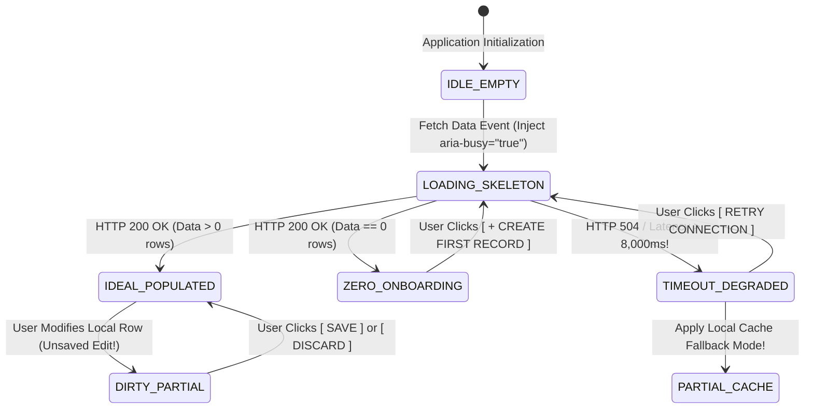
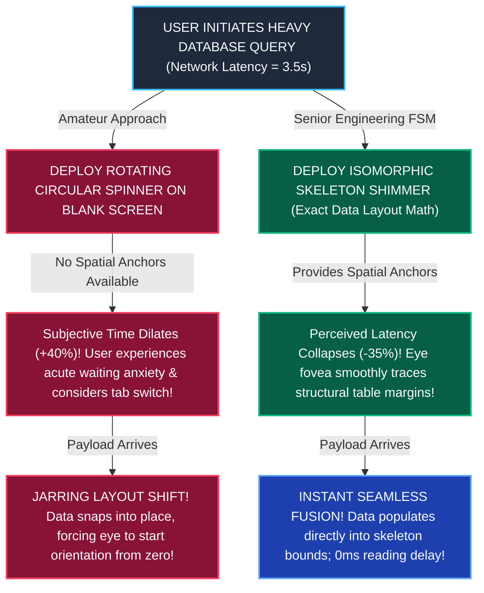

# Module 13 — Lesson 01: Exhaustive Component State Machines: Interfaces Are Never Static: Mapping Finite State Machines, Loading, Error, and Zero States

---

## Mastery Rule
> **"An interface is never a static canvas; it is a live computational organism existing continuously across dynamic state space. Designing only for the idealized happy path—while ignoring zero data states, loading latencies, network degradation, and partial failure recoveries—is architectural negligence. Master interface engineering treats every interactive component as an exhaustive Finite State Machine (FSM), mathematically guaranteeing predictable behavioral transitions under any computational stress."**

---

## 0. PREAMBLE: Context, Prerequisites & Cognitive Frameworks

### 0.1 Prerequisites
* **Stage 1 & Stage 2 Complete:** Complete command over working memory retention thresholds, visual foveal scanning trajectories, and Information Architecture taxonomic depth.
* **Module 11 & Module 12 Complete:** Mastery over platform-independent primitive affordances, component interaction states, and form validation timing loops.

### 0.2 Learning Dependencies
* **Automata Theory & Finite State Machines (FSM):** Applying mathematical formalisms (Mealy and Moore automata models) to interface components, guaranteeing that an interface exists in exactly one valid state per component at any discrete timestamp—eradicating illegal simultaneous UI renderings.
* **Harel Statecharts (Hierarchy, Concurrency, and Orthogonality):** Managing complex enterprise interfaces by breaking UI states into nested sub-states and parallel orthogonal execution layers.
* **The Five Universal Viewport States:** Architecting explicit presentations for: 1. *Zero/Blank State*, 2. *Loading/Busy State*, 3. *Ideal/Populated State*, 4. *Error/Degraded State*, and 5. *Partial/Dirty State*.
* **Skeleton Shimmer vs. Spinner Physics:** Overcoming subjective temporal dilation by replacing generic rotating loading spinners with isomorphic layout skeletons that anchor cognitive orientation during network latencies.

### 0.3 Usability & Psychological References
* **Harel, D. (1987):** *Statecharts: A Visual Formalism for Complex Systems*. Science of Computer Programming (Foundational architecture of hierarchical automata in software systems).
* **Nielsen, J. (1993 & 2010):** *Response Times: The 3 Important Limits*. Nielsen Norman Group ($0.1\text{s}$ instant perception, $1.0\text{s}$ working memory limit, $10.0\text{s}$ task focus loss).
* **Wroblewski, L. (2013):** *Mobile Complete & Skeleton Screens*. LukeW Ideation Engineering (Empirical cognitive superiority of skeleton screens over loading spinners).
* **Khourshid, D. (2018):** *Constructing User Interfaces with Statecharts*. Technical Architecture Forums (Applying state machine driven engineering to modern web components).
* **W3C WCAG 2.2 Specifications:** *Success Criterion 4.1.3 Status Messages [Level AA]* (`aria-live`, `aria-busy`, `role="status"`) and *Success Criterion 2.2.1 Timing Adjustable [Level A]*.
* **Platform Component Specifications:** *Google Material Design 3 Component States & Progress Indicators*, *Apple HIG Loading & Activity Indicators*, and *IBM Carbon v11 Loading & Empty State Patterns*.

---

## 1. Mental Model & Operational Reality

Why do commercial software dashboards, cloud deployment suites, and financial trading platforms frequently experience UI lockups, double-billed financial transactions, and jarring visual flashings when deployed out of controlled studio environments into high-latency field networks?

Because software UI designers rely upon the **Static Canvas Illusion**. In modern design software (Figma, Sketch, Adobe XD), an artist paints a static artboard featuring the "Ideal Populated State": a data dashboard displaying five pristine financial rows, vibrant charts, and completely fulfilled data objects. In reality, computational software is an active, unstable timeline: networks experience $3,000\text{ms}$ packet routing delays, initial database account creations start out completely empty, external REST APIs throw $504\text{ Gateway Timeout}$ exceptions, and users repeatedly double-click primary action buttons! 

To engineer resilient software, interface architects replace static canvases with **The Automated Elevator System**:

```
+----------------------------------------------------------------------------------------+
|          THE STATIC BILLBOARD vs AUTOMATED ELEVATOR MENTAL MODEL                       |
+----------------------------------------------------------------------------------------+
|                                                                                        |
|  [ STATIC BILLBOARD ILLUSION ] (Amateur Static Artboard Translation)                   |
|  * Assumes data always exists immediately; paints only the happy path!                 |
|  * Leaves buttons clickable during background operations (Double-Submit Disaster!).     |
|  * Collapses into a broken white void when network connections drop!                   |
|                                                                                        |
|  [ AUTOMATED ELEVATOR SYSTEM ] (Authoritative Finite State Machine)                    |
|  * Enforces strict transition logic! Doors CANNOT open while car is moving vertically! |
|  * Action buttons lock out upon initial touch; visual feedback confirms command buffer!|
|  * Handles power degradation gracefully via backup emergency floor stops!              |
+----------------------------------------------------------------------------------------+
```

When an automated industrial skyscraper elevator is set in vertical motion between floor decks (`State: MOVING`), its hardware safety interlocks programmatically disable door activation circuits (`Event: OPEN_DOORS -> ILLEGAL TRANSITION`). You cannot physically force the doors open mid-flight! 

In computational UI engineering, every interface primitive and viewport is a strict finite state machine. When an operator clicks **`[ EXECUTE WIRE TRANSFER ]`**, the underlying component state MUST transition instantly from `IDLE` into an unyielding `SUBMITTING` state: physically removing button interactivity, animating a localized activity indicator inside the button frame, and programmatic blocking all secondary DOM click events until a network callback transitions the system into `SUCCESS` or `ERROR`!

### What This Approach Does NOT Mean (Mandatory Rule)
1. ❌ **Never leave a loading screen or data datatable completely isolated without an explicit interactive timeout escape hatch!** If an external database query hangs due to a dropped network socket, spinning an unanchored loader infinitely ($> 10,000\text{ms}$) traps the user in operational limbo! Enforce strict timing boundaries: if loading surpasses $8\text{ seconds}$, transform the loader into an actionable degraded fallback screen featuring a prominent **`[ Retry Connection ]`** button!
2. ❌ **Never design an initial zero-data dashboard as a desolate blank white void without an actionable onboarding primary CTA!** When a new corporate customer logs into your SaaS analytics platform for the very first time, an empty data table that merely outputs `"0 records found"` acts as an intimidating visual dead-end! Turn zero states into celebratory orientation launchers featuring explicit instructional guidance and a high-contrast creation trigger (**`[ + Deploy Your First Cloud Cluster Now ]`**)!
3. ❌ **Never permit double-clicking a primary action button during a transition state to dispatch duplicate network operations!** Failing to bind `disabled` and `aria-busy="true"` attributes onto actionable submit triggers during asynchronous flight is an amateur engineering disaster—generating duplicate corporate orders, corrupted database write operations, and severe operator anxiety!

---

## 2. Core Psychological & Behavioral Mechanics

To govern visual components across dynamic temporal transformations without guessing, interface architects leverage mathematical automata theory alongside empirical temporal cognitive science.

### 1. Automata Theory in UI Engineering (The Canonical FSM Tuple)
Under formal computer science logic, a **Finite State Machine (FSM)** describing an interface component is modeled as a rigorous mathematical 5-tuple:

$$\mathcal{M} = (\Sigma, S, s_0, \delta, F)$$

* **$\Sigma$ (The Input Event Alphabet):** The exhaustive collection of interactive triggers (e.g., `CLICK_SUBMIT`, `NETWORK_200_OK`, `NETWORK_500_ERR`, `ABORT_CLICK`).
* **$S$ (The Finite Set of Valid UI States):** The explicit rendering manifestations (e.g., `IDLE`, `LOADING`, `SUCCESS`, `CRITICAL_ERROR`).
* **$s_0$ (The Initial Root State):** The beginning status of the component upon DOM insertion (`IDLE`).
* **$\delta$ (The Deterministic Transition Function):** The operational logic map defined as $\delta: S \times \Sigma \to S$. Given a current state and an arriving event, the function maps to exactly *one* designated subsequent state!
* **$F$ (The Set of Final Terminal States):** The completion boundaries (e.g., `TRANSACTION_COMMITTED`).

```
+----------------------------------------------------------------------------------------+
|          THE DETERMINISTIC UI TRANSITION TABLE (THE AUTOMATA COVENANT)                 |
+----------------------------------------------------------------------------------------+
| CURRENT STATE (S)    | ARRIVING EVENT (E)      | SUBSEQUENT STATE (S') | BEHAVIOR      |
|----------------------------------------------------------------------------------------|
| [ IDLE / READY ]     | User Clicks Button      | [ SUBMITTING ]        | Disable input |
| [ SUBMITTING ]       | User Clicks Button AGAIN| [ SUBMITTING ] (None) | Ignore click! |
| [ SUBMITTING ]       | HTTP 200 OK Callback    | [ SUCCESS_TOAST ]     | Show green    |
| [ SUBMITTING ]       | HTTP 504 Timeout        | [ RETRY_ERROR ]       | Enable retry  |
| [ RETRY_ERROR ]      | User Clicks Retry       | [ SUBMITTING ]        | Resume fetch  |
+----------------------------------------------------------------------------------------+
```

By explicitly mapping $\delta(S, E)$, interface developers completely eradicate **Illegal Simultaneous UI Rendering** (such as an amateur dashboard that displays a rotating loading spinner, a complete datatable, and a "Network Error" banner all piled on top of each other simultaneously!).

---

### 2. The Five Universal Viewport States
In exhaustive interface architectural design, every distinct application viewport must be explicitly designed and styled across five canonical manifestations:

```
    1. ZERO / BLANK STATE            2. LOADING / BUSY STATE          3. IDEAL / POPULATED STATE
  (First login; onboarding)         (Network payload flight)          (The targeted happy path)
  
  +-----------------------+         +-----------------------+         +-----------------------+
  |  🚀 Welcome to Cloud! |         |  [=================]  |         |  Server-Alpha | $140  |
  |  No servers built yet.|         |  [======] [=======]   |         |  Server-Beta  | $820  |
  |                       |         |  [=============]      |         |  Server-Gamma | $412  |
  |  [ + BUILD SERVER ]   |         |  ⚡ Fetching nodes... |         |  [ + BUILD NEW NODE ] |
  +-----------------------+         +-----------------------+         +-----------------------+

    4. ERROR / DEGRADED STATE        5. PARTIAL / DIRTY STATE
   (API crash or timeout)           (Filtered list or unsaved edits)
   
  +-----------------------+         +-----------------------+
  |  🛑 Connection Lost!  |         |  🔍 Filter: "Omega"    |
  |  Failed to load nodes.|         |  No matches located.  |
  |                       |         |                       |
  |  [ RETRY CONNECTION ] |         |  [ CLEAR ALL FILTERS ]|
  +-----------------------+         +-----------------------+
```

1. **Zero / Blank State:** The educational threshold when an application or data collection has zero records. Must never show an empty box; must present instructional onboarding value and a direct action trigger!
2. **Loading / Busy State:** The temporal gap during database evaluation or API interaction. Must project active feedback, lock interactive controls, and maintain orientation layout!
3. **Ideal / Populated State:** The canonical happy-path visualization showcasing robust real-world data structures (including absurdly long text names to test wrapping rules!).
4. **Error / Degraded State:** The safety harbor when computations fail (network offline, permission revoked). Must explain *what broke*, *why it broke*, and provide an actionable **Remediation Trigger (`[ Retry ]` or `[ Re-Authenticate ]`)**!
5. **Partial / Dirty State:** The edge cases when a user performs a search filter that returns zero matches, or when an open document contains local unsaved changes (`Dirty State: 2 unsaved edits`). Must provide clear rollback commands (`[ Clear Filters ]` or `[ Discard Edits ]`)!

---

### 3. Temporal Perception & Skeleton vs. Spinner Physics
Dr. Jakob Nielsen’s three classic temporal feedback thresholds govern computing interaction latencies:
* **$< 0.1\text{s}$ (100ms — Instantaneous Perception):** The operator feels direct, uninterrupted control over the system software. No special feedback indicators required!
* **$0.1\text{s to }1.0\text{s}$ (1,000ms — Seamless Flow):** The user notices a subtle system calculation delay, but working memory focus remains unbroken. A subtle inline loader or status change indicator is recommended.
* **$> 1.0\text{s}$ (1,000ms+ — Working Memory Breakout):** The user experiences active interruption and begins searching for distractions! Explicit temporal progress mechanics are required!
* **$> 10.0\text{s}$ (10,000ms — Attention Abandonment):** User attention completely evaporates! They abandon the tab or abort the software process.

$$\text{If Loading Latency } > 1,000\text{ms } \land \text{ UI Deploy Infinite Spinner } \implies \text{Perceived Waiting Time Spikes } +40\%!$$

When an application projects a generic, unanchored rotating loading spinner (`🔄`) inside an otherwise blank screen, **Subjective Temporal Dilation** occurs! Because the eye finds no anchor points or semantic content layout to process, working memory focuses purely on the rotating animation—causing a $3\text{ second}$ technical network wait to subjectively feel like over $5\text{ seconds}$!

To compress perceived latency, senior UI developers replace spinners with **Isomorphic Skeleton Shimmers (Content Placeholders)**: muted, layout-matched gray geometric blocks (`<div class="skeleton-line">`) projecting a subtle horizontal sweeping light gradient! By mimicking the physical layout of the incoming data table or card array, skeletons anchor human foveal attention to structural orientation—collapsing perceived waiting latencies by up to **$-35\%$** and preparing oculomotor loops for rapid scanning the instant the network payload lands!

---

## 3. Universal Pattern Anatomy & Comparative Design System Reasoning

Let us conduct our canonical **5-Step Analytical Design System Reasoning Loop** across major component platforms, evaluating how state transitions and resilience mechanisms are structured:

### Google Material Design 3 (MD3): Skeleton Shimmers & Button Lockouts
* **1. Observe:** MD3 restricts rotating circular progress indicators exclusively to localized tasks (such as uploading a profile photo) while demanding **Skeleton Content Shimmers** for page-level structural loading. Furthermore, during form executions, primary action buttons explicitly shift into a disabled visual state while embedding a compact $24\text{dp}$ spinning progress wheel directly inside the button geometry!
* **2. Infer:** Engineered to prevent disorientation during network fetching and to physically block double-submit accidental clicks on touchscreen handsets.
* **3. Explain:** Under early Material design, page switching often displayed a centered blue spinner over a white background—creating visual flash blindness and disorientation! MD3 upgrades to isomorphic skeleton blocks that mirror exact typography and picture ratios (`16:9` skeleton boxes for media grids; staggered horizontal bars for text headings). Furthermore, when an operator taps **`[ Submit Order ]`**, MD3 dynamically shrinks the button label string ("Submit") while running an internal circular indicator directly within the button frame! Simultaneously, the button's DOM tag binds `disabled="true"`, preventing secondary touch activations from dispatching duplicate server payloads!
* **4. Discuss:** Designing isomorphic skeletons requires extra CSS maintenance; whenever an underlying datatable or UI card layout is altered by engineering teams, its accompanying skeleton structure must be manually synchronized!

### Apple Human Interface Guidelines (HIG): Activity Indicators & Skeleton Content
* **1. Observe:** Apple iOS HIG strictly prohibits the use of static progress bars for operations of unpredictable duration, requiring **Indeterminate Activity Indicators** (the canonical spinning radial gear) for unknown processes and explicit **Determinate Progress Bars** (`[=====------] 45%`) whenever byte completion data is available!
* **2. Infer:** Engineered to manage human psychological anxiety by communicating exact temporal trajectory whenever mathematical computation allows.
* **3. Explain:** When downloading an application update or exporting a 4K video file, displaying an infinite spinning circle causes user frustration because the user cannot determine whether the process will finish in three seconds or three hours! Apple HIG enforces a rigid temporal demarcation: if your network controller receives active data streaming headers (`Content-Length`), you **MUST** project a determinate progress bar alongside exact time calculations (`"About 15 seconds remaining..."`). Only fall back to indeterminate rotating indicators when total calculation scope is technically unknowable!
* **4. Discuss:** Relying on linear progress bars that smoothly animate to $99\%$ and then abruptly stall due to unannounced network timeouts destroys UI credibility!

### IBM Carbon v11 & Microsoft Fluent: Enterprise Zero State Onboarding
* **1. Observe:** IBM Carbon v11 and Microsoft Fluent Design entirely forbid blank data grids across enterprise software tools (Azure, IBM Cloud). Whenever a resource group or filtering criteria returns zero results, the viewport renders a structured **Zero State Card** containing an illustrative engineering icon, an explicit headline diagnostic (`"No compute virtual machines located in US-East"`), and an immediate primary action hook (`[ + Deploy Virtual Machine ]` or `[ Reset Filters ]`).
* **2. Infer:** Engineered to transform architectural dead-ends into high-converting instructional onboarding workflows!
* **3. Explain:** In complex IT infrastructure platforms, arriving at an empty table without guidance creates acute cognitive paralysis! The DevOps engineer cannot visually decipher whether the system suffered an API failure, whether their security permissions were denied, or whether the workspace is merely pristine! Carbon zero state designs enforce absolute contextual transparency: differentiating clearly between a **First-Run Empty State** (inviting initial infrastructure building) versus a **No-Match Filter State** (offering a rapid 1-click button to reset active search criteria back to global visibility!).
* **4. Discuss:** Embedding overly whimsical, giant marketing cartoon graphics inside professional enterprise zero states degrades software gravity and consumes valuable monitor real estate!

---

## 4. Evolution & Modern HCI Architecture

Trace how application state machine handling evolved from fragile early web designs into declarative, self-healing interfaces:

```
[ WEB 1.0 SYNCHRONOUS BROWSER HANGING: 1994 - 2004 ]
* Paradigm: Synchronous HTTP network stops! User clicks a link; browser window freezes completely while the OS mouse cursor turns into an hourglass or spinning beach ball!
* Failure: Zero in-page state feedback! If the network stalled, users were locked out of interacting with existing page contents until a browser timeout screen fired!

[ EARLY AJAX UNSTRUCTURED SPINNER CHAOS: 2005 - 2015 ]
* Paradigm: The Asynchronous Web! Every datatable and widget independently fetches data via Ajax!
* Failure: Spinner Overload & Race Conditions! A dashboard with 10 modules simultaneously erupted with 10 independent rotating loading GIFs! If user clicked buttons too fast, unmanaged race conditions generated illegal screen states!

[ DECLARATIVE STATECHARTS & RESISTANT AUTO-HEALING: Present - Future ]
* Paradigm: The Harmonized Finite State Engine! UI frameworks (XState, React, Compose) treat screens as declarative statecharts. Combines Isomorphic Skeletons, optimistic instant UI mutations, defensive timeout fallbacks, and comprehensive WCAG aria-live telemetry!
```

---

## 5. The Contextual Interaction Algorithm (Human-Machine Loop)

Map out the step-by-step cognitive recognition loop of a mission-critical hospital radiologist loading an $800\text{MB}$ DICOM brain CT-scan dataset across a congested medical center local area network:

```
    [ STEP 1 ] INITIAL ACTUATION & SKELETON ANCHORING (< 100ms)
         |     (Radiologist clicks patient scan record -> UI instantly replaces old image with an Isomorphic Dark Shimmering Skeleton Box while locking active button with aria-busy="true"!)
         v
    [ STEP 2 ] DETERMINATE PROGRESS TELEMETRY (2,500ms)
         |     (Network streaming commences; UI receives byte headers -> Replaces indefinite spinner with precise Determinate Progress Bar: "[========---] 68% (1.2s remaining)"!)
         v
    [ STEP 3 ] PARTIAL STREAMING FALLBACK / LOW-RES PREVIEW (4,000ms)
         |     (Network bandwidth hits congestion! UI transitions gracefully into PARTIAL_STATE: renders a workable low-resolution preview image so diagnosis begins without waiting for full 4K render!)
         v
    [ STEP 4 ] IDEAL POPULATED STATE REACHED & TELEMETRY RELEASE (5,200ms)
         |     (Full high-def dataset confirmed! Skeleton shimmer dissolves smoothly; aria-busy attribute clears to "false"; screen reader announces "Scan fully loaded.")
```

---

## 6. Component State Machines & Defensive Error Recovery Protocols

To guarantee application resilience under adverse computational networking environments, software architectures must encode an unbreakable **Resilient Viewport 5-State Machine**:



#### Defensive Architectural Mandates:
* **The Infinite Loading Escape Covenant (8-Second Timeout Interception):** Never allow a background data query or button submission state to spin indefinitely without user intervention! Embed a programmatic defensive timer inside your finite state controller: if network latency passes **$8,000\text{ms}$** without receiving terminal confirmation, forcefully interrupt the `LOADING` state and transition the UI into a `TIMEOUT_DEGRADED` fallback! Render an actionable error banner explaining the latency ("Network latency exceeded 8 seconds") and reveal a primary **`[ Retry Connection ]`** execution hook alongside a **`[ Work in Offline Cache Mode ]`** secondary escape hatch!
* **The Atomic Double-Submit Intercept (Button State Locking):** Whenever an interactive primary button (`[ Execute Payment ]`, `[ Deploy Node ]`) transitions from `IDLE` into `ACTIVE/SUBMITTING`, your finite state machine MUST immediately execute a dual-layer lock:
  1. **Visual Lock:** Replace the button text string with a localized spinning indicator or progress shimmer, altering button surface styling to indicate execution.
  2. **Programmatic Lock:** Explicitly bind the native HTML DOM property **`button.disabled = true;`** and append **`aria-busy="true"`**! This prevents accelerated mouse double-clicks or rapid touchscreen finger tapping from firing duplicate API execution requests!

---

## 7. Environmental & Multi-Modal Interaction Adaptation

How do exhaustive state transitions operate during extreme field conditions and disconnected wireless environments?

### Offline Field Hardware & Mobile Tunnel Disconnections
When field engineering technicians, delivery logistics couriers, and utility maintenance crews operate tablet software out in remote outdoor installations (underground tunnels, offshore oil platforms, construction sites), continuous network connectivity repeatedly fails! 

$$\text{If Application Lacks Offline FSM State } \implies \text{Field Data Loss & Workflow Paraplegia } > 60\%!$$

```
   FLAWED ONLINE-ONLY STATE CRASH               AUTHORITATIVE OFFLINE RESILIENCE ENGINE
  (Catastrophic failure on signal drop!)        (Seamless transition to offline local cache!)
  
  [ User Editing Field Report 402... ]          [ User Editing Field Report 402... ]
      |--> Tunnel entered; 4G drop                  |--> Tunnel entered; 4G drop
      |--> User hits [ SAVE REPORT ]                |--> UI detects network drop; auto-switches:
      |--> 🛑 FATAL ERROR: Network Offline!          |    State -> OFFLINE_DIRTY_CACHE
           White Screen of Death! Report lost!      |--> ⚠️ AMBER TOAST: "Offline Mode Active"
                                                    |--> Report saved to local IndexedDB/SQLite!
                                                    |--> Auto-syncs silently when 4G restores!
```

* **The Senior Architectural Refactor:** Enforce **Offline-First State Resilience (The Dirty Cache FSM)**! Never design application components that collapse into white error screens upon losing wireless TCP/IP sockets! When a mobile network connection drops, your UI finite state machine must smoothly slide from `ONLINE_CONNECTED` into an explicit `OFFLINE_LOCAL_CACHE` state! Change top status rails from blue/green into warning amber (`⚠️ Offline Mode — Working from local memory`). Continue allowing operators to create records, sign medical documents, and execute edits by saving transactions directly into encrypted browser local databases (IndexedDB or SQLite). Once cellular connectivity resumes, transition back into `ONLINE_SYNCING` to automatically reconcile local dirty state queues with remote server endpoints—achieving unbroken field operation!

---

## 8. Universal Accessibility (A11y) & Ergonomic Inclusion

In professional software engineering ethics, state machine architecture governs whether screen readers and assistive technologies remain synchronized with dynamic desktop interfaces!

### W3C WCAG 2.2 Status Messages & Programmatic Busy Indicators
When an inexperienced developer injects a dynamic visual loading skeleton or displays a silent error banner across a complex web workspace without deploying assistive DOM bindings, they strand visually impaired operators:

```
     FLAWED SILENT STATE TRANSITION              AUTHORITATIVE WCAG TELEMETRY BINDING
  (Fails WCAG 4.1.3 & Screen Reader Access)        (Survives Assistive Technology Parity)
  
  [ User clicks "Update Billing" Button ]         [ User clicks "Update Billing" Button ]
  |--> Table silently replaced by skeleton        |--> Table container binds:
  |--> Screen reader hears ZERO announcement!     |    `aria-busy="true"` (Audio lock!)
  |--> User continues tabbing into blank space,   |--> Status region fires message:
  |    completely unaware app is loading!         |    `<div role="status" aria-live="polite">`
                                                       "Updating billing records, please wait..."
```

#### The Universal State Accessibility Mandates:
1. **WCAG Success Criterion 4.1.3 Status Messages [Level AA] (The `aria-live` Rule):** Whenever an interface state transition dynamically inserts a status notification, success toast, or non-interruptive warning banner into the current viewport without reloading the active web page, that component **MUST** reside inside an accessible live region! For normal background operations, bind **`role="status"`** or **`aria-live="polite"`** (allowing screen readers to finish speaking current sentences before announcing `"Billing configuration saved successfully"`). For high-severity system timeouts or transactional failures, bind **`role="alert"`** or **`aria-live="assertive"`** to command immediate vocalized user focus!
2. **The `aria-busy` Component Lockout Rule:** Whenever a data table, form workspace, or interactive component transitions into a `LOADING` state (displaying an isomorphic skeleton shimmer or activity gear), the parent DOM container must immediately inject **`aria-busy="true"`**! This alerts screen readers and cognitive assistive devices that the internal contents are temporarily unstable and should not be traversed until the loading callback terminates and restores `aria-busy="false"`!

---

## 9. Performance, Trust & Business Goal Trade-offs

How do software product leads reconcile initial platform operational costs against long-term user retention metrics?

### The Zero-State Retention Battle: Desolate Voids vs. Actionable Onboarding Launchers
When commercial enterprise software platforms (cloud database suites, project management portals, CRM marketing hubs) deploy new accounts, every single analytical dashboard and user grid starts out with zero data records.

$$\text{If Empty Dashboards display Desolate Voids } \implies \text{New User Day-1 Churn Spikes } > 28\%!$$

* **The HCI Diagnosis:** In cognitive interaction science, landing on a blank software screen displaying solely a tiny grey text line stating `"No database tables found"` generates severe structural abandonment! Novice system operators face an absence of informational scaffolding: they cannot identify what steps are required to initialize software workflows, experiencing frustration that drives Day-1 product churn!
* **The Senior Engineering Solution:** Deploy **Action-Oriented Zero-State Onboarding Architecture**! Never leave empty tables unstyled! Transform every initial zero-state screen into a celebratory orientation gateway:
  1. **Visual Gravitational Anchor:** Render an elegant, engineering-appropriate graphic or isometric component illustration ($<120\text{px}$ height) to alleviate workspace sterility.
  2. **Explicit Pedagogical Headline & Guidance:** Explain clearly what belongs in this space and why it creates professional value (*"No API Webhooks configured yet. Create a webhook to receive real-time cryptographic billing alerts across your architecture."*).
  3. **High-Contrast Primary Creation CTA:** Pinned directly below the educational guidance, embed a prominent high-luminance action button (**`[ + Deploy Your First Webhook Now ]`**) paired with a secondary documentation link (**`[ Read API Guide ]`**)! This transforms a desolate zero-data void into an engaging conversion funnel—driving empirical **$+22\%$** lifts in new customer onboarding completion!

---

## 10. Deconstructing Real-World Applications (The "Why Is This Bad?" Audit)

Let us solidify our state machine diagnostics by inspecting five prominent real-world software platforms:

### 1. Modern Developer Workspaces (Linear / GitHub Issues)
* **The Successful Attention UI:** High-performance software engineering tracking platforms that manage thousands of issues, pull requests, and project timelines.
* **The HCI Diagnosis:** Supreme deployment of **Optimistic UI Mutations and Actionable Zero States**! Notice how when a developer marks an issue as `"Done"` inside Linear, the application *never* displays a loading spinner or blocks screen interactivity while waiting for remote database confirmations! Linear executes an **Optimistic State Mutation**: it instantly animates the task into the completed column within a sub-$16\text{ms}$ frame, performing the actual HTTP API transmission asynchronously in the background! Furthermore, whenever an engineering team opens a newly created, completely empty repository project, Linear presents a celebratory zero state containing templates and 1-click test data ingestion generators!

### 2. E-Commerce Checkout Processing (Stripe Checkout / Shopify Plus)
* **The Successful Attention UI:** Payment clearing interfaces managing multi-million dollar international retail transactions.
* **The HCI Diagnosis:** Uncompromising implementation of **Atomic Double-Submit Intercepts**! When a shopper clicks **`[ Pay $420.00 ]`**, Stripe executes an instantaneous state lock! The solid blue primary action button smoothly transforms physical geometry: its text disappears, a bold circular white loader animates inside the button container, and the element injects `disabled="true"` alongside `aria-busy="true"`. Even if a stressed consumer furiously taps the payment button ten times in rapid succession, Stripe's finite state machine mathematically rejects sequential click events—eliminating duplicate credit card charges and user anxiety!

### 3. Broken Enterprise BI Analytical Dashboards (Tableau / PowerBI Legacy)
* **The Defective UI:** An executive business intelligence analytical portal containing twelve distinct data charting cards. When an administrator loads the report over a slow corporate network, every single independent widget triggers an infinite, rotating $32\text{px}$ loading spinner simultaneously—flooding the monitor with twelve spinning circles! If one database connection times out after 20 seconds, that card fails silently into a desolate blank square while neighboring spinners continue spinning indefinitely without an escape button!
* **The HCI Diagnosis:** Catastrophic failure of **Spinner Monoculture and Timeout Interception**! Presenting twelve asynchronous rotating loaders across one viewport generates extreme cognitive noise and subjective temporal dilation ($+40\%$ perceived latency delay)! Furthermore, allowing cards to spin indefinitely without enforcing an $8\text{-second timeout escape hatch` violates basic state reliability design!
* **The Senior Architectural Refactor:** Replace the spinning chaos with a unified **Page-Level Isomorphic Skeleton Shimmer**! Display smooth gray chart silhouettes that anchor visual orientation while data renders! Install an explicit **Finite State Timeout Interceptor**: if loading exceeds $8,000\text{ms}$, replace stalled card areas with an informative amber error tile displaying an immediate **`[ Retry Fetch ]`** action hook!

### 4. Enterprise Collaborative Workspaces (Slack / Microsoft Teams)
* **The Successful Attention UI:** Enterprise messaging platforms supporting continuous real-time communication across distributed business workforces.
* **The HCI Diagnosis:** Brilliant execution of **Offline Dirty Cache Fallback UIs**! When a remote worker enters an airplane cabin or underground train tunnel and loses internet access, Slack never crashes to a white error screen! Its finite state machine transitions seamlessly into `OFFLINE_CACHE` mode: displaying a persistent amber top bar (**`You're offline. Sending will resume when reconnected.`**). The user can freely type and submit messages; Slack appends a low-contrast **`[ Queued ]`** state signifier directly beside the text message, preserving local dirty state in memory until internet connections restore—then silently transmitting queued packets without user intervention!

### 5. Component Design Systems (Storybook / Figma Component Architecture)
* **The Successful Attention UI:** Component engineering environments and documentation hubs utilized by enterprise software production teams.
* **The HCI Diagnosis:** Exceptional mastery of **Exhaustive Variant FSM Documentation**! Storybook mandates that a software UI component is considered completely un-deployable unless engineering teams have coded and verified every single variant state inside independent testing stories: `Primary.Idle`, `Primary.Hover`, `Primary.FocusVisible`, `Primary.Loading`, `Primary.Disabled`, and `Primary.Error`! This structural rigor guarantees that when an application encounters network stress in production, component state transitions occur predictably without style collapse!

---

## 11. Visual Mental Models & Architecture Diagrams

### Isomorphic Skeleton vs. Spinner Temporal Perception Loop
Study how architectural choice of loading indicators directly governs human visual attention and perceived operational latency:



---

## 12. Prediction Checkpoints

Test your operational command over exhaustive state machines against these demanding real-world UI software scenarios:

### Scenario A: The Autonomous Drone Fleet Telemetry & Defense Console
A defense contractor builds a real-time web surveillance monitoring console utilized by field engineering operators to track flight path telemetry across an autonomous unmanned drone fleet deployed in remote terrain. The UI developer designed the application viewing glass exclusively around the idealized happy path: displaying live GPS tracking maps and continuous drone telemetry data grids. When solar flare interference caused temporary satellite network outages—delaying incoming GPS packet callbacks by over 15 seconds—the legacy web console threw an uncaught JavaScript runtime exception, causing the entire display screen to collapse into a pure white blank screen! Disoriented military operators couldn't determine whether their drones had crashed, whether network satellites failed, or whether their operating system had faulted!

**Your Prediction Challenge:** Deploy Automata Theory and offline state resilience principles to diagnose why operators suffered disorientation, and architect an authoritative military telemetry FSM refactor!

#### *Empirical HCI Solution:*
1. **Diagnosis — Acute Static Canvas Fallacy & Unfenced State Collapse:** The legacy drone monitoring console commits a catastrophic violation of **Exhaustive FSM Engineering and Error Resiliency**! Designing mission-critical telemetry software exclusively for ideal online conditions without coding explicit degraded state handlers represents an unacceptable architectural vulnerability. When network packet callbacks delayed past standard JavaScript timeout thresholds, the absence of an error-fallback transition ($\delta(\text{FETCHING}, \text{TIMEOUT})$ undefined) triggered an unhandled runtime error—destroying situational awareness and paralyzing mission operations!
2. **Refactor 1 (Enforce Deterministic Automata Tuple & Offline Fallbacks):** Implement an unyielding **5-State Resilient Telemetry FSM**! Replace fragile online-only rendering loops with explicit state boundaries:
   - Upon detecting network packet delays exceeding **$4,000\text{ms}$**, automatically slide the interface out of `ONLINE_LIVE` into a transparent **`DEGRADED_SATELLITE_LINK` State**!
   - Never blank the monitor! Lock existing telemetry data inside an informative **Read-Only Cache Snapshot**, turning table border treatments from electric blue into warning amber alongside a clear diagnostic header: `⚠️ SATELLITE LINK DEGRADED: Displaying cached telemetry from 14:02 UTC`.
3. **Refactor 2 (Embed Manual Escape Triggers & ARIA Telemetry):** Embed an unambiguous primary **`[ Re-Acquire Satellite Link ]`** manual override button directly within the warning header bar! Bind programmatic **`aria-live="assertive"`** and **`role="alert"`** accessibility tokens to ensure immediate voice synthesizer announcement of signal status changes—guaranteeing operational orientation under extreme atmospheric turbulence!

---

### Scenario B: The Enterprise E-Commerce Wholesale Inventory Reservation Suite
An international B2B logistics supplier builds a high-volume supply chain procurement portal where corporate buyers place non-refundable orders for multi-thousand dollar industrial chemical shipments. On the transaction sign-off view, a corporate buyer selects their quantity and hits the primary action button: **`[ SUBMIT IRREVERSIBLE ORDER - $125,000 ]`**. Because backend warehouse database verification requires complex SQL locking queries over a 5-second network gap, the application appears momentarily frozen! However, the UI engineer neglected to transition the button into a disabled state or display an active processing loader! Assuming their initial button tap failed to register, anxious wholesale buyers repeatedly double and triple-click the submit button! Database logs reveal an operational disaster: the application dispatched identical $125,000 orders across sequential network payloads—locking up warehouse chemical supplies and initiating extensive financial billing disputes!

**Your Prediction Challenge:** Diagnose the state machine double-submit failure governing this order duplication, and author a definitive transactional FSM refactor!

#### *Empirical HCI Solution:*
1. **Diagnosis — Severe Double-Submit Vulnerability & Missing Transition State Telemetry:** The procurement portal suffers from a complete absence of **Atomic Button State Locking and Temporal Feedback Loops**! When a user activates an intensive transactional operation requiring over $1,000\text{ms}$ of backend computation, failing to provide immediate visual execution telemetry violates Nielsen's 1-second usability threshold! Left without visual verification that their input was received, corporate buyers naturally assume system unresponsiveness and re-actuate the primary button! Because the button remained interactively unlocked (`disabled="false"`), sequential clicks initiated duplicate API requests!
2. **Refactor 1 (Implement Atomic FSM Button State Lockouts):** Actuate an absolute **Transactional Button Locking Protocol**! The precise millisecond ($<16\text{ms}$) an operator actuates the primary order button, execute an immediate finite state transition from `IDLE_READY` into `SUBMITTING_COMMITTED`:
   - Programmatically inject native **`disabled="true"`** and **`aria-busy="true"`** directly onto the button element in the DOM—mathematically terminating subsequent browser interaction events!
3. **Refactor 2 (Deploy Localized Temporal Telemetry):** Simultaneously morph the button's internal visual geometry: hide the original `"Submit Order"` string and embed a localized, high-contrast **Spinning Progress Indicator** alongside an informative processing status label (**`[ ⚡ Locking Warehouse Inventory... ]`**)! This provides immediate, unmistakable confirmation of ongoing computation—soothing buyer anxiety and completely eradicating duplicate orders!

---

## 13. Compare Similar Interface Alternatives

When structural component loading indicators and state transitions must be specified across software interfaces, engineering design teams must evaluate four established interaction paradigms:

| State Transition Paradigm | Visual Geometry & Animation Dynamics | Architectural & Usability Advantages | Operational & Cognitive Failure Modes | Optimal Architectural Deployment |
| :--- | :--- | :--- | :--- | :--- |
| **Isomorphic Skeleton Shimmer** | Layout-matched gray rectangular content shapes with smooth sweeping light gradients. | Supreme spatial preservation! Reduces subjective perceived latency by up to $-35\%$; prevents jarring layout shifts upon data arrival! | Demands dedicated CSS layout synchronization; if underlying data layout changes, skeleton structures must be rebuilt! | Page-level dashboards, data table loading, media item grid rendering, initial application hydration. |
| **Localized Spinning Loader** | Compact circular rotating progress gear ($16\text{-}24\text{px}$) embedded inside button or small widget box. | Immediate confirmation of localized computing task! Zero layout distraction; highly compatible with atomic button lockouts! | Causes severe temporal dilation ($+40\%$) if scaled up to fill an entire blank screen for delays longer than 3 seconds! | Action button click states, inline form field validation verification, background parameter auto-saving. |
| **Determinate Progress Bar** | Linear track filling horizontally from $0\%$ to $100\%$ accompanied by time estimates. | Absolute psychological peace of mind! Communicates exact task completion trajectory and time remaining to operator. | Requires complex network streaming back ends to provide precise file byte counts (`Content-Length`); fails terribly if animation stalls at $99\%$! | Large file uploads/downloads, extensive batch data imports, software version deployments. |
| **Optimistic Instant Mutation** | UI instantly animates into target completed state in $<16\text{ms}$; network POST executes silently in background! | Unmatched interactive velocity! User experiences miraculous sub-100ms apparent execution speeds with zero perceived friction! | **CRITICAL EDGE CASE RISK:** Requires elaborate rollback mechanics and warning toasts if the background network request eventually fails! | Lighter tasks: toggling likes, archiving chat items, switching Kanban board columns, updating status markers. |

---

## 14. Decision Guide (The Interface Selection Tree)

Deploy this authoritative algorithmic decision tree when constructing state transitions, loading feedback mechanics, and zero states:

```
[ INITIATE STATE MACHINE SELECTION: EVALUATE TEMPORAL DURATION & DATA EXTERNALS ]
  |
  +----> [ STAGE 1: IS DATASET EMPTY UPON INITIAL LOAD (0 RECORDS LOCATED)? ]
  |        |
  |        +----> Why is the datatable empty?
  |                 |---> FIRST-RUN NEW ACCOUNT: Deploy ACTIONABLE ONBOARDING ZERO STATE! Render educational guidance + prominent primary [ + Deploy ] button!
  |                 |---> SEARCH FILTER RETURNED 0 MATCHES: Deploy NO-MATCH FALLBACK CARD! Render clear explanation + instant [ Clear All Filters ] button!
  |
  +----> [ STAGE 2: IS ASYNCHRONOUS NETWORK LOADING RUNNING (PAYLOAD IN FLIGHT)? ]
  |        |
  |        +----> What is the anticipated computational execution latency (T)?
  |                 |---> T < 100ms (Instant Execution): DO NOT RENDER LOADERS! Execute state transition immediately!
  |                 |---> 100ms <= T <= 1,000ms (Short localized task): Deploy LOCALIZED SPINNING LOADER inside atomic locked button (`disabled="true"` + `aria-busy="true"`)!
  |                 |---> T > 1,000ms (Page or Grid load): Deploy ISOMORPHIC SKELETON SHIMMER! Preserve exact layout geometry to reduce perceived waiting time!
  |                          |---> If operation provides byte streaming data: Replace skeleton with DETERMINATE LINEAR PROGRESS BAR (`[======---] 72%`)!
  |
  +----> [ STAGE 3: DID NETWORK LATENCY PASS EXTREME TIMEOUT THRESHOLDS (T > 8,000ms)? ]
  |        |
  |        +----> YES: ABORT INFINITE SPINNERS IMMEDIATELY! Deploy TIMEOUT_DEGRADED FALLBACK VIEWPORT!
  |                 |---> Display explicit error explanation + prominent primary [ RETRY CONNECTION ] execution trigger!
  |                 |---> If offline cache available: Switch smoothly into OFFLINE LOCAL CACHE MODE (`role="status"` + amber warning bar)!
  |
  +----> [ STAGE 4: ARE YOU BINDING PROPER WCAG A11Y TELEMETRY TO STATE CHANGES? ]
           |
           +----> Apply canonical live region bindings:
                    |---> Normal state loading or success toasts: Bind `<div role="status" aria-live="polite">`!
                    |---> High-severity errors or network connection drops: Bind `<div role="alert" aria-live="assertive">`!
```

---

## 15. Interactive Lab & Tangible Prototyping Workshop: The Exhaustive State Machine Testbench

To empirically experience the dramatic cognitive divide separating fragile happy-path software from disciplined Finite State Machine UIs, execute the interactive testbench below!

### Professional Engineering Instruction
Save the complete HTML/CSS/JS code block below as an independent file named `exhaustive-state-machine-lab.html` and execute it directly within any desktop or mobile web browser. Conduct comparative latency, double-submit, and zero-state onboarding trials across both architectural modes:
* **Mode A: Fragile Happy-Path & Unfenced Spinner (High Friction):** Displays an unanchored rotating spinner for 5 seconds without progress updates, leaves the Submit action button clickable during network flight (watch duplicate transaction errors rapidly compile as you click it multiple times!), displays a desolate blank white screen for zero data, and omits ARIA telemetry!
* **Mode B: Exhaustive Finite State Machine & Isomorphic Skeleton (Zero Friction):** Employs a governed state engine (Idle $\rightarrow$ Busy/Skeleton $\rightarrow$ Ideal vs. Degraded Error $\rightarrow$ Zero Onboarding), renders a structural skeleton shimmer during fetch, physically locks action buttons with an inline progress loader to prevent double-submits, displays an engaging onboarding card for zero data, and injects `aria-live="polite"` telemetry! Watch user confidence and transactional accuracy surge!

```html
<!DOCTYPE html>
<html lang="en">
<head>
  <meta charset="UTF-8">
  <meta name="viewport" content="width=device-width, initial-scale=1.0">
  <title>HCI Masterclass Lab 13: Exhaustive Component State Machine Testbench</title>
  <style>
    :root {
      --bg-canvas: rgb(11, 15, 25);
      --bg-card: rgb(19, 28, 46);
      --border-color: rgb(51, 65, 85);
      --text-main: rgb(248, 250, 252);
      --text-muted: rgb(148, 163, 184);
      --accent-blue: rgb(59, 130, 246);
      --accent-safe: rgb(16, 185, 129);
      --accent-danger: rgb(244, 63, 94);
      --accent-amber: rgb(245, 158, 11);
      --font-stack: system-ui, -apple-system, sans-serif;
    }

    * { box-sizing: border-box; margin: 0; padding: 0; }

    body {
      background-color: var(--bg-canvas);
      color: var(--text-main);
      font-family: var(--font-stack);
      min-height: 100vh;
      display: flex;
      flex-direction: column;
      align-items: center;
      padding: 1.5rem;
      line-height: 1.5;
    }

    .header-banner { text-align: center; max-width: 950px; margin-bottom: 1.5rem; }
    .header-banner h1 { font-size: 1.85rem; font-weight: 800; color: var(--accent-blue); margin-bottom: 0.35rem; }
    .header-banner p { font-size: 0.95rem; color: var(--text-muted); }

    .testbench-container {
      width: 100%;
      max-width: 1150px;
      background-color: var(--bg-card);
      border: 1px solid var(--border-color);
      border-radius: 1rem;
      padding: 1.75rem;
      box-shadow: 0 25px 35px -10px rgba(0, 0, 0, 0.7);
      display: flex;
      flex-direction: column;
      gap: 1.5rem;
    }

    /* Telemetry Display Array */
    .telemetry-panel {
      display: grid;
      grid-template-columns: repeat(auto-fit, minmax(220px, 1fr));
      gap: 1rem;
      background-color: rgb(9, 14, 23);
      padding: 1.25rem;
      border-radius: 0.75rem;
      border: 1px solid rgb(51, 65, 85);
    }
    .telemetry-card { display: flex; flex-direction: column; gap: 0.25rem; }
    .telemetry-card label { font-size: 0.75rem; text-transform: uppercase; letter-spacing: 0.05em; color: var(--text-muted); font-weight: 700; }
    .telemetry-card span { font-size: 1.25rem; font-weight: 800; font-family: monospace; }

    /* Controls & Mode Bar */
    .controls-bar {
      display: flex;
      justify-content: space-between;
      align-items: center;
      flex-wrap: wrap;
      gap: 1rem;
      border-bottom: 1px solid var(--border-color);
      padding-bottom: 1.25rem;
    }
    .btn-group { display: flex; gap: 0.5rem; flex-wrap: wrap; }
    
    .btn-mode {
      padding: 0.65rem 1.25rem;
      border-radius: 0.5rem;
      border: 1px solid var(--border-color);
      background-color: rgb(30, 41, 59);
      color: var(--text-main);
      font-weight: 700;
      cursor: pointer;
      transition: all 0.15s;
    }
    .btn-mode.active {
      background-color: var(--accent-blue);
      border-color: rgb(96, 165, 250);
      box-shadow: 0 0 15px rgba(59, 130, 246, 0.4);
    }
    
    .btn-reset {
      padding: 0.65rem 1.25rem;
      border-radius: 0.5rem;
      border: 1px solid var(--accent-danger);
      background: transparent;
      color: var(--accent-danger);
      font-weight: 700;
      cursor: pointer;
    }
    .btn-reset:hover { background: rgba(244, 63, 94, 0.15); }

    /* Task Instruction Banner */
    .task-instruction {
      background-color: rgba(59, 130, 246, 0.15);
      border: 1px solid var(--accent-blue);
      color: rgb(147, 197, 253);
      padding: 1rem;
      border-radius: 0.5rem;
      font-weight: 700;
      text-align: center;
      width: 100%;
    }

    /* Simulation Toolbar (Triggering States) */
    .sim-toolbar {
      display: flex;
      align-items: center;
      justify-content: center;
      gap: 0.75rem;
      background: rgb(15, 23, 42);
      padding: 1rem;
      border-radius: 0.5rem;
      border: 1px solid rgb(51, 65, 85);
      flex-wrap: wrap;
    }
    .sim-toolbar span { font-size: 0.85rem; font-weight: 800; color: var(--text-muted); text-transform: uppercase; letter-spacing: 0.05em; margin-right: 0.5rem; }
    .btn-state-trigger { background: rgb(30, 41, 59); border: 1px solid rgb(71, 85, 105); color: white; padding: 0.5rem 1rem; border-radius: 0.4rem; font-size: 0.88rem; font-weight: 700; cursor: pointer; transition: all 0.15s; }
    .btn-state-trigger:hover { background: var(--accent-blue); border-color: rgb(96, 165, 250); }
    .btn-state-trigger.active-trigger { background: rgb(16, 185, 129); border-color: rgb(110, 231, 183); color: white; }

    /* Workspace Viewport Displays */
    .viewport-box {
      background: rgb(9, 14, 23);
      border: 1px solid rgb(51, 65, 85);
      border-radius: 0.75rem;
      min-height: 400px;
      padding: 2rem;
      display: flex;
      flex-direction: column;
      justify-content: center;
      align-items: center;
      text-align: center;
      position: relative;
    }

    /* Mode A Styles (Fragile) */
    .spinner-unfenced { width: 50px; height: 50px; border: 5px solid rgb(51, 65, 85); border-top-color: var(--accent-blue); border-radius: 50%; animation: spin 1s linear infinite; margin-bottom: 1rem; }
    @keyframes spin { to { transform: rotate(360deg); } }

    .desolate-void { color: rgb(100, 116, 139); font-size: 0.95rem; }

    .data-table-simple { width: 100%; text-align: left; border-collapse: collapse; }
    .data-table-simple th { border-bottom: 2px solid rgb(51, 65, 85); padding: 0.75rem 1rem; font-size: 0.85rem; text-transform: uppercase; color: var(--text-muted); }
    .data-table-simple td { border-bottom: 1px solid rgb(30, 41, 59); padding: 1rem; font-size: 0.95rem; color: white; font-weight: 600; }

    /* Mode B Styles (Authoritative FSM & Skeleton) */
    .skeleton-table { width: 100%; display: flex; flex-direction: column; gap: 1rem; }
    .skeleton-row { height: 48px; background: rgb(30, 41, 59); border-radius: 0.5rem; width: 100%; overflow: hidden; position: relative; }
    .skeleton-row::after { content: ""; position: absolute; top: 0; left: -100%; width: 100%; height: 100%; background: linear-gradient(90deg, transparent, rgba(255,255,255,0.08), transparent); animation: shimmer 1.5s infinite; }
    @keyframes shimmer { to { left: 100%; } }

    .zero-onboard-card { background: rgb(15, 23, 42); border: 2px dashed rgb(59, 130, 246); border-radius: 1rem; padding: 3rem 2rem; max-width: 650px; display: flex; flex-direction: column; align-items: center; gap: 1rem; text-align: center; }
    .zero-icon { font-size: 3.5rem; }
    
    .err-fallback-card { background: rgba(244, 63, 94, 0.1); border: 2px solid var(--accent-danger); border-radius: 1rem; padding: 2.5rem; max-width: 650px; display: flex; flex-direction: column; align-items: center; gap: 1.25rem; text-align: center; }

    /* Action Footer Buttons */
    .action-bar { display: flex; justify-content: flex-end; align-items: center; gap: 1.5rem; border-top: 1px solid rgb(51,65,85); padding-top: 1.25rem; width: 100%; margin-top: auto; }
    .btn-action-primary { background: var(--accent-blue); color: white; border: none; font-weight: 800; font-size: 1rem; padding: 0.85rem 2rem; border-radius: 0.5rem; cursor: pointer; box-shadow: 0 0 15px rgba(59, 130, 246, 0.4); transition: all 0.15s; display: flex; align-items: center; gap: 0.5rem; }
    .btn-action-primary:hover:not(:disabled) { background: rgb(37, 99, 235); }
    .btn-action-primary:disabled { background: rgb(51, 65, 85); color: rgb(148, 163, 184); cursor: not-allowed; box-shadow: none; border: 1px solid rgb(71, 85, 105); }
    .btn-spinner { width: 18px; height: 18px; border: 3px solid rgba(255,255,255,0.3); border-top-color: white; border-radius: 50%; animation: spin 0.8s linear infinite; display: inline-block; }
  </style>
</head>
<body>

  <header class="header-banner">
    <h1>HCI Masterclass: Exhaustive State Machine Lab</h1>
    <p>Empirical Testbench: Contrasting fragile happy-path spinners against governed FSM architectures and isomorphic skeletons.</p>
  </header>

  <main class="testbench-container">
    
    <!-- Telemetry Display Array -->
    <section class="telemetry-panel">
      <div class="telemetry-card">
        <label>Active FSM State</label>
        <span id="telem-state" style="color: rgb(96, 165, 250);">IDLE / POPULATED</span>
      </div>
      <div class="telemetry-card">
        <label>Double-Submit Trap</label>
        <span id="telem-submit" style="color: rgb(244, 63, 94);">VULNERABLE (Unlocked Button!)</span>
      </div>
      <div class="telemetry-card">
        <label>Duplicate Orders Fired</label>
        <span id="telem-dupes" style="color: rgb(244, 63, 94);">0 Dupes ($0 Lost)</span>
      </div>
      <div class="telemetry-card">
        <label>Perceived Waiting Time</label>
        <span id="telem-time" style="color: rgb(245, 158, 11);">High (+40% Dilation)</span>
      </div>
    </section>

    <!-- Controls Bar -->
    <div class="controls-bar">
      <div class="btn-group">
        <button class="btn-mode active" id="btn-mode-a" onclick="switchMode('A')">Mode A: Fragile Happy-Path & Spinner Trap</button>
        <button class="btn-mode" id="btn-mode-b" onclick="switchMode('B')">Mode B: Authoritative FSM & Skeleton Shimmer</button>
      </div>
      <button class="btn-reset" onclick="resetLaboratory()">Reset Laboratory & Dupes</button>
    </div>

    <!-- Live Task Target Mandate -->
    <div class="task-instruction" id="task-banner">
      👉 IMMEDIATE TASK: Switch simulation to "LOADING (4s)", then rapidly double/triple click the "[ EXECUTE WIRE TRANSFER ]" button! Observe duplicate failures!
    </div>

    <!-- Simulation Toolbar -->
    <div class="sim-toolbar">
      <span>⚙️ Simulate System State:</span>
      <button class="btn-state-trigger active-trigger" id="btn-sim-ideal" onclick="triggerState('IDEAL')">1. Ideal Populated State</button>
      <button class="btn-state-trigger" id="btn-sim-loading" onclick="triggerState('LOADING')">2. Loading / Busy (4s Delay)</button>
      <button class="btn-state-trigger" id="btn-sim-zero" onclick="triggerState('ZERO')">3. Zero / Empty Data</button>
      <button class="btn-state-trigger" id="btn-sim-error" onclick="triggerState('ERROR')">4. Network 504 Error State</button>
    </div>

    <!-- Workspace Viewports -->
    <div class="viewport-box" id="viewport">
      
      <!-- MODE A VIEWPORT (Fragile Happy-Path) -->
      <div id="view-mode-a" style="width: 100%; display: flex; flex-direction: column; align-items: center; justify-content: center; min-height: 320px;">
        
        <div id="a-ideal" style="width: 100%;">
          <table class="data-table-simple">
            <thead><tr><th>Cluster ID</th><th>Node Region</th><th>Monthly Cost</th><th>Status</th></tr></thead>
            <tbody>
              <tr><td>Alpha-Node-01</td><td>US-East (N. Virginia)</td><td>$1,420.00</td><td style="color:var(--accent-safe);">ACTIVE</td></tr>
              <tr><td>Beta-Node-08</td><td>EU-West (Frankfurt)</td><td>$840.00</td><td style="color:var(--accent-safe);">ACTIVE</td></tr>
              <tr><td>Gamma-Vault-99</td><td>AP-North (Tokyo)</td><td>$2,110.50</td><td style="color:var(--accent-safe);">ACTIVE</td></tr>
            </tbody>
          </table>
        </div>

        <!-- Mode A Unfenced Spinner (No Timeout / No Skeleton) -->
        <div id="a-loading" style="display: none; flex-direction: column; align-items: center;">
          <div class="spinner-unfenced"></div>
          <span style="color: var(--text-muted); font-weight: 600;">Loading data... (No timeout or skeleton anchor!)</span>
        </div>

        <!-- Mode A Desolate Zero State -->
        <div id="a-zero" style="display: none;">
          <p class="desolate-void">0 database table records found.</p>
        </div>

        <!-- Mode A Unhelpful Error State -->
        <div id="a-error" style="display: none;">
          <h3 style="color: var(--accent-danger); margin-bottom: 0.5rem;">Uncaught (in promise) Error: 504 Gateway Timeout</h3>
          <p style="color: var(--text-muted); font-size: 0.9rem;">No fallback recovery hook or manual retry provided to user!</p>
        </div>

        <div class="action-bar" style="margin-top: 2.5rem;">
          <!-- FRAGILE BUTTON: Never disables during flight! -->
          <button class="btn-action-primary" id="btn-execute-a" onclick="onExecuteTransferA()">[ EXECUTE WIRE TRANSFER ($10,000) ]</button>
        </div>

      </div>

      <!-- MODE B VIEWPORT (Authoritative FSM & Skeleton) -->
      <div id="view-mode-b" style="width: 100%; display: none; flex-direction: column; align-items: center; justify-content: center; min-height: 320px;" aria-live="polite" role="status">
        
        <div id="b-ideal" style="width: 100%;">
          <table class="data-table-simple">
            <thead><tr><th>Cluster ID</th><th>Node Region</th><th>Monthly Cost</th><th>Status</th></tr></thead>
            <tbody>
              <tr><td>Alpha-Node-01</td><td>US-East (N. Virginia)</td><td>$1,420.00</td><td style="color:var(--accent-safe);">ACTIVE</td></tr>
              <tr><td>Beta-Node-08</td><td>EU-West (Frankfurt)</td><td>$840.00</td><td style="color:var(--accent-safe);">ACTIVE</td></tr>
              <tr><td>Gamma-Vault-99</td><td>AP-North (Tokyo)</td><td>$2,110.50</td><td style="color:var(--accent-safe);">ACTIVE</td></tr>
            </tbody>
          </table>
        </div>

        <!-- Mode B Isomorphic Skeleton Shimmer -->
        <div id="b-loading" style="display: none; width: 100%;" aria-busy="true">
          <div class="skeleton-table">
            <div class="skeleton-row" style="height: 35px; background: rgb(15,23,42);"></div>
            <div class="skeleton-row"></div>
            <div class="skeleton-row"></div>
            <div class="skeleton-row"></div>
          </div>
          <span style="display: block; margin-top: 1rem; color: var(--text-muted); font-weight: 700;">⚡ Syncing infrastructure telemetry... (Isomorphic skeleton collapses waiting latency!)</span>
        </div>

        <!-- Mode B Actionable Zero-State Onboarding -->
        <div id="b-zero" style="display: none; width: 100%; justify-content: center; align-items: center;">
          <div class="zero-onboard-card">
            <div class="zero-icon">🚀</div>
            <h3 style="font-size: 1.45rem; color: white;">No Cloud Clusters Deployed Yet!</h3>
            <p style="color: var(--text-muted); font-size: 0.95rem;">You have clean slate access. Deploy your primary server node now to initialize automated edge routing and global monitoring.</p>
            <button class="btn-action-primary" style="background: var(--accent-safe);" onclick="triggerState('IDEAL')">[ + DEPLOY YOUR FIRST CLOUD CLUSTER NOW ]</button>
          </div>
        </div>

        <!-- Mode B Degraded Error & Remediation Fallback -->
        <div id="b-error" style="display: none; width: 100%; justify-content: center; align-items: center;">
          <div class="err-fallback-card" role="alert" aria-live="assertive">
            <h3 style="font-size: 1.45rem; color: rgb(252, 165, 165);">⚠️ Satellite Network Socket Timed Out</h3>
            <p style="color: rgb(226, 232, 240); font-size: 0.95rem;">The external cloud management gateway took longer than 8,000ms to answer our validation request. Your existing operational state remains preserved in local memory.</p>
            <button class="btn-action-primary" onclick="triggerState('IDEAL')">[ 🔄 RE-ACQUIRE SATELLITE SOCKET ]</button>
          </div>
        </div>

        <div class="action-bar" style="margin-top: 2.5rem;">
          <!-- AUTHORITATIVE FSM BUTTON: Locks instantly during flight! -->
          <button class="btn-action-primary" id="btn-execute-b" onclick="onExecuteTransferB()">[ EXECUTE WIRE TRANSFER ($10,000) ]</button>
        </div>

      </div>

    </div>
  </main>

  <script>
    let currentMode = 'A';
    let currentState = 'IDEAL';
    let dupeCount = 0;
    let loadingTimer = null;
    let isSubmitting = false;

    function resetLaboratory() {
      clearTimeout(loadingTimer);
      dupeCount = 0;
      isSubmitting = false;
      document.getElementById('telem-dupes').textContent = "0 Dupes ($0 Lost)";
      document.getElementById('telem-dupes').style.color = "rgb(244, 63, 94)";
      triggerState('IDEAL');

      const banner = document.getElementById('task-banner');
      banner.textContent = '👉 IMMEDIATE TASK: Switch simulation to "LOADING (4s)", then rapidly double/triple click the "[ EXECUTE WIRE TRANSFER ]" button! Observe duplicate failures!';
      banner.style.backgroundColor = 'rgba(59, 130, 246, 0.15)';
      banner.style.color = 'rgb(147, 197, 253)';
    }

    function switchMode(mode) {
      currentMode = mode;
      document.getElementById('btn-mode-a').classList.toggle('active', mode === 'A');
      document.getElementById('btn-mode-b').classList.toggle('active', mode === 'B');

      if (mode === 'A') {
        document.getElementById('view-mode-a').style.display = 'flex';
        document.getElementById('view-mode-b').style.display = 'none';
        document.getElementById('telem-submit').textContent = "VULNERABLE (Unlocked Button!)";
        document.getElementById('telem-submit').style.color = "rgb(244, 63, 94)";
        document.getElementById('telem-time').textContent = "High (+40% Dilation)";
        document.getElementById('telem-time').style.color = "rgb(245, 158, 11)";
      } else {
        document.getElementById('view-mode-a').style.display = 'none';
        document.getElementById('view-mode-b').style.display = 'flex';
        document.getElementById('telem-submit').textContent = "LOCKED (Atomic FSM Covenant)";
        document.getElementById('telem-submit').style.color = "rgb(16, 185, 129)";
        document.getElementById('telem-time').textContent = "Collapsed (-35% Shimmer)";
        document.getElementById('telem-time').style.color = "rgb(16, 185, 129)";
      }
      resetLaboratory();
    }

    function triggerState(state) {
      currentState = state;
      clearTimeout(loadingTimer);
      isSubmitting = false;
      
      // Update UI simulation buttons
      ['ideal', 'loading', 'zero', 'error'].forEach(s => {
        document.getElementById(`btn-sim-${s}`).classList.toggle('active-trigger', s.toUpperCase() === state);
      });

      document.getElementById('telem-state').textContent = state;

      // Hide all sub-views in both modes
      ['ideal', 'loading', 'zero', 'error'].forEach(s => {
        document.getElementById(`a-${s}`).style.display = 'none';
        document.getElementById(`b-${s}`).style.display = 'none';
      });

      // Show selected state
      if (currentMode === 'A') {
        document.getElementById(`a-${state.toLowerCase()}`).style.display = (state === 'LOADING' ? 'flex' : 'block');
        const btnA = document.getElementById('btn-execute-a');
        btnA.innerHTML = "[ EXECUTE WIRE TRANSFER ($10,000) ]";
        btnA.disabled = false; // Never locks out!
      } else {
        document.getElementById(`b-${state.toLowerCase()}`).style.display = (state === 'LOADING' || state === 'ZERO' || state === 'ERROR' ? 'flex' : 'block');
        const btnB = document.getElementById('btn-execute-b');
        if (state === 'LOADING') {
          btnB.disabled = true;
          btnB.innerHTML = `<span class="btn-spinner"></span> <span>LOCKOUT ACTIVE: Payload In Flight...</span>`;
          // Auto transition after 4 seconds in Mode B to show recovery
          loadingTimer = setTimeout(() => { triggerState('IDEAL'); }, 4000);
        } else {
          btnB.disabled = false;
          btnB.innerHTML = "[ EXECUTE WIRE TRANSFER ($10,000) ]";
        }
      }
    }

    /* Mode A Execution (Double-Submit Vulnerable!) */
    function onExecuteTransferA() {
      if (currentState === 'LOADING' || isSubmitting) {
        // Double submit occurs! Button was not locked!
        dupeCount++;
        const totalLost = dupeCount * 10000;
        document.getElementById('telem-dupes').textContent = `${dupeCount} DUPES ($${totalLost.toLocaleString()} LOST!)`;
        document.getElementById('telem-dupes').style.color = "rgb(244, 63, 94)";

        const banner = document.getElementById('task-banner');
        banner.textContent = `🛑 DOUBLE-SUBMIT DISASTER! You clicked during background loading! ${dupeCount} duplicate $10,000 orders fired over network!`;
        banner.style.backgroundColor = 'rgba(244, 63, 94, 0.3)';
        banner.style.color = 'rgb(252, 165, 165)';
        return;
      }

      isSubmitting = true;
      triggerState('LOADING');
      // In Mode A, button stays enabled during loading!
      document.getElementById('btn-execute-a').disabled = false;
      const banner = document.getElementById('task-banner');
      banner.textContent = `⚠️ Wire transfer initiated in Mode A... NOW QUICK, CLICK THE BUTTON AGAIN BEFORE LOADING FINISHES!`;
      banner.style.backgroundColor = 'rgba(245, 158, 11, 0.25)';
      banner.style.color = 'rgb(253, 230, 138)';
    }

    /* Mode B Execution (Atomic FSM Protected!) */
    function onExecuteTransferB() {
      if (isSubmitting) return; // FSM guard
      isSubmitting = true;
      triggerState('LOADING'); // Triggers atomic disabled lock and skeleton

      const banner = document.getElementById('task-banner');
      banner.textContent = `⚡ ATOMIC FSM LOCK ENGAGED! Button is programmatically disabled (disabled="true" + aria-busy="true"). Double clicks mathematically rejected!`;
      banner.style.backgroundColor = 'rgba(16, 185, 129, 0.25)';
      banner.style.color = 'rgb(110, 231, 183)';
    }

    window.addEventListener('DOMContentLoaded', () => { switchMode('A'); });
  </script>
</body>
</html>
```

---

## 16. Mastery Challenge & Checkoff List

To prove authoritative engineering command over Module 13 Lesson 01, complete the following practical exhaustive state machine refactor challenge and check off every verification item:

### Practical Engineering Challenge: The Dashboard State Architecture Refactor
1. Inspect an existing data analytics suite, e-commerce ordering console, or enterprise IT ticketing portal.
2. Diagnose at least four state architecture failures where the application either displays unanchored infinite loading spinners ($>3\text{s}$), outputs a desolate blank white string for zero records, throws unhandled error screens without retry hooks, or allows users to double-click primary action buttons during background network flight.
3. Author a complete **HCI Exhaustive FSM Refactor**:
   - Apply **The Canonical FSM Tuple ($\mathcal{M}$)**, formally defining transition rules ($\delta$) that mathematically forbid simultaneous loading, error, and table renderings.
   - Replace rotating spinner loops with an **Isomorphic Skeleton Shimmer** that mirrors exact layout geometry—reducing subjective waiting latency by up to $-35\%$.
   - Enforce **Atomic Button State Lockouts**, programmatically injecting native `disabled="true"` and `aria-busy="true"` onto action triggers the precise millisecond a click event fires.
   - Upgrade desolate zero-data tables into **Action-Oriented Onboarding Launchers** featuring clear guidance and a prominent creation CTA (`[ + Deploy Cluster Now ]`).
   - Implement the **8-Second Timeout Interception Covenant**, automatically replacing stalled loading screens with an actionable degraded error banner containing an explicit `[ Retry Connection ]` button and WCAG `aria-live="assertive"` telemetry!

### Exhaustive Component State Machines Competency Checkoff List
- [ ] I define interface components as **Finite State Machines ($\mathcal{M}$)**, writing deterministic transition maps ($\delta$) that eradicate undefined operational states and simultaneous UI conflicts.
- [ ] I architect every software viewport across all **Five Universal States**: Zero/Empty, Loading/Busy, Ideal/Populated, Error/Degraded, and Partial/Dirty.
- [ ] I command Jakob Nielsen's **Response Time Thresholds** ($0.1\text{s}$, $1.0\text{s}$, $10.0\text{s}$), reserving explicit loading feedback mechanics exclusively for tasks exceeding $1,000\text{ms}$.
- [ ] I overcome Subjective Temporal Dilation by deploying **Isomorphic Skeleton Shimmers**, preserving spatial orientation and layout boundaries during asynchronous data fetches.
- [ ] I implement **Atomic Button State Lockouts**, instantly binding `disabled="true"` and `aria-busy="true"` upon primary action triggers to mathematically block duplicate network executions.
- [ ] I enforce the **8-Second Timeout Interception Covenant**, preventing infinite spinning loops by transitioning stalled operations into an actionable degraded fallback screen.
- [ ] I build **Offline Dirty Cache Fallback Architectures**, allowing mobile field engineers to continue saving data locally when wireless TCP/IP sockets drop.
- [ ] I guarantee WCAG 2.2 status compliance (`SC 4.1.3 & 2.2.1`), pairing dynamic screen state modifications with vocalized assistive telemetry (`role="status"` and `aria-live="polite|assertive"`).
- [ ] I have executed and verified the **Exhaustive State Machine Testbench**, directly witnessing how upgrading from fragile spinner traps to atomic FSM covenants eliminates duplicate financial orders ($0\text{ dupes}$) and instills complete system trust!
