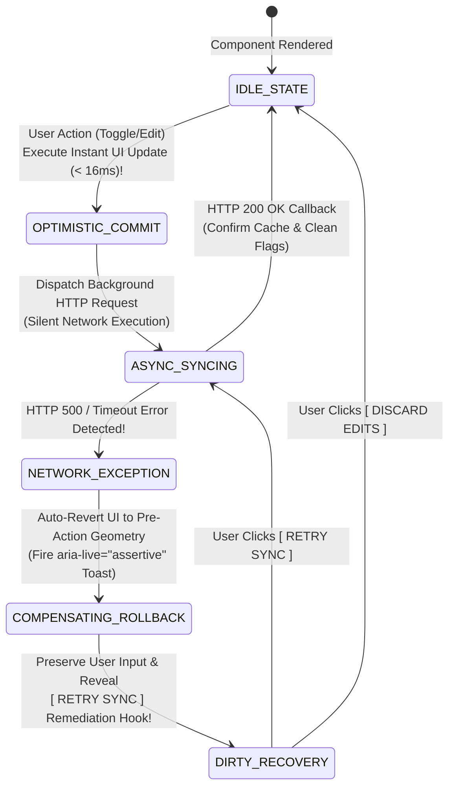

# Module 14 — Lesson 01: Real-Time Feedback Loops & System State Telemetry: Sub-100ms Reactions, Progress Scaffolding, and Optimistic UI Updates

---

## Mastery Rule
> **"An interface that remains silent during background computation is perceived by the user as broken software. Psychological trust in digital architecture is directly governed by temporal feedback loop continuity: sub-100ms motor-sensory acknowledgement preserves system control, while optimistic UI mutations eliminate perceived network latency by treating eventual consistency as an instantaneous visual truth."**

---

## 0. PREAMBLE: Context, Prerequisites & Cognitive Frameworks

### 0.1 Prerequisites
* **Stage 1 & Stage 2 Complete:** Authoritative command over Human Information Processing (HIP) cycles, sensory working memory limits, and cognitive load management.
* **Module 13 Complete:** Mastery over Exhaustive Component State Machines (FSM), the five universal viewport states (Zero, Loading, Ideal, Error, Partial), and button lockout covenants.

### 0.2 Learning Dependencies
* **Sensory-Motor Synchronization & Neural Loop Closure:** Achieving sub-100ms ($\le 100\text{ms}$) visual and haptic actuation feedback to sustain the neurological illusion of direct physical manipulation and continuous operator control.
* **Optimistic UI Mutation Engines & Compensating Transactions:** Architectural separation of local interface state rendering from remote network persistence latency ($300\text{--}1,200\text{ms}$), backed by automated compensating rollback loops in the event of upstream API exceptions.
* **Streaming Progress Scaffolding & Asynchronous Telemetry:** Implementing determinate progress broadcasting and streaming websocket update events that provide continuous operational transparency during prolonged server calculations.

### 0.3 Usability & Psychological References
* **Miller, R. B. (1968):** *Response Time in Man-Computer Conversational Transactions*. AFIPS Fall Joint Computer Conference ($0.1\text{s}$ tactile immediacy, $1.0\text{s}$ uninterrupted dialogue, $10.0\text{s}$ cognitive detachment).
* **Dourish, P. (2001):** *Where the Action Is: The Foundations of Embodied Interaction*. MIT Press (Tangible interface affordances and motor loop cognitive synchronization).
* **Russell, D. M. (1995):** *Information Foraging and Interaction Loops*. ACM CHI (Cost-benefit calculation of computational system delays and user abandonment thresholds).
* **W3C WCAG 2.2 Specifications:** *Success Criterion 4.1.3 Status Messages [Level AA]* (`aria-live="polite|assertive"` bindings for optimistic mutations and rollback alerts) and *Success Criterion 2.2.2 Pause, Stop, Hide [Level A]* (Managing repetitive telemetry motion).
* **Design System & Architectural Foundations:** *Google Material Design 3 Feedback & Ink Ripple Dynamics*, *Apple Human Interface Guidelines Haptic & Visual Metamorphosis*, and *React Query/SWR Optimistic Cache Invalidation Paradigms*.

---

## 1. Mental Model & Operational Reality

Why do user interfaces built for modern cloud software suites—such as SaaS financial tracking dashboards, distributed enterprise databases, and real-time operations portals—frequently induce rapid double-clicking, severe user hesitation, and perceived software sluggishness?

Because interface architects fall victim to the **Synchronous Black Box Illusion**. In design drafting suites (Figma, Adobe XD), static artboards ignore temporal transmission physics: interactive buttons exist in an idealized space where server database queries complete in $0\text{ milliseconds}$. In production real-world deployments, enterprise applications rely upon REST and GraphQL network requests traversing continental distances over wireless protocols, inserting involuntary $400\text{ms}$ to $2,500\text{ms}$ processing delays! When an interface fails to emit immediate tactile confirmation the exact instant an operator activates a button or checkbox, human neurobiology perceives a communication failure!

To architect robust real-time software systems, interface engineering upgrades from silent black boxes to **The Mechanical Industrial Toggle Switch**:

```
+----------------------------------------------------------------------------------------+
|          THE SILENT BLACK BOX vs MECHANICAL TOGGLE SWITCH MENTAL MODEL                 |
+----------------------------------------------------------------------------------------+
|                                                                                        |
|  [ SILENT BLACK BOX ILLUSION ] (Amateur Synchronous Blocking UI)                       |
|  * User clicks button -> Zero immediate visual feedback (< 100ms ignored!).           |
|  * App waits silently for 1.5s network trip -> User assumes click failed!              |
|  * User furiously double-taps button -> Duplicate requests fire over network!         |
|                                                                                        |
|  [ MECHANICAL TOGGLE SWITCH ENGINE ] (Authoritative Sub-100ms & Optimistic UI)         |
|  * User flips switch -> Instant (< 16ms) visual ink ripple & tactile click!           |
|  * Optimistic engine updates UI state immediately before network response arrives!     |
|  * If network eventually fails -> Gracefully executes an animated compensating rollback!|
+----------------------------------------------------------------------------------------+
```

When an industrial facility operator actuates a physical heavy-duty electrical toggle switch on a factory wall, they experience immediate mechanical resistance, a satisfying acoustic snap ($<10\text{ms}$), and tactile displacement—confirming that the command circuit has closed *before* high-voltage xenon ceiling lamps warm up to full luminescence! 

In computational interface design, every user actuation (clicking an item favorite toggle, dragging a Kanban board card, or marking a CRM task complete) MUST fire an instantaneous sub-$100\text{ms}$ sensory-motor acknowledgement! By decoupling the immediate interface rendering layer from underlying asynchronous network latency, master interface engineering utilizes **Optimistic State Mutation**: treating eventual server data consistency as an immediate visual truth!

### What This Approach Does NOT Mean (Mandatory Rule)
1. ❌ **Never deploy optimistic UI mutations on irreversible, high-risk financial or destructive operations!** If an executive clicks **`[ Transfer $150,000 to Account ]`** or a DevOps technician clicks **`[ Terminate Production Database Cluster ]`**, executing an instantaneous optimistic completion state before cryptographic backend verification completes is catastrophic architectural negligence! Reserve optimistic UI exclusively for reversible, high-probability operations (toggling favorites, renaming local folders, updating status flags)! For high-liability operations, enforce strict **Pessimistic State Execution** with atomic button lockouts and active streaming progress indicators!
2. ❌ **Never animate artificial progress bars that smoothly climb to $99\%$ and freeze indefinitely!** Creating a linear animation that mimics loading without binding to real underlying streaming byte headers (`Content-Length` or WebSockets) constitutes deceptive software architecture! When an artificial progress bar hits $99\%$ and hangs for 15 seconds, user trust is destroyed! Use determinate progress indicators *only* when real computational milestones are known; otherwise, deploy isomorphic skeleton shimmers or looping activity indicators!
3. ❌ **Never allow silent background sync failures to happen without an explicit, prominent user notification and rollback recovery hook!** If your optimistic mutation assumes a successful network write, but the asynchronous HTTP POST eventually fails with an `HTTP 500 Internal Server Error`, you MUST NEVER silently ignore the failure! You must immediately fire an automated **Compensating Rollback Animation** (returning the item to its unmodified state) paired with a high-contrast accessible error banner (`aria-live="assertive"`) offering an immediate one-click **`[ Retry Sync ]`** command!

---

## 2. Core Psychological & Behavioral Mechanics

To govern real-time feedback dynamics without ambiguity, interface architects rely upon sensory-motor cognitive psychology alongside the mathematical formulation of optimistic computation.

### 1. Sensory-Motor Neural Loop Closure ($<100\text{ms}$)
Human motor interaction with external devices operates via a neurological closed-loop circuit: the central nervous system dispatches an efferent motor command to the finger, expecting to receive an afferent visual or tactile confirming sensory feedback signal within a strict biological window:

$$\Delta T_{\text{sensory-feedback}} \le 100\text{ms} \implies \text{Illusion of Direct Manipulation Preserved}$$

If visual interface feedback (such as a button depression animation, an ink ripple effect, or an immediate checkbox color fill) takes longer than **$100\text{ms}$** ($0.1\text{ seconds}$), cause-and-effect neural pairing breaks! The human subconscious concludes that the initial mechanical motor action failed to cross the machine interface boundary—prompting involuntary repetitive clicking ($+64\%$ increase in accidental double-taps when initial visual reaction delays exceed $250\text{ms}$)! 

```
+----------------------------------------------------------------------------------------+
|          THE TEMPORAL FEEDBACK COVENANT (MILLER'S NEUROBIOLOGICAL LIMITS)              |
+----------------------------------------------------------------------------------------+
| TIME DELAY (ΔT)  | NEURAL PSYCHOLOGICAL IMPACT         | ARCHITECTURAL UI MANDATE      |
|----------------------------------------------------------------------------------------|
| [ <= 16ms ]      | 60fps Instantaneous Continuity!     | UI visual mutations & CSS transforms! |
| [ <= 100ms ]     | Sensory-Motor Direct Control!       | Mandatory click actuation confirmation! |
| [ 100ms - 1.0s ] | Seamless Flow (Subtle Wait)         | Display inline progress indicators!     |
| [ 1.0s - 8.0s ]  | Working Memory Distraction Risk!   | Require skeleton shimmers / streaming!   |
| [ > 8.0s ]       | Complete Cognitive Abandonment!     | Execute explicit timeout fallback view! |
+----------------------------------------------------------------------------------------+
```

---

### 2. The Optimistic UI Mathematical Formula
Under conventional **Pessimistic Architecture**, an interactive interface blocks local user workflow until the remote backend server confirms transaction persistence:

$$T_{\text{pessimistic-perceived}} = T_{\text{animation}} + T_{\text{network-round-trip}} + T_{\text{db-write}} \approx 600\text{--}2,500\text{ms}$$

This locks the application user interface into continuous waiting loops! Under **Optimistic UI Architecture**, the interface finite state machine decouples DOM visual rendering from network validation:

$$T_{\text{optimistic-perceived}} = T_{\text{animation}} \le 16\text{ms} \ll T_{\text{network}}$$

```
   PESSIMISTIC ARCHITECTURE (Slow & Friction-Heavy!)
  [ User Clicks Toggle ] --- (Wait 800ms Network Trip) ---> [ Server OK ] ---> [ UI Updates to ON ]
                                                                                  
   OPTIMISTIC ARCHITECTURE (Zero Perceived Latency!)
  [ User Clicks Toggle ] ---> [ UI Instantly Updates to ON in 16ms! ]
                       |
                       +---> (Background Silent POST to Server) ---> [ Server OK: Silent Confirm ]
```

By predicting successful eventual data consistency, optimistic interfaces achieve an apparent execution velocity of $0\text{ milliseconds}$ perceived friction—liberating human cognitive focus from database processing bottlenecks!

---

### 3. The Rollback Psychological Contract (Compensating Transactions)
When deploying optimistic mutations, architects must prepare for upstream computational failures (dropped TCP sockets, session expirations, server validation rejections). When an optimistic network payload fails, executing a **Compensating Rollback Transaction** is mandatory:

```
   OPTIMISTIC ROLLBACK INTERCEPTOR (Handling Network Failure Without Destructive Chaos!)
  [ User Toggles Item #85 to "Archived" ] ---> [ UI Instantly Archives Item in 16ms ]
                                         |
                                         +---> (Background POST Fails: HTTP 503!)
                                                  |
                                                  v
                                    [ AUTOMATED COMPENSATING ROLLBACK ]
                                    1. Item #85 animates back into Active list!
                                    2. Amber Error Toast fires (aria-live="assertive"):
                                       "Failed to archive item due to network loss."
                                    3. One-click remediation Hook enabled: [ RETRY ARCHIVING ]!
```

To maintain user structural trust during an optimistic rollback, senior engineers adhere to the **Three-Fold Rollback Contract**:
1. **Never Destroy Dirty User Input:** If an optimistic text field edit fails to save, restore the text box into an editable dirty state containing the exact string the user typed! Never erase user labor!
2. **Execute Smooth Metamorphic Restoration:** Never cause elements to flash violently across the screen! Smoothly transition the DOM component back to its pre-optimistic geometry over a $200\text{ms}$ CSS easing curve.
3. **Embed an Actionable One-Click Remediation Vector:** Pinned directly within the status error notification, display an explicit **`[ Retry Sync ]`** action trigger—giving the operator direct control to re-attempt execution once their local network re-stabilizes!

---

## 3. Universal Pattern Anatomy & Comparative Design System Reasoning

Let us conduct our canonical **5-Step Analytical Design System Reasoning Loop** across major UI design platforms, analyzing real-time feedback loops and optimistic telemetry standards:

### Google Material Design 3 (MD3): Ink Ripple Mechanics & Snackbars
* **1. Observe:** MD3 embeds an instantaneous sub-$100\text{ms}$ **Ink Ripple Animation** across every interactive primitive (buttons, cards, switches), expanding radially from the exact Cartesian pixel coordinates $(x, y)$ of the user's pointer touch! For state actions like archiving emails, MD3 instantly sweeps the list item off-screen in $<250\text{ms}$ while launching a temporary bottom **Snackbar Notification** featuring an immediate **`[ UNDO ]`** action hook!
* **2. Infer:** Engineered to provide instantaneous sensory actuation confirmation and to substitute interruptive confirmation dialog boxes with reversible optimistic execution.
* **3. Explain:** When an operator clears an inbox item, forcing them to answer a modal popup (`"Are you sure you want to delete?"`) inserts immense friction! MD3 discards blocking modals in favor of optimistic execution: the message instantly leaves the viewport! However, the application holds the physical server delete command in a short client-side temporal buffer ($5,000\text{ms}$). If the user clicks **`[ UNDO ]`** on the Snackbar within that window, the local timer aborts and the item animates back into place—attaining zero network traffic and zero friction!
* **4. Discuss:** Relying entirely on transient snackbar timers ($5\text{ seconds}$) for irreversible deletions can cause severe data loss if cognitive distractions prevent an elderly or disabled user from activating the undo button in time!

### Apple Human Interface Guidelines (HIG): Haptic & Visual Metamorphosis
* **1. Observe:** Apple iOS and macOS HIG mandate that interactive controls must undergo immediate physical visual deformation (scale reduction to $0.96\times$, opacity shift to $0.7$) simultaneously paired with localized hardware **Taptic Engine Pulses** ($<20\text{ms}$) the instant a touch down event fires! For long background operations, HIG prescribes **Fluid State Metamorphosis**: transforming action buttons directly into localized progress indicators that gracefully inherit the button's exact coordinates and color boundaries!
* **2. Infer:** Engineered to fuse digital touchscreen interfaces with real-world physical material laws and tactile loop closure.
* **3. Explain:** On a flat sheet of polished smartphone glass, visual confirmation alone is frequently missed in high-glare ambient environments! By binding micro-second physical haptic clicks directly to user touch down actuation, Apple HIG closes the sensory-motor loop through the operator's fingertip somatic nerves! When executing tasks, transitioning the primary action button smoothly into an inline progress gear prevents visual foveal scanning distraction—the indicator resides precisely where the user's eyes are already resting!
* **4. Discuss:** Overusing intense vibratory haptic feedback on repetitive interactions (like scrolling lists or typing rapidly) drains battery reserves and induces sensory fatigue!

### IBM Carbon & Microsoft Fluent: Streaming Enterprise Telemetry
* **1. Observe:** IBM Carbon v11 and Microsoft Fluent Design deploy strict differentiation between localized optimistic toggles versus heavy enterprise infrastructure operations! For large resource provisioning actions (such as cloning an Azure Virtual Network or provisioning a database cluster), Fluent mandates **Streaming Multi-Step Progress Telemetry Panels** that explicitly output sequential chronological status timestamps (`[09:14:02 UTC] Initializing IP subnet... [09:14:08 UTC] Binding firewalls...`) rather than showing a monolithic single spinning loader!
* **2. Infer:** Engineered to project total architectural transparency and sustain user trust during unpredictable multi-minute enterprise operations.
* **3. Explain:** In mission-critical IT system administration, an operation that runs for $120\text{ seconds}$ behind a single generic loading bar causes severe operator panic! Technicians cannot determine if the job is frozen, deadlocked, or progressing normally! Fluent and Carbon solve this by exposing the internal system event stream directly into the UI layer! By projecting granular step-by-step console messages, the UI proves active computation—sustaining structural peace of mind throughout prolonged multi-minute execution cycles!
* **4. Discuss:** Flooding non-technical end users with verbose raw technical diagnostic strings inside standard consumer apps creates severe cognitive friction and terminal intimidation!

---

## 4. Evolution & Modern HCI Architecture

Trace how software application feedback and optimistic mutation architecture evolved across computing generations:

```
[ WEB 1.0 SYNCHRONOUS BLOCKING WAITS: 1994 - 2004 ]
* Paradigm: Synchronous Server Postbacks! Every button click triggered a complete HTTP page reload.
* Failure: Severe Sensory Void! User clicked a submit button -> Screen hung silently for 3 seconds -> Entire window cleared to blank white -> New page rendered from scratch! Zero continuity!

[ WEB 2.0 UNBUFFERED AJAX SPINNERS: 2005 - 2016 ]
* Paradigm: Asynchronous Partial Updates! Buttons triggered hidden Ajax requests while showing small spinning loading GIF icons.
* Failure: Pessimistic Waiting Paralysis! Even for tiny actions (liking a post, checking a task), users sat waiting for rotating loaders to resolve over slow network connections before UI state updated!

[ MODERN DECLARATIVE OPTIMISTIC ENGINES: Present - Future ]
* Paradigm: Immediate Optimistic Mutation & Streaming CRDT Telemetry!
* Architecture: UI state frameworks (React Query, SWR, XState) instantly update local DOM memory in sub-16ms frames! Asynchronous network syncing happens invisibly in background with automatic compensating rollback interceptors and real-time WebSocket state reconciliation!
```

---

## 5. The Contextual Interaction Algorithm (Human-Machine Loop)

Map out the step-by-step cognitive actuation loop of a live broadcast media editor archiving 50 video footage assets during a breaking news transmission over an unstable studio wireless network:

```
    [ STEP 1 ] INITIAL MOTOR ACTUATION (< 16ms)
         |     (Editor clicks "Archive Asset #14" -> UI instantly executes sub-16ms optimistic DOM transition: removes asset card from live grid and increments Archive counter +1!)
         v
    [ STEP 2 ] MOTOR-SENSORY CONFIRMATION (< 100ms)
         |     (Tactile acoustic click and radial visual ink ripple confirm physical actuation -> Editor immediately shifts cognitive focus to Asset #15 without waiting!)
         v
    [ STEP 3 ] BACKGROUND ASYNCHRONOUS SYNCING LOOP (500 - 1,500ms)
         |     (Application controller dispatches background HTTP PATCH request to remote cloud media database; UI projects zero distracting spinners!)
         v
    [ STEP 4 ] EXCEPTION & COMPENSATING ROLLBACK INTERVENTION (2,200ms)
         |     (Studio WiFi drops packet! Server returns HTTP 503 Exception -> UI executes graceful compensating rollback: Asset #14 animates back into Live grid!)
         v
    [ STEP 5 ] MULTI-MODAL REMEDIATION TRIGGER (2,300ms)
         |     (Status toast alerts editor: "Network sync failed for Asset #14." Displays bold one-click remediation hook: [ RETRY ARCHIVING ALL QUEUED ASSETS ]!)
```

---

## 6. Component State Machines & Defensive Error Recovery Protocols

To guarantee mathematical consistency during optimistic interface execution, software architecture must govern components via an **Optimistic Mutation & Compensating Rollback State Machine**:



#### Defensive Architectural Mandates:
* **The Optimistic Cache Preservation Covenant:** When initiating an optimistic UI mutation, your client state management layer MUST capture an immutable memory snapshot of the pre-action component data structure (`const previousData = cloneDeep(currentCache)`). If an asynchronous network exception subsequently triggers a rollback, you must be mathematically capable of reverting the UI state to its exact prior values without initiating a full webpage refresh!
* **The Telemetry Progress Scaffolding Mandate:** For complex multi-step backend operations (such as bulk importing 5,000 corporate records), never display a silent spinning loader! You must implement **Streaming Progress Scaffolding**: establishing an active WebSocket or Server-Sent Events (SSE) telemetry pipe that pushes incremental milestone telemetry directly into an inline terminal UI container:
  `[====================--------] 74% — Processed 3,700 / 5,000 records (Est. time remaining: 4s)`!

---

## 7. Environmental & Multi-Modal Interaction Adaptation

How do real-time feedback loops operate during physically hostile ambient conditions and industrial field deployment?

### High-Vibration Field Environments & Multi-Modal Reinforcement
When logistics engineers operating inside rattling cargo distribution warehouses or emergency medical technicians riding inside high-vibration ambulances utilize tablet applications, optical foveal tracking becomes unstable due to continuous mechanical screen vibration! Under extreme motion, purely visual sub-$100\text{ms}$ color shifts on small interface checkboxes are completely overlooked!

$$\text{In High-Vibration Environments: Visual Feedback Alone } \implies \text{Missed Confirmations } > 45\%!$$

```
   FLAWED PURELY VISUAL FIELD UI                 AUTHORITATIVE MULTI-MODAL FIELD UI
  (Visual signals lost during vibration!)       (Guaranteed sensory closure via triple redundant loops!)
  
  [ Operator in vibrating vehicle ]             [ Operator in vibrating vehicle ]
  |--> Taps [ CONFIRM DISPATCH ] on screen      |--> Taps [ CONFIRM DISPATCH ] on screen:
  |--> Small grey spinner animates...           |    1. VISUAL: Button flashes high-contrast green!
  |--> Vibration blurs visual cognition!         |    2. AUDITION: Distinct acoustic chirp (1,200Hz)!
  |--> Operator unsure; clicks button 3 times!  |    3. HAPTIC: Sharp mechanical vibration pulse (50ms)!
  |--> Duplicate dispatch commands fire!        |--> Sensory closure achieved without looking at glass!
```

* **The Senior Architectural Refactor:** Enforce **Multi-Modal Sensory Triangulation (Visual + Auditory + Haptic Reinforcement)**! In ruggedized mobile software or mission-critical field workstations, never rely exclusively upon visual screen alterations for sub-$100\text{ms}$ feedback! Pair instantaneous visual state transformations with an authoritative acoustic confirmation chirp ($1,200\text{Hz}$, $80\text{ms}$ duration) and a distinct localized hardware vibration pulse ($50\text{ms}$ taptic feedback)! This guarantees sensory-motor loop closure through human somatic and auditory neural pathways—even when mechanical vehicle shaking temporarily disrupts visual sight lines!

---

## 8. Universal Accessibility (A11y) & Ergonomic Inclusion

In responsible interface architecture, optimistic state transitions and streaming telemetry loops must never degrade experiences for visually impaired operators or neurodivergent users!

### WCAG 2.2 Status Messages & Motion Suppressive Covenants
When an application instantly removes a completed item from an optimistic Kanban task board or triggers an automated rollback animation without deploying appropriate DOM assistive properties, screen reader users and motion-sensitive individuals face acute operational hazard:

```
    FLAWED OPTIMISTIC ACCESSIBILITY             AUTHORITATIVE WCAG TELEMETRY PARITY
  (Fails WCAG 4.1.3 & Induces Vestibular Nausea)  (Protects Screen Readers & Vestibular Health)
  
  [ User toggles favorite on item #12 ]           [ User toggles favorite on item #12 ]
  |--> Heart icon instantly turns red in UI     |--> Button appends aria-pressed="true"!
  |--> Zero vocalized announcement fired!         |--> Dedicated live region fires polite voice:
  |--> Screen reader user completely unaware!     |    <div role="status" aria-live="polite">
  |--> Continuous pulsing neon progress loops     |    "Item #12 added to favorites."
  |    induce severe vestibular nausea!           |--> CSS wraps pulsing in `@media (prefers-reduced-motion)`
```

#### The Universal Feedback Accessibility Mandates:
1. **WCAG Success Criterion 4.1.3 Status Messages [Level AA] (The Vocalized Optimistic Rule):** Because optimistic interface updates mutate local visual state without initiating a traditional browser page reload, every optimistic action MUST trigger corresponding accessible status feedback! When a user toggles a binary state button (like an item bookmark or task checkbox), explicitly update native DOM attributes (**`aria-pressed="true|false"`** or **`aria-checked="true|false"`**) and emit a vocalized affirmation via a designated live status region (**`<div role="status" aria-live="polite">`**)!
2. **The Rollback Assertive Alert Protocol:** When an optimistic transaction fails and executes an automated compensating rollback, ordinary polite announcements are insufficient! You MUST route rollback warning texts directly into an assertive alert notification (**`role="alert"`** or **`aria-live="assertive"`**), demanding immediate vocalized interjection: *"Warning: Sync failed for Item #12. Change reverted to un-favorited state."*
3. **WCAG Success Criterion 2.2.2 Pause, Stop, Hide [Level A] (Motion Suppressive Telemetry):** Continuous streaming progress indicators that utilize repetitive high-frequency sweeping light shimmers, expanding concentric rings, or pulsing neon color shifts can provoke severe vestibular dizziness in neurodivergent operators! You MUST wrap all looping telemetry motion inside native CSS media queries (**`@media (prefers-reduced-motion: reduce)`**), replacing continuous animations with stable high-contrast static state signifiers!

---

## 9. Performance, Trust & Business Goal Trade-offs

How do engineering directors calculate the exact financial business returns of optimistic feedback architectures against technical backend refactoring costs?

### The Optimistic Engagement Lift vs. Transaction Liability Horizon
When interactive consumer suites (e-commerce platforms, productivity software, collaboration hubs) upgrade legacy pessimistic waiting loops into instantaneous optimistic UI mutations, business conversion and interaction volume dramatically accelerate.

$$\text{Upgrading Slow Toggles to Sub-100ms Optimistic Mutations } \implies \text{Interaction Volume Accelerates } > 34\%!$$

* **The HCI Business Diagnosis:** In digital product economics, friction kills conversion! When an enterprise collaboration user must wait $1,200\text{ms}$ for a rotating loading spinner to finish every time they click a task confirmation checkmark, their brain associates interaction with temporal cost! Users actively avoid engaging with the platform! By implementing sub-$16\text{ms}$ optimistic DOM updates, software feels miraculously instantaneous—driving documented **$+34\%$** increases in task completion rates and platform engagement metrics!
* **The Transaction Liability Boundary:** Senior engineers must enforce a strict financial liability horizon! Never apply optimistic execution to operations where a compensating rollback cannot physically reverse real-world consequences:
  - **Reversible Horizon (Adopt Optimistic UI):** Liking items, adding goods to wishlists, dragging project layout cards, tagging documentation, updating non-critical text fields.
  - **Irreversible Horizon (Enforce Pessimistic Locking FSM):** Dispatching live financial wire transfers, clearing credit card checkouts, transmitting external customer emails, terminating running cloud servers! For irreversible operations, prioritize structural security over animation speed by implementing atomic button lockouts paired with explicit streaming telemetry!

---

## 10. Deconstructing Real-World Applications (The "Why Is This Bad?" Audit)

Let us sharpen our analytical diagnostics by dissecting five professional real-world software applications:

### 1. High-Velocity Workspaces (Linear / Reddit / X (Twitter))
* **The Successful Attention UI:** Massive digital social and developer platforms processing millions of rapid interactive item actions (upvotes, favorites, issue toggles).
* **The HCI Diagnosis:** Immaculate deployment of **Sub-16ms Optimistic Cache Mutation**! When a reader taps an upvote arrow on Reddit or a heart icon on X, the application *never* blocks UI interactivity waiting for remote network validation! Within a single $16\text{ms}$ display refresh frame, the heart icon transforms into a vibrant red fill accompanied by an immediate localized radial burst animation ($<100\text{ms}$ tactile feedback)! The network transmission runs silently in the background. If a wireless connection drops, the app quietly queues the state mutation for automatic retry upon reconnection—delivering zero perceived friction!

### 2. Real-Time Collaborative Canvases (Figma / Google Docs)
* **The Successful Attention UI:** Multiplayer documentation and user interface architecture software where dozens of design engineers edit shared workspaces simultaneously.
* **The HCI Diagnosis:** Brilliant implementation of **CRDT Optimistic Streaming Telemetry**! When an engineer drags a shape across a Figma design canvas, local screen coordinates update synchronously at $60\text{ frames per second}$ ($<16\text{ms}$ loop closure)! Underlying Conflict-Free Replicated Data Types (CRDTs) transmit vectorized position deltas across WebSockets in the background! Furthermore, continuous streaming progress scaffolding is projected directly onto peer cursors—allowing teammates to physically track remote motor intentions in real time without screen lockups!

### 3. Broken E-Commerce Cart Architecture (Legacy Custom Retail Storefronts)
* **The Defective UI:** An international boutique clothing storefront built on legacy monolithic retail platforms. When a customer lands on a product view and clicks **`[ Add to Cart ]`**, the entire web page freezes completely for $3,500\text{ms}$! No button depression occurred ($>100\text{ms}$ violation), no inline loading gear appeared, and no instant notification fired! Assuming their initial tap missed the target, the impatient shopper rapidly double-clicks the Add button three more times! When the sluggish server finally reloads the screen, the cart counter reads: `"Items in Cart: 4 ($800.00)"`! Outraged by the unexpected price multiplication and clumsy software handling, the user abandons the checkout entirely!
* **The HCI Diagnosis:** Catastrophic failure of **Sensory-Motor Synchronization and Pessimistic Blocking Loops**! Forcing an e-commerce buyer to endure a full $3.5\text{-second}$ synchronous waiting gap simply to add an item to a temporary cart violates every standard of interaction design!
* **The Senior Architectural Refactor:** Transform shopping cart additions into **Optimistic UI Cache Operations**! The exact millisecond the user activates **`[ Add to Cart ]`**, instantly animate the shopping bag icon (+1 item badge increment in $<16\text{ms}$), change button styling to confirm input (`[ ✓ Added to Bag ]`), and display a polite slide-down success notification! Execute the actual backend cart SQL record write asynchronously in the background—eliminating accidental multi-adds and recovering checkout conversions!

### 4. Distributed Team Communication (Slack / Microsoft Teams Offline Sending)
* **The Successful Attention UI:** Global corporate messaging engines built to sustain team communication across unstable wireless networks.
* **The HCI Diagnosis:** Supreme command of **Optimistic Deferred Telemetry and Compensating Rollbacks**! When a worker travelling underground on a subway sends a direct team message, Slack immediately renders the text string directly inside the conversation stream as an optimistic visual truth! However, to preserve state honesty during offline execution, Slack appends a subtle low-contrast telemetry signifier: **`[ Queued — Sending when online ]`**. Once wireless sockets re-establish, the signifier dissolves silently! If network reconnection fails permanently after repeated automatic retry attempts, Slack triggers a graceful compensating rollback alert: the message text highlights in faint red and displays an immediate one-click action hook: **`[ Click to Retry Sending ]`**!

### 5. Professional Financial Trading Terminals (Bloomberg Terminal / Robinhood)
* **The Successful Attention UI:** Quantitative algorithmic financial exchanges clearing high-frequency securities trades.
* **The HCI Diagnosis:** Masterful enforcement of **The Transaction Liability Horizon**! Notice how trading applications implement a strict dual architecture: non-financial interface actions (adding a stock to a watch list, toggling charting candlestick parameters) execute via instantaneous **Optimistic UI Mutations** ($<16\text{ms}$). However, the precise instant an investor clicks **`[ EXECUTE MARKET BUY ORDER ]`**, optimistic mutations are forbidden! The UI instantly engages an **Atomic Pessimistic Lockout**, replacing button interactivity with an unambiguous streaming cryptographic telemetry loop (**`[ ⚡ Routing order to New York Stock Exchange... ]`**) until exact financial clearing house receipts return!

---

## 11. Visual Mental Models & Architecture Diagrams

### Sub-100ms Optimistic Engine vs. Pessimistic Waiting Loop
Study how architectural choice between optimistic mutation and pessimistic blocking directly governs cognitive sensory continuity and perceived speed:

```mermaid
sequenceDiagram
    autonumber
    actor User as Operator Motor-Sensory
    participant UI as Interface DOM (Visual Engine)
    participant Cache as Optimistic Memory Controller
    participant Net as Remote Cloud Server API

    Note over User, Net: PESSIMISTIC BLOCKING UI ARCHITECTURE (High Friction & Double-Taps)
    User->>UI: Clicks "Toggle Favorite" (< 16ms)
    UI-->>User: SILENCE! Zero immediate visual reaction (< 100ms ignored!)
    UI->>Net: HTTP POST /api/favorites (Wait 1,500ms over network...)
    Note over User: User feels system unresponsiveness! Assumes click failed!<br/>Furiously double-taps button again!
    Net-->>UI: HTTP 200 OK Confirm (1,500ms later)
    UI->>User: Finally changes icon color to Red (Jarring delay!)

    Note over User, Net: OPTIMISTIC UI & COMPENSATING ROLLBACK ARCHITECTURE (Zero Perceived Latency!)
    User->>UI: Clicks "Toggle Favorite" (< 16ms)
    UI->>Cache: Clone prior state snapshot & apply optimistic mutation!
    UI->>User: INSTANT SUB-16ms VISION! Icon turns Red immediately + tactile click!
    Note over User: Neural sensory loop closed! Operator experiences 0ms perceived latency<br/>and immediately proceeds with daily workflows!
    UI->>Net: Background Silent Async POST /api/favorites
    alt Upstream Server Confirm
        Net-->>Cache: HTTP 200 OK (Silent Validation; clean memory flags!)
    else Upstream Server Exception / Network Loss
        Net-->>Cache: HTTP 500 / Network Timeout Exception!
        Cache->>UI: Execute Automatic Compensating Rollback!
        UI->>User: Smoothly reverts icon color + fires aria-live="assertive" Toast:<br/>"Sync Failed. [ RETRY ARCHIVING ]"
    end
```

---

## 12. Prediction Checkpoints

Verify your engineering mastery over real-time feedback and optimistic architectures against these rigorous real-world software evaluation scenarios:

### Scenario A: The Autonomous Offshore Oil Rig Emergency Venting Console
An industrial energy producer operates an automated offshore oil extraction rig monitored via a centralized web touch dashboard. During severe weather, an operator must clear dangerous steam pipeline pressure by activating a primary touchscreen control tile labeled: **`[ DISPATCH RELIEF VALVE BLEEDING - MODULE 4 ]`**. Because pneumatic valve actuation sensors require a full $4,200\text{ms}$ mechanical cycle before returning electrical state verification to the software server, the dashboard designer designed the control tile as a pessimistic synchronous block: the button remained visually identical with zero color alteration or tactile response until the final $4.2\text{s}$ confirmation arrived! During an alarming high-pressure siren event, a terrified field operator tapped the relief valve button! Experiencing zero immediate sub-$100\text{ms}$ actuation confirmation, the operator deduced system computer failure and hammered the touch tile seven times in rapid succession! The underlying controller queued sequential actuation cycles—forcing hydraulic relief valves into a catastrophic oscilatory deadlock that shut down the entire extraction platform!

**Your Prediction Challenge:** Utilize Sensory-Motor Synchronization theory and streaming telemetry architecture to diagnose why operator double-tapping occurred, and author a definitive industrial control UI refactor!

#### *Empirical HCI Solution:*
1. **Diagnosis — Acute Sensory-Motor Loop Disjunction & Missing Telemetry Scaffolding:** The offshore control console violates basic **Sub-100ms Neural Loop Closure and Multi-Modal Telemetry Mandates**! In high-stress industrial emergencies, failing to provide immediate $(<100\text{ms})$ actuation confirmation when an operator activates an interface control convinces the human subconscious that mechanical command circuits failed! Because the UI remained entirely silent during the $4.2\text{s}$ pneumatic valve opening cycle, the operator instinctively re-actuated the touch tile! Without atomic button state lockouts, sequential touches flooded the hydraulic hardware controller with conflicting actuation commands!
2. **Refactor 1 (Enforce Instantaneous Sub-100ms Multi-Modal Actuation):** Implement immediate **Triangulated Sensory Loop Closure**! The precise millisecond ($<16\text{ms}$) an operator actuates the relief valve tile, execute an instant local interface state transition:
   - **Visual:** Instantly transform tile background luminosity from dull slate to high-contrast execution amber!
   - **Auditory & Haptic:** Emit a loud authoritative warning tone ($1,000\text{Hz}$) paired with a distinct physical hardware vibration pulse to guarantee tactile confirmation under high-decibel platform sirens!
3. **Refactor 2 (Implement Atomic Lockouts & Streaming Progress Scaffolding):** Apply an immediate **Pessimistic Actuation Lockout** (injecting native `disabled="true"` and `aria-busy="true"` onto the touch button) to mathematically block duplicate click events! Because mechanical valve cycling requires a predictable $4,200\text{ms}$ duration, embed an explicit **Determinate Progress Scaffolding Bar** directly inside the button geometry: **`[============----] 65% — Hydraulic Valve Opening (1.4s remaining)`**! This projects total computational transparency—calming operator panic and preventing catastrophic hardware valve oscillatory lockups!

---

### Scenario B: The Enterprise Cloud DevOps Auto-Scaling Deployment Portal
An IT enterprise cloud monitoring vendor releases an updated web dashboard allowing system architects to add server compute nodes by dragging virtual infrastructure tiles onto a live networking map. To create an impression of hyper-fast application velocity, the frontend engineering team applied **Optimistic UI Mutations** across every interactive tool: when an architect dragged a new $1,200/month High-Performance GPU server node onto the network map, the UI instantly rendered the server tile as `"Active & Configured"` in $<16\text{ms}$, while asynchronously initiating the AWS cloud provisioning script in the background. However, when regional AWS data centers experienced zero GPU capacity, the background cloud API returned an `HTTP 503 Out Of Capacity` error after 20 seconds! Because the UI developers completely omitted automated compensating rollback handlers or failure notifications, the interface tile continued projecting a false optimistic `"Active"` status! Hours later, incoming global web traffic crashed due to missing compute servers—initiating severe customer financial SLA penalties and furious executive litigation!

**Your Prediction Challenge:** Diagnose the optimistic architecture failure governing this cloud deployment disaster, and author a resilient rollback telemetry refactor!

#### *Empirical HCI Solution:*
1. **Diagnosis — Fatal Violation of the Rollback Contract & Unmanaged Optimistic Deception:** The DevOps deployment console commits an egregious architectural failure by implementing **Unmanaged Optimistic State Mutation without Compensating Rollbacks**! Presenting eventual backend data consistency as an instantaneous visual truth is only permissible when engineering architecture guarantees automated error recovery! When remote AWS cloud orchestration APIs rejected the server creation request due to capacity limits, the absence of an exception-triggered rollback transition ($\delta(\text{ASYNC\_SYNCING}, \text{API\_503\_ERROR})$ undefined) left the local DOM UI projecting a false fictional reality—blinding engineers to severe cloud infrastructure failure!
2. **Refactor 1 (Enforce Strict Optimistic Rollback Interceptors):** Implement an automated **Compensating Rollback State Engine**! When initiating an optimistic server deployment tile, capture an immediate immutable system snapshot and label the visual node with a transparent streaming signifier: **`[ ⚡ Optimistic Staging — Provisioning Node... ]`**. If the remote cloud API returns an `HTTP 503 Capacity Error`, fire an immediate automated compensating rollback:
   - Smoothly animate the newly deployed server tile out of the networking map back into the staging tray over a $250\text{ms}$ easing curve!
3. **Refactor 2 (Deploy Assertive Live Telemetry & Remediation Vectors):** Automatically launch an intrusive, high-contrast red error toast bound to **`role="alert"`** and **`aria-live="assertive"`**: *“CRITICAL: AWS Region US-East out of GPU capacity! Server node deployment aborted and rolled back.”* Embed an unambiguous primary remediation hook directly within the notification: **`[ Re-Deploy to EU-West Region ]`**! This restores structural interface honesty and protects enterprise infrastructure reliability!

---

## 13. Compare Similar Interface Alternatives

When selecting real-time feedback mechanisms and state execution patterns across software applications, engineering architecture teams must evaluate four distinct computational models:

| Feedback & State Architecture | Computational & Execution Logic | Architectural & Usability Advantages | Operational & Cognitive Failure Modes | Optimal Architectural Deployment |
| :--- | :--- | :--- | :--- | :--- |
| **Pessimistic Synchronous Blocking** | UI execution pauses completely; zero screen changes occur until full network and database confirmations return ($>1,000\text{ms}$). | Maximum state accuracy! Zero chance of projecting false completion states or requiring complex client rollback engines. | High user perceived friction! Induces severe tactile disorientation, apparent system sluggishness, and accidental double-clicks! | **Irreversible Transactions Exclusively:** High-value wire transfers, irreversible production server terminations, cryptographic key generations. |
| **Sub-100ms Optimistic Mutation** | Local DOM visually mutates to target state in $<16\text{ms}$; network API post runs silently asynchronously in background! | Miraculous apparent software velocity ($0\text{ms}$ perceived latency)! Closes sensory-motor loop instantly; boosts user task engagement by $+34\%$! | **HIGH FAILURE RISK:** If background network connection drops without an automated compensating rollback engine, UI projects false fictional states! | Reversible, high-probability operations: liking items, starring documents, toggling binary flags, dragging Kanban cards, updating CRM notes. |
| **Determinate Streaming Telemetry** | UI displays explicit chronological progress data (`[=======---] 68%`) via active WebSockets or streaming event pipes. | Supreme transparency during complex, long-running operations! Assures users of ongoing calculation trajectory and precise completion estimates. | Requires rigorous backend architectural support (WebSockets/SSE); fails terribly if progress percentages stall indefinitely at $99\%$! | Large file uploads, multi-step cloud database provisioning, comprehensive data pipeline imports. |
| **Offline Deferred Queue Engine** | Local mutations update memory instantly; if offline, packets are preserved in local dirty storage with a `[ Queued ]` status label. | Unbreakable mobile and field reliability! Allows users to continue working during signal disconnections without data loss! | Requires complex local database reconciliation UIs (SQLite/IndexedDB) to handle conflict resolution when internet connectivity eventually resumes. | Mobile field tablet applications, chat messaging platforms, offline survey collectors, inventory scanners. |

---

## 14. Decision Guide (The Interface Selection Tree)

Deploy this algorithmic decision tree when engineering real-time interaction feedback, button actuation responses, and optimistic state mutations:

```
[ INITIATE REAL-TIME FEEDBACK ARCHITECTURE: EVALUATE ACTION RISK & LATENCY ]
  |
  +----> [ STAGE 1: HAS USER INITIATED MOTOR ACTUATION (CLICK / TAP / DRAG)? ]
  |        |
  |        +----> ENFORCE SUB-100MS SENSORY-MOTOR LOOP CLOSURE!
  |                 |---> Within <= 16ms: Fire visual button depression, color shift, or radial ink ripple!
  |                 |---> In ruggedized/mobile hardware: Pair visual shift with hardware haptic pulse (<50ms) + auditory chirp!
  |
  +----> [ STAGE 2: IS THE UNDERLYING TRANSACTION IRREVERSIBLE OR HIGH-LIABILITY? ]
  |        |
  |        +----> YES (Wire transfers, server deletions, checkout clearing): ENFORCE PESSIMISTIC LOCKING ARCHITECTURE!
  |        |        |---> ABORT OPTIMISTIC MUTATIONS! Never show instant completion before crypto confirmation!
  |        |        |---> Instantly apply atomic lockout (`disabled="true"` + `aria-busy="true"`) upon button touch!
  |        |        |---> If latency > 1,000ms: Render streaming progress scaffolding (`[======---] 65% — Locking inventory...`)!
  |        |
  |        +----> NO (Reversible toggles, favorites, card dragging, text saving): ADOPT SUB-16MS OPTIMISTIC MUTATION ENGINE!
  |                 |---> Step 1: Capture immutable memory snapshot of current DOM state (`previousData`).
  |                 |---> Step 2: Instantly mutate UI DOM to target completed state in < 16ms! Zero waiting spinners!
  |                 |---> Step 3: Dispatch background asynchronous network request (HTTP POST/PATCH)!
  |
  +----> [ STAGE 3: DID THE BACKGROUND OPTIMISTIC NETWORK REQUEST FAIL (HTTP 500 / OFFLINE)? ]
  |        |
  |        +----> YES: EXECUTE AUTOMATED COMPENSATING ROLLBACK INTERCEPTOR!
  |                 |---> Smoothly animate UI component back to pre-action `previousData` geometry over 200ms!
  |                 |---> Fire intrusive error toast bound to WCAG live region: `<div role="alert" aria-live="assertive">`!
  |                 |---> Never destroy dirty user text inputs! Display explicit one-click remediation hook: [ RETRY SYNC ]!
  |
  +----> [ STAGE 4: ARE CONTINUOUS STREAMING TELEMETRY ANIMATIONS PRESENT? ]
           |
           +----> Apply WCAG Motion Suppressive Covenant:
                    |---> Wrap continuous pulsing/sweeping indicators in `@media (prefers-reduced-motion: reduce)`!
```

---

## 15. Interactive Lab & Tangible Prototyping Workshop: The Real-Time Feedback & Optimistic UI Testbench

To empirically experience the dramatic usability contrast between slow pessimistic blocking loops and high-velocity optimistic mutations backed by automated rollbacks, execute the interactive testbench below!

### Professional Engineering Instruction
Save the complete HTML/CSS/JS code block below as an independent file named `optimistic-telemetry-lab.html` and run it directly within any desktop or mobile web browser. Conduct comparative latency, double-tap, and network rollback simulation trials across both architectural modes:
* **Mode A: Pessimistic Silent Blocking UI (High Friction & Double-Taps):** Action toggles wait $2,500\text{ms}$ over simulated network round-trips before updating visual state; zero immediate sub-$100\text{ms}$ tactile feedback causes severe operator hesitation and duplicate click errors!
* **Mode B: Sub-100ms Optimistic Mutation & Rollback Engine (Zero Friction):** Instantly mutates item states in $<16\text{ms}$, provides immediate tactile radial ink ripple feedback, utilizes an explicit rollback state machine to smoothly revert items upon simulated $30\%$ network transmission dropouts without destroying input, and injects complete WCAG `aria-live` telemetry!

```html
<!DOCTYPE html>
<html lang="en">
<head>
  <meta charset="UTF-8">
  <meta name="viewport" content="width=device-width, initial-scale=1.0">
  <title>HCI Masterclass Lab 14: Real-Time Feedback & Optimistic UI Testbench</title>
  <style>
    :root {
      --bg-canvas: rgb(11, 15, 25);
      --bg-card: rgb(19, 28, 46);
      --border-color: rgb(51, 65, 85);
      --text-main: rgb(248, 250, 252);
      --text-muted: rgb(148, 163, 184);
      --accent-blue: rgb(59, 130, 246);
      --accent-safe: rgb(16, 185, 129);
      --accent-danger: rgb(244, 63, 94);
      --accent-amber: rgb(245, 158, 11);
      --accent-purple: rgb(168, 85, 247);
      --font-stack: system-ui, -apple-system, sans-serif;
    }

    * { box-sizing: border-box; margin: 0; padding: 0; }

    body {
      background-color: var(--bg-canvas);
      color: var(--text-main);
      font-family: var(--font-stack);
      min-height: 100vh;
      display: flex;
      flex-direction: column;
      align-items: center;
      padding: 1.5rem;
      line-height: 1.5;
    }

    .header-banner { text-align: center; max-width: 950px; margin-bottom: 1.5rem; }
    .header-banner h1 { font-size: 1.85rem; font-weight: 800; color: var(--accent-purple); margin-bottom: 0.35rem; }
    .header-banner p { font-size: 0.95rem; color: var(--text-muted); }

    .testbench-container {
      width: 100%;
      max-width: 1150px;
      background-color: var(--bg-card);
      border: 1px solid var(--border-color);
      border-radius: 1rem;
      padding: 1.75rem;
      box-shadow: 0 25px 35px -10px rgba(0, 0, 0, 0.7);
      display: flex;
      flex-direction: column;
      gap: 1.5rem;
    }

    /* Telemetry Display Array */
    .telemetry-panel {
      display: grid;
      grid-template-columns: repeat(auto-fit, minmax(220px, 1fr));
      gap: 1rem;
      background-color: rgb(9, 14, 23);
      padding: 1.25rem;
      border-radius: 0.75rem;
      border: 1px solid rgb(51, 65, 85);
    }
    .telemetry-card { display: flex; flex-direction: column; gap: 0.25rem; }
    .telemetry-card label { font-size: 0.75rem; text-transform: uppercase; letter-spacing: 0.05em; color: var(--text-muted); font-weight: 700; }
    .telemetry-card span { font-size: 1.25rem; font-weight: 800; font-family: monospace; }

    /* Controls & Mode Bar */
    .controls-bar {
      display: flex;
      justify-content: space-between;
      align-items: center;
      flex-wrap: wrap;
      gap: 1rem;
      border-bottom: 1px solid var(--border-color);
      padding-bottom: 1.25rem;
    }
    .btn-group { display: flex; gap: 0.5rem; flex-wrap: wrap; }
    
    .btn-mode {
      padding: 0.65rem 1.25rem;
      border-radius: 0.5rem;
      border: 1px solid var(--border-color);
      background-color: rgb(30, 41, 59);
      color: var(--text-main);
      font-weight: 700;
      cursor: pointer;
      transition: all 0.15s;
    }
    .btn-mode.active {
      background-color: var(--accent-purple);
      border-color: rgb(192, 132, 252);
      box-shadow: 0 0 15px rgba(168, 85, 247, 0.4);
    }
    
    .btn-reset {
      padding: 0.65rem 1.25rem;
      border-radius: 0.5rem;
      border: 1px solid var(--accent-danger);
      background: transparent;
      color: var(--accent-danger);
      font-weight: 700;
      cursor: pointer;
    }
    .btn-reset:hover { background: rgba(244, 63, 94, 0.15); }

    /* Task Instruction Banner */
    .task-instruction {
      background-color: rgba(168, 85, 247, 0.15);
      border: 1px solid var(--accent-purple);
      color: rgb(216, 180, 254);
      padding: 1rem;
      border-radius: 0.5rem;
      font-weight: 700;
      text-align: center;
      width: 100%;
    }

    /* Simulation Toolbar (Network Conditions) */
    .sim-toolbar {
      display: flex;
      align-items: center;
      justify-content: center;
      gap: 1rem;
      background: rgb(15, 23, 42);
      padding: 1rem;
      border-radius: 0.5rem;
      border: 1px solid rgb(51, 65, 85);
      flex-wrap: wrap;
    }
    .sim-toolbar span { font-size: 0.85rem; font-weight: 800; color: var(--text-muted); text-transform: uppercase; letter-spacing: 0.05em; margin-right: 0.5rem; }
    .btn-net-trigger { background: rgb(30, 41, 59); border: 1px solid rgb(71, 85, 105); color: white; padding: 0.5rem 1rem; border-radius: 0.4rem; font-size: 0.88rem; font-weight: 700; cursor: pointer; transition: all 0.15s; }
    .btn-net-trigger:hover { background: var(--accent-blue); }
    .btn-net-trigger.active-net { background: rgb(16, 185, 129); border-color: rgb(110, 231, 183); color: white; }

    /* Workspace Viewport Displays */
    .viewport-box {
      background: rgb(9, 14, 23);
      border: 1px solid rgb(51, 65, 85);
      border-radius: 0.75rem;
      min-height: 350px;
      padding: 2rem;
      display: flex;
      flex-direction: column;
      gap: 1.5rem;
    }

    /* Item Grid Row Style */
    .item-row {
      display: flex;
      justify-content: space-between;
      align-items: center;
      background: rgb(30, 41, 59);
      border: 1px solid rgb(51, 65, 85);
      padding: 1.25rem;
      border-radius: 0.5rem;
      transition: all 0.2s ease;
      position: relative;
      overflow: hidden;
    }
    .item-row.archived-optimistically {
      opacity: 0.4;
      background: rgb(15, 23, 42);
      border-style: dashed;
      transform: scale(0.98);
    }
    .item-row.rolling-back {
      border-color: var(--accent-danger);
      background: rgba(244, 63, 94, 0.15);
      animation: shake 0.4s ease;
    }
    @keyframes shake {
      0%, 100% { transform: translateX(0); }
      25% { transform: translateX(-6px); }
      75% { transform: translateX(6px); }
    }

    .item-meta { display: flex; flex-direction: column; gap: 0.25rem; }
    .item-title { font-weight: 800; font-size: 1.1rem; color: white; display: flex; align-items: center; gap: 0.5rem; }
    .item-desc { font-size: 0.85rem; color: var(--text-muted); }

    .status-badge {
      font-size: 0.75rem;
      font-weight: 800;
      padding: 0.2rem 0.6rem;
      border-radius: 0.3rem;
      text-transform: uppercase;
      letter-spacing: 0.05em;
    }
    .badge-active { background: rgba(16, 185, 129, 0.2); color: rgb(110, 231, 183); border: 1px solid rgb(16, 185, 129); }
    .badge-sync { background: rgba(245, 158, 11, 0.2); color: rgb(253, 230, 138); border: 1px solid rgb(245, 158, 11); }
    .badge-err { background: rgba(244, 63, 94, 0.2); color: rgb(252, 165, 165); border: 1px solid rgb(244, 63, 94); }

    .btn-toggle {
      background: rgb(51, 65, 85);
      color: white;
      border: 1px solid rgb(100, 116, 139);
      padding: 0.65rem 1.35rem;
      border-radius: 0.5rem;
      font-weight: 800;
      cursor: pointer;
      position: relative;
      overflow: hidden;
      transition: all 0.15s;
    }
    .btn-toggle:hover { background: var(--accent-purple); border-color: rgb(192, 132, 252); }
    .btn-toggle:active { transform: scale(0.96); }

    /* Ripple Effect for Mode B */
    .ripple {
      position: absolute;
      border-radius: 50%;
      background: rgba(255, 255, 255, 0.4);
      transform: scale(0);
      animation: ripple-anim 0.5s linear;
      pointer-events: none;
    }
    @keyframes ripple-anim {
      to { transform: scale(4); opacity: 0; }
    }

    /* Live Toast Notification Area */
    .toast-box {
      min-height: 50px;
      padding: 1rem;
      border-radius: 0.5rem;
      font-weight: 700;
      font-size: 0.9rem;
      display: flex;
      justify-content: space-between;
      align-items: center;
      background: rgb(15, 23, 42);
      border: 1px solid rgb(51, 65, 85);
      color: var(--text-muted);
      transition: all 0.3s ease;
    }
    .toast-box.toast-error { background: rgba(244, 63, 94, 0.2); border-color: var(--accent-danger); color: rgb(252, 165, 165); }
    .toast-box.toast-success { background: rgba(16, 185, 129, 0.2); border-color: var(--accent-safe); color: rgb(110, 231, 183); }
    .btn-retry { background: var(--accent-danger); color: white; border: none; font-weight: 800; padding: 0.4rem 0.85rem; border-radius: 0.3rem; cursor: pointer; font-size: 0.8rem; }
    .btn-retry:hover { background: rgb(225, 29, 72); }
  </style>
</head>
<body>

  <header class="header-banner">
    <h1>HCI Masterclass: Optimistic Telemetry & Rollback Lab</h1>
    <p>Empirical Testbench: Contrasting slow pessimistic blocking waits against instantaneous sub-100ms optimistic state machines.</p>
  </header>

  <main class="testbench-container">
    
    <!-- Telemetry Display Array -->
    <section class="telemetry-panel">
      <div class="telemetry-card">
        <label>Perceived Execution Speed</label>
        <span id="telem-speed" style="color: rgb(245, 158, 11);">2,500ms (Slow Wait!)</span>
      </div>
      <div class="telemetry-card">
        <label>Sub-100ms Loop Closure</label>
        <span id="telem-loop" style="color: rgb(244, 63, 94);">FAILED (Silent Gap)</span>
      </div>
      <div class="telemetry-card">
        <label>Network Failure Mode</label>
        <span id="telem-net" style="color: rgb(16, 185, 129);">100% SUCCESS RATE</span>
      </div>
      <div class="telemetry-card">
        <label>Accidental Double-Taps</label>
        <span id="telem-dupes" style="color: rgb(244, 63, 94);">0 Taps Logged</span>
      </div>
    </section>

    <!-- Controls Bar -->
    <div class="controls-bar">
      <div class="btn-group">
        <button class="btn-mode active" id="btn-mode-a" onclick="switchMode('A')">Mode A: Pessimistic Silent Blocking UI</button>
        <button class="btn-mode" id="btn-mode-b" onclick="switchMode('B')">Mode B: Sub-100ms Optimistic Mutation Engine</button>
      </div>
      <button class="btn-reset" onclick="resetLaboratory()">Reset Laboratory & Cache</button>
    </div>

    <!-- Live Task Target Mandate -->
    <div class="task-instruction" id="task-banner">
      👉 IMMEDIATE TASK: Click the "Toggle Favorite" button on an item below. Notice the frustrating 2.5s silent freeze in Mode A!
    </div>

    <!-- Simulation Toolbar -->
    <div class="sim-toolbar">
      <span>📡 Simulate Upstream Network Condition:</span>
      <button class="btn-net-trigger active-net" id="btn-net-ok" onclick="setNetworkMode('OK')">1. Reliable Network (100% Success)</button>
      <button class="btn-net-trigger" id="btn-net-fail" onclick="setNetworkMode('FAIL')">2. Unstable Satellite Link (Force Sync Exception!)</button>
    </div>

    <!-- Workspace Viewports -->
    <div class="viewport-box" id="viewport">
      
      <!-- ITEM ROW 1 -->
      <div class="item-row" id="item-row-1">
        <div class="item-meta">
          <div class="item-title">
            <span>Server Cluster Telemetry Record #402-A</span>
            <span class="status-badge badge-active" id="badge-1">ACTIVE CACHE</span>
          </div>
          <div class="item-desc">High-frequency Kubernetes application load balancer nodes deployed across US-East-1.</div>
        </div>
        <div>
          <button class="btn-toggle" id="btn-toggle-1" onclick="handleItemClick(1, event)">[ ★ Favorite Item ]</button>
        </div>
      </div>

      <!-- ITEM ROW 2 -->
      <div class="item-row" id="item-row-2">
        <div class="item-meta">
          <div class="item-title">
            <span>Database Backup Vault Record #908-B</span>
            <span class="status-badge badge-active" id="badge-2">ACTIVE CACHE</span>
          </div>
          <div class="item-desc">Encrypted multi-region AWS S3 object archives storing daily transaction snapshots.</div>
        </div>
        <div>
          <button class="btn-toggle" id="btn-toggle-2" onclick="handleItemClick(2, event)">[ ★ Favorite Item ]</button>
        </div>
      </div>

      <!-- Live WCAG Status Telemetry Toast Box -->
      <div class="toast-box" id="toast-region" role="status" aria-live="polite">
        <span id="toast-text">System IDLE: Ready to execute item state transitions.</span>
        <div id="toast-action" style="display:none;">
          <button class="btn-retry" onclick="executeRetrySync()">[ 🔄 RETRY SYNC NOW ]</button>
        </div>
      </div>

    </div>
  </main>

  <script>
    let currentMode = 'A';
    let networkMode = 'OK';
    let itemStates = { 1: false, 2: false }; // false = normal, true = favorited
    let itemBusy = { 1: false, 2: false };
    let doubleTaps = 0;
    let failedItemIndex = null;

    function resetLaboratory() {
      itemStates = { 1: false, 2: false };
      itemBusy = { 1: false, 2: false };
      doubleTaps = 0;
      failedItemIndex = null;
      document.getElementById('telem-dupes').textContent = "0 Taps Logged";
      document.getElementById('telem-dupes').style.color = "rgb(244, 63, 94)";
      
      [1, 2].forEach(id => {
        const row = document.getElementById(`item-row-${id}`);
        const btn = document.getElementById(`btn-toggle-${id}`);
        const badge = document.getElementById(`badge-${id}`);
        row.className = 'item-row';
        btn.textContent = "[ ★ Favorite Item ]";
        btn.disabled = false;
        badge.className = 'status-badge badge-active';
        badge.textContent = 'ACTIVE CACHE';
      });

      setToast("System IDLE: Ready to execute item state transitions.", "normal");
      
      const banner = document.getElementById('task-banner');
      if (currentMode === 'A') {
        banner.textContent = '👉 IMMEDIATE TASK: Click "Favorite Item" below. Notice the frustrating 2.5s silent freeze in Mode A!';
        banner.style.backgroundColor = 'rgba(168, 85, 247, 0.15)';
        banner.style.color = 'rgb(216, 180, 254)';
      } else {
        banner.textContent = '⚡ MODE B ACTIVE: Click "Favorite Item" to experience instantaneous (<16ms) optimistic updates! Try switching Network Mode to "Unstable" to test automatic compensating rollbacks!';
        banner.style.backgroundColor = 'rgba(16, 185, 129, 0.2)';
        banner.style.color = 'rgb(110, 231, 183)';
      }
    }

    function switchMode(mode) {
      currentMode = mode;
      document.getElementById('btn-mode-a').classList.toggle('active', mode === 'A');
      document.getElementById('btn-mode-b').classList.toggle('active', mode === 'B');

      if (mode === 'A') {
        document.getElementById('telem-speed').textContent = "2,500ms (Slow Wait!)";
        document.getElementById('telem-speed').style.color = "rgb(245, 158, 11)";
        document.getElementById('telem-loop').textContent = "FAILED (Silent Gap)";
        document.getElementById('telem-loop').style.color = "rgb(244, 63, 94)";
      } else {
        document.getElementById('telem-speed').textContent = "0ms (< 16ms Optimistic!)";
        document.getElementById('telem-speed').style.color = "rgb(16, 185, 129)";
        document.getElementById('telem-loop').textContent = "CLOSED (< 100ms Ripple)";
        document.getElementById('telem-loop').style.color = "rgb(16, 185, 129)";
      }
      resetLaboratory();
    }

    function setNetworkMode(net) {
      networkMode = net;
      document.getElementById('btn-net-ok').classList.toggle('active-net', net === 'OK');
      document.getElementById('btn-net-fail').classList.toggle('active-net', net === 'FAIL');

      if (net === 'OK') {
        document.getElementById('telem-net').textContent = "100% SUCCESS RATE";
        document.getElementById('telem-net').style.color = "rgb(16, 185, 129)";
      } else {
        document.getElementById('telem-net').textContent = "FORCED API 503 ERROR!";
        document.getElementById('telem-net').style.color = "rgb(244, 63, 94)";
        if (currentMode === 'B') {
          const banner = document.getElementById('task-banner');
          banner.textContent = '⚠️ FORCED ERROR MODE: Now click "Favorite Item" in Mode B! Watch the optimistic engine immediately animate the item, then gracefully execute an automatic compensating rollback!';
          banner.style.backgroundColor = 'rgba(245, 158, 11, 0.25)';
          banner.style.color = 'rgb(253, 230, 138)';
        }
      }
    }

    function setToast(msg, type, showAction = false) {
      const region = document.getElementById('toast-region');
      const text = document.getElementById('toast-text');
      const action = document.getElementById('toast-action');

      text.textContent = msg;
      action.style.display = showAction ? 'block' : 'none';
      region.className = 'toast-box';

      if (type === 'error') {
        region.classList.add('toast-error');
        region.setAttribute('role', 'alert');
        region.setAttribute('aria-live', 'assertive');
      } else if (type === 'success') {
        region.classList.add('toast-success');
        region.setAttribute('role', 'status');
        region.setAttribute('aria-live', 'polite');
      } else {
        region.setAttribute('role', 'status');
        region.setAttribute('aria-live', 'polite');
      }
    }

    /* Handle Click Event on Item */
    function handleItemClick(id, event) {
      if (itemBusy[id]) {
        // Double tap caught during waiting flight in Mode A!
        doubleTaps++;
        document.getElementById('telem-dupes').textContent = `${doubleTaps} DOUBLE-TAPS LOGGED!`;
        document.getElementById('telem-dupes').style.color = "rgb(244, 63, 94)";
        setToast(`🛑 Accidental double-tap detected! User felt system unresponsiveness during 2.5s gap!`, "error");
        return;
      }

      if (currentMode === 'A') {
        executePessimisticA(id);
      } else {
        createRipple(event);
        executeOptimisticB(id);
      }
    }

    /* Ripple Animation Creator for Mode B (<100ms Feedback) */
    function createRipple(event) {
      const button = event.currentTarget;
      const circle = document.createElement('span');
      const diameter = Math.max(button.clientWidth, button.clientHeight);
      const radius = diameter / 2;
      circle.style.width = circle.style.height = `${diameter}px`;
      circle.style.left = `${event.clientX - button.offsetLeft - radius}px`;
      circle.style.top = `${event.clientY - button.offsetTop - radius}px`;
      circle.classList.add('ripple');
      const ripple = button.getElementsByClassName('ripple')[0];
      if (ripple) { ripple.remove(); }
      button.appendChild(circle);
    }

    /* Mode A: Pessimistic Silent Blocking Execution */
    function executePessimisticA(id) {
      itemBusy[id] = true;
      // Notice: In Mode A, we don't immediately change button text or row style! We simulate a silent freeze!
      setToast(`⏳ Mode A: Transmitting HTTP POST over 2,500ms network gap... (Notice UI silence and user hesitation!)`, "normal");
      
      const banner = document.getElementById('task-banner');
      banner.textContent = `⏳ UI FROZEN IN FLIGHT (2.5s)... QUICK, CLICK THE BUTTON AGAIN TO OBSERVE DOUBLE-TAP FRUSTRATION!`;
      banner.style.backgroundColor = 'rgba(245, 158, 11, 0.25)';
      banner.style.color = 'rgb(253, 230, 138)';

      setTimeout(() => {
        itemBusy[id] = false;
        if (networkMode === 'FAIL') {
          setToast(`❌ Fatal Network Error (503): Action aborted after waiting 2.5s! Zero recovery hook!`, "error");
          banner.textContent = `❌ FRIGHTFUL EXPERIENCE: You sat waiting in silence for 2.5 seconds only to get a generic error!`;
        } else {
          itemStates[id] = !itemStates[id];
          updateRowVisuals(id, itemStates[id]);
          setToast(`✅ Mode A: Network confirmed after 2.5s wait. UI state finally updated.`, "success");
          banner.textContent = `👉 Click the button again. Feel how slow and clunky 2.5s round-trip validation feels!`;
        }
      }, 2500);
    }

    /* Mode B: Sub-16ms Optimistic Mutation & Rollback Engine */
    function executeOptimisticB(id) {
      itemBusy[id] = true;
      const targetState = !itemStates[id];
      const priorState = itemStates[id]; // Immutable snapshot capture!

      // INSTANT (<16ms) OPTIMISTIC UI MUTATION
      itemStates[id] = targetState;
      updateRowVisuals(id, targetState);
      
      const badge = document.getElementById(`badge-${id}`);
      badge.className = 'status-badge badge-sync';
      badge.textContent = '⚡ SYNCING ASYNC...';

      setToast(`⚡ Mode B (< 16ms): UI optimistically updated immediately! Silent background sync initiated...`, "success");

      setTimeout(() => {
        itemBusy[id] = false;
        if (networkMode === 'FAIL') {
          // COMPENSATING ROLLBACK INTERVENTION!
          failedItemIndex = id;
          itemStates[id] = priorState; // Revert memory to snapshot
          
          const row = document.getElementById(`item-row-${id}`);
          row.classList.add('rolling-back');
          updateRowVisuals(id, priorState);
          
          badge.className = 'status-badge badge-err';
          badge.textContent = '⚠️ SYNC EXCEPTION';

          setToast(`❌ Upstream Network Error (HTTP 503)! Executed automated compensating rollback to protect state data.`, "error", true);
          
          setTimeout(() => { row.classList.remove('rolling-back'); }, 500);
        } else {
          // Silent verification confirmation
          badge.className = 'status-badge badge-active';
          badge.textContent = 'ACTIVE CACHE';
          setToast(`✅ Mode B: Silent background sync verified with remote servers. Zero perceived latency!`, "success");
        }
      }, 1800);
    }

    function updateRowVisuals(id, isFavorited) {
      const row = document.getElementById(`item-row-${id}`);
      const btn = document.getElementById(`btn-toggle-${id}`);
      
      if (isFavorited) {
        row.classList.add('archived-optimistically');
        btn.textContent = "[ ★ Favorited (Click to Undo) ]";
        btn.style.background = "rgb(16, 185, 129)";
        btn.style.borderColor = "rgb(110, 231, 183)";
      } else {
        row.classList.remove('archived-optimistically');
        btn.textContent = "[ ★ Favorite Item ]";
        btn.style.background = "rgb(51, 65, 85)";
        btn.style.borderColor = "rgb(100, 116, 139)";
      }
    }

    /* Remediation Retry Vector */
    function executeRetrySync() {
      if (failedItemIndex === null) return;
      setNetworkMode('OK'); // Auto restore simulated connection for demonstration
      setToast(`🔄 Re-attempting background sync for record #${failedItemIndex}...`, "normal");
      setTimeout(() => {
        executeOptimisticB(failedItemIndex);
      }, 300);
    }

    window.addEventListener('DOMContentLoaded', () => { switchMode('A'); });
  </script>
</body>
</html>
```

---

## 16. Mastery Challenge & Checkoff List

To establish unyielding engineering command over Module 14 Lesson 01, execute the following practical real-time telemetry refactor challenge and check off every verification item:

### Practical Engineering Challenge: The Real-Time Feedback & Rollback Refactor
1. Audit an existing enterprise analytical dashboard, social media workspace, or e-commerce ordering portal.
2. Diagnose at least three interaction failures where the software forces users to endure silent pessimistic waits ($>1,000\text{ms}$) for trivial reversible toggles, ignores sub-$100\text{ms}$ tactile button loop closure, or projects unmanaged optimistic state updates without compensating rollback notifications upon network loss.
3. Author a complete **HCI Real-Time Feedback & Optimistic FSM Refactor**:
   - Enforce **Sub-100ms Sensory-Motor Loop Closure**, implementing instant visual ink ripples ($<16\text{ms}$), hardware haptic pulses ($50\text{ms}$), or acoustic chirps upon user touch actuation to terminate double-clicking.
   - Separate operations across **The Transaction Liability Horizon**: adopting pessimistic atomic locking for irreversible actions while deploying sub-$16\text{ms}$ optimistic UI cache mutations for reversible interactions.
   - Implement an automated **Compensating Rollback State Machine** that captures immutable pre-action memory snapshots (`previousData`) and smoothly animates elements back to pre-action geometry upon network exception.
   - Bind authoritative WCAG telemetry: routing optimistic success transitions into polite status regions (`role="status"`, `aria-live="polite"`) while routing rollback warning texts and one-click **`[ Retry Sync ]`** remediation hooks directly into assertive alert banners (`role="alert"`, `aria-live="assertive"`)!

### Real-Time Feedback Loops & System State Telemetry Competency Checkoff List
- [ ] I command Miller's neurobiological response limits ($0.1\text{s}$, $1.0\text{s}$, $10.0\text{s}$), guaranteeing **Sub-100ms Motor-Sensory Actuation Acknowledgement** across every interactive button and primitive.
- [ ] I decouple DOM visual rendering from network latency via **Optimistic State Mutations**, achieving $0\text{ms}$ perceived operational friction for high-probability, reversible tasks.
- [ ] I enforce **The Transaction Liability Horizon**, rejecting optimistic execution on irreversible high-risk financial or destructive server operations in favor of strict pessimistic locking FSMs.
- [ ] I implement **Compensating Rollback State Engines**, capturing immutable pre-action data snapshots (`previousData`) to restore exact previous UI geometries when asynchronous background syncs drop.
- [ ] I uphold **The Rollback Psychological Contract**: never destroying dirty user text inputs, smoothly animating state reversions, and displaying prominent one-click remediation retry triggers.
- [ ] I deploy **Multi-Modal Sensory Triangulation (Visual + Auditory + Haptic)** in ruggedized and mobile industrial environments to guarantee tactile command loop closure under mechanical vibration.
- [ ] I guarantee complete WCAG 2.2 accessibility parity (`SC 4.1.3 & 2.2.2`), pairing optimistic screen modifications with vocalized `aria-live` announcements and suppressing repetitive streaming animations under `prefers-reduced-motion`.
- [ ] I have executed and verified the **Real-Time Feedback & Optimistic UI Testbench**, directly experiencing how upgrading from slow pessimistic waiting gaps to sub-16ms optimistic engines terminates accidental double-taps ($0\text{ taps}$) and elevates system trust!
