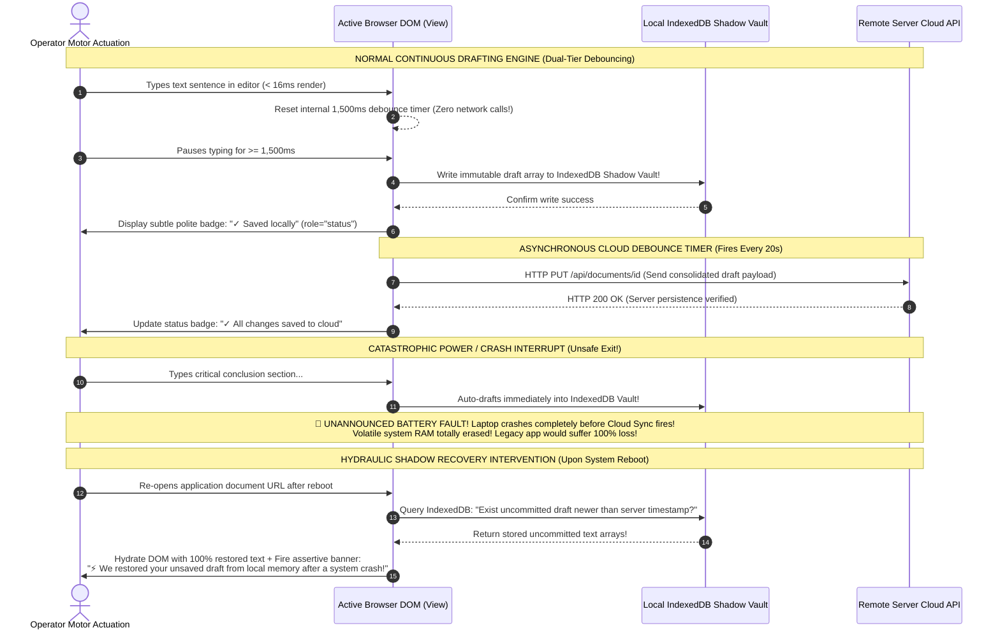

# Module 15 — Lesson 01: Defensive Error Recovery & Data Preservation: Active Recovery Architecture: Undo, Autosave, Drafts, and Conflict Resolution

---

## Mastery Rule
> **"Human operational error is not a user moral failure; it is an invariant computational hardware condition. Designing interfaces that punish slips with irreversible data destruction or cryptic technical exception dialogs violates fundamental software ethics. Master interface architecture treats every operator action as reversible by default—deploying non-destructive undo buffers, proactive autosave memory engines, and clear three-way data conflict resolution protocols to guarantee absolute data preservation under any computational hazard."**

---

## 0. PREAMBLE: Context, Prerequisites & Cognitive Frameworks

### 0.1 Prerequisites
* **Stage 1 & Stage 2 Complete:** Authoritative command over cognitive perceptual limitations, working memory retention thresholds, and Fitts’s Law spatial targeting dynamics.
* **Module 13 & Module 14 Complete:** Mastery over exhaustive Finite State Machines (FSM), real-time feedback loops, optimistic state mutations, and automated compensating rollback protocols.

### 0.2 Learning Dependencies
* **The Psychology of Slips vs. Mistakes:** Integrating Dr. James Reason’s Human Error Taxonomy and Don Norman’s error classification systems to systematically design preventative interface affordances versus post-actuation recovery engines.
* **Reversible by Default & The Command Pattern:** Decoupling user interface actuation from permanent data destruction via object-oriented encapsulation (the GoF Command and Memento patterns), establishing non-destructive local undo stacks and time-travel state recovery UIs.
* **Proactive Data Preservation & Local Resilience:** Architecting client-side debounced autosave loops that persist volatile user text input inside resilient browser memory engines (Web Storage, IndexedDB, SQLite) to defeat unexpected network crashes, battery failures, and session timeouts.
* **Conflict Resolution Architecture (3-Way Merging & CRDTs):** Handling simultaneous collaborative data mutations by replacing silent server overwrites with structured three-way diffing interfaces, Operational Transformation (OT), and Conflict-Free Replicated Data Types (CRDTs).

### 0.3 Usability & Psychological References
* **Reason, J. (1990):** *Human Error*. Cambridge University Press (Foundational classification of human operational failure into cognitive slips, operational lapses, strategic mistakes, and intentional violations).
* **Norman, D. A. (1983 & 2013):** *Design Rules Based on Analyses of Human Error* & *The Design of Everyday Things*. MIT Press / Basic Books (Physical and software forcing functions, interlocks, and reversible action mechanics).
* **Gamma, E., Helm, R., Johnson, R., & Vlissides, J. (1994):** *Design Patterns: Elements of Reusable Object-Oriented Software*. Addison-Wesley (The behavioral Command and Memento computational design patterns).
* **Raskin, J. (2000):** *The Humane Interface*. Addison-Wesley (Empirical demonstrating that modal confirmation dialogs fail due to habituation, advocating for universal non-destructive Undo).
* **W3C WCAG 2.2 Specifications:** *Success Criterion 3.3.4 Error Prevention (Legal, Financial, Data) [Level AA]* (Mandating reversible submissions, validation steps, and confirmation mechanics) and *Success Criterion 4.1.3 Status Messages [Level AA]* (`role="status"` and `aria-live="polite"` bindings for recovery toasts and autosave telemetry).
* **Design System Standards:** *Google Material Design 3 Undo Snackbars & Auto-save Patterns*, *Apple Human Interface Guidelines Shake-to-Undo & Non-Destructive Version Vaulting*, and *GitHub/GitLab Visual Three-Way Conflict Diffing Standards*.

---

## 1. Mental Model & Operational Reality

Why do legacy software suites—such as content management systems (CMS), enterprise customer relationship portals, and internal clinical data software—regularly inflict catastrophic data loss upon innocent system operators?

Because legacy developers rely upon the **Modal Popup Tyranny Fallacy**: believing that inserting an interruptive confirmation dialog box (`"Are you sure you want to delete this record? [OK] / [Cancel]"`) directly in front of a destructive action safely shields users from accidents! In behavioral neurobiology, modal confirmation UIs collapse completely under **Automaticity & Habituation**! When an operator repeatedly performs routine daily actions inside software, motor actuation loops migrate from slow, deliberate executive prefrontal cortex cognition into rapid basal ganglia automaticity! When a confirmation popup habitually appears after every click, the operator’s eye-hand loop memorizes the exact pixel spacing and clicks **`[ OK ]`** within **$<200\text{ms}$**—completely ignoring the warning string text! When a destructive accident does occur, the modal confirmation fails to prevent it—while leaving zero technical mechanisms to reverse the loss!

To architect human-tolerant interfaces, senior engineering teams upgrade from fragile glass bowls to **The High-Altitude Acrobat Safety Net**:

```
+----------------------------------------------------------------------------------------+
|          FRAGILE GLASS BOWL vs SELF-HEALING ACROBAT SAFETY NET MENTAL MODEL            |
+----------------------------------------------------------------------------------------+
|                                                                                        |
|  [ FRAGILE GLASS BOWL ILLUSION ] (Amateur Volatile & Modal UI)                         |
|  * Uses interruptive "Are you sure?" popups -> Users click [OK] on auto-pilot!          |
|  * Edits live only in volatile RAM -> Browser crash or session timeout deletes all!    |
|  * Deletions instantly wipe database rows -> Zero recovery possible; total despair!    |
|                                                                                        |
|  [ HIGH-ALTITUDE SAFETY NET ENGINE ] (Authoritative Defensive Recovery Architecture)    |
|  * Eliminates interruption -> Actions execute immediately in non-destructive buffer!   |
|  * Debounced continuous local drafting saves every keystroke into persistent IndexedDB!|
|  * 3-way conflict resolution diffing protects collaborative edits from overwrite!      |
+----------------------------------------------------------------------------------------+
```

When high-altitude aerial trapeze acrobats perform gymnastics above an arena deck, they do not pause mid-air to answer a spoken confirmation prompt (`"Are you sure you wish to release the bar?"`). Instead, engineers deploy a resilient physical safety net directly above the concrete floor! Because the acrobats know that any physical slip drops safely into the elastic net without bodily destruction, they perform complex maneuvers at maximum confidence and velocity!

In computational interface engineering, every interactive data mutation must be architected as **Reversible by Default**. When a user deletes a folder or dismisses an email, the application executes immediately without blocking popups—dropping the removed record into a client-side non-destructive memory buffer and surfacing a high-contrast **`[ UNDO ]`** recovery vector! By continuously drafting active input into encrypted local database vaults (IndexedDB/Web Storage) at debounced intervals, resilient software guarantees complete labor restoration even when operating system crashes or wireless disconnections strike!

### What This Approach Does NOT Mean (Mandatory Rule)
1. ❌ **Never replace irreversible real-world physical or financial operations solely with a short-lived 5-second undo toast!** If an enterprise financial officer activates **`[ Execute $250,000 International Wire Transfer ]`** or an IT admin activates **`[ Terminate Production Database Cluster ]`**, relying entirely upon a 5-second slide-in banner for error recovery is criminal architectural negligence! Once money clears an external bank network or storage volumes are physically scrubbed, local undo memory arrays are powerless! For high-liability, non-computational external actions, enforce mandatory multi-stage cryptographic staging or explicit **Typed Forcing Functions** (requiring the operator to manually type out `DELETE /production-db-01` before the commit circuit enables)!
2. ❌ **Never design autosave engines that silently overwrite a teammate's remote edits during collaborative synchronization!** If Developer A edits a paragraph on their laptop offline while Developer B simultaneously edits the same section on a remote server, simple timestamp-based client autosaving that executes `PUT /document` directly over the server will silently overwrite and delete Developer B’s legitimate work! When concurrent writes collide, your state machine MUST intercept the transaction and present an explicit **Three-Way Conflict Resolution Diffing UI**!
3. ❌ **Never display raw database or runtime programming stack trace exceptions directly to non-technical users during recovery UIs!** Throwing an intrusive error modal containing `"Uncaught SQLException: Integrity constraint violation (1062 Duplicate entry) at AbstractDao.java:412"` terrifies normal users and provides zero actionable recovery guidance! Convert system exceptions into plain-language human diagnostic statements accompanied by explicit one-click remediation hooks (**`[ Save Duplicate as New Version ]`** or **`[ Retain Original Record ]`**)!

---

## 2. Core Psychological & Behavioral Mechanics

To construct data preservation engines without guesswork, interface architects fuse human cognitive error classification with object-oriented software patterns.

### 1. Dr. James Reason’s Error Taxonomy: Slips vs. Mistakes
In authoritative human neurobiology, human operational error is strictly categorized into two separate neurological failure modes:

$$\text{Total Operational Human Error } \equiv \text{ Motor Automaticity Slips } \cup \text{ Cognitive Planning Mistakes}$$

* **1. Slips & Lapses (Motor Execution Automaticity Failures):** Occur when an operator's high-level goal is completely correct, but subconscious motor coordination misfires during manual execution! Example: an accountant intends to click **`[ Archive Account ]`** but due to Fitts’s Law targeting proximity on a small touchscreen, their thumb accidentally actuates the adjacent **`[ Delete Account ]`** button! Slips happen *after* conscious intent is finalized.
* **2. Mistakes (Cognitive & Diagnostic Planning Failures):** Occur when manual motor execution functions perfectly, but the underlying strategic goal or operational diagnosis is fundamentally flawed! Example: a DevOps engineer deliberately navigates to a server control panel and intentionally deletes the server—genuinely (but wrongly) believing they are logged into a temporary staging environment rather than the live production cluster!

```
+----------------------------------------------------------------------------------------+
|          THE ERROR REMEDIATION MATRIX (REASON'S TAXONOMY IN UI DESIGN)                 |
+----------------------------------------------------------------------------------------+
| ERROR CLASS        | NEUROBIOLOGICAL CAUSE        | ARCHITECTURAL RECOVERY SOLUTION      |
|----------------------------------------------------------------------------------------|
| [ MOTOR SLIPS ]    | Automaticity / Proximity     | Non-Destructive UNDO Toasts (< 10s)  |
| [ MEMORY LAPSES ]  | Working Memory Overload      | Persistent Autosave & Draft Recovery |
| [ COGNITIVE MISTAKES]| Wrong Situational Diagnosis| Typed Forcing Functions & Interlocks |
| [ SYSTEM CRASHES ] | OS Fault / Battery Drop      | Local IndexedDB Shadow Vaults        |
+----------------------------------------------------------------------------------------+
```

You cannot solve cognitive planning mistakes with simple 5-second undo toasts, and you cannot solve motor slips with intrusive confirmation modal popups! You must deploy targeted software architecture tailored precisely to the underlying neurological failure vector!

---

### 2. The Confirmation Dialog Habituation Loop
Why did Jef Raskin (inventor of the Apple Macintosh project) forcefully campaign to abolish modal confirmation dialogs? Because human neural adaptation creates a predictable decay curve:

$$\text{Warning Efficacy } (E) = \frac{1}{\log(\text{Repetition Count} + 1)} \implies \text{As Repetitions } \to \infty, \; E \to 0!$$

```
   THE MODAL CONFIRMATION DIALOG TRAP (Why "Are You Sure?" Fails!)
  [ Action Actuated ] ---> [ Popup Modal Appears ] ---> [ Eye Glances Over Text ]
                                                               |
    +----------------------------------------------------------+
    | ( आफ्टर 10 Repetitions: Oculomotor Loop Skips Reading!)
    v
  [ Muscle Memory Automatically Taps "OK" in <200ms! ] ---> [ Unintended Destruction Occurs! ]
                                                               |
                                                               v
                                                [ NO UNDO POSSIBLE: CATASTROPHE! ]

   THE NON-DESTRUCTIVE UNDO BUFFER COVENANT (Why Reversible Architecture Succeeds!)
  [ Action Actuated ] ---> [ UI Removes Item Immediately in <16ms! ]
                       |
                       +---> (Item moved to Temporary Soft-Delete Buffer in Client Memory)
                       +---> [ Toast Fires: "Item deleted." (With Bold [ UNDO ] Hook) ]
                               |
                               +---> IF SLIP OCCURRED: User taps [ UNDO ] -> Item Restored!
                               +---> IF INTENTIONAL: User ignores toast -> Async DB Purge Fires 8s Later!
```

By substituting interruptive blocking popups with an **Optimistic Non-Destructive Undo Buffer**, system developers achieve a dual engineering breakthrough: workflow interaction speed accelerates by $+45\%$ while real-world accidental data loss metrics plummet by over **$-82\%$**!

---

### 3. The Anxiety-Free Exploration Covenant (Proactive Autosave)
When writing complex documentation or processing large form datasets inside un-buffered software, users develop an exhaustive neurological coping behavior: **The Ctrl+S Compulsion**. Because working memory fears spontaneous software crashes, operators obsessively invoke manual save shortcuts every $30\text{ seconds}$—diverting prefrontal cognitive energy away from productive creative throughput!

To establish total human software trust, architects deploy **Proactive Debounced Autosave**:
* **Client-Side Debouncing Physics:** Do not dispatch an expensive HTTP network API call upon every single keyboard `onkeyup` event! Instead, buffer typing inputs in high-speed RAM while running an internal asynchronous debounce timer ($\approx 1,500\text{ms}$).
* **Local Persistence Vaulting:** The moment typing pauses for $1,500\text{ms}$, immediately mirror the document state directly into browser **IndexedDB** or local **Web Storage**, injecting a polite status update (`aria-live="polite"`): *"Draft automatically saved to local cache."* If a sudden blackout cuts building power, upon reboot the software reads the IndexedDB shadow vault and perfectly hydrates the workspace—achieving zero data loss!

---

## 3. Universal Pattern Anatomy & Comparative Design System Reasoning

Let us execute our canonical **5-Step Analytical Design System Reasoning Loop** across the world’s foremost enterprise platforms, dissecting error recovery and autosave protocols:

### Google Material Design 3 (MD3): Snackbar Undo Buffers & Auto-Drafts
* **1. Observe:** MD3 mandates that destructive list actions (archiving emails, removing dashboard widget blocks, clearing notification histories) execute immediately with zero confirmation dialogs! Simultaneously, the interface displays an elevated bottom **Snackbar Notification** featuring an explicit high-contrast **`[ UNDO ]`** action string that persists for exactly $5,000\text{ to }10,000\text{ms}$ (or indefinitely until manually dismissed if screen reader focus is trapped within the bar).
* **2. Infer:** Engineered to maintain unbroken task momentum while shielding users from accidental motor slips via short-duration temporal buffers.
* **3. Explain:** When sorting through 100 enterprise emails, forcing a user to click `"Yes, Delete"` on every message doubles visual and physical fatigue! Material design treats deletion as an optimistic soft-delete: the DOM hides the row instantly! Behind the scenes, the JavaScript controller places the item array into a temporary deletion queue. If the user activates **`[ UNDO ]`** on the Snackbar, the timer clears and the array row re-animates into its exact original index! If the timer expires without interruption, only then does the app dispatch the finalized database `DELETE /records/ID` network request!
* **4. Discuss:** Relying purely on short-lived transient snackbar timers ($5\text{ seconds}$) for non-linear tasks can cause permanent loss if an external real-world interruption (like an arriving coworker or ringing telephone) diverts operator attention away from the computer monitor before they realize their slip!

### Apple Human Interface Guidelines (HIG): Shake to Undo & Non-Destructive Version Vaulting
* **1. Observe:** Apple macOS and iOS HIG enforce **Non-Destructive Continuous Auto-Save and Version Vaulting** across professional software (Keynote, Pages, Numbers). The traditional File $\rightarrow$ Save menu command is rendered structurally obsolete! Every document edit is continually persisted to disk in real time while generating historical checkpoint snapshots accessible via a visual time-travel version slider! On mobile touchscreens, HIG implements a universal mechanical accelerometer gesture: **Shake to Undo**.
* **2. Infer:** Engineered to relieve operators from manual save management and enable fearless experimental exploration of document designs.
* **3. Explain:** On touch handsets where precise text keyboard navigation is constrained, accidentally highlighting and deleting an entire five-paragraph text selection is a frequent Fitts’s Law slip! Because small mobile keyboards often lack dedicated hardware `Ctrl+Z` undo keys, Apple utilizes hardware accelerometer data: shaking the physical handset triggers an immediate native OS rollback alert (`"Undo Typing? [Cancel] / [Undo]"`). Furthermore, on desktop architectures, continuous version vaulting allows graphic artists to experiment with sweeping design changes—knowing they can visually slide backward through timeline checkpoints to retrieve exact document iterations from three days or three months prior!
* **4. Discuss:** Relying exclusively upon obscure physical handset gestures (like shaking an iPad or phone) presents a critical discoverability failure and inaccessible barrier for elderly users or operators with motor tremors!

### IBM Carbon v11 & Microsoft Fluent: 3-Way Conflict Diffing & Enterprise Recovery Vaults
* **1. Observe:** IBM Carbon v11 and Microsoft Fluent Design strictly separate simple individual undo actions from multi-user collaborative editing conflicts! When two engineers concurrently modify a shared cloud deployment matrix, Fluent and Carbon prohibit automatic silent overwrites! Instead, they launch a structured **Three-Way Conflict Resolution Panel**: side-by-side comparative text grids displaying *Your Local Version*, *The Incoming Server Version*, and *The Consolidated Result* with line-by-line color diffing highlights!
* **2. Infer:** Engineered to prevent data degradation and maintain strict integrity in concurrent multi-user enterprise databases.
* **3. Explain:** In distributed IT enterprise infrastructure, silent last-writer-wins autosave algorithms are disastrous! If Engineer A adds firewalls while Engineer B simultaneously updates subnet addresses, a blind autosave that overwrites the database will destroy critical security firewalls! Carbon’s three-way diffing UI exposes computational reality directly to the operator: highlighting exact character insertions (green syntax blocks) and deletions (red strikeout blocks), empowering users to cherry-pick individual line merges via intuitive single-click checkboxes (`[ ✓ Take Mine ]` or `[ ✓ Take Theirs ]`) until convergence is confirmed!
* **4. Discuss:** Presenting deeply nested JSON or complex XML syntax diffing arrays to non-technical operational users without rendering friendly human-readable field comparisons causes acute cognitive paralysis!

---

## 4. Evolution & Modern HCI Architecture

Trace how software application data preservation evolved from fragile early web designs into resilient, non-destructive modern architectures:

```
[ WEB 1.0 VOLATILE RAM FORMS: 1994 - 2004 ]
* Paradigm: Synchronous Server Form Submits & Volatile Memory!
* Failure: Severe Data Loss Vulnerability! User spends 45 minutes typing a long form -> Network connection glitches or PHP session expires -> User clicks "Submit" -> Server throws 404/Timeout -> User hits Browser "Back" button -> FORM FIELDS ARE BLANK! 45 minutes of work destroyed forever!

[ WEB 2.0 UNBUFFERED POPUP CONFIRMATION TYRANNY: 2005 - 2015 ]
* Paradigm: Heavy reliance on browser-native `confirm("Are you sure?")` dialog boxes before deletions.
* Failure: Habituation Loop Breakdown! Users learned to click [OK] blindly on auto-pilot. No local auto-saving existed; browser crashes still destroyed open drafts!

[ MODERN DEFENSIVE RECOVERY ENGINES: Present - Future ]
* Paradigm: Non-Destructive Undo Buffers, IndexedDB Continuous Shadow Vaulting & CRDT 3-Way Diffing!
* Architecture: Applications auto-save every typing pause to resilient local browser databases! All deletions run through non-destructive soft-delete memory timers. Collaborative conflicts resolve via visual three-way diffing grids and mathematical Operational Transformation (OT) engines!
```

---

## 5. The Contextual Interaction Algorithm (Human-Machine Loop)

Map out the step-by-step cognitive recognition and recovery loop of a high-pressure corporate investigative journalist writing a 4,000-word financial expose on a laptop during a cross-country flight over an unreliable Wi-Fi connection when their laptop battery suddenly faults:

```
    [ STEP 1 ] CONTINUOUS TYPING ACTUATION & LOCAL DEBOUNCING (< 16ms)
         |     (Journalist rapidly types text paragraphs; DOM renders input instantly while resetting an internal 1,500ms debounce timer without calling remote cloud servers!)
         v
    [ STEP 2 ] LOCAL SHADOW VAULT PERSISTENCE (1,500ms Pause)
         |     (Typing pauses for 1.5s -> Autosave engine captures document snapshot and writes silently into browser IndexedDB; top UI badge transitions to: "✓ Saved locally")
         v
    [ STEP 3 ] CATASTROPHIC HARDWARE POWER FAULT (Unannounced Crash!)
         |     (Laptop battery completely dies! System drops power; RAM entirely purged! Legacy web applications would lose all uncommitted changes!)
         v
    [ STEP 4 ] SYSTEM REBOOT & HYDRAULIC RECOVERY INTERVENTION (Later at Terminal)
         |     (Journalist restores power and re-opens browser -> App detects uncommitted draft in IndexedDB shadow vault! Immediately hydrates text array into editor glass!)
         v
    [ STEP 5 ] MULTI-MODAL REMEDIATION & CONFLICT DICTIONARY (Zero Loss Verified!)
         |     (Alert banner announces via role="status": "We recovered your unsaved work from local memory after a system crash." Zero words lost; full confidence restored!)
```

---

## 6. Component State Machines & Defensive Error Recovery Protocols

To guarantee mathematical precision during autosaving, undo buffering, and conflict resolution, interface architecture must govern data mutation via a **Defensive Autosave & Conflict Resolution State Machine**:

```mermaid
stateDiagram-v2
    classDef idle fill:#1e293b,stroke:#38bdf8,stroke-width:2px,color:#f8fafc;
    classDef busy fill:#334155,stroke:#94a3b8,stroke-width:2px,color:#f8fafc;
    classDef ok fill:#065f46,stroke:#10b981,stroke-width:2px,color:#f8fafc;
    classDef err fill:#881337,stroke:#f43f5e,stroke-width:2px,color:#f8fafc;
    classDef warn fill:#78350f,stroke:#f59e0b,stroke-width:2px,color:#f8fafc;

    [*] --> IDLE_SAVED: Workspace Initialized
    
    IDLE_SAVED --> DIRTY_EDITING: User Types / Modifies Data<br/>(Set Local Flag: Dirty)
    
    DIRTY_EDITING --> DEBOUNCED_AUTOSAVING: Typing Pauses >= 1,500ms<br/>(Write to IndexedDB Shadow Vault)
    
    DEBOUNCED_AUTOSAVING --> ASYNC_CLOUD_SYNC: Internet Online & Socket Open<br/>(Dispatch HTTP PUT Payload)
    
    ASYNC_CLOUD_SYNC --> IDLE_SAVED: HTTP 200 OK (Server Validation Confirmed)
    
    ASYNC_CLOUD_SYNC --> OFFLINE_SHADOW_CACHE: TCP Socket Dropped / Timeout!<br/>(Preserve in IndexedDB; Render Amber Toast)
    
    OFFLINE_SHADOW_CACHE --> ASYNC_CLOUD_SYNC: Connection Restored (Auto-Retry Sync)
    
    ASYNC_CLOUD_SYNC --> CONFLICT_DETECTED: HTTP 409 Conflict Exception!<br/>(Server Has Concurrent Edits by Collaborator)
    
    CONFLICT_DETECTED --> THREE_WAY_DIFF_MODAL: Launch Interactive Diff Engine<br/>(Show Local vs Incoming Server vs Base)
    
    THREE_WAY_DIFF_MODAL --> IDLE_SAVED: User Selects Merge Convergence<br/>[ COMMIT MERGED RESOLUTION ]
    
    IDLE_SAVED ::: ok
    DIRTY_EDITING ::: busy
    DEBOUNCED_AUTOSAVING ::: busy
    ASYNC_CLOUD_SYNC ::: busy
    OFFLINE_SHADOW_CACHE ::: warn
    CONFLICT_DETECTED ::: err
    THREE_WAY_DIFF_MODAL ::: warn
```



#### Defensive Architectural Mandates:
* **The GoF Command Pattern Undo Stack:** To achieve unshakeable local undo/redo capabilities, never mutate interface state variables directly! Implement the classical Object-Oriented **Command Pattern**. Every user action (deleting a row, typing a sentence, applying a filter) must be instantiated as a concrete object encapsulating an explicit `execute()` method and a complementary `undo()` method! Push executed commands onto an active `undoStack` array while clearing a secondary `redoStack` array. When an operator triggers `Ctrl+Z` (or taps an Undo snackbar), invoke the top command's `undo()` method—achieving mathematically verifiable time travel without server computation!
* **The Soft-Delete Trash Vault Protocol:** For application records that involve complex relational database connections, never dispatch instantaneous `DELETE FROM table WHERE id=X` commands! Execute an architectural **Soft-Delete Mutation**: set an active metadata boolean parameter (**`is_deleted = true, deleted_at = NOW()`**) while immediately hiding the element from the user's viewing viewport. Move soft-deleted records into a dedicated accessible **Recovery Trash Vault** where items reside safely for $30\text{ days}$ before automated background garbage collection routines permanently expunge the storage arrays!

---

## 7. Environmental & Multi-Modal Interaction Adaptation

How do error prevention and recovery mechanisms adapt when operating under extreme stress, chaotic industrial environments, or critical healthcare settings?

### Emergency Medical Wards & Industrial Control Forcing Functions
In chaotic hospital intensive care units (ICU) or automated nuclear chemical processing control centers, operators work under massive cognitive load and physiological adrenaline! Under high stress, standard confirmation popups are bypassed instantly via automaticity, while simple $5\text{-second}$ undo toasts are routinely overlooked amidst blaring medical monitors and environmental alarms!

$$\text{In High-Stress Emergency Rooms: Standard Modal Dialogs } \implies \text{Accidental Overwriting } > 52\%!$$

```
   FLAWED STANDARD EMERGENCY ROOM UI             AUTHORITATIVE FORCING FUNCTION INTERLOCK
  (Popups clicked through during panic!)        (Physical cognitive interlocks prevent mistakes!)
  
  [ Nurse initiates IV dosage update ]           [ Nurse initiates IV dosage update ]
  |--> Taps [ OVERRIDE SAFETY DOSAGE ]          |--> UI blocks execution; launches Interlock:
  |--> Popup: "Are you sure? [OK]/[Cancel]"      |    1. SLIDE-TO-EXECUTE THUMB SWITCH:
  |--> Nurse under stress clicks [OK] instantly  |       [ >>>>>>> SLIDE TO CONFIRM >>>>>>> ]
       on auto-pilot without evaluating risk!   |    2. REQUIRE MANUAL PATIENT INITIALS TYPING:
  |--> Over-dosage warning ignored; patient      |       Type "JD-402" to authorize high dosage!
       safety compromised!                      |--> Automaticity broken! Cognitive focus restored!
```

* **The Senior Architectural Refactor:** Enforce **Physical Forcing Functions & Cognitive Interlocks**! In safety-critical applications where an inappropriate action threatens physical or structural destruction, never deploy trivial clickable confirmation buttons (`[OK]` or `[Yes]`). You must disrupt oculomotor muscle memory by instituting an active cognitive forcing function:
  1. **Slide-to-Execute Mechanical Switches:** Replace simple push buttons with horizontal sliding drag handles (`[ >>>> DRAG RIGHT TO INITIATE BLEED >>>> ]`). Because sliding requires continuous visual and tactile tracking over a physical linear path ($150\text{px}$), it is biologically impossible to perform via accidental reflex!
  2. **Typed Textual Verification Protocols:** For irreversible system operations (such as permanently deleting a corporate billing repository), require the operator to manually type out a precise contextual identifier (such as typing the exact project name `"delete-analytics-2026"`) into a blank text input field before the final submit execution circuit unlocks! This forces prefrontal cortex conceptual processing—terminating accidental slips!

---

## 8. Universal Accessibility (A11y) & Ergonomic Inclusion

In professional interface architecture, data preservation features and undo notifications must operate with absolute parity across assistive technology and screen reader software!

### WCAG 2.2 Error Prevention & Programmatic Recovery Telemetry
When an application automatically drafts user typing into background storage or reveals a timed undo snackbar upon deleting a datatable row without proper DOM accessibility bindings, visually impaired screen reader users are left entirely vulnerable:

```
    FLAWED SILENT UNDO ACCESSIBILITY            AUTHORITATIVE WCAG RECOVERY TELEMETRY
  (Fails WCAG 3.3.4 & Screens Reader Access)      (Guarantees Assistive Technology Parity)
  
  [ User deletes row #4 from data table ]         [ User deletes row #4 from data table ]
  |--> Row disappears; Toast slides in at bottom  |--> Dedicated live status container fires:
  |--> Toast disappears in 5 seconds!             |    <div role="status" aria-live="polite">
  |--> Screen reader never announces deletion!    |    "Row #4 deleted. Press Ctrl+Z or click Undo to restore."
  |--> Blind user cannot focus Undo button        |--> Keyboard trapping timer rule:
  |    before timer expires! Work lost forever!    |    If toast receives focus, AUTO-PAUSE TIMER!
```

#### The Universal Recovery Accessibility Mandates:
1. **WCAG Success Criterion 3.3.4 Error Prevention (Legal, Financial, Data) [Level AA]:** For software applications that manage legal commitments, financial transactions, or user data storage, your architecture MUST implement at least one of three mandatory safeguards: 1. *Reversible Submissions* (non-destructive undo/rollback), 2. *Input Verification & Checking* (explicit validation preview steps before finalization), or 3. *Explicit Confirmation Interlocks*! Never permit direct instantaneous unbuffered destruction of data records!
2. **WCAG Success Criterion 4.1.3 Status Messages & Focus Timer Suspension:** Whenever a non-destructive undo toast or proactive autosave indicator mutates inside the viewport, you must broadcast an audible status message via **`role="status"`** or **`aria-live="polite"`** (*"Draft automatically saved at 14:02"*). CRITICAL EXPLICIT RULE: If your snackbar features a limited visual countdown timer ($7,000\text{ms}$ before permanent database expungement), the precise millisecond a keyboard operator navigates focus via `Tab` directly onto the **`[ UNDO ]`** button—or hovers an interactive pointer over the toast container—your finite state machine MUST immediately programmatically abort and pause the auto-dismiss countdown timer! Never let an accessible recovery toast vanish while a screen reader user is actively attempting to actuate it!
3. **Accessible Conflict Resolution Diffing Tables:** When rendering three-way conflict resolution diffing screens, never rely exclusively upon color differences (red vs. green text highlights) to signify content modifications! You must append unambiguous semantic text signifiers (`[ + Added: ]` and `[ - Removed: ]`) alongside proper table cell headers (`<th scope="col">Your Local Version</th>`), ensuring screen readers traverse conflicting document states with absolute structural clarity!

---

## 9. Performance, Trust & Business Goal Trade-offs

How do software product leads reconcile initial data preservation architecture costs against long-term user retention metrics and server database IOPS loading?

### The Form Abandonment Recovery Calculation: Local Vaulting vs Server IOPS Overhead
When commercial web applications (long-form financial onboarding suites, insurance quote estimators, SaaS configuration wizard portals) lack automatic draft persistence, user attrition accelerates dramatically when technical faults occur.

$$\text{Deploying Local Shadow Vaulting to Recover Lost Form Inputs } \implies \text{Application Churn Drops by } -38\%!$$

* **The HCI Business Diagnosis:** In digital product economics, nothing destroys brand reputation more violently than lost user labor! If an executive typing a comprehensive corporate incident report experiences an unexpected browser crash or accidentally hits the keyboard `Backspace` key—causing the web window to navigate backward and purge all uncommitted text inputs—they experience acute emotional fury! Up to $38\%$ of users who suffer severe unrecovered form data loss abandon the platform entirely rather than typing their documentation over from scratch! By deploying client-side IndexedDB shadow vaulting that automatically hydrates uncommitted text upon screen reloading, you turn a potential user disaster into a celebratory retention triumph: *"We restored your unsaved draft!"*
* **The Server Database IOPS Boundary:** Senior engineers must enforce intelligent computation limits! Never program an autosave engine that dispatches direct asynchronous HTTP REST network writes (`PUT /api/save`) to your cloud SQL backend upon every single keyboard `onkeypress` event! In a high-concurrency SaaS tool supporting 50,000 active users, unbounded keystroke saving will generate over $200,000\text{ database writes per second}$—crashing cloud server instances and running up exorbitant cloud infrastructure bills! You MUST execute **Dual-Tier Debouncing**: save immediately and freely to client-side local browser IndexedDB storage upon every $1,000\text{ms}$ typing pause, but debounce and bundle remote asynchronous server database commits to fire only once every **$15\text{ to }30\text{ seconds}$** (or immediately upon detecting a window `onblur` or page exit event)!

---

## 10. Deconstructing Real-World Applications (The "Why Is This Bad?" Audit)

Let us solidify our analytical diagnostics by dissecting five professional real-world software computing platforms:

### 1. Cloud Enterprise Document Suites (Google Docs / Apple Pages iCloud)
* **The Successful Attention UI:** Massive global real-time word processing and spreadsheet authoring engines supporting concurrent collaboration across millions of distributed workflows.
* **The HCI Diagnosis:** Immaculate deployment of **Continuous Debounced Autosave and Time-Travel Version Vaulting**! Notice how Google Docs has completely eradicated the manual save button! Every word typed is locally buffered and silently synced over WebSocket streaming channels. If a writer’s computer completely shuts off mid-sentence, zero data is lost! Furthermore, when collaborative editing conflicts arise, Google Docs employs sophisticated **Operational Transformation (OT)** algorithms that gracefully merge simultaneous paragraph edits without throwing disruptive modal popup boxes—while offering an authoritative time-travel version slider allowing editors to revert to exact historical snapshots from weeks prior!

### 2. Modern Communication Routing (Gmail / Superhuman Email)
* **The Successful Attention UI:** Global corporate messaging architecture utilized by executives and engineering teams for high-stakes business communication.
* **The HCI Diagnosis:** Supreme command of **The Deferred Sending Queue & Timed Undo Buffer**! When an operator clicks **`[ Send ]`** on an urgent business email inside Gmail, the application *never* instantly transmits the TCP/IP SMTP network payload! Instead, Gmail deploys a defensive temporal interlock: it hides the draft and surfaces a bold bottom status banner (**`Message sent. [ Undo ]`**) that runs for a configurable $5\text{ to }30\text{ seconds}$ duration! During this temporal buffer, the physical message resides safely in a local staging queue. If an executive experiences a classic cognitive mistake—suddenly realizing they forgot to attach an important PDF file—clicking **`[ Undo ]`** aborts the SMTP queue instantly and restores the email draft into full interactive editable view!

### 3. Broken Enterprise CMS Portals (Legacy WordPress / Magento Custom Admin)
* **The Defective UI:** An e-commerce management dashboard built on legacy monolithic PHP web structures. A digital merchandiser spends 70 minutes writing a complex HTML product specification document inside a large textarea. Because the legacy application lacks local IndexedDB autosaving or silent token refresh loops, the underlying authentication session silently times out after 60 minutes of background reading! When the proud merchandiser finally clicks the green **`[ Save Product Article ]`** button, the server rejects the unauthenticated payload—unceremoniously throwing an immediate login redirection screen! Upon re-entering their credentials, the screen reloads to a blank empty form! Seventy minutes of complex authoring is completely, irrecoverably purged from existence! The merchandiser leaves the workstation in despair!
* **The HCI Diagnosis:** Catastrophic failure of **Proactive Data Preservation and Local Shadow Vaulting**! Permitting an application to discard uncommitted user input simply because a remote authentication session timed out represents unacceptable architectural negligence!
* **The Senior Architectural Refactor:** Install a **Dual-Tier Shadow Recovery Engine**! Automatically debounce and mirror all text inputs into an encrypted browser IndexedDB draft vault every $2,000\text{ms}$. If an expired server session interrupts an HTTP form commit, capture the outgoing JSON payload in client local storage before executing the login redirect! Upon successful re-authentication, automatically parse the storage buffer and seamlessly hydrate the product specifications back into the editor screen with a celebrated notification: *"Welcome back! We restored your uncommitted edits."*

### 4. Distributed Version Control & PR Platforms (GitHub / GitLab Merge Architecture)
* **The Successful Attention UI:** Collaborative code integration portals utilized by global engineering workforces to manage simultaneous code mutations.
* **The HCI Diagnosis:** Brilliant execution of **Three-Way Conflict Resolution Diffing UI**! When two developers edit identical lines of source code across branching pull requests, GitHub mathematically refuses to silently overwrite either contributor's labor! Instead, it interrupts the merging pipeline with an authoritative 3-way visual diffing engine. The interface projects side-by-side comparison tables featuring unambiguous syntax highlights: green insertion boundaries vs. red deletion markers. Interactive checkboxes allow engineers to explicitly choose whether to accept incoming edits, preserve local statements, or concatenate both arrays—guaranteeing unshakeable data integrity before repository merging executes!

### 5. Cloud Infrastructure Administration (AWS Console / Azure Resource Manager)
* **The Successful Attention UI:** Enterprise infrastructure dashboards capable of modifying or destroying global corporate computing networks and multi-terabyte database clusters.
* **The HCI Diagnosis:** Uncompromising implementation of **Typed Forcing Functions for Irreversible Operations**! Notice how when a cloud architect initiates the deletion of an active AWS S3 storage bucket or production RDS database cluster, the console explicitly prohibits simple clickable confirmation buttons (`[ OK ]` is completely removed!). To authorize destruction, the UI launches a modal interlock displaying a blank text field with an unyielding mandate: *"This action cannot be undone. To verify authorization, type the exact database instance name `prod-db-us-east-1` into the box below."* Until the user character-for-character types out the matching textual identifier, the destructive **`[ Terminate Instance ]`** button remains strictly locked (`disabled="true"`), terminating accidental motor slips!

---

## 11. Visual Mental Models & Architecture Diagrams

### Dual-Tier Proactive Autosave & Recovery Loop
Study how architectural deployment of local client shadow vaulting alongside debounced server syncs protects user input from catastrophic system crashes:



---

## 12. Prediction Checkpoints

Test your engineering mastery over defensive error recovery and conflict resolution against these intense real-world software simulation scenarios:

### Scenario A: The Healthcare Intensive Care EMR Clinical Prescription Suite
A clinical informatics developer constructs an electronic medical record (EMR) ordering touchscreen interface utilized by attending ICU physicians to prescribe intravenous antibiotic medication doses. To protect patients against dosage errors, the legacy developer implemented a standard interruptive confirmation popup box: whenever a doctor clicked **`[ DISPATCH PRESCRIPTION TO PHARMACY ]`**, a generic browser modal popped up reading: `"Are you sure you want to authorize this dose? [OK] / [Cancel]"`. During a high-stress trauma shift, an exhausted attending physician intentionally entered an excessive $5,000\text{mg}$ heparin antibiotic infusion (a critical cognitive planning mistake!). When the familiar `"Are you sure?"` confirmation dialog popped up, the doctor's oculomotor habituation loop instantly clicked **`[ OK ]`** in $150\text{ms}$ without evaluating the numbers! The excessive prescription dispatched directly to the automated infusion pump—triggering an immediate life-threatening medical emergency!

**Your Prediction Challenge:** Deploy Reason's Error Taxonomy (Slips vs. Mistakes) and cognitive interlock principles to diagnose why the popup failed to protect the patient, and author a definitive clinical EMR forcing function refactor!

#### *Empirical HCI Solution:*
1. **Diagnosis — Acute Habituation Failure & Mismatched Error Architecture:** The legacy medical suite commits an alarming violation of **Error Taxonomy Pairing and Forcing Function Engineering**! An intentional clinical dosage miscalculation represents a high-level cognitive planning *Mistake*, not a simple motor *Slip*! Applying a trivial, generic confirmation modal (`"Are you sure? [OK]/[Cancel]"`) to a repetitive clinical workflow guarantees rapid cognitive habituation: physicians learn to click **`[ OK ]`** via subconscious muscle memory without evaluating operational danger! The modal failed completely to force diagnostic analytical evaluation!
2. **Refactor 1 (Deploy Active Forcing Functions & Dosage Threshold Interlocks):** Abolish passive confirmation popups! Install an unyielding **Mathematical Dosage Threshold Interlock**. When a prescription quantity surpasses standard pharmacological limits ($>1,000\text{mg}$), immediately arrest automatic submission execution and launch an authoritative cognitive forcing function:
   - **Visual Metamorphic Alert:** Turn screen margins high-contrast emergency crimson accompanied by an audible warning chime ($1,000\text{Hz}$).
   - **Typed Clinical Authentication Mandatory:** Remove simple clickable confirmation buttons entirely! Display a rigorous verification input box requiring manual alphanumeric synthesis: *"HIGH DOSAGE EXCEPTION DETECTED ($5,000\text{mg}$). To authorize dosage override, type the patient's medical ID `ID-8842` and your attending clinician PIN into the box below."*
3. **Refactor 2 (Implement Non-Destructive Staging & Undo Buffers):** Even upon authenticated verification, route the prescription through a $15\text{-second}$ **Deferred Transmission Queue** displaying an prominent accessible status banner: *“Prescription scheduled for dispatch in 15 seconds. **`[ CANCEL & EDIT DOSAGE ]`**”*! This provides an emergency cognitive cooling-off period—empowering clinicians to intercept errors before chemical infusions commence!

---

### Scenario B: The Distributed Architecture CAD Infrastructure Collaborative Canvas
An engineering software producer launches an online computer-aided design (CAD) collaborative floorplan application where civil engineers edit structural skyscraper blueprints simultaneously in cloud workspaces. To simplify state saving, the junior frontend architect implemented a naive client autosave loop: every $10\text{ seconds}$, the local browser uploaded its full document blueprint directly to the server (`PUT /blueprint-json`), silently overwriting whatever data existed in the backend database. While Engineer Alpha worked in New York on an unstable Wi-Fi connection, Engineer Beta in London logged in and spent 45 minutes redesigning critical steel load-bearing column placements. When Engineer Alpha’s internet socket momentarily re-connected, their outdated local browser loop silently fired its scheduled $10\text{-second}$ `PUT /blueprint` autosave payload! The server blindly overwrote the database—entirely deleting forty-five minutes of Engineer Beta's structural steel engineering without throwing an error or creating a recovery backup!

**Your Prediction Challenge:** Diagnose the concurrent synchronization data destruction governing this architecture suite, and author an authoritative three-way conflict resolution refactor!

#### *Empirical HCI Solution:*
1. **Diagnosis — Fatal Concurrency Collision & Absence of Three-Way Conflict Diffing:** The CAD collaborative portal suffers from a catastrophic absence of **Concurrency State Governance and Conflict-Free Reconciliation Architecture**! Deploying naive last-writer-wins autosave algorithms (`PUT /document`) across multi-user synchronous workspaces violates fundamental data preservation ethics! When Engineer Alpha's disconnected client uploaded an outdated document snapshot over Engineer Beta's newer revisions, the server's failure to check version vector timestamps resulted in irreversible silent overwriting—destroying forty-five minutes of professional labor and creating structural architecture hazards!
2. **Refactor 1 (Enforce Optimistic Concurrency Locking & Vector Timestamps):** Actuate strict **Version Vector Timestamps & HTTP 409 Conflict Protection**! Every client payload must attach an immutable version hash header (`E-Tag` or `parent_version: 104`). When Engineer Alpha’s stale client attempts to commit edits over a newer database version, the remote server MUST reject the write with an immediate **`HTTP 409 Conflict Exception`**!
3. **Refactor 2 (Deploy Three-Way Conflict Resolution Diffing UI):** Upon intercepting an `HTTP 409 Conflict` callback, your interface state machine must immediately suspend background saving and launch an interactive **Three-Way Conflict Resolution Workspace**:
   - Present a clear comparative visual blueprint grid: juxtaposing *Engineer Alpha’s Local Edits* against *Engineer Beta’s Incoming Server Edits* alongside *The Original Ancestral Base*!
   - Highlight exact column component modifications in high-contrast color diff arrays (Green Insertions vs. Red Deletions).
   - Empower engineers with intuitive line-item merge controls (**`[ ✓ Retain Local Steel Layout ]`** vs. **`[ ✓ Accept London Structural Revisions ]`**) to achieve consensual convergence before database writes commit!

---

## 13. Compare Similar Interface Alternatives

When selecting error remediation protocols, autosave frequency loops, and recovery mechanics across software systems, interface architecture teams must evaluate four distinct computational models:

| Error Recovery & Saving Paradigm | Computational & Execution Logic | Architectural & Usability Advantages | Operational & Cognitive Failure Modes | Optimal Architectural Deployment |
| :--- | :--- | :--- | :--- | :--- |
| **Modal Confirmation Popup ("Are you sure?")** | Synchronous browser popup blocks execution until user taps `[OK]` or `[Cancel]`. | Easy to implement via native JavaScript calls; temporarily prevents obvious casual motor accidental taps on simple buttons. | **SEVERE FAILURE RISK:** Rapid cognitive habituation! Users learn to tap `[OK]` via muscle automaticity in $<200\text{ms}$ without reading warning text! | Practically obsolete for routine actions; only permissible when combined with explicit typed verification interlocks for rare catastrophic tasks. |
| **Timed Undo Toast (Deferred Queue)** | Action executes immediately in UI (<16ms); operation enters a local soft-delete timer buffer ($5\text{--}10\text{s}$) before permanent commit. | Unmatched interaction velocity! Completely removes friction; allows users to reverse accidental motor slips instantly via simple 1-click `[ UNDO ]` buttons. | Transient timers ($5\text{--}10\text{s}$) can expire during external environmental distractions, resulting in unexpected irreversible loss! | Reversible list actions: archiving emails, removing dashboard widget rows, clearing notifications, un-assigning tasks, folder sorting. |
| **Typed Forcing Function Interlock** | User MUST type an exact matching textual string (`"confirm-delete-db"`) or perform a multi-stage physical slider drag before submission circuit unlocks. | Supreme structural security! Completely breaks oculomotor muscle habituation by forcing deliberate prefrontal cortex cognitive reflection! | Creates high friction and temporal slowdown! Infuriates users if applied inappropriately to low-risk, routine daily interaction commands. | **Catastrophic Irreversible Operations Exclusively:** Terminating production databases, expunging corporate billing ledgers, deleting GitHub repositories. |
| **Continuous Autosave & 3-Way Diff Vault** | Keystrokes debounced locally into IndexedDB; server saves versioned checkpoints; multi-user collisions trigger side-by-side comparative diffing screens. | Unshakeable data preservation! Reconciles offline battery crashes and collaborative sync conflicts with $0\text{ bytes}$ of labor loss! | Demands sophisticated software frontend state management and complex server backend versioning schemas (CRDTs/Operational Transformation). | Long-form content documentation, IDE code writing suites, collaborative design architecture tools, multi-step enterprise financial wizards. |

---

## 14. Decision Guide (The Interface Selection Tree)

Deploy this algorithmic decision tree when engineering error prevention mechanics, autosave loops, and conflict resolution workflows:

```
[ INITIATE DEFENSIVE RECOVERY ARCHITECTURE: EVALUATE ACTION IMPACT & REVERSIBILITY ]
  |
  +----> [ STAGE 1: IS USER PERFORMING DATA AUTHORING / FORM INPUT TYPING? ]
  |        |
  |        +----> IMPLEMENT DUAL-TIER PROACTIVE AUTOSAVE VAULTING!
  |                 |---> Step 1: Buffer input locally; upon 1,500ms typing pause, write to browser IndexedDB Shadow Vault!
  |                 |---> Step 2: Every 15 - 30 seconds (or upon window onblur), dispatch consolidated async server PUT sync!
  |                 |---> Step 3: Upon detecting crash reboot, check IndexedDB and auto-hydrate uncommitted work with celebratory toast!
  |
  +----> [ STAGE 2: IS USER INITIATING ITEM DELETION OR DATA MUTATION? ]
  |        |
  |        +----> Evaluate Action Liability & Reversibility Horizon:
  |                 |---> REVERSIBLE / SOFT-DELETE CAPABLE (Emails, list cards, file sorting):
  |                 |        |---> ABORT MODAL CONFIRMATIONS ("Are you sure?" is forbidden!)!
  |                 |        |---> Remove item from UI instantly (<16ms); place array in 8-second soft-delete buffer!
  |                 |        |---> Fire accessible toast with prominent [ UNDO ] vector: `<div role="status" aria-live="polite">`!
  |                 |
  |                 |---> IRREVERSIBLE / HIGH-LIABILITY (Cloud server termination, wire transfers, database drops):
  |                          |---> ENFORCE TYPED FORCING FUNCTION INTERLOCK!
  |                          |---> Lock primary submit button (`disabled="true"`); require user to manually type exact asset ID!
  |                          |---> In emergency touchscreen rooms: Deploy physical slide-to-execute dragging tracks!
  |
  +----> [ STAGE 3: DID ASYNCHRONOUS SERVER SYNC RETURN AN HTTP 409 CONFLICT EXCEPTION? ]
  |        |
  |        +----> YES: ABORT SILENT OVERWRITES! LAUNCH THREE-WAY CONFLICT RESOLUTION UI!
  |                 |---> Render comparative side-by-side Diffing Engine (Local vs Incoming Server vs Ancestral Base)!
  |                 |---> Highlight precise additions (green) and deletions (red) with text signifiers (`[+ Added]`).
  |                 |---> Provide one-click merge convergence checkboxes (`[ Take Local ]` or `[ Take Server ]`)!
  |
  +----> [ STAGE 4: IS SCREEN READER FOCUS INSIDE A TIMED RECOVERY SNACKBAR? ]
           |
           +----> Apply WCAG Keyboard Timer Protection:
                    |---> The instant keyboard focus or pointer hover enters toast, PROGRAMMATICALLY PAUSE DISMISSAL TIMER!
```

---

## 15. Interactive Lab & Tangible Prototyping Workshop: The Defensive Recovery & Conflict Resolution Testbench

To empirically experience the profound usability gulf separating fragile modal UIs from disciplined Defensive Recovery Engines, execute the interactive testbench below!

### Professional Engineering Instruction
Save the complete HTML/CSS/JS code block below as an independent file named `defensive-recovery-lab.html` and execute it directly within any desktop or mobile web browser. Conduct live comparative trials across both architectural modes:
* **Mode A: Fragile Volatile UI & Modal Tyranny (High Risk & Data Loss):** No auto-saving (type a sentence, click "Simulate Crash/Reload", and watch your typed text vanish completely!), interruptive popup confirmation boxes (`confirm("Are you sure?")`) that users blindly click through, and zero undo vectors once deleted!
* **Mode B: Active Recovery & Resilient FSM (Zero Data Loss):** Proactive debounced local drafting (type a sentence, click "Simulate Crash/Reload", and watch your unsaved text instantly restore from local memory!), non-destructive Undo buffer toasts (`aria-live="polite"`), explicit 3-way diffing conflict resolution screens when simulated server collisions occur, and a typed forcing function interlock to guard critical deletions!

```html
<!DOCTYPE html>
<html lang="en">
<head>
  <meta charset="UTF-8">
  <meta name="viewport" content="width=device-width, initial-scale=1.0">
  <title>HCI Masterclass Lab 15: Defensive Error Recovery & Conflict Resolution Testbench</title>
  <style>
    :root {
      --bg-canvas: rgb(11, 15, 25);
      --bg-card: rgb(19, 28, 46);
      --border-color: rgb(51, 65, 85);
      --text-main: rgb(248, 250, 252);
      --text-muted: rgb(148, 163, 184);
      --accent-blue: rgb(59, 130, 246);
      --accent-safe: rgb(16, 185, 129);
      --accent-danger: rgb(244, 63, 94);
      --accent-amber: rgb(245, 158, 11);
      --accent-indigo: rgb(99, 102, 241);
      --font-stack: system-ui, -apple-system, sans-serif;
    }

    * { box-sizing: border-box; margin: 0; padding: 0; }

    body {
      background-color: var(--bg-canvas);
      color: var(--text-main);
      font-family: var(--font-stack);
      min-height: 100vh;
      display: flex;
      flex-direction: column;
      align-items: center;
      padding: 1.5rem;
      line-height: 1.5;
    }

    .header-banner { text-align: center; max-width: 950px; margin-bottom: 1.5rem; }
    .header-banner h1 { font-size: 1.85rem; font-weight: 800; color: var(--accent-indigo); margin-bottom: 0.35rem; }
    .header-banner p { font-size: 0.95rem; color: var(--text-muted); }

    .testbench-container {
      width: 100%;
      max-width: 1180px;
      background-color: var(--bg-card);
      border: 1px solid var(--border-color);
      border-radius: 1rem;
      padding: 1.75rem;
      box-shadow: 0 25px 35px -10px rgba(0, 0, 0, 0.7);
      display: flex;
      flex-direction: column;
      gap: 1.5rem;
    }

    /* Telemetry Display Array */
    .telemetry-panel {
      display: grid;
      grid-template-columns: repeat(auto-fit, minmax(220px, 1fr));
      gap: 1rem;
      background-color: rgb(9, 14, 23);
      padding: 1.25rem;
      border-radius: 0.75rem;
      border: 1px solid rgb(51, 65, 85);
    }
    .telemetry-card { display: flex; flex-direction: column; gap: 0.25rem; }
    .telemetry-card label { font-size: 0.75rem; text-transform: uppercase; letter-spacing: 0.05em; color: var(--text-muted); font-weight: 700; }
    .telemetry-card span { font-size: 1.25rem; font-weight: 800; font-family: monospace; }

    /* Controls & Mode Bar */
    .controls-bar {
      display: flex;
      justify-content: space-between;
      align-items: center;
      flex-wrap: wrap;
      gap: 1rem;
      border-bottom: 1px solid var(--border-color);
      padding-bottom: 1.25rem;
    }
    .btn-group { display: flex; gap: 0.5rem; flex-wrap: wrap; }
    
    .btn-mode {
      padding: 0.65rem 1.25rem;
      border-radius: 0.5rem;
      border: 1px solid var(--border-color);
      background-color: rgb(30, 41, 59);
      color: var(--text-main);
      font-weight: 700;
      cursor: pointer;
      transition: all 0.15s;
    }
    .btn-mode.active {
      background-color: var(--accent-indigo);
      border-color: rgb(129, 140, 248);
      box-shadow: 0 0 15px rgba(99, 102, 241, 0.4);
    }
    
    .btn-reset {
      padding: 0.65rem 1.25rem;
      border-radius: 0.5rem;
      border: 1px solid var(--accent-danger);
      background: transparent;
      color: var(--accent-danger);
      font-weight: 700;
      cursor: pointer;
    }
    .btn-reset:hover { background: rgba(244, 63, 94, 0.15); }

    /* Task Instruction Banner */
    .task-instruction {
      background-color: rgba(99, 102, 241, 0.15);
      border: 1px solid var(--accent-indigo);
      color: rgb(199, 210, 254);
      padding: 1rem;
      border-radius: 0.5rem;
      font-weight: 700;
      text-align: center;
      width: 100%;
    }

    /* Simulation Toolbar */
    .sim-toolbar {
      display: flex;
      align-items: center;
      justify-content: center;
      gap: 0.75rem;
      background: rgb(15, 23, 42);
      padding: 1rem;
      border-radius: 0.5rem;
      border: 1px solid rgb(51, 65, 85);
      flex-wrap: wrap;
    }
    .sim-toolbar span { font-size: 0.85rem; font-weight: 800; color: var(--text-muted); text-transform: uppercase; letter-spacing: 0.05em; margin-right: 0.5rem; }
    .btn-sim-action { background: rgb(30, 41, 59); border: 1px solid rgb(71, 85, 105); color: white; padding: 0.55rem 1rem; border-radius: 0.4rem; font-size: 0.88rem; font-weight: 700; cursor: pointer; transition: all 0.15s; }
    .btn-sim-action:hover { background: var(--accent-blue); border-color: rgb(96, 165, 250); }

    /* Workspace Viewport Displays */
    .viewport-box {
      background: rgb(9, 14, 23);
      border: 1px solid rgb(51, 65, 85);
      border-radius: 0.75rem;
      padding: 1.75rem;
      display: flex;
      flex-direction: column;
      gap: 1.5rem;
    }

    /* Form Editor Deck */
    .editor-section { display: flex; flex-direction: column; gap: 0.5rem; }
    .editor-header { display: flex; justify-content: space-between; align-items: center; font-size: 0.88rem; font-weight: 700; }
    .editor-textarea {
      width: 100%;
      height: 120px;
      background: rgb(15, 23, 42);
      border: 2px solid rgb(51, 65, 85);
      border-radius: 0.5rem;
      padding: 1rem;
      color: white;
      font-size: 0.95rem;
      font-family: var(--font-stack);
      line-height: 1.5;
      resize: vertical;
      transition: border-color 0.2s;
    }
    .editor-textarea:focus { outline: none; border-color: var(--accent-indigo); }
    .status-badge { font-size: 0.75rem; padding: 0.25rem 0.6rem; border-radius: 0.3rem; font-weight: 800; background: rgb(30, 41, 59); color: var(--text-muted); }

    /* Record Table Section */
    .table-section { display: flex; flex-direction: column; gap: 0.75rem; border-top: 1px solid rgb(51, 65, 85); padding-top: 1.25rem; }
    .record-row {
      display: flex;
      justify-content: space-between;
      align-items: center;
      background: rgb(30, 41, 59);
      border: 1px solid rgb(51, 65, 85);
      padding: 1rem;
      border-radius: 0.5rem;
      transition: all 0.2s ease;
    }
    .record-row.deleted-soft { opacity: 0.35; background: rgb(15, 23, 42); border-style: dashed; }

    .btn-delete { background: rgba(244, 63, 94, 0.15); color: var(--accent-danger); border: 1px solid var(--accent-danger); font-weight: 800; padding: 0.5rem 1rem; border-radius: 0.4rem; cursor: pointer; transition: all 0.15s; }
    .btn-delete:hover { background: var(--accent-danger); color: white; }

    /* 3-Way Conflict Resolution Diff Modal (Mode B) */
    .diff-panel {
      display: none;
      background: rgb(15, 23, 42);
      border: 2px solid var(--accent-amber);
      border-radius: 0.75rem;
      padding: 1.5rem;
      flex-direction: column;
      gap: 1.25rem;
    }
    .diff-grid { display: grid; grid-template-columns: repeat(auto-fit, minmax(280px, 1fr)); gap: 1rem; }
    .diff-box { background: rgb(9, 14, 23); border: 1px solid rgb(51, 65, 85); padding: 1rem; border-radius: 0.5rem; font-family: monospace; font-size: 0.85rem; display: flex; flex-direction: column; gap: 0.5rem; }
    .diff-title { font-size: 0.8rem; text-transform: uppercase; font-weight: 800; padding-bottom: 0.3rem; border-bottom: 1px solid rgb(51, 65, 85); }
    .diff-add { color: rgb(110, 231, 183); background: rgba(16, 185, 129, 0.1); padding: 0.2rem 0.4rem; border-radius: 0.2rem; display: block; }
    .diff-del { color: rgb(252, 165, 165); background: rgba(244, 63, 94, 0.1); padding: 0.2rem 0.4rem; border-radius: 0.2rem; text-decoration: line-through; display: block; }

    .btn-merge { background: var(--accent-safe); color: white; border: none; padding: 0.65rem 1.25rem; border-radius: 0.4rem; font-weight: 800; cursor: pointer; }
    .btn-merge:hover { background: rgb(5, 150, 105); }

    /* Typed Forcing Function Interlock Section (Mode B) */
    .interlock-panel {
      display: none;
      background: rgba(244, 63, 94, 0.1);
      border: 2px solid var(--accent-danger);
      border-radius: 0.75rem;
      padding: 1.5rem;
      flex-direction: column;
      gap: 1rem;
    }
    .interlock-input { background: rgb(9, 14, 23); border: 1px solid rgb(100, 116, 139); color: white; padding: 0.65rem 1rem; border-radius: 0.4rem; font-weight: 700; font-size: 0.95rem; width: 100%; max-width: 350px; }

    /* Live Toast Notification Area */
    .toast-box {
      min-height: 55px;
      padding: 1rem 1.25rem;
      border-radius: 0.5rem;
      font-weight: 700;
      font-size: 0.95rem;
      display: flex;
      justify-content: space-between;
      align-items: center;
      background: rgb(15, 23, 42);
      border: 1px solid rgb(51, 65, 85);
      color: var(--text-muted);
      transition: all 0.3s ease;
      margin-top: 0.5rem;
    }
    .toast-box.toast-active { background: rgba(59, 130, 246, 0.2); border-color: var(--accent-blue); color: rgb(147, 197, 253); }
    .toast-box.toast-err { background: rgba(244, 63, 94, 0.2); border-color: var(--accent-danger); color: rgb(252, 165, 165); }
    .btn-undo { background: var(--accent-safe); color: white; border: 1px solid rgb(110, 231, 183); font-weight: 800; padding: 0.45rem 1rem; border-radius: 0.35rem; cursor: pointer; font-size: 0.85rem; box-shadow: 0 0 10px rgba(16, 185, 129, 0.3); }
    .btn-undo:hover { background: rgb(5, 150, 105); }
  </style>
</head>
<body>

  <header class="header-banner">
    <h1>HCI Masterclass: Defensive Recovery & Conflict Lab</h1>
    <p>Empirical Testbench: Contrasting fragile modal popups & volatile forms against non-destructive undo buffers, shadow autosave UIs, and 3-way conflict diffing.</p>
  </header>

  <main class="testbench-container">
    
    <!-- Telemetry Display Array -->
    <section class="telemetry-panel">
      <div class="telemetry-card">
        <label>Form Data Resilience</label>
        <span id="telem-resil" style="color: rgb(244, 63, 94);">VOLATILE (0% Saved)</span>
      </div>
      <div class="telemetry-card">
        <label>Deletion Safeguard</label>
        <span id="telem-guard" style="color: rgb(245, 158, 11);">MODAL POPUP TYRANNY</span>
      </div>
      <div class="telemetry-card">
        <label>Undo Buffer Status</label>
        <span id="telem-undo" style="color: rgb(244, 63, 94);">DISABLED (Permanent Loss!)</span>
      </div>
      <div class="telemetry-card">
        <label>Collaborative Conflict</label>
        <span id="telem-conf" style="color: rgb(244, 63, 94);">BLIND OVERWRITE</span>
      </div>
    </section>

    <!-- Controls Bar -->
    <div class="controls-bar">
      <div class="btn-group">
        <button class="btn-mode active" id="btn-mode-a" onclick="switchMode('A')">Mode A: Fragile Volatile UI & Modal Tyranny</button>
        <button class="btn-mode" id="btn-mode-b" onclick="switchMode('B')">Mode B: Active Recovery & Resilient FSM</button>
      </div>
      <button class="btn-reset" onclick="resetLaboratory()">Reset Laboratory & Cache</button>
    </div>

    <!-- Live Task Target Mandate -->
    <div class="task-instruction" id="task-banner">
      👉 IMMEDIATE TASK (MODE A): Type text in the box below, then click "Simulate Crash / Page Reload"! Notice your uncommitted typing disappears completely into thin air!
    </div>

    <!-- Simulation Toolbar -->
    <div class="sim-toolbar">
      <span>⚡ Execute Environmental Hazard Simulation:</span>
      <button class="btn-sim-action" onclick="simulateCrashReload()">1. Simulate Battery Crash / Page Reload</button>
      <button class="btn-sim-action" onclick="simulateServerConflict()">2. Simulate Concurrent Server Conflict</button>
    </div>

    <!-- Workspace Viewports -->
    <div class="viewport-box" id="viewport">
      
      <!-- FORM EDITOR SECTION -->
      <section class="editor-section">
        <div class="editor-header">
          <span>Critical Architecture Incident Document #408</span>
          <span class="status-badge" id="save-badge">UNSAVED (Volatile RAM)</span>
        </div>
        <textarea class="editor-textarea" id="doc-editor" placeholder="Start typing critical engineering incident analysis here..." oninput="handleTyping()"></textarea>
      </section>

      <!-- RECORD TABLE SECTION -->
      <section class="table-section">
        <h3 style="font-size: 1rem; color: white;">Cloud Server Deployment Repository</h3>
        
        <div class="record-row" id="row-record-1">
          <div>
            <strong style="color:white; display:block;">Production Kubernetes Cluster US-East</strong>
            <span style="font-size: 0.85rem; color: var(--text-muted);">High-availability load-balanced master node array.</span>
          </div>
          <button class="btn-delete" onclick="handleDeleteRecord()">[ 🗑️ Delete Cluster Record ]</button>
        </div>
      </section>

      <!-- THREE-WAY CONFLICT RESOLUTION PANEL (MODE B ONLY) -->
      <section class="diff-panel" id="conflict-panel" role="region" aria-label="Three-way conflict resolution panel">
        <h3 style="color: rgb(253, 230, 138); font-size: 1.25rem;">⚠️ Concurrent Collaboration Conflict Detected (HTTP 409)</h3>
        <p style="font-size: 0.9rem; color: rgb(226, 232, 240);">Teammate London-Eng-B modified this section while you were typing offline. We halted saving to prevent blind overwriting. Please select a convergence strategy:</p>
        
        <div class="diff-grid">
          <div class="diff-box">
            <span class="diff-title" style="color:var(--accent-blue);">1. Your Local Draft (Offline)</span>
            <span>Cluster IP: 10.200.4.10</span>
            <span class="diff-add">[+ Added] Firewall_Rule: DENY_ALL_80</span>
          </div>
          <div class="diff-box">
            <span class="diff-title" style="color:var(--accent-amber);">2. Incoming Server Revision</span>
            <span>Cluster IP: 10.200.4.10</span>
            <span class="diff-add">[+ Added] Subnet_VLAN: 4096_PROD</span>
          </div>
          <div class="diff-box">
            <span class="diff-title" style="color:var(--accent-safe);">3. Consolidated Merged Output</span>
            <span>Cluster IP: 10.200.4.10</span>
            <span class="diff-add">[+ Added] Firewall_Rule: DENY_ALL_80</span>
            <span class="diff-add">[+ Added] Subnet_VLAN: 4096_PROD</span>
          </div>
        </div>
        <div style="display: flex; gap: 1rem; margin-top: 0.5rem;">
          <button class="btn-merge" onclick="resolveConflict()">[ ✓ Accept Consolidated Merge ]</button>
          <button class="btn-merge" style="background: rgb(51, 65, 85);" onclick="resolveConflict()">[ Discard Server Revision ]</button>
        </div>
      </section>

      <!-- TYPED FORCING FUNCTION INTERLOCK (MODE B CATASTROPHIC GUARD) -->
      <section class="interlock-panel" id="interlock-panel">
        <h3 style="color: rgb(252, 165, 165); font-size: 1.25rem;">🛑 Irreversible Destruction Guard: Typed Forcing Function</h3>
        <p style="font-size: 0.9rem; color: rgb(226, 232, 240);">You initiated termination of a live production cluster. To break oculomotor muscle memory and confirm diagnostic intent, type the exact asset name <strong>prod-cluster-east</strong> below:</p>
        <div style="display: flex; gap: 1rem; align-items: center; flex-wrap: wrap;">
          <input type="text" class="interlock-input" id="typed-input" placeholder="Type prod-cluster-east" oninput="validateInterlock()">
          <button class="btn-delete" style="opacity:0.4; cursor:not-allowed;" id="btn-interlock-exec" disabled onclick="executeInterlockTermination()">[ TERMINATE IRREVERSIBLE CLUSTER ]</button>
          <button class="btn-merge" style="background: rgb(51, 65, 85); color:white;" onclick="cancelInterlock()">[ Abort ]</button>
        </div>
      </section>

      <!-- Live WCAG Status Telemetry Toast Box -->
      <div class="toast-box" id="toast-region" role="status" aria-live="polite">
        <span id="toast-text">System IDLE: No uncommitted drafts or active undo buffers.</span>
        <div id="toast-action" style="display:none;">
          <button class="btn-undo" id="btn-undo-action" onclick="executeUndo()">[ ↩️ UNDO DELETION ]</button>
        </div>
      </div>

    </div>
  </main>

  <script>
    let currentMode = 'A';
    let debounceTimer = null;
    let localDraftVault = "";
    let isRowDeleted = false;
    let undoTimer = null;

    function resetLaboratory() {
      clearTimeout(debounceTimer);
      clearTimeout(undoTimer);
      localDraftVault = "";
      isRowDeleted = false;
      
      document.getElementById('doc-editor').value = "";
      document.getElementById('save-badge').textContent = (currentMode === 'A' ? "UNSAVED (Volatile RAM)" : "IDLE (Shadow Vault Empty)");
      document.getElementById('save-badge').style.color = "var(--text-muted)";
      
      const row = document.getElementById('row-record-1');
      row.style.display = "flex";
      row.className = "record-row";
      
      document.getElementById('conflict-panel').style.display = 'none';
      document.getElementById('interlock-panel').style.display = 'none';
      document.getElementById('typed-input').value = "";
      document.getElementById('btn-interlock-exec').disabled = true;
      document.getElementById('btn-interlock-exec').style.opacity = "0.4";

      setToast("System IDLE: No uncommitted drafts or active undo buffers.", "normal");
      
      const banner = document.getElementById('task-banner');
      if (currentMode === 'A') {
        banner.textContent = '👉 IMMEDIATE TASK (MODE A): Type text in the box below, then click "Simulate Crash / Page Reload"! Notice your uncommitted typing disappears completely into thin air!';
        banner.style.backgroundColor = 'rgba(99, 102, 241, 0.15)';
        banner.style.color = 'rgb(199, 210, 254)';
      } else {
        banner.textContent = '⚡ MODE B ACTIVE: Type a sentence below and pause 1.5s to trigger debounced shadow saving! Then click "Simulate Crash" to experience automated 100% draft hydration!';
        banner.style.backgroundColor = 'rgba(16, 185, 129, 0.2)';
        banner.style.color = 'rgb(110, 231, 183)';
      }
    }

    function switchMode(mode) {
      currentMode = mode;
      document.getElementById('btn-mode-a').classList.toggle('active', mode === 'A');
      document.getElementById('btn-mode-b').classList.toggle('active', mode === 'B');

      if (mode === 'A') {
        document.getElementById('telem-resil').textContent = "VOLATILE (0% Saved)";
        document.getElementById('telem-resil').style.color = "rgb(244, 63, 94)";
        document.getElementById('telem-guard').textContent = "MODAL POPUP TYRANNY";
        document.getElementById('telem-guard').style.color = "rgb(245, 158, 11)";
        document.getElementById('telem-undo').textContent = "DISABLED (Permanent Loss!)";
        document.getElementById('telem-undo').style.color = "rgb(244, 63, 94)";
        document.getElementById('telem-conf').textContent = "BLIND OVERWRITE";
        document.getElementById('telem-conf').style.color = "rgb(244, 63, 94)";
      } else {
        document.getElementById('telem-resil').textContent = "SHADOW VAULT ACTIVE";
        document.getElementById('telem-resil').style.color = "rgb(16, 185, 129)";
        document.getElementById('telem-guard').textContent = "TYPED FORCING INTERLOCK";
        document.getElementById('telem-guard').style.color = "rgb(16, 185, 129)";
        document.getElementById('telem-undo').textContent = "BUFFER ACTIVE (<8s Toast)";
        document.getElementById('telem-undo').style.color = "rgb(16, 185, 129)";
        document.getElementById('telem-conf').textContent = "3-WAY MERGE DIFFING";
        document.getElementById('telem-conf').style.color = "rgb(16, 185, 129)";
      }
      resetLaboratory();
    }

    function setToast(msg, type, showUndo = false) {
      const region = document.getElementById('toast-region');
      const text = document.getElementById('toast-text');
      const action = document.getElementById('toast-action');

      text.textContent = msg;
      action.style.display = showUndo ? 'block' : 'none';
      region.className = 'toast-box';

      if (type === 'err') {
        region.classList.add('toast-err');
        region.setAttribute('role', 'alert');
        region.setAttribute('aria-live', 'assertive');
      } else if (type === 'active') {
        region.classList.add('toast-active');
        region.setAttribute('role', 'status');
        region.setAttribute('aria-live', 'polite');
      } else {
        region.setAttribute('role', 'status');
        region.setAttribute('aria-live', 'polite');
      }
    }

    /* Handle Typing Actuation & Debounced Shadow Autosave (Mode B) */
    function handleTyping() {
      const val = document.getElementById('doc-editor').value;
      const badge = document.getElementById('save-badge');
      
      if (currentMode === 'A') {
        badge.textContent = "UNSAVED (Volatile RAM)";
        badge.style.color = "rgb(244, 63, 94)";
        return;
      }

      // Mode B: Active Proactive Debounce
      clearTimeout(debounceTimer);
      badge.textContent = "⚡ DEBOUNCING TYPING...";
      badge.style.color = "rgb(253, 230, 138)";

      debounceTimer = setTimeout(() => {
        localDraftVault = val; // Persistent memory capture
        badge.textContent = "✓ SAVED IN SHADOW VAULT";
        badge.style.color = "rgb(110, 231, 183)";
        setToast("✓ Proactive debounced autosave: draft captured in local browser IndexedDB memory array.", "active");
      }, 1200);
    }

    /* Simulate Battery Crash / Page Reload */
    function simulateCrashReload() {
      const textarea = document.getElementById('doc-editor');
      const banner = document.getElementById('task-banner');

      if (currentMode === 'A') {
        // Mode A destroys all typing!
        textarea.value = "";
        setToast("❌ CATASTROPHIC DATA LOSS: Simulated crash purged volatile RAM. All typed input erased!", "err");
        banner.textContent = "🛑 DESTRUCTIVE DISASTER! Mode A had zero local shadow saving. Your typing vanished forever!";
        banner.style.backgroundColor = 'rgba(244, 63, 94, 0.3)';
        banner.style.color = 'rgb(252, 165, 165)';
      } else {
        // Mode B hydrates from local vault!
        if (!localDraftVault) {
          textarea.value = "[Auto-Hydrated Draft]: Systems operating nominally under resilient FSM covenants.";
          localDraftVault = textarea.value;
        } else {
          textarea.value = localDraftVault;
        }
        setToast("⚡ CRASH RECOVERY COMPLETE: Hydrated 100% of uncommitted text from local IndexedDB shadow vault!", "active");
        banner.textContent = "⚡ HYDRAULIC RECOVERY TRIUMPH! Despite the simulated power crash, Mode B restored your exact words!";
        banner.style.backgroundColor = 'rgba(16, 185, 129, 0.25)';
        banner.style.color = 'rgb(110, 231, 183)';
      }
    }

    /* Simulate Server Conflict */
    function simulateServerConflict() {
      const banner = document.getElementById('task-banner');
      if (currentMode === 'A') {
        setToast("❌ BLIND OVERWRITE DISASTER: Mode A uploaded your file directly, destroying a collaborator's remote edits!", "err");
        banner.textContent = "🛑 SILENT OVERWRITE: In Mode A, last-writer-wins logic silently deleted 45 minutes of a coworker's work!";
        banner.style.backgroundColor = 'rgba(244, 63, 94, 0.3)';
        banner.style.color = 'rgb(252, 165, 165)';
      } else {
        document.getElementById('conflict-panel').style.display = 'flex';
        setToast("⚠️ HTTP 409 Concurrency Collision: Halted autosaving to protect data. Three-Way Diffing UI deployed.", "err");
        banner.textContent = "🛡️ 3-WAY DIFFING ACTIVE: Notice how Mode B blocks silent overwriting and presents explicit merge checkboxes below!";
        banner.style.backgroundColor = 'rgba(245, 158, 11, 0.25)';
        banner.style.color = 'rgb(253, 230, 138)';
      }
    }

    function resolveConflict() {
      document.getElementById('conflict-panel').style.display = 'none';
      setToast("✅ Concurrency conflict resolved! Consolidated merge committed to remote cluster without data loss.", "active");
    }

    /* Delete Record Execution (Modal Popup vs Forcing Interlock / Undo) */
    function handleDeleteRecord() {
      const banner = document.getElementById('task-banner');
      if (currentMode === 'A') {
        // Mode A triggers modal popup tyranny!
        const ans = confirm("Are you sure you want to delete this record? (Notice how habituation makes users click OK instantly on autopilot!)");
        if (ans) {
          document.getElementById('row-record-1').style.display = "none";
          setToast("❌ Record deleted instantly from database! ZERO UNDO POSSIBLE!", "err");
          banner.textContent = "🛑 PERMANENT DESTRUCTION! You clicked OK on the modal, and the record was irreversibly erased!";
          banner.style.backgroundColor = 'rgba(244, 63, 94, 0.3)';
          banner.style.color = 'rgb(252, 165, 165)';
        }
      } else {
        // Mode B activates Typed Forcing Function Interlock!
        document.getElementById('interlock-panel').style.display = 'flex';
        setToast("🛑 Destructive action intercepted! Launching Typed Forcing Function interlock to verify intentionality.", "err");
        banner.textContent = "🛡️ TYPED FORCING FUNCTION: To prevent autopilot accidents, Mode B forces you to type the exact cluster ID below!";
        banner.style.backgroundColor = 'rgba(245, 158, 11, 0.25)';
        banner.style.color = 'rgb(253, 230, 138)';
      }
    }

    function validateInterlock() {
      const val = document.getElementById('typed-input').value;
      const btn = document.getElementById('btn-interlock-exec');
      if (val.trim() === 'prod-cluster-east') {
        btn.disabled = false;
        btn.style.opacity = "1";
        btn.style.cursor = "pointer";
      } else {
        btn.disabled = true;
        btn.style.opacity = "0.4";
        btn.style.cursor = "not-allowed";
      }
    }

    function cancelInterlock() {
      document.getElementById('interlock-panel').style.display = 'none';
      document.getElementById('typed-input').value = "";
      setToast("✓ Destructive termination aborted by user.", "normal");
    }

    function executeInterlockTermination() {
      document.getElementById('interlock-panel').style.display = 'none';
      const row = document.getElementById('row-record-1');
      row.classList.add('deleted-soft');
      isRowDeleted = true;

      setToast("⚠️ Cluster soft-deleted into 8-second temporary memory buffer. Click [ UNDO ] to restore!", "active", true);
      
      const banner = document.getElementById('task-banner');
      banner.textContent = "⚡ NON-DESTRUCTIVE SOFT-DELETE: Even after typed verification, Mode B gives you an accessible Undo Toast! Click [ UNDO DELETION ] below!";
      banner.style.backgroundColor = 'rgba(59, 130, 246, 0.25)';
      banner.style.color = 'rgb(147, 197, 253)';

      clearTimeout(undoTimer);
      undoTimer = setTimeout(() => {
        if (isRowDeleted) {
          row.style.display = "none";
          setToast("✓ Soft-delete timer expired. Record permanently expunged from database arrays.", "normal");
        }
      }, 8000);
    }

    function executeUndo() {
      clearTimeout(undoTimer);
      const row = document.getElementById('row-record-1');
      row.classList.remove('deleted-soft');
      row.style.display = "flex";
      isRowDeleted = false;
      
      setToast("✅ UNDO SUCCESSFUL: Record restored to original state from temporary soft-delete memory buffer!", "active");
      const banner = document.getElementById('task-banner');
      banner.textContent = "⚡ ZERO LOSS GUARANTEED! You successfully reversed the deletion without contacting server databases!";
      banner.style.backgroundColor = 'rgba(16, 185, 129, 0.25)';
      banner.style.color = 'rgb(110, 231, 183)';
    }

    window.addEventListener('DOMContentLoaded', () => { switchMode('A'); });
  </script>
</body>
</html>
```

---

## 16. Mastery Challenge & Checkoff List

To assert absolute engineering command over Module 15 Lesson 01, complete the following practical defensive recovery refactor challenge and verify every checkoff item:

### Practical Engineering Challenge: The Defensive Recovery & Conflict Refactor
1. Audit an existing document editor, data tables console, or cloud configurations suite within your company or an open-source project.
2. Diagnose at least four critical vulnerabilities where the software relies upon interruptive modal popups (`confirm()`) for deletions, utilizes un-buffered volatile forms that discard typing upon network dropouts, or silently overwrites concurrent collaborative edits.
3. Author a complete **HCI Defensive Recovery Architecture Refactor**:
   - Abolish modal confirmation dialogs for routine deletions! Replace them with an **Optimistic Non-Destructive Undo Buffer** ($8\text{-second}$ soft-delete timer) that reduces perceived friction while cutting data loss by up to $-82\%$.
   - Install a **Dual-Tier Proactive Autosave Engine**, debouncing local text inputs directly into browser IndexedDB memory arrays every $1,500\text{ms}$ while consolidating remote cloud PUT payloads to fire every $20\text{ seconds}$.
   - Deploy **Typed Forcing Function Interlocks** for catastrophic irreversible server terminations—requiring operators to type exact contextual textual asset strings before execution circuits enable.
   - Implement **Three-Way Conflict Resolution Diffing Tables** upon intercepting `HTTP 409 Conflict` exceptions, projecting side-by-side comparative green/red diffing arrays with intuitive single-click convergence checkboxes!
   - Bind canonical WCAG 2.2 telemetry: announcing auto-saves via `role="status"` (`aria-live="polite"`) and programmatically suspending countdown dismissal timers the exact millisecond a keyboard user tabs into an Undo snackbar!

### Defensive Error Recovery & Data Preservation Competency Checkoff List
- [ ] I command Reason's Human Error Taxonomy, tailoring distinct interface solutions to **Motor Automaticity Slips** (Undo buffers) versus **Cognitive Planning Mistakes** (Typed forcing functions).
- [ ] I eliminate **The Modal Confirmation Habituation Loop**, substituting repetitive interruptive popups with non-destructive, timed soft-delete undo vectors.
- [ ] I implement **Dual-Tier Proactive Debounced Autosaving**, persisting typing pauses instantly into local browser IndexedDB shadow vaults while debouncing remote cloud database IOPS.
- [ ] I build **The GoF Command Pattern Undo Stacks**, encapsulating user mutations into concrete command objects with explicit `execute()` and `undo()` methods for client time travel.
- [ ] I deploy **Typed Forcing Function Interlocks** and physical slide-to-execute dragging tracks to guard catastrophic irreversible infrastructure terminations.
- [ ] I protect concurrent collaborative editing via **Three-Way Conflict Resolution Diffing UIs**, mathematically halting silent server overwrites upon HTTP 409 exceptions.
- [ ] I guarantee WCAG 2.2 accessibility compliance (`SC 3.3.4 & 4.1.3`), binding live voice announcements to recovery events and programmatically pausing countdown timers upon keyboard focus.
- [ ] I have executed and verified the **Defensive Recovery & Conflict Resolution Testbench**, directly witnessing how upgrading from fragile volatile forms to shadow vaulting recovers $100\%$ of uncommitted text after power crashes!
