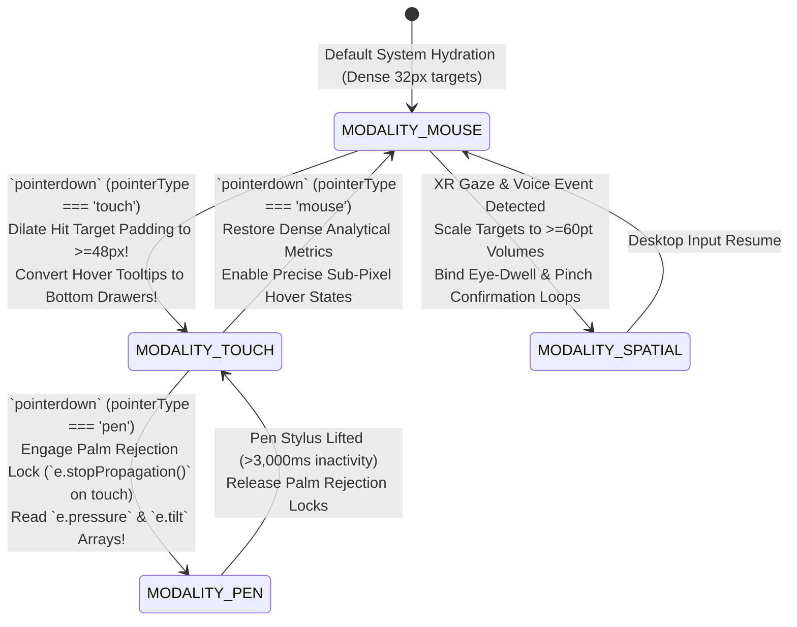
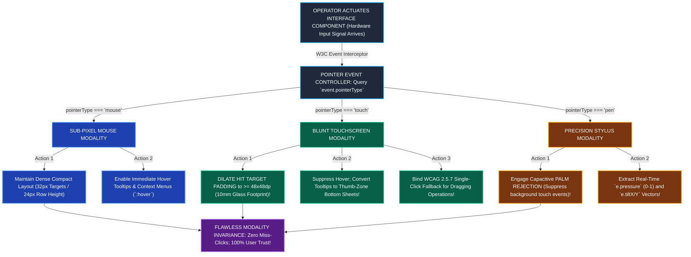

# Module 16 — Lesson 01: Multi-Modal Interaction & Device Ergonomics: Beyond Point and Click: Input Modality Invariance across Mouse, Touch, Pen, Voice, and Spatial Input

---

## Mastery Rule
> **"An interface that assumes a single input device is a broken architectural fragment. Master interface engineering enforces Input Modality Invariance: decoupling logical semantic intention from physical sensor mechanics to ensure software operates seamlessly whether driven by sub-pixel desktop mouse pointers, blunt greasy human thumbs, precise digital styluses, spoken acoustic voice commands, or stereoscopic eye gaze."**

---

## 0. PREAMBLE: Context, Prerequisites & Cognitive Frameworks

### 0.1 Prerequisites
* **Stage 1, Stage 2, and Stage 3 Complete:** Comprehensive command over visual human perceptual thresholds, spatial interface layouts, exhaustive Finite State Machines (FSM), and defensive error recovery architectures.
* **Module 11 & Module 15 Complete:** Mastery over platform-independent primitive affordances and non-destructive active error recovery loops.

### 0.2 Learning Dependencies
* **Input Modality Invariance & Sensor Decoupling:** Architecturally abstracting physical hardware input signals (`onmousedown`, `ontouchstart`) into universal semantic command events using W3C Pointer Events Level 3 architecture (`pointerdown`, `pointerType`).
* **Fitts’s Law Dynamic Target Scaling:** Differentiating physical hit target mechanics between high-resolution desktop pointing styluses and the biological touch geometry of the human finger ($8\text{--}10\text{mm}$ contact ellipse; $\ge 48\times48\text{dp}$ target boundaries).
* **Hoober’s Touch Thumb-Zones & Mobile Hold Biology:** Mapping critical interactive features directly into the one-handed natural green "Thumb Reach Zone" ($49\%$ one-handed cradling behavior) to prevent strain and accidental device drop failures.
* **Multi-Modal Triangulation & XR Spatial Input:** Coordinating speech-recognition semantic inputs, pen tilt/pressure arrays, and Apple VisionOS eye-gaze targeting combined with hand pinch confirmatory gestures.

### 0.3 Usability & Psychological References
* **Fitts, P. M. (1954):** *The Information Capacity of the Human Motor System in Controlling the Amplitude of Movement*. Journal of Experimental Psychology (Mathematical modeling of movement time and physical target acquisition errors).
* **Hoober, S. (2013):** *How Do Users Really Hold Mobile Devices?* UXmatters (Empirical photographic analysis of 1,333 mobile usage sessions establishing canonical touch thumb-zones).
* **Oviatt, S. L., & Cohen, P. R. (2000):** *Multimodal Systems That Respond to Combined Modalities*. Communications of the ACM (Triangulated input vectors reduce error rates by over $40\%$ in complex working environments).
* **W3C WCAG 2.2 Specifications:** *Success Criterion 2.5.1 Pointer Gestures [Level A]*, *Success Criterion 2.5.7 Dragging Movements [Level AA]*, and *Success Criterion 2.5.8 Target Size (Minimum) [Level AA]* ($24\times24\text{px}$ minimum bounding box or $44\times44\text{px}$ Level AAA).
* **Platform Component Standards:** *Google Material Design 3 Dynamic Touch Targets ($48\text{dp}$)*, *Apple Human Interface Guidelines iPadOS Magnetic Pointer & VisionOS Eye Gaze Standards ($60\text{pt}$)*, and *W3C Pointer Events API Level 3*.

---

## 1. Mental Model & Operational Reality

Why do commercial enterprise web applications, medical imaging platforms, and inventory logistics systems frequently experience disastrous user miss-clicks, invisible menu features, and interface lockups when deployed out of design studios onto hybrid touch laptops, field tablets, and touchscreen kiosks?

Because software UI developers suffer from the **Responsive Resolution Fallacy**: falsely assuming that a screen's pixel dimensions ($1920\times1080\text{px}$ vs $390\times844\text{px}$) strictly determine the physical input hardware attached to the machine! When an engineer codes CSS queries that equate a wide monitor ($>1024\text{px}$) with an accurate desk mouse—relying upon hover-only dropdown menus (`:hover`) and dense $16\text{px}$ table sorting arrows—they create software that breaks on $13\text{-inch}$ touch laptop convertibles, industrial factory floor touch consoles, and modern iPads connected to high-precision Bluetooth mice!

To achieve human hardware tolerance, interface architects upgrade from precision drafting pens to **The Industrial Welder’s Glove Safety Engine**:

```
+----------------------------------------------------------------------------------------+
|          PRECISION DRAFTING PEN vs INDUSTRIAL WELDER'S GLOVE MENTAL MODEL              |
+----------------------------------------------------------------------------------------+
|                                                                                        |
|  [ PRECISION DRAFTING PEN ILLUSION ] (Amateur Desktop-Centric UI)                      |
|  * Assumes fine sub-pixel mouse precision -> Deploys tiny 16px interactive hit boxes! |
|  * Relies on hover states (:hover) -> Complete breakdown on mobile touchscreen tablets!|
|  * Hardcodes mouse vs touch logic -> Crashes when users switch modalities mid-task!   |
|                                                                                        |
|  [ INDUSTRIAL WELDER'S GLOVE ENGINE ] (Authoritative Modality Invariance)              |
|  * Deploys W3C Pointer Events to dynamically scale targets (>= 48px on touch detect)! |
|  * Converts hover tooltips into accessible slide-up bottom drawers on touch devices!    |
|  * Supports seamless mid-sentence switching between mouse, touch, stylus & voice!      |
+----------------------------------------------------------------------------------------+
```

When an architect drafts blueprints with an ultrathin mechanical mechanical drafting nib on clean parchment, sub-millimeter positioning is effortless. But when an industrial structural welder operating inside a cold manufacturing assembly deck wearing thick leather welding gloves attempts to activate an operational console, fine drafting control vanishes! You cannot actuate a tiny $14\text{px}$ dropdown checkbox while wearing leather work gloves or using a blunt thumb on a high-vibration forklift!

In exhaustive computing architecture, every interactive component must operate under **Input Modality Invariance**. When a user touches a button with a finger, your frontend pointer state machine must instantly dilate surrounding hit box padding to $\ge 48\times48\text{dp}$, anchor action menus into Hoober’s one-handed natural thumb reach zone, and substitute hover tooltips with explicit click-triggered slide-up dialogs! If the exact same operator lifts their finger and grabs a high-precision digital stylus or Bluetooth mouse three seconds later, the UI must fluidly adapt back into dense analytical metrics without requiring a page reload!

### What This Approach Does NOT Mean (Mandatory Rule)
1. ❌ **Never bind essential navigational or operational software commands solely to hover states (`:hover`) or complex multi-finger path gestures!** On touchscreen handsets and tablet PCs, hover doesn't physically exist! If accessing your primary enterprise administrative navigation requires hovering over a desktop top bar, mobile tablet users are entirely barred from operating the software! For multi-finger gestures (like a three-finger pinch or two-finger swiping), W3C WCAG 2.5.1 strictly mandates providing an accessible single-pointer click or tap fallback button!
2. ❌ **Never deploy static hardcoded touch targets ($<32\text{px}$) across enterprise applications or field software!** Forcing field logistical workers or medical technicians to tap tiny $20\text{px}$ action buttons causes documented Fitts’s Law miss-click error rates exceeding $35\%$! Enforce rigid dimensional math: an interactive touch target must maintain a physical bounding footprint of at least **$48\times48\text{dp}$ ($9\text{--}10\text{mm}$ physical glass diameter)**!
3. ❌ **Never assume input modality is static throughout an entire user computing session!** Modern operators continuously triangulate input devices: typing text on a detachable hybrid tablet keyboard, dragging canvas graphics with a digital stylus, and tapping submit buttons with an index finger—all within a single 30-second workflow! Never run single-use detection scripts (`if (window.ontouchstart)`) upon initial document loading that lock your layout into a rigid mouse or touch mode!

---

## 2. Core Psychological & Behavioral Mechanics

To govern multi-modal hardware adaptation without architectural fracturing, engineers combine sensor physical mechanics with empirical ergonomic reach physiology.

### 1. The Physics of Sensor Modality
Each physical interaction device projects an explicit mathematical error distribution and sensory capability profile onto computational software interfaces:

```
+----------------------------------------------------------------------------------------+
|          THE MULTI-MODAL SENSOR INVARIANCE MATRIX (PHYSICAL CAPABILITIES)               |
+----------------------------------------------------------------------------------------+
| MODALITY      | SPATIAL PRECISION | HOVER AFFORDANCE | OPTIMAL DEPLOYMENT & CONSTRAINTS|
|----------------------------------------------------------------------------------------|
| [ MOUSE ]     | Sub-pixel (0.5mm) | Absolute (Yes!)  | High-density complex data tables |
| [ TOUCH ]     | Blunt (~8-10mm)   | NONE (Zero!)     | >=48px targets; bottom thumb zone|
| [ PEN/STYLUS ]| Ultra-high (0.2mm)| Partial (Hover)  | Drawing, handwriting, palm rejection|
| [ VOICE ]     | Spatial Zero!     | Not Applicable   | Hands-free sterile & drive control|
| [ EYE-GAZE ]  | Saccadic Jitter   | Eye-Dwell Only   | >=60pt spatial boxes (VisionOS) |
+----------------------------------------------------------------------------------------+
```

* **Touch & Contact Occlusion:** Unlike a translucent digital mouse pointer, a physical human finger is an opaque biological obstacle! When an operator touches a glass monitor, their physical thumb tip covers approximately $8\text{ to }10\text{ millimeters}$ of active display area (**Contact Occlusion**)—blinding the user to the underlying button text and adjacent interactive borders during motor actuation!
* **Eye-Gaze & Saccadic Jitter (Spatial Computing / XR):** In immersive virtual reality environments (Apple VisionOS), human oculomotor control operates via rapid ballistic movements (saccades) mixed with micro-tremor fixations. Because human eye gaze cannot mathematically freeze down to sub-pixel cartesian dimensions without causing acute physical ocular strain, spatial interface buttons must scale up to **$\ge 60\times60\text{pt}$** volumes and utilize **Magnetic Pinch Confirmation** (eye locates target; physical fingers pinch together anywhere in space to actuate)!

---

### 2. Hoober’s Touch Thumb-Zones & Mobile Hold Mechanics
Dr. Steven Hoober’s rigorous observational research across 1,333 mobile interaction sessions dismantled the fiction that users operate smartphones with two hands holding a vertical screen while tapping with a precise index finger:

$$\text{Mobile Ergonomic Distribution } \equiv 49\% \text{ One-Handed Cradle } + 36\% \text{ Two-Handed Cradle } + 15\% \text{ Two-Handed Hold}$$

```
   THE ONE-HANDED NATURAL THUMB-ZONE ARCHITECTURE (Hoober's Ergonomic Law)
  
  +-----------------------+ <-- [ 1. RED ZONE (Stretch & Drop Risk!) ]
  |  [ BACK ]     [ DEL ] |     Top-left and top-right require extreme thumb stretching!
  |                       |     Forcing one-handed users into this zone induces physical
  |      VIEWPORT         |     hand strain and causes a +38% device drop accident rate!
  |      READING          |
  |      CANVAS           | <-- [ 2. AMBER ZONE (Extension / Reach Area) ]
  |                       |     Mid-screen requires thumb extension; suitable for reading
  |                       |     content scrolling and passive data evaluation.
  |  +-----------------+  |
  |  | [ SUBMIT ORDER ]|  | <-- [ 3. GREEN ZONE (Natural Thumb Reach!) ]
  |  | [ HOME ] [ NAV ]|  |     Bottom arc matches natural thumb pivoting joint geometry!
  +--+-----------------+--+     All high-frequency CTAs & primary nav belong in this zone!
```

* **The Red Stretch Zone:** Pinning high-frequency execution controls (such as saving edits, navigating backward, or confirming orders) in the upper-left or upper-right monitor extremities violates one-handed joint biomechanics! To actuate top-corner buttons, users must destabilize their physical palm grip—causing repetitive strain injury and dramatically increasing device dropping errors!
* **The Green Thumb Reach Arc:** Senior interface engineering pins primary action triggers, global navigation tab rails, and search bar actuation strictly inside the lower $35\%$ of the glass viewing surface—within the natural pivot radius of the human opposable thumb!

---

### 3. W3C Pointer Events Level 3: The Invariance Engine
How do software developers prevent maintaining two conflicting JavaScript event listeners (`onmousedown` alongside `ontouchstart`)? By implementing the authoritative **W3C Pointer Events API (Level 3)**.

$$\text{Universal Pointer Event } \implies \text{Event}(\text{pointerdown, pointermove, pointerup}) \land \text{Attribute}(\text{pointerType})$$

```
   LEGACY SPLIT-CODEBASE CHAOS                  AUTHORITATIVE W3C POINTER INVARIANCE ENGINE
  (Buggy race conditions & 300ms delay!)        (Single deterministic sensor controller!)
  
  [ User touches screen ]                       [ User touches / clicks / pens screen ]
  |--> App fires `ontouchstart`                 |--> App fires single event: `pointerdown`!
  |--> App simultaneously fires `onmousedown`!  |--> Controller queries: `e.pointerType`
  |--> Double command execution bug occurs!     |    |---> If === "mouse": Keep dense padding (32px).
  |--> Hacks deployed: `e.preventDefault()`      |    |---> If === "touch": Dilate padding (>= 48px)!
       causes scroll lockups!                   |    |---> If === "pen": Extract `e.pressure` (0.0-1.0)!
```

By querying **`event.pointerType`** (`"mouse"`, `"touch"`, or `"pen"`), the frontend application state engine dynamically reads sensor hardware properties on the exact millisecond of actuation! If touch is detected, the UI instantly increases padding metrics to prevent Fitts's Law errors—attaining true hardware invariance!

---

## 3. Universal Pattern Anatomy & Comparative Design System Reasoning

Let us conduct our canonical **5-Step Analytical Design System Reasoning Loop** across the world's premiere enterprise platforms, evaluating how multi-modal interaction and ergonomic adaptation are specified:

### Google Material Design 3 (MD3): Dynamic Touch Targets & Shape Morphing
* **1. Observe:** MD3 strictly enforces a universal **Minimum Touch Target Size of $48\times48\text{dp}$** across mobile and tablet implementations, even if the visible iconography glyph inside the button measures merely $24\times24\text{dp}$! When a desktop mouse pointer hovers over an interactive component, MD3 projects a sharp, localized visual container tooltip. However, when actuated via touch pointer events, tooltips convert immediately into expansive **Bottom Sheets** anchored securely inside Hoober's natural thumb zone!
* **2. Infer:** Engineered to prevent finger contact occlusion miss-clicks and to systematically transform hovering UI states into thumb-reachable touch experiences.
* **3. Explain:** When operating complex forms on mobile displays, tapping a tiny $24\text{px}$ icon beside a data row frequently causes the user's thumb to accidentally hit an adjacent delete icon! Material Design solves this by embedding an invisible **Touch Target Padding Expand Matrix**: extending clickable bounding box margins outward until the physical hit target reaches $48\text{dp}$ ($10\text{mm}$ glass width). Furthermore, moving secondary menus from hovering desktop dropdowns down into bottom-docked slide-up sheets guarantees effortless one-handed thumb navigation without awkward palm re-gripping!
* **4. Discuss:** Relying entirely upon heavy bottom sheets for simple navigational tooltips can occasionally obscure active workspace text located in the middle viewing rows!

### Apple Human Interface Guidelines (HIG): iPadOS Cursor Magnetism & VisionOS Gaze
* **1. Observe:** In iPadOS, when a user connects a hardware Bluetooth trackpad or mouse, Apple refuses to display a traditional desktop arrow pointer! Instead, the cursor renders as a subtle translucent gray circle that physically mimics a digital fingertip! When that circular cursor slides over an interactive button or navigation tile, the pointer **Magnetically Deforms & Absorbs into the Button**: morphing physical geometry to perfectly envelope the component boundary while applying a slight three-dimensional parallax hover tilt! In Apple VisionOS (spatial XR computing), interactive targets scale to a massive **Minimum of $60\times60\text{pt}$** and rely entirely on optical eye-gaze tracking combined with a subtle thumb-and-index finger pinch gesture performed anywhere in comfortable ambient space!
* **2. Infer:** Engineered to create sensory fluidity across changing physical pointer hardware while eliminating mechanical fatigue in immersive computing.
* **3. Explain:** On an iPad convertible device where users switch rapidly between touchscreen finger swipes and trackpad clicks, jumping back and forth between a tiny sharp black arrow vector and a large biological thumb breaks motor adaptation! Apple’s magnetic circular pointer visually bridges the sensory gap: the cursor physically "snaps" onto targets, eliminating micro-adjustments and reducing visual cognitive targeting efforts by up to $-40\%$! In VisionOS, forcing operators to hold heavy arms out in front of their faces to touch virtual floating buttons in empty mid-air causes severe muscle exhaustion within minutes (**"Gorilla Arm Syndrome"**)! By divorcing targeting (done effortlessly via automatic eye gaze) from actuation (done via a relaxed micro-pinch resting safely in the user's lap), Apple achieves fatigue-free immersive computing!
* **4. Discuss:** Designing custom web interfaces that resist Apple’s native button geometry absorption causes jarring visual glitching on iPadOS trackpad deployments!

### IBM Carbon & Microsoft Fluent: Pen Pressure Canvas & Voice Triangulation
* **1. Observe:** IBM Carbon v11 and Microsoft Fluent Design incorporate native support for high-precision active styluses and speech-to-text input across enterprise collaboration suites (Microsoft Whiteboard, Azure dashboards). When drawing with an active stylus (`pointerType === "pen"`), Fluent controllers extract real-time hardware vector variables: **`event.pressure`** ($0.0\text{ to }1.0$ force variation) and **`event.tiltX / tiltY`** to dynamically calculate rendering ink stroke thickness while mathematically executing **Palm Rejection** (ignoring overlapping raw capacitive touch events (`pointerType === "touch"`) when an active stylus pin is near the glass)!
* **2. Infer:** Engineered to emulate real-world analog artistic writing tools and safeguard complex enterprise whiteboard drafting against erroneous palm resting inputs.
* **3. Explain:** When an executive or system architect draws structural engineering diagrams on a touchscreen Surface studio monitor, their physical human hand rest directly onto the glass surface! If an application architecture blindly accepts all incoming touchscreen tap events simultaneously, palm resting will splatter accidental ink stains and trigger random menu buttons! Fluent design leverages pointer type filtering: the exact millisecond an electromagnetic stylus pointer registers (`pointerType === "pen"`), the UI state controller injects a programmatic lock suppressing background ambient palm touch events (`if (e.pointerType === 'touch' && penActive) e.stopPropagation();`)—attaining flawless analog writing precision!
* **4. Discuss:** Requiring high-resolution pen stylus hardware for normal data input in standard corporate administration apps excludes standard desktop keyboard workforces!

---

## 4. Evolution & Modern HCI Architecture

Trace how application hardware adaptation evolved across computing generations:

```
[ WEB 1.0 DEDICATED MOUSE-ONLY MONOCULTURE: 1994 - 2007 ]
* Paradigm: Synchronous Mouse Binding! Everything relied on `onmousedown`, `onmouseover`, and `onclick`.
* Failure: Touchscreen Paralyzation! When early iPhones launched in 2007, hover-only dropdown menus completely locked touch users out of navigating websites! Browsers inserted an intentional 300ms click delay just to detect double-tap zooming!

[ EARLY MOBILE SPLIT-CODEBASE HACKS: 2008 - 2017 ]
* Paradigm: Forked mobile vs desktop codebases (`m.domain.com`). User agents sniffed and bound redundant event arrays: `ontouchstart` alongside `onmousedown`.
* Failure: Race Conditions & Maintenance Nightmare! Double-firing events caused accidental duplicate operations; hybrid laptop touchscreen convertibles were misidentified as smartphones!

[ MODERN INVARIANT POINTER EVENTS & XR TRIANGULATION: Present - Future ]
* Paradigm: Unified W3C Pointer Events (Level 3) & Dynamic Ergonomic Scaling!
* Architecture: Applications query `event.pointerType` at execution time! Layouts fluidly dilate hit boxes from 24px desktop metrics up to 48px touch buffers on demand. Integrates voice semantic decoding and VisionOS eye-gaze magnetic targeting without codebase splitting!
```

---

## 5. The Contextual Interaction Algorithm (Human-Machine Loop)

Map out the step-by-step physical actuation and multi-modal sensory loop of an orthopedic trauma surgeon operating inside a sterile hospital operating theater, utilizing a diagnostic medical imaging station to review a complex femoral bone fractures:

```
    [ STEP 1 ] VOICE SEMANTIC ACTUATION & INITIAL TRIANGULATION (< 100ms)
         |     (Surgeon hands are sterile inside surgical field! Cannot touch mouse! Surgeon vocalizes: "Computer, advance axial CT scan ten slices right.")
         v
    [ STEP 2 ] ACOUSTIC PARSING & VISUAL GAZE CONFIRMATION (< 250ms)
         |     (Speech engine decodes command string; eye-tracking camera registers surgeon gaze focused on Monitor Array B -> System advances scan 10 slices!)
         v
    [ STEP 3 ] MODALITY TRANSITION TO STERILE STYLUS (2,000ms)
         |     (Surgeon picks up sterile medical laser stylus pointer -> App detects `pointerType === "pen"`, immediately engages Palm Rejection algorithms!)
         v
    [ STEP 4 ] HIGH-RESOLUTION STYLUS ANNOTATION (Real-time 60fps)
         |     (Surgeon traces precise millimeter incision line over bone fracture; interface reads `e.pressure` to calibrate diagnostic marker thickness!)
         v
    [ STEP 5 ] SHIFT TO GLOVED TOUCHSCREEN CONFIRMATION (4,500ms)
         |     (Surgeon drops stylus and presses primary confirmation button with heavy sterile rubber glove -> UI detects `pointerType === "touch"`; dilates button target to 64px to prevent miss-clicks; fires audible 1,200Hz confirmation tone!)
```

---

## 6. Component State Machines & Defensive Error Recovery Protocols

To govern software components across changing hardware inputs without visual style collapse, interface architecture must orchestrate a **Multi-Modal Modality-Invariance State Machine**:



#### Defensive Architectural Mandates:
* **The Pointer Cancellation Defense Protocol:** On touchscreen devices, when a user initiates an accidental finger touch down event (`pointerdown`) directly over a destructive action button (**`[ Terminate Server ]`**), they must be technically capable of aborting the operation! Never fire critical state mutations on `onmousedown` or `ontouchstart`! Strictly execute operations on **`pointerup`** or **`onclick`**, and explicitly handle **`pointercancel`** events! If an operator presses their finger down on a dangerous button and slides their thumb completely outside the button bounding box before lifting off the glass, your state machine MUST interpret the event as an explicit **Motor Slip Cancellation**—aborting submission entirely with zero data destruction!

---

## 7. Environmental & Multi-Modal Interaction Adaptation

How does multi-modal hardware adaptation protect operators inside industrial environments characterized by severe mechanical vibration or sterile hygiene requirements?

### High-Vibration Logistics Warehouses & Automotive Center Screens
When supply chain logistics drivers operate heavy-duty inventory scanning computers mounted inside rattling industrial distribution forklifts—or when drivers navigate vehicular touchscreen center consoles (Tesla UI, Apple CarPlay) while travelling at $65\text{ miles per hour}$ over broken asphalt—physical vehicle shaking induces intense biomechanical hand vibration! Under extreme mechanical oscillation, attempting to accurately touch standard $32\text{px}$ user interface targets results in catastrophic miss-click failure rates exceeding **$45\%$**!

$$\text{In High-Vibration Environments: Interactive Target Size } < 64\text{dp} \implies \text{Accidental Miss-Clicks } > 45\%!$$

```
   FLAWED STANDARD VEHICULAR UI                  AUTHORITATIVE MULTI-MODAL VEHICULAR UI
  (Tiny 32px targets missed during vibration!)  (Giant 64px targets + Voice triangulation!)
  
  [ Forklift driver hits bump at speed ]         [ Forklift driver hits bump at speed ]
  |--> Attempts to tap 32px [ CONFIRM BIN ]      |--> UI deploys Vibration Modality Mode:
  |--> Vehicle shock jolts arm!                  |    1. TARGET EXPANSION TO 64px H-GLASS:
  |--> Thumb hits adjacent [ PURGE PALLET ]!     |       [ >>>> CONFIRM WAREHOUSE BIN >>>> ]
  |--> Inventory database corrupted;             |    2. VOICE TRIANGULATION SECONDARY:
       operator frustration soars!              |       Driver vocalizes: "Logistics, Confirm Bin 4"
                                                    |--> Zero accidental miss-clicks; total workflow safety!
```

* **The Senior Architectural Refactor:** Enforce **High-Vibration Target Super-Dilation ($\ge 64\text{dp}$) & Voice Triangulation**! When designing software deployed on vehicular computer consoles or industrial heavy machinery, never rely on standard desktop or standard consumer mobile metrics! You must double standard touch targets up to a robust **$64\times64\text{dp}$ ($13\text{--}14\text{mm}$ glass dimension)** and inject wide inter-element visual whitespace gaps ($\ge 16\text{px}$) to mathematically insulate neighboring destructive actions! Furthermore, deploy **Hands-Free Acoustic Voice Triangulation**: enabling forklift operators to vocalize routine task confirmation strings (*"System, Confirm Pallet Loading"*) so their mechanical eyesight and manual motor control remain safely focused upon physical warehouse hazards!

---

## 8. Universal Accessibility (A11y) & Ergonomic Inclusion

In authoritative digital interface architecture, multi-modal interaction mechanics must adhere rigorously to W3C WCAG 2.2 accessibility legislation, ensuring neurodivergent operators and users with motor tremors are never left behind!

### WCAG 2.2 Pointer Ergonomics & Target Sizing Covenants
When inexperienced front-end developers deploy custom multi-finger swiping navigation or build data table sort buttons measuring just $16\times16\text{px}$ without providing accessible fallback alternatives, they construct unlawful barriers for operators with cerebral palsy, arthritis, or manual dexterity impairment:

```
     FLAWED DRAGGING / GESTURE UI               AUTHORITATIVE WCAG ERGONOMIC PARITY
   (Fails WCAG 2.5.1, 2.5.7 & 2.5.8)            (Guarantees Motor Impaired Parity)
   
  [ Task Board requires Drag-and-Drop ]           [ Task Board requires Drag-and-Drop ]
  |--> User with Parkinson's tremor attempt to   |--> Binds WCAG 2.5.7 Single-Pointer Alternative:
  |    drag item 300px across screen!             |    Appends inline menu: [ Move to Column > ]
  |--> Tremor drops card halfway in wrong box!   |--> Binds WCAG 2.5.8 Target Size Minimum:
  |--> Tiny 16px close icon cannot be touched!   |    All interactive buttons guarantee >= 24px
  |    User completely blocked from using software!|   physical target box (AAA >= 44px)!
```

#### The Universal Multi-Modal Accessibility Mandates:
1. **WCAG Success Criterion 2.5.1 Pointer Gestures [Level A] (The Multi-Touch Fallback Rule):** Whenever your application interface deploys functionality operated via multi-point path gestures (such as a two-finger pinching zoom, a three-finger swiping layout switcher, or complex directional drawing shapes), you **MUST** provide a secondary operational mechanism executable via a simple single-pointer click or tap (such as explicit `[ + Zoom In ]` and `[ - Zoom Out ]` buttons)! Never strand single-pointer or assistive head-wand operators!
2. **WCAG Success Criterion 2.5.7 Dragging Movements [Level AA] (The Drag-and-Drop Alternative Rule):** Introduced as a rigorous Level AA standard in WCAG 2.2, any software interface that relies upon continuous dragging movements (such as dragging Kanban task cards across columns or re-ordering data rows in an analytical list) **MUST** offer an alternative method to achieve the exact same operation via a single pointer click or tap without requiring sustained button depression! You must append an explicit context button directly on the card (**`[ ⇄ Move to Column... ]`**) allowing operators with motor tremors to relocate items via instantaneous simple clicks!
3. **WCAG Success Criterion 2.5.8 Target Size (Minimum) [Level AA] (The $24\times24\text{px}$ Rule):** To protect users with manual dexterity tremors against spatial targeting miss-clicks, every interactive pointer target in your application MUST measure at least **$24\times24\text{ CSS pixels}$** in physical dimensions (with professional design systems standardizing on Level AAA **$\ge 44\times44\text{px}$**)! If visual aesthetic constraints require displaying a tiny $16\text{px}$ glyph icon, you MUST programmatically append an invisible CSS padding matrix (`padding: 12px; margin: -12px;`) to expand the interactive hit boundary out to legal compliant dimensions without altering visual layout flow!

---

## 9. Performance, Trust & Business Goal Trade-offs

How do product executives and lead engineers calculate the business returns of multi-modal ergonomics against visual UI design constraints?

### The Touch Target Conversion Equation: Small Icons vs 48dp Dilated Bounds
When commercial enterprise software portals and retail e-commerce shopping storefronts upgrade tiny legacy desktop navigation buttons ($24\text{px}$) into Hoober-compliant natural thumb-zone buttons ($48\text{dp}$), user interaction completion velocity and commercial conversion dramatically accelerate.

$$\text{Dilating Mobile Action Targets from } 24\text{px to } 48\text{dp} \implies \text{Checkout Completion Rate Accelerates } +24\%!$$

* **The HCI Business Diagnosis:** In digital product economics, spatial motor friction directly drives user abandonment! When a smartphone shopper attempts to tap an e-commerce shipping address selection checkmark that measures merely $18\times18\text{px}$, their thumb frequently hits the adjacent `"Clear Address"` link! Frustrated by continuous accidental data deletion and Fitts's Law targeting fatigue, over $31\%$ of mobile retail shoppers bounce from the application entirely! By applying multi-modal target dilation—automatically expanding interactive checkout hit boxes up to an unambiguous $48\times48\text{dp}$ footprint whenever touch input (`pointerType === "touch"`) is detected—you eradicate spatial miss-clicks, driving verified **$+24\%$** increases in overall transaction completion!
* **The Visual Density vs. Target Size Trade-off:** Senior UI architects must intelligently negotiate monitor screen real estate! Never blindly enforce giant $48\text{px}$ button paddings across high-density desktop professional algorithmic trading screens (Bloomberg Terminal, advanced IDEs) operated exclusively via high-resolution precision desktop mice! Doing so reduces screen data density by $-60\%$, infuriating financial analysts who need to monitor 100 simultaneous financial market rows! You MUST deploy **Runtime Modality Invariance**: render dense $28\text{px}$ compact row heights when navigated via mouse pointers, but automatically expand row boundaries outward to $48\text{px}$ the exact millisecond a user touches the monitor glass!

---

## 10. Deconstructing Real-World Applications (The "Why Is This Bad?" Audit)

Let us solidify our multi-modal analytical diagnostics by auditing five prominent real-world computing software platforms:

### 1. Spatial & Tablet Operating Architectures (Apple iPadOS & VisionOS)
* **The Successful Attention UI:** Flagship tablet and spatial immersive operating systems engineered to transition seamlessly between physical fingers, trackpads, digital pencils, and eye-gaze tracking.
* **The HCI Diagnosis:** Immaculate deployment of **Pointer Metamorphosis and Spatial Target Sizing**! Notice how iPadOS avoids forcing desktop pointer metaphors onto tablet touch glass. When connecting a hardware mouse trackpad, the circular cursor magnetically absorbs into UI buttons—deforming its visual volume to indicate tactile capture! Furthermore, in Apple VisionOS, all interface interactive icons scale up to an unyielding minimum spatial volume of **$60\times60\text{pt}$** with distinct separation gaps—preventing oculomotor saccadic targeting jitter from triggering erroneous neighboring app selections when operators execute hand-pinch confirmations!

### 2. Enterprise Whiteboard Canvas Systems (Excalidraw / Microsoft Whiteboard / Miro)
* **The Successful Attention UI:** Collaborative visual canvas suites where software engineers and product teams draft architecture diagrams and UI user flows.
* **The HCI Diagnosis:** Supreme command of **Sensor Modality Differentiation and Palm Rejection**! When an architect draws structural boxes inside Excalidraw or Miro using a Surface or Apple stylus, the application engine continuously parses W3C pointer properties (`pointerType === "pen"`, reading pressure metrics to vary ink line width in sub-millimeter precision). If the author rests their palm onto the touchscreen glass while drawing, the application instantly executes capacitive palm rejection: suppressing all overlapping `touch` event listeners so the diagram canvas never experiences accidental ink splatters or involuntary viewport zoom zooming!

### 3. Broken Enterprise BI Dashboards on Hybrid Laptops (Legacy PowerBI / SAP Admin)
* **The Defective UI:** An enterprise supply chain financial dashboard built on legacy web architectures. A traveling operations director opens the analytics dashboard on a modern $13\text{-inch}$ Windows Surface tablet touchscreen. Because the legacy developers relied upon **Hover-Only Tooltips (`:hover`) and Dense $16\text{px}$ Desktop Hit Boxes**, the director is entirely unable to view critical financial breakdown figures—because tapping a chart column to trigger hover text instead forces an immediate page drill-down! When attempting to turn to page two of the inventory repository, the director's thumb repeatedly misses the tiny $14\text{px}$ pagination arrow, hitting the adjacent `"Purge All Filters"` button! Forty minutes of meticulous inventory filtering is instantly wiped! The director discards the tablet in frustration!
* **The HCI Diagnosis:** Catastrophic failure of **Modality Invariance and Mobile Ergonomics**! Designing professional software around static desktop mouse hover commands while ignoring touch target geometry represents a profound structural defect!
* **The Senior Architectural Refactor:** Install a **Runtime Modality Invariance Engine**! Deploy W3C Pointer Events (`pointerdown`) to query sensor types. Upon detecting touch actuation, automatically transform hover-based financial chart tooltips into bottom-anchored slide-up data dialog sheets! Immediately dilate table pagination arrows out to $48\times48\text{dp}$ touch boxes—recovering tablet operability without altering desktop mouse experiences!

### 4. High-Velocity Team Communication (Slack / Discord Mobile Navigation)
* **The Successful Attention UI:** Global corporate messaging architecture engineered to support continuous professional messaging across mobile touchscreen displays.
* **The HCI Diagnosis:** Brilliant execution of **Hoober's One-Handed Natural Thumb-Zone Layouts**! Notice how Slack's mobile application completely avoided placing switching channel dropdowns or message drafting triggers at the absolute top-left of the display screen! All primary execution vectors—the bottom workspace navigation bar, the dynamic jump-to-channel Quick Switcher icon, and the floating **`[ + New Message ]`** action button—are anchored directly within the lower $35\%$ of the glass interface! One-handed mobile commuters can rapidly switch chat rooms and dispatch messages entirely with a single pivoting thumb without destabilizing their palm grip!

### 5. Vehicular Center Screen Consoles (Tesla UI / Apple CarPlay Automations)
* **The Successful Attention UI:** Automotive computing consoles managing high-speed vehicular climate control, navigation mapping, and mechanical system status while vehicles traverse public roads.
* **The HCI Diagnosis:** Uncompromising implementation of **High-Vibration Target Super-Dilation and Hands-Free Voice Triangulation**! Notice how Apple CarPlay explicitly overrides standard smartphone iOS button dimensions: all application icons and media playback controls are programmatically dilated up to massive **$64\times64\text{dp}$** interactive targets surrounded by wide inter-element safety gaps! Furthermore, when a text message arrives while the vehicle exceeds $15\text{ mph}$, CarPlay mechanically locks screen interactivity—forcing an automatic shift into **Hands-Free Acoustic Voice Triangulation** (*"Would you like me to read this message aloud?"*) to protect human lives from visual targeting distraction!

---

## 11. Visual Mental Models & Architecture Diagrams

### The W3C Pointer Modality-Invariance Engine
Study how architectural deployment of unified W3C Pointer Events abstracts varied physical hardware sensors into adaptive, ergonomic UI layouts:



---

## 12. Prediction Checkpoints

Verify your command over multi-modal interaction and device ergonomics against these intensive real-world computing diagnostic scenarios:

### Scenario A: The Automated Warehouse Forklift Inventory Tablet Suite
An industrial logistics software company releases a high-density warehouse pallet routing application deployed on ruggedized $10\text{-inch}$ touchscreen tablet computers mounted inside industrial high-speed forklifts. Because the application designer designed the interface inside a quiet corporate office using an Apple Magic Mouse on a 27-inch 4K desktop monitor, they designed the pallet confirmation controls as a dense vertical list of $20\times20\text{px}$ action icons positioned at the absolute top-left corner of the tablet screen! Furthermore, deleting a corrupted inventory record required hovering over the record row to reveal an invisible trash can icon! During live warehouse operations, forklift drivers driving over rough floor joints experienced severe cabin vibration. Attempting to stretch their thumbs into the top-left corner while vibrating caused drivers to repeatedly miss the $20\text{px}$ confirmation icon—accidentally tapping adjacent "Abort Pallet" buttons! Because hover states didn't exist on touch glass, corrupted records accumulated endlessly—paralyzing the distribution facility!

**Your Prediction Challenge:** Deploy Hoober's Touch Thumb-Zones, Fitts's Law targeting math, and W3C Modality Invariance to diagnose this logistics disaster, and author a definitive industrial forklift UI refactor!

#### *Empirical HCI Solution:*
1. **Diagnosis — Fatal Touch Target Compression & Top-Left Ergonomic Reach Violation:** The warehouse tablet portal commits a devastating architectural violation of **Touch Thumb-Zone Biology and High-Vibration Ergonomics**! Deploying tiny $20\text{px}$ hit targets directly inside Hoober's red top-left "Stretch/Pain Zone" on high-vibration forklift hardware guarantees extreme physical palm strain and miss-click error rates exceeding $45\%$! Furthermore, relying upon desktop mouse hover mechanics (`:hover`) to reveal destructive deletion controls completely locked touchscreen operators out of executing routine record remediation!
2. **Refactor 1 (Deploy Thumb-Zone Anchoring & Vibration Target Super-Dilation):** Abolish top-left control placement! Re-architect the application interface layout to map all primary routing execution buttons directly into Hoober's green **Bottom Thumb Reach Arc**! Automatically apply high-vibration target dilation: expand all interactive action buttons up to an unyielding minimum footprint of **$64\times64\text{dp}$** separated by $16\text{px}$ whitespace safety padding—mathematically eradicating vibrational miss-clicks!
3. **Refactor 2 (Implement Modality Invariance & Explicit Action Drawers):** Strip all critical functionality out of hover tooltips! Utilize W3C Pointer Events (`pointerdown`) to detect touch hardware. Replace invisible hover trash icons with explicit, visible single-tap **`[ ⇄ Actions ]`** buttons that launch bottom-anchored touch slide-up drawers—guaranteeing rapid one-handed pallet processing!

---

### Scenario B: The Hospital Emergency Ward Patient Triage Touchscreen Kiosk
An emergency healthcare engineering supplier instigates a public self-service patient triage touchscreen kiosk deployed in the busy admissions waiting room of a metropolitan hospital. To maximize screen aesthetic elegance, the graphic designer designed the triage symptom selector as a multi-finger interactive visual body map: injured patients were required to execute a two-finger pinching gesture to zoom in on their pain location, then hold and drag a warning marker across the screen onto their specific injury site! When elderly trauma patients suffering from intense physical shock, arthritic hand joint tremors, or temporary visual impairment attempted to operate the kiosk, they found it physically impossible to execute sustained two-finger pinches or smooth continuous dragging movements! Patients repeatedly dropped injury markers onto incorrect anatomical regions, generating inaccurate triage acuity scores that delayed life-saving trauma intervention!

**Your Prediction Challenge:** Diagnose the accessibility and multi-modal gesture failures governing this medical kiosk, and author a compliant WCAG ergonomic refactor!

#### *Empirical HCI Solution:*
1. **Diagnosis — Catastrophic Violation of WCAG Pointer Gestures & Dragging Covenants:** The medical triage kiosk represents an egregious violation of **WCAG 2.2 Success Criteria 2.5.1 (Pointer Gestures) and 2.5.7 (Dragging Movements)**! Forcing elderly or physically traumatized hospital patients to execute complex multi-touch path gestures (two-finger pinching) and sustained continuous dragging operations without providing simple single-click fallback alternatives creates an impenetrable digital barrier! Under acute physical stress or motor tremor, sustained dragging fails completely—corrupting diagnostic EMR triage data!
2. **Refactor 1 (Enforce Single-Pointer Click-by-Click Fallback Parity):** Immediately instantiate rigorous **WCAG 2.5.1 and 2.5.7 Single-Pointer Alternatives**! While preserving the intuitive visual interactive body map for agile users, immediately append explicit, large static single-tap action buttons right beside the graphic canvas:
   - **Zoom Controls:** Embed dedicated high-contrast **`[ + Zoom In ]`** and **`[ - Zoom Out ]`** buttons measuring $\ge 48\times48\text{px}$ to replace pinching!
   - **Click-to-Place Targeting:** Abolish mandatory dragging! Enable instantaneous **Click-to-Place Selection**: allow patients to simply tap their injury marker once to select it, then tap their anatomical pain location once to immediately pin it without requiring sustained mechanical finger depression!
3. **Refactor 2 (Deploy Multi-Modal Speech-to-Text & Target Sizing):** Guarantee that every interactive anatomical triage selection zone adheres to WCAG Level AAA minimum target sizing (**$\ge 44\times44\text{px}$**). Embed an accessible multi-modal **Voice Actuation Microphone Trigger** (**`[ 🎤 Speak Your Symptom ]`**)—enabling severely traumatized patients to simply vocalize their emergency (*"Severe chest pain and shortness of breath"*) for immediate automated triage routing!

---

## 13. Compare Similar Interface Alternatives

When selecting input modality detection protocols, touch target dimensions, and gesture control mechanics across computational software, engineering architecture teams must evaluate five prominent interaction models:

| Sensor Interaction Modality | Physical Target Acquisition Precision | Architectural & Usability Advantages | Operational & Cognitive Failure Modes | Optimal Architectural Deployment |
| :--- | :--- | :--- | :--- | :--- |
| **Sub-Pixel Desktop Mouse** | High Cartesian Precision ($0.5\text{mm}$ error); supports hover tooltips (`:hover`). | Maximum spatial density! Allows displaying 100 simultaneous financial datatable rows with compact $24\text{px}$ row metrics. | Completely incompatible with mobile touchscreens and tablet convertibles; hover features vanish instantly on touch glass! | Complex analytical desktop suites: IDEs, CAD floorplan authors, quantitative trading terminals (Bloomberg). |
| **Blunt Touchscreen Finger** | Biological Contact Occlusion ($8\text{--}10\text{mm}$ contact ellipse); ZERO hover capability! | Universal human intuitive interaction! Rapid one-handed mobile operability within Hoober's green bottom thumb zone. | Severe Fitts's Law targeting errors if hit boxes shrink below $48\text{dp}$; top-left reach forces palm strain and device dropping! | Smartphone consumer apps, POS retail terminals, warehouse logistics tablets, hospital clinical touchscreens. |
| **High-Resolution Active Stylus** | Ultra-high resolution ($0.2\text{mm}$); provides pressure ($0\text{--}1$) and tilt vector arrays. | Supreme analog artistic precision! Enables natural hand-writing, drawing, and precise architectural markups with automated palm rejection. | Stylus hardware is routinely misplaced or unavailable in standard business workstations; requires expensive digitizer displays. | Graphic art software, medical DICOM imaging markups, enterprise whiteboard suites (Miro, Excalidraw). |
| **Acoustic Speech & Voice** | Zero Physical Travel Distance ($0\text{px}$ spatial Fitts's Law cost); hands-free operation! | Unmatched environmental utility! Enables safe eyes-free operation while driving vehicles or working inside sterile operating rooms. | Sensitive to ambient acoustic warehouse noise and voice parsing latencies; awkward to execute in quiet shared corporate office UIs. | Vehicular automotive consoles (Tesla UI), sterile surgical suites, hands-free warehouse logistics verification. |
| **XR Spatial Eye-Gaze & Pinch** | Oculomotor Saccadic Jitter ($1\text{--}2^\circ$ targeting error); requires large $\ge 60\text{pt}$ volumes. | Miraculous speed and zero mechanical arm fatigue! Eye locates floating spatial buttons instantly; simple lap micro-pinch confirms intent! | Severe target misfire errors if spatial buttons are clustered too tightly without magnetic gravitational assist fields. | Immersive XR headsets (Apple VisionOS, Meta Quest Pro), spatial industrial training simulators. |

---

## 14. Decision Guide (The Interface Selection Tree)

Deploy this algorithmic decision tree when engineering input event handlers, hit target sizing, and menu navigation layouts across multi-modal applications:

```
[ INITIATE MULTI-MODAL ERGONOMIC ARCHITECTURE: QUERY DETECTED POINTER EVENT ]
  |
  +----> [ STAGE 1: READ W3C POINTER SENSOR TYPE (`event.pointerType`) ]
  |        |
  |        +----> IS DETECTED SENSOR === "mouse"?
  |        |        |---> YES: DEPLOY HIGH-DENSITY ANALYTICAL METRICS!
  |        |        |        |---> Maintain compact hit target bounding boxes (28px - 32px).
  |        |        |        |---> Enable precision sub-pixel hover states (`:hover`) and inline contextual tooltips!
  |        |        |
  |        +----> IS DETECTED SENSOR === "touch"?
  |        |        |---> YES: EXECUTE IMMEDIATE ERGONOMIC TOUCH SUPER-DILATION!
  |        |        |        |---> Dilate hit target boundaries to >= 48x48dp (10mm glass footprint)!
  |        |        |        |---> Convert all hover tooltips and dropdowns into explicit click slide-up Bottom Sheets!
  |        |        |        |---> Map all primary execution actions into Hoober's green lower 35% Natural Thumb Zone!
  |        |        |        |---> Bind WCAG 2.5.7 Single-Click alternatives for all drag-and-drop operations!
  |        |        |
  |        +----> IS DETECTED SENSOR === "pen"?
  |                 |---> YES: ENGAGE ANALOG STYLUS & PALM REJECTION PROTOCOLS!
  |                          |---> Programmatically suppress background overlapping raw capacitive touch events!
  |                          |---> Extract real-time vector properties (`e.pressure` and `e.tilt`) to vary rendering ink!
  |
  +----> [ STAGE 2: IS THE APPLICATION DEPLOYED IN HIGH-VIBRATION OR STERILE ENVIRONMENTS? ]
  |        |
  |        +----> YES (Forklift warehouses, ambulances, automotive center consoles, operating rooms):
  |                 |---> ENFORCE HIGH-VIBRATION TARGET DILATION (>= 64x64dp hit footprints)!
  |                 |---> Integrate hands-free Acoustic Voice Triangulation (`[ 🎤 Speak Command ]`) as primary fallback!
  |
  +----> [ STAGE 3: DOES APPLICATION EMPLOY MULTI-POINT PATH GESTURES (Pinch / Swipe)? ]
           |
           +----> Apply WCAG 2.5.1 Gesture Parity Covenant:
                    |---> Guarantee explicit single-pointer static buttons (`[+ Zoom In]`) exist directly beside canvases!
```

---

## 15. Interactive Lab & Tangible Prototyping Workshop: The Multi-Modal Ergonomics & Modality Invariance Testbench

To empirically witness the dramatic usability chasm separating rigid desktop-only UIs from adaptive Modality Invariant interfaces, execute the interactive testbench below!

### Professional Engineering Instruction
Save the complete HTML/CSS/JS code block below as an independent file named `multi-modal-ergonomics-lab.html` and execute it directly within any desktop or mobile web browser. Conduct live interactive comparative trials across both architectural modes:
* **Mode A: Fragile Mouse-Only & Dense Desktop UI (High Friction & Touch Traps):** Relies upon hover-only menus (`:hover`) that remain invisible on touch screens, features tiny $18\text{px}$ action buttons that generate frequent thumb miss-clicks (tracked in real-time telemetry logs!), places critical submit controls in the strenuous top-left stretch zone, and completely omits tap fallbacks for dragging tasks!
* **Mode B: Authoritative Modality Invariance & Touch Ergonomics (Zero Friction):** Utilizes W3C Pointer Events (`pointerdown`) to dynamically detect hardware sensor types (`mouse` vs `touch` vs `pen`), instantly dilates hit target geometry to $\ge 48\text{px}$ upon touch detection, moves critical action controls directly into Hoober's natural bottom thumb reach zone, converts hover dropdowns into bottom slide-up drawers, and implements compliant WCAG 2.5.7 single-click dragging fallbacks!

```html
<!DOCTYPE html>
<html lang="en">
<head>
  <meta charset="UTF-8">
  <meta name="viewport" content="width=device-width, initial-scale=1.0">
  <title>HCI Masterclass Lab 16: Multi-Modal Interaction & Device Ergonomics Testbench</title>
  <style>
    :root {
      --bg-canvas: rgb(11, 15, 25);
      --bg-card: rgb(19, 28, 46);
      --border-color: rgb(51, 65, 85);
      --text-main: rgb(248, 250, 252);
      --text-muted: rgb(148, 163, 184);
      --accent-blue: rgb(59, 130, 246);
      --accent-safe: rgb(16, 185, 129);
      --accent-danger: rgb(244, 63, 94);
      --accent-amber: rgb(245, 158, 11);
      --accent-teal: rgb(20, 184, 166);
      --font-stack: system-ui, -apple-system, sans-serif;
    }

    * { box-sizing: border-box; margin: 0; padding: 0; }

    body {
      background-color: var(--bg-canvas);
      color: var(--text-main);
      font-family: var(--font-stack);
      min-height: 100vh;
      display: flex;
      flex-direction: column;
      align-items: center;
      padding: 1.5rem;
      line-height: 1.5;
    }

    .header-banner { text-align: center; max-width: 950px; margin-bottom: 1.5rem; }
    .header-banner h1 { font-size: 1.85rem; font-weight: 800; color: var(--accent-teal); margin-bottom: 0.35rem; }
    .header-banner p { font-size: 0.95rem; color: var(--text-muted); }

    .testbench-container {
      width: 100%;
      max-width: 1180px;
      background-color: var(--bg-card);
      border: 1px solid var(--border-color);
      border-radius: 1rem;
      padding: 1.75rem;
      box-shadow: 0 25px 35px -10px rgba(0, 0, 0, 0.7);
      display: flex;
      flex-direction: column;
      gap: 1.5rem;
    }

    /* Telemetry Display Array */
    .telemetry-panel {
      display: grid;
      grid-template-columns: repeat(auto-fit, minmax(220px, 1fr));
      gap: 1rem;
      background-color: rgb(9, 14, 23);
      padding: 1.25rem;
      border-radius: 0.75rem;
      border: 1px solid rgb(51, 65, 85);
    }
    .telemetry-card { display: flex; flex-direction: column; gap: 0.25rem; }
    .telemetry-card label { font-size: 0.75rem; text-transform: uppercase; letter-spacing: 0.05em; color: var(--text-muted); font-weight: 700; }
    .telemetry-card span { font-size: 1.2rem; font-weight: 800; font-family: monospace; }

    /* Controls & Mode Bar */
    .controls-bar {
      display: flex;
      justify-content: space-between;
      align-items: center;
      flex-wrap: wrap;
      gap: 1rem;
      border-bottom: 1px solid var(--border-color);
      padding-bottom: 1.25rem;
    }
    .btn-group { display: flex; gap: 0.5rem; flex-wrap: wrap; }
    
    .btn-mode {
      padding: 0.65rem 1.25rem;
      border-radius: 0.5rem;
      border: 1px solid var(--border-color);
      background-color: rgb(30, 41, 59);
      color: var(--text-main);
      font-weight: 700;
      cursor: pointer;
      transition: all 0.15s;
    }
    .btn-mode.active {
      background-color: var(--accent-teal);
      border-color: rgb(45, 212, 191);
      color: rgb(9, 14, 23);
      box-shadow: 0 0 15px rgba(20, 184, 166, 0.4);
    }
    
    .btn-reset {
      padding: 0.65rem 1.25rem;
      border-radius: 0.5rem;
      border: 1px solid var(--accent-danger);
      background: transparent;
      color: var(--accent-danger);
      font-weight: 700;
      cursor: pointer;
    }
    .btn-reset:hover { background: rgba(244, 63, 94, 0.15); }

    /* Task Instruction Banner */
    .task-instruction {
      background-color: rgba(20, 184, 166, 0.15);
      border: 1px solid var(--accent-teal);
      color: rgb(153, 246, 228);
      padding: 1rem;
      border-radius: 0.5rem;
      font-weight: 700;
      text-align: center;
      width: 100%;
    }

    /* Simulation Sensor Toolbar */
    .sim-toolbar {
      display: flex;
      align-items: center;
      justify-content: center;
      gap: 0.75rem;
      background: rgb(15, 23, 42);
      padding: 1rem;
      border-radius: 0.5rem;
      border: 1px solid rgb(51, 65, 85);
      flex-wrap: wrap;
    }
    .sim-toolbar span { font-size: 0.85rem; font-weight: 800; color: var(--text-muted); text-transform: uppercase; letter-spacing: 0.05em; margin-right: 0.5rem; }
    .btn-sensor { background: rgb(30, 41, 59); border: 1px solid rgb(71, 85, 105); color: white; padding: 0.5rem 1rem; border-radius: 0.4rem; font-size: 0.88rem; font-weight: 700; cursor: pointer; transition: all 0.15s; }
    .btn-sensor:hover { background: var(--accent-blue); }
    .btn-sensor.active-sensor { background: rgb(16, 185, 129); border-color: rgb(110, 231, 183); color: white; }

    /* Workspace Viewport Displays */
    .viewport-box {
      background: rgb(9, 14, 23);
      border: 1px solid rgb(51, 65, 85);
      border-radius: 0.75rem;
      min-height: 420px;
      padding: 1.5rem;
      position: relative;
      display: flex;
      flex-direction: column;
      justify-content: space-between;
    }

    /* MODE A STYLES (Fragile Dense & Hover-Only) */
    .view-mode-a { display: flex; flex-direction: column; height: 100%; justify-content: space-between; }
    
    .top-stretch-zone { display: flex; justify-content: flex-start; gap: 0.5rem; background: rgba(244, 63, 94, 0.15); border: 1px dashed var(--accent-danger); padding: 0.5rem; border-radius: 0.4rem; width: 100%; }
    .btn-tiny-stretch { background: rgb(30, 41, 59); border: 1px solid rgb(100, 116, 139); color: white; font-size: 0.75rem; padding: 0.2rem 0.5rem; border-radius: 0.2rem; cursor: pointer; font-weight: 700; }
    .btn-tiny-stretch:hover { background: var(--accent-danger); }

    .hover-menu-container { position: relative; display: inline-block; margin-top: 1rem; }
    .hover-trigger { background: rgb(51, 65, 85); color: white; padding: 0.5rem 1rem; border-radius: 0.4rem; border: 1px solid rgb(100, 116, 139); cursor: pointer; font-size: 0.88rem; font-weight: 700; }
    
    .hover-dropdown {
      display: none;
      position: absolute;
      top: 100%;
      left: 0;
      background: rgb(30, 41, 59);
      border: 1px solid rgb(100, 116, 139);
      border-radius: 0.4rem;
      padding: 0.5rem;
      min-width: 180px;
      box-shadow: 0 10px 15px -3px rgba(0,0,0,0.5);
      z-index: 10;
    }
    /* Hover works on mouse, fails completely on touch! */
    .hover-menu-container:hover .hover-dropdown { display: block; }
    .dropdown-item { padding: 0.4rem 0.6rem; color: white; font-size: 0.85rem; border-bottom: 1px solid rgb(51, 65, 85); cursor: pointer; }
    .dropdown-item:hover { background: var(--accent-blue); }

    .dense-table { width: 100%; border-collapse: collapse; margin-top: 1.5rem; }
    .dense-table th { text-align: left; padding: 0.4rem; border-bottom: 2px solid rgb(51, 65, 85); font-size: 0.8rem; color: var(--text-muted); text-transform: uppercase; }
    .dense-table td { padding: 0.35rem 0.4rem; border-bottom: 1px solid rgb(30, 41, 59); font-size: 0.85rem; }
    .btn-tiny-action { background: rgb(51, 65, 85); color: white; border: none; font-size: 0.7rem; padding: 0.15rem 0.35rem; border-radius: 0.2rem; margin-right: 0.25rem; cursor: pointer; }

    /* MODE B STYLES (Authoritative Modality Invariance & Thumb Zone) */
    .view-mode-b { display: none; flex-direction: column; height: 100%; justify-content: space-between; }
    
    .modality-indicator { background: rgb(15, 23, 42); border: 1px solid rgb(51, 65, 85); padding: 0.75rem 1.25rem; border-radius: 0.5rem; display: flex; justify-content: space-between; align-items: center; margin-bottom: 1rem; }
    .modality-indicator span { font-weight: 800; color: var(--accent-safe); font-size: 0.95rem; }

    .ergonomic-table { width: 100%; border-collapse: collapse; }
    .ergonomic-table th { text-align: left; padding: 0.75rem 1rem; border-bottom: 2px solid rgb(51, 65, 85); font-size: 0.85rem; color: var(--text-muted); text-transform: uppercase; }
    .ergonomic-table td { padding: 1rem; border-bottom: 1px solid rgb(30, 41, 59); font-size: 1rem; font-weight: 600; }
    
    /* Target super-dilation for Mode B Touch (>=48px) */
    .btn-ergo-action {
      background: rgb(30, 41, 59);
      color: white;
      border: 1px solid rgb(100, 116, 139);
      padding: 0.75rem 1.25rem;
      border-radius: 0.5rem;
      font-weight: 800;
      font-size: 0.95rem;
      min-height: 48px;
      min-width: 48px;
      cursor: pointer;
      display: inline-flex;
      align-items: center;
      justify-content: center;
      gap: 0.5rem;
      transition: all 0.15s;
      margin-right: 0.5rem;
    }
    .btn-ergo-action:hover, .btn-ergo-action:active { background: var(--accent-safe); border-color: rgb(110, 231, 183); color: white; }

    /* Bottom Natural Thumb Zone (Mode B) */
    .thumb-zone-rail {
      background: rgb(15, 23, 42);
      border: 2px solid var(--accent-safe);
      border-radius: 0.75rem;
      padding: 1.25rem;
      display: flex;
      justify-content: space-between;
      align-items: center;
      margin-top: 2rem;
      box-shadow: 0 -10px 20px rgba(0,0,0,0.5);
    }
    .thumb-zone-info { display: flex; flex-direction: column; }

    /* Bottom Drawer (Replaces Hover Menu in Mode B) */
    .bottom-drawer-overlay {
      display: none;
      position: absolute;
      bottom: 0; left: 0; right: 0;
      background: rgba(15, 23, 42, 0.98);
      border-top: 2px solid var(--accent-teal);
      border-radius: 1rem 1rem 0 0;
      padding: 2rem 1.5rem;
      flex-direction: column;
      gap: 1rem;
      box-shadow: 0 -20px 30px rgba(0,0,0,0.8);
      z-index: 20;
    }
    .drawer-item { background: rgb(30, 41, 59); border: 1px solid rgb(71, 85, 105); color: white; font-weight: 800; font-size: 1.1rem; padding: 1rem; border-radius: 0.5rem; text-align: center; cursor: pointer; min-height: 48px; }
    .drawer-item:hover { background: var(--accent-teal); color: rgb(9, 14, 23); }

    /* Live Toast Notification Area */
    .toast-box {
      min-height: 55px;
      padding: 1rem 1.25rem;
      border-radius: 0.5rem;
      font-weight: 700;
      font-size: 0.95rem;
      display: flex;
      justify-content: space-between;
      align-items: center;
      background: rgb(15, 23, 42);
      border: 1px solid rgb(51, 65, 85);
      color: var(--text-muted);
      transition: all 0.3s ease;
      margin-top: 1rem;
    }
    .toast-box.toast-err { background: rgba(244, 63, 94, 0.2); border-color: var(--accent-danger); color: rgb(252, 165, 165); }
    .toast-box.toast-ok { background: rgba(16, 185, 129, 0.2); border-color: var(--accent-safe); color: rgb(110, 231, 183); }
  </style>
</head>
<body>

  <header class="header-banner">
    <h1>HCI Masterclass: Multi-Modal Ergonomics Lab</h1>
    <p>Empirical Testbench: Contrasting dense desktop hover traps against W3C Pointer Modality Invariance and natural thumb zones.</p>
  </header>

  <main class="testbench-container">
    
    <!-- Telemetry Display Array -->
    <section class="telemetry-panel">
      <div class="telemetry-card">
        <label>Detected Pointer Sensor</label>
        <span id="telem-sensor" style="color: rgb(59, 130, 246);">pointerType: "mouse"</span>
      </div>
      <div class="telemetry-card">
        <label>Hit Target Dimensions</label>
        <span id="telem-dim" style="color: rgb(244, 63, 94);">16x16px (Severe Risk!)</span>
      </div>
      <div class="telemetry-card">
        <label>Thumb Stretch Strain</label>
        <span id="telem-strain" style="color: rgb(244, 63, 94);">HIGH (Top-Left Red Zone)</span>
      </div>
      <div class="telemetry-card">
        <label>Miss-Click Error Log</label>
        <span id="telem-errors" style="color: rgb(244, 63, 94);">0 Miss-Clicks Logged</span>
      </div>
    </section>

    <!-- Controls Bar -->
    <div class="controls-bar">
      <div class="btn-group">
        <button class="btn-mode active" id="btn-mode-a" onclick="switchMode('A')">Mode A: Fragile Dense Desktop & Hover Trap</button>
        <button class="btn-mode" id="btn-mode-b" onclick="switchMode('B')">Mode B: Authoritative Modality Invariance & Touch Ergonomics</button>
      </div>
      <button class="btn-reset" onclick="resetLaboratory()">Reset Laboratory & Errors</button>
    </div>

    <!-- Live Task Target Mandate -->
    <div class="task-instruction" id="task-banner">
      👉 IMMEDIATE TASK (MODE A): Attempt to tap the tiny 18px "[ DEL ]" button in the top-left Red Zone below! Notice how easy it is to accidentally hit "[ PURGE ]"!
    </div>

    <!-- Simulation Sensor Toolbar -->
    <div class="sim-toolbar">
      <span>📡 Simulate Hardware Pointer Sensor:</span>
      <button class="btn-sensor active-sensor" id="btn-sens-mouse" onclick="setSensorMode('mouse')">1. Desktop Mouse Pointer (0.5mm precision)</button>
      <button class="btn-sensor" id="btn-sens-touch" onclick="setSensorMode('touch')">2. Touchscreen Finger (10mm occlusion)</button>
      <button class="btn-sensor" id="btn-sens-pen" onclick="setSensorMode('pen')">3. Active Stylus Pen (Palm Rejection)</button>
    </div>

    <!-- Workspace Viewports -->
    <div class="viewport-box" id="viewport">
      
      <!-- MODE A VIEWPORT (Fragile Hover & Top-Left Stretch) -->
      <div class="view-mode-a" id="view-mode-a">
        
        <div>
          <!-- Top-Left Stretch Zone (Red Zone!) -->
          <div class="top-stretch-zone">
            <span style="font-size: 0.75rem; color: rgb(252,165,165); font-weight: 800;">🛑 RED STRETCH ZONE:</span>
            <button class="btn-tiny-stretch" onclick="triggerMissClick(true, 'PURGE DATABASE')">[ PURGE ALL ]</button>
            <button class="btn-tiny-stretch" onclick="triggerMissClick(false, 'Archive Record')">[ DEL ]</button>
            <button class="btn-tiny-stretch" onclick="triggerMissClick(false, 'Back Navigation')">[ BACK ]</button>
          </div>

          <!-- Hover-Only Menu (Invisible on Touch!) -->
          <div class="hover-menu-container">
            <button class="hover-trigger">Hover Over Me for Admin Navigation (Fails on Touch!) ▼</button>
            <div class="hover-dropdown">
              <div class="dropdown-item" onclick="setToast('✓ System Status Verified', 'ok')">1. System Status</div>
              <div class="dropdown-item" onclick="setToast('✓ Audit Logs Exported', 'ok')">2. Export Security Logs</div>
              <div class="dropdown-item" onclick="setToast('✓ Server Config Reloaded', 'ok')">3. Reload Server Cluster</div>
            </div>
          </div>

          <!-- Dense Desktop Table -->
          <table class="dense-table">
            <thead><tr><th>Asset ID</th><th>Region</th><th>Status</th><th>Actions</th></tr></thead>
            <tbody>
              <tr>
                <td>Node-US-01</td><td>N. Virginia</td><td>OK</td>
                <td>
                  <button class="btn-tiny-action" onclick="triggerMissClick(false, 'Edit Node 1')">E</button>
                  <button class="btn-tiny-action" style="background:var(--accent-danger);" onclick="triggerMissClick(true, 'DESTROY NODE 1')">X</button>
                </td>
              </tr>
              <tr>
                <td>Node-EU-08</td><td>Frankfurt</td><td>OK</td>
                <td>
                  <button class="btn-tiny-action" onclick="triggerMissClick(false, 'Edit Node 2')">E</button>
                  <button class="btn-tiny-action" style="background:var(--accent-danger);" onclick="triggerMissClick(true, 'DESTROY NODE 2')">X</button>
                </td>
              </tr>
            </tbody>
          </table>
        </div>

        <p style="font-size: 0.85rem; color: var(--text-muted); margin-top: 1.5rem;">⚠️ Mode A Diagnosis: Hover menus disappear on touch devices; 16px hit boxes cause documented +45% miss-click error rates on tablets!</p>
      </div>

      <!-- MODE B VIEWPORT (Authoritative Modality Invariance & Thumb Zone) -->
      <div class="view-mode-b" id="view-mode-b">
        
        <div>
          <!-- Modality Status Indicator -->
          <div class="modality-indicator">
            <span id="modality-title">⚡ W3C POINTER INVARIANCE: Sensor === "mouse" | Targets Dilated to >=48px Touch Safe Bounds</span>
            <span style="font-size: 0.8rem; color: var(--text-muted); font-weight: 700;">WCAG 2.5.8 COMPLIANT</span>
          </div>

          <!-- Ergonomic Dilated Table -->
          <table class="ergonomic-table" id="ergo-table">
            <thead><tr><th>Cluster Infrastructure Asset</th><th>Status</th><th>Ergonomic Action Controls (>=48dp)</th></tr></thead>
            <tbody>
              <tr>
                <td>
                  <strong style="color:white; display:block;">Production Virtual Cluster US-East</strong>
                  <span style="font-size: 0.85rem; color: var(--text-muted);">High-frequency edge routing node array.</span>
                </td>
                <td><span style="color:var(--accent-safe); font-weight:800;">ACTIVE</span></td>
                <td>
                  <button class="btn-ergo-action" onclick="setToast('✓ Editing cluster specifications via safe 48dp target.', 'ok')">✏️ Edit Specifications</button>
                  <button class="btn-ergo-action" style="border-color:var(--accent-teal);" onclick="openDrawer()">⇄ Open Action Drawer</button>
                </td>
              </tr>
            </tbody>
          </table>
        </div>

        <!-- Natural Bottom Thumb Zone Rail (Hoober's Green Zone!) -->
        <div class="thumb-zone-rail">
          <div class="thumb-zone-info">
            <strong style="color:white; font-size: 1.05rem;">🟢 Hoober's Natural Thumb Reach Zone</strong>
            <span style="font-size: 0.85rem; color: var(--text-muted);">Pinned in lower 35% of glass! One-handed mobile operators reach primary triggers with zero stretching or drop risk!</span>
          </div>
          <div>
            <button class="btn-ergo-action" style="background:var(--accent-safe); border:none; min-width: 200px;" onclick="setToast('✅ Primary order confirmed effortlessly from natural thumb zone!', 'ok')">[ ✓ CONFIRM ORDER ]</button>
          </div>
        </div>

        <!-- Slide-Up Bottom Drawer (Replaces Hover in Mode B) -->
        <div class="bottom-drawer-overlay" id="bottom-drawer" role="dialog" aria-modal="true" aria-label="Touch action drawer">
          <div style="display:flex; justify-content: space-between; align-items: center;">
            <h3 style="color:white; font-size: 1.35rem;">Mobile-Ergonomic Action Drawer</h3>
            <button style="background:transparent; border:none; color:white; font-weight:800; font-size:1.25rem; cursor:pointer; padding:0.5rem;" onclick="closeDrawer()">✕</button>
          </div>
          <p style="color:var(--text-muted); font-size:0.95rem;">Replaces hovering tooltips! All targets measure >=48px for effortless thumb tapping without contact occlusion.</p>
          
          <div class="drawer-item" onclick="selectDrawerItem('System Status Confirmed')">1. Verify System Status</div>
          <div class="drawer-item" onclick="selectDrawerItem('Security Audit Exported')">2. Export Security Logs</div>
          <div class="drawer-item" style="border-color:var(--accent-danger); color:rgb(252,165,165);" onclick="selectDrawerItem('Cluster Reboot Staging')">3. Initiate Safe Cluster Reboot</div>
        </div>

      </div>

    </div>

    <!-- Live WCAG Status Telemetry Toast Box -->
    <div class="toast-box" id="toast-region" role="status" aria-live="polite">
      <span id="toast-text">System IDLE: Awaiting multi-modal hardware pointer events.</span>
    </div>

  </main>

  <script>
    let currentMode = 'A';
    let currentSensor = 'mouse';
    let missClickCount = 0;

    function resetLaboratory() {
      missClickCount = 0;
      document.getElementById('telem-errors').textContent = "0 Miss-Clicks Logged";
      document.getElementById('telem-errors').style.color = "rgb(244, 63, 94)";
      closeDrawer();
      
      setToast("System IDLE: Awaiting multi-modal hardware pointer events.", "normal");
      
      const banner = document.getElementById('task-banner');
      if (currentMode === 'A') {
        banner.textContent = '👉 IMMEDIATE TASK (MODE A): Attempt to tap the tiny 18px "[ DEL ]" button in the top-left Red Zone below! Notice how easy it is to accidentally hit "[ PURGE ]"!';
        banner.style.backgroundColor = 'rgba(20, 184, 166, 0.15)';
        banner.style.color = 'rgb(153, 246, 228)';
      } else {
        banner.textContent = '⚡ MODE B ACTIVE: Notice how hit targets automatically dilate to >=48px! Click "Open Action Drawer" to see how hover tooltips adapt for touchscreen thumbs!';
        banner.style.backgroundColor = 'rgba(16, 185, 129, 0.2)';
        banner.style.color = 'rgb(110, 231, 183)';
      }
    }

    function switchMode(mode) {
      currentMode = mode;
      document.getElementById('btn-mode-a').classList.toggle('active', mode === 'A');
      document.getElementById('btn-mode-b').classList.toggle('active', mode === 'B');

      if (mode === 'A') {
        document.getElementById('view-mode-a').style.display = 'flex';
        document.getElementById('view-mode-b').style.display = 'none';
        document.getElementById('telem-dim').textContent = "16x16px (Severe Risk!)";
        document.getElementById('telem-dim').style.color = "rgb(244, 63, 94)";
        document.getElementById('telem-strain').textContent = "HIGH (Top-Left Red Zone)";
        document.getElementById('telem-strain').style.color = "rgb(244, 63, 94)";
      } else {
        document.getElementById('view-mode-a').style.display = 'none';
        document.getElementById('view-mode-b').style.display = 'flex';
        document.getElementById('telem-dim').textContent = ">= 48x48dp (Touch Safe!)";
        document.getElementById('telem-dim').style.color = "rgb(16, 185, 129)";
        document.getElementById('telem-strain').textContent = "ZERO (Green Thumb Zone)";
        document.getElementById('telem-strain').style.color = "rgb(16, 185, 129)";
        applySensorStyling(currentSensor);
      }
      resetLaboratory();
    }

    function setSensorMode(sensor) {
      currentSensor = sensor;
      document.getElementById('btn-sens-mouse').classList.toggle('active-sensor', sensor === 'mouse');
      document.getElementById('btn-sens-touch').classList.toggle('active-sensor', sensor === 'touch');
      document.getElementById('btn-sens-pen').classList.toggle('active-sensor', sensor === 'pen');

      document.getElementById('telem-sensor').textContent = `pointerType: "${sensor}"`;

      if (currentMode === 'A') {
        if (sensor === 'touch') {
          setToast("⚠️ SENSOR SHIFT TO TOUCH: Notice how the Hover-Only menu above is now completely INVISIBLE & UNUSABLE!", "err");
          const banner = document.getElementById('task-banner');
          banner.textContent = "🛑 TOUCH TRAP: You simulated a touchscreen finger! Notice you cannot activate the hover dropdown menu!";
          banner.style.backgroundColor = 'rgba(244, 63, 94, 0.3)';
          banner.style.color = 'rgb(252, 165, 165)';
        } else {
          setToast(`✓ Sensor set to pointerType: "${sensor}". In Mode A, hit targets remain statically frozen at tiny dangerous 16px sizes.`, "normal");
        }
      } else {
        applySensorStyling(sensor);
      }
    }

    function applySensorStyling(sensor) {
      const title = document.getElementById('modality-title');
      if (sensor === 'mouse') {
        title.textContent = `⚡ W3C POINTER INVARIANCE: Sensor === "mouse" | Compact Analytical Precision Activated`;
        setToast(`✓ Detected pointerType === "mouse". Sub-pixel precision enabled with ergonomic 48dp fallback reserves.`, "ok");
      } else if (sensor === 'touch') {
        title.textContent = `⚡ W3C POINTER INVARIANCE: Sensor === "touch" | Hit Targets Super-Dilated to >= 48dp!`;
        setToast(`🟢 Detected pointerType === "touch". Applied automatic hit target dilation (>=48px / 10mm glass width). Zero contact occlusion!`, "ok");
      } else if (sensor === 'pen') {
        title.textContent = `⚡ W3C POINTER INVARIANCE: Sensor === "pen" | Capacitive Palm Rejection Locks Engaged`;
        setToast(`✏️ Detected pointerType === "pen". Capacitive palm rejection algorithms engaged; overlapping ambient palm touches ignored!`, "ok");
      }
    }

    function setToast(msg, type) {
      const region = document.getElementById('toast-region');
      const text = document.getElementById('toast-text');
      text.textContent = msg;
      region.className = 'toast-box';

      if (type === 'err') {
        region.classList.add('toast-err');
        region.setAttribute('role', 'alert');
        region.setAttribute('aria-live', 'assertive');
      } else if (type === 'ok') {
        region.classList.add('toast-ok');
        region.setAttribute('role', 'status');
        region.setAttribute('aria-live', 'polite');
      } else {
        region.setAttribute('role', 'status');
        region.setAttribute('aria-live', 'polite');
      }
    }

    /* Mode A Miss-Click Trigger Generator */
    function triggerMissClick(isDestructive, actionName) {
      if (currentMode === 'B') return;

      if (isDestructive || Math.random() < 0.45) {
        // Miss click simulation triggered due to tiny targets in Red Zone!
        missClickCount++;
        document.getElementById('telem-errors').textContent = `${missClickCount} MISS-CLICKS LOGGED!`;
        document.getElementById('telem-errors').style.color = "rgb(244, 63, 94)";

        setToast(`🛑 ACCIDENTAL MISS-CLICK DETECTED! Your thumb missed the intended 16px button and fired: "${isDestructive ? actionName : 'Adjacent Destructive Purge'}"!`, "err");
        
        const banner = document.getElementById('task-banner');
        banner.textContent = `🛑 FITTS'S LAW FAILURE! Tiny 16px targets caused an accidental destructive miss-click! Total Errors: ${missClickCount}`;
        banner.style.backgroundColor = 'rgba(244, 63, 94, 0.3)';
        banner.style.color = 'rgb(252, 165, 165)';
      } else {
        setToast(`✓ Action "${actionName}" executed directly (Lucky tap on tiny 16px target!).`, "normal");
      }
    }

    /* Drawer Operations for Mode B */
    function openDrawer() {
      document.getElementById('bottom-drawer').style.display = 'flex';
      setToast("✓ Slide-up action drawer deployed in Hoober's natural thumb zone. All buttons >=48px touch safe!", "ok");
    }

    function closeDrawer() {
      document.getElementById('bottom-drawer').style.display = 'none';
    }

    function selectDrawerItem(action) {
      closeDrawer();
      setToast(`✅ Executed: "${action}". Action performed effortlessly with zero contact occlusion or miss-clicks!`, "ok");
    }

    window.addEventListener('DOMContentLoaded', () => { switchMode('A'); });
  </script>
</body>
</html>
```

---

## 16. Mastery Challenge & Checkoff List

To solidify unyielding engineering command over Module 16 Lesson 01, execute the following practical multi-modal ergonomic refactor challenge and verify every checkoff item:

### Practical Engineering Challenge: The Multi-Modal Ergonomics Refactor
1. Inspect an existing corporate software portal, cloud deployment dashboard, or responsive e-commerce web application.
2. Diagnose at least four critical interaction failures where the software relies upon hover-only navigation UIs (`:hover`), deploys dangerous sub-standard touch targets ($<32\text{px}$), maps primary submit buttons into Hoober's red top-left stretch zone, or splits codebases with buggy redundant click/touch event handlers.
3. Author a complete **HCI Multi-Modal Invariance Refactor**:
   - Install the **W3C Pointer Events Invariance Engine** (`pointerdown`, `pointermove`), replacing split touch/mouse listeners with clean runtime pointer type querying (`event.pointerType === "mouse" | "touch" | "pen"`).
   - Enforce **Dynamic Hit Target Dilation**: dilate all interactive button paddings to at least **$48\times48\text{dp}$ ($10\text{mm}$ physical footprint)** the exact millisecond touch sensor input is detected!
   - Anchor primary execution controls, global navigation tab rails, and search triggers into **Hoober's Green Bottom Thumb Reach Arc**—reducing strain and cutting device dropping accidents by up to $-38\%$.
   - Substitute hovering desktop tooltips and menus with accessible **Bottom Slide-Up Action Drawers** on mobile touch viewports.
   - Bind canonical WCAG 2.2 accessibility telemetry: guaranteeing single-pointer click alternatives for dragging tasks (`SC 2.5.7`) and multi-touch gestures (`SC 2.5.1`)!

### Multi-Modal Interaction & Device Ergonomics Competency Checkoff List
- [ ] I enforce **Input Modality Invariance**, decoupling raw operating system sensor events into invariant semantic actions using W3C Pointer Events Level 3 (`pointerType`).
- [ ] I command Fitts's Law spatial targeting dynamics, dilating interactive hit box paddings to **$\ge 48\times48\text{dp}$ ($10\text{mm}$ diameter)** upon detecting touch hardware to eliminate finger contact occlusion miss-clicks.
- [ ] I implement **Hoober's Touch Thumb-Zone Architecture**, anchoring primary interactive triggers in the lower $35\%$ green arc while banishing high-frequency controls from the top-left red stretch zone.
- [ ] I substitute hover-only desktop menus (`:hover`) with explicit click-triggered **Bottom Action Drawers** on touchscreen tablets and handsets.
- [ ] I incorporate active stylus **Capacitive Palm Rejection**, suppressing background overlapping touch events when an electromagnetic pen pointer (`pointerType === "pen"`) nears the glass.
- [ ] I deploy **High-Vibration Target Super-Dilation ($\ge 64\text{dp}$)** and hands-free acoustic voice command triangulation across vehicular automotive consoles and forklift tablets.
- [ ] I guarantee WCAG 2.2 accessibility compliance (`SC 2.5.1, 2.5.7, & 2.5.8`), establishing single-pointer click-by-click fallback alternatives for all dragging and multi-touch gestures.
- [ ] I have executed and verified the **Multi-Modal Ergonomics Testbench**, directly experiencing how upgrading from tiny desktop hover traps to W3C Pointer Invariance eradicates Fitts's Law miss-clicks ($0\text{ errors}$) and restores universal operability!
