# Module 17 — Lesson 01: Environmental Interference & Operational Resilience: Software in the Wild: Engineering for Environmental Stress, Glare, Vibration, Noise, and Disconnected Networks

---

## Mastery Rule
> **"Designing interfaces purely for temperature-controlled, perfectly lit, quiet studio offices is an exercise in clinical detachment. Software in the wild collides with violent environmental reality: blinding 100,000-lux sunlight glare, high-decibel industrial acoustic noise, heavy mechanical vibration, freezing protective hand wear, and severed network connections. Master interface engineering treats environmental stress as a primary compute variable—building ruggedized displays, multi-modal redundancy, and local data autonomy that perform unflinchingly under absolute operational chaos."**

---

## 0. PREAMBLE: Context, Prerequisites & Cognitive Frameworks

### 0.1 Prerequisites
* **Stage 1, Stage 2, and Stage 3 Complete:** Thorough mastery of physical optical perceptual physics, attention economics, component state modeling, and proactive error recovery architecture.
* **Module 16 Complete:** Command over input modality invariance and W3C Pointer Events dynamic target geometry scaling across touch, stylus, mouse, and voice sensors.

### 0.2 Learning Dependencies
* **Sunlight Glare Physics & Photometric Adaptation:** Quantifying solar luminance ($10,000\text{--}100,000\text{ lux}$ outdoors vs $500\text{ lux}$ studio lighting) and implementing real-time interface adaptation via the W3C Ambient Light Sensor API (`AmbientLightSensor`), high-reflectance contrast modes ($\ge 7:1$ Level AAA), and anti-reflective visual styling.
* **Acoustic Masking & Multi-Modal Redundancy:** Mitigating ambient high-decibel background noise ($85\text{--}110\text{ dB}$ in factories, emergency rotor aircraft, and heavy machinery) by replacing standalone acoustic chimes with visual strobing viewport borders and low-frequency mechanical vibration haptics.
* **Mechanical Vibration & Kinesthetic Stability:** Defeating physical user limb oscillation in moving vehicles via Target Super-Dilation ($\ge 64\times64\text{dp}$), peripheral screen-edge structural thumb bracing, and capacitive water-lock rejection against environmental moisture.
* **Local-First Network Autonomy:** Architecting resilient progressive web applications (PWAs) utilizing local browser IndexedDB persistence and asynchronous background sync queues (`ServiceWorkerRegistration.sync`) to completely decouple field operability from fragile cellular connectivity.

### 0.3 Usability & Psychological References
* **MIL-STD-810H (2019):** *Environmental Engineering Considerations and Laboratory Tests*. United States Department of Defense (Standard test methodologies for hardware and software terminal operability under environmental shock, thermal extreme, and photometric stress).
* **ISO 9241-300 & ISO 9241-11:** *Ergonomics of Human-System Interaction: Visual Displays and Usability Evaluation*. International Organization for Standardization (Mandating luminance contrast threshold maintenance across severe ambient light degradation).
* **W3C Web Ambient Light Sensor Specifications:** *W3C Working Draft*. World Wide Web Consortium (Standardizing programmatic programmatic querying of device optical photometric sensors to adapt application stylesheets in real time).
* **W3C WCAG 2.2 Specifications:** *Success Criterion 1.4.6 Contrast (Enhanced) [Level AAA]* ($\ge 7:1$ contrast ratio for field legibility), *Success Criterion 1.4.4 Resize Text [Level AA]*, and *Success Criterion 1.4.1 Use of Color [Level A]* (Never relying upon color hues alone in high-glare washout environments).
* **Ruggedized Field Design Standards:** *Apple Watch Ultra / Oceanic+ Dive & Workout Ergonomics*, *Android Automotive OS Ambient Sensor Architecture*, and *Garmin / John Deere Field Tablet UI Protocols*.

---

## 1. Mental Model & Operational Reality

Why do standard enterprise software suites, utility inspection portals, marine logistic applications, and medical emergency dashboards suffer catastrophic operability breakdowns when carried out of corporate software studios into real-world outdoor field environments?

Because application architects operate under **The Climate-Controlled Studio Illusion**: designing computer screens inside dark, temperature-controlled corporate office rooms on calibrated $1,000\text{-nits}$ Retina monitors connected to gigabit fiber Ethernet! Under studio conditions, subtle aesthetic dark-mode color palettes (low-contrast slate gray text `#94a3b8` over dark navy `#0f172a`), delicate $24\text{px}$ touch icons, high-frequency audio beeps, and continuous REST API cloud server syncing appear entirely functional! But when an electrical utility linesman attempts to operate that exact application on an iPad tablet mounted inside an aerial bucket lift at noon during an ice storm—surrounded by blinding sunlight ($85,000\text{ lux}$), freezing winds requiring heavy dielectric insulating rubber gloves, engine vibration, and zero cellular 4G network coverage—the application instantly paralyzes! In blinding glare, low-contrast text washes out to total blackness; wearing rubber gloves makes $24\text{px}$ targets untouchable; engine noise masks error chimes; and dropped network packets freeze the application on an intrusive fatal exception dialog!

To construct software that survives real-world field punishment, senior engineering teams upgrade from fragile glass telescopes to **The Hermetic Tactical Field Compass Engine**:

```
+----------------------------------------------------------------------------------------+
|       STUDIO GLASS TELESCOPE vs HERMETIC TACTICAL FIELD COMPASS MENTAL MODEL          |
+----------------------------------------------------------------------------------------+
|                                                                                        |
|  [ STUDIO GLASS TELESCOPE ILLUSION ] (Amateur Climate-Controlled UI)                   |
|  * Relies on subtle low-contrast gray colors -> Total visual washout in sunlight!      |
|  * Assumes quiet room & fine finger precision -> Usability collapse under vibration!   |
|  * Demands continuous cloud network connection -> Fatal crash on field signal drop!   |
|                                                                                        |
|  [ HERMETIC TACTICAL COMPASS ENGINE ] (Authoritative Ruggedized Resilience)             |
|  * Integrates Ambient Light Sensor to automatically inject Solar High-Contrast mode!   |
|  * Super-dilates targets (>= 64dp) and replaces speaker alarms with strobing frames!   |
|  * Operates on local-first IndexedDB offline queues -> ZERO downtime in connectivity!  |
+----------------------------------------------------------------------------------------+
```

An precision optical astronomy telescope requires a stabilized concrete pier inside a dark dome observatory; if exposed to high wind or daylight, it is completely inoperable. Conversely, a ruggedized liquid-damped tactical military brass field compass operates unflinchingly inside freezing blizzard mud, underwater, or under direct equatorial desert sun!

In rigorous interface engineering, environmental exposure is not an edge case; it is a primary compute parameter! When ambient sensors detect intense solar irradiation ($>10,000\text{ lux}$), your stylesheet state machine must instantly swap subtle gray backgrounds for unyielding **Solar High-Reflectance Contrast Modes** ($\ge 8:1$ ratio)! When application usage occurs inside vibrating machinery or cold storage depots, hit targets must expand to glove-friendly **$\ge 64\times64\text{dp}$ ($14\text{mm}$ glass dimension)** geometries while audio alerts transition to bold visual frame strobing! When field cellular sockets drop, the architecture must silently intercept outgoing payloads into persistent IndexedDB memory vaults without throwing disruptive error popups—maintaining unbroken field momentum!

### What This Approach Does NOT Mean (Mandatory Rule)
1. ❌ **Never rely upon acoustic audio alarms solely as the primary indicator of system faults in environments exceeding $75\text{ dB}$ ambient noise!** In heavy industrial machine shops, agricultural tractor cabins, or emergency helicopter wards, baseline ambient noise spans $85\text{ to }115\text{ decibels}$! Standard speakers ($1,000\text{ Hz}$ audio beeps) are entirely swallowed by acoustic masking! You must implement **Multi-Modal Alert Redundancy**: triggering simultaneous high-contrast visual screen border flashes and low-frequency hardware tactile haptic motor vibration!
2. ❌ **Never deploy standard aesthetic low-contrast dark themes outdoors without offering an automatic Solar High-Reflectance Mode!** While dark themes save OLED battery life indoors, viewing a dark navy screen under $80,000\text{ lux}$ direct sunlight turns the display glass into a highly reflective mirror! Without high-contrast white-on-black or ultra-high-luminance solar yellow/amber typography ($\ge 7:1$ Level AAA contrast), operators cannot read technical numerical telemetry!
3. ❌ **Never throw interruptive blocking network error modals when wireless connectivity disconnects during field tasks!** Showing a popup dialog reading `"Uncaught NetworkException: Could not connect to API server. Retry? [OK]"` while a field technician is halfway through a 40-item mechanical equipment inspection destroys workflow execution! Convert networking UIs to **Local-First Autonomy**: store all data entries instantly inside client-side IndexedDB arrays, display a confident, passive green badge (*"⚡ Offline Mode Active: Data saved locally"*), and automatically flush the payload queue when cellular connection restores hours later!

---

## 2. Core Psychological & Behavioral Mechanics

To govern software components across violent environmental stressors without cognitive collapse, engineers combine physical optical physics, physiological acoustics, and human stress neurology.

### 1. The Physics of Photometric Glare & Contrast Degradation
Human visual acuity does not operate in an isolated optical vacuum; screen legibility is directly determined by the mathematical competition between screen emitted luminance ($L_{\text{display}}$ measured in nits or $\text{cd/m}^2$) and external ambient light illumination ($E_{\text{ambient}}$ measured in lux or $\text{lm/m}^2$) bouncing off display glass!

$$\text{Effective Contrast Ratio } (CR_{\text{eff}}) = \frac{L_{\text{white}} + (R_{\text{diffuse}} \times E_{\text{ambient}} / \pi)}{L_{\text{black}} + (R_{\text{diffuse}} \times E_{\text{ambient}} / \pi)}$$

```
   THE SOLAR GLARE WASHOUT TRAP (Why Studio Dark Themes Fail Outdoors!)
   
   [ Direct Noon Sunlight: 100,000 Lux ] ===(Photons)===> [ Standard Laptop Screen ]
                                                                |
     +----------------------------------------------------------+
     | (Surface Glass Reflection & Diffuse Washout Adds +500 Nits to Black Pixel Baseline!)
     v
   [ Effective Contrast Ratio Collapses from 6:1 down to an Unreadable 1.15:1! ]
                                                                |
                                                                v
                                           [ SCREEN OPERATES AS AN OPAQUE MIRROR! ]
```

* **Diffuse vs. Specular Reflectance:** When sunlight ($100,000\text{ lux}$) hits standard glass touchscreen monitors, ambient reflection inflates the baseline brightness of dark black pixels from a clean $0.5\text{ nits}$ up to well over $400\text{ nits}$! Consequently, an indoor dark theme featuring medium gray text over a black canvas ($6:1$ theoretical contrast) completely collapses in field conditions down to an illegal **$1.15:1$ effective contrast ratio**—rendering numbers entirely invisible!
* **The Level AAA Solar Remedy:** To defeat optical washout outdoors, application architecture must implement **Solar High-Reflectance Typography**: elevating contrast profiles out to uncompromising **$\ge 8:1\text{ to }12:1$ Level AAA thresholds** using saturated neon yellow (`#ffff00`), ultra-bright amber (`#ffb000`), or pure stark white (`#ffffff`) over solid deep OLED black (`#000000`), supported by heavy bold font weighting ($\ge 600\text{ font-weight}$)!

---

### 2. Acoustic Masking & Mechanical Cabin Vibration Mechanics
When field workers navigate interfaces inside moving vehicles (delivery delivery vans, agricultural combines, marine maritime transport) or near manufacturing machinery, physiological sensory bandwidth is massively eroded:

```
+----------------------------------------------------------------------------------------+
|          THE SENSORY MASKING & KINESTHETIC INTERFERENCE DESTRUCTION MATRIX            |
+----------------------------------------------------------------------------------------+
| ENVIRONMENTAL STRESSOR    | BIOLOGICAL FAILURE VECTOR    | RUGGEDIZED H-ARCHITECTURE   |
|----------------------------------------------------------------------------------------|
| [ AMBIENT NOISE > 85dB ] | Acoustic Ear Beep Masking    | Visual Border Flash + Haptics|
| [ CABIN VIBRATION 2-20Hz]| Upper-Limb Targeting Tremor  | Targets >= 64px + Bezel Bracing|
| [ RAIN & WATER SPLASH ]  | Capacitive Ghost Touches     | Water-Lock Out + Mechanical  |
| [ PROTECTIVE WORK GLOVES]| Finger Occlusion (15mm tip)  | Grid Padding & Voice Trigg  |
+----------------------------------------------------------------------------------------+
```

* **Vibrational Resonance ($2\text{--}20\text{ Hz}$):** When a vehicular engine or rough terrain oscillates a computer touchscreen between 2 and 20 Hertz, the human skeletal arm and wrist experience sympathetic resonance tremor! Fitts's Law positioning errors skyrocket! Attempting to hit a standard $32\text{px}$ button during vehicle oscillation produces miss-click failure rates exceeding **$48\%$**!
* **Bezel Bracing & Target Super-Dilation:** To stabilize finger mechanics during physical vibration, field interface architecture deploys two physiological shields: 1. **Target Super-Dilation**: scaling button bounding boxes up to **$\ge 64\times64\text{dp}$ ($14\text{mm}$ glass dimension)**; and 2. **Edge-Braced Anchor Controls**: placing critical interactive confirmation triggers directly along the hard outer physical bezel boundary of the monitor display glass! This enables vibrating operators to hook their four structural fingers securely around the physical plastic hardware frame while activating controls with their thumb—restoring absolute motor accuracy!

---

### 3. Cognitive Triage & Field Working Memory Collapse
When human operators work outdoors during acute environmental exposure (freezing sub-zero blizzards, intense torrential rainstorms, or dangerous utility high-voltage line work), sympathetic nervous system adrenaline activation alters executive frontal brain cognition!

$$\text{Working Memory Retention Capacity Outdoors Under Extreme Cold/Danger } \implies -52\% \text{ Capacity Loss!}$$

In freezing environments where technicians wear heavy winter industrial insulation gloves and shiver from exposure, complex reading comprehension velocity drops by over half! You cannot present dense multi-tab navigation grids, deeply nested collapsible accordion trees, or 30-word reading sentences to a shivering worker on a utility pole! You must execute **Environmental Cognitive Triage**: flattening menu hierarchies into single-screen progressive layouts, deploying self-explanatory high-contrast icons accompanied by bold single-word labels (`[ RECORD ]`, `[ DISPATCH ]`, `[ ABORT ]`), and replacing complex manual text inputs with automated hardware barcode scanning and one-click predefined selection tiles!

---

## 3. Universal Pattern Anatomy & Comparative Design System Reasoning

Let us execute our canonical **5-Step Analytical Design System Reasoning Loop** across the world’s premiere field, vehicular, and ruggedized operating platforms:

### Apple Watch Ultra & iOS Oceanic+ Workout UIs
* **1. Observe:** Apple Watch Ultra and Apple iOS outdoors workout applications strictly abandon muted aesthetic design tokens! When active running, mountaineering, or marine diving workouts activate, the interface transitions to high-intensity neon yellow (`#E8ff00`) and emergency bright orange over pure black OLED backgrounds! Furthermore, during underwater ocean diving or wet outdoor running workouts, the OS automatically engages a **Capacitive Water Lock**: completely deactivating touchscreen glass tap input to prevent splashing water droplets from generating accidental false ghost touches! Interaction switches entirely to large hardware physical buttons and Digital Crown scrolling!
* **2. Infer:** Engineered to maintain instant readability under direct ocean sunlight and safeguard system execution against water-induced capacitive sensor shorts.
* **3. Explain:** On standard smartphone touchscreens, falling raindrops or splashing seawater conduct electricity across the projective capacitive glass array—fooling the operating system into registering random ghost clicks that terminate workouts or dial emergency contacts! By deploying an explicit **Water Lock Interlock**, Apple acknowledges environmental material reality: suspending unreliable glass sensing while rerouting control directly into mechanical waterproof buttons! Furthermore, projecting bright neon yellow metrics ($>8:1$ contrast) enables athletes and scuba divers to absorb crucial oxygen and operational telemetry in a rapid $200\text{ms}$ peripheral glance without squinting or pausing motor locomotion!
* **4. Discuss:** When water lock out is active, casual operators unfamiliar with pressing physical digital crown hardware combos can momentarily feel trapped out of unlocking their screens!

### Google Android Automotive OS (Volvo / Polestar vehicular Dashboards)
* **1. Observe:** Google Android Automotive OS enforces strict sensory limitations across vehicular center screens while cars traverse public roads at operational speeds ($>5\text{ mph}$). The design system forbids reading blocks of text exceeding 120 characters, locks keyboard text inputs entirely, and mandates a **Minimum Interactive Target Size of $64\times64\text{dp}$**! Furthermore, relying on vehicle automotive photometric light sensors, the interface automatically morphs between high-contrast light modes (stark dark typography on pure bright canvases for midday solar driving) and non-glare night palettes as vehicles drive through dark underground tunnels!
* **2. Infer:** Engineered to prevent catastrophic cognitive driver distraction and eliminate vehicular vibrational aiming errors at highway velocities.
* **3. Explain:** When driving an automobile at $65\text{ mph}$, taking physical vision off the roadway for more than $2.0\text{ seconds}$ increases fatal collision probability by $+400\%$! Android Automotive operates under a zero-tolerance distraction covenant: interactive action tiles measure a massive $64\text{dp}$ ($14\text{mm}$ physical width) separated by wide structural gaps, enabling drivers to activate defrosters or navigational re-routing via simple peripheral hand reaching without focusing central ocular vision upon the dashboard glass! Simultaneously, automated ambient contrast adaptation ensures entering a dark highway tunnel never blinds the driver with excessive screen luminance!
* **4. Discuss:** Rigid vehicular input restrictions can occasionally prevent attentive front-seat adult passengers from performing harmless navigation adjustments while the car is in motion!

### Garmin Field Tablets & John Deere Heavy Machinery Displays (GreenStar / Trimble)
* **1. Observe:** Industrial agriculture displays (John Deere GreenStar) and Garmin aviation/marine navigation units combine **Hybrid Soft-Key Labeling** with ultra-high reflectance daylight displays. Along the hard left and right outer perimeter of the video screen, applications display large software command labels (`[ ACKNOWLEDGE OVERLOAD ]`, `[ SWITCH PALLET ]`) positioned directly adjacent to physical ruggedized rubber push-buttons built into the surrounding hardware bezel monitor frame!
* **2. Infer:** Engineered to support precision execution while wearing greasy mechanical work gloves or thermal winter gear inside rattling agricultural tractor cabs.
* **3. Explain:** In agricultural and heavy earth-moving operations, technicians wear thick leather protective work gloves coated in mud, oil, and moisture! Attempting to operate fine on-screen glass widgets with greasy $20\text{mm}$ leather glove fingertips is physically impossible! By deploying hybrid soft-key labeling, John Deere engineers decouple computational interface software from fragile touchscreen arrays: operators view digital status prompts on the glass screen, but physically push the large mechanical elastomer button located on the indestructible outer plastic monitor frame directly beside the text prompt! This guarantees absolute tactical reliability across extreme vibration and industrial contamination!
* **4. Discuss:** Dedicated hardware bezel buttons reduce overall video screen real estate and prevent software from freely changing button positioning layouts across different workflow iterations!

---

## 4. Evolution & Modern HCI Architecture

Trace how software applications evolved to withstand ruggedized field environments and intermittent networking:

```
[ WEB 1.0 INDOOR TETHERED MONOCULTURE: 1995 - 2008 ]
* Paradigm: Synchronous Online Reliance & Office CRT Metrics!
* Failure: Complete Field Collapse! Applications required constant 100Mbps Ethernet connectivity; dropping offline crashed sessions instantly. Low-contrast small text was completely unreadable outdoors on early laptops!

[ EARLY RUGGEDIZED PROPRIETARY TERMINALS: 2009 - 2017 ]
* Paradigm: Custom ruggedized Windows CE hand-held industrial brick scanners with low-resolution monochrome green LCDs and physical numeric keypads.
* Failure: High Expense & Disconnected Software Development! Specialized hardware cost $3,500+ per unit; interface development required archaic custom codebases separated from enterprise web apps!

[ MODERN ADAPTIVE FIELD RESILIENCE (PWAS & SENSORS): Present - Future ]
* Paradigm: Universal COTS Tablets running Progressive Web Apps (PWAs) equipped with W3C Ambient Sensors & IndexedDB Queues!
* Architecture: Modern browsers query `AmbientLightSensor` to automatically morph into Solar High-Contrast mode! Local-First architecture caches $100\%$ of field mutations into encrypted IndexedDB vaults, syncing silently when 5G reconnects!
```

---

## 5. The Contextual Interaction Algorithm (Human-Machine Loop)

Map out the step-by-step physical and environmental remediation loop of an electric power infrastructure technician operating an aerial lift bucket at the top of a transmission tower during a violent noon ice storm, utilizing an engineering field tablet to inspect high-voltage transformer status:

```
    [ STEP 1 ] EXTREME SOLAR GLARE BURST (100,000 Lux @ Noon)
         |     (Sunlight breaks directly through ice clouds onto tablet monitor glass -> Legacy gray dark themes wash out to complete optical blackness!)
         v
    [ STEP 2 ] PHOTOMETRIC SENSOR ADAPTATION (< 50ms)
         |     (W3C `AmbientLightSensor` registers $>15,000\text{ lux}$ -> State engine instantly flips DOM stylesheet from studio dark mode into Solar High-Contrast Amber mode [10:1 Level AAA]!)
         v
    [ STEP 3 ] ACOUSTIC ENGINE NOISE & WIND BLOWING (> 95 dB)
         |     (High-decibel wind and hydraulic generator noise drown out speaker beep chimes -> App detects critical voltage fault; triggers strobing red visual border + strong hardware vibration pulse!)
         v
    [ STEP 4 ] SEVERED RURAL CELLULAR WIRELESS SOCKET (Total Disconnection)
         |     (Rural mountain transmission tower loses 4G connectivity -> Tech completes 12-point engineering inspection array...)
         v
    [ STEP 5 ] LOCAL-FIRST VAULTING & SILENT SYNC QUEUE (Zero Downtime!)
         |     (Instead of throwing blocking `"Network Exception!"` popups, app saves full payload instantly into local IndexedDB offline vault; renders badge: "⚡ 12 Inspections Saved Locally." Auto-flushes cleanly when truck returns to base depot!)
```

---

## 6. Component State Machines & Defensive Error Recovery Protocols

To guarantee structural operability during severe photometric glare and interrupted network connectivity without application lockups, interface architects orchestrate an **Environmental Interference & Adaptive Resilience State Machine**:

```mermaid
stateDiagram-v2
    classDef studio fill:#1e293b,stroke:#38bdf8,stroke-width:2px,color:#f8fafc;
    classDef solar fill:#78350f,stroke:#f59e0b,stroke-width:2px,color:#f8fafc;
    classDef offline fill:#065f46,stroke:#10b981,stroke-width:2px,color:#f8fafc;
    classDef warn fill:#881337,stroke:#f43f5e,stroke-width:2px,color:#f8fafc;

    [*] --> MODE_STUDIO_NORMAL: System Launch (500 Lux / Online / Standard Metrics)
    
    MODE_STUDIO_NORMAL --> MODE_SOLAR_HIGH_CONTRAST: `AmbientLightSensor` reads >= 10,000 Lux!<br/>Deploy Neon/Amber on Black (>= 8:1 Contrast)<br/>Increase Font Weights (>= 600)
    
    MODE_SOLAR_HIGH_CONTRAST --> MODE_STUDIO_NORMAL: Ambient Light < 2,000 Lux (Indoor / Tunnel)
    
    MODE_STUDIO_NORMAL --> MODE_VIBRATION_G_FORCE: Accelerometer Registers Mechanical Oscillation (>2Hz)<br/>Super-Dilate Targets to >= 64x64dp!<br/>Map Action Triggers to Outer Bezel Edge!
    
    MODE_VIBRATION_G_FORCE --> MODE_STUDIO_NORMAL: Oscillation Subsides (Vehicle Stopped)
    
    MODE_STUDIO_NORMAL --> MODE_OFFLINE_FIELD_VAULT: TCP / Cellular Network Dropout (`navigator.onLine === false`)<br/>Suspend HTTP API Calls; Intercept into IndexedDB!<br/>Render Passive Green Offline Badge
    
    MODE_OFFLINE_FIELD_VAULT --> MODE_BACKGROUND_SYNC: Network Restored (`onLine === true`)<br/>Execute Service Worker Background Sync (`sync` event)<br/>Flush Offline IndexedDB Queue to Cloud
    
    MODE_BACKGROUND_SYNC --> MODE_STUDIO_NORMAL: Sync Complete (HTTP 200 OK)
    
    MODE_STUDIO_NORMAL ::: studio
    MODE_SOLAR_HIGH_CONTRAST ::: solar
    MODE_VIBRATION_G_FORCE ::: solar
    MODE_OFFLINE_FIELD_VAULT ::: offline
    MODE_BACKGROUND_SYNC ::: offline
```



#### Defensive Architectural Mandates:
* **The Local-First Data Covenant:** Never author application forms that execute synchronous HTTP remote API server calls directly inside the user interface event submit handler! Implement strict **Local-First Architecture**. Every time an operator taps **`[ SAVE INSPECTION ]`** or modifies field telemetry, write the transaction *immediately and exclusively* into a client-side encrypted **IndexedDB Local Datastore** ($<5\text{ms}$ computational execution time) and celebrate successful task completion in the UI! A background **Service Worker Synchronization Worker** decouples networking from UI interaction—reading uncommitted items out of the IndexedDB vault and silently transmitting JSON REST payloads to remote cloud servers in the background whenever valid wireless connections exist!

---

## 7. Environmental & Multi-Modal Interaction Adaptation

How do error notification protocols and hardware input UIs adapt when deployed inside traumatic aviation environments or severe maritime marine weather?

### Emergency Medical Rotorcraft (Trauma Copters) & Marine Deck Weather
In chaotic emergency rescue medical helicopters flying over disaster zones or on wet offshore maritime oil platform decks, environmental interference reaches theoretical maximums: deafening helicopter turbine roar ($110\text{ dB}$), violent vehicular vibration, splashing seawater, and high-G flight maneuvers!

$$\text{Under 110 dB Acoustic Roar & Splashing Rain: Speaker Beeps } \implies 100\% \text{ Acoustic Masking (Unheard!)!}$$

```
   FLAWED STANDARD EMERGENCY ROOM UI             AUTHORITATIVE RUGGEDIZED AVIATION UI
  (Beeps unheard in copter! Rain shorts screen!) (Visual strobs, Haptics & Water-Lock Out!)
  
  [ Patient oxygen drops in flying copter ]     [ Patient oxygen drops in flying copter ]
  |--> UI plays standard 1,000Hz beep chime!    |--> UI overrides acoustic reliance; fires:
  |--> Beep completely absorbed by helicopter    |    1. VISUAL BORDER STROBING ALERT:
       engine roar (110 dB); paramedic misses!   |       Entire monitor frame pulses red at 2Hz!
  |--> Splashing rain hits touchscreen!          |    2. LOW-FREQUENCY HAPTIC PULSE:
  |--> Ghost water clicks hit [ DISMISS ALERT ]! |       Tablet motor vibrates hand violently!
  |--> Patient status compromised!               |    3. CAPACITIVE WATER-LOCK INTERLOCK:
                                                    |       Glass taps locked; push hard edge button!
                                                    |--> Zero missed alerts; complete rescue safety!
```

* **The Senior Architectural Refactor:** Enforce **Multi-Modal Strobing Redundancy & Capacitive Water Lock-Outs**! In environments exceeding $85\text{ dB}$ noise or subject to wet environmental splashing, never depend upon sound! To broadcast life-threatening diagnostic system exceptions, instantiate **Visual Viewport Border Strobing**: animate the absolute outer $12\text{px}$ perimeter border of the entire computer display screen to flash high-contrast crimson at $2\text{ Hertz}$—commanding instant peripheral oculomotor detection! Simultaneously, fire low-frequency vibrating haptic feedback pulses through the physical tablet hand grip! Finally, implement an explicit **Capacitive Water-Lock Circuit**: suspending raw touchscreen capacitive array scanning during heavy sea spraying while mapping primary emergency acknowledgment hooks directly onto physical waterproof buttons located around the ruggedized device frame!

---

## 8. Universal Accessibility (A11y) & Ergonomic Inclusion

In professional engineering design systems, ruggedized environmental resilience is intrinsically synonymous with universal accessibility! Designing to overcome temporary field disability (glove occlusion, solar glare washout, acoustic masking) directly guarantees operational parity for users living with permanent physiological impairment!

### WCAG 2.2 Outdoor Legibility & Contrast Legislation
when developers design software using subtle modern design aesthetics without rigorous contrast math, outdoor field workers and visually impaired operators alike are subjected to insurmountable digital barriers:

```
     FLAWED AESTHETIC STUDIO THEME               AUTHORITATIVE WCAG FIELD LEGIBILITY
   (Fails WCAG 1.4.6, 1.4.4, and 1.4.1)         (Guarantees Level AAA Solar Parity)
   
  [ Technician reads solar dashboard ]            [ Technician reads solar dashboard ]
  |--> Medium gray text on dark blue background   |--> Binds WCAG 1.4.6 Level AAA Enhanced Contrast:
  |    (Contrast ratio仅仅 3.8:1!)                  |    Maintains >= 7:1 crisp solar-amber contrast!
  |--> Under sunlight glare, text vanishes to 1:1!|--> Binds WCAG 1.4.1 Use of Color Parity:
  |--> Tech wearing safety goggles zooms screen! |    Status adds explicit icons: [ ⚠️ FAULT (Red) ]
  |--> At 150% zoom, text horizontally truncates  |--> Binds WCAG 1.4.4 Resize Text:
  |    and overlaps! System entirely unreadable!  |    Supports 200% zoom with clean vertical flow!
```

#### The Universal Environmental Accessibility Mandates:
1. **WCAG Success Criterion 1.4.6 Contrast (Enhanced) [Level AAA] (The $7:1$ Solar Law):** For any software application engineered for outdoor deployment, industrial factory floors, or vehicular consoles, standard Level AA contrast ($4.5:1$) is mathematically insufficient due to photometric diffuse washout! Your interface architecture MUST enforce **Level AAA Enhanced Contrast ($\ge 7:1\text{ to }10:1$)** across all descriptive text, operational numeric telemetry, and interactive boundary lines!
2. **WCAG Success Criterion 1.4.4 Resize Text [Level AA] (The Goggle Zooming Covenant):** Field technicians wearing thick protective polycarbonate safety goggles or respirators frequently require scaling screen typography up to **$200\%$ magnification** to maintain comfortable optical focus distance! Your layout MUST utilize scalable relative font formatting (`rem` / `em` units) and responsive flex/grid fluid wrapping—guaranteeing that at $200\%$ text zoom, interface containers flow cleanly without horizontal clipping, overlapping text collisions, or truncated diagnostic numbers!
3. **WCAG Success Criterion 1.4.1 Use of Color [Level A] (The Solar Washout Rule):** In blinding outdoor solar glare, visual color saturation washes out into uniform brightness gradients; differentiating between a small green LED dot versus a small red LED dot becomes physically impossible! Your software architecture MUST NEVER use color differences alone to signify functional status! Every color indicator must be paired with an unambiguous geometric shape or explicit text signifier: **`[ 🟢 ONLINE ]`** versus **`[ 🛑 FAULT DETECTED ]`**!

---

## 9. Performance, Trust & Business Goal Trade-offs

How do software product directors reconcile ruggedized field engineering investments against commercial customer satisfaction and task completion metrics?

### The Field Dispatch Recovery Calculation: Cloud Crash vs Offline Resilience
When commercial utility infrastructure applications and logistics fleet software lack offline local-first memory arrays and solar contrast modes, operational service dispatch costs compound drastically.

$$\text{Deploying Local-First IndexedDB Resilience in Field Portals } \implies \text{Field Inspection Failure Rate Plummets by } -34\%!$$

* **The HCI Business Diagnosis:** In industrial enterprise operations, a failed field dispatch—where an engineer travels two hours by service truck to a remote wind turbine only to discover their software tablet refuses to save inspection forms without an active 4G cloud connection—wastes over **$450 in operational labor per incident**! When standard web applications throw blocking fatal network dialogs upon losing cellular sockets, frustrated technicians revert to scribbling measurements onto paper notebooks—destroying digital data audits and generating massive transcription errors! By deploying local-first IndexedDB background queueing paired with automated high-contrast solar visibility, you ensure $100\%$ task completion regardless of network weather or harsh ambient lighting, reducing field software abandonment by over **$-34\%$**!
* **The High-Contrast Battery Drain Trade-off:** Senior UI architects must intelligently navigate hardware electrical constraints! On mobile OLED monitors, activating an all-white solar high-reflectance background (`#ffffff` canvas) across an entire $10\text{-inch}$ tablet display consumes maximum electrical LED amperage—exhausting physical battery reserves in under three hours! You MUST execute **Intelligent Photometric OLED Optimization**: in solar high-contrast field modes, keep the background canvas entirely turned off at true zero-milliamp OLED black (`#000000`), and project only the required numbers, icons, and typography using ultra-high luminance neon amber (`#ffc000`) or crisp pure white text! This achieves an unbeatable $12:1$ Level AAA outdoor legibility contrast ratio while slashing active screen battery power draw by over **$-68\%$**!

---

## 10. Deconstructing Real-World Applications (The "Why Is This Bad?" Audit)

Let us solidify our environmental analytical diagnostics by evaluating five real-world computing platforms deployed across hazardous operational field environments:

### 1. Extreme Marine Dive Computers & Apple Watch Ultra (Oceanic+)
* **The Successful Attention UI:** Specialized underwater scuba diving computational wrist displays utilized to monitor critical operational nitrogen tissue loading and oxygen depth limits underwater.
* **The HCI Diagnosis:** Supreme execution of **Photometric OLED Contrast and Automated Water Lock-Outs**! Notice how Oceanic+ running on Apple Watch Ultra totally completely banishes decorative background elements! Operating underwater in murky, light-scattered marine currents, the interface projects gigantic $44\text{pt}$ digital numbers utilizing stark neon orange and luminous lime yellow over pure deep black OLED glass ($15:1$ contrast ratio)! The moment underwater pressure sensors register immersion exceeding $1.0\text{ meter}$, the touchscreen capacitive array mechanically locks out—preventing salt water conduction from triggering erroneous inputs while transferring screen page navigation entirely onto the ruggedized mechanical metallic Digital Crown and orange Action button!

### 2. Heavy Agricultural & Precision Earth-Moving Displays (John Deere GreenStar / Trimble)
* **The Successful Attention UI:** Tractor cabin touch computer consoles managing automated satellite GPS field harvesting and mechanical hydraulic plow implements across thousands of farm acres.
* **The HCI Diagnosis:** Immaculate implementation of **Target Super-Dilation and Hybrid Bezel Bracing**! John Deere GreenStar displays recognize that agricultural operators work inside highly oscillating machinery while wearing mud-caked leather work gloves! All on-screen interactive control tiles span an enormous **$72\times72\text{dp}$ footprint** separated by bold high-contrast borders! Furthermore, high-frequency command functions (such as disengaging high-pressure hydraulic blades) are doubled: available as massive touchscreen tiles *and* mapped directly out to robust mechanical elastomer push-buttons permanently aligned along the outer heavy-duty monitor hardware bezel frame!

### 3. Broken Utility Field Inspection Portals on Tablet PCs (Legacy Monolithic Custom Web)
* **The Defective UI:** An enterprise infrastructure asset management dashboard built on legacy indoor web frameworks. A municipal water infrastructure inspector carries an iPad mini tablet out to a remote reservoir drainage field at 1:00 PM during bright summer sunlight ($90,000\text{ lux}$). Because the application developers deployed a standard indoor corporate gray stylesheet (`#475569` text over `#0f172a` canvas) and tiny $20\text{px}$ dropdown selectors, optical solar reflection washes the text into an unreadable black mirror! Squinting underneath a baseball cap, the inspector struggles to hit a $20\text{px}$ selection menu while wearing safety gloves—frequently opening the wrong valve record! After finally completing a 45-field sanitary evaluation, the inspector clicks the green **`[ SUBMIT INSPECTION ]`** button! Because remote reservoir valleys lack cellular 4G coverage, the web application synchronously hangs for 30 seconds before throwing an unceremonious blocking fatal modal dialog: `"Uncaught NetworkException: Server connection failed. ERR_INTERNET_DISCONNECTED"`. Clicking OK clears the entire DOM screen to blank white! Forty-five complex field measurements are permanently destroyed! The utility technician curses the software and throws the tablet onto the truck seat!
* **The HCI Diagnosis:** Catastrophic failure of **Photometric Glare Resiliency, Target Ergonomics, and Local-First Autonomy**! Permitting field software to wash out in normal sunlight, resist gloved touch, and permanently discard field labor simply because cellular signals disconnected in rural valleys represents acceptable software negligence!
* **The Senior Architectural Refactor:** Install a **Ruggedized Field Resilience Engine**! Implement W3C Ambient Light Sensor querying to automatically trigger a crisp Solar-Amber High-Contrast Mode ($\ge 8:1$ contrast) whenever illuminance exceeds $10,000\text{ lux}$. Super-dilate interactive touch boxes out to $\ge 64\text{dp}$ with $16\text{px}$ insulation padding. Convert networking from synchronous HTTP form submission into an unyielding **Local-First IndexedDB Vault**: save inspections instantaneously into client storage arrays with a triumphant banner (*"⚡ Inspection Saved Locally to Device Memory"*), and let a background Service Worker cleanly upload records when cellular coverage returns!

### 4. Vehicular Center Touch Consoles (Android Automotive OS / Volvo UI)
* **The Successful Attention UI:** Automotive touch consoles controlling high-speed vehicle climate temperature, battery charging, and GPS navigation routing while automobiles traverse public highways.
* **The HCI Diagnosis:** Unyielding enforcement of **Kinesthetic Vibration Mitigation and Zero-Read Distraction Bounds**! Notice how Volvo’s Android Automotive interface strictly prohibits dense reading layouts while moving! Primary climate control defrost toggles measure over $64\text{px}$ high and lodge permanently across the bottom edge of the center display—enabling drivers to steady their wrist against the lower leather console trim while tapping buttons via safe physical motor memory! When ambient optical light sensors detect entering a dark underground mountain tunnel, screen backgrounds instantly dim from daylight solar palettes down into zero-glare matte black within $<100\text{ms}$—protecting driver night-vision adaptation!

### 5. Tactical Commercial Drone Flight Controllers (DJI Pro Flight Dashboards)
* **The Successful Attention UI:** Industrial drone piloting handheld radio controllers operating high-altitude infrastructure imaging inspection flights in noisy outdoor environments.
* **The HCI Diagnosis:** Brilliant deployment of **Multi-Modal Alert Triangulation and Peripheral Strobing**! When an industrial inspection drone encounters dangerous high-altitude structural wind shear or critical battery voltage drops outdoors, DJI flight dashboards know that external wind roar ($90\text{ dB}$) will drown out small internal controller warning speakers! To guarantee immediate pilot awareness without forcing central eye focus away from the airborne aircraft, the software initiates intense **Peripheral Visual Screen Border Strobing**: the entire outer boundary of the video screen flashes brilliant emergency scarlet while high-torque mechanical vibration motors built into the pilot's left and right hand grips shake the user's palms! Zero alerts missed; complete spatial situational awareness preserved!

---

## 11. Visual Mental Models & Architecture Diagrams

### Local-First Offline Field Vault & Glare Resilience Pipeline
Study how architectural integration of ambient sensors alongside client-side IndexedDB queueing isolates software from outdoor solar glare and network dropouts:

```mermaid
sequenceDiagram
    autonumber
    actor Tech as Field Line Technician
    participant Sensor as W3C Ambient Light Sensor / OS
    participant DOM as Ruggedized Field UI Viewport
    participant Vault as Local Client IndexedDB Vault
    participant Cloud as Remote Enterprise API Cloud

    Note over Tech, Cloud: SCENARIO 1: OUTDOOR NOON SUNLIGHT (Photometric Glare Exposure)
    Sensor->>DOM: Fire `AmbientLightSensor` event (read: 85,000 Lux!)
    DOM-->>DOM: Auto-Switch Stylesheet: Activate Solar-Amber High-Contrast Mode!<br/>Invert dark gray theme to Stark Neon Amber on Pure OLED Black (10:1 AAA Contrast)!
    Tech->>DOM: Operates display with heavy gloves; accesses dilated 64dp action tiles!

    Note over Tech, Cloud: SCENARIO 2: RURAL CELLULAR NETWORK DROPOUT (Offline Field Autonomy)
    Tech->>DOM: Completes 25-point transformer audit & taps [ SAVE REPORT ]
    DOM->>DOM: Check `navigator.onLine` -> RESULT: false (Cellular socket dropped!)
    Note over Tech, Cloud: 🛑 TRADITIONAL WEB APP FAILURE: Throws fatal network modal popup; purges uncommitted audit data!
    
    DOM->>Vault: Write full JSON inspection record into Local IndexedDB Storage Array ($<5\text{ms}$)
    Vault-->>DOM: Verify write persistence confirmation
    DOM->>Tech: Render confident passive status badge (role="status"):<br/>"⚡ Offline Mode Active: 1 Report Safely Vaulted in Local Device Memory."
    
    Note over Tech, Cloud: SCENARIO 3: HYDRAULIC RECOVERY & BACKGROUND SYNC (Hours Later at Depot)
    Sensor->>DOM: `window.ononline` fires -> Cellular 5G Network Restored!
    DOM->>Vault: Query IndexedDB: "Extract uncommitted offline field reports."
    Vault-->>DOM: Return stored report array
    DOM->>Cloud: Dispatch asynchronous Service Worker Background Sync (`POST /api/reports`)
    Cloud-->>DOM: HTTP 201 Created (Cloud integration complete)
    DOM->>Tech: Update status notification: "✓ All field reports synced to enterprise repository!"
```

---

## 12. Prediction Checkpoints

Verify your engineering mastery over environmental interference and operational field resilience against these demanding computing software simulation challenges:

### Scenario A: The Container Seaport Marine Crane Automated Kiosk Suite
A maritime automated container port facility integrates an engineering control application deployed on high-brightness touchscreen terminal computers inside the elevated structural cabins of massive dockside gantry cranes. Crane operators suspend high-tonnage shipping containers $150\text{ feet}$ above cargo ships while facing blinding marine water solar reflections ($95,000\text{ lux}$), severe structural crane sway and engine vibration ($10\text{ Hz}$), and high ambient seaport foghorn and mechanical noise ($92\text{ dB}$). Because the software vendor built the console software utilizing subtle low-contrast gray table fonts (`#64748b` over `#0f172a`), small $20\text{px}$ container release toggles, and standard $1,000\text{ Hz}$ audio speaker error beeps, crane operators continuously experienced operational disasters! Solar glare washed out container weight limits to black mirrors; structural crane shaking caused operator fingers to miss $20\text{px}$ lock buttons and tap adjacent emergency hoist drop hooks; and mechanical engine noise completely buried overloading alarm beeps—triggering severe industrial cargo shipping accidents!

**Your Prediction Challenge:** Deploy Photometric Glare Physics, Vibration Super-Dilation, and Multi-Modal Alert Triangulation to diagnose this marine crane failure, and author an unyielding ruggedized crane cabin UI refactor!

#### *Empirical HCI Solution:*
1. **Diagnosis — Catastrophic Optical Solar Washout, Kinesthetic Miss-Click Failure, and Audio Masking:** The marine gantry crane kiosk represents an alarming violation of **Environmental Interference Architecture and Industrial Ergonomics**! Deploying medium gray dark-mode stylesheets out over marine ocean solar reflection ($95,000\text{ lux}$) collapses effective optical contrast down to an illegible $1.15:1$ ratio! Furthermore, providing tiny $20\text{px}$ target boxes inside a rattling structural crane cabin ($10\text{ Hz}$ vibration) guarantees high miss-click error rates ($>45\%$). Finally, relying upon internal speakers in a $92\text{ dB}$ maritime environment guarantees total acoustic masking—leaving operators blind, physically mis-aiming, and deaf to high-tonnage structural overloading!
2. **Refactor 1 (Enforce Level AAA Solar High-Reflectance & Vibration Super-Dilation):** Instantly abolish aesthetic gray styling! Deploy an unyielding **Solar-Amber Tactical Stylesheet**: render all operational numerical container weights and status strings in saturated high-luminance neon yellow (`#ffff00`) and solar amber (`#ffb000`) over solid matte OLED black (`#000000`)—establishing an unshakeable **$\ge 12:1$ Level AAA contrast ratio** that pierces maritime glare! Super-dilate all container routing and locking control buttons up to massive **$72\times72\text{dp}$ touch tiles** separated by $16\text{px}$ insulation barriers!
3. **Refactor 2 (Implement Bezel Bracing & Multi-Modal Visual Strobing Alerts):** Map all high-consequence crane execution buttons directly out along the right-hand outer physical monitor bezel edge—enabling vibrating operators to wrap their palm around the plastic monitor frame to brace their thumb during actuation! Completely relieve speaker audio of mission critical warnings! When an overload threshold breach occurs, trigger **Visual Viewport Border Strobing**: animate the outer $16\text{px}$ screen perimeter to strobe intense emergency red at $2\text{ Hz}$ accompanied by low-frequency tactile vibration motor pulsing through the crane physical control joystick!

---

### Scenario B: The Arctic Mineral Field Exploration GPS Tablet Software
An energy geology geological enterprise deploys an exploration mineral mapping progressive web application onto ruggedized Android tablets carried by field geologists hiking across remote Arctic permafrost landscapes. Geologists operate in brutal sub-zero freezing blizzards ($-20^\circ\text{C}$) while wearing thick thermal Arctic field mittens, walking across uneven icy terrain out of range of cellular communication towers. To log mineral test sites, the junior application developers built a standard synchronous online web form: after typing coordinates into dense text boxes, users tapped a $24\text{px}$ **`[ COMMIT TO CLOUD ]`** button that fired a synchronous HTTP POST call directly to corporate cloud servers. In Arctic field trials, geologists found it impossible to tap the tiny $24\text{px}$ submit button or type coordinates while wearing thick winter mittens! When they pulled off mittens in $-20^\circ\text{C}$ winds to press the small button with bare freezing fingers, the offline tablet immediately threw a blocking popup error: `"Failed to reach API server. Please check your internet connection."` Upon clicking OK, the web page reloaded to a blank form—wasting hours of sub-zero field laboratory work!

**Your Prediction Challenge:** Diagnose the climatic thermal ergonomics and networking design failures governing this Arctic software, and author a definitive resilient field refactor!

#### *Empirical HCI Solution:*
1. **Diagnosis — Fatal Mitten Occasional Occlusion & Absence of Local-First Architecture:** The Arctic exploration suite commits an unforgivable architectural violation of **Climatic Thermal Ergonomics and Local-First Data Autonomy**! Designing software for freezing sub-zero environments ($-20^\circ\text{C}$) that demands fine index-finger tapping on $24\text{px}$ buttons forces geologists to remove insulating thermal mittens—inflicting acute physiological cold stress and frostbite hazard! Furthermore, constructing field mapping forms around synchronous HTTP cloud posting inside remote Arctic zones where cellular coverage is zero represents absolute computational incompetence—causing irreversible data purging upon inevitable network time outs!
2. **Refactor 1 (Enforce Mitten-Friendly Touch Grids & Automated Sensor Extraction):** Abolish fine keyboard typing and small touch boxes! Transform the UI layout into a **Mitten-Friendly Tactical Grid**: dilate all primary logging and navigation targets out to massive **$80\times80\text{dp}$ interaction tiles** ($18\text{--}20\text{mm}$ glass diameter)—enabling geologists to effortlessly tap buttons directly through heavy insulated arctic mittens without exposing skin! Replace manual coordinate text typing with **Automated Hardware Sensor Triangulation**: auto-populate spatial coordinates via on-board satellite GPS sensors and optical barcode camera capturing!
3. **Refactor 2 (Implement Local-First IndexedDB Vaulting & Offline Telemetry):** Complete a structural **Local-First Autonomy Refactor**! Never fire synchronous network calls upon form submission! When an arctic geologist actuates **`[ LOG MINERAL SITE ]`**, write the complete data array immediately into an encrypted client-side browser **IndexedDB Field Repository**. Render an immediate high-contrast status banner: *"⚡ Site Logged Locally: 8 Field Records Saved in Device Vault."* A background Service Worker monitors system networking (`window.ononline`), silently batch-uploading vaulted records to corporate databases hours later when geologists return to satellite wireless camps!

---

## 13. Compare Similar Interface Alternatives

When engineering UI stylesheets, hit target scaling, error warning channels, and synchronization pipelines across applications, system architects must evaluate six distinct operational models:

| Environmental UI & Architecture Model | Computational & Sensory Capabilities | Architectural & Usability Advantages | Operational & Cognitive Failure Modes | Optimal Architectural Deployment |
| :--- | :--- | :--- | :--- | :--- |
| **Studio Aesthetic Theme ($4.5:1$ Contrast)** | Muted slate text over navy background; Level AA baseline contrast math. | Highly pleasing aesthetic visual presentation inside dark indoor studio offices; low ocular fatigue indoors. | **SEVERE FAILURE RISK OUTDOORS:** Solar surface reflection ($100,000\text{ lux}$) washes out contrast to $<1.2:1$, turning screens into black mirrors! | Indoor office corporate portals, IDE developer suites, indoor dark-room imaging stations. |
| **Solar High-Reflectance Mode ($\ge 8:1$ Contrast)** | Neon amber / lime or stark pure white text over true OLED matte black ($8:1\text{--}15:1$). | Unbeatable outdoor solar visibility! Pierces noon sunlight glare and minimizes active battery OLED power draw by $-68\%$. | Can appear visually intense or overly abrasive if used in dim indoor office studio environments. | Outdoor utility field inspection tablets, marine diving watches, agricultural tractor displays. |
| **Standard Audio Alarms ($1,000\text{ Hz}$ Chime)** | Internal speaker plays audio warning beep upon detecting exceptions. | Easy to program; effective alerting vector in quiet indoor office or hospital laboratory rooms ($<50\text{ dB}$). | Total failure in high-noise environments ($>85\text{ dB}$ in factories or helicopters)! Complete acoustic masking renders alarms unheard! | Quiet hospital labs, office desktop applications, home consumer software. |
| **Multi-Modal Visual Strobing & Haptics** | Screen outer $16\text{px}$ perimeter border pulses red at $2\text{ Hz}$; hardware haptic grips vibrate. | Supreme sensory reliability! Instantly breaks visual fixation and penetrates deafening mechanical industrial roaring. | Must never strobe above $3\text{ Hz}$ to avoid triggering photosensitive epileptic seizures (WCAG SC 2.3.1 compliance)! | High-decibel machine shops ($>90\text{ dB}$), emergency rotor aircraft, vehicular dashboards, field drones. |
| **Synchronous HTTP Online Submission** | Direct REST network fetch (`POST /api/save`) attached to submit button event. | Simple backend architectural logic; ensures remote database immediately reflects all edits upon confirmation. | **CATASTROPHIC FIELD FAULT:** Causes interface freezes and complete data loss when cellular connectivity disconnects in rural field operations! | Reliable corporate gigabit Ethernet desktop intranets, live financial stock trading terminals. |
| **Local-First IndexedDB Offline Queue** | Save mutations instantly into client local IndexedDB; background Service Worker syncs when online. | Unshakeable field resilience! $100\%$ uptime and zero data loss in remote disconnected mountain or ocean environments. | Requires sophisticated client-side conflict resolution diffing (CRDTs/OT) when multiple offline users edit concurrent records. | All progressive web applications (PWAs), field inspection portals, mobile utility inspection suites. |

---

## 14. Decision Guide (The Interface Selection Tree)

Deploy this authoritative algorithmic decision tree when designing field application stylesheets, target dimensions, error notifications, and network persistence pipelines:

```
[ INITIATE FIELD RESILIENCE ARCHITECTURE: EVALUATE OPERATIONAL DEPLOYMENT ENVIRONMENT ]
  |
  +----> [ STAGE 1: WILL APPLICATION BE DEPLOYED OUTDOORS OR IN VEHICULAR CONSOLES? ]
  |        |
  |        +----> YES: ENGAGE PHOTOMETRIC SOLAR ADAPTATION & TARGET SUPER-DILATION!
  |                 |---> Step 1: Query W3C Ambient Light Sensor (`AmbientLightSensor` or vehicular illuminance sensors).
  |                 |---> Step 2: If illuminance >= 10,000 Lux -> Switch to Solar-Amber High-Contrast Mode (>= 8:1 Level AAA)!
  |                 |---> Step 3: Enforce Touch Target Super-Dilation: expand button footprints to >= 64x64dp (72dp for gloves)!
  |                 |---> Step 4: Map high-frequency critical action triggers directly out along hard physical monitor edge bezels!
  |
  +----> [ STAGE 2: IS AMBIENT ENVIRONMENTAL NOISE >= 85 dB OR VEHICULAR VIBRATION ACTIVE? ]
  |        |
  |        +----> YES: ABORT SPEAKERS FOR WARNINGS! DEPLOY MULTI-MODAL ALERT TRIANGULATION!
  |                 |---> Replace acoustic beep alarms with Peripheral Visual Screen Border Strobing (2 Hz pulse on outer 16px frame)!
  |                 |---> Trigger hardware vibration motor tactile haptic pulsing through device hand grips!
  |                 |---> If wet splashing environment detected -> Activate Capacitive Water-Lock Out and bind physical buttons!
  |
  +----> [ STAGE 3: IS WIRELESS NETWORK CONNECTIVITY SUBJECT TO DROPOUTS OR DISCONNECTION? ]
  |        |
  |        +----> YES: ABORT SYNCHRONOUS HTTP FORM SUBMISSIONS! ENFORCE LOCAL-FIRST VAULTING!
  |                 |---> Step 1: Redirect all data writes instantaneously into local browser IndexedDB storage arrays (<5ms)!
  |                 |---> Step 2: Display confident passive offline telemetry badge (`role="status"`): "⚡ Saved locally to device vault."
  |                 |---> Step 3: Bind Service Worker Background Sync (`self.addEventListener('sync')`) to silently upload when 5G returns!
  |
  +----> [ STAGE 4: IS SCREEN READER OR FIELD GOGGLE ZOOMING ACTIVE? ]
           |
           +----> Apply WCAG 1.4.4 & 1.4.1 Compliance:
                    |---> Ensure fluid grid wrapping maintains 200% text magnification without horizontal truncation!
                    |---> Never rely solely upon color (green vs red) without pairing explicit text icons (`[ 🟢 ONLINE ]` vs `[ 🛑 FAULT ]`)!
```

---

## 15. Interactive Lab & Tangible Prototyping Workshop: The Environmental Interference & Field Resilience Testbench

To empirically experience the profound usability chasm separating fragile indoor office software from unyielding Tactical Field Resilience engines, execute the interactive testbench below!

### Professional Engineering Instruction
Save the complete HTML/CSS/JS code block below as an independent file named `environmental-resilience-lab.html` and execute it directly within any desktop or mobile web browser. Conduct live interactive comparison trials across both architectural modes:
* **Mode A: Fragile Studio Software (High Vulnerability):** Features muted low-contrast gray text (`#475569` over `#0f172a`) that washes out to an illegible black mirror when simulated **"Noon Sunlight Glare"** ($65,000\text{ lux}$) wash-out filters are enabled, deploys tiny $24\text{px}$ targets that generate frequent miss-clicks when simulated **"Vehicle Vibration / Heavy Gloves"** mode is toggled, relies on unheard speakers in simulated **"105 dB Machine Noise"**, and throws a blocking fatal exception popup when simulated **"Cellular Network Dropout"** is active!
* **Mode B: Authoritative Field Ruggedized Engine (Zero Field Failure):** Integrates automated **Solar-Amber High-Contrast Mode** ($\ge 10:1$ Level AAA output) that cuts cleanly through simulated solar glare, super-dilates interactive target dimensions out to $\ge 64\text{px}$ with high-contrast borders for heavy glove usage, replaces masked auditory alerts with high-intensity strobing visual viewport border animations, and seamlessly absorbs cellular dropouts via a visible **Local-First IndexedDB Background Sync Queue**!

```html
<!DOCTYPE html>
<html lang="en">
<head>
  <meta charset="UTF-8">
  <meta name="viewport" content="width=device-width, initial-scale=1.0">
  <title>HCI Masterclass Lab 17: Environmental Interference & Field Resilience Testbench</title>
  <style>
    :root {
      --bg-canvas: rgb(11, 15, 25);
      --bg-card: rgb(15, 23, 42);
      --border-color: rgb(51, 65, 85);
      --text-main: rgb(248, 250, 252);
      --text-muted: rgb(148, 163, 184);
      --accent-blue: rgb(59, 130, 246);
      --accent-safe: rgb(16, 185, 129);
      --accent-danger: rgb(244, 63, 94);
      --accent-amber: rgb(245, 158, 11);
      --accent-solar: rgb(255, 192, 0);
      --font-stack: system-ui, -apple-system, sans-serif;
    }

    * { box-sizing: border-box; margin: 0; padding: 0; }

    body {
      background-color: var(--bg-canvas);
      color: var(--text-main);
      font-family: var(--font-stack);
      min-height: 100vh;
      display: flex;
      flex-direction: column;
      align-items: center;
      padding: 1.5rem;
      line-height: 1.5;
    }

    .header-banner { text-align: center; max-width: 950px; margin-bottom: 1.5rem; }
    .header-banner h1 { font-size: 1.85rem; font-weight: 800; color: var(--accent-amber); margin-bottom: 0.35rem; }
    .header-banner p { font-size: 0.95rem; color: var(--text-muted); }

    .testbench-container {
      width: 100%;
      max-width: 1180px;
      background-color: var(--bg-card);
      border: 1px solid var(--border-color);
      border-radius: 1rem;
      padding: 1.75rem;
      box-shadow: 0 25px 35px -10px rgba(0, 0, 0, 0.7);
      display: flex;
      flex-direction: column;
      gap: 1.5rem;
    }

    /* Telemetry Display Array */
    .telemetry-panel {
      display: grid;
      grid-template-columns: repeat(auto-fit, minmax(220px, 1fr));
      gap: 1rem;
      background-color: rgb(9, 14, 23);
      padding: 1.25rem;
      border-radius: 0.75rem;
      border: 1px solid rgb(51, 65, 85);
    }
    .telemetry-card { display: flex; flex-direction: column; gap: 0.25rem; }
    .telemetry-card label { font-size: 0.75rem; text-transform: uppercase; letter-spacing: 0.05em; color: var(--text-muted); font-weight: 700; }
    .telemetry-card span { font-size: 1.15rem; font-weight: 800; font-family: monospace; }

    /* Controls & Mode Bar */
    .controls-bar {
      display: flex;
      justify-content: space-between;
      align-items: center;
      flex-wrap: wrap;
      gap: 1rem;
      border-bottom: 1px solid var(--border-color);
      padding-bottom: 1.25rem;
    }
    .btn-group { display: flex; gap: 0.5rem; flex-wrap: wrap; }
    
    .btn-mode {
      padding: 0.65rem 1.25rem;
      border-radius: 0.5rem;
      border: 1px solid var(--border-color);
      background-color: rgb(30, 41, 59);
      color: var(--text-main);
      font-weight: 700;
      cursor: pointer;
      transition: all 0.15s;
    }
    .btn-mode.active {
      background-color: var(--accent-amber);
      border-color: rgb(251, 191, 36);
      color: rgb(9, 14, 23);
      box-shadow: 0 0 15px rgba(245, 158, 11, 0.4);
    }
    
    .btn-reset {
      padding: 0.65rem 1.25rem;
      border-radius: 0.5rem;
      border: 1px solid var(--accent-danger);
      background: transparent;
      color: var(--accent-danger);
      font-weight: 700;
      cursor: pointer;
    }
    .btn-reset:hover { background: rgba(244, 63, 94, 0.15); }

    /* Task Instruction Banner */
    .task-instruction {
      background-color: rgba(245, 158, 11, 0.15);
      border: 1px solid var(--accent-amber);
      color: rgb(253, 230, 138);
      padding: 1rem;
      border-radius: 0.5rem;
      font-weight: 700;
      text-align: center;
      width: 100%;
    }

    /* Environmental Hazard Simulation Toolbar */
    .sim-toolbar {
      display: flex;
      align-items: center;
      justify-content: center;
      gap: 0.75rem;
      background: rgb(9, 14, 23);
      padding: 1rem;
      border-radius: 0.5rem;
      border: 1px solid rgb(51, 65, 85);
      flex-wrap: wrap;
    }
    .sim-toolbar span { font-size: 0.85rem; font-weight: 800; color: var(--text-muted); text-transform: uppercase; letter-spacing: 0.05em; margin-right: 0.5rem; }
    .btn-hazard { background: rgb(30, 41, 59); border: 1px solid rgb(71, 85, 105); color: white; padding: 0.5rem 1rem; border-radius: 0.4rem; font-size: 0.85rem; font-weight: 700; cursor: pointer; transition: all 0.15s; }
    .btn-hazard:hover { background: var(--accent-blue); }
    .btn-hazard.active-hazard { background: var(--accent-danger); border-color: rgb(252, 165, 165); color: white; box-shadow: 0 0 10px rgba(244, 63, 94, 0.4); }

    /* Workspace Viewports */
    .viewport-box {
      background: rgb(9, 14, 23);
      border: 4px solid rgb(51, 65, 85);
      border-radius: 0.75rem;
      min-height: 440px;
      padding: 1.75rem;
      position: relative;
      display: flex;
      flex-direction: column;
      justify-content: space-between;
      transition: all 0.3s ease;
      overflow: hidden;
    }

    /* Strobing Border Animation for Multi-Modal Alerts (Mode B) */
    @keyframes borderStrobe {
      0%, 100% { border-color: rgb(244, 63, 94); box-shadow: inset 0 0 25px rgba(244, 63, 94, 0.6); }
      50% { border-color: rgb(15, 23, 42); box-shadow: none; }
    }
    .strobe-active { animation: borderStrobe 0.5s infinite !important; }

    /* Solar Glare Washout Filter (Simulates direct outdoor noon reflection!) */
    .glare-washout {
      background: linear-gradient(135deg, rgba(255,255,255,0.75) 0%, rgba(255,255,255,0.85) 50%, rgba(255,255,255,0.9) 100%) !important;
    }

    /* Vibration Shaking Animation (Simulates Tractor / Helicopter G-Force!) */
    @keyframes vehicleShake {
      0%, 100% { transform: translate(0, 0) rotate(0deg); }
      20% { transform: translate(-4px, 3px) rotate(-0.5deg); }
      40% { transform: translate(4px, -3px) rotate(0.5deg); }
      60% { transform: translate(-3px, -2px) rotate(-0.3deg); }
      80% { transform: translate(3px, 4px) rotate(0.4deg); }
    }
    .shake-active { animation: vehicleShake 0.15s infinite; }

    /* MODE A STYLES (Fragile Studio Theme - Muted Grays & Tiny Targets) */
    .view-mode-a { display: flex; flex-direction: column; height: 100%; justify-content: space-between; }
    .studio-header { font-size: 1.1rem; color: rgb(148, 163, 184); font-weight: 600; border-bottom: 1px solid rgb(51, 65, 85); padding-bottom: 0.5rem; margin-bottom: 1rem; }
    .studio-metrics { display: flex; gap: 2rem; margin-bottom: 1.5rem; }
    .metric-item label { display: block; font-size: 0.75rem; color: rgb(100, 116, 139); }
    .metric-item span { font-size: 1.5rem; font-weight: 700; color: rgb(71, 85, 105); } /* Low contrast gray text! Washes out in sunlight! */
    
    .studio-table { width: 100%; border-collapse: collapse; margin-top: 0.5rem; }
    .studio-table th { text-align: left; padding: 0.5rem; font-size: 0.8rem; color: rgb(100, 116, 139); border-bottom: 1px solid rgb(51, 65, 85); }
    .studio-table td { padding: 0.5rem; font-size: 0.9rem; color: rgb(148, 163, 184); border-bottom: 1px solid rgb(30, 41, 59); }
    
    /* Dangerous tiny 24px buttons! Miss-clicks happen during vibration! */
    .btn-tiny-studio { background: rgb(51, 65, 85); border: none; color: white; font-size: 0.75rem; padding: 0.25rem 0.5rem; border-radius: 0.2rem; cursor: pointer; margin-right: 0.3rem; }
    .btn-tiny-studio:hover { background: var(--accent-blue); }

    /* MODE B STYLES (Authoritative Solar-Amber & Glove Ruggedization) */
    .view-mode-b { display: none; flex-direction: column; height: 100%; justify-content: space-between; background: rgb(0,0,0); padding: 1rem; border-radius: 0.5rem; }
    
    .solar-header { font-size: 1.25rem; font-weight: 900; color: var(--accent-solar); border-bottom: 2px solid var(--accent-solar); padding-bottom: 0.5rem; margin-bottom: 1rem; text-transform: uppercase; letter-spacing: 0.05em; }
    .solar-metrics { display: flex; gap: 2.5rem; margin-bottom: 1.5rem; }
    .solar-metric label { display: block; font-size: 0.85rem; font-weight: 800; color: rgb(255, 255, 255); text-transform: uppercase; }
    .solar-metric span { font-size: 2.25rem; font-weight: 900; color: var(--accent-solar); text-shadow: 0 0 10px rgba(255,192,0,0.4); } /* Ultra-high contrast AAA! */

    .rugged-table { width: 100%; border-collapse: collapse; margin-top: 0.5rem; }
    .rugged-table th { text-align: left; padding: 0.75rem; font-size: 0.9rem; color: white; text-transform: uppercase; border-bottom: 2px solid rgb(255, 255, 255); }
    .rugged-table td { padding: 1rem 0.75rem; font-size: 1.1rem; font-weight: 800; color: white; border-bottom: 1px solid rgb(71, 85, 105); }

    /* Super-Dilated 64dp Glove Action Buttons! Zero miss-clicks! */
    .btn-rugged-glove {
      background: rgb(20, 20, 20);
      color: var(--accent-solar);
      border: 2px solid var(--accent-solar);
      padding: 0.75rem 1.25rem;
      border-radius: 0.5rem;
      font-weight: 900;
      font-size: 1rem;
      min-height: 64px;
      min-width: 140px;
      cursor: pointer;
      display: inline-flex;
      align-items: center;
      justify-content: center;
      gap: 0.5rem;
      text-transform: uppercase;
      transition: all 0.15s;
      margin-right: 0.5rem;
    }
    .btn-rugged-glove:hover, .btn-rugged-glove:active { background: var(--accent-solar); color: rgb(0,0,0); }

    /* Offline Local Vault Status Deck (Mode B) */
    .vault-status-bar {
      background: rgb(15, 23, 42);
      border: 2px solid var(--accent-safe);
      border-radius: 0.5rem;
      padding: 1rem 1.25rem;
      display: flex;
      justify-content: space-between;
      align-items: center;
      margin-top: 1.5rem;
    }
    .vault-badge { font-weight: 800; font-size: 1.05rem; color: var(--accent-safe); display: flex; align-items: center; gap: 0.5rem; }

    /* Live Toast Notification Area */
    .toast-box {
      min-height: 55px;
      padding: 1rem 1.25rem;
      border-radius: 0.5rem;
      font-weight: 700;
      font-size: 0.95rem;
      display: flex;
      justify-content: space-between;
      align-items: center;
      background: rgb(15, 23, 42);
      border: 1px solid rgb(51, 65, 85);
      color: var(--text-muted);
      transition: all 0.3s ease;
      margin-top: 1rem;
    }
    .toast-box.toast-err { background: rgba(244, 63, 94, 0.2); border-color: var(--accent-danger); color: rgb(252, 165, 165); }
    .toast-box.toast-ok { background: rgba(16, 185, 129, 0.2); border-color: var(--accent-safe); color: rgb(110, 231, 183); }
  </style>
</head>
<body>

  <header class="header-banner">
    <h1>HCI Masterclass: Environmental Resilience Lab</h1>
    <p>Empirical Testbench: Contrasting fragile studio gray themes against Solar-Amber High-Contrast Mode, glove target super-dilation, and offline IndexedDB vaulting.</p>
  </header>

  <main class="testbench-container">
    
    <!-- Telemetry Display Array -->
    <section class="telemetry-panel">
      <div class="telemetry-card">
        <label>Ambient Photometric Glare</label>
        <span id="telem-glare" style="color: rgb(59, 130, 246);">500 Lux (Indoor Studio)</span>
      </div>
      <div class="telemetry-card">
        <label>Kinesthetic Vibration / Gloves</label>
        <span id="telem-vib" style="color: rgb(59, 130, 246);">0 Hz (Stable Desktop)</span>
      </div>
      <div class="telemetry-card">
        <label>Cellular 5G Socket Status</label>
        <span id="telem-net" style="color: rgb(16, 185, 129);">ONLINE (Cloud Sync)</span>
      </div>
      <div class="telemetry-card">
        <label>Field Task Persistence Rate</label>
        <span id="telem-success" style="color: rgb(16, 185, 129);">100% Operational</span>
      </div>
    </section>

    <!-- Controls Bar -->
    <div class="controls-bar">
      <div class="btn-group">
        <button class="btn-mode active" id="btn-mode-a" onclick="switchMode('A')">Mode A: Fragile Studio Software (Low Contrast & Tiny Targets)</button>
        <button class="btn-mode" id="btn-mode-b" onclick="switchMode('B')">Mode B: Authoritative Ruggedized Resilience (Solar AAA & 64dp Tiles)</button>
      </div>
      <button class="btn-reset" onclick="resetLaboratory()">Reset Laboratory & Hazards</button>
    </div>

    <!-- Live Task Target Mandate -->
    <div class="task-instruction" id="task-banner">
      👉 IMMEDIATE TASK (MODE A): Click "1. Toggle 65,000 Lux Solar Glare" below! Notice how the gray telemetry numbers below vanish to total optical unreadable washout!
    </div>

    <!-- Environmental Hazard Simulation Toolbar -->
    <div class="sim-toolbar">
      <span>🌩️ Inject Environmental Hazards:</span>
      <button class="btn-hazard" id="btn-hz-glare" onclick="toggleGlare()">1. Toggle 65,000 Lux Solar Glare</button>
      <button class="btn-hazard" id="btn-hz-vib" onclick="toggleVibration()">2. Toggle Vehicle Vibration / Gloves</button>
      <button class="btn-hazard" id="btn-hz-net" onclick="toggleNetwork()">3. Toggle Cellular Network Dropout</button>
      <button class="btn-hazard" style="border-color:var(--accent-amber);" onclick="triggerEmergencyFault()">⚡ 4. Fire 105dB Overload Fault</button>
    </div>

    <!-- Workspace Viewport -->
    <div class="viewport-box" id="viewport">
      
      <!-- MODE A VIEWPORT (Fragile Studio Software) -->
      <div class="view-mode-a" id="view-mode-a">
        <div>
          <div class="studio-header">⚡ Studio Office Utility Telemetry Portal v2.4 (Dark Slate Theme)</div>
          
          <div class="studio-metrics">
            <div class="metric-item">
              <label>Transformer Line Voltage</label>
              <span>34.2 kV (Normal)</span> <!-- Low contrast gray! -->
            </div>
            <div class="metric-item">
              <label>Line Temperature</label>
              <span>42.8°C (Stable)</span>
            </div>
            <div class="metric-item">
              <label>Hydraulic Pressure</label>
              <span>2,140 PSI (OK)</span>
            </div>
          </div>

          <table class="studio-table">
            <thead><tr><th>Asset Terminal ID</th><th>Operational Status</th><th>Studio Action Commands (24px)</th></tr></thead>
            <tbody>
              <tr>
                <td>Substation-Sector-Alpha</td>
                <td><span style="color: rgb(71, 85, 105);">● ACTIVE_GRID</span></td>
                <td>
                  <button class="btn-tiny-studio" onclick="handleModeAAction(false, 'Verify Substation')">[ OK ]</button>
                  <button class="btn-tiny-studio" style="background: rgb(185, 28, 28);" onclick="handleModeAAction(true, 'PURGE GRID')">[ PURGE ]</button>
                </td>
              </tr>
              <tr>
                <td>Feeder-Line-Bravo-09</td>
                <td><span style="color: rgb(71, 85, 105);">● ACTIVE_GRID</span></td>
                <td>
                  <button class="btn-tiny-studio" onclick="handleModeAAction(false, 'Verify Feeder')">[ OK ]</button>
                  <button class="btn-tiny-studio" style="background: rgb(185, 28, 28);" onclick="handleModeAAction(true, 'PURGE FEEDER')">[ PURGE ]</button>
                </td>
              </tr>
            </tbody>
          </table>
        </div>

        <p style="font-size: 0.85rem; color: rgb(100, 116, 139); margin-top: 1.5rem;">⚠️ Mode A Vulnerability: Gray `#475569` text fails WCAG outdoor contrast; 24px targets mis-fire during vehicle oscillation; network drops crash saving!</p>
      </div>

      <!-- MODE B VIEWPORT (Authoritative Field Ruggedized Engine) -->
      <div class="view-mode-b" id="view-mode-b">
        <div>
          <div class="solar-header">🛡️ TACTICAL RUGGEDIZED FIELD CONSOLE (SOLAR-AMBER LEVEL AAA)</div>
          
          <div class="solar-metrics">
            <div class="solar-metric">
              <label>Line Voltage (AAA)</label>
              <span>34.2 kV</span>
            </div>
            <div class="solar-metric">
              <label>Line Temp (AAA)</label>
              <span>42.8°C</span>
            </div>
            <div class="solar-metric">
              <label>Hydraulics (AAA)</label>
              <span>2,140 PSI</span>
            </div>
          </div>

          <table class="rugged-table">
            <thead><tr><th>Terminal Asset Identifier</th><th>Status</th><th>Glove-Ready Action Tiles (>=64dp)</th></tr></thead>
            <tbody>
              <tr>
                <td>SUBSTATION-SECTOR-ALPHA</td>
                <td><span style="color: var(--accent-safe); font-size:1.1rem;">[ 🟢 ONLINE ]</span></td>
                <td>
                  <button class="btn-rugged-glove" onclick="handleModeBAction('Substation Verified')">✓ VERIFY GRID</button>
                  <button class="btn-rugged-glove" style="border-color:var(--accent-blue); color:white;" onclick="handleModeBAction('Diagnostic Run')">📡 DIAGNOSTIC</button>
                </td>
              </tr>
            </tbody>
          </table>
        </div>

        <!-- Offline Local Vault Status Deck (Mode B) -->
        <div class="vault-status-bar">
          <div class="vault-badge" id="mode-b-vault-badge">
            <span>🟢 ONLINE & SYNCHRONIZED: Cloud API reporting nominally.</span>
          </div>
          <span style="font-size: 0.85rem; color: var(--text-muted); font-weight: 700;">W3C INDEXEDDB OFFLINE QUEUE READY</span>
        </div>

      </div>

    </div>

    <!-- Live WCAG Status Telemetry Toast Box -->
    <div class="toast-box" id="toast-region" role="status" aria-live="polite">
      <span id="toast-text">System IDLE: Operating normally under indoor studio conditions (500 Lux / Online).</span>
    </div>

  </main>

  <script>
    let currentMode = 'A';
    let glareActive = false;
    let vibActive = false;
    let netOffline = false;
    let offlineVaultCount = 0;

    function resetLaboratory() {
      glareActive = false;
      vibActive = false;
      netOffline = false;
      offlineVaultCount = 0;
      
      document.getElementById('btn-hz-glare').classList.remove('active-hazard');
      document.getElementById('btn-hz-vib').classList.remove('active-hazard');
      document.getElementById('btn-hz-net').classList.remove('active-hazard');
      
      const viewport = document.getElementById('viewport');
      viewport.classList.remove('glare-washout');
      viewport.classList.remove('shake-active');
      viewport.classList.remove('strobe-active');
      viewport.style.borderColor = "rgb(51, 65, 85)";
      
      document.getElementById('telem-glare').textContent = "500 Lux (Indoor Studio)";
      document.getElementById('telem-glare').style.color = "rgb(59, 130, 246)";
      document.getElementById('telem-vib').textContent = "0 Hz (Stable Desktop)";
      document.getElementById('telem-vib').style.color = "rgb(59, 130, 246)";
      document.getElementById('telem-net').textContent = "ONLINE (Cloud Sync)";
      document.getElementById('telem-net').style.color = "rgb(16, 185, 129)";
      document.getElementById('telem-success').textContent = "100% Operational";
      document.getElementById('telem-success').style.color = "rgb(16, 185, 129)";

      updateModeBVaultBadge();
      setToast("System IDLE: Operating normally under indoor studio conditions (500 Lux / Online).", "normal");
      
      const banner = document.getElementById('task-banner');
      if (currentMode === 'A') {
        banner.textContent = '👉 IMMEDIATE TASK (MODE A): Click "1. Toggle 65,000 Lux Solar Glare" below! Notice how the gray telemetry numbers below vanish to total optical unreadable washout!';
        banner.style.backgroundColor = 'rgba(245, 158, 11, 0.15)';
        banner.style.color = 'rgb(253, 230, 138)';
      } else {
        banner.textContent = '⚡ MODE B ACTIVE: Notice how Solar-Amber High-Contrast typography cuts through glare, and 64dp buttons remain effortlessly clickable during vibration!';
        banner.style.backgroundColor = 'rgba(16, 185, 129, 0.2)';
        banner.style.color = 'rgb(110, 231, 183)';
      }
    }

    function switchMode(mode) {
      currentMode = mode;
      document.getElementById('btn-mode-a').classList.toggle('active', mode === 'A');
      document.getElementById('btn-mode-b').classList.toggle('active', mode === 'B');

      if (mode === 'A') {
        document.getElementById('view-mode-a').style.display = 'flex';
        document.getElementById('view-mode-b').style.display = 'none';
      } else {
        document.getElementById('view-mode-a').style.display = 'none';
        document.getElementById('view-mode-b').style.display = 'flex';
      }
      resetLaboratory();
    }

    /* Environmental Hazard Toggle Functions */
    function toggleGlare() {
      glareActive = !glareActive;
      document.getElementById('btn-hz-glare').classList.toggle('active-hazard', glareActive);
      
      const viewport = document.getElementById('viewport');
      const telem = document.getElementById('telem-glare');
      const banner = document.getElementById('task-banner');

      if (glareActive) {
        telem.textContent = "65,000 LUX (Direct Sunlight!)";
        telem.style.color = "rgb(244, 63, 94)";
        
        if (currentMode === 'A') {
          viewport.classList.add('glare-washout');
          setToast("🛑 OPTICAL WASHOUT DISASTER: Mode A's subtle gray text completely disappears under direct solar glare reflection!", "err");
          banner.textContent = "🛑 OPTICAL FAILURE! In Mode A, sunlight reflection reduces effective contrast to 1.1:1! Numbers are unreadable!";
          banner.style.backgroundColor = 'rgba(244, 63, 94, 0.3)';
          banner.style.color = 'rgb(252, 165, 165)';
        } else {
          setToast("☀️ 65,000 Lux Detected: Mode B Solar-Amber high-reflectance text (>=10:1 AAA) cuts cleanly through direct sunlight glare without washout!", "ok");
          banner.textContent = "🛡️ SOLAR TRIUMPH! Mode B's high-reflectance neon amber on pure black OLED maintains pristine readability outdoors!";
          banner.style.backgroundColor = 'rgba(245, 158, 11, 0.25)';
          banner.style.color = 'rgb(253, 230, 138)';
        }
      } else {
        viewport.classList.remove('glare-washout');
        telem.textContent = "500 Lux (Indoor Studio)";
        telem.style.color = "rgb(59, 130, 246)";
        setToast("✓ Sunlight Glare cleared. Returned to ambient indoor lighting.", "normal");
      }
    }

    function toggleVibration() {
      vibActive = !vibActive;
      document.getElementById('btn-hz-vib').classList.toggle('active-hazard', vibActive);
      
      const viewport = document.getElementById('viewport');
      const telem = document.getElementById('telem-vib');
      const banner = document.getElementById('task-banner');

      if (vibActive) {
        viewport.classList.add('shake-active');
        telem.textContent = "15 Hz (Tractor Cabin G-Force!)";
        telem.style.color = "rgb(244, 63, 94)";
        
        if (currentMode === 'A') {
          setToast("🛑 KINESTHETIC TREMOR WARNING: Vehicle vibration makes hitting tiny 24px studio buttons nearly impossible! Try clicking [OK] below!", "err");
          banner.textContent = "🛑 VIBRATIONAL FAILURE! In Mode A, cabin shaking causes a +48% miss-click error rate on small buttons!";
          banner.style.backgroundColor = 'rgba(244, 63, 94, 0.3)';
          banner.style.color = 'rgb(252, 165, 165)';
        } else {
          setToast("🚜 Vehicle Vibration Detected: Mode B's massive 64dp glove-ready command tiles remain easily tappable during cabin oscillation!", "ok");
          banner.textContent = "🛡️ VIBRATION TRIUMPH! Mode B's super-dilated 64dp targets let you click accurately even while shaking in heavy gloves!";
          banner.style.backgroundColor = 'rgba(16, 185, 129, 0.25)';
          banner.style.color = 'rgb(110, 231, 183)';
        }
      } else {
        viewport.classList.remove('shake-active');
        telem.textContent = "0 Hz (Stable Desktop)";
        telem.style.color = "rgb(59, 130, 246)";
        setToast("✓ Vehicle vibration halted. Stable desktop mechanics restored.", "normal");
      }
    }

    function toggleNetwork() {
      netOffline = !netOffline;
      document.getElementById('btn-hz-net').classList.toggle('active-hazard', netOffline);
      
      const telem = document.getElementById('telem-net');
      const banner = document.getElementById('task-banner');

      if (netOffline) {
        telem.textContent = "OFFLINE (Cellular Drop!)";
        telem.style.color = "rgb(244, 63, 94)";
        
        if (currentMode === 'A') {
          document.getElementById('telem-success').textContent = "0% (Form Crashed!)";
          document.getElementById('telem-success').style.color = "rgb(244, 63, 94)";
          setToast("❌ NETWORK DROPPED: In Mode A, losing cellular signal throws an unhandled fatal network exception. Saving is completely disabled!", "err");
          banner.textContent = "🛑 CELLULAR DROPOUT! Mode A lacked offline saving; your work cannot be committed and will be erased!";
          banner.style.backgroundColor = 'rgba(244, 63, 94, 0.3)';
          banner.style.color = 'rgb(252, 165, 165)';
        } else {
          setToast("⚡ Cellular Network Dropped: Mode B automatically engaged Local-First IndexedDB Vaulting! Field saving continues seamlessly!", "ok");
          banner.textContent = "🛡️ OFFLINE AUTONOMY! Mode B switched instantly to Local-First IndexedDB saving! Zero downtime, zero data lost!";
          banner.style.backgroundColor = 'rgba(16, 185, 129, 0.25)';
          banner.style.color = 'rgb(110, 231, 183)';
          updateModeBVaultBadge();
        }
      } else {
        telem.textContent = "ONLINE (Cloud Sync)";
        telem.style.color = "rgb(16, 185, 129)";
        document.getElementById('telem-success').textContent = "100% Operational";
        document.getElementById('telem-success').style.color = "rgb(16, 185, 129)";
        
        if (currentMode === 'B' && offlineVaultCount > 0) {
          setToast(`✅ 5G Restored! Service Worker Background Sync automatically uploaded ${offlineVaultCount} vaulted field reports to cloud!`, "ok");
          offlineVaultCount = 0;
        } else {
          setToast("✓ Cellular 5G socket reconnected. Synchronized to cloud server repository.", "normal");
        }
        updateModeBVaultBadge();
      }
    }

    function triggerEmergencyFault() {
      const viewport = document.getElementById('viewport');
      const banner = document.getElementById('task-banner');

      if (currentMode === 'A') {
        // Mode A plays an unheard audio speaker beep!
        setToast("❌ CRITICAL VOLTAGE FAULT FIRED! Mode A played a 1,000 Hz speaker beep, but it was completely submerged under 105 dB machine noise! Alert UNHEARD!", "err");
        banner.textContent = "🛑 ACOUSTIC MASKING DISASTER! In Mode A's 105dB noisy factory, audio speaker alerts are completely unnoticeable!";
        banner.style.backgroundColor = 'rgba(244, 63, 94, 0.3)';
        banner.style.color = 'rgb(252, 165, 165)';
      } else {
        // Mode B triggers visual border strobing + Haptics!
        viewport.classList.add('strobe-active');
        if (navigator.vibrate) { navigator.vibrate([200, 100, 200]); } // Haptic pulse
        
        setToast("🚨 CRITICAL OVERLOAD FAULT: Mode B bypassed unheard speakers and triggered 2Hz Visual Screen Border Strobing + Haptic Vibration!", "err");
        banner.textContent = "🛡️ MULTI-MODAL REDUNDANCY: Notice how Mode B's strobing crimson border cuts through deafening engine noise instantly!";
        banner.style.backgroundColor = 'rgba(244, 63, 94, 0.25)';
        banner.style.color = 'rgb(252, 165, 165)';
        
        setTimeout(() => {
          viewport.classList.remove('strobe-active');
          setToast("✓ Overload fault cleared and acknowledged via ruggedized controls.", "ok");
        }, 6000);
      }
    }

    /* Action Handlers */
    function handleModeAAction(isDestructive, actionName) {
      if (netOffline) {
        alert("Fatal Error: ERR_INTERNET_DISCONNECTED. Cloud server unreachable. Uncommitted field data lost!");
        setToast("❌ CRITICAL FAILURE: Action failed! Mode A cannot execute without an active cloud network connection!", "err");
        return;
      }
      
      if (vibActive && (isDestructive || Math.random() < 0.5)) {
        setToast(`🛑 ACCIDENTAL MISS-CLICK! Due to vehicle vibration, your finger missed [OK] and accidentally hit: "${isDestructive ? actionName : 'PURGE GRID'}"!`, "err");
      } else {
        setToast(`✓ Mode A Action "${actionName}" executed (Lucky tap without field hazards!).`, "normal");
      }
    }

    function handleModeBAction(actionName) {
      if (netOffline) {
        offlineVaultCount++;
        updateModeBVaultBadge();
        setToast(`⚡ OFFLINE MODE: Action "${actionName}" saved instantaneously into local IndexedDB Vault! Total stored: ${offlineVaultCount}`, "ok");
      } else {
        setToast(`✅ Executed: "${actionName}" via massive 64dp tile! Synchronized immediately to enterprise cloud.`, "ok");
      }
    }

    function updateModeBVaultBadge() {
      const badge = document.getElementById('mode-b-vault-badge');
      if (netOffline) {
        badge.innerHTML = `<span style="color: var(--accent-amber);">⚡ OFFLINE MODE ACTIVE: ${offlineVaultCount} field actions safely vaulted in local memory.</span>`;
        badge.style.color = "var(--accent-amber)";
      } else {
        badge.innerHTML = `<span>🟢 ONLINE & SYNCHRONIZED: Cloud API reporting nominally.</span>`;
        badge.style.color = "var(--accent-safe)";
      }
    }

    function setToast(msg, type) {
      const region = document.getElementById('toast-region');
      const text = document.getElementById('toast-text');
      text.textContent = msg;
      region.className = 'toast-box';

      if (type === 'err') {
        region.classList.add('toast-err');
        region.setAttribute('role', 'alert');
        region.setAttribute('aria-live', 'assertive');
      } else if (type === 'ok') {
        region.classList.add('toast-ok');
        region.setAttribute('role', 'status');
        region.setAttribute('aria-live', 'polite');
      } else {
        region.setAttribute('role', 'status');
        region.setAttribute('aria-live', 'polite');
      }
    }

    window.addEventListener('DOMContentLoaded', () => { switchMode('A'); });
  </script>
</body>
</html>
```

---

## 16. Mastery Challenge & Checkoff List

To assert supreme engineering command over Module 17 Lesson 01, complete the following practical environmental field refactor challenge and verify every checkoff item:

### Practical Engineering Challenge: The Environmental Resilience Refactor
1. Inspect an existing field inspection tool, logistics fleet tracking portal, or outdoor mobile Progressive Web Application (PWA).
2. Diagnose at least four critical environmental design failures where the application deploys low-contrast aesthetic dark styling outdoors ($<4.5:1$), relies upon small touch targets ($<32\text{px}$) in vibrating vehicular environments, utilizes unsupported speaker beeps for emergency faults in noisy industrial workspaces, or crashes upon losing cellular wireless connection.
3. Author a complete **HCI Tactical Field Resilience Refactor**:
   - Install an automated **W3C Ambient Light Sensor Pipeline** (`AmbientLightSensor`), dynamically switching stylesheets into a crisp **Solar-Amber High-Contrast Mode** ($\ge 8:1\text{ to }12:1$ Level AAA ratio) the exact millisecond ambient light exceeds $10,000\text{ lux}$.
   - Enforce **Target Super-Dilation & Bezel Bracing**: dilate all primary interactive command tiles out to at least **$64\times64\text{dp}$ ($14\text{mm}$ glass width)** and map critical confirmation triggers along the hard physical monitor outer bezel to defeat vehicular vibration!
   - Replace standalone speaker audio alarms with **Multi-Modal Redundancy**: animating outer display screen borders to strobe high-contrast emergency crimson ($2\text{ Hz}$) accompanied by tactile hardware motor haptic vibrations!
   - Re-architect network persistence around an unyielding **Local-First IndexedDB Offline Queue**: intercepting all field data input immediately into encrypted client memory arrays with passive visual success badges, seamlessly background-syncing payloads when 5G cellular coverage restores!
   - Bind canonical WCAG 2.2 accessibility telemetry: guaranteeing Level AAA contrast (`SC 1.4.6`), $200\%$ text magnification without truncation (`SC 1.4.4`), and non-color redundant shape indicators (`SC 1.4.1`)!

### Environmental Interference & Operational Resilience Competency Checkoff List
- [ ] I conquer **The Climate-Controlled Studio Illusion**, authoring ruggedized software interfaces engineered specifically to survive harsh outdoor photometric, acoustic, and mechanical environmental stressors.
- [ ] I calculate Photometric Glare Physics and diffuse washout degradation, implementing W3C Ambient Light Sensors to deploy **Solar High-Reflectance Typography ($\ge 8:1$ Level AAA contrast)** outdoors.
- [ ] I mitigate kinesthetic cabin vibration ($2\text{--}20\text{ Hz}$) and insulating glove occlusion by super-dilating interactive touch targets out to **$\ge 64\times64\text{dp}$ ($14\text{mm}$ width)** and utilizing physical bezel-bracing anchors.
- [ ] I overcome industrial acoustic noise masking ($>85\text{ dB}$) by substituting standalone speaker beeps with multi-modal visual viewport border strobing ($2\text{ Hz}$) and low-frequency tactile vibration motor pulsing.
- [ ] I implement **Local-First IndexedDB Autonomy**, completely eliminating blocking fatal network popup modals during cellular disconnection by writing field transactions immediately into client storage arrays with background Service Worker synchronization.
- [ ] I deploy **Capacitive Water-Lock Circuitry** across wet marine and workout applications, disabling touchscreen glass scanning to prevent splashing rain from triggering erroneous ghost clicks while routing control to physical mechanical buttons.
- [ ] I guarantee WCAG 2.2 accessibility compliance (`SC 1.4.6, 1.4.4, & 1.4.1`), ensuring high-contrast legibility, scalable typography for safety goggle users, and redundant geometric symbols.
- [ ] I have executed and verified the **Environmental Resilience Field Testbench**, directly experiencing how upgrading from fragile studio gray themes to Tactical Field Resilience guarantees $100\%$ operational completion across blinding glare and severed connectivity!
