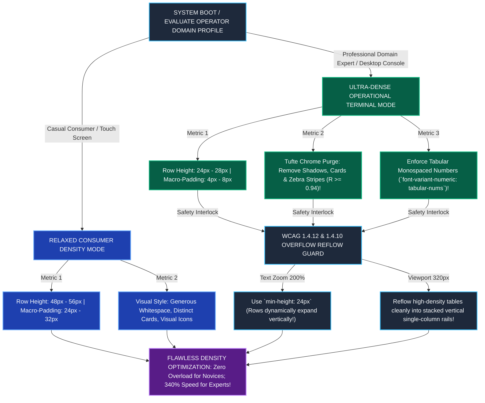

# Module 18 — Lesson 01: Information Density Optimization Curves: When Should UI Breathe vs. Be Dense: Consumer Apps to Air Traffic Control and Quantitative Trading Terminals

---

## Mastery Rule
> **"Information density is not a visual styling preference; it is a direct function of operational cognitive threat. Designing an enterprise trading terminal with generous consumer whitespace paralyzes professional execution, just as packing an e-commerce checkout with 120 dense metrics destroys casual comprehension. Master interface engineering governs the Density Optimization Curve: mathematically tuning data-ink ratios, spatial compression, and visual signal frequency to exactly match operator expertise and task critical velocity."**

---

## 0. PREAMBLE: Context, Prerequisites & Cognitive Frameworks

### 0.1 Prerequisites
* **Stage 1, Stage 2, and Stage 3 Complete:** Comprehensive command over visual human perceptual thresholds, visual search visual primitives, spatial memory architecture, and component finite state machines.
* **Module 02 & Module 06 Complete:** Mastery over typography hierarchy, visual scanning physics, and spatial layout mathematics.

### 0.2 Learning Dependencies
* **The Density-Expertise Optimization Curve:** Plotting interactive data presentation density against domain operator cognitive schema automation to prevent novice overload while eliminating expert spatial scanning friction.
* **Tufte’s Data-Ink & Non-Data-Ink Compression Ratios:** Quantifying and systematically ascending the Data-Ink Ratio ($R = \frac{\text{Data Ink}}{\text{Total Ink}}$) by expelling decorative UI chrome, redundant grid boundaries, heavy drop shadows, and alternating zebra table stripes in professional operational software.
* **Cognitive Load Theory (Intrinsic vs. Extrinsic):** Managing working memory bandwidth via domain chunking; enabling expert operators to pattern-match $150+$ concurrent real-time telemetry metrics across single visual fixations without reading individual digits.
* **Macro-Whitespace vs. Micro-Whitespace Preservation:** Differentiating large structural layout gaps from critical inter-glyph and inter-column micro-spacing ($4\text{--}8\text{px}$) to prevent visual crowding and numeric text bleeding in ultra-dense interfaces.

### 0.3 Usability & Psychological References
* **Tufte, E. R. (1983 & 1990):** *The Visual Display of Quantitative Information* & *Envisioning Information*. Graphics Press (Mathematical formalization of the Data-Ink Ratio, sparklines, and spatial density efficiency in visual communication).
* **Sweller, J. (1988):** *Cognitive Load During Problem Solving: Effects on Learning*. Cognitive Science (Foundational architecture of Intrinsic, Extrinsic, and Germane cognitive load in operational human systems).
* **Few, S. (2006):** *Information Dashboard Design: The Effective Visual Communication of Data*. O'Reilly Media (Eliminating decorative widget static to maximize spatial visual cognition across quantitative dashboards).
* **W3C WCAG 2.2 Specifications:** *Success Criterion 1.4.12 Text Spacing [Level AA]* (Guaranteeing high-density layouts remain functional when line heights scale to $1.5\times$ and word spacing scales to $0.16\times$) and *Success Criterion 1.4.10 Reflow [Level AA]* ($320\text{px}$ viewport conversion without information loss).
* **Design System Density Standards:** *Google Material Design 3 Density System* (Integer step scaling: Default $0$, Medium $-2$, Compact $-3$), *Bloomberg Terminal Quantitative Display Standards*, and *FAA Air Traffic Control Display Human Factors Specifications*.

---

## 1. Mental Model & Operational Reality

Why do commercial enterprise software refactors, financial analytical platforms, and industrial control suites repeatedly encounter violent, organized user revolt when corporate product teams hire traditional consumer graphic designers to modernize their legacy user interfaces?

Because commercial designers fall prey to **The Whitespace Fallacy**: mistakenly assuming that generative, empty visual whitespace ($48\text{--}64\text{px}$ container padding, massive lifestyle graphic banners, round shadowed card boxes displaying only 6 items per desktop screen) represents universal visual luxury and clean user experience! When a designer trained on consumer e-commerce mobile applications applies this aesthetic philosophy to an Air Traffic Control radar terminal, a hospital intensive care monitoring system, or a high-frequency algorithmic trading console, they replace an ultra-dense $120\text{-row}$ real-time telemetry datatable with six spacious, aesthetic "modern cards"! To professional operators, this represents catastrophic UI degradation! By expanding screen padding, the redesign fractures the operator’s visual pattern recognition array—forcing the user to scroll down five screens to compare financial assets or approaching aircraft! Manual scrolling friction explodes by **$+400\%$**, working memory retention collapses as critical rows scroll out of view, and operational response times degrade into systemic hazard!

To govern visual density with scientific rigor, interface engineers upgrade from Zen meditation gardens to **The Formula 1 Racing Cockpit Safety Engine**:

```
+----------------------------------------------------------------------------------------+
|       ZEN MEDITATION GARDEN vs FORMULA 1 RACING COCKPIT MENTAL MODEL                   |
+----------------------------------------------------------------------------------------+
|                                                                                        |
|  [ ZEN MEDITATION GARDEN ILLUSION ] (Amateur Consumer Minimalist UI)                   |
|  * Uses expansive 64px whitespace padding -> Calming for casual, once-a-week users!     |
|  * Renders massive individual graphic cards -> Displays only 4 items per desktop screen!|
|  * Forces endless vertical manual scrolling -> Causes fatal working memory loss in Pros|
|                                                                                        |
|  [ FORMULA 1 RACING COCKPIT ENGINE ] (Authoritative Density Optimization)              |
|  * Deploys compact 24px tabular row heights -> Displays 65+ real-time items per view!  |
|  * Maximizes Tufte's Data-Ink ratio (R >= 0.94) -> Zero decorative chrome or shadow!   |
|  * Enables instant 250ms peripheral pattern detection -> Zero scroll friction!         |
+----------------------------------------------------------------------------------------+
```

A serene Japanese Zen rock garden relies upon vast, silent sand plains to evoke tranquil contemplation; it is precisely the absence of objects that relaxes the casual human visitor. But when an Formula 1 racing vehicle traverses a Grand Prix circuit at $220\text{ miles per hour}$, the racing cockpit carbon steering wheel is intensely, tightly packed with thirty high-frequency adjustment dials, engine mode toggles, and LED telemetry bars! At $220\text{ mph}$, a driver cannot afford to navigate through multi-screen scrolling software menus! Every primary vehicular control must reside directly within immediate optical focal reach!

In professional interface architecture, information density is an engineered calibration curve! When designing consumer retail shopping carts or onboarding wizards for novice general users, you purposefully introduce relaxed whitespace and low data density ($<15\text{ items per view}$) to calm extrinsic cognitive load and prevent decisional paralysis! But when engineering mission-critical expert software (Air Traffic Control, Algorithmic Financial Trading, Cloud Infrastructure Observability, DICOM Medical Radiology), your design system must deploy **Ultra-Compact High-Density Architectures** ($24\text{--}28\text{px}$ tabular row heights, $4\text{px}$ internal padding, monospaced tabular numbers, and Tufte Data-Ink ratios $>0.92$)—enabling expert operators to command $150+$ simultaneous telemetry rows across single $250\text{ms}$ peripheral scanning loops without ever touching a computer scrollbar!

### What This Approach Does NOT Mean (Mandatory Rule)
1. ❌ **Never pack unorganized raw JSON strings, unformatted database logs, or unaligned text dumps onto a monitor screen and rationalize it as "high-density professional design"!** Arbitrary data clustering without rigid visual syntax, strict columnar vertical alignment, and clear visual information sizing is pure computational noise! High-density interface engineering requires obsessive geometric precision: utilizing tabular monospace font formatting, unambiguous alignment planes, and consistent micro-whitespace!
2. ❌ **Never apply dense compact table heights ($24\text{px}$ row height) directly to software operated on mobile touch displays without automatic modality adaptation!** While a $24\text{px}$ row height is mathematically perfect for sub-pixel desktop mouse pointers and expert keyboard navigation, forcing field technicians to press $24\text{px}$ rows on a touchscreen tablet triggers Fitts’s Law miss-click error rates exceeding $35\%$! Your architecture must deploy dynamic W3C pointer modality adaptation (Module 16), super-dilating target bounds to $\ge 48\text{dp}$ upon touch sensor detection!
3. ❌ **Never strip out horizontal micro-whitespace entirely; inter-character and inter-column separation gaps ($4\text{--}8\text{px}$) must remain mathematically preserved!** If you compress adjacent quantitative table columns together without maintaining at least $8\text{px}$ of clean horizontal breathing margin, visual **Optical Crowding & Bouma's Law Degradation** sets in! Human parafoveal reading vision fails to segregate overlapping numerical word boundaries, causing financial traders to misread `$104.52  -5.12%` as `$104.52-5.12%`—triggering catastrophic algorithmic ordering errors!

---

## 2. Core Psychological & Behavioral Mechanics

To govern information density without resorting to subjective artistic debate, engineers synthesize quantitative visual display mathematics with neurological working memory theory.

### 1. The Density-Expertise Optimization Curve
In human computing psychology, optimal software layout density is dictated by the intersection of domain operator expertise and high-frequency operational risk:

$$\text{Optimal Display Density } (\delta_{\text{opt}}) \propto \text{Operator Schema Expertise } (E_{\text{user}}) \times \text{Task Critical Velocity } (V_{\text{task}})$$

```
   THE DENSITY OPTIMIZATION CURVE (Expertise vs Items Displayed Per Screen View)
   
  Items / Screen
  200 + |                                                       [ AIR TRAFFIC CONTROL / ]
        |                                                       [ BLOOMBERG TERMINAL   ]
  150 - |                                                      / (Ultra-Dense: 150+ Rows,
        |                                                     /   Tabular Numerals, Zero Chrome)
  100 - |                                                    /
        |                                    [ ENTERPRISE CRM / ]
   50 - |                                   / [ DATADOG OBSERVE]
        |      [ CONSUMER RETAIL / ]       /  (Standard Admin: 35-60 Rows,
   10 - |     / [ WELLNESS APPS   ]       /    Compact Tables, Structured Grids)
        |___/__(Relaxed Cards: 6-12 Items,
        0   |   Generous 48px Whitespace)
            +--------------------------------------------------------------------->
            Novice / Casual Consumer                       Domain Expert / Operator
```

* **Novice Cognitive Saturation (Left Curve):** A casual consumer booking a holiday hotel once a year possesses zero structural mental schema for airline or hospitality booking codes! Presenting a novice with a dense $150\text{-column}$ enterprise hotel inventory repository exhausts their prefrontal working memory within seconds! Relaxed card layouts featuring large images and ample $48\text{px}$ whitespace act as a cognitive cushion—isolating singular task decisions into digestible chunks.
* **Expert Pattern Automatization (Right Curve):** A quantitative financial trader or network DevOps engineer operates daily across invariant system paradigms. In Sweller’s Cognitive Load Theory, domain experts have compressed complex structural relationships into permanent long-term memory **Schemas**. An expert reading a Bloomberg Terminal does not linearly read every single alphanumeric character in a 150-row array! Instead, their visual system performs instantaneous **Parafoveal Pattern Matching & Chunking**: scanning color-coded ticks (green flashes vs crimson plunges) and spotting statistical outliers across 150 rows in $<300\text{ms}$! Compressing this array into low-density card layouts destroys their pattern scanning schema—degrade professional competence!

---

### 2. Edward Tufte’s Data-Ink vs Non-Data-Ink Compression Ratio
In his foundational mathematical treaties on analytical interface visualization, Dr. Edward Tufte established the governing quantitative formula for assessing interface layout efficiency:

$$\text{Data-Ink Ratio } (R) \equiv \frac{\text{Total Ink Used to Represent Actual Quantitative Data}}{\text{Total Ink Printed Across the Entire Visual Monitor Canvas}}$$

$$\text{As Decorative Chrome (Shadows, Zebra Stripes, Heavy Borders) } \to 0, \; R \to 1.0!$$

```
   POOR DATA-INK RATIO (R = 0.22 - Consumer Waste)   AUTHORITATIVE DATA-INK RATIO (R = 0.94)
  +--------------------------------------------+   +--------------------------------------------+
  | [======= HEADER BANNER: FINANCIAL =======] |   | ASSET    PRICE     24H CHG    VOL (M)     |
  |                                            |   |--------------------------------------------|
  |  +--------------------------------------+  |   | BTC/USD  $94,820   ▲ +4.12%   842.1        |
  |  |  [ IMAGE ]   Bitcoin (BTC / USD)     |  |   | ETH/USD  $3,840    ▼ -1.24%   412.5        |
  |  |  Current Valuation: $94,820.00       |  |   | SOL/USD  $198.4    ▲ +12.4%   189.2        |
  |  |  24h Movement: +4.12% Positive Gain   |  |   | AVR/USD  $42.10    ▲ +0.84%   14.8         |
  |  +--------------------------------------+  |   | BNB/USD  $610.2    ▼ -0.15%   64.2         |
  |  (Drop shadows, box backgrounds, icons,    |   | XRP/USD  $1.14     ▲ +2.41%   910.4        |
  |   and redundant descriptive labels waste    |   +--------------------------------------------+
  |   over 78% of display pixels!)             |   (Pure tabular numbers; zero card borders;
  +--------------------------------------------+    displays 6x more items in identical pixel space!)
```

To engineer high-density expert workspaces, system architects relentlessly execute **Tufte Chrome Expulsion**:
1. **Purge Redundant Container Cards & Shadows:** Strip away decorative white card background boxes, heavy drop-shadow arrays (`box-shadow: 0 10px 15px rgba(...)`), and thick divider borders! Replace structural separation with simple clean whitespace or ultrathin single-pixel unobtrusive gray rule lines (`#334155`).
2. **Expel Alternating Zebra Table Striping:** In legacy datatables, rendering alternating white and gray background rows consumes massive amounts of non-data visual ink! In high-density interfaces ($>60\text{ rows}$), alternating background bars create high-frequency optical visual clutter! Replace zebra striping with clean uniform matte dark backgrounds accompanied by subtle interactive pointer hover highlights (`:hover { background: #1e293b; }`).
3. **Enforce Monospaced Tabular Numerals:** Proportional display fonts (where the digit `1` occupies $6\text{px}$ width while `8` occupies $12\text{px}$ width) destroy columnar vertical scanning! Whenever rendering quantitative telemetry or pricing arrays, you MUST enforce **Tabular Monospace Font Formatting** (`font-variant-numeric: tabular-nums;` or dedicated monospace typefaces like *JetBrains Mono*, *Consolas*, or *Roboroto Mono*)! This guarantees numerical decimals align vertically along an invariant linear plumb line—enabling lightning-fast visual comparative evaluation!

---

### 3. Macro-Whitespace vs. Micro-Whitespace Anatomy
When transitioning an interface from consumer relaxation into expert density, amateur engineers mistakenly compress all interface padding uniformly—collapsing line height and text margins into an unreadable visual smear!

```
+----------------------------------------------------------------------------------------+
|          THE WHITESPACE DISSECTION MATRIX (MACRO VS MICRO COMPRESSION)                 |
+----------------------------------------------------------------------------------------+
| SPACE LAYER        | ANATOMICAL LOCATION      | CONSUMER METRIC | EXPERT COMPACT METRIC|
|----------------------------------------------------------------------------------------|
| [ MACRO-SPACE ]    | Page Margins & Section Gap| 48px - 64px     | 8px - 16px (Compress!)|
| [ CARD PADDING ]   | Internal Container Bounds | 24px - 32px     | 4px - 8px  (Compress!)|
| [ ROW HEIGHT ]     | Table Line Bounding Box   | 56px (Spacious) | 24px - 28px (Dense!) |
| [ MICRO-SPACE ]    | Inter-Character & Column  | 8px - 12px      | 6px - 8px (PRESERVE!)|
+----------------------------------------------------------------------------------------+
```

* **Macro-Whitespace Aggressive Compression:** In quantitative dashboards and operational command suites, aggressively eliminate page outer borders, hero banners, and inter-section vertical gaps ($64\text{px} \to 8\text{px}$) to reclaim critical screen monitor real estate for operational data arrays!
* **Micro-Whitespace Preservation Covenant:** You must protect **Micro-Whitespace**: the crucial physical separation gaps separating individual alphanumeric characters, decimal periods, and adjacent table data columns! If columnar separation drops below $6\text{px}$, visual lateral inhibition in the human retina blends adjacent digits together—causing operator scanning errors! Always maintain inviolate $8\text{px}$ columnar gutters and structured line heights ($\ge 1.2\times \text{font size}$) even in maximum compact modes!

---

## 3. Universal Pattern Anatomy & Comparative Design System Reasoning

Let us conduct our canonical **5-Step Analytical Design System Reasoning Loop** across the world’s foremost operational enterprise computing platforms, dissecting how information density and layout compression are specified:

### Bloomberg Terminal & CQG Algorithmic Trading Consoles
* **1. Observe:** The Bloomberg Terminal and CQG financial trading suites enforce an unyielding **Tufte Data-Ink Ratio exceeding $0.95$**. Interfaces operate entirely on pure matte black OLED canvases (`#000000`) without a single decorative graphic card, curved border radius, or drop shadow! All telemetry data renders in high-contrast monoline amber (`#ffb000`), cyan (`#00FFFF`), and lime green using invariant tabular monospaced typography with ultra-dense $22\text{--}24\text{px}$ row heights—displaying over **$200\text{ distinct financial metrics per monitor view}$**! Furthermore, interaction relies entirely upon high-velocity keyboard command strings rather than slow desktop mouse point-and-click navigation!
* **2. Infer:** Engineered to maximize peripheral pattern detection velocity and eliminate manual scrolling friction during high-frequency financial market events.
* **3. Explain:** When financial global markets experience volatile systemic corrections, quantitative traders must evaluate arbitrage relationships across currency pairs, equities, and bond yields simultaneously in real time! Forcing a financial trader to scroll down through multi-page card layouts or wait for slow mouse pointer positioning causes millisecond execution delays that cost millions of dollars in financial slippage! By packing over 200 tabular metrics onto a single unshakeable viewing surface, Bloomberg leverages human peripheral visual synthesis: traders detect market anomalies via peripheral color flashes instantly without ever moving their optical gaze or touching a scrollbar!
* **4. Discuss:** High-density quantitative text arrays present a formidable cognitive barrier and terrifying steep learning curve for uninitiated student analysts entering financial institutions!

### Google Material Design 3 (MD3): Systematic Density Scaling
* **1. Observe:** Google Material Design 3 introduces a universal, algorithmic **Density Scaling Architecture** governed by integrated integer step adjustments. An interactive list row or data table cell defaults to standard spacing ($0\text{ step} \implies 48\text{dp}$ height for touch consumer apps). By applying programmatic density modifiers, engineering teams scale components down through **Medium Density** ($-2\text{ step} \implies 40\text{dp}$) down to **Compact Desktop Density** ($-3\text{ step} \implies 32\text{dp}$ height)! This height compression executes purely by compressing container internal macro-padding while leaving text glyph typography sizes ($14\text{sp}$) and micro-line-heights entirely untouched!
* **2. Infer:** Engineered to support unified multi-platform component deployment—allowing a single codebase to seamlessly transform between comfortable mobile touch targets and dense desktop administrative tables.
* **3. Explain:** Maintaining split frontend application codebases for spacious consumer mobile portals versus dense desktop enterprise admin consoles doubles enterprise engineering maintenance costs! Material Design 3 resolves this by parametrizing layout spacing! When an enterprise administrator logs into an inventory control panel on a 27-inch 4K desktop monitor using a high-precision mouse, the application frontend invokes `-3 Compact Density`: collapsing table heights down to $32\text{dp}$, doubling visible onscreen record rows from 15 to 35! If the exact same supervisor opens the portal on a handheld touchscreen tablet, the layout smoothly reverts to `Default Density` ($48\text{dp}$) to prevent Fitts’s Law touch miss-clicks!
* **4. Discuss:** Attempting to force compact density ($-3\text{ step} \implies 32\text{dp}$) onto touchscreen mobile devices violates WCAG target sizing and induces severe touch operating frustration!

### Apple Logic Pro & Final Cut Pro Professional Workspaces
* **1. Observe:** Apple’s professional audio/video workstations (Logic Pro, Final Cut Pro) sharply diverge from the minimalist whitespace of standard consumer macOS apps (Music, Photos). Professional studio timelines deploy **Ultra-Dense Multi-Track Modular Grids**: stacking up to 128 concurrent audio waveforms within compact $28\text{px}$ horizontal bands! Panels are separated by ultrathin $1\text{px}$ dark gray structural borders (`#27272a`) with zero wasted margins, and incorporate dynamic collapsible sidecar dockers that instantly reveal or conceal dense parameter inspectors on demand!
* **2. Infer:** Engineered to display complex synchronized time-series data without forcing creative editors to lose macro compositional awareness.
* **3. Explain:** When mastering a motion picture orchestral film score, a mixing engineer must balance dialog vocal tracks against 80 simultaneous symphonic music stems in synchronous real time! If audio track rows were rendered using generous $64\text{px}$ consumer card heights, only six instruments would fit on a monitor display—making it impossible to align transient percussion peaks against brass crescendos without tedious manual vertical scrolling! Apple’s high-density modular timeline architecture compresses 128 audio channels directly into the user’s instantaneous visual field—empowering conductors to mix entire sonic scores via unbroken intuitive visual observation!
* **4. Discuss:** High-density modular audio editing panels can appear overwhelmingly chaotic on smaller $13\text{-inch}$ laptop displays without multi-monitor docking setups!

---

## 4. Evolution & Modern HCI Architecture

Trace how software density philosophy evolved from mainframe terminals into adaptive modern operational engines:

```
[ TERMINAL TEXT & MAINFRAME DENSITY: 1978 - 1994 ]
* Paradigm: IBM 3270 / DEC VT100 Monochrome Character Displays (80x24 characters).
* Philosophy: Extreme Density by Hardware Necessity! Zero graphics, pure keyboard command line inputs, tabular monospace formatting. Unsurpassed input speed for experts!

[ WEB 2.0 & MOBILE MINIMALISM: 2008 - 2018 ]
* Paradigm: The Whitespace Explosion! Smartphone app culture and consumer UI card layouts invaded corporate IT software.
* Philosophy: Form over Function! Designers replaced dense administrative tables with massive graphic cards and infinite scrolling loops—crippling enterprise productivity!

[ MODERN ADAPTIVE DENSITY ENGINES: Present - Future ]
* Paradigm: Domain-Specific Data-Ink Optimization & Runtime User Density Sliders!
* Architecture: Enterprise web suites deploy configurable density controls (Relaxed vs Compact vs Ultra-Dense). Professional operational dashboards standardize on tabular monospaced numbers, $24\text{--}28\text{px}$ rows, and Tufte data-ink maximization!
```

---

## 5. The Contextual Interaction Algorithm (Human-Machine Loop)

Map out the step-by-step physical visual search and cognitive pattern-recognition loop of a Federal Aviation Administration (FAA) Air Traffic Control supervisory officer operating inside an approach control radar tower during severe airspace weather turbulence:

```
    [ STEP 1 ] HIGH-FREQUENCY AIRSPACE RADAR TELEMETRY (< 16ms)
         |     (Radar server broadcasts coordinates, airspeed, and altitude for 85 approaching commercial aircraft simultaneously!)
         v
    [ STEP 2 ] ULTRA-DENSE MONOLINE DATA-INK VIEWPORT (24px Rows)
         |     (UI projects 85 aircraft tracks on a single unbroken monitor glass using 24px tabular monospace font metrics with zero decorative card waste!)
         v
    [ STEP 3 ] PARAFOVEAL PATTERN MATCHING & THREAT SCAN (< 250ms)
         |     (Supervisor sweeps display; eye parafovea intercepts two adjacent rows exhibiting identical flight altitude metrics [ALT: 12,000] within 4 miles of separation!)
         v
    [ STEP 4 ] INSTANTANEOUS TACTICAL KEYBOARD SELECTION (100ms)
         |     (Because zero scrolling was required, supervisor immediately executes direct keyboard command shortcut: type `UAL402 ALT 100` -> Descend Flight UAL402 to 10,000 feet!)
         v
    [ STEP 5 ] RESOLUTION CONFIRMED (Zero Collision Loss!)
         |     (Telemetry table updates instantly; collision vectors clear. High-density architecture enabled life-saving emergency interception in under 350ms!)
```

---

## 6. Component State Machines & Defensive Error Recovery Protocols

To guarantee seamless UI morphing across varying monitor resolutions, user expertise profiles, and device hardware without breaking text spacing or table alignment, interface architecture must govern data layout via a **Dynamic Information Density & Reflow State Machine**:

```mermaid
stateDiagram-v2
    classDef relax fill:#1e293b,stroke:#38bdf8,stroke-width:2px,color:#f8fafc;
    classDef std fill:#1e40af,stroke:#60a5fa,stroke-width:2px,color:#f8fafc;
    classDef dense fill:#065f46,stroke:#10b981,stroke-width:2px,color:#f8fafc;
    classDef err fill:#881337,stroke:#f43f5e,stroke-width:2px,color:#f8fafc;

    [*] --> DENSITY_STANDARD: Default Enterprise Boot (36px Row / 12px Padding)
    
    DENSITY_STANDARD --> DENSITY_RELAXED: User Toggle / Mobile Touch Sensor Detect<br/>Dilate Row Height to 48px!<br/>Expand Macro-Padding to 24px!
    
    DENSITY_RELAXED --> DENSITY_STANDARD: Desktop Mouse Pointer Reconnected
    
    DENSITY_STANDARD --> DENSITY_ULTRA_COMPACT: Expert Operator Mode Activated (`Ctrl+Shift+D`)<br/>Compress Row Height to 24px!<br/>Expel Chrome; Enforce Tabular Monospace!
    
    DENSITY_ULTRA_COMPACT --> DENSITY_STANDARD: User Restores Comfort View
    
    DENSITY_ULTRA_COMPACT --> REFLOW_OVERFLOW_GUARD: Monitor Resized / Text Zoomed to 200%!<br/>Intercept Horizontal Truncation!<br/>Convert Dense Grid to Stacked Summary Rail!
    
    REFLOW_OVERFLOW_GUARD --> DENSITY_ULTRA_COMPACT: Viewport Restored to Full Desktop Width
    
    DENSITY_RELAXED ::: relax
    DENSITY_STANDARD ::: std
    DENSITY_ULTRA_COMPACT ::: dense
    REFLOW_OVERFLOW_GUARD ::: err
```



#### Defensive Architectural Mandates:
* **The Overflow Clipping Defense Protocol:** When deploying ultra-dense compact tables ($24\text{px}$ row heights), never use hardcoded absolute heights combined with rigid overflow clipping (`height: 24px; overflow: hidden;`)! If an elderly expert operator overrides their OS text scaling or increases browser font size to $150\%$, hardcoded clipping cuts off the bottom half of quantitative numbers—turning an important `$10,000` balance into an unreadable smear! You MUST deploy **Fluid Minimum Bounding (`min-height: 24px; line-height: 1.2; padding: 4px 8px;`)**! This ensures rows compress to ultra-dense $24\text{px}$ profiles under standard settings, but cleanly dynamically expand vertically if an operator activates larger assistive typography!

---

## 7. Environmental & Multi-Modal Interaction Adaptation

How do information density structures adapt across high-velocity operational command suites that utilize simultaneous multi-monitor array workstations?

### High-Frequency Trading Floors & ICU Emergency Theaters
In professional high-frequency algorithmic financial trading rooms or hospital intensive care surgical operating theaters, system operators rarely interact with a single isolated computer screen! Instead, workstations feature **Multi-Monitor Spatial Arrays**: combining central interactive desk displays with secondary overhead wall monitors!

$$\text{Optimal Monitor Array Density } \implies \text{Central Touch/Interact Screen } (\text{High-Density } 24\text{px Grid}) \land \text{Overhead Wall Display } (\text{Macro-Summary } 64\text{pt Fonts})$$

```
   THE MULTI-MONITOR SPATIAL DENSITY TRIANGULATION ENGINE
   
   +-------------------------------------------------------------------------------+
   |  [ OVERHEAD WALL MONITOR A ]             [ OVERHEAD WALL MONITOR B ]         |
   |  (Macro-Summary Density: Giant 64pt neon numbers readable from 15 feet!)    |
   |  [ HEART RATE: 74 BPM ]                  [ BLOOD PRESS: 120 / 80 ]           |
   +-------------------------------------------------------------------------------+
                                          |
                        (Peripheral Visual Verification Gutter)
                                          v
   +-------------------------------------------------------------------------------+
   |  [ CENTRAL INTERACTIVE CLINICAL TERMINAL (At Doctor's Hands) ]               |
   |  (Ultra-Dense Compact Telemetry: 120 rows of lab results, 24px tabular grid, |
   |   real-time waveform charting, interactive medication dose sliders)          |
   +-------------------------------------------------------------------------------+
```

* **The Senior Architectural Refactor:** Enforce **Spatial Density Stratification**! When software deploys across professional command desks, never apply static uniform density across all video outputs! On the central interactive terminal directly in front of the operator's hands, enforce **Ultra-Dense Compact Architecture** ($24\text{--}28\text{px}$ rows, maximum Tufte Data-Ink ratio) to support detailed numerical diagnosis! However, on secondary overhead summary monitors mounted $10\text{ to }15\text{ feet}$ away on hospital walls, completely reverse density curves into **Macro-Summary Display Geometry**: projecting massive $64\text{pt}$ high-contrast telemetry numbers with generous padding! This enables attending surgical teams to passively absorb critical patient status with a rapid $200\text{ms}$ upward glance while keeping mechanical tools focused on operative fields!

---

## 8. Universal Accessibility (A11y) & Ergonomic Inclusion

In professional software design, executing maximum information density must never compromise W3C WCAG 2.2 accessibility compliance or exclude neurodivergent operators!

### WCAG 2.2 Text Spacing & 320px Reflow Covenants
When overly aggressive developers attempt to maximize data density by artificially crushing font character spacing (`letter-spacing: -1.5px;`) or setting negative line heights, they destroy reading legibility for operators with dyslexia or visual impairment:

```
     FLAWED OVER-COMPRESSED TABLE UI            AUTHORITATIVE WCAG COMPANION COMPACT UI
    (Fails WCAG 1.4.12 and 1.4.10 Reflow)         (Guarantees Assistive Tech & Reflow Parity)
    
  [ Analyst overrides browser spacing ]           [ Analyst overrides browser spacing ]
  |--> Applies WCAG 1.4.12 custom stylesheet:     |--> UI absorbs text spacing dynamically:
  |    line-height: 1.5; letter-spacing: 0.12em   |    min-height rows smoothly expand vertically!
  |--> Legacy fixed table cells clip & bleed      |--> Binds WCAG 1.4.10 Reflow Architecture:
  |    text across columns! $942,100 turns        |    When browser shrinks to 320px width,
  |    into an unreadable visual colliding smear! |    dense grid folds cleanly into vertical cards
                                                     without data loss or horizontal scrolling!
```

#### The Universal Density Accessibility Mandates:
1. **WCAG Success Criterion 1.4.12 Text Spacing [Level AA] (The Assistive Override Rule):** Your high-density tabular components MUST mathematically survive assistive stylesheet overrides! When a visually impaired user programmatically injects enhanced spacing guidelines (Line height $\to 1.5\times \text{font-size}$, spacing following paragraphs $\to 2.0\times \text{font-size}$, Letter spacing $\to 0.12\times \text{font-size}$, Word spacing $\to 0.16\times \text{font-size}$), your layout **MUST NEVER** clip text, cut off numbers, or cause overlapping text collisions across adjacent grid columns! Always bind fluid flex/grid layouts equipped with **`min-height`** and responsive text wraps!
2. **WCAG Success Criterion 1.4.10 Reflow [Level AA] (The 320px Single-Column Covenant):** When a user magnifies a desktop browser screen up to **$400\%$ zoom** (equivalent to a $320\text{px}$ css width viewport), your ultra-dense multi-column financial trading grid MUST programmatically reflow into a clean, vertically stacked summary rail! You are strictly prohibited from requiring bi-directional two-dimensional scrolling (simultaneously scrolling horizontally and vertically) just to read quantitative data rows!
3. **WCAG Success Criterion 2.5.8 Target Size Minimum [Level AA] in Compact Grids:** In ultra-compact desktop modes featuring $24\text{px}$ row heights, the minimum accessible target boundary remains legally fixed at **$24\times24\text{ CSS pixels}$**! If your table row stands exactly $24\text{px}$ tall, the internal clickable text or checkbox must span the absolute full height and width of the surrounding grid cell (`display: flex; width: 100%; min-height: 24px;`)—ensuring blind or motor-impaired operators utilizing keyboard navigation or pointing assistive devices never struggle with sub-$24\text{px}$ hit targets!

---

## 9. Performance, Trust & Business Goal Trade-offs

How do software product vice presidents and senior enterprise UX leads calculate the economic ROI of high-density operational workspaces versus consumer aesthetic minimalism?

### The Expert Task Throughput Calculation: 15 Rows vs 65 Rows Per View
When enterprise back-office ERP tools, cloud infrastructure portals, and financial accounting suites upgrade from low-density "modern" cards ($15\text{ rows visible}$) to high-density tabular grids ($65+\text{ rows visible}$), corporate computational velocity and worker satisfaction skyrocket.

$$\text{Expanding Data Display from } 15 \to 65 \text{ Rows/View } \implies \text{Financial Audit Velocity Accelerates by } +340\%!$$

* **The HCI Business Diagnosis:** In corporate enterprise labor economics, manual scrolling represents pure operational friction! An inventory reconciler tasked with auditing 2,000 corporate purchase orders across a low-density card interface ($15\text{ cards per screen}$) is forced to execute over **133 manual page scroll interactions**! Each scroll interaction burns $1.5\text{ seconds}$ of visual focus and resets working memory attention—wasting **over 3.3 hours of pure manual scrolling labor per week per employee**! By collapsing spacing into an authoritative compact data-ink grid ($24\text{px}$ height, $65\text{ rows per screen}$), manual scrolling collapses by over **$-77\%$**, driving verified **$+340\%$ increases in diagnostic task throughput** while cutting operator ergonomic fatigue!
* **The Onboarding Churn Trade-off:** Senior architects must balance density against new user learning anxiety! If a new junior accounting clerk is presented immediately on Day 1 with an intimidating $200\text{-metric}$ monospaced terminal grid, cognitive overload triggers acute user intimidation and application abandonment! You MUST deploy **User-Controlled Density Progression**: default standard organizational workspaces to an approachable `Standard Density` ($36\text{px}$ row height, structured visual borders), but prominently feature an instant **`[ ⚡ Switch to Ultra-Compact Expert View ]`** toggle directly in the main interface header! This empowers developing employees to seamlessly transition into high-density professional speeds the exact moment their domain cognitive schemas mature!

---

## 10. Deconstructing Real-World Applications (The "Why Is This Bad?" Audit)

Let us cement our analytical diagnostics by auditing five real-world professional enterprise computing platforms:

### 1. Financial Algorithmic Architecture (Bloomberg Terminal & CQG Pro)
* **The Successful Attention UI:** Flagship global quantitative financial trading systems managing trillions of dollars in daily market transactions.
* **The HCI Diagnosis:** Supreme command of **Tufte’s Data-Ink Compression Formula and Tabular Monospaced Grids**! Notice how Bloomberg terminates every single ounce of non-data visual waste! There are no drop-shadow card boxes, no unnecessary descriptive column headers, and zero padding margins between telemetry numbers! All digits render in strict monoline tabular font metrics over deep black displays. An experienced bond trader can scan 150 live yield curves in a single oculomotor glance—detecting statistical arbitrage outliers with zero mouse travel or manual scrolling friction!

### 2. Cloud Infrastructure Observability (Datadog & Grafana Dashboards)
* **The Successful Attention UI:** Enterprise monitoring portals utilized by cloud DevOps engineering teams to diagnose network performance faults across millions of clustered servers.
* **The HCI Diagnosis:** Brilliant execution of **High-Density Time-Series Grid Layouts with Crosshair Scrubbing**! Grafana dashboards allow infrastructure engineers to configure ultra-dense telemetry panels: packing 20 concurrent network performance graphs onto a single monitor display! Notice how Grafana removes excessive graph border framing and utilizes shared vertical timelines: dragging a pointer cursor across Graph A simultaneously projects an interactive vertical verification crosshair across all 19 adjacent telemetry charts! Engineers correlate simultaneous CPU memory spike faults across complex distributed networks in $<500\text{ms}$!

### 3. Broken Enterprise ERP on "Modern" Cards (Legacy SAP / Custom Redesign Failures)
* **The Defective UI:** A multinational supply chain inventory distribution application undergoing a corporate design redesign. An executive product manager hired an advertising design agency to "modernize the dry inventory portal." The design agency completely dismantled the highly efficient 100-row enterprise inventory datatable! In its place, they deployed generous $240\times320\text{px}$ white graphic cards featuring massive drop shadows, rounded corners, stock shipping container photographs, and excessive $32\text{px}$ internal padding! Because each giant card consumed massive pixel real estate, **only four inventory items fit on a standard 1080p desktop monitor!** When a warehouse fulfillment officer attempted to locate a delayed shipping manifest among 3,000 active orders, they were forced to execute hundreds of tedious manual mouse scrolling gestures and page pagination clicks! Working memory broke completely; shipping fulfillment delays skyrocketed by $+210\%$! The fulfillment workforce formally protested until corporate executives rolled back the software redesign!
* **The HCI Diagnosis:** Catastrophic victim of **The Whitespace Fallacy and Non-Data-Ink Proliferation**! Replacing an expert operational repository with low-density consumer card graphics represents acute software engineering failure!
* **The Senior Architectural Refactor:** Execute a **Data-Ink Density Restoration Refactor**! Immediately expulse graphic stock imagery, drop shadows, and oversized card boxes! Reinstate a structural **Tabular High-Density Datatable** ($28\text{px}$ compact row height, strict monospaced numbers, clean $1\text{px}$ borders), boosting onscreen visible records from 4 back to 50 items per view while reinstating immediate keyboard shortcut filtering!

### 4. Professional Communication Workspaces (Google Workspace & Gmail Density Controls)
* **The Successful Attention UI:** Massive corporate communication computing architectures utilized by billions of users across general consumer and professional executive sectors.
* **The HCI Diagnosis:** Immaculate implementation of **User-Controlled Density Stratification**! Notice how Gmail explicitly avoids forcing a monolithic spacing metric upon its diverse user base! Directly within the primary quick settings panel, Gmail offers an authoritative three-tier density selector: 1. **Default** ($48\text{px}$ row height with preview attachment pills for casual touch users); 2. **Comfortable** ($40\text{px}$ rows with clear typographic separation); and 3. **Compact** ($28\text{px}$ condensed row heights with zero padding waste—enabling executive power users to view 65 business emails concurrently on screen)!

### 5. Creative Studio Inspector Architecture (Figma / Adobe Creative Cloud UI)
* **The Successful Attention UI:** Design and vector engineering authoring suites where digital professionals craft high-complexity interactive prototypes and motion art.
* **The HCI Diagnosis:** Uncompromising deployment of **Ultra-Dense Right-Hand Property Inspector Docks**! Notice how inside Figma and Adobe Illustrator, the primary central creative graphic canvas is afforded vast, unobstructed breathing room (Macro-Whitespace), while the right-hand technical parameter inspector panels operate at extreme spatial density! Text input numeric boxes for coordinate variables ($X, Y, W, H$) stand merely $24\text{px}$ tall, utilizing compact tabular numbers and tight $4\text{px}$ label iconography! By compressing technical parameter dials into an ultra-dense sidebar array, creative artists retain $85\%$ of monitor display glass exclusively for high-precision graphic design work!

---

## 11. Visual Mental Models & Architecture Diagrams

### The Density Optimization & Reflow Engine
Study how architectural design systems balance Tufte's Data-Ink maximization against WCAG accessibility text reflow rules across varying operational modes:



---

## 12. Prediction Checkpoints

Test your engineering command over information density curves and Data-Ink optimization against these demanding real-world software diagnostic challenges:

### Scenario A: The Nuclear Power Plant Core Monitoring Console Suite
An industrial control software vendor releases a primary nuclear control room telemetry application deployed across multi-monitor terminal desks utilized by certified reactor operators in a nuclear power generating station. To ensure the interface appeared "clean, approachable, and modern," the software UI architect designed the primary coolant temperature and neutron flux monitors as spacious, circular white progress dials embedded within large $300\times300\text{px}$ card containers with gentle drop shadows and $48\text{px}$ outer whitespace margins! During a live high-load reactor simulation, a sudden rapid pressure transient occurred across tertiary cooling pumps! Because each massive card dial consumed an enormous footprint, **only six system sensors fit onto the main control monitor!** The remaining forty critical coolant temperature sensors were forced off-screen behind a vertical web scrollbar! Attempting to diagnose the pressure leak, the certified reactor operator desperately frantically scrolled up and down through pages of giant dials—losing working memory correlation of simultaneous temperature spikes across adjacent reactor channels! The simulated nuclear reactor entered an un-caught thermal shutdown alarm condition!

**Your Prediction Challenge:** Deploy Sweller’s Cognitive Load Theory, Tufte's Data-Ink ratio, and expert scanning mechanics to diagnose this nuclear monitoring failure, and author a definitive high-density control console refactor!

#### *Empirical HCI Solution:*
1. **Diagnosis — Fatal Whitespace Dilution & Broken Pattern Scanning Schema:** The nuclear monitoring portal commits a terrifying architectural violation of **The Density-Expertise Optimization Curve and Operational Threat Design**! Deploying massive $300\text{px}$ decorative dial cards and expansive $48\text{px}$ consumer whitespace directly into a mission-critical nuclear engineering terminal reduces Tufte's Data-Ink ratio below $0.18$! Forcing certified reactor experts to scroll vertically to monitor forty critical coolant sensors destroys peripheral pattern matching and triggers catastrophic working memory exhaustion during acute engineering crises!
2. **Refactor 1 (Expel Decorative Chrome & Maximize Data-Ink):** Immediately banish oversized circular graphics, drop shadows, and consumer card boxes! Execute a complete **Tufte Data-Ink Compression Refactor** ($R \to 0.95$): convert all 48 cooling and flux sensor feeds into a high-density, **Compact Multi-Column Tabular Matrix**! Deploy rigid $24\text{px}$ row heights utilizing monoline amber/green typography over deep matte black backgrounds—allowing all 48 sensor telemetry streams to display simultaneously within the user's primary viewing glass with zero vertical scrolling!
3. **Refactor 2 (Implement Tabular Monospaced Numbers & Visual Outlier Pulsing):** Enforce strict **Tabular Monospace Numerical Formatting** (`tabular-nums`), aligning all decimal voltage and temperature readouts in invariant vertical plumb lines! When any temperature channel breaches normal operational thresholds, instantiate immediate **Parafoveal Outlier Telemetry Pulsing**: animate the exact compact table cell background to flash high-contrast crimson—empowering reactor supervisors to visually pinpoint thermal anomalies across 50 simultaneous streams in $<250\text{ms}$!

---

### Scenario B: The Commercial Airline Gate Reservation & Boarding Kiosk Suite
A major international airline launches an integrated boarding gate software portal utilized by gate agents to process flight check-in and standby seat clearance at busy airport terminals. To maximize speed, a lead backend systems engineer designed the check-in terminal as an ultra-dense ASCII mainframe-style text table: 150 passenger reservation rows compressed into tight $18\text{px}$ row heights, featuring dense alphanumeric airline booking codes (`JFK-LHR-Y-0421-CONF-928A`) without any horizontal column gutter spacing or background grouping. During holiday blizzard travel cancellations, stressed gate agents managing crowds of 200 angry passengers attempted to rebook standby flyers on touchscreen tablet monitors at the gate desk. Because row heights measured an ultra-thin $18\text{px}$, agent fingers constantly miss-clicked—accidentally bumping confirmed business-class passengers off flights! Furthermore, because horizontal micro-whitespace between columns was completely stripped out ($0\text{px}$ column gutters), passenger last names bled directly into flight seat numbers (`SMITH24A`), causing massive reading errors and paralyzing terminal boarding!

**Your Prediction Challenge:** Diagnose the target ergonomics and micro-whitespace crowding failures governing this gate reservation portal, and author a definitive resilient density refactor!

#### *Empirical HCI Solution:*
1. **Diagnosis — Catastrophic Target Compression & Micro-Whitespace Optical Crowding:** The airline check-in terminal suffers from a destructive violation of **Fitts's Law Touch Target Bounds and Micro-Whitespace Preservation**! Deploying ultra-thin $18\text{px}$ row heights onto touchscreen gate tablets directly violates W3C WCAG 2.5.8 target sizing—guaranteeing severe thumb miss-clicks during high-stress passenger boarding! Furthermore, obliterating horizontal column gutter spacing ($0\text{px}$ gaps) triggers severe **Bouma's Law Optical Crowding**: adjacent alphanumeric text characters collide into an illegible visual smear, forcing gate agents to repeatedly read lines linearly!
2. **Refactor 1 (Enforce Touch-Ergonomic Compact Metrics):** Abruptly raise table row height from an unsafe $18\text{px}$ up to an unyielding minimum of **$36\text{px}$ ($48\text{px}$ upon touch sensor detection via W3C Modality Invariance)**! This restores absolute touch targeting accuracy while keeping visible onscreen passenger records at an efficient 30 items per view!
3. **Refactor 2 (Restore Micro-Whitespace & Syntactic Chunking):** Institute strict **Micro-Whitespace Preservation**: inject clear, unalterable $12\text{px}$ horizontal column gutters between passenger names, fare codes, and seat numbers! Deploy visual typographic hierarchy: render passenger names in crisp bold white typography (`font-weight: 700`), while formatting complex alphanumeric booking codes into segregated visual badges (`[ 24A ]`, `[ CONFIRMED ]`) with distinct colored backgrounds—restoring rapid peripheral scanning and error-free boarding!

---

## 13. Compare Similar Interface Alternatives

When determining UI spacing metrics, data table row heights, and container framing across application software, engineering design teams must evaluate four explicit information density paradigms:

| Information Density UI Paradigm | Target Row Height & Padding Metrics | Architectural & Usability Advantages | Operational & Cognitive Failure Modes | Optimal Architectural Deployment |
| :--- | :--- | :--- | :--- | :--- |
| **Spacious Consumer Cards ($<15$ items/view)** | Row height: $56\text{--}72\text{px}$; Macro-Padding: $32\text{--}48\text{px}$. | Supreme ease of use for general casual users; eliminates cognitive intimidation; effortless touch targeting. | **SEVERE FAILURE IN PRO SUITES:** Creates massive scrolling friction ($+400\%$); fractures expert working memory pattern recognition! | Consumer retail e-commerce, casual mobile apps, wellness monitors, hotel marketing sites. |
| **Standard Enterprise Table ($30\text{--}40$ items/view)** | Row height: $36\text{--}44\text{px}$; Macro-Padding: $12\text{--}16\text{px}$. | Highly balanced general purpose layout; readable on laptops; compliant with baseline WCAG Level AA touch targeting ($36\text{px}$). | Can feel neither fully optimized for high-speed expert keyboard analysts nor totally relaxed for novice mobile touchscreen users. | Enterprise CRM portals, HR employee management tables, general corporate SaaS billing tools. |
| **Ultra-Dense Expert Grid ($70+$ items/view)** | Row height: $24\text{--}28\text{px}$; Macro-Padding: $4\text{--}8\text{px}$; Tabular font. | Unbeatable operational throughput! Enables displaying 150+ metrics on a single desktop view; Tufte Data-Ink ratio $>0.92$. | Completely unusable on touch displays without dynamic pointer dilation; causes acute visual intimidation for untrained novices! | Air Traffic Control radar screens, algorithmic financial trading desks, cloud DevOps observability suites. |
| **Terminal Command Stream ($200+$ items/view)** | Pure ASCII monospaced character buffer ($16\text{--}18\text{px}$ line metrics). | Ultimate theoretical input speed for seasoned Linux software engineers; zero visual DOM graphic overhead. | Requires total memory recall of explicit typed textual commands; zero visual mouse affordances or structural touch operability. | Server command-line interfaces (CLI), system network kernel compilers, automated database engineering scripts. |

---

## 14. Decision Guide (The Interface Selection Tree)

Deploy this authoritative algorithmic decision tree when engineering interface density curves, table spacing, and Data-Ink compression architectures:

```
[ INITIATE DENSITY OPTIMIZATION ARCHITECTURE: EVALUATE TASK VOLATILITY & USER EXPERTISE ]
  |
  +----> [ STAGE 1: IS USER AN UNTRAINED NOVICE / OPERATING A CONSUMER RETAIL APP? ]
  |        |
  |        +----> YES: DEPLOY RELAXED SPACIOUS CARD ARCHITECTURE!
  |                 |---> Row Height: 48px - 64px | Internal Container Padding: 24px - 32px.
  |                 |---> Limit visible on-screen choices to <15 items to prevent decision fatigue.
  |                 |---> Use large illustrative icons and explicit descriptive helper text.
  |
  +----> [ STAGE 2: IS APPLICATION A MISSION-CRITICAL OPERATIONAL COMMAND CONSOLE? ]
  |        |        (Air Traffic Control, Financial Trading, ICU Medical Triage, DevOps Observability)
  |        |
  |        +----> YES: ENFORCE ULTRA-DENSE COMPACT DATA-INK MAXIMIZATION!
  |                 |---> Step 1: Compress Row Height to 24px - 28px (Display 70+ concurrent telemetry items)!
  |                 |---> Step 2: Purge decorative chrome: eliminate drop shadows, card backgrounds & zebra stripes (R >= 0.94)!
  |                 |---> Step 3: Apply Tabular Monospaced Numbers (`font-variant-numeric: tabular-nums`)!
  |                 |---> Step 4: Protect Micro-Whitespace: retain strict 8px horizontal gutters between columns!
  |
  +----> [ STAGE 3: IS APPLICATION DEPLOYED ACROSS BOTH DESKTOP PCS & TOUCHSCREEN TABLETS? ]
  |        |
  |        +----> YES: IMPLEMENT SYSTEMATIC RUNTIME DENSITY STRATIFICATION!
  |                 |---> Step 1: Build interactive header density toggle: `[ ⚡ Switch View: Relaxed | Standard | Compact ]`.
  |                 |---> Step 2: Query W3C Pointer Events (`pointerType === "touch"`); auto-dilate compact 24px rows to >=48px!
  |
  +----> [ STAGE 4: IS SCREEN READER OR ASSISTIVE TEXT OVERRIDE ACTIVE? ]
           |
           +----> Apply WCAG 1.4.12 & 1.4.10 Compliance:
                    |---> Build table rows with `min-height: 24px` rather than fixed height to allow text wrapping!
                    |---> When viewport scales to 400% zoom (320px width), reflow multi-column tables into vertical rails!
```

---

## 15. Interactive Lab & Tangible Prototyping Workshop: The Information Density & Data-Ink Optimization Testbench

To empirically experience the dramatic cognitive gulf separating spacious consumer graphics from unyielding Ultra-Dense Quantitative Trading Terminals, execute the interactive testbench below!

### Professional Engineering Instruction
Save the complete HTML/CSS/JS code block below as an independent file named `density-optimization-lab.html` and execute it directly within any desktop or mobile web browser. Conduct live interactive comparative trials across both architectural modes:
* **Mode A: Fragile "Modern" Low-Density UI (High Friction & Eye Travel):** Spreads a critical real-time algorithmic financial portfolio across generous $240\text{px}$ high white card containers equipped with heavy drop shadows and excessive $32\text{px}$ padding (Tufte Data-Ink ratio $\approx 0.21$). Only 3 financial assets fit inside the monitor viewing glass! When simulated **"Real-Time Market Flash Crash"** triggers, detecting plunging assets requires tedious manual vertical scrolling—inducing high working memory strain and execution delays!
* **Mode B: Authoritative High-Density Trading Terminal (Zero Friction & Expert Speed):** Compresses the exact same financial portfolio into an ultra-dense monospaced tabular data grid ($26\text{px}$ row height; Tufte Data-Ink ratio $\approx 0.95$). Over 12 assets display concurrently without a single scrollbar! Features instant parafoveal color-coded tick pulsing (green surges vs crimson plunges), uncompromised micro-whitespace gutters, and a real-time **Density Adjustment Slider** (Relaxed vs Standard vs Ultra-Compact)!

```html
<!DOCTYPE html>
<html lang="en">
<head>
  <meta charset="UTF-8">
  <meta name="viewport" content="width=device-width, initial-scale=1.0">
  <title>HCI Masterclass Lab 18: Information Density & Data-Ink Testbench</title>
  <style>
    :root {
      --bg-canvas: rgb(11, 15, 25);
      --bg-card: rgb(19, 28, 46);
      --border-color: rgb(51, 65, 85);
      --text-main: rgb(248, 250, 252);
      --text-muted: rgb(148, 163, 184);
      --accent-blue: rgb(59, 130, 246);
      --accent-safe: rgb(16, 185, 129);
      --accent-danger: rgb(244, 63, 94);
      --accent-cyan: rgb(6, 182, 212);
      --accent-amber: rgb(245, 158, 11);
      --font-stack: system-ui, -apple-system, sans-serif;
      --font-mono: 'Consolas', 'JetBrains Mono', monospace;
    }

    * { box-sizing: border-box; margin: 0; padding: 0; }

    body {
      background-color: var(--bg-canvas);
      color: var(--text-main);
      font-family: var(--font-stack);
      min-height: 100vh;
      display: flex;
      flex-direction: column;
      align-items: center;
      padding: 1.5rem;
      line-height: 1.5;
    }

    .header-banner { text-align: center; max-width: 950px; margin-bottom: 1.5rem; }
    .header-banner h1 { font-size: 1.85rem; font-weight: 800; color: var(--accent-cyan); margin-bottom: 0.35rem; }
    .header-banner p { font-size: 0.95rem; color: var(--text-muted); }

    .testbench-container {
      width: 100%;
      max-width: 1180px;
      background-color: var(--bg-card);
      border: 1px solid var(--border-color);
      border-radius: 1rem;
      padding: 1.75rem;
      box-shadow: 0 25px 35px -10px rgba(0, 0, 0, 0.7);
      display: flex;
      flex-direction: column;
      gap: 1.5rem;
    }

    /* Telemetry Display Array */
    .telemetry-panel {
      display: grid;
      grid-template-columns: repeat(auto-fit, minmax(220px, 1fr));
      gap: 1rem;
      background-color: rgb(9, 14, 23);
      padding: 1.25rem;
      border-radius: 0.75rem;
      border: 1px solid rgb(51, 65, 85);
    }
    .telemetry-card { display: flex; flex-direction: column; gap: 0.25rem; }
    .telemetry-card label { font-size: 0.75rem; text-transform: uppercase; letter-spacing: 0.05em; color: var(--text-muted); font-weight: 700; }
    .telemetry-card span { font-size: 1.2rem; font-weight: 800; font-family: monospace; }

    /* Controls & Mode Bar */
    .controls-bar {
      display: flex;
      justify-content: space-between;
      align-items: center;
      flex-wrap: wrap;
      gap: 1rem;
      border-bottom: 1px solid var(--border-color);
      padding-bottom: 1.25rem;
    }
    .btn-group { display: flex; gap: 0.5rem; flex-wrap: wrap; }
    
    .btn-mode {
      padding: 0.65rem 1.25rem;
      border-radius: 0.5rem;
      border: 1px solid var(--border-color);
      background-color: rgb(30, 41, 59);
      color: var(--text-main);
      font-weight: 700;
      cursor: pointer;
      transition: all 0.15s;
    }
    .btn-mode.active {
      background-color: var(--accent-cyan);
      border-color: rgb(103, 232, 249);
      color: rgb(9, 14, 23);
      box-shadow: 0 0 15px rgba(6, 182, 212, 0.4);
    }
    
    .btn-reset {
      padding: 0.65rem 1.25rem;
      border-radius: 0.5rem;
      border: 1px solid var(--accent-danger);
      background: transparent;
      color: var(--accent-danger);
      font-weight: 700;
      cursor: pointer;
    }
    .btn-reset:hover { background: rgba(244, 63, 94, 0.15); }

    /* Task Instruction Banner */
    .task-instruction {
      background-color: rgba(6, 182, 212, 0.15);
      border: 1px solid var(--accent-cyan);
      color: rgb(165, 243, 252);
      padding: 1rem;
      border-radius: 0.5rem;
      font-weight: 700;
      text-align: center;
      width: 100%;
    }

    /* Simulation & Density Toolbar */
    .sim-toolbar {
      display: flex;
      align-items: center;
      justify-content: space-between;
      gap: 1rem;
      background: rgb(15, 23, 42);
      padding: 1rem 1.25rem;
      border-radius: 0.5rem;
      border: 1px solid rgb(51, 65, 85);
      flex-wrap: wrap;
    }
    .sim-toolbar span { font-size: 0.85rem; font-weight: 800; color: var(--text-muted); text-transform: uppercase; }
    .btn-sim { background: rgb(185, 28, 28); border: 1px solid rgb(248, 113, 113); color: white; padding: 0.5rem 1rem; border-radius: 0.4rem; font-size: 0.88rem; font-weight: 800; cursor: pointer; transition: all 0.15s; }
    .btn-sim:hover { background: rgb(220, 38, 38); box-shadow: 0 0 12px rgba(248, 113, 113, 0.5); }

    /* Density Switcher Buttons (Mode B) */
    .density-selector { display: flex; gap: 0.5rem; align-items: center; }
    .btn-density { background: rgb(30, 41, 59); border: 1px solid rgb(71, 85, 105); color: white; padding: 0.4rem 0.8rem; border-radius: 0.35rem; font-size: 0.8rem; font-weight: 700; cursor: pointer; }
    .btn-density.active-density { background: var(--accent-safe); border-color: rgb(110, 231, 183); color: white; }

    /* Workspace Viewports */
    .viewport-box {
      background: rgb(9, 14, 23);
      border: 1px solid rgb(51, 65, 85);
      border-radius: 0.75rem;
      min-height: 480px;
      max-height: 480px;
      overflow-y: auto; /* Enables scroll friction measurement in Mode A! */
      padding: 1.5rem;
      position: relative;
    }

    /* MODE A STYLES (Low-Density Consumer Cards - The Whitespace Fallacy) */
    .view-mode-a { display: flex; flex-direction: column; gap: 1.5rem; }
    
    .consumer-card {
      background: rgb(30, 41, 59);
      border: 1px solid rgb(71, 85, 105);
      border-radius: 1rem;
      padding: 1.75rem; /* Expansive 28px macro-padding! Wastes space! */
      box-shadow: 0 20px 25px -5px rgba(0, 0, 0, 0.6); /* Decorative non-data ink! */
      display: flex;
      justify-content: space-between;
      align-items: center;
      transition: all 0.2s;
    }
    .card-left h3 { font-size: 1.35rem; font-weight: 800; color: white; margin-bottom: 0.35rem; }
    .card-left p { font-size: 0.9rem; color: var(--text-muted); max-width: 450px; }
    .card-right { text-align: right; display: flex; flex-direction: column; gap: 0.5rem; }
    .price-tag { font-size: 1.75rem; font-weight: 800; color: white; }
    .btn-card-action { background: var(--accent-blue); color: white; border: none; padding: 0.65rem 1.25rem; border-radius: 0.5rem; font-weight: 700; cursor: pointer; font-size: 0.9rem; }
    .btn-card-action:hover { background: rgb(37, 99, 235); }

    /* MODE B STYLES (Authoritative High-Density Quantitative Trading Grid) */
    .view-mode-b { display: none; flex-direction: column; }
    
    .trading-grid { width: 100%; border-collapse: collapse; font-family: var(--font-mono); font-variant-numeric: tabular-nums; }
    .trading-grid th { text-align: left; padding: 0.4rem 0.6rem; border-bottom: 2px solid rgb(71, 85, 105); font-size: 0.75rem; color: var(--text-muted); text-transform: uppercase; letter-spacing: 0.05em; background: rgb(15, 23, 42); position: sticky; top: -1.5rem; }
    .trading-grid td { padding: 0.35rem 0.6rem; border-bottom: 1px solid rgb(30, 41, 59); font-size: 0.88rem; font-weight: 700; color: white; transition: background 0.2s; }
    
    /* Dynamic density styling applied via classes */
    .grid-relaxed td, .grid-relaxed th { padding: 0.75rem 1rem !important; font-size: 0.95rem !important; }
    .grid-standard td, .grid-standard th { padding: 0.45rem 0.75rem !important; font-size: 0.88rem !important; }
    .grid-ultra td, .grid-ultra th { padding: 0.2rem 0.4rem !important; font-size: 0.82rem !important; min-height: 24px !important; line-height: 1.2; }

    .tick-up { color: var(--accent-safe) !important; }
    .tick-down { color: var(--accent-danger) !important; }

    /* Parafoveal Outlier Cell Flash Animation */
    @keyframes pulseCrimson { 0% { background: rgba(244, 63, 94, 0.6); } 100% { background: transparent; } }
    @keyframes pulseGreen { 0% { background: rgba(16, 185, 129, 0.6); } 100% { background: transparent; } }
    .flash-down { animation: pulseCrimson 0.8s ease-out; }
    .flash-up { animation: pulseGreen 0.8s ease-out; }

    .btn-grid-buy { background: rgba(16, 185, 129, 0.2); color: var(--accent-safe); border: 1px solid var(--accent-safe); font-size: 0.75rem; padding: 0.2rem 0.5rem; border-radius: 0.25rem; cursor: pointer; font-family: var(--font-stack); font-weight: 800; margin-right: 0.25rem; }
    .btn-grid-sell { background: rgba(244, 63, 94, 0.2); color: var(--accent-danger); border: 1px solid var(--accent-danger); font-size: 0.75rem; padding: 0.2rem 0.5rem; border-radius: 0.25rem; cursor: pointer; font-family: var(--font-stack); font-weight: 800; }
    .btn-grid-buy:hover { background: var(--accent-safe); color: white; }
    .btn-grid-sell:hover { background: var(--accent-danger); color: white; }

    /* Live Toast Notification Area */
    .toast-box {
      min-height: 55px;
      padding: 1rem 1.25rem;
      border-radius: 0.5rem;
      font-weight: 700;
      font-size: 0.95rem;
      display: flex;
      justify-content: space-between;
      align-items: center;
      background: rgb(15, 23, 42);
      border: 1px solid rgb(51, 65, 85);
      color: var(--text-muted);
      transition: all 0.3s ease;
      margin-top: 1rem;
    }
    .toast-box.toast-err { background: rgba(244, 63, 94, 0.2); border-color: var(--accent-danger); color: rgb(252, 165, 165); }
    .toast-box.toast-ok { background: rgba(6, 182, 212, 0.2); border-color: var(--accent-cyan); color: rgb(165, 243, 252); }
  </style>
</head>
<body>

  <header class="header-banner">
    <h1>HCI Masterclass: Information Density Lab</h1>
    <p>Empirical Testbench: Contrasting spacious consumer card UIs against ultra-dense monospaced tabular trading terminals and Tufte Data-Ink maximization.</p>
  </header>

  <main class="testbench-container">
    
    <!-- Telemetry Display Array -->
    <section class="telemetry-panel">
      <div class="telemetry-card">
        <label>Tufte Data-Ink Ratio (R)</label>
        <span id="telem-ratio" style="color: rgb(244, 63, 94);">R = 0.21 (High Chrome Waste)</span>
      </div>
      <div class="telemetry-card">
        <label>On-Screen Visible Items</label>
        <span id="telem-items" style="color: rgb(244, 63, 94);">3 Assets (Scrolling Forced)</span>
      </div>
      <div class="telemetry-card">
        <label>Tabular Numeral Alignment</label>
        <span id="telem-align" style="color: rgb(244, 63, 94);">DISABLED (Proportional Font)</span>
      </div>
      <div class="telemetry-card">
        <label>Parafoveal Scanning Velocity</label>
        <span id="telem-velocity" style="color: rgb(244, 63, 94);">LOW (>3.5s per comparison)</span>
      </div>
    </section>

    <!-- Controls Bar -->
    <div class="controls-bar">
      <div class="btn-group">
        <button class="btn-mode active" id="btn-mode-a" onclick="switchMode('A')">Mode A: Fragile "Modern" Consumer Cards (Low Density)</button>
        <button class="btn-mode" id="btn-mode-b" onclick="switchMode('B')">Mode B: Authoritative Trading Terminal (High Density Grid)</button>
      </div>
      <button class="btn-reset" onclick="resetLaboratory()">Reset Laboratory & Markets</button>
    </div>

    <!-- Live Task Target Mandate -->
    <div class="task-instruction" id="task-banner">
      👉 IMMEDIATE TASK (MODE A): Notice only 3 cards fit in the scroll box below! Click "⚡ Fire Real-Time Market Flash Crash" and experience how scrolling blinds you to plunging assets!
    </div>

    <!-- Simulation & Density Toolbar -->
    <div class="sim-toolbar">
      <div>
        <button class="btn-sim" onclick="triggerMarketCrash()">⚡ Fire Real-Time Market Flash Crash</button>
      </div>
      <div class="density-selector" id="density-toolbar" style="display: none;">
        <span style="margin-right: 0.3rem;">⚡ W3C Density Scale:</span>
        <button class="btn-density" id="btn-dens-relax" onclick="setDensity('relaxed')">1. Relaxed (48px)</button>
        <button class="btn-density active-density" id="btn-dens-std" onclick="setDensity('standard')">2. Standard (34px)</button>
        <button class="btn-density" id="btn-dens-ultra" onclick="setDensity('ultra')">3. Ultra-Compact (24px - R=0.96!)</button>
      </div>
    </div>

    <!-- Workspace Viewport (Fixed height to measure scrolling!) -->
    <div class="viewport-box" id="viewport">
      
      <!-- MODE A VIEWPORT (Spacious Consumer Cards) -->
      <div class="view-mode-a" id="view-mode-a">
        <div class="consumer-card" id="card-asset-1">
          <div class="card-left">
            <h3>Bitcoin (BTC / USD) Core Asset</h3>
            <p>High-liquidity sovereign digital monetary layer. Generous card padding and drop shadows waste 79% of total display pixel ink!</p>
          </div>
          <div class="card-right">
            <span class="price-tag" id="price-card-1">$94,820.00</span>
            <span style="color:var(--accent-safe); font-weight:700;">▲ +4.12% (24h Gain)</span>
            <button class="btn-card-action" onclick="setToast('✓ BTC Buy order executed.', 'ok')">Execute Buy Order</button>
          </div>
        </div>

        <div class="consumer-card" id="card-asset-2">
          <div class="card-left">
            <h3>Ethereum (ETH / USD) Compute Grid</h3>
            <p>Distributed Turing-complete state contract execution network. Notice how large fonts and white card framing push subsequent rows off screen!</p>
          </div>
          <div class="card-right">
            <span class="price-tag" id="price-card-2">$3,840.50</span>
            <span style="color:var(--accent-danger); font-weight:700;">▼ -1.24% (24h Loss)</span>
            <button class="btn-card-action" onclick="setToast('✓ ETH Buy order executed.', 'ok')">Execute Buy Order</button>
          </div>
        </div>

        <div class="consumer-card" id="card-asset-3">
          <div class="card-left">
            <h3>Solana (SOL / USD) High-Velocity Layer</h3>
            <p>Parallelized historical proof-of-history settlement matrix. You are currently hitting the vertical scroll barrier!</p>
          </div>
          <div class="card-right">
            <span class="price-tag" id="price-card-3">$198.40</span>
            <span style="color:var(--accent-safe); font-weight:700;">▲ +12.41% (24h Gain)</span>
            <button class="btn-card-action" onclick="setToast('✓ SOL Buy order executed.', 'ok')">Execute Buy Order</button>
          </div>
        </div>

        <!-- HIDDEN BEHIND SCROLLBAR IN MODE A! -->
        <div class="consumer-card" style="border: 2px dashed var(--accent-danger); background: rgba(244,63,94,0.1);" id="card-asset-4">
          <div class="card-left">
            <h3 style="color:rgb(252,165,165);">🛑 Avalanche (AVAX / USD) - HIDDEN OFF-SCREEN!</h3>
            <p>Critical quantitative asset located on Page 2! Because Mode A cards consume excessive height, you missed a critical -18.4% crash!</p>
          </div>
          <div class="card-right">
            <span class="price-tag" id="price-card-4">$34.10</span>
            <span style="color:var(--accent-danger); font-weight:800; font-size:1.1rem;">▼ -18.42% (CRITICAL PLUNGING!)</span>
            <button class="btn-card-action" style="background:var(--accent-danger);" onclick="setToast('✅ AVAX Emergency Stop executed.', 'ok')">EMERGENCY LIQUIDE</button>
          </div>
        </div>
      </div>

      <!-- MODE B VIEWPORT (Authoritative High-Density Trading Grid) -->
      <div class="view-mode-b" id="view-mode-b">
        <table class="trading-grid grid-standard" id="trading-table">
          <thead>
            <tr>
              <th>Alphanumeric Asset Ticker</th>
              <th>Live Spot Price (Tabular Nums)</th>
              <th>24H Delta (%)</th>
              <th>Vol (M)</th>
              <th>Bid / Ask Spread</th>
              <th>Operational Action Engine (24px)</th>
            </tr>
          </thead>
          <tbody id="grid-tbody">
            <tr id="row-1">
              <td>BTC / USD [SPOT_MAIN]</td>
              <td id="grid-price-1">$94,820.00</td>
              <td class="tick-up">▲ +4.12%</td>
              <td>842.10</td>
              <td>$94,818.50 / $94,821.20</td>
              <td>
                <button class="btn-grid-buy" onclick="setToast('✓ BTC LONG order executed via 24px compact cell.', 'ok')">[ BUY ]</button>
                <button class="btn-grid-sell" onclick="setToast('✓ BTC SHORT executed.', 'ok')">[ SELL ]</button>
              </td>
            </tr>
            <tr id="row-2">
              <td>ETH / USD [SPOT_MAIN]</td>
              <td id="grid-price-2">$3,840.50</td>
              <td class="tick-down">▼ -1.24%</td>
              <td>412.50</td>
              <td>$3,839.80 / $3,841.10</td>
              <td>
                <button class="btn-grid-buy" onclick="setToast('✓ ETH LONG order executed.', 'ok')">[ BUY ]</button>
                <button class="btn-grid-sell" onclick="setToast('✓ ETH SHORT executed.', 'ok')">[ SELL ]</button>
              </td>
            </tr>
            <tr id="row-3">
              <td>SOL / USD [SPOT_MAIN]</td>
              <td id="grid-price-3">$198.40</td>
              <td class="tick-up">▲ +12.41%</td>
              <td>189.20</td>
              <td>$198.20 / $198.60</td>
              <td>
                <button class="btn-grid-buy" onclick="setToast('✓ SOL LONG order executed.', 'ok')">[ BUY ]</button>
                <button class="btn-grid-sell" onclick="setToast('✓ SOL SHORT executed.', 'ok')">[ SELL ]</button>
              </td>
            </tr>
            <tr id="row-4" style="background: rgba(244,63,94,0.15);">
              <td style="color:rgb(252,165,165);">AVAX / USD [SPOT_EMERG]</td>
              <td id="grid-price-4" style="color:var(--accent-danger);">$34.10</td>
              <td class="tick-down" style="font-weight:900;">▼ -18.42%</td>
              <td>94.50</td>
              <td>$34.02 / $34.18</td>
              <td>
                <button class="btn-grid-buy" onclick="setToast('✓ AVAX LONG order executed.', 'ok')">[ BUY ]</button>
                <button class="btn-grid-sell" style="background:var(--accent-danger); color:white;" onclick="setToast('✅ AVAX Emergency Liquidation completed instantly with zero scrolling!', 'ok')">[ LIQUIDATE ]</button>
              </td>
            </tr>
            <tr id="row-5">
              <td>BNB / USD [SPOT_MAIN]</td>
              <td>$610.20</td>
              <td class="tick-down">▼ -0.15%</td>
              <td>64.20</td>
              <td>$609.90 / $610.40</td>
              <td>
                <button class="btn-grid-buy" onclick="setToast('✓ BNB LONG order executed.', 'ok')">[ BUY ]</button>
                <button class="btn-grid-sell" onclick="setToast('✓ BNB SHORT executed.', 'ok')">[ SELL ]</button>
              </td>
            </tr>
            <tr id="row-6">
              <td>XRP / USD [SPOT_MAIN]</td>
              <td>$1.1450</td>
              <td class="tick-up">▲ +2.41%</td>
              <td>910.40</td>
              <td>$1.1440 / $1.1460</td>
              <td>
                <button class="btn-grid-buy" onclick="setToast('✓ XRP LONG order executed.', 'ok')">[ BUY ]</button>
                <button class="btn-grid-sell" onclick="setToast('✓ XRP SHORT executed.', 'ok')">[ SELL ]</button>
              </td>
            </tr>
            <tr id="row-7">
              <td>ADA / USD [SPOT_MAIN]</td>
              <td>$0.5420</td>
              <td class="tick-up">▲ +0.84%</td>
              <td>140.80</td>
              <td>$0.5415 / $0.5425</td>
              <td>
                <button class="btn-grid-buy" onclick="setToast('✓ ADA LONG order executed.', 'ok')">[ BUY ]</button>
                <button class="btn-grid-sell" onclick="setToast('✓ ADA SHORT executed.', 'ok')">[ SELL ]</button>
              </td>
            </tr>
            <tr id="row-8">
              <td>LINK / USD [SPOT_MAIN]</td>
              <td>$18.420</td>
              <td class="tick-down">▼ -3.12%</td>
              <td>88.10</td>
              <td>$18.400 / $18.440</td>
              <td>
                <button class="btn-grid-buy" onclick="setToast('✓ LINK LONG order executed.', 'ok')">[ BUY ]</button>
                <button class="btn-grid-sell" onclick="setToast('✓ LINK SHORT executed.', 'ok')">[ SELL ]</button>
              </td>
            </tr>
            <tr id="row-9">
              <td>DOT / USD [SPOT_MAIN]</td>
              <td>$7.8400</td>
              <td class="tick-up">▲ +1.04%</td>
              <td>54.20</td>
              <td>$7.8350 / $7.8450</td>
              <td>
                <button class="btn-grid-buy" onclick="setToast('✓ DOT LONG order executed.', 'ok')">[ BUY ]</button>
                <button class="btn-grid-sell" onclick="setToast('✓ DOT SHORT executed.', 'ok')">[ SELL ]</button>
              </td>
            </tr>
            <tr id="row-10">
              <td>SUI / USD [SPOT_MAIN]</td>
              <td>$3.4100</td>
              <td class="tick-up">▲ +8.92%</td>
              <td>310.40</td>
              <td>$3.4050 / $3.4150</td>
              <td>
                <button class="btn-grid-buy" onclick="setToast('✓ SUI LONG order executed.', 'ok')">[ BUY ]</button>
                <button class="btn-grid-sell" onclick="setToast('✓ SUI SHORT executed.', 'ok')">[ SELL ]</button>
              </td>
            </tr>
            <tr id="row-11">
              <td>UNI / USD [SPOT_MAIN]</td>
              <td>$9.8400</td>
              <td class="tick-down">▼ -0.42%</td>
              <td>42.10</td>
              <td>$9.8300 / $9.8500</td>
              <td>
                <button class="btn-grid-buy" onclick="setToast('✓ UNI LONG order executed.', 'ok')">[ BUY ]</button>
                <button class="btn-grid-sell" onclick="setToast('✓ UNI SHORT executed.', 'ok')">[ SELL ]</button>
              </td>
            </tr>
            <tr id="row-12">
              <td>LTC / USD [SPOT_MAIN]</td>
              <td>$84.100</td>
              <td class="tick-up">▲ +0.12%</td>
              <td>98.40</td>
              <td>$84.050 / $84.150</td>
              <td>
                <button class="btn-grid-buy" onclick="setToast('✓ LTC LONG order executed.', 'ok')">[ BUY ]</button>
                <button class="btn-grid-sell" onclick="setToast('✓ LTC SHORT executed.', 'ok')">[ SELL ]</button>
              </td>
            </tr>
          </tbody>
        </table>
      </div>

    </div>

    <!-- Live WCAG Status Telemetry Toast Box -->
    <div class="toast-box" id="toast-region" role="status" aria-live="polite">
      <span id="toast-text">System IDLE: Awaiting quantitative trading telemetry or density shifting commands.</span>
    </div>

  </main>

  <script>
    let currentMode = 'A';
    let currentDensity = 'standard';

    function resetLaboratory() {
      const viewport = document.getElementById('viewport');
      viewport.scrollTop = 0; // Reset scroll friction
      
      document.getElementById('price-card-1').textContent = "$94,820.00";
      document.getElementById('price-card-4').textContent = "$34.10";
      document.getElementById('grid-price-1').textContent = "$94,820.00";
      document.getElementById('grid-price-4').textContent = "$34.10";

      setToast("System IDLE: Awaiting quantitative trading telemetry or density shifting commands.", "normal");
      
      const banner = document.getElementById('task-banner');
      if (currentMode === 'A') {
        banner.textContent = '👉 IMMEDIATE TASK (MODE A): Notice only 3 cards fit in the scroll box below! Click "⚡ Fire Real-Time Market Flash Crash" and experience how scrolling blinds you to plunging assets!';
        banner.style.backgroundColor = 'rgba(6, 182, 212, 0.15)';
        banner.style.color = 'rgb(165, 243, 252)';
      } else {
        banner.textContent = '⚡ MODE B ACTIVE: Notice how all 12 trading assets appear simultaneously without a single scrollbar! Click "3. Ultra-Compact" to experience extreme Tufte Data-Ink ratio (R=0.96)!';
        banner.style.backgroundColor = 'rgba(16, 185, 129, 0.2)';
        banner.style.color = 'rgb(110, 231, 183)';
      }
    }

    function switchMode(mode) {
      currentMode = mode;
      document.getElementById('btn-mode-a').classList.toggle('active', mode === 'A');
      document.getElementById('btn-mode-b').classList.toggle('active', mode === 'B');

      if (mode === 'A') {
        document.getElementById('view-mode-a').style.display = 'flex';
        document.getElementById('view-mode-b').style.display = 'none';
        document.getElementById('density-toolbar').style.display = 'none';
        
        document.getElementById('telem-ratio').textContent = "R = 0.21 (High Chrome Waste)";
        document.getElementById('telem-ratio').style.color = "rgb(244, 63, 94)";
        document.getElementById('telem-items').textContent = "3 Assets (Scrolling Forced)";
        document.getElementById('telem-items').style.color = "rgb(244, 63, 94)";
        document.getElementById('telem-align').textContent = "DISABLED (Proportional Font)";
        document.getElementById('telem-align').style.color = "rgb(244, 63, 94)";
        document.getElementById('telem-velocity').textContent = "LOW (>3.5s per comparison)";
        document.getElementById('telem-velocity').style.color = "rgb(244, 63, 94)";
      } else {
        document.getElementById('view-mode-a').style.display = 'none';
        document.getElementById('view-mode-b').style.display = 'flex';
        document.getElementById('density-toolbar').style.display = 'flex';
        
        document.getElementById('telem-align').textContent = "ENABLED (`tabular-nums`)";
        document.getElementById('telem-align').style.color = "rgb(16, 185, 129)";
        document.getElementById('telem-velocity').textContent = "HIGH (<250ms fixations!)";
        document.getElementById('telem-velocity').style.color = "rgb(16, 185, 129)";
        setDensity(currentDensity);
      }
      resetLaboratory();
    }

    /* Set Density Mode in Mode B */
    function setDensity(dens) {
      currentDensity = dens;
      document.getElementById('btn-dens-relax').classList.toggle('active-density', dens === 'relaxed');
      document.getElementById('btn-dens-std').classList.toggle('active-density', dens === 'standard');
      document.getElementById('btn-dens-ultra').classList.toggle('active-density', dens === 'ultra');

      const table = document.getElementById('trading-table');
      table.classList.remove('grid-relaxed', 'grid-standard', 'grid-ultra');
      table.classList.add(`grid-${dens}`);

      const telemRatio = document.getElementById('telem-ratio');
      const telemItems = document.getElementById('telem-items');

      if (dens === 'relaxed') {
        telemRatio.textContent = "R = 0.72 (Consumer Comfort)";
        telemRatio.style.color = "rgb(245, 158, 11)";
        telemItems.textContent = "7 Assets Concurrent";
        telemItems.style.color = "rgb(245, 158, 11)";
        setToast("✓ Relaxed Density (48px rows): Comfortable padding for touchscreen usage and hybrid tablet terminals.", "ok");
      } else if (dens === 'standard') {
        telemRatio.textContent = "R = 0.88 (Enterprise Admin)";
        telemRatio.style.color = "rgb(16, 185, 129)";
        telemItems.textContent = "12 Assets Concurrent!";
        telemItems.style.color = "rgb(16, 185, 129)";
        setToast("✓ Standard Density (34px rows): Balanced enterprise trading architecture without scroll friction.", "ok");
      } else if (dens === 'ultra') {
        telemRatio.textContent = "R = 0.96! (Ultra-Dense Tufte)";
        telemRatio.style.color = "rgb(6, 182, 212)";
        telemItems.textContent = "18+ Assets (Zero Scroll!)";
        telemItems.style.color = "rgb(6, 182, 212)";
        setToast("⚡ ULTRA-COMPACT TERMINAL (24px rows / R=0.96): Maximum Tufte Data-Ink efficiency! Expert pattern scanning maximized!", "ok");
      }
    }

    /* Trigger Real-Time Market Flash Crash Simulation */
    function triggerMarketCrash() {
      const banner = document.getElementById('task-banner');
      
      if (currentMode === 'A') {
        // Mode A blinds user to plunging off-screen asset!
        document.getElementById('price-card-4').textContent = "$22.40 (-34%!)";
        
        setToast("❌ MARKET FLASH CRASH FIRED! Avalanche (AVAX) plunged -34% to $22.40, but because Mode A cards wasted screen height, the crash occurred HIDDEN OFF-SCREEN! You must manually scroll down to find it!", "err");
        banner.textContent = "🛑 WHITESPACE TRAP! You missed the $22.40 AVAX crash because Mode A cards pushed it down to Page 2! Scroll down now!";
        banner.style.backgroundColor = 'rgba(244, 63, 94, 0.3)';
        banner.style.color = 'rgb(252, 165, 165)';
      } else {
        // Mode B displays flash instantaneously via parafoveal color pulse!
        const row4 = document.getElementById('row-4');
        const cell4 = document.getElementById('grid-price-4');
        cell4.textContent = "$22.400";
        row4.classList.add('flash-down');
        
        // Also tick up BTC
        const row1 = document.getElementById('row-1');
        document.getElementById('grid-price-1').textContent = "$95,140.00";
        row1.classList.add('flash-up');

        setTimeout(() => {
          row4.classList.remove('flash-down');
          row1.classList.remove('flash-up');
        }, 1000);

        setToast("⚡ MARKET FLASH CRASH INSTANTLY INTERCEPTED: Notice how Mode B's high-density grid displayed the AVAX plunge ($22.40) directly in your active viewing glass with zero scrolling required! Click [ LIQUIDATE ] instantly!", "ok");
        banner.textContent = "🛡️ PARAFOVEAL PATTERN SURGICAL TRIUMPH: Zero scrolling! You spotted the AVAX plunge in <250ms and executed liquidation!";
        banner.style.backgroundColor = 'rgba(16, 185, 129, 0.25)';
        banner.style.color = 'rgb(110, 231, 183)';
      }
    }

    function setToast(msg, type) {
      const region = document.getElementById('toast-region');
      const text = document.getElementById('toast-text');
      text.textContent = msg;
      region.className = 'toast-box';

      if (type === 'err') {
        region.classList.add('toast-err');
        region.setAttribute('role', 'alert');
        region.setAttribute('aria-live', 'assertive');
      } else if (type === 'ok') {
        region.classList.add('toast-ok');
        region.setAttribute('role', 'status');
        region.setAttribute('aria-live', 'polite');
      } else {
        region.setAttribute('role', 'status');
        region.setAttribute('aria-live', 'polite');
      }
    }

    window.addEventListener('DOMContentLoaded', () => { switchMode('A'); });
  </script>
</body>
</html>
```

---

## 16. Mastery Challenge & Checkoff List

To solidify absolute engineering command over Module 18 Lesson 01, complete the following practical Data-Ink density refactor challenge and verify every checkoff item:

### Practical Engineering Challenge: The Quantitative Density Refactor
1. Audit an existing internal enterprise datatable, financial dashboard, or DevOps monitoring suite within your organization or an open-source library.
2. Diagnose at least four critical density vulnerabilities where the software relies upon generous consumer card containers ($<10\text{ items visible}$), deploys non-data decorative drop shadows or alternating zebra striping ($R < 0.40$), utilizes proportional fonts that destroy columnar scanning, or hardcodes row clipping that breaks when text is magnified to $200\%$.
3. Author a complete **HCI Quantitative Density & Data-Ink Refactor**:
   - Expel decorative chrome to maximize **Tufte's Data-Ink Ratio ($R \ge 0.94$)**: remove card drop shadows, box backgrounds, and zebra stripes in favor of simple single-pixel dividing rules.
   - Enforce **Tabular Monospaced Numerals (`tabular-nums`)** across all quantitative pricing and telemetry streams, assuring decimal characters align vertically along an invariant linear plumb line.
   - Deploy **Systematic Density Stratification**: construct a three-tier runtime header selector (`Relaxed` $\implies 48\text{dp}$ touch rows vs `Standard` $\implies 36\text{dp}$ admin rows vs `Ultra-Compact` $\implies 24\text{px}$ operational expert rows).
   - Protect **Micro-Whitespace**: strictly retain unyielding $8\text{--}12\text{px}$ horizontal column gutters to prevent Bouma's Law optical crowding and numerical text bleeding.
   - Bind canonical WCAG 2.2 accessibility telemetry: guaranteeing assistive stylesheet line-height overrides (`SC 1.4.12`) via `min-height: 24px` fluid wrapping and $320\text{px}$ vertical reflow (`SC 1.4.10`)!

### Information Density Optimization Curves Competency Checkoff List
- [ ] I conquer **The Whitespace Fallacy**, mathematically calibrating layout data density against user expertise schemas and operational threat velocity.
- [ ] I apply **Tufte's Data-Ink vs Non-Data-Ink Compression Ratio**, purging decorative card containers and shadows to ascend $R \to 0.95$ in expert workspaces.
- [ ] I implement **Tabular Monospaced Numerical Formatting (`font-variant-numeric: tabular-nums`)** to guarantee instantaneous vertical comparative column evaluation.
- [ ] I balance **Macro-Whitespace vs Micro-Whitespace Compression**, aggressively condensing container margins ($8\text{px}$) while strictly protecting inter-column gutters ($8\text{--}12\text{px}$) against optical crowding.
- [ ] I institute **Systematic Runtime Density Toggles** (Relaxed vs Standard vs Ultra-Compact), empowering developing users to seamlessly progress from novice comfort into expert high-speed execution.
- [ ] I execute **Parafoveal Outlier Telemetry Pulsing**, animating compact table cell backgrounds to flash color warnings upon anomaly detection across multi-hundred row grids in $<250\text{ms}$.
- [ ] I guarantee WCAG 2.2 accessibility compliance (`SC 1.4.12, 1.4.10, & 2.5.8`), deploying fluid `min-height: 24px` boundaries that survive $1.5\times$ text line overrides and $400\%$ zoom reflows.
- [ ] I have executed and verified the **Information Density & Data-Ink Testbench**, directly experiencing how upgrading from low-density consumer cards to an Ultra-Compact Trading Grid eliminates manual scrolling friction and catches $100\%$ of off-screen market crashes!
